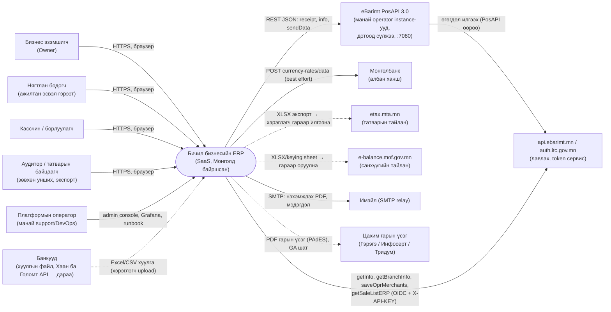
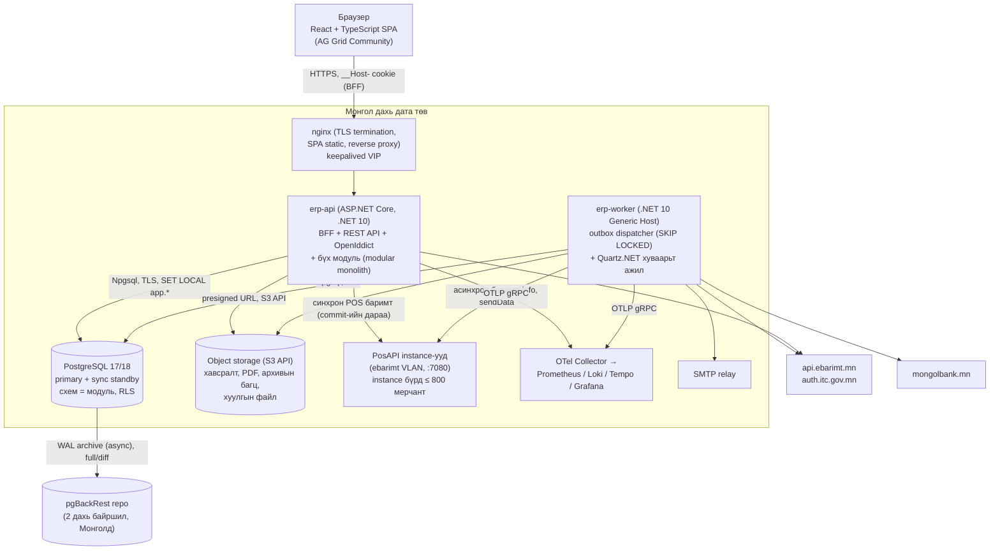
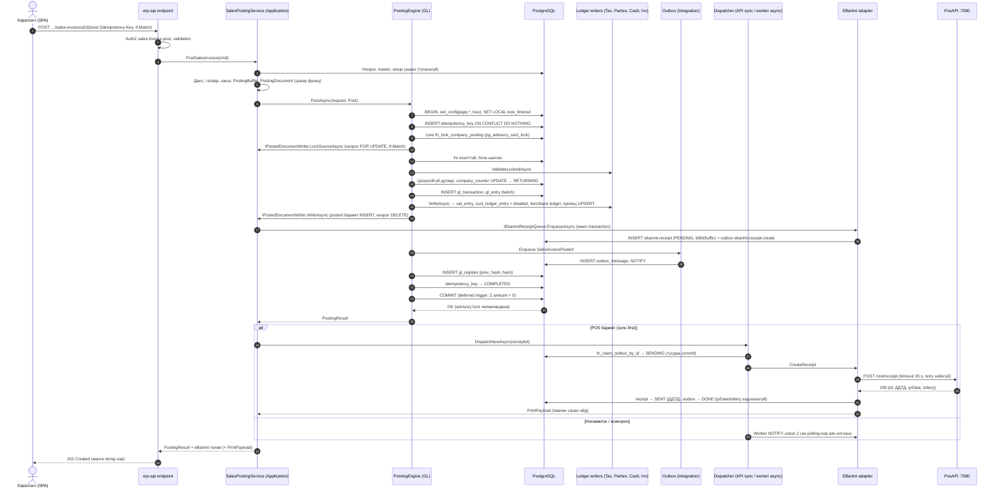
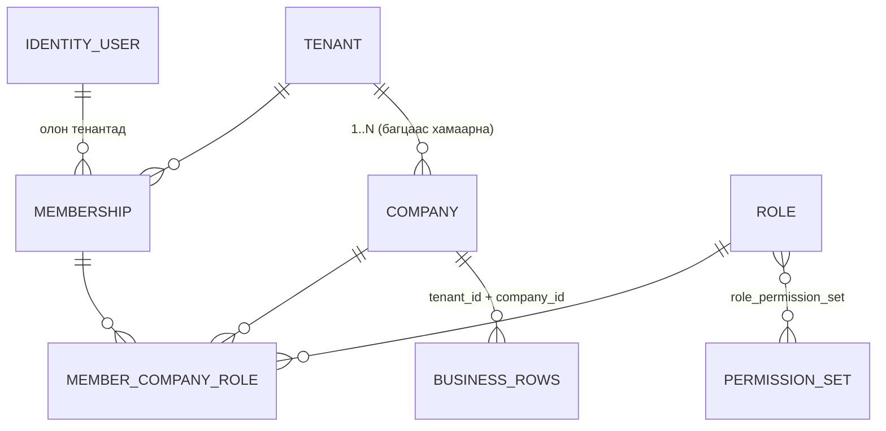
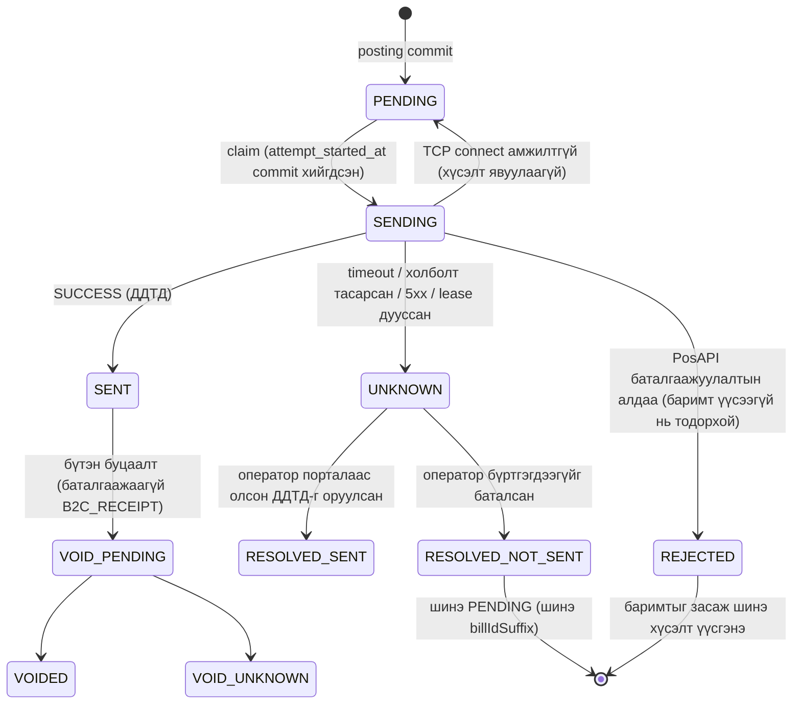
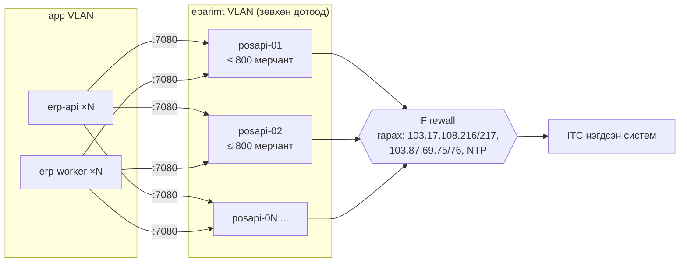
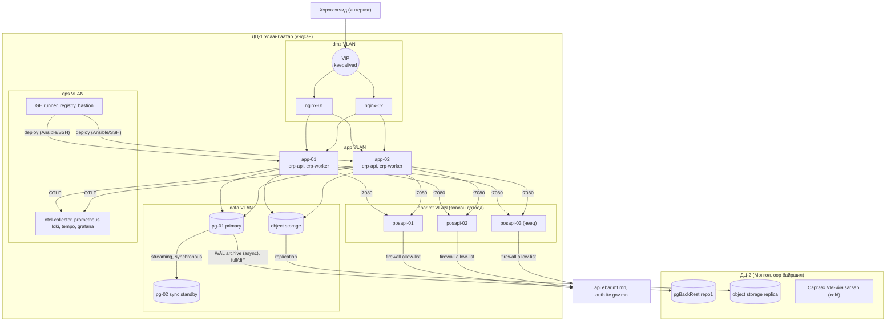

# Бичил бизнесийн ERP (Монгол) — Архитектурын тодорхойлолт

> **Төлөв:** Батлагдсан суурь, v1.0. Хөгжүүлэлт эхлэхэд бэлэн.
> **Огноо:** 2026-10-06
> **Хамрах хүрээ:** v1 (MVP → GA). Шийдвэр бүрийн үндэслэл [adr/](./adr/README.md) хавтаст байна.
> **Эх судалгаа:** [tech-architecture.md](./research/tech-architecture.md), [mn-integrations-market.md](./research/mn-integrations-market.md), [mn-accounting.md](./research/mn-accounting.md), [mn-tax.md](./research/mn-tax.md), [bc-gl-posting.md](./research/bc-gl-posting.md), [bc-dimensions-noseries-audit.md](./research/bc-dimensions-noseries-audit.md), [bc-account-determination.md](./research/bc-account-determination.md), [bc-sales-documents.md](./research/bc-sales-documents.md), [bc-subledgers-application.md](./research/bc-subledgers-application.md), [bc-vat.md](./research/bc-vat.md).

**Энэ баримт юуг тогтоох вэ.** Бид 1–10 ажилтантай Монголын бичил бизнест зориулсан, олон тенанттай (multi-tenant) SaaS ERP буюу нягтлан бодох бүртгэлийн систем бүтээнэ. Microsoft Dynamics 365 Business Central (BC)-ийн нягтлан бодох бүртгэлийн логик ба өгөгдлийн загварыг хялбарчилж, **шинээр хэрэгжүүлнэ**. Энэ нь BC extension биш ([ADR-0001](./adr/ADR-0001-standalone-product-reimplementing-bc.md)). Энэ баримт дараах зүйлсийг тогтооно:

- системийн бүтэц ба модулийн хил;
- posting-ийн гүйлгээний загвар;
- олон тенантын хамгаалалт;
- интеграци ба аюулгүй байдал;
- байршуулалт ба гүйцэтгэлийн зорилт.

Модуль тус бүрийн функциональ тодорхойлолт (`03-*.md`) энэ баримтыг дагаж бичигдэнэ.

**Уншигч:** backend ба frontend хөгжүүлэгч, DevOps, QA, нягтлан бодох бүртгэлийн шинжээч.

**Дүрэм.**
- **ЗААВАЛ** = хэрэгжээгүй бол release гаргахгүй.
- **ЁСТОЙ** = хазайх бол ADR бичнэ.
- Код, хүснэгт ба баганын нэр, API зам, сангийн нэр, BC объектын нэрийг англиар бичнэ.
- Нэр томьёоны тайлбар [Хавсралт А](#хавсралт-а-нэр-томьёо)-д бий.

---

## 1. Зорилго ба зарчим

### 1.1 Архитектурыг тодорхойлох бизнесийн зорилго

1. Бичил бизнес нэг системд дараах ажлаа хөтөлнө: нэхэмжлэх ба eBarimt баримт, касс ба банк, авлага ба өглөг, НӨАТ, санхүүгийн тайлан.
2. Систем Сангийн яамны **батлагдсан НББ-ийн программын жагсаалтад** орно (Art. 17.1.11, Order 47/2018). Энэ бол зах зээлд гарах хаалга ([ADR-0023](./adr/ADR-0023-compliance-gates.md)).
3. 4–6 инженертэй баг 1 000–5 000 тенантыг ажиллуулна. Нэг тенантын дэд бүтцийн зардал бага байна.
4. Хууль, журмын хүрээ:
   - НББ-ийн тухай хууль: бүртгэлийг 10 жил хадгалах, цахим анхан шатны баримтад цахим гарын үсэг зурах.
   - Хувь хүний мэдээлэл хамгаалах тухай хууль (2021).
   - eBarimt PosAPI 3.0-ийн журам: `qrData`/`lottery`-г хадгалахгүй, `POST /rest/receipt`-ийг автоматаар дахин илгээхгүй.
5. 2027-01-01-ний татварын өөрчлөлтийг **код өөрчлөхгүйгээр** параметрээр хэрэгжүүлнэ: босго 400 сая, хялбаршуулсан улирлын НӨАТ, ААНОАТ-ын шатлал.

### 1.2 Чанарын шинж (quality attributes)

Шинжүүдийг эрэмбээр жагсаав. Хоёр шинж зөрчилдвөл дээд эрэмбийнх нь давамгайлна.

| # | Шинж | Утга | Хэмжүүр (fitness function) | Гол тактик |
|---|---|---|---|---|
| 1 | **Зөв байдал** (correctness) | Батлагдсан (posted) гүйлгээ бүр тэнцсэн байна. Бүх дүн нэг бодлогоор бөөрөнхийлөгдөнө. Давхар бүртгэл гарахгүй. Хууль ёсны дугаар цоорхойгүй байна. | Golden scenario 100% давна. Property test: Σ дебит = Σ кредит, гүйлгээний баланс = 0. Concurrency test: дугаар цоорхойгүй. Тэнцээгүй гүйлгээ DB-д commit хийгдэх боломжгүй. | `decimal` + `numeric`. DB-ийн invariant (deferred constraint trigger). Нэг posting = нэг DB transaction. Advisory lock. Idempotency key. |
| 2 | **Аудитлах чадвар** (auditability) | Хэн, хэзээ, юуг, ямар баримтаар бүртгэснийг 10 жилийн турш нотолно. Залруулга зөвхөн буцаалтаар (reversal) хийгдэнэ. | Ledger хүснэгтэд UPDATE/DELETE хийх оролдлого 100% бүтэлгүйтнэ (тест). Hash chain-ийг шөнө бүр шалгана. Master/setup өөрчлөлт бүр аудитын логт бичигдэнэ. | Append-only ledger. `gl_register` + hash chain. `audit.row_change`. Source/reason code. |
| 3 | **Энгийн байдал** (simplicity) | Хөдөлгөөнт хэсэг цөөн: нэг API host, нэг worker, нэг PostgreSQL. | Шинэ хөгжүүлэгч local орчноо 1 цагт босгоно. Production-ий бизнесийн runtime ≤ 6 төрлийн container-тэй: nginx, `erp-api`, `erp-worker`, PostgreSQL, PosAPI, object storage. Observability ба ops хэрэгсэл (§11, §12.3) энэ тоонд орохгүй. | Modular monolith. PostgreSQL-ийг queue, lock, scheduler store-д давхар ашиглана. "Boring technology". |
| 4 | **Зардал** (cost) | Лицензийн төлбөргүй стек. Цорын ганц нөхцөлт үл хамаарах зүйл нь QuestPDF: жилийн орлого 1 сая ам.доллараас давбал төлбөртэй (§15). Тенант нэгд ногдох дэд бүтэц бага. | Ашигладаг сан бүр зөвшөөрөгдсөн лицензийн жагсаалтад багтана (CI шалгана). 5 000 тенантыг ≈ 25 VM-д багтаана (§12.4). | Permissive OSS. Shared schema. VM + Docker; v1-д Kubernetes хэрэглэхгүй. |

**Туслах шинжүүд:**
- аюулгүй байдал ба нууцлал: тенантын тусгаарлалт, хувь хүний мэдээлэл (PII);
- хүртээмж: сарын 99.5%;
- гүйцэтгэл: §13;
- өөрчлөгдөх чадвар: хуулийн өөрчлөлтийг огнооны хүчинтэй параметрээр (effective-dated parameters) хэрэгжүүлнэ ([ADR-0021](./adr/ADR-0021-effective-dated-parameters.md)).

### 1.3 Архитектурын зарчим

| Код | Зарчим | Практикт юу гэсэн үг вэ |
|---|---|---|
| P1 | **Нягтлан бодох бүртгэлийн зөв байдал бол бүтээгдэхүүн өөрөө** | Ledger-ийн invariant-ыг кодоор ба DB-ээр давхар хамгаална. Golden scenario-г нягтлан бодогч хянаж баталгаажуулна. |
| P2 | **Ledger-ийг зөвхөн posting engine бичнэ** | `gl.*`-ийн ledger хүснэгтэд зөвхөн `IPostingService` бичнэ. Дэд ledger (`parties`, `cash_bank`, `tax`, `fixed_assets`, `inventory`)-ийг эзэмшигч модуль нь бичнэ. Гэхдээ зөвхөн posting engine-ий нээсэн transaction дотор, `ILedgerWriter<T>`-ээр дамжуулж бичнэ (§6). |
| P3 | **Мөнгө = `decimal`/`numeric`. Хэзээ ч `float`/`double` биш** | Analyzer ба architecture test `double`, `float`, `MidpointRounding` заагаагүй `Math.Round`-ийг (default нь `ToEven`) domain ба persistence давхаргад хориглоно ([ADR-0006](./adr/ADR-0006-money-and-rounding.md)). |
| P4 | **Нэг posting = нэг DB transaction** | Шалгах, дугаар олгох, ledger бичих, outbox бичих үйлдлүүд нэг transaction-д нэг дор commit эсвэл rollback болно. Commit-оос өмнө гадаад систем рүү хандахгүй ([ADR-0009](./adr/ADR-0009-synchronous-posting-advisory-lock.md)). |
| P5 | **Гадаад үйлдэл бүр outbox-оор дамжина** | eBarimt, имэйл, банк руу хандахдаа posting transaction-д outbox мөр бичнэ. Илгээх ажлыг commit-ийн дараа dispatcher хийнэ ([ADR-0012](./adr/ADR-0012-outbox-idempotency-ebarimt.md)). |
| P6 | **DB бол хамгаалалтын сүүлчийн шугам** | RLS, `REVOKE`, guard trigger, constraint trigger, CHECK domain-ууд хэрэглээний алдааг ч гэсэн барина. |
| P7 | **Хуулийн утгыг кодонд бичихгүй** | Хувь хэмжээ, босго, хугацаа зэрэг утгыг `valid_during` бүхий хүснэгтэд хадгална. Тооцоолол бүр ашигласан параметрийн хувилбарыг тэмдэглэнэ. |
| P8 | **BC-ийн семантикийг хуулна, бүтцийг нь биш** | G/L Entry, Transaction No., G/L Register, Dimension Set ID, No. Series, Source Code, Detailed Ledger Entry-ийн утгыг хадгална. AL-ийн codeunit бүтэц, FlowField, `Commit`-ийн заль мэхийг хуулахгүй (§4.6). |
| P9 | **Монголд байршина** | PosAPI зөвхөн Монголын IP-ээс, дотоод сүлжээнд ажилладаг. Тиймээс бүх production өгөгдөл, нөөц хуулбар, лог Монголд байна ([ADR-0013](./adr/ADR-0013-hosting-in-mongolia-posapi-operator.md)). |
| P10 | **Уйтгартай технологи** (boring technology) | Шинэ дэд бүтэц нэмэх бол (queue, cache, search) эхлээд PostgreSQL-ээр шийдэж болохгүйг ADR-д нотолно. |
| P11 | **Монгол хэл эхэнд** | UI, хэвлэмэл маягт, алдааны мессеж эхлээд монголоор гарна, дараа нь англиар. i18n-ийг эхний өдрөөс хийнэ ([ADR-0017](./adr/ADR-0017-i18n-mongolian-first.md)). |
| P12 | **Нууц мэдээллийг хамгийн бага хэмжээгээр** | `qrData`, `lottery`-г хадгалахгүй. Хувь хүний регистрийн дугаарыг шифрлэнэ. Лог хүсэлтийн body-г бичихгүй. |

### 1.4 v1-ийн хамрах хүрээнээс гадуур (non-goals)

- **Функц:**
  - цалингийн тооцоолол (зөвхөн цалингийн журнал импортлоно);
  - үйлдвэрлэл;
  - олон агуулах ба WMS;
  - нэгтгэл (consolidation) ба компани хоорондын (IC) гүйлгээ;
  - нэмэлт тайлангийн валют (ACY);
  - мөнгөн суурьтай (cash-basis) НӨАТ;
  - төлбөрийн хөнгөлөлт ба зөрүүний хүлцэл (payment discount/tolerance);
  - захиалга ба ачилтын баримт (order, shipment);
  - төсөв, CRM.
- **Техник:**
  - microservices, event sourcing;
  - v1-д Kubernetes;
  - native mobile app (API нь бэлэн байна);
  - offline POS.

---

## 2. Системийн контекст (C4 түвшин 1)



Тасархай шугам нь гараар хийх эсвэл дараагийн шатны холболтыг заана.

| Гадаад систем | Чиглэл | Протокол / формат | Дамжих өгөгдөл | Хязгаарлалт | Шат |
|---|---|---|---|---|---|
| eBarimt PosAPI 3.0 | ERP → PosAPI | HTTP REST JSON, токенгүй, `:7080` | Борлуулалтын баримт, буцаалт, `info`, `sendData` | Дотоод сүлжээ, зөвхөн Монголын IP. Нэг instance-д ≤ 1 000 мерчант, ≤ 100 000 баримт/өдөр. `POST /rest/receipt`-ийг retry хийхгүй. | MVP |
| api.ebarimt.mn | ERP → ITC | HTTPS. Лавлах сервис токенгүй. TPI сервис OIDC password grant + `X-API-KEY`-тэй. | ТТД-ийн мэдээлэл, салбар/дүүргийн код, БҮНА, `taxProductCode`, мерчант бүртгэл, худалдан авалтын баримтын жагсаалт | Egress allow-list: 103.17.108.216/217, 103.87.69.75/76. `getSalesTotalData` зөвхөн 01:00–07:00 ажиллана. | MVP (лавлах, мерчант), GA (`getSaleListERP`) |
| Банкууд | Банк → ERP | Excel/CSV файл. Банк тус бүрд mapping тодорхойлолт. | Хуулгын мөр | Файлын формат UNVERIFIED, пилот харилцагчаас жишээ авна | MVP: файл. v2: Хаан, Голомт API |
| Монголбанк | ERP → Монголбанк | `POST https://www.mongolbank.mn/mn/currency-rates/data?startDate=…&endDate=…` | Өдрийн албан ханш (38 код) | Албан ёсны API байхгүй, reCAPTCHA-гийн эрсдэлтэй. Best-effort, гараар оруулах нөөц хувилбартай. | MVP |
| etax.mta.mn | ERP → хэрэглэгч → портал | XLSX (ТТ-03а болон хавсралтууд) | НӨАТ-ын тайлангийн өгөгдөл | ETAX API-ийн нээлттэй эсэх UNVERIFIED. `ITaxFilingChannel` интерфейсийн ард байрлуулна. | MVP: файл |
| e-balance.mof.gov.mn | ERP → хэрэглэгч → портал | XLSX + keying sheet (PDF) | Маягт А (СБТ, ОДТ, ӨӨТ, МГТ) | Импорт ба API UNVERIFIED | MVP: файл |
| SMTP relay | ERP → relay | SMTP + STARTTLS (MailKit) | Нэхэмжлэх PDF, урилга, сэрэмжлүүлэг | Relay Монголд байна. SPF/DKIM/DMARC тохируулна. | MVP |
| Цахим гарын үсэг | ERP ↔ провайдер | Провайдерын API / клиент (UNVERIFIED) | Баримтын hash, гарын үсэгтэй PDF | Монпасс 2025-05-22-оос дэмжигдэхээ больсон | GA ([ADR-0023](./adr/ADR-0023-compliance-gates.md)) |

---

## 3. Контейнерүүд (C4 түвшин 2)



| Контейнер | Технологи | Үүрэг | Төлөв (state) | Масштаблах арга |
|---|---|---|---|---|
| `web` (SPA) | React, TypeScript, Vite, AG Grid Community, i18next | UI. Мөнгийг string-ээр харуулна. Урьдчилсан нийлбэрийг `decimal.js`-ээр тооцож болно, гэхдээ эцсийн нийлбэрийг сервер гаргана. | Байхгүй | nginx-ээс static файлаар үйлчилнэ |
| `nginx` | nginx stable, keepalived | TLS 1.2/1.3, HSTS, SPA static, `/api`, `/bff`, `/connect`-ийг proxy хийнэ, rate limit | Байхгүй | 2 node, VIP |
| `erp-api` | ASP.NET Core 10, EF Core 10, Npgsql, Dapper, OpenIddict, Identity | Бүх модулийн HTTP endpoint, BFF, OIDC server, posting, синхрон POS dispatch | Байхгүй. Data Protection key-г DB-д хадгална. | Хэвтээ чиглэлд (≥ 2 instance) |
| `erp-worker` | .NET 10 Generic Host, `BackgroundService`, Quartz.NET (ADO job store) | Outbox dispatcher, eBarimt асинхрон баримт, `sendData`/`info` хяналт, Монголбанкны ханш, элэгдлийн run, архивын багц, тайлангийн async job, hash chain шалгалт | Байхгүй (lease ба Quartz cluster lock-ийг DB-д хадгална) | Хэвтээ чиглэлд (`SKIP LOCKED`, Quartz clustering) |
| `postgres` | PostgreSQL 17/18. DDL нь 16+-тай нийцнэ. | Бүх модулийн өгөгдөл, outbox, Quartz store, аудит | Төлөвтэй | Босоо чиглэлд. Sync standby. Дараа нь read replica (тайлан), hash partition. |
| `posapi-N` | ITC-ийн PosAPI 3.0 багц | Мерчантын баримтыг бүртгэх, нэгдсэн системд илгээх | Төлөвтэй (local DB) | Instance бүрд ≤ 800 мерчант (80% хязгаар) |
| `object-storage` | S3-тэй нийцтэй (провайдерын эсвэл SeaweedFS) | Хавсралт, үүсгэсэн PDF, жилийн архивын багц, хуулгын файл | Төлөвтэй | Провайдерын хэмжээгээр |
| `otel-stack` | OTel Collector, Prometheus, Loki, Tempo, Grafana | Метрик, лог, trace, alert | Төлөвтэй (лог 30 хоног, trace 7 хоног, метрик 13 сар) | 1 VM |

**Тусгайлсан шийдвэр.** API ба worker нэг solution, нэг image-ээс гарна. Зөвхөн эхлэх цэг нь ялгаатай: `Erp.Api`, `Erp.Worker`. Модуль бүр хоёр host-д хоёуланд нь бүртгэгдэнэ. Endpoint-ууд зөвхөн API host-д, job ба outbox handler-ууд зөвхөн worker-т идэвхжинэ. Цорын ганц үл хамаарах зүйл нь POS-ийн синхрон eBarimt dispatch: үүнийг API host commit-ийн дараа шууд хийнэ (§9.2). Ингэснээр нэг deploy артефакт гарна.

---

## 4. Модулиуд

### 4.1 Тойм

Модуль бүр PostgreSQL-д **өөрийн схемтэй** (schema). Хүснэгтийн бүтэн нэр нь `<schema>.<table>` хэлбэртэй. Бүх модульд нийтлэг SQL объект (domain, guard функц, helper, migration-ий журнал) `core` схемд байна. Улсын хэмжээний, тенантгүй лавлах хүснэгт `ref_` угтвартай (`tax.ref_legal_parameter`). Модуль бүр 5 project-тэй, тэдгээрийн нийтийн хэсэг нь `Erp.<M>.Contracts` (§5).

| Модуль | Схем | Товч үүрэг |
|---|---|---|
| Platform | `platform`, `identity`, `audit`, `ops` | Тенант, компани, хэрэглэгч, эрх, дугаарын цуврал, хавсралт, гарын үсэг, аудит, платформын ops view (PII-гүй) |
| Integration | `integration`, `quartz` | Outbox ба inbox, dispatcher, retry бодлого, Quartz store, имэйл |
| Currency | `currency` | Валют, Монголбанкны албан ханш, компанийн гараар оруулсан ханш |
| GeneralLedger | `gl` | Дансны төлөвлөгөө, үе, dimension, журнал, данс тодорхойлолт, **posting engine**, G/L ledger, буцаалт, жилийн хаалт, ханшийн дахин үнэлгээний run |
| Tax | `tax` | НӨАТ ба НХАТ-ын код, хуулийн параметр, компанийн татварын профайл, татвар тооцоолол, VAT entry, НӨАТ-ын тайлан ба хаалт, худалдан авалтын баримтын бүртгэл |
| EBarimt | `ebarimt` | PosAPI instance, мерчант бүртгэл, баримтын лог ба төлөвийн машин, лавлах кэш, хяналт |
| Parties | `parties` | Харилцагч ба нийлүүлэгч, тэдгээрийн posting group, төлбөрийн нөхцөл, авлага/өглөгийн ledger, тулгалт (application) |
| Inventory | `inventory` | Бараа, үйлчилгээ, нэгж, item ledger ба value entry, өртөг тооцоо, тооллого |
| FixedAssets | `fixed_assets` | Хөрөнгийн карт, нягтлан ба татварын 2 элэгдлийн дэвтэр, FA ledger |
| Cash&Bank | `cash_bank` | Касс, банкны данс, МХ-1/МХ-2, төлбөр, шилжүүлэг, bank ledger, хуулга импорт, тулгалт |
| Sales | `sales` | Борлуулалтын нэхэмжлэх, буцаалтын нэхэмжлэх (credit memo), POS борлуулалт, posted баримт, цуцлах ба засах (cancel/correct) |
| Purchases | `purchases` | Худалдан авалтын нэхэмжлэх ба credit memo, нийлүүлэгчийн баримтын дугаар, оролтын НӨАТ-ын нотолгоо |
| Reporting | `reporting` | Маягт А, гүйлгээ баланс, бүртгэлийн дэвтэр (Order 100), насжилт, НӨАТ ба e-balance экспорт, архивын багц |

### 4.2 Модулийн карт

Карт бүрт дараах зүйлс бий: **үүрэг**, **эзэмшдэг хүснэгтүүд**, **нийтийн интерфейс** (`*.Contracts` дахь C# интерфейс ба published SQL view), **нийтлэх ба хүлээн авах event**, **зөвшөөрөгдсөн хамаарал**. Event гэдэг нь outbox-оор дамжих integration event юм (§9.1). Бүх хамаарал **зөвхөн Contracts assembly руу** чиглэнэ.

#### 4.2.1 Platform (`platform`, `identity`, `audit`, `ops`)

- **Үүрэг:**
  - тенант ба компанийн амьдралын мөчлөг;
  - хэрэглэгч, нэвтрэлт (ASP.NET Core Identity + OpenIddict);
  - membership ба эрх (role, permission set);
  - дугаарын цуврал ба цоорхойгүй тоолуур;
  - хавсралтын мета өгөгдөл;
  - баримтын гарын үсгийн бүртгэл;
  - тенантын нууц (шифрлэсэн);
  - feature flag;
  - аудитын лог.
- **Хүснэгтүүд:**
  - `platform`: `tenant`, `company`, `company_setting`, `membership`, `role`, `permission_set`, `permission_set_item`, `role_permission_set`, `member_company_role`, `no_series`, `no_series_line`, `attachment`, `document_signature`, `tenant_secret`, `feature_flag`, `support_access_grant`, `data_protection_key`, `tenant_purge_log`;
  - `identity`: `user`, `user_login`, `user_token`, `user_session` (BFF-ийн сервер талын session/ticket store, §10.1), `oidc_application`, `oidc_authorization`, `oidc_scope`, `oidc_token`;
  - `audit`: `row_change` (сараар хуваасан), `security_event` (сараар хуваасан), `security_incident` (хувийн мэдээллийн зөрчлийн бүртгэл, §10.6);
  - `ops`: `consistency_issue` (шөнийн шалгалтын үр дүн, §8.8), `v_*` view (тенантын нийлбэр тоо, PII-гүй; `erp_ops_ro` уншина).
- **Нийтийн интерфейс:**
  - `ITenantContext`, `ICompanyContext`, `ICurrentUser`, `IBusinessCalendar` (Asia/Ulaanbaatar бизнесийн огноо) ба `ITransactionalSession` (Npgsql connection + transaction + контекст)-ийн **интерфейс** нь `Erp.BuildingBlocks.Application`-д байна. Platform нь тенант ба компанийн утгыг нийлүүлнэ. `ITransactionalSession`-ийг `TenantSession` (`Erp.BuildingBlocks.Infrastructure`) хэрэгжүүлнэ;
  - `IPermissionService`;
  - `INumberAllocator` (`AllocateAsync(seriesCode, date, ITransactionalSession)`, `PeekAsync`);
  - `IAttachmentStore`, `IAuditWriter`, `ISignatureService`, `ITenantSecretStore`;
  - `ICompanySeeder` (өргөтгөх цэг: модуль бүр шинэ компанийн анхны өгөгдлийг үүсгэнэ, §7.7).
- **Нийтлэх event:** `TenantProvisioned`, `CompanyCreated`, `CompanySettingsChanged`, `MembershipChanged`, `UserInvited`.
- **Хүлээн авах event:** байхгүй.
- **Хамаарал:** `Erp.BuildingBlocks.*` л.

#### 4.2.2 Integration (`integration`, `quartz`)

- **Үүрэг:**
  - transactional outbox ба inbox (consumer-ийн давхардлаас хамгаална);
  - API-ийн idempotency key-ийн сан;
  - dispatcher ба мессежийн төрөл тус бүрийн retry бодлого;
  - гадаад дуудлагын оролдлогын лог (body-гүй);
  - Quartz.NET-ийн ADO job store;
  - job-ийн гүйлтийн түүх;
  - имэйл илгээгч (MailKit, outbox-оор).
- **Хүснэгтүүд:**
  - `integration`: `outbox_message`, `inbox_message`, `idempotency_key`, `integration_attempt`, `job_run`;
  - `quartz`: `qrtz_*` (Quartz-ийн стандарт хүснэгтүүд).
- **Нийтийн интерфейс:**
  - `IOutbox.EnqueueAsync(OutboxMessageDraft, ITransactionalSession)`, `IIdempotencyStore`, `IIntegrationEventPublisher`. Эдгээрийн **интерфейс** нь `Erp.BuildingBlocks.Application`-д, хэрэгжүүлэлт нь `Erp.BuildingBlocks.Infrastructure`-д байна (§5.1). Шалтгаан: Platform мөн event нийтэлдэг, харин Platform → Integration хамаарал хориотой (§4.3). Хүснэгтийн DDL, dispatcher, retry бодлогыг Integration модуль эзэмшинэ;
  - `IMessageHandler<TMessage>` ба `RetryPolicy`-ийн бүртгэл;
  - `IJobScheduler`, `IEmailSender`;
  - `integration.fn_claim_outbox(...)` (SECURITY DEFINER функц, §7.6) ба `integration.fn_claim_outbox_by_id(tenant_id, company_id, id)`. Сүүлийнх нь POS-ийн синхрон dispatch-д (§9.2) `next_attempt_at`-ийг үл харгалзан, зөвхөн `PENDING` мөрийг `FOR UPDATE SKIP LOCKED`-ээр авна. Мөрийг аль хэдийн өөр процесс авсан бол 0 мөр буцаана.
- **Event:** нийтлэхгүй. Бусад модулийн event-ийг хүргэх тээвэрлэгч л болно.
- **Хамаарал:** Platform.

#### 4.2.3 Currency (`currency`)

- **Үүрэг:**
  - валютын лавлах ба нарийвчлал (`amount_precision`, `unit_amount_precision`);
  - Монголбанкны албан ханш (глобал);
  - компанийн гараар оруулсан ба импортолсон ханш;
  - огноогоор ханш хайх (тухайн өдөр эсвэл түүнээс өмнөх хамгийн сүүлийн ханш).
- **Хүснэгтүүд:**
  - `currency.ref_currency` (глобал лавлах);
  - `currency.ref_official_rate` (глобал, `tenant_id`-гүй, append-only);
  - `currency.company_rate` (тенант ба компани);
  - `currency.rate_fetch_log`.
- **Нийтийн интерфейс:**
  - `IExchangeRateProvider.GetRateAsync(companyId, currency, date) → RateQuote(rate, source, rateId)`;
  - `ICurrencyCatalog`.
- **Нийтлэх event:** `ExchangeRatesUpdated`.
- **Хүлээн авах event:** байхгүй.
- **Хамаарал:** Platform, Integration.

#### 4.2.4 GeneralLedger (`gl`)

- **Үүрэг:**
  - дансны төлөвлөгөө (`parent_id` мод, `is_posting`, Маягт А-ийн мөрийн код, МГТ-ийн ангилал, `direct_posting`);
  - санхүүгийн жил ба үе (OPEN / SOFT_LOCKED / CLOSED / HARD_LOCKED);
  - posting-ийн цонх;
  - dimension ба dimension set, default dimension ([ADR-0010](./adr/ADR-0010-dimension-sets.md));
  - ерөнхий журнал ба давтагдах журнал (SHOULD);
  - данс тодорхойлолт (`gen_business_group`, `gen_product_group`, `gen_posting_setup`);
  - **posting engine**;
  - `gl_transaction`, `gl_entry`, `gl_register`, буцаалтын холбоос;
  - компанийн тоолуур;
  - үеийн үлдэгдлийн проекц;
  - жилийн хаалт;
  - ханшийн дахин үнэлгээний run (contributor-уудаар).
- **Хүснэгтүүд:**
  - `gl_account`, `fiscal_year`, `accounting_period`;
  - `dimension`, `dimension_value`, `dimension_set`, `dimension_set_entry`, `default_dimension`;
  - `journal`, `journal_line`;
  - `gen_business_group`, `gen_product_group`, `gen_posting_setup`;
  - `gl_transaction`, `gl_entry`, `gl_register`, `gl_entry_reversal`, `company_counter`, `account_period_balance`, `reason_code`.
- **Нийтийн интерфейс:**
  - `IPostingService`;
  - `ILedgerWriter<TLine>`, `IPostedDocumentWriter` ба `ILedgerHashContributor` (өргөтгөх цэг, §4.5, §8.7);
  - `IAccountDetermination`;
  - `IDimensionSetService` (`GetOrCreateSetIdAsync`, `MergeAsync`), `IDefaultDimensionService`;
  - `IAccountingPeriodGuard`, `IReversalService`;
  - `IFxRevaluationContributor` (өргөтгөх цэг), `IChartOfAccounts`;
  - view: `gl.v_gl_entry`, `gl.v_trial_balance`, `gl.v_account_period_balance`.
- **Нийтлэх event:** `GlTransactionPosted`, `TransactionReversed`, `PeriodStatusChanged`, `FiscalYearClosed`.
- **Хүлээн авах event:** байхгүй. Шинэ компанийн анхны өгөгдлийг (дансны төлөвлөгөө, үе, тоолуур) `ICompanySeeder`-ээр provisioning transaction дотор үүсгэнэ (§7.7).
- **Хамаарал:** Platform, Integration, Currency.

#### 4.2.5 Tax (`tax`)

- **Үүрэг:**
  - татварын код (`tax_code`: NORMAL / REVERSE_CHARGE / FULL, хувь, данс, eBarimt `taxType`);
  - `party_vat_class` × `item_vat_class` → `tax_code` харгалзаа;
  - **огнооны хүчинтэй хуулийн параметр** (`ref_legal_parameter`, глобал, [ADR-0021](./adr/ADR-0021-effective-dated-parameters.md));
  - компанийн татварын профайл (НӨАТ-ын статус ба горим, НХАТ, ААНОАТ-ын горим, бүгд огноотой);
  - баримтын татвар тооцоолох цэвэр функц;
  - `vat_entry`-г бичих writer;
  - НӨАТ-ын үеийн хаалт (settlement) ба түгжээ;
  - ТТ-03а-ийн өгөгдөл;
  - худалдан авалтын eBarimt баримтын бүртгэл ба тулгалт;
  - босгын хяналт.
- **Хүснэгтүүд:** `tax_code`, `vat_posting_setup`, `ref_legal_parameter`, `company_tax_profile`, `vat_entry`, `vat_settlement`, `vat_period`, `purchase_receipt`, `threshold_snapshot`.
- **Нийтийн интерфейс:**
  - `ITaxCalculator.ComputeDocument(lines, pricesInclVat, ctx) → TaxResult` (цэвэр функц);
  - `ITaxCodeResolver`;
  - `ILegalParameterProvider.GetAsync(code, asOf) → (value, versionId)`;
  - `ICompanyTaxProfile`;
  - `ILedgerWriter<VatLedgerLine>`;
  - view: `tax.v_vat_entry`, `tax.v_vat_return_lines`.
- **Нийтлэх event:** `VatPeriodSettled`, `VatPeriodLocked`, `VatThresholdReached`.
- **Хүлээн авах event:** `PurchaseReceiptsImported` (EBarimt). Татварын код ба профайлын анхны өгөгдлийг `ICompanySeeder`-ээр үүсгэнэ.
- **Хамаарал:** Platform, Integration, Currency, GeneralLedger, EBarimt (Contracts).

#### 4.2.6 EBarimt (`ebarimt`) — anti-corruption layer

- **Үүрэг:**
  - PosAPI instance-ийн бүртгэл ба мерчантыг instance-д хуваарилах;
  - мерчант бүртгэх урсгал (`saveOprMerchants` → мерчант баталгаажуулна → `ACTIVE`);
  - салбар, касс ба `districtCode`;
  - `billIdSuffix` тоолуур;
  - баримтын лог ба төлөвийн машин;
  - засварын гинж (`inactiveId`);
  - UNKNOWN төлөвийг гараар шийдвэрлэх;
  - лавлах өгөгдлийн кэш (БҮНА, `taxProductCode`, салбар, ТТД);
  - `sendData` ба `info` хяналт;
  - `getSaleListERP` импорт.
- **Хүснэгтүүд:** `posapi_instance`, `merchant`, `pos_terminal`, `pos_counter`, `receipt`, `receipt_event`, `ref_classification`, `ref_tax_product_code`, `ref_branch`, `taxpayer_cache`, `posapi_health`.
- **Нийтийн интерфейс:**
  - `IEbarimtReceiptQueue.EnqueueAsync(ReceiptRequest, ITransactionalSession)`: posting transaction дотор `receipt` мөр (PENDING), `billIdSuffix` ба outbox мөрийг бичнэ;
  - `IEbarimtPrintDispatcher.DispatchNowAsync(receiptId) → PrintPayload` (санах ойд л байна);
  - `IEbarimtReceiptQuery`;
  - `IEbarimtReference` (`GetTaxpayerInfoAsync`, `GetBranchInfoAsync`, БҮНА хайлт).
- **Нийтлэх event:** `EbarimtReceiptRegistered`, `EbarimtReceiptRejected`, `EbarimtReceiptUnknown`, `EbarimtReceiptResolved`, `PurchaseReceiptsImported`, `MerchantActivated`, `PosApiHealthDegraded`.
- **Хүлээн авах event:** `CompanyCreated` (eBarimt-ийн тохиргооны wizard-ийг хэрэглэгчид санал болгоно).
- **Хамаарал:** Platform, Integration. Sales ба Tax-аас **хамаарахгүй**: баримтын canonical загварыг (`ReceiptRequest`) EBarimt.Contracts тодорхойлно, Sales түүнийг бөглөнө.

#### 4.2.7 Parties (`parties`)

- **Үүрэг:**
  - харилцагч ба нийлүүлэгч (ТТД ба регистрийн баталгаажуулалт, `getInfo` лавлах);
  - posting group (`customer_posting_group`, `vendor_posting_group`);
  - төлбөрийн нөхцөл;
  - **авлага/өглөгийн ledger** (BC-ийн Cust./Vendor Ledger Entry + Detailed): `cust_ledger_entry`, `detailed_cust_ledg_entry`, `vend_ledger_entry`, `detailed_vend_ledg_entry`;
  - нээлттэй үлдэгдлийн проекц (`cust_open_item`, `vend_open_item`);
  - тулгалт ба тулгалтыг буцаах (apply/unapply, LIFO);
  - насжилт.
- **Хүснэгтүүд:** `customer`, `vendor`, `contact`, `customer_bank_account`, `vendor_bank_account`, `consent` (§10.6), `customer_posting_group`, `vendor_posting_group`, `payment_terms`, `cust_ledger_entry`, `detailed_cust_ledg_entry`, `vend_ledger_entry`, `detailed_vend_ledg_entry`, `cust_open_item`, `vend_open_item`, `application_draft`.
- **Нийтийн интерфейс:**
  - `IPartyDirectory` (snapshot);
  - `IPartyLedgerQuery`, `IApplicationService`;
  - `ILedgerWriter<CustomerLedgerLine>`, `ILedgerWriter<VendorLedgerLine>`, `ILedgerWriter<ApplicationLine>`;
  - `IFxRevaluationContributor`;
  - view: `parties.v_customer_balance`, `parties.v_aging`.
- **Нийтлэх event:** `CustomerChanged`, `VendorChanged`, `EntriesApplied`, `EntriesUnapplied`.
- **Хүлээн авах event:** байхгүй. Posting group ба төлбөрийн нөхцөлийн анхны өгөгдлийг `ICompanySeeder`-ээр үүсгэнэ.
- **Хамаарал:** Platform, Integration, Currency, GeneralLedger, Tax, EBarimt (Contracts: ТТД лавлах).
- **Яагаад авлага/өглөгийн ledger энд байна вэ.** BC-д Cust. Ledger Entry нь Sales/Receivables-д байдаг. Гэвч манай системд Sales ба Purchases (баримт) ба Cash&Bank (төлбөр, тулгалт) гурвуулаа энэ ledger-т бичнэ. Ledger-ийг Sales-д байрлуулбал Sales → Cash&Bank ("одоо төлсөн") ба Cash&Bank → Sales (төлбөр тулгах) гэсэн мөчлөг үүснэ. Тиймээс ledger нь хоёулангийнх нь доор байгаа Parties-д байна ([ADR-0011](./adr/ADR-0011-modular-monolith.md)).

#### 4.2.8 Inventory (`inventory`) — хамгийн бага хувилбар

- **Үүрэг:**
  - бараа ба үйлчилгээ (`item_kind`: STOCK / SERVICE);
  - баркод, `classification_code` (7 орон, заавал), `tax_product_code`, хэмжих нэгж;
  - нэг байршил (v1);
  - `item_ledger_entry` ба `value_entry`;
  - өртгийн арга: хөдөлгөөнт дундаж (default) эсвэл FIFO, жилийн заагаар л солино;
  - тохируулга ба тооллого;
  - БМ маягтууд.
- **Хүснэгтүүд:** `item`, `unit_of_measure`, `item_ledger_entry`, `value_entry`, `item_cost_state`, `phys_count`, `phys_count_line`.
- **Нийтийн интерфейс:**
  - `IItemCatalog`;
  - `ICostCalculator` (posting transaction дотор, advisory lock-ийн дор);
  - `ILedgerWriter<ItemLedgerLine>`.
- **Нийтлэх event:** `ItemChanged`, `InventoryAdjusted`.
- **Хүлээн авах event:** байхгүй.
- **Хамаарал:** Platform, Integration, GeneralLedger, Tax, EBarimt (Contracts: БҮНА лавлах).

#### 4.2.9 FixedAssets (`fixed_assets`)

- **Үүрэг:**
  - хөрөнгийн карт ба анги;
  - **2 элэгдлийн дэвтэр**: нягтлан бодох бүртгэлийн (бодлогын хугацаа ба арга) ба татварын (хуулийн хугацаа, шулуун шугам);
  - олж авалт (худалдан авалтаас эсвэл гараар);
  - сарын элэгдлийн run;
  - данснаас хасалт;
  - `fa_ledger_entry`;
  - ҮХ-1/2/3 маягт.
- **Хүснэгтүүд:** `fixed_asset`, `fa_class`, `depreciation_book`, `fa_depreciation_book`, `fa_ledger_entry`, `depreciation_run`.
- **Нийтийн интерфейс:** `IFixedAssetQuery`, `ILedgerWriter<FaLedgerLine>`.
- **Нийтлэх event:** `DepreciationPosted`, `AssetDisposed`.
- **Хүлээн авах event:** байхгүй.
- **Хамаарал:** Platform, Integration, GeneralLedger, Tax (татварын хугацааны параметр).

#### 4.2.10 Cash&Bank (`cash_bank`)

- **Үүрэг:**
  - касс ба банкны данс (Монголын IBAN, 20 тэмдэгт, mod-97 шалгалт);
  - кассын орлого ба зарлагын баримт (МХ-1/МХ-2);
  - банкны орлого ба зарлага, шилжүүлэг;
  - `bank_ledger_entry`;
  - хуулга импорт (банк тус бүрийн mapping);
  - тулгалт;
  - төлбөрийг авлага/өглөгт тулгах (Parties-ээр дамжуулан);
  - ханшийн дахин үнэлгээний contributor.
- **Хүснэгтүүд:** `cash_desk`, `bank_account`, `payment_document`, `payment_line`, `bank_ledger_entry`, `bank_import_format`, `bank_statement`, `bank_statement_line`, `bank_reconciliation`.
- **Нийтийн интерфейс:**
  - `IBankAccountQuery`;
  - `ILedgerWriter<BankLedgerLine>`;
  - `IFxRevaluationContributor`;
  - view: `cash_bank.v_cash_book`, `cash_bank.v_bank_book`.
- **Нийтлэх event:** `PaymentPosted`, `BankStatementImported`, `BankReconciled`.
- **Хүлээн авах event:** байхгүй.
- **Хамаарал:** Platform, Integration, Currency, GeneralLedger, Tax, Parties.

#### 4.2.11 Sales (`sales`)

- **Үүрэг:**
  - борлуулалтын нэхэмжлэх ба credit memo-ийн ноорог;
  - posted нэхэмжлэх ба posted credit memo (өөрчлөгдөхгүй);
  - POS бэлэн борлуулалт (нэхэмжлэх + төлбөрийг нэг posting-д);
  - Cancel (бүрэн credit memo, тулгагдсан) ба Correct (Cancel + ноорог хуулбарлах);
  - НӨАТ-тай үнэ, нэхэмжлэхийн хөнгөлөлт, төлбөрийн нөхцөлийн snapshot;
  - posting баримт угсрах;
  - eBarimt-ийн `ReceiptRequest` угсрах;
  - ТМ-1 PDF.
- **Хүснэгтүүд:** `sales_header`, `sales_line` (ноорог); `posted_sales_invoice`, `posted_sales_invoice_line`, `posted_sales_cr_memo`, `posted_sales_cr_memo_line`, `cancelled_document`.
- **Нийтийн интерфейс:**
  - `ISalesDocumentQuery`;
  - `IPostedDocumentWriter`-ийн хэрэгжүүлэлт;
  - view: `sales.v_sales_journal` (Order 100-ийн борлуулалтын журнал).
- **Нийтлэх event:** `SalesInvoicePosted`, `SalesCreditMemoPosted`, `SalesInvoiceCancelled`.
- **Хүлээн авах event:** `EbarimtReceiptRegistered`, `EbarimtReceiptRejected`, `EbarimtReceiptUnknown` (UI мэдэгдэл ба баримтын төлөвийн badge гаргана).
- **Хамаарал:** Platform, Integration, Currency, GeneralLedger, Tax, EBarimt, Parties, Inventory, FixedAssets (хөрөнгө борлуулах мөр), Cash&Bank ("одоо төлсөн" төлбөр).

#### 4.2.12 Purchases (`purchases`)

- **Үүрэг:**
  - худалдан авалтын нэхэмжлэх ба credit memo;
  - нийлүүлэгчийн баримтын дугаар заавал байх ба давхардалгүй байх;
  - ДДТД-ийн холбоос ба оролтын НӨАТ хасагдах эсэх (шалтгааны кодтой);
  - хасагдахгүй НӨАТ-ыг зардал эсвэл хөрөнгөнд хуваарилах;
  - импортын гаалийн мэдүүлгийн талбарууд;
  - posted баримт.
- **Хүснэгтүүд:** `purchase_header`, `purchase_line`, `posted_purch_invoice`, `posted_purch_invoice_line`, `posted_purch_cr_memo`, `posted_purch_cr_memo_line`.
- **Нийтийн интерфейс:**
  - `IPurchaseDocumentQuery`;
  - view: `purchases.v_purchase_journal`.
- **Нийтлэх event:** `PurchaseInvoicePosted`, `PurchaseCreditMemoPosted`.
- **Хүлээн авах event:** байхгүй.
- **Хамаарал:** Platform, Integration, Currency, GeneralLedger, Tax, Parties, Inventory, FixedAssets, Cash&Bank.

#### 4.2.13 Reporting (`reporting`)

- **Үүрэг:**
  - Маягт А (СБТ, ОДТ, ӨӨТ, МГТ). Тайлангийн загварыг хувилбартай өгөгдлөөр хадгална;
  - гүйлгээ баланс, ерөнхий дэвтэр;
  - Order 100-ийн бүртгэлүүд;
  - насжилт;
  - ТТ-03а экспорт, e-balance keying sheet ба XLSX;
  - жилийн архивын багц;
  - тайлан илгээсний бүртгэл;
  - async тайлангийн job.
- **Хүснэгтүүд:** `statement_template`, `statement_template_line`, `account_line_mapping`, `report_job`, `filing_submission`, `archive_package`.
- **Нийтийн интерфейс:** `IReportCatalog`, `IFilingChannel` (`ITaxFilingChannel`, `IFinancialStatementChannel`; v1-д `ManualExportChannel`).
- **Нийтлэх event:** `ArchivePackageCreated`.
- **Хүлээн авах event:** `FiscalYearClosed` (архивын багц үүсгэх job-ийг товлоно).
- **Хамаарал:** бүх модулийн Contracts ба `<schema>.v_*` view (зөвхөн унших). **Reporting-оос хэн ч хамаарахгүй.**

### 4.3 Хамаарлын матриц

Мөр дэх модуль багана дахь модулийн **Contracts**-оос хамаарч болох эсэхийг заана. ✔ = зөвшөөрнө. — = хориглоно. ● = өөрөө. Матриц нь мөчлөггүй граф (DAG) үүсгэнэ.

| ↓ хамаарагч \ хамаарагдагч → | PLT | INT | FX | GL | TAX | EB | PTY | INV | FA | CB | SAL | PUR | RPT |
|---|---|---|---|---|---|---|---|---|---|---|---|---|---|
| **Platform (PLT)** | ● | — | — | — | — | — | — | — | — | — | — | — | — |
| **Integration (INT)** | ✔ | ● | — | — | — | — | — | — | — | — | — | — | — |
| **Currency (FX)** | ✔ | ✔ | ● | — | — | — | — | — | — | — | — | — | — |
| **GeneralLedger (GL)** | ✔ | ✔ | ✔ | ● | — | — | — | — | — | — | — | — | — |
| **EBarimt (EB)** | ✔ | ✔ | — | — | — | ● | — | — | — | — | — | — | — |
| **Tax (TAX)** | ✔ | ✔ | ✔ | ✔ | ● | ✔ | — | — | — | — | — | — | — |
| **Parties (PTY)** | ✔ | ✔ | ✔ | ✔ | ✔ | ✔ | ● | — | — | — | — | — | — |
| **Inventory (INV)** | ✔ | ✔ | — | ✔ | ✔ | ✔ | — | ● | — | — | — | — | — |
| **FixedAssets (FA)** | ✔ | ✔ | — | ✔ | ✔ | — | — | — | ● | — | — | — | — |
| **Cash&Bank (CB)** | ✔ | ✔ | ✔ | ✔ | ✔ | — | ✔ | — | — | ● | — | — | — |
| **Sales (SAL)** | ✔ | ✔ | ✔ | ✔ | ✔ | ✔ | ✔ | ✔ | ✔ | ✔ | ● | — | — |
| **Purchases (PUR)** | ✔ | ✔ | ✔ | ✔ | ✔ | — | ✔ | ✔ | ✔ | ✔ | — | ● | — |
| **Reporting (RPT)** | ✔ | ✔ | ✔ | ✔ | ✔ | ✔ | ✔ | ✔ | ✔ | ✔ | ✔ | ✔ | ● |

**Хамаарлын дүрэм ([ADR-0011](./adr/ADR-0011-modular-monolith.md)):**

1. Модуль өөр модулийн **дотоод** assembly-г reference хийхгүй. Зөвхөн `Erp.X.Contracts`-ийг reference хийнэ. Үүнийг `.csproj` reference ба ArchUnitNET тест хоёулаа шалгана.
2. Модуль өөр модулийн хүснэгтэд **SQL-ээр шууд хандахгүй**. Хоёр үл хамаарах зүйл бий:
   - Reporting бусад модулийн published view-ийг (`<schema>.v_*`) уншина;
   - матрицын зөвшөөрсөн чиглэлд FK үүсгэж болно (жишээ нь `sales.sales_header.customer_id → parties.customer`). Эсрэг чиглэлд FK үүсгэхгүй.
3. Доод модуль дээд модулийн логикийг дуудах шаардлагатай бол **хамаарлыг урвуулна** (dependency inversion). Доод модуль интерфейс тодорхойлж, дээд модуль хэрэгжүүлнэ. Жишээ: `ILedgerWriter<T>` ба `IFxRevaluationContributor`-ийг GL тодорхойлно, Parties ба Cash&Bank хэрэгжүүлнэ.
4. Транзакцийн гаднах урсгалыг **integration event** (outbox) холбоно. Нэг transaction доторх уялдааг **синхрон contract дуудлага** хангана.
5. Шинэ хамаарал нэмэх бол энэ матрицыг ба ADR-0011-ийг шинэчилнэ. CI нь `docs/architecture/dependencies.json`-ийг тестийн өгөгдлөөр уншина.

### 4.4 Модуль хоорондын харилцааны 3 хэлбэр

| Хэлбэр | Хэзээ | Transaction | Жишээ |
|---|---|---|---|
| Синхрон contract дуудлага (in-process) | Нэг use case дотор өгөгдөл ба тооцоо хэрэгтэй үед | Дуудагчийн transaction-ийг хуваалцана (`ITransactionalSession`) | Sales → `ITaxCalculator.ComputeDocument`, Sales → `IAccountDetermination` |
| Ledger writer (posting өргөтгөл) | Posting transaction-д өөрийн ledger-ийг бичих үед | Posting engine-ий transaction | Parties → `cust_ledger_entry`, Tax → `vat_entry` |
| Integration event (outbox → inbox) | Commit-ийн дараах үр дагавар, модуль хооронд эвдрэлийг тусгаарлах үед | Нийтлэгчийн transaction-д бичнэ. Хүлээн авагч шинэ transaction-д боловсруулна. | `PurchaseReceiptsImported` → Tax тулгалт; `FiscalYearClosed` → Reporting архив |

### 4.5 Posting-ийн өргөтгөх цэгүүд (GL.Contracts)

```csharp
// GL.Contracts — дэд ledger-ийн мөр бүр ямар G/L мөртэй холбогдохыг заана
public interface ISubledgerLine { LineKey GlLineKey { get; } }

public interface ILedgerWriter<in TLine> where TLine : ISubledgerLine
{
    // Advisory lock авсны дараа дуудна: нээлттэй үлдэгдэл, блок, давхардал гэх мэт өөрчлөгдөж болох төлөвийг дахин шалгана
    Task ValidateLockedAsync(IPostingContext ctx, IReadOnlyList<TLine> lines, CancellationToken ct);
    // Өөрийн схемийн ledger мөрүүдийг INSERT хийнэ. G/L entry-ийн id-г ctx.GlEntries-ээс авна
    Task WriteAsync(IPostingContext ctx, IReadOnlyList<TLine> lines, CancellationToken ct);
}

public interface IPostedDocumentWriter   // эх баримтын модуль (Sales, Purchases, Cash&Bank, ...) хэрэгжүүлнэ
{
    // Advisory lock-ийн дараа: өөрийн ноорогийг FOR UPDATE түгжиж, row_version = If-Match эсэхийг шалгана (412)
    Task LockSourceAsync(IPostingContext ctx, CancellationToken ct);
    // posted header/line-ийг бичиж, ноорогийг устгана. eBarimt шаардлагатай бол IEbarimtReceiptQueue.EnqueueAsync-ийг дуудна
    Task WriteAsync(IPostingContext ctx, CancellationToken ct);
}

public interface ILedgerHashContributor  // hash chain-д өөрийн ledger мөрийг оруулна (Tax: vat_entry), §8.7
{
    // Posting үед: санах ойн мөрөөс. Шөнийн шалгалтад: өөрийн хүснэгтээс register_id-аар уншина
    ReadOnlyMemory<byte> Canonicalize(IPostingContext ctx);
    Task<ReadOnlyMemory<byte>> CanonicalizeStoredAsync(ITransactionalSession s, Guid registerId, CancellationToken ct);
}

public interface IFxRevaluationContributor // GL-ийн дахин үнэлгээний run-д оролцоно
{
    Task<IReadOnlyList<RevaluationProposal>> ProposeAsync(ITransactionalSession s, DateOnly asOf, CancellationToken ct);
}
```

`ILedgerWriter<T>`-ийг DI-ээр `ILedgerWriterRegistry`-д мөрийн төрлөөр бүртгэнэ. GL нь Parties, Tax зэрэг модулийг мэдэхгүй. Зөвхөн `ISubledgerLine`-ийн төрлөөр тохирох writer-ийг олж дуудна. `IPostedDocumentWriter`-ийг дуудагч модуль (жишээ нь Sales) `PostingDocument.PostedDocument`-д өгнө. Ингэснээр GL нь `sales.*` ба `ebarimt.*` хүснэгтэд SQL-ээр хандахгүй (§4.3, дүрэм 2).

### 4.6 BC-ийн объект ба манай хэрэгжүүлэлтийн харгалзаа

| BC (W1, v29) | Манай хэрэгжүүлэлт | Тайлбар |
|---|---|---|
| Company | `platform.company` | Тенант дотор тусдаа дансны бүртгэл (set of books) ([ADR-0005](./adr/ADR-0005-tenant-vs-company.md)) |
| G/L Account (T15) | `gl.gl_account` | Begin/End-Total-ийн оронд `parent_id` ашиглана. `direct_posting` хадгална. |
| G/L Entry (T17) | `gl.gl_entry` (append-only) | `amount` нь тэмдэгтэй (+ дебит). `is_correction` = BC-ийн `Correction` (улаан сторно). |
| G/L Transaction (T57), Transaction No. | `gl.gl_transaction` + `transaction_no` | Тэнцсэн нэг ваучер = нэг transaction |
| G/L Register (T45) | `gl.gl_register` + hash chain | Нэг posting run = нэг register |
| Gen. Jnl.-Post Batch/Line (CU13/CU12) | `IPostingService` (`Erp.GeneralLedger.Infrastructure.Posting`) | Логикийг хуулна, бүтцийг нь хуулахгүй |
| Invoice Posting Buffer (T55) | `PostingBuffer` (санах ойд) | Түлхүүр: line kind, данс, posting group-ууд, `dimension_set_id` |
| Gen. Jnl.-Post Preview (CU19) | `PostingMode.Preview` (ижил код, ROLLBACK) | [ADR-0009](./adr/ADR-0009-synchronous-posting-advisory-lock.md) |
| Reversal (CU179/CU17) | `IReversalService` | Зөвхөн transaction-ий хүрээнд |
| Dimension Set Entry / Tree Node (T480/T481) | `gl.dimension_set` (UUIDv7 id, `key_hash` UNIQUE) + `gl.dimension_set_entry` | Модны оронд агуулгын hash түлхүүр. Хоосон багц = nil UUID ([ADR-0010](./adr/ADR-0010-dimension-sets.md)) |
| No. Series / Line (T308/T309) | `platform.no_series` / `no_series_line` | Prefix + өргөн + бүхэл тоо. Цоорхойгүй ([ADR-0008](./adr/ADR-0008-gapless-numbering.md)) |
| Source Code (T230) | `source_code` (хаалттай enum) | GENJNL, SALES, PURCHASE, CASH_RECEIPT, PAYMENT, BANK_REC, REVERSAL, FX_REVAL, VAT_SETTLEMENT, CLOSE_YEAR, OPENING, INVENTORY, DEPRECIATION |
| Reason Code (T231) | `gl.reason_code` | Credit memo ба буцаалтад заавал |
| Cust./Vendor Ledger Entry + Detailed (T21/T379, T25/T380) | `parties.cust_ledger_entry` + `parties.detailed_cust_ledg_entry` (ба vendor-ийн хувилбар) | Header нь append-only. Нээлттэй төлөвийг `cust_open_item` проекцод хадгална. |
| VAT Entry (T254) + G/L–VAT link (T253) | `tax.vat_entry` (`gl_entry_id` FK-тэй) | `rate` ба `tax_code`-ийг snapshot хийнэ |
| VAT Posting Setup (T325) | `tax.vat_posting_setup` → `tax.tax_code` | Огнооны хүчинтэй хувь |
| General Posting Setup (T252) | `gl.gen_posting_setup` | `('*', prod)` fallback-тэй |
| Accounting Period (T50) | `gl.accounting_period` | OPEN / SOFT_LOCKED / CLOSED / HARD_LOCKED |
| Permission Set (`D365 …`) | `platform.permission_set` (`ERP …`) | §10.2 |
| Change Log Entry (T405) | `audit.row_change` (trigger-ээр) | Master, setup ба ноорогт |

---

## 5. Давхаргын бүтэц

### 5.1 Solution-ийн бүтэц

Репозиторийн бүрэн бүтэц, нэршлийн дүрэм [18-dev-setup.md](./18-dev-setup.md) §2–§3-т, загвар файлууд [starter/](./starter/README.md)-д бий. Архитектурын түвшинд:

```text
src/
  Erp.Api/                     ASP.NET Core host: /api/v1, OpenIddict + BFF, SPA static, POS-ийн синхрон dispatch
  Erp.Worker/                  Host: outbox dispatcher, Quartz.NET job, /health
  Erp.Migrator/                SQL-first migration runner + seed loader (console)
  BuildingBlocks/
    Erp.BuildingBlocks.Domain/          Money, CurrencyCode, strongly-typed id (UUIDv7), Result/Error, DomainEvent
    Erp.BuildingBlocks.Application/     ICommandHandler/IQueryHandler, ITenantContext, IIdGenerator, IBusinessCalendar
    Erp.BuildingBlocks.Infrastructure/  NpgsqlDataSource, TenantSession (set_config), advisory lock, outbox writer, idempotency store, OTel
    Erp.BuildingBlocks.Api/             Endpoint convention, ProblemDetails, DecimalStringJsonConverter, Idempotency-Key filter
    Erp.BuildingBlocks.Documents/       QuestPDF-ийн нийтлэг компонент, фонт, үсгээр бичсэн дүн (mn)
    Erp.BuildingBlocks.Testing/         PostgresFixture (Testcontainers), test data builder, golden runner
  Modules/
    <Module>/                  Platform, Integration, Currency, GeneralLedger, Tax, EBarimt, Parties,
                               Inventory, FixedAssets, CashBank, Sales, Purchases, Reporting
      Contracts/Erp.<Module>.Contracts.csproj
      Domain/Erp.<Module>.Domain.csproj
      Application/Erp.<Module>.Application.csproj
      Infrastructure/Erp.<Module>.Infrastructure.csproj
      Api/Erp.<Module>.Api.csproj
db/
  migrations/                  V0001__core_schemas_roles_domains.sql …, R__<schema>__<object>.sql
  seed/
web/                           React SPA (Vite)
tests/
  Unit/ Architecture/ Integration/ Golden/ e2e/
```

Модуль бүр **5 project**-тэй: Contracts, Domain, Application, Infrastructure, Api. Давхаргын хилийг project reference compile-time-д, architecture test нэмэлтээр шалгана. Contracts-аас бусад project-ийн төрлүүд `internal` байна.

### 5.2 Модуль доторх давхарга

| Давхарга | Project | Агуулга | Хамаарч болох зүйл | Хориг |
|---|---|---|---|---|
| **Domain** | `Erp.<M>.Domain` | Aggregate, value object, domain service, invariant, domain event (in-memory) | `Erp.BuildingBlocks.Domain` | IO, EF, Npgsql, `HttpClient`, `DateTime.Now` (`TimeProvider`, `IBusinessCalendar` ашиглана), `double`/`float`, `MidpointRounding` заагаагүй `Math.Round` |
| **Application** | `Erp.<M>.Application` | Use case-ийн handler (command/query), порт (интерфейс), posting баримт угсрагч, зөвшөөрлийн шалгалт | Domain, өөрийн Contracts, бусад модулийн Contracts, `Erp.BuildingBlocks.Application` | EF `DbContext`-ийг шууд ашиглах (repository ба query портоор ажиллана), HTTP-ийн төрлүүд |
| **Infrastructure** | `Erp.<M>.Infrastructure` | EF `DbContext` (өөрийн схем), raw SQL (`Sql/*.sql` embedded resource), ledger writer, гадаад adapter, job, `Add<M>Module()` DI бүртгэл | Application, Domain, Npgsql, EF Core, бусад модулийн Contracts, `Erp.BuildingBlocks.Infrastructure` | Бусад модулийн хүснэгтэд хандах SQL |
| **Api** | `Erp.<M>.Api` | Minimal API endpoint (`Map<M>Endpoints()`), request/response DTO, .NET 10-ийн built-in validation (`AddValidation()`), OpenAPI мета | Application, Contracts, `Erp.BuildingBlocks.Api` | Infrastructure-аас хамаарах, Domain объектыг шууд гадагш гаргах |
| **Contracts** | `Erp.<M>.Contracts` | Нийтийн интерфейс, DTO, integration event, `ISubledgerLine`-ийн төрлүүд, permission нэр | `Erp.BuildingBlocks.Domain` | Хэрэгжүүлэлт |

### 5.3 CQRS-lite дүрэм

1. **Command** нь төлөв өөрчилнө. Нэг command = нэг handler = нэг DB transaction.
   - Aggregate-ийг EF Core-оор ачаалж хадгална, эсвэл posting engine-ийг дуудна.
   - Command нь зөвхөн id, хувилбар (version) ба дүгнэлтийн DTO буцаана.
2. **Query** нь төлөв өөрчлөхгүй.
   - Dapper/raw SQL эсвэл EF `AsNoTracking()` projection ашиглаж шууд DTO руу уншина.
   - Query handler command-ийг дуудахгүй, aggregate ачаалахгүй.
3. **Тусдаа унших DB байхгүй.**
   - Read model нь мөн DB дахь view эсвэл проекцын хүснэгт байна (`gl.account_period_balance`, `parties.cust_open_item`).
   - Нягтлан бодох бүртгэлийн проекцыг **posting transaction дотор синхроноор** шинэчилнэ. Үлдэгдлийн тоо хэзээ ч "eventually consistent" байхгүй.
4. **Олон query-тэй тайлан** `REPEATABLE READ READ ONLY` transaction-д ажиллана. Ингэснээр нэг snapshot-аас уншина.
5. **Command handler-ийн гинж (endpoint filter-ээр):** `Authorization → Validation (built-in AddValidation) → Idempotency → TenantSession (BEGIN + set_config) → Handler → Commit → Post-commit hooks (sync dispatch, NOTIFY)`. Бизнесийн invariant-ыг Domain шалгана.
6. MediatR хэрэглэхгүй (лицензийн түлхүүртэй болсон). Энгийн `ICommandHandler<TCommand,TResult>` ба `IQueryHandler<TQuery,TResult>` интерфейс ашиглаж, DI-д шууд бүртгэнэ.
7. **Алдааны загвар:**
   - Domain нь `Result<T>`/`DomainError(code, args)` буцаана. Exception хаяхгүй.
   - Api давхарга түүнийг RFC 9457 `application/problem+json` болгоно. Алдааны код тогтвортой байна, жишээ нь `gl.period_closed`, `sales.draft_version_mismatch`.
   - Мессежийг i18n түлхүүрээр монгол ба англиар гаргана.
8. **API-ийн хэлбэр:**
   - Зам: `/api/v1/companies/{companyId}/<resource>`.
   - Үйлдэл бүхий команд дэд resource хэлбэртэй: `POST …/sales-invoices/{id}/post`, `…/post-preview`, `…/cancel`.
   - Мөнгийг JSON string-ээр дамжуулна (`"12345.67"`). OpenAPI-д `type: string, format: decimal`.
   - Огноо `YYYY-MM-DD` хэлбэртэй.
   - Ноорогт `ETag`/`If-Match` ашиглана.
   - Хуудаслалт keyset хэлбэртэй (`?after=<cursor>&limit=50`).

### 5.4 Architecture test-ийн жагсаалт (CI-д заавал)

| Тест | Шалгах зүйл |
|---|---|
| `Modules_reference_only_contracts` | Модуль бүр бусад модулийн зөвхөн `*.Contracts` assembly-г reference хийнэ |
| `Dependency_matrix_matches` | Contracts-ийн reference §4.3-ийн матрицтай тохирно |
| `Domain_has_no_infrastructure` | Domain namespace нь EF, Npgsql, `System.Net.Http`-ээс хамаарахгүй |
| `No_floating_point_money` | `Domain`/`Infrastructure`-д `double`/`float` талбар, параметр алга. `Math.Round` зөвхөн `MoneyMath.Round` дотор байна (§8.3) |
| `Ledger_tables_written_by_engine_only` | `INSERT INTO gl.gl_entry` гэх мэт SQL зөвхөн GL.Infrastructure.Posting-д байна. Бусад ledger-ийн INSERT зөвхөн өөрийн `ILedgerWriter`-т байна |
| `No_update_delete_on_ledger_sql` | Ledger хүснэгтийн нэр бүхий `UPDATE`/`DELETE` SQL-ийг кодын санд хайхад олдохгүй |
| `Ebarimt_receipt_client_has_no_retry` | eBarimt receipt-ийн `HttpClient` бүртгэлд resilience/retry handler байхгүй |
| `No_sensitive_types_in_logs` | `PrintOnly<T>` төрлийг logger-ийн аргумент болгож дамжуулахгүй (Roslyn analyzer) |
| `Endpoints_require_permission` | Бүх endpoint-д `RequirePermission(...)` эсвэл тодорхой `AllowAnonymous` байна |
| `Commands_require_idempotency` | POST/PUT/PATCH/DELETE endpoint-ууд `Idempotency-Key`-ийг шаардана. Үл хамаарах endpoint-ыг кодонд нэрээр жагсаана (жишээ нь `…/post-preview`, `/connect/*`, `/bff/*`) |

---

## 6. Posting архитектур

### 6.1 Зарчим

- **Нэг engine.** Бүх баримт `IPostingService`-ээр дамжиж батлагдана:
  - борлуулалт, худалдан авалт, касс, банк, ерөнхий журнал;
  - элэгдэл, барааны тохируулга;
  - НӨАТ-ын хаалт, ханшийн дахин үнэлгээ, жилийн хаалт;
  - буцаалт.

  BC-д үүнтэй ижил үүргийг `Gen. Jnl.-Post Line` (CU12) гүйцэтгэдэг ([bc-gl-posting.md](./research/bc-gl-posting.md) §1).
- **Угсрах ба хадгалах алхмыг салгана.**
  - `PostingDocument`-ийг Application давхарга **цэвэр функцээр** угсарна: данс тодорхойлох, татвар тооцох, ханш хөрвүүлэх, buffer нэгтгэх.
  - Engine нь түгжээний дор төлөвийг дахин шалгаж, дугаар олгож, бичнэ.
- **Синхрон, нэг transaction, компани тус бүрд цуваа (serialized).** Компанийн posting түгжээ нь `pg_advisory_xact_lock`. Дэлгэрэнгүйг [ADR-0009](./adr/ADR-0009-synchronous-posting-advisory-lock.md)-с үзнэ үү.
- **Урьдчилан харах (preview) нь ижил код замаар явж, ROLLBACK хийнэ.** Тусдаа "simulate" код бичихгүй.
- **Түгжээний дор гадаад IO хийхгүй.** HTTP, файл, S3 руу хандахгүй. Түгжээ барих хугацааны зорилт: ≤ 50 мөртэй баримтад p95 ≤ 150 ms.

### 6.2 Posting request-ийн загвар

```csharp
public sealed record PostingDocument(
    PostingHeader Header,
    IReadOnlyList<GlPostingLine> GlLines,          // ≥ 2 мөр. LCY-ээр тэнцсэн, бөөрөнхийлөгдсөн байна
    IReadOnlyList<ISubledgerLine> SubledgerLines,  // VatLedgerLine, CustomerLedgerLine, BankLedgerLine, ...
    IPostedDocumentWriter? PostedDocument,         // posted header ба мөр. Ноорогийг устгана
    IReadOnlyList<OutboxMessageDraft> Outbox,      // eBarimt, integration event, имэйл
    IdempotencyContext? Idempotency);

public sealed record PostingHeader(
    SourceCode SourceCode,            // SALES, PURCHASE, GENJNL, CASH_RECEIPT, PAYMENT, REVERSAL, ...
    DocumentType DocumentType,        // INVOICE, CREDIT_MEMO, PAYMENT, JOURNAL, ...
    string NumberSeriesCode,          // цоорхойгүй хууль ёсны цуврал
    DateOnly PostingDate,
    DateOnly DocumentDate,
    bool IsClosing,                   // BC-ийн C-date-ийн оронд (жилийн хаалт)
    string Description,
    string? ReasonCode,
    SourceDocumentRef Source,         // ноорогийн id + хүлээгдэж буй row_version
    Guid? ReversesTransactionId);

public sealed record GlPostingLine(
    LineKey Key,                      // дэд ledger ба VAT мөрийг холбох түлхүүр
    GlAccountId Account,
    decimal AmountLcy,                // + дебит / − кредит, 0.01 хүртэл бөөрөнхийлсөн
    CurrencyCode? Currency, decimal? AmountFcy, decimal? FxRate,
    DimensionSetId DimensionSetId,    // nil UUID = хоосон багц (BC-ийн 0)
    bool IsCorrection,                // улаан сторно (буцаалт)
    bool SystemCreated,
    string? Description);

public interface IPostingService
{
    Task<PostingResult> PostAsync(PostingDocument request, PostingMode mode, CancellationToken ct);
}
public enum PostingMode { Post, Preview }
```

Engine-д хүрэхээс өмнө Application давхарга дараах **урьдчилсан шалгалтыг** хийнэ. Энэ шалгалт түгжээгүй, хямд, бүх алдааг цуглуулж нэг дор буцаана.

1. Σ `AmountLcy` = 0 байна. Тэнцлийг **зөвхөн LCY-ээр** шалгана (BC-тэй адил). `AmountFcy` нь мэдээллийн талбар: олон валюттай ваучер (жишээ нь MNT дансаар USD нэхэмжлэх төлөх) ба ханшийн зөрүүний мөр FCY-ээр тэнцэхгүй байх нь хэвийн.
2. Бүх дүн бөөрөнхийлөгдсөн байна.
3. Данс бүр `is_posting = true`, блоклогдоогүй байна. `direct_posting`-ийн дүрэм биелнэ (R-GL-POSTING-07).
4. Dimension-ий value posting дүрэм биелнэ. Энэ нь гарал үүслийн дансанд ч хамаарна (R-DIMENSIONS-NOSERIES-AUDIT-13/19/20).
5. VAT-тай ваучерт нэгээс олон харилцагч байхгүй (R-GL-POSTING-24).

### 6.3 Алхмууд

**A үе — transaction-гүй, түгжээгүй (Application давхарга)**

1. Ноорог, master өгөгдөл ба тохиргоог уншина. Эндээс ноорогийн `row_version`-ийг авна.
2. Domain-ий шалгалтыг хийнэ: заавал талбар, мөр байгаа эсэх, анхан шатны баримтын шаардлага (REQ-ACC-07).
3. `IAccountDetermination` нь мөр бүрийн дансыг олно. `ITaxCalculator` нь баримтын татварыг бүлгээр тооцоолж, мөрт хуваарилна. `IExchangeRateProvider` нь posting огнооны ханшийг өгнө.
4. `PostingBuffer`-аар мөрүүдийг нэгтгэнэ. Түлхүүр нь (line kind, данс, gen/VAT group-ууд, `dimension_set_id`) байна.
5. `PostingDocument` угсарна. Урьдчилсан шалгалт (§6.2) хийнэ. Алдаа гарвал **422** буцааж, бүх алдааг жагсаана.

**B үе — нэг DB transaction (`IPostingService`, READ COMMITTED)**

1. `BEGIN`. Контекстыг `set_config('app.tenant_id'|'app.company_id'|'app.user_id'|'app.request_id', …, true)`-ээр тохируулна. `SET LOCAL lock_timeout = '5s'`, `SET LOCAL statement_timeout = '30s'`.
2. **Idempotency.**
   - `INSERT … integration.idempotency_key … ON CONFLICT DO NOTHING` ажиллуулна.
   - Ижил түлхүүртэй өөр хүсэлт уг мөрийг бичиж байгаа бол PostgreSQL түүний transaction дуусахыг хүлээнэ. Дараа нь хадгалсан хариуг буцаана (§8.5).
3. **Компанийн posting түгжээ:** `SELECT core.fn_lock_company_posting(tenant_id, company_id)`. Функц дотроо `pg_advisory_xact_lock(hashtextextended('post:' || tenant_id || ':' || company_id, 0))` дуудна.
4. **Түгжээний дор дахин шалгана.**
   - `IPostedDocumentWriter.LockSourceAsync`: эх модуль өөрийн ноорогийг `FOR UPDATE` уншиж, `row_version` = `If-Match` эсэхийг шалгана.
   - Үе ба posting-ийн цонх нээлттэй эсэхийг шалгана.
   - Данс, dimension value, харилцагч блоклогдоогүй эсэхийг шалгана.
   - Дугаарын цувралын мөр нээлттэй эсэхийг шалгана.
   - `ILedgerWriter.ValidateLockedAsync` дуудна. Жишээ нь тулгах entry нээлттэй хэвээр байгаа, үлдэгдэл хүрэлцэх эсэхийг шалгана.
5. **Дугаар олгоно** (§6.6):
   - хууль ёсны баримтын дугаар;
   - `transaction_no`, `register_no`;
   - `entry_no`-гийн муж (`gl.company_counter`).
6. `gl.gl_transaction`, дараа нь `gl.gl_entry`-г `NpgsqlBatch`-аар INSERT хийнэ.
7. **Ledger writer-ууд** мөрийн төрлөөр ажиллана: `tax.vat_entry`, `parties.*_ledger_entry` + detailed, `cash_bank.bank_ledger_entry`, `inventory.item_ledger_entry` + `value_entry`, `fixed_assets.fa_ledger_entry`.
8. `IPostedDocumentWriter.WriteAsync` (эх модуль) posted баримтыг INSERT хийж, ноорогийг DELETE хийнэ. Проекц бүрийг **эзэмшигч модуль нь** UPSERT хийнэ: `gl.account_period_balance`-ийг engine, `parties.cust_open_item`-ийг Parties-ийн writer, `inventory.item_cost_state`-ийг Inventory-ийн writer.
9. **Outbox.**
   - eBarimt шаардлагатай баримтад Sales-ийн `IPostedDocumentWriter` нь `IEbarimtReceiptQueue.EnqueueAsync`-ийг дуудна. EBarimt модуль `billIdSuffix` олгож, `ebarimt.receipt`-д PENDING мөр ба `ebarimt.receipt.create` outbox мөрийг бичнэ.
   - Engine `PostingDocument.Outbox`-ийн мөрүүдийг (`SalesInvoicePosted` гэх мэт integration event, имэйл) `integration.outbox_message`-д бичнэ.
   - `NOTIFY outbox` дуудна. Мэдэгдэл commit хийгдсэний дараа л хүрнэ.
10. `gl.gl_register`-ийг INSERT хийнэ: entry-ийн муж, source code, хэрэглэгч, `prev_hash`, `hash` (§8.7). Hash бүх мөрөөс тооцогддог тул register-ийг төгсгөлд бичнэ. `gl_transaction.register_id → gl_register` FK нь `DEFERRABLE INITIALLY DEFERRED` байна.
11. `integration.idempotency_key`-ийг COMPLETED болгож, хариуг хадгална.
12. Горимоос хамаарна:
    - **Post:** `COMMIT`. Энэ үед deferred constraint trigger-ууд ажиллана (§8.2). Advisory lock автоматаар чөлөөлөгдөнө.
    - **Preview:** `SET CONSTRAINTS ALL IMMEDIATE` ажиллуулж deferred trigger-уудыг (§8.2) одоо гүйцэтгэнэ. Ингэснээр preview нь DB-ийн invariant-ыг ч шалгана. Дараа нь `PostingResult`-ийг санах ойд угсарч, `ROLLBACK` хийнэ.

**C үе — commit-ийн дараа (зөвхөн Post горимд)**

1. Баримт POS (sync-first) бол `IEbarimtPrintDispatcher.DispatchNowAsync(receiptId)` дуудна (§9.2).
2. **201** буцаана. Хариунд дараах зүйлс багтана:
   - posted баримтын дугаар;
   - entry-ийн хураангуй;
   - eBarimt-ийн төлөв;
   - POS бол `PrintPayload` (`qrData`/`lottery` нь зөвхөн энэ HTTP хариунд байна, хаана ч хадгалахгүй).

### 6.4 Дарааллын диаграмм



### 6.5 Transaction-ий SQL араг

```sql
BEGIN;                                                    -- READ COMMITTED
SELECT set_config('app.tenant_id',  $1, true), set_config('app.company_id', $2, true),
       set_config('app.user_id',    $3, true), set_config('app.request_id', $4, true);
SET LOCAL lock_timeout = '5s';
SET LOCAL statement_timeout = '30s';

INSERT INTO integration.idempotency_key (tenant_id, key, user_id, request_hash, status, created_at, expires_at)
VALUES ($1, $5, $3, $6, 'IN_PROGRESS', now(), now() + interval '7 days')
ON CONFLICT (tenant_id, key) DO NOTHING;                  -- 0 мөр → хадгалсан хариу эсвэл 409/422

SELECT core.fn_lock_company_posting($1::uuid, $2::uuid);

-- IPostedDocumentWriter.LockSourceAsync (Sales-ийн SQL; GL энэ хүснэгтэд хандахгүй)
SELECT xmin FROM sales.sales_header
 WHERE tenant_id = $1 AND company_id = $2 AND id = $7 FOR UPDATE;   -- If-Match-тэй харьцуулна

-- Цоорхойгүй дугаар (INumberAllocator, Platform)
SELECT id, last_no, start_no, end_no FROM platform.no_series_line
 WHERE tenant_id = $1 AND company_id = $2 AND series_id = $8 AND starting_date <= $9 AND is_open
 ORDER BY starting_date DESC, line_no LIMIT 1
 FOR UPDATE;
UPDATE platform.no_series_line SET last_no = $10, last_date_used = $9, is_open = $11
 WHERE tenant_id = $1 AND company_id = $2 AND id = $12;

UPDATE gl.company_counter
   SET last_transaction_no = last_transaction_no + 1,
       last_entry_no       = last_entry_no + $13,          -- энэ posting-ийн G/L entry-ийн тоо
       last_register_no    = last_register_no + 1
 WHERE tenant_id = $1 AND company_id = $2
RETURNING last_transaction_no, last_entry_no, last_register_no;

INSERT INTO gl.gl_transaction (...) VALUES (...);
INSERT INTO gl.gl_entry (...) VALUES (...), (...);         -- NpgsqlBatch
-- ledger writers (эзэмшигч модуль бүр) → tax.vat_entry, parties.*, cash_bank.*, inventory.*, fixed_assets.* + проекц UPSERT
-- IPostedDocumentWriter.WriteAsync (Sales) → posted баримт, DELETE ноорог, IEbarimtReceiptQueue → ebarimt.receipt
-- engine → integration.outbox_message
SELECT pg_notify('outbox', '');
INSERT INTO gl.gl_register (...) VALUES (...);
UPDATE integration.idempotency_key SET status = 'COMPLETED', response_code = 201, response_body = $14
 WHERE tenant_id = $1 AND key = $5;
COMMIT;                                                    -- Preview: SET CONSTRAINTS ALL IMMEDIATE; ROLLBACK;
```

```sql
CREATE FUNCTION core.fn_lock_company_posting(p_tenant uuid, p_company uuid) RETURNS void
LANGUAGE sql AS
$$ SELECT pg_advisory_xact_lock(hashtextextended('post:' || p_tenant::text || ':' || p_company::text, 0)) $$;
```

Hash давхцах (collision) нь хоёр компанийг хооронд нь хүлээлгэх л үр дагавартай. Буруу үр дүн гаргахгүй.

### 6.6 Posting доторх дугаарлалт

| Дугаар | Хүрээ | Цоорхой | Хаана олгоно |
|---|---|---|---|
| Хууль ёсны баримтын дугаар: posted нэхэмжлэх, credit memo, МХ-1/МХ-2, ерөнхий журналын ваучер, банкны ваучер, БМ/ҮХ баримт | компани × цуврал × огнооны мөр (жил бүрийн prefix, жишээ нь `БН26-00042`) | **Цоорхойгүй** | Posting transaction, advisory lock-ийн дор ([ADR-0008](./adr/ADR-0008-gapless-numbering.md)) |
| `transaction_no`, `entry_no`, `register_no` | компани | Цоорхойгүй (дагалдах үр дүн). Цоорхой гарвал хөндлөнгийн оролцооны шинж гэж үзнэ | Posting transaction (`gl.company_counter`) |
| Ноорогийн дугаар (`draft_no`) | компани × баримтын төрөл | Цоорхой гарч болно | Ноорог үүсгэхэд, тусдаа counter-оор |
| `billIdSuffix` | мерчант × касс | Өдөр бүр давхардахгүй | Posting transaction (`ebarimt.pos_counter`), §9.2 |
| Техникийн `id` | глобал | — | Application: `Guid.CreateVersion7()`. DB-ийн default нь `core.fn_uuid_v7()` |

### 6.7 Урьдчилан харах (preview)

- Endpoint: `POST …/{doc}/{id}/post-preview`. Энэ нь A ба B үеийг **бүтнээр** гүйцэтгэнэ: дугаар олгох, ledger writer, outbox, register бүгд ажиллана. Төгсгөлд нь `ROLLBACK` хийнэ. BC мөн "Preview mode." алдаа шидэж rollback хийдэг ([bc-gl-posting.md](./research/bc-gl-posting.md) R-GL-POSTING-42).
- Хариуд дугаарыг `***` гэж нуун харуулна. Entry-ийн дугаарыг 1..n харьцангуй дугаараар харуулна.
- ROLLBACK-ийн өмнө `SET CONSTRAINTS ALL IMMEDIATE` хийж deferred trigger-уудыг (тэнцэл, register FK) гүйцэтгэнэ. Иймд тэнцээгүй ваучер preview-д ч алдаа өгнө.
- Rollback болсон тул тоолуурын өөрчлөлт буцаад цоорхой үүсэхгүй. C үе ажиллахгүй, гадаад дуудлага хийхгүй. `Idempotency-Key` шаардахгүй.
- Preview-ийн transaction-д үүссэн id (жишээ нь шинэ dimension set) rollback-аар арилна. Тиймээс тэдгээрийг санах ойн кэшид оруулахгүй ([ADR-0010](./adr/ADR-0010-dimension-sets.md)).
- Preview нь advisory lock авдаг. Тиймээс хэрэглэгч бүрд минутад ≤ 30 удаа гэж хязгаарлана.
- **Golden test:** сценари бүрт "preview-ийн entry-үүд = post-ийн entry-үүд" байна (дугаараас бусад нь).

### 6.8 Буцаалт ба залруулга

| Эх баримт | Залруулах арга | Нөхцөл |
|---|---|---|
| Ерөнхий журналын ваучер, тулгагдаагүй касс/банкны ваучер | `IReversalService.ReverseTransaction(transactionId, reasonCode)`: шинэ transaction ба register үүсгэж, толин тусгал entry бичнэ (`is_correction = true`, улаан сторно). VAT ба дэд ledger-ийг мөн толин тусгалаар бичнэ. `gl_entry_reversal`-д холбоос нэмнэ. | BC-ийн R-GL-POSTING-39/40: өмнө нь буцаагдаагүй, тулгагдаагүй, VAT хаагдаагүй байна |
| Posted борлуулалт/худалдан авалтын нэхэмжлэх | **Cancel**: эх нэхэмжлэхийн дүнгээр бүрэн credit memo үүсгэж тулгана. `sales.cancelled_document`-д холбоос бичнэ. **Correct** = Cancel + ноорог хуулах. eBarimt: баталгаажаагүй B2C_RECEIPT бол `DELETE /rest/receipt`, бусад тохиолдолд `inactiveId` = гинжний сүүлийн ДДТД. | Төлөгдөөгүй, өмнө нь цуцлагдаагүй, үе нээлттэй ([bc-sales-documents.md](./research/bc-sales-documents.md) F6) |
| Тулгагдсан төлбөр | Эхлээд unapply (LIFO, detailed мөрийн толин тусгал), дараа нь reverse | [bc-subledgers-application.md](./research/bc-subledgers-application.md) §4.3 |
| НӨАТ-ын хаалт | Reverse | НӨАТ-ын үе түгжигдээгүй байна |
| Элэгдлийн run, ханшийн дахин үнэлгээ | Run-ийн transaction-ийг reverse | Дараагийн run хийгдээгүй, үе нээлттэй байна |
| Жилийн хаалт (`is_closing`) | Reverse | Санхүүгийн жил HARD_LOCKED биш байна |

- **Буцаалтын огноо.**
  - Эх үе OPEN бол эх `posting_date`-ээр буцаана. SOFT_LOCKED бол `gl.period.post_soft_locked` эрхтэй хэрэглэгч эх огноогоор буцааж болно.
  - Эх үе хаагдсан бол хэрэглэгч нээлттэй цонхноос огноо сонгоно. `reverses_transaction_id` ба шалтгааны код заавал байна. Энэ нь Монголын "тухайн үед залруулах" практикт нийцнэ.
- **Харуулалт.** Буцаалт нь улаан сторно байдлаар бичигдэнэ: тэмдэг эсрэг, багана ижил. Credit memo нь энгийн эсрэг бичилт байна. Тайлан хоёуланг нь `is_correction`-аар ялгаж харуулна.

### 6.9 Үе хаах ба түгжээний харилцаа

- Үеийн төлөв: `OPEN → SOFT_LOCKED → CLOSED → HARD_LOCKED`.
  - SOFT_LOCKED үед зөвхөн `gl.period.post_soft_locked` эрхтэй хэрэглэгч бичилт хийнэ.
  - CLOSED үеийг ерөнхий нягтлан шалтгаан бичиж дахин нээж болно. Энэ үйлдэл аудитын логт бичигдэнэ.
  - HARD_LOCKED нь буцаагдахгүй.
- **HARD_LOCKED тавигдах үе:**
  - НӨАТ-ын үе: ТТ-03а "илгээсэн" гэж тэмдэглэхэд;
  - санхүүгийн жил: e-balance илгээсэн нотолгоог хадгалахад.
- **Ижил advisory lock авдаг үйлдлүүд:** үе хаах, жилийн хаалт, НӨАТ-ын хаалт, ханшийн дахин үнэлгээ, элэгдлийн run, барааны өртгийн дахин тооцоо. Эдгээр нь posting-той давхцаж ажиллахгүй.
- **DB-ийн хамгаалалт:** `gl.gl_transaction` дээрх `BEFORE INSERT` trigger нь `CLOSED` ба `HARD_LOCKED` үед бичилтийг хориглоно (§8.2).

### 6.10 Алдааны горим

| Нөхцөл | Үр дүн | Хэрэглэгчид | Систем |
|---|---|---|---|
| Урьдчилсан шалгалтын алдаа | Transaction эхлэхгүй | 422, бүх алдааны жагсаалт | — |
| `If-Match` таарахгүй, эсвэл ноорог өөрчлөгдсөн | ROLLBACK | 412 `sales.draft_version_mismatch` | — |
| `lock_timeout` (5 s) | ROLLBACK | 503 + `Retry-After: 2`. Клиент **ижил** `Idempotency-Key`-ээр дахин илгээнэ | `erp_posting_lock_timeouts_total` |
| Үе хаагдсан (trigger-ийн `ERP01`) | ROLLBACK | 422 `gl.period_closed` | — |
| Тэнцээгүй transaction (trigger-ийн `ERB01`) | Commit бүтэлгүйтнэ | 500 | **P1 alert**: энэ бол код дахь алдаа |
| Commit-ийн үеэр холболт тасарсан (үр дүн тодорхойгүй) | Commit болсон эсвэл болоогүй | Клиент ижил түлхүүрээр дахин илгээнэ. Commit болсон бол хадгалсан хариуг авна, болоогүй бол дахин гүйцэтгэнэ | — |
| eBarimt алдаа эсвэл timeout | Posting **commit хэвээр** үлдэнэ | Баримт "eBarimt: хүлээгдэж байна/тодорхойгүй/татгалзсан" badge-тэй харагдана | §9.2 |
| DB failover | Нээлттэй transaction rollback болно | 503 → ижил түлхүүрээр дахин илгээнэ | — |

---

## 7. Олон тенант (multi-tenancy)

### 7.1 Загвар



- **Тенант (tenant)** нь SaaS-ийн захиалагч данс: гэрээ, төлбөр, багц, хэрэглэгчийн хязгаар. Дэлгэрэнгүйг [ADR-0005](./adr/ADR-0005-tenant-vs-company.md)-с үзнэ үү.
- **Компани (company)** нь BC-ийн company-тэй ижил: нэг хуулийн этгээдийн бие даасан дансны бүртгэл. Компани бүр өөрийн дараах зүйлстэй:
  - ТТД;
  - дансны төлөвлөгөө;
  - үе;
  - дугаарын цуврал;
  - татварын профайл;
  - eBarimt-ийн мерчант.

  Тенант дотор хэд хэдэн компани байж болно. Жишээ нь эзэмшигч 2 ХХК-тай, эсвэл "Туршилтын компани"-тай.
- **Хэрэглэгч (`identity.user`) глобал.** Нэг хэрэглэгч олон тенантын гишүүн байж болно. Гэрээт нягтлан 10–30 бичил бизнесэд үйлчилдэг тул энэ нь чухал. Нэвтэрсний дараа идэвхтэй тенантаа сонгоно. Тенант солиход cookie-ийн claim шинэчлэгдэнэ.
- **Эрх** нь (хэрэглэгч, компани) хос бүрд олгогдоно. BC мөн permission set-ийг компаниар оноодог (§10.2).

### 7.2 Түлхүүр ба баганын дүрэм

| Хүснэгтийн ангилал | Заавал багана | PK | FK | RLS |
|---|---|---|---|---|
| Компанийн түвшний (бүх бизнесийн мөр, ledger) | `tenant_id uuid NOT NULL`, `company_id uuid NOT NULL` | `(tenant_id, company_id, id)` | `(tenant_id, company_id) → platform.company(tenant_id, id)`. Бусад хүснэгт рүү `(tenant_id, company_id, x_id)` хэлбэрээр | FORCE, `tenant_id` |
| Тенантын түвшний (`platform.company`, `platform.membership`, `platform.member_company_role`, `platform.tenant_secret`, `integration.idempotency_key`) | `tenant_id uuid NOT NULL` | `(tenant_id, id)` | `tenant_id → platform.tenant` | FORCE, `tenant_id` |
| Глобал лавлах (`platform.tenant`, `identity.*`, `currency.ref_currency`, `currency.ref_official_rate`, `tax.ref_legal_parameter`, `ebarimt.ref_*`, `ebarimt.posapi_instance`) | — | `id` эсвэл бизнесийн түлхүүр | — | Байхгүй. `erp_app` зөвхөн SELECT эрхтэй. Бичих эрхийг `erp_worker` (ханш, eBarimt лавлах) ба migration-д л олгоно (§7.5) |

- **Индекс.** Бизнесийн хүснэгтийн бүх индекс `(tenant_id, company_id, …)`-аар эхэлнэ.
- **Id.** `id` нь UUIDv7. Application `Guid.CreateVersion7()`-оор үүсгэнэ. DB-ийн default нь `core.fn_uuid_v7()`. Энэ функц PG18+-д `uuidv7()`-г дууддаг, PG16/17-д ижил үр дүнтэй plpgsql хэрэгжүүлэлт ашиглана.
- **Enum.** Текст + `CHECK (x IN (...))` хэлбэрээр хадгална. PostgreSQL-ийн `ENUM` төрөл ашиглахгүй, учир нь утга нэмэх нь migration-ийг хүндрүүлдэг.
- **Цаг ба огноо.**
  - Timestamp нь `timestamptz`. Серверийн цагийн бүс UTC.
  - Бизнесийн огноо (`posting_date`, `document_date`) нь `date`. Утга нь Asia/Ulaanbaatar (UTC+8) бүсийнх байна.

### 7.3 Хүсэлт бүрд контекст тохируулах

1. **Нэвтрэлт.** `__Host-erp` cookie-г шалгаж (§10.1) дараах claim-уудыг гаргана: `sub` (user id), `erp_tid` (идэвхтэй тенант), `amr` (MFA).
2. **`TenantContextMiddleware`.**
   - `erp_tid`-ийн membership идэвхтэй эсэхийг шалгана. Үр дүнг санах ойд 60 s хадгална.
   - Membership эсвэл эрх өөрчлөгдөхөд тухайн transaction `pg_notify('erp_cache', '<tenant_id>:<user_id>')` илгээнэ. API instance бүр тусдаа холболтоор `LISTEN erp_cache` хийж, кэшээ цэвэрлэнэ. Outbox event (`MembershipChanged`) worker-т очдог тул API-ийн кэшийг цэвэрлэж чадахгүй. Мэдэгдэл алдагдвал 60 s TTL дээд хоцрогдол болно.
   - Тенантын төлөвийг шалгана:
     - `ACTIVE` бол хэвийн;
     - `READ_ONLY` бол бүх command 403 `platform.tenant_read_only` буцаана;
     - `SUSPENDED` бол 403.
3. **Компани.** Замын `{companyId}`-д `member_company_role` байгаа эсэхийг шалгана. `ICompanyContext` ба эрхийн цуглуулгыг тохируулна. Компанийн гишүүнчлэлгүй бол 404 буцаана: компани байгаа эсэхийг илчлэхгүй.
4. **`TenantSession`** (scoped).
   - `NpgsqlDataSource`-оос холболт авна.
   - `BEGIN` хийнэ. Command бол `READ COMMITTED`, query бол `REPEATABLE READ READ ONLY`.
   - Дараах SQL-ийг ажиллуулна:

     ```sql
     SELECT set_config('app.tenant_id', @tenant, true),
            set_config('app.company_id', @company, true),
            set_config('app.user_id', @user, true),
            set_config('app.request_id', @request, true);
     ```
   - `set_config(name, value, true)` нь `SET LOCAL app.tenant_id = …`-тэй ижил үр дүнтэй. Ялгаа нь утгыг параметрээр (bind) дамжуулж болдогт оршино. SQL-д утгыг string-ээр залгахгүй.
   - EF Core-ийн `DbContext`-ууд `UseTransaction` ашиглаж ижил холболт ба transaction-ийг хуваалцана. Dapper SQL мөн ижил холболтоор ажиллана.
5. **Төгсгөл.** `COMMIT` эсвэл `ROLLBACK` хийнэ. `is_local = true` учраас тохиргоо transaction-тай хамт арилна. Холболт pool руу цэвэр буцна. Энэ нь PgBouncer-ийн transaction горимтой нийцдэг. Харин `LISTEN` (outbox dispatcher, `erp_cache`) нь session-ий төлөвтэй тул PgBouncer-ийг тойрч PostgreSQL руу шууд холбогдоно (§12.4).

**Дүрэм.** `TenantSession`-оос гадуур DB руу хандахгүй. Модулиуд `NpgsqlDataSource`-ийг шууд inject хийж чадахгүй (DI-д бүртгээгүй). Architecture test үүнийг баталгаажуулна.

### 7.4 RLS бодлого

```sql
-- Компанийн/тенантын түвшний хүснэгт бүрд (core.fn_apply_tenant_rls helper үүсгэнэ)
ALTER TABLE sales.sales_header ENABLE ROW LEVEL SECURITY;
ALTER TABLE sales.sales_header FORCE ROW LEVEL SECURITY;      -- эзэмшигчид ч үйлчилнэ
CREATE POLICY rls_sales_header__tenant ON sales.sales_header
    USING      (tenant_id = current_setting('app.tenant_id')::uuid)   -- тохируулаагүй бол алдаа (fail-closed)
    WITH CHECK (tenant_id = current_setting('app.tenant_id')::uuid);
```

- `app.tenant_id` тохируулаагүй (эсвэл хоосон) бол `current_setting` алдаа өгнө, эсвэл `''::uuid` хөрвүүлэлт бүтэлгүйтнэ. Query ямагт **алдаагаар зогсоно** (fail-closed). Ингэснээр контекстгүй query-г чимээгүй 0 мөр биш, тод алдаагаар илрүүлнэ.
- RLS бол хоёр дахь хамгаалалт. Query бүр `WHERE tenant_id = @tenantId AND company_id = @companyId`-ийг өөрөө бичнэ (индекс ашиглахад ч хэрэгтэй).
- **Компанийн тусгаарлалт** RLS биш, дараах 4 давхаргаар хамгаалагдана:
  1. EF Core 10-ийн нэрлэсэн query filter-ууд: `"Tenant"`, `"Company"`. `"SoftDelete"` filter-ээс тусдаа байна.
  2. Composite FK `(tenant_id, company_id, x_id)`. Энэ нь өөр компанийн мөр рүү заахыг боломжгүй болгоно.
  3. Ledger хүснэгт бүр дээрх `BEFORE INSERT` trigger нь `NEW.company_id = current_setting('app.company_id')::uuid` эсэхийг шалгана.
  4. Integration test: query handler бүрийг нэг тенантын 2 компанитай ажиллуулж, хөндлөн мөр гарахгүйг шалгана.

### 7.5 DB role

| Role | Нэвтрэх | BYPASSRLS | Эрх | Ашиглагч |
|---|---|---|---|---|
| `erp_owner` | NOLOGIN | **Үгүй** | Бүх схем ба объектыг эзэмшинэ. FORCE RLS эзэмшигчид ч үйлчилнэ | Зөвхөн `erp_migrator`-оос `SET ROLE` хийж хүрнэ |
| `erp_migrator` | LOGIN | Үгүй (`erp_owner`-ийн гишүүн) | DDL, migration, seed. Тенантын өгөгдөлд хүрэх seed ба backfill нь тенант бүрд `set_config('app.tenant_id', …)` хийнэ | `Erp.Migrator`, CI/CD-ийн migration алхам |
| `erp_app` | LOGIN | **Үгүй** | Бизнесийн хүснэгтэд SELECT/INSERT/UPDATE/DELETE. Ledger-д зөвхөн SELECT/INSERT. Глобал лавлахад зөвхөн SELECT | `erp-api` |
| `erp_worker` | LOGIN | **Үгүй** | `erp_app`-ийн эрх + `currency.ref_official_rate`, `ebarimt.ref_*`-д INSERT, `quartz.*`-д бүрэн эрх, `core.fn_rotate_partitions()`-ийг EXECUTE (§8.1) | `erp-worker` |
| `erp_dispatch_definer` | NOLOGIN | Тийм (цорын ганц) | Зөвхөн `integration.outbox_message`-д SELECT/UPDATE, `platform.company` ба `platform.tenant`-д SELECT | SECURITY DEFINER функцүүдийн эзэмшигч (§7.6). Нэвтрэх боломжгүй |
| `erp_ops_ro` | LOGIN | Үгүй | Зөвхөн `ops.*` view (тенантын нийлбэр тоо, PII-гүй). Бизнесийн хүснэгтэд эрхгүй | Support/DevOps |
| `erp_backup` | LOGIN | — | pgBackRest-ийн шаардах backup control эрх (`pg_backup_start/stop`, `pg_switch_wal`, `pg_create_restore_point`). pgBackRest replication протокол ашигладаггүй, PGDATA-г OS-ийн `postgres` хэрэглэгчээр уншина. `pg_hba`-д зөвхөн DB host-ын local socket. Шаардах эрхийн яг жагсаалтыг суулгах pgBackRest хувилбарын баримтаар тогтооно | pgBackRest |

`postgres` superuser-ээр application холбогдохгүй. Түүний нууц үг хоёр хүний хяналттай сейфэнд хадгалагдана.

`erp_owner`-т `BYPASSRLS` **хэзээ ч өгөхгүй**. Өгвөл FORCE RLS эзэмшигчид үйлчлэхээ болиод, migration ба purge-ийн тенантын хамгаалалт алдагдана. Catalog тест (§7.8) үүнийг шалгана.

### 7.6 Background job ба тенант хоорондын боловсруулалт

- Worker нь `erp_worker` role-оор, **RLS-тэй** ажиллана.
- **Тенантын жагсаалт** нь SECURITY DEFINER функцээр л гарна. Функц зөвхөн id буцаана:

  ```sql
  CREATE FUNCTION platform.fn_list_active_companies(p_after_tenant uuid, p_after_company uuid, p_limit int)
  RETURNS TABLE (tenant_id uuid, company_id uuid)
  LANGUAGE sql SECURITY DEFINER SET search_path = platform, pg_temp AS $$
    SELECT c.tenant_id, c.id FROM platform.company c JOIN platform.tenant t ON t.id = c.tenant_id
     WHERE t.status = 'ACTIVE' AND c.status = 'ACTIVE' AND (c.tenant_id, c.id) > (p_after_tenant, p_after_company)
     ORDER BY c.tenant_id, c.id LIMIT p_limit $$;
  ```
- **Outbox-ийг авах (claim)** мөн SECURITY DEFINER функцээр явагдана. Функц нь мөрийн түлхүүр ба төрлийг л буцаана. Payload-ийг дараа нь тенантын контекст дотор уншина:

  ```sql
  CREATE FUNCTION integration.fn_claim_outbox(p_worker text, p_types text[], p_limit int, p_lease interval)
  RETURNS TABLE (tenant_id uuid, company_id uuid, id uuid, message_type text)
  LANGUAGE sql SECURITY DEFINER SET search_path = integration, pg_temp AS $$
    UPDATE integration.outbox_message m
       SET status = CASE WHEN m.retry_policy = 'NONE' THEN 'SENDING' ELSE 'DISPATCHING' END,
           lease_owner = p_worker, lease_until = now() + p_lease,
           attempt_count = m.attempt_count + 1, last_attempt_at = now()
     WHERE (m.tenant_id, m.company_id, m.id) IN (
           SELECT o.tenant_id, o.company_id, o.id FROM integration.outbox_message o
            WHERE o.status = 'PENDING' AND o.next_attempt_at <= now()
              AND o.message_type = ANY (p_types)
              AND (o.depends_on_id IS NULL OR EXISTS (SELECT 1 FROM integration.outbox_message d
                     WHERE d.tenant_id = o.tenant_id AND d.company_id = o.company_id
                       AND d.id = o.depends_on_id AND d.status = 'DONE'))
            ORDER BY o.next_attempt_at
            LIMIT p_limit
            FOR UPDATE SKIP LOCKED)
    RETURNING m.tenant_id, m.company_id, m.id, m.message_type $$;
  ```
- **Боловсруулалт.** Авсан мөр бүрийг `TenantScope.RunAsync(tenantId, companyId, systemActor, …)` боловсруулна. Энэ нь `TenantSession`-ийг ижил `set_config`-оор нээнэ. Аудитын `changed_by` = `system:<job>`, `app.request_id` = `job_run_id`.
- **Quartz-ийн глобал хуваарь** (fan-out) нь компани бүрд outbox мессеж үүсгэдэг. Жишээ нь `job.depreciation.run` ба `job.vat.threshold_check`. Ингэснээр компани тус бүрд retry ба харагдах байдал тусдаа байна.
- **Урт job.** Нэг transaction ≤ 30 s байна. Илүү урт ажлыг хэсэгчилж хуваана (chunk).

### 7.7 Тенантын амьдралын мөчлөг

`PROVISIONING → ACTIVE → READ_ONLY → SUSPENDED → PURGE_APPROVED → PURGED`

- **Provisioning (нэг transaction).**
  - Дараах зүйлсийг үүсгэнэ: `tenant`, эзэмшигчийн `membership`, анхны `company`.
  - Модуль бүрийн `ICompanySeeder`-ийг (Platform.Contracts-д тодорхойлсон, модулиуд хэрэгжүүлнэ) тогтсон дарааллаар дуудна:
    1. GL: дансны төлөвлөгөө, санхүүгийн жил, үе, компанийн тоолуур;
    2. Platform: дугаарын цуврал;
    3. Tax: татварын код, профайл;
    4. Parties: posting group, төлбөрийн нөхцөл;
    5. Cash: касс.
  - Үүний дараа `TenantProvisioned` ба `CompanyCreated` event-ийг нийтэлнэ.
- **Хэрэглэгч ба гэрээ.** Хэрэглэгчтэй өгөгдөл боловсруулах гэрээ (DPA) байгуулна. Тенант бол өгөгдлийг хянагч (controller), бид боловсруулагч (processor).
- **Гэрээ цуцлагдвал.**
  - Тенант 12 сар `READ_ONLY` төлөвт байна.
  - Бүтэн экспортын багц олгоно (§12.8).
  - Тенант бичгээр хүсэлт гаргаж, экспорт хүлээн авснаа баталгаажуулсны дараа `PURGE_APPROVED` төлөвт шилжинэ.
- **Purge.**
  - `platform.fn_purge_tenant(tenant_id)` процедурыг `erp_migrator` (`SET ROLE erp_owner`) ажиллуулна. FORCE RLS эзэмшигчид ч үйлчилдэг тул эхлээд `set_config('app.tenant_id', <тенант>, true)` хийнэ. Ингэснээр өөр тенантын мөрд хүрэх боломжгүй.
  - Append-only guard trigger-ууд нь зөвхөн `current_setting('erp.purge_tenant')` = тухайн тенант бөгөөд тенант `PURGE_APPROVED` төлөвтэй үед DELETE-ийг зөвшөөрнө (§8.1).
  - Үйлдэл бүр `platform.tenant_purge_log`-д бичигдэнэ.
  - Нөөц хуулбарт тенантын өгөгдөл retention дуустал үлдэнэ: pgBackRest repo1 ≈ 35–42 хоног, repo2-ийн сарын full 12 сар (§12.5). Нөөцөөс сэргээх бүрд purge хийгдсэн тенантуудын жагсаалтаар (`platform.tenant_purge_log`) purge-ийг дахин ажиллуулна. Энэ хугацааг DPA-д бичнэ.

### 7.8 Олон тенантын тест (CI-д заавал)

1. Catalog-оос `tenant_id`-тэй бүх хүснэгтийг жагсаана. Тус бүрд дараахыг шалгана:
   - RLS ENABLED ба FORCED;
   - `rls_<table>__tenant` бодлого байгаа;
   - `tenant_id NOT NULL`. Цорын ганц allow-list: `audit.security_event`. Тенант сонгохоос өмнөх үйл явдалд (нэвтрэлт амжилтгүй болох) `tenant_id` NULL байна. Ийм мөрийг RLS-ийн бодлого хэнд ч харуулахгүй. Тэдгээрийг платформын аудитын SECURITY DEFINER view л уншина.
2. `erp_app`-аар А тенантын контекстод Б тенантын мөр 0 байна. Хэрэглэгчийн мэдээгүй id-аар хандсан ч 0 байна.
3. `app.tenant_id` тохируулаагүй үед SELECT ба INSERT алдаа өгнө (fail-closed).
4. Нэг тенантын 2 компанитай ажиллахад query handler бүр хөндлөн мөр гаргахгүй.
5. SECURITY DEFINER функцүүд payload, нэр, PII буцаахгүй. Буцаах баганыг catalog-оос шалгана.
6. `pg_roles`-оос: `BYPASSRLS` зөвхөн `erp_dispatch_definer`-д байна. `erp_owner`, `erp_migrator`, `erp_app`, `erp_worker`, `erp_ops_ro` нь `rolbypassrls = false`.

---

## 8. Өгөгдлийн бүрэн бүтэн байдал

### 8.1 Append-only хүснэгт ([ADR-0007](./adr/ADR-0007-append-only-ledger-reversal.md))

| Модуль | Append-only (UPDATE/DELETE/TRUNCATE хориотой) | Өөрчлөгдөх проекц/төлөв (тусдаа хүснэгт) |
|---|---|---|
| GL | `gl_transaction`, `gl_entry`, `gl_register`, `gl_entry_reversal` | `account_period_balance`, `company_counter` |
| Tax | `vat_entry`, `vat_settlement` | `vat_period` (төлөв) |
| Parties | `cust_ledger_entry`, `detailed_cust_ledg_entry`, `vend_ledger_entry`, `detailed_vend_ledg_entry` | `cust_open_item`, `vend_open_item` |
| Cash&Bank | `bank_ledger_entry`, posted `payment_document` | `bank_statement_line` (тулгалтын төлөв) |
| Inventory | `item_ledger_entry`, `value_entry` | `item_cost_state` |
| FixedAssets | `fa_ledger_entry` | `fa_depreciation_book` (тооцоолсон үлдэгдэл) |
| Sales/Purchases | `posted_*` header ба мөр, `cancelled_document` | — |
| EBarimt | `receipt_event` | `receipt` (төлөв, ДДТД) |
| Platform/Audit | `audit.row_change`, `audit.security_event`, `document_signature` | — |
| Currency | `currency.ref_official_rate` | — |
| Integration | `integration_attempt` | `outbox_message`, `inbox_message` |

```sql
CREATE FUNCTION core.fn_block_ledger_mutation() RETURNS trigger LANGUAGE plpgsql AS $$
DECLARE v_tenant text;
BEGIN
  IF TG_OP = 'DELETE' AND current_user = 'erp_owner' THEN
    -- to_jsonb: tenant_id-гүй глобал хүснэгтэд (currency.ref_official_rate) ч функц ажиллана (NULL болно)
    v_tenant := to_jsonb(OLD) ->> 'tenant_id';
    IF v_tenant IS NOT NULL
       AND current_setting('erp.purge_tenant', true) = v_tenant
       AND EXISTS (SELECT 1 FROM platform.tenant t WHERE t.id = v_tenant::uuid AND t.status = 'PURGE_APPROVED')
    THEN RETURN OLD;                                -- зөвхөн батлагдсан тенантын purge (§7.7)
    END IF;
  END IF;
  RAISE EXCEPTION 'append-only table %.%: % is not allowed', TG_TABLE_SCHEMA, TG_TABLE_NAME, TG_OP
        USING ERRCODE = 'ERA01';
END $$;

CREATE TRIGGER trg_gl_entry__block_update_delete BEFORE UPDATE OR DELETE ON gl.gl_entry
    FOR EACH ROW EXECUTE FUNCTION core.fn_block_ledger_mutation();
CREATE TRIGGER trg_gl_entry__block_truncate BEFORE TRUNCATE ON gl.gl_entry
    FOR EACH STATEMENT EXECUTE FUNCTION core.fn_block_ledger_mutation();
REVOKE UPDATE, DELETE, TRUNCATE ON gl.gl_entry FROM erp_app, erp_worker, erp_ops_ro;
GRANT SELECT, INSERT ON gl.gl_entry TO erp_app, erp_worker;
```

**Тэмдэглэл.**
- TRUNCATE-ийн trigger statement-level байна. Тиймээс `TG_OP = 'TRUNCATE'` үед purge-ийн салаа ажиллахгүй. TRUNCATE ямагт хориотой.
- **Хадгалах хугацаатай append-only хүснэгт** (`audit.row_change`, `audit.security_event` 10 жил; `integration.integration_attempt` 2 жил, §11.6) сараар `PARTITION BY RANGE (created_at)` хуваагдана. PostgreSQL-ийн шаардлагаар эдгээрийн PK нь partition түлхүүрийг агуулна. Жишээ нь `audit.row_change` бол `(tenant_id, created_at, id)`. Тенантгүй үйл явдалтай (нэвтрэлт амжилтгүй болох) `audit.security_event` бол `(created_at, id)`. Хугацаа дууссан мөрийг DELETE-ээр биш, partition-ийг `DETACH` + `DROP` хийж устгана. Row trigger үүнийг барихгүй, харин DDL-ийн эрх зөвхөн `erp_owner`-т бий. `core.fn_rotate_partitions()` (SECURITY DEFINER, `erp_owner` эзэмшинэ, хүснэгт ба хугацааны allow-list-тэй) дараагийн 3 сарын partition-ийг урьдчилан үүсгэж, хугацаа дууссаныг устгана. Worker-ийн `PartitionMaintenanceJob` сар бүр дуудна. Default partition үүсгэхгүй: partition дутвал INSERT алдаа өгч alert гарна.

### 8.2 DB-ийн invariant ба constraint trigger

| Invariant | Хэрэгжүүлэлт |
|---|---|
| Transaction бүрд Σ `gl_entry.amount` = 0, ≥ 2 entry | `DEFERRABLE INITIALLY DEFERRED` constraint trigger-ууд (доор): `gl_transaction` дээрх нь entry-гүй transaction-ийг, `gl_entry` дээрх нь хожим нэмсэн entry-г барина |
| Нэг transaction-ий бүх entry ижил `posting_date` ба `is_closing`-той | Composite FK `(tenant_id, company_id, transaction_id, posting_date, is_closing) → gl_transaction`-ийн UNIQUE |
| Хаагдсан үед бичилт хийх боломжгүй | `gl_transaction` дээрх `BEFORE INSERT` trigger `gl.accounting_period`-ийг шалгана (`ERP01`) |
| Зөвхөн posting данс | `gl_entry` дээрх `BEFORE INSERT` trigger `gl_account.is_posting`-ийг шалгана. Блоклогдсон эсэхийг engine шалгана |
| LCY дүн 0.01 хүртэл бөөрөнхийлөгдсөн | Domain `core.amount_lcy` (§8.3) |
| VAT entry ↔ G/L entry холбоос | `tax.vat_entry (tenant_id, company_id, gl_entry_id) → gl.gl_entry` FK |
| Ledger-ийн мөр зөв компанид бичигдэнэ | `BEFORE INSERT` trigger: `NEW.company_id = app.company_id` |
| `billIdSuffix` давхардахгүй | `UNIQUE (tenant_id, company_id, merchant_id, pos_no, business_date, bill_id_suffix)` |
| Нийлүүлэгчийн баримтын дугаар давхардахгүй | `UNIQUE (tenant_id, company_id, vendor_id, document_type, vendor_doc_no)` (буцаагдаагүй мөрүүдэд partial index) |
| Хуулийн параметрийн хүчинтэй хугацаа давхцахгүй | `EXCLUDE USING gist (param_code WITH =, valid_during WITH &&)` (`btree_gist`). PG18-ийн `WITHOUT OVERLAPS`-тэй ижил, 16+-д ажиллана |

```sql
-- TG_ARGV[0] = transaction id-г агуулах багана: gl_transaction дээр 'id', gl_entry дээр 'transaction_id'
CREATE FUNCTION gl.fn_assert_transaction_balanced() RETURNS trigger LANGUAGE plpgsql AS $$
DECLARE v_tx uuid; v_sum numeric; v_cnt int;
BEGIN
  v_tx := (to_jsonb(NEW) ->> TG_ARGV[0])::uuid;
  SELECT coalesce(sum(amount), 0), count(*) INTO v_sum, v_cnt
    FROM gl.gl_entry
   WHERE tenant_id = NEW.tenant_id AND company_id = NEW.company_id AND transaction_id = v_tx;
  IF v_cnt < 2 OR v_sum <> 0 THEN
    RAISE EXCEPTION 'unbalanced gl transaction %: sum=%, entries=%', v_tx, v_sum, v_cnt
          USING ERRCODE = 'ERB01';
  END IF;
  RETURN NULL;
END $$;

-- Entry-гүй (эсвэл 1 entry-тэй) transaction-ийг барина: gl_entry дээрх trigger огт ажиллахгүй тохиолдол
CREATE CONSTRAINT TRIGGER trg_gl_transaction__assert_balanced
    AFTER INSERT ON gl.gl_transaction
    DEFERRABLE INITIALLY DEFERRED
    FOR EACH ROW EXECUTE FUNCTION gl.fn_assert_transaction_balanced('id');

-- Commit хийгдсэн transaction-д хожим entry нэмэх оролдлогыг барина
CREATE CONSTRAINT TRIGGER trg_gl_entry__assert_balanced
    AFTER INSERT ON gl.gl_entry
    DEFERRABLE INITIALLY DEFERRED
    FOR EACH ROW EXECUTE FUNCTION gl.fn_assert_transaction_balanced('transaction_id');
```

`gl_entry` дээрх trigger мөр бүрд ажиллана. Тиймээс N entry-тэй transaction-д шалгалт N удаа гүйнэ. Posting buffer нэгтгэсний дараа N нь ихэвчлэн < 50 тул зардал бага. Үүнийг `(tenant_id, company_id, transaction_id)` индекс хангана.

Энэ trigger BC-ийн `IsTransactionConsistent` шалгалтыг ([bc-gl-posting.md](./research/bc-gl-posting.md) R-GL-POSTING-35) DB-ийн түвшинд орлоно. Engine мөн commit-оос өмнө ижил шалгалтыг кодоор хийнэ. Trigger бол хоёр дахь хамгаалалт.

### 8.3 Тоон төрлийн дүрэм ([ADR-0006](./adr/ADR-0006-money-and-rounding.md))

```sql
CREATE DOMAIN core.amount     AS numeric(19,4)  CHECK (VALUE <> 'NaN');                          -- FCY ба баримтын дүн
CREATE DOMAIN core.amount_lcy AS numeric(19,4)  CHECK (VALUE <> 'NaN' AND VALUE = round(VALUE, 2)); -- MNT (ledger)
CREATE DOMAIN core.unit_price AS numeric(19,6)  CHECK (VALUE <> 'NaN');
CREATE DOMAIN core.qty        AS numeric(19,4)  CHECK (VALUE <> 'NaN');
CREATE DOMAIN core.pct        AS numeric(9,6)   CHECK (VALUE <> 'NaN' AND VALUE BETWEEN 0 AND 100);
CREATE DOMAIN core.fx_rate    AS numeric(38,18) CHECK (VALUE <> 'NaN' AND VALUE > 0 AND VALUE < 1e10);
```

- **Дүн** нь `numeric(19,4)` төрөлд хадгалагдана. Бичихээс өмнө валютын нарийвчлалаар **заавал** бөөрөнхийлнэ. MNT-ийн нарийвчлал 0.01, eBarimt ч 2 оронтой ажилладаг. PostgreSQL scale-ээс илүү оронг алдаа заалгүй чимээгүй бөөрөнхийлдөг. Тиймээс тест нь "DB-д бөөрөнхийлөгдөөгүй утга очдоггүй"-г шалгана.
- **Ханш** нь `numeric(38,18)` бөгөөд **1 нэгж валютад ногдох MNT**-ээр хадгалагдана (Монголбанкны хэлбэр, `LCY = FCY × rate`). BC-ийн "currency factor" (1 LCY-д ногдох FCY)-ийг ашиглахгүй. `< 1e10` хязгаар нь утгыг `System.Decimal`-ийн 28–29 оронд багтаана: 10 бүхэл + 18 бутархай орон.
- **C#-д** `System.Decimal` ашиглана. `Money` value object нь (дүн, валют) хосыг агуулна. Бөөрөнхийлөлтийг зөвхөн `MoneyMath.Round(value, decimals)` хийнэ (`MidpointRounding.AwayFromZero`).
- **JSON-д** мөнгийг string хэлбэрээр дамжуулна. Тоон төрлөөр дамжуулахгүй.

### 8.4 Бөөрөнхийлөх бодлого

| Тохиолдол | Дүрэм | BC-ийн эх |
|---|---|---|
| Midpoint | `AwayFromZero`. PostgreSQL-ийн `round()`-тэй ижил. .NET-ийн default `ToEven`-ийг хориглоно | [tech-architecture.md](./research/tech-architecture.md) §3 |
| Мөрийн дүн | `round(qty × unit_price, p) − line_discount_amount` | Sales Line |
| Нэхэмжлэхийн хөнгөлөлт | Мөрүүдэд running remainder аргаар хуваарилна | [bc-sales-documents.md](./research/bc-sales-documents.md) §5 |
| НӨАТ (үнэ НӨАТ-гүй) | `tax_code` бүлэг бүрд `round(Σ base × r/100, p)`. Мөрт running remainder-ээр хуваарилна | [bc-vat.md](./research/bc-vat.md) §5 |
| НӨАТ (үнэ НӨАТ-тэй) | Бүлэг бүрд `VAT = round(gross × r/(100+r), p)`, `base = gross − VAT` | [bc-vat.md](./research/bc-vat.md) |
| НХАТ | Суурь нь НӨАТ-гүй цэвэр дүн. Арга нь НӨАТ-тэй ижил (бүлгээр) | [mn-tax.md](./research/mn-tax.md) R14 |
| НӨАТ-ын бөөрөнхийлөлтийн төрөл | `NEAREST` (default) / `UP` / `DOWN`. Абсолют утгаар нь тооцно | G/L Setup `VAT Rounding Type` |
| FCY → LCY | Хуримтлагдсан дүнгийн арга: `LCY_i = round(cumFCY_i × rate, 0.01) − round(cumFCY_{i−1} × rate, 0.01)`. Header-ийн дүн `round(total × rate, 0.01)` | [bc-sales-documents.md](./research/bc-sales-documents.md) E6 |
| Бэлэн мөнгөний бүхэлчлэл (сонголттой) | Нийт дүнг 1 ₮ хүртэл бүхэлчилнэ. Зөрүүг "Invoice rounding" дансанд бичнэ | Invoice Rounding |
| Тулгалтын бөөрөнхийлөлтийн үлдэгдэл | ≤ 0.01 бол appln rounding дансанд бичнэ | Appln. Rounding |
| Автомат "round-off" мөр | **Хориглоно.** Тэнцээгүй бол алдаа гаргана, нуухгүй | ERPNext-ийн `make_round_off_gle`-ийн эсрэг шийдвэр |
| eBarimt | Header-ийн дүнг **мөрийн нийлбэрээр** гаргана. Илгээхийн өмнө нийлбэрийн гинжийг шалгана | [mn-integrations-market.md](./research/mn-integrations-market.md) I-04 |
| Хэвлэх нэгж (₮ / мянган ₮) | Зөвхөн харуулалтын параметр. DB-д хадгалахгүй | REQ-ACC-11 |

### 8.5 Idempotency (давхар үйлдлээс сэргийлэх)

| Давхарга | Механизм |
|---|---|
| API | Бүх command-д `Idempotency-Key` header заавал байна. SPA товч дарах бүрд UUID үүсгэж, дахин оролдохдоо ижлийг ашиглана. `integration.idempotency_key (tenant_id, key) UNIQUE` хүснэгтэд `request_hash` (SHA-256: method + path + company + canonical body), `status`, `response_code`, `response_body` хадгална. Бизнесийн өөрчлөлттэй **ижил transaction**-д бичнэ. |
| Дахин илгээх үеийн үр дүн | Ижил түлхүүр + ижил hash → хадгалсан хариу (`Idempotent-Replayed: true`). Ижил түлхүүр + өөр hash → 422 `integration.idempotency_key_reused`. Зэрэг ирсэн давхар хүсэлт → unique индекс дээр хүлээгээд хадгалсан хариуг авна. Бизнесийн алдаа (422) гарвал transaction rollback болж түлхүүр хадгалагдахгүй. Тиймээс засаад дахин илгээж болно. |
| Баримт | Ноорог posting transaction дотор устгагдана. Хоёр дахь post оролдлого 404/409 буцаана. |
| Outbox | `outbox_message.idempotency_key` UNIQUE. Consumer тал `inbox_message (consumer, message_id)`-ийг handler-ийн transaction дотор бичнэ. |
| eBarimt | `billIdSuffix`-ийг posting transaction-д олгоно. `POST /rest/receipt`-ийг автоматаар давтахгүй (§9.2). |
| Банкны хуулга | `bank_statement_line`-д `UNIQUE (tenant_id, company_id, bank_account_id, dedupe_key)` (§7.2-ын индексийн дүрэм). Түлхүүр нь банкны `record`/`journal` id, байхгүй бол `hash(date, amount, description, balance)`. |
| Хадгалах хугацаа | `idempotency_key` 7 хоног хадгалагдана. Шөнийн job устгана. Энэ хүснэгт ledger биш тул устгаж болно. |

### 8.6 Ноорогийн optimistic concurrency

- Ноорог хүснэгт бүр PostgreSQL-ийн `xmin`-ийг EF Core-ийн concurrency token болгон ашиглана. Энэ нь `row_version` болж API-д `ETag` хэлбэрээр гарна.
- Засах ба post хийх хүсэлтэд `If-Match` заавал байна. Таарахгүй бол 412 буцаана.
- Ноорогийн мөрийг header-ийн aggregate дотор хадгална. Мөр засах бүрт header-ийн хувилбар шинэчлэгдэнэ.

### 8.7 Hash chain (хөндлөнгийн оролцоог илрүүлэх)

- `gl.gl_register` мөр бүр `hash_version`, `prev_hash`, `hash` баганатай.
  - `hash = SHA-256(hash_version ‖ prev_hash ‖ canonical(register) ‖ canonical(gl_transaction) ‖ canonical(gl_entry, entry_no-оор эрэмбэлсэн) ‖ canonical(vat_entry))`.
  - Компани бүрийн анхны `prev_hash` нь 32 тэг байт байна.
- Каноник сериалчлалыг GL-ийн тодорхойлолтод тогтооно: UTF-8, талбарын тогтсон дараалал, дүнг `0.0000` хэлбэрээр, огноог ISO форматаар.
- Hash-ийг advisory lock-ийн дор тооцно. Тиймээс гинж компани бүрд шугаман байна.
- **Модулийн хил.** GL нь `tax.vat_entry`-г SQL-ээр уншихгүй. VAT мөрийн каноник байтыг Tax модулийн `ILedgerHashContributor` (§4.5) өгнө: posting үед санах ойн мөрөөс, шөнийн шалгалтад өөрийн хүснэгтээс `register_id`-аар уншина (`vat_entry` нь `transaction_id` ба `register_id`-г `IPostingContext`-оос авч хадгална). Contributor-ийн дараалал (модулийн нэрээр эрэмбэлсэн) ба формат `hash_version`-ийн нэг хэсэг. Contributor нэмэх нь `hash_version`-ийг өсгөнө.
- **Шалгалт:**
  - шөнийн job компани бүрийн гинжийг шалгана;
  - "Бүртгэлийн бүрэн бүтэн байдлын тайлан"-г аудиторт гаргаж өгнө;
  - зөрүү илэрвэл P1 alert ба `audit.security_event` бичигдэнэ.
- Дэд ledger-ийн бүрэн бүтэн байдлыг hash шалгахгүй. Үүнийг G/L-ийн хяналтын данстай тулгах шөнийн шалгалт (§8.8) хамгаална.

### 8.8 Шөнийн тууштай байдлын шалгалт

| Шалгалт | Алдаа гарвал |
|---|---|
| Posting group бүрд Σ detailed cust/vend entry = авлага/өглөгийн хяналтын дансны үлдэгдэл | P2 alert, `ops.consistency_issue` |
| Банкны данс бүрд Σ `bank_ledger_entry` = банкны G/L дансны үлдэгдэл | P2 |
| `account_period_balance` = Σ `gl_entry` (санамсаргүй 1% компани, сар бүр бүгд) | Проекцыг дахин тооцоолж P3 бүртгэнэ |
| `cust_open_item` = Σ detailed | Дахин тооцоолно, P3 |
| `entry_no` ба `transaction_no`-д цоорхой байхгүй | P1 (хөндлөнгийн оролцооны шинж) |
| Hash chain | P1 |
| Posted борлуулалтын баримт бүр ДДТД-тэй эсвэл зөвшөөрөгдсөн төлөвтэй (> 48 цаг SENT биш бол) | Тенантад мэдэгдэл, P3 |

---

## 9. Интеграци

### 9.1 Transactional outbox ба inbox ([ADR-0012](./adr/ADR-0012-outbox-idempotency-ebarimt.md))

**`integration.outbox_message`** хүснэгтийн гол баганууд:

| Багана | Төрөл | Тайлбар |
|---|---|---|
| `tenant_id`, `company_id`, `id` | uuid | PK. `id` нь UUIDv7 |
| `message_type` | text | `ebarimt.receipt.create`, `email.send`, `event.SalesInvoicePosted`, … |
| `payload` | jsonb | **`qrData`/`lottery` агуулахгүй.** PII-г хамгийн бага хэмжээгээр оруулна |
| `idempotency_key` | text UNIQUE | Жишээ: `ebarimt:<receipt_id>`, `event:<event_id>` |
| `retry_policy` | text | `NONE` / `STANDARD` / `EXTENDED` |
| `dispatch_mode` | text | `ASYNC` / `SYNC_FIRST` (POS) |
| `status` | text | `PENDING`, `DISPATCHING`, `SENDING`, `DONE`, `FAILED`, `DEAD`, `UNKNOWN` |
| `depends_on_id` | uuid NULL | Дарааллыг баталгаажуулна. Жишээ нь засварын баримт эх баримт SENT болсны дараа л илгээгдэнэ |
| `attempt_count`, `next_attempt_at`, `last_attempt_at`, `lease_owner`, `lease_until` | — | Dispatcher-ийн төлөв |
| `last_error_code`, `last_error_message` | text | Body-гүй, PII-гүй |
| `correlation_id`, `created_at`, `done_at` | — | Trace-тэй холбох |

**Dispatcher (`erp-worker`, `BackgroundService`):**

1. `LISTEN outbox` хийнэ. Мэдэгдэл ирэхгүй бол 2 s тутамд polling хийнэ. `LISTEN` нь урт насалдаг тусдаа холболтоор (PgBouncer-ийг тойрч, `Keepalive` асаалттай) явна. Холболт тасарвал дахин холбогдоод polling-оор нөхнө.
2. `integration.fn_claim_outbox(...)`-ээр төрөл тус бүрээс 20 хүртэл мөрийг `FOR UPDATE SKIP LOCKED`-ээр авна. Claim хийх transaction нь богино бөгөөд тусдаа commit хийгдэнэ.
3. Мөр бүрийг `TenantScope`-д ачаалж, handler-ийг дуудна.
4. Гадаад дуудлага бүрийг `integration.integration_attempt`-д бичнэ: endpoint, HTTP статус, хугацаа, алдааны код. **Body бичихгүй.**
5. Үр дүнгийн төлөвийг тенантын transaction-д бичнэ: `DONE`, `PENDING` (backoff-той), `DEAD`, `UNKNOWN`.
6. **Reaper** 30 s тутам ажиллана. Хугацаа нь дууссан lease-ийг дараах байдлаар шийднэ:
   - `DISPATCHING` → `PENDING` (retry хийж болох төрөл);
   - `SENDING` → **`UNKNOWN`** (`NONE` бодлоготой төрөл).
7. **Inbox.** Integration event-ийн consumer `inbox_message (consumer, message_id)`-ийг handler-ийн transaction-д бичнэ. Ингэснээр давхар хүргэлт (at-least-once) нэг удаагийн нөлөө болно.

| `message_type` | Retry | Дээд тоо | Backoff | Эцсийн төлөв |
|---|---|---|---|---|
| `ebarimt.receipt.create` (`POST /rest/receipt`) | **NONE**. Сүлжээнд гарсан POST-ийг хэзээ ч дахин илгээхгүй. TCP холболт тогтоогдоогүй бол хүсэлт сүлжээнд гараагүй нь баттай. Тэр үед мөр `PENDING` руу буцаж дахин dispatch хийгдэнэ (§9.2, дүрэм 1) | 1 илгээлт (+ connect алдаанд 3 dispatch) | 5 s, 30 s, 2 мин | `SENT` / `REJECTED` / `UNKNOWN` |
| `ebarimt.receipt.void` (`DELETE /rest/receipt`) | **NONE** | 1 | — | `VOIDED` / `VOID_REJECTED` / `VOID_UNKNOWN` |
| `ebarimt.merchant.register` (`saveOprMerchants`) | Хязгаартай. Дахин оролдохоос өмнө `/rest/info`-оор шалгана | 3 | 1, 5, 30 мин | `DEAD` + alert |
| `ebarimt.send_data`, `ebarimt.info.poll` (GET) | Тийм | 3 | 10 s, 1 мин, 5 мин | `FAILED` + alert |
| `email.send` | Тийм | 5 | 1 мин, 5 мин, 30 мин, 2 цаг, 12 цаг | `DEAD` |
| `event.*` (in-process integration event) | Тийм | 10 | Exponential, дээд тал нь 1 цаг | `DEAD` + alert |
| `job.*` (компанийн job) | Тийм | 3 | 5 мин | `DEAD` + тенантад мэдэгдэл |
| `bank.statement.pull` (v2, GET) | Тийм | 3 | 1, 5, 15 мин | `FAILED` |

### 9.2 eBarimt adapter ([ADR-0012](./adr/ADR-0012-outbox-idempotency-ebarimt.md))

**Бүрэлдэхүүн:**

| Бүрэлдэхүүн | Хандах цэг | Нэвтрэлт | HTTP бодлого |
|---|---|---|---|
| `PosApiClient` | `http://posapi-N:7080/rest/*` | Токенгүй (дотоод VLAN) | `POST /rest/receipt` ба `DELETE /rest/receipt`: **тусдаа** named `HttpClient` ба `SocketsHttpHandler` (GET-тэй хуваалцахгүй), `ConnectTimeout` 3 s, нийт timeout 20 s, `PooledConnectionLifetime = TimeSpan.Zero` ба хүсэлт бүрд `ConnectionClose = true`. Хүсэлт бүр шинэ TCP холболтоор явна. **Resilience handler БАЙХГҮЙ.** Logger-ийг `RemoveAllLoggers()`-оор унтраана. GET (`/rest/info`, `sendData`): өөр client, retry 3, jitter-тэй |
| `EbarimtReferenceClient` | `api.ebarimt.mn/api/info/check/*`, `getProductTaxCode`, `barcode/*` | Токенгүй | Retry 3, кэш (лавлах өгөгдлийг өдөр бүр delta-аар шинэчилнэ) |
| `EbarimtTpiClient` | `saveOprMerchants`, `getSaleListERP`, `getSalesTotalData` | OIDC password grant (`client_id=vatps`) + `X-API-KEY`. Токены кэш `expires_in`-ээс 30 s өмнө шинэчлэгдэнэ | Retry-г зөвхөн GET ба идемпотент үйлдэлд хийнэ. `getSalesTotalData`-г 01:00–07:00-д л дуудна |

**Баримтын төлөвийн машин** (`ebarimt.receipt.status`, шилжилт бүр `receipt_event`-д бичигдэнэ):



**Хатуу дүрэм (PosAPI v3.2.48):**

1. **`POST /rest/receipt`-ийг автоматаар дахин илгээхгүй.** Timeout болсон бол баримт аль хэдийн үүссэн байж магадгүй.
   - Илгээхээс өмнө `ebarimt.receipt` (`SENDING`, `attempt_started_at`) ба outbox мөрийг (`SENDING`) тусдаа transaction-д commit хийнэ.
   - Процесс унасан бол Integration-ий reaper outbox мөрийг `UNKNOWN` болгоно. EBarimt-ийн `ReceiptLeaseReaper` (`PosApiInfoPollJob`-той хамт 5 мин тутам) `SENDING` төлөвтэй, `attempt_started_at < now() − 2 мин` баримтыг `UNKNOWN` болгоно. Integration нь `ebarimt` схемд хандахгүй (§4.3).
   - **Дахин dispatch хийх цорын ганц тохиолдол:** `SocketsHttpHandler.ConnectCallback`-ийн wrapper TCP холболт тогтоогдоогүйг тэмдэглэсэн бол хүсэлт сүлжээнд гараагүй нь баттай. Тэр үед мөр `PENDING` болно. Энэ нь гарсан POST-ийг давтах биш.
   - **Далд retry-аас хамгаалах.** `SocketsHttpHandler` нь pool-оос авсан (reuse хийсэн) холболт хариу ирэхээс өмнө тасарвал хүсэлтийг шинэ холболтоор дотооддоо дахин илгээж болзошгүй. Тиймээс receipt-ийн client холболтыг дахин ашиглахгүй (дээрх `PooledConnectionLifetime = TimeSpan.Zero`, `ConnectionClose`). Integration test: stub PosAPI хүсэлтийг хүлээн аваад холболтыг хариугүй хаана. Үр дүн нь `UNKNOWN`, stub-ийн дуудлагын тоо = 1.
2. **`qrData` ба `lottery`-г хаана ч хадгалахгүй.**
   - Хадгалахгүй газрууд: DB, outbox, лог, trace, кэш, browser storage, алдааны тайлан.
   - Хариуны DTO-д эдгээр нь `PrintOnly<string>` төрөлтэй. Энэ төрлийн `ToString()` нь `"[print-only]"` буцаана. JSON-оор бичих гэвэл exception шиднэ. Утгыг зөвхөн `PrintPayload` mapper `Reveal()`-ээр уншина.
   - `PrintPayload` нь зөвхөн синхрон HTTP хариунд байна.
   - SPA хэвлэх загварыг санах ойд л зурна.
3. **`billIdSuffix`.**
   - `ebarimt.pos_counter (tenant_id, company_id, pos_terminal_id, last_seq bigint)` нь posting transaction-д олгогдоно. Тоолуур **өдөр бүр тэглэгдэхгүй, байнга өснө**.
   - Утга = `pos_no` (3 орон) + `last_seq mod 1 000 000`-ийг 6 оронтой болгосон тоо. Жишээ: `001000123`.
   - Тоолуур өдөр бүр тэглэгддэггүй тул шөнө дунд дамнасан баримт давхардахгүй. Нэг касс өдөрт 1 сая баримт гаргахгүй тул эргэлт давхардал үүсгэхгүй.
4. **Илгээхийн өмнөх шалгалт** (сүлжээгээр алдаатай баримт илгээхгүй):
   - нийлбэрийн гинж: мөр → дэд баримт → баримт → төлбөр, НӨАТ ба НХАТ-д мөн адил;
   - `taxType` бүрд нэг дэд баримт;
   - `VAT_FREE`/`VAT_ZERO`/`NOT_VAT` мөрт `taxProductCode` байх, НӨАТ = 0;
   - `classificationCode` яг 7 орон;
   - `consumerNo` зөвхөн B2C_RECEIPT-д, `customerTin` зөвхөн B2B-д;
   - `easy=true` төлбөр нэгээс илүүгүй;
   - `stockQR`-ийн тоо = `qty`.
5. **Засварын урсгал:**
   - бүтэн буцаалт, баталгаажаагүй B2C_RECEIPT → `DELETE /rest/receipt {id, date}`;
   - хэсэгчилсэн буцаалт эсвэл дүн засах → шинэ `POST`, `inactiveId` = гинжний **сүүлийн** ДДТД (`ebarimt.receipt.parent_receipt_id`-ээр гинж хадгална);
   - өмнөх сарын B2B баримт эсвэл нэхэмжлэх → `reportMonth`, **сарын 1–7-нд л** зөвшөөрнө, бусад үед UI тайлбартай хориглоно;
   - нэхэмжлэхийн төлөлт → `invoiceId`;
   - сугалаатай баримтын буцаалт → `setReturnReceipt`.
6. **Нэг борлуулалтад нэг eBarimt.** Компанийн тохиргоо `ebarimt_issuer ∈ {ERP, QPAY}` байна. QPAY бол ERP баримт илгээхгүй, QPay-ийн баримтын id-г лог руу бичнэ (v2).
7. **Цаг.** Бүх host NTP-ээр синк хийгдэнэ. Зөрүү 1 s-ээс их бол alert гарна. Баримтын огноо татварын серверийн цагаар бүртгэгдэнэ.

**POS-ийн синхрон урсгал (`SYNC_FIRST`).**
- Posting transaction outbox мөрийг `next_attempt_at = now() + 30 s`-тэй бичнэ.
- Commit хийсний дараа API процесс тухайн мөрийг `integration.fn_claim_outbox_by_id` функцээр шууд авч илгээнэ.
- API унасан, эсвэл мөрийг аваагүй бол worker 30 s-ийн дараа `PENDING` мөрийг авна. Энэ тохиолдолд QR хэвлэх боломжгүй, кассчинд "баримт хүлээгдэж байна" гэж харагдана.
- **Дахин хэвлэх.** QR болон сугалааг дахин хэвлэх боломжгүй. Эдгээрийг хадгалдаггүй. Хуулбарыг "ХУУЛБАР" тэмдэгтэй, ДДТД-тэй, QR-гүй хэвлэнэ. Журмын тодруулгыг ITC-ээс авна (Хавсралт Б).

**UNKNOWN-ийг шийдвэрлэх.**
- "eBarimt хяналт" дэлгэц нь `ebarimt.ops` эрхтэй хэрэглэгчид харагдана.
- Оператор баримтыг ebarimt портал эсвэл мерчантын e-invoice-оос хайгаад сонголтоо хийнэ:
  - **"Бүртгэгдсэн"**: ДДТД оруулна, эсвэл
  - **"Бүртгэгдээгүй"**: шинэ `billIdSuffix`-тэй шинэ хүсэлт үүснэ.
- Шийдвэр бүр аудитын логт бичигдэнэ.
- `UNKNOWN` > 0 бол ажлын цагаар alert гарна.

**Лог хүснэгт `ebarimt.receipt`.**
- Багана: `source_document_type`, `source_document_id`, `document_no`, `bill_id_suffix`, `ddtd`, `sub_ddtd[]`, `parent_receipt_id`, `invoice_ddtd`, `type`, `merchant_tin`, `customer_tin`, `consumer_no` (маскласан харуулалттай), `total_amount`, `total_vat`, `total_city_tax`, `ebarimt_date`, `report_month`, `easy`, `status`, `error_code`, `error_message`, `posapi_instance_id`.
- **`qr_data` ба `lottery` багана байхгүй.**

### 9.3 PosAPI operator-ийн топологи ([ADR-0013](./adr/ADR-0013-hosting-in-mongolia-posapi-operator.md))



- **Бид ITC-д operator-оор бүртгүүлнэ.** Шаардлага ба зардал нь нээлттэй асуулт. Мерчант бүр нэг компани (нэг ТТД)-тэй тэнцүү. Тиймээс 1 000 мерчантын хязгаар тенантад бус **компанид** үйлчилнэ.
- **Instance ба хуваарилалт.**
  - `ebarimt.posapi_instance (id, code, base_url, status, merchant_soft_limit = 800, merchant_hard_limit = 1000, receipts_per_day_soft_limit = 70000)`.
  - Мерчант бүртгэх үед ачаалал хамгийн бага instance-ийг сонгоно.
  - Өдөрт 300-аас олон баримт гаргахаар хүлээгдэж буй POS мерчантуудыг instance-уудад тэнцүү тараана.
  - Хуваарилалт тогтвортой (sticky). Мерчантыг instance хооронд шилжүүлэх журам UNVERIFIED.
- **Тооцоо.** 1 000 тенант ойролцоогоор 1 100 мерчант буюу 2 instance + 1 нөөц. 5 000 тенант ойролцоогоор 5 500 мерчант буюу 7 + 1 instance.
- **Сүлжээ.**
  - Ирэх урсгал: зөвхөн app VLAN-аас `:7080` руу.
  - Гарах урсгал: зөвхөн ITC-ийн IP хаягууд ба NTP. Өөр интернэт рүү гарахгүй.
  - PosAPI HTTP-ээр (TLS-гүй) ажилладаг. Тиймээс VLAN-ийг тусгаарлах нь нөхөх хяналт болно.
  - **app VLAN-ийн гарах урсгал** (egress proxy эсвэл firewall-ын allow-list, :443):
    - `api.ebarimt.mn` (103.17.108.216/217) ба `auth.itc.gov.mn` (103.87.69.75/76): лавлах ба TPI;
    - `service.itc.gov.mn`: `setReturnReceipt`, хялбар бүртгэл. IP UNVERIFIED, DNS-ээр шийднэ;
    - `www.mongolbank.mn`: ханш;
    - SMTP relay ба NTP.
    - Staging-д үүн дээр `st-operator.ebarimt.mn` ба `st.auth.itc.gov.mn` нэмэгдэнэ. Бусад бүх гарах урсгал хориотой. Шинэ гадаад холболт нэмэх бол энэ жагсаалтыг шинэчилнэ.
- **PosAPI-ийн local төлөв.**
  - Илгээгээгүй баримт PosAPI-ийн дискэнд хадгалагдана. Үүний эрсдэлийг дараах арга хэмжээ бууруулна:
    - `sendData`-г 4 цаг тутамд дуудна;
    - VM volume-ийн snapshot-ийг цаг тутам авна;
    - Instance-ийг сэргээсний дараа `sendData`-г шууд дуудна.
  - PosAPI-д active-active горим байхгүй.
- **Хяналт.**
  - `/rest/info`-г 5 мин тутам шалгана.
  - Alert гарах нөхцөл:
    - `leftLotteries < 100`;
    - сүүлийн илгээлтээс хойш > 12 цаг өнгөрсөн (72 цагийн хязгаараас өмнө анхааруулна);
    - instance хариу өгөхгүй > 2 мин.
- **Мерчант бүртгэх урсгал** (`ebarimt.merchant.status`):
  1. `DRAFT`: wizard ТТД-ийг `getInfo`-оор баталгаажуулж, `branchNo` (3 орон), `districtCode` (`getBranchInfo`-оос, 4 орон), `posNo`-г цуглуулна.
  2. `REQUESTED`: outbox `saveOprMerchants` дуудлагыг хийнэ (operator-ийн `X-API-KEY`).
  3. `AWAITING_CONFIRMATION`: мерчант e-invoice эсвэл Ebarimt-Mobile дээр баталгаажуулна. Систем `/rest/info`-г 15 мин тутам шалгана.
  4. `ACTIVE`: мерчант `/rest/info`-д харагдана. Компанид eBarimt идэвхжинэ.
  5. `SUSPENDED`: гэрээ цуцлагдсан эсвэл ITC-ийн шийдвэр гарсан.
- **Туршилтын орчин.**
  - Staging-д тусдаа PosAPI instance ITC-ийн staging-тэй холбогдоно (`st-operator.ebarimt.mn`, `https://st.auth.itc.gov.mn/auth/realms/Staging`).
  - Тест мерчантын ТТД: `37900846788`.
  - **Staging дээр ачааллын тест хийхгүй.** Ачааллын тестийг stub PosAPI ашиглан хийнэ.

### 9.4 Банкны хуулга импорт

- **MVP: файл импорт.**
  1. Хэрэглэгч Excel/CSV хуулгаа upload хийнэ. Файлыг object storage-д хадгална.
  2. Банк тус бүрийн `cash_bank.bank_import_format` тодорхойлолтоор задлана. Энэ нь BC-ийн Data Exchange Definition-тэй ижил санаа. Тодорхойлолтод дараах зүйлс багтана: баганын харгалзаа, огнооны формат, аравтын тусгаарлагч, тэмдгийн дүрэм, толгой мөрийн тоо.
  3. Задалсан мөрийг `cash_bank.bank_statement_line`-д хадгална. Дахин импортлоход давхардахгүй (§8.5).
  4. Тулгах санал гаргана: дүн + огноо + харилцагчийн дансны дугаар, гүйлгээний утга дахь нэхэмжлэхийн дугаар.
  5. Хэрэглэгч төлбөрийн баримтыг батална (posting).
- **Анхны загварууд:** Хаан, Голомт, ХХБ, Хас, Төрийн банк. Пилот харилцагчийн бодит файлаас гаргана. Формат одоогоор UNVERIFIED.
- **IBAN:** `MN` + 2 шалгах орон + 4 банкны код + 12 дансны орон = 20 тэмдэгт, mod-97 шалгалттай. Багана нь 34 тэмдэгт хүртэл урттай.
- **v2: API connector.** Хаан (`api.khanbank.com/v1`, client credentials), Голомт (checksum header), ХХБ.
  - Тенант бүрийн банкны нууц мэдээллийг `platform.tenant_secret`-д хадгална (§10.4).
  - `bank.statement.pull` job нь ижил staging хүснэгт рүү бичнэ.

### 9.5 Монголбанкны ханш

- **Хуваарь.** Quartz job `MongolbankRateFetchJob` ажлын өдөр 11:00, 13:00, 16:00 цагт (Asia/Ulaanbaatar) ажиллана. Ханш нийтлэгдэх цаг UNVERIFIED, ойролцоогоор 10:00–13:00.
- **Хүсэлт.** `POST https://www.mongolbank.mn/mn/currency-rates/data?startDate=…&endDate=…` (хоосон body).
- **Боловсруулалт.**
  - Хариуны string-ийг таслалгүй болгож `decimal`-д хөрвүүлнэ. Ханш 1 нэгж валютынх байна.
  - `currency.ref_official_rate (rate_date, currency, rate, source = 'MONGOLBANK_AUTO', fetched_at, fetch_id)`-д append-only байдлаар бичнэ.
  - Залруулга ирвэл шинэ мөр нэмэгдэнэ. Хүчинтэй утга нь хамгийн сүүлд татсан мөр байна.
- **Хайлт.** Тухайн өдрийн, эсвэл түүнээс өмнөх хамгийн сүүлийн ханшийг авна. Амралтын өдөр өмнөх ханш үйлчилнэ.
  - Компанийн `currency.company_rate` (`MANUAL`/`IMPORT`) нь тухайн өдрийн албан ханшийг давж үйлчилнэ.
  - Ханш бүрийн эх сурвалжийг аудитад хадгална.
- **Алдаа.** Захиалгат хэрэглэгчийн ханш 13:00 гэхэд татагдаагүй бол платформын операторт alert гарна. Нягтлан UI-аас гараар оруулж болно.
- **Эрсдэл.** Endpoint албан ёсны биш. reCAPTCHA нэмэгдэж магадгүй. Адаптерийг `IOfficialRateSource` интерфейсийн ард байрлуулна.

### 9.6 e-tax ба e-balance экспорт

- **Сувгийн интерфейс.** `ITaxFilingChannel` ба `IFinancialStatementChannel`. v1-д зөвхөн `ManualExportChannel` хэрэгжинэ.
- **НӨАТ.** ТТ-03а ба хавсралтуудыг (ТТ-03а-5 худалдан авалт, ТТ-03а-6 борлуулалт) маягтын мөрийн дарааллаар XLSX болгоно (ClosedXML). Хэрэглэгч etax.mta.mn-д гараар оруулна.
- **Санхүүгийн тайлан.** Маягт А-ийн (СБТ, ОДТ, ӨӨТ, МГТ) XLSX-ийг үүсгэнэ. Мөн e-balance-ийн дэлгэцийн дарааллаар "keying sheet" PDF гаргана.
- **Илгээлтийн бүртгэл.** `reporting.filing_submission (type, period, status, export_object_key, submitted_at, evidence_object_key)`. Илгээснийг тэмдэглэхэд (нотолгоо upload хийхэд) үе HARD_LOCKED болно.
- **ETAX API** (v1.1, зөвхөн Монголын IP) албан ёсоор нээлттэй болбол шинэ channel нэмнэ. Энэ үед архитектур өөрчлөгдөхгүй.

### 9.7 Имэйл

- MailKit-ээр Монгол дахь SMTP relay руу илгээнэ (STARTTLS).
- Илгээх бүрд outbox-ийн `email.send` мөр үүснэ. Хавсралтыг object storage-ээс уншина.
- SPF, DKIM, DMARC тохируулна.
- Bounce-ийн мэдээллийг v2-д авч ашиглана.

### 9.8 Цахим гарын үсэг ([ADR-0023](./adr/ADR-0023-compliance-gates.md))

- **MVP: дотоод баталгаажуулалт.** Систем дотор баримт батлах бүрд `platform.document_signature`-д мөр бичигдэнэ: `document_hash` (SHA-256), гарын үсэг зурсан хүний үүрэг ба хэрэглэгч, огноо, MFA-ийн нотолгоо.
- **GA: PKI гарын үсэг.** Гэрэгэ, Инфосерт эсвэл Тридум провайдерын үйлчилгээгээр PDF-д PAdES гарын үсэг зурна. Адаптер нь `ISignatureProvider` интерфейсийн ард байна. Энэ нь Order 47-ийн зөвшөөрөл авахаас өмнө хийгдэх ёстой.

---

## 10. Аюулгүй байдал

### 10.1 Нэвтрэлт (authentication) ([ADR-0016](./adr/ADR-0016-auth-openiddict-bff.md))

- **Хэрэглэгчийн өгөгдөл.** ASP.NET Core Identity хэрэглэгчийг хадгална (`identity` схем).
  - Нууц үг: default hasher (PBKDF2-HMAC-SHA512), хамгийн багадаа 10 тэмдэгт. Алдагдсан нууц үгийн жагсаалтын шалгалтыг SHOULD түвшинд хийнэ.
  - Lockout: 5 удаа буруу оролдвол 15 минут түгжинэ.
- **OIDC сервер.** OpenIddict нь `erp-api` дотор ажиллана.

  | Client | Flow | Хэрэглээ |
  |---|---|---|
  | `erp-bff` | Confidential, authorization code + PKCE | SPA-д зориулсан BFF |
  | `erp-mobile` | Public, code + PKCE | Ирээдүйн мобайл апп |
  | Интеграцийн client | `client_credentials` | Тенант бүрд тусдаа, компаниар хязгаарласан scope-той |

  - Access token-ий хугацаа 10 мин. Refresh token эргэлддэг, хугацаа 8 цаг.
  - Гарын үсгийн түлхүүр нь ES256 бөгөөд 90 хоног тутам солигдоно. Түлхүүрийг X.509 сертификат хэлбэрээр `/run/secrets`-ээс ачаална (§10.4). Солихдоо хуучин түлхүүрээр ≥ 8 цаг шалгасаар байна ([ADR-0016](./adr/ADR-0016-auth-openiddict-bff.md)).
- **BFF cookie.**
  - Нэр: `__Host-erp`. Шинжүүд: `HttpOnly`, `Secure`, `SameSite=Strict`, `Path=/`.
  - Токен **браузерт очихгүй**. Cookie-д session-ий id л байна. Токен сервер талд Data Protection-оор шифрлэгдэж хадгалагдана.
  - Session: 60 мин идэвхгүй байвал дуусна, хамгийн урт хугацаа 12 цаг.
  - **Session store.** Cookie-ийн authentication ticket ба токеныг `identity.user_session`-д хадгална (`ITicketStore`, Data Protection-оор шифрлэсэн). `erp-api` ≥ 2 instance тул санах ойн store хэрэглэхгүй. Logout ба "бүх төхөөрөмжөөс гарах" үйлдэл мөрийг устгана. Хугацаа дууссан мөрийг `CleanupJob` устгана.
- **CSRF.** `SameSite=Strict` ашиглана. Мөн төлөв өөрчлөх хүсэлт бүр `X-CSRF: 1` header-тэй байх ёстой. Энэ header-гүй хүсэлтийг BFF 400-аар хариулна.
- **MFA (TOTP)** дараах хэрэглэгчдэд **заавал**:
  - Owner, ChiefAccountant, Accountant;
  - `platform.security.*` эсвэл `gl.period.close` эрхтэй хэн боловч.

  Кассчинд MFA сонголттой.
- **ДАН (төрийн e-ID)** нэвтрэлтийг хувийн SaaS ашиглаж болох эсэх тодорхой болтол хойшлуулна (UNVERIFIED).

### 10.2 Эрх (authorization): BC-ийн permission set-ийн загвараар

- **Эрхийн нэгж** нь `{module}.{resource}.{action}` хэлбэрийн string. Жишээ: `sales.invoice.post`, `gl.journal.post`, `gl.period.close`, `tax.vat.settle`, `platform.security.manage`.
- **Permission set** нь эрхийн багц. Ингэснээр BC-ийн `D365 …` permission set-ийн бүтцийг давтана.
- **Role** нь permission set-ийн багц.
- **Оноолт** нь (хэрэглэгч, компани) хос бүрд хийгдэнэ.

| Permission set | BC-ийн харгалзах | Гол эрх |
|---|---|---|
| `ERP BASIC` | `D365 BASIC` | Нэвтрэх, профайл, компанийн тохиргоо унших, лавлах жагсаалт |
| `ERP CUSTOMER, VIEW` / `EDIT` | `D365 CUSTOMER, VIEW` / `EDIT` | `parties.customer.*` |
| `ERP VENDOR, VIEW` / `EDIT` | `D365 VENDOR, VIEW` / `EDIT` | `parties.vendor.*` |
| `ERP SALES DOC, EDIT` | `D365 SALES DOC, EDIT` | Ноорог үүсгэх ба засах, preview |
| `ERP SALES DOC, POST` | `D365 SALES DOC, POST` | `sales.invoice.post`, `sales.creditmemo.post`, `sales.pos.post` |
| `ERP PURCH DOC, EDIT` / `POST` | `D365 PURCH DOC, EDIT` / `POST` | Худалдан авалт |
| `ERP CASH` | `D365 BANKING` (касс) | МХ-1/МХ-2 үүсгэх ба батлах |
| `ERP BANKING` | `D365 BANKING` | Банкны төлбөр, хуулга импорт, тулгалт |
| `ERP JOURNALS, EDIT` / `POST` | `D365 JOURNALS, EDIT` / `POST` | Ерөнхий журнал, буцаалт |
| `ERP ACC. RECEIVABLE` / `PAYABLE` | `D365 ACC. RECEIVABLE` / `PAYABLE` | Тулгалт хийх ба буцаах, насжилт |
| `ERP INV, EDIT` | `D365 INV DOC, CREATE` | Барааны тохируулга, тооллого |
| `ERP FA, VIEW` / `EDIT` / `SETUP` | `D365 FA, VIEW` / `SETUP` | Үндсэн хөрөнгө, элэгдлийн run |
| `ERP FINANCIAL REP.` | `D365 FINANCIAL REP.` | Тайлан, экспорт |
| `ERP VAT` | `D365 ACCOUNTANTS`-ийн хэсэг | НӨАТ-ын тайлан, хаалт, түгжээ |
| `ERP PERIOD CLOSE` | `D365 ACCOUNTANTS`-ийн хэсэг | Үе хаах ба нээх, жилийн хаалт, ханшийн дахин үнэлгээ |
| `ERP SETUP` | `D365 SETUP` | Компанийн тохиргоо, дансны төлөвлөгөө, posting setup, цуврал, татварын код |
| `ERP SECURITY` | `SECURITY` | Хэрэглэгч, role, оноолт |
| `ERP EBARIMT OPS` | — (шинэ) | Мерчант бүртгэл, UNKNOWN төлөвийг шийдэх |
| `ERP AUDIT READ` | — (шинэ) | Аудитын лог, бүрэн бүтэн байдлын тайлан |
| `ERP PII UNMASK` | — (шинэ) | Маскласан хувийн мэдээллийг харах. Үйлдэл бүр логт бичигдэнэ |

| Role (seed) | Permission set-үүд |
|---|---|
| **Эзэмшигч** (Owner) | Бүгд |
| **Ерөнхий нягтлан** (ChiefAccountant) | `SECURITY`-ээс бусад бүх эрх |
| **Нягтлан** (Accountant) | BASIC, бүх EDIT/POST, A/R, A/P, FINANCIAL REP., VAT (хаалтгүй) |
| **Кассчин** (Cashier) | BASIC, CUSTOMER VIEW, SALES DOC EDIT/POST (POS), CASH |
| **Борлуулагч** (Sales) | BASIC, CUSTOMER EDIT, SALES DOC EDIT |
| **Үзэгч** (Viewer) | BASIC, бүх VIEW, FINANCIAL REP. |
| **Аудитор** (Auditor) | Үзэгчийн эрх + AUDIT READ. Хугацаатай (`expires_at`) |

- **Хэрэгжүүлэлт.**
  - Endpoint-д `.RequirePermission(Permissions.Sales.InvoicePost)` бичнэ.
  - `IPermissionService` эрхийн цуглуулгыг (хэрэглэгч, компани) хосоор 60 s кэшлэнэ.
  - Сервер тал зөвшөөрөл өгөх цорын ганц эх сурвалж. UI зөвхөн товчийг нууна.
- **Үүргийн тусгаарлалт** (segregation of duties). Компанийн тохиргоо `require_journal_approval = true` бол гараар бичсэн журналын ваучерийг бэлтгэсэн хүн өөрөө батлах боломжгүй. Бичил бизнест энэ тохиргоо default-аар унтраалттай байна.

### 10.3 API-ийн хамгаалалт

- **Rate limit** (ASP.NET Core rate limiter + nginx):

  | Төрөл | Хязгаар |
  |---|---|
  | Нэвтрэх оролдлого | Нэг данс дээр минутад 5, нэг IP-ээс минутад 20 |
  | Command | Нэг хэрэглэгчид минутад 300 |
  | Preview | Нэг хэрэглэгчид минутад 30 |
  | Экспорт | Нэг компанид минутад 10 |

- **Header.** CSP (`default-src 'self'`, inline script хориглоно), HSTS (1 жил), `X-Content-Type-Options: nosniff`, `Referrer-Policy: same-origin`.
  - AG Grid v33+ (Theming API) runtime-д `<style>` элемент оруулдаг. Тиймээс `style-src 'self' 'nonce-<request>'` (nginx нонсыг `index.html`-д оруулна) ба grid-ийн `styleNonce` сонголтыг ашиглана, эсвэл legacy CSS theme файлыг bundle-д оруулна. Sprint 0-д CSP идэвхтэй үед Playwright smoke test-ээр шалгана. `style-src 'unsafe-inline'`-ийг ADR-гүйгээр нэмэхгүй.
- **Request.** Body-ийн хэмжээ ≤ 1 MB, upload ≤ 20 MB. Upload-ийн MIME төрлийг шалгана.
- **Зорилтот стандарт:** OWASP ASVS 5.0 (2025) түвшин 2. GA-аас өмнө гадны pentest хийлгэнэ.

### 10.4 Нууцын менежмент (secrets)

- **Deploy-ийн нууц** (DB нууц үг, OIDC түлхүүр, SMTP, operator `X-API-KEY`):
  - infra repo-д SOPS + age-ээр шифрлэгдэнэ;
  - runtime-д `/run/secrets/*` файлаар mount хийгдэнэ;
  - environment variable-д нууц хийхгүй.
- **Тенантын нууц** (банкны API түлхүүр, тенантын eBarimt TPI нууц үг):
  - `platform.tenant_secret`-д AES-256-GCM-ээр шифрлэнэ (envelope);
  - KEK нь runtime secret-ээс ирнэ;
  - `key_id` баганаар түлхүүрийг солих боломжтой.
- **Data Protection.** Түлхүүрийн цагираг `platform.data_protection_key`-д X.509-ээр шифрлэгдэнэ.
- **Солих хугацаа:** DB нууц үг 180 хоног, OIDC түлхүүр 90 хоног, KEK жилд. Нууц алдагдсан гэж сэжиглэвэл даруй солино.

### 10.5 Шифрлэлт

| Хаана | Арга |
|---|---|
| Интернэт ↔ nginx | TLS 1.3 (1.2 хамгийн бага), HSTS. Сертификатыг ACME эсвэл провайдераас авна |
| App ↔ PostgreSQL | TLS, `sslmode=verify-full`, дотоод CA |
| App ↔ object storage, OTel | TLS |
| App ↔ PosAPI | HTTP (PosAPI-ийн хязгаарлалт). Нөхөх хяналт: тусгаарласан VLAN, firewall allow-list |
| Диск (DB, нөөц, object storage, PosAPI) | LUKS2 (AES-256) |
| pgBackRest repo | `repo1-cipher-type=aes-256-cbc` |
| Сонгосон PII | Хувь хүний регистр ба `civil_id`-ийг application түвшинд AES-256-GCM-ээр шифрлэнэ. Хайлтад HMAC-SHA256 индекс ашиглана |

### 10.6 Хувь хүний мэдээлэл (ХХМХТХ 2021) ([ADR-0023](./adr/ADR-0023-compliance-gates.md))

| Өгөгдөл | Хаана | Ангилал | Хамгаалалт |
|---|---|---|---|
| Хувь хүний регистрийн дугаар, `civil_id` | `parties.customer`, `parties.vendor`, `parties.contact` | Эмзэг | Шифрлэх + HMAC. Жагсаалтад маскалж харуулна (`УБ******12`). Задлах эрх `ERP PII UNMASK`, логтой. **Түлхүүр эсвэл ТТД хайлтад ашиглахгүй** |
| Утас, имэйл, хаяг | `parties.contact`, `identity.user` | Хувийн | Эрхгүй role-д маскална. Экспорт хийхэд логт бичигдэнэ |
| `consumerNo` (8 орон) | `ebarimt.receipt` | Хувийн | Маскална. Лог ба trace-д бичихгүй |
| Хувь хүний банкны данс | `parties.*_bank_account` | Хувийн | Маскална |
| ДДТД, хуулийн этгээдийн ТТД | Олон газар | PII биш (бизнесийн өгөгдөл) | Ердийн |
| `qrData`, `lottery` | — | Журмаар хадгалахыг хориглосон | Хадгалахгүй (§9.2) |

- **Зорилго ба зөвшөөрөл.** Татвар ба НББ-ийн зорилгоор боловсруулах нь хуульд үндэслэнэ. Маркетинг зэрэг бусад зорилгод `parties.consent (purpose, granted_at, channel, withdrawn_at)` бүртгэнэ.
- **Субъектын эрх.** Хандах ба хуулбар авах (экспорт), засах эрхийг хангана. Устгах хүсэлт ирвэл 10 жилийн хадгалах үүрэг давамгайлна. Хугацаа дууссаны дараа өгөгдлийг нэргүй болгоно.
- **Хилийн чанадад дамжуулахгүй.** Production өгөгдөл, нөөц хуулбар, лог, trace, имэйлийн relay бүгд Монголд байна. Гадаадын CDN ба фонт ашиглахгүй: фонтыг өөрсдөө host хийнэ.
- **Зөрчил гарвал.**
  - Runbook ажиллуулна.
  - `audit.security_incident`-д бүртгэнэ.
  - Хохирсон субъектод **даруй** мэдэгдэнэ (art. 22.2).
  - Жилийн бүртгэлийг Хүний эрхийн үндэсний комисст хүргүүлнэ (art. 22.6).

### 10.7 Support-ийн хандалт

- Платформын ажилтан тенантын өгөгдлийг шууд харахгүй.
- Тенантын эзэмшигч UI-аас `platform.support_access_grant (scope = READ_ONLY|READ_WRITE, expires_at ≤ 72 цаг)` олгоно. Support ажилтан энэ эрхээр "impersonation session" нээнэ.
- Session бүр `audit.security_event`-д бичигдэнэ. Тенантын UI-д banner харагдана.
- Production DB-д psql-ээр хандах нь "break-glass" журмаар л зөвшөөрөгдөнө: хоёр хүний зөвшөөрөл, бичлэгтэй session.

### 10.8 Аюулгүй хөгжүүлэлт (secure SDLC)

- **CI-ийн шалгалт:**
  - CodeQL (SAST);
  - Dependabot ба `dotnet list package --vulnerable`;
  - `npm audit`;
  - Trivy (container image);
  - gitleaks (нууц мэдээлэл);
  - лицензийн allow-list шалгалт.
- High ба Critical түвшний эмзэг байдлыг 7 хоногт засна.
- Container нь non-root хэрэглэгчээр (`$APP_UID`), read-only root FS-тэй ажиллана.
- Base image:
  - `erp-api` ба `erp-worker`: `mcr.microsoft.com/dotnet/aspnet:10.0-noble` (Ubuntu 24.04) + ICU + Noto фонт (Ө, Ү). Шалтгаан: `mn-MN` формат, Asia/Ulaanbaatar tzdata, QuestPDF-ийн фонт. Энгийн chiseled image-д ICU ба tzdata байхгүй, фонт суулгах package manager байхгүй;
  - `Erp.Migrator`: `mcr.microsoft.com/dotnet/runtime:10.0-noble-chiseled-extra` (ICU + tzdata, фонт хэрэггүй).

  Дэлгэрэнгүйг [starter/deploy/docker/Dockerfile](./starter/deploy/docker/Dockerfile)-аас үзнэ үү.

---

## 11. Ажиглалт (observability) ([ADR-0020](./adr/ADR-0020-observability-otel-redaction.md))

### 11.1 Дохио ба урсгал

```text
erp-api / erp-worker (OpenTelemetry .NET SDK: logs + metrics + traces)
   └─OTLP gRPC─▶ OTel Collector (attributes/redaction processor)
                    ├─▶ Prometheus (metrics, 13 сар)
                    ├─▶ Loki (logs, 30 хоног)
                    └─▶ Tempo (traces, 7 хоног)
                 Grafana (dashboard, alert) → Telegram/SMS/имэйл (on-call)
postgres_exporter, node_exporter, nginx exporter → Prometheus
```

### 11.2 Лог

- Бүтэцтэй JSON лог бичнэ (`Microsoft.Extensions.Logging` + OTel exporter).
- Бичлэг бүрт дараах талбар байна: `trace_id`, `span_id`, `tenant_id`, `company_id`, `user_id` (uuid), `request_id`, `module`, `event_id`.
- **Бичихгүй зүйлс:**
  - HTTP хүсэлт ба хариуны body;
  - SQL-ийн параметр (Npgsql parameter logging унтраалттай, EF-ийн `EnableSensitiveDataLogging` production-д ажиллавал startup алдаа гаргана);
  - нууц үг, токен, cookie.
- **Түвшин.** Production-д `Information`. Тенант тус бүрийн debug-ийг feature flag-аар 1 цаг хүртэл асаана.

### 11.3 Метрик

| Метрик | Төрөл | Label |
|---|---|---|
| `erp_posting_duration_seconds` | histogram | `document_type`, `mode` |
| `erp_posting_failures_total` | counter | `document_type`, `reason` |
| `erp_posting_lock_wait_seconds` | histogram | — |
| `erp_posting_lock_timeouts_total` | counter | — |
| `erp_outbox_pending` / `erp_outbox_oldest_pending_age_seconds` | gauge | `message_type` |
| `erp_outbox_dead_total` | counter | `message_type` |
| `erp_ebarimt_receipts_total` | counter | `status`, `type` |
| `erp_ebarimt_unknown_open` | gauge | `posapi_instance` |
| `erp_posapi_left_lotteries_min` | gauge | `posapi_instance` |
| `erp_posapi_last_send_age_seconds` | gauge | `posapi_instance` |
| `erp_fx_rate_last_success_timestamp` | gauge | — |
| `erp_hashchain_verify_failures_total` | counter | — |
| `erp_consistency_issues_total` | counter | `check` |
| `erp_login_failures_total` | counter | `reason` |
| `erp_rls_denied_total` (SQLSTATE `42501`) | counter | `module` |
| `http.server.request.duration` (OTel стандарт) | histogram | `http.route`, `http.response.status_code` |

- **Label-д тенантын id оруулахгүй.** Cardinality хэт өснө. Тенант тус бүрийн статистикийг DB-ийн `ops.*` view-ээс авна.

### 11.4 Trace

- Span-ий attribute: `erp.tenant_id`, `erp.company_id`, `erp.user_id`, `erp.document_type`, `erp.document_id`, `erp.transaction_id`, `erp.outbox_id`, `erp.ebarimt.receipt_id`, `erp.ebarimt.status`.
- Instrumentation: ASP.NET Core, HttpClient, Npgsql. Npgsql-ийн span-д SQL текст орно, параметр орохгүй.
- **Sampling:** алдаа гарсан бол 100%, posting-д 100%, бусад хүсэлтэд 10% (parent-based).

### 11.5 Нууц мэдээллийг хасах (redaction)

1. **Код.** `PrintOnly<T>` төрөл ба `Microsoft.Extensions.Compliance.Redaction`-ийн data classification ашиглана: `[EbarimtPrintOnly]`, `[PersonalData]`, `[Secret]`. Тэмдэглэсэн талбарыг logger erasing эсвэл HMAC redactor-оор нууна.
2. **eBarimt-ийн HttpClient.** Logger-гүй (`RemoveAllLoggers()`). OTel HttpClient instrumentation зөвхөн URL ба статусыг бичнэ. Body бичих сонголтыг ашиглахгүй.
3. **Collector.** `attributes` ба `transform` processor нь дараах нэртэй түлхүүрийг устгана: `qrData`, `qr_data`, `lottery`, `password`, `token`, `authorization`, `cookie`, `regNo`, `civil_id`, `consumerNo`. Энэ нь хоёр дахь хамгаалалт.
4. **Тест.** Stub PosAPI тогтмол `qrData` (`"QR-CANARY-…"`) буцаана. Integration test тест ажилласны дараа DB-ийн бүх текст багана, лог файл ба trace-ийн экспортоос энэ canary утгыг хайна. Олдвол тест унана.

### 11.6 Аудитын лог (техникийн логоос тусдаа)

| Эх сурвалж | Агуулга | Хадгалах хугацаа |
|---|---|---|
| `gl.gl_register` | Posting run: хэрэглэгч, цаг, source code, entry-ийн муж, hash | 10 жил (ledger-тэй хамт) |
| `audit.row_change` (trigger) | Master, setup ба ноорогийн хүснэгтийн INSERT/UPDATE/DELETE: хуучин ба шинэ утга (jsonb), `changed_by`, `txid`, `request_id`. Шифрлэсэн PII-г шифрлэсэн хэвээр хадгална | 10 жил. Сараар хуваасан (partition) |
| `audit.security_event` | Нэвтрэлт, MFA, эрхийн өөрчлөлт, PII задлах, экспорт, support хандалт, үе нээх | 10 жил |
| `ebarimt.receipt_event` | Баримтын төлөвийн шилжилт, UNKNOWN-ийн шийдвэр | 10 жил |
| `integration.integration_attempt` | Гадаад дуудлагын мета өгөгдөл | 2 жил |

### 11.7 Alert

| Alert | Нөхцөл | Зэрэг |
|---|---|---|
| Тэнцээгүй transaction эсвэл hash chain зөрсөн | `ERB01` гарсан эсвэл `erp_hashchain_verify_failures_total` > 0 | P1 (24/7) |
| API-ийн хүртээмж | 5xx > 2% (5 мин) | P1 |
| Posting-ийн удаашрал | p95 > 1 s (10 мин) | P2 |
| eBarimt UNKNOWN | `erp_ebarimt_unknown_open` > 0 | P2 (ажлын цагаар) |
| PosAPI | `left_lotteries_min` < 100, `last_send_age` > 12 цаг, instance унасан > 2 мин | P1/P2 |
| Outbox-ийн хоцрогдол | Хамгийн хуучин PENDING > 5 мин, эсвэл DEAD > 0 | P2 |
| Нөөц хуулбар | WAL archive хоцрогдол > 5 мин, шөнийн нөөц амжилтгүй | P1 |
| Replication | Standby-ийн хоцрогдол > 30 s | P2 |
| Нөөц ба цаг | Диск > 80%, сертификат дуусахад < 14 хоног, NTP зөрүү > 1 s | P2 |
| Монголбанкны ханш | Ажлын өдөр 13:00 гэхэд татагдаагүй | P3 |

---

## 12. Байршуулалт (deployment)

### 12.1 Орчин

| Орчин | Байршил | Зорилго | Өгөгдөл | eBarimt | Deploy |
|---|---|---|---|---|---|
| `local` | Хөгжүүлэгчийн машин, `docker compose` | Хөгжүүлэлт | Seed ба demo | Stub PosAPI (WireMock, `deploy/posapi-mock`) | — |
| `ci` | GitHub Actions | Тест | Testcontainers: PostgreSQL 17 ба 18 matrix, 16 шөнө бүр | Stub | Автомат |
| `staging` | Монгол ДЦ (жижиг хувилбар, production-той ижил топологи) | UAT, release candidate, migration-ийн бэлтгэл | Синтетик эсвэл нэргүйжүүлсэн | ITC staging PosAPI | `main` руу merge хийхэд автомат |
| `production` | Монгол ДЦ-1 (үндсэн) + ДЦ-2 (нөөц, Монголд) | Бодит ажиллагаа | Бодит | ITC production PosAPI | Tag үүсгэж, гараар батална |

Сургалтын demo тенантууд production дотор `is_demo = true` тэмдэгтэй байна. Тэдгээрийн eBarimt нь stub горимд ажиллана.

### 12.2 Монголд байршуулах ([ADR-0013](./adr/ADR-0013-hosting-in-mongolia-posapi-operator.md))

- **Провайдерт тавих шаардлага:**
  - Монгол дахь **2 байршил** (ДЦ-1, ДЦ-2);
  - private VLAN;
  - Монголын IP;
  - дотоод сүлжээ ≥ 1 Gbps;
  - шифрлэх боломжтой volume;
  - S3-тэй нийцтэй object storage (байхгүй бол SeaweedFS-ийг өөрсдөө ажиллуулна);
  - 24/7 техникийн дэмжлэг;
  - VM-ийн SLA ≥ 99.9%.
- Провайдерын нэр, үнэ, SLA одоогоор UNVERIFIED. Үнийн санал авна.
- **Deploy.** Self-hosted GitHub Actions runner `ops` VLAN-д ажиллана. Image-ийг ДЦ доторх хувийн registry-д (CNCF Distribution) push хийнэ. Production VM-ууд интернэтээс image татахгүй.
- **Тохиргооны менежмент.** Ansible-ийн playbook ба Docker Compose-ийн файл infra repo-д хадгалагдана. Нууцыг SOPS-оор шифрлэнэ.

### 12.3 Топологи



### 12.4 Хэмжээ ба масштаб

**Ачааллын загварын таамаг:**
- тенант бүрд 1.1 компани;
- компани бүр сард 300 баримт батална;
- баримт бүрд дунджаар 8 G/L entry;
- тенант бүрд 3 хэрэглэгч;
- оргил цагт хэрэглэгчдийн 10% зэрэг идэвхтэй;
- сарын 10-ны өдөр (НӨАТ-ын хугацаа) ачаалал 5 дахин өснө.

| Үзүүлэлт | ≤ 1 000 тенант (v1) | 5 000 тенант |
|---|---|---|
| Компани ≈ мерчант | ~1 100 | ~5 500 |
| Батлагдсан баримт / сар | ~330 000 | ~1 650 000 |
| `gl_entry` мөр / жил | ~32 сая | ~160 сая |
| DB-ийн өсөлт / жил (индекс, аудиттай) | ~60 GB | ~300 GB |
| Оргил posting / s | ~5 | ~25 (зорилтот багтаамж 50/s, §13) |
| Зэрэг идэвхтэй хэрэглэгч | ~300 | ~1 500 |
| nginx | 2 × (2 vCPU, 2 GB) | 2 × (4 vCPU, 4 GB) |
| `erp-api` | 2 × (4 vCPU, 8 GB) | 4 × (8 vCPU, 16 GB) |
| `erp-worker` | API-ийн VM дээр тус бүр 1 container | 2 × (4 vCPU, 8 GB), тусдаа VM |
| PostgreSQL | Primary + sync standby, тус бүр 8 vCPU, 32 GB, 1 TB NVMe | Primary + sync standby, тус бүр 16 vCPU, 64 GB, 4 TB NVMe. Нэмээд тайланд зориулсан async read replica |
| PgBouncer | — | API-ийн VM дээр, transaction горимоор |
| PosAPI | 3 × (2 vCPU, 4 GB, 50 GB) | 8 × (2 vCPU, 4 GB, 50 GB) |
| Object storage | 1 TB | 5 TB |
| pgBackRest repo (ДЦ-2) | 3 TB | 12 TB |
| Observability | 1 × (4 vCPU, 16 GB, 1 TB) | 2 × (8 vCPU, 32 GB, 2 TB) |
| Нийт VM | ≈ 12 | ≈ 25 |

**Масштаблах шийдвэрийн цэг:**

| Дохио | Арга хэмжээ |
|---|---|
| API-ийн CPU 15 мин турш > 60% | API node нэмнэ |
| DB-ийн CPU p95 > 60%, эсвэл buffer hit < 99% | DB-г босоо чиглэлд томруулна. Хүнд тайлан (архив, экспорт) нь DB-ийн ачааллын > 20%-ийг эзэлбэл read replica руу шилжүүлнэ |
| DB холболт > 300 | PgBouncer (transaction горим) нэмнэ. `SET LOCAL`/`set_config(…, true)` ба `pg_advisory_xact_lock` нь энэ горимтой нийцдэг. PgBouncer ≥ 1.21 бол protocol-level prepared statement-ийг дэмждэг (`max_prepared_statements`). Npgsql-д `No Reset On Close=true` тохируулна. **Нийцэхгүй зүйл:** `LISTEN` (outbox dispatcher, `erp_cache`), session-level `pg_advisory_lock` (migrator). Эдгээр нь PostgreSQL руу шууд холбогдоно |
| `gl_entry` > 300 сая мөр, эсвэл индекс RAM-аас томорвол | Ledger хүснэгтийг `HASH (tenant_id)`-аар 16 хэсэгт хуваана (partition). PK `(tenant_id, company_id, id)`-д partition түлхүүр аль хэдийн багтсан тул түлхүүр өөрчлөгдөхгүй |
| Мерчант > 0.8 × (instance × 1 000) | Шинэ PosAPI instance нэмнэ |
| > 3 000 тенант, эсвэл > 6 PosAPI | Patroni (автомат failover) ба Kubernetes (CloudNativePG)-д шилжих эсэхийг ADR-аар шийднэ |
| "Noisy neighbor" | Тенантын rate limit, `statement_timeout`, async тайлангийн дараалал (тенант бүрд зэрэг 1 ажил) |

### 12.5 Нөөц хуулбар ба PITR ([ADR-0022](./adr/ADR-0022-backups-pitr-archive-retention.md))

- **pgBackRest (repo1, ДЦ-2, шифрлэсэн):**
  - full: долоо хоног бүр (Ням 01:00);
  - differential: өдөр бүр (01:00);
  - WAL: тасралтгүй (`archive_timeout = 60s`, `archive-async = y`);
  - retention: `repo1-retention-full-type=time`, `repo1-retention-full=35`. Ингэснээр **PITR-ийн цонх ≥ 35 хоног** баталгаатай болно (хамгийн хуучин full ≈ 35–42 хоног). Тоогоор хадгалбал (`retention-full=5`) долоо хоногийн full-тэй үед цонх ≈ 28–35 хоног л болно.
- **repo2 (object storage, боломжтой бол object lock-той):** сар бүрийн full-ийг 12 сар хадгална (`repo2-retention-full=12`). Object lock-ийн хугацаа retention-оос урт бол `pgbackrest expire` хуучин файлыг устгаж чадахгүй. Тиймээс lock-ийн хугацааг ≤ 12 сар болгоно.
- **Шалгалт:**
  - `pgbackrest verify` өдөр бүр;
  - **сар бүр автомат сэргээх дасгал**: scratch кластерт сэргээгээд дараах шалгалтыг хийнэ: migration-ийн хувилбар, компани бүрийн гүйлгээ баланс = 0, hash chain, RLS-ийн каталог. Тайланг Grafana-д гаргана.
- **Object storage:** versioning, ДЦ-2 рүү replication, устгасан объектыг 30 хоног хамгаална.
- **PosAPI VM:** snapshot цаг тутам (24 цаг хадгална) ба өдөр тутам (7 хоног хадгална).
- **Нөөц хуулбар ≠ хуулийн архив.** 10 жилийн хадгалалтыг жилийн архивын багц хангана (§12.8).

### 12.6 Гамшгаас сэргээх (DR) зорилт

| Сценари | RPO | RTO | Арга |
|---|---|---|---|
| App эсвэл worker node унах | 0 | ≤ 1 мин | LB-ийн health check, хоёр дахь node |
| DB primary унах | **0** (sync standby) | ≤ 30 мин | Runbook: standby-г promote хийж, VIP шилжүүлнэ. Patroni нэвтрүүлсний дараа ≤ 1 мин |
| Standby унах | — | — | `synchronous_standby_names = 'ANY 1 (pg02)'`. Standby 1 мин-ээс удаан унавал runbook-ээр async горимд шилжиж alert гаргана. Ингэснээр commit гацахгүй |
| Логик алдаа (буруу migration, устгал) | Сонгосон цэг | ≤ 4 цаг | Scratch кластерт PITR хийж, тенантын өгөгдлийг журмын дагуу сэргээнэ |
| ДЦ-1 бүхэлдээ алдагдах | **≤ 5 мин** | **≤ 4 цаг** | ДЦ-2-т pgBackRest-ээр сэргээнэ. App-ийг Ansible-ээр, PosAPI-г snapshot-оос босгоно. DNS шилжүүлнэ |
| PosAPI instance алдагдах | Илгээгээгүй баримт ≤ 1 цаг (snapshot) | ≤ 2 цаг | Snapshot-оос сэргээгээд `sendData` дуудна. Эрсдэлийг ITC-тэй тодруулна |

DR-ийн бүрэн дасгалыг жилд 2 удаа staging-тэй ижил орчинд хийнэ.

### 12.7 CI/CD

1. **Pull request:**
   - build, analyzer;
   - unit ба property test, architecture test;
   - SPA-ийн lint, type check, unit test;
   - OpenAPI diff (`oasdiff`, breaking өөрчлөлтийг хориглоно);
   - лицензийн allow-list, CodeQL, gitleaks.
2. **`main` руу merge хийхэд дээрхээс гадна:**
   - Testcontainers integration test (PG 17 ба 18);
   - golden scenario;
   - RLS, immutability, concurrency, outbox crash тест;
   - migration test: хоосон DB → head, өмнөх release-ийн snapshot → head;
   - image build (SBOM, Trivy);
   - registry руу push;
   - staging руу автомат deploy, Playwright smoke, eBarimt staging smoke.
3. **Production (tag):**
   - GitHub environment protection-оор гараар батална;
   - freeze календарийг шалгана (§14.6);
   - migration (`erp_migrator`) ажиллуулна;
   - rolling deploy хийнэ;
   - smoke test ажиллуулж, 30 мин хянана.
   - **Rollback** = өмнөх image-ийг дахин deploy хийнэ. Expand/contract дүрмийн ачаар схем нийцтэй хэвээр байна.

### 12.8 Хуулийн архивын багц (10 жил)

- **Хэзээ.** Жилийн хаалтын дараа компани бүрд автоматаар (`FiscalYearClosed`), эсвэл хүссэн үед үүснэ.
- **Агуулга:**
  - PDF: Маягт А, гүйлгээ баланс, ерөнхий дэвтэр, Order 100-ийн бүртгэлүүд;
  - бүх ledger мөр CSV хэлбэрээр + JSON schema;
  - posted баримтуудын PDF ба хавсралтууд;
  - eBarimt-ийн баримтын лог;
  - тухайн жилийн `audit.row_change`;
  - register-ийн hash-уудын жагсаалт;
  - SHA-256 manifest.
- **Гарын үсэг.** GA-аас хойш PAdES гарын үсэгтэй байна.
- **Хадгалалт.** Object storage-ийн `archive/` хэсэгт 10 жилийн retention-тэй хадгална. Тенант татаж авах боломжтой.
- **PDF/A.** QuestPDF-ийн PDF/A нийцэл UNVERIFIED (Хавсралт Б).

---

## 13. Гүйцэтгэлийн зорилт (SLO)

Хэмжилтийг production-ий OTel метрикээр 28 хоногийн гулсах цонхоор хийнэ. Хугацаа нь серверт зарцуулсан хугацаа (nginx-ээс хариу гарах хүртэл). Ачааллын тестийг staging-д k6 ба stub PosAPI-гаар 5 000 тенантын загварын өгөгдөл дээр хийнэ.

| Ангилал | Үзүүлэлт | Зорилт |
|---|---|---|
| **Хүртээмж** | API (сар) | ≥ 99.5% (≤ 3 ц 39 мин). Ажлын цагт (Да–Бя 08:00–20:00) ≥ 99.9%. Төлөвлөсөн засвар сард ≤ 4 цаг, Ням 01:00–05:00. ≥ 72 цагийн өмнө зарласан засвар хүртээмжийн тооцоонд орохгүй, зарлаагүй бол орно |
| **Posting** | Нэхэмжлэх ≤ 50 мөр (Post эсвэл Preview) | p95 ≤ **300 ms**, p99 ≤ 800 ms |
| | Нэхэмжлэх ≤ 500 мөр | p95 ≤ 2 s |
| | Журналын ваучер ≤ 20 мөр, касс/банкны ваучер | p95 ≤ 200 ms |
| | Advisory lock-ийг хүлээх хугацаа | p95 ≤ 100 ms. 5 s болвол 503 (давтагдах зөвшөөрөлтэй) |
| | Түгжээ барих хугацаа (B үе) | p95 ≤ 150 ms (≤ 50 мөр) |
| **POS** | Борлуулалт + синхрон eBarimt (эхнээс дуустал) | p95 ≤ **2.5 s**. Үүнээс манай хэсэг ≤ 500 ms, PosAPI-ийн timeout 20 s |
| **Унших** | Жагсаалтын хуудас (50 мөр) | p95 ≤ 250 ms |
| | Баримт нээх | p95 ≤ 150 ms |
| | Хайлт (харилцагч, бараа) | p95 ≤ 400 ms |
| **Тайлан (синхрон)** | Гүйлгээ баланс, нэг компанийн жил (≤ 200 000 entry) | p95 ≤ **2 s** |
| | Нэг дансны сарын ерөнхий дэвтэр | p95 ≤ 1 s |
| | Маягт А (СБТ, ОДТ, ӨӨТ, МГТ) | p95 ≤ 5 s |
| | Насжилт, НӨАТ-ын тайлангийн өгөгдөл | p95 ≤ 3 s |
| | Нэг нэхэмжлэхийн PDF | p95 ≤ 500 ms |
| **Тайлан (async)** | 10 s-ээс удаан гэж тооцоолсон тайлан | Async job болгоно. Excel 100 000 мөр ≤ 60 s. Жилийн архивын багц ≤ 10 мин |
| **Зэрэг ачаалал** | Систем бүхэлдээ | ≥ 1 500 зэрэг идэвхтэй хэрэглэгч, ≥ **50 posting/s** тогтвортой (5 000 тенантын хэмжээнд) |
| | Нэг компани | 10 зэрэг posting хүсэлтийг deadlock-гүй, цоорхойгүй дугаартай боловсруулна. Компани бүрд цуваа ажиллах тул ≈ 10 posting/s |
| | Deadlock | 0. `pg_stat_database.deadlocks`-ийг хянана |
| **Интеграци** | Outbox-ийн async event | p95 ≤ 5 s, p99 ≤ 30 s |
| | eBarimt-ийн async нэхэмжлэх SENT болох | p95 ≤ 5 мин |
| | PosAPI-ийн сүүлийн илгээлт | Ямагт < 12 цаг (журмын хязгаар 72 цаг) |
| | Монголбанкны ханш | Ажлын өдрийн 13:00 гэхэд 99% |
| **Нэвтрэлт** | Login (MFA-гүйгээр) | p95 ≤ 500 ms |

**Алдааны төсөв (error budget).** 28 хоногт хүртээмжийн төсөв 50%-аас илүү зарцуулагдвал шинэ функц гаргахыг зогсооно. Тэр үед найдвартай байдлын ажлыг эхэнд тавина.

---

## 14. Хувилбарын стратеги ба шилжилт

### 14.1 Бүтээгдэхүүний хувилбар

- SemVer (`1.N.P`) ашиглана.
- 2 долоо хоног тутамд release гаргана. Release note монгол ба англи хэлээр бичигдэнэ.
- Хувилбарыг хэрэглэгчид `X-Erp-Version` header-ээр мэдэгдэнэ. SPA хувилбар зөрж байгааг илрүүлбэл дахин ачаалахыг санал болгоно.

### 14.2 API

- Зам: `/api/v1`. v1 дотор **зөвхөн нэмэх** өөрчлөлт хийнэ: шинэ endpoint, шинэ заавал биш талбар.
  - Клиент танихгүй enum утга ба талбарыг тэвчих ёстой гэж OpenAPI-д тэмдэглэнэ.
  - `oasdiff` breaking өөрчлөлтийг CI-д хориглоно.
- Breaking өөрчлөлт → `/api/v2`.
  - v1 ба v2 ≥ 6 сар зэрэг ажиллана.
  - v1-ийн хариунд `Deprecation` ба `Sunset` (RFC 8594) header нэмнэ.
- SPA нь API-тай нэг release-ээр гарна. Гадаад интеграторууд v1-ийн гэрээнд найдна.

### 14.3 Event ба outbox payload

- `message_type` + `schema_version`. Зөвхөн нэмэх өөрчлөлт хийнэ.
- Handler N ба N-1 хувилбарыг хоёуланг нь хүлээн авна. Deploy-ийн үеэр дараалалд байгаа хуучин мессеж алдагдахгүй.
- Хуучин хувилбарын мессеж дараалалд үлдээгүй болсны дараа л handler-ийн дэмжлэгийг хасна.

### 14.4 DB схемийн migration ([ADR-0014](./adr/ADR-0014-sql-first-migrations.md))

- **Runner.** Өөрсдийн `Erp.Migrator` (console). Командууд: `migrate`, `verify`, `seed --set <name>`, `info`. Дэлгэрэнгүйг [18-dev-setup.md](./18-dev-setup.md) §3.3-аас үзнэ үү.
- **Файл.** `db/migrations/V<NNNN>__<module>_<description>.sql` (жишээ: `V0012__gl_create_gl_entry.sql`). View ба функц нь `R__<schema>__<object>.sql` (repeatable).
  - Журнал `core.schema_migration`-д (version, checksum SHA-256, applied_at, applied_by) хадгалагдана.
  - Зөвхөн урагш явна (down script байхгүй).
  - Хэрэглэгдсэн script-ийг засахгүй. Checksum-ийг migrator ба CI шалгана.
- **Migrator-ийн хамгаалалт:** `SET ROLE erp_owner`, `SET lock_timeout = '5s'`, `SET statement_timeout = '15min'`, зэрэг ажиллах migrator-ыг `pg_advisory_lock`-оор хориглоно. Lock timeout болбол 3 удаа дахин оролдоно.
- **`verify`** нь дараахыг шалгана: checksum; `tenant_id`-тэй хүснэгт бүр RLS ENABLE + FORCE + бодлоготой; ledger хүснэгт guard trigger-тэй, `erp_app` ба `erp_worker`-т UPDATE/DELETE/TRUNCATE эрхгүй; `BYPASSRLS` зөвхөн `erp_dispatch_definer`-д; хадгалах хугацаатай хүснэгтэд дараагийн сарын partition бий; `real`/`double precision`/`money` багана байхгүй; `qr_data`/`lottery` багана байхгүй.
- **Expand/contract.** Хувилбар N-ийн схем N-1 хувилбарын кодтой ажиллах ёстой.

| Өөрчлөлт | Аюулгүй арга |
|---|---|
| Багана нэмэх | NULL-тэй, эсвэл тогтмол DEFAULT-тэй (PG 11+-д хурдан) |
| Багана нэрлэх | Шинэ багана нэмэх → хоёуланд бичих → backfill job → уншилтыг шилжүүлэх → дараагийн release-д хуучныг устгах |
| Багана устгах | N-д ашиглахаа болих → N+1-д устгах |
| `NOT NULL` нэмэх | `CHECK (...) NOT VALID` → `VALIDATE CONSTRAINT` → `SET NOT NULL` |
| Индекс | `CREATE INDEX CONCURRENTLY`. Transaction-гүй script (`-- migrator: no-transaction` тэмдэгтэй) |
| FK | `NOT VALID` → `VALIDATE` |
| Enum утга нэмэх | `CHECK`-ийг шинэчилнэ: шинэ CHECK нэмэх (NOT VALID) → VALIDATE → хуучныг устгах |

- **Шинэ хүснэгт** заавал дараах helper-ийг дуудна:
  - `core.fn_apply_tenant_rls('schema.table')`: RLS ENABLE ба FORCE, бодлого, эрх олгох;
  - ledger бол `core.fn_make_append_only('schema.table')`: guard trigger, REVOKE.

  CI-ийн каталог тест (§7.8) үүнийг шалгана.
- **Ledger-ийг UPDATE-ээр backfill хийхгүй.** Trigger үүнийг хориглоно. Шинэ ledger багана NULL-тэй байна. Хуучин мөрүүд NULL хэвээр үлдэнэ. Гаргаж авах өгөгдлийг тусдаа хүснэгтэд хадгална.
- **Том backfill** (ledger биш) migration дотор бус, idempotent batched job хэлбэрээр ажиллана: transaction бүрд 1 000 мөр.
- **EF Core** зөвхөн бэлэн схемд map хийнэ. EF migration ашиглахгүй. CI тест EF-ийн model metadata-г `information_schema`-тай харьцуулна.

### 14.5 Zero-downtime deploy-ийн дараалал

1. Expand migration ажиллуулна.
2. API-г rolling байдлаар шинэчилнэ: LB-ээс node-ийг гаргаж, ажиллаж буй хүсэлтийг ≤ 30 s хүлээгээд солино.
3. Worker-ийг шинэчилнэ:
   - claim хийхээ зогсооно;
   - lease ба ажиллаж буй мессеж дуусахыг хүлээнэ (≤ 60 s);
   - процессыг зогсоож, шинэ хувилбарыг асаана.
4. Smoke test ажиллуулна.
5. Contract migration-ийг дараагийн release-д хийнэ.

### 14.6 Хориотой хугацаа (freeze)

Дараах өдрүүдэд production deploy хийхгүй. Онцгой засварыг (hotfix) ерөнхий архитектор ба on-call хамтран батална.

| Хугацаа | Шалтгаан |
|---|---|
| Сар бүрийн 9–10 | НӨАТ-ын тайлангийн хугацаа |
| 1, 4, 7, 10-р сарын 18–20 | ААНОАТ-ын улирлын тайлан |
| 2-р сарын 5–10 | Жилийн санхүүгийн тайлан |
| 12-р сарын 29 – 1-р сарын 3 | Жилийн заагийн үйл ажиллагаа |

### 14.7 Платформын шинэчлэл

- **.NET.** .NET 10 LTS-ийн дэмжлэг 2028-11-14-нд дуусна. 2027 оны 11-р сард гарах .NET 12 LTS руу 2028 оны 6-р сараас өмнө шилжинэ.
- **PostgreSQL.**
  - Minor хувилбарыг улирал тутам, засварын цонхонд шинэчилнэ.
  - Major хувилбарыг `pg_upgrade --link`-ээр шинэчилнэ (≤ 30 мин), эсвэл logical replication ашиглаж бараг тасалдалгүй шинэчилнэ.
  - CI дараагийн major хувилбарыг шөнө бүр туршина.
- **Frontend.** Framework-ийн major хувилбарыг гарснаас хойш 6 сарын дотор шинэчилнэ.

### 14.8 Харилцагчийн өгөгдөл шилжүүлэх (onboarding)

- CSV/XLSX загвараар импортлох өгөгдөл: дансны төлөвлөгөөний харгалзаа, харилцагч ба нийлүүлэгч, бараа, үндсэн хөрөнгө.
- Эхний үлдэгдлийг `OPENING` source code-той ваучераар оруулна. Огноо нь эхлэх огнооны өмнөх өдөр байна.
- Нээлттэй авлага ба өглөгийг баримт тус бүрээр оруулна. Ингэснээр насжилт зөв гарна.
- Импорт бүр posting engine-ээр явна. Шууд SQL-ээр ачаалахгүй.

---

## 15. Технологийн жагсаалт

NuGet сангийн яг хувилбарыг [starter/Directory.Packages.props](./starter/Directory.Packages.props) (Central Package Management) тогтооно. Dependabot шинэчилнэ. Доорх хүснэгтэд major хувилбарыг заав.

| Бүрэлдэхүүн | Сонголт | Хувилбар | Лиценз | Яагаад |
|---|---|---|---|---|
| Runtime | .NET | 10 LTS (10.0.x) | MIT | `System.Decimal` суурьтай. LTS 2028-11-14 хүртэл ([ADR-0002](./adr/ADR-0002-backend-stack-dotnet10.md)) |
| Web framework | ASP.NET Core (Minimal API) | 10.0 | MIT | BFF, rate limiter, OpenAPI нь бүгд нэг стект |
| ORM | EF Core + Npgsql EF provider | 10.x | MIT / PostgreSQL License | Aggregate ба CRUD. Нэрлэсэн query filter (`Tenant`, `Company`) |
| DB driver | Npgsql | 10.x | PostgreSQL License | `numeric` ↔ `decimal`, `NpgsqlBatch`, `NpgsqlDataSource` |
| Micro-ORM | Dapper | 2.x | Apache-2.0 | Posting ба тайлангийн raw SQL |
| Өгөгдлийн сан | PostgreSQL | 17 эсвэл 18 (DDL нь 16+-тай нийцнэ) | PostgreSQL License | `numeric`, RLS, advisory lock, `SKIP LOCKED`, `btree_gist` ([ADR-0003](./adr/ADR-0003-postgresql.md)) |
| DB extension | `btree_gist`, `pg_trgm`, `pg_stat_statements` | contrib | PostgreSQL License | Огнооны давхцалгүй түлхүүр, кирилл текстийн хайлт (trigram), query-ийн шинжилгээ |
| Migration | Өөрсдийн `Erp.Migrator` (console) | — | — (өөрийн код) | SQL-first, гараар бичсэн script, checksum, `verify` ([ADR-0014](./adr/ADR-0014-sql-first-migrations.md)) |
| Validation | ASP.NET Core 10 Minimal API-ийн built-in validation (`AddValidation()`, DataAnnotations) | 10.0 | MIT | Нэмэлт сангүй. Бизнесийн invariant Domain-д |
| Feature flag | Microsoft.FeatureManagement | 4.x | MIT | Тенантын filter-тэй, дуусаагүй ажлыг flag-ийн ард |
| Auth | ASP.NET Core Identity + OpenIddict | 10.0 / 7.x | MIT / Apache-2.0 | Нэг процесс доторх OIDC, BFF ([ADR-0016](./adr/ADR-0016-auth-openiddict-bff.md)) |
| Хуваарьт ажил | Quartz.NET (ADO.NET job store, clustering) | 4.x | Apache-2.0 | Cron, cluster lock-ийг PostgreSQL-д ([ADR-0018](./adr/ADR-0018-background-jobs-quartz.md)) |
| Outbox dispatcher | Өөрсдөө бичнэ (`BackgroundService`, `SKIP LOCKED`) | — | — | Төрөл тус бүрийн retry бодлого, eBarimt-ийн no-retry |
| HTTP resilience | Microsoft.Extensions.Http.Resilience (Polly v8) | 10.x / 8.x | MIT / BSD-3-Clause | GET-д retry. eBarimt receipt-д **ашиглахгүй** |
| Redaction | Microsoft.Extensions.Compliance.Redaction | 10.x | MIT | Data classification, logger redaction |
| PDF | QuestPDF | 2026.x | Community (жилийн орлого < 1 сая ам.доллар), түүнээс дээш бол төлбөртэй | Code-first маягт (ТМ-1, МХ-1/2, Маягт А) ([ADR-0019](./adr/ADR-0019-reporting-questpdf-closedxml.md)) |
| Excel | ClosedXML | 0.105.x | MIT | XLSX экспорт (ТТ-03а, Маягт А) |
| Фонт | Noto Sans / DejaVu (кирилл: Ө, Ү) | — | OFL / Bitstream Vera | PDF-д embed хийнэ |
| Имэйл | MailKit | 4.x | MIT | SMTP |
| Object storage client | AWSSDK.S3 | 4.x | Apache-2.0 | S3 API. S3-тэй нийцтэй store-д (SeaweedFS, провайдерын S3) `ForcePathStyle = true` ба `RequestChecksumCalculation = WHEN_REQUIRED`, `ResponseChecksumValidation = WHEN_REQUIRED` тохируулна. SDK-ийн default checksum header-ийг зарим store дэмждэггүй. Integration test-ийг жинхэнэ store-ийн image-ээр хийнэ |
| Object storage | Провайдерын S3, эсвэл SeaweedFS | 3.x | — / Apache-2.0 | MinIO-гийн community хувилбарын лицензийн эрсдэлээс зайлсхийнэ |
| Observability SDK | OpenTelemetry .NET | 1.x | Apache-2.0 | Logs, metrics, traces stable |
| Observability backend | OTel Collector (contrib), Prometheus, Loki, Tempo, Grafana | Тухайн үеийн stable | Apache-2.0 / AGPL-3.0 (Loki, Tempo, Grafana: өөрчлөлтгүй, зөвхөн дотооддоо) | Монголд self-host ([ADR-0020](./adr/ADR-0020-observability-otel-redaction.md)) |
| Frontend | React + TypeScript + Vite | 19.x / 5.x+ / 7.x | MIT / Apache-2.0 / MIT | Хүн олдоход хялбар ([ADR-0015](./adr/ADR-0015-frontend-react-ag-grid.md)) |
| Grid | AG Grid Community | Тухайн үеийн major | MIT | Enterprise хувилбар хэрэггүй (grouping, Excel-ийг сервер хийнэ) |
| Frontend data | TanStack Query, React Router, React Hook Form | 5.x / 7.x / 7.x | MIT | Стандарт стек |
| i18n | i18next + react-i18next. Сервер талд `.resx` ба ICU-ийн `mn-MN` | 25.x+ | MIT | Монгол хэл эхэнд ([ADR-0017](./adr/ADR-0017-i18n-mongolian-first.md)) |
| Клиент дээрх decimal | decimal.js | 10.x | MIT | Зөвхөн урьдчилсан нийлбэр |
| API клиент үүсгэгч | openapi-typescript + openapi-fetch | 7.x / 0.x | MIT | OpenAPI-аас төрөлжсөн клиент |
| Тест | xunit.v3, Testcontainers for .NET, FsCheck, ArchUnitNET, Shouldly, Playwright, k6 | Starter-т тогтсон / 4.x / 3.x / 0.13.x / 4.x / 1.x / 1.x | Apache-2.0 / MIT / BSD-3 / Apache-2.0 / BSD / Apache-2.0 / AGPL-3.0 (зөвхөн хэрэгсэл) | FluentAssertions v8+ төлбөртэй тул хэрэглэхгүй |
| Локал trace, PosAPI mock | Jaeger, WireMock (docker) | — | Apache-2.0 | Зөвхөн local ба CI ([18-dev-setup.md](./18-dev-setup.md)) |
| Нөөц хуулбар | pgBackRest | 2.5x | MIT | Full, diff, WAL, PITR, шифрлэлт |
| HA (дараа) | Patroni + etcd | 4.x / 3.x | MIT / Apache-2.0 | > 3 000 тенантад автомат failover |
| Connection pooler (дараа) | PgBouncer | ≥ 1.21 | ISC | Transaction горим |
| Reverse proxy | nginx + keepalived | stable | BSD-2 / GPL-2.0 (хэрэгсэл) | TLS, static, rate limit |
| Container | Docker Engine (Moby) + Compose | — | Apache-2.0 | v1-д K8s ашиглахгүй |
| Registry | CNCF Distribution | 3.x | Apache-2.0 | ДЦ доторх хувийн registry |
| Provisioning | Ansible | — | GPL-3.0 (хэрэгсэл) | Idempotent тохиргоо |
| CI/CD | GitHub Actions + self-hosted runner (Монголд) | — | SaaS | Testcontainers, environment protection |
| Аюулгүй байдлын скан | CodeQL, Dependabot, Trivy, gitleaks | — | — / — / Apache-2.0 / MIT | SAST, SCA, image, нууц |
| OS | Ubuntu Server 24.04 LTS | — | — | Урт хугацааны дэмжлэг |

**Лицензийн бодлого (CI шалгана).**
- Product-д link хийгдэх сангууд MIT, Apache-2.0, BSD, ISC, PostgreSQL, MPL-2.0 лицензтэй байна. LGPL-ийг өөрчлөлтгүй, динамик link хийх нөхцөлтэй зөвшөөрнө.
- AGPL ба GPL лицензтэй зүйлсийг зөвхөн тусдаа процесс эсвэл хэрэгсэл болгон, өөрчлөлтгүй ашиглана.
- Хориотой: FluentAssertions v8+, MediatR ба AutoMapper (лицензийн түлхүүртэй), Duende IdentityServer. Эдгээрийг төсвийн шийдвэргүйгээр ашиглахгүй. Нэг арга барилын үүднээс Newtonsoft.Json (System.Text.Json ашиглана) ба Serilog (built-in logging + OpenTelemetry ашиглана) хэрэглэхгүй.
- **Хянагдсан үл хамаарах зүйл:** QuestPDF Community лиценз (MIT биш, орлогын босготой). Орлогын босгыг жил бүр хянаж, давахаас өмнө Professional лиценз авна. CI-ийн allow-list-д нэрээр нь бүртгэнэ.

---

## Хавсралт А. Нэр томьёо

| Нэр томьёо | Англи | Тайлбар |
|---|---|---|
| Тенант | tenant | SaaS-ийн захиалагч данс: гэрээ, төлбөр, хэрэглэгчийн хязгаар |
| Компани | company | Тенант доторх бие даасан дансны бүртгэл (BC company), нэг ТТД |
| Батлах, posting | posting | Ноорог баримтыг ledger-д бичиж, өөрчлөгдөхгүй болгох |
| Ledger | ledger | Батлагдсан бичилтийн append-only хүснэгт (G/L, VAT, авлага, банк гэх мэт) |
| Transaction | transaction (`gl_transaction`) | Тэнцсэн нэг ваучер (BC Transaction No.) |
| Register | register (`gl_register`) | Нэг posting run-ийн аудитын бичлэг (BC G/L Register) |
| Улаан сторно | storno / correction | Ижил баганад эсрэг тэмдэгтэй бичих буцаалт (`is_correction`) |
| Цоорхойгүй дугаар | gapless numbering | Rollback хийгдсэн ч алгасалгүй дараалсан хууль ёсны дугаар |
| Advisory lock | advisory lock | PostgreSQL-ийн хэрэглээний түвшний түгжээ (`pg_advisory_xact_lock`) |
| RLS | Row-Level Security | PostgreSQL-ийн мөрийн түвшний хандалтын бодлого |
| Outbox | transactional outbox | Бизнесийн өөрчлөлттэй нэг transaction-д бичигддэг гарах мессежийн хүснэгт |
| Idempotency | idempotency | Ижил хүсэлтийг давтахад нөлөө нь нэг удаа л гарах шинж |
| Dimension | dimension | Дүнд шинжилгээний шошго (хэлтэс, төсөл) өгөх (BC Dimension Set ID) |
| ДДТД | receipt ID | eBarimt-ийн 33 оронтой баримтын дугаар |
| PosAPI | PosAPI 3.0 | ITC-ийн local REST үйлчилгээ (`:7080`) |
| Operator | operator | Олон мерчантын PosAPI-г ажиллуулагч (бид) |
| Мерчант | merchant | eBarimt баримт гаргагч татвар төлөгч (манай компани = нэг мерчант) |
| BFF | Backend-for-Frontend | SPA-ийн токеныг сервер талд хадгалж, cookie-ээр холбох загвар |
| PITR | point-in-time recovery | Сонгосон цэг хүртэл DB-г сэргээх |
| RPO / RTO | recovery point/time objective | Алдах өгөгдлийн хэмжээ / сэргээх хугацааны зорилт |

## Хавсралт Б. Архитектурт нөлөөлөх нээлттэй асуудал

| # | Асуулт | Нөлөө | Түр шийдвэр | Хэнээс |
|---|---|---|---|---|
| 1 | Operator болох шаардлага, гэрээ, зардал (`saveOprMerchants`) | §9.3 | Operator загвараар төлөвлөнө | posapi@itc.gov.mn |
| 2 | PosAPI-ийн дотоод DB, мерчантыг instance хооронд шилжүүлэх журам, `billIdSuffix`-ийн дээд урт | §9.2, §9.3 | 9 оронтой (`posNo` + 6), хуваарилалт тогтвортой | ITC |
| 3 | UNKNOWN баримтыг `billIdSuffix`-ээр хайх API байгаа эсэх | §9.2 | Гараар шийднэ | ITC |
| 4 | QR ба сугалааг дахин хэвлэхийг зөвшөөрөх эсэх | §9.2 | QR-гүй "ХУУЛБАР" | ITC, МТА |
| 5 | НӨАТ төлөгч бус мерчантын `taxType` | §9.2, Tax | `tax_code`-ийн харгалзаагаар | ITC |
| 6 | Хувийн мэдээллийг Монголд хадгалах заавал шаардлага (data localisation) ба нөөцийг гадаадад хадгалах хязгаар | §10.6, §12 | Бүгдийг Монголд хадгална | Хуульч |
| 7 | QuestPDF PDF/A нийцэл | §12.8 | PDF + manifest, PDF/A-г шалгана | Техник туршилт |
| 8 | Order 47-ийн бүрэн шалгах хуудас ба үнэлгээний журам | ADR-0023 | Нийцлийн матриц хөтөлнө | СЯ / ММНБИ |
| 9 | Хууль ёсны дугаар цоорхойгүй байх шаардлага, жил бүр эхлэх эсэх | §6.6 | Цоорхойгүй, жил бүрийн prefix | СЯ |
| 10 | Цахим гарын үсгийн провайдерын API, үнэ | §9.8 | MVP-д дотоод баталгаажуулалт, GA-д PAdES | Гэрэгэ, Инфосерт, Тридум |
| 11 | Монгол дахь провайдер (2 ДЦ, S3, SLA, үнэ) | §12 | Үнийн санал авна | Провайдерууд |
| 12 | ETAX API ба e-balance импорт | §9.6 | Файл экспорт | МТА, СЯ |
| 13 | [18-dev-setup.md](./18-dev-setup.md) ба [starter/](./starter/README.md) нь энэ баримт ба ADR-аас зөрдөг. Migration runner: DbUp `Erp.Migrations` ба `platform.schema_version`, энд `Erp.Migrator` ба `core.schema_migration` (ADR-0014). Helper-ийн схем: `platform.*`, энд `core.*`. RLS policy-ийн нэр: `p_tenant_isolation`, энд `rls_<table>__tenant`. Validation: FluentValidation, энд built-in `AddValidation()`. Session: `ErpDbSession`, энд `TenantSession`. Нууцыг env файлд хадгалдаг, энд `/run/secrets` (§10.4). Аюулгүй байдлын зөрүү: starter-ийн `01-roles.sql` нь `erp_owner`-т `BYPASSRLS` өгдөг; 18-dev-setup нь контекстгүй query 0 мөр буцаана гэж бичсэн, энд алдаа өгнө (fail-closed, §7.4) | §5, §7.4, §7.5, §10.4, §14.4 | Батлагдсан ADR хүчинтэй (хазайх бол шинэ ADR, [README](./adr/README.md)). Аюулгүй байдлын хоёр зөрүүг **заавал** энэ баримтын дагуу засна. Бусдыг Sprint 0-ийн PR #2-оос өмнө нэг хувилбар болгож, гурван баримтыг зэрэг шинэчилнэ | Архитектурын баг |

## Хавсралт В. Холбоос

- ADR-ийн жагсаалт: [adr/README.md](./adr/README.md)
- Судалгаа: [tech-architecture.md](./research/tech-architecture.md) · [mn-integrations-market.md](./research/mn-integrations-market.md) · [mn-accounting.md](./research/mn-accounting.md) · [mn-tax.md](./research/mn-tax.md) · [bc-gl-posting.md](./research/bc-gl-posting.md) · [bc-dimensions-noseries-audit.md](./research/bc-dimensions-noseries-audit.md) · [bc-account-determination.md](./research/bc-account-determination.md) · [bc-sales-documents.md](./research/bc-sales-documents.md) · [bc-subledgers-application.md](./research/bc-subledgers-application.md) · [bc-vat.md](./research/bc-vat.md)
- BC эх код (BCApps, W1):
  - [`GenJnlPostLine.Codeunit.al`](../../../src/Layers/W1/BaseApp/Finance/GeneralLedger/Posting/GenJnlPostLine.Codeunit.al)
  - [`GenJnlPostBatch.Codeunit.al`](../../../src/Layers/W1/BaseApp/Finance/GeneralLedger/Posting/GenJnlPostBatch.Codeunit.al)
  - [`GLEntry.Table.al`](../../../src/Layers/W1/BaseApp/Finance/GeneralLedger/Ledger/GLEntry.Table.al)
  - [`GLRegister.Table.al`](../../../src/Layers/W1/BaseApp/Finance/GeneralLedger/Ledger/GLRegister.Table.al)
  - [`GenJnlPostPreview.Codeunit.al`](../../../src/Layers/W1/BaseApp/Finance/GeneralLedger/Preview/GenJnlPostPreview.Codeunit.al)
  - [`GenJnlPostReverse.Codeunit.al`](../../../src/Layers/W1/BaseApp/Finance/GeneralLedger/Reversal/GenJnlPostReverse.Codeunit.al)
  - [`DimensionSetEntry.Table.al`](../../../src/Layers/W1/BaseApp/Finance/Dimension/DimensionSetEntry.Table.al)
  - [`NoSeriesStatelessImpl.Codeunit.al`](../../../src/Business%20Foundation/App/NoSeries/src/Single/NoSeriesStatelessImpl.Codeunit.al)
  - [`d365basic.permissionset.al`](../../../src/Layers/W1/BaseApp/Permissions/d365basic.permissionset.al)
