# 03. Домэйн загвар (Domain Model)

> Энэ баримт нь [db/schema/](db/schema/) дахь каноник PostgreSQL схемийн тайлбар юм. Шийдвэрүүд [DECISIONS.md](DECISIONS.md)-д, архитектур [02-architecture.md](02-architecture.md)-д байна. Хүснэгт, баганын нэр, SQL, BC-ийн объектын нэрийг англиар үлдээв.
> Төлөв: R1 бүрэн, R2-ийн хүснэгтүүд (валют, үндсэн хөрөнгө, бараа, НХАТ) бэлэн. Схем PostgreSQL 16.15 дээр алдаагүй суусан ба `db/tests/smoke.sql` 86/86, `seed_checks.sql` 86/86 шалгалтыг давсан (2026-10-08). 2026-10-06-ны схемийн хяналтын засварыг [db/README.md](db/README.md#хяналтын-тэмдэглэл-review-log)-ийн "Хяналтын тэмдэглэл"-ээс, spec-үүдийн 228 өөрчлөлтийн хүсэлтийг нэгтгэсэн дүнг [db/CHANGE_REQUESTS.md](db/CHANGE_REQUESTS.md)-ээс үзнэ үү.

## Агуулга

1. [Ерөнхий зарчим](#1-ерөнхий-зарчим)
2. [Bounded context ба модулиуд](#2-bounded-context-ба-модулиуд)
3. [ER диаграммууд](#3-er-диаграммууд)
4. [BC-ийн хүснэгтийн харгалзаа](#4-bc-ийн-хүснэгтийн-харгалзаа)
5. [Гол инвариантууд](#5-гол-инвариантууд-invariants)
6. [Төлөвийн машинууд](#6-төлөвийн-машинууд-state-machines)
7. [Posting нэг transaction дотор юу бичдэг вэ](#7-posting-нэг-transaction-дотор-юу-бичдэг-вэ)
8. [R2/R3-т бэлэн байдал ба нээлттэй асуудал](#8-r2r3-т-бэлэн-байдал-ба-нээлттэй-асуудал)

---

## 1. Ерөнхий зарчим

| Зарчим | Схемд хэрхэн илэрдэг | Шийдвэр |
|---|---|---|
| Олон тенант (multi-tenant), олон компани | Бизнесийн мөр бүр `tenant_id` + `company_id`. Нийлмэл FK `(company_id, x_id)`. FORCE RLS | D-B3, ADR-0004/0005 |
| Мөнгөний нарийвчлал | `platform.amount` = `numeric(19,4)`, нэгжийн үнэ `numeric(19,6)`, тоо хэмжээ `numeric(19,5)`, ханш `numeric(38,18)` | D-C1 |
| Тэмдэгтэй дүн, storno-гүй | `gl_entry.amount` (дебит > 0, кредит < 0), `debit_amount`/`credit_amount` нь generated багана | D-C3 |
| Append-only ledger | `platform.ledger_guard`-д бүртгэгдсэн хүснэгтэд UPDATE/DELETE хориотой. Зөвхөн системийн баганыг `platform.fn_ledger_update`-ээр өөрчилнө; кэш багана (`remaining_amount`, `open`) зөвхөн trigger-ээр | D-C4 |
| Гүйлгээ бүр тэнцүү | Хойшлуулсан (deferred) constraint trigger: `sum(amount) = 0` per `(company_id, transaction_no)`, voucher бүрд тусад нь, COMMIT үеийн RLS контекстоос хамааралгүй | D-C5 |
| Завсаргүй дугаарлалт (gapless numbering) | `platform.number_series(gapless, reset_yearly)` + `number_series_counter` мөрийг posting transaction дотор түгжинэ; counter-т зөвхөн SECURITY DEFINER функц бичнэ | D-C7 |
| Техникийн ID ба Entry No. | `id uuid` (UUIDv7) + ledger-д `entry_no bigint` (компани дотор дараалсан) | D-C8 |
| Хуулийн параметр огноотой | `tax.tax_parameter` (глобал, `effective_from/to`, EXCLUDE давхцалгүй) | D-E7 |
| Enum | `text` + `CHECK` (давтагддаг утгад domain) — PostgreSQL ENUM ашиглахгүй | 02-architecture §7.2 |

**BC-ээс ялгарах үндсэн зүйл.** BC-ийн FlowField-ийг (жишээ нь `Customer.Balance`, `G/L Account.Net Change`) хадгалахгүй. Тэдгээрийг SQL aggregate ба view-ээр (`920_views.sql`) тооцно. Цорын ганц кэш нь `party.cust/vendor_ledger_entry.remaining_amount(_lcy)` ба `open`. Үүнийг зөвхөн detailed entry оруулах trigger шинэчилдэг (`ledger_guard.trigger_columns`, `fn_ledger_update`-ээр өөрчлөгдөхгүй) бөгөөд `party.v_*_ledger_entry_check` view-ээр тогтмол шалгана.

## 2. Bounded context ба модулиуд

Modular monolith-ийн модуль бүр PostgreSQL-ийн нэг schema эзэмшинэ (D-B3, ADR-0011). Нийт **201 хүснэгт** (15 schema), 21 view (2026-10-08, [db/CHANGE_REQUESTS.md](db/CHANGE_REQUESTS.md)-ийн дараа; өмнө нь 158 ба 12).

| Модуль (schema) | Хүснэгт | Үүрэг | Хувилбар |
|---|---:|---|---|
| `platform` | 37 | Тенант, компани, тохиргоо, хэрэглэгч, эрх (permission set), дугаарлалт (+ `number_allocation` лог), source/reason code, ledger counter, ledger guard каталог, баримтын гарын үсэг, support хандалтын эрх; урилга (`tenant_invitation`), интеграцийн client, тенантын түлхүүр/нууц (`tenant_key`, `tenant_secret`), гарын үсэг зурагч (`company_signatory`), хавсралт, баримтын rendition, жилийн архив, onboarding, хэрэглэгчийн тохиргоо/view/мэдэгдэл, cue, platform operator, purge лог | R1 (cue, saved view, мэдэгдэл R2) |
| `identity` | 8 | Нэвтрэлтийн сан (тенантгүй, RLS-гүй, D-K7): credential, BFF session, нэг удаагийн token, OpenIddict (application/authorization/scope/token), data-protection key | R1 |
| `gl` | 21 | Дансны төлөвлөгөө ба ангилал, G/L тохиргоо, санхүүгийн жил/үе, журнал, стандарт журнал, register/transaction/entry, dimension, төсөв (budget) | R1 (dimension UI, төсөв R2) |
| `tax` | 17 | НӨАТ-ын posting group ба тохиргоо, VAT entry, тайлангийн загвар, НӨАТ-ын үе, НХАТ, хууль журмын параметр; татварын тохиргоо (`tax_setup`), огноотой татварын профайл (`company_tax_profile`), гаалийн мэдүүлэг, илгээсэн ТТ-03а-гийн snapshot | R1 (НХАТ, профайлын хялбаршуулсан горим R2) |
| `fx` | 6 | Валют, ханш, Монголбанкны албан ханш, ханшийн тэгшитгэлийн бүртгэл | R2 (схем R1-д) |
| `party` | 17 | Төлбөрийн нөхцөл/хэлбэр, posting group-ууд, General Posting Setup, харилцагч, нийлүүлэгч, загвар, **авлага/өглөгийн дэд дэвтэр** (`cust/vendor_ledger_entry`, `detailed_*`, D-K2), тулгалтын ажлын хуудас (`application_draft`) | R1 |
| `sales` | 8 | Борлуулалтын ноорог, posted нэхэмжлэх/кредит нот, цуцлалтын холбоос | R1 |
| `purchase` | 8 | Худалдан авалтын ноорог, posted баримт, цуцлалтын холбоос | R1 |
| `bank` | 17 | Банк/касс/хэтэвч данс, bank ledger, хуулга импорт, тулгалт, төлбөр тулгах санал, МХ-1/МХ-2, харьцсан дансны сурсан харгалзаа (`counterparty_account_map`) | R1 |
| `fa` | 8 | Үндсэн хөрөнгө, элэгдлийн дэвтэр (НББ + татварын memo), элэгдлийн run ба түүний мөр (DRAFT тооцоо), FA ledger | R2 |
| `inv` | 16 | Бараа, хэмжих нэгж, байршил, posting setup, item/value/application entry, дундаж өртгийн төлөв, барааны журнал (тохируулга, эхний үлдэгдэл, тооллого) ба posted журнал | R2 (v1-д service/non-inventory) |
| `rpt` | 11 | Санхүүгийн тайлангийн мөр/багана, Form A мөрийн код (глобал), МГТ-ийн ангилал, насжилтын бүлэг, тайлангийн snapshot, e-balance илгээлтийн бүртгэл | R1 |
| `ebarimt` | 15 | PosAPI instance, компанийн тохиргоо, POS, POS-ийн reset-гүй billIdSuffix counter (D-K4), eBarimt баримт/төлөвийн түүх/дэд баримт/мөр/төлбөр, кэш (ангилал, дүүрэг, barcode, ТТД-ийн мэдээлэл), нийлүүлэгчийн баримт | R1 |
| `integration` | 8 | Outbox, inbox, idempotency key, job definition/run, баримт илгээлт (имэйл), webhook subscription/delivery | R1 (webhook R2) |
| `audit` | 4 | Өөрчлөлтийн лог (`row_change`), posting лог, аюулгүй байдлын лог (`security_event`), зөрчлийн бүртгэл (`security_incident`), Navigate view | R1 |

### 2.1 Хүснэгтийн ангилал

| Ангилал | Жишээ | RLS | UPDATE/DELETE (`app_user`) |
|---|---|---|---|
| Глобал лавлах (тенантгүй) | `platform.source_code`, `tax.tax_parameter`, `fx.iso_currency`, `fx.official_exchange_rate`, `rpt.statement_line`, `rpt.cash_flow_category`, `ebarimt.classification_code`, `ebarimt.tax_product_code`, `ebarimt.district`, `ebarimt.barcode_reference`, `ebarimt.taxpayer_info`, `ebarimt.posapi_instance` (`app_user`-д `base_url`/`operator_tin`-гүй баганын SELECT), `integration.job_definition`, `platform.ledger_guard`, `platform.platform_operator` | Байхгүй | Зөвхөн SELECT (worker нь зарим лавлахыг бичнэ; `taxpayer_info`-д `app_user` ч бичнэ) |
| Нэвтрэлтийн сан (тенантгүй) | `identity.*`, `platform.tenant_purge_log` | Байхгүй | `identity.*`: зөвхөн `app_user` DML (`app_readonly`/`app_ops` хандахгүй); purge лог: migrator л бичнэ |
| Тенантын түвшин | `platform.company`, `role`, `tenant_membership`, `user_company_role`, `support_access_grant`, `integration.outbox`, `audit.row_change`, `audit.security_event` | `tenant_isolation` (`security_event`-ийн тенантгүй мөр хэнд ч харагдахгүй) | Тийм (audit-аас бусад) |
| Компанийн мастер/тохиргоо/ноорог | `gl.gl_account`, `party.customer`, `sales.sales_header`, … | `tenant_isolation` + `company_isolation` (restrictive) | Тийм, `row_version`-оор |
| Ledger ба posted баримт | `gl.gl_entry`, `tax.vat_entry`, `party.cust_ledger_entry`, `sales.sales_invoice_header`, `platform.document_signature`, … | `tenant_isolation` + `company_isolation` | **Үгүй** (REVOKE + trigger). Зөвшөөрөгдсөн баганыг `platform.fn_ledger_update`-ээр |
| Counter | `platform.number_series_counter`, `platform.ledger_counter`, `ebarimt.pos_counter` | `tenant_isolation` + `company_isolation` | **Үгүй** — зөвхөн `fn_next_document_no`, `fn_next_entry_no`, `fn_next_bill_seq` (SECURITY DEFINER) |

## 3. ER диаграммууд

Диаграмм бүр зөвхөн гол харилцааг харуулна. Бүх хүснэгт `tenant_id`, `company_id` агуулна (диаграммд орхисон).

### 3.1 Platform

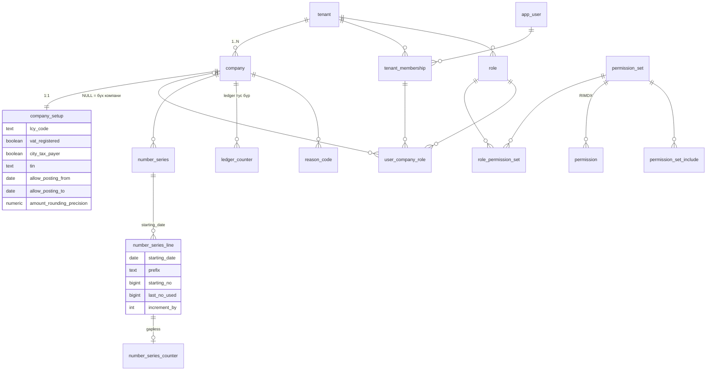

### 3.2 Ерөнхий дэвтэр (gl) ба dimension

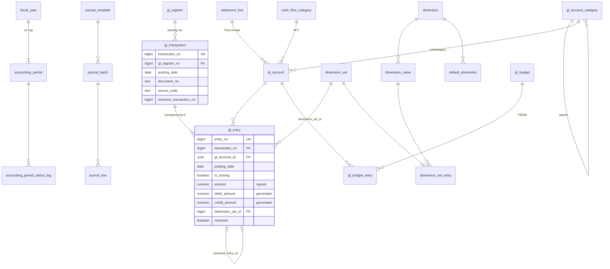

### 3.3 Татвар (tax) ба валют (fx)

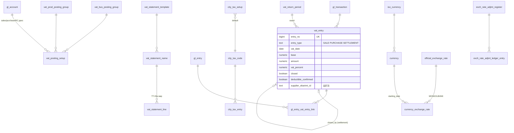

### 3.4 Харилцагч, авлагын дэд дэвтэр (party) ба борлуулалт (sales)

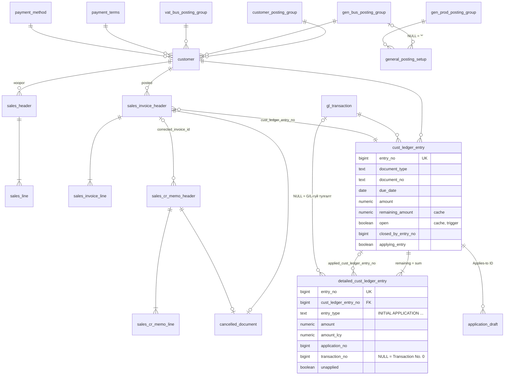

Авлага/өглөгийн ledger нь `party` schema-д (D-K2). Sales/Purchase модуль зөвхөн баримтаа эзэмшинэ. Detailed мөр ба түүний тулгасан entry нь нэг харилцагчийнх байх нь нийлмэл FK `(company_id, entry_no, customer_id)`-ээр хангагдана.

### 3.5 Худалдан авалт (purchase)

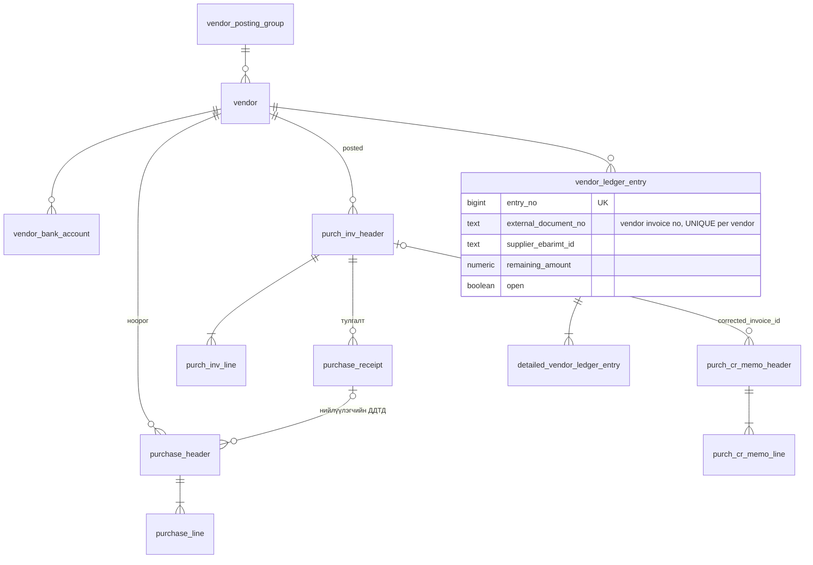

### 3.6 Банк ба касс (bank)

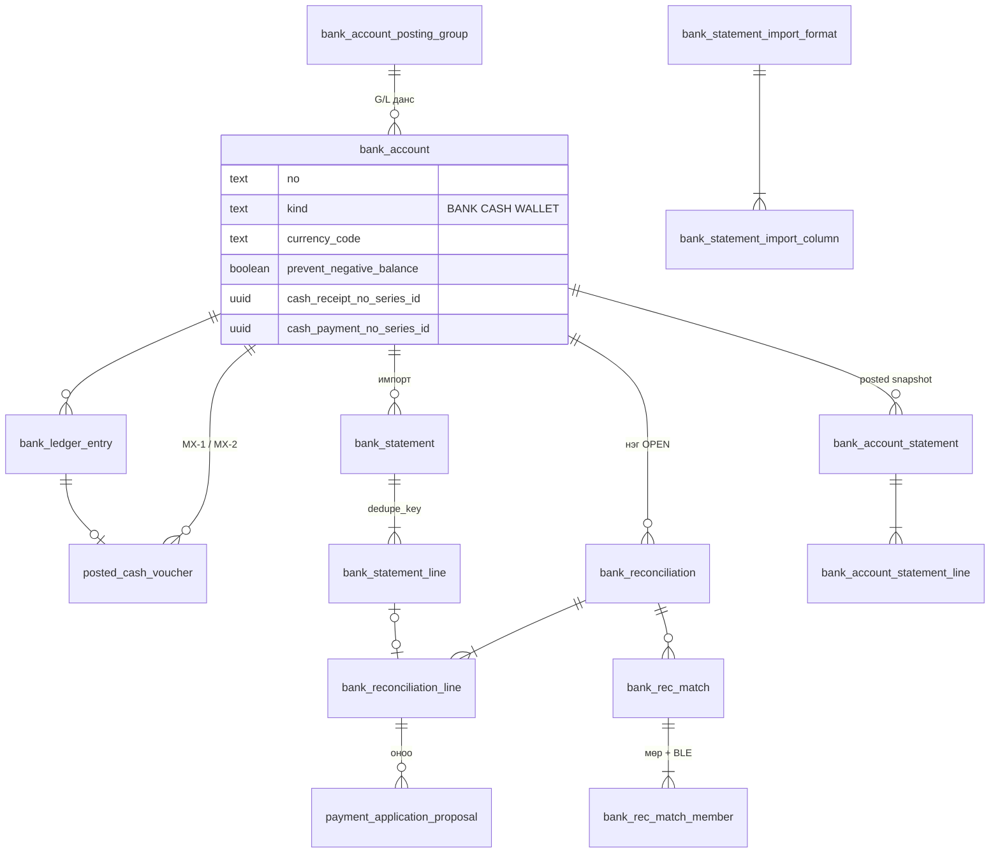

### 3.7 Үндсэн хөрөнгө (fa) ба бараа (inv) — R2

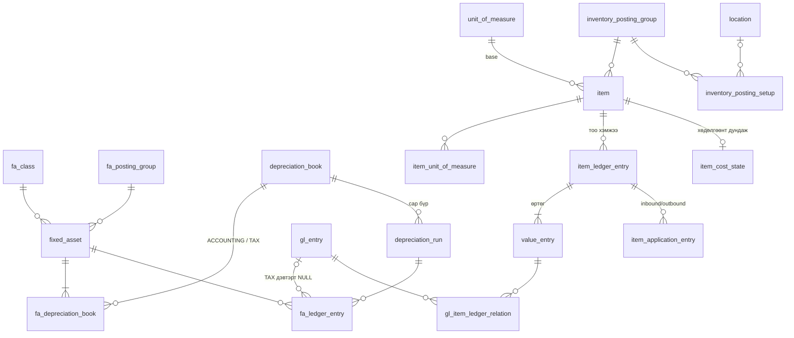

### 3.8 Тайлан (rpt)

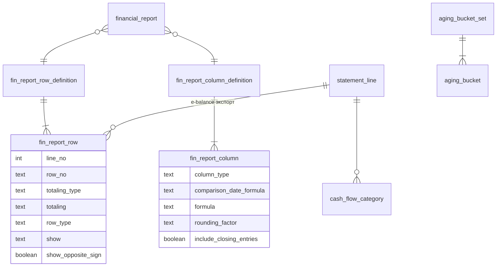

### 3.9 eBarimt

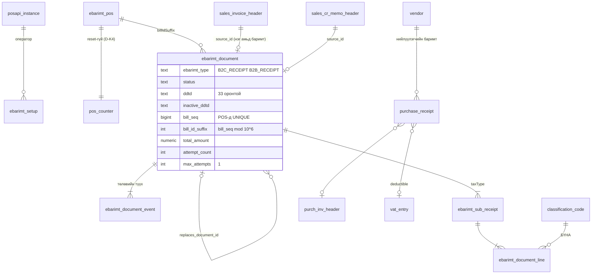

`qrData` ба сугалааны дугаарын багана **байхгүй** (D-J3). `integration.outbox`-ын payload-д `qrData`, `lottery` түлхүүр орохыг CHECK хориглоно.

### 3.10 Интеграц ба аудит

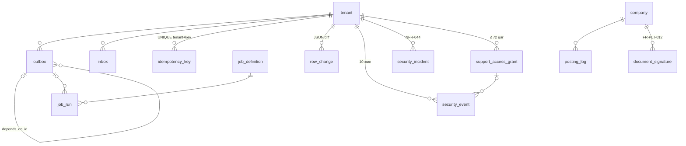

### 3.11 2026-10-08-нд нэмэгдсэн хүснэгтүүд (өөрчлөлтийн хүсэлт)

[db/CHANGE_REQUESTS.md](db/CHANGE_REQUESTS.md)-ийн шийдвэрээр 43 хүснэгт, 9 view нэмэгдсэн. Харилцаа нь доорх диаграммд; багана, CHECK-ийн дэлгэрэнгүйг [db/schema/](db/schema/)-ээс үзнэ.

```mermaid
erDiagram
    app_user ||--o| user_credential : "identity"
    app_user ||--o{ user_session : "identity"
    tenant ||--o{ tenant_invitation : "token_hash"
    tenant ||--o{ tenant_key : "PII_ENC / PII_HMAC / SECRET_ENC"
    tenant ||--o{ tenant_secret : "envelope"
    tenant ||--o{ integration_client : "oidc_client_id"
    company ||--o{ company_signatory : "EXCLUDE давхцал"
    company ||--o{ attachment : "owner_table + owner_id"
    company ||--o{ document_rendition : "sha256"
    company ||--o{ archive_package : "fiscal_year"
    number_series_line ||--o{ number_allocation : "gapless лог"
    company ||--|| tax_setup : ""
    company ||--o{ company_tax_profile : "valid_from/to"
    vat_return_period ||--o| vat_return_snapshot : ":submit"
    customs_declaration ||--o{ vat_entry : "импортын НӨАТ"
    ebarimt_document ||--o{ ebarimt_document_payment : ""
    depreciation_run ||--o{ depreciation_run_line : "DRAFT"
    item_journal ||--o{ item_journal_line : ""
    posted_item_journal ||--o{ posted_item_journal_line : ""
    financial_report ||--o{ statement_snapshot : "FINAL"
    fiscal_year ||--o{ filing_submission : "e-balance"
    webhook_subscription ||--o{ webhook_delivery : "R2"
    company ||--o{ counterparty_account_map : "сурсан"
```

## 4. BC-ийн хүснэгтийн харгалзаа

Тэмдэглэгээ: **=** бараг ижил, **≈** хялбарчилсан, **+** BC-д байхгүй, шинээр нэмсэн.

| BC ID | BC нэр | Шинэ хүснэгт | Хялбарчилсан / хассан зүйл |
|---|---|---|---|
| — | Company (system) | `platform.company` | ≈ Тенантын доор. `tenant_id`-тай |
| 79 | Company Information | `platform.company_setup` | ≈ T98-ийн LCY, бөөрөнхийлөлт, posting цонхтой нэгтгэсэн. `vat_registered`, `city_tax_payer` нэмсэн |
| 2000000120 | User | `platform.app_user` | ≈ Глобал identity, `tenant_membership`-ээр тенантад холбогдоно |
| 2000000165/166 | Tenant Permission Set / Permission | `platform.permission_set`, `platform.permission` | ≈ RIMDX = `N/Y/I`. Exclude, security filter хассан |
| 2000000167 | Tenant Permission Set Rel. | `platform.permission_set_include` | ≈ Зөвхөн include |
| 2000000053 | Access Control | `platform.user_company_role` + `platform.role` | ≈ Role (security group) дундуур. `company_id NULL` = бүх компани |
| 91 | User Setup | `platform.user_setup` | ≈ Зөвхөн posting/VAT огнооны цонх (R2). Approval хассан |
| 308 / 309 | No. Series / No. Series Line | `platform.number_series`, `number_series_line`, `+ number_series_counter` | ≈ Бүхэл тоон арифметик (IncStr биш). `gapless` туг. Relationship, Sequence implementation хассан |
| 230 / 242 | Source Code / Source Code Setup | `platform.source_code` | ≈ Глобал тогтмол каталог. Setup хүснэгт хассан |
| 231 | Reason Code | `platform.reason_code` | = |
| 15 | G/L Account | `gl.gl_account` | ≈ FlowField-гүй. `statement_line_id`, `cash_flow_category_id` нэмсэн. Debit/Credit нь зөвхөн анхааруулга |
| 570 | G/L Account Category | `gl.gl_account_category` | ≈ `parent_id` + `sort_order` (Presentation Order string биш) |
| 98 | General Ledger Setup | `gl.general_ledger_setup` | ≈ Dimension, хаалт, касс илүүдэл/дутагдал, FX дансууд. ACY, deferral хассан |
| 50 | Accounting Period | `gl.fiscal_year`, `gl.accounting_period`, `+ accounting_period_status_log` | ≈ Төлөв `OPEN/CLOSED/LOCKED` (BC-ийн Closed хориглодоггүй байсныг сольсон). Inventory period, avg. cost талбар хассан |
| 80 / 232 / 81 | Gen. Journal Template / Batch / Line | `gl.journal_template`, `journal_batch`, `journal_line` | ≈ Force Doc. Balance үргэлж. Debit/Credit оролт, Correction (storno), IC, Job, deferral хассан |
| 750 / 751 | Standard General Journal (+Line) | `gl.standard_journal`, `standard_journal_line` | = |
| 45 | G/L Register | `gl.gl_register` | = (`request_id` нэмсэн) |
| 95 / 96 | G/L Budget Name / G/L Budget Entry | `gl.gl_budget`, `gl.gl_budget_entry` | ≈ Санхүүгийн тайлангийн BUDGET_ENTRIES баганын эх (R2) |
| 57 | G/L Transaction | `gl.gl_transaction` | ≈ Ваучерын толгой болгосон: огноо, баримт, `is_closing`, буцаалтын холбоос |
| 17 | G/L Entry | `gl.gl_entry` | ≈ Тэмдэгтэй `amount`, generated debit/credit. `is_closing` нь C-date-ийг орлоно. ACY, IC, Job, FA, Prod. Order талбар хассан. Posting group-ийг snapshot код болгосон |
| 179 / 181 | Reversal Entry / Posted Gen. Journal Line | — | Хассан: буцаалтыг шууд тооцно. Ledger өөрөө архив |
| 348 / 349 | Dimension / Dimension Value | `gl.dimension`, `gl.dimension_value` | ≈ Утгыг surrogate id-аар заана. Caption, IC, consolidation хассан |
| 352 | Default Dimension | `gl.default_dimension` | ≈ `entity_type` + `entity_id` (`NULL` = бүх мөр). Priority хүснэгт (T354) хассан |
| 480 / 481 | Dimension Set Entry / Tree Node | `gl.dimension_set_entry`, `gl.dimension_set` | ≈ Tree-ийн оронд sha256 hash түлхүүр. Set 0 = хоосон |
| 350 / 351 / 356 | Dimension Combination / Value Combination / Value per Account | — | Хассан (R3) |
| 323 / 324 / 325 | VAT Bus./Prod. Posting Group / VAT Posting Setup | `tax.vat_bus_posting_group`, `vat_prod_posting_group`, `vat_posting_setup` | ≈ `NORMAL/REVERSE_CHARGE/FULL_VAT`. eBarimt `taxType` ба `taxProductCode` нэмсэн. Unrealized VAT, EU талбар хассан |
| 254 | VAT Entry | `tax.vat_entry` | ≈ Хувь (`vat_percent`) snapshot, `deductible_confirmed`, `supplier_ebarimt_id` нэмсэн. ACY, unrealized хассан |
| 253 | G/L Entry - VAT Entry Link | `tax.gl_entry_vat_entry_link` | = |
| 255 / 257 / 256 | VAT Statement Template / Name / Line | `tax.vat_statement_template`, `vat_statement_name`, `vat_statement_line` | ≈ 4 мөрийн төрөл хадгалсан. `only_deductible_confirmed` нэмсэн |
| 737 | VAT Return Period | `tax.vat_return_period` | ≈ `OPEN/CLOSED/SUBMITTED` |
| — | (Sales Tax-ийн оронд) | `tax.city_tax_code`, `city_tax_setup`, `city_tax_entry` | + НХАТ (D-E6) |
| — | — | `tax.tax_parameter` | + Глобал огноотой параметр (D-E7) |
| 4 | Currency | `fx.currency` | ≈ ACY, residual, EMU, payment tolerance хассан |
| 330 | Currency Exchange Rate | `fx.currency_exchange_rate` | = BC-ийн 4 ханшийн талбартай + `source` (MONGOLBANK/MANUAL/IMPORT) |
| — | — | `fx.iso_currency`, `fx.official_exchange_rate` | + Глобал ISO каталог ба Монголбанкны ханш |
| 86 / 186 | Exch. Rate Adjmt. Reg. / Ledg. Entry | `fx.exch_rate_adjmt_register`, `exch_rate_adjmt_ledger_entry` | = |
| 3 | Payment Terms | `party.payment_terms` | ≈ Хөнгөлөлтийн хэсэг R2+ |
| 289 | Payment Method | `party.payment_method` | ≈ eBarimt `payments[].code` нэмсэн |
| 92 / 93 | Customer / Vendor Posting Group | `party.customer_posting_group`, `vendor_posting_group` | ≈ Авлага/өглөг, бөөрөнхийлөлтийн данс. Tolerance, interest хассан |
| 250 / 251 / 252 | Gen. Bus./Prod. Posting Group / General Posting Setup | `party.gen_bus_posting_group`, `gen_prod_posting_group`, `general_posting_setup` | ≈ `gen_bus_posting_group_id NULL` = "*" fallback мөр |
| 18 / 23 | Customer / Vendor | `party.customer`, `party.vendor` | ≈ Sell-to = Bill-to (D-A5). `kind`, `tin`, eBarimt талбар нэмсэн. Reminder, IC, shipping хассан |
| 288 | Vendor Bank Account | `party.vendor_bank_account` | = |
| 1381 / 1383 | Customer / Vendor Templ. | `party.customer_template`, `vendor_template` | ≈ |
| 311 / 312 | Sales & Receivables / Purchases & Payables Setup | `sales.sales_setup`, `purchase.purchase_setup` | ≈ Дугаарын цуврал ба шилжүүлэгчийн дэд хэсэг |
| 36 / 37 | Sales Header / Line | `sales.sales_header`, `sales_line` | ≈ Зөвхөн INVOICE, CREDIT_MEMO (D-A4). Quote, order, shipment, prepayment, warehouse хассан |
| 112 / 113 | Sales Invoice Header / Line | `sales.sales_invoice_header`, `sales_invoice_line` | = Immutable + eBarimt хүсэлтийн талбар |
| 114 / 115 | Sales Cr.Memo Header / Line | `sales.sales_cr_memo_header`, `sales_cr_memo_line` | = + `corrected_invoice_id` |
| 1900 | Cancelled Document | `sales.cancelled_document`, `purchase.cancelled_document` | = |
| 21 / 379 | Cust. Ledger Entry / Detailed Cust. Ledg. Entry | `party.cust_ledger_entry`, `party.detailed_cust_ledger_entry` (D-K2) | ≈ `remaining_amount`/`open` нь зөвхөн trigger-ийн кэш; over-application CHECK; Transaction No. 0 = `transaction_no` NULL. Payment tolerance, reminder, dispute хассан |
| 38 / 39 | Purchase Header / Line | `purchase.purchase_header`, `purchase_line` | ≈ `supplier_ebarimt_id`, `purchase_receipt_id` нэмсэн |
| 122-125 | Purch. Inv./Cr. Memo Header/Line | `purchase.purch_inv_header/line`, `purch_cr_memo_header/line` | = |
| 25 / 380 | Vendor Ledger Entry / Detailed | `party.vendor_ledger_entry`, `party.detailed_vendor_ledger_entry` (D-K2) | ≈ Нийлүүлэгчийн нэхэмжлэхийн дугаар нийлүүлэгч тус бүрд давхардахгүй (partial UNIQUE) |
| — (Apply Entries page) | Applies-to ID staging | `party.application_draft` | + FR-PTY-010 |
| 277 | Bank Account Posting Group | `bank.bank_account_posting_group` | = |
| 270 | Bank Account | `bank.bank_account` | ≈ `kind = BANK/CASH/WALLET` (D-G1). Check, SEPA, positive pay хассан. МХ-1/МХ-2 цуврал нэмсэн |
| 271 | Bank Account Ledger Entry | `bank.bank_ledger_entry` | ≈ `cash_flow_category_id` нэмсэн |
| 272 | Check Ledger Entry | — | Хассан |
| 273 / 274 | Bank Acc. Reconciliation (+Line) | `bank.bank_reconciliation`, `bank_reconciliation_line` | ≈ Bank rec ба payment application-ийг нэг урсгал болгосон |
| 275 / 276 (+1295/1296) | Bank Account Statement (+Line) | `bank.bank_account_statement`, `bank_account_statement_line` | ≈ Posted payment recon-тэй нэгтгэсэн |
| 1251 | Text-to-Account Mapping | `bank.text_to_account_mapping` | = |
| 1294 / 1293 | Applied Payment Entry / Payment Application Proposal | `bank.payment_application_proposal` | ≈ |
| 2711 | Bank Acc. Rec. Match Buffer | `bank.bank_rec_match`, `bank_rec_match_member` | ≈ n:m match group |
| 1221-1227 | Data Exchange Definition | `bank.bank_statement_import_format`, `bank_statement_import_column` | ≈ Зөвхөн хуулга импорт (CSV/XLSX, банкны preset) |
| — | — | `bank.bank_statement`, `bank_statement_line`, `bank.posted_cash_voucher` | + Импортын staging (давхар импортоос хамгаална), МХ-1/МХ-2 баримт |
| 5607 / 5606 | FA Class / FA Posting Group | `fa.fa_class`, `fa.fa_posting_group` | ≈ 7 данс |
| 5611 / 5612 | Depreciation Book / FA Depreciation Book | `fa.depreciation_book`, `fa_depreciation_book` | ≈ ACCOUNTING (G/L) + TAX (memo). Зөвхөн шулуун шугам |
| 5600 / 5601 | Fixed Asset / FA Ledger Entry | `fa.fixed_asset`, `fa_ledger_entry` | ≈ Insurance, maintenance ledger, component, budgeted asset хассан |
| — | (Report 5692 output) | `fa.depreciation_run` | + Нэг дэвтэр × үед нэг амьд run |
| 27 / 204 / 5404 | Item / Unit of Measure / Item UoM | `inv.item`, `unit_of_measure`, `item_unit_of_measure` | ≈ AVERAGE/FIFO. БҮНА, barcode, taxProductCode нэмсэн |
| 14 / 94 / 5813 / 313 | Location / Inventory Posting Group / Setup / Inventory Setup | `inv.location`, `inventory_posting_group`, `inventory_posting_setup`, `inventory_setup` | ≈ Нэг байршил (R2) |
| 32 / 5802 / 339 / 5823 | Item Ledger / Value / Item Application Entry / G/L - Item Ledger Relation | `inv.item_ledger_entry`, `value_entry`, `item_application_entry`, `gl_item_ledger_relation` | ≈ Expected cost байхгүй (баримт = нэхэмжлэх) |
| 5804 | Avg. Cost Adjmt. Entry Point | `inv.item_cost_state` | ≈ Posting үед шинэчлэгдэх running дундаж |
| 88 / 84 / 85 | Financial Report / Acc. Schedule Name / Line | `rpt.financial_report`, `fin_report_row_definition`, `fin_report_row` | ≈ `STATEMENT_LINE`, `CASH_FLOW_CATEGORY` totaling нэмсэн |
| 333 / 334 | Column Layout Name / Column Layout | `rpt.fin_report_column_definition`, `fin_report_column` | ≈ `sign_neutral`, `include_closing_entries` нэмсэн |
| — | (CU571 generated statements) | `rpt.statement_line`, `rpt.cash_flow_category` | + e-balance Form A мөрийн код, МГТ шууд аргын ангилал (глобал) |
| — | (Report 120 periods) | `rpt.aging_bucket_set`, `aging_bucket` | + Насжилтын бүлгийн тохиргоо (D-F7) |
| 405 / 402-404 | Change Log Entry / Setup | `audit.row_change` | ≈ Үргэлж асаалттай, мөр бүрд JSON diff |
| — | — | `audit.security_event`, `audit.security_incident`, `platform.support_access_grant`, `platform.document_signature` | + Аюулгүй байдлын лог, зөрчлийн бүртгэл, support хандалт, гарын үсэг (FR-PLT-012/016, NFR-044) |
| 265 | Document Entry (Navigate) | `audit.document_entry` (view) | ≈ |
| 472 / 474 | Job Queue Entry / Log Entry | `integration.job_definition`, `job_run`, `outbox` | ≈ Side effect нь outbox-оор |
| — | — | `integration.inbox`, `integration.idempotency_key`, `audit.posting_log` | + |
| — | — | `ebarimt.*` (15 хүснэгт) | + Монголын localization (BC-д байхгүй) |
| 8613-8623 | Config. Package (RapidStart) | — | Хассан (D-I5: өөрсдийн Excel импорт) |

## 5. Гол инвариантууд (invariants)

Инвариант бүрийн хэрэгжилтийг "Хаана" баганад заав. **DB** = өгөгдлийн сан хүчээр мөрдүүлнэ. **App** = posting engine мөрдүүлж, тест/view-ээр шалгана.

| № | Инвариант | Хаана | BC эх сурвалж |
|---|---|---|---|
| INV-01 | **Тэнцсэн гүйлгээ.** `(company_id, transaction_no)` бүрийн `sum(gl_entry.amount) = 0` бөгөөд дор хаяж нэг мөртэй. COMMIT үед voucher тус бүрд шалгана (нэг DB transaction-ийн хоёр тэнцээгүй voucher нийлбэрээрээ 0 байсан ч унана; preview-д `SET CONSTRAINTS ALL IMMEDIATE`). Шалгалт RLS-ийн контекстоос хамааралгүй (`app_rls_bypass`) | DB: `trg_gl_entry_balanced`, `trg_gl_transaction_has_entries` (`ERB01`) | CU12 / R-35, D-C5 |
| INV-02 | **Ledger өөрчлөгдөхгүй.** `platform.ledger_guard`-ийн хүснэгтэд DELETE/TRUNCATE хориотой. UPDATE нь зөвхөн `mutable_columns`-д (жишээ нь `gl_entry.reversed`, `cust_ledger_entry.open`). `app_user`-ээс UPDATE/DELETE эрхийг хассан | DB: `fn_guard_immutable` (`ERL01`), REVOKE, `fn_ledger_update` | CU115, D-C4 |
| INV-03 | **Тэмдэгтэй дүн, storno-гүй.** `debit_amount = max(amount, 0)`, `credit_amount = max(-amount, 0)`. Буцаалт нь эсрэг тэмдэгтэй тул эсрэг баганад орно | DB: generated багана | D-C3 |
| INV-04 | **Үлдэгдэл = detailed-ийн нийлбэр.** `party.cust/vendor_ledger_entry.remaining_amount(_lcy) = sum(detailed.amount(_lcy))`, `open = (remaining ≠ 0)`. Эдгээрийг зөвхөн trigger өөрчилнө (`fn_ledger_update` татгалзана) | DB: `trg_detailed_*_remaining`, `ledger_guard.trigger_columns`; шалгалт `party.v_*_ledger_entry_check` (хоосон байх ёстой) | T21/T379 FlowField, D-F3 |
| INV-05 | **Entry нь өөрийн ваучерын transaction-д л нэмэгдэнэ.** `gl_entry`-ийн огноо, `is_closing`, register нь `gl_transaction`-тэй ижил. `transaction_no`-той бусад ledger/posted мөр (VAT, авлага/өглөг, банк, FA, бараа, posted баримт, МХ) мөн voucher-ийн огноотой, тухайн DB transaction-д үүссэн voucher-т л холбогдоно. Өмнө commit болсон ваучерт мөр нэмэх, түүгээр хаалттай үе рүү back-date хийх боломжгүй | DB: `trg_gl_entry_rules`, `trg_*_transaction_check` (`ERB02`, `ERL01`) | CU12 |
| INV-06 | **Үеийн хяналт.** `gl_transaction.posting_date` нь OPEN үе ба компанийн `allow_posting_from/to` дотор. Хаалтын (`is_closing`) ваучер нь LOCKED биш үед л, гэхдээ компанийн цонхонд захирагдана. G/L-гүй тулгалтын мөр, voucher-гүй FA/бараа/posted барааны журнал мөн ижил дүрэмтэй. LOCKED үе/жилийг дахин нээх боломжгүй. `ERP01`-ийн DETAIL нь шалтгааныг машинаар уншигдах кодоор өгнө: `gl.period_not_found`, `gl.period_closed`, `gl.period_locked`, `gl.posting_date_outside_window` | DB: `gl.fn_assert_posting_date_allowed`, `trg_gl_transaction_period` (`ERP01`), `trg_accounting_period_status` (`ERP02`) | T50, T98 Allow Posting, D-D3 |
| INV-07 | **Үе давхцахгүй.** Нэг компанийн `accounting_period`, `vat_return_period` огнооны муж давхцахгүй; `tax_parameter` нэг кодод давхцахгүй | DB: `EXCLUDE USING gist` | — |
| INV-08 | **Завсаргүй хуулийн дугаар.** Gapless цувралын дугаарыг `number_series_counter` мөрийг posting transaction дотор түгжиж олгоно. Rollback болбол дугаар буцна; цоорхой гарахгүй. Gapless цуврал гараар дугаар зөвшөөрөхгүй. `reset_yearly` цувралд тухайн жилийн мөр заавал (өмнөх жилийн угтвараар үргэлжлэхгүй); `yearly_prefix_pattern` (`SI-{YYYY}-`) байвал шинэ жилийн мөрийг эхний дугаарлалтаар автоматаар үүсгэнэ. Gapless дугаар бүр `platform.number_allocation`-д (append-only) бүртгэгдэж, цоорхойг `platform.v_number_series_gap` харуулна. Counter-т `app_user` шууд бичихгүй | DB: `fn_next_document_no` (SECURITY DEFINER, `ERN01`), REVOKE, `CHECK (NOT (gapless AND manual_nos))`; posted баримт `UNIQUE (company_id, no)` | T308/309, D-C7 |
| INV-09 | **Entry/Transaction/Register дугаар компани дотор дараалсан, давхардахгүй** | DB: `ledger_counter` + `UNIQUE (company_id, entry_no)` | CU12, D-C8 |
| INV-10 | **Dimension set давхардахгүй.** Нэг утгын хослол = нэг `dimension_set_id` (sha256 `key_hash` UNIQUE). Set 0 = хоосон. Set үүсээд өөрчлөгдөхгүй | DB: `UNIQUE (company_id, key_hash)`, ledger guard | T480/481 |
| INV-11 | **Дэд дэвтэр = G/L.** Авлагын detailed entry-ийн нийлбэр нь posting group-ийн авлагын дансны G/L үлдэгдэлтэй тэнцүү (дансанд шууд posting хаалттай үед); өглөг, банк/касс, ҮХ, бараа мөн адил | App + view `party.v_receivables_reconciliation`, `party.v_payables_reconciliation`, `fa.v_fa_gl_reconciliation`, `inv.v_inventory_gl_reconciliation`; нэгдсэн тайлан `platform.fn_integrity_report()` (I-01..I-08, шөнийн шалгалт) | T92 + T17 |
| INV-12 | **Тенантын тусгаарлалт.** Тенант бүр зөвхөн өөрийн мөрийг харж/бичнэ; компанийн хүснэгтэд зөвхөн контекстын компани. Контекстгүй query алдаа өгнө (fail-closed) | DB: FORCE RLS, restrictive policy; нийлмэл FK `(company_id, x_id)`; ledger insert-ийн `ERT01` шалгалт | D-B3 |
| INV-13 | **Нэг posted баримтад нэг амьд eBarimt баримт.** `(company_id, source_type, source_id, operation)`-д `status <> 'CANCELLED'` мөр нэгээс илүүгүй. ДДТД глобалаар давхардахгүй, олгогдсоны дараа өөрчлөгдөхгүй | DB: `ux_ebarimt_document__one_open_per_source`, `ux_ebarimt_document__ddtd`, `trg_ebarimt_document_guard` | D-J1 |
| INV-14 | **billIdSuffix өдөрт давхардахгүй** (POS тус бүр). Дараалал нь POS бүрд reset-гүй (D-K4), `bill_id_suffix = bill_seq mod 10^6` | DB: `ebarimt.pos_counter` + `fn_next_bill_seq`, `UNIQUE (company_id, ebarimt_pos_id, bill_seq)`, `UNIQUE (company_id, ebarimt_pos_id, bill_date, bill_id_suffix)`, CHECK | PosAPI дүрэм, D-K4 |
| INV-15 | **QR/сугалаа хадгалахгүй.** Хүснэгтэд багана байхгүй; хадгалагддаг бүх JSON-д (outbox/inbox payload, idempotency response, job parameters/result, security event details) `qrData`, `lottery` түлхүүрийг ямар ч гүнд CHECK хориглоно | DB: `integration.fn_has_forbidden_ebarimt_keys` CHECK | D-J3 |
| INV-16 | **Орцын НӨАТ зөвхөн баталгаажсан ДДТД-тэй.** `deductible_confirmed = true` бол `supplier_ebarimt_id` заавал (NORMAL тооцоонд). Нэг ДДТД-ийг компанид нэг л удаа бүртгэнэ (нэг баримт олон VAT identifier-тэй байж болох тул `vat_entry` дээр UNIQUE биш) | DB: CHECK + `ebarimt.purchase_receipt UNIQUE (company_id, ddtd)` | D-E4 |
| INV-17 | **НӨАТ-ын огноо нээлттэй НӨАТ-ын үед** (тухайн огноонд үе тодорхойлогдсон бол). SUBMITTED үе эцсийнх | DB: `trg_vat_entry_period` (`ERV01`), `trg_vat_return_period_status` (`ERP02`) | T737, D-E9 |
| INV-18 | **Нийлүүлэгчийн нэхэмжлэхийн дугаар давхардахгүй** (нийлүүлэгч × баримтын төрөл, буцаагдаагүй мөрүүд дунд; `platform.fn_normalize_ext_doc_no`-оор хэвийнжүүлсэн). Мөн өөрийн нэхэмжлэх/кредит нотын дугаар авлага, өглөгийн дэвтэрт давхардахгүй (эхний үлдэгдэл ба буцаагдсан мөрөөс бусад) | DB: `ux_vendor_ledger_entry__vendor_doc_no`, `ux_cust_ledger_entry__doc_no`, `ux_vendor_ledger_entry__doc_no` | CU90 "already exists" |
| INV-19 | **Касс сөрөг үлдэгдэлгүй** (`kind = CASH` бүх данс — CASH данс `prevent_negative_balance = true` байх CHECK-тэй — мөн `prevent_negative_balance = true` бусад данс; огноо бүрийн running үлдэгдэл, RLS-ээс хамааралгүй) | DB: `trg_bank_ledger_entry_non_negative` (`ERC01`), `CHECK (kind <> 'CASH' OR prevent_negative_balance)` | D-G1 |
| INV-20 | **Posting данс.** `gl_entry` зөвхөн `account_type = POSTING`, блоклогдоогүй дансанд | DB: `trg_gl_entry_rules` (`ERG01`) | CU11 |
| INV-21 | **Нэхэмжлэхийг нэг л удаа цуцална** | DB: `cancelled_document UNIQUE (company_id, cancelled_invoice_id)` | T1900 |
| INV-22 | **Буцаалтын холбоос.** Нэг transaction-ийг нэг л удаа буцаана; `reversed = true` бол `reversed_by_entry_no` эсвэл `reversed_entry_no` заавал | DB: `ux_gl_transaction__reverses`, CHECK | CU179 R-39/40 |
| INV-23 | **Дүнгийн төрөл.** Мөнгө/үнэ/тоо/ханш нь заасан нарийвчлалтай `numeric`; float байхгүй | DB: domain + `catalog_checks.sql` | D-C1 |
| INV-24 | **Нэг дэвтэр × үед нэг элэгдлийн run; нэг компанид нэг ACCOUNTING дэвтэр** | DB: partial UNIQUE индекс | D-G4 |
| INV-25 | **Optimistic concurrency.** Мастер/ноорог мөр бүрийн `row_version` UPDATE бүрт +1 (ETag/If-Match) | DB: `platform.fn_touch_row` | D-I1 |
| INV-26 | **Хэтрүүлж тулгахгүй.** `remaining_amount` нь эх дүнгийн тэмдгийг хадгалж, `abs ≤ abs(amount)` | DB: CHECK (`party.cust/vendor_ledger_entry`) | BC CalcApplication |
| INV-27 | **Тулгалт нэг харилцагч дотор.** Detailed мөр, түүний тулгасан entry, `application_draft` нь нэг харилцагч/нийлүүлэгчийнх | DB: нийлмэл FK `(company_id, entry_no, customer_id/vendor_id)` | T379/T380 |
| INV-28 | **G/L-гүй тулгалт** (BC Transaction No. 0): `transaction_no` NULL, `application_no` заавал, огноо нь INV-06-д захирагдана | DB: CHECK, `trg_*_transaction_check` | R-SUBLEDGERS-APPLICATION-08 |
| INV-29 | **Global dimension багана dimension set-ээс гарна** (оролтыг үл тооно) | DB: `trg_*_global_dims` | T480/T17 |
| INV-30 | **Нэг чиглэлтэй туг.** `reversed`, `unapplied` true → false болохгүй | DB: `fn_guard_immutable` (`ERL01`) | CU179, R-31 |
| INV-31 | **VAT category ↔ eBarimt taxType** уялдаатай | DB: CHECK (`tax.vat_posting_setup`) | D-E2 |
| INV-32 | **Хасагдахгүй НӨАТ-ын шалтгаан.** `non_deductible_amount/base ≠ 0` ⇔ `non_deductible_reason` заавал (`vat_entry`, худалдан авалтын мөр, журналын мөр); FULL_VAT мөрийн суурь 0, борлуулалтын мөрт хасагдахгүй дүн байхгүй, FULL_VAT орцыг зөвхөн баталгаажсан гадаад баримтын дугаар, огноотой | DB: CHECK (`tax.vat_entry`, `purchase.*_line`, `gl.journal_line`) | D-E4, 08 CR-TAX-02/14 |
| INV-33 | **PII-S тодорхой текстээр хадгалагдахгүй.** Хувь хүн (INDIVIDUAL) харилцагч/нийлүүлэгчийн регистр, ТТД нь зөвхөн шифрлэсэн (`*_enc`) + HMAC (`*_hmac`) + далдалсан hint; posted баримтын ТТД багана иргэний 12–14 оронтой ТТД, иргэний регистрийн хэлбэрийг хүлээж авахгүй; аудитын лог `*_enc`/`*_hmac`/`ciphertext`/`wrapped_key`/`token_hash`-ийг redact хийнэ | DB: CHECK (`party.customer/vendor`, posted толгой, `bank.posted_cash_voucher`), `audit.fn_row_change` | 13 §10, CR-06 |
| INV-34 | **Хавсралт ба архив өөрчлөгдөхгүй.** Posted баримтын хавсралтыг устгах/өөрчлөх боломжгүй (AV төлвөөс бусад); баримтын rendition, архивын багц, илгээсэн ТТ-03а, эцсийн (FINAL) тайлангийн snapshot, e-balance илгээлт append-only | DB: `platform.fn_attachment_guard`, `ledger_guard` (`ERL01`), `rpt.fn_statement_snapshot_status` | 13 CR-12/13/22, 10 SCR-RPT-02/03 |
| INV-35 | **Тенантын purge-ийн хяналттай салбар.** Append-only хүснэгтээс DELETE нь зөвхөн migrator (`app_owner`-ийн гишүүн) `erp.purge_tenant`-ийг тухайн тенантаар тавьж, тенант `PURGE_APPROVED` төлөвтэй үед; нотолгоо `platform.tenant_purge_log`-д | DB: `platform.fn_purge_in_progress`, `fn_guard_immutable` | 13 CR-17 |

## 6. Төлөвийн машинууд (state machines)

### 6.1 Борлуулалтын баримт (sales document)

Ноорог (`sales.sales_header`) нь `OPEN` ↔ `RELEASED`. Posting нэг transaction-д ноорогийг устгаж, posted баримт (`sales_invoice_header` эсвэл `sales_cr_memo_header`) үүсгэнэ. Posted нэхэмжлэх нь өөрчлөгдөхгүй. Цуцлах (cancel) нь бүтэн кредит нот үүсгэж, `cancelled_document`-оор холбоно (D-F6). Төлбөрийн төлөв (`open`/`closed`) нь `cust_ledger_entry`-ээс гарна.

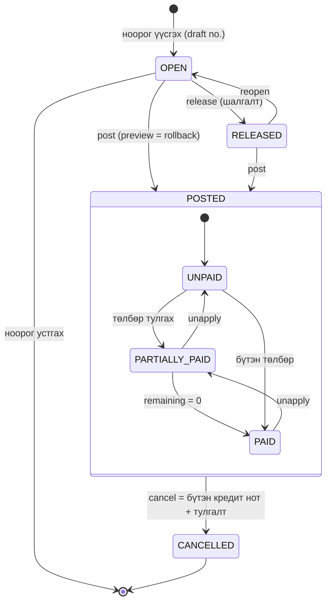

`POSTED` дэх дэд төлөв ба `CANCELLED` нь багана биш, тооцоолсон төлөв: `cust_ledger_entry.open/remaining_amount` болон `cancelled_document` мөр. Posted баримтын хүснэгт өөрөө хэзээ ч өөрчлөгдөхгүй.

### 6.2 Нягтлан бодох үе (accounting period)

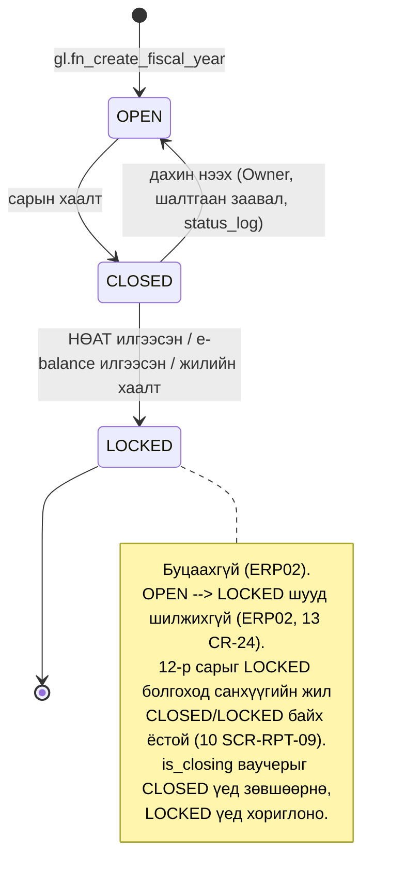

Төлөвийн өөрчлөлт бүрийг `gl.accounting_period_status_log`-д бичнэ (сарын хаалтын checklist-ийн `checklist_snapshot` jsonb-тэй). Энэ хүснэгт append-only бөгөөд OPEN руу шилжихэд `reason_text` заавал байна. Тухайн жилийн 12-р сар LOCKED бол CLOSED → OPEN хориотой. `gl.fiscal_year` нь ижил `OPEN/CLOSED/LOCKED` төлөвтэй; жилийг LOCKED болгоход бүх 12 сар LOCKED байх ёстой. LOCKED жилийг дахин нээх боломжгүй.

### 6.3 eBarimt баримт (`ebarimt.ebarimt_document`)

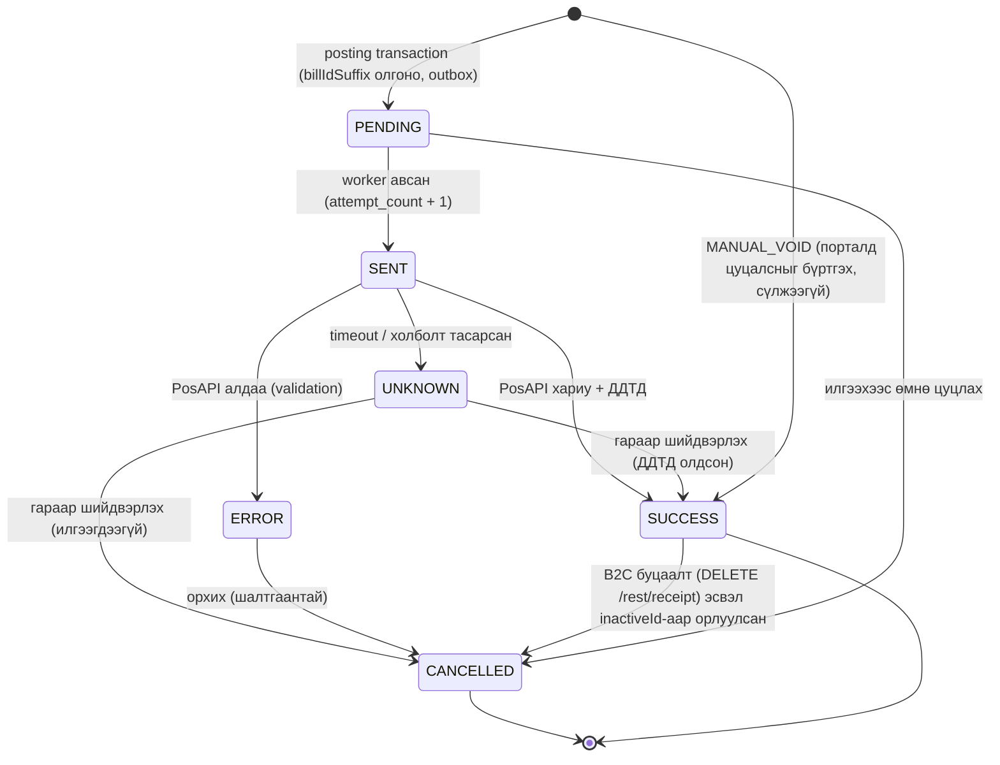

Шилжилтийн whitelist (12 SCR-18, `trg_ebarimt_document_guard`): PENDING→{SENT, ERROR, CANCELLED}, SENT→{SUCCESS, ERROR, UNKNOWN}, UNKNOWN→{SUCCESS, CANCELLED}, ERROR→{CANCELLED}, SUCCESS→{CANCELLED}. INSERT нь зөвхөн PENDING (`attempt_count = 0`) эсвэл `operation = 'MANUAL_VOID'`-ийн SUCCESS мөр. →SENT бүрт `attempt_count` яг 1-ээр нэмэгдэнэ, бусад үед өөрчлөгдөхгүй, хэзээ ч буурахгүй. ERROR-оос дахин илгээх нь хуучин мөрийг CANCELLED болгож, `resent_from_document_id`-тай **шинэ** PENDING мөр үүсгэнэ (ERROR→PENDING байхгүй).

- `UNKNOWN`-оос автоматаар дахин илгээхгүй (D-J2). `max_attempts = 1` (D-I6).
- Хүсэлтийн өгөгдөл (`ebarimt_type`, `bill_id_suffix`, дүн, `customer_tin`) үүссэний дараа өөрчлөгдөхгүй. ДДТД олгогдсоны дараа өөрчлөгдөхгүй. `SUCCESS`-ээс зөвхөн `CANCELLED` руу шилжинэ (`trg_ebarimt_document_guard`).
- Хэсэгчилсэн буцаалт/засвар нь шинэ баримт (`inactive_ddtd` = гинжний сүүлийн ДДТД, `replaces_document_id`) үүсгэнэ.
- Бүтэн B2C буцаалт нь `operation = 'DELETE'` мөр: billIdSuffix ашиглахгүй, `replaces_document_id` + `inactive_ddtd` (устгах ДДТД) заавал (D-J4). B2B-д DELETE-ийг ITC баталгаажуулах хүртэл зөвшөөрөхгүй.
- `operation = 'MANUAL_VOID'`: eBarimt-ийн порталд гараар цуцалсныг бүртгэнэ — billIdSuffix-гүй, `replaces_document_id` + `inactive_ddtd` заавал, сүлжээний дуудлагагүй.
- Илгээлтийн snapshot (`branch_no`, `pos_no`, `district_code`, `posapi_instance_id`) ба төлбөрийн мөрүүд (`ebarimt.ebarimt_document_payment`) үүссэний дараа өөрчлөгдөхгүй.
- Төлөвийн шилжилт бүр ба UNKNOWN/ERROR-ийн гар шийдвэр `ebarimt.ebarimt_document_event`-д trigger-ээр бичигдэнэ (append-only, 10 жил).

### 6.4 Outbox мессеж (`integration.outbox`)

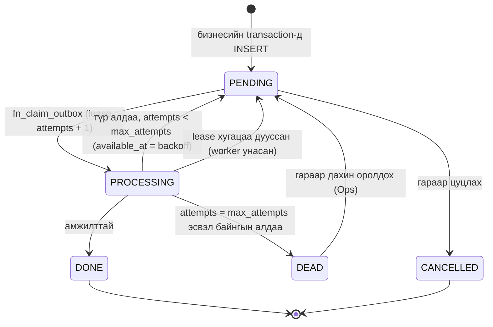

- `depends_on_id` нь өмнөх мессеж `DONE` болохыг хүлээлгэнэ (жишээ нь eBarimt-ийн гинж).
- eBarimt-ийн `POST /rest/receipt` мессеж `max_attempts = 1`. Иймээс түр алдаа `DEAD` болж, `ebarimt_document.status = UNKNOWN/ERROR` болно. Lease дууссан eBarimt мессежийг автоматаар PENDING болгохгүй.
- `UNIQUE (tenant_id, idempotency_key)` нь ижил үйлдлийг давхар оруулахаас хамгаална.

## 7. Posting нэг transaction дотор юу бичдэг вэ

Жишээ: B2C бэлэн борлуулалтын нэхэмжлэх (D-F5). Бүх алхам нэг DB transaction-д, `platform.fn_lock_company_posting` түгжээтэй (D-C6).

| # | Алхам | Хүснэгт / функц |
|---|---|---|
| 1 | Контекст, түгжээ, idempotency | `platform.fn_set_context`, `fn_lock_company_posting`, `integration.idempotency_key` |
| 2 | Ноорогийг түгжих (`row_version` = If-Match) | `sales.sales_header` FOR UPDATE |
| 3 | Хуулийн дугаар | `platform.fn_next_document_no('SINV-POSTED', posting_date)` |
| 4 | Register/transaction/entry дугаар | `platform.fn_next_entry_no('GL_REGISTER' / 'GL_TRANSACTION' / 'GL_ENTRY', n)` |
| 5 | Ваучерын толгой (үеийн шалгалт) | `gl.gl_transaction` |
| 6 | G/L мөрүүд: авлага Дт, орлого Кт, НӨАТ Кт; дараа нь касс Дт, авлага Кт | `gl.gl_entry` (2 transaction: нэхэмжлэх ба төлбөр) |
| 7 | НӨАТ-ын дэвтэр ба холбоос | `tax.vat_entry`, `tax.gl_entry_vat_entry_link` |
| 8 | Авлагын дэд дэвтэр ба тулгалт | `party.cust_ledger_entry`, `party.detailed_cust_ledger_entry` (INITIAL ×2, APPLICATION ×2), `fn_ledger_update` (`closed_by_*`) |
| 9 | Касс | `bank.bank_ledger_entry`, `bank.posted_cash_voucher` (МХ-1) |
| 10 | Posted баримт, ноорог устгах | `sales.sales_invoice_header/line`, DELETE `sales.sales_header` |
| 11 | eBarimt баримт ба outbox | `ebarimt.fn_next_bill_seq` (`pos_counter`), `ebarimt.ebarimt_document` (+ sub-receipt, line, event), `integration.outbox` |
| 12 | Register, posting log | `gl.gl_register`, `audit.posting_log` |
| 13 | COMMIT | Хойшлуулсан шалгалт: INV-01, INV-19, register ба ledger entry-ийн FK |

## 8. R2/R3-т бэлэн байдал ба нээлттэй асуудал

**R2-т схемийн өөрчлөлтгүйгээр идэвхжих зүйл:** валютын баримт ба ханшийн тэгшитгэл (`fx.*`, ledger дахь `currency_code`, `*_currency_factor`, detailed entry-ийн `UNREALIZED_*`/`REALIZED_*` төрөл), үндсэн хөрөнгө (`fa.*`, журнал/худалдан авалтын мөрийн `fixed_asset_id`, `depreciation_book_id`), бараа (`inv.*`, мөрийн `item_id`, `location_id`), НХАТ (`tax.city_tax_*`, мөрийн `city_tax_code_id`/`city_tax_amount`), хэрэглэгчийн posting цонх (`platform.user_setup`), давтагдах журнал (`journal_line.recurring_*`), dimension UI (`gl.default_dimension`), `*_INVOICE` eBarimt урсгал (`parent_ddtd`, `ebarimt_type`).

**R3-т нэмэлт хүснэгт шаардлагатай:** захиалга/quote (sales_header-ийн `document_type`-д утга нэмэх + shipment хүснэгт), FIFO-ийн давхарга (одоогийн `item_application_entry` хангалттай байж магадгүй), олон агуулах, approval workflow, банкны API холболт.

**Нээлттэй асуудал (схемийн түвшинд):**

1. `audit.row_change` ба том ledger хүснэгтүүдийн partitioning (сараар) — ачаалал өсөхөд (02-architecture §8.1). Одоо энгийн хүснэгт.
2. Компани хоорондын тайлан (тенантын dashboard) — restrictive `company_isolation` policy-ийн улмаас тусдаа SECURITY DEFINER функц хэрэгтэй.
3. Тенантын бүрэн устгал (PURGED): append-only guard-уудад хяналттай purge салбар нэмэгдсэн (INV-35, `platform.tenant_purge_log`); устгах дарааллыг гүйцэтгэх migrator-ийн процедур (FK-ийн дараалал) хэрэгжүүлэлтийн шатанд.
4. `rpt.statement_line`-ийн Form A мөрийн кодын ихэнх нь баталгаажаагүй (`verified = false`, mn-accounting.md §3.3).
5. ⚠ D-C3 (storno-гүй) ба 02-architecture §6.8-ийн "улаан сторно" гэсэн бичвэр зөрчилтэй. Схем DECISIONS-ийг дагасан: буцаалт эсрэг баганад орно.
6. Схемийн хяналтаар (2026-10-06) засаагүй үлдсэн зүйлсийг [db/README.md](db/README.md) "Хяналтын тэмдэглэл" §F-д жагсаав (полиморф FK, `open`-ийн CHECK, `created_at = now()`-д тулгуурласан voucher шалгалт г.м.).
7. Нөхцөлт өөрчлөлтийн хүсэлтүүд (PosAPI instance-ийн billIdSuffix counter — ITC OQ-02; B2B DELETE; `bank.cash_voucher_draft` — OQ-UI-22; `vendor_ledger_entry.cancelled` — OQ-PUR-07; `gl.account_period_balance` projection; R3-ийн PII нэргүйжүүлэлт) нээлттэй асуултын хариу хүртэл хэрэгжээгүй ([db/CHANGE_REQUESTS.md](db/CHANGE_REQUESTS.md)).
