# 06. Борлуулалт ба авлага (Sales & Receivables) — модулийн тодорхойлолт

> **Төлөв:** Хөгжүүлэлтэд бэлэн ноорог v1.1 (adversarial review хийсэн, төгсгөлийн "Хяналтын тэмдэглэл"-ийг үзнэ үү). **Огноо:** 2026-10-07, хянасан 2026-10-08.
> **Модуль:** `sales` (баримт) + `party` schema-ийн авлагын хэсэг (харилцагчийн дэд дэвтэр, тулгалт, насжилт, хуулга; D-K2).
> **Нэг эх сурвалж:** [DECISIONS.md](./DECISIONS.md) (§K: нэршлийг [`db/schema/*.sql`](./db/schema/) тодорхойлно). Бусад баримттай зөрвөл DECISIONS → schema → энэ баримт гэсэн дарааллаар давамгайлна.
> **Уншигч:** backend хөгжүүлэгч, QA, нягтлан зөвлөх.
> **Холбоотой баримт:** [01-requirements.md](./01-requirements.md) (FR-SAL, FR-PTY, FR-TAX-004..008, FR-RPT-003/004, FR-EBR-002/003), [02-architecture.md](./02-architecture.md) §4.2.7, §4.2.11, §6, [03-domain-model.md](./03-domain-model.md) §3.4, §5, §6.1, [05-posting-engine.md](./05-posting-engine.md) (`PostingDocument`, `ILedgerWriter`, `RunSubledgerOnlyAsync`), [07-purchases-payables.md](./07-purchases-payables.md), [08-tax-vat-mn.md](./08-tax-vat-mn.md), [09-bank-cash-fx.md](./09-bank-cash-fx.md), [10-periods-closing-reporting.md](./10-periods-closing-reporting.md), [12-ebarimt-integration.md](./12-ebarimt-integration.md), [14-api.md](./14-api.md), [15-ui-ux.md](./15-ui-ux.md), [db/README.md](./db/README.md), [db/seed/README.md](./db/seed/README.md).
> **Судалгаа (BC эх):** [bc-sales-documents.md](./research/bc-sales-documents.md) (R-SALES-DOCUMENTS-nn), [bc-account-determination.md](./research/bc-account-determination.md) (R-ACCOUNT-DETERMINATION-nn), [bc-subledgers-application.md](./research/bc-subledgers-application.md) (R-SUBLEDGERS-APPLICATION-nn), [bc-vat.md](./research/bc-vat.md) (R-VAT-nn), [bc-gl-posting.md](./research/bc-gl-posting.md) (R-GL-POSTING-nn), [mn-integrations-market.md](./research/mn-integrations-market.md) (I-nn).

## Агуулга

- [0. Энэ баримтыг хэрхэн унших](#0-энэ-баримтыг-хэрхэн-унших)
- [1. Зорилго ба хамрах хүрээ](#1-зорилго-ба-хамрах-хүрээ)
- [2. Ойлголт ба BC-ээс авсан зүйл](#2-ойлголт-ба-bc-ээс-авсан-зүйл)
- [3. Өгөгдөл](#3-өгөгдөл)
- [4. Бизнесийн дүрмүүд](#4-бизнесийн-дүрмүүд)
- [5. Процесс ба алгоритм](#5-процесс-ба-алгоритм)
- [6. Тооцоолол ба бөөрөнхийлөлт](#6-тооцоолол-ба-бөөрөнхийлөлт)
- [7. Posting-ийн жишээнүүд](#7-posting-ийн-жишээнүүд)
- [8. Validation ба алдааны кодууд](#8-validation-ба-алдааны-кодууд)
- [9. Events ба интеграц](#9-events-ба-интеграц)
- [10. API ба UI холбоос](#10-api-ба-ui-холбоос)
- [11. Тест сценари](#11-тест-сценари)
- [12. Schema change requests](#12-schema-change-requests)
- [13. Нээлттэй асуулт](#13-нээлттэй-асуулт)
- [Хавсралт А. Бусад баримттай зөрүү](#хавсралт-а-бусад-баримттай-зөрүү)
- [Хяналтын тэмдэглэл (Review log)](#хяналтын-тэмдэглэл-review-log)

---

## 0. Энэ баримтыг хэрхэн унших

### 0.1 Тэмдэглэгээ

| Тэмдэглэгээ | Утга |
|---|---|
| `BR-SAL-nn` | Борлуулалтын баримтын бизнесийн дүрэм (энэ баримт эзэмшинэ) |
| `BR-AR-nn` | Авлагын дэд дэвтэр, тулгалт, насжилт, хуулгын дүрэм (энэ баримт эзэмшинэ) |
| `AT-SAL-nn`, `AT-AR-nn` | Хүлээн авах тест (Given/When/Then) |
| `GS-SAL-nnn`, `GS-AR-nnn` | Golden scenario ([18-dev-setup.md](./18-dev-setup.md) §13.3-ын формат) |
| `P1..P12` | §7-ийн posting-ийн жишээ (дэд жишээ P1a, P2b, P2c) |
| `SCR-SAL-nn` | Энэ баримтын schema өөрчлөлтийн хүсэлт (§12) |
| `OQ-SAL-nn` | Нээлттэй асуулт (§13) |
| `r(x)` | `MoneyMath.Round(x, d)`, `MidpointRounding.AwayFromZero` (ADR-0006, 18-dev-setup §4.3). `d` = компанийн дүнгийн нарийвчлалын орон (0.01 → 2) |
| `rv(x)` | НӨАТ-ын бөөрөнхийлөлт: `company_setup.vat_rounding_type` (NEAREST / UP / DOWN), абсолют утгаар (§6.1) |
| Тэмдэг | **Дебит = +, кредит = −** (D-C3). Харилцагчийн нэхэмжлэх +, төлбөр ба кредит нот − (R-SUBLEDGERS-APPLICATION, §1) |
| Дүн | Жишээ бүр MNT, НӨАТ 10 %, нарийвчлал 0.01. Мянгатын тусгаарлагч нь зай (`1 100.00`) |

### 0.2 Нэрийн зөрүүг шийдсэн байдал (D-K1: schema давамгайлна)

| Бусад баримтад | Энэ баримтад (schema) |
|---|---|
| `parties.*`, `detailed_cust_ledg_entry`, `cust_open_item` (02-architecture §4.2.7) | `party.cust_ledger_entry`, `party.detailed_cust_ledger_entry`; нээлттэй үлдэгдэл нь `remaining_amount` кэш + `party.v_cust_open_entry` |
| `posted_sales_invoice(_line)`, `posted_sales_cr_memo(_line)` | `sales.sales_invoice_header/line`, `sales.sales_cr_memo_header/line` |
| `platform.no_series(_line)`, `gl.company_counter` | `platform.number_series(_line)`, `platform.number_series_counter`, `platform.ledger_counter` (`fn_next_document_no`, `fn_next_entry_no`) |
| `core.fn_lock_company_posting` | `platform.fn_lock_company_posting` |
| `ebarimt.receipt`, outbox `ebarimt.receipt.create` | `ebarimt.ebarimt_document`, outbox topic `ebarimt.receipt.send` (12 §0.2) |
| `event.SalesInvoicePosted` (02 §9.1) | Outbox topic `event.sales_invoice.posted` (schema-ийн `topic` CHECK нь жижиг үсэг шаарддаг) |
| 00-overview: `09-parties-ar-ap.md` + `10-sales.md` | Энэ баримт хоёуланг нь нэгтгэсэн. 14-api §9.5-ын "эзэмшигч spec 09/10" = энэ баримт |
| Улаан сторно (`is_correction`, 02 §6.8) | Хэрэглэхгүй (D-C3). Кредит нот ба буцаалт эсрэг тэмдгээр, эсрэг баганад |

---

## 1. Зорилго ба хамрах хүрээ

### 1.1 Зорилго

Энэ модуль нь бичил бизнесийн борлуулалтын бүх мөнгөн урсгалыг баримтаас авлагын үлдэгдэл хүртэл нэг зөв, давтагддаг аргаар бүртгэнэ:

1. Борлуулалтын **нэхэмжлэх** ба **кредит нот** (буцаалт)-ын ноорог, бөөрөнхийлөлттэй дүн, НӨАТ, хөнгөлөлт, төлөх огноо.
2. Нэг DB transaction-д **батлах** (posting): хуулийн завсаргүй дугаар, G/L, VAT entry, харилцагчийн entry + detailed entry, eBarimt-ийн баримтын хүсэлт.
3. **Бэлэн борлуулалт**: нэхэмжлэх + төлбөрийн хэлбэрийн харьцсан дансаар (balancing account) автомат, тулгагдсан төлбөр.
4. **Нэхэмжлэх цуцлах** (бүтэн кредит нот) ба **засварлах** (цуцлах + шинэ ноорог).
5. **Авлагын дэд дэвтэр**: header entry + append-only detailed entry, үлдэгдэл detailed-ээс.
6. **Тулгалт** (application): тодорхой баримтад, олон баримтад хуваарилах, хамгийн эртийнхэд; **тулгалт буцаах** (unapply, хатуу LIFO); урьдчилгаа төлбөр.
7. **Насжилт** (огноо D-ийн байдлаар, detailed entry-ээс) ба **харилцагчийн дансны хуулга / тооцоо нийлсэн акт**.
8. eBarimt-ийн баримт **хэзээ, ямар өгөгдлөөр** үүсэхийг тодорхойлох (илгээх, төлөв, гинжийг [12-ebarimt-integration.md](./12-ebarimt-integration.md) эзэмшинэ).

### 1.2 Хамрах хүрээ

| Хүрээнд | Хүрээнээс гадуур (эзэмшигч) |
|---|---|
| `sales.*` хүснэгтүүд (ноорог, posted, `cancelled_document`, `sales_setup`) | Худалдан авалт ба өглөг ([07-purchases-payables.md](./07-purchases-payables.md); өглөгийн тулгалт нь энэ баримтын §5.13–5.14-ийг толин тусгалаар хэрэглэнэ) |
| `party.cust_ledger_entry`, `party.detailed_cust_ledger_entry`, `party.application_draft` (харилцагчийн хэсэг) | Харилцагчийн картын CRUD, ТТД татах, PII шифрлэлт (FR-PTY-001..004; 13-security-audit-tenancy) |
| Харилцагчийн төлбөрийн **авлагын тал** (CLE, тулгалт); бэлэн борлуулалтын төлбөрийн гүйлгээг угсрах | Банк/кассын баримт, `bank.bank_ledger_entry`, МХ-1/МХ-2-ийн дугаар ба хэвлэмэл ([09-bank-cash-fx.md](./09-bank-cash-fx.md)) |
| НӨАТ-ын баримтын тооцооны **хэрэглээ** (`ITaxCalculator`-ийн гэрээ, §6) | НӨАТ-ын тохиргоо, хувь, тайлан, хаалт, НӨАТ төлөгч бус горимын харгалзаа (`08-tax-vat-mn`) |
| Данс тодорхойлох **хэрэглээ** (General Posting Setup, posting group) | Тохиргооны CRUD (08, 15 S-GL-13, S-TAX-01) |
| eBarimt-ийн гох (trigger) ба `ReceiptRequest`-ийн өгөгдөл | PosAPI, төлөвийн машин, гинж, `billIdSuffix`, хэвлэх (12) |
| Насжилт, хуулгын **тооцоолол** | Тайлангийн PDF/Excel хэлбэр, экспорт job ([10-periods-closing-reporting.md](./10-periods-closing-reporting.md)) |
| Posting engine-ийн **хэрэглээ** (`IPostingService`) | Engine өөрөө, дугаарлалт, register, preview механизм ([05-posting-engine.md](./05-posting-engine.md), 02 §6) |

### 1.3 Хувилбар (DECISIONS §H)

| Хувилбар | Агуулга |
|---|---|
| **R1 (MVP)** | Нэхэмжлэх ба кредит нот (D-A4); мөрийн төрөл `COMMENT`, `GL_ACCOUNT`, `ITEM` (зөвхөн `SERVICE`/`NON_INVENTORY`, D-G5); үнэ НӨАТ-тэй/гүй; мөрийн хөнгөлөлт (цэвэр дүнгээр эсвэл тусдаа дансанд, D-F2); НӨАТ-ыг VAT identifier бүрээр (D-E3); НӨАТ төлөгч бус горим (D-E5 ⚠); бэлэн борлуулалт (D-F5); бэлэн мөнгөний бүхэлчлэл (сонголттой, D-C2); кредит нот + автомат тулгалт, цуцлах, засварлах (D-F6); release/reopen; preview; авлагын дэд дэвтэр (D-F3, D-K2); тулгалт (Applies-to Doc., хуваарилалт, Apply to Oldest), unapply (LIFO); урьдчилгаа (D-F4); төлөх огноо засах; насжилт (D-F7); дансны хуулга/акт; eBarimt `B2C_RECEIPT`/`B2B_RECEIPT` (D-J1); зөвхөн MNT |
| **R2** | Нэхэмжлэхийн хөнгөлөлт (FR-SAL-016; SCR-SAL-01); валютын баримт ба тулгалтын ханшийн зөрүү (D-G3); `INVENTORY` бараа ба COGS (D-G5); `FIXED_ASSET` мөр (ҮХ худалдах, D-G4); НХАТ (D-E6); `*_INVOICE` + `invoiceId` eBarimt урсгал (FR-EBR-017); netting (D-F8, FR-PTY-015); борлуулалтын НӨАТ-ын зөрүү (VAT difference) |
| **R3** | Захиалга, үнийн санал, хэсэгчилсэн нэхэмжлэл (D-A4, FR-SAL-017); approval (D-I4); QPay-ийн eBarimt (FR-EBR-021) |

### 1.4 Шаардлагын хамрах хүснэгт (traceability)

| FR | Гарчиг | Хувилбар | Энэ баримтын хэсэг |
|---|---|---|---|
| FR-SAL-001 | Нэхэмжлэхийн ноорог | R1 | BR-SAL-01..09, §5.2 |
| FR-SAL-002 | Мөрийн төрөл | R1 | BR-SAL-10..17 |
| FR-SAL-003 | Мөрийн дүн ба хөнгөлөлт | R1 | BR-SAL-18..21, §6.2, §6.7, P1 |
| FR-SAL-004 | Борлуулалтын дансны тодорхойлолт | R1 | BR-SAL-40..44, §5.7 |
| FR-SAL-005 | Нэхэмжлэх батлах | R1 | BR-SAL-30..39, §5.6, P1 |
| FR-SAL-006 | Бэлэн борлуулалт | R1 | BR-SAL-50..56, §5.9, P2 |
| FR-SAL-007 | Кредит нот | R1 | BR-SAL-60..67, §5.11, P3, P9 |
| FR-SAL-008 | Нэхэмжлэх цуцлах | R1 | BR-SAL-70..77, §5.12, P4 |
| FR-SAL-009 | Засварлах | R1 (Should) | BR-SAL-78, §5.12 |
| FR-SAL-010 | Баримт хуулах | R1 (Should) | BR-SAL-79, §5.12.4 |
| FR-SAL-011, 012 | ТМ-1 хэвлэх, имэйл | R1 | §9.2 (`email.send`), §10 (агуулгыг Reporting) |
| FR-SAL-013 | Бэлэн мөнгөний бүхэлчлэл | R1 (Could) | BR-SAL-57..59, §6.10, P2b |
| FR-SAL-014 | Жагсаалт ба төлөв | R1 | BR-SAL-90, §10 |
| FR-SAL-015 | Ноорог устгах | R1 | BR-SAL-08 |
| FR-SAL-016 | Нэхэмжлэхийн хөнгөлөлт | **R2** | §6.6, SCR-SAL-01 |
| FR-SAL-017 | Захиалга, үнийн санал | **R3** | Хамрахгүй (D-A4) |
| FR-PTY-005 | Posting group ба харилцагчийн данс | R1 | BR-SAL-43, BR-AR-02, BR-AR-16 |
| FR-PTY-006 | Төлбөрийн нөхцөл ба төлөх огноо | R1 | BR-SAL-05, §5.3 |
| FR-PTY-007 | Авлагын дэд дэвтэр | R1 | BR-AR-01..16, §5.8 |
| FR-PTY-009 | Тодорхой баримтад тулгах | R1 | BR-AR-20..33, §5.13, P5 |
| FR-PTY-010 | Олон баримтад хуваарилах | R1 | BR-AR-34..38, §5.13.3, P8 |
| FR-PTY-011 | Unapply | R1 | BR-AR-40..48, §5.14, P6 |
| FR-PTY-012 | Урьдчилгаа | R1 | BR-AR-50..53, §5.15, P7 |
| FR-PTY-013 | Тулгалтын огноо ба үеийн хориг | R1 | BR-AR-26..28 |
| FR-PTY-014 | Нээлттэй entry-ийн засвар | R1 (Should) | BR-AR-13..15, §5.16 |
| FR-PTY-015 | Netting | **R2** | Хамрахгүй (§1.3) |
| FR-TAX-004..007 | Баримтын НӨАТ, PIV, кредит нот, VAT entry | R1 | §6.3–6.5, BR-SAL-22..29, §5.7 |
| FR-TAX-008 | НӨАТ-ын огноо | R1 | BR-SAL-34 |
| FR-RPT-003 | Дансны хуулга, тооцоо нийлсэн акт | R1 | BR-AR-60..64, §5.18, P12 |
| FR-RPT-004 | Авлагын насжилт | R1 | BR-AR-65..71, §5.17, P11 |
| FR-RPT-007 | Борлуулалтын журнал | R1 (Should) | §5.18.3 |
| FR-EBR-002, 003, 009..011 | eBarimt-ийн төрөл, payload, буцаалт | R1 | BR-SAL-95..99, §9.4 (дэлгэрэнгүйг 12) |
| FR-BNK-006 | Нэхэмжлэхээс төлбөр бүртгэх | R1 | §5.13.5 (авлагын тал) |
| FR-GL-011 | Preview | R1 | §5.19 |

---

## 2. Ойлголт ба BC-ээс авсан зүйл

### 2.1 Үндсэн ойлголт

| Нэр томьёо | English | Энэ системд |
|---|---|---|
| Ноорог | Draft (open document) | `sales.sales_header` + `sales_line`; `status` = `OPEN` / `RELEASED`; хуулийн бус дугаар (`DSI-…`, `DSC-…`) |
| Батлах | Posting | Ноорогийг нэг DB transaction-д posted баримт, G/L, VAT, авлагын entry болгон хувиргаж ноорогийг устгах үйлдэл (D-C6) |
| Батлагдсан баримт | Posted document | `sales.sales_invoice_header/line`, `sales.sales_cr_memo_header/line`; хэзээ ч өөрчлөгдөхгүй (D-C4) |
| Кредит нот | Credit memo | Борлуулалтын буцаалт/хөнгөлөлтийн баримт; эх нэхэмжлэхтэй автоматаар тулгагдана (D-F6) |
| Харьцсан данс | Balancing (bal.) account | Төлбөрийн хэлбэрийн касс/банк/G/L данс; бэлэн борлуулалтын автомат төлбөрийг энэ дансаар бичнэ (D-F5) |
| Харилцагчийн дэвтрийн бичилт | Customer ledger entry (CLE) | `party.cust_ledger_entry`: баримт бүрд нэг мөр, төлөвийн мэдээлэл |
| Дэлгэрэнгүй бичилт | Detailed customer ledger entry (DCLE) | `party.detailed_cust_ledger_entry`: мөнгөн хөдөлгөөн бүр (INITIAL, APPLICATION, …), append-only |
| Үлдэгдэл дүн | Remaining amount | `Σ detailed.amount` (кэш нь `cust_ledger_entry.remaining_amount`, зөвхөн trigger шинэчилнэ) |
| Тулгалт | Application | Эсрэг тэмдэгтэй хоёр нээлттэй entry-ийн хооронд үлдэгдэл шилжүүлэх; G/L-д MNT-д нөлөөгүй |
| Тулгалтыг буцаах | Unapplication | Тулгалтын detailed мөрүүдийн толин тусгал, LIFO |
| VAT identifier | VAT identifier | `tax.vat_posting_setup.vat_identifier`; баримтын НӨАТ-ыг энэ түлхүүрээр (ба тэмдгээр) бүлэглэж нэг удаа бөөрөнхийлнө |
| Насжилт | Aging | Огноо D-ийн үлдэгдлийг төлөх огнооноос хойших хоногоор бүлэглэх (D-F7) |
| Дансны хуулга / тооцоо нийлсэн акт | Customer statement / reconciliation act | Хугацааны эхний үлдэгдэл, хөдөлгөөн, эцсийн үлдэгдэл (FR-RPT-003) |

### 2.2 BC-ээс хуулсан зүйл (логик, бүтэц биш)

| BC ойлголт / объект | Энэ системд | Судалгааны дүрэм |
|---|---|---|
| Sales Header/Line (T36/37), Status Open/Released, Release/Reopen (CU414) | `sales_header.status`, `:release`, `:reopen` | R-SALES-DOCUMENTS-05, 19..21 |
| Header-ийн анхдагчийг харилцагчаас cascade-аар авах | Харилцагч сонгоход posting group, нөхцөл, хэлбэр, PIV snapshot | R-SALES-DOCUMENTS-03, 04; R-ACCOUNT-DETERMINATION-05 |
| Мөрийн дүн `r(Qty×Price) − LDA`, хөнгөлөлтийн давхар бөөрөнхийлөлт | §6.2 | R-SALES-DOCUMENTS-12, 13 |
| Баримтын НӨАТ-ыг VAT Amount Line (identifier, calc type, **positive**)-ээр нэг удаа бөөрөнхийлж мөрт running remainder-ээр хуваарилах | §6.3–6.5 | R-SALES-DOCUMENTS-14; R-VAT-08, 10, 11, 12, 13 |
| Invoice Posting Buffer: (төрөл, данс, бүлгүүд, dimension set)-ээр нэгтгэх | `PostingBuffer` (санах ойд), §5.7 | R-ACCOUNT-DETERMINATION-17, 18 |
| Борлуулалтын данс: G/L мөр → өөрийн данс; бараа → General Posting Setup Sales / Sales Cr. Memo Account | §5.7 | R-ACCOUNT-DETERMINATION-01, 03, 04; R-SALES-DOCUMENTS-35 |
| Тэмдгийн хэвшил: нэхэмжлэхийн мөрийг урвуулж (negate) орлого/НӨАТ кредит, харилцагч = −(урвуулсан нийт) | §5.7 | R-ACCOUNT-DETERMINATION-11, 23; R-SALES-DOCUMENTS-36; R-VAT-19 |
| Тусдаа хөнгөлөлтийн мөр ба түүний НӨАТ (`Discount Posting`) | `sales_setup.discount_posting`, §6.7 | R-ACCOUNT-DETERMINATION-13, 14 |
| VAT entry бүх борлуулалтын мөрт (0 %-д ч), VAT G/L зөвхөн НӨАТ ≠ 0 үед; суурь G/L entry-тэй холбоос | §5.7 | R-VAT-18, 20, 21; R-ACCOUNT-DETERMINATION-08, 22 |
| Bal. Account → тусдаа Payment (Refund) гүйлгээ, ижил Document No., шинэ entry-д тулгагдана | §5.9 | R-SALES-DOCUMENTS-37; R-ACCOUNT-DETERMINATION-25 |
| Invoice Rounding (бэлэн мөнгөний бүхэлчлэл) | §6.10 | R-SALES-DOCUMENTS-40; R-ACCOUNT-DETERMINATION-28; R-VAT-15 |
| Cancel = эх нэхэмжлэхийн хуулбар кредит нот + тулгалт + Cancelled Document; Correct = Cancel + шинэ ноорог | §5.12 | R-SALES-DOCUMENTS-43, 44, 45 |
| Due Date = CalcDate(Due Date Calculation, Document Date); кредит нотод Due Date = Document Date | §5.3 | R-SALES-DOCUMENTS-47 |
| Cust. Ledger Entry + Detailed (T21/T379), INITIAL нь 0 дүнтэй ч үүснэ, `Positive` | §5.8 | R-SUBLEDGERS-APPLICATION-01, 02, 03, 07 |
| Applies-to Doc. No. ба Applies-to ID (хуваарилалт), Apply to Oldest | §5.13 | R-SUBLEDGERS-APPLICATION-11..14, 16, 17, 19, 21, 22, 23 |
| G/L-гүй тулгалт (Transaction No. 0) | `transaction_no IS NULL` + `application_no` | R-SUBLEDGERS-APPLICATION-08 |
| Unapply: толин тусгал мөр, `Unapplied`, header дахин нээгдэх | §5.14 | R-SUBLEDGERS-APPLICATION-28, 30, 31 |
| Balance / Net Change / Balance Due = Σ detailed | `party.v_customer_balance` | R-SUBLEDGERS-APPLICATION-33 |
| Aged AR: posting ≤ D, Σ detailed ≤ D, due date-ээр бүлэглэх | `party.fn_customer_aging` | R-SUBLEDGERS-APPLICATION-34 |
| (Document Type, Document No.) нь харилцагчийн ledger-т давтагдахгүй | §5.8 | R-SALES-DOCUMENTS-38 |
| Сөрөг нийт дүнтэй нэхэмжлэхийг татгалзах | BR-SAL-36 | R-SALES-DOCUMENTS-24 |
| Customer Blocked: `All` бүгдийг, `Invoice` нь нэхэмжлэхийг (кредит нот биш) хаана | BR-SAL-03 | R-SALES-DOCUMENTS-26 |
| Preview = ижил код + rollback | §5.19 | R-SALES-DOCUMENTS-42; R-GL-POSTING-42 |

### 2.3 Хялбарчилсан зүйл

| BC | Хялбарчлал | Шалтгаан / дүрэм |
|---|---|---|
| 6 баримтын төрөл | Зөвхөн `INVOICE`, `CREDIT_MEMO` | D-A4; R-SALES-DOCUMENTS (§7) |
| Sell-to ≠ Bill-to | Нэг `customer_id` | D-A5; R-SALES-DOCUMENTS-04 |
| Ship + Invoice, хэсэгчилсэн нэхэмжлэл | Нэхэмжлэх бүх тоог нэг дор | R-SALES-DOCUMENTS-23 |
| Posting No.-ийг эрт олгож commit хийх (commit #1..#5), gap-filler хоосон баримт | Дугаарыг posting transaction дотор, түгжээтэй counter-оос; нэг commit | D-C6, D-C7; R-SALES-DOCUMENTS-29..32 |
| Ноорогийн архив | Хадгалахгүй; posted баримт + аудитын лог | R-SALES-DOCUMENTS-41 |
| Posting-ийн мөрийн дараалал (Type, Line No.) | Үргэлж `line_no` өсөхөөр (UI, preview, posting, eBarimt ижил) | R-SALES-DOCUMENTS-33 (тэмдэглэл) |
| Applies-to ID-г ledger мөрөнд хадгалах | Түр `party.application_draft` (SPA) эсвэл нэг удаагийн `:apply` | FR-PTY-010; R-SUBLEDGERS-APPLICATION-12 (тэмдэглэл), 23 |
| Холимог тэмдэгтэй тулгалт (R-15) | Зөвхөн эсрэг тэмдэгтэй хос | R-SUBLEDGERS-APPLICATION-15 |
| Detailed мөрийг нэгтгэх (buffer merge) | Нэг тулгалтын хос бүрд тусдаа мөр; INITIAL нэг | R-SUBLEDGERS-APPLICATION-04 |
| `Closed by …` (AllApplied логик) | Мэдээллийн зорилготой энгийн дүрэм (BR-AR-31) | R-SUBLEDGERS-APPLICATION-22 |
| Payment Terms-ийн хөнгөлөлтийн хэсэг | Зөвхөн `due_date` | R-SALES-DOCUMENTS-47, 48 |
| Customer Posting Group солих (Alt. group), олон posting group-ийн тулгалт (Allow Multiple Posting Groups) | Ноорог дээр засагдахгүй, харилцагчаас. Тулгалт зөвхөн **ижил авлагын данстай** entry хооронд (BR-AR-16); өөр данстай бол тулгахгүй (авлагын данс хооронд шилжүүлэх G/L R1-д үүсгэхгүй) | R-ACCOUNT-DETERMINATION-29 (SKIP); bc-subledgers §7 "Drop: multiple posting groups per customer"; R-SUBLEDGERS-APPLICATION-07 |

### 2.4 Хассан зүйл

| BC | Хассан шалтгаан | Дүрэм |
|---|---|---|
| Сторно (`Correction`) | D-C3: эсрэг тэмдэг, эсрэг багана | R-SALES-DOCUMENTS-46; R-SUBLEDGERS-APPLICATION-05 |
| Payment discount, payment tolerance, pmt-disc tolerance | Бичил бизнест ховор; entry_type нь schema-д нөөцлөгдсөн | R-SALES-DOCUMENTS-48; R-SUBLEDGERS-APPLICATION-27 |
| Unrealized VAT | MN-д хуримтлалын аргаар | R-VAT-25 |
| Reverse charge, Full VAT борлуулалтын мөрөнд | Борлуулалтад хамаарахгүй; eBarimt дэмжихгүй (12 MAP-21) | R-VAT-07a, 07b |
| Item charge, Resource, Allocation account мөр | MVP-д шаардлагагүй | R-ACCOUNT-DETERMINATION-27 |
| Cust. Invoice Disc. хүснэгт, service charge | Нэхэмжлэхийн хөнгөлөлтийг R2-т толгойн дүн/хувиар | R-SALES-DOCUMENTS-15 |
| Reminder, finance charge memo, On Hold-ын тусгай логик | MVP-д шаардлагагүй (`on_hold` зөвхөн тэмдэглэл) | R-SUBLEDGERS-APPLICATION (§7.8) |
| ACY (нэмэлт тайлагналын валют) | LCY ганцхан | 02 §4.6 |

### 2.5 BC-ээс санаатай зөрүүтэй шийдвэр

| # | BC | Энэ систем | Шалтгаан |
|---|---|---|---|
| Z-01 | Цуцлалтын кредит нот нэхэмжлэхийн Posting Date-ийг өвлөнө (R-SALES-DOCUMENTS-44) | Хэрэглэгчийн огноо, анхдагч **өнөөдөр** | D-F6; хаалттай үеийг хөндөхгүй (D-D5) |
| Z-02 | Хоёр Application мөрийн `Applied CV Ledger Entry No.` = шинэ entry (R-SUBLEDGERS-APPLICATION-21) | `applied_cust_ledger_entry_no` = **хосын нөгөө entry** | Хосыг шууд унших, unapply-д энгийн; `db/tests/smoke.sql`-тэй нийцнэ |
| Z-03 | LIFO шалгалт Transaction No. 0 тулгалтыг алгасдаг (R-SUBLEDGERS-APPLICATION-29) | Бүх тулгалтад **хатуу LIFO** (`application_no`-оор) | Судалгааны зөвлөмж |
| Z-04 | Bal. Account ба Applies-to хоёр бие биенээ үгүйсгэнэ (R-SALES-DOCUMENTS-08) | Хоёулаа байж болно: эхлээд applies-to, **үлдсэн** дүнг харьцсан дансаар (BR-SAL-52) | Буцаалтын бэлэн мөнгө, урьдчилгааны үлдэгдлийг нэг алхмаар |
| Z-05 | Aging-ийн "1–30" нь хугацаа өнөөдөр дуусахыг оруулна (тэмдэг +1) | "Хугацаа болоогүй" = хоног ≤ −1; "0–30" = 0..30 хоног (FR-RPT-004 AC1) | Seed-ийн `rpt.aging_bucket` |
| Z-06 | Report 120/4402-ийн candidate-ийн онцгой дүрэм | Цэвэр дүрэм: posting ≤ D, Σ detailed ≤ D (R-SUBLEDGERS-APPLICATION-34 тэмдэглэл) | Тайлан бүрд ижил үр дүн |
| Z-07 | Нэхэмжлэхийн бөөрөнхийллийн мөр нь ердийн G/L мөр (НӨАТ-тэй байж болно) | НӨАТ-гүй системийн мөр (gen posting type NONE) | НӨАТ ба eBarimt зөрөхгүй (R-VAT-15, 12 MAP-03) |
| Z-08 | Posting-ийн мөрийн дараалал (Type, Line No.) | `line_no` | Draft, preview, posted, eBarimt-ийн мөрийн НӨАТ ижил |
| Z-09 | Тулгалтын огноо хэрэглэгчийн сонгосон (Apply Unapply Parameters) | Анхдагч = хамгийн хожуу posting огноо; хожуу огноо сонгож болно (OQ-SAL-07) | FR-PTY-013 |

---

## 3. Өгөгдөл

Бүх хүснэгт, баганы нэр нь [`db/schema/*.sql`](./db/schema/)-ээс (D-K1). Энэ хэсэгт зөвхөн энэ модулийн **хэрэглэдэг** багануудыг утгатай нь жагсаана. Schema-д байхгүй зүйлийг §12-т (SCR-SAL-nn) хүсэлт болгосон; энд чимээгүй зохиогоогүй.

### 3.1 Хүснэгтийн эзэмшил ба бичих зам

| Хүснэгт | Эзэмшигч модуль | Энэ модулийн хандалт | Бичих зам |
|---|---|---|---|
| `sales.sales_setup` | Sales | R/M (тохиргоо) | EF Core, `row_version` |
| `sales.sales_header`, `sales.sales_line` | Sales | RIMD (ноорог) | EF Core aggregate; posting-д DELETE |
| `sales.sales_invoice_header/line`, `sales.sales_cr_memo_header/line` | Sales | RI (append-only, 910) | `IPostedDocumentWriter` (posting transaction) |
| `sales.cancelled_document` | Sales | RI | Цуцлалтын posting transaction |
| `party.customer`, `payment_terms`, `payment_method`, `customer_posting_group`, `gen_bus/prod_posting_group`, `general_posting_setup` | Parties | R | `IPartyDirectory`, `IAccountDetermination` |
| `party.cust_ledger_entry`, `party.detailed_cust_ledger_entry` | Parties (D-K2) | R; бичих нь зөвхөн `ILedgerWriter<CustomerLedgerLine>` ба `IApplicationService` | Posting transaction; кэш баганыг trigger |
| `party.application_draft` | Parties | RIMD (тулгалтын ажлын хуудас) | EF Core |
| `gl.gl_transaction`, `gl.gl_entry`, `gl.gl_register` | GL | — (engine бичнэ) | `IPostingService` |
| `tax.vat_entry`, `tax.gl_entry_vat_entry_link`, `tax.vat_posting_setup` | Tax | R (setup) | `ILedgerWriter<VatLedgerLine>` |
| `bank.bank_account`, `bank.bank_ledger_entry`, `bank.posted_cash_voucher` | Cash&Bank | R (данс) | `ILedgerWriter<BankLedgerLine>` (бэлэн борлуулалт) |
| `ebarimt.*` | EBarimt | — | `IEbarimtReceiptQueue.EnqueueAsync` |
| `integration.outbox` | Integration | I | `PostingDocument.Outbox` |
| `audit.posting_log` | Platform | I | Engine (амжилт), тусдаа transaction (бүтэлгүйтэл) |
| `rpt.aging_bucket_set`, `rpt.aging_bucket` | Reporting | R | — |

### 3.2 `sales.sales_setup` (BC T311)

| Багана | Утга ба хэрэглээ |
|---|---|
| `invoice_nos_id`, `credit_memo_nos_id` | Ноорогийн цуврал (`SI_DRAFT` → `DSI-000123`, `SC_DRAFT`); завсартай байж болно |
| `posted_invoice_nos_id`, `posted_credit_memo_nos_id` | Хуулийн завсаргүй цуврал (`SI` → `SI-2027-00042`, `SC`), `gapless = date_order = reset_yearly = true` (seed) |
| `customer_nos_id` | Харилцагчийн карт (энэ модульд хамаарахгүй) |
| `discount_posting` | `NO_DISCOUNTS` (анхдагч, D-F2: хөнгөлөлтийг цэвэр дүнгээр) / `LINE_DISCOUNTS` / `INVOICE_DISCOUNTS` (R2) / `ALL_DISCOUNTS` |
| `ext_doc_no_mandatory` | `true` бол `external_document_no` батлахад заавал (анхдагч `false`, R-SALES-DOCUMENTS-28) |
| `allow_vat_difference` | R1-д борлуулалтад ашиглахгүй (BR-SAL-29); R2 |
| `default_posting_date` | `WORK_DATE` (анхдагч) / `NO_DATE` |
| `link_doc_date_to_posting_date` | `true` бол `document_date` нь `posting_date`-ийг дагана (R-SALES-DOCUMENTS-02, 07) |
| `stockout_warning` | R2 (бараа) |
| `ebarimt_on_posting` | `false` бол eBarimt баримт үүсэхгүй (гадны систем гаргана; 12 §4) |

### 3.3 `sales.sales_header` (ноорог, BC T36)

| Багана | Утга ба дүрэм |
|---|---|
| `id` | UUIDv7; API-ийн тогтвортой id (posted-д `draft_id` болж шилжинэ, 14 API-URL-10) |
| `document_type` | `INVOICE` / `CREDIT_MEMO` |
| `no` | Ноорогийн дугаар (хуулийн биш) |
| `status` | `OPEN` / `RELEASED` (BR-SAL-80..83) |
| `customer_id`, `customer_name`, `customer_address` | Харилцагч ба түүний snapshot (нэр, хаяг засаж болно) |
| `posting_date` | Батлах огноо; батлахад заавал |
| `document_date` | Баримтын огноо; төлөх огноог үүнээс тооцно |
| `vat_date` | НӨАТ-ын огноо; NULL = `posting_date` (BR-SAL-34) |
| `due_date` | Төлөх огноо; NULL бол батлахад тооцно (§5.3) |
| `prices_including_vat` | Үнэ НӨАТ-тэй эсэх (харилцагчаас анхдагч) |
| `currency_code`, `currency_factor` | R1: NULL (MNT). R2: валют |
| `payment_terms_id` | Төлбөрийн нөхцөл |
| `payment_method_id`, `bal_account_type`, `bal_account_id` | Төлбөрийн хэлбэр ба харьцсан данс (бэлэн борлуулалт, D-F5). `bal_account_type ∈ {GL_ACCOUNT, BANK_ACCOUNT}` |
| `customer_posting_group_id`, `gen_bus_posting_group_id`, `vat_bus_posting_group_id` | Харилцагчаас snapshot (BR-SAL-02) |
| `applies_to_doc_type`, `applies_to_doc_no` | Батлахад тулгах нэг баримт (кредит нот → нэхэмжлэх; нэхэмжлэх → урьдчилгаа төлбөр) |
| `applies_to_id` | R1-д NULL байх ёстой (BR-AR-36) |
| `corrected_invoice_id` | Кредит нот засаж буй posted нэхэмжлэх (CHECK: зөвхөн `CREDIT_MEMO`) |
| `external_document_no` | Гадаад дугаар |
| `reason_code_id` | Шалтгаан; кредит нотод заавал (BR-SAL-61) |
| `dimension_set_id` | Толгойн dimension (0 = хоосон) |
| `invoice_discount_calculation`, `invoice_discount_value` | R2 (FR-SAL-016); R1-д `NONE`, 0 |
| `posting_no_series_id` | Хуулийн цувралыг дарж заах (NULL = setup-ийнх) |
| `ebarimt_receipt_type`, `ebarimt_customer_tin`, `ebarimt_consumer_no` | eBarimt-ийн хүсэлт (NULL = автомат, 12 §4) |
| `amount`, `amount_including_vat`, `vat_amount`, `city_tax_amount` | Тооцоолсон кэш (§6.8); серверийн тооцооллоос өөр утгыг хадгалахгүй |
| `row_version` | ETag/If-Match (мөр өөрчлөгдөхөд header-ийн хувилбар ч өснө, 02 §8.6) |

### 3.4 `sales.sales_line` (ноорог, BC T37)

| Багана | Утга ба дүрэм |
|---|---|
| `line_no` | Мөрийн дугаар (10000 алхамтай); бүх тооцоолол `line_no` өсөхөөр |
| `line_type` | `COMMENT` / `GL_ACCOUNT` / `ITEM` / `FIXED_ASSET` (R2) |
| `gl_account_id`, `item_id`, `fixed_asset_id` | Төрөлтэй CHECK-ээр уялдсан |
| `description`, `unit_of_measure_code` | Тайлбар (≤ 250), хэмжих нэгж |
| `quantity` | `numeric(19,5)`, ≥ 0 (CHECK) |
| `unit_price` | `numeric(19,6)`; баримтын `prices_including_vat`-ийн дагуу НӨАТ-тэй/гүй; сөрөг зөвхөн `GL_ACCOUNT` мөрөнд (BR-SAL-14) |
| `line_discount_percent`, `line_discount_amount` | Мөрийн хөнгөлөлт (§6.2) |
| `line_amount` | `r(qty × price) − line_discount_amount` |
| `inv_discount_amount` | Нэхэмжлэхийн хөнгөлөлтийн хувь (R2; R1-д 0) |
| `amount` | НӨАТ-гүй цэвэр дүн (бүх хөнгөлөлтийн дараа) |
| `amount_including_vat` | НӨАТ-тэй дүн |
| `vat_base_amount` | НӨАТ-ын суурь (`NORMAL` тооцоонд = `amount`) |
| `vat_percent`, `vat_calculation_type`, `vat_identifier` | `tax.vat_posting_setup`-ээс, хувь нь огнооны параметрээс (D-E7) snapshot |
| `vat_difference` | R1-д 0 |
| `gen_bus_posting_group_id`, `vat_bus_posting_group_id` | Толгойноос |
| `gen_prod_posting_group_id`, `vat_prod_posting_group_id` | Бараа/дансаас snapshot (R-ACCOUNT-DETERMINATION-04, 05) |
| `city_tax_code_id`, `city_tax_amount` | R2 (D-E6); R1-д NULL / 0 |
| `unit_cost_lcy`, `location_id` | R2 (бараа) |
| `dimension_set_id` | Мөрийн dimension (анхдагч = толгойн) |
| `classification_code`, `tax_product_code`, `barcode` | eBarimt-ийн шинж (бараанаас, засаж болно; 12 §5.4) |
| *(байхгүй — 12 SCR-09)* `system_line_kind` | `NONE` / `INVOICE_ROUNDING`. Бэлэн мөнгөний бүхэлчлэлийн системийн мөрийг данснаас бус энэ тэмдгээр танина (BR-SAL-58). Энэ багана posted мөрөнд (`sales_invoice_line`, `sales_cr_memo_line`) ч хэрэгтэй: цуцлалт (BR-SAL-73), хуулах (BR-SAL-79), eBarimt (12 MAP-03). **SCR-09 хэрэгжихээс өмнө `invoice_rounding_enabled = true`-г тохируулах боломжгүй** (FR-SAL-013 нь Could; данс эсвэл дүнгээр таних heuristic хэрэглэхгүй) |

### 3.5 Батлагдсан баримт (BC T112–T115, T1900)

`sales.sales_invoice_header` ба `sales.sales_cr_memo_header` нь ноорогийн талбарын **snapshot**-ийг кодоор хадгална (`customer_no`, `customer_posting_group`, `gen_bus_posting_group`, `vat_bus_posting_group`, `payment_terms_code`, `payment_method_code` нь `platform.code20` текст, FK биш). Нэмэлт:

| Багана | Утга |
|---|---|
| `no` | Хуулийн завсаргүй дугаар (`SI-2027-00042`, `SC-2027-00005`) |
| `pre_assigned_no`, `draft_id` | Ноорогийн дугаар ба id (`ux_*__draft` UNIQUE: нэг ноорог нэг л удаа батлагдана) |
| `customer_tin`, `customer_registration_no` | Харилцагчийн ТТД/регистрийн snapshot (PII дүрмийг 13 тодорхойлно) |
| `posting_date`, `document_date`, `vat_date`, `due_date` | NOT NULL; кредит нотын `due_date` = `document_date` |
| `amount`, `amount_including_vat`, `vat_amount`, `city_tax_amount`, `invoice_discount_amount` | Баримтын нийлбэр (бөөрөнхийллийн мөрийг оруулсан, §6.10) |
| `amount_lcy`, `amount_including_vat_lcy` | R1: = баримтын дүн |
| `cust_ledger_entry_no` | Баримтын CLE (`party.cust_ledger_entry.entry_no`, DEFERRABLE FK) |
| `transaction_no`, `gl_register_no` | Баримтын G/L ваучер ба register |
| `ebarimt_receipt_type`, `ebarimt_customer_tin`, `ebarimt_consumer_no` | eBarimt-ийн эцсийн шийдвэрийн snapshot (12 TYP-07) |
| CM: `applies_to_doc_type`, `applies_to_doc_no`, `corrected_invoice_id` | Кредит нотын засаж буй нэхэмжлэх |

Posted мөр (`sales_invoice_line`, `sales_cr_memo_line`) нь ноорогийн мөрийн дүнгүүд + `no` (дансны/барааны дугаарын snapshot), бүлгийн кодууд, `ebarimt_tax_type` (posting үеийн `vat_posting_setup.ebarimt_tax_type`)-ийг хадгална.

`sales.cancelled_document`: `cancelled_invoice_id` (UNIQUE), `cancelled_by_cr_memo_id` (UNIQUE) — нэг нэхэмжлэх нэг л удаа цуцлагдана (INV-21).

### 3.6 `party` — мастер ба тохиргоо (уншина)

| Хүснэгт.багана | Хэрэглээ |
|---|---|
| `customer.no`, `name`, `address`, `tin`, `registration_no`, `kind` | Snapshot; eBarimt-ийн төрөл (12 §4) |
| `customer.customer_posting_group_id`, `gen_bus_posting_group_id`, `vat_bus_posting_group_id` | Толгойн анхдагч |
| `customer.payment_terms_id`, `payment_method_id`, `prices_including_vat`, `currency_code` | Толгойн анхдагч |
| `customer.blocked` | `NONE` / `INVOICE` / `ALL` (BR-SAL-03) |
| `customer.credit_limit_lcy` | > 0 бол анхааруулга (BR-SAL-39) |
| `customer.application_method` | `MANUAL` / `APPLY_TO_OLDEST` (BR-AR-37) |
| `customer.default_ebarimt_type`, `ebarimt_consumer_no` | eBarimt (12 §4) |
| `payment_terms.due_date_calculation` | Огнооны томьёо (`0D`, `7D`, `30D`, `CM`, `CM+1M`; §5.3) |
| `payment_method.code`, `bal_account_type`, `bal_account_id`, `ebarimt_payment_code` | Бэлэн борлуулалт ба eBarimt `payments[].code` |
| `customer_posting_group.receivables_account_id` | Авлагын данс (seed: `DOMESTIC` → 1200, `FOREIGN` → 1201, `EMPLOYEE` → 1360) |
| `customer_posting_group.invoice_rounding_account_id` | Бэлэн мөнгөний бүхэлчлэлийн данс (seed: 8290) |
| `general_posting_setup.sales_account_id`, `sales_credit_memo_account_id`, `sales_line_disc_account_id`, `sales_inv_disc_account_id`, `blocked` | Орлого, кредит нот, хөнгөлөлтийн данс (seed: GOODS 5100, SERVICES 5110, EXPORT 5120, RELATED 5130, хөнгөлөлт 5190; кредит нот = борлуулалтын данс) |
| `gen_bus_posting_group_id IS NULL` мөр | `'*'` нөөц мөр — яг таарсан мөр давамгайлна (D-F1) |

### 3.7 `party` — авлагын дэд дэвтэр (D-K2)

**`party.cust_ledger_entry`** (BC T21) — баримт бүрд нэг мөр:

| Багана | Утга ба дүрэм |
|---|---|
| `entry_no` | Компани доторх завсаргүй дугаар (`fn_next_entry_no('CUST_LEDGER_ENTRY')`) |
| `customer_id`, `customer_no` | Харилцагч (snapshot дугаар) |
| `posting_date`, `document_date`, `due_date` | `due_date` нь нээлттэй үед засагдана (whitelist) |
| `document_type`, `document_no`, `external_document_no`, `description` | `INVOICE` / `CREDIT_MEMO` / `PAYMENT` / `REFUND` |
| `currency_code`, `original_currency_factor`, `adjusted_currency_factor` | R1: NULL |
| `amount`, `amount_lcy` | Анхны дүн (= INITIAL detailed), НӨАТ-тэй |
| `sales_lcy` | НӨАТ-гүй борлуулалт (нэхэмжлэх +, кредит нот −, төлбөр 0) |
| `remaining_amount`, `remaining_amount_lcy`, `open` | **Кэш**: зөвхөн `trg_detailed_cust_ledger_entry_remaining` шинэчилнэ (INV-04); `fn_ledger_update` татгалзана |
| `positive` | Анхны тэмдэг (CHECK `positive = (amount > 0) OR amount = 0`); хэзээ ч өөрчлөгдөхгүй |
| `closed_by_entry_no`, `closed_at_date`, `closed_by_amount`, `closed_by_amount_lcy` | Мэдээллийн (BR-AR-31); `fn_ledger_update`-ээр |
| `applies_to_doc_type`, `applies_to_doc_no`, `applies_to_id`, `amount_to_apply`, `applying_entry` | R1-д **ашиглахгүй** (NULL/0/false хэвээр; тулгалтын сонголт `application_draft`-д, BR-AR-36) |
| `on_hold` | Тэмдэглэл (≤ 3 тэмдэгт), логикт нөлөөгүй |
| `customer_posting_group_id` | Posting үеийн бүлэг; авлагын данс үүнээс (R-ACCOUNT-DETERMINATION-06; pitfall 6) |
| `payment_method_code`, `bal_account_type`, `bal_account_id` | Бэлэн борлуулалтын мэдээлэл |
| `transaction_no`, `gl_register_no` | Баримтын ваучер (баримтын posting үргэлж G/L-тэй, R-SUBLEDGERS-APPLICATION-08 нэмэлт) |
| `dimension_set_id` | Толгойн dimension; global dim trigger-ээр |
| `source_code` | `SALES` (баримт), `CASHRECJNL`/`PAYMENTREG`/`CASHVOUCHER` (төлбөр, банкны spec) |
| `reason_code_id`, `reversed*` | Кредит нотын шалтгаан; буцаалт (D-D5) |

**`party.detailed_cust_ledger_entry`** (BC T379) — мөнгөн хөдөлгөөн бүр, append-only:

| Багана | Утга ба дүрэм |
|---|---|
| `entry_no` | `fn_next_entry_no('DETAILED_CUST_LEDGER_ENTRY', n)` |
| `cust_ledger_entry_no`, `customer_id` | Эзэн entry; нийлмэл FK (INV-27) |
| `entry_type` | R1: `INITIAL`, `APPLICATION`. R2: `REALIZED_*`, `UNREALIZED_*`, `CORRECTION_OF_REMAINING_AMOUNT`, `APPL_ROUNDING`. `PAYMENT_DISCOUNT` нөөц |
| `posting_date` | Хөдөлгөөний огноо (INITIAL = баримтын; APPLICATION = тулгалтын огноо) |
| `document_type`, `document_no` | Хөдөлгөөнийг **үүсгэсэн** баримт (тулгалтад тулгаж буй entry-ийн баримт) |
| `amount`, `amount_lcy` (+ `debit/credit_*` generated) | Тэмдэгтэй дүн |
| `transaction_no` | G/L ваучер; **NULL** = G/L-гүй тулгалт/unapply (BC Transaction No. 0) |
| `application_no` | Нэг тулгалт эсвэл unapply-ийн мөрүүдийг бүлэглэнэ (`fn_next_entry_no('APPLICATION_NO')`); APPLICATION-д заавал |
| `applied_cust_ledger_entry_no` | **Хосын нөгөө entry** (Z-02) |
| `unapplied`, `unapplied_by_entry_no` | Whitelist; true → false болохгүй (INV-30) |
| `ledger_entry_amount` | INITIAL = true, APPLICATION = false (CHECK) |
| `initial_entry_due_date`, `initial_document_type` | Insert үеийн snapshot (мэдээллийн; due date-ийн логик `cust_ledger_entry.due_date`-ийг уншина, BR-AR-15) |
| `customer_posting_group_id` | Авлагын дансны тулгалт (`v_receivables_reconciliation`) |
| `source_code` | `SALES`, `SALESAPPL` (G/L-гүй тулгалт), `UNAPPSALES` (unapply), төлбөрийн source code |

**`party.application_draft`** — тулгалтын ажлын хуудас (FR-PTY-010): `applies_to_id` (сесс бүрийн UUID, ≤ 50), `party_type = 'CUSTOMER'`, `customer_id`, `cust_ledger_entry_no`, `is_applying_entry` (сесс бүрд ≤ 1), `amount_to_apply` (entry-ийн тэмдэгтэй, 0 = бүх үлдэгдэл), `sequence_no` (хуваарилах дараалал). Нэг entry нэг л draft-д (UNIQUE). Ledger биш: тулгалт батлагдахад устгана.

### 3.8 Posting-д бичигддэг бусад хүснэгт (эзэмшигч модулийн writer-ээр)

| Хүснэгт | Энэ модулийн өгөх өгөгдөл |
|---|---|
| `gl.gl_transaction` | `posting_date`, `document_type`, `document_no`, `source_code` (баримтын ваучер `SALES`; бэлэн борлуулалтын төлбөрийн ваучер харьцсан данс `kind = 'CASH'` бол `CASHVOUCHER`, бусад `PAYMENTREG` — 05 Z-PST-15, `PostingVoucher.SourceCode`), `reason_code_id`, `description`. `gl.gl_register.source_code = 'SALES'` (run-ийнх) |
| `gl.gl_entry` | `gl_account_id`, тэмдэгтэй `amount`, `vat_amount`, `gen_posting_type = 'SALE'` (орлого/хөнгөлөлтийн мөр) эсвэл `NONE` (авлага, НӨАТ, касс, бөөрөнхийлөл), бүлгийн snapshot код, `vat_date`, `source_type = 'CUSTOMER'`, `source_id`, `source_no`, `dimension_set_id`, `system_created = true`, `external_document_no`, `description` (≤ 100) |
| `tax.vat_entry` | `entry_type = 'SALE'`, `base`, `amount` (тэмдэгтэй), `vat_calculation_type`, `vat_percent`, `vat_identifier`, `vat_category`, `ebarimt_tax_type`, бүлгийн код, `bill_to_pay_to_type = 'CUSTOMER'`, `bill_to_pay_to_id/no`, `party_tin`, `country_code`, `gl_entry_no` (суурь G/L), `vat_date` |
| `tax.gl_entry_vat_entry_link` | Суурь G/L entry ↔ VAT entry |
| `bank.bank_ledger_entry`, `bank.posted_cash_voucher` | Бэлэн борлуулалт/буцаалтын мөнгөн хөдөлгөөн (Cash&Bank writer; МХ-1/МХ-2-ийн дугаар нь кассын цуврал) |
| `ebarimt.ebarimt_document` (+ `_line`, `_sub_receipt`), `ebarimt.pos_counter` | `IEbarimtReceiptQueue.EnqueueAsync(ReceiptRequest)` (12 §10.1) |
| `integration.outbox` | §9.2-ын topic-ууд |
| `audit.posting_log` | `posting_type` = `SALES_INVOICE` / `SALES_CR_MEMO` / `APPLICATION` / `UNAPPLICATION` |

### 3.9 View ба функц (уншина)

| Объект | Хэрэглээ |
|---|---|
| `party.v_customer_balance` | `balance_lcy` = Σ detailed (харилцагчийн карт, зээлийн хязгаар) |
| `party.v_cust_open_entry` | Нээлттэй entry (тулгалтын жагсаалт, `days_overdue`) |
| `party.fn_customer_aging(p_as_of date)` | Насжилтын суурь (§5.17) |
| `party.v_cust_ledger_entry_check` | INV-04 шалгалт (хоосон байх) |
| `party.v_receivables_reconciliation` | INV-11: Σ detailed = авлагын G/L (шөнийн шалгалт) |
| `rpt.aging_bucket_set` (`basis`, `is_default`), `rpt.aging_bucket` (`sequence_no`, `label`, `from_days`, `to_days`) | Насжилтын бүлэг (seed `DUE`: ≤ −1 / 0–30 / 31–60 / 61–90 / 91+) |

### 3.10 Тохиргоо ба тоолуур

| Объект | Хэрэглээ |
|---|---|
| `platform.company_setup.amount_rounding_precision` | Дүнгийн нарийвчлал `P` ∈ {0.01, 1} (анхдагч 0.01, D-C2) |
| `platform.company_setup.unit_amount_rounding_precision` | Нэгжийн үнийн нарийвчлал (анхдагч 0.00001) |
| `platform.company_setup.vat_rounding_type` | `NEAREST` (анхдагч, D-E3) / `UP` / `DOWN` |
| `platform.company_setup.invoice_rounding_enabled`, `invoice_rounding_precision` | Бэлэн мөнгөний бүхэлчлэл (анхдагч унтраастай, 1.00) |
| `platform.company_setup.vat_registered`, `vat_registered_from` | НӨАТ төлөгч эсэх (D-E5) |
| `platform.company_setup.allow_posting_from/to`, `gl.accounting_period.status` | Posting огнооны цонх ба үе (D-D3; DB `ERP01`) |
| `platform.company_setup.lcy_code` | `MNT` |
| `tax.vat_posting_setup` | `vat_calculation_type`, `vat_identifier`, `vat_category`, `vat_percent`, `vat_rate_param_code`, `sales_vat_account_id`, `ebarimt_tax_type`, `blocked` |
| `tax.tax_parameter` (`vat.standard_rate` г.м.) | Огноотой хувь (D-E7) |
| `tax.vat_return_period.status` | НӨАТ-ын огноо OPEN үед (DB `ERV01`) |
| `platform.number_series` (`SI`, `SC`, `SI_DRAFT`, `SC_DRAFT`) | `fn_next_document_no(code, date)` |
| `platform.ledger_counter` ledger нэр | `GL_REGISTER`, `GL_TRANSACTION`, `GL_ENTRY`, `VAT_ENTRY`, `CUST_LEDGER_ENTRY`, `DETAILED_CUST_LEDGER_ENTRY`, `APPLICATION_NO`, `BANK_LEDGER_ENTRY` |
| `platform.source_code` | `SALES` (баримтын ваучер, register), `CASHVOUCHER` / `PAYMENTREG` (бэлэн борлуулалтын төлбөрийн ваучер, BR-SAL-56), `SALESAPPL`, `UNAPPSALES` (G/L-гүй run) |
| `platform.reason_code` (seed) | `RETURN`, `PRICE_ADJ`, `CANCEL`, `CORRECTION`, `EBARIMT_FIX` |
| `bank.bank_account` (`kind`, `currency_code`, `bank_account_posting_group_id`, `blocked`, `cash_receipt_no_series_id`, `cash_payment_no_series_id`) | Бэлэн борлуулалтын харьцсан данс |
| `inv.item` (`item_type`, `unit_price`, `price_includes_vat`, `gen_prod_posting_group_id`, `vat_prod_posting_group_id`, `classification_code`, `tax_product_code`, `barcode`, `blocked`, `sales_blocked`) | Мөрийн анхдагч |
| `gl.gl_account` (`account_type`, `direct_posting`, `blocked`, `gen_prod_posting_group_id`, `vat_prod_posting_group_id`) | `GL_ACCOUNT` мөрийн шалгалт ба анхдагч |

---

## 4. Бизнесийн дүрмүүд

Дүрэм бүр тестлэгдэх нөхцөлтэй. "Эх" баганад DECISIONS, FR, судалгааны дүрмийн ID-г заасан. Алдааны кодыг §8-аас үзнэ.

### 4.1 Ноорог ба толгой

| ID | Дүрэм | Эх |
|---|---|---|
| BR-SAL-01 | Ноорог үүсгэхэд `no`-г `sales_setup.invoice_nos_id` (нэхэмжлэх) эсвэл `credit_memo_nos_id` (кредит нот)-ийн завсартай цувралаас олгоно. Дугаар өөрчлөгдөхгүй (rename байхгүй). Хуулийн дугаар зөвхөн posting үед (BR-SAL-31). | R-SALES-DOCUMENTS-01, 09; D-C7; FR-SAL-001 |
| BR-SAL-02 | Харилцагч сонгоход толгойд дараахыг **snapshot** хийнэ: `customer_name`, `customer_address`, `customer_posting_group_id`, `gen_bus_posting_group_id`, `vat_bus_posting_group_id`, `payment_terms_id`, `payment_method_id` (+ түүний `bal_account_type/id`), `prices_including_vat`, `currency_code`. `customer_posting_group_id` ноорог дээр засагдахгүй. Мастерыг дараа өөрчлөх нь ноорог/posted баримтад нөлөөлөхгүй. | R-SALES-DOCUMENTS-03, 04; R-ACCOUNT-DETERMINATION-05, 06, 29; FR-SAL-001 AC2 |
| BR-SAL-03 | `customer.blocked = 'ALL'` бол ямар ч баримт (нэхэмжлэх, кредит нот) үүсгэх, батлахгүй. `blocked = 'INVOICE'` бол **нэхэмжлэх** үүсгэх/батлахгүй, **кредит нот** зөвшөөрнө. Шалгалт: харилцагч сонгоход, release, posting (түгжээний дор дахин). | R-SALES-DOCUMENTS-26; FR-PTY-001 AC2 |
| BR-SAL-04 | Ноорог мөртэй үед харилцагчийг солих зөвшөөрнө (зөвхөн `OPEN`): BR-SAL-02-ийн талбарууд шинэчлэгдэж, бүх мөрийн `gen_bus_posting_group_id`, `vat_bus_posting_group_id` толгойгоос дахин тавигдаж, баримт бүхэлдээ дахин тооцогдоно (§6). `unit_price` өөрчлөгдөхгүй. | R-SALES-DOCUMENTS-03 |
| BR-SAL-05 | `due_date` = `CalcDate(payment_terms.due_date_calculation, document_date)` (§5.3). Нөхцөлгүй бол `due_date = document_date`. **Кредит нотод** `due_date = document_date`. `document_date` эсвэл нөхцөл өөрчлөгдөх бүрд дахин тооцно; хэрэглэгч гараар засвал түүнийг хадгална (`document_date`-ээс өмнө байж болохгүй). | R-SALES-DOCUMENTS-47; FR-PTY-006 AC1 |
| BR-SAL-06 | `posting_date` анхдагч: `sales_setup.default_posting_date = 'WORK_DATE'` бол хэрэглэгчийн ажлын огноо (байхгүй бол Asia/Ulaanbaatar-ын өнөөдөр); `NO_DATE` бол NULL. `link_doc_date_to_posting_date = true` бол `document_date` нь `posting_date`-ийг дагана. | R-SALES-DOCUMENTS-02, 07 |
| BR-SAL-07 | `RELEASED` ноорогийн толгой ба мөрийг засах, мөр нэмэх/устгахыг хориглоно (409 `api.document_released`). `COMMENT` мөрийн тайлбарыг засахыг зөвшөөрнө. | R-SALES-DOCUMENTS-05 |
| BR-SAL-08 | Ноорогийг (`OPEN`) устгаж болно; мөрүүд CASCADE-аар устна; хуулийн цувралд завсар үүсэхгүй (дугаар олгогдоогүй). Устгалт `audit.row_change`-д бичигдэнэ. | FR-SAL-015 AC1; R-SALES-DOCUMENTS-32 |
| BR-SAL-09 | R1-д `currency_code` нь NULL (MNT) байна. Харилцагчийн `currency_code` бөглөгдсөн бол ноорог үүсгэхэд `sales.currency_not_supported`. | DECISIONS §H (валют R2); 12 AMT-07 |

### 4.2 Мөр

| ID | Дүрэм | Эх |
|---|---|---|
| BR-SAL-10 | `line_type`: `COMMENT` (дүнгүй, posting-д орохгүй, posted баримтад хуулагдана), `GL_ACCOUNT`, `ITEM`. `FIXED_ASSET` нь R2 (`sales.line_type_not_available`). | FR-SAL-002; R-SALES-DOCUMENTS-10, 18 |
| BR-SAL-11 | `GL_ACCOUNT` мөрийн данс: `account_type = 'POSTING'` (`gl.account_not_posting`), `blocked = false` (`gl.account_blocked`), **`direct_posting = true`** (`gl.direct_posting_not_allowed`; хяналтын данс 1200, 2300, 1100, 8290 г.м. хориотой). Posting-д энэ мөрийн G/L нь `LineOrigin.UserEntered` тул engine дахин шалгана (05 BR-PST-15); бүхэлчлэлийн системийн мөр (BR-SAL-58) `SystemDerived` тул шалгалтаас чөлөөлөгдөнө (R-ACCOUNT-DETERMINATION-34). Мөрт дансны `gen_prod_posting_group_id`, `vat_prod_posting_group_id` анхдагч; хоёулаа заавал (хоосон бол `sales.line_posting_groups_missing`). | FR-SAL-002 AC1; R-ACCOUNT-DETERMINATION-04, 34; R-GL-POSTING-07 |
| BR-SAL-12 | `ITEM` мөр: бараа `blocked = false`. `sales_blocked = true` бараа нэхэмжлэхэд хориотой, кредит нотод анхааруулгатай зөвшөөрнө. R1-д `item_type = 'INVENTORY'` бол `inv.inventory_not_enabled` (D-G5). Анхдагч: `description`, `unit_of_measure_code` (үндсэн нэгж), `unit_price` (BR-SAL-13), `gen_prod/vat_prod_posting_group_id`, `classification_code`, `tax_product_code`, `barcode`. | R-SALES-DOCUMENTS-10; pitfall 14; D-G5 |
| BR-SAL-13 | Барааны үнэ баримтын үнийн горимоос өөр бол хөрвүүлнэ: `item.price_includes_vat = true` ба `header.prices_including_vat = false` → `unit_price = ru(item.unit_price × 100 / (100 + r))`; эсрэгээр `× (100 + r) / 100` (`ru` = нэгжийн үнийн нарийвчлал). | R-SALES-DOCUMENTS-17 |
| BR-SAL-14 | `quantity ≥ 0` (CHECK). `quantity = 0` мөрийн бүх дүн 0 (тооцоолол автоматаар). `unit_price < 0` нь **зөвхөн** `GL_ACCOUNT` мөрөнд (жишээ: "Хөнгөлөлт" мөр) бөгөөд тэр мөрийн `line_discount_percent = 0`. `ITEM` мөрөнд сөрөг үнэ `sales.negative_line_not_allowed`. | R-SALES-DOCUMENTS-18; R-VAT-13; 12 MAP-04 |
| BR-SAL-15 | Мөрийн `vat_calculation_type` нь `NORMAL` байна. `REVERSE_CHARGE` / `FULL_VAT` setup-тэй (VAT Bus × VAT Prod) мөр борлуулалтад `sales.vat_calculation_type_not_allowed`. | R-VAT-07a, 07b; 12 MAP-21 |
| BR-SAL-16 | Мөрийн `dimension_set_id` анхдагч нь толгойнх. Толгойн dimension өөрчлөгдөхөд толгойнхтой ижил байсан мөрүүд дагаж өөрчлөгдөнө. | D-D2 |
| BR-SAL-17 | Нэг баримт ≤ 1 000 мөртэй (14 API-WR-02, `api.too_many_lines`). | 14 Q10 |

### 4.3 Дүн, хөнгөлөлт, НӨАТ

| ID | Дүрэм | Эх |
|---|---|---|
| BR-SAL-18 | `line_amount = r(quantity × unit_price) − line_discount_amount`; `line_discount_amount = r(r(quantity × unit_price) × line_discount_percent / 100)` (давхар бөөрөнхийлөлт). Хэрэглэгч `line_discount_amount` оруулбал `line_discount_percent = round(LDA / G × 100, 5)` ба 0..100 дотор байна. | R-SALES-DOCUMENTS-12, 13; FR-SAL-003 AC1 |
| BR-SAL-19 | Тооцооллыг **үргэлж бүхэл баримтаар** сервер хийнэ (`ISalesDocumentCalculator`, §5.4): мөр хадгалах, release, preview, posting бүрд. Клиентийн илгээсэн `amount*` талбарыг үл тооно (read-only). | R-VAT-09; R-SALES-DOCUMENTS-16 (pitfall 16); 18-dev-setup §4.2 №5 |
| BR-SAL-20 | Хөнгөлөлтийн posting: `discount_posting ∈ {NO_DISCOUNTS, INVOICE_DISCOUNTS}` бол мөрийн хөнгөлөлт орлогын дансанд **цэвэр** дүнгээр. `LINE_DISCOUNTS` / `ALL_DISCOUNTS` бол орлогын мөр **бохир** (`line_amount + line_discount_amount`), хөнгөлөлт `general_posting_setup.sales_line_disc_account_id`-д тусдаа (дебит) мөрөөр, НӨАТ нь §6.7-оор. Хөнгөлөлтийн данс хоосон бол `sales.discount_account_missing` (зөвхөн хөнгөлөлт ≠ 0 үед). | D-F2; FR-SAL-003 AC1/AC2; R-ACCOUNT-DETERMINATION-13, 14, 15 |
| BR-SAL-21 | Нэхэмжлэхийн хөнгөлөлт (`invoice_discount_*`) нь R2. R1-д `invoice_discount_calculation ≠ 'NONE'` эсвэл `inv_discount_amount ≠ 0` бол `sales.invoice_discount_not_available`. | FR-SAL-016 (R2) |
| BR-SAL-22 | НӨАТ-ыг баримтын түвшинд **бүлэг** бүрд нэг удаа бөөрөнхийлнө. Бүлгийн түлхүүр = (`vat_identifier`, `vat_calculation_type`, `sign`), `sign` = `line_amount ≥ 0`. Мөрүүдэд `line_no` дарааллаар running remainder-ээр хуваарилна (§6.3–6.5). | D-E3 ⚠; R-VAT-08, 13; R-SALES-DOCUMENTS-14; FR-TAX-004 |
| BR-SAL-23 | Инвариант: бүлэг бүрд `Σ мөрийн НӨАТ = бүлгийн НӨАТ`; баримтад `vat_amount = Σ мөрийн (amount_including_vat − amount)`; `amount_including_vat = amount + vat_amount`. Хэвлэх, preview, posting, eBarimt-ийн НӨАТ ижил. | FR-TAX-004 AC2; 12 AMT-05, 08 |
| BR-SAL-24 | Нэг (`vat_bus`, `vat_prod`) хослолд `tax.vat_posting_setup` мөр заавал, `blocked = false`; байхгүй/блоклосон бол мөр хадгалахад анхааруулга, release/posting-д алдаа. НӨАТ ≠ 0 бүлэгт `sales_vat_account_id` заавал. | R-VAT-01, 05; R-ACCOUNT-DETERMINATION-08 |
| BR-SAL-25 | НӨАТ-ын хувь = `vat_rate_param_code` байвал `tax.tax_parameter`-ийн `vat_date`-нд хүчинтэй утга (`value_numeric`, нэгж `ratio`) × 100, үгүй бол `vat_posting_setup.vat_percent`. Хүчинтэй мөр байхгүй бол `tax.parameter_not_effective`; posting/release-д `status ≠ 'verified'` бол `tax.parameter_unverified` (08 BR-TAX-11, -12; ноорог хадгалахад анхааруулга). Нэг бүлэгт хоёр өөр хувь гарвал `tax.vat_identifier_rate_conflict`. | D-E7; R-VAT-03, 04; 08 BR-TAX-11, 12 |
| BR-SAL-26 | Үнэ НӨАТ-тэй баримтад: бүлгийн `VAT = rv(G × r/(100 + r))`, `base = G − VAT`; мөрийн `amount = amount_including_vat − VAT_мөр` (мөр бүрийг `/1.1` хийхгүй). | R-VAT-10; FR-TAX-005; pitfall 5 |
| BR-SAL-27 | `prices_including_vat`-ийг мөртэй ноорог дээр солиход хүсэлтэд `recalculatePrices` (true/false) заавал (`sales.prices_including_vat_change_mode_required`): true бол `unit_price` × (100 + r)/100 эсвэл ÷ (нэгжийн нарийвчлалаар), false бол үнэ хэвээр, дүн дахин тооцогдоно. Мөрийн VAT Prod бүлэг өөрчлөгдөхөд НӨАТ-тэй үнийг `(100 + r_new)/(100 + r_old)`-оор масштаблана. | R-SALES-DOCUMENTS-17; R-VAT-10 |
| BR-SAL-28 | НӨАТ төлөгч бус компанид (`company_setup.vat_registered = false`, эсвэл баримтын `vat_date < vat_registered_from`; хувь тодорхойлох огноо BR-SAL-25-тай ижил `vat_date`) борлуулалтын бүх мөрийн НӨАТ = 0; `ITaxCalculator` нь НӨАТ төлөгч бус горимын категори ба eBarimt `taxType`-ийг (08, 12 OQ-04; анхдагч `NOT_VAT`) буцаана. VAT entry суурьтай, 0 дүнтэй бичигдэнэ (босгын хяналт FR-TAX-012). | D-E5 ⚠; FR-EBR-015 |
| BR-SAL-29 | R1-д борлуулалтын `vat_difference = 0` (хэрэглэгч НӨАТ-ыг гараар засахгүй). | bc-vat §7.5; R-VAT-14 |

### 4.4 Батлах (posting)

| ID | Дүрэм | Эх |
|---|---|---|
| BR-SAL-30 | Posting нь **нэг DB transaction**: хуулийн дугаар, G/L, VAT, авлагын entry (+ тулгалт), банкны entry (бэлэн), posted баримт, ноорог устгах, eBarimt баримт ба outbox, register, posting log. Аль нэг алхам амжилтгүй бол бүгд rollback; хуулийн дугаар зарцуулагдахгүй. | D-C6; R-SALES-DOCUMENTS-30, 31; pitfall 7, 8 |
| BR-SAL-31 | Хуулийн дугаарыг `posting_no_series_id ?? sales_setup.posted_*_nos_id` цувралаас `platform.fn_next_document_no(code, posting_date)`-аар компанийн posting түгжээний **дор**, transaction-ий аль болох сүүлд олгоно. Цуврал `date_order = true` тул тухайн цувралын сүүлд ашигласан огнооноос өмнөх `posting_date` татгалзагдана (`platform.number_series_date_order`, ERN02). Тухайн жилийн мөр байхгүй бол `platform.number_series_missing_line` (ERN01). | D-C7 ⚠; R-SALES-DOCUMENTS-07, 29, 30; ADR-0008 |
| BR-SAL-32 | Нэг ноорог нэг л удаа батлагдана: posted header-ийн `draft_id = sales_header.id` (UNIQUE). Ноорог устсаны дараа дахин батлах хүсэлт 409 `api.document_already_posted` (өөр Idempotency-Key) эсвэл хадгалсан хариу (ижил түлхүүр). | 14 API-ACT-04; 02 §8.5 |
| BR-SAL-33 | Заавал: `posting_date` (`sales.posting_date_required`), `document_date`, `customer_id`; нэхэмжлэхэд `due_date` (NULL бол BR-SAL-05-аар тооцно); `ext_doc_no_mandatory` бол `external_document_no`. | R-SALES-DOCUMENTS-22, 25, 28 |
| BR-SAL-34 | `vat_date` NULL бол `= posting_date`. Нэхэмжлэхэд `vat_date = posting_date` заавал. Кредит нотын `vat_date` нь `posting_date`-ээс өмнө байж болох цорын ганц тохиолдол нь 12 §12.6-ын `reportMonth` засвар (тэр сарын эцсийн өдөр). `vat_date` нь OPEN НӨАТ-ын үед (`tax.vat_period_closed`, ERV01). | D-E9; FR-TAX-008; 12 §12.6 |
| BR-SAL-35 | `posting_date` нь OPEN нягтлан бодох үед ба компанийн `allow_posting_from/to` дотор (`gl.period_closed` / `gl.period_locked` / `gl.posting_date_outside_window`; DB `ERP01`). | D-D3; R-SALES-DOCUMENTS-22; R-GL-POSTING-18; 05 BR-PST-18 |
| BR-SAL-36 | Батлах мөр байх: `line_type ≠ 'COMMENT'` ба `quantity ≠ 0` мөр ≥ 1 (`sales.no_lines`). Нэхэмжлэхийн `amount_including_vat < 0` эсвэл Σ `line_amount < 0` бол `sales.negative_total` (кредит нот хэрэглэнэ). Кредит нотын нийт мөн ≥ 0 (баримтын тэмдгээр). | R-SALES-DOCUMENTS-19, 24; FR-SAL-005 AC3 |
| BR-SAL-37 | `amount_including_vat = 0` баримт (бүх мөр 100 % хөнгөлөлттэй, эерэг ба сөрөг мөр тэнцсэн г.м.) **батлагдахгүй**: 422 `sales.document_total_zero` (A үе, release-д ч). Учир: engine G/L мөр бүр `Amount ≠ 0`, ваучер ≥ 2 тэг биш мөртэй, `ISubledgerLine` бүр G/L мөртэй байхыг шаарддаг (05 BR-PST-05, -24, -25, -41), CLE-ийн `transaction_no NOT NULL`; eBarimt 0 дүнтэй баримт авахгүй (12 MAP-04). BC 0 дүнтэй нэхэмжлэх зөвшөөрдөг ч MN-ийн бичил бизнест хэрэгцээгүй (үнэгүй бараа өгөхийг гүйлгээгүйгээр/дотоод баримтаар). Ноорог хадгалахад анхааруулга хэвээр. | 05 BR-PST-05, 24, 41; R-SUBLEDGERS-APPLICATION-03 (BC-ээс зөрүүтэй) |
| BR-SAL-38 | Posting бүр баримтыг **дахин тооцно** (BR-SAL-19); ноорогт кэшлэсэн утга зөрвөл тооцоолсон утгаар бичнэ, preview-д ялгааг харуулна. | pitfall 16; R-SALES-DOCUMENTS-20 |
| BR-SAL-39 | Шууд төлбөргүй (`bal_account_id IS NULL`) нэхэмжлэхэд: `customer.credit_limit_lcy > 0` ба `v_customer_balance.balance_lcy + amount_including_vat > credit_limit_lcy` бол нэхэмжлэхийг батлахад **анхааруулга** `sales.credit_limit_exceeded` (блоклохгүй). | BC Credit Limit (мэдэгдэл); 15 §16.2 |

### 4.5 Данс тодорхойлох

| ID | Дүрэм | Эх |
|---|---|---|
| BR-SAL-40 | Орлогын данс: `GL_ACCOUNT` мөр → мөрийн `gl_account_id`. `ITEM` мөр → `general_posting_setup` (`gen_bus`, `gen_prod`) мөрийн `sales_account_id` (нэхэмжлэх) эсвэл `sales_credit_memo_account_id` (кредит нот). Хайх дараалал: яг таарсан мөр, үгүй бол `gen_bus_posting_group_id IS NULL` (`'*'`) мөр. | D-F1; R-ACCOUNT-DETERMINATION-01, 03; FR-SAL-004 AC1 |
| BR-SAL-41 | General Posting Setup мөр (яг эсвэл `'*'`) **бүх** мөрийн төрөлд заавал ба `blocked = false` (`GL_ACCOUNT` мөрөнд ч). Байхгүй бол `sales.gen_posting_setup_missing`, блоклосон бол `sales.gen_posting_setup_blocked`, данс хоосон бол `sales.sales_account_missing`. Бүх алдааг цуглуулж нэг дор буцаана. | R-ACCOUNT-DETERMINATION-03, 09, 15; pitfall 8 |
| BR-SAL-42 | НӨАТ-ын данс = `vat_posting_setup.sales_vat_account_id` (BR-SAL-24). | R-ACCOUNT-DETERMINATION-08 |
| BR-SAL-43 | Авлагын данс = **баримтын** `customer_posting_group_id`-ийн `receivables_account_id` (харилцагчийн одоогийн бүлэг биш). Тодорхой entry-д тулгах төлбөр (applies-to, бэлэн борлуулалтын төлбөр) нь **тулгаж буй entry-ийн** `customer_posting_group_id`-ийг авна (09 нь `CustomerLedgerLine`-д үүнийг тавина); тулгалтгүй төлбөр (урьдчилгаа) харилцагчийн одоогийн бүлгийг авна. Олон target-ийн авлагын данс өөр бол BR-AR-16. | D-F1; R-ACCOUNT-DETERMINATION-06; FR-PTY-005 AC1; pitfall 6 |
| BR-SAL-44 | Posting buffer-ийн түлхүүр: (`row_kind` ∈ {MAIN, LINE_DISC}, `line_type`, `gl_account_id`, `gen_bus`, `gen_prod`, `vat_bus`, `vat_prod`, `dimension_set_id`). Ижил түлхүүртэй мөрүүдийн `amount`, `vat_amount`, `vat_base`, `quantity`-г нэмж нэг G/L entry ба нэг VAT entry болгоно. Тэмдэг түлхүүрт орохгүй. | R-ACCOUNT-DETERMINATION-17, 18; R-VAT-18 (тэмдэглэл); FR-SAL-004 AC2 |

### 4.6 Бэлэн борлуулалт (харьцсан данс)

| ID | Дүрэм | Эх |
|---|---|---|
| BR-SAL-50 | Толгойн `bal_account_type/id` бөглөгдсөн (төлбөрийн хэлбэрээс эсвэл гараар) баримт нь "шууд төлбөртэй". Батлахад баримтын гүйлгээний **дараа** ижил DB transaction-д хоёр дахь ваучер: `document_type = 'PAYMENT'` (нэхэмжлэх) / `'REFUND'` (кредит нот), `document_no` = posted баримтын дугаар (`VoucherNumbering.SameAsVoucher("V1")`, 05 Z-PST-15), огноо ижил. Анхааруулга: seed-д зөвхөн `CASH` хэлбэр харьцсан данстай; хэрэглэгч `BANK` г.м. хэлбэрт данс тохируулбал тэр хэлбэртэй **бүх** нэхэмжлэх шууд төлбөртэй болно. Тиймээс `bal_account_id IS NOT NULL` ба `due_date > posting_date` бол ноорог хадгалах, release, posting-д `sales.immediate_payment_with_credit_terms` анхааруулга өгнө. | D-F5; R-SALES-DOCUMENTS-37; R-ACCOUNT-DETERMINATION-25; FR-SAL-006; 05 Z-PST-15 |
| BR-SAL-51 | Харьцсан данс `BANK_ACCOUNT`: `blocked = false`, `currency_code` = баримтын валют (R1: NULL), G/L данс нь `bank_account_posting_group.gl_account_id`. `GL_ACCOUNT`: posting, блоклоогүй, `direct_posting = true`. | R-SALES-DOCUMENTS-08 |
| BR-SAL-52 | Төлбөрийн дүн = шинэ баримтын CLE-ийн **applies-to тулгалтын дараах үлдэгдэл** (Z-04). Ваучерын дүн B үеэс өмнө тогтох ёстой (05: ваучер A үед угсрагдана) тул A үед target-ийн `remaining_amount`-ыг уншиж `ExpectedRemaining` болгон `ApplyInstruction`-д хадгална; B үед түгжээний дор (`ValidateLockedAsync`) өөр бол 409 `party.application_target_changed` (клиент шинэ Idempotency-Key-ээр дахин илгээнэ; ROLLBACK тул дугаар зарцуулагдахгүй). Үлдэгдэл 0 бол төлбөрийн ваучер үүсэхгүй (`sales.balancing_payment_nothing_to_pay` анхааруулга). Шууд төлбөртэй баримтад `APPLY_TO_OLDEST` автомат тулгалт **хийгдэхгүй** (кассын дүн зөрөхгүйн тулд). | Z-04; R-SUBLEDGERS-APPLICATION-11 |
| BR-SAL-53 | Төлбөрийн ваучер: харьцсан данс Дт / авлага Кт (кредит нотод эсрэг). Төлбөрийн CLE (`PAYMENT`/`REFUND`) тухайн баримтын CLE-д тулгагдаж хоёулаа хаагдана (APPLICATION мөр `transaction_no` = төлбөрийн ваучер). | R-SALES-DOCUMENTS-37; FR-SAL-006 AC1 |
| BR-SAL-54 | Харьцсан данс `kind = 'CASH'` бол Cash&Bank writer МХ-1 (нэхэмжлэх) / МХ-2 (кредит нот) баримтыг `cash_receipt_no_series_id` / `cash_payment_no_series_id` цувралаас олгоно (`bank.posted_cash_voucher`). Касс сөрөг болбол `bank.cash_negative_balance` (ERC01). | D-G1; FR-SAL-006; FR-BNK-002, 003 |
| BR-SAL-55 | Шууд төлбөртэй баримтын eBarimt `payments[].code` = `payment_method.ebarimt_payment_code`, `status = 'PAID'` (12 MAP-11). | FR-EBR-004 |
| BR-SAL-56 | Шууд төлбөрийн CLE-ийн `due_date = posting_date`, `payment_method_code`, `bal_account_type/id`, `customer_posting_group_id` = баримтын CLE-ийнх (BR-SAL-43) бөглөгдөнө; ваучер 2-ын `source_code` = `CASHVOUCHER` (харьцсан данс `kind = 'CASH'`) эсвэл `PAYMENTREG` (бусад); CLE, detailed, bank entry нь ваучерынхыг авна (05 W3, Z-PST-15). | R-SALES-DOCUMENTS-37; 05 Z-PST-15; 09 BR-BNK-31 |
| BR-SAL-57 | Бэлэн мөнгөний бүхэлчлэл (`company_setup.invoice_rounding_enabled = true`) зөвхөн харьцсан данс нь `kind = 'CASH'` баримтад: `IR = −r(T − round(T, invoice_rounding_precision, NEAREST))`, `T` = бүхэлчлэхээс өмнөх `amount_including_vat`. `IR ≠ 0` бол системийн мөр нэмнэ (§6.10). | D-C2 ⚠; FR-SAL-013 AC1; R-SALES-DOCUMENTS-40 |
| BR-SAL-58 | Бүхэлчлэлийн мөр: `system_line_kind = 'INVOICE_ROUNDING'` (12 SCR-09), `line_type = 'GL_ACCOUNT'`, данс `customer_posting_group.invoice_rounding_account_id` (seed 8290, `direct_posting = false` — системийн мөр тул BR-SAL-11 хамаарахгүй; хоосон бол `sales.invoice_rounding_account_missing`), `quantity = 1`, `unit_price = line_amount = amount = amount_including_vat = IR`, `vat_percent = 0`, бүлгийн талбар NULL. **НӨАТ-гүй** (§5.4-ийн бүлэгт орохгүй, posting buffer-т орохгүй, VAT entry үүсэхгүй, G/L `gen_posting_type = 'NONE'`, `LineOrigin.SystemDerived`), posted мөрөнд хуулагдана, eBarimt-д орохгүй (12 MAP-03). Хэрэглэгч энэ мөрийг засах/устгах боломжгүй; posting бүрд дахин үүснэ (ноорогт хадгалахгүй). | Z-07; R-VAT-15; R-ACCOUNT-DETERMINATION-28, 34; 12 MAP-03, SCR-09 |
| BR-SAL-59 | Бүхэлчлэл нь толгойн `amount`, `amount_including_vat`-д орно (`vat_amount`-д орохгүй); CLE = бүхэлчилсэн дүн. | R-SALES-DOCUMENTS-40 |

### 4.7 Кредит нот

| ID | Дүрэм | Эх |
|---|---|---|
| BR-SAL-60 | Кредит нот нь өөрийн мөрийн дүнгээр, ижил тооцооллоор (§6) НӨАТ-ыг тооцно; posting-д мөрийг урвуулахгүй тул орлого/НӨАТ **дебит**, авлага **кредит**. | R-SALES-DOCUMENTS-36 (pitfall 1); FR-TAX-006 AC1 |
| BR-SAL-61 | `reason_code_id` заавал (`sales.reason_code_required`); шалтгаан блоклогдоогүй. | FR-SAL-007; 010_platform `reason_code` COMMENT |
| BR-SAL-62 | `corrected_invoice_id` ба/эсвэл `applies_to_doc_type = 'INVOICE'` + `applies_to_doc_no`: ижил харилцагчийн posted нэхэмжлэх байх; хоёулаа өгвөл нэг нэхэмжлэхийг заана (`sales.corrected_invoice_invalid`). Цуцлагдсан нэхэмжлэхийг засахгүй (`sales.corrected_invoice_cancelled`). | R-SALES-DOCUMENTS-44; 12 RET-03 |
| BR-SAL-63 | Нэхэмжлэхийг заасан кредит нот батлахад нэхэмжлэхийн CLE-д **автоматаар** тулгагдана: тулгах дүн = `min(abs(CM үлдэгдэл), нэхэмжлэхийн үлдэгдэл)`, нэхэмжлэхийн үлдэгдлийг B үед **түгжээний дор** уншина (A үеийн утгыг cap болгохгүй — зэрэг төлбөр тулгагдсан бол `party.application_exceeds_remaining` гарахаас сэргийлнэ). Илүү дүн нь харилцагчийн нээлттэй кредит болж үлдэнэ. Нэхэмжлэх хаагдсан бол тулгалтгүй (алдаагүй). | D-F6; FR-SAL-007 AC1, AC2; R-SUBLEDGERS-APPLICATION-12 |
| BR-SAL-64 | Нэхэмжлэхийг заасан кредит нотуудын нийт `amount_including_vat` ≤ нэхэмжлэхийн `amount_including_vat` (`sales.credit_exceeds_invoice`). eBarimt идэвхтэй компанид мөр/`taxType` бүрийн шалгалтыг 12 `NetState` (`ebarimt.correction_exceeds_receipt`) нэмж хийнэ. | 12 RET-11, §12.3 |
| BR-SAL-65 | eBarimt идэвхтэй компанид кредит нот нэхэмжлэхгүй (холбоосгүй) байж болохгүй (`ebarimt.cr_memo_invoice_link_required`), нэхэмжлэх нь eBarimt-гүй (NONE) байснаас бусад үед. | 12 RET-03 |
| BR-SAL-66 | Кредит нотын `posting_date` ≥ засаж буй нэхэмжлэхийн `posting_date` (тулгалтын огнооны дүрэм, BR-AR-26). | R-SUBLEDGERS-APPLICATION-16 |
| BR-SAL-67 | "Нэхэмжлэхээс буцаалт" үйлдэл нь posted нэхэмжлэхийн мөрүүдийг (дүн, хөнгөлөлт, бүлэг, dimension, eBarimt шинж) кредит нотын ноорогт хуулж `corrected_invoice_id`, `applies_to_*`-ийг тавина; хэрэглэгч тоо хэмжээг багасгана. Хэсэгчилсэн тоонд `line_discount_amount` нь BR-SAL-18-аар дахин тооцогдоно (хувь хадгалагдана). | R-SALES-DOCUMENTS (pitfall 11); C8 |

### 4.8 Цуцлах ба засварлах

| ID | Дүрэм | Эх |
|---|---|---|
| BR-SAL-70 | Цуцлах боломжтой нь: posted нэхэмжлэх (`api.document_not_posted`), өмнө цуцлагдаагүй (`sales.invoice_already_cancelled`, INV-21), CLE буцаагдаагүй (`party.entry_reversed`), харилцагч `blocked ≠ 'ALL'` (`sales.customer_blocked`; кредит нот тул BR-SAL-03, R-SALES-DOCUMENTS-43), eBarimt гинж чөлөөтэй (BR-SAL-76). | R-SALES-DOCUMENTS-43; FR-SAL-008 |
| BR-SAL-71 | Нэхэмжлэхийн CLE-д **unapplied биш APPLICATION мөр байхгүй** ба `remaining_amount = amount` (`sales.invoice_has_applications`: "Эхлээд төлбөрийн тулгалтыг буцаана уу"). Бэлэн борлуулалт ч ялгаагүй (автомат төлбөр нь тулгалт). | FR-SAL-008 AC2; R-SALES-DOCUMENTS-43 |
| BR-SAL-72 | Цуцлалтын кредит нотын огноо = хүсэлтийн `postingDate ?? өнөөдөр` (Asia/Ulaanbaatar); `document_date = posting_date`; ≥ нэхэмжлэхийн огноо; OPEN үе/цонх (`gl.period_closed`). | D-F6; Z-01; FR-SAL-008 AC1 |
| BR-SAL-73 | Кредит нот нь нэхэмжлэхийн мөрүүдийг **1:1** хуулна: `line_no`, төрөл, данс/бараа, тайлбар, нэгж, тоо, үнэ, хөнгөлөлт, бүлгийн (кодоор → id) утга, `vat_percent`, `vat_identifier`, `vat_calculation_type` (snapshot, одоогийн setup/хувь биш — setup дараа өөрчлөгдсөн ч НӨАТ-ын бүлэглэл ижил байна), `dimension_set_id`, eBarimt шинж, `system_line_kind`. Бүхэлчлэлийн мөрийг (`INVOICE_ROUNDING`) ижил дүнгээр **системийн мөр хэвээр** хуулна (Recalculate-д орохгүй, НӨАТ-гүй; кассын төлбөргүй CM ч бай) — ингэснээр BR-SAL-74 бүхэлчилсэн нэхэмжлэхэд ч биелнэ. НӨАТ-ын G/L данс нь одоогийн `vat_posting_setup.sales_vat_account_id` (блоклосон бол цуцлалт `tax.vat_posting_setup_blocked`). Толгой: харилцагч, PIV, `dimension_set_id`, `external_document_no`, `corrected_invoice_id`, `applies_to_doc_type = 'INVOICE'`, `applies_to_doc_no`. Харьцсан данс **хуулахгүй**. | R-SALES-DOCUMENTS-44; 12 TYP-06 |
| BR-SAL-74 | Цуцлалтын кредит нотын тооцоолсон `amount`, `vat_amount`, `amount_including_vat` нэхэмжлэхийнхтэй **яг** тэнцүү; зөрвөл `sales.cancel_amount_mismatch` (500, алгоритмын алдаа). | R-SALES-DOCUMENTS-44; bc-vat pitfall 3 |
| BR-SAL-75 | Цуцлалт нэг transaction-д: кредит нот угсрах (ноорог хадгалахгүй, posted CM-ийн `draft_id = NULL`), батлах, бүтэн тулгах (хоёр entry хаагдана), `sales.cancelled_document` бичих, eBarimt-ийн засвар/буцаалтыг enqueue (12 §12). | D-F6; R-SALES-DOCUMENTS-44; FR-SAL-008 AC1 |
| BR-SAL-76 | eBarimt-ийн гинжинд `SENT`/`UNKNOWN` баримт байвал цуцлах (ба кредит нот батлах) хориотой (`ebarimt.predecessor_in_flight` / `ebarimt.predecessor_unknown`). | 12 §12.8; 14 API-ACT-14 |
| BR-SAL-77 | R1-д `ITEM`(`SERVICE`/`NON_INVENTORY`) ба `GL_ACCOUNT` мөртэй нэхэмжлэх цуцлагдана. R2-т `INVENTORY` мөрд барааны өртгийг яг буцаана (exact cost reversal), `FIXED_ASSET` мөртэй нэхэмжлэх цуцлагдахгүй. | R-SALES-DOCUMENTS-43 |
| BR-SAL-78 | Засварлах (`createCorrectiveDraft = true`) = цуцлах + эх мөрүүдийг (бүхэлчлэлийн системийн мөрөөс бусад, BR-SAL-79-ийн дүрмээр) хуулсан шинэ нэхэмжлэхийн **ноорог** (`OPEN`, шинэ ноорогийн дугаар, `posting_date` = BR-SAL-06) нэг transaction-д. | R-SALES-DOCUMENTS-45; FR-SAL-009 |
| BR-SAL-79 | Хуулах (`:copy`): posted эсвэл ноорог баримтаас шинэ ноорог; хуулийн дугаар, eBarimt өгөгдөл, `corrected_invoice_id`, бүхэлчлэлийн системийн мөр (BR-SAL-58) хуулагдахгүй; үнэ, хөнгөлөлт хуулагдаж дүн одоогийн хувиар дахин тооцогдоно. | FR-SAL-010 AC1 |

### 4.9 Ноорогийн төлөв ба жагсаалт

| ID | Дүрэм | Эх |
|---|---|---|
| BR-SAL-80 | `OPEN → RELEASED` (`:release`): BR-SAL-03, 10..15, 24, 36, 40..42 шалгагдаж, баримт дахин тооцогдоно. Аль хэдийн `RELEASED` бол идемпотент. | R-SALES-DOCUMENTS-19, 20 |
| BR-SAL-81 | `RELEASED → OPEN` (`:reopen`): шалгалтгүй. | R-SALES-DOCUMENTS-21 |
| BR-SAL-82 | `OPEN` ноорогийг шууд батлаж болно (posting нь release-ийн шалгалтыг агуулна). Posting амжилтгүй бол ноорогийн `status` өөрчлөгдөхгүй (transaction rollback). | R-SALES-DOCUMENTS-20, 31 |
| BR-SAL-83 | Release нь дугаар олгохгүй, ledger-т бичихгүй; eBarimt-ийн шалгалтын (12 §8) алдааг **анхааруулга** болгон буцаана (posting-д алдаа). | 12 DSP-02 |
| BR-SAL-90 | Жагсаалтын төлөв (14 API-ACT-18..20): `DRAFT`/`RELEASED`/`POSTED`/`CANCELLED`; `paymentStatus` = CLE `remaining_amount = 0` → `PAID`, `= amount` → `UNPAID`, бусад → `PARTIALLY_PAID`; eBarimt `chainStatus` (12 §9.4). | FR-SAL-014 |

### 4.10 eBarimt-ийн гох

| ID | Дүрэм | Эх |
|---|---|---|
| BR-SAL-95 | Posted нэхэмжлэх ба кредит нот бүрд Sales нь posting transaction дотор, posted дугаар олгосны дараа `IEbarimtReceiptQueue.EnqueueAsync(ReceiptRequest)`-ийг **заавал** дуудна; баримт үүсэх эсэхийг (NOT_CONFIGURED, NONE, `ebarimt_on_posting`) EBarimt модуль шийднэ. | D-J1 ⚠; D-J2; 12 §10.1, MAP-00 |
| BR-SAL-96 | `ReceiptRequest` нь posted мөрийн дүнгээс (`amount_including_vat`, `amount`, `city_tax_amount`, `ebarimt_tax_type`, `classification_code`, `tax_product_code`, `barcode`, `unit_of_measure_code`, `quantity`, `line_no`) бүрдэнэ; НӨАТ-ыг дахин тооцохгүй. Бөөрөнхийллийн мөрийг тэмдэглэж (`IsInvoiceRounding`) өгнө. | 12 AMT-01..05, MAP-03 |
| BR-SAL-97 | eBarimt-ийн VAL шалгалтын (12 §8) алдаа posting-ийг rollback хийнэ; илгээлтийн алдаа (timeout, PosAPI) posting-ийг буцаахгүй. | 12 DSP-02; D-J2 |
| BR-SAL-98 | Posted header-ийн `ebarimt_receipt_type`, `ebarimt_customer_tin`, `ebarimt_consumer_no`-д EBarimt-ийн буцаасан эцсийн төрлийг бичнэ (`NONE` ч байж болно). | 12 TYP-07 |
| BR-SAL-99 | `B2C_RECEIPT` + интерактив (`?ebarimtPrint=sync`) үед commit-ийн дараа API шууд илгээж хэвлэх өгөгдлийг (`qrData`, `lottery`) зөвхөн HTTP хариунд дамжуулна; хаана ч хадгалахгүй. | D-J3 ⚠; 14 API-ACT-08; 12 §10.5 |

### 4.11 Авлагын дэд дэвтэр

| ID | Дүрэм | Эх |
|---|---|---|
| BR-AR-01 | Харилцагчийн баримт бүр (нэхэмжлэх, кредит нот, төлбөр, буцаан олголт) яг **нэг** `cust_ledger_entry` ба яг **нэг** `INITIAL` detailed (дүн 0 байсан ч) үүсгэнэ. `INITIAL.amount = cust_ledger_entry.amount`. | D-F3; R-SUBLEDGERS-APPLICATION-03; FR-PTY-007 AC1 |
| BR-AR-02 | CLE-ийн `customer_posting_group_id` = баримтын бүлэг (BR-SAL-43); detailed мөрийн `customer_posting_group_id` = CLE-ийнх. | R-ACCOUNT-DETERMINATION-06; FR-PTY-005 |
| BR-AR-03 | Тэмдэг: нэхэмжлэх ба буцаан олголт (`REFUND`) +, кредит нот ба төлбөр −. `positive = amount > 0` нь insert-ээр тогтоно, өөрчлөгдөхгүй. | R-SUBLEDGERS-APPLICATION-03, (§1) |
| BR-AR-04 | `remaining_amount(_lcy)` ба `open` нь **зөвхөн** detailed-ийн trigger-ээр (INV-04). Апп эдгээрийг бичихгүй, `party.v_cust_ledger_entry_check` үргэлж хоосон. | D-C4; D-F3; INV-04 |
| BR-AR-05 | Үлдэгдэл ба нээлттэй байдлын эх сурвалж нь detailed entry. Огноо D-ийн үлдэгдэл = Σ detailed (`posting_date ≤ D`) — header-ийн `open`/`closed_at_date`-аас **гаргахгүй**. | R-SUBLEDGERS-APPLICATION-01, 34; pitfall "aging must use detailed" |
| BR-AR-06 | Хэтрүүлж тулгахгүй: `remaining_amount` нь эх тэмдгээ хадгалж `abs(remaining) ≤ abs(amount)` (DB CHECK, 23514 → `party.application_exceeds_remaining`). | INV-26; R-SUBLEDGERS-APPLICATION-19 |
| BR-AR-07 | Авлагын G/L entry (тухайн ваучер, CLE бүрд) = тухайн ваучерт үүссэн бүх detailed мөрийн `amount_lcy`-ийн нийлбэр (MNT-д тулгалтын мөр 0 болж хасагдана). Ваучерын бүх detailed мөр нэг авлагын дансанд хамаарна (BR-AR-16) тул нэг авлагын G/L мөр хангалттай; `v_receivables_reconciliation` (detailed-ийн `customer_posting_group_id` → данс) тэнцэнэ. | R-SUBLEDGERS-APPLICATION-07; FR-PTY-007 |
| BR-AR-08 | INV-11: `party.v_receivables_reconciliation.difference = 0` (авлагын данс `direct_posting = false`). Шөнийн шалгалт зөрүүг P1 alert болгоно. | INV-11; R-SUBLEDGERS-APPLICATION-07 |
| BR-AR-09 | Баримтын (`INVOICE`, `CREDIT_MEMO`) (`document_type`, `document_no`) нь харилцагчийн ledger-т давтагдахгүй (хамгаалалтын шалгалт; эхний үлдэгдлийн импортоос үүсэх давхардлыг барина, `sales.document_no_already_in_ledger`). | R-SALES-DOCUMENTS-38 |
| BR-AR-10 | Detailed мөр, түүний тулгасан entry ба `application_draft` нэг харилцагчийнх (нийлмэл FK). | INV-27 |
| BR-AR-11 | Detailed мөр хэзээ ч засагдахгүй, устахгүй; зөвхөн `unapplied`, `unapplied_by_entry_no` (false → true нэг чиглэлтэй). | D-C4; INV-30 |
| BR-AR-12 | CLE-ийн `applies_to_*`, `amount_to_apply`, `applying_entry` баганыг R1 бичихгүй (BR-AR-36). | R-SUBLEDGERS-APPLICATION-12 (тэмдэглэл) |
| BR-AR-13 | Нээлттэй (`open = true`) CLE-ийн `due_date`, `on_hold`-ийг `ACTION party.ledger_entry.edit`-тэй хэрэглэгч засна (`platform.fn_ledger_update`). Хаалттай entry-д `party.entry_closed`. Дүнгийн талбар засагдахгүй. | FR-PTY-014 AC1; R-SUBLEDGERS-APPLICATION-10 |
| BR-AR-14 | Засвар бүр аудитад (хуучин/шинэ утга, хэрэглэгч, цаг) бичигдэнэ (SCR-SAL-04 хүртэл апп `audit.row_change`-д бичнэ). | FR-PTY-014 AC1; D-I3 |
| BR-AR-15 | Due date-ийн бүх логик (насжилт, хугацаа хэтэрсэн, Apply to Oldest дараалал) `cust_ledger_entry.due_date`-ийг уншина; `detailed.initial_entry_due_date` нь insert үеийн snapshot (мэдээллийн). | R-SUBLEDGERS-APPLICATION-09; SCR-SAL-05 |
| BR-AR-16 | **Авлагын дансны нэгдэл.** Тулгалтын хос (posting доторх ба `:apply`) хоёр entry-ийн `customer_posting_group.receivables_account_id` ижил байна; өөр бол `party.application_posting_group_mismatch` (422). Posting доторх `Oldest` хайлт ижил дансны entry-ийг л сонгоно; `ToDocument`/`Entries` target өөр дансных бол алдаа. Учир: detailed мөр өөрийн CLE-ийн бүлгээр (BR-AR-02) тайлагдах ба G/L-гүй тулгалт/unapply авлагын данс хооронд дүн шилжүүлж чадахгүй — эс бөгөөс INV-11 (`v_receivables_reconciliation`) данс бүрээр зөрнө. Харилцагчийн бүлгийг солих нь (FR-PTY-005) хуучин нээлттэй entry-д нөлөөлөхгүй; тэдгээрийг хуучин бүлгээр төлнө (BR-SAL-43). R2: данс хооронд шилжүүлэх G/L-тэй тулгалт (BC Allow Multiple Posting Groups). | INV-11; R-SUBLEDGERS-APPLICATION-07; R-ACCOUNT-DETERMINATION-06, 29 |

### 4.12 Тулгалт

| ID | Дүрэм | Эх |
|---|---|---|
| BR-AR-20 | Тулгалт нь нэг харилцагчийн **эсрэг тэмдэгтэй**, **нээлттэй** хоёр entry-ийн хооронд (`party.application_sign_mismatch`, `party.entry_closed`). | R-SUBLEDGERS-APPLICATION-12; pitfall "same-sign" |
| BR-AR-21 | Валют ижил (R1: бүгд MNT, `party.application_currency_mismatch`). | R-SUBLEDGERS-APPLICATION-17 |
| BR-AR-22 | Хос бүрийн тулгах дүн `a = min(abs(New.remaining), abs(Old.amount_to_apply ?? Old.remaining))` (> 0). | R-SUBLEDGERS-APPLICATION-19 |
| BR-AR-23 | Хос бүр хоёр `APPLICATION` мөр: Old (тулгагдаж буй) мөр `−sign(Old) × a`, New (тулгаж буй) мөр `+sign(Old) × a`; хоёулаа ижил `application_no`, `posting_date` = тулгалтын огноо, `document_type/no` = New-ийн баримт, `applied_cust_ledger_entry_no` = хосын нөгөө (Z-02), `ledger_entry_amount = false`. Нэг харилцагчийн хосын мөрүүдийн нийлбэр 0. | R-SUBLEDGERS-APPLICATION-21; smoke.sql |
| BR-AR-24 | Нэг тулгалтын команд (нэг баримтын posting эсвэл нэг `:apply`) нэг `application_no` ашиглана (`fn_next_entry_no('APPLICATION_NO')`). | R-SUBLEDGERS-APPLICATION-08, 31 |
| BR-AR-25 | **Posting доторх** тулгалт (applies-to, бэлэн төлбөр, Apply to Oldest, кредит нот): мөрийн `transaction_no` = тухайн баримтын ваучер, `source_code` = баримтын. **Батлагдсан entry хооронд** (`:apply`) MNT-д G/L үүсэхгүй: `transaction_no = NULL`, `source_code = 'SALESAPPL'`. | R-SUBLEDGERS-APPLICATION-08; INV-28 |
| BR-AR-26 | Posting доторх тулгалтын огноо = шинэ баримтын `posting_date`; тулгагдах entry-ийн `posting_date` > шинэ баримтын огноо бол `party.application_target_after_posting_date` (ирээдүйд бүртгэгдсэн баримтад урьдчилж тулгахгүй). | R-SUBLEDGERS-APPLICATION-16 |
| BR-AR-27 | `:apply`-ийн тулгалтын огноо анхдагчаар = оролцогч entry-үүдийн `posting_date`-ийн хамгийн их нь; хэрэглэгч түүнээс **хожуу** огноо өгч болно (OQ-SAL-07), эрт огноо `party.application_date_before_entries`. | FR-PTY-013; R-SUBLEDGERS-APPLICATION-16 |
| BR-AR-28 | Тулгалтын огноо OPEN үе ба компанийн цонхонд (`gl.period_closed`; DB ERP01 G/L-гүй мөрд ч). | FR-PTY-013 AC1; INV-06 |
| BR-AR-29 | Applies-to Doc.: нэг баримт (`applies_to_doc_type`, `applies_to_doc_no`) → тухайн харилцагчийн яг нэг **нээлттэй** entry; олдохгүй бол `party.applies_to_entry_not_found`, хаагдсан бол (кредит нотоос бусад үед) `party.entry_closed`. Нэг л target-д тулгаад зогсоно. | R-SUBLEDGERS-APPLICATION-12 |
| BR-AR-30 | Тулгах дүн 0 (бүх target хаагдсан эсвэл New үлдэгдэл 0) бол `:apply` нь `party.application_nothing_to_apply` (posting-д тулгалт зүгээр алгасагдана). | R-SUBLEDGERS-APPLICATION-11 |
| BR-AR-31 | Хаалт (мэдээллийн): хосын дараа үлдэгдэл 0 болсон entry-д `closed_by_entry_no` = хосын нөгөө entry, `closed_at_date` = тулгалтын огноо, `closed_by_amount(_lcy)` = −(тэр entry-ийн тухайн хос дахь APPLICATION мөрийн дүн). Навигаци `application_no`-оор. | R-SUBLEDGERS-APPLICATION-22 (хялбарчилсан) |
| BR-AR-32 | Тулгалтад оролцох CLE-үүдийг компанийн posting түгжээний дор `FOR UPDATE`-ээр түгжиж, үлдэгдэл/нээлттэй эсэхийг дахин шалгана (`ILedgerWriter.ValidateLockedAsync`). | D-C6; pitfall concurrency |
| BR-AR-33 | Тулгалт нь буцаагдсан (`reversed = true`) entry-д хориотой (`party.entry_reversed`). | R-SUBLEDGERS-APPLICATION-30, 32 |
| BR-AR-34 | Хуваарилах (FR-PTY-010): target-уудыг `MANUAL` (хэрэглэгчийн дараалал, `sequence_no`) эсвэл `DUE_DATE` (`due_date`, дараа нь `entry_no` өсөхөөр) дарааллаар New-ийн үлдэгдэл дуустал тулгана. | FR-PTY-010 AC1; bc-subledgers §7.5 |
| BR-AR-35 | Target-ийн `amountToApply` нь эерэг (API) дүн, entry-ийн үлдэгдлээс их байж болохгүй (`party.application_exceeds_remaining`); NULL = бүх үлдэгдэл. | R-SUBLEDGERS-APPLICATION-14 |
| BR-AR-36 | Сонголтын ажлын хуудас `party.application_draft`-д (SPA); нэг entry нэг л draft-д (UNIQUE; өөр хэрэглэгчийн мөр `coalesce(updated_at, created_at) < now() − 30 мин` бол автоматаар чөлөөлнө — `updated_at` нь INSERT-д NULL; шинэ бол `party.entry_in_other_application_draft`). Тулгалт батлагдах эсвэл болих үед draft-ын мөрүүд устна. `sales_header.applies_to_id` R1-д NULL. | FR-PTY-010; 14 Q18; R-SUBLEDGERS-APPLICATION-23 (тэмдэглэл) |
| BR-AR-37 | `customer.application_method = 'APPLY_TO_OLDEST'` бөгөөд шинэ entry-д applies-to байхгүй ба шууд төлбөргүй бол posting-д: эсрэг тэмдэгтэй, нээлттэй, буцаагдаагүй, ижил авлагын данстай (BR-AR-16), `posting_date ≤ шинэ огноо`, `application_draft`-д ороогүй entry-үүдийг `due_date`, `entry_no`-оор New-ийн үлдэгдэл дуустал тулгана. | R-SUBLEDGERS-APPLICATION-11, 13; BR-SAL-52 |
| BR-AR-38 | Тулгалтын хариуд хос бүрийн `appliedAmount`, entry-ийн шинэ `remainingAmount`, `open`, New-ийн тулгагдаагүй дүн (`unappliedAmount`) буцна. | 14 §17.2 |

### 4.13 Unapply

| ID | Дүрэм | Эх |
|---|---|---|
| BR-AR-40 | Буцаах нэгж нь бүхэл тулгалт (`application_no`)-ын бүх unapplied биш `APPLICATION` мөр (бүх оролцогч entry). | R-SUBLEDGERS-APPLICATION-31 |
| BR-AR-41 | **Хатуу LIFO**: тухайн `application_no` нь оролцогч **бүх** entry-ийн unapplied биш APPLICATION мөрүүдийн хамгийн их `application_no` байна; үгүй бол 409 `party.unapply_not_latest` ("Энэ бичилтэд хийгдсэн хожуу тулгалтыг эхлээд буцаана уу"). Transaction 0-ийн цоорхойг хуулахгүй. | Z-03; R-SUBLEDGERS-APPLICATION-28, 29; FR-PTY-011 AC1 |
| BR-AR-42 | Unapply огноо (анхдагч өнөөдөр) ≥ тулгалтын огноо (`party.unapply_date_before_application`), OPEN үе/цонх (`gl.period_closed`). | R-SUBLEDGERS-APPLICATION-30 |
| BR-AR-43 | Оролцогч entry буцаагдсан (`reversed`) бол хориотой (`party.entry_reversed`). | R-SUBLEDGERS-APPLICATION-30 |
| BR-AR-44 | Мөр бүрд толин тусгал мөр: ижил `cust_ledger_entry_no`, `entry_type`, `applied_cust_ledger_entry_no`, `amount = −эх`, `posting_date` = unapply огноо, **шинэ** `application_no`, `unapplied = true`, `unapplied_by_entry_no` = эх мөр, `source_code = 'UNAPPSALES'`, `document_type/no` = эх мөрийнх. Эх мөрийг `unapplied = true`, `unapplied_by_entry_no` = толин тусгал мөр болгоно. | R-SUBLEDGERS-APPLICATION-31; 14 UnapplyResult |
| BR-AR-45 | MNT-д unapply G/L үүсгэхгүй (`transaction_no = NULL`); авлагын G/L нөлөө 0. | R-SUBLEDGERS-APPLICATION-31; FR-PTY-011 |
| BR-AR-46 | Үлдэгдэл ≠ 0 болсон entry-ийн `closed_by_entry_no`, `closed_at_date`, `closed_by_amount(_lcy)`-г NULL болгоно. | R-SUBLEDGERS-APPLICATION-31 |
| BR-AR-47 | Буцаасан тулгалт нь баримтын буцаалт биш: эх баримт (нэхэмжлэх, төлбөр) хэвээр, дахин тулгах боломжтой. Төлбөрийг буцаах (reverse) бол эхлээд unapply (D-D5, R-SUBLEDGERS-APPLICATION-32). | R-SUBLEDGERS-APPLICATION-32 |
| BR-AR-48 | Цуцлалтын тулгалт (нэхэмжлэх ↔ `sales.cancelled_document`-ийн CM) буцаагдахгүй: 409 `party.unapply_cancellation_not_allowed`. Цуцлалт нь эцсийн; алдаатай цуцалсан бол шинэ нэхэмжлэх (`:copy`) гаргана. | D-F6; BR-SAL-75 (энэ системийн дүрэм) |

### 4.14 Урьдчилгаа

| ID | Дүрэм | Эх |
|---|---|---|
| BR-AR-50 | Applies-to-гүй харилцагчийн төлбөр нь нээлттэй `PAYMENT` entry (сөрөг үлдэгдэл) болж үлдэнэ; авлагын дансанд кредит (seed-ийн 2510-д шилжүүлэхгүй). | D-F4; FR-PTY-012 AC1 |
| BR-AR-51 | Дараагийн нэхэмжлэхийг `applies_to_doc_type = 'PAYMENT'` + төлбөрийн дугаараар, `APPLY_TO_OLDEST`-оор эсвэл `:apply`-аар тулгана; үлдсэн урьдчилгаа нээлттэй хэвээр. | FR-PTY-012 AC1 |
| BR-AR-52 | Урьдчилгааг нэхэмжлэхгүйгээр буцаан олгох нь `REFUND` (+) баримт (банк/кассын spec), урьдчилгааны entry-д тулгагдана. | R-SUBLEDGERS-APPLICATION (§1) |
| BR-AR-53 | Урьдчилгааны НӨАТ ба eBarimt R1-д үүсэхгүй (НӨАТ нь нэхэмжлэхээр). Татварын зөвлөхөөр баталгаажуулна (OQ-SAL-05). | D-F4 |

### 4.15 Хуулга ба насжилт

| ID | Дүрэм | Эх |
|---|---|---|
| BR-AR-60 | Дансны хуулга (харилцагч, [F, T]): эхний үлдэгдэл = Σ detailed (`posting_date < F`); мөр = `entry_type ≠ 'APPLICATION'` detailed мөр (`F ≤ posting_date ≤ T`), CLE-ийн баримтаар; эцсийн үлдэгдэл = Σ detailed (`posting_date ≤ T`). | FR-RPT-003 AC1; R-SUBLEDGERS-APPLICATION-33 |
| BR-AR-61 | Инвариант: эхний + Σ мөр = эцсийн (APPLICATION мөрүүд нэг харилцагчид нийлбэрээрээ 0 тул хасагдсан ч тэнцэнэ). | BR-AR-23 |
| BR-AR-62 | Хуулгын хоёр дахь хэсэг: T-ийн байдлаарх нээлттэй баримтууд (насжилтын дүрмээр, BR-AR-65) ба нийлбэр = эцсийн үлдэгдэл. | FR-RPT-003 |
| BR-AR-63 | Тооцоо нийлсэн акт (ТМ-2..4-ийн загвар): эцсийн үлдэгдэл T-ийн огноогоор, хоёр талын гарын үсгийн хэсэгтэй PDF; гарын үсгийг `platform.document_signature`-ээр (FR-PLT-012). | mn-accounting §5.2 |
| BR-AR-64 | Хуулга нь `REPORT rpt.customer_statement X` эрхтэй; хувь хүн харилцагчийн PII 13-ийн маскын дүрмээр. | 13 CR-23 |
| BR-AR-65 | Насжилт (огноо D): candidate = `posting_date ≤ D` CLE; үлдэгдэл = Σ detailed (`posting_date ≤ D`); 0 бол алгасна. Хоног = `D − basis` (`basis` = `aging_bucket_set.basis`, анхдагч `DUE_DATE`). | D-F7; R-SUBLEDGERS-APPLICATION-34; FR-RPT-004 |
| BR-AR-66 | Бүлэг (seed `DUE`): "Хугацаа болоогүй" (≤ −1), "0–30", "31–60", "61–90", "90-ээс дээш" (≥ 91). Хил: хоног 0 ба 30 → "0–30", 31 → "31–60" (Z-05). | FR-RPT-004 AC1; D-F7 |
| BR-AR-67 | D-ээс хойш тулгагдсан/төлөгдсөн нэхэмжлэх D-ийн байдлаар бүтэн үлдэгдлээрээ гарна. | FR-RPT-004 AC2 |
| BR-AR-68 | Сөрөг үлдэгдэлтэй entry (тулгагдаагүй төлбөр, кредит нот) нь анхдагчаар тусдаа "Урьдчилгаа / кредит" баганад (сөрөг дүнгээр); `separateCredits = false` үед due date-ийн бүлэгт орно. Мөрийн нийлбэр ба баганын нийлбэр = харилцагчийн D-ийн үлдэгдэл. | bc-subledgers pitfall "Overpayment" |
| BR-AR-69 | Насжилтын нийт = `Σ_customers v_customer_balance(D)` = авлагын G/L-ийн D-ийн үлдэгдэл (BR-AR-08 биелэх үед). | INV-11 |
| BR-AR-70 | Бүлгийн тохиргоо компанийн `is_default` set-ээс; хүсэлтээр өөр set (SCR-SAL-02). | D-F7 |
| BR-AR-71 | "Хугацаа хэтэрсэн үлдэгдэл" (харилцагчийн карт) = Σ `remaining_amount_lcy` (`open AND due_date < өнөөдөр`). | 14 §16.4 |

---

## 5. Процесс ба алгоритм

Pseudo-code нь C#-тай төстэй. Мөнгө `decimal`, бөөрөнхийлөлт зөвхөн `MoneyMath.Round` (18-dev-setup §4.3). Модулийн хил: Sales нь `Erp.Sales.*`, авлагын ledger ба тулгалт нь `Erp.Parties.*`; хооронд нь зөвхөн `*.Contracts` (02 §4.3).

### 5.1 Баримтын төлөвийн машин

```mermaid
stateDiagram-v2
    [*] --> OPEN : үүсгэх (DSI-/DSC- дугаар)
    OPEN --> RELEASED : release (BR-SAL-80)
    RELEASED --> OPEN : reopen (BR-SAL-81)
    OPEN --> [*] : устгах (BR-SAL-08)
    OPEN --> POSTED : post (нэг transaction; ноорог устна)
    RELEASED --> POSTED : post
    state POSTED {
        [*] --> UNPAID
        UNPAID --> PARTIALLY_PAID : тулгалт
        PARTIALLY_PAID --> PAID : remaining = 0
        UNPAID --> PAID : бүтэн тулгалт / бэлэн
        PAID --> PARTIALLY_PAID : unapply
        PARTIALLY_PAID --> UNPAID : unapply
    }
    POSTED --> CANCELLED : cancel (зөвхөн UNPAID нэхэмжлэх; бүтэн кредит нот)
```



`POSTED` доторх дэд төлөв ба `CANCELLED` нь багана биш: CLE-ийн `remaining_amount` ба `sales.cancelled_document`-оос гарна (03 §6.1, BR-SAL-90).

### 5.2 Ноорог үүсгэх ба засах

```csharp
// Erp.Sales.Application.Drafts.SalesDraftService — нэг богино DB transaction (posting түгжээгүй)
async Task<SalesHeader> CreateAsync(CreateSalesDocument cmd) {
    var setup = await salesSetup.GetAsync();
    var cust  = await parties.GetCustomerAsync(cmd.CustomerId);              // IPartyDirectory (snapshot)
    Guard(cust.Blocked == "ALL" || (cmd.Type == INVOICE && cust.Blocked == "INVOICE"),
          "sales.customer_blocked");                                          // BR-SAL-03
    Guard(cust.CurrencyCode is not null, "sales.currency_not_supported");    // BR-SAL-09 (R1)
    var h = new SalesHeader {
        Id = Guid.CreateVersion7(), DocumentType = cmd.Type,
        No = await numbers.NextAsync(cmd.Type == INVOICE ? setup.InvoiceNosCode : setup.CreditMemoNosCode,
                                     calendar.Today),                       // BR-SAL-01, завсартай цуврал
        Status = "OPEN" };
    ApplyCustomerDefaults(h, cust);                                           // BR-SAL-02
    h.PostingDate  = cmd.PostingDate ?? (setup.DefaultPostingDate == "WORK_DATE" ? userWorkDate : null); // BR-SAL-06
    h.DocumentDate = cmd.DocumentDate ?? (setup.LinkDocDateToPostingDate ? h.PostingDate : null) ?? calendar.Today;
    h.DueDate      = cmd.DueDate ?? DueDate(h);                               // BR-SAL-05, §5.3
    foreach (var l in cmd.Lines) AddLine(h, l);                               // BR-SAL-10..17
    calculator.Recalculate(h);                                                // §5.4, BR-SAL-19
    await repo.InsertAsync(h);                                                // row_version = 1
    return h;
}

void ApplyCustomerDefaults(SalesHeader h, CustomerSnapshot c) {
    h.CustomerId = c.Id; h.CustomerName = c.Name; h.CustomerAddress = c.Address;
    h.CustomerPostingGroupId = c.CustomerPostingGroupId;                      // засагдахгүй
    h.GenBusPostingGroupId = c.GenBusPostingGroupId; h.VatBusPostingGroupId = c.VatBusPostingGroupId;
    h.PaymentTermsId = c.PaymentTermsId; h.PricesIncludingVat = c.PricesIncludingVat;
    SetPaymentMethod(h, c.PaymentMethodId);                                   // bal_account_type/id-г хэлбэрээс
    foreach (var l in h.Lines.Where(x => x.LineType != "COMMENT")) {
        l.GenBusPostingGroupId = h.GenBusPostingGroupId; l.VatBusPostingGroupId = h.VatBusPostingGroupId;
    }
}

void AddLine(SalesHeader h, LineInput i) {
    var l = new SalesLine { LineNo = i.LineNo ?? NextLineNo(h), LineType = i.LineType,
                            DimensionSetId = i.DimensionSetId ?? h.DimensionSetId };   // BR-SAL-16
    switch (i.LineType) {
      case "GL_ACCOUNT":
        var a = gl.GetAccount(i.GlAccountId);
        Guard(a.AccountType != "POSTING", "gl.account_not_posting");                         // BR-SAL-11
        Guard(a.Blocked, "gl.account_blocked");
        Guard(!a.DirectPosting, "gl.direct_posting_not_allowed");
        Guard(a.GenProdPostingGroupId is null || a.VatProdPostingGroupId is null, "sales.line_posting_groups_missing");
        l.GlAccountId = a.Id; l.Description ??= a.Name;
        l.GenProdPostingGroupId = a.GenProdPostingGroupId; l.VatProdPostingGroupId = a.VatProdPostingGroupId; break;
      case "ITEM":
        var it = items.Get(i.ItemId);
        Guard(it.Blocked, "sales.item_blocked");
        Guard(it.SalesBlocked && h.DocumentType == INVOICE, "sales.item_sales_blocked");   // BR-SAL-12
        Guard(it.ItemType == "INVENTORY", "inv.inventory_not_enabled");                     // R1
        l.ItemId = it.Id; l.Description ??= it.Description;
        l.UnitOfMeasureCode ??= uoms.CodeOf(it.BaseUnitOfMeasureId);   // inv.item.base_unit_of_measure_id → код
        l.GenProdPostingGroupId = it.GenProdPostingGroupId; l.VatProdPostingGroupId = it.VatProdPostingGroupId;
        l.ClassificationCode ??= it.ClassificationCode; l.TaxProductCode ??= it.TaxProductCode; l.Barcode ??= it.Barcode;
        l.UnitPrice = i.UnitPrice ?? ConvertPrice(it.UnitPrice, it.PriceIncludesVat, h.PricesIncludingVat,
                                                  RateOf(h.VatBusPostingGroupId, l.VatProdPostingGroupId, h.VatDateOrPosting)); // BR-SAL-13
        break;
      case "FIXED_ASSET": throw Domain("sales.line_type_not_available");                     // R2
      case "COMMENT": h.Lines.Add(l with { Description = i.Description }); return;
    }
    l.GenBusPostingGroupId = h.GenBusPostingGroupId; l.VatBusPostingGroupId = h.VatBusPostingGroupId;
    l.Quantity = i.Quantity; l.UnitPrice = i.UnitPrice ?? l.UnitPrice;
    Guard(l.UnitPrice < 0 && (l.LineType != "GL_ACCOUNT" || i.LineDiscountPercent != 0), "sales.negative_line_not_allowed"); // BR-SAL-14
    SetDiscount(l, i);                                                                         // BR-SAL-18
    h.Lines.Add(l);
}
```

- `Guard(cond, code)` нь `cond = true` үед `DomainError(code)` буцаана (02 §5.3 №7 "Алдааны загвар"). Release/posting-д ижил шалгалтыг `ErrorBag`-д цуглуулна.
- `system_line_kind = 'INVOICE_ROUNDING'` мөрийг API-аар үүсгэх, засах, устгахыг хориглоно (`api.request_invalid`); ноорогт хэзээ ч хадгалагдахгүй (BR-SAL-58).

- **Засвар (PATCH):** ноорог `OPEN` (BR-SAL-07), `If-Match` = `row_version` (412 `api.etag_mismatch`). Мөр нэмэх/засах/устгах бүр header-ийн `row_version`-ийг өсгөж, бүхэл баримтыг дахин тооцно.
- **Харилцагч солих:** `ApplyCustomerDefaults` → `Recalculate` (BR-SAL-04).
- **`prices_including_vat` солих:** `recalculatePrices` параметргүй бол 422 (BR-SAL-27); true бол мөр бүрд `UnitPrice = ru(UnitPrice × (100+r)/100)` (НӨАТ-гүй → НӨАТ-тэй) эсвэл `ru(UnitPrice × 100/(100+r))`.
- **Устгах:** `DELETE` (BR-SAL-08).

### 5.3 Төлөх огноо (DateFormula)

Дэмжих томьёо (`platform.date_formula`, BC DateFormula-ийн дэд олонлог): `±nD`, `±nW`, `±nM`, `±nY`, `CM` (тухайн сарын эцэс), тэдгээрийг `+`-ээр холбосон (`CM+1M`, `CM+10D`). Хоосон эсвэл `0D` = тухайн өдөр.

```csharp
static DateOnly CalcDate(string formula, DateOnly start) {          // Erp.Parties.Domain.DateFormula
    if (string.IsNullOrWhiteSpace(formula)) return start;
    var d = start;
    foreach (var t in Tokenize(formula)) {                          // ^([+-]?\d+[DWMY]|CM)(\+([+-]?\d+[DWMY]|CM))*$
        d = t switch {
            { Kind: 'C' }                 => new DateOnly(d.Year, d.Month, DateTime.DaysInMonth(d.Year, d.Month)),
            { Kind: 'D', N: var n }       => d.AddDays(n),
            { Kind: 'W', N: var n }       => d.AddDays(7 * n),
            { Kind: 'M', N: var n }       => d.AddMonths(n),        // сарын эцсээр хавчина: 01-31 + 1M = 02-28
            { Kind: 'Y', N: var n }       => d.AddYears(n),
        };
    }
    return d;
}
DateOnly DueDate(SalesHeader h) =>
    h.DocumentType == CREDIT_MEMO || h.PaymentTermsId is null ? h.DocumentDate
    : CalcDate(terms.Get(h.PaymentTermsId).DueDateCalculation, h.DocumentDate);   // BR-SAL-05
```

Жишээ (R-SALES-DOCUMENTS C12; FR-PTY-006 AC1): `document_date = 2027-03-10`, `30D` → 2027-04-09; `2026-01-31` + `1M` → 2026-02-28; `CM` → 2026-01-31; `CM+10D` → 2026-02-10. Буруу томьёог payment terms хадгалахад `party.invalid_date_formula`.

Анхаар (BC-тэй ижил): токенууд зүүнээс баруун тийш дараалан хэрэглэгдэнэ, `M` нь сарын эцсээр хавчдаг тул `CM+1M` нь "дараа сарын эцэс" **биш**: 2026-02-10 → `CM` 02-28 → `+1M` **03-28**. "Дараа сарын эцэс"-ийг `1M+CM` гэж бичнэ (02-10 → 03-10 → 03-31). Payment terms-ийн UI энэ ялгааг жишээгээр харуулна; seed-д зөвхөн `0D`, `7D`, `15D`, `30D`, `CM` бий.

### 5.4 Баримтын тооцоолол (`ISalesDocumentCalculator`)

Цэвэр функц (DB-гүй, I/O-гүй): UI-ийн хадгалалт, release, preview, posting, PDF, eBarimt бүгд үүнийг дуудна (18-dev-setup §4.2 №5). НӨАТ-ын бүлэглэл ба хуваарилалтыг Tax-ийн `ITaxCalculator.ComputeDocument` гүйцэтгэнэ; доорх нь Sales-ийн талын гэрээ ба Tax-ийн хүлээх алгоритм.

```csharp
sealed record CalcContext(decimal P /*0.01|1*/, decimal UnitP, VatRounding VatRound,
                          bool PricesInclVat, bool CompanyVatRegistered, DateOnly VatDate,
                          RateSource Rates /*Current | Snapshot (цуцлалт)*/);

void Recalculate(SalesHeader h) {
    var ctx = BuildContext(h);
    // 1) Мөрийн дүн (§6.2). Бүхэлчлэлийн системийн мөр (BR-SAL-58) тооцоололд хэзээ ч орохгүй
    var calcLines = h.Lines.Where(x => x.LineType != "COMMENT" && x.SystemLineKind == "NONE").OrderBy(x => x.LineNo).ToList();
    foreach (var l in calcLines) {
        if (l.Quantity == 0) { ZeroAmounts(l); continue; }                  // R-SALES-DOCUMENTS-18
        var g   = R(l.Quantity * l.UnitPrice, ctx.P);
        l.LineDiscountAmount = R(g * l.LineDiscountPercent / 100m, ctx.P); // давхар бөөрөнхийлөлт
        l.LineAmount = g - l.LineDiscountAmount;
        l.InvDiscountAmount = 0m;                                          // R1 (BR-SAL-21)
        if (ctx.Rates == RateSource.Snapshot) continue;                    // цуцлалт: VatPercent, VatIdentifier, VatCalculationType
                                                                           // posted мөрийн snapshot хэвээр (BR-SAL-73)
        var setup = vatSetup.Get(l.VatBusPostingGroupId, l.VatProdPostingGroupId);   // BR-SAL-24
        l.VatCalculationType = setup.VatCalculationType;                   // NORMAL (BR-SAL-15)
        l.VatIdentifier = setup.VatIdentifier;
        l.VatPercent = !ctx.CompanyVatRegistered ? 0m
                     : taxParams.EffectiveRatePercent(setup, ctx.VatDate);   // BR-SAL-25, 28
    }
    // 2) НӨАТ: бүлэглэх, бөөрөнхийлөх, хуваарилах (§6.3–6.5)
    var lines = calcLines.Where(x => x.Quantity != 0).ToList();
    var result = tax.ComputeDocument(lines.Select(l => new TaxLine(l.LineNo, l.VatIdentifier, l.VatCalculationType,
                                     l.VatPercent, Cla: l.LineAmount - l.InvDiscountAmount)).ToList(),
                                     ctx.PricesInclVat, ctx.P, ctx.VatRound);
    foreach (var l in lines) {
        var t = result.Lines[l.LineNo];
        l.Amount = t.Amount; l.AmountIncludingVat = t.AmountIncludingVat;
        l.VatBaseAmount = t.Amount; l.VatDifference = 0m;                   // BR-SAL-29
    }
    // 3) Толгойн нийлбэр (§6.8) — бүхэлчлэлийн мөрийг posting үед нэмнэ (§5.10);
    //    цуцлалтад хуулагдсан бүхэлчлэлийн мөрийн дүнг (BR-SAL-73) энд нэмнэ
    var rnd = h.Lines.Where(x => x.SystemLineKind == "INVOICE_ROUNDING").Sum(x => x.AmountIncludingVat);
    h.VatAmount = lines.Sum(l => l.AmountIncludingVat - l.Amount);
    h.Amount = lines.Sum(l => l.Amount) + rnd;
    h.AmountIncludingVat = lines.Sum(l => l.AmountIncludingVat) + rnd;
    h.CityTaxAmount = 0m;                                                  // R2
}
```

`ITaxCalculator.ComputeDocument` (Tax эзэмшинэ; доор хүлээгдэх үр дүн):

```csharp
TaxResult ComputeDocument(IReadOnlyList<TaxLine> L, bool piv, decimal P, VatRounding mode) {
    var res = new TaxResult();
    // Бүлгийн түлхүүр: (identifier, calcType, sign); сөрөг бүлэг эхэлж боловсруулагдана (R-VAT-13)
    var groups = L.GroupBy(l => (l.Identifier, l.CalcType, Positive: l.Cla >= 0))
                  .OrderBy(g => g.Key.Identifier).ThenBy(g => g.Key.CalcType).ThenBy(g => g.Key.Positive);
    var carry = new Dictionary<(string,string), decimal>();                 // сөрөг бүлгийн бөөрөнхийллийн үлдэгдэл
    foreach (var g in groups) {
        var rate = g.Select(x => x.VatPercent).Distinct().Single();        // өөр бол tax.vat_identifier_rate_conflict
        var sum  = g.Sum(x => x.Cla);                                      // бүлгийн CLA (≥ 0 эсвэл < 0)
        var k = (g.Key.Identifier, g.Key.CalcType);
        var exact = piv ? sum * rate / (100m + rate) : sum * rate / 100m;
        exact += carry.GetValueOrDefault(k);                               // зөвхөн эерэг бүлэгт ирнэ
        var vat = RoundVat(exact, P, mode);                                // §6.1 (абсолют утгаар)
        if (!g.Key.Positive) carry[k] = exact - vat;                        // дараагийн (эерэг) бүлэгт
        // Мөрт хуваарилах: running remainder, line_no дарааллаар
        decimal rem = 0m;
        foreach (var l in g.OrderBy(x => x.LineNo)) {
            rem += sum == 0 ? 0 : vat * l.Cla / sum;
            var lv = R(rem, P); rem -= lv;
            res.Lines[l.LineNo] = piv ? new(Amount: l.Cla - lv, AmountIncludingVat: l.Cla)
                                      : new(Amount: l.Cla,      AmountIncludingVat: l.Cla + lv);
        }
        res.Groups.Add(new(g.Key, rate, Base: piv ? sum - vat : sum, Vat: vat));
    }
    return res;
}
```

- Хуваарилалт нь бүлэг дотор нэг тэмдэгтэй тул харьцаа `l.Cla / sum` ∈ [0, 1] (тэмдгээр хуваах шалтгаан, §6.5).
- `sum = 0` бүлэг (бүх мөр 0) НӨАТ 0.
- Инвариант (property test): бүлэг бүрд `Σ lv = vat`; баримтад `Σ (AIV − Amount) = Σ vat`.

### 5.5 Release

```csharp
async Task ReleaseAsync(Guid id, string ifMatch) {
    var h = await repo.LoadForUpdateAsync(id, ifMatch);                     // 412 эсвэл 409 (posted)
    if (h.Status == "RELEASED") return;                                      // идемпотент
    var errors = new ErrorBag();
    CheckCustomer(h, errors);                                                // BR-SAL-03
    CheckLines(h, errors);                                                   // BR-SAL-10..15, 36
    calculator.Recalculate(h);                                               // BR-SAL-19
    CheckTotals(h, errors);                                                  // BR-SAL-36
    accountResolver.Resolve(h, errors);                                      // BR-SAL-24, 40..42 (бүгдийг цуглуулна)
    errors.ThrowIfAny();                                                     // 422 api.validation_failed
    var warnings = ebarimtPrecheck.Validate(h);                              // BR-SAL-83 (анхааруулга)
    h.Status = "RELEASED"; await repo.SaveAsync(h);                          // row_version + 1
}
```

### 5.6 Батлах (posting)

**A үе — transaction-гүй, түгжээгүй** (02 §6.3):

1. Ноорог, харилцагч, setup, бүлэг, данс, хувийг унших; `row_version`-ийг санах.
2. Бүх урьдчилсан шалгалтыг **цуглуулж** (BR-SAL-03, 09..15, 21, 24, 25, 33..37, 40..42, 51, 58, 61..66; BR-AR-16, 26, 29): алдаа ≥ 1 бол 422, transaction эхлэхгүй, дугаар зарцуулагдахгүй.
3. `Recalculate` (§5.4); бэлэн борлуулалтад бүхэлчлэл (§5.10).
4. `PostingBuffer`-аар G/L ба VAT мөрийг угсрах (§5.7).
5. Авлагын мөр (`CustomerLedgerLine`), тулгалтын заавар, шууд төлбөрийн ваучер (§5.8–5.9), eBarimt-ийн `ReceiptRequest` (§9.4), outbox-ийн event-ийг угсарч `PostingDocument` (05 §5.1) болгох; `IPostingService.ValidateAsync` (engine-ийн санах ойн шалгалт, 05 §5.3).

**B үе — нэг DB transaction** (`IPostingService.PostAsync`, READ COMMITTED):

| # | Алхам | Хэн | Түгжээ / шалгалт |
|---|---|---|---|
| 1 | `BEGIN`, `platform.fn_set_context(...)`, `SET LOCAL lock_timeout = '5s'` | Engine | — |
| 2 | Idempotency-Key мөр (`integration.idempotency_key`) | Engine | Давхар хүсэлт хүлээгээд хадгалсан хариу |
| 3 | `platform.fn_lock_company_posting(tenant, company)` | Engine | Компанийн advisory lock (D-C6) |
| 4 | `IPostedDocumentWriter.LockSourceAsync`: `SELECT … FROM sales.sales_header WHERE id = $1 FOR UPDATE`; `row_version = If-Match` | Sales | 412 / 404→409 (`api.document_already_posted`) |
| 5 | Түгжээний дор дахин шалгах: харилцагчийн `blocked`, үе ба цонх, НӨАТ-ын үе, тулгах target нээлттэй (`ILedgerWriter.ValidateLockedAsync`, CLE `FOR UPDATE`), eBarimt гинж (12 §12.8) | Sales, Parties, Tax, EBarimt | Алдаа → ROLLBACK, 409/422 |
| 6 | Хуулийн дугаар `fn_next_document_no(code, posting_date)`; бэлэн бол МХ-1/МХ-2-ийн дугаарыг Cash&Bank writer | Engine (`INumberAllocator`) | Counter мөрийн row lock (BR-SAL-31) |
| 7 | `fn_next_entry_no('GL_REGISTER')`, `('GL_TRANSACTION', k)`, `('GL_ENTRY', n)`; `gl.gl_transaction` (k ваучер), `gl.gl_entry` | Engine | DB: ERP01, ERG01 |
| 8 | Ledger writer-ууд: `tax.vat_entry` + link; `party.cust_ledger_entry` + detailed (INITIAL, APPLICATION); `bank.bank_ledger_entry` + `posted_cash_voucher` | Tax, Parties, Cash&Bank | DB: ERB02, ERL01, ERV01, ERC01, 23514 |
| 9 | `IPostedDocumentWriter.WriteAsync`: posted header + мөр (`draft_id`, `pre_assigned_no`, `cust_ledger_entry_no`, `transaction_no`, `gl_register_no`), `DELETE sales.sales_header` (CASCADE мөр), цуцлалтад `sales.cancelled_document` | Sales | `ux_*__draft`, `cancelled_document` UNIQUE |
| 10 | `IEbarimtReceiptQueue.EnqueueAsync(request)` → `ebarimt_document` PENDING + outbox `ebarimt.receipt.send` (эсвэл баримтгүй) | Sales → EBarimt | VAL алдаа → ROLLBACK (BR-SAL-97) |
| 11 | Outbox: `event.sales_invoice.posted` г.м. (§9.2) | Engine | — |
| 12 | `gl.gl_register` (`from/to_entry_no`, `from/to_vat_entry_no`, `source_code = 'SALES'`), `audit.posting_log` (SUCCEEDED) | Engine | — |
| 13 | Idempotency мөр → COMPLETED (хариутай; `qrData`/`lottery`-гүй) | Engine | DB CHECK (D-J3) |
| 14 | `COMMIT` (Preview: `SET CONSTRAINTS ALL IMMEDIATE; ROLLBACK`) | Engine | Deferred: INV-01 (ERB01), ERC01, FK |

**C үе — commit-ийн дараа:** `B2C_RECEIPT` + `?ebarimtPrint=sync` бол `IEbarimtPrintDispatcher.DispatchNowAsync` (≤ 20 s, давтахгүй, BR-SAL-99); 200 `SalesInvoicePostResult` (`invoice`, `posting`, `ebarimt`).

```csharp
// Erp.Sales.Application.Posting.SalesPostingService
async Task<SalesPostResult> PostAsync(Guid draftId, string ifMatch, PostOptions o, CancellationToken ct) {
    // ---------- A үе ----------
    var h = await drafts.LoadAsync(draftId) ?? throw Conflict("api.document_already_posted");
    var errors = new ErrorBag();
    var ctx = await context.LoadAsync(h);                         // setup, customer, groups, accounts, rates
    PrecheckAll(h, ctx, errors);                                  // §5.6 A.2
    errors.ThrowIfAny();                                          // 422
    calculator.Recalculate(h);                                    // BR-SAL-38
    Guard(h.AmountIncludingVat == 0, "sales.document_total_zero"); // BR-SAL-37 (бүхэлчлэлээс өмнө)
    var rounding = CashRounding(h, ctx);                          // §5.10 (null бол байхгүй)
    var docVoucher = BuildDocumentVoucher(h, ctx, rounding);      // §5.7: V1 = G/L + VAT + CLE мөр, FromSeries(SI|SC)
    var payVoucher = BuildBalancingVoucher(h, ctx, docVoucher);   // §5.9: V2, SameAsVoucher("V1") (null бол байхгүй)
    var doc = new PostingDocument {                               // 05 §5.1 (Idempotency-Key-ийг pipeline эзэмшинэ)
        Run = new PostingRun(SourceCode: "SALES",
                             PostingType: h.DocumentType == INVOICE ? "SALES_INVOICE" : "SALES_CR_MEMO",
                             Source: new SourceRef("SALES_HEADER", h.Id, h.No), null, null),
        Vouchers = payVoucher is null ? [docVoucher] : [docVoucher, payVoucher],
        PostedDocument = new SalesPostedDocumentWriter(h, ifMatch, docVoucher.Key, ebarimtRequestFactory),
        Outbox = [ Event(h.DocumentType == INVOICE ? "event.sales_invoice.posted" : "event.sales_credit_memo.posted") ],
        Warnings = ctx.Warnings };
    errors.AddRange(await postingService.ValidateAsync(doc, ct)); errors.ThrowIfAny();   // 05 A үе
    // ---------- B үе ----------
    var result = await postingService.PostAsync(doc, o.Preview ? PostingMode.Preview : PostingMode.Post, ct);
    // ---------- C үе ----------
    if (!o.Preview && result.Ebarimt?.SyncFirst == true && o.EbarimtPrint == "sync")
        result = result with { Print = await ebarimtPrint.DispatchNowAsync(result.Ebarimt.DocumentId, ct) };
    return result;
}
```

> **Олон ваучер нэг posting-д.** Бэлэн борлуулалт нь 2 `gl_transaction` (баримт + төлбөр) нэг `gl_register`, нэг DB transaction-д (03 §7). Гэрээг [05-posting-engine.md](./05-posting-engine.md) §5.1 тогтоосон: `PostingDocument.Vouchers[]` (Z-PST-10), ваучер 2-ын дугаар `VoucherNumbering.SameAsVoucher("V1")`, source code `CASHVOUCHER`/`PAYMENTREG` (Z-PST-15, BR-SAL-56). Ledger writer-ийн `entry_no`-г зөвхөн `ctx.ReserveEntryNumbersAsync`-ээр ledger бүрд **нэг удаа, блокоор** нөөцөлнө (05 W4, W9) — §5.8.

### 5.7 Posting buffer ба G/L, VAT мөр

```csharp
// Нэхэмжлэх: мөрийн дүнг урвуулна (sgn = −1), кредит нот: sgn = +1 (R-ACCOUNT-DETERMINATION-11)
VoucherDraft BuildDocumentVoucher(SalesHeader h, PostingContext c, RoundingLine? rnd) {
    int sgn = h.DocumentType == INVOICE ? -1 : +1;
    var buf = new Dictionary<BufferKey, BufferRow>();
    foreach (var l in h.Lines.Where(x => x.LineType != "COMMENT" && x.SystemLineKind == "NONE" && x.Quantity != 0)
                             .OrderBy(x => x.LineNo)) {                                   // бүхэлчлэлийн мөрийг доор `rnd`-ээр
        var gps = c.GenPostingSetup(l.GenBusPostingGroupId, l.GenProdPostingGroupId);     // яг → '*' (BR-SAL-40, 41)
        var acc = l.LineType == "GL_ACCOUNT" ? l.GlAccountId
                : h.DocumentType == INVOICE ? gps.SalesAccountId : gps.SalesCreditMemoAccountId;
        var vat = l.AmountIncludingVat - l.Amount;
        var main = (Amount: l.Amount, Vat: vat, Base: l.VatBaseAmount);
        if (c.SeparateLineDiscount && l.LineDiscountAmount != 0) {                       // BR-SAL-20, §6.7
            var d = DiscountRow(l, c);                                                    // (Amount: dB, Vat: dV)
            Add(buf, Key(LINE_DISC, l, gps.SalesLineDiscAccountId), sgn * -d.Amount, sgn * -d.Vat, sgn * -d.Amount);
            main = (main.Amount + d.Amount, main.Vat + d.Vat, main.Base + d.Amount);      // бохир орлого
        }
        Add(buf, Key(MAIN, l, acc), sgn * main.Amount, sgn * main.Vat, sgn * main.Base, qty: l.Quantity);
    }
    var gl = new List<GlPostingLine>(); var vatLines = new List<VatLedgerLine>();
    foreach (var row in buf.Values.OrderBy(r => r.Key, BufferKeyComparer.Canonical)) {   // тогтвортой дараалал (hash chain)
        var origin = row.Key.LineType == "GL_ACCOUNT" && row.Key.RowKind == MAIN
                   ? LineOrigin.UserEntered : LineOrigin.SystemDerived;                   // BR-SAL-11; 05 §5.1
        GlPostingLine? baseLine = row.Amount != 0                                         // 05 BR-PST-05, -24
            ? Gl(row.Key.AccountId, row.Amount, GenPostingType.Sale, row.Key, vatAmount: row.Vat, origin) : null;
        if (baseLine is not null) gl.Add(baseLine);
        var vs = c.VatSetup(row.Key.VatBus, row.Key.VatProd);
        GlPostingLine? vatGl = row.Vat != 0                                                 // R-ACCOUNT-DETERMINATION-08
            ? Gl(vs.SalesVatAccountId, row.Vat, GenPostingType.None, row.Key, origin: LineOrigin.SystemDerived) : null;
        if (vatGl is not null) gl.Add(vatGl);
        if (row.Base != 0 || row.Vat != 0)                                                 // 05 BR-PST-24
            vatLines.Add(new VatLedgerLine(EntryType: "SALE", Base: row.Base, Amount: row.Vat, Setup: vs,
                         Party: ("CUSTOMER", h.CustomerId, c.Customer.No, c.Customer.Tin),
                         GlLineKey: (baseLine ?? vatGl)!.Key));                            // R-VAT-20: суурь мөр; суурь 0 бол НӨАТ-ын мөр
    }
    if (rnd is not null)                                                                    // §5.10, VAT-гүй, 8290 direct_posting=false
        gl.Add(Gl(rnd.AccountId, sgn * rnd.Amount, GenPostingType.None, systemCreated: true, origin: LineOrigin.SystemDerived));
    var total = gl.Sum(x => x.AmountLcy);                         // = −(авлага); BR-SAL-37-ээр ≠ 0
    var arLine = Gl(c.ReceivablesAccountId, -total, GenPostingType.None, sourceCustomer: h.CustomerId,
                    origin: LineOrigin.SystemDerived);            // BR-SAL-43, BR-AR-07
    gl.Add(arLine);
    var cle = new CustomerLedgerLine(h.DocumentType, Amount: -total, SalesLcy: -sgn * h.Amount /*баримтын тэмдэгтэй*/,
                                     DueDate: h.DueDate, CustomerPostingGroupId: h.CustomerPostingGroupId,
                                     Apply: ApplyInstructionFor(h), GlLineKey: arLine.Key, …);
    return new VoucherDraft(Key: "V1", Numbering: new VoucherNumbering.FromSeries(PostingSeriesCode(h)),
                            DocumentType: h.DocumentType, Gl: gl, Vat: vatLines, Customer: [cle]);
}
```

Дүрэм:

- **Тэмдгийн шалгалт** (property test, 4 төрөл): `Σ gl.AmountLcy = 0`; нэхэмжлэхэд авлага > 0, орлого < 0; кредит нотод эсрэг (pitfall 1).
- `gl_entry.gen_posting_type`: орлого ба хөнгөлөлтийн мөр `SALE` (бүлгийн кодтой), НӨАТ, авлага, бүхэлчлэл `NONE` (бүлэггүй, R-VAT-17, R-ACCOUNT-DETERMINATION-31).
- `gl_entry.vat_amount` = мөрийн НӨАТ (суурь entry дээр); `vat_date` = толгойн.
- VAT entry: buffer-ийн мөр бүрд (НӨАТ 0 байсан ч); НӨАТ-ын G/L entry зөвхөн `vat ≠ 0` (FR-TAX-007 AC1).
- `tax.vat_entry.gl_entry_no` = суурь G/L entry; `tax.gl_entry_vat_entry_link` (суурь ↔ VAT entry).
- Тэг дүнтэй buffer мөр (жишээ нь 100 % хөнгөлөлттэй, тусдаа хөнгөлөлтгүй) G/L ба VAT entry-д бичигдэхгүй (05 BR-PST-24). Суурь 0 боловч НӨАТ ≠ 0 мөр (эерэг/сөрөг мөр нэг buffer түлхүүрт нийлж, тэмдгийн бүлгийн бөөрөнхийллөөс 0.01 үлдсэн) VAT entry-ээ НӨАТ-ын G/L мөртэй холбоно. Баримтын нийт 0 бол posting хориотой (BR-SAL-37) тул авлагын мөр үргэлж ≠ 0.
- `LineOrigin` (05 §5.1): `GL_ACCOUNT` мөрийн орлогын (MAIN) мөр `UserEntered` (engine `direct_posting`, dimension дүрэм шалгана), бусад (бараа→General Posting Setup, хөнгөлөлт, НӨАТ, авлага, бүхэлчлэл, харьцсан данс) `SystemDerived`.
- `GlPostingLine.Key` (05): `V1/R{n}/BASE`, `V1/R{n}/VAT`, `V1/RND`, `V1/PARTY`; ваучер 2: `V2/BAL`, `V2/PARTY`.
- Мөрийн дараалал нь тогтвортой (`BufferKeyComparer.Canonical`: данс → бүлгүүд → dimension → `row_kind`); тест дараалалд тулгуурлахгүй (R-ACCOUNT-DETERMINATION-33).

### 5.8 Авлагын ledger writer (`ILedgerWriter<CustomerLedgerLine>`, Parties)

```csharp
// Erp.Parties.Infrastructure.Ledger.CustomerLedgerWriter — engine-ийн transaction дотор
async ValueTask<IReadOnlyList<PostingError>> ValidateLockedAsync(IPostingContext ctx, IReadOnlyList<CustomerLedgerLine> lines,
                                                                CancellationToken ct) {
    var errors = new List<PostingError>();
    foreach (var x in lines) {
        var c = await customers.GetForShareAsync(x.CustomerId);               // SELECT … FOR SHARE
        if (c.Blocked == "ALL" || (c.Blocked == "INVOICE" && x.DocumentType == "INVOICE")) errors.Add(Err("party.customer_blocked"));
        var rcv = postingGroups.ReceivablesAccountOf(x.CustomerPostingGroupId);
        foreach (var t in x.Apply.ExplicitTargets) {                          // posted entry-үүд, entry_no өсөхөөр (deadlock-гүй)
            var s = await ledger.LockStateAsync(t.EntryNo, x.CustomerId);    // FOR UPDATE
            if (!s.Open && !t.AllowClosed) errors.Add(Err("party.entry_closed", t));
            if (s.Reversed)                 errors.Add(Err("party.entry_reversed", t));
            if (postingGroups.ReceivablesAccountOf(s.CustomerPostingGroupId) != rcv)
                errors.Add(Err("party.application_posting_group_mismatch", t));                 // BR-AR-16
            if (t.ExpectedRemaining is decimal exp && s.Remaining != exp)
                errors.Add(Err("party.application_target_changed", t));                         // BR-SAL-52 (бэлэн төлбөрийн дүн)
        }
    }
    return errors;                                                            // ≠ ∅ → ROLLBACK, 409/422
}

// 05 W4/W9: ledger бүрийн дугаарыг run-д НЭГ УДАА блокоор нөөцөлнө → эхлээд санах ойд төлөвлөж, дараа нь бичнэ.
async ValueTask WriteAsync(IPostingContext ctx, IReadOnlyList<CustomerLedgerLine> lines, CancellationToken ct) {
    // 1) Төлөвлөх (дугааргүй, түр индекстэй). Ваучерын дараалал = lines-ийн дараалал (V1 нэхэмжлэх, V2 төлбөр)
    var plan = new LedgerPlan();                                              // CLE, INITIAL, APPLICATION, closed_by_* заавар
    foreach (var x in lines) {
        var v = ctx.Voucher(x.VoucherKey);                                    // TransactionNo, DocumentNo, PostingDate, SourceCode
        if (x.DocumentType is "INVOICE" or "CREDIT_MEMO" && await ledger.ExistsAsync(x.DocumentType, v.DocumentNo))
            throw Conflict("sales.document_no_already_in_ledger");            // BR-AR-09 (дугаар олгогдсоны дараа)
        var e = plan.AddEntry(x, v);                                          // remaining = x.Amount (санах ойн төлөв)
        plan.AddInitial(e, x, v);
        await application.PlanInPostingAsync(ctx, plan, e, x, v);           // §5.13.2: target түгжих, ApplyPair → plan
    }
    // 2) Дугаар нөөцлөх — ledger бүрд нэг дуудлага (count = 0 бол дуудахгүй, W9)
    long cle0 = await ctx.ReserveEntryNumbersAsync("CUST_LEDGER_ENTRY", plan.Entries.Count, ct);
    long det0 = await ctx.ReserveEntryNumbersAsync("DETAILED_CUST_LEDGER_ENTRY", plan.DetailedRows.Count, ct);
    long app0 = plan.ApplicationCount > 0 ? await ctx.ReserveEntryNumbersAsync("APPLICATION_NO", plan.ApplicationCount, ct) : 0;
    plan.AssignNumbers(cle0, det0, app0);                                     // түр индекс → entry_no / application_no
    // 3) Бичих: DB CHECK-ийн дараалал
    await ledger.InsertEntriesAsync(plan.Entries);                            // CLE (remaining 0, open true — кэш)
    await detailed.InsertAsync(plan.DetailedRows.OrderBy(r => r.EntryNo));    // INITIAL дараа нь APPLICATION; trigger remaining
    foreach (var u in plan.ClosedByUpdates) ledgerUpdate.Exec("party.cust_ledger_entry", u.EntryNo, u.Changes); // BR-AR-31
    foreach (var e in plan.Entries) ctx.Produced("CUST_LEDGER_ENTRY", e.LineKey, e.EntryNo);   // posted header-ийн cust_ledger_entry_no
    foreach (var m in plan.Outbox) ctx.AddOutbox(m);                          // §5.13.2-ын event-үүд
}
```

- **Insert-ийн дараалал** (DB CHECK-ийн улмаас): CLE (remaining 0) → INITIAL detailed (trigger remaining-ийг тавина) → APPLICATION мөрүүд → `fn_ledger_update` (`closed_by_*`). Detailed мөрийн `entry_no` нь төлөвлөсөн дарааллаар (INITIAL V1, APPLICATION V1, INITIAL V2, APPLICATION V2) — P2-ийн 9010..9013-тай ижил.
- Ваучер 2-ын тулгалт (`ApplyInstruction.ToLineKey`) нь ижил run-ий V1-ийн CLE-г **төлөвлөгөөн дотроос** (санах ойн төлөв) авна; DB-ээс уншихгүй.
- CLE ба detailed мөрийн `transaction_no`, `posting_date`, `source_code`, `reason_code_id` = ваучерынх (05 W1, W3); `gl_register_no = ctx.RegisterNo`.
- INITIAL мөр: `entry_type = 'INITIAL'`, `amount = amount_lcy = CLE.amount`, `ledger_entry_amount = true`, `document_type/no` = CLE-ийнх, `initial_entry_due_date = due_date`, `initial_document_type = document_type`, `customer_posting_group_id` = CLE-ийнх (BR-AR-02), `application_no = NULL`.
- Writer нь `remaining_amount`, `open`-ийг **хэзээ ч** бичихгүй (BR-AR-04). Санах ойн `remaining` нь зөвхөн төлөвлөлтөд; DB-ийн кэшийг trigger тавина, CHECK (`abs(remaining) ≤ abs(amount)`) эцсийн хамгаалалт.

### 5.9 Бэлэн борлуулалт (харьцсан дансны төлбөр)

```csharp
VoucherDraft? BuildBalancingVoucher(SalesHeader h, PostingContext c, VoucherDraft doc) {
    if (h.BalAccountType is null) return null;                                  // BR-SAL-50
    var cle = doc.Customer.Single();                                            // нэхэмжлэх: +T, кредит нот: −T
    // Applies-to тулгалт posting-д хийгдсэний ДАРААХ үлдэгдлийг A үед тооцно; target-ийн уншсан үлдэгдлийг
    // cle.Apply-д ExpectedRemaining болгон хадгалж B үед түгжээний дор тулгана (BR-SAL-52, party.application_target_changed)
    decimal applied = PreviewExplicitApplication(cle, c);                       // BR-SAL-52, 63 (≥ 0, эсрэг тэмдгийн дүн)
    decimal pay = cle.Amount - Math.Sign(cle.Amount) * applied;                 // үлдэгдэл (тэмдэгтэй)
    if (pay == 0) { c.Warnings.Add("sales.balancing_payment_nothing_to_pay"); return null; }
    var balGl = h.BalAccountType == "BANK_ACCOUNT" ? c.BankGlAccount(h.BalAccountId) : h.BalAccountId;  // BR-SAL-51
    var docType = h.DocumentType == INVOICE ? "PAYMENT" : "REFUND";
    var isCash = h.BalAccountType == "BANK_ACCOUNT" && c.IsCash(h.BalAccountId);
    var gl = new[] {
        Gl("V2/BAL", balGl, +pay, GenPostingType.None, origin: LineOrigin.SystemDerived),
        Gl("V2/PARTY", c.ReceivablesAccountId, -pay, GenPostingType.None, sourceCustomer: h.CustomerId, origin: LineOrigin.SystemDerived) };
    var bank = h.BalAccountType == "BANK_ACCOUNT"
        ? new BankLedgerLine(h.BalAccountId, Amount: +pay, DocumentType: docType, CounterpartyName: h.CustomerName,
                             Purpose: "Борлуулалт " + DocNoPlaceholder, CashVoucher: isCash, GlLineKey: "V2/BAL") : null; // BR-SAL-54
    var payCle = new CustomerLedgerLine(docType, Amount: -pay, SalesLcy: 0, DueDate: h.PostingDate,           // BR-SAL-56
                                        CustomerPostingGroupId: h.CustomerPostingGroupId,                      // BR-SAL-43
                                        Apply: ApplyInstruction.ToLineKey(cle.GlLineKey),                      // BR-SAL-53 (бүх үлдэгдэл)
                                        PaymentMethodCode: c.PaymentMethodCode, BalAccountType: h.BalAccountType,
                                        BalAccountId: h.BalAccountId, GlLineKey: "V2/PARTY", …);
    return new VoucherDraft(Key: "V2", Numbering: new VoucherNumbering.SameAsVoucher("V1"),             // 05 Z-PST-15
                            SourceCode: isCash ? "CASHVOUCHER" : "PAYMENTREG",                          // BR-SAL-56
                            DocumentType: docType, Gl: gl, Vat: [], Customer: [payCle], Bank: bank is null ? [] : [bank]);
}
```

- Ваучер 2-ийн `document_no` = posted баримтын дугаар (ижил, `SameAsVoucher`), `posting_date` ижил, `source_code` = `CASHVOUCHER` / `PAYMENTREG` (BR-SAL-56); `gl_register.source_code = 'SALES'`.
- Ваучер 2-ын тулгалтын дүн = V1-ийн CLE-ийн **төлөвлөгөөн дэх** үлдэгдэл = `|pay|` (V1-ийн applies-to-гийн дараа). Ингэснээр хоёр CLE үргэлж хаагдана; хаагдаагүй бол кодын алдаа (500).
- Кассын МХ-1/МХ-2 нь Cash&Bank writer-ийн хэрэгжүүлэлт (`bank.posted_cash_voucher`: `voucher_type`, `no`, `counterparty_name`, `purpose`, `amount > 0`, `bank_ledger_entry_no`, `transaction_no`).
- Касс сөрөг болох (кредит нотын бэлэн буцаалт) нь COMMIT-д ERC01 → 422 `bank.cash_negative_balance`.

### 5.10 Бэлэн мөнгөний бүхэлчлэл

```csharp
RoundingLine? CashRounding(SalesHeader h, PostingContext c) {
    // Цуцлалтын CM: нэхэмжлэхээс хуулсан бүхэлчлэлийн мөр аль хэдийн байна (BR-SAL-73) — дахин тооцохгүй, түүнийг ашиглана
    var copied = h.Lines.SingleOrDefault(x => x.SystemLineKind == "INVOICE_ROUNDING");
    if (copied is not null) return new RoundingLine(copied.GlAccountId, copied.AmountIncludingVat);   // h.Amount-д §5.4 нэмсэн
    if (!c.Company.InvoiceRoundingEnabled || h.BalAccountType != "BANK_ACCOUNT" || !c.IsCash(h.BalAccountId)) return null; // BR-SAL-57
    decimal T = h.AmountIncludingVat;
    decimal ir = -R(T - MoneyMath.RoundTo(T, c.Company.InvoiceRoundingPrecision, Nearest), c.P);
    if (ir == 0) return null;
    var acc = c.CustomerPostingGroup.InvoiceRoundingAccountId ?? throw Domain("sales.invoice_rounding_account_missing");
    h.AddSystemLine(new SalesLine { LineType = "GL_ACCOUNT", SystemLineKind = "INVOICE_ROUNDING", GlAccountId = acc,
                                    LineNo = h.Lines.Max(x => x.LineNo) + 10000, Quantity = 1, UnitPrice = ir,
                                    LineAmount = ir, Amount = ir, AmountIncludingVat = ir, VatBaseAmount = 0, VatPercent = 0,
                                    Description = "Бэлэн мөнгөний бүхэлчлэл" });          // posted мөрөнд хуулна (BR-SAL-58)
    h.Amount += ir; h.AmountIncludingVat += ir;                                           // BR-SAL-59
    return new RoundingLine(acc, ir);
}
```

- Бүхэлчлэлийн мөр НӨАТ-ын бүлэгт орохгүй (§5.4-ийн дараа нэмнэ), VAT entry үүсгэхгүй, eBarimt-ийн `ReceiptRequest`-д `IsInvoiceRounding = true` тэмдэгтэй (12 MAP-03; SCR-09).
- Кредит нот (бэлэн буцаалт) ижил дүрмээр (тэмдэг эсрэг; `sgn` §5.7).
- `T` нь `vat_registered = false` компанид ч ижил (НӨАТ 0). `IR` нь `|IR| ≤ invoice_rounding_precision / 2` байна; `T` бүхэл бол мөр үүсэхгүй.

### 5.11 Кредит нот батлах

1. §5.6-ийн урсгал, `sgn = +1` (орлого/НӨАТ дебит, авлага кредит).
2. Нэхэмжлэхийг заасан бол (`corrected_invoice_id` эсвэл `applies_to_*`): `ApplyInstruction.ToDocument("INVOICE", no, AllowClosed: true)` — cap **өгөхгүй**, тулгах дүнг B үед түгжээний дорх нэхэмжлэхийн үлдэгдлээр `ApplyPair` тооцно (BR-SAL-63). Нэхэмжлэх хаагдсан бол тулгалтгүй (алдаагүй). Харьцсан данстай CM-д л `ExpectedRemaining` тавина (BR-SAL-52).
3. Харьцсан данс байвал үлдсэн кредитийг `REFUND` ваучераар буцаан олгоно (BR-SAL-52; P9).
4. eBarimt: `ReceiptRequest(SourceType = SALES_CR_MEMO, CorrectedInvoiceId)`; гинж, `DELETE`/`inactiveId`/`reportMonth`-ийг 12 §12 шийднэ. 12 `reportMonth` шаардвал `vat_date`-ийг тэр сарын эцсийн өдөр болгоно (BR-SAL-34) — энэ шийдвэрийг **A үед** `IEbarimtCorrectionPlanner.Plan(invoice, memo, now)`-оор урьдчилж авна (VAT entry-ийн огноо posting-оос өмнө тогтох ёстой).
5. Outbox `event.sales_credit_memo.posted`.

### 5.12 Цуцлах, засварлах, хуулах

#### 5.12.1 Цуцлах (`POST /sales-invoices/{id}:cancel`)

```csharp
async Task<CancelResult> CancelAsync(Guid invoiceApiId, CancelCommand cmd, CancellationToken ct) {
    var inv = await posted.LoadInvoiceAsync(invoiceApiId) ?? throw Conflict("api.document_not_posted");
    // ---------- A үе (түгжээгүй урьдчилсан шалгалт) ----------
    Guard(await posted.IsCancelledAsync(inv.Id), "sales.invoice_already_cancelled");               // BR-SAL-70
    var cle = await partyQuery.GetEntryAsync(inv.CustLedgerEntryNo);
    Guard(cle.Reversed, "party.entry_reversed");
    Guard(cle.RemainingAmount != cle.Amount || await partyQuery.HasLiveApplicationsAsync(cle.EntryNo),
          "sales.invoice_has_applications");                                                         // BR-SAL-71
    Guard(cmd.ReasonCodeId is null, "sales.reason_code_required");                                   // BR-SAL-61
    Guard((await parties.GetCustomerAsync(inv.CustomerId)).Blocked == "ALL", "sales.customer_blocked"); // BR-SAL-70
    var date = cmd.PostingDate ?? calendar.Today;                                                    // BR-SAL-72
    Guard(date < inv.PostingDate, "party.application_target_after_posting_date");
    // ---------- Кредит нот угсрах (санах ойд; ноорог хадгалахгүй) ----------
    var cm = SalesHeader.NewCreditMemo(no: null /*draft no байхгүй*/, customer: inv.CustomerId);
    cm.PostingDate = cm.DocumentDate = cm.DueDate = date;
    cm.PricesIncludingVat = inv.PricesIncludingVat; cm.DimensionSetId = inv.DimensionSetId;
    cm.ExternalDocumentNo = inv.ExternalDocumentNo; cm.ReasonCodeId = cmd.ReasonCodeId;
    cm.CorrectedInvoiceId = inv.Id; cm.AppliesToDocType = "INVOICE"; cm.AppliesToDocNo = inv.No;
    cm.CopyPostingGroupsFromSnapshot(inv);                                    // код → id; устсан бол sales.posting_group_missing
    foreach (var pl in inv.Lines.OrderBy(x => x.LineNo)) cm.Lines.Add(SalesLine.CopyFromPosted(pl)); // BR-SAL-73 (VatPercent,
                                                         // VatIdentifier, VatCalculationType, SystemLineKind snapshot)
    calculator.Recalculate(cm, RateSource.Snapshot);     // бүхэлчлэлийн мөр тооцоололд орохгүй, нийлбэрт нэмэгдэнэ (§5.4)
    Guard(cm.Amount != inv.Amount || cm.VatAmount != inv.VatAmount || cm.AmountIncludingVat != inv.AmountIncludingVat,
          "sales.cancel_amount_mismatch");                                                           // BR-SAL-74
    // ---------- B үе: нэг transaction ----------
    // PostingDocument (05 §5.1): V1 = CM (FromSeries(SC)), PostedDocument = CM writer + cancelled_document + засварын ноорог
    var doc = BuildCreditMemoDocument(cm, apply: ApplyInstruction.ToEntry(cle.EntryNo, exact: cle.Amount),
                                     extraWrites: new CancelledDocumentWriter(inv.Id),                // BR-SAL-75
                                     correctiveDraft: cmd.CreateCorrectiveDraft ? CopyAsDraft(inv) : null, // BR-SAL-78
                                     outbox: [ Event("event.sales_invoice.cancelled") ]);
    var r = await postingService.PostAsync(doc, PostingMode.Post, ct);
    return new CancelResult(CreditMemoId: r.PostedId, CorrectiveDraftId: r.CorrectiveDraftId);
}
```

- Цуцлалтын кредит нот нь posted CM-ийн `draft_id = NULL`, `pre_assigned_no = NULL`; API-ийн id = posted id (14 API-URL-10).
- B үеийн түгжээний дор: нэхэмжлэхийн CLE `FOR UPDATE`, үлдэгдэл = дүн, цуцлагдаагүй (UNIQUE) гэдгийг дахин шалгана; eBarimt гинж (BR-SAL-76); BR-AR-16 (CM нь нэхэмжлэхийн бүлгийг хуулсан тул үргэлж биелнэ).
- Бэлэн борлуулалтын нэхэмжлэхийг цуцлах дараалал: (1) автомат төлбөрийн тулгалтыг unapply (§5.14), (2) цуцлах — нэхэмжлэх CM-ээр хаагдана, (3) төлбөрийн CLE (`PAYMENT −T`) нээлттэй кредит болж үлдэнэ; мөнгийг буцааж өгөх бол 09-ийн `REFUND` (касс бол МХ-2) баримтыг тэр төлбөрт тулгана. Бүхэлчлэлтэй (P2b) бол CM нь бүхэлчлэлийн мөрийг хуулж 46 993.00-аар хаана.
- `exact: cle.Amount` — кредит нот нэхэмжлэхийг **бүтэн** хаах ёстой; хаагдаагүй бол алгоритмын алдаа.

#### 5.12.2 Засварлах

`createCorrectiveDraft = true`: цуцлалтын transaction-ий төгсгөлд эх мөрүүдээс шинэ нэхэмжлэхийн ноорог (`OPEN`, шинэ `DSI-…`, `posting_date` = BR-SAL-06, `corrected_invoice_id` NULL — ноорог нэхэмжлэх). Хариунд `correctiveDraftId`.

#### 5.12.3 Нэхэмжлэхээс буцаалтын ноорог

`POST /sales-credit-memos` body-д `fromInvoiceId` (+ сонгосон мөр, тоо): BR-SAL-67-оор ноорог үүсгэнэ; дараа нь ердийн кредит нот (§5.11).

#### 5.12.4 Хуулах (`:copy`)

Эх (ноорог/posted, нэхэмжлэх/кредит нот) → шинэ ноорог (сонгосон төрөл). Мөр: төрөл, данс/бараа, тайлбар, тоо, үнэ, хөнгөлөлт, dimension, eBarimt шинж. Хуулахгүй: хуулийн дугаар, огноо (BR-SAL-06), eBarimt-ийн толгойн өгөгдөл, `corrected_invoice_id`, `applies_to_*`, харьцсан данс (тухайн харилцагчийн анхдагчаас), бүхэлчлэлийн системийн мөр (`system_line_kind ≠ 'NONE'`). Дүн одоогийн хувиар дахин тооцогдоно (BR-SAL-79).

### 5.13 Тулгалт (`IApplicationService`, Parties)

#### 5.13.1 Хосын тулгалт (цөм)

```csharp
// Parties.Domain.Application — цэвэр функц: түгжигдсэн санах ойн төлөв дээр ажиллаж мөрийг `sink`-д нэмнэ.
// DB-д бичихгүй, дугаар олгохгүй: дуудагч (§5.8 WriteAsync, §5.13.3, §5.14) дугаарыг нэг удаа блокоор нөөцөлж бичнэ (05 W4/W9).
sealed record PairResult(long OldEntryNo, long NewEntryNo, decimal Applied, bool OldClosed, bool NewClosed);

PairResult ApplyPair(LedgerEntryState newE, LedgerEntryState oldE, decimal? oldAmountToApply,
                     ApplicationScope s /* ApplicationRef, PostingDate, TransactionNo?, SourceCode, DocType, DocNo */,
                     ApplicationSink sink) {
    Guard(newE.CustomerId != oldE.CustomerId, "party.application_customer_mismatch");     // INV-27
    Guard(newE.Positive == oldE.Positive, "party.application_sign_mismatch");             // BR-AR-20
    Guard(!oldE.Open || !newE.Open, "party.entry_closed");
    Guard(oldE.Reversed || newE.Reversed, "party.entry_reversed");                         // BR-AR-33
    Guard(newE.CurrencyCode != oldE.CurrencyCode, "party.application_currency_mismatch");  // BR-AR-21
    Guard(newE.ReceivablesAccountId != oldE.ReceivablesAccountId,
          "party.application_posting_group_mismatch");                                     // BR-AR-16
    decimal oldCap = Math.Abs(oldAmountToApply ?? oldE.Remaining);
    Guard(oldCap > Math.Abs(oldE.Remaining), "party.application_exceeds_remaining");       // BR-AR-35
    decimal a = Math.Min(Math.Abs(newE.Remaining), oldCap);                                 // BR-AR-22
    if (a == 0) return new(oldE.EntryNo, newE.EntryNo, 0, false, false);
    int so = Math.Sign(oldE.Remaining);
    var dOld = AppRow(oldE, appliedTo: newE, amount: -so * a, s);                           // BR-AR-23
    var dNew = AppRow(newE, appliedTo: oldE, amount: +so * a, s);
    sink.Rows.Add(dOld); sink.Rows.Add(dNew);                                              // INSERT дараа нь (trigger → remaining)
    oldE.Remaining += dOld.Amount; newE.Remaining += dNew.Amount;                          // санах ойн төлөв
    if (oldE.Remaining == 0) sink.Closed.Add(new(oldE, by: newE, s.PostingDate, closedBy: -dOld.Amount)); // BR-AR-31
    if (newE.Remaining == 0) sink.Closed.Add(new(newE, by: oldE, s.PostingDate, closedBy: -dNew.Amount));
    return new(oldE.EntryNo, newE.EntryNo, a, oldE.Remaining == 0, newE.Remaining == 0);
}

DetailedRow AppRow(LedgerEntryState e, LedgerEntryState appliedTo, decimal amount, ApplicationScope s) => new() {
    /* EntryNo, ApplicationNo: дуудагч блокоос олгоно */ CustLedgerEntryNo = e.EntryNo, EntryType = "APPLICATION",
    PostingDate = s.PostingDate, DocumentType = s.DocType, DocumentNo = s.DocNo, Amount = amount, AmountLcy = amount,
    TransactionNo = s.TransactionNo /* NULL = G/L-гүй */, ApplicationRef = s.ApplicationRef,
    AppliedCustLedgerEntryNo = appliedTo.EntryNo, LedgerEntryAmount = false, SourceCode = s.SourceCode,
    CustomerId = e.CustomerId, CustomerPostingGroupId = e.CustomerPostingGroupId,                // BR-AR-02
    InitialEntryDueDate = e.DueDate, InitialDocumentType = e.DocumentType };                    // snapshot (BR-AR-15)

// Дуудагч бичсэний дараа sink.Closed бүрд: platform.fn_ledger_update('party.cust_ledger_entry', e.EntryNo,
//   {closed_by_entry_no, closed_at_date, closed_by_amount, closed_by_amount_lcy}) — нэг entry олон удаа хаагдвал сүүлийнх нь.
```

- `LedgerEntryState` = `entry_no`, `customer_id`, `positive`, `open`, `reversed`, `currency_code`, `remaining_amount` (түгжсэн үеийн), `customer_posting_group_id` + түүний `receivables_account_id`, `due_date`, `document_type/no`, `posting_date`. Posting доторх шинэ entry-ийн төлөв нь төлөвлөгөөнөөс (DB-д хараахан байхгүй).

#### 5.13.2 Posting доторх тулгалт

```csharp
// §5.8 WriteAsync-аас дуудагдана: DB-д бичихгүй, plan-д нэмнэ (05 W4/W9)
async Task PlanInPostingAsync(IPostingContext ctx, LedgerPlan plan, LedgerEntryState n, CustomerLedgerLine x, VoucherInfo v) {
    var targets = x.Apply switch {
        ApplyInstruction.None          => [],
        ApplyInstruction.ToLineKey k   => [ (plan.StateOf(k.Key), (decimal?)null) ],                     // бэлэн төлбөр → V1-ийн CLE (санах ой)
        ApplyInstruction.ToDocument d  => [ (await FindByDocAsync(x.CustomerId, d.Type, d.No, d.AllowClosed), (decimal?)null) ], // BR-AR-29, BR-SAL-63 (cap-гүй)
        ApplyInstruction.ToEntry e     => [ (await ledger.LockStateAsync(e.EntryNo), (decimal?)e.Exact) ], // цуцлалт
        ApplyInstruction.Entries list  => await LockAllAsync(list.Items.OrderBy(i => i.EntryNo)),          // банкны төлбөр (entry_no өсөхөөр түгжинэ)
        ApplyInstruction.Oldest        => await OldestCandidatesAsync(n, v.PostingDate),                   // BR-AR-37 (FOR UPDATE)
    };
    targets = targets.Where(t => t.State is not null && t.State.Open).ToList();       // AllowClosed: хаагдсан нэхэмжлэх → тулгалтгүй
    if (targets.Count == 0) return;                                                    // APPLICATION_NO нөөцлөхгүй
    var scope = new ApplicationScope(ApplicationRef: plan.NewApplication(),            // BR-AR-24: шинэ entry бүрд нэг application_no
                                     PostingDate: v.PostingDate, TransactionNo: v.TransactionNo,         // BR-AR-25
                                     SourceCode: v.SourceCode, DocType: x.DocumentType, DocNo: v.DocumentNo);
    var closedInvoices = new List<LedgerEntryState>();
    foreach (var (o, cap) in targets) {
        Guard(o.PostingDate > v.PostingDate, "party.application_target_after_posting_date");          // BR-AR-26
        var r = ApplyPair(n, o, cap, scope, plan.Sink);                                // BR-AR-16, 20..23
        if (x.Apply is ApplyInstruction.ToEntry { Exact: not null } && !r.OldClosed)
            throw Internal("sales.cancel_amount_mismatch");                            // BR-SAL-75
        if (r.OldClosed && o.DocumentType == "INVOICE") closedInvoices.Add(o);
        if (r.NewClosed && n.DocumentType == "INVOICE") closedInvoices.Add(n);         // урьдчилгаагаар хаагдсан шинэ нэхэмжлэх (P7)
        if (n.Remaining == 0) break;                                                   // R-SUBLEDGERS-APPLICATION-23
    }
    if (x.Apply is not ApplyInstruction.ToEntry { Exact: not null })                   // цуцлалт = "paid" биш (event.sales_invoice.cancelled)
        foreach (var inv in closedInvoices) plan.Outbox.Add(Event("event.sales_invoice.paid", inv, closedBy: x.DocumentType));
    plan.Outbox.Add(Event("event.customer_entries.applied", scope.ApplicationRef));
}
```

- `ApplyInstructionFor(h)`: `applies_to_doc_*` эсвэл `corrected_invoice_id` байвал `ToDocument`; бэлэн төлбөргүй ба харилцагч `APPLY_TO_OLDEST` бол `Oldest`; бусад `None`. Харьцсан данстай баримтын `ToDocument` нь A үед уншсан `ExpectedRemaining`-тэй (BR-SAL-52).
- Кредит нотын `ToDocument` нь `AllowClosed = true` (хаагдсан нэхэмжлэх → тулгалтгүй, алдаагүй); нэхэмжлэхийн (урьдчилгаа) `ToDocument` хаагдсан бол `party.entry_closed` (§5.8 `ValidateLockedAsync`).
- `OldestCandidatesAsync`: `open AND NOT reversed AND customer_id = $c AND positive <> $newPositive AND posting_date ≤ $date AND entry_no <> $new AND customer_posting_group_id IN (ижил receivables_account_id-тай бүлгүүд) AND NOT EXISTS (application_draft …)` ORDER BY `due_date, entry_no` FOR UPDATE (BR-AR-16, 37).
- Түгжих дараалал: target CLE-үүдийг `entry_no` өсөхөөр `FOR UPDATE` (компанийн advisory lock-ийн дор тул deadlock-гүй ч тогтвортой дараалал).

#### 5.13.3 Батлагдсан entry хооронд (`POST /customer-ledger-entries:apply`)

```csharp
async Task<ApplicationResult> ApplyPostedAsync(ApplyRequest req, CancellationToken ct) {
    // A үе: шалгалт (түгжээгүй) — тэмдэг, харилцагч, валют, дүн, огноо
    // B үе: posting түгжээтэй transaction (G/L-гүй тул engine-ийн "subledger only" горим)
    return await postingService.RunSubledgerOnlyAsync("SALESAPPL", async ctx => {
        var newE = await ledger.LockStateAsync(EntryNo(req.ApplyingEntryId));
        var targets = (req.Entries.Count > 0 ? req.Entries
                       : await ledger.OpenOppositeAsync(newE)).ToList();               // хоосон + DUE_DATE = бүх нээлттэй, эсрэг тэмдэгтэй,
                                                                                        // буцаагдаагүй, ижил авлагын данстай (BR-AR-16), draft-гүй
        var ordered = req.Allocation == "DUE_DATE"
            ? targets.OrderBy(t => t.DueDate).ThenBy(t => t.EntryNo) : targets;        // BR-AR-34
        Guard(ordered.Count == 0, "party.application_nothing_to_apply");
        var minDate = Max(newE.PostingDate, ordered.Max(t => t.PostingDate));
        var date = req.PostingDate ?? minDate;                                                      // BR-AR-27
        Guard(date < minDate, "party.application_date_before_entries");
        await ctx.AssertPostingDateAsync(date, ct);                                                 // BR-AR-28 (05 BR-PST-70; DB ERP01 давхар)
        var sink = new ApplicationSink();
        var scope = new ApplicationScope(ApplicationRef: 0, date, TransactionNo: null,
                                         "SALESAPPL", newE.DocumentType, newE.DocumentNo);          // BR-AR-25
        var results = new List<PairResult>();
        foreach (var t in ordered.OrderBy(t => t.EntryNo).Select(t => t.EntryNo))
            await ledger.LockStateAsync(t);                                                          // FOR UPDATE, entry_no өсөхөөр
        foreach (var t in ordered) {
            if (newE.Remaining == 0) break;
            var o = await ledger.GetLockedStateAsync(t.EntryNo);
            results.Add(ApplyPair(newE, o, t.AmountToApply /* эерэг дүн; null = бүх үлдэгдэл */, scope, sink));
        }
        Guard(results.Sum(r => r.Applied) == 0, "party.application_nothing_to_apply");             // BR-AR-30
        // Дугаар: ledger бүрд нэг удаа (05 W4/W9)
        long appNo = await ctx.ReserveEntryNumbersAsync("APPLICATION_NO", 1, ct);
        long det0  = await ctx.ReserveEntryNumbersAsync("DETAILED_CUST_LEDGER_ENTRY", sink.Rows.Count, ct);
        await detailed.InsertAsync(sink.AssignNumbers(appNo, det0));                                // trigger → remaining, open
        foreach (var c in sink.Closed) ledgerUpdate.Exec("party.cust_ledger_entry", c.EntryNo, c.Changes); // BR-AR-31
        await drafts.DeleteForEntriesAsync(results.SelectMany(r => new[]{ r.OldEntryNo, r.NewEntryNo }));   // BR-AR-36
        ctx.SetLogSource(null, appNo.ToString());                                                   // posting_log-ийг engine бичнэ (05 BR-PST-72)
        foreach (var inv in sink.ClosedInvoices) ctx.AddOutbox(Event("event.sales_invoice.paid", inv, closedBy: newE.DocumentType));
        ctx.AddOutbox(Event("event.customer_entries.applied", appNo));
        return ApplicationResult.From(appNo, date, results, newE);                                 // BR-AR-38
    }, ct);
}
```

- G/L-гүй мөрийн огноог апп `AssertPostingDateAsync`-аар, DB (`gl.fn_ledger_transaction_check` → `fn_assert_posting_date_allowed`) давхар шалгана (ERP01 → `gl.period_closed`).
- `RunSubledgerOnlyAsync` (05 §5.19) нь posting-той ижил: Idempotency-Key, `fn_lock_company_posting`, `lock_timeout`; posting log-ийг engine `APPLICATION` төрлөөр бичнэ (register-гүй, `audit.posting_log` CHECK зөвшөөрнө). Body нь G/L counter нөөцлөвөл engine 500 (BR-PST-71).
- `ApplyRequest.entries[]`-ийн entry бүр `applyingEntryId`-аас өөр, нэг харилцагчийнх, давхардалгүй байна (`api.request_invalid`); `allocation = MANUAL` бол хүсэлтийн дарааллаар.

#### 5.13.4 Тулгалтын ажлын хуудас (SPA, `party.application_draft`)

1. Хэрэглэгч "Тулгах" (S-PTY-07) нээхэд `applies_to_id = Guid.CreateVersion7()` сесс үүснэ; applying entry-г `is_applying_entry = true` мөрөөр.
2. Нээлттэй эсрэг тэмдэгтэй entry бүрийг сонгоход мөр INSERT (`amount_to_apply` = үлдэгдэл, `sequence_no` = төлөх огнооны дараалал). UNIQUE зөрчвөл (өөр сессэд байгаа): тэр мөрийн `coalesce(updated_at, created_at) < now() − 30 мин` бол устгаад авна, үгүй бол `party.entry_in_other_application_draft` (эзэмшигч хэрэглэгчийн нэртэй).
3. "Тулгах" → §5.13.3-ыг draft-ын мөрүүдээр (`MANUAL`, `sequence_no`) дуудна; амжилттай бол draft устна.
4. "Болих" эсвэл сесс дуусах → draft устна. Шөнийн job 24 цагаас хуучин draft-ыг устгана.

#### 5.13.5 Нэхэмжлэхээс төлбөр бүртгэх (FR-BNK-006)

S-SAL-11 нь `POST /payments` (банк/кассын spec)-ийг `partyType = CUSTOMER`, `applyTo = [{ledgerEntryId, amountToApply}]`-тай дуудна. Авлагын тал нь `CustomerLedgerLine(PAYMENT, Amount = −дүн, Apply = Entries(list))` → §5.13.2. Анхдагч дүн = нэхэмжлэхийн `remaining_amount`; олон нэхэмжлэхийн бөөн төлбөрт `allocation = DUE_DATE`.

### 5.14 Unapply (`POST /customer-ledger-entries/{id}:unapply`)

```csharp
async Task<UnapplyResult> UnapplyAsync(Guid entryId, UnapplyRequest req, CancellationToken ct) =>
  await postingService.RunSubledgerOnlyAsync("UNAPPSALES", async ctx => {
    var e = await ledger.LockStateAsync(EntryNo(entryId));
    long appNo = req.ApplicationNo ?? await detailedQ.LatestLiveApplicationNoAsync(e.EntryNo)
                 ?? throw Domain("party.unapply_nothing");
    var rows = await detailedQ.LiveRowsOfApplicationAsync(appNo, e.CustomerId);       // unapplied = false, APPLICATION
    Guard(rows.Count == 0 || !rows.Any(r => r.CustLedgerEntryNo == e.EntryNo), "party.unapply_nothing");
    var entries = rows.Select(r => r.CustLedgerEntryNo).Distinct().ToList();
    foreach (var no in entries) {                                                    // хатуу LIFO (BR-AR-41)
        await ledger.LockStateAsync(no);
        Guard(await detailedQ.LatestLiveApplicationNoAsync(no) != appNo, "party.unapply_not_latest");
        // BR-AR-48: Parties нь Sales-ийг мэдэхгүй (§9.1) тул Parties.Contracts-ийн IUnapplyGuard-ийг Sales хэрэгжүүлнэ
        foreach (var g in unapplyGuards)
            Guard(await g.BlocksAsync(appNo, entries, ct), "party.unapply_cancellation_not_allowed");
        Guard((await ledger.GetAsync(no)).Reversed, "party.entry_reversed");          // BR-AR-43
    }
    var date = req.PostingDate ?? calendar.Today;                                    // Asia/Ulaanbaatar
    Guard(date < rows.Max(r => r.PostingDate), "party.unapply_date_before_application");   // BR-AR-42
    await ctx.AssertPostingDateAsync(date, ct);                                      // gl.period_closed (05 BR-PST-70)
    // Дугаар: ledger бүрд нэг удаа (05 W4/W9)
    long undoNo = await ctx.ReserveEntryNumbersAsync("APPLICATION_NO", 1, ct);
    long det    = await ctx.ReserveEntryNumbersAsync("DETAILED_CUST_LEDGER_ENTRY", rows.Count, ct);
    var mirrors = rows.OrderBy(x => x.EntryNo).Select(r => new DetailedRow {        // BR-AR-44
            EntryNo = det++, CustLedgerEntryNo = r.CustLedgerEntryNo,
            EntryType = r.EntryType, PostingDate = date, DocumentType = r.DocumentType, DocumentNo = r.DocumentNo,
            Amount = -r.Amount, AmountLcy = -r.AmountLcy, CustomerId = r.CustomerId, TransactionNo = null,   // BR-AR-45
            ApplicationNo = undoNo, AppliedCustLedgerEntryNo = r.AppliedCustLedgerEntryNo,
            CustomerPostingGroupId = r.CustomerPostingGroupId,                       // BR-AR-02 (v_receivables_reconciliation)
            InitialEntryDueDate = r.InitialEntryDueDate, InitialDocumentType = r.InitialDocumentType,
            Unapplied = true, UnappliedByEntryNo = r.EntryNo, SourceCode = "UNAPPSALES" }).ToList();
    await detailed.InsertAsync(mirrors);                                             // trigger → remaining, open
    foreach (var (r, m) in rows.OrderBy(x => x.EntryNo).Zip(mirrors))
        ledgerUpdate.Exec("party.detailed_cust_ledger_entry", r.EntryNo, new { unapplied = true, unapplied_by_entry_no = m.EntryNo });
    foreach (var no in entries)                                                      // BR-AR-46
        if ((await ledger.GetAsync(no)).Open)
            ledgerUpdate.Exec("party.cust_ledger_entry", no, new { closed_by_entry_no = (long?)null, closed_at_date = (DateOnly?)null,
                              closed_by_amount = (decimal?)null, closed_by_amount_lcy = (decimal?)null });
    ctx.SetLogSource(null, undoNo.ToString());                                       // posting_log UNAPPLICATION (engine)
    ctx.AddOutbox(Event("event.customer_entries.unapplied", appNo, undoNo, entries));
    return new UnapplyResult(appNo, undoNo, date, …);
  }, ct);
```

- `LatestLiveApplicationNoAsync(cle)` = `max(application_no)` WHERE `cust_ledger_entry_no = cle AND entry_type = 'APPLICATION' AND NOT unapplied`.
- Эх мөрийн `unapplied_by_entry_no` FK нь DEFERRABLE (толин тусгал мөр мөн transaction-д үүснэ).
- Толин тусгал мөр бүр тухайн entry-ийн үлдэгдлийг эх дүн рүү л ойртуулдаг тул мөр тус бүрийн trigger-ийн дараах дундын төлөв CHECK (`abs(remaining) ≤ abs(amount)`, тэмдэг хадгалах)-ийг зөрчихгүй; INSERT-ийн дараалал = `entry_no` өсөхөөр.
- Цуцлагдсан нэхэмжлэхийн (CM-тай) тулгалтыг unapply хийхийг хориглоно: `sales.cancelled_document`-д бүртгэлтэй хосын application → `party.unapply_cancellation_not_allowed` (409); эс бөгөөс цуцлагдсан нэхэмжлэх дахин нээгдэж "CANCELLED" төлөвтэй зөрчилдөнө (BR-AR-48).

### 5.15 Урьдчилгаа ба Apply to Oldest

- Урьдчилгааны төлбөрийг банк/кассын баримт бичнэ: `CustomerLedgerLine(PAYMENT, −дүн, Apply = None)` (BR-AR-50).
- Нэхэмжлэх батлахад урьдчилгаанд тулгах гурван зам: (а) толгойн `applies_to_doc_type = 'PAYMENT'`, `applies_to_doc_no`; (б) харилцагч `APPLY_TO_OLDEST`; (в) дараа нь `:apply`. Үлдсэн урьдчилгаа нээлттэй (BR-AR-51; P7).

### 5.16 Төлөх огноо засах (`PATCH /customer-ledger-entries/{id}`)

```csharp
async Task EditAsync(Guid id, LedgerEntryPatch p) =>
  await tx.RunAsync(async () => {                                   // posting түгжээ шаардахгүй (дүн өөрчлөхгүй)
      var e = await ledger.GetForUpdateAsync(EntryNo(id));
      Guard(!e.Open, "party.entry_closed");                          // BR-AR-13
      Guard(p.DueDate is not null && p.DueDate < e.DocumentDate, "party.due_date_before_document_date");
      ledgerUpdate.Exec("party.cust_ledger_entry", e.EntryNo, p.ToChanges());   // due_date, on_hold
      await audit.WriteLedgerEditAsync("party.cust_ledger_entry", e, p);        // BR-AR-14 (SCR-SAL-04 хүртэл)
  });
```

### 5.17 Насжилт (огноо D)

DB функц `party.fn_customer_aging(p_as_of)` нь candidate (`posting_date ≤ D`), Σ detailed (`posting_date ≤ D`), бүлгийг гаргана. Апп (Reporting) дээр нь харилцагчаар нэгтгэж, сөрөг үлдэгдлийг тусгаарлана:

```sql
-- GET /reports/customer-aging?asOf=2027-04-30&detail=true[&customerId=…][&separateCredits=true]
WITH a AS (SELECT * FROM party.fn_customer_aging(:as_of)
           WHERE (:customer_id IS NULL OR customer_id = :customer_id))
SELECT c.no, c.name, a.cust_ledger_entry_no, a.document_no, a.due_date, a.days_overdue,
       CASE WHEN :separate_credits AND a.remaining_lcy < 0 THEN 'CREDIT' ELSE a.bucket_label END AS bucket,
       a.remaining_lcy
  FROM a JOIN party.customer c ON c.company_id = platform.current_company_id() AND c.id = a.customer_id
 ORDER BY c.no, a.due_date, a.cust_ledger_entry_no;
```

- Тайлангийн шалгалт (BR-AR-69): `Σ remaining_lcy` (бүх харилцагч) = `Σ detailed.amount_lcy WHERE posting_date ≤ D` = авлагын дансны (1200/1201/1360) D-ийн G/L үлдэгдэл.
- `days_overdue = D − due_date` (basis `DUE_DATE`); `bucket_seq` нь seed-ийн 1..5.
- 5 000-аас олон мөр → `:export` (14 API-JOB).

### 5.18 Дансны хуулга ба борлуулалтын журнал

#### 5.18.1 Хуулга (S-RPT-04, FR-RPT-003)

```sql
-- :customer_id, :from, :to (Reporting нь published view/функцээр уншина; SCR-SAL-03)
WITH d AS (
  SELECT d.posting_date, d.entry_type, d.document_type, d.document_no, d.amount_lcy, d.entry_no,
         e.external_document_no, e.due_date, e.description
    FROM party.detailed_cust_ledger_entry d
    JOIN party.cust_ledger_entry e ON e.company_id = d.company_id AND e.entry_no = d.cust_ledger_entry_no
   WHERE d.company_id = platform.current_company_id() AND d.customer_id = :customer_id)
SELECT 'OPENING' AS kind, :from AS posting_date, NULL AS document_no, coalesce(sum(amount_lcy), 0) AS amount, 0 AS entry_no
  FROM d WHERE posting_date < :from                                       -- мөргүй бол 0 (NULL биш)
UNION ALL
SELECT 'MOVE', posting_date, document_no, amount_lcy, entry_no            -- INITIAL (R2: FX мөр ч)
  FROM d WHERE posting_date BETWEEN :from AND :to AND entry_type <> 'APPLICATION'
UNION ALL
SELECT 'CLOSING', :to, NULL, coalesce(sum(amount_lcy), 0), 0 FROM d WHERE posting_date <= :to
ORDER BY CASE kind WHEN 'OPENING' THEN 0 WHEN 'MOVE' THEN 1 ELSE 2 END, posting_date, entry_no;  -- апп running balance тооцно
```

- Хэсэг 2: `fn_customer_aging(:to)`-ийн тухайн харилцагчийн мөрүүд (нээлттэй баримт, хоног, бүлэг).
- Шалгалт: `OPENING + Σ MOVE = CLOSING` (BR-AR-61), `CLOSING = Σ хэсэг 2`.
- Акт (BR-AR-63): ТМ-2..4 маягтын PDF (Reporting), `CLOSING`-ийг үсгээр.

#### 5.18.2 Харилцагчийн үлдэгдэл

`balance_lcy` = `party.v_customer_balance`; огноогоорх үлдэгдэл = Σ detailed (`posting_date ≤ D`); хугацаа хэтэрсэн = BR-AR-71.

#### 5.18.3 Борлуулалтын журнал (FR-RPT-007)

Posted нэхэмжлэх (+) ба кредит нот (−) мөр бүрээр: огноо, дугаар, харилцагч, ТТД, `amount`, `vat_amount`, `amount_including_vat`, ДДТД (`ebarimt.ebarimt_document` SUCCESS SAVE). Шалгалт: Σ `amount` (бүхэлчлэлийн мөрийг хассан) = тухайн баримтуудын ваучер (V1) дахь `gen_posting_type = 'SALE'` G/L мөрүүдийн Σ `−amount` (орлого, `LINE_DISCOUNTS` үед хөнгөлөлтийн данс, `GL_ACCOUNT` мөрийн данс бүгд); Σ `vat_amount` = `tax.vat_entry` (SALE, тэдгээр `transaction_no`) Σ `−amount`. Цуцлалтын CM журналд кредит нотоор (−) гарна.

### 5.19 Урьдчилан харах (preview)

`POST /sales-invoices/{id}:preview` (Idempotency-Key-гүй): §5.6-ийн A ба B үе бүрэн (дугаар, ledger writer, eBarimt enqueue, outbox) → `SET CONSTRAINTS ALL IMMEDIATE` → `ROLLBACK`. Хариу: `documentNo = "***"`, харьцангуй entry дугаар, G/L/VAT/авлага/банкны мөр, eBarimt-ийн урьдчилсан дүн ба VAL алдаа, `warnings[]` (`sales.credit_limit_exceeded`, `sales.balancing_payment_nothing_to_pay`, `sales.immediate_payment_with_credit_terms`; `sales.document_total_zero` нь алдаа, BR-SAL-37). Golden: preview-ийн entry = post-ийн entry (дугаараас бусад) (02 §6.7; R-SALES-DOCUMENTS-42).

### 5.20 Transaction, түгжээ, idempotency-ийн хураангуй

| Үйлдэл | Transaction | Түгжээ | Idempotency | Давхардлын хамгаалалт |
|---|---|---|---|---|
| Ноорог үүсгэх/засах/устгах | Богино | Ноорогийн мөр (`row_version`, `If-Match`) | `Idempotency-Key` (POST) | `UNIQUE (company_id, document_type, no)` |
| Release / reopen | Богино | Ноорог `FOR UPDATE` | ✔ | Идемпотент төлөв |
| Post / preview | Нэг (B үе) | `fn_lock_company_posting` → ноорог `FOR UPDATE` → тулгах CLE `FOR UPDATE` → цувралын counter → `ledger_counter` | ✔ (post) | `ux_sales_invoice_header__draft`, ноорог устах |
| Cancel | Нэг | Ижил + нэхэмжлэхийн CLE `FOR UPDATE` | ✔ | `cancelled_document UNIQUE (cancelled_invoice_id)` |
| `:apply` | Нэг | `fn_lock_company_posting` → CLE-үүд `FOR UPDATE` (`entry_no` өсөхөөр, deadlock-оос) | ✔ | `remaining` CHECK (23514), LIFO |
| `:unapply` | Нэг | Ижил | ✔ | `unapplied` нэг чиглэлтэй; LIFO |
| Due date засах | Богино | CLE `FOR UPDATE` | ✔ | — |
| Насжилт, хуулга | Унших (REPEATABLE READ) | — | — | — |

- Бүх ledger бичилт компанийн нэг advisory lock-ийн дор (posting, тулгалт, unapply) → нэг компанид дараалсан; CLE-ийн мөрийн түгжээ нь нэмэлт хамгаалалт.
- `lock_timeout` → 503 `api.lock_timeout` (`Retry-After: 2`), клиент **ижил** Idempotency-Key-ээр давтана.
- `40001`/`40P01` → сервер нэг удаа өөрөө дахин оролдоно (14 §9.6).

---

## 6. Тооцоолол ба бөөрөнхийлөлт

### 6.1 Нарийвчлал ба бөөрөнхийлөх функц

| Хэмжигдэхүүн | Хадгалах төрөл | Бөөрөнхийлөх | Эх |
|---|---|---|---|
| Дүн (`amount*`, `line_amount`, хөнгөлөлт, НӨАТ) | `numeric(19,4)` | `P` = `company_setup.amount_rounding_precision` (0.01 анхдагч; 1 сонголттой) | D-C1, D-C2 ⚠ |
| Нэгжийн үнэ | `numeric(19,6)` | `ru` = `unit_amount_rounding_precision` (0.00001) | D-C1 |
| Тоо хэмжээ | `numeric(19,5)` | Оруулсан утга (≤ 5 орон) | D-C1 |
| Хөнгөлөлтийн хувь | `numeric(9,5)` | 5 орон | R-SALES-DOCUMENTS-12 |
| Бэлэн мөнгөний бүхэлчлэл | — | `invoice_rounding_precision` (1.00), NEAREST | D-C2 |

```csharp
static decimal R(decimal x, decimal P) => MoneyMath.Round(x / P, 0) * P;          // half away from zero (ADR-0006)
static decimal RoundVat(decimal x, decimal P, VatRounding mode) {                  // R-VAT-12: абсолют утгаар
    var a = Math.Abs(x) / P;
    var q = mode switch { Nearest => MoneyMath.Round(a, 0), Up => Math.Ceiling(a), Down => Math.Floor(a) };
    return Math.Sign(x) * q * P;
}
```

- Бүх дундын тооцоо `decimal`-аар (28 орон), бөөрөнхийлөлтийг зөвхөн дээрх цэгт (18-dev-setup §4.2 №3, №8).
- Тэгш хуваах тохиолдол: `R(2.345) = 2.35`, `R(−2.345) = −2.35`, `R(0.005) = 0.01` (18-dev-setup §4.2 №12).
- Сөрөг дүнг бөөрөнхийлөхдөө баримтын (эерэг) тэмдгээр бөөрөнхийлж дараа нь урвуулна (bc-vat pitfall 15): posting buffer зөвхөн бөөрөнхийлсөн утгыг урвуулна.

### 6.2 Мөрийн дүн (C1–C3)

```
G   = r(Qty × UnitPrice)                         // бохир
LDA = r(G × LD% / 100)                           // давхар бөөрөнхийлөлт (pitfall 4)
LA  = G − LDA                                    // line_amount
LD% = round(LDA / G × 100, 5)  ∈ [0, 100]        // хэрэглэгч LDA оруулсан үед (G ≠ 0)
CLA = LA − InvDisc                               // R1: InvDisc = 0
```

Жишээ (FR-SAL-003 AC1): 3 × 333.335 = 1 000.005 → `G = 1 000.01`; `LDA = r(100.001) = 100.00`; `LA = 900.01`.

### 6.3 НӨАТ — үнэ НӨАТ-гүй (`prices_including_vat = false`)

Бүлэг `g` = (identifier, calc type, sign):

```
Base_g = Σ CLA_i
VAT_g  = rv(Base_g × r / 100 + carry_g)          // carry: §6.5, ердийн үед 0
AIV_g  = Base_g + VAT_g
Хуваарилалт (line_no дарааллаар):  rem += VAT_g × CLA_i / Base_g;  VAT_i = r(rem);  rem −= VAT_i
Amount_i = CLA_i;  AIV_i = CLA_i + VAT_i
```

**Жишээ 6-A** (FR-TAX-004 AC1): VAT10, 3 мөр × 100.05.

| Мөр | CLA | Хуваах хувь `VAT_g × CLA/Base` | rem өмнө | `VAT_i` | rem дараа | Тусад нь бөөрөнхийлвэл |
|---|---:|---:|---:|---:|---:|---:|
| 1 | 100.05 | 10.0066667 | 0 | 10.01 | −0.0033333 | 10.01 |
| 2 | 100.05 | 10.0066667 | −0.0033333 | 10.00 | +0.0033333 | 10.01 |
| 3 | 100.05 | 10.0066667 | +0.0033333 | 10.01 | 0 | 10.01 |
| Σ | 300.15 | | | **30.02** = r(30.015) | | 30.03 ✗ |

### 6.4 НӨАТ — үнэ НӨАТ-тэй (`prices_including_vat = true`)

```
G_g    = Σ CLA_i                                  // НӨАТ-тэй бохир
VAT_g  = rv(G_g × r / (100 + r) + carry_g)
Base_g = G_g − VAT_g
Хуваарилалт: rem += VAT_g × CLA_i / G_g;  VAT_i = r(rem);  rem −= VAT_i
AIV_i  = CLA_i;   Amount_i = CLA_i − VAT_i         // мөр бүрийг /1.1 хийхгүй (BR-SAL-26)
```

**Жишээ 6-B** (FR-TAX-005 AC2; R-SALES-DOCUMENTS E2): 3 × 11 000 = 33 000.00; 7 × 1 999 = 13 993.00.
`G_g = 46 993.00`; `VAT_g = r(4 272.0909) = 4 272.09`; `Base_g = 42 720.91`.
Мөр 1: `4 272.09 × 33 000 / 46 993 = 2 999.99936` → 3 000.00, rem −0.00064; мөр 2: `1 272.09064 − 0.00064 = 1 272.09` → 1 272.09.
Үр дүн: мөр 1 Amount 30 000.00 / НӨАТ 3 000.00; мөр 2 Amount 12 720.91 / НӨАТ 1 272.09.

### 6.5 Сөрөг мөр: тэмдгээр хуваасан бүлэг ба carry

Сөрөг мөр (BR-SAL-14) тусдаа бүлэг үүсгэнэ (R-VAT-08, 13). Бүлгийн дараалал: identifier → calc type → **сөрөг эхэлж**. Сөрөг бүлгийн бөөрөнхийллийн үлдэгдлийг (`exact − VAT`) ижил identifier-ийн эерэг бүлэгт нэмнэ. Ингэснээр `VAT_neg + VAT_pos = rv(net base × r)`.

**Жишээ 6-C:** VAT10, мөр 1 бараа 1 × 1 000.05; мөр 2 G/L "Хөнгөлөлт" 1 × −100.03.

| Бүлэг | Суурь | Яг НӨАТ | carry орж | НӨАТ | carry гарч |
|---|---:|---:|---:|---:|---:|
| (VAT10, NORMAL, −) | −100.03 | −10.003 | — | −10.00 | −0.003 |
| (VAT10, NORMAL, +) | 1 000.05 | 100.005 | −0.003 | r(100.002) = 100.00 | — |
| Нийт | 900.02 | 90.002 | | **90.00** = r(900.02 × 0.1) ✔ | |

Carry-гүй бол 100.01 − 10.00 = 90.01 болж баримтын НӨАТ цэвэр суурийнхаас 0.01-ээр зөрнө. Нэг бүлгийг (тэмдэг хуваахгүй) хуваарилбал жижиг цэвэр суурьтай үед мөрийн НӨАТ гажина (жишээ: +1 000.05 / −1 000.00 → бүлгийн НӨАТ 0.01-ийг 200.01 / −200.00 гэж хуваарилна) — тиймээс тэмдгээр хуваана.

eBarimt-д сөрөг мөрийг тухайн `taxType`-ийн эерэг мөрүүдэд пропорциональ шингээнэ (12 MAP-04, §6.2).

### 6.6 Нэхэмжлэхийн хөнгөлөлт (R2, FR-SAL-016; SCR-SAL-01)

```
InvDiscBase_g = Σ LA_i  (allow_invoice_disc = true мөрүүд, бүлэг g)
ID_g          : rem += ID × InvDiscBase_g / Σ InvDiscBase;  ID_g = r(rem);  rem −= ID_g     // бүлгүүдэд
ID_i          : rem += ID_g × LA_i / InvDiscBase_g;          ID_i = r(rem);  rem −= ID_i     // мөрүүдэд (line_no)
CLA_i         = LA_i − ID_i;  дараа нь §6.3/§6.4
```

`invoice_discount_calculation = 'PERCENT'` бол `ID = r(Σ InvDiscBase × value / 100)`. НӨАТ хөнгөлөлтийн **дараах** суурь дээр (R-SALES-DOCUMENTS §5 "Ordering rule"). `GL_ACCOUNT` мөрийн `allow_invoice_disc` анхдагч false (R-SALES-DOCUMENTS-10).

**Жишээ 6-D** (FR-SAL-016 AC1): мөр 6 000 ба 4 000 (VAT10), `ID = 1 000` → 600.00 / 400.00; суурь 9 000.00, НӨАТ 900.00. Хоёр identifier (VAT10 6 000, EXEMPT 4 000): бүлэгт 600 / 400 → VAT10 суурь 5 400.00, НӨАТ 540.00; EXEMPT суурь 3 600.00, НӨАТ 0.

### 6.7 Тусдаа хөнгөлөлтийн мөрийн НӨАТ (`LINE_DISCOUNTS` / `ALL_DISCOUNTS`)

```
D  = line_discount_amount (баримтын тэмдгээр, > 0)
НӨАТ-гүй үнэ:  dV = rv(D × r / 100);           dB = D
НӨАТ-тэй үнэ:  dV = rv(D × r / (100 + r));     dB = D − dV
Хөнгөлөлтийн мөр: суурь dB, НӨАТ dV            (sales_line_disc_account_id, орлогын эсрэг тэмдэг)
Үндсэн мөр:       суурь Amount_i + dB, НӨАТ VAT_i + dV   (бохир орлого)
```

Үндсэн ба хөнгөлөлтийн мөрийн НӨАТ-ын зөрүү = мөрийн НӨАТ яг (бөөрөнхийллийн үлдэгдэл үндсэн мөрөнд), R-ACCOUNT-DETERMINATION-13, 14.

### 6.8 Толгойн нийлбэр

```
header.amount               = Σ line.amount              (+ бүхэлчлэлийн мөр, §6.10)
header.amount_including_vat = Σ line.amount_including_vat (+ бүхэлчлэлийн мөр)
header.vat_amount           = Σ (line.amount_including_vat − line.amount)   // бүхэлчлэл орохгүй
header.city_tax_amount      = Σ line.city_tax_amount     // R2
CLE.amount                  = header.amount_including_vat (+ city tax, R2)
```

Толгойг хэзээ ч тусад нь дахин тооцохгүй (18-dev-setup §4.2 №4).

### 6.9 Үнийн горим солих

```
НӨАТ-гүй → НӨАТ-тэй:  UnitPrice' = ru(UnitPrice × (100 + r) / 100)
НӨАТ-тэй → НӨАТ-гүй:  UnitPrice' = ru(UnitPrice × 100 / (100 + r))
VAT Prod солих (НӨАТ-тэй үнэ): UnitPrice' = ru(UnitPrice × (100 + r_new) / (100 + r_old))
```

### 6.10 Бэлэн мөнгөний бүхэлчлэл

```
T  = Σ line.amount_including_vat (бүхэлчлэхээс өмнө)
IR = −r(T − round(T, 1.00, NEAREST))
```

Жишээ (FR-SAL-013 AC1): `T = 46 993.40` → `IR = −0.40`; авлага 46 993.00, бүхэлчлэлийн данс 8290 Дт 0.40 (P2b).

### 6.11 Тулгалтын дүн

```
a = min(|New.remaining|, |Old.amount_to_apply ?? Old.remaining|)      // > 0
Old мөр = −sign(Old.remaining) × a;   New мөр = +sign(Old.remaining) × a
LCY (R1) = дүн;  R2: AppliedLCY = r(a / Old.original_currency_factor), ханшийн зөрүүг FX spec
```

Хувиар (жишээ нь "төлбөрийн 40 %") тулгах дүнг тооцохгүй — зөвхөн хадгалагдсан дүнг шилжүүлнэ (bc-subledgers pitfall "Rounding").

### 6.12 Валют (R2)

`LCY_i = r(ToLcy(Σ FCY_1..i)) − Σ LCY_1..(i−1)` (бүх дүнгийн талбарт; R-SALES-DOCUMENTS-34, C9). Хөрвүүлэх функц ба ханшийн хэлбэрийг FX spec (D-G3) тодорхойлно.

---

## 7. Posting-ийн жишээнүүд

Нийтлэг таамаг: компани НӨАТ төлөгч, MNT, `P = 0.01`, `vat_rounding_type = NEAREST`, НӨАТ 10 % (`DOMESTIC × VAT10`, identifier `VAT10`, `sales_vat_account` 2300). Данс нь MN seed-ийнх ([db/seed/README.md](./db/seed/README.md) §3): 1100 Касс (төгрөг), 1110 Харилцах данс, 1200 Дансны авлага, 2300 Борлуулалтын НӨАТ, 5100 Борлуулалтын орлого — бараа, 5110 Ажил, үйлчилгээний орлого, 5190 Борлуулалтын буцаалт, хөнгөлөлт, 8290 Бөөрөнхийлөлтийн зөрүү. General Posting Setup: `DOMESTIC × GOODS` → 5100, `DOMESTIC × SERVICES` → 5110, хөнгөлөлт 5190, кредит нот = борлуулалтын данс. Customer posting group `DOMESTIC` → 1200, бүхэлчлэл 8290. Мөнгөн данс: `CASH01` (seed, `kind = CASH`, `CASH_MNT` → 1100), `BANK01` (компани бүртгэсэн, `BANK_MNT` → 1110). Төлбөрийн хэлбэр: `CASH` → харьцсан данс `CASH01` (seed); `BANK` нь seed-д **харьцсан дансгүй** тул B2B загварын (`NET30` + `BANK`) нэхэмжлэх зээлийн (шууд төлбөргүй) байна (P1; BR-SAL-50-ийн анхааруулга). Entry, transaction, application дугаар нь жишээний (тасралтгүй биш). **Жишээ бүр тэнцсэн**: Σ Дт = Σ Кт ваучер бүрд.

### P1. Зээлийн нэхэмжлэх (B2B), үнэ НӨАТ-гүй, мөрийн хөнгөлөлт цэвэр дүнгээр (`NO_DISCOUNTS`)

`SI-2027-00041`, харилцагч C00012 "Номин ХХК" (ТТД 11 оронтой, B2B), огноо 2027-03-10, нөхцөл `NET30` → төлөх 2027-04-09.

| Мөр | Төрөл / дугаар | Gen. Prod | Тоо × үнэ | G | Хөн. | LA = Amount | НӨАТ (хуваарилсан) | AIV |
|---|---|---|---|---:|---:|---:|---:|---:|
| 10000 | ITEM SRV-001 "Засвар үйлчилгээ" | SERVICES | 3 × 333.335, 10 % | 1 000.01 | 100.00 | 900.01 | 90.00 | 990.01 |
| 20000 | ITEM GDS-001 "Шүүлтүүр" | GOODS | 1 × 100.05 | 100.05 | 0 | 100.05 | 10.01 | 110.06 |
| 30000 | ITEM GDS-002 | GOODS | 1 × 100.05 | 100.05 | 0 | 100.05 | 10.00 | 110.05 |
| 40000 | ITEM GDS-003 | GOODS | 1 × 100.05 | 100.05 | 0 | 100.05 | 10.01 | 110.06 |
| Σ | | | | | | **1 200.16** | **120.02** = r(120.016) | **1 320.18** |

Нэг бүлэг (VAT10, +): хувь `120.02 × CLA / 1 200.16`; хуваарилалт 90.0039996 → 90.00 (rem +0.0040), 10.0053335 + 0.0040 → 10.01 (rem −0.0007), 10.0053335 − 0.0007 → 10.00 (rem +0.0047), 10.0053335 + 0.0047 → 10.01 (rem 0). Σ 120.02 ✔. Мөр бүрийг тусад нь бөөрөнхийлбэл 120.03 болох байсан.

**Ваучер T1201** (`INVOICE`, `SALES`):

| entry_no | Данс | Дт | Кт | `gen_posting_type` | `vat_amount` |
|---|---|---:|---:|---|---:|
| 5001 | 5100 Борлуулалтын орлого — бараа | | 300.15 | SALE (DOMESTIC/GOODS) | −30.02 |
| 5002 | 2300 Борлуулалтын НӨАТ | | 30.02 | NONE | |
| 5003 | 5110 Ажил, үйлчилгээний орлого | | 900.01 | SALE (DOMESTIC/SERVICES) | −90.00 |
| 5004 | 2300 Борлуулалтын НӨАТ | | 90.00 | NONE | |
| 5005 | 1200 Дансны авлага | 1 320.18 | | NONE | |
| **Σ** | | **1 320.18** | **1 320.18** | | |

**VAT entry:**

| entry_no | `vat_identifier` | `vat_category` | `base` | `amount` | `gl_entry_no` | `ebarimt_tax_type` |
|---|---|---|---:|---:|---|---|
| 801 | VAT10 | VAT10 | −300.15 | −30.02 | 5001 | VAT_ABLE |
| 802 | VAT10 | VAT10 | −900.01 | −90.00 | 5003 | VAT_ABLE |

**Авлага:** CLE 311 — `INVOICE SI-2027-00041`, `amount = remaining = +1 320.18`, `sales_lcy = 1 200.16`, `due_date = 2027-04-09`, `positive = true`, `open = true`, `transaction_no = 1201`.

| detailed | CLE | type | огноо | баримт | amount | tx | appl | applied |
|---|---|---|---|---|---:|---|---|---|
| 9001 | 311 | INITIAL | 2027-03-10 | INVOICE SI-2027-00041 | +1 320.18 | 1201 | — | — |

AR G/L (5005) = Σ detailed (T1201) = +1 320.18 ✔. Posted header: `cust_ledger_entry_no = 311`, `transaction_no = 1201`. eBarimt: `B2B_RECEIPT` PENDING (`customerTin`), `payments[0] = {BANK_TRANSFER, PAID, 1 320.18}` (12 MAP-11), outbox `ebarimt.receipt.send`.

**P1a — ижил баримт, `discount_posting = LINE_DISCOUNTS`:** мөр 10000-ийн хөнгөлөлт D = 100.00 → `dV = r(100.00 × 10 %) = 10.00` (§6.7).

| Данс | Дт | Кт | VAT entry (`base` / `amount`) |
|---|---:|---:|---|
| 5110 Ажил, үйлчилгээний орлого (бохир 900.01 + 100.00) | | 1 000.01 | −1 000.01 / −100.00 |
| 2300 НӨАТ (90.00 + 10.00) | | 100.00 | |
| 5190 Борлуулалтын хөнгөлөлт | 100.00 | | +100.00 / +10.00 |
| 2300 НӨАТ (хөнгөлөлтийн) | 10.00 | | |
| 5100 Борлуулалтын орлого — бараа | | 300.15 | −300.15 / −30.02 |
| 2300 НӨАТ | | 30.02 | |
| 1200 Дансны авлага | 1 320.18 | | |
| **Σ** | **1 430.18** | **1 430.18** | Цэвэр: −1 200.16 / −120.02 |

### P2. Бэлэн борлуулалт (B2C), үнэ НӨАТ-тэй, касс (D-F5)

`SI-2027-00050`, C00001 "Иргэн" (загвар B2C: `prices_including_vat = true`, хэлбэр `CASH` → `CASH01`), 2027-03-11. Мөр 10000: 3 × 11 000 = 33 000.00; мөр 20000: 7 × 1 999 = 13 993.00 (хоёулаа GOODS). §6.4: НӨАТ 4 272.09 (3 000.00 + 1 272.09), суурь 42 720.91.

**Ваучер T1210** (`INVOICE SI-2027-00050`):

| Данс | Дт | Кт |
|---|---:|---:|
| 1200 Дансны авлага | 46 993.00 | |
| 5100 Борлуулалтын орлого — бараа | | 42 720.91 |
| 2300 Борлуулалтын НӨАТ | | 4 272.09 |
| **Σ** | **46 993.00** | **46 993.00** |

**Ваучер T1211** (`PAYMENT`, `document_no = SI-2027-00050` (`SameAsVoucher`), `source_code = CASHVOUCHER`, BR-SAL-50, 56):

| Данс | Дт | Кт |
|---|---:|---:|
| 1100 Касс (CASH01; `bank_ledger_entry` +46 993.00; МХ-1 `KO-2027-00015`) | 46 993.00 | |
| 1200 Дансны авлага | | 46 993.00 |
| **Σ** | **46 993.00** | **46 993.00** |

VAT entry: 1 мөр (нэг buffer мөр): `base −42 720.91`, `amount −4 272.09`.

| detailed | CLE | type | баримт | amount | tx | appl | applied |
|---|---|---|---|---:|---|---|---|
| 9010 | 320 (INVOICE) | INITIAL | INVOICE SI-2027-00050 | +46 993.00 | 1210 | — | — |
| 9011 | 321 (PAYMENT) | INITIAL | PAYMENT SI-2027-00050 | −46 993.00 | 1211 | — | — |
| 9012 | 320 | APPLICATION | PAYMENT SI-2027-00050 | −46 993.00 | 1211 | 77 | 321 |
| 9013 | 321 | APPLICATION | PAYMENT SI-2027-00050 | +46 993.00 | 1211 | 77 | 320 |

AR T1211 = −46 993 − 46 993 + 46 993 = −46 993.00 ✔. Хоёр CLE хаагдсан: 320 `closed_by_entry_no = 321`, `closed_by_amount = +46 993.00`; 321 `closed_by_entry_no = 320`, `closed_by_amount = −46 993.00`; `closed_at_date = 2027-03-11`. Харилцагчийн үлдэгдэл 0. eBarimt: `B2C_RECEIPT`, `VAT_ABLE` дэд баримт 46 993.00 / 4 272.09, `payments = [{CASH, PAID, 46 993.00}]`.

**P2b — бэлэн мөнгөний бүхэлчлэлтэй** (`invoice_rounding_enabled = true`; FR-SAL-013): `SI-2027-00051`, 1 × 46 993.40 (НӨАТ-тэй) → НӨАТ r(4 272.1273) = 4 272.13, суурь 42 721.27, `IR = −0.40`.

| Ваучер | Данс | Дт | Кт |
|---|---|---:|---:|
| T1212 (INVOICE) | 1200 Дансны авлага | 46 993.00 | |
| | 8290 Бөөрөнхийлөлтийн зөрүү (системийн мөр, НӨАТ-гүй) | 0.40 | |
| | 5100 Борлуулалтын орлого — бараа | | 42 721.27 |
| | 2300 Борлуулалтын НӨАТ | | 4 272.13 |
| | **Σ** | **46 993.40** | **46 993.40** |
| T1213 (PAYMENT) | 1100 Касс | 46 993.00 | |
| | 1200 Дансны авлага | | 46 993.00 |
| | **Σ** | **46 993.00** | **46 993.00** |

Posted header: `amount = 42 720.87`, `vat_amount = 4 272.13`, `amount_including_vat = 46 993.00` (= CLE). eBarimt: бүхэлчлэлийн мөр орохгүй — `totalAmount = 46 993.40`, `totalVAT = 4 272.13`, `paidAmount = 46 993.40` (12 MAP-03; кассын 0.40-ийн зөрүү нь D-C2 ⚠).

**P2c — P2b-г цуцлах** (BR-SAL-71, 73, 74): 2027-03-12-нд эхлээд T1213-ын тулгалтыг unapply (G/L-гүй), дараа нь `:cancel` → `SC-2027-00008` (харьцсан дансгүй). CM нь мөр 10000-ийг snapshot хувиар, бүхэлчлэлийн мөрийг (`INVOICE_ROUNDING`, −0.40) системийн мөр хэвээр хуулна; CM нийт = 46 993.00 = нэхэмжлэхийн CLE.

| Ваучер | Данс | Дт | Кт |
|---|---|---:|---:|
| T1260 (`CREDIT_MEMO`) | 5100 Борлуулалтын орлого — бараа | 42 721.27 | |
| | 2300 Борлуулалтын НӨАТ | 4 272.13 | |
| | 8290 Бөөрөнхийлөлтийн зөрүү (системийн мөр) | | 0.40 |
| | 1200 Дансны авлага | | 46 993.00 |
| | **Σ** | **46 993.40** | **46 993.40** |

Нэхэмжлэхийн CLE (+46 993.00) CM-ээр (−46 993.00) бүтэн хаагдана; төлбөрийн CLE (T1213, −46 993.00) нээлттэй кредит болж үлдэнэ — бэлэн мөнгийг буцаахад 09-ийн `REFUND` (МХ-2) баримтыг үүнд тулгана.

### P3. Хэсэгчилсэн кредит нот, нэхэмжлэхтэй автомат тулгалт (FR-SAL-007 AC1)

Нэхэмжлэх `SI-2027-00043` (C00017 "Говь Трейд ХХК", 2027-03-01): GOODS 1 × 1 000.00 + НӨАТ 100.00 → T1190: 1200 Дт 1 100.00 / 5100 Кт 1 000.00 / 2300 Кт 100.00 (Σ 1 100.00 = 1 100.00). CLE 300 +1 100.00 (detailed 8990 INITIAL).

Кредит нот `SC-2027-00005`, 2027-03-15, шалтгаан `RETURN`, `corrected_invoice_id` = SI-2027-00043, `applies_to = INVOICE SI-2027-00043`, GOODS 1 × 200.00 → НӨАТ 20.00.

**Ваучер T1230** (`CREDIT_MEMO`):

| Данс | Дт | Кт |
|---|---:|---:|
| 5100 Борлуулалтын орлого — бараа (`sales_credit_memo_account`) | 200.00 | |
| 2300 Борлуулалтын НӨАТ | 20.00 | |
| 1200 Дансны авлага | | 220.00 |
| **Σ** | **220.00** | **220.00** |

VAT entry: `base +200.00`, `amount +20.00` (FR-TAX-006 AC1).

| detailed | CLE | type | баримт | amount | tx | appl | applied |
|---|---|---|---|---:|---|---|---|
| 9030 | 330 (CM) | INITIAL | CREDIT_MEMO SC-2027-00005 | −220.00 | 1230 | — | — |
| 9031 | 300 (INV) | APPLICATION | CREDIT_MEMO SC-2027-00005 | −220.00 | 1230 | 80 | 330 |
| 9032 | 330 | APPLICATION | CREDIT_MEMO SC-2027-00005 | +220.00 | 1230 | 80 | 300 |

AR T1230 = −220 − 220 + 220 = −220.00 ✔. CLE 300 үлдэгдэл **880.00** (нээлттэй); CLE 330 хаагдсан (`closed_by_entry_no = 300`, `closed_by_amount = −220.00`). eBarimt (B2B): `inactiveId` = нэхэмжлэхийн сүүлийн ДДТД, шинэ баримт 880.00 / НӨАТ 80.00 (12 RET-30).

### P4. Нэхэмжлэх цуцлах (FR-SAL-008 AC1)

`SI-2027-00042` (C00017, 2027-03-05, GOODS 1 000.00 + 100.00, CLE 305 +1 100.00, тулгалтгүй). 2027-03-20-нд `:cancel {reasonCodeId: CANCEL}` → `SC-2027-00006` (2027-03-20, мөр 1:1, НӨАТ-ын хувь snapshot).

**Ваучер T1240** (`CREDIT_MEMO SC-2027-00006`):

| Данс | Дт | Кт |
|---|---:|---:|
| 5100 Борлуулалтын орлого — бараа | 1 000.00 | |
| 2300 Борлуулалтын НӨАТ | 100.00 | |
| 1200 Дансны авлага | | 1 100.00 |
| **Σ** | **1 100.00** | **1 100.00** |

| detailed | CLE | type | баримт | amount | tx | appl | applied |
|---|---|---|---|---:|---|---|---|
| 9040 | 340 (CM) | INITIAL | CREDIT_MEMO SC-2027-00006 | −1 100.00 | 1240 | — | — |
| 9041 | 305 (INV) | APPLICATION | CREDIT_MEMO SC-2027-00006 | −1 100.00 | 1240 | 85 | 340 |
| 9042 | 340 | APPLICATION | CREDIT_MEMO SC-2027-00006 | +1 100.00 | 1240 | 85 | 305 |

Хоёр CLE хаагдсан; `sales.cancelled_document (cancelled_invoice_id = SI-2027-00042, cancelled_by_cr_memo_id = SC-2027-00006)`; API: нэхэмжлэх `status = CANCELLED`. eBarimt: нэхэмжлэх B2C_RECEIPT бол `DELETE /rest/receipt` (`operation = 'DELETE'`, 12 RET-20); B2B бол "Порталд гараар цуцлах" (12 RET-51). НӨАТ-ын тайланд (хоёулаа 3-р сард): нэхэмжлэхийн VAT entry `base −1 000.00 / amount −100.00`, кредит нотынх `+1 000.00 / +100.00`.

### P5. Хэсэгчилсэн төлбөр ба хоёр дахь төлбөр (FR-PTY-009 AC1, AC2)

`SI-2027-00007` (C00021 "Тэнгэр ХХК", 2027-01-10, төлөх 2027-02-09): T1001 — 1200 Дт 1 100.00 / 5100 Кт 1 000.00 / 2300 Кт 100.00 (Σ 1 100.00 = 1 100.00). CLE 101.

Төлбөр 1: `BR-2027-00011`, 2027-01-20, BANK01, 500.00, `applyTo = [CLE 101]` (банкны баримт, `CASHRECJNL`). **T1010:** 1110 Дт 500.00 / 1200 Кт 500.00 (Σ 500.00 = 500.00). CLE 102 (PAYMENT −500.00).

Төлбөр 2: `BR-2027-00019`, 2027-02-05, 600.00, `applyTo = [CLE 101]`. **T1030:** 1110 Дт 600.00 / 1200 Кт 600.00 (Σ 600.00 = 600.00). CLE 103 (PAYMENT −600.00).

| detailed | CLE | type | огноо | баримт | amount | tx | appl | applied |
|---|---|---|---|---|---:|---|---|---|
| 1001 | 101 | INITIAL | 01-10 | INVOICE SI-2027-00007 | +1 100.00 | 1001 | — | — |
| 1002 | 102 | INITIAL | 01-20 | PAYMENT BR-2027-00011 | −500.00 | 1010 | — | — |
| 1003 | 101 | APPLICATION | 01-20 | PAYMENT BR-2027-00011 | −500.00 | 1010 | 31 | 102 |
| 1004 | 102 | APPLICATION | 01-20 | PAYMENT BR-2027-00011 | +500.00 | 1010 | 31 | 101 |
| 1005 | 103 | INITIAL | 02-05 | PAYMENT BR-2027-00019 | −600.00 | 1030 | — | — |
| 1006 | 101 | APPLICATION | 02-05 | PAYMENT BR-2027-00019 | −600.00 | 1030 | 32 | 103 |
| 1007 | 103 | APPLICATION | 02-05 | PAYMENT BR-2027-00019 | +600.00 | 1030 | 32 | 101 |

Үр дүн: 01-20-ны дараа CLE 101 үлдэгдэл 600.00 (нээлттэй), CLE 102 хаагдсан (`closed_by = 101`, −500.00). 02-05-ны дараа CLE 101 хаагдсан (`closed_by = 103`, `closed_by_amount = +600.00`, `closed_at_date = 2027-02-05`), CLE 103 хаагдсан (`closed_by = 101`). Харилцагчийн үлдэгдэл = Σ 1001..1007 = 0 = 1200-ийн C00021-ийн хэсэг (1 100 − 500 − 600).

### P6. Тулгалт буцаах (LIFO, FR-PTY-011)

P5-ын дараа, 2027-02-06:

1. `POST /customer-ledger-entries/{CLE 102}:unapply` → application 31; CLE 101-ийн хамгийн сүүлийн амьд тулгалт = 32 ≠ 31 → **409 `party.unapply_not_latest`**.
2. `POST /customer-ledger-entries/{CLE 103}:unapply` → application 32 → шинэ `application_no = 33`:

| detailed | CLE | type | огноо | amount | tx | appl | applied | unapplied | unapplied_by |
|---|---|---|---|---:|---|---|---|---|---|
| 1008 | 101 | APPLICATION | 02-06 | +600.00 | NULL | 33 | 103 | true | 1006 |
| 1009 | 103 | APPLICATION | 02-06 | −600.00 | NULL | 33 | 101 | true | 1007 |
| 1006 (шинэчлэл) | | | | | | | | true | 1008 |
| 1007 (шинэчлэл) | | | | | | | | true | 1009 |

**G/L: байхгүй** (Σ = 0, MNT). CLE 101 үлдэгдэл 600.00 нээлттэй, CLE 103 үлдэгдэл −600.00 нээлттэй; хоёулангийнх нь `closed_by_*` NULL. Одоо application 31-ийг буцааж болно (CLE 101-ийн сүүлийн амьд тулгалт 31).

### P7. Урьдчилгаа төлбөр, дараа нь нэхэмжлэх (FR-PTY-012 AC1)

C00025 "Хангай ХХК". 2027-03-01 `BR-2027-00030` 2 000 000.00 (applies-to-гүй). **T1300:** 1110 Дт 2 000 000.00 / 1200 Кт 2 000 000.00 (Σ тэнцүү). CLE 400 PAYMENT −2 000 000.00 (нээлттэй урьдчилгаа).

2027-03-05 `SI-2027-00055`, SERVICES 1 × 1 363 636.36 (НӨАТ-гүй) → НӨАТ r(136 363.636) = 136 363.64, нийт 1 500 000.00; толгойд `applies_to_doc_type = PAYMENT`, `applies_to_doc_no = BR-2027-00030`.

**Ваучер T1310:**

| Данс | Дт | Кт |
|---|---:|---:|
| 1200 Дансны авлага | 1 500 000.00 | |
| 5110 Ажил, үйлчилгээний орлого | | 1 363 636.36 |
| 2300 Борлуулалтын НӨАТ | | 136 363.64 |
| **Σ** | **1 500 000.00** | **1 500 000.00** |

| detailed | CLE | type | баримт | amount | tx | appl | applied |
|---|---|---|---|---:|---|---|---|
| 4002 | 410 (INV) | INITIAL | INVOICE SI-2027-00055 | +1 500 000.00 | 1310 | — | — |
| 4003 | 400 (PMT) | APPLICATION | INVOICE SI-2027-00055 | +1 500 000.00 | 1310 | 90 | 410 |
| 4004 | 410 | APPLICATION | INVOICE SI-2027-00055 | −1 500 000.00 | 1310 | 90 | 400 |

AR T1310 = +1 500 000 + 1 500 000 − 1 500 000 = +1 500 000.00 ✔. Нэхэмжлэх хаагдсан; урьдчилгааны үлдэгдэл **−500 000.00** нээлттэй (FR-PTY-012 AC1).

### P8. Олон нэхэмжлэхэд хуваарилах, G/L-гүй (FR-PTY-010 AC1)

C00033 "Сүндэр ХХК": CLE 120 `SI-2027-00008` 300.00 (2027-01-02, төлөх 01-31), CLE 121 `SI-2027-00009` 500.00 (2027-01-29, төлөх 02-28), CLE 122 `BR-2027-00020` −600.00 (2027-02-03, тулгагдаагүй). 2027-02-10-нд `:apply {applyingEntryId: CLE 122, entries: [], allocation: DUE_DATE}` → огноо = max(01-02, 01-29, 02-03) = **2027-02-03**, `application_no = 95`, `transaction_no = NULL`, `source_code = SALESAPPL`.

| detailed | CLE | type | огноо | баримт | amount | tx | appl | applied |
|---|---|---|---|---|---:|---|---|---|
| 5001 | 120 | APPLICATION | 02-03 | PAYMENT BR-2027-00020 | −300.00 | NULL | 95 | 122 |
| 5002 | 122 | APPLICATION | 02-03 | PAYMENT BR-2027-00020 | +300.00 | NULL | 95 | 120 |
| 5003 | 121 | APPLICATION | 02-03 | PAYMENT BR-2027-00020 | −300.00 | NULL | 95 | 122 |
| 5004 | 122 | APPLICATION | 02-03 | PAYMENT BR-2027-00020 | +300.00 | NULL | 95 | 121 |

**G/L: байхгүй** (Σ мөр = 0). Үр дүн: CLE 120 хаагдсан, CLE 121 үлдэгдэл 200.00, CLE 122 хаагдсан (`closed_by = 121`). `audit.posting_log` (`APPLICATION`, register-гүй).

### P9. Бэлэн борлуулалтын бараа буцаах: кредит нот + бэлэн буцаан олголт (P2-ийн үргэлжлэл)

P2-ийн дараа 2027-03-12-нд Иргэн мөр 20000-ийн 1 ширхэгийг буцаав. "Нэхэмжлэхээс буцаалт" (BR-SAL-67) → `SC-2027-00007`, PIV, мөр GOODS 1 × 1 999.00 → НӨАТ r(181.7273) = 181.73, суурь 1 817.27; шалтгаан `RETURN`; төлбөрийн хэлбэр `CASH` (шууд буцаан олголт).

| Ваучер | Данс | Дт | Кт |
|---|---|---:|---:|
| T1250 (`CREDIT_MEMO`) | 5100 Борлуулалтын орлого — бараа | 1 817.27 | |
| | 2300 Борлуулалтын НӨАТ | 181.73 | |
| | 1200 Дансны авлага | | 1 999.00 |
| | **Σ** | **1 999.00** | **1 999.00** |
| T1251 (`REFUND`, `document_no = SC-2027-00007`, `CASHVOUCHER`) | 1200 Дансны авлага | 1 999.00 | |
| | 1100 Касс (CASH01 −1 999.00; МХ-2 `KZ-2027-00004`) | | 1 999.00 |
| | **Σ** | **1 999.00** | **1 999.00** |

Нэхэмжлэх (CLE 320) аль хэдийн хаагдсан тул кредит нот түүнд тулгагдахгүй (BR-SAL-63); харьцсан дансны буцаан олголт = кредит нотын бүтэн үлдэгдэл (BR-SAL-52).

| detailed | CLE | type | баримт | amount | tx | appl | applied |
|---|---|---|---|---:|---|---|---|
| 9050 | 350 (CM) | INITIAL | CREDIT_MEMO SC-2027-00007 | −1 999.00 | 1250 | — | — |
| 9051 | 351 (REFUND) | INITIAL | REFUND SC-2027-00007 | +1 999.00 | 1251 | — | — |
| 9052 | 350 | APPLICATION | REFUND SC-2027-00007 | +1 999.00 | 1251 | 100 | 351 |
| 9053 | 351 | APPLICATION | REFUND SC-2027-00007 | −1 999.00 | 1251 | 100 | 350 |

AR T1251 = +1 999 + 1 999 − 1 999 = +1 999.00 ✔. eBarimt: `NetState` = мөр 10000 3 × 11 000 (33 000.00 / 3 000.00) + мөр 20000 6 × 1 999 (11 994.00 / 1 090.36) → шинэ баримт 44 994.00 / НӨАТ 4 090.36, `inactiveId` = анхны ДДТД (12 RET-30).

### P10. Сөрөг (хөнгөлөлтийн) мөртэй нэхэмжлэх (§6.5)

`SI-2027-00058` (C00012, 2027-03-18): мөр 10000 GOODS 1 × 1 000.05; мөр 20000 `GL_ACCOUNT` 5190 "Хөнгөлөлт" 1 × −100.03 (VAT10). Бүлэг (−): НӨАТ −10.00; бүлэг (+): r(100.005 − 0.003) = 100.00. Нийт: суурь 900.02, НӨАТ 90.00, нийт 990.02.

| Данс | Дт | Кт | VAT entry (`base` / `amount`) |
|---|---:|---:|---|
| 5100 Борлуулалтын орлого — бараа | | 1 000.05 | −1 000.05 / −100.00 |
| 2300 НӨАТ | | 100.00 | |
| 5190 Борлуулалтын хөнгөлөлт (мөрийн данс) | 100.03 | | +100.03 / +10.00 |
| 2300 НӨАТ | 10.00 | | |
| 1200 Дансны авлага | 990.02 | | |
| **Σ** | **1 100.05** | **1 100.05** | Цэвэр: −900.02 / −90.00 |

### P11. Насжилт, огноо D = 2027-04-30 (FR-RPT-004)

C00040 "Алтай ХХК", бүлгийн set `DUE` (basis = due date). Detailed-ийн байдал:

| CLE / баримт | Posting | Төлөх | Хөдөлгөөн (≤ D) | Үлдэгдэл D | Хоног | Бүлэг |
|---|---|---|---|---:|---:|---|
| SI-2027-00010 | 01-05 | 01-20 | INITIAL +5 500 (05-10-ны төлбөр D-ээс хойш) | 5 500.00 | 100 | 90-ээс дээш |
| SI-2027-00030 | 02-28 | 03-30 | INITIAL +2 200; APPLICATION −500 (04-10, BR-2027-00025) | 1 700.00 | 31 | 31–60 |
| SI-2027-00031 | 03-01 | 03-31 | INITIAL +1 100 | 1 100.00 | 30 | 0–30 |
| SI-2027-00040 | 03-31 | 04-30 | INITIAL +3 300 | 3 300.00 | 0 | 0–30 |
| SI-2027-00045 | 04-01 | 05-01 | INITIAL +4 400 | 4 400.00 | −1 | Хугацаа болоогүй |
| BR-2027-00025 | 04-10 | 04-10 | INITIAL −500; APPLICATION +500 | 0 | — | (алгасна) |
| BR-2027-00033 | 04-20 | 04-20 | INITIAL −1 000 (урьдчилгаа) | −1 000.00 | 10 | Урьдчилгаа / кредит |
| SI-2027-00062 | 05-02 | 06-01 | — (posting > D) | — | — | (орохгүй) |

| Хугацаа болоогүй | 0–30 | 31–60 | 61–90 | 90+ | Урьдчилгаа / кредит | **Нийт** |
|---:|---:|---:|---:|---:|---:|---:|
| 4 400.00 | 4 400.00 | 1 700.00 | 0.00 | 5 500.00 | −1 000.00 | **15 000.00** |

Нийт = Σ detailed (`posting_date ≤ 2027-04-30`) = 5 500 + 2 200 − 500 − 500 + 500 + 1 100 + 3 300 + 4 400 − 1 000 = 15 000.00 ✔ (BR-AR-68, 69).

### P12. Дансны хуулга 2027-04-01..2027-04-30 (FR-RPT-003)

| Огноо | Баримт | Дт (нэмэгдэл) | Кт (бууралт) | Үлдэгдэл |
|---|---|---:|---:|---:|
| 2027-04-01 | Эхний үлдэгдэл (SI-10, SI-30, SI-31, SI-40) | | | 12 100.00 |
| 2027-04-01 | INVOICE SI-2027-00045 | 4 400.00 | | 16 500.00 |
| 2027-04-10 | PAYMENT BR-2027-00025 | | 500.00 | 16 000.00 |
| 2027-04-20 | PAYMENT BR-2027-00033 | | 1 000.00 | 15 000.00 |
| 2027-04-30 | **Эцсийн үлдэгдэл** | **4 400.00** | **1 500.00** | **15 000.00** |

BR-2027-00025-ын 04-10-ны APPLICATION мөрүүд (SI-30 −500, BR-25 +500) хуулгад гарахгүй (нийлбэр 0, BR-AR-60). Эцсийн үлдэгдэл = P11-ийн нийт ✔; хуулгын хоёр дахь хэсэг = P11-ийн нээлттэй баримтууд.

---

## 8. Validation ба алдааны кодууд

### 8.1 Шалгалтын үе шат

| Үе | Хаана | Үр дүн | Жишээ |
|---|---|---|---|
| V0 Schema | API (OpenAPI) | 400 `api.request_invalid` г.м. | мөнгө number-ээр ирсэн |
| V1 Ноорог хадгалах | `SalesDraftService` | 422 (тухайн талбарын алдаа) + анхааруулга | блоклосон бараа, сөрөг үнэ |
| V2 Release | `ReleaseAsync` | 422 `api.validation_failed` (бүгдийг цуглуулна) | мөргүй, тохиргоо дутуу |
| V3 Posting урьдчилсан (A үе) | `SalesPostingService` | 422, transaction эхлэхгүй, дугаар зарцуулагдахгүй | хаалттай үе, НӨАТ-ын данс алга |
| V4 Түгжээний дор (B үе) | Writer-ийн `ValidateLockedAsync`, `LockSourceAsync` | 409/412/422, ROLLBACK | ноорог өөрчлөгдсөн, target хаагдсан |
| V5 DB | Trigger / CHECK / UNIQUE | SQLSTATE → апп код (14 §9.6) | ERP01, ERV01, ERC01, 23514 |

Нэгээс олон алдаа бол дээд код `api.validation_failed`, `errors[]`-д бүгд (`pointer` = `/lines/{index}/…`). Анхааруулга (`warnings[]`) батлахыг зогсоохгүй.

### 8.2 Борлуулалтын код (`sales.*`)

| Код | HTTP | Мессеж (mn) | Үе | Дүрэм |
|---|---|---|---|---|
| `sales.customer_blocked` | 422 | Харилцагч блоклогдсон ({blocked}) тул энэ баримтыг үүсгэх, батлах боломжгүй. | V1–V4 | BR-SAL-03 |
| `sales.currency_not_supported` | 422 | Энэ хувилбарт зөвхөн төгрөгийн (MNT) баримт дэмжигдэнэ. | V1 | BR-SAL-09 |
| `sales.line_type_not_available` | 422 | "{lineType}" төрлийн мөр энэ хувилбарт боломжгүй. | V1 | BR-SAL-10 |
| `sales.line_posting_groups_missing` | 422 | Мөрийн бүтээгдэхүүний (Gen. Prod / VAT Prod) бүлэг тодорхойгүй байна. | V1–V3 | BR-SAL-11 |
| `sales.item_blocked` | 422 | {itemNo} бараа блоклогдсон. | V1–V3 | BR-SAL-12 |
| `sales.item_sales_blocked` | 422 | {itemNo} барааны борлуулалт хаагдсан. | V1–V3 | BR-SAL-12 |
| `sales.negative_line_not_allowed` | 422 | Сөрөг үнэ зөвхөн хөнгөлөлтгүй дансны мөрөнд зөвшөөрөгдөнө. | V1 | BR-SAL-14 |
| `sales.line_discount_out_of_range` | 422 | Хөнгөлөлтийн хувь 0–100-ийн хооронд байх ёстой. | V1 | BR-SAL-18 |
| `sales.vat_calculation_type_not_allowed` | 422 | Борлуулалтын мөрөнд урвуу тооцоо эсвэл бүтэн НӨАТ-ын тохиргоо хэрэглэх боломжгүй. | V1–V3 | BR-SAL-15 |
| `sales.prices_including_vat_change_mode_required` | 422 | Үнийн горимыг солиход үнийг хөрвүүлэх эсэхийг (recalculatePrices) заана уу. | V1 | BR-SAL-27 |
| `sales.invoice_discount_not_available` | 422 | Нэхэмжлэхийн хөнгөлөлт дараагийн хувилбарт нэмэгдэнэ. | V1 | BR-SAL-21 |
| `sales.gen_posting_setup_missing` | 422 | Дансны тохиргоо ({genBus} × {genProd}) алга. | V2–V3 | BR-SAL-41 |
| `sales.gen_posting_setup_blocked` | 422 | Дансны тохиргоо ({genBus} × {genProd}) блоклогдсон. | V2–V3 | BR-SAL-41 |
| `sales.sales_account_missing` | 422 | Дансны тохиргоонд борлуулалтын (кредит нотын) данс алга. | V2–V3 | BR-SAL-41 |
| `sales.discount_account_missing` | 422 | Хөнгөлөлтийн данс тохируулаагүй байна. | V3 | BR-SAL-20 |
| `sales.no_lines` | 422 | Батлах мөр алга: тоо хэмжээтэй дор хаяж нэг мөр шаардлагатай. | V2–V3 | BR-SAL-36 |
| `sales.negative_total` | 422 | Нэхэмжлэхийн нийт дүн сөрөг байж болохгүй. Кредит нот ашиглана уу. | V2–V3 | BR-SAL-36 |
| `sales.posting_date_required` | 422 | Бүртгэлийн огноо заавал. | V3 | BR-SAL-33 |
| `sales.document_date_required` | 422 | Баримтын огноо заавал. | V3 | BR-SAL-33 |
| `sales.due_date_before_document_date` | 422 | Төлөх огноо баримтын огнооноос өмнө байж болохгүй. | V1–V3 | BR-SAL-05 |
| `sales.external_document_no_required` | 422 | Гадаад баримтын дугаар заавал. | V3 | BR-SAL-33 |
| `sales.vat_date_invalid` | 422 | НӨАТ-ын огноо буруу: нэхэмжлэхэд бүртгэлийн огноотой ижил байна. | V3 | BR-SAL-34 |
| `sales.bal_account_invalid` | 422 | Төлбөрийн хэлбэрийн харьцсан данс ашиглах боломжгүй ({reason}). | V1–V3 | BR-SAL-51 |
| `sales.bal_account_currency_mismatch` | 422 | Мөнгөний дансны валют баримтын валюттай таарахгүй. | V1–V3 | BR-SAL-51 |
| `sales.invoice_rounding_account_missing` | 422 | Бэлэн мөнгөний бүхэлчлэлийн данс тохируулаагүй. | V3 | BR-SAL-58 |
| `sales.reason_code_required` | 422 | Кредит нотод шалтгааны код заавал. | V3 | BR-SAL-61 |
| `sales.corrected_invoice_invalid` | 422 | Засах нэхэмжлэх олдсонгүй эсвэл өөр харилцагчийнх байна. | V1–V3 | BR-SAL-62 |
| `sales.corrected_invoice_cancelled` | 409 | Энэ нэхэмжлэх цуцлагдсан тул засах боломжгүй. | V3–V4 | BR-SAL-62 |
| `sales.credit_exceeds_invoice` | 422 | Кредит нотын дүн нэхэмжлэхийн үлдсэн дүнгээс ({available}) хэтэрлээ. | V3 | BR-SAL-64 |
| `sales.invoice_already_cancelled` | 409 | Нэхэмжлэх аль хэдийн цуцлагдсан. | V3–V5 | BR-SAL-70 |
| `sales.invoice_has_applications` | 409 | Нэхэмжлэхэд төлбөр эсвэл кредит нот тулгагдсан байна. Эхлээд тулгалтыг буцаана уу. | V3–V4 | BR-SAL-71 |
| `sales.posting_group_missing` | 422 | Нэхэмжлэхийн бүлэг ({code}) устсан тул цуцлах боломжгүй. | V3 | BR-SAL-73 |
| `sales.cancel_amount_mismatch` | 500 | Системийн алдаа: цуцлалтын дүн таарсангүй. Дэмжлэгт {traceId}-г өгнө үү. (P1 alert) | V3–V4 | BR-SAL-74 |
| `sales.document_no_already_in_ledger` | 409 | {docType} {docNo} дугаар харилцагчийн дэвтэрт аль хэдийн бүртгэлтэй. | V4 | BR-AR-09 |
| `sales.document_total_zero` | 422 | Баримтын нийт дүн 0 тул батлах боломжгүй. | V2–V3 | BR-SAL-37 |
| `api.document_released` | 409 | Баримт түгжигдсэн (Released) — эхлээд нээнэ үү. | V1 | BR-SAL-07 |
| `api.document_already_posted` | 409 | Баримт аль хэдийн батлагдсан. | V3–V4 | BR-SAL-32 |
| `api.document_not_posted` | 409 | Баримт батлагдаагүй тул энэ үйлдэл боломжгүй. | V3 | BR-SAL-70 |
| `api.too_many_lines` | 422 | Нэг баримт 1 000-аас олон мөртэй байж болохгүй. | V0–V1 | BR-SAL-17 |
| `api.etag_mismatch` | 412 | Өөр хэрэглэгч өөрчилсөн байна. Дахин ачаална уу. | V1, V4 | 02 §8.6 (02 §6.10-д `sales.draft_version_mismatch` гэж нэрлэсэн; 14-ийн нэрийг дагав) |

**Анхааруулга** (`warnings[]`, 200/201 хэвээр):

| Код | Мессеж (mn) | Дүрэм |
|---|---|---|
| `sales.credit_limit_exceeded` | Харилцагчийн зээлийн хязгаар {limit} ₮ хэтэрнэ (үлдэгдэл {balance} ₮). | BR-SAL-39 |
| `sales.document_total_zero` | Баримтын нийт дүн 0 байна — ийм баримтыг батлах боломжгүй. (V1 ноорог хадгалахад; V2–V3-д алдаа) | BR-SAL-37 |
| `sales.immediate_payment_with_credit_terms` | Төлбөрийн хэлбэр ({paymentMethod}) батлахад шууд төлбөр бүртгэнэ, гэвч төлөх огноо {dueDate} байна. Зээлийн нэхэмжлэх бол төлбөрийн хэлбэрийг солино уу. | BR-SAL-50 |
| `sales.balancing_payment_nothing_to_pay` | Тулгалтын дараа төлөх/буцаах дүн үлдээгүй тул төлбөрийн гүйлгээ үүсэхгүй. | BR-SAL-52 |
| `sales.item_sales_blocked_on_credit_memo` | {itemNo} барааны борлуулалт хаагдсан ч буцаалтад зөвшөөрөв. | BR-SAL-12 |
| `sales.posting_setup_incomplete` | Тохиргоо дутуу: батлахад алдаа гарна ({detail}). (V1 мөр хадгалахад) | BR-SAL-24, 41 |

### 8.3 Авлагын код (`party.*`)

| Код | HTTP | Мессеж (mn) | Дүрэм |
|---|---|---|---|
| `party.customer_blocked` | 422 | Харилцагч блоклогдсон. | BR-SAL-03 (writer-ийн дахин шалгалт) |
| `party.application_sign_mismatch` | 422 | Ижил тэмдэгтэй бичилтүүдийг тулгах боломжгүй (нэхэмжлэхийг төлбөр эсвэл кредит нотоор тулгана). | BR-AR-20 |
| `party.application_customer_mismatch` | 422 | Өөр харилцагчийн бичилтийг тулгах боломжгүй. | BR-AR-10 |
| `party.application_currency_mismatch` | 422 | Өөр валютын бичилтүүдийг тулгах боломжгүй. | BR-AR-21 |
| `party.application_posting_group_mismatch` | 422 | {docNo} өөр авлагын данстай (posting group) тул энэ бичилттэй тулгах боломжгүй. | BR-AR-16 |
| `party.application_target_changed` | 409 | Тулгах бичилт {docNo}-ийн үлдэгдэл өөрчлөгдсөн байна. Баримтыг дахин нээж батлана уу. | BR-SAL-52 |
| `party.unapply_cancellation_not_allowed` | 409 | Нэхэмжлэхийн цуцлалтын тулгалтыг буцаах боломжгүй. | BR-AR-48 |
| `party.application_exceeds_remaining` | 422 | Тулгах дүн бичилтийн үлдэгдлээс ({remaining}) их байна. | BR-AR-06, 35 |
| `party.application_nothing_to_apply` | 422 | Тулгах дүн алга. | BR-AR-30 |
| `party.application_target_after_posting_date` | 422 | {docNo} нь энэ баримтын огнооноос хойш бүртгэгдсэн тул тулгах боломжгүй. | BR-AR-26 |
| `party.application_date_before_entries` | 422 | Тулгалтын огноо оролцогч бичилтүүдийн хамгийн хожуу огнооноос ({minDate}) өмнө байж болохгүй. | BR-AR-27 |
| `party.applies_to_entry_not_found` | 422 | Тулгах баримт {docType} {docNo} энэ харилцагчид нээлттэй байдлаар олдсонгүй. | BR-AR-29 |
| `party.entry_closed` | 409 | Бичилт хаагдсан (үлдэгдэлгүй). | BR-AR-13, 20, 29 |
| `party.entry_reversed` | 409 | Бичилт буцаагдсан тул тулгах эсвэл тулгалтыг буцаах боломжгүй. | BR-AR-33, 43 |
| `party.entry_in_other_application_draft` | 409 | Энэ бичилтийг {userName} тулгаж байна. | BR-AR-36 |
| `party.unapply_not_latest` | 409 | Энэ бичилтэд хийгдсэн хожуу тулгалтыг эхлээд буцаана уу. | BR-AR-41 |
| `party.unapply_nothing` | 422 | Буцаах тулгалт алга. | §5.14 |
| `party.unapply_date_before_application` | 422 | Буцаах огноо тулгалтын огнооноос ({applicationDate}) өмнө байж болохгүй. | BR-AR-42 |
| `party.due_date_before_document_date` | 422 | Төлөх огноо баримтын огнооноос өмнө байж болохгүй. | §5.16 |
| `party.invalid_date_formula` | 422 | Төлбөрийн нөхцөлийн томьёо буруу: {formula}. | §5.3 |

### 8.4 Бусад модулийн код (энэ модульд гарна)

| Код | HTTP | Эх (SQLSTATE) | Эзэмшигч |
|---|---|---|---|
| `gl.period_closed`, `gl.period_locked`, `gl.posting_date_outside_window` | 422 | ERP01 | 05 / 13 §18 |
| `gl.direct_posting_not_allowed`, `gl.account_blocked` | 422 | — | 05 |
| `gl.account_not_posting` | 422 | ERG01 | 05 |
| `gl.voucher_empty`, `gl.amount_not_rounded` | 500 (assembler-ийн кодын алдаа; BR-SAL-37 урьдчилж хаана) | — | 05 BR-PST-24, -25 |
| `tax.vat_period_closed`, `tax.vat_period_missing` | 422 | ERV01 | 08 BR-TAX-40 |
| `tax.parameter_not_effective`, `tax.parameter_unverified` | 422 | — | 08 BR-TAX-11, -12 |
| `tax.vat_posting_setup_missing`, `tax.vat_posting_setup_blocked`, `tax.sales_vat_account_missing`, `tax.vat_identifier_rate_conflict` | 422 | — | 08 (`ITaxCalculator`) |
| `platform.number_series_missing_line`, `platform.number_series_date_order`, `platform.number_series_exhausted` | 422 | ERN01–03 | 13 §18 |
| `bank.cash_negative_balance` | 422 | ERC01 | Банк/кассын spec |
| `inv.inventory_not_enabled` | 422 | — | Барааны spec (R2) |
| `ebarimt.*` (`classification_code_missing`, `predecessor_in_flight`, `predecessor_unknown`, `cr_memo_invoice_link_required`, `correction_exceeds_receipt`, `report_month_window_closed`, …) | 409/422 | — | 12 §21 |
| `api.lock_timeout` | 503 | 55P03, 57014 | 14 |
| `api.internal_error` | 500 | ERB01, ERB02 (P1) | 14 |

---

## 9. Events ба интеграц

### 9.1 Синхрон гэрээ (нэг transaction дотор)

| Гэрээ | Эзэмшигч | Sales/AR-ийн хэрэглээ |
|---|---|---|
| `IPartyDirectory` | Parties | Харилцагчийн snapshot, блок |
| `IAccountDetermination` | Parties (GL.Contracts-д тодорхойлсон) | General Posting Setup (`'*'`), customer posting group, bank account G/L |
| `ITaxCalculator.ComputeDocument` | Tax | §5.4, §6.3–6.5 |
| `INumberAllocator` | Platform | Ноорогийн ба хуулийн дугаар |
| `IPostingService` (`PostAsync`, `RunSubledgerOnlyAsync`) | GL | Posting, preview, тулгалт |
| `ILedgerWriter<VatLedgerLine>` | Tax | VAT entry + link |
| `ILedgerWriter<CustomerLedgerLine>`, `IApplicationService` | Parties | CLE, detailed, тулгалт, unapply |
| `ILedgerWriter<BankLedgerLine>` | Cash&Bank | Бэлэн борлуулалт/буцаалтын мөнгө, МХ-1/МХ-2 |
| `IPostedDocumentWriter` (Sales хэрэгжүүлнэ) | GL.Contracts | Ноорог түгжих, posted баримт, ноорог устгах, eBarimt enqueue |
| `IEbarimtReceiptQueue.EnqueueAsync`, `IEbarimtCorrectionPlanner.Plan`, `IEbarimtPrintDispatcher` | EBarimt | §9.4 |

Хамаарлын чиглэл 02 §4.3-ын матрицад нийцнэ: Sales → Parties, Tax, GL, EBarimt, Cash&Bank, Platform, Integration; Parties нь Sales-ийг мэдэхгүй (тулгалтын event нь баримтын төрөл/дугаар л агуулна).

### 9.2 Нийтлэх outbox topic (`integration.outbox`)

| Topic | Хэзээ (transaction) | `payload` (нимгэн, PII-гүй) | Хүлээн авагч | Retry ангилал |
|---|---|---|---|---|
| `event.sales_invoice.posted` | Нэхэмжлэхийн posting | `{documentId, postedId, documentNo, customerId, postingDate, amountIncludingVat}` | Webhook (R2, `sales_invoice.posted`), мэдэгдэл | `event.*` (10, exponential) |
| `event.sales_credit_memo.posted` | Кредит нотын posting | `{documentId, postedId, documentNo, correctedInvoiceId?}` | Webhook (R2) | `event.*` |
| `event.sales_invoice.cancelled` | Цуцлалт | `{invoiceId, creditMemoId}` | Webhook (R2) | `event.*` |
| `event.sales_invoice.paid` | Тулгалтаар (posting доторх эсвэл `:apply`) нэхэмжлэхийн CLE `remaining = 0` болсон — хос дахь Old ч, New ч байж болно (P7). Цуцлалтаар хаагдсанд **гарахгүй** | `{custLedgerEntryNo, documentNo, closedAt, closedByDocumentType}` | Webhook (R2), мэдэгдэл | `event.*` |
| `event.customer_entries.applied` | Тулгалт (posting доторх эсвэл `:apply`) | `{applicationNo, entryNos[]}` | Мэдэгдэл, кэш | `event.*` |
| `event.customer_entries.unapplied` | Unapply | `{applicationNo, unapplyApplicationNo, entryNos[]}` | Мэдэгдэл | `event.*` |
| `ebarimt.receipt.send` | `IEbarimtReceiptQueue` бичнэ (Sales шууд бичихгүй) | `{ebarimtDocumentId}` | eBarimt dispatcher | `max_attempts = 1` (D-I6) |
| `email.send` | `:send` (FR-SAL-012) | `{documentId, templateCode, recipientRef}` | Имэйл dispatcher | 5 (02 §9.1) |

- `idempotency_key` = `event:{topic}:{aggregateId}[:{applicationNo}]`; `aggregate_type` = `sales_invoice` / `sales_cr_memo` / `cust_ledger_entry`.
- Payload-д `qrData`, `lottery` хэзээ ч орохгүй (DB CHECK, D-J3).

### 9.3 Хүлээн авах event

| Event | Илгээгч | Энэ модулийн үйлдэл |
|---|---|---|
| `EbarimtReceiptRegistered`, `EbarimtReceiptRejected`, `EbarimtReceiptUnknown` | EBarimt (in-process) | Posted баримтыг **өөрчлөхгүй** (immutable). UI-ийн badge-ийг `ebarimt.v_source_document_status` (12 SCR-12) эсвэл 12 §9.4-ийн read model-оос уншина; мэдэгдэл (S-PLT-21) |

### 9.4 eBarimt хаана, хэрхэн үүсдэг (12 рүү)

1. **Гох:** нэхэмжлэх ба кредит нотын posting transaction-ий B үе, алхам 10 (§5.6): posted header INSERT хийгдэж хуулийн дугаар мэдэгдсэний **дараа**, COMMIT-оос **өмнө** Sales-ийн `IPostedDocumentWriter.WriteAsync` нь `IEbarimtReceiptQueue.EnqueueAsync(ReceiptRequest, tx)`-ийг дуудна (BR-SAL-95; 12 §10.1).
2. **`ReceiptRequest`** (Sales бөглөнө, `ISalesEbarimtMapper`): `SourceType` (`SALES_INVOICE` / `SALES_CR_MEMO`), `SourceId` (posted id), `SourceDocumentNo`, `CustomerId`, толгойн хүсэлт (`ebarimt_receipt_type`, `ebarimt_customer_tin`, `ebarimt_consumer_no` — NULL = автомат), `CorrectedInvoiceId` (кредит нот), `PaymentMethodCode`, `VatDate`, `Interactive` (`?ebarimtPrint=sync`), мөр бүрд: `LineNo`, `LineType`, `No`, `Description`, `Quantity`, `UnitOfMeasureCode`, `AmountIncludingVat`, `Amount`, `CityTaxAmount`, `EbarimtTaxType`, `ClassificationCode`, `TaxProductCode`, `Barcode`, `IsInvoiceRounding` (BR-SAL-96).
3. **EBarimt шийднэ:** төрөл (12 §4: NOT_CONFIGURED / NONE / B2B / B2C), гинж (кредит нотод `NetState`, `DELETE` / `inactiveId` / `reportMonth`, 12 §12), item угсрах, VAL шалгалт, `billIdSuffix`, `ebarimt_document` PENDING, outbox `ebarimt.receipt.send`. Буцаасан эцсийн төрлийг Sales posted header-т бичнэ (BR-SAL-98).
4. **Кредит нотын `vat_date`:** `reportMonth`-ийн засвар бол VAT entry-ийн огноо posting-оос өмнө мэдэгдэх ёстой тул A үед `IEbarimtCorrectionPlanner.Plan(invoice, memo, now)`-оор урьдчилж авна (BR-SAL-34; гэрээг 12 нэмнэ, Хавсралт А).
5. **Алдааны семантик:** VAL алдаа → posting бүхэлдээ ROLLBACK (422, ДДТД-гүй хуулийн дугаар үүсэхгүй). Илгээлтийн алдаа/timeout → posting commit хэвээр, `ebarimt_document` ERROR/UNKNOWN, гараар шийднэ (D-J2, BR-SAL-97).
6. **Хэвлэх:** `B2C_RECEIPT` + интерактив → C үед sync илгээж `qrData`/`lottery`-г зөвхөн хариунд (D-J3 ⚠, BR-SAL-99). Idempotent replay-д хэвлэх өгөгдөл гарахгүй (14 API-IDEM-08).
7. **Хэзээ үүсэхгүй:** `ebarimt_setup` идэвхгүй (NOT_CONFIGURED, дараа backfill), `sales_setup.ebarimt_on_posting = false`, харилцагч/баримт `NONE` (override эрхтэй), кредит нотын нэхэмжлэх eBarimt-гүй байсан.
8. **R2:** зээлийн нэхэмжлэхэд `*_INVOICE`; төлбөр тулгагдахад (`event.customer_entries.applied`) `invoiceId`-тэй receipt (FR-EBR-017) — тулгалтын event-ийг EBarimt хүлээн авах тул Parties-д eBarimt-ийн код орохгүй.

---

## 10. API ба UI холбоос

Дэлгэрэнгүй schema, жишээг [14-api.md](./14-api.md) ба [api/openapi.yaml](./api/openapi.yaml), дэлгэцийг [15-ui-ux.md](./15-ui-ux.md) эзэмшинэ. Энд зөвхөн нэр.

### 10.1 Endpoint (`/api/v1/companies/{c}/…`)

| Endpoint | Эрх (seed-ийн нэр, D-K1) | Дүрэм |
|---|---|---|
| `GET`, `POST /sales-invoices`; `GET`, `PATCH`, `DELETE /sales-invoices/{id}`; `…/lines` | `TABLE sales.sales_header` RIMD | §5.2 |
| `POST /sales-invoices/{id}:release`, `:reopen` | `TABLE sales.sales_header M` | §5.5 |
| `POST /sales-invoices/{id}:preview` | `ACTION sales.document.preview` | §5.19 |
| `POST /sales-invoices/{id}:post?ebarimtPrint=sync\|async` | `ACTION sales.invoice.post` (бэлэн: `sales.pos.post`) | §5.6 |
| `POST /sales-invoices/{id}:cancel` (`reasonCodeId`, `postingDate?`, `createCorrectiveDraft?`) | `ACTION sales.invoice.cancel` | §5.12 |
| `POST /sales-invoices/{id}:copy`, `:send`; `GET …/{id}/pdf` | `TABLE … I`, `sales.document.send`, `sales.document.print` | §5.12.4 |
| `/sales-credit-memos` (ижил бүтэц, `:cancel`-гүй; `fromInvoiceId` санал) | `ACTION sales.creditmemo.post` | §5.11, §5.12.3 |
| `GET /customer-ledger-entries`, `GET …/{id}`, `GET …/{id}/detailed-entries` | `TABLE party.cust_ledger_entry R` | §3.7 |
| `PATCH /customer-ledger-entries/{id}` (`dueDate`, `onHold`) | `ACTION party.ledger_entry.edit` | §5.16 |
| `POST /customer-ledger-entries:apply` (`applyingEntryId`, `entries[]`, `allocation`, `postingDate?` санал) | `ACTION party.customer.apply` | §5.13.3 |
| `POST /customer-ledger-entries/{id}:unapply` (`applicationNo?`, `postingDate?`) | `ACTION party.customer.unapply` | §5.14 |
| `POST /payments` (`partyType = CUSTOMER`, `applyTo[]`) | банкны spec | §5.13.5 |
| `GET /reports/customer-aging?asOf=&detail=&customerId=&agingBucketSetId=&separateCredits=` | `REPORT rpt.customer_aging` | §5.17 |
| `GET /reports/customer-statement?customerId=&from=&to=` (санал) | `REPORT rpt.customer_statement` | §5.18 |
| `POST /reports/{reportCode}:export` | `ACTION rpt.report.export` | Async |

### 10.2 Дэлгэц

| Дэлгэц | Үүрэг |
|---|---|
| S-SAL-01 / S-SAL-02 | Нэхэмжлэхийн ноорог (жагсаалт / баримт, 15 §16.2) |
| S-SAL-03 / S-SAL-04 | Кредит нотын ноорог (эх нэхэмжлэх, шалтгаан) |
| S-SAL-05 / S-SAL-06 | Батлагдсан нэхэмжлэх (төлбөрийн ба eBarimt-ийн төлөв, Цуцлах, Засварлах, Буцаалт, Төлбөр бүртгэх) |
| S-SAL-07 / S-SAL-08 | Батлагдсан кредит нот |
| S-SAL-09 | Бэлэн борлуулалт (хялбар баримт) |
| S-SAL-10 | Имэйлээр илгээх |
| S-SAL-11 | Төлбөр бүртгэх (нэхэмжлэхээс) |
| S-SAL-12 | Борлуулалтын тохиргоо (`sales_setup`) |
| S-GL-08 | Батлахын өмнө харах (preview) |
| S-PTY-02 | Харилцагчийн карт (үлдэгдэл, хугацаа хэтэрсэн, зээлийн хязгаар) |
| S-PTY-05 | Харилцагчийн бичилт (Тулгах, Тулгалт цуцлах, Төлөх огноо засах, Дэлгэрэнгүй бичилт) |
| S-PTY-07 | Тулгалт хийх (`application_draft`) |
| S-PTY-08 / S-PTY-09 | Төлбөрийн нөхцөл / хэлбэр |
| S-RPT-04 | Дансны хуулга, тооцоо нийлсэн акт |
| S-RPT-05 | Авлагын насжилт |
| S-RPT-08 | Борлуулалтын журнал |
| S-RPT-15 | Өдрийн борлуулалт |
| S-EBR-02 / S-EBR-04 | eBarimt хяналт / хэвлэх цонх |

---

## 11. Тест сценари

### 11.1 Хүлээн авах тест (Given / When / Then)

**Борлуулалтын баримт**

- **AT-SAL-01 (BR-SAL-02).** *Өгөгдсөн нь* C00012 (DOMESTIC, NET30, PIV = false); *Хэрэв* нэхэмжлэхийн ноорог үүсгэвэл; *Тэгэхэд* толгойд `customer_posting_group_id`, gen/VAT bus бүлэг, нөхцөл, PIV харилцагчаас snapshot хийгдэж, `due_date = document_date + 30`. *Мөн* харилцагчийн нөхцлийг дараа нь солиход ноорог өөрчлөгдөхгүй.
- **AT-SAL-02 (BR-SAL-03).** *Өгөгдсөн нь* `blocked = INVOICE` харилцагч; *Хэрэв* нэхэмжлэх үүсгэвэл 422 `sales.customer_blocked`; *Хэрэв* кредит нот батлавал амжилттай. `blocked = ALL` бол хоёулаа 422.
- **AT-SAL-03 (BR-SAL-18, FR-SAL-003 AC1).** *Өгөгдсөн нь* 3 × 333.335, 10 %; *Тэгэхэд* `line_discount_amount = 100.00`, `line_amount = 900.01`.
- **AT-SAL-04 (BR-SAL-22, FR-TAX-004 AC1).** *Өгөгдсөн нь* VAT10-тай 3 мөр × 100.05; *Тэгэхэд* баримтын НӨАТ 30.02, мөрийн НӨАТ 10.01 / 10.00 / 10.01.
- **AT-SAL-05 (BR-SAL-26, FR-TAX-005 AC2).** *Өгөгдсөн нь* PIV, 33 000.00 ба 13 993.00; *Тэгэхэд* НӨАТ 4 272.09, суурь 42 720.91, мөрийн НӨАТ 3 000.00 / 1 272.09.
- **AT-SAL-06 (§6.5).** *Өгөгдсөн нь* P10-ийн мөрүүд; *Тэгэхэд* НӨАТ 90.00 (carry-гүй 90.01 биш); VAT entry 2, цэвэр суурь −900.02.
- **AT-SAL-07 (BR-SAL-11, FR-SAL-002 AC1).** *Өгөгдсөн нь* `GL_ACCOUNT` мөрөнд 1200 (`direct_posting = false`); *Тэгэхэд* 422 `gl.direct_posting_not_allowed`.
- **AT-SAL-08 (BR-SAL-40, FR-SAL-004 AC1).** *Өгөгдсөн нь* (DOMESTIC, SERVICES) мөргүй, ('*', SERVICES) → 5110; *Тэгэхэд* орлого 5110-д.
- **AT-SAL-09 (BR-SAL-44, FR-SAL-004 AC2).** *Өгөгдсөн нь* данс, бүлэг, dimension ижил 2 мөр; *Тэгэхэд* нэг орлогын G/L entry ба нэг VAT entry.
- **AT-SAL-10 (BR-SAL-30, 31; FR-SAL-005 AC1).** *Өгөгдсөн нь* 1 100 (НӨАТ 100) ноорог, 2027 оны `SI` мөр; *Хэрэв* батлавал; *Тэгэхэд* `SI-2027-nnnnn` дараалсан дугаар, 1200 Дт 1 100 / 5100 Кт 1 000 / 2300 Кт 100, CLE +1 100, INITIAL +1 100, eBarimt PENDING, ноорог устсан, posted `draft_id` = ноорогийн id.
- **AT-SAL-11 (BR-SAL-32, FR-SAL-005 AC2).** *Хэрэв* ижил `Idempotency-Key`-ээр дахин илгээвэл хадгалсан хариу (`Idempotent-Replayed: true`); өөр түлхүүрээр бол 409 `api.document_already_posted`; хуулийн цувралд нэг л дугаар зарцуулагдсан.
- **AT-SAL-12 (BR-SAL-36, FR-SAL-005 AC3).** *Өгөгдсөн нь* нийт −100 нэхэмжлэх; *Тэгэхэд* 422 `sales.negative_total`, дугаар зарцуулагдахгүй.
- **AT-SAL-13 (BR-SAL-35).** *Өгөгдсөн нь* 2027-02 сар CLOSED; *Хэрэв* 2027-02-28-ны огноотой батлавал; *Тэгэхэд* 422 `gl.period_closed`, transaction эхлээгүй.
- **AT-SAL-14 (BR-SAL-31).** *Өгөгдсөн нь* `SI`-д 2027-03-15-ны нэхэмжлэх батлагдсан; *Хэрэв* 2027-03-10-ны огноотой нэхэмжлэх батлавал; *Тэгэхэд* 422 `platform.number_series_date_order`.
- **AT-SAL-15 (BR-SAL-30).** *Өгөгдсөн нь* posting-ийн алхам 10-д eBarimt VAL алдаа (`classification_code` алга); *Тэгэхэд* бүх зүйл ROLLBACK: G/L, CLE, posted баримт байхгүй, ноорог хэвээр, хуулийн дугаар дараагийн posting-д ижил.
- **AT-SAL-16 (BR-SAL-50..54, FR-SAL-006 AC1).** P2: хоёр ваучер, хоёр CLE хаагдсан, касс +46 993.00, МХ-1 олгогдсон.
- **AT-SAL-17 (BR-SAL-57, FR-SAL-013 AC1).** P2b: бүхэлчлэлийн мөр −0.40, 8290 Дт 0.40, авлага 46 993.00, eBarimt `totalAmount = 46 993.40`.
- **AT-SAL-18 (BR-SAL-63, FR-SAL-007 AC1).** P3: нэхэмжлэхийн үлдэгдэл 880.00, кредит нот хаагдсан.
- **AT-SAL-19 (FR-SAL-007 AC2).** *Өгөгдсөн нь* 1 100-ийн нэхэмжлэх 500-аар хэсэгчлэн төлөгдсөн; *Хэрэв* 1 100-ийн кредит нот батлавал; *Тэгэхэд* нэхэмжлэхэд 600 тулгагдаж хаагдана, кредит нотын үлдэгдэл −500 нээлттэй.
- **AT-SAL-20 (BR-SAL-64).** *Өгөгдсөн нь* 1 100-ийн нэхэмжлэхэд 220-ийн кредит нот батлагдсан; *Хэрэв* 900-ийн кредит нот батлавал; *Тэгэхэд* 422 `sales.credit_exceeds_invoice` (боломжит 880).
- **AT-SAL-21 (BR-SAL-70..75, FR-SAL-008 AC1).** P4: кредит нот 2027-03-20, мөр 1:1, хоёр CLE хаагдсан, `cancelled_document` мөр, нэхэмжлэхийн `status = CANCELLED`.
- **AT-SAL-22 (BR-SAL-71, FR-SAL-008 AC2).** *Өгөгдсөн нь* хэсэгчлэн төлөгдсөн нэхэмжлэх; *Хэрэв* цуцлавал; *Тэгэхэд* 409 `sales.invoice_has_applications`.
- **AT-SAL-23 (BR-SAL-70).** *Хэрэв* цуцлагдсан нэхэмжлэхийг дахин цуцлавал 409 `sales.invoice_already_cancelled`; зэрэг хоёр хүсэлт → нэг нь амжилттай, нөгөө нь 409 (UNIQUE).
- **AT-SAL-24 (BR-SAL-74).** *Өгөгдсөн нь* нэхэмжлэхийн дараа НӨАТ-ын хувь `tax_parameter`-д өөрчлөгдсөн; *Хэрэв* цуцлавал; *Тэгэхэд* кредит нотын НӨАТ нэхэмжлэхийнхтэй яг тэнцүү (snapshot хувь).
- **AT-SAL-25 (BR-SAL-78, FR-SAL-009 AC1).** *Хэрэв* `createCorrectiveDraft = true`-тэй цуцлавал; *Тэгэхэд* эх мөртэй шинэ ноорог `OPEN`, хариунд `correctiveDraftId`.
- **AT-SAL-26 (BR-SAL-07).** *Өгөгдсөн нь* `RELEASED` ноорог; *Хэрэв* мөр засвал 409 `api.document_released`; reopen-ийн дараа зөвшөөрнө.
- **AT-SAL-27 (BR-SAL-08, FR-SAL-015 AC1).** *Хэрэв* ноорог устгавал; *Тэгэхэд* `audit.row_change`-д бичигдэж, хуулийн цувралд завсар үүсэхгүй.
- **AT-SAL-28 (BR-SAL-28).** *Өгөгдсөн нь* `vat_registered = false` компани; *Тэгэхэд* бүх мөрийн НӨАТ 0, VAT entry суурьтай / 0 дүнтэй, 2300-д бичилт байхгүй.
- **AT-SAL-29 (BR-SAL-99).** *Өгөгдсөн нь* B2C бэлэн борлуулалт, `ebarimtPrint=sync`; *Тэгэхэд* хариунд `print.qrData` байна, DB/лог/outbox/idempotency-д `qrData` олдохгүй (скан тест).
- **AT-SAL-30 (BR-SAL-39).** *Өгөгдсөн нь* зээлийн хязгаар 1 000 000, үлдэгдэл 950 000; *Хэрэв* 100 000-ийн нэхэмжлэх батлавал; *Тэгэхэд* амжилттай, `warnings[] = sales.credit_limit_exceeded`.
- **AT-SAL-31 (BR-SAL-37).** *Өгөгдсөн нь* 1 мөр 100 % хөнгөлөлттэй (нийт 0) нэхэмжлэх; *Хэрэв* батлавал; *Тэгэхэд* 422 `sales.document_total_zero`, transaction эхлээгүй, хуулийн дугаар зарцуулагдаагүй. *Мөн* `LINE_DISCOUNTS` үед (бохир орлого ≠ 0, хөнгөлөлт ≠ 0, нийт 0) ижил.
- **AT-SAL-32 (BR-SAL-58, 73, 74).** P2c: бүхэлчлэлтэй бэлэн нэхэмжлэхийг unapply → цуцлахад CM нийт 46 993.00, 8290 Кт 0.40, нэхэмжлэхийн CLE хаагдсан, `sales.cancel_amount_mismatch` гараагүй; CM-ийн бүхэлчлэлийн мөр `system_line_kind = INVOICE_ROUNDING`, VAT entry-гүй.
- **AT-SAL-33 (BR-SAL-52).** *Өгөгдсөн нь* урьдчилгаа −500 000-д `applies_to`-тэй, `CASH` хэлбэртэй 1 500 000-ийн нэхэмжлэхийн A үе дууссан; *Хэрэв* B үеэс өмнө өөр хэрэглэгч тэр урьдчилгааг `:apply`-аар бусад нэхэмжлэхэд тулгавал; *Тэгэхэд* posting 409 `party.application_target_changed`, ROLLBACK, хуулийн дугаар зарцуулагдаагүй, касс хөдлөөгүй.
- **AT-SAL-34 (BR-SAL-56, 05 Z-PST-15).** P2: ваучер 2 `document_type = PAYMENT`, `document_no = SI-2027-00050`, `gl_transaction.source_code = CASHVOUCHER`, `gl_register.source_code = SALES`, МХ-1 `KO-…` тусдаа дугаартай.
- **AT-SAL-35 (BR-SAL-50).** *Өгөгдсөн нь* `BANK` хэлбэрт `BANK01` харьцсан данс тохируулсан, `NET30` харилцагч; *Хэрэв* ноорог хадгалвал; *Тэгэхэд* `warnings[] = sales.immediate_payment_with_credit_terms`; батлахад төлбөрийн ваучер үүснэ (анхааруулга блоклохгүй).

**Авлага**

- **AT-AR-01 (BR-AR-01, FR-PTY-007 AC1).** *Тэгэхэд* баримт бүр нэг CLE ба нэг INITIAL; `remaining = amount`; `v_cust_ledger_entry_check` хоосон.
- **AT-AR-02 (BR-AR-23, FR-PTY-009 AC1).** P5-ын эхний төлбөр: APPLICATION −500 / +500, нэхэмжлэх 600 нээлттэй, төлбөр хаагдсан.
- **AT-AR-03 (BR-AR-31, FR-PTY-009 AC2).** P5-ын хоёр дахь төлбөр: нэхэмжлэхийн `closed_by_entry_no = 103`, `closed_at_date = 2027-02-05`.
- **AT-AR-04 (BR-AR-34, FR-PTY-010 AC1).** P8: 300 хаагдсан, 500-ийн үлдэгдэл 200, төлбөр хаагдсан, G/L байхгүй, бүх мөр `application_no = 95`.
- **AT-AR-05 (BR-AR-41, FR-PTY-011 AC1).** P6: эхний тулгалтыг буцаахад 409 `party.unapply_not_latest`; сүүлийнхийг буцаахад нэхэмжлэх 600-тай нээгдэнэ, G/L байхгүй.
- **AT-AR-06 (BR-AR-41, Z-03).** *Өгөгдсөн нь* нэхэмжлэх төлбөрөөр (G/L-тэй, appl 1) хэсэгчлэн, дараа нь кредит нотоор `:apply` (G/L-гүй, appl 2) тулгагдсан; *Хэрэв* appl 1-ийг буцаавал; *Тэгэхэд* 409 (BC-ийн цоорхойг хуулаагүй).
- **AT-AR-07 (BR-AR-50, 51; FR-PTY-012 AC1).** P7: урьдчилгаа −2 000 000 → нэхэмжлэхийн дараа −500 000 нээлттэй.
- **AT-AR-08 (BR-AR-28, FR-PTY-013 AC1).** *Өгөгдсөн нь* оролцогчдын хамгийн хожуу огноо CLOSED сард; *Хэрэв* огноо заахгүй `:apply` хийвэл; *Тэгэхэд* 422 `gl.period_closed`; *Хэрэв* нээлттэй сарын огноо (`postingDate`) өгвөл амжилттай.
- **AT-AR-09 (BR-AR-26).** *Өгөгдсөн нь* 03-10-ны нэхэмжлэх; *Хэрэв* 03-05-ны төлбөрийг тэр нэхэмжлэхэд `applyTo`-гоор батлавал; *Тэгэхэд* 422 `party.application_target_after_posting_date`.
- **AT-AR-10 (BR-AR-20).** *Хэрэв* хоёр нэхэмжлэхийг хооронд нь тулгавал 422 `party.application_sign_mismatch`.
- **AT-AR-11 (BR-AR-06).** *Хэрэв* үлдэгдэл 200-тай нэхэмжлэхэд `amountToApply = 300` өгвөл 422 `party.application_exceeds_remaining` (DB-д ч 23514).
- **AT-AR-12 (BR-AR-36).** *Өгөгдсөн нь* хэрэглэгч А entry-г draft-д сонгосон (5 мин өмнө); *Хэрэв* Б сонговол 409 `party.entry_in_other_application_draft`; 31 мин өнгөрсөн бол Б авна.
- **AT-AR-13 (BR-AR-37).** *Өгөгдсөн нь* `APPLY_TO_OLDEST` харилцагч, нээлттэй нэхэмжлэх 300 (төлөх 01-31), 500 (02-28); *Хэрэв* applies-to-гүй 600-ийн төлбөр батлавал; *Тэгэхэд* AT-AR-04-тэй ижил үр дүн, гэхдээ `transaction_no` = төлбөрийн ваучер.
- **AT-AR-14 (BR-AR-13, 14; FR-PTY-014 AC1).** *Хэрэв* Accountant нээлттэй entry-ийн төлөх огноог өөрчилбөл амжилттай, аудитад бичигдэнэ; хаалттай entry-д 409 `party.entry_closed`.
- **AT-AR-15 (BR-AR-65..68, FR-RPT-004 AC1).** P11: бүлгийн хил (0, 30 → 0–30; 31 → 31–60; −1 → хугацаа болоогүй), урьдчилгаа −1 000 тусдаа, нийт 15 000.00.
- **AT-AR-16 (BR-AR-67, FR-RPT-004 AC2).** P11-ийн SI-2027-00010: 2027-05-10-нд төлөгдсөн ч D = 2027-04-30-нд 5 500.00 бүтэн үлдэгдэлтэй.
- **AT-AR-17 (BR-AR-60, 61; FR-RPT-003 AC1).** P12: эхний 12 100.00 + 4 400.00 − 1 500.00 = 15 000.00 = Σ detailed ≤ 04-30.
- **AT-AR-18 (BR-AR-08, 69).** Бүх golden сценарийн дараа `v_receivables_reconciliation.difference = 0` ба насжилтын нийт = 1200-ийн G/L үлдэгдэл.
- **AT-AR-19 (BR-AR-45).** Unapply-ийн дараа ваучер, G/L entry шинээр үүсээгүй (`gl_transaction`-ийн тоо өөрчлөгдөөгүй), `audit.posting_log` `UNAPPLICATION`.
- **AT-AR-20 (BR-AR-32, §5.20).** *Өгөгдсөн нь* нэг нээлттэй нэхэмжлэх 1 000; *Хэрэв* хоёр хэрэглэгч зэрэг 1 000-ийн хоёр төлбөрийг тэр нэхэмжлэхэд тулгавал; *Тэгэхэд* компанийн түгжээгээр дараалж, эхнийх нь нэхэмжлэхийг хаана; хоёр дахь нь түгжээний дорх шалгалтаар 409 `party.entry_closed` авч батлагдахгүй (хэрэглэгч applies-to-гүйгээр урьдчилгаа болгон батлах боломжтой); хэтрүүлж тулгалт байхгүй.
- **AT-AR-21 (BR-AR-16).** *Өгөгдсөн нь* C00050-ийн `DOMESTIC` (1200) бүлгээр батлагдсан нээлттэй нэхэмжлэх 1 100, дараа нь харилцагчийн бүлгийг `EMPLOYEE` (1360) болгож `EMPLOYEE` бүлгээр урьдчилгаа −500 бүртгэсэн; *Хэрэв* хоёрыг `:apply` хийвэл; *Тэгэхэд* 422 `party.application_posting_group_mismatch`; `v_receivables_reconciliation.difference = 0` хэвээр (1200 ба 1360 тус бүр). *Мөн* шинэ төлбөрийг `applyTo = [нэхэмжлэх]`-тэй бүртгэвэл төлбөрийн CLE `DOMESTIC` бүлгийг авч 1200-д кредит болно (BR-SAL-43).
- **AT-AR-22 (BR-AR-48).** P4-ийн дараа нэхэмжлэх ↔ цуцлалтын CM тулгалтыг `:unapply` хийвэл 409 `party.unapply_cancellation_not_allowed`.
- **AT-AR-23 (§5.8, 05 W9).** Бэлэн борлуулалт (P2) posting-ийн дараа `platform.ledger_counter`-ийн `CUST_LEDGER_ENTRY` +2, `DETAILED_CUST_LEDGER_ENTRY` +4, `APPLICATION_NO` +1; writer тус бүр `ReserveEntryNumbersAsync`-ийг ledger бүрд нэг л удаа дуудсан (spy).

### 11.2 Golden scenario (хэрэгжүүлэх ID)

| ID | Агуулга | Жишээ |
|---|---|---|
| GS-SAL-001 | Бэлэн B2C борлуулалт, PIV, касс (18-dev-setup §13.3-ын жишээ; 2 × 11 000) | P2-тэй ижил загвар |
| GS-SAL-002 | Зээлийн B2B нэхэмжлэх, 4 мөр, хоёр Gen. Prod, НӨАТ-ын хуваарилалт | P1 |
| GS-SAL-003 | Хөнгөлөлт тусдаа дансанд (`LINE_DISCOUNTS`) | P1a |
| GS-SAL-004 | Бэлэн мөнгөний бүхэлчлэл | P2b |
| GS-SAL-005 | Хэсэгчилсэн кредит нот + автомат тулгалт | P3 |
| GS-SAL-006 | Нэхэмжлэх цуцлах (B2C → eBarimt DELETE; B2B → гар цуцлалт) | P4 |
| GS-SAL-007 | Бэлэн борлуулалтын бараа буцаах + МХ-2 | P9 |
| GS-SAL-008 | Сөрөг мөр, тэмдгээр хуваасан НӨАТ-ын бүлэг | P10 |
| GS-SAL-009 | VAT10 + EXEMPT мөр (FR-TAX-007 AC1: 2 VAT entry, EXEMPT-д НӨАТ-ын G/L байхгүй) | §5.7 |
| GS-SAL-010 | НӨАТ төлөгч бус компанийн борлуулалт (D-E5) | AT-SAL-28 |
| GS-SAL-011 | Засварлах (цуцлах + шинэ ноорог, дараа нь шинэ нэхэмжлэх батлах) | AT-SAL-25 |
| GS-SAL-012 | 2027 оны параметр (`rules: 2027`): НӨАТ-ын хувийн огнооны солилт ба цуцлалтын snapshot | AT-SAL-24 |
| GS-AR-001 | Хэсэгчилсэн ба хоёр дахь төлбөр | P5 |
| GS-AR-002 | LIFO unapply | P6 |
| GS-AR-003 | Урьдчилгаа → нэхэмжлэх | P7 |
| GS-AR-004 | Олон нэхэмжлэхэд хуваарилах (G/L-гүй) | P8 |
| GS-AR-005 | Насжилт D = 2027-04-30 | P11 |
| GS-AR-006 | Дансны хуулга 2027-04 | P12 |
| GS-AR-007 | Apply to Oldest | AT-AR-13 |
| GS-SAL-013 | Бүхэлчлэлтэй бэлэн нэхэмжлэхийг unapply + цуцлах (бүхэлчлэлийн мөр хуулагдах) | P2c, AT-SAL-32 |
| GS-AR-008 | Posting group солигдсон харилцагч: тулгалтын хориг ба INV-11 данс бүрээр | AT-AR-21 |

Golden бүр: `expect` нь G/L, VAT, CLE, detailed (`entry_type`, `application_no`, `transaction_no`), posted баримт, eBarimt (mock), trial balance = 0, `v_cust_ledger_entry_check` хоосон, `v_receivables_reconciliation.difference = 0`, preview = post (дугаараас бусад).

### 11.3 Онцгой тохиолдол (edge cases)

1. `quantity = 0` мөр: бүх дүн 0, бүлэгт орохгүй, posting-д алгасна; бүх мөр 0 бол `sales.no_lines`.
2. 100 % хөнгөлөлттэй мөр: `amount = 0`, НӨАТ 0; `LINE_DISCOUNTS` үед бохир ба хөнгөлөлтийн мөр хоёулаа (цэвэр 0) — тэг G/L мөрийг алгасна (R-ACCOUNT-DETERMINATION-16).
3. Нийт 0 нэхэмжлэх (BR-SAL-37): батлахгүй, 422 `sales.document_total_zero` (engine 0 дүнтэй G/L мөр, хоосон ваучер зөвшөөрөхгүй — 05 BR-PST-05, -24).
4. `P = 1` (бүхэл төгрөг) компани: бүх дүн, НӨАТ бүхэл; eBarimt 2 оронтой `.00`.
5. `vat_rounding_type = UP/DOWN`: абсолют утгаар; сөрөг бүлэгт тэмдэг хадгалагдана.
6. Мөрийн дараалал солих (`line_no`): мөрийн НӨАТ-ын хуваарилалт өөрчлөгдөж болно, нийт ижил.
7. Нэг identifier-т хоёр хувь (setup алдаа) → `tax.vat_identifier_rate_conflict`.
8. Ноорогийг posting-той зэрэг засах → posting 412 эсвэл засвар 409 (ноорог устсан).
9. Posting дундуур холболт тасрах → ижил Idempotency-Key-ээр давтана: commit болсон бол хадгалсан хариу.
10. Он солигдох: 2027-12-31-нд `SI-2027-…`, 2028-01-01-нд `SI-2028-00001`; 2028 оны мөр байхгүй бол ERN01.
11. Цуцлалтын кредит нот ба нэхэмжлэх өөр НӨАТ-ын сард: НӨАТ-ын тайланд хоёр сард тус тусдаа (D-F6).
12. Бэлэн борлуулалт, касс хоосон үед кредит нотын бэлэн буцаалт → ERC01 → `bank.cash_negative_balance`.
13. `APPLY_TO_OLDEST` + шууд төлбөртэй нэхэмжлэх: автомат тулгалт хийгдэхгүй (BR-SAL-52).
14. Кредит нотын нэхэмжлэх хаагдсан (бүрэн төлөгдсөн): тулгалтгүй, кредит нээлттэй (эсвэл буцаан олголт).
15. Нэг төлбөр 3 нэхэмжлэхийг хаасан, дараа нь нэг нэхэмжлэхэд кредит нот: кредит нот тэр нэхэмжлэхэд тулгагдахгүй (хаагдсан); эхний тулгалтыг буцаах нь 3 нэхэмжлэхийг бүгдийг дахин нээнэ (нэг `application_no`).
16. Харилцагчийн posting group дараа нь солигдсон: хуучин нэхэмжлэхийн төлбөр хуучин авлагын дансанд (BR-SAL-43, BR-AR-02); өөр авлагын данстай entry хооронд тулгалт хориотой (BR-AR-16, AT-AR-21); `APPLY_TO_OLDEST` ижил дансны entry-г л сонгоно.
17. Тулгалтын огноо D-ээс хойш, баримтууд D-ээс өмнө: насжилтад хоёулаа нээлттэй (R-SUBLEDGERS-APPLICATION pitfall).
18. Зэрэг хоёр `:apply` нэг entry-д → компанийн түгжээгээр дараалал; хоёр дахь нь шинэ үлдэгдлээр.
19. Unapply огноо хаалттай сард → `gl.period_closed`; нээлттэй сарын огноогоор зөвшөөрнө.
20. Эхний үлдэгдлийн импорт (D-D7) `OB` баримтын дугаар `SI-…`-тэй давхцвал → `sales.document_no_already_in_ledger`.

### 11.4 Property тест (FsCheck)

- Санамсаргүй ноорог (1..50 мөр, PIV/үгүй, хөнгөлөлт, сөрөг G/L мөр, P ∈ {0.01, 1}): `Σ мөрийн НӨАТ = Σ бүлгийн НӨАТ`; бүлэг бүрд `VAT = rv(base × r + carry)`; `amount_including_vat ≥ 0` үед posting тэнцсэн.
- Posting-ийн 4 төрөл (нэхэмжлэх/кредит нот × бэлэн/зээл): ваучер бүрд `Σ amount = 0`; `Σ detailed(ваучер) = авлагын G/L(ваучер)`.
- Санамсаргүй тулгалт/unapply дараалал (LIFO-г хүндэтгэсэн): `remaining = Σ detailed`, `|remaining| ≤ |amount|`, Σ харилцагчийн үлдэгдэл тогтмол (тулгалт үлдэгдэлд нөлөөгүй).
- Нэхэмжлэх + түүнийг цуцлах: данс бүрийн цэвэр хөдөлгөөн 0.
- Насжилт(D): Σ = Σ detailed ≤ D, D-ээс хойших posting нөлөөлөхгүй.

---

## 12. Schema change requests

> **Төлөв (2026-10-08):** эдгээр хүсэлтийн шийдвэр, эцсийн нэрийг [db/CHANGE_REQUESTS.md](db/CHANGE_REQUESTS.md)-ээс үзнэ. Хүссэнээс ялгаатай: SCR-SAL-04: `fn_ledger_update`-ийг өөрчлөхгүй, тусдаа `party.fn_edit_ledger_entry(table, entry_no, jsonb)` (зөвхөн `due_date`, `on_hold`, аудиттай). SCR-SAL-08: `ux_cust_ledger_entry__doc_no` нь `source_code <> 'OPENING' AND NOT reversed` мөрт.

`db/` файлыг энэ баримт өөрчлөөгүй. Доорх хүсэлтийг schema-ийн эзэмшигч migration-оор хэрэгжүүлнэ.

| ID | Өөрчлөлт | Шалтгаан | Ач холбогдол |
|---|---|---|---|
| SCR-SAL-01 | `sales.sales_line`, `sales.sales_invoice_line` (→ `sales_cr_memo_line` LIKE-аар): `allow_invoice_disc boolean NOT NULL DEFAULT true` | R2 нэхэмжлэхийн хөнгөлөлтийг зөвхөн зөвшөөрсөн мөрт хуваарилах (FR-SAL-016; R-SALES-DOCUMENTS-10, 15; `GL_ACCOUNT` мөрөнд анхдагч false-г апп тавина). Posted мөрт хадгалах нь цуцлалт/буцаалтад хэрэгтэй | Дунд (R2) |
| SCR-SAL-02 | `party.fn_customer_aging(p_as_of date, p_aging_bucket_set_id uuid DEFAULT NULL, p_customer_id uuid DEFAULT NULL)` (default set-ийн оронд заасан set; харилцагчаар шүүх); `fn_vendor_aging`-д ижил | 14 `GET /reports/customer-aging`-ийн `agingBucketSetId`, `customerId` параметр; D-F7 "тохируулж болно"; хуулгын хоёр дахь хэсгийн гүйцэтгэл (BR-AR-62, 70) | Дунд (R1) |
| SCR-SAL-03 | Хуулгын published read model: `party.fn_customer_statement(p_customer_id uuid, p_from date, p_to date) RETURNS TABLE (kind text, posting_date date, document_type text, document_no text, external_document_no text, due_date date, amount_lcy numeric, running_balance numeric)` (`STABLE`, current company), эсвэл `party.v_cust_ledger_movement` view (`security_invoker`) | Reporting нь бусад модулийн хүснэгтийг шууд уншихгүй, зөвхөн published view/функц (02 §4.3 дүрэм 2); FR-RPT-003 (§5.18.1) | Дунд (R1) |
| SCR-SAL-04 | `platform.fn_ledger_update` нь өөрчилсөн багана бүрийн хуучин/шинэ утгыг `audit.row_change`-д (`operation = 'U'`, `changed_by`, `request_id`) бичих | FR-PTY-014 AC1 "аудитад бичигдэнэ": ledger хүснэгт `row_version`-гүй тул `audit.fn_row_change` trigger холбогдохгүй; due date, `on_hold`, `closed_by_*`, `unapplied` зэрэг whitelist өөрчлөлт аудитгүй үлдэнэ (D-I3) | Дунд (R1) |
| SCR-SAL-05 | `party.detailed_cust_ledger_entry.initial_entry_due_date` (ба vendor): COMMENT-д "insert үеийн snapshot; due date-ийн логик `cust_ledger_entry.due_date`-ийг уншина" гэж тодруулах, эсвэл BC шиг (EDIT:41-45) due date засахад шинэчлэгдэх зам (`ledger_guard.mutable_columns`) нэмэх | BC нь due date засахад detailed мөрийг шинэчилдэг (R-SUBLEDGERS-APPLICATION-09); одоо хуучирсан утга үлдэж, ирээдүйн тайлан буруу багана уншиж болзошгүй (BR-AR-15) | Бага |
| SCR-SAL-06 | `sales.sales_invoice_header`, `sales.sales_cr_memo_header`: `bal_account_type platform.account_type`, `bal_account_id uuid`, `payment_transaction_no bigint` (→ `gl.gl_transaction`, DEFERRABLE) | Бэлэн борлуулалтын хоёр дахь ваучер ба МХ-1/МХ-2-ийг posted баримтаас шууд олох, дахин хэвлэх (одоо CLE `document_no`-оор дамжиж гаргана) | Бага |
| SCR-SAL-07 | `integration.job_definition` seed: `party.application_draft.cleanup` (өдөр бүр, 24 цагаас хуучин draft устгах) | BR-AR-36; хаягдсан draft entry-г түгжиж үлдэхээс сэргийлнэ | Бага |
| SCR-SAL-08 | `party.cust_ledger_entry`: `CREATE UNIQUE INDEX ux_cust_ledger_entry__doc_no ON party.cust_ledger_entry (company_id, document_type, document_no) WHERE document_type IN ('INVOICE','CREDIT_MEMO')` | BR-AR-09 / R-SALES-DOCUMENTS-38 (MUST) одоо зөвхөн апп-ын шалгалт (advisory lock-ийн дор); эхний үлдэгдлийн импорт ба ирээдүйн бусад writer-ээс давхардлыг DB түвшинд барина (vendor талд `ux_vendor_ledger_entry__vendor_doc_no` бий). Бэлэн борлуулалтын `PAYMENT`/`REFUND` CLE нь баримтын дугаартай ижил боловч төрөл өөр тул зөрчихгүй | Дунд (R1) |
| SCR-SAL-09 | `party.application_draft.updated_at`: `DEFAULT now()` (эсвэл `NOT NULL DEFAULT now()`) | BR-AR-36-ийн 30 минутын чөлөөлөлт `updated_at`-ыг уншдаг; одоо INSERT-д NULL тул апп `coalesce(updated_at, created_at)` ашиглаж байна | Бага |

Мөн энэ модуль [12-ebarimt-integration.md](./12-ebarimt-integration.md) §26-ийн **SCR-02** (`applies_to_invoice_line_no` — буцаалтын мөрийг нэхэмжлэхийн мөртэй яг тулгах; BR-SAL-67, 73-т цуцлалт/буцаалтын ноорог үүнийг бөглөнө), **SCR-09** (`system_line_kind` — бүхэлчлэлийн мөрийг тэмдэглэх; BR-SAL-58, 73, 79; **FR-SAL-013-ийн урьдчилсан нөхцөл**, §3.4) ба **SCR-15** (`sales_header.ebarimt_pos_id`)-д тулгуурлана; тэдгээрийг энд давхардуулаагүй.

---

## 13. Нээлттэй асуулт

Анхдагч шийдвэр нь хариу ирэх хүртэл кодонд хэрэгжинэ.

| ID | Асуулт | Анхдагч (энэ баримтад) | DECISIONS / холбоо | Хэн |
|---|---|---|---|---|
| OQ-SAL-01 | Хуулийн нэхэмжлэхийн дугаар **огнооны дараалал** (`date_order`) заавал уу? Одоогоор нэг жилд хожуу огноотой нэхэмжлэхийн дараа эрт огноотойг батлах боломжгүй (ERN02). | Seed-ийн дагуу заавал (BR-SAL-31) | D-C7 ⚠ (хуулийн шаардлага) | Нягтлан зөвлөх |
| OQ-SAL-02 | Баримтын НӨАТ-ыг VAT identifier (ба тэмдэг)-ээр нэг удаа бөөрөнхийлж мөрт хуваарилах нь СМТТ/eBarimt-ийн шаардлагад (барааны НӨАТ-ын нийлбэр = баримтын НӨАТ) нийцэх үү? | Тийм (BR-SAL-22, 23) | D-E3 ⚠ | СМТТ |
| OQ-SAL-03 | Бэлэн мөнгөний бүхэлчлэлтэй баримтад eBarimt-ийн нийт (46 993.40) ба касс (46 993.00)-ын зөрүү зөвшөөрөгдөх үү, эсвэл бүхэлчлэлийг баримтад хөнгөлөлтийн мөрөөр илэрхийлэх үү? | eBarimt-д бүхэлчлэлгүй (12 MAP-03), анхдагч унтраастай | D-C2 ⚠ | Нягтлан зөвлөх, ITC |
| OQ-SAL-04 | НӨАТ төлөгч бус компанийн борлуулалтын eBarimt `taxType` (`NOT_VAT` / `VAT_FREE`) ба VAT entry-ийн ангилал | `NOT_VAT`, VAT entry 0 дүнтэй (BR-SAL-28) | D-E5 ⚠; 12 OQ-04 | СМТТ, ITC |
| OQ-SAL-05 | Харилцагчийн урьдчилгаа төлбөрт НӨАТ ногдох хугацаа ба eBarimt (урьдчилгаа авахад уу, нэхэмжлэхэд үү)? | Нэхэмжлэхэд (BR-AR-53) | D-F4 (DECISIONS-д ⚠ байхгүй — шинээр ⚠ болгох санал) | Татварын зөвлөх |
| OQ-SAL-06 | R1-д зээлийн нэхэмжлэхийг батлахад `B2B/B2C_RECEIPT`-ийг `payments.status = PAID`-аар гаргах нь зөв үү (төлбөр хараахан ороогүй)? | Тийм (12 MAP-11) | D-J1 ⚠ (C2); 12 OQ-05 | ITC |
| OQ-SAL-07 | Оролцогч entry-ийн хамгийн хожуу огноо хаалттай сард байхад тулгалтыг хожуу (нээлттэй) огноогоор хийхийг зөвшөөрөх үү? FR-PTY-013 "= хамгийн хожуу огноо" гэсэн; BC зөвшөөрдөг. 14-ийн `ApplyRequest`-д `postingDate` талбар нэмэх шаардлагатай. | Зөвшөөрнө (BR-AR-27) | D-D3 ⚠; FR-PTY-013 | PO, нягтлан зөвлөх |
| OQ-SAL-08 | Цуцлалтын кредит нот анхдагчаар өнөөдрийн огноотой: өмнөх сарын B2C баримтын `DELETE` ба өмнөх сарын B2B-ийн `reportMonth` (1–7-нд) цонх хаагдсан үед нягтлан бодох бүртгэл (кредит нот) ба eBarimt-ийн засварыг хэрхэн уялдуулах? | 12 §12.6-ын шийдвэрийн хүснэгт; цонх хаагдсан бол override эрхтэйгээр eBarimt-гүй | D-F6; D-J4; 12 OQ-06, OQ-22 | ITC, татварын зөвлөх |
| OQ-SAL-09 | Кредит нот ба цуцлалт эсрэг тэмдгээр, эсрэг баганад (сторногүй) бичигдэх нь аудит ба ТМ маягтад хүлээн зөвшөөрөгдөх үү? | Тийм (BR-SAL-60) | D-C3 ⚠ (Аудитор) | Аудитор |
| OQ-SAL-10 | Нийт дүн 0 нэхэмжлэх (үнэгүй дээж, 100 % хөнгөлөлт) батлах шаардлага бий юу? Engine 0 дүнтэй G/L мөр зөвшөөрдөггүй (05 BR-PST-05), eBarimt 0 дүнтэй баримт авахгүй. | Батлахгүй (BR-SAL-37); үнэгүй өгсөн барааг R2-ийн бараа модульд зарлагын баримтаар | D-A4; FR-SAL-005 | PO, нягтлан зөвлөх |

---

## Хавсралт А. Бусад баримттай зөрүү

Энэ баримт бусад баримтыг засаагүй; эзэмшигч нь тусгана.

| # | Баримт | Зөрүү | Санал |
|---|---|---|---|
| 1 | 02-architecture §4.2.7, §4.2.11, §4.6 | `parties.*`, `detailed_cust_ledg_entry`, `cust_open_item`, `posted_sales_invoice` | Schema-ийн нэр (D-K1) |
| 2 | 02-architecture §6.2 | `PostingDocument` нэг толгойтой; бэлэн борлуулалт 2 ваучертай (03 §7) | **Шийдэгдсэн:** [05-posting-engine.md](./05-posting-engine.md) §5.1 `PostingDocument.Vouchers[]` (Z-PST-10), `SameAsVoucher` (Z-PST-15), `RunSubledgerOnlyAsync` (§5.19). 02 §6.2-ыг 05-д тааруулах |
| 3 | 02-architecture §4.6, §6.8 | Улаан сторно (`is_correction`) | D-C3: сторногүй; кредит нот ба буцаалт эсрэг баганад |
| 4 | 02-architecture §9.1 | `event.SalesInvoicePosted` нь `integration.outbox.topic` CHECK (жижиг үсэг)-д таарахгүй | `event.sales_invoice.posted` г.м. (§9.2) |
| 5 | 00-overview (баримтын жагсаалт), 14-api §9.5 | `06-account-determination`, `09-parties-ar-ap`, `10-sales` | Энэ баримт (06) борлуулалт ба авлагыг нэгтгэсэн; 14 §9.5-ын "эзэмшигч 09/10" → 06 |
| 6 | 14-api `ApplyRequest` | `postingDate` талбаргүй | BR-AR-27, OQ-SAL-07 |
| 7 | 14-api §15 | Хуулгын endpoint байхгүй (FR-RPT-003, S-RPT-04) | `GET /reports/customer-statement` |
| 8 | 14-api §15.3 | Нэхэмжлэхээс буцаалтын ноорог үүсгэх талбар алга | `POST /sales-credit-memos` body `fromInvoiceId` (+ мөр, тоо) (BR-SAL-67) |
| 9 | 14-api §15 | `sales.credit_memo.post`, `rpt.ar_aging` | Seed-ийн `sales.creditmemo.post`, `rpt.customer_aging` (15 Z-UI-10) |
| 10 | 12-ebarimt §12.6 | Кредит нотын `vat_date`-ийг `reportMonth`-д тааруулах дүрэм бий, гэхдээ posting-ийн A үед дуудах гэрээ алга | `IEbarimtCorrectionPlanner.Plan(invoice, memo, now) → (operation, reportMonth, requiredVatDate)` |
| 11 | 03-domain-model §5 INV-11 | `sales.v_receivables_reconciliation` | `party.v_receivables_reconciliation` |
| 12 | db/tests/smoke.sql | Нэхэмжлэхийн `closed_by_amount = −1100` | BR-AR-31: хаагдсан entry-ийн APPLICATION мөрийн эсрэг тэмдэг (+1 100); мэдээллийн талбар, fixture-ийг шинэчлэх |
| 13 | 03-domain-model §5 INV-02 | `cust_ledger_entry.open`-ийг `mutable_columns` гэж жишээлсэн | `open` нь `trigger_columns` (910); апп бичихгүй (BR-AR-04) |
| 14 | 05-posting-engine E-E | `detailed_cust_ledger_entry` 65 (CLE 28-ийн APPLICATION мөр) `applied_cust_ledger_entry_no = 28` | Z-02: хосын **нөгөө** entry = 27 (энэ баримтын P2 9013) |
| 15 | 02-architecture §6.10 | 412 `sales.draft_version_mismatch` | 14 ба энэ баримт `api.etag_mismatch`; нэгийг сонгох (14-ийнхийг санал болгоно) |
| 16 | 05-posting-engine §5.8 (writer-ийн хүснэгт) | `CustomerLedgerWriter` нь "`applies_to_*`-оор тулгалт" гэсэн | Тулгалтын заавар нь `CustomerLedgerLine.Apply` (`ApplyInstruction`); ledger-ийн `applies_to_*` баганыг R1 бичихгүй (BR-AR-12) |

---

## Хяналтын тэмдэглэл (Review log)

**2026-10-08 — adversarial review (нягтлан бодох зөв байдал, schema/DECISIONS нийцэл, хэрэгжүүлэх боломж, судалгааны MUST дүрэм).**

Шалгасан зүйл: §7-ийн бүх тоон жишээг дахин тооцсон (P1–P12, P1a, P2b; ваучер бүр Σ Дт = Σ Кт, НӨАТ 10 %, running remainder, detailed-ийн тэмдэг ба үлдэгдэл, насжилтын хоног ба бүлэг, хуулгын эхний/эцсийн үлдэгдэл) — бүгд тэнцсэн; §6-ийн жишээ 6-A..6-D зөв. Хүснэгт/баганын нэрийг `db/schema/*.sql`-тэй (070, 060, 040, 020, 090, 110, 120, 140, 910, 920) ба seed-тэй (`mn_10_coa`, `mn_30_posting`, `mn_40_setup`, `mn_20_tax`, `mn_50_reports`) тулгасан; FR ID бүр 01-д байгааг, алдааны кодыг 02/05/08/14-тэй тулгасан.

| # | Олдсон асуудал | Засвар | Хэсэг |
|---|---|---|---|
| 1 | **Олон posting group-ийн тулгалт INV-11-ийг эвдэнэ:** detailed мөр өөрийн CLE-ийн бүлгээр (`v_receivables_reconciliation`) тайлагддаг ч ваучерт ганц авлагын G/L мөр; өөр бүлгийн entry-д тулгавал данс бүрээр зөрнө, G/L-гүй `:apply` бүр засах боломжгүй | BR-AR-16 (ижил `receivables_account_id` шаардана, `party.application_posting_group_mismatch`), BR-SAL-43 (төлбөр target-ийн бүлгийг авна), `Oldest` шүүлтүүр, ApplyPair guard, AT-AR-21, GS-AR-008 | §2.3, §4.5, §4.11, §5.8, §5.13 |
| 2 | **Бүхэлчлэлийн мөр давхар бичигдэнэ:** `CashRounding` мөрийг `h.Lines`-д нэмсний дараа buffer loop түүнийг ердийн `GL_ACCOUNT` мөр болгон (НӨАТ-ын setup-тэй) дахин боловсруулж, `rnd`-ээр ч нэмж байсан | `system_line_kind` (12 SCR-09)-ээр buffer, Recalculate, eBarimt-ээс хасав; SCR-09-ийг FR-SAL-013-ийн урьдчилсан нөхцөл болгов | §3.4, BR-SAL-58, §5.4, §5.7, §5.10 |
| 3 | **Бүхэлчлэлтэй нэхэмжлэхийг цуцлах боломжгүй байсан:** CM мөрийг 1:1 хуулахад бүхэлчлэлийн мөр НӨАТ-ын тооцоонд орж, 8290 нь `direct_posting = false` тул BR-SAL-11-д унах, BR-SAL-74 зөрөх | Бүхэлчлэлийн мөрийг системийн мөр хэвээр хуулна, нийлбэрт нэмнэ; `:copy`/засварын ноорогт хуулахгүй; P2c жишээ, AT-SAL-32, GS-SAL-013 | BR-SAL-73, 78, 79, §5.4, §5.10, §7 P2c |
| 4 | **0 дүнтэй нэхэмжлэх engine-тэй зөрчилдөнө:** BR-SAL-37 "0 дүнтэй авлагын G/L entry" гэсэн ч 05 BR-PST-05/24/25/41 нь 0 дүнтэй G/L мөр, хоосон ваучер, G/L мөргүй subledger мөрийг хориглодог | 0 нийттэй баримтыг 422 `sales.document_total_zero`-оор татгалзана; VAT entry-г суурь/НӨАТ хоёулаа 0 бол үүсгэхгүй; OQ-SAL-10 | BR-SAL-37, §5.6, §5.7, §8, §11.3 |
| 5 | **Entry дугаарлалт 05-ийн writer-ийн гэрээг зөрчсөн:** `counters.NextAsync` мөр бүрд дуудагдаж байсан; 05 W4/W9 нь ledger бүрд run-д нэг удаа блокоор нөөцлөхийг шаарддаг | Writer-ийг "төлөвлөх → нөөцлөх → бичих" болгож дахин бичсэн; ApplyPair цэвэр функц (sink); `:apply`/unapply мөн ижил; AT-AR-23 | §5.8, §5.13.1–5.13.3, §5.14 |
| 6 | **Бэлэн борлуулалтын төлбөрийн ваучерын source code буруу** (`SALES`); 05 Z-PST-15 нь `CASHVOUCHER`/`PAYMENTREG`, дугаар `SameAsVoucher` | BR-SAL-50, 56, §3.8, §3.10, §5.9, P2/P9, AT-SAL-34 | §4.6, §5.9, §7 |
| 7 | **`PostingBatch` гэрээ хуучирсан:** 05 нь `PostingDocument { Run, Vouchers[], PostedDocument, Outbox, Warnings }`-ийг тогтоосон; `05-gl-posting.md` гэх файл байхгүй | Pseudo-code, тэмдэглэл, холбоосыг 05-posting-engine.md-д тааруулав; `ctx.AuditPostingLog/Outbox` → `SetLogSource/AddOutbox`, `AssertPostingDateAsync` | §1.2, §5.6, §5.12.1, §5.13.3, §5.14, Хавсралт А |
| 8 | **Кредит нотын cap race:** `ToDocument(cap: invoiceRemaining)` A үеийн утгыг ашигладаг тул зэрэг төлбөр тулгагдвал `party.application_exceeds_remaining` гарна | Cap-гүй, түгжээний дорх үлдэгдлээр `min` | BR-SAL-63, §5.11, §5.13.2 |
| 9 | **Бэлэн төлбөрийн дүн A үед тогтдог ч target-ийн үлдэгдэл B үед өөрчлөгдөж болно** (applies-to + харьцсан данс): кассын дүн буруу, CLE хаагдахгүй | `ExpectedRemaining` + 409 `party.application_target_changed`; AT-SAL-33 | BR-SAL-52, §5.8, §5.9 |
| 10 | **seed-тэй зөрүү:** §7 "`BANK` → `BANK01`" гэсэн ч seed-д зөвхөн `CASH` харьцсан данстай; хэрэв `BANK`-д данс тохируулбал B2B (`NET30`+`BANK`) нэхэмжлэх бүр шууд төлбөртэй болно | Таамгийг засав; `sales.immediate_payment_with_credit_terms` анхааруулга, AT-SAL-35 | §7, BR-SAL-50, §8 |
| 11 | `event.sales_invoice.paid` зөвхөн Old талын нэхэмжлэхэд, `:apply`-д огт гардаггүй; цуцлалтад "paid" гарах эрсдэлтэй | New талын (P7) ба `:apply`-ийн хаалтад гаргана, цуцлалтад гаргахгүй; payload-д `closedByDocumentType` | §5.13.2, §5.13.3, §9.2 |
| 12 | Цуцлалтын тулгалтыг unapply хийвэл цуцлагдсан нэхэмжлэх дахин нээгдэнэ | BR-AR-48 `party.unapply_cancellation_not_allowed` (Parties.Contracts-ийн `IUnapplyGuard`-ийг Sales хэрэгжүүлнэ — модулийн хил хадгалагдана); AT-AR-22 | §4.13, §5.14 |
| 13 | Цуцлалтын CM Snapshot горимд `vat_identifier`/`vat_calculation_type`-ийг одоогийн setup-аас уншдаг байсан (setup өөрчлөгдвөл BR-SAL-74 500) | Snapshot горимд posted мөрийн утгыг хадгална | BR-SAL-73, §5.4 |
| 14 | Цуцлалтад харилцагчийн `blocked = ALL` шалгалт алга (R-SALES-DOCUMENTS-43, BR-SAL-03) | BR-SAL-70, §5.12.1 | §4.8 |
| 15 | BR-SAL-11 гурван нөхцөлд нэг код; 05-д `gl.account_not_posting`, `gl.account_blocked` бий; бүхэлчлэлийн мөрийн `LineOrigin` тодорхойгүй | Код салгав; `LineOrigin` дүрэм (UserEntered/SystemDerived) | BR-SAL-11, §5.2, §5.7 |
| 16 | Unapply-ийн толин тусгал мөрөнд `customer_posting_group_id` бөглөөгүй (reconciliation view үүгээр JOIN хийдэг) | Хуулдаг болгов; INITIAL мөрийн талбаруудыг тодорхой бичив | §5.8, §5.14 |
| 17 | Хуулгын SQL: мөргүй үед `sum` NULL; `ORDER BY 1 DESC` нь үсгийн дарааллаас хамаарсан хэврэг | `coalesce`, тодорхой `CASE` эрэмбэ + `entry_no` | §5.18.1 |
| 18 | `application_draft.updated_at` INSERT-д NULL тул 30 минутын дүрэм ажиллахгүй | `coalesce(updated_at, created_at)`; SCR-SAL-09 | BR-AR-36, §5.13.4 |
| 19 | `CM+1M` томьёоны BC-ийн хавчилтын эффект (02-10 → 03-28) тайлбаргүй | Анхааруулга, `1M+CM` жишээ | §5.3 |
| 20 | BR-SAL-25: параметр олдохгүй/баталгаажаагүй үеийн код алга; BR-SAL-28 `posting_date`-аар (хувь `vat_date`-аар) — зөрүү | 08 BR-TAX-11/12-ийн код; `vat_date` | BR-SAL-25, 28, §8.4 |
| 21 | BR-SAL-39 зээлийн хязгаарыг бэлэн борлуулалтад ч шалгадаг байсан | Зөвхөн шууд төлбөргүй нэхэмжлэхэд | BR-SAL-39 |
| 22 | BR-AR-09 шалгалт ValidateLocked (дугаар олгохоос өмнө) үед `DocumentNo` мэдэгдээгүй | Дугаар олгогдсоны дараа `WriteAsync`-д; DB түвшний UNIQUE-г SCR-SAL-08 болгон хүсэв | §5.8, §12 |
| 23 | §8-д `api.document_not_posted`, `api.too_many_lines`, `gl.period_locked`, `tax.parameter_*`, `tax.vat_period_missing` дутуу | Нэмэв | §8 |
| 24 | P1-ийн хуваарилалтын завсрын утга `10.0053329` (зөв нь `10.0053335`); эцсийн дүн зөв байсан | Засав | §7 P1 |
| 25 | Борлуулалтын журналын шалгалт "орлогын данс" гэж — `LINE_DISCOUNTS`, `GL_ACCOUNT` мөрт буруу | `gen_posting_type = 'SALE'` мөрүүдээр | §5.18.3 |
| 26 | Холбоос: `11-purchases`, `05-gl-posting`, "банк/кассын spec", "Reporting" — файл нэр буруу/тодорхойгүй | 07/05/09/10 руу холбоос | толгой, §1.2 |

**Schema change requests (энэ review-ээс):** SCR-SAL-08 (CLE баримтын дугаарын UNIQUE index), SCR-SAL-09 (`application_draft.updated_at` DEFAULT). 12 SCR-09 (`system_line_kind`)-ийг FR-SAL-013-ийн урьдчилсан нөхцөл болгосон.

**Бусад баримтад дамжуулах (энэ баримт засаагүй):** Хавсралт А №14–16 (05 E-E-ийн `applied_cust_ledger_entry_no`, 02 §6.10-ийн 412 кодын нэр, 05 §5.8-ийн "applies_to_*" тайлбар).
