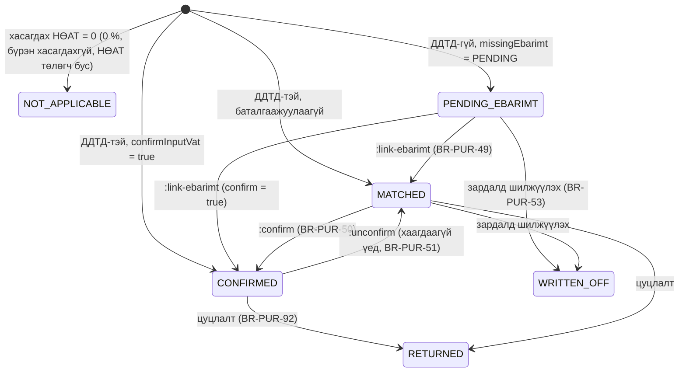

# 07. Худалдан авалт ба өглөг (Purchases & Payables) — модулийн тодорхойлолт

> **Төлөв:** Хөгжүүлэлтэд бэлэн ноорог v1.0. **Огноо:** 2026-10-07.
> **Модуль:** `purchase` (худалдан авалтын баримт) + `party` schema-ийн өглөгийн хэсэг (нийлүүлэгчийн дэд дэвтэр, тулгалт, урьдчилгаа, насжилт, хуулга; D-K2) + нийлүүлэгчийн eBarimt-ийн ДДТД ба орцын НӨАТ-ын баталгаажуулалтын худалдан авалтын тал (D-E4) + нийлүүлэгчид төлөх төлбөрийн санал ба төлбөрийн журналын өглөгийн тал.
> **Нэг эх сурвалж:** [DECISIONS.md](./DECISIONS.md) (§K: нэршлийг [`db/schema/*.sql`](./db/schema/) тодорхойлно). Бусад баримттай зөрвөл DECISIONS → schema → энэ баримт гэсэн дарааллаар давамгайлна.
> **Уншигч:** backend хөгжүүлэгч, QA, нягтлан ба татварын зөвлөх.
> **Холбоотой баримт:** [01-requirements.md](./01-requirements.md) (FR-PUR, FR-PTY-002/005/006/008..014, FR-TAX-004..011, FR-TAX-020/021, FR-BNK-003/005/006/018, FR-RPT-003/005/007), [02-architecture.md](./02-architecture.md) §4.2.5–4.2.7, §4.2.10, §4.2.12, §6, [03-domain-model.md](./03-domain-model.md) §3.5, §5, [05-posting-engine.md](./05-posting-engine.md), [06-sales-receivables.md](./06-sales-receivables.md) (авлагын толин тусгал), [11-fixed-assets-inventory.md](./11-fixed-assets-inventory.md) (R2: бараа, ҮХ-ийн мөр), [12-ebarimt-integration.md](./12-ebarimt-integration.md) §16, [13-security-audit-tenancy.md](./13-security-audit-tenancy.md) §6, [14-api.md](./14-api.md), [15-ui-ux.md](./15-ui-ux.md), [db/README.md](./db/README.md), [db/seed/README.md](./db/seed/README.md).
> **Судалгаа (BC эх):** [bc-sales-documents.md](./research/bc-sales-documents.md) (R-SALES-DOCUMENTS-nn, худалдан авалтын ялгаа R-SALES-DOCUMENTS-49..52), [bc-account-determination.md](./research/bc-account-determination.md) (R-ACCOUNT-DETERMINATION-nn), [bc-subledgers-application.md](./research/bc-subledgers-application.md) (R-SUBLEDGERS-APPLICATION-nn, §6.8), [bc-bank-cash.md](./research/bc-bank-cash.md) (R-BANK-CASH-nn, R-BANK-CASH-41), [bc-vat.md](./research/bc-vat.md) (R-VAT-nn), [bc-gl-posting.md](./research/bc-gl-posting.md) (R-GL-POSTING-nn), [mn-tax.md](./research/mn-tax.md) (§2.4, R5, R7, R8), [mn-integrations-market.md](./research/mn-integrations-market.md) (I-08).

## Агуулга

- [0. Энэ баримтыг хэрхэн унших](#0-энэ-баримтыг-хэрхэн-унших)
- [1. Зорилго ба хамрах хүрээ](#1-зорилго-ба-хамрах-хүрээ)
- [2. Ойлголт ба BC-ээс авсан зүйл](#2-ойлголт-ба-bc-ээс-авсан-зүйл)
- [3. Өгөгдөл](#3-өгөгдөл)
- [4. Бизнесийн дүрмүүд](#4-бизнесийн-дүрмүүд)
- [5. Процесс ба алгоритм](#5-процесс-ба-алгоритм)
- [6. Тооцоолол ба бөөрөнхийлөлт](#6-тооцоолол-ба-бөөрөнхийлөлт)
- [7. Posting-ийн жишээнүүд](#7-posting-ийн-жишээнүүд)
- [8. Validation ба алдааны кодууд](#8-validation-ба-алдааны-кодууд)
- [9. Events ба интеграц](#9-events-ба-интеграц)
- [10. API ба UI холбоос](#10-api-ба-ui-холбоос)
- [11. Тест сценари](#11-тест-сценари)
- [12. Schema change requests](#12-schema-change-requests)
- [13. Нээлттэй асуулт](#13-нээлттэй-асуулт)
- [Хавсралт А. Бусад баримттай зөрүү](#хавсралт-а-бусад-баримттай-зөрүү)

---

## 0. Энэ баримтыг хэрхэн унших

### 0.1 Тэмдэглэгээ

| Тэмдэглэгээ | Утга |
|---|---|
| `BR-PUR-nn` | Худалдан авалтын баримт, нийлүүлэгчийн ДДТД, орцын НӨАТ-ын бизнесийн дүрэм (энэ баримт эзэмшинэ) |
| `BR-AP-nn` | Өглөгийн дэд дэвтэр, тулгалт, урьдчилгаа, төлбөрийн журнал, төлөх нэхэмжлэхийн санал, насжилт, хуулгын дүрэм (энэ баримт эзэмшинэ) |
| `AT-PUR-nn`, `AT-AP-nn` | Хүлээн авах тест (Given/When/Then, §11.1) |
| `GS-PUR-nnn`, `GS-AP-nnn` | Golden scenario ([18-dev-setup.md](./18-dev-setup.md) §13.3-ын формат) |
| `P1..P15` | §7-ийн posting-ийн жишээ |
| `SCR-PUR-nn` | Энэ баримтын schema өөрчлөлтийн хүсэлт (§12) |
| `OQ-PUR-nn` | Нээлттэй асуулт (§13) |
| `Z-PUR-nn` | BC-ээс санаатай зөрүүтэй шийдвэр (§2.5) |
| `r(x)` | `MoneyMath.Round(x, d)`, `MidpointRounding.AwayFromZero` (ADR-0006). `d` = компанийн дүнгийн нарийвчлалын орон (0.01 → 2) |
| `rv(x)` | НӨАТ-ын бөөрөнхийлөлт: `company_setup.vat_rounding_type` (NEAREST / UP / DOWN), абсолют утгаар ([06](./06-sales-receivables.md) §6.1) |
| Тэмдэг | **Дебит = +, кредит = −** (D-C3). Нийлүүлэгчийн нэхэмжлэх **−**, төлбөр ба кредит нот **+** (R-SUBLEDGERS-APPLICATION §1, §6.8). UI ба баримтын resource-д өглөгийг эерэгээр харуулна (14 API-JSON-07) |
| Дүн | Жишээ бүр MNT, НӨАТ 10 %, нарийвчлал 0.01. Мянгатын тусгаарлагч нь зай (`1 100.00`) |
| ДДТД | Нийлүүлэгчийн eBarimt баримтын 33 оронтой дугаар (`platform.ddtd`, `^[0-9]{33}$`) |

### 0.2 Нэрийн зөрүүг шийдсэн байдал (D-K1: schema давамгайлна)

| Бусад баримтад | Энэ баримтад (schema) |
|---|---|
| `purchases.*`, `posted_purch_invoice(_line)`, `posted_purch_cr_memo(_line)` (02 §4.2.12) | `purchase.purchase_header/line`, `purchase.purch_inv_header/line`, `purchase.purch_cr_memo_header/line`, `purchase.cancelled_document` |
| `parties.vend_ledger_entry`, `detailed_vend_ledg_entry`, `vend_open_item` (02 §4.2.7) | `party.vendor_ledger_entry`, `party.detailed_vendor_ledger_entry`; нээлттэй үлдэгдэл нь `remaining_amount` кэш + `party.v_vendor_open_entry` |
| `tax.purchase_receipt` (02 §4.2.5) | `ebarimt.purchase_receipt` (130_ebarimt.sql). Логикийг Tax модуль эзэмшинэ, хүснэгт `ebarimt` schema-д (§3.1, §9.1) |
| `cash_bank.*`, `payment_document`, `payment_line` (02 §4.2.10) | `bank.bank_account`, `bank.bank_ledger_entry`, `bank.posted_cash_voucher`; төлбөрийн журнал нь `gl.journal_batch` / `gl.journal_line` (template `PAYMENT`) |
| `purchase.credit_memo.post` (14 §15.3), `tax.vat.confirm_input` (12-ын өмнөх хувилбар) | Seed-ийн нэр: `purchase.creditmemo.post`, `tax.vat_entry.confirm_deductible` |
| `rpt.ap_aging` (14 §15.5) | `rpt.vendor_aging` (15 S-RPT-06) |
| `11-purchases.md` (00-overview, 06 §1.2) | Энэ баримт (`07-purchases-payables.md`) |
| `event.PurchaseInvoicePosted` (02 §4.2.12) | Outbox topic `event.purchase_invoice.posted` (topic жижиг үсэгтэй, 06 §0.2) |
| Улаан сторно (`is_correction`, 02 §6.8) | Хэрэглэхгүй (D-C3). Кредит нот, буцаалт эсрэг тэмдгээр, эсрэг баганад |

---

## 1. Зорилго ба хамрах хүрээ

### 1.1 Зорилго

Энэ модуль нь бичил бизнесийн худалдан авалт ба нийлүүлэгчтэй хийх тооцоог нийлүүлэгчийн баримтаас эхлээд төлбөр хүртэл нэг зөв, давтагддаг аргаар бүртгэнэ:

1. Худалдан авалтын **нэхэмжлэх** ба **кредит нот** (буцаалт, үнийн хөнгөлөлт)-ын ноорог: нийлүүлэгчийн баримтын дугаар (заавал, давхардахгүй), бөөрөнхийлөлттэй дүн, НӨАТ, мөрийн хөнгөлөлт, төлөх огноо.
2. Нийлүүлэгчийн eBarimt-ийн **ДДТД**-ыг (33 орон) бүртгэх, шалгах; **орцын НӨАТ-ыг хасагдах эсэхийг** тодорхойлох (`deductible_confirmed`, D-E4), хасагдахгүй НӨАТ-ыг шалтгаантай нь зардал/хөрөнгөнд шингээх (FR-TAX-010), **НӨАТ төлөгч бус горимд** НӨАТ-ыг өртөгт шингээх (D-E5).
3. Нэг DB transaction-д **батлах** (posting): хуулийн завсаргүй дугаар, G/L, VAT entry, нийлүүлэгчийн entry + detailed entry, нийлүүлэгчийн баримтын бүртгэл (`ebarimt.purchase_receipt`), шууд төлбөр (бэлэн худалдан авалт, МХ-2).
4. **Нэхэмжлэх цуцлах** (бүтэн кредит нот) ба **засварлах** (цуцлах + шинэ ноорог).
5. **Өглөгийн дэд дэвтэр**: header entry + append-only detailed entry; үлдэгдэл detailed-ээс.
6. **Тулгалт** (application): тодорхой баримтад, олон баримтад хуваарилах, хамгийн эртийнхэд; **тулгалт буцаах** (unapply, хатуу LIFO); нийлүүлэгчид төлсөн **урьдчилгаа** ба түүнийг буцаан авах (refund).
7. Нийлүүлэгчид төлөх **төлбөрийн санал** (Suggest Vendor Payments) ба **төлбөрийн журнал**-ын өглөгийн тал.
8. **Өглөгийн насжилт**, нийлүүлэгчийн **дансны хуулга / тооцоо нийлсэн акт**, **худалдан авалтын журнал** (Order 100).

### 1.2 Хамрах хүрээ

| Хүрээнд | Хүрээнээс гадуур (эзэмшигч) |
|---|---|
| `purchase.*` хүснэгтүүд (ноорог, posted, `cancelled_document`, `purchase_setup`) | Нийлүүлэгчийн картын CRUD, ТТД татах, PII шифрлэлт (FR-PTY-002..004; 13) |
| `party.vendor_ledger_entry`, `party.detailed_vendor_ledger_entry`, `party.application_draft` (нийлүүлэгчийн хэсэг) | Авлагын хэсэг ([06](./06-sales-receivables.md)); тулгалтын цөм код нь Parties модульд **нэг** бөгөөд энэ баримт нийлүүлэгчийн онцлогийг тодорхойлно |
| Нийлүүлэгчийн ДДТД-ын бүртгэл, шалгалт, худалдан авалтын баримттай холбох, орцын НӨАТ баталгаажуулах **урсгал** (худалдан авалтын тал) | `getSaleListERP` импорт, автомат тулгалтын job (R2, [12](./12-ebarimt-integration.md) §16.3); ТТ-03а, НӨАТ-ын хаалт (`08-tax-vat-mn`) |
| Нийлүүлэгчид төлөх төлбөрийн **өглөгийн тал** (VLE, тулгалт), бэлэн худалдан авалтын төлбөрийн ваучерыг угсрах, төлбөрийн санал | Банк/кассын баримт, `bank.bank_ledger_entry`, МХ-1/МХ-2-ийн дугаар ба хэвлэмэл, хуулга импорт, банкны тулгалт (банк/кассын spec) |
| НӨАТ-ын баримтын тооцооны **хэрэглээ** (`ITaxCalculator`, §6) ба худалдан авалтын онцлог (НӨАТ-ын зөрүү, хасагдахгүй НӨАТ) | НӨАТ-ын тохиргоо, хувь, тайлан, хаалт (`08-tax-vat-mn`) |
| Данс тодорхойлох **хэрэглээ** (General Posting Setup, vendor posting group) | Тохиргооны CRUD (08, 15 S-GL-13, S-TAX-01) |
| Posting engine-ийн **хэрэглээ** (`IPostingService`) | Engine өөрөө, дугаарлалт, register, preview механизм ([05](./05-posting-engine.md)) |
| R2-ын `INVENTORY` бараа ба `FIXED_ASSET` мөрийн худалдан авалтын тал (данс, дүн) | Барааны өртөг, ҮХ-ийн дэвтэр ([11](./11-fixed-assets-inventory.md)) |

### 1.3 Хувилбар (DECISIONS §H)

| Хувилбар | Агуулга |
|---|---|
| **R1 (MVP)** | Нэхэмжлэх ба кредит нот (D-A4); мөрийн төрөл `COMMENT`, `GL_ACCOUNT`, `ITEM` (зөвхөн `SERVICE` / `NON_INVENTORY`, D-G5); үнэ НӨАТ-тэй/гүй; мөрийн хөнгөлөлт (D-F2); НӨАТ-ыг VAT identifier бүрээр (D-E3 ⚠); нийлүүлэгчийн баримтын НӨАТ-ыг хуулах **НӨАТ-ын зөрүү** (хязгаартай, FR-PUR-003); **хасагдахгүй НӨАТ** шалтгаантай (FR-TAX-010); **НӨАТ төлөгч бус горим** (D-E5 ⚠); нийлүүлэгчийн баримтын дугаар заавал ба давхардахгүй (FR-PUR-002); **ДДТД гараар бүртгэх, баталгаажуулах** (D-E4 ⚠, FR-PUR-003, FR-TAX-009); бэлэн худалдан авалт ба МХ-2 (FR-PUR-007); кредит нот + автомат тулгалт, цуцлах, засварлах (D-F6, FR-PUR-005/006); release/reopen; preview; өглөгийн дэд дэвтэр (D-F3, D-K2); тулгалт, unapply (LIFO); урьдчилгаа ба буцаан авалт (D-F4); төлөх огноо засах, `on_hold`; өглөгийн насжилт (D-F7); дансны хуулга/акт; худалдан авалтын журнал; төлбөрийн журнал (template `PAYMENT`) ба **төлөх нэхэмжлэхийн санал** (FR-BNK-018, Should); нэхэмжлэхээс төлбөр бүртгэх (FR-BNK-006-ын нийлүүлэгчийн тал); баталгаажаагүй орцын НӨАТ-ыг зардалд шилжүүлэх (Should, §5.12); зөвхөн MNT |
| **R2** | Валютын баримт ба тулгалтын ханшийн зөрүү (D-G3); `INVENTORY` бараа (D-G5) ба `FIXED_ASSET` олж авалт (D-G4) — [11](./11-fixed-assets-inventory.md); урвуу тооцоо (`REVERSE_CHARGE`, FR-TAX-020) ба гаалийн НӨАТ (`FULL_VAT`, FR-TAX-021; SCR-PUR-07); НХАТ (D-E6); нэхэмжлэхийн хөнгөлөлт; `getSaleListERP` импорт ба автомат тулгалт, баримтаас ноорог үүсгэх (FR-PUR-009, FR-PUR-010, FR-EBR-018); netting (D-F8, FR-PTY-015); хялбаршуулсан НӨАТ-ын горимын хасагдахгүй НӨАТ (FR-TAX-022) |
| **R3** | Худалдан авалтын захиалга, хэсэгчилсэн нэхэмжлэл (D-A4, FR-PUR-008); approval (D-I4); банкны API-аар төлбөр илгээх |
| **Хувилбаргүй (01 §7)** | Суутган татвар (WHT) нийлүүлэгчийн төлбөрт; банкны бөөн төлбөрийн файл экспорт |

### 1.4 Шаардлагын хамрах хүснэгт (traceability)

| FR | Гарчиг | Хувилбар | Энэ баримтын хэсэг |
|---|---|---|---|
| FR-PUR-001 | Худалдан авалтын нэхэмжлэх | R1 | BR-PUR-01..09, BR-PUR-55..70, §5.7, P1 |
| FR-PUR-002 | Нийлүүлэгчийн баримтын дугаар ба давхардал | R1 | BR-PUR-10..14, §5.2, AT-PUR-03..06 |
| FR-PUR-003 | Нийлүүлэгчийн eBarimt-ийн мэдээлэл, НӨАТ-ын зөрүү | R1 | BR-PUR-33..36, BR-PUR-42..48, §5.5, §5.10, P1, P2 |
| FR-PUR-004 | Мөрийн төрөл | R1 | BR-PUR-15..22 |
| FR-PUR-005 | Кредит нот | R1 | BR-PUR-77..85, §5.14, P6 |
| FR-PUR-006 | Нэхэмжлэх цуцлах (+ засварлах) | R1 (Should) | BR-PUR-86..94, §5.15, P7 |
| FR-PUR-007 | Бэлэн худалдан авалт | R1 (Should) | BR-PUR-71..76, §5.13, P2 |
| FR-PUR-008 | Худалдан авалтын захиалга | **R3** | Хамрахгүй (D-A4) |
| FR-PUR-009, 010 | eBarimt-тэй автомат тулгалт, баримтаас ноорог | **R2** | §5.11 (гэрээ), 12 §16.3 |
| FR-TAX-004..008 | Баримтын НӨАТ, PIV, кредит нот, VAT entry, НӨАТ-ын огноо | R1 | BR-PUR-27..32, BR-PUR-59, §6.3–6.5 |
| FR-TAX-009 | Орцын НӨАТ зөвхөн баталгаажсан ДДТД-тэй | R1 | BR-PUR-46..54, §5.10–5.12, P5 |
| FR-TAX-010 | Хасагдахгүй орцын НӨАТ | R1 | BR-PUR-37..40, §6.6, P3 |
| FR-TAX-011 | НӨАТ төлөгч бус горим | R1 | BR-PUR-37, 41, P4 |
| FR-TAX-020, 021 | Урвуу тооцоо, гаалийн НӨАТ | **R2** | BR-PUR-19, P13, P14 |
| FR-PTY-002 | Нийлүүлэгчийн карт (хэрэглээ) | R1 | BR-PUR-02, 03, 22 |
| FR-PTY-005, 006 | Posting group, төлбөрийн нөхцөл | R1 | BR-PUR-05, 68, BR-AP-02 |
| FR-PTY-008 | Өглөгийн дэд дэвтэр | R1 | BR-AP-01..13, §5.9 |
| FR-PTY-009..011 | Тулгалт, хуваарилалт, unapply | R1 | BR-AP-20..46, §5.16–5.17, P8, P9 |
| FR-PTY-012 | Урьдчилгаа | R1 | BR-AP-50..55, §5.18, P10 |
| FR-PTY-013, 014 | Тулгалтын огноо, entry засвар | R1 | BR-AP-12, 25, 26 |
| FR-BNK-003 | Кассын зарлагын баримт (МХ-2) — худалдан авалтын тал | R1 | BR-PUR-74, P2 |
| FR-BNK-005, 006 | Банкны төлбөр, нэхэмжлэхээс төлбөр бүртгэх (нийлүүлэгч) | R1 | BR-AP-60..69, §5.19, §5.21, P8 |
| FR-BNK-018 | Төлөх нэхэмжлэхийн санал | R1 (Should) | BR-AP-70..79, §5.20, P11 |
| FR-RPT-003 | Нийлүүлэгчийн дансны хуулга, акт | R1 | BR-AP-80..83, §5.22, P12 |
| FR-RPT-005 | Өглөгийн насжилт | R1 | BR-AP-84..86, §5.22, P12 |
| FR-RPT-007 | Худалдан авалтын журнал | R1 (Should) | §5.22.3 |
| FR-GL-011 | Preview | R1 | §5.23 |

---

## 2. Ойлголт ба BC-ээс авсан зүйл

### 2.1 Үндсэн ойлголт

| Нэр томьёо | English | Энэ системд |
|---|---|---|
| Ноорог | Draft (open document) | `purchase.purchase_header` + `purchase_line`; `status` = `OPEN` / `RELEASED`; хуулийн бус дугаар (`DPI-…`, `DPC-…`) |
| Батлах | Posting | Ноорогийг нэг DB transaction-д posted баримт, G/L, VAT, өглөгийн entry болгож ноорогийг устгах (D-C6) |
| Батлагдсан баримт | Posted document | `purchase.purch_inv_header/line`, `purchase.purch_cr_memo_header/line`; хэзээ ч өөрчлөгдөхгүй (D-C4) |
| Нийлүүлэгчийн нэхэмжлэхийн дугаар | Vendor invoice no. | `vendor_invoice_no` / `vendor_cr_memo_no` (≤ 35); VLE-ийн `external_document_no`; нийлүүлэгч × баримтын төрөлд давхардахгүй (INV-18) |
| ДДТД | eBarimt receipt ID | Нийлүүлэгчийн гаргасан eBarimt баримтын 33 оронтой дугаар; `supplier_ebarimt_id`; бүртгэл нь `ebarimt.purchase_receipt` |
| Орцын НӨАТ | Input VAT | Худалдан авалтын НӨАТ; G/L-д `purchase_vat_account_id` (seed 1300) |
| Хасагдах НӨАТ / баталгаажсан | Deductible / confirmed input VAT | `tax.vat_entry.deductible_confirmed = true`; НӨАТ-ын тайланд (ТТ-03а) зөвхөн эдгээр орно (D-E4) |
| Хасагдахгүй НӨАТ | Non-deductible VAT | Хуулиар хасагдахгүй (суудлын автомашин г.м.) эсвэл НӨАТ төлөгч бус компанийн НӨАТ; зардал/хөрөнгөнд шингэнэ (`non_deductible_vat_amount`) |
| НӨАТ-ын зөрүү | VAT difference | Нийлүүлэгчийн баримтын НӨАТ-ыг яг хуулахын тулд системийн тооцоолсон НӨАТ-аас ялгах дүн (хязгаартай, R-VAT-14) |
| Харьцсан данс | Balancing (bal.) account | Төлбөрийн хэлбэрийн касс/банк; бэлэн худалдан авалтын автомат төлбөр (D-F5) |
| Нийлүүлэгчийн дэвтрийн бичилт | Vendor ledger entry (VLE) | `party.vendor_ledger_entry`: баримт бүрд нэг мөр |
| Дэлгэрэнгүй бичилт | Detailed vendor ledger entry (DVLE) | `party.detailed_vendor_ledger_entry`: мөнгөн хөдөлгөөн бүр, append-only |
| Тулгалт | Application | Эсрэг тэмдэгтэй хоёр нээлттэй entry-ийн хооронд үлдэгдэл шилжүүлэх; MNT-д G/L-д нөлөөгүй |
| Урьдчилгаа | Prepayment | Нэхэмжлэхгүйгээр төлсөн, тулгагдаагүй `PAYMENT` entry (эерэг үлдэгдэл, D-F4) |
| Буцаан авалт | Refund | Нийлүүлэгчээс мөнгө буцааж авах `REFUND` entry (сөрөг) |
| Төлбөрийн журнал | Payment journal | `gl.journal_template.code = 'PAYMENT'` (source `PAYMENTJNL`), batch `BANK` (`BP`) ба `CASH` (`KZ`, МХ-2) |
| Төлөх нэхэмжлэхийн санал | Suggest vendor payments | Төлөх огноо болсон нээлттэй нэхэмжлэхээс төлбөрийн журналын мөр санал болгох (R-BANK-CASH-41) |

### 2.2 BC-ээс хуулсан зүйл (логик, бүтэц биш)

| BC ойлголт / объект | Энэ системд | Судалгааны дүрэм |
|---|---|---|
| Purchase Header/Line (T38/39), Status Open/Released, Release/Reopen | `purchase_header.status`, `:release`, `:reopen` | R-SALES-DOCUMENTS-05, 19..21 (толин тусгал) |
| Header-ийн анхдагчийг нийлүүлэгчээс авах (Pay-to = Buy-from, D-A5) | Vendor posting group, Gen./VAT Bus., нөхцөл, хэлбэр, PIV-ийн snapshot | R-SALES-DOCUMENTS-52; R-ACCOUNT-DETERMINATION-05, 07 |
| `Vendor Invoice No.` / `Vendor Cr. Memo No.` заавал (`Ext. Doc. No. Mandatory` анхдагч true) | `purchase_setup.ext_doc_no_mandatory` (seed true) | R-SALES-DOCUMENTS-49 |
| Давхардлын шалгалт: (Pay-to vendor, Document Type, External Document No.) буцаагдаагүй entry-үүд дунд; заавал биш үед ч дугаар өгвөл шалгана | `ux_vendor_ledger_entry__vendor_doc_no` + апп-ын урьдчилсан шалгалт | R-SALES-DOCUMENTS-50; INV-18 |
| Худалдан авалтын тэмдэг: зөвхөн **кредит нотын** мөрийг урвуулна; vendor entry = −Total AIV | §5.8 | R-SALES-DOCUMENTS-51; R-ACCOUNT-DETERMINATION-11, 23 |
| Мөрийн дүн `r(Qty×Cost) − LDA`, хөнгөлөлтийн давхар бөөрөнхийлөлт | §6.2 | R-SALES-DOCUMENTS-12, 13 |
| Баримтын НӨАТ-ыг VAT Amount Line (identifier, calc type, positive)-ээр нэг удаа бөөрөнхийлж мөрт хуваарилах | §6.3–6.5 | R-SALES-DOCUMENTS-14; R-VAT-08, 10, 12, 13 |
| VAT Difference: `Allow VAT Difference` + `Max. VAT Difference Allowed` | `purchase_setup.allow_vat_difference`, `general_ledger_setup.max_vat_difference_allowed` | R-VAT-14; bc-vat §7 (5) |
| Invoice Posting Buffer (төрөл, данс, бүлгүүд, dimension) | `PostingBuffer` (05 §5.7.1) | R-ACCOUNT-DETERMINATION-17, 18 |
| Худалдан авалтын данс: G/L мөр → өөрийн данс; бараа → `Purch. Account` / `Purch. Credit Memo Account` | §5.8 | R-ACCOUNT-DETERMINATION-02, 03 |
| Худалдан авалтын хөнгөлөлтийн данс заавал (хөнгөлөлт ≠ 0 үед) | BR-PUR-25 | R-ACCOUNT-DETERMINATION-13, 14, 15 |
| Payables account = Vendor Posting Group | BR-PUR-68 | R-ACCOUNT-DETERMINATION-07 |
| Purchase VAT account (Normal: 1 мөр; Reverse charge: 2 мөр, цэвэр 0; Full VAT: суурь нь VAT данс) | §5.8, P13, P14 | R-ACCOUNT-DETERMINATION-08; R-VAT-07a, 07b |
| Bal. Account → тусдаа Payment (Refund) гүйлгээ, шинэ entry-д тулгагдана | §5.13 | R-SALES-DOCUMENTS-37; R-ACCOUNT-DETERMINATION-25 |
| Cancel = хуулбар кредит нот + тулгалт + Cancelled Document; Correct = Cancel + шинэ ноорог | §5.15 | R-SALES-DOCUMENTS-43, 44, 45 |
| Due Date = CalcDate(Due Date Calculation, Document Date) | §5.3 | R-SALES-DOCUMENTS-47, 52 |
| Vendor Ledger Entry + Detailed (T25/T380): INITIAL 0 дүнтэй ч үүснэ, `Positive` | §5.9 | R-SUBLEDGERS-APPLICATION-01..03, 07 |
| Vendor Balance / Net Change / Balance Due = **−**Σ detailed | `party.v_vendor_balance` (тэмдэг урвуулж харуулна) | R-SUBLEDGERS-APPLICATION-33 |
| Applies-to Doc. No. ба Applies-to ID, Apply to Oldest, G/L-гүй тулгалт (Transaction No. 0) | §5.16 | R-SUBLEDGERS-APPLICATION-08, 11..14, 16, 19, 21..23 |
| Unapply: толин тусгал мөр, LIFO | §5.17 | R-SUBLEDGERS-APPLICATION-28..31 |
| Aged AP: posting ≤ D, Σ detailed ≤ D, due date-ээр | `party.fn_vendor_aging` | R-SUBLEDGERS-APPLICATION-34 |
| Suggest Vendor Payments: блоклогдоогүй нийлүүлэгч, нээлттэй, `On Hold` хоосон, `Due Date ≤ Last Payment Date`, нийлүүлэгчийн цэвэр дүн дебит бол хасах, `Amount Available` хязгаар, өөр batch-д орсон entry-г алгасах, төлбөрийн огнооноос хойш бүртгэгдсэн entry-г алгасах | §5.20 | R-BANK-CASH-41; bc-bank-cash §8 |
| Payment Journal: Account = Vendor, Bal. = Bank, Applies-to Doc./ID | §5.19 | bc-bank-cash §2 (Payment journal), F3 |
| Preview = ижил код + rollback | §5.23 | R-SALES-DOCUMENTS-42; R-GL-POSTING-42 |

### 2.3 Хялбарчилсан зүйл

| BC | Хялбарчлал | Шалтгаан / дүрэм |
|---|---|---|
| 6 баримтын төрөл (Quote, Order, Return Order, Blanket) | Зөвхөн `INVOICE`, `CREDIT_MEMO` | D-A4 |
| Buy-from ≠ Pay-to | Нэг `vendor_id`; бүлгүүд нэг нийлүүлэгчээс | D-A5; R-SALES-DOCUMENTS-52 |
| Receipt + Invoice, хэсэгчилсэн нэхэмжлэл | Нэхэмжлэх бүх тоог нэг дор | D-A4 |
| Posting No.-ийг эрт олгож commit хийх | Дугаарыг posting transaction дотор түгжээтэй counter-оос, нэг commit | D-C6, D-C7; R-SALES-DOCUMENTS-30 |
| Non-Deductible VAT (CU6200, %-ийн тохиргоо) | Мөрийн шалтгаан (SCR-PUR-01) + `vat_posting_setup.non_deductible_vat_percent` (НӨАТ төлөгч бус компанид 100); хувь нь 0 эсвэл 100 (R1-д хэсэгчилсэн хувь зөвхөн тохиргооноос) | mn-tax R5; D-E5; bc-vat §7 (6) |
| Applies-to ID-г ledger мөрөнд хадгалах | `party.application_draft` (сесс эсвэл журналын мөрийн эзэмшилтэй, SCR-PUR-04) | FR-PTY-010; R-SUBLEDGERS-APPLICATION-23 |
| Холимог тэмдэгтэй тулгалт (R-15) | Зөвхөн эсрэг тэмдэгтэй хос | R-SUBLEDGERS-APPLICATION-15 |
| Suggest Vendor Payments-ийн priority, payment discount, check | Хасна; дараалал нь төлөх огноо | R-BANK-CASH-41 ("Drop priority and discounts in v1") |
| Payment Terms-ийн хөнгөлөлтийн хэсэг | Зөвхөн `due_date` | R-SALES-DOCUMENTS-47 |
| Vendor Posting Group солих (Alt. group) | Ноорог дээр засагдахгүй | R-ACCOUNT-DETERMINATION-29 |

### 2.4 Хассан зүйл

| BC | Хассан шалтгаан | Дүрэм |
|---|---|---|
| Сторно (`Correction`) | D-C3: эсрэг тэмдэг, эсрэг багана | R-SUBLEDGERS-APPLICATION-05 |
| Payment discount, payment tolerance | Бичил бизнест ховор; `entry_type` schema-д нөөцлөгдсөн | R-SUBLEDGERS-APPLICATION-27 |
| Unrealized VAT | MN-д хуримтлалын арга | R-VAT-25 |
| Use Tax, Sales Tax, Tax Area | US-ийн тусгай | D-E1 |
| Item charge, Resource, Job, Deferral мөр | MVP-д шаардлагагүй | R-ACCOUNT-DETERMINATION-27 |
| Prepayment invoice (Prepayment %) | Урьдчилгааг нээлттэй төлбөрийн entry-ээр (D-F4) | D-F4 |
| Check ledger, positive pay, SEPA | MN-д ховор | bc-bank-cash §7 (12) |
| Vendor Invoice Rounding (нийлүүлэгчийн бэлэн мөнгөний бүхэлчлэл) | Нийлүүлэгчийн баримтын дүнгээр төлнө (edge case 11.3 #12) | D-C2 |

### 2.5 BC-ээс санаатай зөрүүтэй шийдвэр

| # | BC | Энэ систем | Шалтгаан |
|---|---|---|---|
| Z-PUR-01 | Орцын НӨАТ posting-д л тооцогдоно; eBarimt-тэй холбоогүй | VAT entry-д `deductible_confirmed`, `supplier_ebarimt_id`; ДДТД-гүй бол "хүлээгдэж буй" (PENDING) эсвэл хасагдахгүй (NO_EBARIMT) гэж **ил тодоор сонгоно** (BR-PUR-46) | D-E4 ⚠; mn-tax R5; FR-TAX-009 AC1 ба 12 PUR-01-ийг уялдуулсан |
| Z-PUR-02 | `Ext. Doc. No. Mandatory = false` үед нийлүүлэгчийн дугааргүй батлана | Posted header (`vendor_invoice_no NOT NULL`) ба VLE CHECK нь дугаар шаарддаг тул хоосон бол **ДДТД, эс бөгөөс ноорогийн дугаараар** бөглөж анхааруулна (BR-PUR-11) | 080_purchase.sql, 060_party.sql CHECK |
| Z-PUR-03 | Цуцлалтын кредит нот нэхэмжлэхийн огноог өвлөнө | Хэрэглэгчийн огноо, анхдагч **өнөөдөр** | D-F6; 06 Z-01 |
| Z-PUR-04 | Цуцлалтын кредит нотын `Vendor Cr. Memo No.` = кредит нотын өөрийн дугаар | `vendorCrMemoNo ?? "CXL-" + нэхэмжлэхийн дугаар` (ноорог үүсэхгүй тул) | BR-PUR-89 |
| Z-PUR-05 | Applied CV Ledger Entry No. = шинэ entry | **Хосын нөгөө entry** | 06 Z-02 (Parties-ийн нэг цөм) |
| Z-PUR-06 | LIFO шалгалт Transaction No. 0 тулгалтыг алгасдаг | Бүх тулгалтад **хатуу LIFO** | 06 Z-03; R-SUBLEDGERS-APPLICATION-29 |
| Z-PUR-07 | Bal. Account ба Applies-to бие биенээ үгүйсгэнэ | Хоёулаа: эхлээд applies-to (урьдчилгаа), **үлдсэн** дүнг харьцсан дансаар | 06 Z-04 |
| Z-PUR-08 | "Check Other Journal Batches" зөвхөн SaaS-д анхдагчаар | Өөр журнал/ноорогт орсон entry-г **үргэлж** алгасна | bc-bank-cash §8 (verified-corrected) |
| Z-PUR-09 | Өөр posting group-тэй entry-үүдийг тулгахад BC G/L-ээр шилжүүлэг хийж болно (Allow Multiple Posting Groups) | R1-д өөр vendor posting group-тэй entry хооронд тулгахгүй (`party.application_posting_group_mismatch`) | Өглөгийн данс тус бүрийн дэд дэвтэр = G/L (INV-11) энгийн байх |
| Z-PUR-10 | Suggest-ийн хязгаар хүрэхэд entry-г бүхлээр нь алгасна | Хязгаарын сүүлийн entry-г **хэсэгчлэн** төлж хязгаарыг яг дүүргэнэ (FR-BNK-018 AC1) | OQ-PUR-10 |

---

## 3. Өгөгдөл

Бүх хүснэгт, баганы нэр нь [`db/schema/*.sql`](./db/schema/)-ээс (D-K1). Энэ хэсэгт зөвхөн энэ модулийн **хэрэглэдэг** багануудыг утгатай нь жагсаана. Schema-д байхгүй зүйлийг §12-т (SCR-PUR-nn) хүсэлт болгосон; энд чимээгүй зохиогоогүй.

### 3.1 Хүснэгтийн эзэмшил ба бичих зам

| Хүснэгт | Эзэмшигч модуль | Энэ модулийн хандалт | Бичих зам |
|---|---|---|---|
| `purchase.purchase_setup` | Purchases | R/M (тохиргоо) | EF Core, `row_version` |
| `purchase.purchase_header`, `purchase.purchase_line` | Purchases | RIMD (ноорог) | EF Core aggregate; posting-д DELETE |
| `purchase.purch_inv_header/line`, `purchase.purch_cr_memo_header/line` | Purchases | RI (append-only, 910) | `IPostedDocumentWriter` (posting transaction) |
| `purchase.cancelled_document` | Purchases | RI | Цуцлалтын posting transaction |
| `party.vendor`, `vendor_bank_account`, `payment_terms`, `payment_method`, `vendor_posting_group`, `gen_bus/prod_posting_group`, `general_posting_setup` | Parties | R | `IPartyDirectory`, `IAccountDetermination` |
| `party.vendor_ledger_entry`, `party.detailed_vendor_ledger_entry` | Parties (D-K2) | R; бичих нь зөвхөн `ILedgerWriter<VendorLedgerLine>` ба `IApplicationService` | Posting transaction; кэш баганыг trigger |
| `party.application_draft` (`party_type = 'VENDOR'`) | Parties | RIMD (тулгалтын ажлын хуудас, журналын хуваарилалт) | EF Core |
| `gl.gl_transaction`, `gl.gl_entry`, `gl.gl_register` | GL | — (engine бичнэ) | `IPostingService` |
| `gl.journal_batch`, `gl.journal_line` (template `PAYMENT`) | GL | Төлбөрийн саналаар мөр үүсгэх (Cash&Bank-ийн use case → `IJournalLineWriter`) | GL.Contracts |
| `tax.vat_entry`, `tax.gl_entry_vat_entry_link`, `tax.vat_posting_setup` | Tax | R (setup); VAT entry-г зөвхөн Tax writer | `ILedgerWriter<VatLedgerLine>`; `deductible_confirmed` нь `IInputVatEvidenceService` (Tax) → `platform.fn_ledger_update` |
| `ebarimt.purchase_receipt` | EBarimt (хүснэгт), логик Tax (02 §4.2.5) | — (шууд хандахгүй) | Tax.Contracts `IInputVatEvidenceService` → EBarimt.Contracts `IPurchaseReceiptRegistry` (02 §4.3: Purchases → EBarimt хамаарал хориотой) |
| `bank.bank_account`, `bank.bank_ledger_entry`, `bank.posted_cash_voucher` | Cash&Bank | R (данс) | `ILedgerWriter<BankLedgerLine>` (бэлэн худалдан авалт, төлбөр) |
| `integration.outbox` | Integration | I | `PostingDocument.Outbox` |
| `audit.posting_log` | Platform | I | Engine (амжилт), тусдаа transaction (бүтэлгүйтэл) |
| `inv.item` | Inventory | R; `last_direct_cost`-ийг `IItemCostUpdater`-ээр (BR-PUR-64) | Inventory.Contracts |

### 3.2 `purchase.purchase_setup` (BC T312)

| Багана | Утга ба хэрэглээ |
|---|---|
| `invoice_nos_id`, `credit_memo_nos_id` | Ноорогийн цуврал (`PI_DRAFT` → `DPI-000123`, `PC_DRAFT`); завсартай байж болно |
| `posted_invoice_nos_id`, `posted_credit_memo_nos_id` | Хуулийн завсаргүй цуврал (`PI` → `PI-2027-00030`, `PC` → `PC-2027-00004`), `gapless = date_order = reset_yearly = true` (seed) |
| `vendor_nos_id` | Нийлүүлэгчийн карт (энэ модульд хамаарахгүй) |
| `discount_posting` | `NO_DISCOUNTS` (анхдагч, D-F2: хөнгөлөлтийг цэвэр дүнгээр) / `LINE_DISCOUNTS` / `INVOICE_DISCOUNTS` (R2) / `ALL_DISCOUNTS` |
| `ext_doc_no_mandatory` | Нийлүүлэгчийн баримтын дугаар заавал (seed **true**, R-SALES-DOCUMENTS-49). `false` үед BR-PUR-11 (Z-PUR-02) |
| `require_supplier_ebarimt` | `true` (seed): хасагдах орцын НӨАТ-тай баримтыг ДДТД-гүй батлахад хэрэглэгч PENDING/NON_DEDUCTIBLE-ийг ил сонгоно (BR-PUR-46) |
| `allow_vat_difference` | `true` (seed): бүлгийн НӨАТ-ыг нийлүүлэгчийн баримтаар засахыг зөвшөөрнө (BR-PUR-33); хязгаар нь `gl.general_ledger_setup.max_vat_difference_allowed` |
| `link_doc_date_to_posting_date` | `true` бол `posting_date` өөрчлөгдөхөд `document_date` дагана (R-SALES-DOCUMENTS-02, 07). Худалдан авалтад нийлүүлэгчийн баримтын огноог гараар оруулбал түүнийг хадгална (BR-PUR-06) |

### 3.3 `purchase.purchase_header` (ноорог, BC T38)

| Багана | Утга ба дүрэм |
|---|---|
| `id` | UUIDv7; API-ийн тогтвортой id (posted-д `draft_id` болж шилжинэ) |
| `document_type` | `INVOICE` / `CREDIT_MEMO` |
| `no` | Ноорогийн дугаар (хуулийн биш) |
| `status` | `OPEN` / `RELEASED` (BR-PUR-95) |
| `vendor_id`, `vendor_name` | Нийлүүлэгч ба нэрийн snapshot (засаж болно) |
| `vendor_invoice_no` | Нийлүүлэгчийн нэхэмжлэхийн дугаар (`INVOICE`-д; normalize хийсэн, BR-PUR-10) |
| `vendor_cr_memo_no` | Нийлүүлэгчийн кредит нотын дугаар (`CREDIT_MEMO`-д) |
| `supplier_ebarimt_id` | Нийлүүлэгчийн ДДТД (33 орон, BR-PUR-42). Кредит нотод нийлүүлэгчийн буцаалт/засварын баримт |
| `purchase_receipt_id` | Холбосон `ebarimt.purchase_receipt` (R2 импорт эсвэл цуцлалтаас шилжсэн, BR-PUR-92) |
| `posting_date`, `document_date` | Батлах огноо; нийлүүлэгчийн баримтын огноо (төлөх огноог үүнээс) |
| `vat_date` | НӨАТ-ын огноо; NULL = `posting_date`; хоцорсон нэхэмжлэхэд эрт огноо (D-E9, BR-PUR-59) |
| `due_date` | Төлөх огноо (BR-PUR-05) |
| `prices_including_vat` | Үнэ НӨАТ-тэй эсэх (нийлүүлэгчээс анхдагч; eBarimt-ийн баримт НӨАТ-тэй дүнтэй тул бэлэн худалдан авалтад ихэвчлэн `true`) |
| `currency_code`, `currency_factor` | R1: NULL (MNT) |
| `payment_terms_id` | Төлбөрийн нөхцөл |
| `payment_method_id`, `bal_account_type`, `bal_account_id` | Төлбөрийн хэлбэр ба харьцсан данс (бэлэн худалдан авалт, BR-PUR-71). `bal_account_type ∈ {GL_ACCOUNT, BANK_ACCOUNT}` |
| `vendor_posting_group_id`, `gen_bus_posting_group_id`, `vat_bus_posting_group_id` | Нийлүүлэгчээс snapshot (BR-PUR-02) |
| `applies_to_doc_type`, `applies_to_doc_no` | Батлахад тулгах нэг баримт (кредит нот → нэхэмжлэх; нэхэмжлэх → урьдчилгаа `PAYMENT`) |
| `applies_to_id` | R1-д NULL (BR-AP-34) |
| `corrected_invoice_id` | Кредит нотын засаж буй posted нэхэмжлэх (CHECK: зөвхөн `CREDIT_MEMO`) |
| `reason_code_id` | Шалтгаан; кредит нотод заавал (BR-PUR-78) |
| `dimension_set_id` | Толгойн dimension |
| `invoice_discount_calculation`, `invoice_discount_value` | R2; R1-д `NONE`, 0 |
| `posting_no_series_id` | Хуулийн цувралыг дарж заах (NULL = setup-ийнх) |
| `amount`, `amount_including_vat`, `vat_amount`, `city_tax_amount` | Тооцоолсон кэш (§6.8). `vat_amount` нь **бүтэн** НӨАТ (хасагдахгүй хэсгийг оруулсан) |
| `row_version` | ETag/If-Match |

### 3.4 `purchase.purchase_line` (ноорог, BC T39)

| Багана | Утга ба дүрэм |
|---|---|
| `line_no` | Мөрийн дугаар (10000 алхамтай); бүх тооцоолол `line_no` өсөхөөр |
| `line_type` | `COMMENT` / `GL_ACCOUNT` / `ITEM` / `FIXED_ASSET` (R2) |
| `gl_account_id`, `item_id`, `fixed_asset_id` | Төрөлтэй CHECK-ээр уялдсан |
| `description`, `unit_of_measure_code` | Тайлбар (≤ 250), хэмжих нэгж |
| `quantity` | `numeric(19,5)`, ≥ 0 (CHECK) |
| `direct_unit_cost` | Нэгжийн өртөг `numeric(19,6)`; баримтын `prices_including_vat`-ийн дагуу НӨАТ-тэй/гүй; сөрөг зөвхөн `GL_ACCOUNT` мөрөнд (BR-PUR-18) |
| `line_discount_percent`, `line_discount_amount` | Мөрийн хөнгөлөлт (§6.2) |
| `line_amount` | `r(quantity × direct_unit_cost) − line_discount_amount` |
| `inv_discount_amount` | R2; R1-д 0 |
| `amount` | НӨАТ-гүй цэвэр дүн |
| `amount_including_vat` | НӨАТ-тэй дүн (бүтэн НӨАТ) |
| `vat_base_amount` | НӨАТ-ын суурь (`NORMAL`-д = `amount`; `FULL_VAT`-д 0) |
| `vat_percent`, `vat_calculation_type`, `vat_identifier` | `tax.vat_posting_setup`-ээс, хувь нь огнооны параметрээс snapshot (D-E7) |
| `vat_difference` | Нийлүүлэгчийн баримтын НӨАТ-ыг хуулахын тулд мөрт ногдсон зөрүү (Σ бүлгээр = бүлгийн зөрүү, BR-PUR-34) |
| `non_deductible_vat_amount` | Хасагдахгүй НӨАТ (≤ мөрийн НӨАТ, BR-PUR-38). Шалтгаан нь SCR-PUR-01 (`non_deductible_reason`) хүртэл зөвхөн апп-ын санах ойд ба `audit`-д |
| `gen_bus_posting_group_id`, `vat_bus_posting_group_id` | Толгойноос |
| `gen_prod_posting_group_id`, `vat_prod_posting_group_id` | Бараа/дансаас snapshot |
| `city_tax_code_id`, `city_tax_amount` | R2 (D-E6); R1-д NULL / 0 |
| `depreciation_book_id`, `location_id` | R2 (ҮХ, бараа) |
| `dimension_set_id` | Мөрийн dimension (анхдагч = толгойн) |

> **SCR-PUR-01-ийн хамаарал.** Мөрийн хасагдахгүй **дүн** (`non_deductible_vat_amount`) schema-д бий, харин **шалтгаан** (`PASSENGER_CAR`, `PERSONAL_USE`, `EXEMPT_RELATED`, `NO_EBARIMT`) хадгалах багана алга. Шалтгаангүйгээр ноорог дахин тооцогдох бүрд хасагдахгүй дүнг сэргээх боломжгүй, аудитын мөр ч үлдэхгүй. Тиймээс FR-TAX-010 ба BR-PUR-46-ийн `NON_DEDUCTIBLE` сонголт нь SCR-PUR-01-ээс **хамаарна** (R1-ийн урьдчилсан нөхцөл). НӨАТ төлөгч бус горим (шалтгаан `NON_VAT_COMPANY`) нь компанийн тохиргоо ба `vat_posting_setup.non_deductible_vat_percent`-оос гардаг тул SCR-гүйгээр ажиллана.

### 3.5 Батлагдсан баримт (BC T122–T125, T1900)

`purchase.purch_inv_header` ба `purchase.purch_cr_memo_header` нь ноорогийн талбарын **snapshot**-ийг кодоор хадгална (`vendor_no`, `vendor_posting_group`, `gen_bus_posting_group`, `vat_bus_posting_group`, `payment_terms_code`, `payment_method_code` нь `platform.code20` текст, FK биш). Нэмэлт:

| Багана | Утга |
|---|---|
| `no` | Хуулийн завсаргүй дугаар (`PI-2027-00030`, `PC-2027-00004`) |
| `pre_assigned_no`, `draft_id` | Ноорогийн дугаар ба id (`ux_*__draft` UNIQUE: нэг ноорог нэг л удаа батлагдана) |
| `vendor_tin` | Нийлүүлэгчийн ТТД-ийн snapshot = `vendor.ebarimt_merchant_tin ?? vendor.tin` (хувь хүн бол 13-ын PII дүрэм) |
| `vendor_invoice_no` (NOT NULL) / `vendor_cr_memo_no` (NOT NULL) | Нийлүүлэгчийн баримтын дугаар (BR-PUR-11) |
| `supplier_ebarimt_id` | Posting үеийн ДДТД. **Батласны дараа бүртгэсэн ДДТД энд орохгүй** (posted header өөрчлөгдөхгүй); тэр үед "үр дүнгийн ДДТД" = `coalesce(header.supplier_ebarimt_id, receipt.ddtd)` (`ebarimt.purchase_receipt.purch_inv_header_id`-ээр, BR-PUR-49) |
| `posting_date`, `document_date`, `vat_date`, `due_date` | NOT NULL; кредит нотын `due_date` = `document_date` |
| `amount`, `amount_including_vat`, `vat_amount`, `city_tax_amount`, `invoice_discount_amount` | Баримтын нийлбэр (`vat_amount` = бүтэн НӨАТ) |
| `amount_lcy`, `amount_including_vat_lcy` | R1: = баримтын дүн |
| `vendor_ledger_entry_no` | Баримтын VLE (`party.vendor_ledger_entry.entry_no`, DEFERRABLE FK) |
| `transaction_no`, `gl_register_no` | Баримтын G/L ваучер ба register (бэлэн худалдан авалтын төлбөрийн ваучер нь VLE-ээр олдоно; SCR-PUR-08) |
| CM: `applies_to_doc_type`, `applies_to_doc_no`, `corrected_invoice_id` | Кредит нотын засаж буй нэхэмжлэх |

Posted мөр (`purch_inv_line`, `purch_cr_memo_line`) нь ноорогийн мөрийн дүнгүүд + `no` (данс/барааны дугаарын snapshot), бүлгийн кодууд, `vat_difference`, `non_deductible_vat_amount`-ыг хадгална (цуцлалтад яг хуулагдана, BR-PUR-89).

`purchase.cancelled_document`: `cancelled_invoice_id` (UNIQUE), `cancelled_by_cr_memo_id` (UNIQUE) — нэг нэхэмжлэх нэг л удаа цуцлагдана (INV-21).

### 3.6 `party` — мастер ба тохиргоо (уншина)

| Хүснэгт.багана | Хэрэглээ |
|---|---|
| `vendor.no`, `name`, `kind`, `tin`, `registration_no`, `ebarimt_merchant_tin`, `country_code` | Snapshot; ДДТД-ын нийлүүлэгчийн ТТД-ийн шалгалт (BR-PUR-44); VAT entry-ийн `party_tin` |
| `vendor.vat_registered` | НӨАТ төлөгч эсэх (BR-PUR-22, 46) |
| `vendor.vendor_posting_group_id`, `gen_bus_posting_group_id`, `vat_bus_posting_group_id` | Толгойн анхдагч (seed загвар: `DOMESTIC_VAT` → DOMESTIC/DOMESTIC/DOMESTIC; `NONVAT` → VAT bus `NONREG`; `FOREIGN` → FOREIGN/EXPORT/IMPORT; `CUSTOMS` → CUSTOMS (2365)/DOMESTIC/IMPORT; `EMPLOYEE` → EMPLOYEE (2210)/DOMESTIC/NONREG) |
| `vendor.payment_terms_id`, `payment_method_id`, `prices_including_vat`, `currency_code` | Толгойн анхдагч |
| `vendor.blocked` | `NONE` / `PAYMENT` / `ALL` (BR-PUR-03, BR-AP-62) |
| `vendor.application_method` | `MANUAL` / `APPLY_TO_OLDEST` (BR-AP-35) |
| `vendor_bank_account` (`is_default`, `bank_name`, `account_no`, `iban`) | Төлбөрийн журналын хүлээн авагчийн данс (SCR-PUR-03) |
| `payment_terms.due_date_calculation` | Огнооны томьёо (06 §5.3) |
| `payment_method.code`, `bal_account_type`, `bal_account_id` | Бэлэн худалдан авалт (BR-PUR-71) |
| `vendor_posting_group.payables_account_id` | Өглөгийн данс (seed: `DOMESTIC` → 2100, `FOREIGN` → 2101, `EMPLOYEE` → 2210, `CUSTOMS` → 2365) |
| `general_posting_setup.purch_account_id`, `purch_credit_memo_account_id`, `purch_line_disc_account_id`, `purch_inv_disc_account_id`, `blocked` | Худалдан авалтын данс (seed: GOODS 6100, SERVICES 7200, FA 1660, MISC 7200; хөнгөлөлт GOODS 6190, SERVICES 7200; кредит нот = худалдан авалтын данс) |
| `gen_bus_posting_group_id IS NULL` мөр | `'*'` нөөц мөр — яг таарсан мөр давамгайлна (D-F1) |

### 3.7 `party` — өглөгийн дэд дэвтэр (D-K2)

**`party.vendor_ledger_entry`** (BC T25) — баримт бүрд нэг мөр:

| Багана | Утга ба дүрэм |
|---|---|
| `entry_no` | Компани доторх завсаргүй дугаар (`fn_next_entry_no('VENDOR_LEDGER_ENTRY')`) |
| `vendor_id`, `vendor_no` | Нийлүүлэгч (snapshot дугаар) |
| `posting_date`, `document_date`, `due_date` | `due_date` нь нээлттэй үед засагдана (whitelist) |
| `document_type`, `document_no` | `INVOICE` / `CREDIT_MEMO` / `PAYMENT` / `REFUND`; `document_no` = posted баримт эсвэл ваучерын дугаар (`PI-…`, `PC-…`, `BP-…`, `KZ-…`) |
| `external_document_no` | Нийлүүлэгчийн нэхэмжлэх/кредит нотын дугаар. `INVOICE`/`CREDIT_MEMO`-д заавал (`source_code = 'OPENING'`-оос бусад, CHECK) |
| `supplier_ebarimt_id` | ДДТД; батласны дараа бүртгэвэл `fn_ledger_update`-ээр (whitelist) |
| `description` | "Нэхэмжлэх {vendor_invoice_no}" г.м. (≤ 100 тэмдэгтээр таслана) |
| `currency_code`, `original_currency_factor`, `adjusted_currency_factor` | R1: NULL |
| `amount`, `amount_lcy` | Анхны дүн (= INITIAL detailed), НӨАТ-тэй; **нэхэмжлэх сөрөг** |
| `purchase_lcy` | НӨАТ-гүй худалдан авалт BC-ийн тэмдгээр: нэхэмжлэх `−amount_net`, кредит нот `+amount_net`, төлбөр/буцаан авалт 0 (R-ACCOUNT-DETERMINATION-23) |
| `remaining_amount`, `remaining_amount_lcy`, `open` | **Кэш**: зөвхөн `trg_detailed_vendor_ledger_entry_remaining` (INV-04) |
| `positive` | Анхны тэмдэг: нэхэмжлэх ба буцаан авалт `false`; кредит нот ба төлбөр `true` |
| `closed_by_entry_no`, `closed_at_date`, `closed_by_amount`, `closed_by_amount_lcy` | Мэдээллийн (BR-AP-29); `fn_ledger_update`-ээр |
| `applies_to_doc_type`, `applies_to_doc_no`, `applies_to_id`, `amount_to_apply`, `applying_entry` | R1-д **ашиглахгүй** (NULL/0/false; сонголт `application_draft`-д, BR-AP-34) |
| `on_hold` | ≤ 3 тэмдэгт; хоосон биш бол төлбөрийн саналд орохгүй (BR-AP-72) |
| `vendor_posting_group_id` | Posting үеийн бүлэг; өглөгийн данс үүнээс |
| `payment_method_code`, `bal_account_type`, `bal_account_id` | Бэлэн худалдан авалт ба төлбөрийн мэдээлэл |
| `transaction_no`, `gl_register_no` | Баримтын ваучер |
| `dimension_set_id` | Толгойн dimension |
| `source_code` | `PURCHASES` (баримт), `PAYMENTJNL` (төлбөрийн журнал), `CASHVOUCHER` / `PAYMENTREG` (`POST /payments`, бэлэн худалдан авалтын төлбөр), `OPENING` (эхний үлдэгдэл, D-D7) |
| `reason_code_id`, `reversed*` | Кредит нотын шалтгаан; журналын төлбөрийн буцаалт (D-D5) |

Индекс `ux_vendor_ledger_entry__vendor_doc_no` (`company_id, vendor_id, document_type, external_document_no`) WHERE `document_type IN ('INVOICE','CREDIT_MEMO') AND external_document_no IS NOT NULL AND NOT reversed` нь INV-18-ийг DB түвшинд хангана.

**`party.detailed_vendor_ledger_entry`** (BC T380) — мөнгөн хөдөлгөөн бүр, append-only. Багана ба утга нь авлагынхтай ижил ([06](./06-sales-receivables.md) §3.7): `entry_type` (R1: `INITIAL`, `APPLICATION`), `transaction_no` (NULL = G/L-гүй тулгалт/unapply), `application_no`, `applied_vend_ledger_entry_no` (= **хосын нөгөө entry**, Z-PUR-05), `unapplied`, `unapplied_by_entry_no`, `ledger_entry_amount`, `initial_entry_due_date`, `initial_document_type`, `vendor_posting_group_id`, `source_code` (`PURCHASES`, `PURCHAPPL` — G/L-гүй тулгалт, `UNAPPPURCH` — unapply, төлбөрийн source code).

**`party.application_draft`** — `party_type = 'VENDOR'`, `vendor_id`, `vendor_ledger_entry_no`, `applies_to_id`, `is_applying_entry`, `amount_to_apply` (entry-ийн тэмдэгтэй: нэхэмжлэхэд сөрөг; 0 = бүх үлдэгдэл), `sequence_no`. Хоёр эзэмшигчтэй (BR-AP-34): **сесс** (S-PTY-07 тулгалтын ажлын хуудас) ба **журналын мөр** (нэгтгэсэн төлбөрийн мөрийн хуваарилалт, `applies_to_id = 'JNL:' + journal_line.id`; SCR-PUR-04).

### 3.8 Posting-д бичигддэг бусад хүснэгт (эзэмшигч модулийн writer-ээр)

| Хүснэгт | Энэ модулийн өгөх өгөгдөл |
|---|---|
| `gl.gl_transaction` | `posting_date`, `document_type`, `document_no`, `source_code = 'PURCHASES'`, `reason_code_id`, `description` |
| `gl.gl_entry` | `gl_account_id`, тэмдэгтэй `amount`, `vat_amount` (= **хасагдах** НӨАТ, суурь мөрөнд), `gen_posting_type = 'PURCHASE'` (зардал/хөрөнгө/хөнгөлөлтийн мөр) эсвэл `NONE` (НӨАТ, өглөг, мөнгө), бүлгийн snapshot код, `vat_date`, `source_type = 'VENDOR'`, `source_id`, `source_no`, `external_document_no` = нийлүүлэгчийн дугаар, `dimension_set_id`, `system_created = true` |
| `tax.vat_entry` | `entry_type = 'PURCHASE'`, `base`, `amount` (хасагдах хэсэг, тэмдэгтэй), `non_deductible_base`, `non_deductible_amount`, `vat_difference`, `vat_calculation_type`, `vat_percent`, `vat_identifier`, `vat_category`, `ebarimt_tax_type`, бүлгийн код, `bill_to_pay_to_type = 'VENDOR'`, `bill_to_pay_to_id/no`, `party_tin`, `country_code`, `external_document_no`, `gl_entry_no` (суурь G/L), `vat_date`, `supplier_ebarimt_id`, `deductible_confirmed` (+ `_at`, `_by`) |
| `tax.gl_entry_vat_entry_link` | Суурь G/L entry ↔ VAT entry |
| `ebarimt.purchase_receipt` | `ddtd`, `supplier_tin`, `supplier_name`, `vendor_id`, `receipt_date`, `ebarimt_type` (NULL — гараар бүртгэхэд тодорхойгүй), `total_amount`, `total_vat`, `total_city_tax`, `source = 'MANUAL'`, `status`, `purch_inv_header_id`, `vat_entry_no` (эхний PURCHASE VAT entry), `confirmed_at/by` |
| `bank.bank_ledger_entry`, `bank.posted_cash_voucher` | Бэлэн худалдан авалт/буцаан авалтын мөнгөн хөдөлгөөн (Cash&Bank writer; МХ-2/МХ-1-ийн дугаар нь кассын цуврал) |
| `integration.outbox` | §9.2-ын topic-ууд |
| `audit.posting_log` | `posting_type` = `PURCHASE_INVOICE` / `PURCHASE_CR_MEMO` / `APPLICATION` / `UNAPPLICATION`; орцын НӨАТ-ыг зардалд шилжүүлэх (§5.12) нь `INPUT_VAT_WRITE_OFF` (CHECK-д алга → SCR-PUR-11; тэр хүртэл `GENERAL_JOURNAL`) |

### 3.9 View ба функц (уншина)

| Объект | Хэрэглээ |
|---|---|
| `party.v_vendor_balance` | `balance_lcy` = Σ detailed (**сөрөг = бид өртэй**); UI-д `−balance_lcy` |
| `party.v_vendor_open_entry` | Нээлттэй entry (тулгалтын жагсаалт, төлбөрийн санал) |
| `party.fn_vendor_aging(p_as_of date)` | Насжилтын суурь (§5.22.2); `remaining_lcy` сөрөг (BC тэмдэг) |
| `party.v_vendor_ledger_entry_check` | INV-04 шалгалт (хоосон байх) |
| `party.v_payables_reconciliation` | INV-11 (AP): Σ detailed = өглөгийн дансны G/L (`difference = 0`) |
| `rpt.aging_bucket_set`, `rpt.aging_bucket` | Насжилтын бүлэг (seed `DUE`) |

### 3.10 Тохиргоо ба тоолуур

| Объект | Хэрэглээ |
|---|---|
| `platform.company_setup.amount_rounding_precision`, `unit_amount_rounding_precision`, `vat_rounding_type` | `P`, `ru`, НӨАТ-ын бөөрөнхийлөлт (D-C2, D-E3) |
| `platform.company_setup.vat_registered`, `vat_registered_from` | НӨАТ төлөгч бус горим (D-E5, BR-PUR-37) |
| `platform.company_setup.allow_posting_from/to`, `gl.accounting_period.status` | Posting огнооны цонх ба үе (D-D3; DB `ERP01`) |
| `gl.general_ledger_setup.max_vat_difference_allowed` | Бүлгийн НӨАТ-ын зөрүүний дээд хязгаар (абсолют; seed 0 → SCR-PUR-09) |
| `tax.vat_posting_setup` | `vat_calculation_type`, `vat_identifier`, `vat_category`, `vat_percent`, `vat_rate_param_code`, `purchase_vat_account_id` (seed 1300), `reverse_chrg_vat_account_id` (2305), `non_deductible_vat_percent` (НӨАТ төлөгч бус компанид 100), `blocked` |
| `tax.tax_parameter` (`vat.standard_rate`) | Огноотой хувь (D-E7) |
| `tax.vat_return_period.status` | `vat_date` нь OPEN үед (DB `ERV01`) |
| `platform.number_series` (`PI`, `PC`, `PI_DRAFT`, `PC_DRAFT`, `KZ`, `KO`, `BP`, `GJ`, `JNL_DRAFT`) | `fn_next_document_no(code, date)` |
| `platform.ledger_counter` ledger нэр | `GL_REGISTER`, `GL_TRANSACTION`, `GL_ENTRY`, `VAT_ENTRY`, `VENDOR_LEDGER_ENTRY`, `DETAILED_VENDOR_LEDGER_ENTRY`, `APPLICATION_NO`, `BANK_LEDGER_ENTRY` |
| `platform.source_code` | `PURCHASES`, `PURCHAPPL`, `UNAPPPURCH`, `PAYMENTJNL`, `CASHVOUCHER`, `PAYMENTREG` |
| `platform.reason_code` (seed) | `RETURN`, `PRICE_ADJ`, `CANCEL`, `CORRECTION`, `EBARIMT_FIX`, `WRITE_OFF` |
| `gl.journal_template` / `journal_batch` (seed) | `PAYMENT` (`PAYMENTJNL`, `BP`) → `BANK`, `CASH` (`KZ`, касс `CASH01`) |
| `inv.item` (`item_type`, `last_direct_cost`, `gen_prod_posting_group_id`, `vat_prod_posting_group_id`, `blocked`, `purchasing_blocked`) | `ITEM` мөрийн анхдагч |
| `gl.gl_account` (`account_type`, `direct_posting`, `blocked`, `gen_prod_posting_group_id`, `vat_prod_posting_group_id`) | `GL_ACCOUNT` мөрийн шалгалт ба анхдагч |

---

## 4. Бизнесийн дүрмүүд

Дүрэм бүр тестлэгдэх нөхцөлтэй. "Эх" баганад DECISIONS, FR, судалгааны дүрмийн ID-г заасан. Алдааны кодыг §8-аас үзнэ. Борлуулалттай ижил механизмтай дүрэмд [06](./06-sales-receivables.md)-ийн дүрмийг иш татсан боловч худалдан авалтын ялгааг (тэмдэг, данс, ДДТД, хасагдахгүй НӨАТ) энд бүрэн бичсэн.

### 4.1 Ноорог ба толгой

| ID | Дүрэм | Эх |
|---|---|---|
| BR-PUR-01 | Ноорог үүсгэхэд `no`-г `purchase_setup.invoice_nos_id` (нэхэмжлэх, seed `PI_DRAFT` → `DPI-000123`) эсвэл `credit_memo_nos_id` (кредит нот, `PC_DRAFT`)-ийн завсартай цувралаас олгоно. Дугаар өөрчлөгдөхгүй. Хуулийн дугаар зөвхөн posting үед (BR-PUR-56). | R-SALES-DOCUMENTS-01; D-C7 |
| BR-PUR-02 | Нийлүүлэгч сонгоход толгойд **snapshot**: `vendor_name`, `vendor_posting_group_id`, `gen_bus_posting_group_id`, `vat_bus_posting_group_id`, `payment_terms_id`, `payment_method_id` (+ түүний `bal_account_type/id`), `prices_including_vat`, `currency_code`. `vendor_posting_group_id` ноорог дээр засагдахгүй. Мастерыг дараа өөрчлөх нь ноорог/posted баримтад нөлөөлөхгүй. | R-SALES-DOCUMENTS-52; R-ACCOUNT-DETERMINATION-05, 07, 29 |
| BR-PUR-03 | `vendor.blocked = 'ALL'` бол ямар ч баримт (нэхэмжлэх, кредит нот) үүсгэх, батлахгүй. `blocked = 'PAYMENT'` бол баримт зөвшөөрнө, харин **харьцсан дансаар шууд төлөх** (BR-PUR-71), төлбөр/буцаан авалт батлах (BR-AP-62), төлбөрийн санал (BR-AP-71) хориотой. Шалгалт: нийлүүлэгч сонгоход, release, posting (түгжээний дор дахин). | BC Vendor.Blocked; FR-PTY-002 |
| BR-PUR-04 | `OPEN` ноорогт нийлүүлэгчийг солиход BR-PUR-02-ын талбар шинэчлэгдэж, бүх мөрийн `gen_bus_posting_group_id`, `vat_bus_posting_group_id` толгойноос дахин тавигдаж, баримт бүхэлдээ дахин тооцогдоно (§5.4); `vat_difference` бүгд 0 болно (BR-PUR-34). `vendor_invoice_no`, `supplier_ebarimt_id` хадгалагдах бөгөөд давхардал ба нийлүүлэгчийн ТТД-ийн шалгалт (BR-PUR-12, 44) дахин ажиллана. | R-SALES-DOCUMENTS-03 (толин тусгал) |
| BR-PUR-05 | `due_date` = `CalcDate(payment_terms.due_date_calculation, document_date)` ([06](./06-sales-receivables.md) §5.3-ын нэг функц). Нөхцөлгүй бол `due_date = document_date`. **Кредит нотод** `due_date = document_date`. Хэрэглэгч гараар засвал хадгална, `document_date`-ээс өмнө байж болохгүй. | R-SALES-DOCUMENTS-47, 52; FR-PTY-006 AC1 |
| BR-PUR-06 | `posting_date` анхдагч нь хэрэглэгчийн ажлын огноо (байхгүй бол Asia/Ulaanbaatar-ын өнөөдөр) — `purchase_setup`-д `default_posting_date` багана байхгүй тул үргэлж `WORK_DATE` горим. `document_date` анхдагч = `posting_date`; `link_doc_date_to_posting_date = true` үед `posting_date` өөрчлөгдөхөд, хэрэглэгч `document_date`-ийг гараар өөрчлөөгүй бол дагана. | R-SALES-DOCUMENTS-02, 07 |
| BR-PUR-07 | `RELEASED` ноорогийн толгой ба мөрийг засах, мөр нэмэх/устгахыг хориглоно (409 `api.document_released`), `COMMENT` мөрийн тайлбараас бусад. | R-SALES-DOCUMENTS-05 |
| BR-PUR-08 | `OPEN` ноорогийг устгаж болно; мөрүүд CASCADE-аар устна; хуулийн цувралд завсар үүсэхгүй. Устгалт `audit.row_change`-д бичигдэнэ. Холбосон `purchase_receipt` (R2 импорт эсвэл цуцлалтаас шилжсэн) нь `IMPORTED` хэвээр үлдэнэ. | R-SALES-DOCUMENTS-32 |
| BR-PUR-09 | R1-д `currency_code` нь NULL (MNT). Нийлүүлэгчийн `currency_code` бөглөгдсөн бол ноорог үүсгэхэд `purchase.currency_not_supported`. | DECISIONS §H (валют R2) |

### 4.2 Нийлүүлэгчийн баримтын дугаар

| ID | Дүрэм | Эх |
|---|---|---|
| BR-PUR-10 | **Normalize:** оролтын `vendor_invoice_no` / `vendor_cr_memo_no`-ийн эхэн ба төгсгөлийн зайг хасаж, `ToUpperInvariant()` (кирилл орно) хийнэ; урт 1..35 (`platform.ext_document_no`). Хадгалах, харьцуулах бүх газар normalize хийсэн утга (BC `Code[35]`-тай ижил). | R-SALES-DOCUMENTS-49; SCR-PUR-06 |
| BR-PUR-11 | `purchase_setup.ext_doc_no_mandatory = true` (seed) бол батлахад нэхэмжлэхэд `vendor_invoice_no`, кредит нотод `vendor_cr_memo_no` заавал (`purchase.vendor_invoice_no_required` / `purchase.vendor_cr_memo_no_required`). `false` бол хоосон дугаарыг posting үед **`supplier_ebarimt_id`, эс бөгөөс `pre_assigned_no` (ноорогийн дугаар)**-аар бөглөж анхааруулна `purchase.vendor_invoice_no_defaulted` (posted header-ийн NOT NULL ба VLE-ийн CHECK, Z-PUR-02). | R-SALES-DOCUMENTS-49; FR-PUR-002 |
| BR-PUR-12 | **Давхардахгүй:** (`vendor_id`, `document_type`, normalize хийсэн дугаар) нь тухайн нийлүүлэгчийн **буцаагдаагүй** (`NOT reversed`) VLE-д байхгүй байна. Шалгалтын үе: V1 ноорог хадгалахад **анхааруулга** `purchase.vendor_invoice_no_duplicate`; өөр **ноорогт** ижил дугаар байвал анхааруулга `purchase.vendor_invoice_no_in_other_draft`; V3 (A үе) **алдаа** (бусад алдаатай хамт цуглуулна); V4/V5 (түгжээний дор эсвэл DB `ux_vendor_ledger_entry__vendor_doc_no` 23505) → 409 `purchase.vendor_invoice_no_duplicate`. Эхний үлдэгдлийн (`OPENING`, D-D7) нийлүүлэгчийн нэхэмжлэх ч тооцогдоно. | R-SALES-DOCUMENTS-50; INV-18; FR-PUR-002 AC1 |
| BR-PUR-13 | Давхардлын шалгалт `ext_doc_no_mandatory = false` үед ч дугаар өгсөн бол ажиллана. | R-SALES-DOCUMENTS-50 (verified-corrected) |
| BR-PUR-14 | Цуцлагдсан нэхэмжлэхийн VLE буцаагдаагүй (`reversed = false`) тул түүний дугаар **эзлэгдсэн хэвээр**. Засварлах ноорогт (BR-PUR-93) `vendor_invoice_no = NULL` болж анхааруулна `purchase.vendor_invoice_no_consumed_by_cancelled`; хэрэглэгч шинэ дугаар (жишээ `ХҮ-5521/1`) оруулна. Дахин ашиглахыг зөвшөөрөх эсэх: OQ-PUR-07 / SCR-PUR-12. | R-SALES-DOCUMENTS-50 (BC зан төлөв) |

### 4.3 Мөр

| ID | Дүрэм | Эх |
|---|---|---|
| BR-PUR-15 | `line_type`: `COMMENT` (дүнгүй, posting-д орохгүй, posted баримтад хуулагдана), `GL_ACCOUNT`, `ITEM`. R1-д `ITEM`-ийн `item_type = 'INVENTORY'` бол `inv.inventory_not_enabled` (D-G5); `FIXED_ASSET` бол `purchase.line_type_not_available` (R2, [11](./11-fixed-assets-inventory.md) §6.1). | FR-PUR-004 AC1; R-ACCOUNT-DETERMINATION-02 |
| BR-PUR-16 | `GL_ACCOUNT` мөрийн данс: `account_type = 'POSTING'`, `blocked = false`, **`direct_posting = true`** (хяналтын данс 2100, 1300, 1100, 1110 г.м. хориотой, `gl.direct_posting_not_allowed`). Үл хамаарах: R2-ын `FULL_VAT` мөрийн дансыг систем `vat_posting_setup.purchase_vat_account_id`-аар тавина (BR-PUR-19). Мөрт дансны `gen_prod_posting_group_id`, `vat_prod_posting_group_id` анхдагч; хоёулаа заавал (`purchase.line_posting_groups_missing`). R1-д бараа (14xx), ҮХ (16xx, 17xx)-ийн данс `direct_posting = true` тул `GL_ACCOUNT` мөрөөр капиталжуулж болно (seed README §3.1). | R-ACCOUNT-DETERMINATION-04, 34; FR-GL-003 |
| BR-PUR-17 | `ITEM` мөр: бараа `blocked = false` (`inv.item_blocked`). `purchasing_blocked = true` бараа **нэхэмжлэхэд** хориотой (`inv.item_purchasing_blocked`), **кредит нотод** анхааруулгатай зөвшөөрнө. Анхдагч: `description`, `unit_of_measure_code` (үндсэн нэгж), `direct_unit_cost` = `item.last_direct_cost` (НӨАТ-гүй; толгой НӨАТ-тэй бол `ru(cost × (100 + r)/100)`), `gen_prod/vat_prod_posting_group_id`. | INV-R-22 (11); BC Last Direct Cost |
| BR-PUR-18 | `quantity ≥ 0` (CHECK). `quantity = 0` мөрийн бүх дүн 0. `direct_unit_cost < 0` нь **зөвхөн** `GL_ACCOUNT` мөрөнд (жишээ: нийлүүлэгчийн хөнгөлөлтийн мөр) бөгөөд тэр мөрийн `line_discount_percent = 0`; бусад үед `purchase.negative_line_not_allowed`. | R-SALES-DOCUMENTS-18; R-VAT-13 |
| BR-PUR-19 | Мөрийн `vat_calculation_type` нь R1-д `NORMAL`. `REVERSE_CHARGE` (VAT bus `IMPORT` × prod `IMPORT_SERVICE`) ба `FULL_VAT` (`CUSTOMS_VAT`) setup-тэй мөр R1-д `purchase.vat_calculation_type_not_available`. R2: `REVERSE_CHARGE` мөрийн баримтын `vat_percent = 0` (нийлүүлэгчид цэвэр дүн төлнө), НӨАТ-ыг posting үед `r(base × r/100)`-аар нэмж бодно; `FULL_VAT` мөрийн дүн бүхэлдээ НӨАТ, суурь 0, данс нь `purchase_vat_account_id` (P13, P14). | R-VAT-07a, 07b; D-E1; FR-TAX-020, 021 |
| BR-PUR-20 | Мөрийн `dimension_set_id` анхдагч нь толгойнх; толгойн dimension өөрчлөгдөхөд толгойнхтой ижил байсан мөрүүд дагана. | D-D2; BR-PST-32 |
| BR-PUR-21 | Нэг баримт ≤ 1 000 мөртэй (`api.too_many_lines`). | 14 API-WR-02 |
| BR-PUR-22 | `vendor.vat_registered = false` ба мөрийн НӨАТ-ын хувь > 0 (нийлүүлэгчийн VAT bus нь `NONREG` биш) бол **анхааруулга** `purchase.vendor_not_vat_registered` ("Нийлүүлэгч НӨАТ төлөгч биш; НӨАТ-ын бүлгийг NONREG болгох уу?"). | FR-PTY-002 AC1 |

### 4.4 Дүн, хөнгөлөлт, НӨАТ

| ID | Дүрэм | Эх |
|---|---|---|
| BR-PUR-23 | `line_amount = r(quantity × direct_unit_cost) − line_discount_amount`; `line_discount_amount = r(r(quantity × direct_unit_cost) × line_discount_percent / 100)` (давхар бөөрөнхийлөлт). Хэрэглэгч `line_discount_amount` оруулбал хувийг 5 оронтойгоор буцааж тооцно (0..100). | R-SALES-DOCUMENTS-12, 13 |
| BR-PUR-24 | Тооцооллыг **үргэлж бүхэл баримтаар** сервер хийнэ (`IPurchaseDocumentCalculator`, §5.4): мөр хадгалах, release, preview, posting бүрд. Клиентийн илгээсэн `amount*` талбарыг үл тооно. | R-VAT-09; 18-dev-setup §4.2 №5 |
| BR-PUR-25 | Хөнгөлөлтийн posting: `discount_posting ∈ {NO_DISCOUNTS, INVOICE_DISCOUNTS}` бол мөрийн хөнгөлөлт худалдан авалтын дансанд **цэвэр** дүнгээр. `LINE_DISCOUNTS` / `ALL_DISCOUNTS` бол худалдан авалтын мөр **бохир**, хөнгөлөлт `general_posting_setup.purch_line_disc_account_id`-д тусдаа **кредит** мөрөөр (нэхэмжлэхэд), НӨАТ нь §6.9-өөр. Хөнгөлөлт ≠ 0 ба данс хоосон бол `purchase.discount_account_missing` (BC TestField). R2-ын `INVENTORY` мөрийн хөнгөлөлтийг **хэзээ ч** салгахгүй (барааны өртөг = цэвэр дүн). | D-F2; R-ACCOUNT-DETERMINATION-13, 14, 15; bc-account-determination §7 (7) |
| BR-PUR-26 | Нэхэмжлэхийн хөнгөлөлт R2. R1-д `invoice_discount_calculation ≠ 'NONE'` эсвэл `inv_discount_amount ≠ 0` бол `purchase.invoice_discount_not_available`. | DECISIONS §H |
| BR-PUR-27 | НӨАТ-ыг баримтын түвшинд **бүлэг** бүрд нэг удаа бөөрөнхийлнө. Бүлгийн түлхүүр = (`vat_identifier`, `vat_calculation_type`, `sign`), `sign` = `line_amount ≥ 0`. Мөрүүдэд `line_no` дарааллаар running remainder-ээр хуваарилна; сөрөг бүлгийн бөөрөнхийллийн үлдэгдэл ижил identifier-ийн эерэг бүлэгт орно ([06](./06-sales-receivables.md) §6.3–6.5). | D-E3 ⚠; R-VAT-08, 13; R-SALES-DOCUMENTS-14; FR-TAX-004 |
| BR-PUR-28 | Инвариант: бүлэг бүрд `Σ мөрийн НӨАТ = бүлгийн НӨАТ` (НӨАТ-ын зөрүүг оруулсан); баримтад `vat_amount = Σ (amount_including_vat − amount)`; `amount_including_vat = amount + vat_amount`; `Σ non_deductible_vat_amount ≤ vat_amount`. | FR-TAX-004 AC2 |
| BR-PUR-29 | Нэг (`vat_bus`, `vat_prod`) хослолд `tax.vat_posting_setup` мөр заавал, `blocked = false` (`tax.vat_posting_setup_missing` / `_blocked`). Хасагдах НӨАТ ≠ 0 бүлэгт `purchase_vat_account_id` заавал (`tax.purchase_vat_account_missing`); R2 `REVERSE_CHARGE`-д мөн `reverse_chrg_vat_account_id`. | R-VAT-01, 05; R-ACCOUNT-DETERMINATION-08 |
| BR-PUR-30 | НӨАТ-ын хувь = `vat_rate_param_code` байвал `tax.tax_parameter`-ийн `vat_date`-нд хүчинтэй (`status = 'verified'`) утга × 100, үгүй бол `vat_posting_setup.vat_percent`. Нэг бүлэгт хоёр хувь гарвал `tax.vat_identifier_rate_conflict`. **НӨАТ төлөгч бус компанид ч** нийлүүлэгчийн НӨАТ-ыг ердийнхөөр тооцно (тэр нь өртөгт шингэнэ, BR-PUR-37). | D-E7; R-VAT-03, 04 |
| BR-PUR-31 | Үнэ НӨАТ-тэй баримтад: бүлгийн `VAT = rv(G × r/(100 + r)) + d_g`, `base = G − VAT`; мөрийн `amount = amount_including_vat − VAT_мөр`. | R-VAT-10; FR-TAX-005 |
| BR-PUR-32 | `prices_including_vat`-ийг мөртэй ноорог дээр солиход хүсэлтэд `recalculatePrices` (true/false) заавал (`purchase.prices_including_vat_change_mode_required`); true бол `direct_unit_cost`-ийг `(100 + r)/100`-аар хөрвүүлнэ. | R-SALES-DOCUMENTS-17; R-VAT-10 |

### 4.5 НӨАТ-ын зөрүү (нийлүүлэгчийн баримтын НӨАТ-ыг хуулах)

| ID | Дүрэм | Эх |
|---|---|---|
| BR-PUR-33 | Бүлгийн НӨАТ-ыг засах нь зөвхөн `purchase_setup.allow_vat_difference = true` (`purchase.vat_difference_not_allowed`) ба бүлэг бүрд `\|d_g\| ≤ gl.general_ledger_setup.max_vat_difference_allowed` (`purchase.vat_difference_exceeds_max`, хариунд `maxAllowed`) үед. Хязгаар нь **бүлэг тус бүрд** абсолют утгаар. Seed-ийн 0 нь зөрүүг бүрэн хаадаг (SCR-PUR-09). | R-VAT-14; FR-PUR-003 AC1, AC2 |
| BR-PUR-34 | Зөрүүг бүлгээр оруулна (`PUT /purchase-invoices/{id}/vat-amount-lines`: `vatIdentifier`, `vatCalculationType`, `positive`, `vatAmount`). Сервер `d_g = vatAmount − VAT_calc_g`-ийг тооцож, мөрт хуваарилсан утгыг `purchase_line.vat_difference`-д хадгална (Σ мөр = `d_g`, §6.7). Бүлгийн аль нэг мөрийн `line_amount`, VAT бүлэг, тоо, өртөг өөрчлөгдөх эсвэл мөр нэмэгдэх/устахад тухайн бүлгийн бүх мөрийн `vat_difference = 0` болж анхааруулна `purchase.vat_difference_reset`. | R-VAT-14; bc-vat F2 (3) |
| BR-PUR-35 | Засварласан бүлгийн НӨАТ нь суурийн тэмдгийг хадгална (`VAT_g × Base_g ≥ 0`), `\|VAT_g\| ≤ \|Base_g\|` байна; зөвхөн `NORMAL` бүлэгт (`purchase.vat_difference_invalid`). | Аюулгүй байдлын хязгаар |
| BR-PUR-36 | НӨАТ-ын зөрүү posted мөр, VAT entry (`vat_difference`)-д хадгалагдана; цуцлалтын кредит нот эх мөрийн `vat_difference`-ийг **яг хуулна** (BR-PUR-89). | R-VAT-14; bc-vat pitfall 3 |

### 4.6 Хасагдахгүй НӨАТ ба НӨАТ төлөгч бус горим

| ID | Дүрэм | Эх |
|---|---|---|
| BR-PUR-37 | Мөрийн **хасагдахгүй хувь** `nd%`: (а) компани `vat_date`-нд НӨАТ төлөгч биш (`company_setup.vat_registered = false` эсвэл `vat_date < vat_registered_from`) → 100, шалтгаан `NON_VAT_COMPANY`; (б) мөрийн шалтгаан ∈ {`PASSENGER_CAR`, `PERSONAL_USE`, `EXEMPT_RELATED`, `NO_EBARIMT`} (SCR-PUR-01) → 100; (в) бусад үед `vat_posting_setup.non_deductible_vat_percent` (ердийн үед 0). | D-E5 ⚠; FR-TAX-010; FR-TAX-011; mn-tax R5; CMP-019 |
| BR-PUR-38 | `non_deductible_vat_amount_i = r(VAT_i × nd% / 100)`, `ND_base_i = r(Base_i × nd% / 100)` (мөр бүрд; `nd% ∈ {0, 100}` үед яг). Хасагдах НӨАТ = `VAT_i − ND_i`. | §6.6 |
| BR-PUR-39 | Posting: суурь G/L мөр = цэвэр дүн **+ хасагдахгүй НӨАТ** (зардал/хөрөнгийн данс); НӨАТ-ын G/L мөр = хасагдах НӨАТ (≠ 0 үед л); VAT entry: `base = B − ND_base`, `amount = V − ND`, `non_deductible_base = ND_base`, `non_deductible_amount = ND`; өглөг = бүтэн `amount_including_vat`. | 05 §5.7.2 (BR-PST-36); FR-TAX-010 AC1; FR-TAX-011 AC2 |
| BR-PUR-40 | Шалтгааныг зөвхөн `NORMAL`, НӨАТ > 0 мөрөнд өгнө; 0 %-ийн мөрөнд шалтгаан → `purchase.non_deductible_reason_invalid`. `NON_VAT_COMPANY`-г хэрэглэгч сонгохгүй (систем тавина). | mn-tax R5 |
| BR-PUR-41 | НӨАТ төлөгч бус компанид: ДДТД заавал биш (BR-PUR-46 ажиллахгүй), VAT entry-ийн `deductible_confirmed = false`; ДДТД өгвөл бүртгэнэ (`purchase_receipt`, мэдээллийн). Компани НӨАТ төлөгч болсны дараа (`vat_registered_from`) `vat_date` нь тэр огнооноос хойших баримтад (а) хэрэгжихгүй. | D-E5 ⚠; FR-TAX-011 AC2 |

### 4.7 Нийлүүлэгчийн ДДТД ба орцын НӨАТ-ын баталгаажуулалт

| ID | Дүрэм | Эх |
|---|---|---|
| BR-PUR-42 | **Формат:** оролтоос зай, `-` тэмдгийг хасаад `^[0-9]{33}$` байна (`ebarimt.purchase_receipt_ddtd_invalid`, V1). 32 эсвэл 34 оронтой, үсэгтэй утга татгалзагдана. ДДТД-ийн дотоод бүтэц (шалгах орон, ТТД) UNVERIFIED тул нэмэлт шалгалт хийхгүй (OQ-PUR-08). | D-E4; FR-TAX-009 AC3; 12 PUR-02 |
| BR-PUR-43 | **Давхардахгүй:** компанид ижил `ddtd`-тэй `ebarimt.purchase_receipt` мөр **өөр** posted нэхэмжлэх/кредит нотод холбогдсон (`MATCHED`, `CONFIRMED`, `RETURNED`) бол V1-д анхааруулга, V3–V5-д `ebarimt.purchase_receipt_duplicate` (409). Холбогдоогүй (`IMPORTED`) мөр байвал **дахин ашиглана** (шинээр үүсгэхгүй, UNIQUE (company_id, ddtd)). Өөр ноорогт ижил ДДТД → анхааруулга `purchase.supplier_ebarimt_in_other_draft`. Кредит нотын ДДТД нь `purch_cr_memo_header.supplier_ebarimt_id`-тай мөн давхардахгүй (SCR-PUR-02 хүртэл апп шалгана). | INV-16; 12 PUR-02, AT-EB-38 |
| BR-PUR-44 | **Нийлүүлэгчийн ТТД:** ДДТД бүртгэхэд нийлүүлэгч ТТД-тэй байна (`vendor.ebarimt_merchant_tin ?? vendor.tin`; `purchase_receipt.supplier_tin NOT NULL`) — үгүй бол `purchase.vendor_tin_required_for_ebarimt`. Бүртгэлтэй (импортолсон) мөрийн `supplier_tin` нийлүүлэгчийнхтэй зөрвөл анхааруулга `purchase.receipt_supplier_mismatch` (хувь хүн нийлүүлэгчид HMAC-аар, 13 SEC-PII-07). | 12 PUR-02 |
| BR-PUR-45 | Баримтын огноо (`receipt_date`, анхдагч = `document_date` 00:00 Asia/Ulaanbaatar) ≤ `posting_date` (`purchase.receipt_date_after_posting_date`). | 12 PUR-02 |
| BR-PUR-46 | **ДДТД-гүй батлах:** нэхэмжлэхийн хасагдах НӨАТ (`NORMAL`, `Σ (VAT − ND) ≠ 0`) байгаа ба ДДТД хоосон бол (нийлүүлэгчийн `vat_registered` тугаас үл хамаарна — НӨАТ тооцогдсон л бол): `require_supplier_ebarimt = true` үед хүсэлт `missingEbarimt ∈ {PENDING, NON_DEDUCTIBLE}`-ийг **заавал** агуулна, эс бөгөөс 422 `purchase.supplier_ebarimt_required` (хоёр сонголтыг тайлбарласан мессеж). `PENDING` → VAT entry `deductible_confirmed = false` (баталгаажаагүй жагсаалтад). `NON_DEDUCTIBLE` → хасагдах НӨАТ-тай бүх мөрөнд шалтгаан `NO_EBARIMT` тавьж (SCR-PUR-01) дахин тооцоод НӨАТ-ыг өртөгт шингээнэ. `require_supplier_ebarimt = false` үед `PENDING` гэж үзэж анхааруулна `purchase.supplier_ebarimt_missing`. | D-E4 ⚠; Z-PUR-01; FR-TAX-009 AC1; 12 PUR-01; mn-tax R5 |
| BR-PUR-47 | **`deductible_confirmed` insert-ийн утга** (`NORMAL` PURCHASE VAT entry): `true` ⇔ `supplier_ebarimt_id` бөглөгдсөн **ба** хүсэлт `confirmInputVat = true` **ба** хэрэглэгч `ACTION tax.vat_entry.confirm_deductible X` эрхтэй **ба** хасагдах дүн ≠ 0. Эрхгүй хэрэглэгч `confirmInputVat = true` илгээвэл 403 биш, анхааруулга `purchase.confirm_input_vat_not_permitted` ба `false`. R2: `REVERSE_CHARGE` → `true` (ДДТД-гүй, өөрөө тооцсон); `FULL_VAT` → гаалийн мэдүүлгийн дугаартай бол `true` (SCR-PUR-07). Кредит нотын дүрэм BR-PUR-84. | D-E4; INV-16 (DB CHECK) |
| BR-PUR-48 | **Баримтын бүртгэл posting-д:** ДДТД-тэй баримт батлагдахад нэг transaction дотор `IInputVatEvidenceService.RegisterAtPostingAsync` (Tax) → `ebarimt.purchase_receipt`: шинэ эсвэл `IMPORTED` мөрийг холбоно; `source = 'MANUAL'` (шинэ бол), `status = CONFIRMED` (BR-PUR-47 `true`) эсвэл `MATCHED`, `vendor_id`, `supplier_tin`, `supplier_name`, `receipt_date`, `total_amount = amount_including_vat`, `total_vat = vat_amount` (бүтэн), `total_city_tax`, `purch_inv_header_id`, `vat_entry_no` = эхний PURCHASE VAT entry, `confirmed_at/by`. | 12 PUR-03, PUR-04 |
| BR-PUR-49 | **Батласны дараа ДДТД холбох** (`POST /purchase-invoices/{id}:link-ebarimt` эсвэл S-PUR-09-ийн `POST /purchase-receipts` + `:match`): нэхэмжлэх цуцлагдаагүй; BR-PUR-42..45 шалгагдана; receipt → `MATCHED` (эсвэл `confirm = true` бол `CONFIRMED`); тухайн нэхэмжлэхийн баримтын ваучерын (`purch_inv_header.transaction_no`) PURCHASE VAT entry-үүдийн `supplier_ebarimt_id` (NULL байгаа), VLE-ийн `supplier_ebarimt_id`-г `platform.fn_ledger_update`-ээр тавина. Posted header өөрчлөгдөхгүй. G/L бичилт үүсэхгүй. | 12 PUR-04; D-C4 |
| BR-PUR-50 | **Баталгаажуулах** (`POST /purchase-receipts/{id}:confirm`, `ACTION tax.vat_entry.confirm_deductible`): receipt `MATCHED → CONFIRMED`; холбогдсон нэхэмжлэхийн PURCHASE `NORMAL` VAT entry бүр **ба** түүнийг засах (`corrected_invoice_id`) кредит нотуудын баталгаажаагүй VAT entry → `deductible_confirmed = true`, `deductible_confirmed_at = now()`, `deductible_confirmed_by` (`fn_ledger_update`). Entry бүр ДДТД-тэй байх (DB CHECK). `vat_date` нь `SUBMITTED` НӨАТ-ын үед байсан ч зөвшөөрнө: entry `vat_return_period_id`-аа өөрчлөхгүй, дараагийн нээлттэй үеийн хаалтад орно (`08`, 12 PUR-05). §5.12-оор зардалд шилжүүлсэн entry-г баталгаажуулахгүй (`purchase.input_vat_written_off`). | D-E4 ⚠; FR-TAX-009 AC2; 12 PUR-04, 05 |
| BR-PUR-51 | **Баталгаажуулалтыг буцаах** (Should, `:unconfirm`): `CONFIRMED → MATCHED`; холбогдсон entry-ийн аль нь ч `closed = false` байх (`tax.vat_entry_closed`); `deductible_confirmed = false` болж `_at/_by`-г хадгална (аудит). | D-E4; INV-30-ийн чиглэлтэй туг биш |
| BR-PUR-52 | **Баталгаажаагүй орцын НӨАТ-ын жагсаалт** (S-TAX-05, CUE-14): PURCHASE `NORMAL` VAT entry, `NOT deductible_confirmed`, баримтаар (`document_type`, `document_no`) бүлэглээд `Σ amount ≠ 0` (зардалд шилжүүлсэн баримт цэвэр 0 болж гарахгүй). Багана: нийлүүлэгч, ТТД, баримт, `vat_date`, хоног, Σ хасагдах НӨАТ, ДДТД (байвал), receipt-ийн төлөв. | FR-TAX-009 AC1; 15 CUE-14 |
| BR-PUR-53 | **Баталгаажаагүй НӨАТ-ыг зардалд шилжүүлэх** (хасалтаас татгалзах, Should, §5.12; механик [08](./08-tax-vat-mn.md) BR-TAX-51): хэрэглэгч ДДТД ирэхгүй гэж шийдсэн баримтын BR-PUR-52-ын entry-үүдийг сонгож, огноо `D` (OPEN үе, OPEN НӨАТ-ын үе), шалтгаан `NO_EBARIMT` (эсвэл `REJECTED`)-оор батална: ваучер (source `VATADJ`, 08 CR-TAX-08; тэр хүртэл `PURCHASES`) — суурь entry-ийн данс Дт / `purchase_vat_account` Кт; эх entry бүрд эсрэг VAT entry (`base = −base`, `amount = −amount`, `non_deductible_base = +base`, `non_deductible_amount = +amount`), хоёулаа `closed = true`, `closed_by_entry_no`-оор бие биеэ заана. Нөхцөл: entry `NORMAL`, `amount ≠ 0`, `deductible_confirmed = false`, `closed = false`, `reversed = false`, `vat_return_period_id IS NULL` (эс бөгөөс `tax.deduction_reject_not_allowed`). Дараа нь тухайн нэхэмжлэхэд ДДТД холбох/баталгаажуулах хориотой (`purchase.input_vat_written_off`). | D-E4; 08 BR-TAX-50, 51; mn-tax §2.4 (хугацаа UNVERIFIED) |
| BR-PUR-54 | Инвариант (тест, шөнийн шалгалт): `purchase_vat_account` (1300)-ийн G/L үлдэгдэл = Σ `amount` (`entry_type = 'PURCHASE'`, `closed = false`, `vat_calculation_type` ∈ {NORMAL, REVERSE_CHARGE, FULL_VAT}) — баталгаажаагүй орцын НӨАТ НӨАТ-ын хаалт хүртэл 1300-д үлдэнэ. | INV-11-ийн НӨАТ-ын хувилбар; 08 |

### 4.8 Батлах (posting)

| ID | Дүрэм | Эх |
|---|---|---|
| BR-PUR-55 | Posting нь **нэг DB transaction**: хуулийн дугаар, G/L, VAT, өглөгийн entry (+ тулгалт), банкны entry (бэлэн), posted баримт, ноорог устгах, нийлүүлэгчийн баримтын бүртгэл, outbox, register, posting log. Аль нэг алхам амжилтгүй бол бүгд rollback; хуулийн дугаар зарцуулагдахгүй. | D-C6; BR-PST-02 |
| BR-PUR-56 | Хуулийн дугаар: `posting_no_series_id ?? purchase_setup.posted_*_nos_id` (`PI` / `PC`) цувралаас `platform.fn_next_document_no(code, posting_date)`-аар компанийн posting түгжээний **дор** олгоно. `date_order` зөрвөл `platform.number_series_date_order` (ERN02), тухайн жилийн мөр байхгүй бол `platform.number_series_missing_line` (ERN01). | D-C7 ⚠; ADR-0008; BR-PST-26 |
| BR-PUR-57 | Нэг ноорог нэг л удаа батлагдана (`ux_purch_inv_header__draft`). Ноорог устсаны дараа дахин батлах хүсэлт 409 `api.document_already_posted` (өөр Idempotency-Key) эсвэл хадгалсан хариу (ижил түлхүүр). | 14 API-ACT-04 |
| BR-PUR-58 | Заавал: `posting_date` (`purchase.posting_date_required`), `document_date`, `vendor_id`, BR-PUR-11-ийн дугаар; нэхэмжлэхэд `due_date` (NULL бол BR-PUR-05). | R-SALES-DOCUMENTS-22, 25, 49 |
| BR-PUR-59 | `vat_date` NULL бол `= posting_date`. Хоцорч ирсэн нэхэмжлэхэд `vat_date < posting_date` зөвшөөрнө; `vat_date > posting_date` бол `purchase.vat_date_after_posting_date`; `vat_date < document_date` бол анхааруулга `purchase.vat_date_before_document_date`. `vat_date` нь OPEN НӨАТ-ын үед (`tax.vat_period_closed`, ERV01). Кредит нотод мөн адил. | D-E9; FR-TAX-008 AC1, AC2 |
| BR-PUR-60 | `posting_date` нь OPEN нягтлан бодох үе ба компанийн `allow_posting_from/to` дотор (`gl.period_closed` / `gl.posting_date_outside_window`; ERP01). | D-D3; R-GL-POSTING-18 |
| BR-PUR-61 | `line_type ≠ 'COMMENT'` ба `quantity ≠ 0` мөр ≥ 1 (`purchase.no_lines`). Нэхэмжлэхийн `amount_including_vat < 0` бол `purchase.negative_total` (кредит нот хэрэглэнэ); кредит нотын нийт мөн ≥ 0. | R-SALES-DOCUMENTS-19, 24 |
| BR-PUR-62 | `amount_including_vat = 0` баримтыг **батлахгүй** (`purchase.document_total_zero`): өглөгийн G/L мөр 0 болж VLE-ийн `GlLineKeys` хоосон үлдэнэ (BR-PST-05, BR-PST-41). Үнэгүй дээж г.м.-ийг бүртгэх шаардлагагүй. ([06](./06-sales-receivables.md) BR-SAL-37-оос ялгаатай, Хавсралт А.) | BR-PST-05, 24, 41; R-SUBLEDGERS-APPLICATION-03 |
| BR-PUR-63 | Posting бүр баримтыг **дахин тооцно** (BR-PUR-24); ялгааг preview-д харуулна. | R-SALES-DOCUMENTS-20 |
| BR-PUR-64 | (Should) `ITEM` мөртэй нэхэмжлэх батлагдахад `inv.item.last_direct_cost` = мөрийн НӨАТ-гүй нэгжийн өртөг (`amount / quantity`, `ru`, үндсэн нэгжээр) — ижил transaction-д `IItemCostUpdater` (Inventory.Contracts). Кредит нот шинэчлэхгүй. | BC Item."Last Direct Cost" |

### 4.9 Данс тодорхойлох

| ID | Дүрэм | Эх |
|---|---|---|
| BR-PUR-65 | Худалдан авалтын данс: `GL_ACCOUNT` мөр → мөрийн `gl_account_id`. `ITEM` мөр → `general_posting_setup` (`gen_bus`, `gen_prod`)-ийн `purch_account_id` (нэхэмжлэх) эсвэл `purch_credit_memo_account_id` (кредит нот). Хайх дараалал: яг таарсан мөр, үгүй бол `'*'` мөр. | D-F1; R-ACCOUNT-DETERMINATION-02 |
| BR-PUR-66 | General Posting Setup мөр (яг эсвэл `'*'`) **бүх** мөрийн төрөлд заавал ба `blocked = false` (`purchase.gen_posting_setup_missing` / `_blocked`); данс хоосон бол `purchase.purchase_account_missing`. Бүх алдааг цуглуулна. | R-ACCOUNT-DETERMINATION-03, 09 |
| BR-PUR-67 | НӨАТ-ын данс = `vat_posting_setup.purchase_vat_account_id` (seed 1300); R2 `REVERSE_CHARGE`-д нэмж `reverse_chrg_vat_account_id` (2305). | R-ACCOUNT-DETERMINATION-08 |
| BR-PUR-68 | Өглөгийн данс = **баримтын** `vendor_posting_group_id`-ийн `payables_account_id` (нийлүүлэгчийн одоогийн бүлэг биш). | R-ACCOUNT-DETERMINATION-07; FR-PTY-005 |
| BR-PUR-69 | Posting buffer-ийн түлхүүр ([05](./05-posting-engine.md) §5.7.1 `PostingBufferKey`): (`Kind` ∈ {GlAccount, Item, Discount}, `gl_account_id`, `GenPostingType = PURCHASE`, 4 бүлэг, `vat_identifier`, `vat_calculation_type`, `dimension_set_id`). Ижил түлхүүрийн `Amount`, `VatAmount`, `VatBase`, `VatDifference`, `NonDeductibleVatAmount`, `Quantity`-г нэмнэ. | R-ACCOUNT-DETERMINATION-17, 18 |
| BR-PUR-70 | **Тэмдэг:** нэхэмжлэхийн мөрийг **урвуулахгүй** (зардал/хөрөнгө ба НӨАТ Дт), кредит нотын мөрийг урвуулна (Кт); өглөгийн мөр = −Σ(суурь + НӨАТ) → нэхэмжлэхэд Кт, кредит нотод Дт. VLE `amount = −Total AIV` (нэхэмжлэхэд сөрөг). VAT entry `base`, `amount` нэхэмжлэхэд эерэг, кредит нотод сөрөг. | R-SALES-DOCUMENTS-51; R-ACCOUNT-DETERMINATION-11, 23; R-VAT-26 |

### 4.10 Бэлэн худалдан авалт (харьцсан данс)

| ID | Дүрэм | Эх |
|---|---|---|
| BR-PUR-71 | Толгойн `bal_account_type/id` бөглөгдсөн (төлбөрийн хэлбэрээс эсвэл гараар) баримт нь "шууд төлбөртэй". Батлахад баримтын ваучерын **дараа** ижил DB transaction-д хоёр дахь ваучер: `document_type = 'PAYMENT'` (нэхэмжлэх) / `'REFUND'` (кредит нот — мөнгө буцаж орно), огноо ижил. Нийлүүлэгч `blocked = 'PAYMENT'` бол `purchase.vendor_blocked` (харьцсан дансаа хасаж зээлээр батлах боломжтой). | D-F5; FR-PUR-007; R-SALES-DOCUMENTS-37; R-ACCOUNT-DETERMINATION-25 |
| BR-PUR-72 | Хоёр дахь ваучерын дугаар ба source code-ийг Cash&Bank тодорхойлно ([05](./05-posting-engine.md) §3.7, E-E): касс (`kind = 'CASH'`) → МХ-2 `KZ` (кредит нотод МХ-1 `KO`), source `CASHVOUCHER`; банк/хэтэвч → `BP` (кредит нотод `BR`), source `PAYMENTREG`. `IBankAccountQuery.GetVoucherSeries(bankAccountId, direction)`. | 05 §3.7; D-C7 |
| BR-PUR-73 | Харьцсан данс `BANK_ACCOUNT`: `blocked = false`, валют = баримтын валют (R1: NULL), G/L данс нь `bank_account_posting_group.gl_account_id`. `GL_ACCOUNT`: posting, блоклогдоогүй, `direct_posting = true`. | R-BANK-CASH-02, 03 |
| BR-PUR-74 | Касс бол Cash&Bank writer МХ-2-ийг (`bank.posted_cash_voucher`, `voucher_type = 'PAYMENT'`) бичнэ: `counterparty_type = 'VENDOR'`, `counterparty_name = vendor_name`, `counterparty_id_doc` = хүсэлтийн `cashVoucher.counterpartyIdDocument ?? vendor.tin ?? vendor.registration_no` (бүгд хоосон ба `kind = 'INDIVIDUAL'` бол `bank.cash_voucher_required`), `purpose` = "Худалдан авалт {vendor_invoice_no}". Касс сөрөг болбол `bank.cash_negative_balance` (ERC01). | D-G1; FR-BNK-003 AC1, AC2; FR-PUR-007 AC1 |
| BR-PUR-75 | Төлбөрийн дүн = шинэ VLE-ийн **applies-to тулгалтын дараах үлдэгдэл** (Z-PUR-07). 0 бол төлбөрийн ваучер үүсэхгүй (`purchase.balancing_payment_nothing_to_pay`). Шууд төлбөртэй баримтад `APPLY_TO_OLDEST` хийгдэхгүй. | Z-PUR-07; 06 BR-SAL-52 |
| BR-PUR-76 | Төлбөрийн ваучер: өглөг Дт / харьцсан данс Кт (кредит нотод эсрэг). Төлбөрийн VLE (`PAYMENT` +, `REFUND` −) баримтын VLE-д тулгагдаж хоёулаа хаагдана; VLE `due_date = posting_date`, `payment_method_code`, `bal_account_type/id`. | R-SALES-DOCUMENTS-37 |

### 4.11 Кредит нот

| ID | Дүрэм | Эх |
|---|---|---|
| BR-PUR-77 | Кредит нот өөрийн мөрийн дүнгээр ижил аргаар (§6) НӨАТ-ыг тооцно; posting-д мөрийг урвуулна → зардал/хөрөнгө ба НӨАТ **кредит**, өглөг **дебит**. | R-SALES-DOCUMENTS-51; FR-PUR-005 AC1 |
| BR-PUR-78 | `reason_code_id` заавал, блоклогдоогүй (`purchase.reason_code_required`). | BR-PST-20 |
| BR-PUR-79 | `corrected_invoice_id` ба/эсвэл `applies_to_doc_type = 'INVOICE'` + `applies_to_doc_no`: ижил нийлүүлэгчийн posted нэхэмжлэх; хоёулаа өгвөл нэг нэхэмжлэхийг заана (`purchase.corrected_invoice_invalid`); цуцлагдсан нэхэмжлэх → `purchase.corrected_invoice_cancelled`. | R-SALES-DOCUMENTS-44 |
| BR-PUR-80 | Нэхэмжлэхийг заасан кредит нот батлахад нэхэмжлэхийн VLE-д **автоматаар** тулгагдана: дүн = `min(CM үлдэгдэл, \|нэхэмжлэхийн үлдэгдэл\|)`. Илүүдэл нь нийлүүлэгчийн нээлттэй кредит (буцаан авах, BR-AP-53). Нэхэмжлэх хаагдсан бол тулгалтгүй. | D-F6; FR-PUR-005 AC1 |
| BR-PUR-81 | Нэхэмжлэхийг заасан кредит нотуудын нийт `amount_including_vat` ≤ нэхэмжлэхийн `amount_including_vat` (`purchase.credit_exceeds_invoice`, хариунд `available`). | 06 BR-SAL-64 |
| BR-PUR-82 | Кредит нотын `posting_date` ≥ засаж буй нэхэмжлэхийн `posting_date` (`party.application_target_after_posting_date`). | R-SUBLEDGERS-APPLICATION-16 |
| BR-PUR-83 | "Нэхэмжлэхээс кредит нот" нь posted мөрүүдийг (дүн, хөнгөлөлт, бүлэг, dimension, хасагдахгүй шалтгаан) хуулж `corrected_invoice_id`, `applies_to_*`-ийг тавина; хэрэглэгч тоо/дүнг багасгана. НӨАТ одоогийн хувиар дахин тооцогдоно (`vat_difference` хуулагдахгүй). | 06 BR-SAL-67 |
| BR-PUR-84 | **Кредит нотын орцын НӨАТ:** VAT entry-ийн `supplier_ebarimt_id` = кредит нотын ДДТД (нийлүүлэгчийн буцаалт/засварын баримт) `??` засаж буй нэхэмжлэхийн үр дүнгийн ДДТД. `deductible_confirmed` (кредит нотын хасагдах дүн ≠ 0 `NORMAL` entry-д) = засаж буй нэхэмжлэхтэй бол **түүний** хасагдах дүн ≠ 0 бүх `NORMAL` PURCHASE VAT entry баталгаажсан эсэх (0 дүнтэй EXEMPT/0 %/бүрэн хасагдахгүй entry тооцогдохгүй); нэхэмжлэхгүй бол BR-PUR-47-ийн дүрэм (өөрийн ДДТД + `confirmInputVat`). Нэхэмжлэх дараа нь баталгаажвал холбогдох кредит нотын entry хамт баталгаажна (BR-PUR-50). Ингэснээр баталгаажсан ба баталгаажаагүй хэсэг тус бүрдээ цэвэрлэгдэнэ. | D-E4; 12 PUR-04; OQ-PUR-04 |
| BR-PUR-85 | `require_supplier_ebarimt = true` үед нэхэмжлэхгүй (`corrected_invoice_id`/`applies_to` хоосон), хасагдах НӨАТ ≠ 0 кредит нот нь ДДТД-тэй байна (`purchase.credit_memo_evidence_required`) — орцын НӨАТ-ын бууралт тайланд орохгүй үлдэхээс сэргийлнэ. | D-E4 |

### 4.12 Цуцлах, засварлах, хуулах

| ID | Дүрэм | Эх |
|---|---|---|
| BR-PUR-86 | Цуцлах боломжтой: posted нэхэмжлэх (`api.document_not_posted`), өмнө цуцлагдаагүй (`purchase.invoice_already_cancelled`, INV-21), VLE буцаагдаагүй. | R-SALES-DOCUMENTS-43; FR-PUR-006 |
| BR-PUR-87 | Нэхэмжлэхийн VLE-д **unapplied биш APPLICATION мөр байхгүй**, `remaining_amount = amount` (`purchase.invoice_has_applications`: "Эхлээд төлбөр/кредит нотын тулгалтыг буцаана уу"). Бэлэн худалдан авалт ч ялгаагүй. | R-SALES-DOCUMENTS-43; FR-PUR-006 AC1 |
| BR-PUR-88 | Цуцлалтын кредит нотын огноо = хүсэлтийн `postingDate ?? өнөөдөр`; `document_date = posting_date`; ≥ нэхэмжлэхийн огноо; OPEN үе/цонх, OPEN НӨАТ-ын үе. | D-F6; Z-PUR-03 |
| BR-PUR-89 | Кредит нот нэхэмжлэхийн мөрүүдийг **1:1** хуулна: `line_no`, төрөл, данс/бараа, тайлбар, нэгж, тоо, өртөг, хөнгөлөлт, бүлэг (код → id), `vat_percent` (snapshot), `vat_difference`, хасагдахгүй шалтгаан ба дүн, `dimension_set_id`. Толгой: нийлүүлэгч, PIV, dimension, `corrected_invoice_id`, `applies_to_doc_type = 'INVOICE'`, `applies_to_doc_no`, `supplier_ebarimt_id` (нэхэмжлэхийн үр дүнгийн ДДТД), `vendor_cr_memo_no = vendorCrMemoNo ?? 'CXL-' + нэхэмжлэхийн дугаар` (Z-PUR-04). Харьцсан данс хуулахгүй. | R-SALES-DOCUMENTS-44 |
| BR-PUR-90 | Цуцлалтын кредит нотын `amount`, `vat_amount`, `amount_including_vat`, Σ `non_deductible_vat_amount` нь нэхэмжлэхийнхтэй **яг** тэнцүү; зөрвөл `purchase.cancel_amount_mismatch` (500, алгоритмын алдаа). | bc-vat pitfall 3 |
| BR-PUR-91 | Цуцлалт нэг transaction-д: кредит нот угсрах (ноорог хадгалахгүй, `draft_id = NULL`), батлах, бүтэн тулгах, `purchase.cancelled_document`, нийлүүлэгчийн баримтын төлөв (BR-PUR-92). VAT entry-ийн баталгаажуулалт BR-PUR-84-өөр (нэхэмжлэхийнхийг өвлөнө). | D-F6; FR-PUR-006 AC1 |
| BR-PUR-92 | Цуцлалтын үеийн `ebarimt.purchase_receipt`: `createCorrectiveDraft = true` бол мөрийг шинэ ноороглуу шилжүүлнэ (`purch_inv_header_id = NULL`, `vat_entry_no = NULL`, `status = 'IMPORTED'`, `confirmed_at/by = NULL`; ноорогт `purchase_receipt_id`, `supplier_ebarimt_id`) — засварласан нэхэмжлэхийг батлахад дахин холбогдоно. `false` бол `CONFIRMED → RETURNED`, `MATCHED → REJECTED` (`rejection_reason` = "Нэхэмжлэх цуцлагдсан"). | 12 §16.1 (шилжилт нэмэх санал, Хавсралт А) |
| BR-PUR-93 | Засварлах (`createCorrectiveDraft = true`) = цуцлах + эх мөрүүдийг хуулсан шинэ нэхэмжлэхийн **ноорог** (`OPEN`, шинэ `DPI-…`) нэг transaction-д; `vendor_invoice_no = NULL` (BR-PUR-14), ДДТД ба receipt холбоос шилжинэ. | R-SALES-DOCUMENTS-45 |
| BR-PUR-94 | Хуулах (`:copy`): эх → шинэ ноорог; хуулийн дугаар, `vendor_invoice_no`, ДДТД, `corrected_invoice_id`, `applies_to_*` хуулагдахгүй; дүн одоогийн хувиар дахин тооцогдоно. | FR-SAL-010 (толин тусгал) |

### 4.13 Ноорогийн төлөв ба жагсаалт

| ID | Дүрэм | Эх |
|---|---|---|
| BR-PUR-95 | `OPEN → RELEASED` (`:release`): BR-PUR-03, 15..19, 29, 61, 65..67 шалгагдаж, баримт дахин тооцогдоно; ДДТД-ын формат ба давхардал (BR-PUR-42, 43) шалгагдана. `RELEASED → OPEN` (`:reopen`) шалгалтгүй. `OPEN` ноорогийг шууд батлаж болно. | R-SALES-DOCUMENTS-19..21 |
| BR-PUR-96 | Жагсаалтын төлөв: `DRAFT`/`RELEASED`/`POSTED`/`CANCELLED`; `paymentStatus` = VLE `remaining_amount = 0` → `PAID`, `= amount` → `UNPAID`, бусад → `PARTIALLY_PAID`; `inputVatStatus` = §5.1.2 (`NOT_APPLICABLE` / `PENDING_EBARIMT` / `MATCHED` / `CONFIRMED` / `WRITTEN_OFF` / `RETURNED`). | FR-SAL-014 (толин тусгал) |

### 4.14 Өглөгийн дэд дэвтэр

| ID | Дүрэм | Эх |
|---|---|---|
| BR-AP-01 | Нийлүүлэгчийн баримт бүр (нэхэмжлэх, кредит нот, төлбөр, буцаан авалт) яг **нэг** `vendor_ledger_entry` ба яг **нэг** `INITIAL` detailed (дүн 0 байсан ч) үүсгэнэ. `INITIAL.amount = vendor_ledger_entry.amount`. | D-F3; R-SUBLEDGERS-APPLICATION-03; FR-PTY-008 |
| BR-AP-02 | VLE-ийн `vendor_posting_group_id` = баримтын бүлэг (BR-PUR-68); detailed мөрийнх = VLE-ийнх. Төлбөрийн VLE-ийн бүлэг = BR-AP-61. | R-ACCOUNT-DETERMINATION-07 |
| BR-AP-03 | **Тэмдэг:** нэхэмжлэх **−** (`positive = false`), кредит нот **+** (`true`), төлбөр **+** (`true`), буцаан авалт **−** (`false`). `positive` insert-ээр тогтоно, өөрчлөгдөхгүй. | R-SUBLEDGERS-APPLICATION-03, §6.8; FR-PTY-008 AC1 |
| BR-AP-04 | `purchase_lcy`: нэхэмжлэх `−amount` (НӨАТ-гүй цэвэр), кредит нот `+amount`, төлбөр/буцаан авалт 0. | R-ACCOUNT-DETERMINATION-23 |
| BR-AP-05 | `remaining_amount(_lcy)` ба `open` нь **зөвхөн** detailed-ийн trigger-ээр; апп бичихгүй; `party.v_vendor_ledger_entry_check` үргэлж хоосон. | D-C4; INV-04 |
| BR-AP-06 | Үлдэгдлийн эх сурвалж нь detailed entry. Нийлүүлэгчийн үлдэгдэл = Σ detailed (сөрөг = бид өртэй); UI/тайланд **`−Σ`**-ээр эерэг "Өглөг" гэж харуулна; эерэг үр дүн (бидэнд өртэй) нь "Урьдчилгаа / авлага" гэж тэмдэглэгдэнэ. | R-SUBLEDGERS-APPLICATION-01, 33; FR-PTY-008 AC1 |
| BR-AP-07 | Хэтрүүлж тулгахгүй (DB CHECK, 23514 → `party.application_exceeds_remaining`). | INV-26 |
| BR-AP-08 | Өглөгийн G/L entry (ваучер бүрд, VLE бүрд) = тухайн ваучерт үүссэн бүх detailed мөрийн `amount_lcy`-ийн нийлбэр (тулгалтын мөр 0 болж хасагдана). | R-SUBLEDGERS-APPLICATION-07 |
| BR-AP-09 | INV-11 (AP): `party.v_payables_reconciliation.difference = 0` (өглөгийн данс `direct_posting = false`). Шөнийн шалгалт зөрүүг P1 alert болгоно. | INV-11 |
| BR-AP-10 | (`document_type`, `document_no`) нь нийлүүлэгчийн ledger-т давтагдахгүй (хамгаалалт; `purchase.document_no_already_in_ledger`). | R-SALES-DOCUMENTS-38 (толин тусгал) |
| BR-AP-11 | Detailed мөр хэзээ ч засагдахгүй, устахгүй; зөвхөн `unapplied`, `unapplied_by_entry_no` (false → true). VLE-ийн whitelist: `closed_by_*`, `due_date`, `on_hold`, `supplier_ebarimt_id`, `reversed*` (+ R2 `adjusted_currency_factor`). | D-C4; INV-30; 910 `ledger_guard` |
| BR-AP-12 | Нээлттэй VLE-ийн `due_date`-ийг ба аль ч VLE-ийн `on_hold`-ийг `ACTION party.ledger_entry.edit`-тэй хэрэглэгч засна (`fn_ledger_update`; хаалттай entry-ийн due date → `party.entry_closed`). Засвар бүр аудитад (SCR-SAL-04). | FR-PTY-014; R-SUBLEDGERS-APPLICATION-10 |
| BR-AP-13 | Due date-ийн бүх логик (насжилт, төлбөрийн санал, Apply to Oldest) `vendor_ledger_entry.due_date`-ийг уншина. | R-SUBLEDGERS-APPLICATION-09; SCR-SAL-05 |

### 4.15 Тулгалт

| ID | Дүрэм | Эх |
|---|---|---|
| BR-AP-20 | Тулгалт нь нэг нийлүүлэгчийн **эсрэг тэмдэгтэй**, **нээлттэй**, ижил валюттай, **ижил `vendor_posting_group_id`**-тэй хоёр entry-ийн хооронд (`party.application_sign_mismatch`, `party.entry_closed`, `party.application_currency_mismatch`, `party.application_posting_group_mismatch`). Хос: нэхэмжлэх ↔ төлбөр/кредит нот; буцаан авалт ↔ кредит нот/төлбөр. | R-SUBLEDGERS-APPLICATION-12, 17; Z-PUR-09 |
| BR-AP-21 | Хос бүрийн тулгах дүн `a = min(\|New.remaining\|, \|Old.amount_to_apply ?? Old.remaining\|)` (> 0). | R-SUBLEDGERS-APPLICATION-19 |
| BR-AP-22 | Хос бүр хоёр `APPLICATION` мөр: Old мөр `−sign(Old.remaining) × a`, New мөр `+sign(Old.remaining) × a`; ижил `application_no`, `posting_date` = тулгалтын огноо, `document_type/no` = New-ийн баримт, `applied_vend_ledger_entry_no` = хосын нөгөө (Z-PUR-05), `ledger_entry_amount = false`. | R-SUBLEDGERS-APPLICATION-21 |
| BR-AP-23 | Нэг тулгалтын команд (нэг баримтын posting, нэг журналын мөр, нэг `:apply`) нэг `application_no` (`fn_next_entry_no('APPLICATION_NO')`). | R-SUBLEDGERS-APPLICATION-08, 31 |
| BR-AP-24 | **Posting доторх** тулгалт (applies-to, бэлэн төлбөр, журналын мөр, Apply to Oldest, кредит нот): `transaction_no` = тухайн ваучер, `source_code` = баримтын/журналын. **Батлагдсан entry хооронд** (`POST /vendor-ledger-entries:apply`) MNT-д G/L үүсэхгүй: `transaction_no = NULL`, `source_code = 'PURCHAPPL'`. | R-SUBLEDGERS-APPLICATION-08; INV-28; BR-PST-69 |
| BR-AP-25 | Posting доторх тулгалтын огноо = шинэ баримтын `posting_date`; тулгагдах entry-ийн `posting_date` түүнээс хойш бол `party.application_target_after_posting_date`. `:apply`-ийн огноо анхдагч = оролцогчдын `posting_date`-ийн хамгийн их; хожуу огноо өгч болно, эрт огноо → `party.application_date_before_entries`. | R-SUBLEDGERS-APPLICATION-16; FR-PTY-013; 06 OQ-SAL-07 |
| BR-AP-26 | Тулгалтын огноо OPEN үе ба цонхонд (`gl.period_closed`; DB ERP01 G/L-гүй мөрд ч). | FR-PTY-013 AC1; INV-06 |
| BR-AP-27 | Applies-to Doc.: (`applies_to_doc_type`, `applies_to_doc_no`) → тухайн нийлүүлэгчийн яг нэг **нээлттэй** entry (`document_no` = **дотоод** дугаар `PI-…`/`BP-…`, нийлүүлэгчийн дугаар биш); олдохгүй → `party.applies_to_entry_not_found`; хаагдсан → `party.entry_closed` (кредит нотын автомат тулгалтаас бусад). | R-SUBLEDGERS-APPLICATION-12 |
| BR-AP-28 | Тулгах дүн 0 бол `:apply` нь `party.application_nothing_to_apply` (posting-д алгасна). | R-SUBLEDGERS-APPLICATION-11 |
| BR-AP-29 | Хаалт (мэдээллийн): хосын дараа үлдэгдэл 0 болсон entry-д `closed_by_entry_no` = хосын нөгөө, `closed_at_date` = тулгалтын огноо, `closed_by_amount(_lcy)` = −(тэр entry-ийн APPLICATION мөрийн дүн). | R-SUBLEDGERS-APPLICATION-22 (хялбарчилсан) |
| BR-AP-30 | Оролцогч VLE-үүдийг компанийн posting түгжээний дор `entry_no` өсөхөөр `FOR UPDATE` түгжиж, үлдэгдлийг дахин шалгана. | D-C6 |
| BR-AP-31 | Буцаагдсан (`reversed = true`) entry-д тулгалт хориотой (`party.entry_reversed`). | R-SUBLEDGERS-APPLICATION-30, 32 |
| BR-AP-32 | Хуваарилалт: `MANUAL` (`sequence_no`) эсвэл `DUE_DATE` (`due_date`, `entry_no`) дарааллаар New-ийн үлдэгдэл дуустал. | FR-PTY-010 AC1 |
| BR-AP-33 | `amountToApply` нь эерэг (API) дүн, үлдэгдлээс их биш (`party.application_exceeds_remaining`); NULL = бүх үлдэгдэл. `application_draft.amount_to_apply` нь entry-ийн тэмдэгтэй (нэхэмжлэхэд сөрөг). | R-SUBLEDGERS-APPLICATION-14 |
| BR-AP-34 | `party.application_draft` эзэмшигч: **сесс** (S-PTY-07; 30 минутаас хуучин өөр хэрэглэгчийн мөрийг автоматаар чөлөөлнө, 06 BR-AR-36) эсвэл **журналын мөр** (`applies_to_id = 'JNL:' + journal_line.id`; хэзээ ч автоматаар чөлөөлөгдөхгүй; журналын мөр устах/батлагдахад устна; SCR-PUR-04). Нэг entry нэг л draft-д (UNIQUE) → `party.entry_in_other_application_draft` (эзэмшигчийн нэр эсвэл журнал/мөрийн дугаартай). `purchase_header.applies_to_id` R1-д NULL. | FR-PTY-010; R-SUBLEDGERS-APPLICATION-23 |
| BR-AP-35 | `vendor.application_method = 'APPLY_TO_OLDEST'` бөгөөд шинэ entry-д applies-to байхгүй, шууд төлбөргүй бол posting-д: эсрэг тэмдэгтэй, нээлттэй, ижил бүлэг, `posting_date ≤ шинэ огноо`, `application_draft`-д ороогүй entry-үүдийг `due_date`, `entry_no`-оор тулгана. | R-SUBLEDGERS-APPLICATION-11, 13 |
| BR-AP-36 | Тулгалтын хариуд хос бүрийн `appliedAmount`, entry-ийн шинэ `remainingAmount`, `open`, New-ийн тулгагдаагүй дүн. | 14 §17.2 |

### 4.16 Unapply

| ID | Дүрэм | Эх |
|---|---|---|
| BR-AP-40 | Буцаах нэгж = бүхэл `application_no`-ийн бүх unapplied биш `APPLICATION` мөр. | R-SUBLEDGERS-APPLICATION-31 |
| BR-AP-41 | **Хатуу LIFO**: оролцогч бүх entry-ийн unapplied биш APPLICATION мөрүүдийн хамгийн их `application_no` нь энэ байна; үгүй бол 409 `party.unapply_not_latest`. | Z-PUR-06; R-SUBLEDGERS-APPLICATION-28, 29; FR-PTY-011 AC1 |
| BR-AP-42 | Unapply огноо (анхдагч өнөөдөр) ≥ тулгалтын огноо (`party.unapply_date_before_application`), OPEN үе/цонх. | R-SUBLEDGERS-APPLICATION-30 |
| BR-AP-43 | Буцаагдсан entry оролцсон бол хориотой (`party.entry_reversed`). | R-SUBLEDGERS-APPLICATION-30 |
| BR-AP-44 | Толин тусгал мөр: ижил VLE, `entry_type`, `applied_vend_ledger_entry_no`, `amount = −эх`, `posting_date` = unapply огноо, **шинэ** `application_no`, `unapplied = true`, `unapplied_by_entry_no` = эх, `source_code = 'UNAPPPURCH'`; эх мөрийг `unapplied = true`, `unapplied_by_entry_no` = толин тусгал. | R-SUBLEDGERS-APPLICATION-31 |
| BR-AP-45 | MNT-д unapply G/L үүсгэхгүй (`transaction_no = NULL`). | R-SUBLEDGERS-APPLICATION-31; FR-PTY-011 |
| BR-AP-46 | Дахин нээгдсэн entry-ийн `closed_by_*`-г NULL болгоно. Төлбөрийн журналын ваучерыг буцаах (reverse, D-D5) бол эхлээд unapply (R-SUBLEDGERS-APPLICATION-32). | R-SUBLEDGERS-APPLICATION-31, 32 |

### 4.17 Урьдчилгаа ба буцаан авалт

| ID | Дүрэм | Эх |
|---|---|---|
| BR-AP-50 | Applies-to-гүй нийлүүлэгчийн төлбөр нь нээлттэй `PAYMENT` entry (эерэг үлдэгдэл) болж үлдэнэ; өглөгийн дансанд **дебит** (seed-ийн 1510-д шилжүүлэхгүй, D-F4). Нийлүүлэгчийн үлдэгдэл эерэг (бидэнд өртэй) болж болно. | D-F4; FR-PTY-012 |
| BR-AP-51 | Дараагийн нэхэмжлэхийг урьдчилгаанд тулгах гурван зам: (а) толгойн `applies_to_doc_type = 'PAYMENT'` + төлбөрийн ваучерын дугаар; (б) `APPLY_TO_OLDEST`; (в) дараа нь `:apply`. Үлдсэн урьдчилгаа нээлттэй (P10). | FR-PTY-012 AC1 |
| BR-AP-52 | Санхүүгийн байдлын тайланд өглөгийн дансны дебит үлдэгдлийг (урьдчилгаа) 1510-руу тэмдгээр ангилах нь Reporting-ийн R2 ажил (seed README §12 #7). | IFRS for SMEs 2.52 |
| BR-AP-53 | **Буцаан авалт** (`REFUND`, −): нийлүүлэгч урьдчилгаа эсвэл кредит нотын илүүдлийг мөнгөөр буцаахад `POST /payments` (`direction = RECEIPT`, `partyType = VENDOR`) эсвэл кредит нотын харьцсан данс; нээлттэй эерэг entry (төлбөр, кредит нот)-д тулгагдана. | R-SUBLEDGERS-APPLICATION §1 |
| BR-AP-54 | Урьдчилгааны НӨАТ, eBarimt R1-д бүртгэгдэхгүй (НӨАТ нэхэмжлэхээр). Нийлүүлэгч урьдчилгаанд eBarimt гаргасан бол тэр ДДТД-ийг дараагийн нэхэмжлэхэд оруулна (OQ-PUR-05). | D-F4 |
| BR-AP-55 | Урьдчилгааны entry-г нээлттэй байхад нийлүүлэгчийн насжилтад "Урьдчилгаа / кредит" баганад (BR-AP-85), төлбөрийн саналд нийлүүлэгчийн цэвэр дүнг бууруулна (BR-AP-73). | BC Suggest net |

### 4.18 Төлбөрийн журнал ба төлбөр (өглөгийн тал)

| ID | Дүрэм | Эх |
|---|---|---|
| BR-AP-60 | Нийлүүлэгчийн төлбөрийг гурван замаар бүртгэнэ: (1) төлбөрийн журнал (`gl.journal_template.code = 'PAYMENT'`, batch `BANK` → `BP`, `CASH` → `KZ`/МХ-2, source `PAYMENTJNL`); (2) `POST /payments` (`partyType = VENDOR`, source `PAYMENTREG`/`CASHVOUCHER`); (3) бэлэн худалдан авалт (BR-PUR-71). Бүгд Parties-ийн нэг `VendorLedgerLine` ба тулгалтын цөмөөр явна. | FR-BNK-003, 005, 006; 05 §5.4.5 |
| BR-AP-61 | Журналын `VENDOR` тал (`IJournalAccountTypeHandler` VENDOR, Parties): G/L = өглөгийн данс (`SystemDerived`, `Source = VENDOR`), `VendorLedgerLine`: `document_type` = мөрийн (`PAYMENT`/`REFUND`; `INVOICE`/`CREDIT_MEMO` нь GENERAL/OPENING журналд), `amount = +amount_lcy` (дансны тал) эсвэл `−amount_lcy` (харьцсан тал), `due_date = posting_date` (төлбөр), тулгалтын заавар `applies_to_doc_*` → `ToDocument`, `applies_to_id` → `Entries(application_draft)`. Бүлэг: тулгах target-уудын бүлэг (бүгд ижил байх, BR-AP-20), target-гүй бол нийлүүлэгчийн одоогийн бүлэг. | R-ACCOUNT-DETERMINATION-07, 31; 05 §5.4.2 |
| BR-AP-62 | Нийлүүлэгч `blocked ∈ {PAYMENT, ALL}` бол `PAYMENT`/`REFUND` мөр, `POST /payments` → `purchase.vendor_blocked` (writer түгжээний дор дахин шалгана). | BC Vendor Blocked = Payment |
| BR-AP-63 | Журналын мөрийн тэмдэг: нийлүүлэгчид төлөх `PAYMENT` мөр нь дансны талдаа `amount > 0` (өглөг Дт), харьцсан данс = мөнгөний данс (Кт). `PAYMENT` мөрийн `amount ≤ 0` эсвэл `REFUND` мөрийн `amount ≥ 0` → `purchase.payment_sign_invalid`. | BC Payment Journal; D-C3 |
| BR-AP-64 | `INVOICE`/`CREDIT_MEMO` төрлийн `VENDOR` журналын мөр (эхний үлдэгдэл D-D7, НӨАТ-гүй нэхэмжлэх) `external_document_no`-той (`OPENING`-оос бусад, VLE CHECK) ба BR-PUR-10..13-ын давхардлын дүрэмд захирагдана. Журналаар НӨАТ-тай худалдан авалт (`gen_posting_type = 'PURCHASE'`, 05 E-B) бүртгэвэл орцын НӨАТ-ын дүрэм (BR-PUR-42..47) `journal_line.supplier_ebarimt_id`-ээр Tax-ийн `IJournalVatHandler`-т хэрэгжинэ; `ebarimt.purchase_receipt` нь журналын ваучерт холбогдох баганагүй тул нийлүүлэгчийн НӨАТ-тай нэхэмжлэхийг **худалдан авалтын нэхэмжлэхээр** оруулахыг UI санал болгоно (анхааруулга `purchase.prefer_purchase_invoice`; Хавсралт А). | D-E4; BR-PST-23, 38; 05 E-B |
| BR-AP-65 | Ваучер = (`document_no`, `posting_date`) (BR-PST-21). Төлбөрийн саналын мөр бүр нийлүүлэгч бүрд өөр ноорог дугаартай (нэг нийлүүлэгч = нэг ваучер = нэг банкны гүйлгээ). | BR-PST-21 |
| BR-AP-66 | CASH batch-ийн `VENDOR` мөр МХ-2 үүсгэнэ: `counterparty_name = vendor.name`, `counterparty_id_doc = vendor.tin ?? vendor.registration_no`; хоёулаа хоосон бол батлахгүй (`bank.cash_voucher_required`) — журналын мөрөнд гараар оруулах талбар байхгүй (банк/кассын spec-ийн schema хүсэлт). Касс сөрөг болохгүй (ERC01). | FR-BNK-003 AC2; D-G1 |
| BR-AP-67 | Журналын мөрийн хүлээн авагчийн банкны данс (`vendor_bank_account`, анхдагч `is_default`) нь төлбөрийн даалгавар/хэвлэмэлд (SCR-PUR-03). | bc-bank-cash §2 |
| BR-AP-68 | Төлбөрийн журналын ваучерыг нийтийн `:reverse`-ээр буцааж болно (`PAYMENTJNL` ✔, 05 §3.7) — VLE-д unapplied биш APPLICATION мөр байхгүй үед (`gl.reversal_entries_applied`). | D-D5; BR-PST-46 |
| BR-AP-69 | `POST /payments` (`partyType = VENDOR`, `direction = PAYMENT`) = нэг ваучер, `applyTo[]` → `Entries`, `applyToOldest` → `Oldest`, хоосон → урьдчилгаа (D-F4); үлдсэн дүн урьдчилгаа. Анхдагч дүн нэхэмжлэхээс дуудахад = `−remaining_amount`. | FR-BNK-006 AC1 (толин тусгал); 14 `PaymentCreate` |

### 4.19 Төлөх нэхэмжлэхийн санал (Suggest Vendor Payments)

| ID | Дүрэм | Эх |
|---|---|---|
| BR-AP-70 | Оролт: `lastDueDate` (заавал), `postingDate` (анхдагч өнөөдөр), `bankAccountId` (батч эсвэл сонголт), `maxAmount` (сонголттой, > 0), `vendorIds` (сонголттой шүүлтүүр), `summarizePerVendor` (анхдагч `true`), `journalBatchId` (template `PAYMENT`). Эрх: `ACTION bank.payment.post X` + `TABLE gl.journal_line I`. | R-BANK-CASH-41; FR-BNK-018 |
| BR-AP-71 | Нийлүүлэгчийн шүүлт: `blocked = 'NONE'`; цэвэр өглөг `N_v = −Σ remaining_amount_lcy` (нийлүүлэгчийн бүх нээлттэй entry, posting_date ≤ `postingDate`) **> 0** — эс бөгөөс нийлүүлэгчийг алгасна. | R-BANK-CASH-41 |
| BR-AP-72 | Entry-ийн шүүлт: `open`, `remaining_amount < 0` (нэхэмжлэх, буцаан авалт), `due_date ≤ lastDueDate`, `on_hold IS NULL`, `posting_date ≤ postingDate` (хойш бүртгэгдсэнийг алгасаж тайланд), `NOT reversed`, валют = мөнгөний дансны валют (R1: MNT), **ямар ч журналын мөрөнд** (`applies_to_doc_*`) **эсвэл `application_draft`-д** ороогүй (Z-PUR-08). | R-BANK-CASH-41; bc-bank-cash §8 |
| BR-AP-73 | Нийлүүлэгчийн хязгаар: сонгогдсон entry-үүдийн дүн (`a_e = −remaining`) нь `N_v`-ээс хэтрэхгүй — нийлүүлэгчийн нээлттэй кредит/урьдчилгаа (эерэг entry) нь саналыг бууруулна; хязгаарт хүрсэн entry хэсэгчлэн (`amount_to_apply`) орно. Нээлттэй кредит байвал анхааруулга `purchase.vendor_has_open_credits` ("Кредит нот/урьдчилгааг нэхэмжлэхэд эхлээд тулгана уу"). | R-BANK-CASH-41 (net) |
| BR-AP-74 | Нийт хязгаар `maxAmount`: бүх entry-г (`due_date`, `vendor_no`, `entry_no`) дарааллаар цуглуулж нийт ≤ `maxAmount`; хязгаарт хүрсэн entry-г **хэсэгчлэн** оруулж хязгаарыг яг дүүргэнэ, дараагийнх нь орохгүй (Z-PUR-10). | FR-BNK-018 AC1 |
| BR-AP-75 | Гаралт: `summarizePerVendor = true` → нийлүүлэгч бүрд нэг мөр (`amount = Σ a_e`, `applies_to_id = 'JNL:' + line.id`, `application_draft` мөрүүд `sequence_no` = дараалал, `amount_to_apply = −a_e`); `false` → entry бүрд нэг мөр (`applies_to_doc_type/no`, `amount = a_e`; хэсэгчилсэн entry-д мөрийн дүн нь хэсэгчилсэн дүн). Мөр: `account_type = 'VENDOR'`, `document_type = 'PAYMENT'`, `bal_account_type = 'BANK_ACCOUNT'`, `bal_account_id`, `posting_date`, `document_no` = нийлүүлэгч бүрд `JNL_DRAFT`-ийн дараагийн дугаар, `external_document_no` = нийлүүлэгчийн нэхэмжлэхийн дугаар (нэг бол) эсвэл хоосон, `description` = "Төлбөр — {vendor_invoice_no, …}" (≤ 100), `system_created = true`, `dimension_set_id` = 0. | R-BANK-CASH-41; F3 |
| BR-AP-76 | Санал нь **ledger-т бичихгүй**: зөвхөн журналын мөр ба `application_draft` (нэг богино transaction, posting түгжээгүй). Хэрэглэгч хянаж засаад журналыг батална (05 §5.4). | bc-bank-cash F3 (4) |
| BR-AP-77 | Хариу: үүссэн мөрүүд, нийт дүн, алгассан entry ба шалтгаан (`BLOCKED`, `ON_HOLD`, `NOT_DUE`, `POSTED_AFTER_PAYMENT_DATE`, `IN_OTHER_JOURNAL`, `CAP_REACHED`, `VENDOR_NET_DEBIT`, `PARTIAL_BY_CAP`, `PARTIAL_BY_CREDITS`). | R-BANK-CASH-41 ("skipped and reported") |
| BR-AP-78 | Журналын мөр (эсвэл batch) устахад түүний `application_draft` мөрүүд устна (SCR-PUR-04 FK CASCADE; тэр хүртэл апп-ын устгалт). Батлахад `application_draft` устна (06 BR-AR-36). | BR-AP-34 |
| BR-AP-79 | Нэгтгэсэн мөрийн дүнг хэрэглэгч өөрчилбөл draft-ыг засахгүй; **posting үед** хуваарилалт `sequence_no` дарааллаар мөрийн дүн хүртэл хийгдэнэ (дутуу бол сүүлийн entry хэсэгчлэн эсвэл алгасагдана; илүү бол үлдэгдэл нь урьдчилгаа болж анхааруулна `purchase.payment_exceeds_allocation`). | BR-AP-32 |

### 4.20 Хуулга ба насжилт

| ID | Дүрэм | Эх |
|---|---|---|
| BR-AP-80 | Дансны хуулга (нийлүүлэгч, [F, T]): эхний үлдэгдэл = −Σ detailed (`posting_date < F`); мөр = `entry_type ≠ 'APPLICATION'` detailed мөр (`F ≤ posting_date ≤ T`), харагдах тэмдэг урвуу (нэхэмжлэх "Кредит/нэмэгдсэн", төлбөр "Дебит/хасагдсан"); эцсийн = −Σ detailed (`≤ T`). | FR-RPT-003 AC1; R-SUBLEDGERS-APPLICATION-33 |
| BR-AP-81 | Инвариант: эхний + Σ мөр = эцсийн. | BR-AP-22 |
| BR-AP-82 | Хуулгын хоёр дахь хэсэг: T-ийн байдлаарх нээлттэй баримтууд (BR-AP-84) ба нийлбэр = эцсийн үлдэгдэл. | FR-RPT-003 |
| BR-AP-83 | Тооцоо нийлсэн акт (ТМ-2..4 загвар), хоёр талын гарын үсэгтэй PDF (`platform.document_signature`). | mn-accounting §5.2 |
| BR-AP-84 | Насжилт (огноо D): candidate = `posting_date ≤ D` VLE; үлдэгдэл = Σ detailed (`posting_date ≤ D`); 0 бол алгасна; хоног = `D − due_date`; харуулах дүн = `−remaining_lcy`. | D-F7; R-SUBLEDGERS-APPLICATION-34; FR-RPT-005 AC1 |
| BR-AP-85 | Бүлэг (seed `DUE`): "Хугацаа болоогүй" (≤ −1), "0–30", "31–60", "61–90", "90-ээс дээш". Эерэг үлдэгдэлтэй entry (урьдчилгаа, тулгагдаагүй кредит нот) анхдагчаар "Урьдчилгаа / кредит" тусдаа баганад (сөрөг дүнгээр). | FR-RPT-004 AC1 (толин тусгал); 06 Z-05 |
| BR-AP-86 | Насжилтын нийт (харагдах) = `−Σ v_vendor_balance(D)` = өглөгийн дансны (2100/2101/2210/2365) D-ийн G/L кредит үлдэгдэл (BR-AP-09 биелэх үед). | INV-11 |

---

## 5. Процесс ба алгоритм

Pseudo-code нь C#-тай төстэй. Мөнгө `decimal`, бөөрөнхийлөлт зөвхөн `MoneyMath.Round` (18-dev-setup §4.3). Модулийн хил: Purchases нь `Erp.Purchases.*`, өглөгийн ledger ба тулгалт нь `Erp.Parties.*`, орцын НӨАТ-ын нотолгоо нь `Erp.Tax.*`, төлбөрийн санал нь `Erp.CashBank.*`; хооронд нь зөвхөн `*.Contracts` (02 §4.3).

### 5.1 Төлөвийн машин

#### 5.1.1 Баримт

```mermaid
stateDiagram-v2
    [*] --> OPEN : үүсгэх (DPI-/DPC- дугаар)
    OPEN --> RELEASED : release (BR-PUR-95)
    RELEASED --> OPEN : reopen
    OPEN --> [*] : устгах (BR-PUR-08)
    OPEN --> POSTED : post (нэг transaction; ноорог устна)
    RELEASED --> POSTED : post
    state POSTED {
        [*] --> UNPAID
        UNPAID --> PARTIALLY_PAID : төлбөр/кредит нот тулгах
        PARTIALLY_PAID --> PAID : remaining = 0
        UNPAID --> PAID : бүтэн тулгалт / бэлэн
        PAID --> PARTIALLY_PAID : unapply
        PARTIALLY_PAID --> UNPAID : unapply
    }
    POSTED --> CANCELLED : cancel (зөвхөн UNPAID нэхэмжлэх; бүтэн кредит нот)
```



`POSTED`-ийн дэд төлөв ба `CANCELLED` нь багана биш: VLE-ийн `remaining_amount` ба `purchase.cancelled_document`-оос гарна (BR-PUR-96).

#### 5.1.2 Орцын НӨАТ-ын төлөв (posted нэхэмжлэхийн тооцоолсон төлөв, `inputVatStatus`)



```csharp
// Erp.Purchases.Application.Queries.InputVatStatusResolver — унших, тооцоолох
InputVatStatus Resolve(PostedInvoice inv, IReadOnlyList<VatEntryView> e /* баримтын ваучерын PURCHASE NORMAL */, ReceiptView? rcp) {
    if (e.Sum(x => x.Amount) == 0 && !e.Any(x => x.IsRejected)) return NOT_APPLICABLE;
    if (inv.IsCancelled) return RETURNED;
    if (e.Any(x => x.IsRejected)) return WRITTEN_OFF;                         // 08 BR-TAX-51 татгалзлын хос
    if (e.Where(x => x.Amount != 0).All(x => x.DeductibleConfirmed)) return CONFIRMED;
    return (inv.SupplierEbarimtId ?? rcp?.Ddtd) is null ? PENDING_EBARIMT : MATCHED;
}
```

### 5.2 Ноорог үүсгэх ба засах

```csharp
// Erp.Purchases.Application.Drafts.PurchaseDraftService — нэг богино DB transaction (posting түгжээгүй)
async Task<PurchaseHeader> CreateAsync(CreatePurchaseDocument cmd) {
    var setup = await purchaseSetup.GetAsync();
    var v = await parties.GetVendorAsync(cmd.VendorId);                          // IPartyDirectory (snapshot)
    Guard(v.Blocked == "ALL", "purchase.vendor_blocked");                       // BR-PUR-03
    Guard(v.CurrencyCode is not null, "purchase.currency_not_supported");       // BR-PUR-09 (R1)
    var h = new PurchaseHeader {
        Id = Guid.CreateVersion7(), DocumentType = cmd.Type, Status = "OPEN",
        No = await numbers.NextAsync(cmd.Type == INVOICE ? setup.InvoiceNosCode : setup.CreditMemoNosCode, calendar.Today) };
    ApplyVendorDefaults(h, v);                                                    // BR-PUR-02
    h.PostingDate  = cmd.PostingDate ?? userWorkDate ?? calendar.Today;           // BR-PUR-06
    h.DocumentDate = cmd.DocumentDate ?? h.PostingDate;
    h.DueDate      = cmd.DueDate ?? DueDate(h);                                   // BR-PUR-05
    h.VatDate      = cmd.VatDate;                                                 // NULL = posting_date (BR-PUR-59)
    SetVendorDocNo(h, cmd.VendorDocumentNo, warnings);                            // BR-PUR-10, 12
    SetSupplierEbarimtId(h, cmd.SupplierEbarimtId, warnings);                     // BR-PUR-42..44
    foreach (var l in cmd.Lines) AddLine(h, l);                                   // BR-PUR-15..22
    calculator.Recalculate(h);                                                    // §5.4
    await repo.InsertAsync(h);
    return h;
}

void SetVendorDocNo(PurchaseHeader h, string? input, Warnings w) {
    var n = input is null ? null : input.Trim().ToUpperInvariant();               // BR-PUR-10
    Guard(n is { Length: 0 or > 35 }, "purchase.vendor_document_no_invalid");
    if (h.DocumentType == INVOICE) h.VendorInvoiceNo = n; else h.VendorCrMemoNo = n;
    if (n is null) return;
    if (partyQuery.VendorDocNoExists(h.VendorId, h.DocumentType, n))             // буцаагдаагүй VLE
        w.Add("purchase.vendor_invoice_no_duplicate", new { vendorDocumentNo = n });
    if (repo.OtherDraftHasVendorDocNo(h.Id, h.VendorId, h.DocumentType, n))
        w.Add("purchase.vendor_invoice_no_in_other_draft");
}

void SetSupplierEbarimtId(PurchaseHeader h, string? input, Warnings w) {
    if (string.IsNullOrWhiteSpace(input)) { h.SupplierEbarimtId = null; return; }
    var d = Regex.Replace(input, @"[\s\-]", "");                                  // BR-PUR-42
    Guard(!Regex.IsMatch(d, "^[0-9]{33}$"), "ebarimt.purchase_receipt_ddtd_invalid");
    var r = inputVat.FindReceipt(d);                                              // Tax.Contracts (унших)
    if (r is { IsLinkedToOtherDocument: true }) w.Add("ebarimt.purchase_receipt_duplicate");   // V1 анхааруулга
    if (repo.OtherDraftHasEbarimt(h.Id, d)) w.Add("purchase.supplier_ebarimt_in_other_draft");
    if (r is not null && !inputVat.SupplierTinMatches(r, h.VendorId)) w.Add("purchase.receipt_supplier_mismatch"); // BR-PUR-44
    h.SupplierEbarimtId = d;
    h.PurchaseReceiptId = r?.IsLinkedToOtherDocument == false ? r.Id : h.PurchaseReceiptId;
}
```

- **Засвар (PATCH):** ноорог `OPEN` (BR-PUR-07), `If-Match` = `row_version` (412). Мөр нэмэх/засах/устгах бүр header-ийн `row_version`-ийг өсгөж, өөрчлөгдсөн мөрийн НӨАТ-ын бүлгийн `vat_difference`-ийг 0 болгоод (BR-PUR-34) бүхэл баримтыг дахин тооцно.
- **Нийлүүлэгч солих:** `ApplyVendorDefaults` → бүх `vat_difference = 0` → `Recalculate` (BR-PUR-04).
- **`ITEM` мөрийн анхдагч өртөг:** `direct_unit_cost = h.PricesIncludingVat ? ru(item.LastDirectCost × (100 + r)/100) : item.LastDirectCost` (BR-PUR-17).
- **Хасагдахгүй шалтгаан** (SCR-PUR-01): мөрийн PATCH-ийн `nonDeductibleReason`; BR-PUR-40-ийн шалгалт.

### 5.3 Төлөх огноо

[06](./06-sales-receivables.md) §5.3-ын `Erp.Parties.Domain.DateFormula.CalcDate` (нэг хэрэгжүүлэлт). `DueDate(h) = h.DocumentType == CREDIT_MEMO || h.PaymentTermsId is null ? h.DocumentDate : CalcDate(terms.DueDateCalculation, h.DocumentDate)`. Жишээ: `document_date = 2027-03-14`, `NET30` (`30D`) → `2027-04-13`.

### 5.4 Баримтын тооцоолол (`IPurchaseDocumentCalculator`)

Цэвэр функц (DB-гүй): хадгалалт, release, preview, posting, хэвлэмэл бүгд үүнийг дуудна. НӨАТ-ын бүлэглэл, бөөрөнхийлөлт, хуваарилалтыг Tax-ийн `ITaxCalculator.ComputeDocument` (06 §5.4-ийн гэрээ) гүйцэтгэнэ; худалдан авалт нь **бүлгийн зөрүү** (`groupDifferences`) параметрийг нэмж дамжуулна.

```csharp
sealed record PurchCalcContext(decimal P, decimal UnitP, VatRounding VatRound, bool PricesInclVat,
                               DateOnly VatDate, bool CompanyVatRegisteredOnVatDate, RateSource Rates);

void Recalculate(PurchaseHeader h, RateSource rates = RateSource.Current) {
    var ctx = BuildContext(h, rates);
    var lines = h.Lines.Where(x => x.LineType != "COMMENT").OrderBy(x => x.LineNo).ToList();
    // 1) Мөрийн дүн (§6.2)
    foreach (var l in lines) {
        if (l.Quantity == 0) { ZeroAmounts(l); continue; }
        var g = R(l.Quantity * l.DirectUnitCost, ctx.P);
        l.LineDiscountAmount = R(g * l.LineDiscountPercent / 100m, ctx.P);           // BR-PUR-23
        l.LineAmount = g - l.LineDiscountAmount;
        l.InvDiscountAmount = 0m;                                                     // R1 (BR-PUR-26)
        var s = vatSetup.Get(l.VatBusPostingGroupId, l.VatProdPostingGroupId);        // BR-PUR-29
        l.VatCalculationType = s.VatCalculationType;                                  // R1: NORMAL (BR-PUR-19)
        l.VatIdentifier = s.VatIdentifier;
        l.VatPercent = ctx.Rates == RateSource.Snapshot ? l.VatPercent                // цуцлалт (BR-PUR-89)
                     : taxParams.EffectiveRatePercent(s, ctx.VatDate);                // BR-PUR-30 (НӨАТ төлөгч бус компанид ч)
    }
    // 2) НӨАТ: бүлэг, бөөрөнхийлөлт, зөрүү, хуваарилалт (§6.3–6.5, §6.7)
    var active = lines.Where(x => x.Quantity != 0).ToList();
    var diffs = active.GroupBy(GroupKey).ToDictionary(g => g.Key, g => g.Sum(l => l.VatDifference)); // хадгалсан d_g
    var res = tax.ComputeDocument(active.Select(l => new TaxLine(l.LineNo, l.VatIdentifier, l.VatCalculationType,
                                  l.VatPercent, Cla: l.LineAmount - l.InvDiscountAmount)).ToList(),
                                  ctx.PricesInclVat, ctx.P, ctx.VatRound, groupDifferences: diffs);
    foreach (var l in active) {
        var t = res.Lines[l.LineNo];
        l.Amount = t.Amount; l.AmountIncludingVat = t.AmountIncludingVat;
        l.VatBaseAmount = l.VatCalculationType == "FULL_VAT" ? 0m : t.Amount;
        l.VatDifference = t.VatDifference;                                            // alloc(VAT_g) − alloc(VAT_g_calc), §6.7
        // 3) Хасагдахгүй НӨАТ (§6.6, BR-PUR-37, 38)
        var pct = NonDeductiblePercent(l, ctx);
        l.NonDeductibleVatAmount = R((l.AmountIncludingVat - l.Amount) * pct / 100m, ctx.P);
    }
    // 4) Толгойн нийлбэр (§6.8)
    h.Amount = active.Sum(l => l.Amount);
    h.AmountIncludingVat = active.Sum(l => l.AmountIncludingVat);
    h.VatAmount = h.AmountIncludingVat - h.Amount;                                    // бүтэн НӨАТ
    h.CityTaxAmount = 0m;                                                             // R2
}

decimal NonDeductiblePercent(PurchaseLine l, PurchCalcContext c) =>
    l.VatCalculationType != "NORMAL" || l.VatPercent == 0 ? 0m
    : !c.CompanyVatRegisteredOnVatDate ? 100m                                         // NON_VAT_COMPANY (D-E5)
    : l.NonDeductibleReason is not null ? 100m                                        // SCR-PUR-01
    : vatSetup.Get(l.VatBusPostingGroupId, l.VatProdPostingGroupId).NonDeductibleVatPercent;

(string, string, bool) GroupKey(PurchaseLine l) => (l.VatIdentifier, l.VatCalculationType, l.LineAmount >= 0);
```

`ITaxCalculator.ComputeDocument`-ийн худалдан авалтын өргөтгөл (Tax эзэмшинэ; 06 §5.4-ийн алгоритм дээр нэмэлт):

```csharp
// Бүлэг бүрд (identifier, calcType, sign), 06 §5.4-ийн дараалал ба carry-тай:
var vatCalc = RoundVat(exact + carry, P, mode);                 // системийн НӨАТ
var d = groupDifferences.GetValueOrDefault(g.Key);              // 0 эсвэл хадгалсан зөрүү
var vat = vatCalc + d;                                          // BR-PUR-33..35-аар шалгагдсан
var allocCalc = Allocate(vatCalc, g);                           // running remainder, line_no дарааллаар
var allocNew  = Allocate(vat, g);
foreach (var l in g) res.Lines[l.LineNo] = Line(l, allocNew[l], vatDifference: allocNew[l] - allocCalc[l]);
// carry (сөрөг бүлэг): vatCalc-аас тооцно — зөрүү carry-д орохгүй
```

### 5.5 НӨАТ-ын зөрүү оруулах (`PUT /purchase-invoices/{id}/vat-amount-lines`)

```csharp
async Task<VatAmountLines> SetVatAmountsAsync(Guid id, string ifMatch, IReadOnlyList<VatAmountInput> input) {
    var h = await repo.LoadForUpdateAsync(id, ifMatch);                               // OPEN (BR-PUR-07)
    var setup = await purchaseSetup.GetAsync();
    Guard(!setup.AllowVatDifference, "purchase.vat_difference_not_allowed");          // BR-PUR-33
    var max = (await glSetup.GetAsync()).MaxVatDifferenceAllowed;
    foreach (var l in h.Lines) l.VatDifference = 0m;                                  // эхлээд тооцоолсон төлөвт
    calculator.Recalculate(h);
    var groups = VatAmountLines.From(h);                                              // (key, base, vatCalc)
    foreach (var i in input) {
        var g = groups.Single(i.Key);                                                 // байхгүй → purchase.vat_amount_line_not_found
        var d = i.VatAmount - g.VatCalc;
        Guard(g.CalcType != "NORMAL" || i.VatAmount * g.Base < 0 || Math.Abs(i.VatAmount) > Math.Abs(g.Base),
              "purchase.vat_difference_invalid");                                     // BR-PUR-35
        Guard(Math.Abs(d) > max, "purchase.vat_difference_exceeds_max", new { maxAllowed = max, difference = d });
        // d-г мөрт хуваарилах: Δ_i = alloc(VatCalc + d)_i − alloc(VatCalc)_i  (§6.7)
        var dl = Allocate(g.VatCalc + d, g.Lines).Zip(Allocate(g.VatCalc, g.Lines), (a, b) => a - b);
        foreach (var (l, delta) in g.Lines.Zip(dl)) l.VatDifference = delta;
    }
    calculator.Recalculate(h);                                                        // Σ мөр = d_g (BR-PUR-28)
    await repo.SaveAsync(h);
    return VatAmountLines.From(h);
}
```

### 5.6 Release

06 §5.5-тай ижил бүтэц: `LoadForUpdateAsync` → идемпотент → `CheckVendor` (BR-PUR-03) → `CheckLines` (BR-PUR-15..19, 61) → `Recalculate` → `accountResolver.Resolve` (BR-PUR-29, 65..67, бүгдийг цуглуулна) → ДДТД (BR-PUR-42, 43) → `status = RELEASED`.

### 5.7 Батлах (posting)

**A үе — transaction-гүй, түгжээгүй** (05 §5.2, BR-PST-03):

1. Ноорог, нийлүүлэгч, setup, бүлэг, данс, хувийг унших; `row_version`-ийг санах.
2. Бүх урьдчилсан шалгалтыг **цуглуулж** (BR-PUR-03, 09..19, 26, 29, 33, 42..47, 56..61, 65..67, 73, 78..82, 85): алдаа ≥ 1 бол 422, transaction эхлэхгүй, дугаар зарцуулагдахгүй.
3. `missingEbarimt = NON_DEDUCTIBLE` бол хасагдах НӨАТ-тай мөрүүдэд `NO_EBARIMT` тавина (BR-PUR-46); `Recalculate` (BR-PUR-63).
4. `PostingBuffer`-аар G/L ба VAT мөр (§5.8); VAT мөр бүрийн `deductible_confirmed`, `supplier_ebarimt_id`-ийг BR-PUR-47 / 84-өөр.
5. Өглөгийн мөр (`VendorLedgerLine`), тулгалтын заавар, шууд төлбөрийн ваучер (§5.9, §5.13), нийлүүлэгчийн баримтын бүртгэлийн хүсэлт (§5.10), outbox → `PostingDocument`.

**B үе — нэг DB transaction** (`IPostingService.PostAsync`, READ COMMITTED):

| # | Алхам | Хэн | Түгжээ / шалгалт |
|---|---|---|---|
| 1 | `BEGIN`, `platform.fn_set_context(...)`, `SET LOCAL lock_timeout = '5s'` | Engine | — |
| 2 | Idempotency-Key мөр | Engine | Давхар хүсэлт → хадгалсан хариу |
| 3 | `platform.fn_lock_company_posting(tenant, company)` | Engine | D-C6 |
| 4 | `IPostedDocumentWriter.LockSourceAsync`: `SELECT … FROM purchase.purchase_header WHERE id = $1 FOR UPDATE`; `row_version = If-Match` | Purchases | 412 / 409 |
| 5 | Түгжээний дор дахин шалгах: нийлүүлэгчийн `blocked`, үе ба цонх, НӨАТ-ын үе, нийлүүлэгчийн дугаар (VLE), ДДТД (`purchase_receipt` `FOR UPDATE` by `ddtd`), тулгах target (VLE `FOR UPDATE`) | Purchases, Parties, Tax | Алдаа → ROLLBACK, 409/422 |
| 6 | Хуулийн дугаар `fn_next_document_no('PI'\|'PC', posting_date)`; бэлэн бол хоёр дахь ваучерын дугаар (`KZ`/`BP`, Cash&Bank) | Engine | Counter row lock |
| 7 | `GL_REGISTER`, `GL_TRANSACTION`, `GL_ENTRY` дугаар; `gl.gl_transaction`, `gl.gl_entry` | Engine | ERP01, ERG01 |
| 8 | Writer-ууд (BR-PST-40 дараалал): `tax.vat_entry` + link (10) → `party.vendor_ledger_entry` + detailed (INITIAL, APPLICATION) (30) → `bank.bank_ledger_entry` + `posted_cash_voucher` (40) | Tax, Parties, Cash&Bank | ERB02, ERL01, ERV01, ERC01, 23505, 23514 |
| 9 | `IPostedDocumentWriter.WriteAsync`: posted header + мөр (`draft_id`, `pre_assigned_no`, `vendor_ledger_entry_no`, `transaction_no`, `gl_register_no`), `DELETE purchase.purchase_header`; `IInputVatEvidenceService.RegisterAtPostingAsync` (§5.10); `IItemCostUpdater` (BR-PUR-64); цуцлалтад `purchase.cancelled_document` | Purchases → Tax → EBarimt, Inventory | `ux_*__draft`, `purchase_receipt` UNIQUE (ddtd) |
| 10 | Outbox: `event.purchase_invoice.posted` г.м. (§9.2) | Engine | — |
| 11 | `gl.gl_register` (`source_code = 'PURCHASES'`), `audit.posting_log` (SUCCEEDED) | Engine | — |
| 12 | Idempotency мөр → COMPLETED | Engine | — |
| 13 | `COMMIT` (Preview: `SET CONSTRAINTS ALL IMMEDIATE; ROLLBACK`) | Engine | Deferred: INV-01 (ERB01), ERC01, FK |

**C үе:** хариу 200 `PurchaseInvoicePostResult` (`invoice`, `posting`, `inputVat` = { `status`, `supplierEbarimtId`, `receiptId` }). Гадаад IO байхгүй (eBarimt руу худалдан авагч юу ч илгээхгүй).

```csharp
// Erp.Purchases.Application.Posting.PurchasePostingService
async Task<PurchasePostResult> PostAsync(Guid draftId, string ifMatch, PurchasePostOptions o, CancellationToken ct) {
    // ---------- A үе ----------
    var h = await drafts.LoadAsync(draftId) ?? throw Conflict("api.document_already_posted");
    var ctx = await context.LoadAsync(h);                          // setup, vendor, groups, accounts, rates, user perms
    var errors = new ErrorBag(); var warnings = new Warnings();
    PrecheckAll(h, ctx, o, errors, warnings);                      // §5.7 A.2 (BR-PUR-46: o.MissingEbarimt)
    errors.ThrowIfAny();                                           // 422 api.validation_failed
    if (o.MissingEbarimt == MissingEbarimt.NonDeductible) MarkNoEbarimt(h);   // BR-PUR-46
    calculator.Recalculate(h);                                     // BR-PUR-63
    DefaultVendorDocNo(h, ctx, warnings);                          // BR-PUR-11 (ext_doc_no_mandatory = false)
    var evidence = EvidenceFor(h, ctx, o);                         // BR-PUR-47/84: ddtd, confirm, permission
    var docVoucher = BuildDocumentVoucher(h, ctx, evidence);       // §5.8
    var payVoucher = BuildBalancingVoucher(h, ctx, docVoucher);    // §5.13 (null бол байхгүй)
    var doc = new PostingDocument {
        Run = new("PURCHASES", h.DocumentType == INVOICE ? "PURCHASE_INVOICE" : "PURCHASE_CR_MEMO",
                  new SourceRef("purchase.purchase_header", h.Id, h.No), null, null),
        Vouchers = payVoucher is null ? [docVoucher] : [docVoucher, payVoucher],
        PostedDocument = new PurchasePostedDocumentWriter(h, ifMatch, docVoucher.Key, evidence, itemCostUpdater),
        Outbox = [ Event(h.DocumentType == INVOICE ? "event.purchase_invoice.posted" : "event.purchase_credit_memo.posted") ],
        Warnings = warnings.ToPostingWarnings() };
    // ---------- B үе ----------
    return await postingService.PostAsync(doc, o.Preview ? PostingMode.Preview : PostingMode.Post, ct) .ToPurchaseResult();
}
```

### 5.8 Posting buffer ба G/L, VAT мөр

```csharp
// Нэхэмжлэх: sgn = +1 (урвуулахгүй), кредит нот: sgn = −1 (R-ACCOUNT-DETERMINATION-11, R-SALES-DOCUMENTS-51)
PostingVoucher BuildDocumentVoucher(PurchaseHeader h, PurchPostingContext c, Evidence ev) {
    int sgn = h.DocumentType == INVOICE ? +1 : -1;
    var buf = new PostingBuffer();
    foreach (var l in h.Lines.Where(x => x.LineType != "COMMENT" && x.Quantity != 0).OrderBy(x => x.LineNo)) {
        var gps = c.GenPostingSetup(l.GenBusPostingGroupId, l.GenProdPostingGroupId);         // яг → '*' (BR-PUR-65, 66)
        var acc = l.LineType == "GL_ACCOUNT" ? l.GlAccountId
                : h.DocumentType == INVOICE ? gps.PurchAccountId : gps.PurchCreditMemoAccountId;
        var vat = l.AmountIncludingVat - l.Amount;                                             // бүтэн НӨАТ
        var nd  = l.NonDeductibleVatAmount;                                                    // §6.6
        var main = (Amount: l.Amount, Vat: vat, Base: l.VatBaseAmount, Nd: nd);
        if (c.SeparateLineDiscount && l.LineDiscountAmount != 0 && l.ItemType != "INVENTORY") { // BR-PUR-25
            var dsc = DiscountRow(l, c);                                                       // §6.9 (Amount: dB, Vat: dV)
            buf.Add(Key(BufferLineKind.Discount, l, gps.PurchLineDiscAccountId), sgn * -dsc.Amount, sgn * -dsc.Vat,
                    sgn * -dsc.Amount, vatDifference: 0, nonDeductibleVat: 0, quantity: 0, systemCreated: true, l.Description, l.LineNo);
            main = (main.Amount + dsc.Amount, main.Vat + dsc.Vat, main.Base + dsc.Amount, main.Nd); // бохир
        }
        buf.Add(Key(l.LineType == "ITEM" ? BufferLineKind.Item : BufferLineKind.GlAccount, l, acc),
                sgn * main.Amount, sgn * main.Vat, sgn * main.Base, sgn * l.VatDifference, sgn * main.Nd,
                l.Quantity, systemCreated: l.LineType != "GL_ACCOUNT", l.Description, l.LineNo);
    }
    var gl = new List<GlPostingLine>(); var sub = new List<ISubledgerLine>();
    foreach (var row in buf.Rows) {                                                            // анх орсон дараалал
        var comp = vatComposer.Compose(row, BaseKey(row), Party(h, c), h.VatDateOrPosting);   // 05 §5.7.2
        // comp.BaseLine.Amount = row.Amount + row.NonDeductibleVatAmount        (BR-PUR-39)
        // comp.BaseLine.VatAmount = row.VatAmount − row.NonDeductibleVatAmount  (хасагдах НӨАТ)
        // comp.VatGlLines: NORMAL → [purchase_vat_account, row.VatAmount − row.Nd] (≠ 0 үед)
        gl.Add(comp.BaseLine); gl.AddRange(comp.VatGlLines);
        sub.Add(comp.VatLine with { SupplierEbarimtId = ev.Ddtd, DeductibleConfirmed = ev.ConfirmFor(row),
                                    ExternalDocumentNo = h.VendorDocNo });                     // BR-PUR-47, 84
    }
    var total = gl.Sum(x => x.Amount);                                                         // = +AIV (нэхэмжлэх)
    var ap = Gl(c.PayablesAccountId, -total, LineOrigin.SystemDerived, source: Vendor(h));    // BR-PUR-68, BR-AP-08
    gl.Add(ap);
    sub.Add(new VendorLedgerLine(DocumentType: h.DocumentType, Amount: -total,                 // нэхэмжлэх: сөрөг
            PurchaseLcy: -sgn * h.Amount, DueDate: h.DueDate, ExternalDocumentNo: h.VendorDocNo,
            SupplierEbarimtId: ev.Ddtd, Apply: ApplyInstructionFor(h), VendorPostingGroupId: h.VendorPostingGroupId,
            GlLineKeys: [ap.Key], …));
    return new PostingVoucher { Key = "V1", Numbering = new VoucherNumbering.FromSeries(SeriesFor(h)),
                                DocumentType = h.DocumentType, PostingDate = h.PostingDate!.Value,
                                DocumentDate = h.DocumentDate, ReasonCodeId = h.ReasonCodeId,
                                DraftDocumentNo = h.No, GlLines = gl, SubledgerLines = sub };
}
```

Дүрэм:

- **Тэмдгийн шалгалт** (property test, 4 төрөл): ваучер бүрд `Σ gl.Amount = 0`; нэхэмжлэхэд зардал/НӨАТ > 0, өглөг < 0; кредит нотод эсрэг.
- `gl_entry.gen_posting_type`: зардал/хөрөнгө/хөнгөлөлтийн мөр `PURCHASE` (бүлгийн кодтой), НӨАТ, өглөг `NONE`.
- `gl_entry.vat_amount` (суурь entry) = **хасагдах** НӨАТ (= НӨАТ-ын G/L мөр); хасагдахгүй НӨАТ нь суурь `amount`-д орсон.
- VAT entry: buffer мөр бүрд нэг (0 % ба бүрэн хасагдахгүй мөрт ч); НӨАТ-ын G/L entry зөвхөн хасагдах НӨАТ ≠ 0 үед (BR-PST-24).
- `tax.vat_entry.gl_entry_no` = суурь G/L entry; `tax.gl_entry_vat_entry_link` (суурь ↔ VAT entry).
- `ApplyInstructionFor(h)`: `applies_to_doc_*` эсвэл `corrected_invoice_id` → `ToDocument`; шууд төлбөргүй ба `APPLY_TO_OLDEST` → `Oldest`; бусад → `None`.

### 5.9 Өглөгийн ledger writer (`ILedgerWriter<VendorLedgerLine>`, Parties)

Авлагын writer-тэй ижил бүтэц ([06](./06-sales-receivables.md) §5.8); ялгаа нь шалгалт ба талбар:

```csharp
// Erp.Parties.Infrastructure.Ledger.VendorLedgerWriter — engine-ийн transaction дотор, Order = 30
async ValueTask<IReadOnlyList<PostingError>> ValidateLockedAsync(IPostingContext ctx, IReadOnlyList<VendorLedgerLine> lines, CancellationToken ct) {
    var errors = new List<PostingError>();
    foreach (var x in lines) {
        var v = await vendors.GetForShareAsync(x.VendorId);                                   // FOR SHARE
        if (v.Blocked == "ALL" || (v.Blocked == "PAYMENT" && x.DocumentType is "PAYMENT" or "REFUND"))
            errors.Add(Err("purchase.vendor_blocked", x));                                      // BR-PUR-03, BR-AP-62
        if (x.DocumentType is "INVOICE" or "CREDIT_MEMO") {
            if (await ledger.DocumentExistsAsync(x.DocumentType, ctx.Voucher(x.VoucherKey).DocumentNo))
                errors.Add(Err("purchase.document_no_already_in_ledger", x));                  // BR-AP-10
            if (x.ExternalDocumentNo is not null &&
                await ledger.VendorDocNoExistsAsync(x.VendorId, x.DocumentType, x.ExternalDocumentNo))   // NOT reversed
                errors.Add(Err("purchase.vendor_invoice_no_duplicate", x));                     // BR-PUR-12 (V4)
        }
        foreach (var t in x.Apply.ExplicitTargets)
            errors.AddRange(await ledger.LockOpenAsync(t.EntryNo, x.VendorId, x.VendorPostingGroupId));  // BR-AP-20, 30
    }
    return errors;
}

async ValueTask WriteAsync(IPostingContext ctx, IReadOnlyList<VendorLedgerLine> lines, CancellationToken ct) {
    var first = await ctx.ReserveEntryNumbersAsync("VENDOR_LEDGER_ENTRY", lines.Count, ct);
    foreach (var (x, i) in lines.Select((x, i) => (x, i))) {
        var tx = ctx.Voucher(x.VoucherKey);
        var vleNo = first + i;
        await ledger.InsertEntryAsync(new VendorLedgerEntry {
            EntryNo = vleNo, VendorId = x.VendorId, VendorNo = x.VendorNo, PostingDate = tx.PostingDate,
            DocumentDate = x.DocumentDate, DueDate = x.DueDate, DocumentType = x.DocumentType, DocumentNo = tx.DocumentNo,
            ExternalDocumentNo = x.ExternalDocumentNo, SupplierEbarimtId = x.SupplierEbarimtId, Description = x.Description,
            Amount = x.Amount, AmountLcy = x.Amount, PurchaseLcy = x.PurchaseLcy, Positive = x.Amount > 0,
            VendorPostingGroupId = x.VendorPostingGroupId, PaymentMethodCode = x.PaymentMethodCode,
            BalAccountType = x.BalAccountType, BalAccountId = x.BalAccountId, TransactionNo = tx.TransactionNo,
            GlRegisterNo = ctx.RegisterNo, DimensionSetId = x.DimensionSetId, SourceCode = tx.SourceCode,
            ReasonCodeId = tx.ReasonCodeId });                                                // remaining = 0 (кэш)
        await detailed.InsertAsync(Initial(vleNo, x, tx));                                    // trigger → remaining = amount
        ctx.Produced("VENDOR_LEDGER_ENTRY", x.GlLineKeys[0], vleNo);                          // posted header, бэлэн төлбөр
        await application.ApplyInPostingAsync(ctx, PartyKind.Vendor, vleNo, x, tx);           // §5.16.2
    }
}
```

- Insert-ийн дараалал: VLE (remaining 0) → INITIAL → APPLICATION → `fn_ledger_update` (`closed_by_*`) (06 §5.8).
- `ux_vendor_ledger_entry__vendor_doc_no` зөрчил (23505) → 409 `purchase.vendor_invoice_no_duplicate` (`ConstraintErrorMap`, 14 §9.6).

### 5.10 Нийлүүлэгчийн баримтын бүртгэл posting-д (`IInputVatEvidenceService`, Tax)

```csharp
// Tax.Contracts — Purchases-ийн IPostedDocumentWriter.WriteAsync дотор (posted header-ийн дараа) дуудна
public interface IInputVatEvidenceService {
    ValueTask RegisterAtPostingAsync(IPostingContext ctx, PurchaseEvidence e, CancellationToken ct);
    ValueTask<ReceiptView?> FindReceiptAsync(string ddtd, CancellationToken ct);
    ValueTask LinkAsync(LinkEbarimtCommand cmd, CancellationToken ct);        // §5.11
    ValueTask ConfirmAsync(Guid receiptId, CancellationToken ct);             // §5.11
    ValueTask UnconfirmAsync(Guid receiptId, CancellationToken ct);           // §5.11
}
public sealed record PurchaseEvidence(Guid PostedHeaderId, string DocumentType, Guid VendorId, string Ddtd,
    DateTimeOffset ReceiptDate, decimal TotalAmount, decimal TotalVat, decimal TotalCityTax, bool Confirmed,
    long FirstVatEntryNo, Guid? CorrectedInvoiceId);

// Erp.Tax.Application.InputVat.InputVatEvidenceService
async ValueTask RegisterAtPostingAsync(IPostingContext ctx, PurchaseEvidence e, CancellationToken ct) {
    if (e.DocumentType == "CREDIT_MEMO") { await RegisterCreditMemoReceiptAsync(ctx, e, ct); return; } // SCR-PUR-02
    var vendor = await parties.GetVendorAsync(e.VendorId);
    var tin = vendor.EbarimtMerchantTin ?? vendor.Tin ?? throw Domain("purchase.vendor_tin_required_for_ebarimt");
    var r = await receipts.LockByDdtdAsync(e.Ddtd, ct);                                      // EBarimt.Contracts, FOR UPDATE
    if (r is { PurchInvHeaderId: not null } || r?.Status is "REJECTED")
        throw Conflict("ebarimt.purchase_receipt_duplicate");                                  // BR-PUR-43 (V4)
    var row = r ?? PurchaseReceipt.NewManual(e.Ddtd, tin, vendor.Name);                       // source = MANUAL
    row.VendorId = e.VendorId; row.ReceiptDate = e.ReceiptDate;
    row.TotalAmount = e.TotalAmount; row.TotalVat = e.TotalVat; row.TotalCityTax = e.TotalCityTax;
    row.PurchInvHeaderId = e.PostedHeaderId; row.VatEntryNo = e.FirstVatEntryNo;
    row.Status = e.Confirmed ? "CONFIRMED" : "MATCHED";
    (row.ConfirmedAt, row.ConfirmedBy) = e.Confirmed ? (clock.Now, ctx.UserId) : (null, null);
    await receipts.UpsertAsync(row, ct);                                                       // UNIQUE (company_id, ddtd)
}
```

VAT entry-ийн `deductible_confirmed`, `supplier_ebarimt_id` нь Tax writer-ийн **insert** утга (BR-PUR-47); энэ алхам зөвхөн receipt мөрийг бичнэ.

### 5.11 Батласны дараа: ДДТД холбох, баталгаажуулах, буцаах

```csharp
// POST /purchase-invoices/{id}:link-ebarimt { ddtd, receiptDate?, confirm? }  — ACTION ebarimt.purchase_receipt.import
//   (confirm = true бол нэмж ACTION tax.vat_entry.confirm_deductible)
async ValueTask LinkAsync(LinkEbarimtCommand cmd, CancellationToken ct) =>
  await tx.RunWithCompanyLockAsync(async () => {                                    // fn_lock_company_posting (G/L-гүй)
    var inv = await purchases.GetPostedInvoiceAsync(cmd.InvoiceId);
    Guard(inv.IsCancelled, "purchase.invoice_already_cancelled");
    var ddtd = Normalize(cmd.Ddtd);                                                  // BR-PUR-42
    var vat = await vatEntries.ForTransactionAsync(inv.TransactionNo, "PURCHASE", forUpdate: true);
    Guard(vat.Any(v => v.IsRejected), "purchase.input_vat_written_off");
    await RegisterAtPostingLikeAsync(inv, ddtd, cmd.ReceiptDate ?? inv.DocumentDate, cmd.Confirm);   // §5.10-ийн мөр
    foreach (var v in vat.Where(v => v.SupplierEbarimtId is null))
        ledgerUpdate.Exec("tax.vat_entry", v.EntryNo, new { supplier_ebarimt_id = ddtd });          // whitelist
    ledgerUpdate.Exec("party.vendor_ledger_entry", inv.VendorLedgerEntryNo, new { supplier_ebarimt_id = ddtd });
    if (cmd.Confirm) await ConfirmEntriesAsync(inv, ddtd);
    outbox.Add(Event("event.input_vat.evidence_linked", new { invoiceId = inv.Id }));
  });

// POST /purchase-receipts/{id}:confirm — ACTION tax.vat_entry.confirm_deductible (BR-PUR-50)
async ValueTask ConfirmAsync(Guid receiptId, CancellationToken ct) =>
  await tx.RunWithCompanyLockAsync(async () => {
    var r = await receipts.LockAsync(receiptId);
    Guard(r.Status != "MATCHED", "ebarimt.invalid_state_transition");
    var inv = await purchases.GetPostedInvoiceAsync(r.PurchInvHeaderId!.Value);
    await ConfirmEntriesAsync(inv, r.Ddtd);
    r.Status = "CONFIRMED"; r.ConfirmedAt = clock.Now; r.ConfirmedBy = user.Id;
    await receipts.UpdateAsync(r);
    outbox.Add(Event("event.input_vat.confirmed", new { receiptId, invoiceId = inv.Id }));
  });

async Task ConfirmEntriesAsync(PostedInvoice inv, string ddtd) {
    var txNos = new[] { inv.TransactionNo }.Concat(await purchases.CreditMemoTransactionsOfAsync(inv.Id));  // BR-PUR-84
    foreach (var v in await vatEntries.ForTransactionsAsync(txNos, "PURCHASE", forUpdate: true)) {
        if (v.DeductibleConfirmed || v.VatCalculationType != "NORMAL") continue;
        Guard(v.IsRejected, "purchase.input_vat_written_off");
        ledgerUpdate.Exec("tax.vat_entry", v.EntryNo, new {
            supplier_ebarimt_id = v.SupplierEbarimtId ?? ddtd, deductible_confirmed = true,
            deductible_confirmed_at = clock.Now, deductible_confirmed_by = user.Id });          // DB CHECK (INV-16)
    }
}

// POST /purchase-receipts/{id}:unconfirm (Should, BR-PUR-51)
//   CONFIRMED → MATCHED; vat.Any(v => v.Closed) → tax.vat_entry_closed; deductible_confirmed = false (бусад багана хэвээр)
```

- G/L бичилт үүсэхгүй; `vat_return_period_id` өөрчлөгдөхгүй. `vat_date` нь `SUBMITTED` үед байсан entry нь дараагийн НӨАТ-ын хаалтад орно (`08`; 12 PUR-05).
- Үйлдэл бүр `audit.row_change`-д (SCR-SAL-04) ба `ebarimt.purchase_receipt`-ийн өөрчлөлт `audit.row_change` trigger-ээр.

### 5.12 Баталгаажаагүй орцын НӨАТ-ыг зардалд шилжүүлэх (хасалтаас татгалзах, Should)

Механикийг Tax эзэмшинэ ([08](./08-tax-vat-mn.md) BR-TAX-51 "хасалтаас татгалзах"): `POST /input-vat:write-off` { `vatEntryNos[]` эсвэл `invoiceIds[]`, `postingDate`, `reason` (`NO_EBARIMT` / `REJECTED`) } — `ACTION tax.vat_entry.confirm_deductible`. Энд худалдан авалтын талын шаардлага ба posting-ийн хэлбэр:

```csharp
PostingDocument BuildWriteOff(IReadOnlyList<VatEntryView> entries, DateOnly d, string reason) {
    foreach (var e in entries)                                                          // 08 BR-TAX-50-ийн entry л
        Guard(e.EntryType != "PURCHASE" || e.VatCalculationType != "NORMAL" || e.Amount == 0 || e.DeductibleConfirmed
              || e.Closed || e.Reversed || e.VatReturnPeriodId is not null, "tax.deduction_reject_not_allowed");
    var gl = new List<GlPostingLine>(); var vat = new List<VatLedgerLine>();
    foreach (var e in entries) {
        var baseGl = glQuery.Entry(e.GlEntryNo!.Value);                                 // суурь (зардал/хөрөнгө) данс, dimension (G/L–VAT link)
        var dr = Gl(baseGl.GlAccountId, +e.Amount, LineOrigin.SystemDerived, dims: baseGl.DimensionSetId,
                    groups: baseGl.Groups, genPostingType: "PURCHASE", vatAmount: -e.Amount);
        var cr = Gl(setup(e).PurchaseVatAccountId, -e.Amount, LineOrigin.SystemDerived);
        gl.Add(dr); gl.Add(cr);
        vat.Add(new VatLedgerLine(EntryType: "PURCHASE", Base: -e.Base, Amount: -e.Amount,
                NonDeductibleBase: +e.Base, NonDeductibleAmount: +e.Amount, VatDate: d,
                DocumentType: e.DocumentType, DocumentNo: e.DocumentNo, Party: e.Party, NonDeductibleReason: reason,
                DeductibleConfirmed: false, ClosesPairWith: e.EntryNo,                    // хоёулаа closed = true, closed_by_entry_no
                GlLineKeys: [dr.Key]));
    }
    return new PostingDocument { Run = new("VATADJ" /* 08 CR-TAX-08; тэр хүртэл PURCHASES */, "INPUT_VAT_WRITE_OFF" /* SCR-PUR-11 */, …),
        Vouchers = [ new PostingVoucher { Numbering = new FromSeries("GJ"), DocumentType = "NONE", PostingDate = d,
                     GlLines = gl, SubledgerLines = vat } ] };
}
```

- Үр дүн: 1300-ийн тухайн хэсэг 0, зардал/хөрөнгө нэмэгдэнэ; эх ба эсрэг entry хоёулаа `closed = true`, `closed_by_entry_no`-оор бие биеэ заана (`vat_return_period_id IS NULL`) → баталгаажаагүй жагсаалтаас гарна (BR-PUR-52), НӨАТ-ын хаалтад орохгүй (08 BR-TAX-67).
- Худалдан авалтын тал: ийм "татгалзлын хос"-той баримт `inputVatStatus = WRITTEN_OFF`; `:link-ebarimt`, `:confirm` → `purchase.input_vat_written_off` (§5.11). VAT entry-ийн `IsRejected` = `closed ∧ vat_return_period_id IS NULL ∧ closed_by_entry_no` нь PURCHASE `NORMAL` эсрэг entry.

### 5.13 Бэлэн худалдан авалт (харьцсан дансны төлбөр)

```csharp
PostingVoucher? BuildBalancingVoucher(PurchaseHeader h, PurchPostingContext c, PostingVoucher doc) {
    if (h.BalAccountType is null) return null;                                             // BR-PUR-71
    Guard(c.Vendor.Blocked == "PAYMENT", "purchase.vendor_blocked");
    var vle = doc.SubledgerLines.OfType<VendorLedgerLine>().Single();                      // нэхэмжлэх: −T, кредит нот: +T
    decimal applied = PreviewExplicitApplication(vle, c);                                   // урьдчилгаа г.м. (≥ 0)
    decimal pay = vle.Amount - Math.Sign(vle.Amount) * applied;                            // үлдэгдэл (тэмдэгтэй)
    if (pay == 0) { c.Warnings.Add("purchase.balancing_payment_nothing_to_pay"); return null; }   // BR-PUR-75
    var docType = h.DocumentType == INVOICE ? "PAYMENT" : "REFUND";
    var balGl = h.BalAccountType == "BANK_ACCOUNT" ? c.BankGlAccount(h.BalAccountId) : h.BalAccountId;  // BR-PUR-73
    var apLine  = Gl(c.PayablesAccountId, -pay, LineOrigin.SystemDerived, source: Vendor(h)); // нэхэмжлэх: +T (Дт)
    var balLine = Gl(balGl, +pay, LineOrigin.SystemDerived);                                 // нэхэмжлэх: −T (Кт)
    var series = c.Bank.GetVoucherSeries(h.BalAccountId, docType == "PAYMENT" ? "PAYMENT" : "RECEIPT");  // BR-PUR-72
    return new PostingVoucher {
        Key = "V2", Numbering = new VoucherNumbering.FromSeries(series.Code), SourceCode = series.SourceCode,
        DocumentType = docType, PostingDate = h.PostingDate!.Value, GlLines = [apLine, balLine],
        SubledgerLines = [
            new VendorLedgerLine(docType, Amount: -pay, PurchaseLcy: 0, DueDate: h.PostingDate!.Value,
                Apply: ApplyInstruction.ToLineKey(vle.GlLineKeys[0]), PaymentMethodCode: c.PaymentMethodCode,
                BalAccountType: h.BalAccountType, BalAccountId: h.BalAccountId, GlLineKeys: [apLine.Key], …),
            h.BalAccountType == "BANK_ACCOUNT"
              ? new BankLedgerLine(h.BalAccountId, Amount: +pay, DocumentType: docType, CounterpartyName: h.VendorName,
                    CashVoucher: c.IsCash(h.BalAccountId) ? new CashVoucherInfo(
                        Type: docType == "PAYMENT" ? "PAYMENT" : "RECEIPT", CounterpartyType: "VENDOR",
                        CounterpartyId: h.VendorId, CounterpartyName: h.VendorName,
                        CounterpartyIdDoc: c.CashVoucherIdDoc ?? c.Vendor.Tin ?? c.Vendor.RegistrationNo,   // BR-PUR-74
                        Purpose: $"Худалдан авалт {h.VendorDocNo}") : null, GlLineKeys: [balLine.Key])
              : null ]
          .Where(x => x is not null).ToList() };
}
```

- `pay`-ийн тэмдэг: нэхэмжлэхэд VLE −T тул `pay = −T` → өглөг `+T` (Дт), мөнгө `−T` (Кт), төлбөрийн VLE `+T`.
- Касс сөрөг болбол COMMIT-д ERC01 → 422 `bank.cash_negative_balance` (FR-PUR-007 AC1); posting бүхэлдээ rollback.

### 5.14 Кредит нот батлах

1. §5.7-ийн урсгал, `sgn = −1` (зардал/НӨАТ кредит, өглөг дебит).
2. Нэхэмжлэхийг заасан бол `ApplyInstruction.ToDocument("INVOICE", no, AllowClosed: true)` (BR-PUR-80): хаагдсан нэхэмжлэх → тулгалтгүй, алдаагүй.
3. Орцын НӨАТ: `Evidence` = BR-PUR-84 (нэхэмжлэхийн баталгаажуулалтыг өвлөнө; ДДТД = кредит нотын ?? нэхэмжлэхийн).
4. Нийлүүлэгчийн буцаалт/засварын ДДТД-тэй бол `RegisterCreditMemoReceiptAsync` (SCR-PUR-02 хүртэл зөвхөн `purch_cr_memo_header.supplier_ebarimt_id` ба VAT entry-д, давхардлыг апп шалгана).
5. Харьцсан данс байвал үлдсэн кредитийг `REFUND` ваучераар буцаан авна (мөнгө орно; касс бол МХ-1).
6. Outbox `event.purchase_credit_memo.posted`.

### 5.15 Цуцлах, засварлах, хуулах

```csharp
// POST /purchase-invoices/{id}:cancel { reasonCodeId, postingDate?, vendorCrMemoNo?, createCorrectiveDraft? }
async Task<CancelResult> CancelAsync(Guid invoiceId, CancelCommand cmd, CancellationToken ct) {
    var inv = await posted.LoadInvoiceAsync(invoiceId) ?? throw Conflict("api.document_not_posted");
    // ---------- A үе ----------
    Guard(await posted.IsCancelledAsync(inv.Id), "purchase.invoice_already_cancelled");          // BR-PUR-86
    var vle = await partyQuery.GetVendorEntryAsync(inv.VendorLedgerEntryNo);
    Guard(vle.Reversed, "party.entry_reversed");
    Guard(vle.RemainingAmount != vle.Amount || await partyQuery.HasLiveApplicationsAsync(vle.EntryNo),
          "purchase.invoice_has_applications");                                                  // BR-PUR-87
    Guard(cmd.ReasonCodeId is null, "purchase.reason_code_required");
    var date = cmd.PostingDate ?? calendar.Today;                                                  // BR-PUR-88
    Guard(date < inv.PostingDate, "party.application_target_after_posting_date");
    // ---------- Кредит нот угсрах (санах ойд) ----------
    var cm = PurchaseHeader.NewCreditMemo(no: null, vendor: inv.VendorId);
    cm.PostingDate = cm.DocumentDate = cm.DueDate = date;
    cm.PricesIncludingVat = inv.PricesIncludingVat; cm.DimensionSetId = inv.DimensionSetId;
    cm.VendorCrMemoNo = Normalize(cmd.VendorCrMemoNo) ?? $"CXL-{inv.No}";                         // Z-PUR-04
    cm.SupplierEbarimtId = inv.EffectiveSupplierEbarimtId; cm.ReasonCodeId = cmd.ReasonCodeId;
    cm.CorrectedInvoiceId = inv.Id; cm.AppliesToDocType = "INVOICE"; cm.AppliesToDocNo = inv.No;
    cm.CopyPostingGroupsFromSnapshot(inv);                                                         // устсан → purchase.posting_group_missing
    foreach (var pl in inv.Lines.OrderBy(x => x.LineNo)) cm.Lines.Add(PurchaseLine.CopyFromPosted(pl)); // BR-PUR-89
    calculator.Recalculate(cm, RateSource.Snapshot);                                               // vat_difference, ND хуулагдсан
    Guard(cm.Amount != inv.Amount || cm.VatAmount != inv.VatAmount || cm.AmountIncludingVat != inv.AmountIncludingVat
          || cm.Lines.Sum(l => l.NonDeductibleVatAmount) != inv.Lines.Sum(l => l.NonDeductibleVatAmount),
          "purchase.cancel_amount_mismatch");                                                      // BR-PUR-90 (500)
    // ---------- B үе: нэг transaction ----------
    var doc = BuildCreditMemoDocument(cm, apply: ApplyInstruction.ToEntry(vle.EntryNo, exact: vle.Amount),
        extraWrites: [ new CancelledDocumentWriter(inv.Id),
                       new ReceiptOnCancelWriter(inv, corrective: cmd.CreateCorrectiveDraft) ],      // BR-PUR-92
        correctiveDraft: cmd.CreateCorrectiveDraft ? CopyAsDraft(inv, vendorInvoiceNo: null) : null, // BR-PUR-93
        outbox: [ Event("event.purchase_invoice.cancelled") ]);
    var r = await postingService.PostAsync(doc, PostingMode.Post, ct);
    return new CancelResult(CreditMemoId: r.PostedId, CorrectiveDraftId: r.CorrectiveDraftId);
}
```

- `exact: vle.Amount` — кредит нот нэхэмжлэхийг **бүтэн** хаах ёстой; хаагдаагүй бол алгоритмын алдаа (`purchase.cancel_amount_mismatch`).
- B үеийн түгжээний дор: нэхэмжлэхийн VLE `FOR UPDATE`, үлдэгдэл = дүн, цуцлагдаагүй (UNIQUE), receipt `FOR UPDATE`.
- **Хуулах** (`:copy`): BR-PUR-94.

### 5.16 Тулгалт (`IApplicationService`, Parties)

#### 5.16.1 Хосын тулгалт (цөм)

Parties-ийн нэг generic цөм `ApplyPair<TEntry>` ([06](./06-sales-receivables.md) §5.13.1) нийлүүлэгчид `PartyKind.Vendor`-оор ажиллана. Нийлүүлэгчийн ялгаа:

```csharp
PairResult ApplyPair(LedgerEntryState newE, LedgerEntryState oldE, decimal? oldAmountToApply, ApplicationScope s) {
    Guard(newE.PartyId != oldE.PartyId, "party.application_vendor_mismatch");                     // INV-27
    Guard(newE.Positive == oldE.Positive, "party.application_sign_mismatch");                     // BR-AP-20
    Guard(newE.PostingGroupId != oldE.PostingGroupId, "party.application_posting_group_mismatch"); // Z-PUR-09
    // … 06 §5.13.1-тэй ижил: closed, reversed, currency, cap, a = min(...), AppRow(−so·a / +so·a), MarkClosed
    // detailed хүснэгт: party.detailed_vendor_ledger_entry, counter: DETAILED_VENDOR_LEDGER_ENTRY,
    // applied багана: applied_vend_ledger_entry_no, MarkClosed: party.vendor_ledger_entry
}
```

Тэмдгийн жишээ: Old = нэхэмжлэх (−1 000), New = төлбөр (+600): `so = −1`, `a = 600` → Old мөр `+600` (үлдэгдэл −400), New мөр `−600` (үлдэгдэл 0).

#### 5.16.2 Posting доторх тулгалт

[06](./06-sales-receivables.md) §5.13.2-ын `ApplyInPostingAsync` (`PartyKind.Vendor`): `ToLineKey` (бэлэн худалдан авалт), `ToDocument` (кредит нот → нэхэмжлэх, нэхэмжлэх → урьдчилгаа), `ToEntry` (цуцлалт), `Entries` (журналын `applies_to_id`, `POST /payments`-ийн `applyTo`), `Oldest` (BR-AP-35). `OldestCandidatesAsync`-д нэмэлт нөхцөл: `vendor_posting_group_id = new.vendor_posting_group_id`. Outbox: нэхэмжлэх хаагдвал `event.purchase_invoice.paid`, бүх тулгалтад `event.vendor_entries.applied`.

#### 5.16.3 Батлагдсан entry хооронд (`POST /vendor-ledger-entries:apply`)

06 §5.13.3-ын `ApplyPostedAsync` нь `RunSubledgerOnlyAsync("PURCHAPPL", …)`-ээр: `applyingEntryId`, `entries[]` (`ledgerEntryId`, `amountToApply` эерэг), `allocation` (`MANUAL`/`DUE_DATE`), `postingDate?` (BR-AP-25). G/L, register үүсэхгүй; `audit.posting_log` (`APPLICATION`).

#### 5.16.4 Ажлын хуудас ба журналын хуваарилалт (`party.application_draft`)

```csharp
// Сесс (S-PTY-07): 06 §5.13.4; applies_to_id = UUIDv7 string; 30 минутын дүрэм (BR-AP-34).
// Журнал (§5.20): applies_to_id = "JNL:" + journalLineId; owner_kind = 'JOURNAL_LINE' (SCR-PUR-04)
async Task ReserveForJournalLineAsync(Guid journalLineId, Guid vendorId, IReadOnlyList<(long EntryNo, decimal AmountToApply)> targets) {
    var id = "JNL:" + journalLineId;
    int seq = 0;
    foreach (var t in targets) {
        try { await drafts.InsertAsync(new ApplicationDraft { AppliesToId = id, PartyType = "VENDOR", VendorId = vendorId,
                VendorLedgerEntryNo = t.EntryNo, IsApplyingEntry = false, AmountToApply = t.AmountToApply,
                SequenceNo = ++seq }); }
        catch (UniqueViolation) { throw Conflict("party.entry_in_other_application_draft"); }   // өөр сесс/журнал
    }
}
// Posting үед VENDOR handler: Apply = Entries(drafts.Where(applies_to_id = id).OrderBy(sequence_no)), дараа нь устгана (BR-AP-78)
```

### 5.17 Unapply (`POST /vendor-ledger-entries/{id}:unapply`)

[06](./06-sales-receivables.md) §5.14-ийн алгоритм `RunSubledgerOnlyAsync("UNAPPPURCH", …)`, хүснэгт `party.detailed_vendor_ledger_entry`, `party.vendor_ledger_entry`; хатуу LIFO (BR-AP-41), толин тусгал мөр (BR-AP-44), G/L-гүй (BR-AP-45), `closed_by_*` цэвэрлэх (BR-AP-46). Outbox `event.vendor_entries.unapplied`.

### 5.18 Урьдчилгаа, буцаан авалт, Apply to Oldest

- **Урьдчилгаа:** `POST /payments` (`partyType = VENDOR`, `direction = PAYMENT`, `applyTo` хоосон) эсвэл applies-to-гүй журналын мөр → `VendorLedgerLine(PAYMENT, +дүн, Apply = None)` → нээлттэй эерэг entry (BR-AP-50).
- **Нэхэмжлэхийг урьдчилгаанд:** толгойн `applies_to_doc_type = 'PAYMENT'`, `applies_to_doc_no = 'BP-2027-00008'` → `ToDocument` (BR-AP-51); эсвэл `APPLY_TO_OLDEST`; эсвэл `:apply`.
- **Буцаан авалт:** `POST /payments` (`partyType = VENDOR`, `direction = RECEIPT`, `applyTo = [урьдчилгаа эсвэл кредит нот]`) → `VendorLedgerLine(REFUND, −дүн, Apply = Entries)`; мөнгө Дт / өглөг Кт (BR-AP-53).

### 5.19 Төлбөрийн журнал: `VENDOR` талын задаргаа (`IJournalAccountTypeHandler`, Parties)

```csharp
// Erp.Parties.Infrastructure.Journal.VendorJournalHandler : IJournalAccountTypeHandler { AccountType = "VENDOR" }
async ValueTask<SideExpansion> ExpandAsync(JournalSide side, VoucherInfo voucher, CancellationToken ct) {
    var l = side.Line; var errors = new List<PostingError>();
    var v = await vendors.GetAsync(side.AccountId);
    var docType = l.DocumentType;                                                    // PAYMENT | REFUND | INVOICE | CREDIT_MEMO
    if (docType is "PAYMENT" or "REFUND") {
        if (v.Blocked is "PAYMENT" or "ALL") errors.Add(Err("purchase.vendor_blocked"));        // BR-AP-62
        var signOk = docType == "PAYMENT" ? side.AmountLcy > 0 : side.AmountLcy < 0;          // BR-AP-63 (дансны тал +)
        if (!signOk) errors.Add(Err("purchase.payment_sign_invalid"));
    } else if (docType is "INVOICE" or "CREDIT_MEMO") {
        if (l.ExternalDocumentNo is null && voucher.SourceCode != "OPENING")
            errors.Add(Err("purchase.vendor_invoice_no_required"));                             // BR-AP-64
    }
    var apply = l.AppliesToId is { } id && id.StartsWith("JNL:")
              ? ApplyInstruction.Entries(await drafts.ForAppliesToIdAsync(id))                   // §5.16.4
              : l.AppliesToDocNo is not null ? ApplyInstruction.ToDocument(l.AppliesToDocType!, l.AppliesToDocNo!, AllowClosed: false)
              : v.ApplicationMethod == "APPLY_TO_OLDEST" ? ApplyInstruction.Oldest : ApplyInstruction.None;
    var group = await ResolvePostingGroupAsync(v, apply, errors);                                // BR-AP-61 (target-уудын нэг бүлэг)
    var ctrl = Gl(postingGroups.Vendor(group).PayablesAccountId, side.AmountLcy, LineOrigin.SystemDerived,
                  source: new SourceParty("VENDOR", v.Id, v.No), dims: l.DimensionSetId);
    var vle = new VendorLedgerLine(docType, Amount: side.AmountLcy,
                  PurchaseLcy: 0, DueDate: docType is "PAYMENT" or "REFUND" ? voucher.PostingDate : l.DueDate ?? voucher.PostingDate,
                  ExternalDocumentNo: Normalize(l.ExternalDocumentNo), Apply: apply, VendorPostingGroupId: group,
                  PaymentMethodCode: l.PaymentMethodCode, BalAccountType: l.BalAccountType, BalAccountId: l.BalAccountId,
                  DimensionSetId: l.DimensionSetId, GlLineKeys: [ctrl.Key], …);
    return new SideExpansion([ctrl], [vle], errors);
}
```

- Харьцсан тал (`BANK_ACCOUNT`) нь Cash&Bank handler (BLE, CASH batch-д МХ-2, BR-AP-66).
- Ваучер = (`document_no`, `posting_date`); `gl_transaction.document_no` = `BP-…`/`KZ-…` (05 §5.4.3).

### 5.20 Төлөх нэхэмжлэхийн санал (`POST /journals/{id}:suggest-vendor-payments`, Cash&Bank)

```csharp
// Erp.CashBank.Application.Payments.SuggestVendorPaymentsHandler — нэг богино transaction (posting түгжээгүй), ledger-т бичихгүй
async Task<SuggestResult> Handle(SuggestVendorPayments cmd) {
    var batch = await journals.GetBatchAsync(cmd.JournalBatchId);                                // template PAYMENT
    var bank = await banks.GetAsync(cmd.BankAccountId ?? batch.BalAccountId);
    var date = cmd.PostingDate ?? calendar.Today;
    var reserved = await journals.FindVendorAppliesToAsync();                                     // бүх batch (Z-PUR-08), SCR-PUR-05
    var inDrafts = await payables.EntriesInApplicationDraftsAsync();
    var skipped = new List<Skip>(); var picks = new List<Pick>();
    // 1) Нийлүүлэгч бүрийн цэвэр өглөг ба candidate (BR-AP-71, 72)
    foreach (var v in await payables.VendorsWithOpenEntriesAsync(cmd.VendorIds)) {
        if (v.Blocked != "NONE") { skipped.Add(Skip(v, "BLOCKED")); continue; }
        var open = await payables.OpenEntriesAsync(v.Id, postingDateTo: date);                   // remaining ≠ 0, NOT reversed
        var net = -open.Sum(e => e.RemainingLcy);                                                 // N_v
        if (net <= 0) { skipped.Add(Skip(v, "VENDOR_NET_DEBIT")); continue; }
        if (open.Any(e => e.RemainingLcy > 0)) warnings.Add("purchase.vendor_has_open_credits", v);
        var cap = net;
        foreach (var e in open.Where(e => e.RemainingLcy < 0).OrderBy(e => e.DueDate).ThenBy(e => e.EntryNo)) {
            var reason = e.DueDate > cmd.LastDueDate ? "NOT_DUE"
                       : e.OnHold is not null ? "ON_HOLD"
                       : reserved.Contains(e.EntryNo) || inDrafts.Contains(e.EntryNo) ? "IN_OTHER_JOURNAL"
                       : e.CurrencyCode != bank.CurrencyCode ? "CURRENCY" : null;
            if (reason is not null) { skipped.Add(Skip(e, reason)); continue; }
            var a = Math.Min(-e.RemainingLcy, cap);                                                // BR-AP-73
            if (a <= 0) { skipped.Add(Skip(e, "PARTIAL_BY_CREDITS")); continue; }
            picks.Add(new Pick(v, e, a, PartialByCredits: a < -e.RemainingLcy));
            cap -= a;
        }
    }
    // Тэмдэглэл: posting_date > date entry-үүдийг OpenEntriesAsync авахгүй → "POSTED_AFTER_PAYMENT_DATE" тайлан (тусдаа query)
    // 2) Нийт хязгаар (BR-AP-74), дараалал: due_date, vendor_no, entry_no
    var ordered = picks.OrderBy(p => p.Entry.DueDate).ThenBy(p => p.Vendor.No).ThenBy(p => p.Entry.EntryNo).ToList();
    decimal left = cmd.MaxAmount ?? decimal.MaxValue; var chosen = new List<Pick>();
    foreach (var p in ordered) {
        if (left <= 0) { skipped.Add(Skip(p.Entry, "CAP_REACHED")); continue; }
        var a = Math.Min(p.Amount, left);
        chosen.Add(p with { Amount = a, PartialByCap = a < p.Amount }); left -= a;
    }
    // 3) Журналын мөр (BR-AP-75)
    var lines = cmd.SummarizePerVendor
        ? chosen.GroupBy(p => p.Vendor).OrderBy(g => g.Min(p => p.Entry.DueDate)).ThenBy(g => g.Key.No)
                .Select(g => NewLine(batch, g.Key, g.Sum(p => p.Amount), date, bank, targets: g.ToList()))
        : chosen.Select(p => NewLine(batch, p.Vendor, p.Amount, date, bank, appliesToDoc: p.Entry));
    foreach (var ln in lines) {
        ln.DocumentNo = await numbers.NextAsync("JNL_DRAFT", date);                                // нийлүүлэгч бүрд өөр (BR-AP-65)
        await journalLines.InsertAsync(ln);                                                        // GL.Contracts IJournalLineWriter
        if (ln.Targets is { } t) await application.ReserveForJournalLineAsync(ln.Id, ln.VendorId,
                                       t.Select(p => (p.Entry.EntryNo, -p.Amount)).ToList());    // §5.16.4
    }
    return new SuggestResult(lines, Total: chosen.Sum(p => p.Amount), skipped, warnings);
}
```

### 5.21 Нэхэмжлэхээс төлбөр бүртгэх (`POST /payments`, нийлүүлэгч)

S-PUR-06 "Төлбөр бүртгэх" нь `POST /payments` (`direction = PAYMENT`, `partyType = VENDOR`, `applyTo = [{ledgerEntryId, amountToApply}]`)-ийг дуудна. Анхдагч дүн = нэхэмжлэхийн `−remaining_amount`; олон нэхэмжлэхийн бөөн төлбөрт `allocation = DUE_DATE`. Өглөгийн тал: `VendorLedgerLine(PAYMENT, +дүн, Apply = Entries(list))` → §5.16.2; илүү дүн урьдчилгаа (BR-AP-69). Мөнгөний тал, МХ-2, дугаар — банк/кассын spec.

### 5.22 Хуулга, насжилт, худалдан авалтын журнал

#### 5.22.1 Нийлүүлэгчийн дансны хуулга (S-RPT-04, FR-RPT-003)

```sql
-- :vendor_id, :from, :to — харагдах тэмдэг: өглөг эерэг (−amount_lcy)
WITH d AS (
  SELECT d.posting_date, d.entry_type, d.document_type, d.document_no, d.amount_lcy, d.entry_no,
         e.external_document_no, e.due_date, e.description
    FROM party.detailed_vendor_ledger_entry d
    JOIN party.vendor_ledger_entry e ON e.company_id = d.company_id AND e.entry_no = d.vendor_ledger_entry_no
   WHERE d.company_id = platform.current_company_id() AND d.vendor_id = :vendor_id)
SELECT 'OPENING' AS kind, :from AS posting_date, NULL AS document_no, NULL AS external_document_no, -sum(amount_lcy) AS balance_change
  FROM d WHERE posting_date < :from
UNION ALL
SELECT 'MOVE', posting_date, document_no, external_document_no, -amount_lcy
  FROM d WHERE posting_date BETWEEN :from AND :to AND entry_type <> 'APPLICATION'
UNION ALL
SELECT 'CLOSING', :to, NULL, NULL, -sum(amount_lcy) FROM d WHERE posting_date <= :to
ORDER BY 1 DESC, 2, 3;   -- апп running balance; нэхэмжлэх "Нэмэгдсэн", төлбөр/кредит нот "Хасагдсан" баганад
```

#### 5.22.2 Өглөгийн насжилт (S-RPT-06, FR-RPT-005)

```sql
-- GET /reports/vendor-aging?asOf=&detail=&vendorId=&separateCredits=true
WITH a AS (SELECT * FROM party.fn_vendor_aging(:as_of) WHERE (:vendor_id IS NULL OR vendor_id = :vendor_id))
SELECT v.no, v.name, a.vendor_ledger_entry_no, a.document_no, a.external_document_no, a.due_date, a.days_overdue,
       CASE WHEN :separate_credits AND a.remaining_lcy > 0 THEN 'CREDIT' ELSE a.bucket_label END AS bucket,
       -a.remaining_lcy AS amount_shown                                     -- BR-AP-84
  FROM a JOIN party.vendor v ON v.company_id = platform.current_company_id() AND v.id = a.vendor_id
 ORDER BY v.no, a.due_date, a.vendor_ledger_entry_no;
```

Шалгалт (BR-AP-86): `Σ amount_shown` = `−Σ detailed.amount_lcy (posting_date ≤ D)` = өглөгийн дансны (2100/2101/2210/2365) D-ийн кредит үлдэгдэл.

#### 5.22.3 Худалдан авалтын журнал (S-RPT-08, FR-RPT-007)

Posted нэхэмжлэх (+) ба кредит нот (−) баримт бүрээр: огноо, дугаар, нийлүүлэгч, ТТД, нийлүүлэгчийн дугаар, үр дүнгийн ДДТД, `amount`, `vat_amount` (бүтэн), хасагдах НӨАТ, хасагдахгүй НӨАТ, `amount_including_vat`, `inputVatStatus`. Шалгалт: Σ хасагдах НӨАТ = `tax.vat_entry` (PURCHASE, `document_no` эдгээр баримт) Σ `amount`; Σ `amount_including_vat` = өглөгийн дансны тэдгээр ваучерын кредит хөдөлгөөн.

### 5.23 Урьдчилан харах (preview)

`POST /purchase-invoices/{id}:preview` (`ACTION purchase.document.preview`; Idempotency-Key-гүй): §5.7-ийн A ба B үе бүрэн (дугаар, writer, receipt-ийн бүртгэл, outbox) → `SET CONSTRAINTS ALL IMMEDIATE` → `ROLLBACK`. Хариу: `documentNo = "***"`, G/L/VAT/өглөг/банкны мөр, `inputVat` (төлөв, ДДТД), `warnings[]` (`purchase.vendor_invoice_no_duplicate` биш — тэр нь алдаа; `purchase.supplier_ebarimt_missing`, `purchase.vendor_has_open_credits` г.м.). Golden: preview-ийн entry = post-ийн entry (дугаараас бусад) (BR-PST-53; R-GL-POSTING-42).

### 5.24 Transaction, түгжээ, idempotency-ийн хураангуй

| Үйлдэл | Transaction | Түгжээ | Idempotency | Давхардлын хамгаалалт |
|---|---|---|---|---|
| Ноорог үүсгэх/засах/устгах, НӨАТ-ын зөрүү | Богино | Ноорог (`row_version`, `If-Match`) | `Idempotency-Key` (POST) | `UNIQUE (company_id, document_type, no)` |
| Release / reopen | Богино | Ноорог `FOR UPDATE` | ✔ | Идемпотент төлөв |
| Post / preview | Нэг (B үе) | `fn_lock_company_posting` → ноорог `FOR UPDATE` → `purchase_receipt` (ddtd) `FOR UPDATE` → тулгах VLE `FOR UPDATE` → цувралын counter → `ledger_counter` | ✔ (post) | `ux_purch_inv_header__draft`, `ux_vendor_ledger_entry__vendor_doc_no`, `purchase_receipt UNIQUE (company_id, ddtd)` |
| Cancel | Нэг | Ижил + нэхэмжлэхийн VLE `FOR UPDATE` | ✔ | `cancelled_document UNIQUE` |
| `:link-ebarimt`, `:confirm`, `:unconfirm` | Нэг (G/L-гүй) | `fn_lock_company_posting` → receipt `FOR UPDATE` → VAT entry `FOR UPDATE` | ✔ | `purchase_receipt UNIQUE (ddtd)`; төлөвийн машин |
| Орцын НӨАТ зардалд шилжүүлэх | Нэг (G/L-тэй) | Posting-той ижил | ✔ | Татгалзлын хос (`closed`, 08 BR-TAX-51) |
| `:apply` / `:unapply` | Нэг (G/L-гүй) | `fn_lock_company_posting` → VLE-үүд `FOR UPDATE` (`entry_no` өсөхөөр) | ✔ | `remaining` CHECK (23514), LIFO |
| Төлбөрийн санал | Богино (ledger-гүй) | `application_draft` UNIQUE | ✔ | Өөр журнал/draft-д орсон entry алгасна |
| Журнал батлах | Нэг (05 §5.4) | Batch `FOR UPDATE` → posting түгжээ | ✔ | `gl.journal_changed` |
| Насжилт, хуулга, журнал | Унших (REPEATABLE READ) | — | — | — |

- `lock_timeout` → 503 `api.lock_timeout` (`Retry-After: 2`), клиент **ижил** Idempotency-Key-ээр давтана. `40001`/`40P01` → сервер нэг удаа өөрөө давтана (14 §9.6).

---

## 6. Тооцоолол ба бөөрөнхийлөлт

Худалдан авалт нь борлуулалттай **нэг** тооцооны цөмийг (`ITaxCalculator`, `MoneyMath`) хэрэглэнэ. Энд худалдан авалтын онцлог (НӨАТ-ын зөрүүний хуваарилалт, хасагдахгүй НӨАТ, сөрөг мөрийн дүрэм) ба томьёог бүрэн өгнө; давхардсан хэсэгт [06](./06-sales-receivables.md) §6-г заана.

### 6.1 Нарийвчлал ба бөөрөнхийлөх функц

[06](./06-sales-receivables.md) §6.1-тэй ижил: дүн `numeric(19,4)`, бөөрөнхийлөх `P` = `company_setup.amount_rounding_precision` (0.01); нэгжийн өртөг `numeric(19,6)`, `ru` = `unit_amount_rounding_precision` (0.00001); тоо `numeric(19,5)`; хувь `numeric(9,5)`.

```csharp
static decimal R(decimal x, decimal P) => MoneyMath.Round(x / P, 0) * P;          // half away from zero (ADR-0006)
static decimal RoundVat(decimal x, decimal P, VatRounding mode);                   // абсолют утгаар (R-VAT-12), 06 §6.1
static IReadOnlyList<decimal> Allocate(decimal total, IReadOnlyList<decimal> weights, decimal P) {
    // running remainder, жагсаалтын (line_no) дарааллаар; Σ үр дүн = total яг (R-VAT-13)
    var s = weights.Sum(); var rem = 0m; var res = new decimal[weights.Count];
    for (int i = 0; i < weights.Count; i++) {
        rem += s == 0 ? 0 : total * weights[i] / s;
        res[i] = R(rem, P); rem -= res[i];
    }
    return res;
}
```

- Бүх дундын утга `decimal` (28 орон); `double` хориотой (18-dev-setup §4.2 №3).
- Тэгш хуваах: `R(2.345) = 2.35`, `R(−2.345) = −2.35`.
- Худалдан авалтын баримтын дүн **баримтын тэмдгээр** (эерэг) тооцогдоно; кредит нотын урвуулалт зөвхөн posting buffer-т (§5.8, BR-PUR-70) бөөрөнхийлсөн утгаар хийгдэнэ.
- Бэлэн мөнгөний бүхэлчлэл (invoice rounding) худалдан авалтад **байхгүй** (§2.4): нийлүүлэгчийн баримтын дүнгээр яг бүртгэж төлнө.

### 6.2 Мөрийн дүн

```
G   = r(Qty × DirectUnitCost)                    // бохир
LDA = r(G × LD% / 100)                           // давхар бөөрөнхийлөлт (R-SALES-DOCUMENTS-13)
LA  = G − LDA                                    // line_amount
LD% = round(LDA / G × 100, 5) ∈ [0, 100]         // хэрэглэгч LDA оруулсан үед (G ≠ 0)
CLA = LA − InvDisc                               // R1: InvDisc = 0 (BR-PUR-26)
```

Жишээ (P1 мөр 10000): `5 × 12 345.67 = 61 728.35`; `LDA = r(61 728.35 × 5 %) = r(3 086.4175) = 3 086.42`; `LA = 58 641.93`.

Сөрөг өртөг зөвхөн `GL_ACCOUNT` мөрөнд (BR-PUR-18): `G < 0`, `LDA = 0`, `LA = G`.

### 6.3 НӨАТ — үнэ НӨАТ-гүй (`prices_including_vat = false`)

Бүлэг `g` = (`vat_identifier`, `vat_calculation_type`, `sign`), BR-PUR-27:

```
Base_g     = Σ CLA_i
VATcalc_g  = rv(Base_g × r / 100 + carry_g)      // системийн НӨАТ; carry: §6.5
VAT_g      = VATcalc_g + d_g                     // d_g = хадгалсан НӨАТ-ын зөрүү (§6.7), ердийн үед 0
VAT_i      = Allocate(VAT_g, CLA_i)              // line_no дарааллаар
Amount_i   = CLA_i;   AIV_i = CLA_i + VAT_i
```

**Жишээ 6-A** (P1-ийн VAT10 бүлэг): CLA = 58 641.93; 30 000.05; 45 000.05 → `Base_g = 133 642.03`, `VATcalc_g = r(13 364.203) = 13 364.20`.

| Мөр | CLA | `VAT_g × CLA / Base` | rem өмнө | `VAT_i` | rem дараа | Тусад нь бөөрөнхийлвэл |
|---|---:|---:|---:|---:|---:|---:|
| 10000 | 58 641.93 | 5 864.1916836 | 0 | 5 864.19 | +0.0016836 | 5 864.19 |
| 20000 | 30 000.05 | 3 000.0043266 | +0.0016836 | 3 000.01 | −0.0039898 | 3 000.01 |
| 30000 | 45 000.05 | 4 500.0039898 | −0.0039898 | 4 500.00 | 0 | 4 500.01 |
| Σ | 133 642.03 | | | **13 364.20** | | 13 364.21 ✗ |

Мөр бүрийг тусад нь бөөрөнхийлвэл 13 364.21 болж баримтын НӨАТ суурийнхаас (13 364.203) 0.01-ээр зөрнө. Нийлүүлэгчийн eBarimt нь яг ийм мөрийн бөөрөнхийлөлттэй байж болох тул **НӨАТ-ын зөрүү** (§6.7) шаардлагатай.

### 6.4 НӨАТ — үнэ НӨАТ-тэй (`prices_including_vat = true`)

```
G_g       = Σ CLA_i                               // НӨАТ-тэй бохир
VATcalc_g = rv(G_g × r / (100 + r) + carry_g)
VAT_g     = VATcalc_g + d_g
Base_g    = G_g − VAT_g
VAT_i     = Allocate(VAT_g, CLA_i);   AIV_i = CLA_i;   Amount_i = CLA_i − VAT_i   // мөр бүрийг /1.1 хийхгүй
```

**Жишээ 6-B** (P2): CLA = 55 555.55; 22 222.22 → `G_g = 77 777.77`; `VATcalc_g = r(7 070.7063636) = 7 070.71`; `Allocate(7 070.71) = [5 050.51, 2 020.20]`. Нийлүүлэгчийн баримт мөр бүрийг тусад нь бөөрөнхийлсөн (5 050.50 + 2 020.20 = 7 070.70) → `d_g = −0.01` (§6.7) → `Allocate(7 070.70) = [5 050.50, 2 020.20]`; суурь 50 505.05 + 20 202.02 = 70 707.07.

### 6.5 Сөрөг мөр: тэмдгээр хуваасан бүлэг ба carry

[06](./06-sales-receivables.md) §6.5-тай ижил: сөрөг `GL_ACCOUNT` мөр (нийлүүлэгчийн хөнгөлөлт г.м., BR-PUR-18) тусдаа бүлэг; дараалал identifier → calc type → **сөрөг эхэлж**; сөрөг бүлгийн бөөрөнхийллийн үлдэгдэл (`exact − VATcalc`) ижил identifier-ийн эерэг бүлэгт `carry` болно. Худалдан авалтын нэмэлт:

- `carry`-г **VATcalc**-аас тооцно; НӨАТ-ын зөрүү `d_g` carry-д орохгүй (зөрүү нь тухайн бүлэгт л хамаарна).
- НӨАТ-ын зөрүүг сөрөг бүлэгт оруулахад `VAT_g ≤ 0` (BR-PUR-35: `VAT_g × Base_g ≥ 0`).

**Жишээ 6-C:** VAT10, мөр 10000 GL 7213 1 × 1 000.05; мөр 20000 GL 7213 "Нийлүүлэгчийн хөнгөлөлт" 1 × −100.03.

| Бүлэг | Суурь | Яг НӨАТ | carry орж | НӨАТ | carry гарч |
|---|---:|---:|---:|---:|---:|
| (VAT10, NORMAL, −) | −100.03 | −10.003 | — | −10.00 | −0.003 |
| (VAT10, NORMAL, +) | 1 000.05 | 100.005 | −0.003 | r(100.002) = 100.00 | — |
| Нийт | 900.02 | 90.002 | | **90.00** = r(900.02 × 0.1) ✔ | |

Posting buffer-т хоёр мөр ижил түлхүүртэй (7213, VAT10) тул нэг мөр болно: суурь 900.02, НӨАТ 90.00.

### 6.6 Хасагдахгүй НӨАТ (FR-TAX-010, FR-TAX-011)

Мөр бүрд (BR-PUR-37, 38), `V_i = AIV_i − Amount_i`, `B_i` = `vat_base_amount`:

```
nd%_i  = §5.4 NonDeductiblePercent  ∈ {0, 100} (R1; хэсэгчилсэн хувь зөвхөн vat_posting_setup-ээс)
ND_i   = r(V_i × nd%_i / 100)                              // purchase_line.non_deductible_vat_amount
NDB_i  = r(B_i × nd%_i / 100)                              // VAT entry non_deductible_base (хадгалагдахгүй, posting үед)
Хасагдах НӨАТ_i = V_i − ND_i;   хасагдах суурь_i = B_i − NDB_i
```

Posting buffer мөр (ижил түлхүүрийн мөрүүдийн нийлбэр) → G/L ба VAT entry (BR-PUR-39):

| Хэмжигдэхүүн | Томьёо |
|---|---|
| Суурь G/L мөр (зардал/хөрөнгө) | `Σ Amount_i + Σ ND_i` |
| НӨАТ-ын G/L мөр (1300) | `Σ (V_i − ND_i)` (≠ 0 үед л) |
| Өглөг (2100) | `−Σ AIV_i` (бүтэн) |
| `gl_entry.vat_amount` (суурь мөр) | `Σ (V_i − ND_i)` |
| `vat_entry.base` / `amount` | `Σ (B_i − NDB_i)` / `Σ (V_i − ND_i)` |
| `vat_entry.non_deductible_base` / `non_deductible_amount` | `Σ NDB_i` / `Σ ND_i` |

Хэсэгчилсэн хувь (`vat_posting_setup.non_deductible_vat_percent` = 0 < p < 100) үед `ND_i`-г мөр бүрд бөөрөнхийлдөг тул buffer мөрийн `Σ ND_i` нь `r(Σ V_i × p / 100)`-аас 0.01-ээр зөрж болно — энэ нь зөвшөөрөгдөнө (VAT entry нь мөрийн нийлбэрийг хадгална, G/L ба VAT ledger тэнцүү хэвээр).

**Жишээ 6-D** (P3): мөр 10000 7221 800 000.00 (`PASSENGER_CAR`), мөр 20000 7214 200 000.00; НӨАТ 100 000.00 → 80 000.00 / 20 000.00; `ND_10000 = 80 000.00`, `NDB_10000 = 800 000.00`. G/L: 7221 Дт 880 000.00; 7214 Дт 200 000.00; 1300 Дт 20 000.00; 2100 Кт 1 100 000.00.

### 6.7 НӨАТ-ын зөрүүний хуваарилалт (FR-PUR-003, R-VAT-14)

Хэрэглэгч бүлгийн НӨАТ-ыг нийлүүлэгчийн баримтынхаар (`VAT_target`) оруулна (§5.5):

```
d_g  = VAT_target − VATcalc_g                     // |d_g| ≤ max_vat_difference_allowed (BR-PUR-33)
Δ_i  = Allocate(VATcalc_g + d_g)_i − Allocate(VATcalc_g)_i     // purchase_line.vat_difference
Σ Δ_i = d_g  (яг);   VAT_i = Allocate(VATcalc_g)_i + Δ_i
```

Мөрийн `vat_difference` нь хуваарилалтын **зөрүү** тул нэг мөрөнд бүлгийн `d_g`-ээс эсрэг тэмдэгтэй утга гарч болно (буруу биш).

**Жишээ 6-E** (P1a): `VATcalc_g = 13 364.20`, нийлүүлэгчийн баримт 13 364.21 → `d_g = +0.01`.

| Мөр | `Allocate(13 364.20)` | `Allocate(13 364.21)` | `Δ_i` (`vat_difference`) |
|---|---:|---:|---:|
| 10000 | 5 864.19 | 5 864.20 | +0.01 |
| 20000 | 3 000.01 | 3 000.00 | −0.01 |
| 30000 | 4 500.00 | 4 500.01 | +0.01 |
| Σ | 13 364.20 | 13 364.21 | **+0.01** = `d_g` |

Дахин тооцоолол (§5.4) нь `Allocate(VATcalc_g + Σ Δ_i)`-аар мөрийн НӨАТ-ыг сэргээнэ — хадгалсан `Δ_i`-г шууд нэмэхгүй (мөрийн дараалал/жин өөрчлөгдвөл BR-PUR-34-өөр зөрүү тэглэгдэнэ).

### 6.8 Толгойн нийлбэр

```
header.amount               = Σ line.amount
header.amount_including_vat = Σ line.amount_including_vat
header.vat_amount           = Σ (line.amount_including_vat − line.amount)          // бүтэн НӨАТ (хасагдахгүй орно)
Σ line.non_deductible_vat_amount ≤ header.vat_amount                               // BR-PUR-28
VLE.amount                  = −header.amount_including_vat  (нэхэмжлэх) / +… (кредит нот)
VLE.purchase_lcy            = −header.amount (нэхэмжлэх) / +header.amount (кредит нот)   // BR-AP-04
purchase_receipt.total_amount = header.amount_including_vat;  total_vat = header.vat_amount
```

Толгойг тусад нь дахин тооцохгүй (18-dev-setup §4.2 №4).

### 6.9 Тусдаа хөнгөлөлтийн мөрийн НӨАТ (`LINE_DISCOUNTS` / `ALL_DISCOUNTS`)

```
D  = line_discount_amount (> 0)
НӨАТ-гүй үнэ:  dV = rv(D × r / 100);         dB = D
НӨАТ-тэй үнэ:  dV = rv(D × r / (100 + r));   dB = D − dV
Хөнгөлөлтийн мөр (purch_line_disc_account_id): суурь −dB, НӨАТ −dV   (нэхэмжлэхэд Кт)
Үндсэн мөр:  суурь Amount_i + dB, НӨАТ V_i + dV                     (бохир зардал, Дт)
```

Цэвэр нь яг мөрийн дүн (`Amount_i`, `V_i`) хэвээр. Хасагдахгүй НӨАТ-тай мөрөнд хөнгөлөлтийн мөр мөн хасагдахгүй хэсгээ авна: `dND = r(dV × nd% / 100)` (R1-д `nd% ∈ {0,100}` → `dND ∈ {0, dV}`); үндсэн мөрийн ND = `ND_i + dND`. Seed: `DOMESTIC × SERVICES` хөнгөлөлтийн данс = 7200 (худалдан авалтын данстай ижил), `GOODS` = 6190.

**Жишээ** (P1 мөр 10000, `LINE_DISCOUNTS`, GL_ACCOUNT мөр): `GL_ACCOUNT` мөрөнд хөнгөлөлтийн данс General Posting Setup-аас (мөрийн `gen_bus × gen_prod`, 7213-ийн `gen_prod` = `MISC` → `purch_line_disc_account_id` NULL) → `purchase.discount_account_missing`. Тиймээс `LINE_DISCOUNTS` горимд хөнгөлөлттэй `GL_ACCOUNT` мөр тохиргоо шаардана (seed-ийн `MISC`-д хөнгөлөлтийн данс алга — анхдагч `NO_DISCOUNTS` горимд асуудалгүй).

### 6.10 Тулгалтын дүн

```
a = min(|New.remaining|, |Old.amount_to_apply ?? Old.remaining|)      // > 0
Old мөр = −sign(Old.remaining) × a;   New мөр = +sign(Old.remaining) × a
```

Нэхэмжлэх (Old, −1 000.00) ← төлбөр (New, +600.00): `a = 600`, Old мөр **+600.00** (үлдэгдэл −400.00), New мөр **−600.00** (үлдэгдэл 0). Урьдчилгаа (Old, +2 000 000) ← нэхэмжлэх (New, −1 650 000): Old мөр **−1 650 000**, New мөр **+1 650 000** (P10). R1-д LCY = дүн.

### 6.11 Төлөх нэхэмжлэхийн саналын тооцоо (BR-AP-71..75)

```
N_v      = −Σ remaining_lcy (нийлүүлэгчийн бүх нээлттэй entry, posting_date ≤ PD)     // цэвэр өглөг
cap_v    = N_v;  нийлүүлэгчийн candidate e (due_date, entry_no дарааллаар):
  a_e    = min(−remaining_e, cap_v);  cap_v −= a_e                                     // PARTIAL_BY_CREDITS
Нийт:  (due_date, vendor_no, entry_no) дарааллаар  a_e' = min(a_e, left);  left −= a_e'   // PARTIAL_BY_CAP
Журналын мөр (нэгтгэсэн): amount = Σ a_e';   application_draft.amount_to_apply_e = −a_e'
```

Жишээ: P11.

### 6.12 Валют (R2)

`LCY_i = r(ToLcy(Σ FCY_1..i)) − Σ LCY_1..(i−1)` (бүх дүнгийн талбарт; R-SALES-DOCUMENTS-34). Нийлүүлэгчийн баримтын валютын ханш (`currency_factor`) нь баримтын `posting_date`-ийн ханш; тулгалтын ханшийн зөрүү (`REALIZED_GAIN/LOSS` detailed мөр) ба дахин үнэлгээг FX spec (D-G3) тодорхойлно. Валютын нийлүүлэгчийн өглөгийн данс 2101 (`FOREIGN`).

---

## 7. Posting-ийн жишээнүүд

**Нийтлэг таамаг:** компани "Жишээ ХХК" НӨАТ төлөгч (P4-өөс бусад), MNT, `P = 0.01`, `vat_rounding_type = NEAREST`, НӨАТ 10 % (`DOMESTIC × VAT10`, identifier `VAT10`, `purchase_vat_account` **1300**). Данс нь MN seed-ийнх ([db/seed/README.md](./db/seed/README.md) §3): 1100 Касс (төгрөг), 1110 Харилцах данс, 1300 Орцын НӨАТ, 2100 Дансны өглөг, 2101 Дансны өглөг (гадаад), 2305 Урвуу тооцооны НӨАТ, 2365 Гаалийн татвар, импортын НӨАТ-ын өглөг, 7200 Ерөнхий ба удирдлагын бусад зардал, 7211 Ашиглалтын зардал, 7213 Бичиг хэрэг, хэвлэлийн зардал, 7214 Засвар үйлчилгээний зардал, 7220 Шатахууны зардал, 7221 Тээврийн хэрэгслийн зардал, 7230 Мэргэжлийн үйлчилгээний зардал, 7231 Программ хангамж, лицензийн зардал, 7232 Сургалтын зардал, 7262 Бага үнэтэй ажмын хэрэгслийн зардал. General Posting Setup: `DOMESTIC × SERVICES` → худалдан авалт 7200; G/L дансны мөр → өөрийн данс (7213-ийн `gen_prod` = `MISC`). Vendor posting group `DOMESTIC` → 2100, `FOREIGN` → 2101, `CUSTOMS` → 2365. Нийлүүлэгчийн загвар `DOMESTIC_VAT` (нөхцөл `NET30`, хэлбэр `BANK`). Төлбөрийн хэлбэр `CASH` → касс `CASH01` (1100, МХ-1 `KO`, МХ-2 `KZ`), `BANK` → `BANK01` (1110, `BP`/`BR`). `max_vat_difference_allowed` = 1.00 (SCR-PUR-09; seed 0). Entry, transaction, application дугаар нь жишээний (тасралтгүй биш). **Жишээ бүр тэнцсэн**: Σ Дт = Σ Кт ваучер бүрд; өглөгийн G/L мөр = тухайн ваучерын detailed мөрийн нийлбэр (BR-AP-08).

### P1. Зээлийн нэхэмжлэх, үнэ НӨАТ-гүй, мөрийн хөнгөлөлт, хоёр НӨАТ-ын бүлэг, ДДТД батлахад баталгаажсан

`PI-2027-00030` (ноорог `DPI-000123`), нийлүүлэгч V00007 "Оффис Хангамж ХХК" (ТТД 5123456, НӨАТ төлөгч), `vendor_invoice_no = 'ОХ-2027/0315'`, ДДТД `100002703150000000000000000123456`, огноо 2027-03-15, `NET30` → `due_date` 2027-04-14. Хүсэлт: `confirmInputVat = true`, хэрэглэгч `ACTION tax.vat_entry.confirm_deductible X` эрхтэй.

| Мөр | Төрөл / данс | VAT prod | Тоо × өртөг | G | Хөн. 5 % | Amount | НӨАТ (хуваарилсан, §6.3) | AIV |
|---|---|---|---|---:|---:|---:|---:|---:|
| 10000 | GL 7213 "Хэвлэлийн цаас" | VAT10 | 5 × 12 345.67 | 61 728.35 | 3 086.42 | 58 641.93 | 5 864.19 | 64 506.12 |
| 20000 | ITEM SRV-010 "Принтерийн засвар" (SERVICES → 7200) | VAT10 | 1 × 30 000.05 | 30 000.05 | 0 | 30 000.05 | 3 000.01 | 33 000.06 |
| 30000 | GL 7213 "Хор" | VAT10 | 1 × 45 000.05 | 45 000.05 | 0 | 45 000.05 | 4 500.00 | 49 500.05 |
| 40000 | GL 7213 "Чөлөөлөгдсөн бараа" | EXEMPT | 1 × 12 000.00 | 12 000.00 | 0 | 12 000.00 | 0.00 | 12 000.00 |
| Σ | | | | | | **145 642.03** | **13 364.20** | **159 006.23** |

Posting buffer (BR-PUR-69): мөр 10000 + 30000 → (GlAccount, 7213, MISC, VAT10) нэг мөр; 20000 → (Item, 7200, SERVICES, VAT10); 40000 → (GlAccount, 7213, MISC, EXEMPT) — identifier ялгаатай тул тусдаа.

**Ваучер T2001** (`INVOICE PI-2027-00030`, source `PURCHASES`):

| entry_no | Данс | Дт | Кт | `gen_posting_type` | `vat_amount` |
|---|---|---:|---:|---|---:|
| 7001 | 7213 Бичиг хэрэг, хэвлэлийн зардал | 103 641.98 | | PURCHASE (DOMESTIC/MISC) | 10 364.19 |
| 7002 | 1300 Орцын НӨАТ | 10 364.19 | | NONE | |
| 7003 | 7200 Ерөнхий ба удирдлагын бусад зардал | 30 000.05 | | PURCHASE (DOMESTIC/SERVICES) | 3 000.01 |
| 7004 | 1300 Орцын НӨАТ | 3 000.01 | | NONE | |
| 7005 | 7213 Бичиг хэрэг, хэвлэлийн зардал | 12 000.00 | | PURCHASE (DOMESTIC/MISC) | 0.00 |
| 7006 | 2100 Дансны өглөг (`source_type = VENDOR`) | | 159 006.23 | NONE | |
| **Σ** | | **159 006.23** | **159 006.23** | | |

**VAT entry** (`entry_type = PURCHASE`, `vat_date = 2027-03-15`, `supplier_ebarimt_id` = ДДТД, `external_document_no = 'ОХ-2027/0315'`):

| entry_no | identifier / category | `base` | `amount` | `non_deductible_*` | `deductible_confirmed` | `gl_entry_no` | `ebarimt_tax_type` |
|---|---|---:|---:|---:|---|---|---|
| 901 | VAT10 / VAT10 | 103 641.98 | 10 364.19 | 0 / 0 | true | 7001 | VAT_ABLE |
| 902 | VAT10 / VAT10 | 30 000.05 | 3 000.01 | 0 / 0 | true | 7003 | VAT_ABLE |
| 903 | EXEMPT / EXEMPT | 12 000.00 | 0.00 | 0 / 0 | false (хасагдах дүн 0, BR-PUR-47) | 7005 | VAT_FREE |

1300-ийн өсөлт 13 364.20 = Σ `amount` (BR-PUR-54 ✔).

**Өглөг:** VLE 501 — `INVOICE PI-2027-00030`, `external_document_no = 'ОХ-2027/0315'`, `amount = remaining_amount = −159 006.23`, `purchase_lcy = −145 642.03`, `due_date = 2027-04-14`, `positive = false`, `open = true`, `supplier_ebarimt_id` = ДДТД, `vendor_posting_group` DOMESTIC, `transaction_no = 2001`.

| detailed | VLE | type | огноо | баримт | amount | tx | appl | applied |
|---|---|---|---|---|---:|---|---|---|
| 1501 | 501 | INITIAL | 2027-03-15 | INVOICE PI-2027-00030 | −159 006.23 | 2001 | — | — |

AP G/L (7006) = −159 006.23 = Σ detailed (T2001) ✔. **Баримтын бүртгэл:** `ebarimt.purchase_receipt` шинэ мөр (`source = MANUAL`, `status = CONFIRMED`, `supplier_tin = 5123456`, `receipt_date = 2027-03-15`, `total_amount = 159 006.23`, `total_vat = 13 364.20`, `purch_inv_header_id` = PI-2027-00030, `vat_entry_no = 901`, `confirmed_at/by`). `inputVatStatus = CONFIRMED`. Outbox: `event.purchase_invoice.posted`.

**P1a — НӨАТ-ын зөрүү:** нийлүүлэгчийн eBarimt НӨАТ 13 364.21 (мөр бүрээр бөөрөнхийлсөн) → ноорог дээр `PUT …/vat-amount-lines` (`VAT10`, `NORMAL`, `positive = true`, `vatAmount = 13 364.21`) → `d_g = +0.01 ≤ 1.00` → мөрийн `vat_difference` = +0.01 / −0.01 / +0.01 (§6.7, жишээ 6-E).

| Данс | Дт | Кт | VAT entry (`base` / `amount` / `vat_difference`) |
|---|---:|---:|---|
| 7213 (10000 + 30000) | 103 641.98 | | 103 641.98 / 10 364.21 / +0.02 |
| 1300 | 10 364.21 | | |
| 7200 (20000) | 30 000.05 | | 30 000.05 / 3 000.00 / −0.01 |
| 1300 | 3 000.00 | | |
| 7213 (40000, EXEMPT) | 12 000.00 | | 12 000.00 / 0.00 / 0 |
| 2100 | | 159 006.24 | |
| **Σ** | **159 006.24** | **159 006.24** | НӨАТ 13 364.21 = нийлүүлэгчийн баримт ✔ |

`max_vat_difference_allowed = 0` (seed) үед хүсэлт 422 `purchase.vat_difference_exceeds_max` (`maxAllowed = 0`, `difference = 0.01`).

### P2. Бэлэн худалдан авалт (МХ-2), үнэ НӨАТ-тэй, НӨАТ-ын зөрүү −0.01

`PI-2027-00031`, V00008 "Түлш Шатахуун ХХК" (ТТД 6011223), 2027-03-16, `prices_including_vat = true`, хэлбэр `CASH` → `bal_account = BANK_ACCOUNT CASH01`, `vendor_invoice_no = 'ТШ-778812'`, ДДТД `100002703160000000000000000223344`, `confirmInputVat = true`. Мөр 10000 GL 7220 "Шатахуун" 1 × 55 555.55; мөр 20000 GL 7221 "Тосолгооны материал" 1 × 22 222.22. §6.4 (жишээ 6-B): `VATcalc = 7 070.71`, нийлүүлэгчийн баримт 7 070.70 → `d_g = −0.01` → мөрийн НӨАТ 5 050.50 / 2 020.20, `vat_difference` −0.01 / 0.

**Ваучер T2002** (`INVOICE PI-2027-00031`, source `PURCHASES`):

| entry_no | Данс | Дт | Кт | `vat_amount` |
|---|---|---:|---:|---:|
| 7011 | 7220 Шатахууны зардал | 50 505.05 | | 5 050.50 |
| 7012 | 1300 Орцын НӨАТ | 5 050.50 | | |
| 7013 | 7221 Тээврийн хэрэгслийн зардал | 20 202.02 | | 2 020.20 |
| 7014 | 1300 Орцын НӨАТ | 2 020.20 | | |
| 7015 | 2100 Дансны өглөг | | 77 777.77 | |
| **Σ** | | **77 777.77** | **77 777.77** | |

**Ваучер T2003** (`PAYMENT KZ-2027-00044`, source `CASHVOUCHER`, BR-PUR-71..76):

| entry_no | Данс | Дт | Кт |
|---|---|---:|---:|
| 7016 | 2100 Дансны өглөг | 77 777.77 | |
| 7017 | 1100 Касс (CASH01; `bank_ledger_entry` −77 777.77) | | 77 777.77 |
| **Σ** | | **77 777.77** | **77 777.77** |

VAT entry 904: `base` 50 505.05, `amount` 5 050.50, `vat_difference` −0.01, confirmed; 905: 20 202.02 / 2 020.20 / 0, confirmed.

| detailed | VLE | type | баримт | amount | tx | appl | applied |
|---|---|---|---|---:|---|---|---|
| 1502 | 502 (INVOICE PI-2027-00031) | INITIAL | INVOICE PI-2027-00031 | −77 777.77 | 2002 | — | — |
| 1503 | 503 (PAYMENT KZ-2027-00044) | INITIAL | PAYMENT KZ-2027-00044 | +77 777.77 | 2003 | — | — |
| 1504 | 502 | APPLICATION | PAYMENT KZ-2027-00044 | +77 777.77 | 2003 | 3002 | 503 |
| 1505 | 503 | APPLICATION | PAYMENT KZ-2027-00044 | −77 777.77 | 2003 | 3002 | 502 |

VLE 502, 503 хаагдсан (`remaining = 0`, `closed_by_entry_no` = хосын нөгөө). AP G/L: T2002 = −77 777.77 (1502); T2003 = +77 777.77 (1503 + 1504 + 1505) ✔. МХ-2: `bank.posted_cash_voucher` (`voucher_type = PAYMENT`, `KZ-2027-00044`, `counterparty_type = VENDOR`, `counterparty_name = 'Түлш Шатахуун ХХК'`, `counterparty_id_doc = '6011223'`, `purpose = 'Худалдан авалт ТШ-778812'`). Кассын үлдэгдэл < 77 777.77 бол COMMIT-д ERC01 → 422 `bank.cash_negative_balance`, хоёр ваучер хоёулаа rollback, `PI`/`KZ` дугаар зарцуулагдахгүй.

### P3. Хасагдахгүй НӨАТ (суудлын автомашин) ба хасагдах НӨАТ нэг баримтад

`PI-2027-00032`, V00009 "Авто Засвар ХХК" (ТТД 6022334), 2027-03-17, ДДТД `100002703170000000000000000334455`, `confirmInputVat = true`. Мөр 10000 GL 7221 "Суудлын автомашины засвар" 800 000.00, `non_deductible_reason = PASSENGER_CAR` (SCR-PUR-01); мөр 20000 GL 7214 "Оффисын тоног төхөөрөмжийн засвар" 200 000.00. Бүлгийн НӨАТ 100 000.00 → 80 000.00 / 20 000.00 (§6.6, жишээ 6-D).

**Ваучер T2004:**

| entry_no | Данс | Дт | Кт | `vat_amount` |
|---|---|---:|---:|---:|
| 7021 | 7221 (800 000.00 + хасагдахгүй НӨАТ 80 000.00) | 880 000.00 | | 0.00 |
| 7022 | 7214 Засвар үйлчилгээний зардал | 200 000.00 | | 20 000.00 |
| 7023 | 1300 Орцын НӨАТ | 20 000.00 | | |
| 7024 | 2100 Дансны өглөг | | 1 100 000.00 | |
| **Σ** | | **1 100 000.00** | **1 100 000.00** | |

| VAT entry | `base` | `amount` | `non_deductible_base` | `non_deductible_amount` | `deductible_confirmed` | `gl_entry_no` |
|---|---:|---:|---:|---:|---|---|
| 906 | 0.00 | 0.00 | 800 000.00 | 80 000.00 | false (хасагдах 0) | 7021 |
| 907 | 200 000.00 | 20 000.00 | 0 | 0 | true | 7022 |

VLE 504: `amount = −1 100 000.00`, `purchase_lcy = −1 000 000.00`. Receipt: `total_vat = 100 000.00` (бүтэн, нийлүүлэгчийн баримттай тулгахад). ТТ-03а: хасагдах 20 000.00; хасагдахгүй 80 000.00 нь мэдээллийн мөрөнд. `inputVatStatus = CONFIRMED`.

### P4. НӨАТ төлөгч бус компани (D-E5): нийлүүлэгчийн НӨАТ өртөгт

Компани "Бичил ХХК" (`company_setup.vat_registered = false`; `vat_posting_setup.non_deductible_vat_percent = 100`). `PI-2027-00008`, V00010 "Зөвлөх Групп ХХК" (НӨАТ төлөгч), 2027-03-18. Мөр 10000 GL 7230 "Хуулийн зөвлөгөө" 1 × 500 000.00 (VAT10 → 50 000.00), `nd% = 100` (`NON_VAT_COMPANY`, BR-PUR-37а). ДДТД заавал биш (BR-PUR-41).

| Данс | Дт | Кт | VAT entry |
|---|---:|---:|---|
| 7230 (500 000.00 + 50 000.00) | 550 000.00 | | `base` 0, `amount` 0, `non_deductible_base` 500 000.00, `non_deductible_amount` 50 000.00, `deductible_confirmed = false` |
| 2100 Дансны өглөг | | 550 000.00 | |
| **Σ** | **550 000.00** | **550 000.00** | 1300 хөдөлгөөнгүй |

ДДТД өгвөл `purchase_receipt` `MATCHED` (мэдээллийн), `inputVatStatus = NOT_APPLICABLE`.

**P4b — НӨАТ төлөгч бус нийлүүлэгч, НӨАТ төлөгч компани:** нийлүүлэгч `vat_bus = NONREG` → `NONREG × VAT10` = `NOVAT`, 0 %: 7230 Дт 500 000.00 / 2100 Кт 500 000.00; VAT entry `base` 500 000.00, `amount` 0, `vat_category = NOVAT`, `ebarimt_tax_type = NOT_VAT`. ДДТД шаардахгүй (хасагдах НӨАТ 0, BR-PUR-46). Нийлүүлэгч `vat_registered = false` байхад `vat_bus = DOMESTIC` үлдээсэн бол ноорог дээр анхааруулга `purchase.vendor_not_vat_registered` (BR-PUR-22).

### P5. ДДТД-гүй батлах (PENDING), дараа нь холбож баталгаажуулах; хувилбарууд

`PI-2027-00033`, V00013 "Дулаан Хангамж ХК" (ТТД 2033445), 2027-03-20, мөр GL 7211 300 000.00 + НӨАТ 30 000.00, ДДТД хоосон. Эхний хүсэлт (`missingEbarimt` байхгүй) → 422 `purchase.supplier_ebarimt_required`. Дахин `missingEbarimt = PENDING`:

**Ваучер T2006:** 7211 Дт 300 000.00 (`vat_amount` 30 000.00); 1300 Дт 30 000.00; 2100 Кт 330 000.00 (Σ 330 000.00 = 330 000.00). VAT entry 909: `base` 300 000.00, `amount` 30 000.00, `deductible_confirmed = false`, `supplier_ebarimt_id = NULL`. VLE 506 `supplier_ebarimt_id = NULL`. Receipt үүсэхгүй. Анхааруулга `purchase.supplier_ebarimt_missing`; `inputVatStatus = PENDING_EBARIMT`; S-TAX-05-ын жагсаалтад 30 000.00 (BR-PUR-52).

**P5-link** (2027-03-25, `POST /purchase-invoices/{id}:link-ebarimt` `{ ddtd: "100002703200000000000000000456789", receiptDate: "2027-03-20", confirm: true }`): нэг transaction, G/L-гүй:

| Объект | Өөрчлөлт (`platform.fn_ledger_update`, whitelist) |
|---|---|
| `ebarimt.purchase_receipt` | Шинэ мөр `MANUAL`, `CONFIRMED`, `total_amount 330 000.00`, `total_vat 30 000.00`, `purch_inv_header_id`, `vat_entry_no = 909` |
| `tax.vat_entry` 909 | `supplier_ebarimt_id` = ДДТД, `deductible_confirmed = true`, `deductible_confirmed_at/by` |
| `party.vendor_ledger_entry` 506 | `supplier_ebarimt_id` = ДДТД |
| G/L, `vat_date`, `vat_return_period_id` | Өөрчлөгдөхгүй (3-р сарын НӨАТ-ын үе `SUBMITTED` бол дараагийн хаалтад, 08) |

Outbox: `event.input_vat.evidence_linked`, `event.input_vat.confirmed`.

**P5b — `missingEbarimt = NON_DEDUCTIBLE`:** мөрөнд `NO_EBARIMT` (SCR-PUR-01) → 7211 Дт 330 000.00 / 2100 Кт 330 000.00; VAT entry `base` 0, `amount` 0, `non_deductible_base` 300 000.00, `non_deductible_amount` 30 000.00. `inputVatStatus = NOT_APPLICABLE`.

**P5c — баталгаажаагүй НӨАТ-ыг зардалд шилжүүлэх** (хасалтаас татгалзах, Should, §5.12; [08](./08-tax-vat-mn.md) BR-TAX-51): P5-ын PENDING entry 909 ДДТД ирэхгүй гэж 2027-06-30 шийдсэн. `GJ-2027-00120` (source `VATADJ`; 08 CR-TAX-08 хүртэл `PURCHASES`), шалтгаан `NO_EBARIMT`:

| Данс | Дт | Кт | VAT entry 950 |
|---|---:|---:|---|
| 7211 Ашиглалтын зардал (`vat_amount` −30 000.00) | 30 000.00 | | `base` −300 000.00, `amount` −30 000.00, `non_deductible_base` +300 000.00, `non_deductible_amount` +30 000.00, `vat_date` 2027-06-30, `document_no` PI-2027-00033, `closed = true`, `closed_by_entry_no = 909` |
| 1300 Орцын НӨАТ | | 30 000.00 | Entry 909: `closed = true`, `closed_by_entry_no = 950` (`fn_ledger_update`) |
| **Σ** | **30 000.00** | **30 000.00** | Баримтын цэвэр хасагдах НӨАТ: 30 000.00 − 30 000.00 = 0 |

1300-ийн тухайн хэсэг 0 (BR-PUR-54 ✔); хос нь `vat_return_period_id IS NULL` тул НӨАТ-ын хаалтад орохгүй; `inputVatStatus = WRITTEN_OFF`; дараа нь `:link-ebarimt` → `purchase.input_vat_written_off`.

### P6. Кредит нот (үнийн хөнгөлөлт) нэхэмжлэхэд автомат тулгалттай

`PC-2027-00004`, V00007, 2027-03-18, `vendor_cr_memo_no = 'ОХ-КН-2027/021'`, `corrected_invoice_id` = PI-2027-00030, `reason_code = PRICE_ADJ`. Мөр 10000 GL 7213 "Хор — үнийн бууралт" 1 × 10 000.00 (VAT10 → 1 000.00). Нийлүүлэгч тусдаа ДДТД өгөөгүй → VAT entry-ийн ДДТД = нэхэмжлэхийн (`100002703150000000000000000123456`); нэхэмжлэхийн хасагдах дүн ≠ 0 entry (901, 902) баталгаажсан → `deductible_confirmed = true` (BR-PUR-84).

**Ваучер T2007** (`CREDIT_MEMO PC-2027-00004`, `sgn = −1`):

| entry_no | Данс | Дт | Кт | `vat_amount` |
|---|---|---:|---:|---:|
| 7031 | 7213 Бичиг хэрэг, хэвлэлийн зардал | | 10 000.00 | −1 000.00 |
| 7032 | 1300 Орцын НӨАТ | | 1 000.00 | |
| 7033 | 2100 Дансны өглөг | 11 000.00 | | |
| **Σ** | | **11 000.00** | **11 000.00** | |

VAT entry 910: `base` −10 000.00, `amount` −1 000.00, confirmed, `document_type = CREDIT_MEMO`.

| detailed | VLE | type | баримт | amount | tx | appl | applied |
|---|---|---|---|---:|---|---|---|
| 1506 | 507 (CREDIT_MEMO PC-2027-00004) | INITIAL | CREDIT_MEMO PC-2027-00004 | +11 000.00 | 2007 | — | — |
| 1507 | 501 (PI-2027-00030) | APPLICATION | CREDIT_MEMO PC-2027-00004 | +11 000.00 | 2007 | 3000 | 507 |
| 1508 | 507 | APPLICATION | CREDIT_MEMO PC-2027-00004 | −11 000.00 | 2007 | 3000 | 501 |

VLE 501 үлдэгдэл −148 006.23; VLE 507 хаагдсан; `purchase_lcy` (507) = +10 000.00. AP G/L 7033 = +11 000.00 ✔.

### P7. Нэхэмжлэх цуцлах ба засварлах (буруу данс)

Анх: `PI-2027-00035`, V00011 "Аудит Партнерс ХХК" (ТТД 6044556), 2027-03-22, `vendor_invoice_no = 'АП-2027-015'`, ДДТД `100002703220000000000000000777001` (CONFIRMED), мөр GL 7230 1 000 000.00 + НӨАТ 100 000.00. **T2008:** 7230 Дт 1 000 000.00; 1300 Дт 100 000.00; 2100 Кт 1 100 000.00 (Σ тэнцүү). VLE 508 −1 100 000.00. VAT entry 911 (confirmed).

Сургалтын зардал байсныг (7232) илрүүлж 2027-03-23 `POST /purchase-invoices/{id}:cancel { reasonCodeId: CANCEL, createCorrectiveDraft: true }` (VLE 508-д тулгалт байхгүй, BR-PUR-87 ✔):

**Ваучер T2009** (`CREDIT_MEMO PC-2027-00006`, `vendor_cr_memo_no = 'CXL-PI-2027-00035'` (Z-PUR-04), `corrected_invoice_id` = PI-2027-00035):

| Данс | Дт | Кт | VAT entry 912 |
|---|---:|---:|---|
| 7230 Мэргэжлийн үйлчилгээний зардал | | 1 000 000.00 | `base` −1 000 000.00, `amount` −100 000.00, confirmed (BR-PUR-91), ДДТД = нэхэмжлэхийн |
| 1300 Орцын НӨАТ | | 100 000.00 | |
| 2100 Дансны өглөг | 1 100 000.00 | | |
| **Σ** | **1 100 000.00** | **1 100 000.00** | |

VLE 509 (CREDIT_MEMO) +1 100 000.00; APPLICATION: 508 +1 100 000.00, 509 −1 100 000.00 (хоёулаа хаагдана, `application_no` 3003, tx 2009). `purchase.cancelled_document` (PI-2027-00035 → PC-2027-00006, `CANCEL`). Receipt (BR-PUR-92): `purch_inv_header_id = NULL`, `vat_entry_no = NULL`, `status = IMPORTED`, `confirmed_at/by = NULL`, шинэ ноорог `DPI-000131`-д `purchase_receipt_id`, `supplier_ebarimt_id` шилжинэ. Ноорогийн `vendor_invoice_no = NULL` + анхааруулга `purchase.vendor_invoice_no_consumed_by_cancelled`.

Засварласан ноорог (7232 мөр, `vendor_invoice_no = 'АП-2027-015/1'`) 2027-03-26 → `PI-2027-00037`: 7232 Дт 1 000 000.00; 1300 Дт 100 000.00; 2100 Кт 1 100 000.00; receipt дахин `CONFIRMED` (`purch_inv_header_id` = PI-2027-00037). Нийлүүлэгчийн хэвлэмэл, акт-д PI-2027-00035 ба PC-2027-00006 хоёул харагдана.

### P8. Нэхэмжлэхийн хэсэгчилсэн төлбөр банкаар (`POST /payments`)

V00007-ийн 2027-03-25-ны нэмэлт нэхэмжлэх `PI-2027-00036` (`'ОХ-2027/0306'`, баримтын огноо 2027-03-06 → `due_date` 2027-04-05, 20 000.00 + 2 000.00 = 22 000.00, VLE 510) бий.

2027-03-31 `POST /payments` (`direction = PAYMENT`, `partyType = VENDOR`, `bankAccount = BANK01`, `amount = 100 000.00`, `applyTo = [{ VLE 501, 100 000.00 }]`) → `BP-2027-00012`, source `PAYMENTREG`.

**Ваучер T2010:**

| Данс | Дт | Кт |
|---|---:|---:|
| 2100 Дансны өглөг | 100 000.00 | |
| 1110 Харилцах данс (BANK01; `bank_ledger_entry` −100 000.00) | | 100 000.00 |
| **Σ** | **100 000.00** | **100 000.00** |

| detailed | VLE | type | огноо | amount | tx | appl | applied |
|---|---|---|---|---:|---|---|---|
| 1510 | 511 (PAYMENT BP-2027-00012) | INITIAL | 2027-03-31 | +100 000.00 | 2010 | — | — |
| 1511 | 501 | APPLICATION | 2027-03-31 | +100 000.00 | 2010 | 3004 | 511 |
| 1512 | 511 | APPLICATION | 2027-03-31 | −100 000.00 | 2010 | 3004 | 501 |

VLE 501 үлдэгдэл −48 006.23 (`paymentStatus = PARTIALLY_PAID`); VLE 511 хаагдсан. Outbox `event.vendor_entries.applied`.

### P9. Тулгалт буцаах (LIFO) ба төлөх огноогоор дахин хуваарилах

2027-04-02 нягтлан төлбөрийг эхлээд эрт хугацаатай PI-2027-00036-д тулгах ёстой байсныг засна.

1. `POST /vendor-ledger-entries/511:unapply` (огноо 2027-04-02): оролцогч 501, 511-ийн хамгийн сүүлийн unapplied биш `application_no` = 3004 ✔ (BR-AP-41). Source `UNAPPPURCH`, `transaction_no = NULL`, G/L-гүй:

| detailed | VLE | type | amount | appl | `unapplied` | `unapplied_by_entry_no` |
|---|---|---|---:|---|---|---|
| 1511 (эх) | 501 | APPLICATION | +100 000.00 | 3004 | true | 1520 |
| 1512 (эх) | 511 | APPLICATION | −100 000.00 | 3004 | true | 1521 |
| 1520 | 501 | APPLICATION | −100 000.00 | 3005 | true | 1511 |
| 1521 | 511 | APPLICATION | +100 000.00 | 3005 | true | 1512 |

Үр дүн: 501 −148 006.23, 511 +100 000.00 (нээлттэй), `closed_by_*` NULL.

2. `POST /vendor-ledger-entries:apply` `{ applyingEntryId: 511, entries: [510, 501], allocation: DUE_DATE, postingDate: 2027-04-02 }` → `application_no` 3006, source `PURCHAPPL`, `transaction_no = NULL`:

| detailed | VLE | amount | applied | Үлдэгдэл дараа |
|---|---|---:|---|---:|
| 1522 | 510 (due 04-05) | +22 000.00 | 511 | 0.00 (хаагдсан) |
| 1523 | 511 | −22 000.00 | 510 | +78 000.00 |
| 1524 | 501 (due 04-14) | +78 000.00 | 511 | −70 006.23 |
| 1525 | 511 | −78 000.00 | 501 | 0.00 (хаагдсан) |

G/L өөрчлөгдөхгүй; 2100-ийн үлдэгдэл = −Σ detailed хэвээр (BR-AP-09 ✔). Үүний дараа P6-ийн кредит нотын тулгалтыг (3000, VLE 501) буцаах хүсэлт → 409 `party.unapply_not_latest` (501-ийн сүүлийн тулгалт 3006); эхлээд 3006-г буцаана.

### P10. Нийлүүлэгчид урьдчилгаа, нэхэмжлэхийг урьдчилгаанд тулгах, үлдэгдлийг буцаан авах

V00012 "Тавилга Үйлдвэр ХХК":

1. 2027-04-01 `POST /payments` (`applyTo` хоосон) 2 000 000.00 → `BP-2027-00013`. **T2020:** 2100 Дт 2 000 000.00 / 1110 Кт 2 000 000.00. VLE 512 `PAYMENT +2 000 000.00` нээлттэй (урьдчилгаа, D-F4; 1510-д шилжүүлэхгүй, BR-AP-50). Нийлүүлэгчийн харагдах үлдэгдэл "Урьдчилгаа 2 000 000.00".
2. 2027-04-20 нэхэмжлэх `PI-2027-00040`, `applies_to_doc_type = PAYMENT`, `applies_to_doc_no = BP-2027-00013`, мөр GL 7262 "Ажлын сандал" 1 500 000.00 + 150 000.00, ДДТД `100002704200000000000000000880001` (CONFIRMED).

**Ваучер T2021:**

| Данс | Дт | Кт |
|---|---:|---:|
| 7262 Бага үнэтэй ажмын хэрэгслийн зардал | 1 500 000.00 | |
| 1300 Орцын НӨАТ | 150 000.00 | |
| 2100 Дансны өглөг | | 1 650 000.00 |
| **Σ** | **1 650 000.00** | **1 650 000.00** |

| detailed | VLE | type | amount | tx | appl | applied |
|---|---|---|---:|---|---|---|
| 1530 | 540 (INVOICE PI-2027-00040) | INITIAL | −1 650 000.00 | 2021 | — | — |
| 1531 | 512 (Old, урьдчилгаа) | APPLICATION | −1 650 000.00 | 2021 | 3007 | 540 |
| 1532 | 540 (New) | APPLICATION | +1 650 000.00 | 2021 | 3007 | 512 |

AP G/L T2021 = −1 650 000.00 (1530; тулгалтын мөр цэвэр 0) ✔. VLE 540 хаагдсан, VLE 512 үлдэгдэл +350 000.00.

3. 2027-04-25 нийлүүлэгч илүү урьдчилгааг буцаав: `POST /payments` (`direction = RECEIPT`, `partyType = VENDOR`, `applyTo = [512]`) → `BR-2027-00020`.

**Ваучер T2022:** 1110 Дт 350 000.00 / 2100 Кт 350 000.00 (Σ тэнцүү). VLE 545 `REFUND −350 000.00`; APPLICATION: 512 −350 000.00, 545 +350 000.00 (`application_no` 3008). Хоёулаа хаагдана; нийлүүлэгчийн үлдэгдэл 0.

### P11. Төлөх нэхэмжлэхийн санал ба төлбөрийн журнал

2027-04-30 төлбөрийн журнал (`PAYMENT`, batch `BANK`, BANK01), `POST /journals/{id}:suggest-vendor-payments` `{ lastDueDate: 2027-04-30, postingDate: 2027-04-30, maxAmount: 450 000.00, summarizePerVendor: true }`. Нээлттэй entry-үүд:

| Нийлүүлэгч | VLE | Баримт | Үлдэгдэл | due_date | Тэмдэглэл |
|---|---|---|---:|---|---|
| V00007 | 501 | PI-2027-00030 | −70 006.23 | 2027-04-14 | P9-ийн дараа |
| V00007 | 541 | PI-2027-00041 (2027-04-28) | −250 000.00 | 2027-05-28 | |
| V00015 "Цэвэрлэгээ Сервис ХХК" | 520 | PI-2027-00034 | −120 000.00 | 2027-04-10 | |
| V00015 | 521 | PI-2027-00038 | −330 000.00 | 2027-04-20 | `on_hold = 'МАРГААН'` |
| V00015 | 522 | PC-2027-00007 | +20 000.00 | — | Нээлттэй кредит |
| V00020 "Хэвлэх Үйлдвэр ХХК" | 530 | PI-2027-00039 | −400 000.00 | 2027-04-25 | |
| V00020 | 531 | BP-2027-00014 | +100 000.00 | — | Урьдчилгаа |
| V00025 | 535 | PI-2027-00029 | −80 000.00 | 2027-04-01 | `blocked = PAYMENT` |

Тооцоо (§6.11):

| Алхам | V00007 | V00015 | V00020 | V00025 |
|---|---|---|---|---|
| `N_v` | 320 006.23 | 450 000 − 20 000 = 430 000.00 | 400 000 − 100 000 = 300 000.00 | `BLOCKED` |
| Candidate | 501: 70 006.23; 541 `NOT_DUE` | 520: 120 000.00; 521 `ON_HOLD` | 530: min(400 000, 300 000) = 300 000.00 `PARTIAL_BY_CREDITS` | — |
| Нийт хязгаар (due_date дараалал) | 2-рт: 70 006.23 (үлдсэн 259 993.77) | 1-рт: 120 000.00 (үлдсэн 330 000.00) | 3-рт: min(300 000, 259 993.77) = **259 993.77** `PARTIAL_BY_CAP` | — |
| Анхааруулга | — | `purchase.vendor_has_open_credits` | `purchase.vendor_has_open_credits` | — |

Үүссэн журналын мөр (`document_type = PAYMENT`, `account_type = VENDOR`, `bal_account = BANK01`, `applies_to_id = 'JNL:' + line.id`):

| Мөр | Нийлүүлэгч | `amount` | `application_draft` (`vendor_ledger_entry_no`, `amount_to_apply`, `sequence_no`) |
|---|---|---:|---|
| 10000 | V00015 | 120 000.00 | (520, −120 000.00, 1) |
| 20000 | V00007 | 70 006.23 | (501, −70 006.23, 1) |
| 30000 | V00020 | 259 993.77 | (530, −259 993.77, 1) |
| Σ | | **450 000.00** = `maxAmount` | |

Ledger-т юу ч бичигдээгүй (BR-AP-76). Журнал батлахад (05 §5.4) нийлүүлэгч бүрд нэг ваучер `BP-2027-00015..17`, source `PAYMENTJNL`:

| Ваучер | Дт 2100 | Кт 1110 | Тулгалт |
|---|---:|---:|---|
| BP-2027-00015 (V00015) | 120 000.00 | 120 000.00 | 520 хаагдсан |
| BP-2027-00016 (V00007) | 70 006.23 | 70 006.23 | 501 хаагдсан |
| BP-2027-00017 (V00020) | 259 993.77 | 259 993.77 | 530 үлдэгдэл −140 006.23 |
| **Σ** | **450 000.00** | **450 000.00** | |

`application_draft` мөрүүд устна (BR-AP-78). V00020-ийн урьдчилгаа 531 (+100 000.00) нээлттэй хэвээр — хэрэглэгч `:apply`-аар 530-д тулгана (анхааруулга үүнийг сануулсан).

### P12. Нийлүүлэгчийн дансны хуулга ба өглөгийн насжилт

V00007, хугацаа 2027-03-01..2027-04-30 (P11-ийн журнал батлахаас **өмнө**):

| Огноо | Баримт | Нийлүүлэгчийн дугаар | Нэмэгдсэн (Кт) | Хасагдсан (Дт) | Үлдэгдэл |
|---|---|---|---:|---:|---:|
| | Эхний үлдэгдэл | | | | 0.00 |
| 2027-03-15 | PI-2027-00030 | ОХ-2027/0315 | 159 006.23 | | 159 006.23 |
| 2027-03-18 | PC-2027-00004 | ОХ-КН-2027/021 | | 11 000.00 | 148 006.23 |
| 2027-03-25 | PI-2027-00036 | ОХ-2027/0306 | 22 000.00 | | 170 006.23 |
| 2027-03-31 | BP-2027-00012 | | | 100 000.00 | 70 006.23 |
| 2027-04-28 | PI-2027-00041 | ОХ-2027/0428 | 250 000.00 | | 320 006.23 |
| | **Эцсийн үлдэгдэл** | | | | **320 006.23** |

APPLICATION мөр (P6, P8, P9-ийн unapply/apply) хуулгад орохгүй (BR-AP-80); 0 + 431 006.23 − 111 000.00 = 320 006.23 ✔ (BR-AP-81). Хоёр дахь хэсэг (BR-AP-82): нээлттэй PI-2027-00030 70 006.23 + PI-2027-00041 250 000.00 = 320 006.23 ✔.

Насжилт `asOf = 2027-04-30` (seed `DUE`):

| VLE | Баримт | due_date | Хоног | Бүлэг | Дүн |
|---|---|---|---:|---|---:|
| 501 | PI-2027-00030 | 2027-04-14 | 16 | 0–30 | 70 006.23 |
| 541 | PI-2027-00041 | 2027-05-28 | −28 | Хугацаа болоогүй | 250 000.00 |
| | **V00007 нийт** | | | | **320 006.23** = хуулгын эцсийн үлдэгдэл ✔ |

### P13. (R2) Импортын үйлчилгээний урвуу тооцоо (`REVERSE_CHARGE`)

`PI-2027-00050`, V00030 "Cloud Software Ltd" (загвар `FOREIGN`: `vendor_posting_group = FOREIGN` → 2101, `vat_bus = IMPORT`), мөр GL 7231 "Программын захиалга" 1 000 000.00 (`vat_prod = IMPORT_SERVICE` → `REVERSE_CHARGE`, 10 %; жишээнд MNT). Баримтын `vat_percent = 0`, нийлүүлэгчид 1 000 000.00 төлнө (BR-PUR-19).

| Данс | Дт | Кт | Тайлбар |
|---|---:|---:|---|
| 7231 Программ хангамж, лицензийн зардал | 1 000 000.00 | | `vat_amount` 100 000.00 |
| 1300 Орцын НӨАТ | 100 000.00 | | Өөрөө тооцсон орцын НӨАТ |
| 2305 Урвуу тооцооны НӨАТ | | 100 000.00 | Төлөх НӨАТ (R-VAT-07a: цэвэр 0) |
| 2101 Дансны өглөг (гадаад) | | 1 000 000.00 | VLE −1 000 000.00 |
| **Σ** | **1 100 000.00** | **1 100 000.00** | |

VAT entry: `base` 1 000 000.00, `amount` 100 000.00, `vat_calculation_type = REVERSE_CHARGE`, `deductible_confirmed = true` (ДДТД-гүй, BR-PUR-47).

### P14. (R2) Гаалийн импортын НӨАТ (`FULL_VAT`)

`PI-2027-00051`, V00031 (загвар `CUSTOMS`: `vendor_posting_group = CUSTOMS` → 2365), мөр `vat_prod = CUSTOMS_VAT` (`FULL_VAT`), дүн 300 000.00 (бүхэлдээ НӨАТ; мөрийн данс = 1300, BR-PUR-19).

| Данс | Дт | Кт | VAT entry |
|---|---:|---:|---|
| 1300 Орцын НӨАТ | 300 000.00 | | `base` 0, `amount` 300 000.00, `FULL_VAT`, гаалийн мэдүүлгийн дугаартай бол `deductible_confirmed = true` (SCR-PUR-07) |
| 2365 Гаалийн татвар, импортын НӨАТ-ын өглөг | | 300 000.00 | |
| **Σ** | **300 000.00** | **300 000.00** | |

Импортын барааны гаалийн үнэ (НӨАТ-ын суурь) энэ баримтад байхгүй — ТТ-03а-д суурийг мэдүүлгээс авах эсэх: OQ-PUR-03.

### P15. Бэлэн худалдан авалтын буцаалт: кредит нот + кассын орлого (МХ-1)

P2-ын нэхэмжлэх (VLE 502) хаагдсан. 2027-03-19 нийлүүлэгч тосолгооны материалын нэг хэсгийг буцааж бэлнээр мөнгө өгөв. `PC-2027-00005`, V00008, `vendor_cr_memo_no = 'ТШ-Б-2201'`, `corrected_invoice_id` = PI-2027-00031, `reason_code = RETURN`, `prices_including_vat = true`, хэлбэр `CASH`. Мөр GL 7221 1 × 2 200.00 → НӨАТ `r(2 200 × 10/110) = 200.00`, суурь 2 000.00.

**Ваучер T2050** (`CREDIT_MEMO PC-2027-00005`):

| Данс | Дт | Кт |
|---|---:|---:|
| 2100 Дансны өглөг | 2 200.00 | |
| 7221 Тээврийн хэрэгслийн зардал | | 2 000.00 |
| 1300 Орцын НӨАТ | | 200.00 |
| **Σ** | **2 200.00** | **2 200.00** |

Нэхэмжлэх хаагдсан тул автомат тулгалт хийгдэхгүй, алдаагүй (BR-PUR-80, `AllowClosed`). Харьцсан данс → **T2051** (`REFUND KO-2027-00051`, МХ-1, source `CASHVOUCHER`): 1100 Дт 2 200.00 / 2100 Кт 2 200.00 (Σ тэнцүү).

| detailed | VLE | type | amount | tx | appl | applied |
|---|---|---|---:|---|---|---|
| 1550 | 550 (CREDIT_MEMO) | INITIAL | +2 200.00 | 2050 | — | — |
| 1551 | 551 (REFUND KO-2027-00051) | INITIAL | −2 200.00 | 2051 | — | — |
| 1552 | 550 (Old) | APPLICATION | −2 200.00 | 2051 | 3009 | 551 |
| 1553 | 551 (New) | APPLICATION | +2 200.00 | 2051 | 3009 | 550 |

VAT entry 960: `base` −2 000.00, `amount` −200.00, `deductible_confirmed = true` (P2-ын entry баталгаажсан), `supplier_ebarimt_id` = P2-ын ДДТД. МХ-1: `voucher_type = RECEIPT`, `counterparty_type = VENDOR`.

---

## 8. Validation ба алдааны кодууд

### 8.1 Шалгалтын үе шат

| Үе | Хаана | Үр дүн | Жишээ |
|---|---|---|---|
| V0 Schema | API (OpenAPI) | 400 `api.request_invalid` | ДДТД number-ээр ирсэн, мөнгө string биш |
| V1 Ноорог хадгалах | `PurchaseDraftService` | 422 (тухайн талбар) + анхааруулга | ДДТД формат, давхардсан нийлүүлэгчийн дугаар (анхааруулга) |
| V2 Release | `ReleaseAsync` | 422 `api.validation_failed` (бүгдийг цуглуулна) | мөргүй, тохиргоо дутуу |
| V3 Posting урьдчилсан (A үе) | `PurchasePostingService.PrecheckAll` | 422, transaction эхлэхгүй, дугаар зарцуулагдахгүй | нийлүүлэгчийн дугаар давхардсан, ДДТД-гүй ба `missingEbarimt` алга |
| V4 Түгжээний дор (B үе) | `LockSourceAsync`, writer-ийн `ValidateLockedAsync`, `RegisterAtPostingAsync` | 409/412/422, ROLLBACK | зэрэг posting-оор дугаар/ДДТД эзлэгдсэн, target хаагдсан |
| V5 DB | Trigger / CHECK / UNIQUE | SQLSTATE → апп код (14 §9.6) | `ux_vendor_ledger_entry__vendor_doc_no` (23505), ERC01, ERV01, INV-16 CHECK (23514) |

Нэгээс олон алдаа бол дээд код `api.validation_failed`, `errors[]`-д бүгд (`pointer` = `/lines/{index}/…`). Анхааруулга (`warnings[]`) батлахыг зогсоохгүй. Мессежийн `{…}` нь `params`-аас (14 §9).

### 8.2 Худалдан авалтын код (`purchase.*`)

| Код | HTTP | Мессеж (mn) | Үе | Дүрэм |
|---|---|---|---|---|
| `purchase.vendor_blocked` | 422 | Нийлүүлэгч блоклогдсон ({blocked}) тул энэ үйлдлийг хийх боломжгүй. | V1–V4 | BR-PUR-03, 71; BR-AP-62 |
| `purchase.currency_not_supported` | 422 | Энэ хувилбарт зөвхөн төгрөгийн (MNT) баримт дэмжигдэнэ. | V1 | BR-PUR-09 |
| `purchase.line_type_not_available` | 422 | "{lineType}" төрлийн мөр энэ хувилбарт боломжгүй. | V1 | BR-PUR-15 |
| `purchase.line_posting_groups_missing` | 422 | Мөрийн бүтээгдэхүүний (Gen. Prod / VAT Prod) бүлэг тодорхойгүй байна. | V1–V3 | BR-PUR-16, 17 |
| `purchase.negative_line_not_allowed` | 422 | Сөрөг өртөг зөвхөн ерөнхий дансны мөрөнд, хөнгөлөлтгүйгээр зөвшөөрөгдөнө. | V1 | BR-PUR-18 |
| `purchase.vat_calculation_type_not_available` | 422 | Урвуу тооцоо / гаалийн НӨАТ-ын мөр энэ хувилбарт боломжгүй. | V1 | BR-PUR-19 |
| `purchase.vendor_invoice_no_required` | 422 | Нийлүүлэгчийн нэхэмжлэхийн дугаарыг оруулна уу. | V3 | BR-PUR-11; BR-AP-64 |
| `purchase.vendor_cr_memo_no_required` | 422 | Нийлүүлэгчийн кредит нотын (буцаалтын баримтын) дугаарыг оруулна уу. | V3 | BR-PUR-11 |
| `purchase.vendor_document_no_invalid` | 422 | Нийлүүлэгчийн баримтын дугаар 1–35 тэмдэгттэй байна. | V1 | BR-PUR-10 |
| `purchase.vendor_invoice_no_duplicate` | 409 | {vendorName}-ийн "{vendorInvoiceNo}" дугаартай {documentType} аль хэдийн бүртгэгдсэн ({postedDocumentNo}). | V3–V5 (V1-д анхааруулга) | BR-PUR-12 |
| `purchase.document_no_already_in_ledger` | 409 | {documentType} {documentNo} дугаартай бичилт нийлүүлэгчийн дэвтэрт аль хэдийн байна. | V4 | BR-AP-10 |
| `purchase.prices_including_vat_change_mode_required` | 422 | Үнийн НӨАТ-ын горимыг солиход өртгийг хөрвүүлэх эсэхийг сонгоно уу. | V1 | BR-PUR-32 |
| `purchase.invoice_discount_not_available` | 422 | Нэхэмжлэхийн хөнгөлөлт энэ хувилбарт боломжгүй. | V1 | BR-PUR-26 |
| `purchase.discount_account_missing` | 422 | Хөнгөлөлтийн данс тохируулаагүй ({genBus} × {genProd}). | V2–V3 | BR-PUR-25 |
| `purchase.vat_difference_not_allowed` | 422 | НӨАТ-ын дүнг засахыг худалдан авалтын тохиргоонд зөвшөөрөөгүй. | V1 | BR-PUR-33 |
| `purchase.vat_difference_exceeds_max` | 422 | НӨАТ-ын зөрүү {difference} нь зөвшөөрөгдөх дээд хэмжээ {maxAllowed}-ээс их байна. | V1, V3 | BR-PUR-33 |
| `purchase.vat_difference_invalid` | 422 | НӨАТ-ын дүн суурийн тэмдэгтэй ижил, сууриас бага байна. | V1 | BR-PUR-35 |
| `purchase.vat_amount_line_not_found` | 422 | Ийм НӨАТ-ын бүлэг ({vatIdentifier}) баримтад алга. | V1 | §5.5 |
| `purchase.non_deductible_reason_invalid` | 422 | Хасагдахгүй НӨАТ-ын шалтгааныг зөвхөн НӨАТ-тай энгийн мөрөнд сонгоно. | V1 | BR-PUR-40 |
| `ebarimt.purchase_receipt_ddtd_invalid` | 422 | ДДТД 33 оронтой тоо байна (оруулсан: {length} тэмдэгт). | V1 | BR-PUR-42 |
| `ebarimt.purchase_receipt_duplicate` | 409 | Энэ ДДТД өөр баримтад ({documentNo}) холбогдсон байна. | V3–V5 (V1-д анхааруулга) | BR-PUR-43 |
| `purchase.vendor_tin_required_for_ebarimt` | 422 | ДДТД бүртгэхийн тулд нийлүүлэгчийн ТТД-г картад оруулна уу. | V1, V3 | BR-PUR-44 |
| `purchase.receipt_date_after_posting_date` | 422 | Нийлүүлэгчийн баримтын огноо батлах огнооноос хойш байж болохгүй. | V1, V3 | BR-PUR-45 |
| `purchase.supplier_ebarimt_required` | 422 | Нийлүүлэгчийн ДДТД оруулаагүй байна. "Хүлээгдэж буй" (НӨАТ-ыг баталгаажуулалгүй бүртгэх) эсвэл "Хасагдахгүй" (НӨАТ-ыг зардалд шингээх)-ийн аль нэгийг сонгоно уу. | V3 | BR-PUR-46 |
| `purchase.credit_memo_evidence_required` | 422 | Нэхэмжлэхгүй кредит нотод нийлүүлэгчийн буцаалтын баримтын ДДТД заавал. | V3 | BR-PUR-85 |
| `purchase.input_vat_written_off` | 409 | Энэ баримтын орцын НӨАТ зардалд шилжсэн (хасалтаас татгалзсан) тул ДДТД холбох/баталгаажуулах боломжгүй. | — | §5.11, BR-PUR-53 |
| `purchase.posting_date_required` | 422 | Батлах огноог оруулна уу. | V3 | BR-PUR-58 |
| `purchase.vat_date_after_posting_date` | 422 | НӨАТ-ын огноо батлах огнооноос хойш байж болохгүй. | V1, V3 | BR-PUR-59 |
| `purchase.no_lines` | 422 | Баримтад дүнтэй мөр алга. | V2–V3 | BR-PUR-61 |
| `purchase.negative_total` | 422 | Нэхэмжлэхийн нийт дүн сөрөг байна; кредит нот ашиглана уу. | V2–V3 | BR-PUR-61 |
| `purchase.document_total_zero` | 422 | Нийт дүн 0 баримтыг батлах боломжгүй. | V3 | BR-PUR-62 |
| `purchase.gen_posting_setup_missing` / `purchase.gen_posting_setup_blocked` | 422 | Ерөнхий posting-ийн тохиргоо ({genBus} × {genProd}) алга / блоклогдсон. | V2–V3 | BR-PUR-66 |
| `purchase.purchase_account_missing` | 422 | Худалдан авалтын данс тохируулаагүй ({genBus} × {genProd}). | V2–V3 | BR-PUR-66 |
| `purchase.posting_group_missing` | 422 | Баримтын posting бүлэг ({code}) устсан эсвэл блоклогдсон. | V3 | §5.15 |
| `purchase.balancing_payment_nothing_to_pay` | — (анхааруулга) | Урьдчилгаанд бүрэн тулгагдсан тул төлбөрийн баримт үүсээгүй. | V3 | BR-PUR-75 |
| `purchase.reason_code_required` | 422 | Шалтгааныг сонгоно уу. | V1, V3 | BR-PUR-78 |
| `purchase.corrected_invoice_invalid` | 422 | Засах нэхэмжлэх энэ нийлүүлэгчийн батлагдсан нэхэмжлэх биш эсвэл хоёр өөр нэхэмжлэх заасан. | V1, V3 | BR-PUR-79 |
| `purchase.corrected_invoice_cancelled` | 422 | Засах нэхэмжлэх цуцлагдсан байна. | V1, V3 | BR-PUR-79 |
| `purchase.credit_exceeds_invoice` | 422 | Кредит нотын нийт дүн нэхэмжлэхийн үлдэх боломжит дүнгээс ({available}) их байна. | V3–V4 | BR-PUR-81 |
| `purchase.invoice_already_cancelled` | 409 | Нэхэмжлэх аль хэдийн цуцлагдсан. | V3–V5 | BR-PUR-86 |
| `purchase.invoice_has_applications` | 409 | Нэхэмжлэхэд төлбөр/кредит нот тулгагдсан байна. Эхлээд тулгалтыг буцаана уу. | V3–V4 | BR-PUR-87 |
| `purchase.cancel_amount_mismatch` | 500 | Цуцлалтын кредит нот нэхэмжлэхтэй тэнцэхгүй байна (системийн алдаа). | V3 | BR-PUR-90 |
| `purchase.payment_sign_invalid` | 422 | Нийлүүлэгчийн төлбөрийн мөрийн дүн эерэг, буцаан авалтынх сөрөг байна. | V3 | BR-AP-63 |
| `purchase.payment_exceeds_allocation` | — (анхааруулга) | Төлбөрийн дүн хуваарилсан нэхэмжлэхүүдээс {excess}-ээр их; илүү нь урьдчилгаа болно. | V3 | BR-AP-79 |

**Анхааруулга** (`warnings[]`, батлахыг зогсоохгүй):

| Код | Мессеж (mn) | Дүрэм |
|---|---|---|
| `purchase.vendor_invoice_no_duplicate` (V1) | Энэ дугаар өмнө нь бүртгэгдсэн ({postedDocumentNo}); батлахад хориглогдоно. | BR-PUR-12 |
| `purchase.vendor_invoice_no_in_other_draft` | Ижил дугаар {draftNo} ноорогт байна. | BR-PUR-12 |
| `purchase.vendor_invoice_no_defaulted` | Нийлүүлэгчийн дугааргүй тул "{value}" (ДДТД / ноорогийн дугаар)-аар бөглөлөө. | BR-PUR-11 |
| `purchase.vendor_invoice_no_consumed_by_cancelled` | Цуцлагдсан нэхэмжлэхийн дугаар эзлэгдсэн хэвээр; шинэ дугаар оруулна уу. | BR-PUR-14 |
| `purchase.supplier_ebarimt_in_other_draft` | Энэ ДДТД {draftNo} ноорогт бас бий. | BR-PUR-43 |
| `purchase.receipt_supplier_mismatch` | ДДТД-ийн нийлүүлэгчийн ТТД ({receiptTin}) энэ нийлүүлэгчийнхтэй таарахгүй. | BR-PUR-44 |
| `purchase.supplier_ebarimt_missing` | ДДТД-гүй батлагдлаа: орцын НӨАТ {amount} баталгаажаагүй жагсаалтад. | BR-PUR-46 |
| `purchase.confirm_input_vat_not_permitted` | Танд орцын НӨАТ баталгаажуулах эрх алга; нягтлан баталгаажуулна. | BR-PUR-47 |
| `purchase.vendor_not_vat_registered` | Нийлүүлэгч НӨАТ төлөгч биш; НӨАТ-ын бүлгийг NONREG болгох уу? | BR-PUR-22 |
| `purchase.vat_date_before_document_date` | НӨАТ-ын огноо баримтын огнооноос өмнө байна. | BR-PUR-59 |
| `purchase.vat_difference_reset` | Мөр өөрчлөгдсөн тул {vatIdentifier} бүлгийн НӨАТ-ын зөрүү тэглэгдлээ. | BR-PUR-34 |
| `purchase.prefer_purchase_invoice` | НӨАТ-тай худалдан авалтыг журналаар бүртгэж байна; ДДТД ба баталгаажуулалтыг худалдан авалтын нэхэмжлэхээр хийхийг зөвлөж байна. | BR-AP-64 |
| `purchase.vendor_has_open_credits` | {vendorName}-д нээлттэй кредит/урьдчилгаа {amount} байна. | BR-AP-73 |
| `inv.item_purchasing_blocked` (кредит нот) | Бараа худалдан авалтад блоклогдсон. | BR-PUR-17 |

### 8.3 Өглөг, тулгалтын код (`party.*`, нийлүүлэгчийн тал)

[06](./06-sales-receivables.md) §8.3-ийн код ижил мессежтэй ("харилцагч" → "нийлүүлэгч"); нийлүүлэгчид онцлог:

| Код | HTTP | Мессеж (mn) | Дүрэм |
|---|---|---|---|
| `party.application_vendor_mismatch` | 422 | Өөр нийлүүлэгчийн бичилтийг тулгах боломжгүй. | BR-AP-20 |
| `party.application_posting_group_mismatch` | 422 | Өөр өглөгийн бүлэгтэй ({groupA} / {groupB}) бичилтүүдийг тулгах боломжгүй. | BR-AP-20, Z-PUR-09 |
| `party.application_sign_mismatch` | 422 | Ижил тэмдэгтэй бичилтүүдийг тулгах боломжгүй (нэхэмжлэхийг төлбөр эсвэл кредит нотоор тулгана). | BR-AP-20 |
| `party.application_currency_mismatch` | 422 | Өөр валютын бичилтүүдийг тулгах боломжгүй. | BR-AP-20 |
| `party.application_exceeds_remaining` | 422 | Тулгах дүн бичилтийн үлдэгдлээс ({remaining}) их байна. | BR-AP-07, 33 |
| `party.application_target_after_posting_date` | 422 | {docNo} нь энэ баримтын огнооноос хойш бүртгэгдсэн тул тулгах боломжгүй. | BR-AP-25; BR-PUR-82, 88 |
| `party.application_date_before_entries` | 422 | Тулгалтын огноо оролцогч бичилтүүдийн хамгийн хожуу огнооноос ({minDate}) өмнө байж болохгүй. | BR-AP-25 |
| `party.applies_to_entry_not_found` | 422 | Тулгах баримт {docType} {docNo} энэ нийлүүлэгчид нээлттэй байдлаар олдсонгүй. | BR-AP-27 |
| `party.application_nothing_to_apply` | 422 | Тулгах дүн алга. | BR-AP-28 |
| `party.entry_closed` / `party.entry_reversed` | 409 | Бичилт хаагдсан / буцаагдсан. | BR-AP-27, 31, 43 |
| `party.entry_in_other_application_draft` | 409 | Энэ бичилтийг {owner} (хэрэглэгч эсвэл журналын мөр {journalLine}) тулгаж байна. | BR-AP-34 |
| `party.unapply_not_latest` | 409 | Энэ бичилтэд хийгдсэн хожуу тулгалтыг эхлээд буцаана уу. | BR-AP-41 |
| `party.unapply_date_before_application` | 422 | Буцаах огноо тулгалтын огнооноос ({applicationDate}) өмнө байж болохгүй. | BR-AP-42 |

### 8.4 Бусад модулийн код (энэ модульд гарна)

| Код | HTTP | Эх (SQLSTATE) | Эзэмшигч |
|---|---|---|---|
| `gl.period_closed`, `gl.posting_date_outside_window` | 422 | ERP01 | 05 / 13 §18 |
| `gl.direct_posting_not_allowed` | 422 | — | 05 (BR-PUR-16) |
| `gl.reversal_entries_applied` | 409 | — | 05 (BR-AP-68) |
| `tax.vat_period_closed` | 422 | ERV01 | 08 |
| `tax.vat_entry_closed` | 409 | — | 08 (BR-PUR-51) |
| `tax.deduction_reject_not_allowed` | 422 | — | 08 BR-TAX-51 (BR-PUR-53) |
| `tax.supplier_receipt_id_mismatch` | 409 | — | 08 BR-TAX-49 (BR-PUR-50) |
| `tax.vat_posting_setup_missing`, `tax.vat_posting_setup_blocked`, `tax.purchase_vat_account_missing`, `tax.vat_identifier_rate_conflict` | 422 | — | 08 (`ITaxCalculator`) |
| `ebarimt.invalid_state_transition` | 409 | — | 12 (receipt-ийн төлөв) |
| `platform.number_series_missing_line`, `platform.number_series_date_order` | 422 | ERN01–02 | 13 §18 |
| `bank.cash_negative_balance` | 422 | ERC01 | Банк/кассын spec |
| `bank.cash_voucher_required` | 422 | — | Банк/кассын spec (BR-PUR-74, BR-AP-66) |
| `inv.inventory_not_enabled`, `inv.item_blocked`, `inv.item_purchasing_blocked` | 422 | — | 11 |
| `api.document_released`, `api.document_already_posted`, `api.document_not_posted`, `api.too_many_lines` | 409/422 | — | 14 |
| `api.lock_timeout` | 503 | 55P03, 57014 | 14 |
| `api.internal_error` | 500 | ERB01, ERB02 | 14 |

---

## 9. Events ба интеграц

### 9.1 Синхрон гэрээ (нэг transaction дотор)

| Гэрээ | Эзэмшигч | Purchases/AP-ийн хэрэглээ |
|---|---|---|
| `IPartyDirectory` | Parties | Нийлүүлэгчийн snapshot, блок, ТТД, `application_method` |
| `IAccountDetermination` | Parties (GL.Contracts-д тодорхойлсон) | General Posting Setup (`'*'`), vendor posting group, bank account G/L |
| `ITaxCalculator.ComputeDocument` (+ `groupDifferences`) | Tax | §5.4, §6.3–6.7 |
| `IVatPostingComposer` | Tax | Суурь + НӨАТ-ын G/L мөр, VAT entry (05 §5.7.2; хасагдахгүй НӨАТ, BR-PUR-39) |
| `INumberAllocator` | Platform | Ноорогийн (`PI_DRAFT`, `PC_DRAFT`) ба хуулийн (`PI`, `PC`) дугаар |
| `IPostingService` (`PostAsync`, `RunSubledgerOnlyAsync`) | GL | Posting, preview, тулгалт, unapply |
| `ILedgerWriter<VatLedgerLine>` | Tax | VAT entry + link (Order 10) |
| `ILedgerWriter<VendorLedgerLine>`, `IApplicationService` | Parties | VLE, detailed, тулгалт, unapply (Order 30) |
| `ILedgerWriter<BankLedgerLine>`, `IBankAccountQuery.GetVoucherSeries` | Cash&Bank | Бэлэн худалдан авалт/буцаалтын мөнгө, МХ-1/МХ-2 (Order 40) |
| `IPostedDocumentWriter` (Purchases хэрэгжүүлнэ) | GL.Contracts | Ноорог түгжих, posted баримт, ноорог устгах, цуцлалтын бүртгэл |
| `IInputVatEvidenceService` → `IPurchaseReceiptRegistry` | Tax → EBarimt | `ebarimt.purchase_receipt` бүртгэх, холбох, баталгаажуулах (§5.10–5.11) |
| `IItemCostUpdater` | Inventory | `last_direct_cost` (BR-PUR-64, Should) |
| `IJournalAccountTypeHandler` (`VENDOR`) | Parties | Журналын нийлүүлэгчийн тал (§5.19) |
| `IJournalLineWriter` | GL | Төлбөрийн саналын мөр (§5.20) |

Хамаарлын чиглэл (02 §4.3): Purchases → Parties, Tax, GL, Cash&Bank, Inventory, Platform, Integration. **Purchases → EBarimt хориотой**: нийлүүлэгчийн баримтын бүртгэл Tax-аар дамжина. Parties нь Purchases-ийг мэдэхгүй; Cash&Bank-ийн төлбөрийн санал нь Parties-ийн `IPayablesQuery`-г уншина.

### 9.2 Нийтлэх outbox topic (`integration.outbox`)

| Topic | Хэзээ (transaction) | `payload` (нимгэн, PII-гүй) | Хүлээн авагч | Retry |
|---|---|---|---|---|
| `event.purchase_invoice.posted` | Нэхэмжлэхийн posting | `{documentId, postedId, documentNo, vendorId, postingDate, amountIncludingVat, inputVatStatus}` | Webhook (R2), мэдэгдэл | `event.*` |
| `event.purchase_credit_memo.posted` | Кредит нотын posting | `{documentId, postedId, documentNo, correctedInvoiceId?}` | Webhook (R2) | `event.*` |
| `event.purchase_invoice.cancelled` | Цуцлалт | `{invoiceId, creditMemoId, correctiveDraftId?}` | Webhook (R2) | `event.*` |
| `event.purchase_invoice.paid` | Тулгалтаар нэхэмжлэхийн VLE `remaining = 0` | `{vendorLedgerEntryNo, documentNo, closedAt}` | Мэдэгдэл, CUE-13 кэш | `event.*` |
| `event.vendor_entries.applied` | Тулгалт (posting доторх эсвэл `:apply`) | `{applicationNo, entryNos[]}` | Мэдэгдэл, кэш | `event.*` |
| `event.vendor_entries.unapplied` | Unapply | `{applicationNo, unapplyApplicationNo, entryNos[]}` | Мэдэгдэл | `event.*` |
| `event.input_vat.evidence_linked` | `:link-ebarimt`, `:match` | `{invoiceId, receiptId}` | CUE-14 кэш | `event.*` |
| `event.input_vat.confirmed` / `event.input_vat.unconfirmed` | `:confirm` / `:unconfirm`, posting-д `CONFIRMED` | `{receiptId, invoiceId, vatEntryNos[]}` | НӨАТ-ын хаалтын (08) урьдчилсан шалгалт, кэш | `event.*` |
| `event.input_vat.written_off` | §5.12 | `{vatEntryNos[], transactionNo}` | 08 | `event.*` |

- `idempotency_key` = `event:{topic}:{aggregateId}[:{applicationNo}]`; `aggregate_type` = `purch_invoice` / `purch_cr_memo` / `vendor_ledger_entry` / `purchase_receipt`.
- Payload-д ТТД, нэр, банкны данс орохгүй (13 SEC-PII).

### 9.3 Хүлээн авах event

| Event | Илгээгч | Энэ модулийн үйлдэл |
|---|---|---|
| `PurchaseReceiptImported` (R2, `getSaleListERP`) | EBarimt (in-process) | Тохирох ноорог/posted нэхэмжлэх санал болгох (12 §16.3); автомат тулгалт → `IInputVatEvidenceService.ConfirmAsync` (FR-PUR-009) |
| `VatPeriodClosed` | Tax (08) | Баталгаажуулалт ба unconfirm-ийн шалгалтын кэш шинэчлэх (BR-PUR-51) |

### 9.4 Нийлүүлэгчийн eBarimt (ДДТД) хаана, хэрхэн бүртгэгдэх

1. **Ноорогт:** S-PUR-02-д ДДТД гараар, QR уншуулах (R2), эсвэл S-PUR-09-ийн `IMPORTED` мөрөөс сонгоно (`purchase_receipt_id`). Формат, давхардал (BR-PUR-42..45) V1-д.
2. **Батлахад:** ДДТД-тэй бол `RegisterAtPostingAsync` (§5.10) нэг transaction-д receipt-ийг `MATCHED`/`CONFIRMED` болгоно; VAT entry-ийн `deductible_confirmed` insert-ээр (BR-PUR-47). ДДТД-гүй бол `missingEbarimt` (BR-PUR-46).
3. **Батласны дараа:** `:link-ebarimt` (эсвэл `POST /purchase-receipts` + `:match`), `:confirm`, `:unconfirm` — G/L-гүй, `fn_ledger_update` (§5.11).
4. **НӨАТ-ын тайлан (08):** ТТ-03а-ийн орцын НӨАТ = `deductible_confirmed = true` VAT entry; баталгаажаагүй нь CUE-14 ба S-TAX-05-д; хаалтын өмнө анхааруулга.
5. **Цуцлалт:** BR-PUR-92 (засварлах бол receipt шинэ ноороглуу шилжинэ).
6. **Худалдан авагч eBarimt руу юу ч илгээхгүй** (PosAPI дуудлагагүй); R2-ын `getSaleListERP` импорт ба автомат тулгалтыг 12 §16.3 эзэмшинэ.

---

## 10. API ба UI холбоос

Дэлгэрэнгүй schema, жишээг [14-api.md](./14-api.md), [api/openapi.yaml](./api/openapi.yaml), дэлгэцийг [15-ui-ux.md](./15-ui-ux.md) эзэмшинэ. Энд зөвхөн нэр. 14-д байхгүй endpoint-ийг Хавсралт А-д санал болгосон.

### 10.1 Endpoint (`/api/v1/companies/{c}/…`)

| Endpoint | Эрх (seed-ийн нэр, D-K1) | Дүрэм |
|---|---|---|
| `GET`, `POST /purchase-invoices`; `GET`, `PATCH`, `DELETE /purchase-invoices/{id}`; `…/lines` | `TABLE purchase.purchase_header` RIMD (+ posted R) | §5.2 |
| `PUT /purchase-invoices/{id}/vat-amount-lines` | `TABLE purchase.purchase_header M` | §5.5 |
| `POST /purchase-invoices/{id}:release`, `:reopen` | `TABLE purchase.purchase_header M` | §5.6 |
| `POST /purchase-invoices/{id}:preview` | `ACTION purchase.document.preview` (13 CR-23) | §5.23 |
| `POST /purchase-invoices/{id}:post` (`missingEbarimt?`, `confirmInputVat?`, `cashVoucher?`) | `ACTION purchase.invoice.post` (+ `tax.vat_entry.confirm_deductible` баталгаажуулахад) | §5.7 |
| `POST /purchase-invoices/{id}:cancel` (`reasonCodeId`, `postingDate?`, `vendorCrMemoNo?`, `createCorrectiveDraft?`) | `ACTION purchase.invoice.cancel` (13 CR-23) | §5.15 |
| `POST /purchase-invoices/{id}:copy` | `TABLE purchase.purchase_header I` | BR-PUR-94 |
| `POST /purchase-invoices/{id}:link-ebarimt` (`ddtd`, `receiptDate?`, `confirm?`) | `ACTION ebarimt.purchase_receipt.import` (+ `tax.vat_entry.confirm_deductible`) | §5.11 |
| `/purchase-credit-memos` (ижил бүтэц, `:cancel`-гүй; `fromInvoiceId`) | `ACTION purchase.creditmemo.post` | §5.14, BR-PUR-83 |
| `GET`, `POST /purchase-receipts`; `POST …/{id}:match`, `:reject`, `:confirm`, `:unconfirm` | 12 §18: `TABLE ebarimt.purchase_receipt`, `ebarimt.purchase_receipt.import`, `tax.vat_entry.confirm_deductible` | §5.11 |
| `GET /input-vat/unconfirmed`; `POST /input-vat:write-off` (Should) | `TABLE tax.vat_entry R`; `ACTION tax.vat_entry.confirm_deductible` | BR-PUR-52, 53 |
| `GET /vendor-ledger-entries`, `GET …/{id}`, `GET …/{id}/detailed-entries` | `TABLE party.vendor_ledger_entry R` | §3.7 |
| `PATCH /vendor-ledger-entries/{id}` (`dueDate`, `onHold`) | `ACTION party.ledger_entry.edit` (13 CR-23) | BR-AP-12 |
| `POST /vendor-ledger-entries:apply`; `POST …/{id}:unapply` | `ACTION party.vendor.apply`, `party.vendor.unapply` | §5.16, §5.17 |
| `POST /payments` (`partyType = VENDOR`, `direction`, `applyTo[]`, `applyToOldest`) | `ACTION bank.payment.post` \| `bank.cash_payment.post` \| `bank.cash_receipt.post` | §5.18, §5.21 |
| `POST /journals/{id}:suggest-vendor-payments` | `ACTION bank.payment.post` + `TABLE gl.journal_line I` | §5.20 |
| `POST /journals/{id}:post`, `:preview` | `ACTION gl.journal.post` / `gl.journal.preview` | 05 §5.4 |
| `GET /reports/vendor-aging?asOf=&detail=&vendorId=&separateCredits=` | `REPORT rpt.vendor_aging` | §5.22.2 |
| `GET /reports/vendor-statement?vendorId=&from=&to=` | `REPORT rpt.vendor_statement` (SCR-PUR-13) | §5.22.1 |
| `GET /reports/purchase-journal?from=&to=` | `REPORT rpt.purchase_journal` | §5.22.3 |

### 10.2 Дэлгэц

| Дэлгэц | Үүрэг |
|---|---|
| S-PUR-01 / S-PUR-02 | Нэхэмжлэхийн ноорог (жагсаалт / баримт): нийлүүлэгчийн дугаар, ДДТД + FactBox төлөв, НӨАТ-ын бүлгийн засвар (зөрүү), хасагдахгүй шалтгаан, "ДДТД-гүй батлах" диалог (PENDING / NON_DEDUCTIBLE) |
| S-PUR-03 / S-PUR-04 | Кредит нотын ноорог (эх нэхэмжлэх, шалтгаан, нийлүүлэгчийн кредит нотын дугаар) |
| S-PUR-05..08 | Батлагдсан нэхэмжлэх / кредит нот: `paymentStatus`, `inputVatStatus`, Цуцлах, Засварлах, ДДТД холбох, Төлбөр бүртгэх, Бичилт хайх |
| S-PUR-09 | Нийлүүлэгчийн eBarimt (ДДТД): бүртгэх, тулгах, баталгаажуулах, татгалзах |
| S-PUR-10 | Худалдан авалтын тохиргоо (`purchase_setup`) |
| S-TAX-05 | Орцын НӨАТ баталгаажуулах (баталгаажаагүй жагсаалт, бөөн баталгаажуулалт, зардалд шилжүүлэх) |
| S-GL-08 | Батлахын өмнө харах (preview) |
| S-PTY-04 | Нийлүүлэгчийн карт (үлдэгдэл = −Σ, урьдчилгаа, банкны данс) |
| S-PTY-06 / S-PTY-07 | Нийлүүлэгчийн бичилт (Тулгах, Тулгалт цуцлах, Төлөх огноо / On hold) / Тулгалт хийх |
| S-BNK-05 / S-BNK-06 | Кассын баримт (МХ-2 хэвлэх) / Банкны зарлага, төлбөрийн журнал ("Төлөх нэхэмжлэх санал болгох") |
| S-RPT-04 / S-RPT-06 / S-RPT-08 | Дансны хуулга, акт / Өглөгийн насжилт / Худалдан авалтын журнал |
| CUE-13 / CUE-14 | Хугацаа хэтэрсэн өглөг / Баталгаажаагүй орцын НӨАТ |

---

## 11. Тест сценари

### 11.1 Хүлээн авах тест (Given / When / Then)

**Худалдан авалтын баримт**

- **AT-PUR-01 (BR-PUR-02, 05).** *Өгөгдсөн нь* V00007 (`DOMESTIC_VAT`, NET30, PIV = false); *Хэрэв* нэхэмжлэхийн ноорог үүсгэж `document_date = 2027-03-15` оруулбал; *Тэгэхэд* толгойд vendor posting group, gen/VAT bus, нөхцөл, хэлбэр, PIV snapshot, `due_date = 2027-04-14`. Нийлүүлэгчийн нөхцлийг дараа солиход ноорог өөрчлөгдөхгүй.
- **AT-PUR-02 (BR-PUR-03).** *Өгөгдсөн нь* `blocked = ALL`; *Тэгэхэд* нэхэмжлэх, кредит нот 422 `purchase.vendor_blocked`. `blocked = PAYMENT` бол зээлийн нэхэмжлэх амжилттай, `CASH` хэлбэртэй бол 422.
- **AT-PUR-03 (BR-PUR-11, FR-PUR-002).** *Өгөгдсөн нь* `ext_doc_no_mandatory = true`, `vendor_invoice_no` хоосон; *Хэрэв* батлавал; *Тэгэхэд* 422 `purchase.vendor_invoice_no_required`, дугаар зарцуулагдахгүй. `false` бол ДДТД-ээр бөглөж анхааруулга `purchase.vendor_invoice_no_defaulted`.
- **AT-PUR-04 (BR-PUR-12, FR-PUR-002 AC1).** *Өгөгдсөн нь* V00007-д `ОХ-2027/0315` дугаартай нэхэмжлэх батлагдсан; *Хэрэв* ижил дугаартай шинэ ноорог хадгалбал анхааруулга; батлавал 409 `purchase.vendor_invoice_no_duplicate` (`postedDocumentNo = PI-2027-00030`).
- **AT-PUR-05 (BR-PUR-10).** *Хэрэв* `"  ох-2027/0315 "` оруулбал `ОХ-2027/0315` болж хадгалагдана, AT-PUR-04-ийн давхардалд тооцогдоно.
- **AT-PUR-06 (BR-PUR-12, 14).** Ижил дугаар **өөр** нийлүүлэгчид эсвэл **кредит нот**-д → зөвшөөрнө. Цуцлагдсан нэхэмжлэхийн дугаар → 409 (эзлэгдсэн). Зэрэг хоёр posting ижил дугаартай → нэг нь COMMIT, нөгөө нь V4/V5 (23505) → 409.
- **AT-PUR-07 (§6.2).** 5 × 12 345.67, 5 % → `line_discount_amount = 3 086.42`, `line_amount = 58 641.93`.
- **AT-PUR-08 (BR-PUR-27, §6.3).** P1-ийн мөрүүд → НӨАТ 13 364.20; мөрийн НӨАТ 5 864.19 / 3 000.01 / 4 500.00 / 0.
- **AT-PUR-09 (BR-PUR-31, §6.4).** PIV, 55 555.55 ба 22 222.22 → НӨАТ 7 070.71, мөрийн 5 050.51 / 2 020.20.
- **AT-PUR-10 (BR-PUR-33..35, FR-PUR-003 AC1/AC2).** *Өгөгдсөн нь* `max_vat_difference_allowed = 1.00`; P1a хүсэлт → `vat_difference` +0.01 / −0.01 / +0.01, VAT entry-д хадгалагдана. `vatAmount = 13 365.50` → 422 `purchase.vat_difference_exceeds_max`. `allow_vat_difference = false` → 422 `purchase.vat_difference_not_allowed`. `vatAmount = −1.00` → `purchase.vat_difference_invalid`.
- **AT-PUR-11 (BR-PUR-34).** P1a-ийн дараа мөр 30000-ийн тоог 2 болгоход VAT10 бүлгийн бүх `vat_difference = 0`, анхааруулга `purchase.vat_difference_reset`.
- **AT-PUR-12 (BR-PUR-16).** `GL_ACCOUNT` мөрөнд 2100 эсвэл 1300 → 422 `gl.direct_posting_not_allowed`.
- **AT-PUR-13 (BR-PUR-55..70, FR-PUR-001).** P1-ийг батлахад: `PI-2027-00030`, G/L 6 мөр (Σ 159 006.23), VAT entry 3, VLE −159 006.23 (`purchase_lcy` −145 642.03), INITIAL 1, receipt CONFIRMED, ноорог устсан, posted `draft_id` = ноорогийн id, `inputVatStatus = CONFIRMED`.
- **AT-PUR-14 (BR-PUR-57).** Ижил `Idempotency-Key` → хадгалсан хариу; өөр түлхүүр → 409 `api.document_already_posted`; `PI` цувралд нэг л дугаар.
- **AT-PUR-15 (BR-PUR-56, 60).** 2027-02 CLOSED үед 2027-02-28-ны огноо → 422 `gl.period_closed`. `PI`-д 2027-03-15 батлагдсаны дараа 2027-03-10 → 422 `platform.number_series_date_order`.
- **AT-PUR-16 (BR-PUR-61, 62).** Нийт −100 нэхэмжлэх → `purchase.negative_total`; нийт 0 → `purchase.document_total_zero`.
- **AT-PUR-17 (BR-PUR-42, FR-TAX-009 AC3).** ДДТД 32 ба 34 оронтой, үсэгтэй → 422 `ebarimt.purchase_receipt_ddtd_invalid`; `"1000 0270-3150 …"` (зай, зураастай 33 орон) → normalize хийж хүлээн авна.
- **AT-PUR-18 (BR-PUR-43).** ДДТД аль хэдийн PI-2027-00030-д `CONFIRMED` → өөр нэхэмжлэхэд V1 анхааруулга, батлахад 409 `ebarimt.purchase_receipt_duplicate`. `IMPORTED` мөр → дахин ашиглагдаж `MATCHED/CONFIRMED`, шинэ мөр үүсэхгүй.
- **AT-PUR-19 (BR-PUR-44).** ТТД-гүй нийлүүлэгчид ДДТД → 422 `purchase.vendor_tin_required_for_ebarimt`.
- **AT-PUR-20 (BR-PUR-46, FR-TAX-009 AC1).** P5: ДДТД-гүй, `missingEbarimt` алга → 422 `purchase.supplier_ebarimt_required`; `PENDING` → VAT entry `deductible_confirmed = false`, CUE-14 +30 000.00; `NON_DEDUCTIBLE` → P5b (7211 Дт 330 000.00, 1300 хөдөлгөөнгүй).
- **AT-PUR-21 (BR-PUR-47).** Эрхгүй хэрэглэгч `confirmInputVat = true` → posting амжилттай, анхааруулга `purchase.confirm_input_vat_not_permitted`, receipt `MATCHED`, entry `false`.
- **AT-PUR-22 (BR-PUR-49, 50; FR-TAX-009 AC2).** P5-link: G/L өөрчлөгдөхгүй, VAT entry 909 `deductible_confirmed = true` + ДДТД, VLE-д ДДТД, receipt CONFIRMED, `audit.row_change` мөртэй.
- **AT-PUR-23 (BR-PUR-84, 50).** Нэхэмжлэх `MATCHED` үед кредит нот батлагдсан (entry `false`); дараа нь нэхэмжлэхийг `:confirm` → кредит нотын entry хамт `true`; баримтын цэвэр хасагдах НӨАТ = нэхэмжлэх − кредит нот.
- **AT-PUR-24 (BR-PUR-51).** VAT entry `closed = true` (НӨАТ-ын хаалт хийгдсэн) үед `:unconfirm` → 409 `tax.vat_entry_closed`.
- **AT-PUR-25 (BR-PUR-53, Should; 08 BR-TAX-51).** P5c: 7211 Дт 30 000.00 / 1300 Кт 30 000.00, VAT entry 950 эсрэг тэмдэгтэй, 909 ба 950 хоёулаа `closed = true` (бие биеэ заасан), `inputVatStatus = WRITTEN_OFF`; дахин `:link-ebarimt` → 409 `purchase.input_vat_written_off`.
- **AT-PUR-26 (BR-PUR-37..40, FR-TAX-010 AC1).** P3: 7221 Дт 880 000.00, 1300 Дт 20 000.00 зөвхөн; VAT entry 906 `non_deductible_amount = 80 000.00`. 0 %-ийн мөрөнд шалтгаан → `purchase.non_deductible_reason_invalid`.
- **AT-PUR-27 (BR-PUR-37а, 41; FR-TAX-011).** P4: 7230 Дт 550 000.00 / 2100 Кт 550 000.00, `missingEbarimt` шаардахгүй. `vat_registered_from = 2027-04-01` болоход 2027-04-05-ны нэхэмжлэх ердийн (хасагдах) горимоор.
- **AT-PUR-28 (BR-PUR-71..76, FR-PUR-007 AC1).** P2: хоёр ваучер (`PI`, `KZ`), VLE 2 хаагдсан, МХ-2 олгогдсон. Кассын үлдэгдэл 50 000.00 бол 422 `bank.cash_negative_balance`, `PI` ба `KZ` дугаар зарцуулагдаагүй.
- **AT-PUR-29 (BR-PUR-75).** Урьдчилгаа 100 000.00 (applies-to) ба шууд төлбөртэй 77 777.77 нэхэмжлэх → төлбөрийн ваучер үүсэхгүй, анхааруулга `purchase.balancing_payment_nothing_to_pay`.
- **AT-PUR-30 (BR-PUR-77..82, FR-PUR-005 AC1).** P6: 2100 Дт 11 000.00, VLE 501 үлдэгдэл −148 006.23. Нийт кредит нот > нэхэмжлэх → 422 `purchase.credit_exceeds_invoice` (`available`). Кредит нотын огноо < нэхэмжлэхийнх → `party.application_target_after_posting_date`.
- **AT-PUR-31 (BR-PUR-85).** Нэхэмжлэхгүй, хасагдах НӨАТ-тай кредит нот ДДТД-гүй → 422 `purchase.credit_memo_evidence_required`.
- **AT-PUR-32 (BR-PUR-86..91, FR-PUR-006 AC1).** P7 цуцлалт: данс бүрийн цэвэр хөдөлгөөн 0, `cancelled_document` 1, VAT entry цэвэр 0. Төлбөр тулгагдсан нэхэмжлэх → 409 `purchase.invoice_has_applications`; хоёр дахь цуцлалт → 409 `purchase.invoice_already_cancelled`.
- **AT-PUR-33 (BR-PUR-92, 93).** P7 засварлах: шинэ ноорог `DPI-…`, `vendor_invoice_no = NULL`, receipt `IMPORTED` + ноорогт холбогдсон; засварласан нэхэмжлэх батлахад receipt дахин `CONFIRMED`. `createCorrectiveDraft = false` бол receipt `CONFIRMED → RETURNED`.
- **AT-PUR-34 (§5.23, FR-GL-011).** P1-ийн preview-ийн G/L, VAT, VLE, receipt = post-ийнх (дугаараас бусад); preview-ийн дараа `PI` counter, `purchase_receipt` өөрчлөгдөөгүй.
- **AT-PUR-35 (BR-PUR-64, Should).** `ITEM` мөр 10 × 1 234.50 → `inv.item.last_direct_cost = 1 234.50`; кредит нот өөрчлөхгүй.
- **AT-PUR-36 (BR-PUR-15, 19).** R1-д `INVENTORY` бараа → `inv.inventory_not_enabled`; `IMPORT × IMPORT_SERVICE` мөр → `purchase.vat_calculation_type_not_available`.

**Өглөг, тулгалт, төлбөр**

- **AT-AP-01 (BR-AP-01..05).** Нэхэмжлэх, кредит нот, төлбөр, буцаан авалт бүрд нэг VLE + нэг INITIAL; тэмдэг − / + / + / −; `purchase_lcy` −amount / +amount / 0 / 0; `v_vendor_ledger_entry_check` хоосон.
- **AT-AP-02 (BR-AP-21..24, FR-BNK-006).** P8: APPLICATION +100 000.00 / −100 000.00, нэг `application_no`, `transaction_no = 2010`; 501 үлдэгдэл −48 006.23.
- **AT-AP-03 (BR-AP-40..46, FR-PTY-011).** P9 unapply: толин тусгал мөр, `unapplied_by_entry_no` хоёр талдаа, `closed_by_*` NULL, G/L-гүй. P6-ийн тулгалтыг (3000) 3006-аас өмнө буцаах → 409 `party.unapply_not_latest`.
- **AT-AP-04 (BR-AP-32, FR-PTY-010).** P9 `:apply` `DUE_DATE` → 510-д 22 000.00, 501-д 78 000.00; `source_code = PURCHAPPL`, `transaction_no = NULL`.
- **AT-AP-05 (BR-AP-20, Z-PUR-09).** `DOMESTIC` нэхэмжлэх ба `FOREIGN` бүлэгтэй төлбөр → 422 `party.application_posting_group_mismatch`.
- **AT-AP-06 (BR-AP-50..53, FR-PTY-012).** P10: урьдчилгаа нээлттэй (+2 000 000.00), нэхэмжлэх тулгагдаж 350 000.00 үлдэнэ, буцаан авалтаар 0; 2100-ийн G/L = −Σ detailed алхам бүрд.
- **AT-AP-07 (BR-AP-35).** `application_method = APPLY_TO_OLDEST` нийлүүлэгчийн applies-to-гүй төлбөр 50 000.00, нээлттэй нэхэмжлэх (due 04-05: 30 000.00; 04-10: 40 000.00) → 30 000.00 + 20 000.00.
- **AT-AP-08 (BR-AP-34).** VLE 501 нь `JNL:` draft-д (P11) байхад S-PTY-07-оос сесс тулгах → 409 `party.entry_in_other_application_draft` (`owner` = журналын мөр); журналын мөр устахад draft устаж сесс тулгаж чадна.
- **AT-AP-09 (BR-AP-62, 63).** `PAYMENT` мөр `amount = −100` → `purchase.payment_sign_invalid`; `blocked = PAYMENT` нийлүүлэгч → `purchase.vendor_blocked`.
- **AT-AP-10 (BR-AP-66).** CASH batch-ийн мөр, нийлүүлэгч ТТД ба регистргүй → 422 `bank.cash_voucher_required`; ТТД-тэй бол МХ-2 `counterparty_id_doc` = ТТД.
- **AT-AP-11 (BR-AP-70..77, FR-BNK-018 AC1).** P11: 3 мөр, Σ 450 000.00, V00020 259 993.77 (`PARTIAL_BY_CAP`), алгасалт `NOT_DUE` (541), `ON_HOLD` (521), `BLOCKED` (V00025), анхааруулга `purchase.vendor_has_open_credits` ×2; ledger өөрчлөгдөөгүй.
- **AT-AP-12 (BR-AP-72, Z-PUR-08).** Өөр batch-ийн мөрөнд `applies_to_doc_no = PI-2027-00034` байхад санал → 520 `IN_OTHER_JOURNAL`.
- **AT-AP-13 (BR-AP-79).** P11-ийн V00007 мөрийн дүнг 50 000.00 болгож батлахад 501-д 50 000.00 тулгагдаж үлдэгдэл −20 006.23; 90 000.00 болгоход 501 хаагдаж 19 993.77 урьдчилгаа, анхааруулга `purchase.payment_exceeds_allocation`.
- **AT-AP-14 (BR-AP-80..82, FR-RPT-003).** P12-ын хуулга: эхний 0, эцсийн 320 006.23, APPLICATION мөргүй; хоёр дахь хэсгийн нийлбэр = эцсийн.
- **AT-AP-15 (BR-AP-84..86, FR-RPT-005).** P12 насжилт: 0–30 70 006.23, Хугацаа болоогүй 250 000.00; бүх нийлүүлэгчийн нийт = 2100/2101/2210/2365-ийн кредит үлдэгдэл (2027-04-30).
- **AT-AP-16 (BR-AP-12).** Хаагдсан VLE-ийн `due_date` засах → 409 `party.entry_closed`; `on_hold` тавихад төлбөрийн саналаас алгасагдана; өөрчлөлт аудитад.
- **AT-AP-17 (BR-AP-68).** P8-ийн төлбөрийн ваучерыг `:reverse` → 409 `gl.reversal_entries_applied`; unapply хийсний дараа амжилттай.
- **AT-AP-18 (BR-AP-09).** Шөнийн шалгалт: `party.v_payables_reconciliation.difference = 0` бүх golden-ийн дараа.

### 11.2 Golden scenario (хэрэгжүүлэх ID)

| ID | Агуулга | Жишээ |
|---|---|---|
| GS-PUR-001 | Зээлийн нэхэмжлэх: хөнгөлөлт, VAT10 + EXEMPT, баримтын НӨАТ-ын хуваарилалт, ДДТД баталгаажсан | P1 |
| GS-PUR-002 | НӨАТ-ын зөрүү (+0.01) нийлүүлэгчийн eBarimt-тэй тааруулах | P1a |
| GS-PUR-003 | Бэлэн худалдан авалт PIV, НӨАТ-ын зөрүү −0.01, МХ-2 | P2 |
| GS-PUR-004 | Хасагдахгүй НӨАТ (PASSENGER_CAR) + хасагдах мөр | P3 |
| GS-PUR-005 | НӨАТ төлөгч бус компани (D-E5) ба NONREG нийлүүлэгч | P4, P4b |
| GS-PUR-006 | ДДТД-гүй PENDING → холбох, баталгаажуулах | P5, P5-link |
| GS-PUR-007 | ДДТД-гүй NON_DEDUCTIBLE | P5b |
| GS-PUR-008 | Баталгаажаагүй НӨАТ-ыг зардалд шилжүүлэх (Should) | P5c |
| GS-PUR-009 | Кредит нот (үнийн хөнгөлөлт) + автомат тулгалт + баталгаажуулалт өвлөх | P6 |
| GS-PUR-010 | Цуцлах + засварлах, receipt дахин холбох | P7 |
| GS-PUR-011 | Бэлэн буцаалт (кредит нот + МХ-1), хаагдсан нэхэмжлэх | P15 |
| GS-PUR-012 | (R2) Урвуу тооцоо ба гаалийн НӨАТ | P13, P14 |
| GS-AP-001 | Банкны хэсэгчилсэн төлбөр (`POST /payments`) | P8 |
| GS-AP-002 | LIFO unapply + DUE_DATE хуваарилалт (G/L-гүй) | P9 |
| GS-AP-003 | Урьдчилгаа → нэхэмжлэх → буцаан авалт | P10 |
| GS-AP-004 | Төлөх нэхэмжлэхийн санал + журнал батлах | P11 |
| GS-AP-005 | Дансны хуулга ба насжилт 2027-04-30 | P12 |
| GS-AP-006 | Apply to Oldest | AT-AP-07 |
| GS-AP-007 | Нэгтгэсэн журналын мөрийн дүн өөрчлөгдсөн (дутуу / илүү) | AT-AP-13 |

Golden бүр: `expect` нь G/L, VAT entry (`deductible_confirmed`, `supplier_ebarimt_id`, `non_deductible_*`, `vat_difference`), VLE, detailed (`entry_type`, `application_no`, `transaction_no`, `unapplied`), posted баримт, `purchase_receipt` (төлөв), МХ-1/МХ-2, trial balance = 0, `v_vendor_ledger_entry_check` хоосон, `v_payables_reconciliation.difference = 0`, 1300 = Σ PURCHASE VAT entry `amount` (BR-PUR-54), preview = post (дугаараас бусад).

### 11.3 Онцгой тохиолдол (edge cases)

1. `quantity = 0` мөр: дүн 0, бүлэгт орохгүй; бүх мөр 0 бол `purchase.no_lines`.
2. 100 % хөнгөлөлттэй мөр: `amount = 0`, НӨАТ 0; `LINE_DISCOUNTS` үед бохир ба хөнгөлөлтийн мөр (цэвэр 0), тэг G/L мөрийг алгасна.
3. Зөвхөн EXEMPT/0 % мөртэй нэхэмжлэх: ДДТД шаардахгүй (хасагдах НӨАТ 0), `inputVatStatus = NOT_APPLICABLE`, VAT entry 0 дүнтэй.
4. Нэг баримтад VAT10 бүлгийн хасагдахгүй ба хасагдах мөр (P3): VAT entry 2, баталгаажуулалт зөвхөн хасагдах entry-д.
5. Нийлүүлэгч НӨАТ төлөгч бус боловч нэхэмжлэхэд НӨАТ бичсэн: `purchase.vendor_not_vat_registered` анхааруулга; хэрэглэгч NONREG сонгохгүй бол НӨАТ тооцож ДДТД шаардана (BR-PUR-46).
6. ДДТД-тэй ноорог, нийлүүлэгчийг солих: `supplier_ebarimt_id` хэвээр, `purchase.receipt_supplier_mismatch` анхааруулга (импортолсон мөрийн ТТД зөрвөл).
7. Хоёр хэрэглэгч ижил ДДТД-тэй хоёр ноорог зэрэг батлах: `purchase_receipt` `FOR UPDATE` (ddtd)-ээр дараалал; хоёр дахь нь 409 `ebarimt.purchase_receipt_duplicate`.
8. Хоцорч ирсэн нэхэмжлэх: `vat_date` = нийлүүлэгчийн баримтын сар (OPEN НӨАТ-ын үе) ба `posting_date` = өнөөдөр; НӨАТ-ын үе хаагдсан бол ERV01 → `tax.vat_period_closed`, хэрэглэгч дараагийн сарын `vat_date` сонгоно.
9. Батласны дараа ДДТД холбоход НӨАТ-ын үе `SUBMITTED`: entry баталгаажна, хаагдаагүй тул дараагийн хаалтад орно (08).
10. Нэхэмжлэх `MATCHED`, кредит нот `CONFIRMED` нэхэмжлэхгүйгээр (өөрийн ДДТД): баталгаажсан бууралт нь баталгаажаагүй нэмэгдлээс их — НӨАТ-ын тайланд сөрөг цэвэр орцын НӨАТ (зөв: нийлүүлэгчийн буцаалтын баримт баталгаатай).
11. Бэлэн худалдан авалт, касс хоосон → ERC01; банкаар (BP) батлах сонголт.
12. **Нийлүүлэгч бэлэн мөнгөний бүхэлчлэл хийсэн** (баримт 12 345.67, кассаар 12 346.00 өгсөн): худалдан авалтын нэхэмжлэх 12 345.67-оор; шууд төлбөргүй батлаад `POST /payments` 12 346.00 → 0.33 урьдчилгаа үлдэнэ; хэрэглэгч журналаар 8290-д хаана (invoice rounding худалдан авалтад байхгүй, §2.4).
13. `APPLY_TO_OLDEST` + шууд төлбөртэй нэхэмжлэх: автомат тулгалт хийгдэхгүй (BR-PUR-75).
14. Кредит нотын нэхэмжлэх бүрэн төлөгдсөн: тулгалтгүй, кредит нээлттэй → буцаан авалт эсвэл дараагийн нэхэмжлэх (P15-ийн харьцсан дансгүй хувилбар).
15. Нэг төлбөр 3 нэхэмжлэхийг хаасан (нэг `application_no`), дараа нь нэг нэхэмжлэхийг цуцлах: эхлээд тулгалтыг буцаана (3 нэхэмжлэх бүгд нээгдэнэ), цуцлаад дахин тулгана.
16. Нийлүүлэгчийн posting group солигдсон: хуучин нэхэмжлэхийн төлбөр хуучин бүлгийн дансанд (BR-AP-61 target-ийн бүлэг); холимог бүлэгтэй target → `party.application_posting_group_mismatch`.
17. Тулгалтын огноо D-ээс хойш, баримтууд D-ээс өмнө: насжилтад хоёулаа нээлттэй.
18. Санал ба гараар төлбөр зэрэг: санал үүссэний дараа хэрэглэгч `POST /payments`-аар 501-ийг төлбөл журнал батлахад 501 хаагдсан → тухайн мөр урьдчилгаа болж анхааруулна (BR-AP-79).
19. Он солигдох: 2027-12-31 `PI-2027-…`, 2028-01-01 `PI-2028-00001`; 2028 оны мөр байхгүй бол ERN01.
20. `P = 1` компани: нийлүүлэгчийн баримт 2 оронтой → НӨАТ-ын зөрүү ≤ 0.50 хэрэгтэй болж болно (`max_vat_difference_allowed ≥ 1.00`).
21. Нийлүүлэгчийн дугаар кирилл/латин холимог ("OX" ба "ОХ"): normalize нь үсгийг хөрвүүлэхгүй тул өөр дугаар — UI-д анхааруулга (OQ-PUR-07-ын хүрээнд).
22. Журналаар НӨАТ-тай худалдан авалт (05 E-B, `journal_line.supplier_ebarimt_id`): `purchase.prefer_purchase_invoice` анхааруулга, VAT entry-д ДДТД, `deductible_confirmed` BR-PUR-47-ийн дүрмээр.

### 11.4 Property тест (FsCheck)

- Санамсаргүй ноорог (1..50 мөр, PIV/үгүй, хөнгөлөлт, сөрөг G/L мөр, хасагдахгүй шалтгаан, НӨАТ-ын зөрүү ≤ max, `P ∈ {0.01, 1}`): `Σ мөрийн НӨАТ = Σ бүлгийн НӨАТ`; бүлэг бүрд `VAT = rv(base × r + carry) + d_g`; `Σ ND ≤ VAT`.
- Posting-ийн 4 төрөл (нэхэмжлэх/кредит нот × бэлэн/зээл): ваучер бүрд `Σ amount = 0`; `Σ detailed(ваучер) = өглөгийн G/L(ваучер)`; 1300-ийн өөрчлөлт = Σ VAT entry `amount`.
- Нэхэмжлэх + түүнийг цуцлах: данс бүрийн цэвэр хөдөлгөөн 0, VAT entry (`base`, `amount`, `non_deductible_*`) цэвэр 0.
- Санамсаргүй тулгалт/unapply (LIFO): `remaining = Σ detailed`, `|remaining| ≤ |amount|`, нийлүүлэгчийн үлдэгдэл тогтмол.
- Төлбөрийн санал: `Σ мөр ≤ maxAmount`; нийлүүлэгч бүрд `Σ a_e ≤ N_v`; сонгогдсон entry бүр `due_date ≤ lastDueDate`, `on_hold IS NULL`.
- Насжилт(D) = хуулгын эцсийн үлдэгдэл(D) = −Σ detailed ≤ D.

---

## 12. Schema change requests

`db/` файлыг энэ баримт өөрчлөөгүй. Доорх хүсэлтийг schema-ийн эзэмшигч migration-оор хэрэгжүүлнэ.

| ID | Өөрчлөлт | Шалтгаан | Ач холбогдол |
|---|---|---|---|
| SCR-PUR-01 | `purchase.purchase_line`, `purchase.purch_inv_line` (→ `purch_cr_memo_line` LIKE): `non_deductible_reason text CHECK (non_deductible_reason IN ('NON_VAT_COMPANY','SIMPLIFIED_REGIME','REJECTED','PASSENGER_CAR','PERSONAL_USE','EXEMPT_RELATED','NO_EBARIMT'))` — [08](./08-tax-vat-mn.md)-ийн **CR-TAX-02**-той нэг өөрчлөлт (утгын жагсаалтыг 08 BR-TAX-52 эзэмшинэ; нэг migration) | FR-TAX-010 "шалтгаантай" хасагдахгүй НӨАТ; ноорог дахин тооцоход дүнг сэргээх, BR-PUR-46 `NON_DEDUCTIBLE`, цуцлалтын 1:1 хуулбар (BR-PUR-89), аудит. Байхгүй бол FR-TAX-010 хэрэгжихгүй | **Өндөр (R1)** |
| SCR-PUR-02 | `ebarimt.purchase_receipt.purch_cr_memo_header_id uuid` (FK `purchase.purch_cr_memo_header`) + `CHECK (purch_inv_header_id IS NULL OR purch_cr_memo_header_id IS NULL)`; эсвэл `UNIQUE (company_id, supplier_ebarimt_id)` partial index `purchase.purch_cr_memo_header`-д | Нийлүүлэгчийн буцаалт/засварын ДДТД-ийг бүртгэх, давхардлыг DB түвшинд хамгаалах (BR-PUR-43, §5.14) | Дунд (R1) |
| SCR-PUR-03 | `gl.journal_line.recipient_bank_account_id uuid` (FK `party.vendor_bank_account`, ижил нийлүүлэгч) | Төлбөрийн журналын хүлээн авагчийн данс (BR-AP-67), төлбөрийн даалгавар/R3 банкны API | Бага (R1 Should) |
| SCR-PUR-04 | `party.application_draft`: `owner_kind text NOT NULL DEFAULT 'SESSION' CHECK (owner_kind IN ('SESSION','JOURNAL_LINE'))`, `journal_line_id uuid` (FK `gl.journal_line` ON DELETE CASCADE), `CHECK ((owner_kind = 'JOURNAL_LINE') = (journal_line_id IS NOT NULL))` | Төлбөрийн саналын нэгтгэсэн мөрийн хуваарилалт (BR-AP-34, 75, 78): журналын мөр устахад draft автоматаар устах, 30 минутын цэвэрлэгээнд хамрагдахгүй байх; одоо `'JNL:'` угтвар ба апп-ын устгалтаар | Дунд (R1) |
| SCR-PUR-05 | `CREATE INDEX ix_journal_line__applies_to ON gl.journal_line (company_id, account_type, account_id, applies_to_doc_type, applies_to_doc_no) WHERE applies_to_doc_no IS NOT NULL` | Төлбөрийн саналд "өөр журналд орсон" entry-г бүх batch-аас хайх (Z-PUR-08, BR-AP-72) | Бага |
| SCR-PUR-06 | `platform.ext_document_no` domain-д `CHECK (VALUE = upper(btrim(VALUE)))` эсвэл `platform.fn_normalize_ext_doc_no(text)` + `party.vendor_ledger_entry`-ийн BEFORE INSERT normalize | Журнал, импорт зэрэг бусад зам normalize хийгээгүй дугаар бичвэл `ux_vendor_ledger_entry__vendor_doc_no` том/жижиг үсгээр давхардлыг алдана (BR-PUR-10, 12) | Дунд (R1) |
| SCR-PUR-07 | (R2) `purchase.purchase_header`, `purch_inv_header`: `customs_declaration_no text`, `customs_value numeric(19,4)`; `tax.vat_entry.customs_declaration_no` (whitelist) | `FULL_VAT` (гаалийн НӨАТ)-ыг баталгаажуулах нотолгоо, ТТ-03а-ийн импортын суурь (BR-PUR-47, P14, OQ-PUR-03) | Бага (R2) |
| SCR-PUR-08 | `purchase.purch_inv_header`, `purch_cr_memo_header`: `payment_transaction_no bigint` (→ `gl.gl_transaction`, DEFERRABLE) | Бэлэн худалдан авалтын хоёр дахь ваучер, МХ-2-ийг posted баримтаас шууд олох, дахин хэвлэх (06 SCR-SAL-06-тай ижил) | Бага |
| SCR-PUR-09 | Seed: `gl.general_ledger_setup.max_vat_difference_allowed` = 1.00 (одоо 0) эсвэл wizard-ийн асуулт | `purchase_setup.allow_vat_difference = true` (seed) боловч хязгаар 0 тул FR-PUR-003-ын НӨАТ-ын зөрүү ажиллахгүй (BR-PUR-33, P1a) | Дунд (R1) |
| SCR-PUR-10 | **Татсан.** Эхний санал (`tax.vat_entry.adjusts_vat_entry_no`, `written_off_by_entry_no`) шаардлагагүй: [08](./08-tax-vat-mn.md) BR-TAX-51 нь одоо байгаа `closed` / `closed_by_entry_no` хосоор татгалзлыг илэрхийлнэ; source `VATADJ` нь 08 CR-TAX-08 | — | — |
| SCR-PUR-11 | `audit.posting_log.posting_type` CHECK-д `'INPUT_VAT_WRITE_OFF'` нэмэх | §5.12-ын posting log (тэр хүртэл `GENERAL_JOURNAL`) | Бага |
| SCR-PUR-12 | `party.vendor_ledger_entry.cancelled boolean NOT NULL DEFAULT false` (whitelist) ба `ux_vendor_ledger_entry__vendor_doc_no`-ийн нөхцөлд `AND NOT cancelled` | Цуцлагдсан нэхэмжлэхийн нийлүүлэгчийн дугаарыг засварласан нэхэмжлэхэд дахин ашиглах (BR-PUR-14) — OQ-PUR-07 "тийм" бол | Бага (OQ-ээс хамаарна) |
| SCR-PUR-13 | `rpt` REPORT объект `rpt.vendor_statement` (seed каталог, `ERP_FIN_REPORTS`, `ERP_PAYABLES`) ба `party.fn_vendor_statement(p_vendor_id uuid, p_from date, p_to date)` (06 SCR-SAL-03-ийн толин тусгал) | Нийлүүлэгчийн хуулга/акт (FR-RPT-003, S-RPT-04) нь одоо `rpt.customer_statement` эрхээр л; Reporting нь published функцээр уншина (02 §4.3) | Дунд (R1) |

Мөн 06 **SCR-SAL-02** (`fn_vendor_aging`-ийн `p_aging_bucket_set_id`, `p_vendor_id`), **SCR-SAL-04** (`fn_ledger_update`-ийн аудит — BR-AP-12, BR-PUR-49..51) ба 13 **CR-23** (`purchase.invoice.cancel`, `purchase.document.preview`, `party.ledger_entry.edit`)-д тулгуурлана; энд давхардуулаагүй.

---

## 13. Нээлттэй асуулт

Анхдагч шийдвэр нь хариу ирэх хүртэл кодонд хэрэгжинэ.

| ID | Асуулт | Анхдагч (энэ баримтад) | DECISIONS / холбоо | Хэн |
|---|---|---|---|---|
| OQ-PUR-01 | Орцын НӨАТ-ыг хасахад нийлүүлэгчийн ДДТД **баталгаажсан** байх нь хуулийн шаардлага уу, эсвэл ДДТД-тэй л байхад хангалттай юу? Хэн баталгаажуулах вэ (нягтлан / систем автоматаар)? | Хүний баталгаажуулалт (`tax.vat_entry.confirm_deductible`); posting-д нэг алхмаар боломжтой (BR-PUR-47) | D-E4 ⚠ | Татварын зөвлөх |
| OQ-PUR-02 | Хоцорч ирсэн/баталгаажсан ДДТД-ийн орцын НӨАТ ямар үед хасагдах вэ: анхны `vat_date`-ийн сар (тодруулга) эсвэл баталгаажуулсан сар? Хасах хугацааны хязгаар байгаа юу? | Хаагдаагүй entry дараагийн хаалтад (`vat_date` өөрчлөхгүй); хугацааны хязгааргүй | D-E4 ⚠; mn-tax §2.4 (UNVERIFIED) | Татварын зөвлөх |
| OQ-PUR-03 | (R2) Гаалийн НӨАТ-ын суурь (гаалийн үнэ)-ийг ТТ-03а-д хэрхэн мэдээлэх (VAT entry-ийн `base` 0 үед)? | SCR-PUR-07-ийн `customs_value` | D-E1; FR-TAX-021 | Татварын зөвлөх |
| OQ-PUR-04 | Кредит нотын орцын НӨАТ-ын бууралтыг засаж буй нэхэмжлэхийн баталгаажуулалтаас өвлөх нь зөв үү, эсвэл нийлүүлэгчийн буцаалтын баримт (өөрийн ДДТД) заавал уу? | Өвлөнө (BR-PUR-84); нэхэмжлэхгүй кредит нотод ДДТД заавал (BR-PUR-85) | D-E4 ⚠; 12 PUR-04 | Татварын зөвлөх, ITC |
| OQ-PUR-05 | Нийлүүлэгч урьдчилгаа төлбөрт eBarimt гаргасан бол тухайн ДДТД-ийг аль баримтад холбох вэ (урьдчилгаа уу, дараагийн нэхэмжлэх үү)? | Дараагийн нэхэмжлэхэд (BR-AP-54) | D-F4 | Татварын зөвлөх |
| OQ-PUR-06 | НӨАТ төлөгч бус компани нийлүүлэгчийн НӨАТ-ыг VAT entry-д (0 хасагдах, `non_deductible_*`) бүртгэх нь шаардлагатай юу, эсвэл VAT entry огт үүсгэхгүй байх уу? | Бүртгэнэ (мэдээллийн, тайланд орохгүй; НӨАТ төлөгч болох босгын хяналтад хэрэгтэй) | D-E5 ⚠ | Нягтлан зөвлөх |
| OQ-PUR-07 | Цуцлагдсан нэхэмжлэхийн нийлүүлэгчийн дугаарыг засварласан нэхэмжлэхэд дахин ашиглахыг зөвшөөрөх үү? | Үгүй (BC шиг, BR-PUR-14); "Тийм" бол SCR-PUR-12 | R-SALES-DOCUMENTS-50 | PO, нягтлан зөвлөх |
| OQ-PUR-08 | ДДТД-ийн дотоод бүтэц (шалгах орон, ТТД, огноо, POS) албан ёсоор тодорхой юу? Нэмэлт шалгалт (жишээ: нийлүүлэгчийн ТТД агуулсан эсэх) хийх үү? | Зөвхөн 33 орон (BR-PUR-42) | D-E4 ⚠; 12 PUR-02 | ITC |
| OQ-PUR-09 | Баталгаажаагүй орцын НӨАТ-ыг хэзээ заавал зардалд шилжүүлэх вэ (жилийн хаалтаас өмнө, тодорхой хугацааны дараа), эсвэл баталгаажаагүйгээр 1300-д хязгааргүй үлдээж болох уу? | Сонголттой, гараар (§5.12, 08 BR-TAX-51); CUE-14 сануулна | D-E4 ⚠; mn-tax §2.4 | Нягтлан зөвлөх, татварын зөвлөх |
| OQ-PUR-10 | Төлбөрийн саналын нийт хязгаарт хүрэхэд сүүлийн нэхэмжлэхийг хэсэгчлэн төлөх үү (Z-PUR-10), BC шиг бүхлээр алгасах уу? | Хэсэгчлэн (FR-BNK-018 AC1) | R-BANK-CASH-41 | PO |
| OQ-PUR-11 | Нийлүүлэгчийн eBarimt мөр бүрээр бөөрөнхийлсөн НӨАТ ба манай баримтын түвшний НӨАТ (D-E3)-ын зөрүүг НӨАТ-ын зөрүүгээр (≤ 1.00) тааруулах нь хүлээн зөвшөөрөгдөх үү; анхдагч хязгаар хэд байх вэ? | `max_vat_difference_allowed = 1.00` (SCR-PUR-09), бүлэг бүрд | D-E3 ⚠ | СМТТ, нягтлан зөвлөх |
| OQ-PUR-12 | Нийлүүлэгчид төлсөн урьдчилгааг (өглөгийн дансны дебит үлдэгдэл) санхүүгийн тайланд 1510-д ангилах нь R1-д шаардлагатай юу? | R2 (BR-AP-52; seed README §12 #7) | D-F4 | Нягтлан зөвлөх |
| OQ-PUR-13 | Кредит нот ба цуцлалт эсрэг тэмдгээр, эсрэг баганад (сторногүй) бичигдэх нь аудитад хүлээн зөвшөөрөгдөх үү? (06 OQ-SAL-09-тэй нэг асуулт) | Тийм (BR-PUR-70, 77) | D-C3 ⚠ | Аудитор |

---

## Хавсралт А. Бусад баримттай зөрүү

Энэ баримт бусад баримтыг засаагүй; эзэмшигч нь тусгана.

| # | Баримт | Зөрүү | Санал |
|---|---|---|---|
| 1 | 02-architecture §4.2.5, §4.2.7, §4.2.12 | `purchases.*`, `posted_purch_invoice`, `vend_open_item`, `tax.purchase_receipt` | Schema-ийн нэр (§0.2, D-K1) |
| 2 | 02-architecture §9.1 | `event.PurchaseInvoicePosted` нь outbox topic CHECK (`^[a-z]…`)-д таарахгүй | `event.purchase_invoice.posted` г.м. (§9.2) |
| 3 | 00-overview, 06 §1.2 | Худалдан авалтын баримтыг `11-purchases.md` гэж заасан | Энэ баримт (`07-purchases-payables.md`) |
| 4 | 14-api §15.3 | `purchase.credit_memo.post` | Seed-ийн `purchase.creditmemo.post` |
| 5 | 14-api §15.5 | `rpt.ap_aging` | `rpt.vendor_aging` (15 S-RPT-06) |
| 6 | 14-api §15.3–15.4 | Endpoint алга: `POST /purchase-invoices/{id}:link-ebarimt`, `POST /purchase-receipts/{id}:unconfirm`, `GET /input-vat/unconfirmed`, `POST /input-vat:write-off`, `POST /journals/{id}:suggest-vendor-payments`, `GET /reports/vendor-statement`; `:post` body-ийн `missingEbarimt`, `confirmInputVat`, `cashVoucher` | §10.1-ийн нэрээр нэмэх |
| 7 | 14-api Q17 | НӨАТ-ын зөрүүг мөрөөр уу, identifier-ээр уу | VAT identifier бүлгээр (`PUT …/vat-amount-lines`, BR-PUR-34) |
| 8 | 12-ebarimt §16 (өмнөх хувилбар) | `tax.vat.confirm_input` | Seed-ийн `tax.vat_entry.confirm_deductible` |
| 9 | 12-ebarimt PUR-01 | ДДТД-г худалдан авалтын нэхэмжлэхэд **заавал** | FR-TAX-009 AC1-тэй уялдуулж `missingEbarimt` (PENDING/NON_DEDUCTIBLE)-ийн ил сонголт (BR-PUR-46, Z-PUR-01) |
| 10 | 05-posting-engine §3.7 ба 06 BR-SAL-50 | Бэлэн борлуулалтын төлбөрийн ваучерын дугаар: 05 нь кассын/банкны цуврал (`KO`/`BR`, source `CASHVOUCHER`/`PAYMENTREG`), 06 нь нэхэмжлэхийн дугаар (`document_no = SI-…`) | Энэ баримт 05-ыг дагав (BR-PUR-72); 06-г 05-тай тааруулах |
| 11 | 06 BR-SAL-37 | Нийт 0 баримтыг батлахыг зөвшөөрдөг | Худалдан авалтад хориглов (BR-PUR-62: BR-PST-05/41-тэй зөрчилдөх) — 06/05-ийн эзэмшигч нэгтгэх |
| 12 | 03-domain-model §5 INV-11 | `purchases.v_payables_reconciliation` | `party.v_payables_reconciliation` |
| 13 | 15-ui-ux S-RPT-04 | Хуулгын эрх зөвхөн `rpt.customer_statement` | Нийлүүлэгчийн хуулгад `rpt.vendor_statement` (SCR-PUR-13) |
| 14 | 01-requirements FR-BNK-018 AC1 | "Хязгаарт хүрсэн нэхэмжлэх" — хэсэгчлэх эсэх тодорхойгүй | Z-PUR-10, OQ-PUR-10 |
| 15 | 13-security §6 | `audit.posting_log.posting_type`-д `INPUT_VAT_WRITE_OFF` алга | SCR-PUR-11 |
| 16 | 12-ebarimt §16.1 (receipt-ийн төлөвийн машин) | `MATCHED`/`CONFIRMED` → `IMPORTED` (цуцлаад засварлахад шинэ ноороглуу шилжих) ба `CONFIRMED → MATCHED` (`:unconfirm`) шилжилт алга | BR-PUR-92, BR-PUR-51-ийн шилжилтийг 12-ын төлөвийн машинд нэмэх |
| 17 | 05-posting-engine E-B (журналаар НӨАТ-тай худалдан авалт) | Журналын замд ДДТД, `deductible_confirmed`-ийн дүрэм тодорхойгүй | BR-AP-64: `journal_line.supplier_ebarimt_id` + BR-PUR-47-ийн дүрэм, анхааруулга `purchase.prefer_purchase_invoice` |
| 18 | 08-tax-vat-mn BR-TAX-48 | ДДТД-гүй үед `tax.supplier_receipt_id_required` зөвхөн нийлүүлэгч `vat_registered = true` үед; `require_supplier_ebarimt = true` бол PENDING (баталгаажаагүйгээр батлах) сонголтгүй | BR-PUR-46: НӨАТ тооцогдсон л бол (нийлүүлэгчийн тугаас үл хамаарна), `missingEbarimt` (PENDING / NON_DEDUCTIBLE) ил сонголт — FR-TAX-009 AC1 (ДДТД-гүй батлагдаж баталгаажаагүй жагсаалтад орно)-тэй нийцүүлэх. Нэг кодыг сонгох: `purchase.supplier_ebarimt_required` (Purchases-ийн урьдчилсан шалгалт) |
| 19 | 08-tax-vat-mn BR-TAX-36 | Кредит нот: засаж буй нэхэмжлэхийн PURCHASE entry **бүгд** баталгаажсан бол `true` | BR-PUR-84: зөвхөн хасагдах дүн ≠ 0 `NORMAL` entry-ийг тооцно (EXEMPT/0 % entry үргэлж `false` тул эс бөгөөс кредит нот хэзээ ч баталгаажихгүй) |
