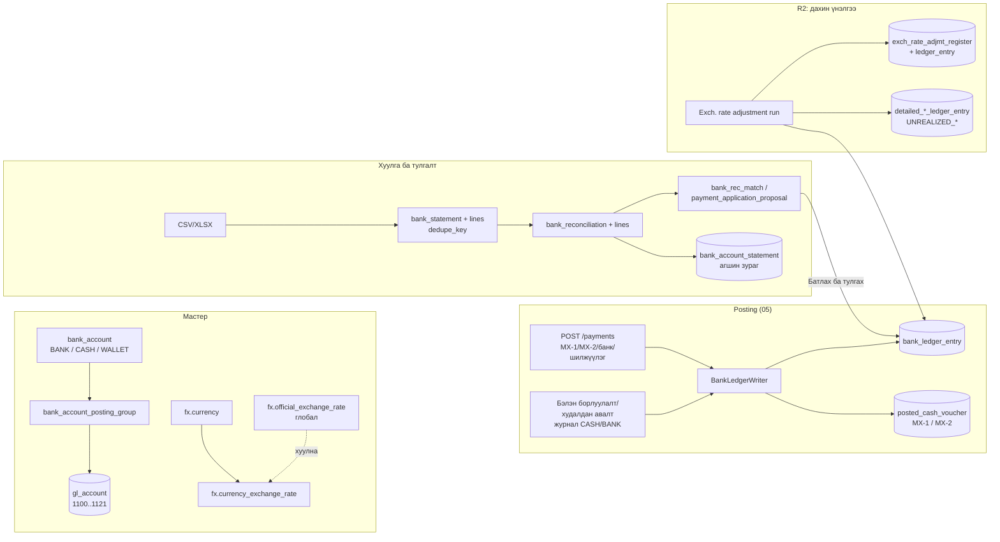
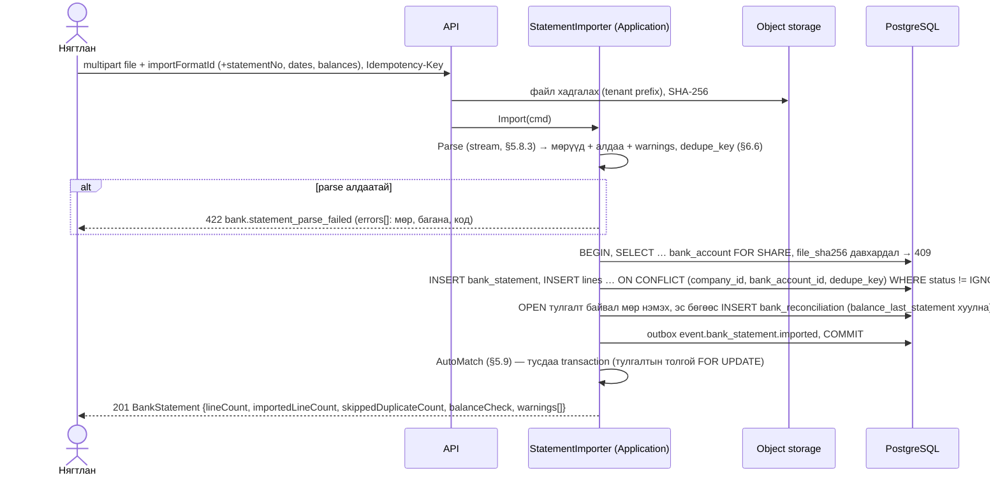

# 09. Мөнгөн хөрөнгө (касс, банк, хэтэвч) ба валют (Cash, Bank & FX) — модулийн тодорхойлолт

> **Төлөв:** Хөгжүүлэлтэд бэлэн ноорог v1.1 (adversarial хяналт хийгдсэн — төгсгөлийн "Хяналтын тэмдэглэл"). **Огноо:** 2026-10-08.
> **Модуль:** `bank` schema (мөнгөний данс: касс / банк / хэтэвч, банкны дэд дэвтэр, кассын баримт МХ-1/МХ-2, хуулга импорт, автомат тулгалт, банкны тулгалт, кассын тооллого, хэтэвчийн тооцоо) + `fx` schema (валют, ханш, Монголбанкны өдрийн ханшийн job, хөрвүүлэлт, тулгалтын хэрэгжсэн ханшийн зөрүү, хэрэгжээгүй ханшийн зөрүүний дахин үнэлгээ).
> **Нэг эх сурвалж:** [DECISIONS.md](./DECISIONS.md) (§K: нэршлийг [`db/schema/*.sql`](./db/schema/) тодорхойлно). Бусад баримттай зөрвөл DECISIONS → schema → энэ баримт гэсэн дарааллаар давамгайлна.
> **Уншигч:** backend хөгжүүлэгч, QA, нягтлан ба татварын зөвлөх.
> **Холбоотой баримт:** [01-requirements.md](./01-requirements.md) (FR-BNK-001..019, FR-FX-001..010, FR-PTY-009..012, FR-GL-003), [02-architecture.md](./02-architecture.md) §4.2.3, §4.2.10, §6, §8.3–8.5, §9.4, §9.5, [03-domain-model.md](./03-domain-model.md), [05-posting-engine.md](./05-posting-engine.md), [06-sales-receivables.md](./06-sales-receivables.md) §5.9, §6.11–6.12, [07-purchases-payables.md](./07-purchases-payables.md) BR-PUR-71..76, BR-AP-60..79, [08-tax-vat-mn.md](./08-tax-vat-mn.md), [13-security-audit-tenancy.md](./13-security-audit-tenancy.md), [14-api.md](./14-api.md) §9.5, §15.4, [15-ui-ux.md](./15-ui-ux.md) §16.3–16.4, S-BNK-01..15, S-FX-01..03, [16-test-strategy.md](./16-test-strategy.md) §12.8–12.10, [db/README.md](./db/README.md), [db/seed/README.md](./db/seed/README.md).
> **Судалгаа (BC эх):** [bc-bank-cash.md](./research/bc-bank-cash.md) (R-BANK-CASH-01..42), [bc-currency-fx.md](./research/bc-currency-fx.md) (R-CURRENCY-FX-01..35, R-CURRENCY-FX-30a), [mn-integrations-market.md](./research/mn-integrations-market.md) (§4 Монголбанк, §5 банк, §6 QPay, I-09..I-11), [mn-accounting.md](./research/mn-accounting.md) (§5.2 МХ-1/МХ-2, §7, REQ-ACC-03/14/15/20), [bc-subledgers-application.md](./research/bc-subledgers-application.md), [bc-gl-posting.md](./research/bc-gl-posting.md).

## Агуулга

- [0. Энэ баримтыг хэрхэн унших](#0-энэ-баримтыг-хэрхэн-унших)
- [1. Зорилго ба хамрах хүрээ](#1-зорилго-ба-хамрах-хүрээ)
- [2. Ойлголт ба BC-ээс авсан зүйл](#2-ойлголт-ба-bc-ээс-авсан-зүйл)
- [3. Өгөгдөл](#3-өгөгдөл)
- [4. Бизнесийн дүрмүүд](#4-бизнесийн-дүрмүүд)
- [5. Процесс ба алгоритм](#5-процесс-ба-алгоритм)
- [6. Тооцоолол ба бөөрөнхийлөлт](#6-тооцоолол-ба-бөөрөнхийлөлт)
- [7. Posting-ийн жишээнүүд](#7-posting-ийн-жишээнүүд)
- [8. Validation ба алдааны кодууд](#8-validation-ба-алдааны-кодууд)
- [9. Events ба интеграц](#9-events-ба-интеграц)
- [10. API ба UI холбоос](#10-api-ба-ui-холбоос)
- [11. Тест сценари](#11-тест-сценари)
- [12. Schema change requests](#12-schema-change-requests)
- [13. Нээлттэй асуулт](#13-нээлттэй-асуулт)
- [Хавсралт А. Бусад баримттай зөрүү](#хавсралт-а-бусад-баримттай-зөрүү)
- [Хяналтын тэмдэглэл (Review log)](#хяналтын-тэмдэглэл-review-log)

---

## 0. Энэ баримтыг хэрхэн унших

### 0.1 Тэмдэглэгээ

| Тэмдэглэгээ | Утга |
|---|---|
| `BR-BNK-nn` | Мөнгөний данс, банкны дэд дэвтэр, кассын баримт, шилжүүлэг, кассын тооллого, хэтэвч, хуулга импорт, тулгалтын бизнесийн дүрэм (энэ баримт эзэмшинэ) |
| `BR-FX-nn` | Валют, ханш, Монголбанкны job, хөрвүүлэлт, хэрэгжсэн ба хэрэгжээгүй ханшийн зөрүүний дүрэм (энэ баримт эзэмшинэ) |
| `AT-BNK-nn`, `AT-FX-nn` | Хүлээн авах тест (Given/When/Then, §11) |
| `GS-CASH-nnn`, `GS-REC-nnn`, `GS-FX-nnn` | Golden scenario ([16-test-strategy.md](./16-test-strategy.md) §11–12) |
| `P1..P17` | §7-ийн posting-ийн жишээ |
| `SCR-BNK-nn`, `SCR-FX-nn` | Энэ баримтын schema/seed өөрчлөлтийн хүсэлт (§12) |
| `OQ-BNK-nn`, `OQ-FX-nn` | Нээлттэй асуулт (§13) |
| `Z-BNK-nn` | BC-ээс санаатай зөрүүтэй шийдвэр (§2.4) |
| `r(x)` | `MoneyMath.Round(x, p_LCY)`, `MidpointRounding.AwayFromZero` (ADR-0006). `p_LCY = platform.company_setup.amount_rounding_precision` (анхдагч 0.01) |
| `rc(x)` | Валютын нарийвчлалаар бөөрөнхийлөх: `Round(x, fx.currency.amount_rounding_precision)` (USD 0.01, JPY/KRW 1) |
| `rate` | **1 нэгж валютад ногдох MNT** ("1 USD = 3 450.50 ₮", Монголбанкны хэлбэр). Хадгалалт ба BC-ийн `currency_factor`-тай хөрвүүлэлтийг §6.2 |
| Мөнгөний данс | `bank.bank_account` мөр (`kind` = `BANK` харилцах данс, `CASH` касс, `WALLET` хэтэвч — QPay/картын тооцоо; D-G1, D-G2) |
| BLE | Bank ledger entry = `bank.bank_ledger_entry` (BC T271) |
| CLE / VLE | `party.cust_ledger_entry` / `party.vendor_ledger_entry` (D-K2) |
| Тэмдэг | **Дебит = +, кредит = −** (D-C3). BLE ба хуулгын мөрийн дүн: **мөнгө орвол +, гарвал −** (банкны данс эзэмшигчийн талаас; R-BANK-CASH §5 sign convention) |
| Дүн | Жишээ бүр MNT (R2-ын жишээнд USD), НӨАТ 10 %, нарийвчлал 0.01. Мянгатын тусгаарлагч нь таслал (`1,100,000.00`) |

### 0.2 Нэрийн зөрүүг шийдсэн байдал (D-K1: schema давамгайлна)

| Бусад баримтад | Энэ баримтад (schema) |
|---|---|
| `cash_bank.*`, `cash_desk`, `payment_document`, `payment_line`, `bank_import_format` (02 §4.2.10, §9.4) | `bank.bank_account` (касс = `kind = 'CASH'`), `bank.bank_ledger_entry`, `bank.posted_cash_voucher`, `bank.bank_statement_import_format` + `bank.bank_statement_import_column`, `bank.bank_statement(_line)`, `bank.bank_reconciliation(_line)`, `bank.bank_rec_match(_member)`, `bank.payment_application_proposal`, `bank.text_to_account_mapping`, `bank.bank_account_statement(_line)` |
| `currency.ref_currency`, `currency.ref_official_rate`, `currency.company_rate`, `currency.rate_fetch_log` (02 §4.2.3) | `fx.iso_currency`, `fx.official_exchange_rate`, `fx.currency`, `fx.currency_exchange_rate`; татлагын лог = `integration.job_run` |
| `fx_reval_run`, `fx_reval_line` (research §7) | `fx.exch_rate_adjmt_register` (BC T86), `fx.exch_rate_adjmt_ledger_entry` (BC T186) |
| Ханшийн эх сурвалж `MONGOLBANK_AUTO` (FR-FX-002/003, 02 §9.5) | `fx.official_exchange_rate.source = 'MONGOLBANK'`; `fx.currency_exchange_rate.source ∈ {'MONGOLBANK','MANUAL','IMPORT'}` |
| R1-д `currency_code = MNT` (FR-FX-001 AC1) | `currency_code IS NULL` = LCY (MNT) (бүх хүснэгтийн COMMENT; `gl.journal_line`-д `CHECK (currency_code IS NOT NULL OR amount = amount_lcy)`, бусад ledger-д апп/writer баталгаажуулна) |
| `12-bank-cash spec`, `13-currency-fx spec`, "Банк/кассын spec", "Валютын spec", "FX spec" (05, 06, 07, 14, 16) | Энэ баримт (`09-bank-cash-fx.md`) |
| `event.PaymentPosted`, `BankStatementImported`, `BankReconciled`, `ExchangeRatesUpdated` (02 §4.2.3, §4.2.10) | Outbox topic `event.payment.posted`, `event.bank_statement.imported`, `event.bank_reconciliation.posted`, `event.exchange_rates.updated` (`integration.outbox.topic` CHECK жижиг үсэг шаарддаг; 06 §0.2-тай ижил) |
| `MongolbankRateFetchJob` (02 §9.5) | `integration.job_definition.code = 'fx.mongolbank_rates'` (scope `SYSTEM`, `max_attempts = 5`) |
| Улаан сторно (`is_correction`, 02 §6.8) | Хэрэглэхгүй (D-C3) |

---

## 1. Зорилго ба хамрах хүрээ

### 1.1 Зорилго

Энэ модуль нь бичил бизнесийн **мөнгөн хөрөнгийг** (касс, харилцах данс, цахим хэтэвч) нэг дэд дэвтрээр (subledger) бүртгэж, ерөнхий дэвтэртэй (G/L) үргэлж тэнцүү байлгана. Мөн **гадаад валютын** гүйлгээг Монголбанкны албан ханшаар MNT-д хөрвүүлж, ханшийн зөрүүг хуулийн дагуу тооцно:

1. **Мөнгөний данс** (`bank.bank_account`, `kind` = BANK / CASH / WALLET): нэг мөнгөний данс = нэг G/L данс, валют, банкны мэдээлэл, импортын профайл, тулгалтын хүлцэл, сөрөг үлдэгдлийн хориг.
2. **Кассын орлого ба зарлагын баримт** (МХ-1 / МХ-2, Сангийн сайдын 2017 оны 347-р тушаалын маягт): касс бүрийн завсаргүй цуврал, дүнг үсгээр, хэвлэх маягт; **касс сөрөг болохыг хориглоно** (D-G1).
3. **Төлбөр ба орлого** (`POST /payments`): харилцагч, нийлүүлэгч, G/L данс, мөнгөний данс хоорондын шилжүүлэг — нэг командаар батлах (BC Payment Registration).
4. **Кассын тооллого**: дэвтрийн ба тоолсон үлдэгдлийн зөрүүг илүүдэл/дутагдлын дансанд.
5. **Хэтэвч** (QPay, картын тооцоо): нэгтгэсэн орлогыг WALLET дансаар хүлээж, банк руу шилжихэд шимтгэлийг тусад нь бичих.
6. **Банкны хуулга импорт**: CSV/XLSX mapping wizard, Хаан ба Голомт банкны preset, давхар импортоос сэргийлэх.
7. **Автомат тулгалт** (BC Match Bank Payments-ийг хялбарчилсан): оноо, итгэлийн түвшин, текстээс данс руу дүрэм.
8. **Банкны тулгалт** ("Батлах ба тулгах"): тулгалтаас үүсэх төлбөр/дүрмийн бичилт, банкны entry-г хаах, хуулгын агшин зураг, буцаах, тулгалтын тайлан.
9. **Валют ба ханш** (R2): валютын лавлах, Монголбанкны өдрийн ханшийг автоматаар татах job, гар оруулга, огноогоор ханш хайх.
10. **Хөрвүүлэлт ба бөөрөнхийлөлт** (R2): FCY → MNT, баримтын мөрийн хуримтлагдсан (running total) хөрвүүлэлт.
11. **Хэрэгжсэн ханшийн зөрүү** (R2): авлага/өглөгийн тулгалт бүрд.
12. **Хэрэгжээгүй ханшийн зөрүү — дахин үнэлгээ** (R2): сар/жилийн эцэст нээлттэй авлага, өглөг, валютын мөнгөний данс.

### 1.2 Хамрах хүрээ

| Хүрээнд | Хүрээнээс гадуур (эзэмшигч) |
|---|---|
| `bank.*` бүх хүснэгт, `fx.*` бүх хүснэгт | Posting engine, дугаарлалт, register, preview механизм ([05](./05-posting-engine.md)) |
| `BankLedgerWriter` (`ILedgerWriter<BankLedgerLine>`): BLE, МХ-1/МХ-2, касс сөрөг болохгүй шалгалт | Авлага/өглөгийн дэд дэвтэр, тулгалтын цөм (`party.*`; [06](./06-sales-receivables.md) §5.13, [07](./07-purchases-payables.md)) — энэ баримт зөвхөн **ханшийн зөрүүний мөрийг** (`UNREALIZED_*`, `REALIZED_*`, `CORRECTION_OF_REMAINING_AMOUNT`) тооцох томьёог өгнө |
| `POST /payments` командын угсралт (мөнгөний тал + харьцагчийн тал) | Нэхэмжлэх дээрх "Төлбөр бүртгэх" товч, бэлэн борлуулалт/худалдан авалтын автомат төлбөр (06 BR-SAL-50..56, 07 BR-PUR-71..76) — тэд энэ модулийн `BankLedgerLine`-ийг хэрэглэнэ |
| Хуулга импорт, тулгалт, тулгалтын тайлан | Төлөх нэхэмжлэхийн санал (07 BR-AP-70..79); банкны бөөн төлбөрийн файл (01 §7, хувилбаргүй) |
| Валют, ханш, хөрвүүлэх функц (`IFxConverter`), дахин үнэлгээний run | Баримтын валютын талбарыг ашиглах (06 §6.12, 07 §6), НӨАТ MNT-ээр (08) |
| Мөнгөний дансны МГТ-ийн ангиллыг BLE-д дамжуулах (`cash_flow_category_id`) | МГТ-ийн тайлан (тайлангийн spec) |
| QPay/картын орлогыг WALLET-аар бүртгэх, хэтэвчийн тооцоо (R1) | QPay API (нэхэмжлэх, `payment/check`, QPay eBarimt) — **R3** (DECISIONS §H); eBarimt-ийн `payments[].code` ([12](./12-ebarimt-integration.md)) |
| Банкны хуулга файлаар (R1) | Банкны corporate API (FR-BNK-019) — **R3** |

### 1.3 Хувилбар (DECISIONS §H)

| Хувилбар | Агуулга |
|---|---|
| **R1 (MVP)** | Мөнгөний данс BANK/CASH/WALLET (FR-BNK-001); МХ-1/МХ-2 ба хэвлэмэл (FR-BNK-002/003); касс сөрөг болохгүй (D-G1); банкны төлбөр/орлого (FR-BNK-005); нэхэмжлэхээс төлбөр бүртгэх (FR-BNK-006); данс хоорондын шилжүүлэг (FR-BNK-007); кассын тооллого (FR-BNK-004, Should); хуулга импортын wizard (FR-BNK-008); Хаан/Голомт preset (FR-BNK-009, Should; жишээ файл ⚠); давхар импортын хориг (FR-BNK-010); автомат тулгалт (FR-BNK-011); текстээс данс руу дүрэм (FR-BNK-012, Should); "Батлах ба тулгах" (FR-BNK-013); тулгалт буцаах (FR-BNK-014, Should); мөнгөний бичилт буцаах хориг (FR-BNK-015); тулгалтын тайлан (FR-BNK-016); WALLET ба хэтэвчийн тооцоо (FR-BNK-017, Should). **Зөвхөн MNT** (FR-FX-001: валютын талбарууд схемд байгаа, функц идэвхгүй). |
| **R2** | Валют ба ханшийн хүснэгт (FR-FX-002); Монголбанкны ханш автоматаар (FR-FX-003); валютын баримт ба хөрвүүлэлт (FR-FX-004); баримтын ханшийг өөрчлөх (FR-FX-005, Should); зөвхөн ижил валютаар тулгах (FR-FX-006); хэрэгжсэн ханшийн зөрүү (FR-FX-007); хэрэгжээгүй ханшийн зөрүү (FR-FX-008); валютын мөнгөний дансны дахин үнэлгээ (FR-FX-009); дахин үнэлгээний хамгаалалт ба буцаалт (FR-FX-010, Should); валютын касс (1101) ба харилцах данс (1115); валют арилжаа (USD → MNT шилжүүлэг) |
| **R3** | Банкны API-аар хуулга татах (FR-BNK-019); QPay merchant API v2 (нэхэмжлэх, `payment/check`, callback-ийг `integration.inbox`-оор); банкны бөөн төлбөрийн файл (хэрэгцээ гарвал) |

### 1.4 Шаардлагын хамрах хүснэгт (traceability)

| FR | Гарчиг | Хувилбар | Энэ баримтын хэсэг |
|---|---|---|---|
| FR-BNK-001 | Мөнгөний данс: банк, касс, хэтэвч | R1 | BR-BNK-01..09, BR-BNK-10..16, §3.1, SCR-BNK-03 |
| FR-BNK-002 | Кассын орлогын баримт (МХ-1) | R1 | BR-BNK-20..29, §5.2, §5.3, P1 |
| FR-BNK-003 | Кассын зарлагын баримт (МХ-2) | R1 | BR-BNK-20..29, §5.2, P3 |
| FR-BNK-004 | Кассын тооллого | R1 (Should) | BR-BNK-33, §5.5, P4 |
| FR-BNK-005 | Банкны төлбөр ба орлого | R1 | BR-BNK-10..16, §5.2 |
| FR-BNK-006 | Нэхэмжлэхээс төлбөр бүртгэх | R1 | §5.2 (06/07-оос дуудна) |
| FR-BNK-007 | Мөнгөний данс хоорондын шилжүүлэг | R1 | BR-BNK-30..32, §5.4, P2, P16 |
| FR-BNK-008 | Хуулга импорт (CSV/XLSX wizard) | R1 | BR-BNK-40..49, §5.7, §5.8 |
| FR-BNK-009 | Хаан ба Голомт банкны preset | R1 (Should) | §5.8.4, OQ-BNK-01 |
| FR-BNK-010 | Давхар импортоос сэргийлэх | R1 | BR-BNK-44..46, BR-BNK-80 (хаях), §6.6 |
| FR-BNK-011 | Автомат тулгалт | R1 | BR-BNK-50..62, §5.9, §6.7 |
| FR-BNK-012 | Текстээс данс руу дүрэм | R1 (Should) | BR-BNK-58, §5.9.6 |
| FR-BNK-013 | Хянах ба "Батлах ба тулгах" | R1 | BR-BNK-63..72, BR-BNK-81, 83, §5.10, §5.11, P6, P7 |
| FR-BNK-014 | Хуулгын тулгалтыг буцаах | R1 (Should) | BR-BNK-73..75, §5.12, P17, SCR-BNK-02 |
| FR-BNK-015 | Мөнгөний бичилтийг буцаах | R1 | BR-BNK-76..77 |
| FR-BNK-016 | Банкны тулгалтын тайлан | R1 | BR-BNK-78, §6.8 |
| FR-BNK-017 | Хэтэвч (WALLET) | R1 (Should) | BR-BNK-34..36, §5.6, P5 |
| FR-BNK-018 | Төлөх нэхэмжлэхийн санал | R1 (Should) | [07](./07-purchases-payables.md) BR-AP-70..79 (энэ баримт зөвхөн `POST /payments`-аар батлана) |
| FR-BNK-019 | Банкны API | **R3** | §5.8.6 (гэрээ) |
| FR-FX-001 | Валютын талбар R1-ээс (функц идэвхгүй) | R1 | BR-FX-01 |
| FR-FX-002 | Валют ба ханшийн хүснэгт | R2 | BR-FX-02..09, §5.13 |
| FR-FX-003 | Монголбанкны ханш автоматаар | R2 | BR-FX-10..18, §5.14 |
| FR-FX-004 | Валютын баримт ба MNT-д хөрвүүлэх | R2 | BR-FX-20..27, §6.2–6.3, P8, P9 |
| FR-FX-005 | Баримтын ханшийг өөрчлөх | R2 (Should) | BR-FX-25, P15 |
| FR-FX-006 | Зөвхөн ижил валютаар тулгах | R2 | BR-FX-30 |
| FR-FX-007 | Хэрэгжсэн ханшийн зөрүү | R2 | BR-FX-30..39, §5.15, §6.4, P11, P12 |
| FR-FX-008 | Хэрэгжээгүй ханшийн зөрүү | R2 | BR-FX-40..52, §5.16, §6.5, P10, P13, P14 |
| FR-FX-009 | Валютын мөнгөний дансны дахин үнэлгээ | R2 | BR-FX-46, P10, P13, SCR-FX-02 |
| FR-FX-010 | Дахин үнэлгээний хамгаалалт ба буцаалт | R2 (Should) | BR-FX-53..55, §5.17 |
| FR-GL-003 | Хяналтын данс руу шууд бичих хориг (мөнгөний данс) | R1 | BR-BNK-13 |
| FR-PTY-009, 010, 012 | Тулгалт, хуваарилалт, урьдчилгаа (төлбөрийн тал) | R1 | §5.2 (`applyTo[]`, `applyToOldest`), [06](./06-sales-receivables.md) §5.13 |
| REQ-ACC-14, 15 | Кассын дэвтэр, МХ-1/МХ-2 маягт | R1 | §5.3, §10 (`cash-bank-book`) |
| REQ-ACC-03, 20 | MNT функциональ валют, сарын хаалтын дахин үнэлгээ | R2 | §5.16 |

---

## 2. Ойлголт ба BC-ээс авсан зүйл

### 2.1 Үндсэн ойлголт



- **Мөнгөний данс = мөнгөн хөрөнгийн дэд дэвтэр.** Мөнгөний дансанд хийсэн posting бүр **нэг BLE** ба мөнгөний дансны G/L данс руу **ижил `amount_lcy`-тай нэг G/L мөр** бичнэ (R-BANK-CASH-06). Үлдэгдэл = Σ BLE (хадгалсан үлдэгдэлгүй; `bank.v_bank_account_balance`, R-BANK-CASH-07).
- **Касс нь тусдаа модуль биш**: `kind = 'CASH'` мөнгөний данс (D-G1; BC W1-тэй ижил, R-BANK-CASH §1). МХ-1/МХ-2 нь CZ локализацийн Cash Desk-ийн санаагаар нэмэгдэнэ (research F7 step 4).
- **BLE-ийн хоёр бие даасан төлөв** (R-BANK-CASH §1): (a) `open` / `remaining_amount` — банкны хуулгатай тулгагдсан эсэх; (b) `statement_status` / `statement_no` / `statement_line_no` — аль хуулгын мөрөөр хаагдсан.
- **Нэг тулгалтын урсгал** (research §7.3): BC-ийн "Bank Reconciliation" ба "Payment Reconciliation Journal"-ыг нэгтгэнэ. Хуулгын мөр нь (a) өмнө бүртгэсэн BLE-тэй, (b) нээлттэй авлага/өглөгтэй (төлбөр үүснэ), (c) текстийн дүрэм эсвэл гараар сонгосон данстай (бичилт үүснэ) тулгагдана. "Батлах ба тулгах" нь бүгдийг нэг DB transaction-д хийнэ.
- **Валют** (R2): ханшийг "1 нэгж = X ₮" хэлбэрээр оруулж харуулна; схем нь BC-ийн `currency_factor`-ийг (1 LCY-д ногдох FCY) хадгалдаг тул хөрвүүлэлтийн каноник томьёог §6.2-т тогтооно.
- **Ханшийн зөрүү хоёр төрөл**: *хэрэгжсэн* (realized) — валютын авлага/өглөг төлөгдөж тулгагдах үед, **анхны ханштай** харьцуулж (R-CURRENCY-FX-28); *хэрэгжээгүй* (unrealized) — үеийн эцэст нээлттэй үлдэгдлийг тухайн өдрийн ханшаар дахин үнэлэх (R-CURRENCY-FX-16). Seed: хэрэгжсэн **8500**, хэрэгжээгүй **8510** (Дт/Кт аль аль).

### 2.2 BC-ээс шууд авсан (copy)

| BC дүрэм | Юу | Энэ баримтад |
|---|---|---|
| R-BANK-CASH-01 | Валютыг үлдэгдэл 0 ба нээлттэй BLE-гүй үед л солино | BR-BNK-04 |
| R-BANK-CASH-02 | Блоклоогүй, posting group ба G/L данстай | BR-BNK-10 |
| R-BANK-CASH-03 | Валютын нийцэл: LCY мөр → LCY данс; FCY данс → ижил валют; LCY данс FCY мөрийг LCY-ээр хүлээн авна | BR-BNK-11, BR-FX-24 |
| R-BANK-CASH-04 | BLE: `amount` (дансны валютаар), `amount_lcy`, `remaining = amount`, `positive`, `open = amount ≠ 0`; 0 дүнтэй entry хаалттай | BR-BNK-12 |
| R-BANK-CASH-06 | Нэг G/L мөр, ижил `amount_lcy`, ижил transaction | BR-BNK-12 |
| R-BANK-CASH-07 | Үлдэгдэл = Σ, огноогоор | BR-BNK-15 |
| R-BANK-CASH-09 | Бичилттэй дансыг устгахгүй | BR-BNK-06 |
| R-BANK-CASH-12..16 | Тулгалтын нөхцөл, үр дүн (BLE хаах, хуулгын агшин зураг, `balance_last_statement`) | BR-BNK-63..72 |
| R-BANK-CASH-15 | "Σ мөр = эцсийн − өмнөх" ба мөр бүр бүрэн тайлбарлагдсан | BR-BNK-66, BR-BNK-67 |
| R-BANK-CASH-22..28 | Төлбөрийн тулгалтын нэр дэвшигч, харьцагч/баримт/дүнгийн дохио, оноо, нэг мөр → нэг харьцагч | BR-BNK-50..62, §5.9 |
| R-BANK-CASH-29 | Текстээс данс руу: агуулсан эсэх, орлогод `debit_account_id`, зарлагад `credit_account_id`; давхар бичилтээс сэргийлэх (±2 хоног) | BR-BNK-58 |
| R-BANK-CASH-30 | Зөрүүтэй мөрийг хувааж зөрүүг сонгосон дансанд | BR-BNK-62 |
| R-BANK-CASH-32 | Тулгалтаас үүсэх төлбөр: огноо = гүйлгээний огноо, Payment/Refund төрөл, шинэ BLE шууд хаагдана | BR-BNK-68, BR-BNK-69 |
| R-BANK-CASH-34, 35 | Давхардлын түлхүүр, баганын харгалзаа, multiplier, сөрөг тэмдгийн тэмдэглэгээ, `line_no = n × 10000` | BR-BNK-41..46 |
| R-BANK-CASH-36 | Хүлцлийн муж (дүн/хувь, 0-ээр хязгаарлах, сөрөгт солих) | §6.7.1 |
| R-BANK-CASH-38, 39 | Тулгалт буцаах; буцаалтын өмнө тулгалтгүй байх | BR-BNK-73..77 |
| R-BANK-CASH-42, R-CURRENCY-FX-22 | Валютын банкны дахин үнэлгээ: BLE `amount = 0`, `amount_lcy = delta` | BR-FX-46 |
| R-CURRENCY-FX-01 | Ханш = `starting_date ≤ D`-ийн хамгийн сүүлийнх; байхгүй бол алдаа, хэзээ ч 1 биш | BR-FX-04 |
| R-CURRENCY-FX-06, 09, 10 | Баримтын ханш posting огноогоор, мөрийн хуримтлагдсан хөрвүүлэлт, entry-д анхны ба тохируулсан ханш | BR-FX-20..23 |
| R-CURRENCY-FX-07 | LCY дүнг гараар өгөхөд ханш = FCY / LCY | BR-FX-25 |
| R-CURRENCY-FX-15..21 | Дахин үнэлгээ: as-of D, delta, мөрийн төрөл, FCY 0, G/L | BR-FX-40..48 |
| R-CURRENCY-FX-19 | Хоцорсон run: D-ээс хойших detailed мөр бүрийн огноогоор дахин тохируулах | BR-FX-49 |
| R-CURRENCY-FX-25..31, 30a | Тулгалтын дараалал, хэрэгжээгүйг хувь тэнцүүлэн буцаах, хэрэгжсэн, засварын мөр, шинэ entry-ийн буцаалт | BR-FX-30..39 |
| R-CURRENCY-FX-32 | Unapply → тохируулсан ханшаар дахин тохируулах | BR-FX-38 |
| R-CURRENCY-FX-33 | Ашиглагдсан валютыг устгахгүй | BR-FX-03 |

### 2.3 Хялбарчилсан (simplify)

| BC | Манайд | Шалтгаан / эх |
|---|---|---|
| Хоёр worksheet (Bank Reconciliation + Payment Application), хоёр тусдаа дугаарын тоолуур (R-BANK-CASH-10, 17) | Нэг `bank_reconciliation`; хуулгын дугаарыг хэрэглэгч өгнө, `bank_account.last_statement_no`-д **зөвхөн батлахад** бичигдэнэ | research §7.3, §8 "Statement number reservation" |
| Parent/child мөр хуваах, T2711 n:1 buffer | `bank_rec_match` (1:1, 1:n, n:1; Σ тэнцүү), зөрүүг хүү мөрөөр (`statement_line_no + 1`) | R-BANK-CASH-13, 30; research §7.4 |
| Matching rule хүснэгт (T1252), тохиргооны UI (T1253) | BC-ийн анхдагч 25 дүрмийг **кодонд тогтмол** (Direct Debit-ээс бусад), оноо ижил томьёогоор | R-BANK-CASH-26; research §7.5 |
| `Bank Acc. Posting Group` | Схемд байгаа (`bank_account_posting_group`), гэхдээ **нэг бүлэг = нэг мөнгөний данс = нэг G/L данс** | FR-BNK-001 AC2, seed §5 |
| Data Exchange framework (T1221..1227) | `bank_statement_import_format` + `bank_statement_import_column` (баганын дугаар эсвэл гарчгаар) | R-BANK-CASH-35 |
| Ханшийн хүснэгт: relational currency, Fix type, тусдаа adjustment rate | `exchange_rate_amount = 1`, `relational_exch_rate_amount = MNT`; adjustment баганууд **үргэлж ижил утгатай** | R-CURRENCY-FX-05; research §7.1 |
| Дахин үнэлгээний Start/End date | Зөвхөн as-of огноо D (= posting огноо) | R-CURRENCY-FX-15 pitfall |
| Валют бүрд gain/loss данс | `gl.general_ledger_setup`-ийн анхдагч (8500/8510), `fx.currency`-д override | D-G3; research §7.5 |
| Payment discount, payment tolerance | Байхгүй (D-F2: R2+) | — |

### 2.4 Хассан ба санаатай зөрүү (drop / Z-BNK)

| ID | BC | Шийдвэр | Шалтгаан |
|---|---|---|---|
| Z-BNK-01 | `Min. Balance` зөвхөн харагдана (R-BANK-CASH-08) | **CASH данс үргэлж сөрөг болохгүй** (DB `ERC01`, D-G1); бусад дансанд `prevent_negative_balance`. `min_balance` = анхааруулга | D-G1 |
| Z-BNK-02 | Мөнгөний дансны G/L руу шууд журнал бичиж болно (R-BANK-CASH-06 caveat) | **Хориглоно**: 1100–1121 `direct_posting = false` (FR-GL-003) | Дэд дэвтэр = G/L invariant |
| Z-BNK-03 | Auto-match-ийн огнооны хүлцэл анхдагч 0 хоног (R-BANK-CASH-19) | **3 хоног** | Амралтын өдөр, маргааш нь орох гүйлгээ (research §8) |
| Z-BNK-04 | Бүх мөр High бол шууд батлах санал (R-BANK-CASH-31) | Хэрэглэгч үргэлж хянана (SKIP) | research §3 |
| Z-BNK-05 | "Post payments only" (тулгалтгүй) | Үргэлж "Батлах ба тулгах" (R-BANK-CASH-33) | research §7.3 |
| Z-BNK-06 | BLE-ийн хэсэгчилсэн тулгалт (`Remaining Amount` хэсэгчлэн) | Хориглоно: BLE бүхлээрээ нэг бүлэгт тулгагдана (n:1 нь хуулгын мөрүүдийн нийлбэр = BLE) | BC өөрөө анхааруулдаг (`RPOST:571-583`) |
| Z-BNK-07 | Check, positive pay, SEPA, direct debit, employee matching, Copilot | Хассан | research §7.12 |
| Z-BNK-08 | Тулгалтаас үүсэх төлбөрийн `Document No.` = хуулгын дугаар (R-BANK-CASH-32) | Хуулийн завсаргүй цуврал `BR`/`BP` (D-C7) | MN хуулийн баримтын дугаарлалт |
| Z-FX-01 | Банкны дахин үнэлгээ **хэрэгжсэн** дансанд (R-CURRENCY-FX-22) | Анхдагч нь BC-тэй адил (FR-FX-009, GS-FX-005); тохиргоогоор хэрэгжээгүй руу (SCR-FX-02, ⚠ OQ-FX-01) | MN татварын хандлага тодорхойгүй |
| Z-FX-02 | Хэрэгжээгүй олз ба гарзыг тусдаа G/L мөрөөр (R-CURRENCY-FX-20) | Gain ба loss данс **ижил** бол нэг мөрөөр цэвэр дүнгээр (seed: 8510 = 8510) | Утгагүй Дт/Кт хос мөрөөс сэргийлэх |
| Z-FX-03 | Валют хоорондын тулгалт (`Appln. between Currencies = All`) | Байхгүй (`None`) | R-CURRENCY-FX-25, FR-FX-006 |
| Z-FX-04 | ACY, G/L/НӨАТ-ын ханшийн тэгшитгэл, residual данс, EMU, `Conv. LCY Rndg.` | Хассан | R-CURRENCY-FX-23; research §7.8 |
| Z-FX-05 | Хамгийн сүүлийн дахин үнэлгээнээс өмнөх огноотой FCY posting зөвшөөрнө | **Хориглоно** (`fx.posting_before_last_revaluation`) | FR-FX-010; research §7.4 |

---
## 3. Өгөгдөл

Бүх хүснэгт `tenant_id`, `company_id`, `id uuid` (UUIDv7), forced RLS-тэй (D-B3, D-K6). Мастер/ноорогт `row_version` (optimistic concurrency), ledger-д `entry_no bigint` (компани дотор завсаргүй, `platform.fn_next_entry_no`, D-K3). Доорх хүснэгтэд зөвхөн энэ модульд утга нь чухал баганыг тайлбарлав.

### 3.1 Мөнгөний данс (`090_bank.sql`)

**`bank.bank_account_posting_group`** (BC T277): `code`, `gl_account_id` — мөнгөний дансны G/L данс. Seed: `CASH_MNT` 1100, `CASH_FCY` 1101, `BANK_MNT` 1110, `BANK_MNT_2` 1111, `BANK_FCY` 1115, `WALLET` 1120 (QPay), `CARD` 1121.

**`bank.bank_account`** (BC T270):

| Багана | Утга ба дүрэм |
|---|---|
| `no`, `name` | Дансны код (`CASH01`, `BANK01`, `QPAY01`, `GOL-USD`) ба нэр |
| `kind` | `BANK` харилцах данс / `CASH` касс / `WALLET` хэтэвч (QPay, картын тооцоо). CASH-д `bank_account_no`, `iban` NULL (CHECK) |
| `bank_name`, `bank_code` | Банкны нэр ба банк хоорондын код (Хаан 050000, Голомт 150000, ХХБ 040000, Хас 320000, Төрийн 340000 — mn-integrations §5) |
| `bank_account_no`, `iban` | Дансны дугаар; IBAN `MN` + 2 шалгах + 4 банкны код + 12 орон = 20 тэмдэгт, mod-97 (BR-BNK-03) |
| `currency_code` | NULL = MNT. R2: USD г.м. (BR-BNK-04) |
| `bank_account_posting_group_id` | → G/L данс (BR-BNK-02) |
| `import_format_id` | Анхдагч импортын профайл (BR-BNK-40) |
| `last_statement_no`, `balance_last_statement` | Хамгийн сүүлд **батлагдсан** хуулгын дугаар ба эцсийн үлдэгдэл (BR-BNK-70) |
| `match_tolerance_type`, `match_tolerance_value` | Автомат тулгалтын дүнгийн хүлцэл `AMOUNT` / `PERCENTAGE` (§6.7.1). Анхдагч 0 |
| `min_balance` | Анхааруулгын босго (Z-BNK-01) |
| `prevent_negative_balance` | `BANK`/`WALLET`-д сонголттой; `CASH`-д **үргэлж true гэж үзнэ** (DB trigger `kind = 'CASH' OR prevent_negative_balance`) |
| `cash_receipt_no_series_id`, `cash_payment_no_series_id` | МХ-1 (`KO`) ба МХ-2 (`KZ`) завсаргүй, жил бүр шинэчлэгддэг цуврал (зөвхөн `CASH`-д заавал, BR-BNK-21) |
| `blocked` | Блоклогдсон дансанд posting хийхгүй (BR-BNK-10) |

**`bank.v_bank_account_balance`** (920): `balance` = Σ `amount`, `balance_lcy` = Σ `amount_lcy`.

### 3.2 Банкны дэд дэвтэр ба кассын баримт

**`bank.bank_ledger_entry`** (BC T271; append-only, whitelist: `remaining_amount`, `open`, `closed_by_entry_no`, `closed_at_date`, `statement_status`, `statement_no`, `statement_line_no`, `reversed`, `reversed_by_entry_no` — зөвхөн `platform.fn_ledger_update`-ээр, D-C4):

| Багана | Утга |
|---|---|
| `entry_no` | Counter `BANK_LEDGER_ENTRY` |
| `bank_account_id`, `posting_date`, `document_date`, `document_type`, `document_no`, `external_document_no`, `description` | Ваучерын мэдээлэл. `document_no` = ваучерын хуулийн дугаар (`KO-…`, `BR-…`, `SI-…` г.м.) |
| `counterparty_name` | Харьцагчийн нэр (кассын дэвтэр, тулгалтын текст харьцуулалт) |
| `currency_code`, `amount`, `amount_lcy` | `currency_code` = **мөнгөний дансны** валют (гүйлгээний валют биш; LCY данс USD төлбөр хүлээн авсан ч NULL, P15); `amount` = мөнгөний дансны валютаар, тэмдэгтэй (орлого +); `amount_lcy` = G/L мөрийнх. LCY дансанд `amount = amount_lcy` (BLE-д энэ CHECK схемд байхгүй — writer баталгаажуулна; `gl.journal_line`-д л `CHECK (currency_code IS NOT NULL OR amount = amount_lcy)`) |
| `debit_amount`, `credit_amount` | Generated (тэмдгээс) |
| `remaining_amount`, `open`, `positive` | Тулгалтын төлөв (`open = amount ≠ 0` бичихэд; 0 дүнтэй бол `false`) |
| `closed_by_entry_no`, `closed_at_date` | Хаасан entry / хуулгын огноо |
| `statement_status`, `statement_no`, `statement_line_no` | `OPEN` → `CLOSED` (v1-д `BANK_ACC_ENTRY_APPLIED`-ийг ашиглахгүй, BR-BNK-64). CHECK: `OPEN` биш бол `statement_no` заавал |
| `bal_account_type`, `bal_account_id` | Харьцсан тал (харилцагч/нийлүүлэгч/G/L/мөнгөний данс) — тулгалтын харьцагчийн дохио (§5.9.3) |
| `cash_flow_category_id` | МГТ-ийн ангиллын override (тайлангийн spec) |
| `transaction_no`, `gl_register_no`, `dimension_set_id`, `source_code`, `reason_code_id` | Posting-ийн холбоос |
| `reversed`, `reversed_by_entry_no`, `reversed_entry_no` | Буцаалт (05 §5.10) |

**`bank.posted_cash_voucher`** (МХ-1/МХ-2; BC-д хүснэгтгүй; append-only, засварлах багана байхгүй):

| Багана | Утга | Хэвлэмэл дээр |
|---|---|---|
| `voucher_type` | `RECEIPT` (МХ-1) / `PAYMENT` (МХ-2) | Маягтын код "НХМаягт МХ-1" / "МХ-2" |
| `no` | Касс бүрийн цувралын завсаргүй дугаар (`KO-2026-00001`), `UNIQUE (company_id, voucher_type, no)` | "№" |
| `bank_account_id` | Касс | "Касс" |
| `posting_date` | Огноо | "20__ оны __ сарын __" |
| `counterparty_type`, `counterparty_id` | `CUSTOMER` / `VENDOR` / `GL_ACCOUNT` / `BANK_ACCOUNT` + id (NULL байж болно) | — |
| `counterparty_name` | Тушаагч (МХ-1) / хүлээн авагч (МХ-2) | "Хэнээс хүлээн авсан" / "Хэнд олгосон" |
| `counterparty_id_doc` | Хувь хүний бичиг баримтын дугаар (регистр) эсвэл ТТД; PII, `enc:v1:` шифрлэгдсэн ([13](./13-security-audit-tenancy.md) PiiCatalog); МХ-2-т заавал | "Бичиг баримтын дугаар" |
| `purpose` | Гүйлгээний утга (≤ 250) | "Гүйлгээний утга" |
| `amount` | **Эерэг** дүн (CHECK > 0), кассын валютаар | "Дүн (тоогоор)" |
| `amount_in_words` | Posting үед `MoneyWords.ToMongolian()`-оор үүсгэж хадгална (§6.9); дахин тооцохгүй | "Дүн (үсгээр)" |
| `currency_code` | NULL = MNT | Валютын нэр (R2) |
| `bank_ledger_entry_no`, `transaction_no` | Эх BLE ба G/L transaction | "Харьцсан данс"-ыг transaction-ий бусад G/L мөрөөс уншина (§5.3) |

### 3.3 Хуулга импорт

**`bank.bank_statement_import_format`** (BC Data Exch. Def T1222 + Line Def T1227): `code` (`KHAN_XLSX`, `GOLOMT_XLSX`, `GENERIC_CSV`), `preset_bank` (`KHAN`/`GOLOMT`/`TDB`/`XAC`/`STATE`/`GENERIC`), `file_type` (`CSV`/`XLSX`), `encoding` (анхдагч `UTF-8`; `windows-1251` зөвшөөрнө), `delimiter` (CSV-д заавал), `header_rows` (гарчгийн мөр хүртэлх мөрийн тоо; гарчгаар харгалзуулсан бол **хайх дээд хязгаар**, §5.8.2), `sheet_name`, `date_format` (.NET custom format, жишээ `yyyy.MM.dd`), `decimal_separator`, `thousand_separator`, `amount_mode` (`SIGNED` нэг багана / `DEBIT_CREDIT` хоёр багана), `negative_sign_identifier` (дүнгийн нүдний эхэнд эсвэл төгсгөлд байвал сөрөг гэж үзэх тэмдэгт мөр, жишээ `DR`, `Дт`, `-`).

**`bank.bank_statement_import_column`** (BC Column Def T1223 + Field Mapping T1225): `target_field` (`TRANSACTION_DATE`, `VALUE_DATE`, `AMOUNT`, `DEBIT_AMOUNT`, `CREDIT_AMOUNT`, `DESCRIPTION`, `COUNTERPARTY_NAME`, `COUNTERPARTY_ACCOUNT`, `PAYMENT_REFERENCE`, `TRANSACTION_ID`, `RUNNING_BALANCE`, `CURRENCY`), `column_no` **эсвэл** `column_header`, `data_format` (тухайн баганын огноо/тооны формат override), `multiplier` (анхдагч 1; −1 = тэмдэг эргүүлэх), `optional`.

**`bank.bank_statement`**: `statement_no`, `statement_date`, `period_from/to`, `opening_balance`, `closing_balance`, `import_format_id`, `file_name`, `file_sha256` (32 байт; давхар файл `ux_bank_statement__file`, `status <> 'DISCARDED'`), `status` (`IMPORTED` → `IN_RECONCILIATION` → `POSTED`; `DISCARDED`).

**`bank.bank_statement_line`**: `line_no` (10000, 20000, …), `transaction_date`, `value_date`, `amount` (тэмдэгтэй, дансны валютаар), `currency_code`, `description` (файлын эх текст), `transaction_text` (**нормчилсон хайлтын текст**, §6.10), `counterparty_name`, `counterparty_account`, `payment_reference`, `transaction_id`, `running_balance`, `dedupe_key` (§6.6; `ux_bank_statement_line__dedupe (company_id, bank_account_id, dedupe_key) WHERE status <> 'IGNORED'`), `status` (`NEW` → `MATCHED` → `POSTED`; `IGNORED`).

### 3.4 Тулгалт

**`bank.bank_reconciliation`** (BC T273): `bank_account_id`, `statement_no` (`UNIQUE (company_id, bank_account_id, statement_no)`), `statement_date`, `balance_last_statement` (нээхэд `bank_account.balance_last_statement`-аас хуулна, BR-BNK-65), `statement_ending_balance`, `bank_statement_id` (эхний импорт), `status` (`OPEN`/`POSTED`; `ux_bank_reconciliation__one_open` — данс бүрд нэг нээлттэй), `posted_at`, `posted_by`.

**`bank.bank_reconciliation_line`** (BC T274): `statement_line_no`, `bank_statement_line_id`, `transaction_date`, `value_date`, `description`, `transaction_text`, `related_party_name`, `related_party_account_no`, `payment_reference_no`, `transaction_id`, `statement_amount`, `applied_amount`, `difference` (generated = statement − applied), `applied_entries`, `account_type`/`account_id` (BLE байхгүй үед бичих зорилтот данс: G/L, харилцагч/нийлүүлэгч урьдчилгаа, мөнгөний данс), `match_confidence` (`NONE`/`LOW`/`MEDIUM`/`HIGH`/`HIGH_TEXT_TO_ACCOUNT`/`MANUAL`/`ACCEPTED`), `match_quality` (оноо).

**`bank.bank_rec_match`** (`match_no`, `match_confidence`, `score`, `rule_code`) ба **`bank.bank_rec_match_member`** (`member_type` = `STATEMENT_LINE` | `BANK_LEDGER_ENTRY`, `reconciliation_line_id` эсвэл `bank_ledger_entry_no`, `amount`): тулгалтын бүлэг — Σ мөр = Σ зорилт (BR-BNK-60). Мөр нэг бүлэгт л (`ux_bank_rec_match_member__line`).

**`bank.payment_application_proposal`** (BC T1294 + T1293): `reconciliation_line_id`, `account_type` (`CUSTOMER`/`VENDOR`/`GL_ACCOUNT`/`BANK_ACCOUNT`), `account_id`, `applies_to_entry_no` (CLE/VLE; NULL = урьдчилгаа/on account), `applied_amount` (**банкны тэмдгээр**: орлого +), `match_confidence`, `quality`, `rule_code` (§6.7.4), `accepted`.

**`bank.text_to_account_mapping`** (BC T1251): `line_no` (эрэмбэ), `mapping_text`, `debit_account_id` (орлого, дүн > 0), `credit_account_id` (зарлага, дүн < 0), `bal_source_type` (`GL_ACCOUNT`/`CUSTOMER`/`VENDOR`/`BANK_ACCOUNT`), `bal_source_id`. Seed: "ШИМТГЭЛ" → зарлага 8300; "ХАДГАЛАМЖИЙН ХҮҮ", "ХҮҮНИЙ ОРЛОГО" → орлого 8110.

**`bank.bank_account_statement`** + **`_line`** (BC T275/276 + T1295/1296; append-only): батлагдсан хуулгын агшин зураг — `balance_last_statement`, `statement_ending_balance`, `gl_balance_at_posting_date`, `outstanding_payments` (тулгагдаагүй зарлагын BLE-ийн нийлбэр, сөрөг), `outstanding_transactions` (тулгагдаагүй орлогын BLE, эерэг), мөр бүрийн `applied_entry_nos[]`, `applied_document_no`, `transaction_id`.

### 3.5 Валют (`050_fx.sql`, R2; схем R1-ээс бүрэн)

| Хүснэгт | Гол багана | Тайлбар |
|---|---|---|
| `fx.iso_currency` | `code`, `numeric_code`, `name`, `name_en`, `minor_units`, `symbol` | Глобал ISO 4217 лавлах (MNT, USD, EUR, CNY, RUB, KRW, JPY, GBP seed) |
| `fx.official_exchange_rate` | `currency_code`, `rate_date`, `rate_mnt` (1 нэгжид ногдох MNT), `source = 'MONGOLBANK'`, `fetched_at`, `source_reference`; `UNIQUE (source, currency_code, rate_date)` | Глобал (`tenant_id`-гүй), зөвхөн worker бичнэ |
| `fx.currency` | `code`, `iso_code`, `description`, `amount_rounding_precision` (USD 0.01, JPY/KRW 1), `unit_amount_rounding_precision`, `invoice_rounding_*`, `realized_gains/losses_account_id`, `unrealized_gains/losses_account_id` (NULL = `general_ledger_setup`-ийн анхдагч), `last_date_adjusted` (сүүлийн дахин үнэлгээний огноо, BR-FX-53), `blocked` | Компанийн валют (LCY мөр биш) |
| `fx.currency_exchange_rate` | `currency_id`, `starting_date`, `exchange_rate_amount` (= 1), `relational_exch_rate_amount` (= MNT), `adjustment_exch_rate_amount`, `relational_adjmt_exch_rate_amount` (**үргэлж эхний хоёртой ижил**, BR-FX-06), `source` (`MONGOLBANK`/`MANUAL`/`IMPORT`), `official_exchange_rate_id`; `UNIQUE (company_id, currency_id, starting_date)` | Компанийн ханш |
| `fx.exch_rate_adjmt_register` | `no`, `run_no`, `posting_date`, `document_no`, `account_type` (`CUSTOMER`/`VENDOR`/`BANK_ACCOUNT`), `posting_group_code`, `currency_code`, `currency_factor`, `adjusted_base` (Σ FCY), `adjusted_base_lcy` (Σ LCY өмнө), `adjusted_amt_lcy` (Σ delta), `transaction_no`, `gl_register_no` | BC T86, run × данс төрөл × бүлэг × валют × `posting_date` бүрд нэг мөр (BR-FX-47) |
| `fx.exch_rate_adjmt_ledger_entry` | `entry_no`, `register_no`, `posting_date`, `account_type`, `account_id`, `account_no`, `document_type/no` (дахин үнэлсэн entry-ийнх), `currency_code`, `currency_factor`, `base_amount` (FCY үлдэгдэл), `base_amount_lcy` (LCY үлдэгдэл өмнө), `adjustment_amount` (delta), `detailed_ledger_entry_no`, `ledger_entry_no` | BC T186, item бүрийн аудит |
| `gl.general_ledger_setup` | `cash_over_account_id` (8240), `cash_short_account_id` (8440), `realized_fx_gain/loss_account_id` (8500/8500), `unrealized_fx_gain/loss_account_id` (8510/8510) | Seed (D-G1, D-G3) |
| `party.cust/vendor_ledger_entry` | `currency_code`, `original_currency_factor` (posting-ийн ханш, өөрчлөгдөхгүй), `adjusted_currency_factor` (сүүлийн дахин үнэлгээний ханш; whitelist), `remaining_amount`, `remaining_amount_lcy` (кэш = Σ detailed) | R2 |
| `party.detailed_*_ledger_entry` | `entry_type` ∈ {`UNREALIZED_GAIN`, `UNREALIZED_LOSS`, `REALIZED_GAIN`, `REALIZED_LOSS`, `CORRECTION_OF_REMAINING_AMOUNT`, …}, `amount` (FCY; ханшийн мөрөнд **0**), `amount_lcy`, `exch_rate_adjmt_reg_no`, `application_no` | R2 |
| `party.customer/vendor_posting_group.appln_rounding_account_id` | 8290 | `CORRECTION_OF_REMAINING_AMOUNT`-ийн данс (R-CURRENCY-FX-30) |
| `gl.journal_line`, `sales.*_header`, `purchase.*_header` | `currency_code`, `currency_factor` (1 LCY-д ногдох FCY = BC Currency Factor) | §6.2 |
| `gl.gl_entry` | `source_currency_code`, `source_currency_amount` | R2: валютын posting-ийн FCY дүн (аудит) |

### 3.6 Бусад хэрэглэх хүснэгт

| Хүснэгт | Хэрэглээ |
|---|---|
| `platform.company_setup` | `amount_rounding_precision` (`p_LCY`), `lcy_code = 'MNT'`, `legal_name`, `tin`, `registration_no` (МХ маягтын толгой), `time_zone` |
| `platform.number_series(_line, _counter)` | `KO`/`KZ` (касс бүрд), `BR`/`BP` (банк, хэтэвч), `GJ` (кассын тооллого), `FXA` (дахин үнэлгээ — seed хүсэлт SCR-FX-04) |
| `gl.journal_template`/`journal_batch` | `CASH_RECEIPT/BANK` → `BR`, `CASH_RECEIPT/CASH` → `KO`, `PAYMENT/BANK` → `BP`, `PAYMENT/CASH` → `KZ` (05 §5.4) |
| `party.payment_method` | `CASH` → `CASH01`, `BANK` → `BANK01`, `CARD` → картын WALLET, `QPAY` → QPay WALLET (`bal_account_type = 'BANK_ACCOUNT'`) |
| `party.vendor_bank_account` | Нийлүүлэгчийн данс → харьцагчийг танихад (§5.9.3) |
| `integration.job_definition` / `job_run` | `fx.mongolbank_rates` (`SYSTEM`, `max_attempts = 5`) |
| `integration.outbox` | §9 |
| `platform.reason_code` | `CASH_DIFF` (кассын тооллого), `REVERSAL` |

### 3.7 Схемийн дутуу зүйл (дэлгэрэнгүйг §12)

1. Харилцагчийн банкны данс хадгалах хүснэгт байхгүй → хуулгын `counterparty_account`-аар харилцагчийг "Бүрэн" таних боломжгүй (GS-REC-001 L1 HIGH) → **SCR-BNK-01**.
2. Батлагдсан хуулгыг буцаасныг тэмдэглэх багана `bank.bank_account_statement`-д байхгүй (append-only, `UNIQUE statement_no`) → **SCR-BNK-02**.
3. "Нэг G/L данс = нэг мөнгөний данс" (FR-BNK-001 AC2)-ийг DB хамгаалдаггүй → **SCR-BNK-03**.
4. Баримт/entry-д MNT ханш биш зөвхөн `currency_factor` хадгалагддаг → дунд цэгийн (midpoint) бөөрөнхийлөлт алдагдана (§6.2) → **SCR-FX-01**.
5. Банкны дахин үнэлгээний дансны сонголт → **SCR-FX-02**.
6. Дахин үнэлгээний run-ийг буцаасныг тэмдэглэх багана байхгүй → **SCR-FX-05**.
7. `BR`/`BP` цувралын `date_order = true` (схемийн анхдагч) нь тулгалтын ваучерын огнооны дарааллыг хаана → **SCR-BNK-08** (seed).
8. `bank_account_statement`-ийн буцаалтын баганыг `fn_ledger_update`-ээр (bigint түлхүүр) шинэчлэх боломжгүй → **SCR-BNK-02**-т тусгай функц.

---

## 4. Бизнесийн дүрмүүд

Дүрэм бүр нэг тестээр шалгагдана (§11). "Эх" баганад DECISIONS, FR, судалгааны дүрмийн ID-г заав.

### 4.1 Мөнгөний данс (BR-BNK-01..09)

| ID | Дүрэм | Эх |
|---|---|---|
| BR-BNK-01 | `kind` нь үүсгэсний дараа өөрчлөгдөхгүй, хэрэв BLE байвал (`bank.account_has_entries`). | D-G1, R-BANK-CASH-01 |
| BR-BNK-02 | Мөнгөний данс бүр өөрийн `bank_account_posting_group`-тэй; тэр бүлгийн `gl_account_id` нь өөр ямар ч мөнгөний дансны бүлэгт ашиглагдаагүй, `account_type = 'POSTING'`, `direct_posting = false` байна. Зөрвөл `bank.gl_account_in_use`. | FR-BNK-001 AC2, R-BANK-CASH-06, SCR-BNK-03 |
| BR-BNK-03 | `iban` өгвөл: эхлээд бүх зай/зураасыг хасаж том үсэг болгоно (схемийн CHECK `^[A-Z]{2}[0-9]{2}[A-Z0-9]{8,30}$` зайг зөвшөөрдөггүй; UI нь 4-өөр бүлэглэж харуулна); `MN`-ээр эхэлсэн бол яг 20 тэмдэгт, ISO 13616 mod-97 = 1; бусад улсын IBAN ≤ 34 тэмдэгт, mod-97. Буруу бол `bank.iban_invalid`. `bank_account_no` нь зөвхөн тоо ба зураас (≤ 30). | I-10, 02 §9.4 |
| BR-BNK-04 | `currency_code`-ийг зөвхөн тухайн дансны `balance = 0`, `balance_lcy = 0` ба `open = true` BLE байхгүй үед солино (`bank.account_currency_locked`). R1-д `currency_code` заавал NULL (`gl.currency_not_enabled`). | R-BANK-CASH-01, FR-FX-001 |
| BR-BNK-05 | `CASH` данс `cash_receipt_no_series_id` ба `cash_payment_no_series_id`-тэй байна; тэдгээр нь `gapless = true`, `reset_yearly = true`, `manual_nos = false` цуврал. Касс бүр өөрийн цувралтай (D-C7, seed `KO`/`KZ`; хоёр дахь касс нэмэхэд wizard `KO2`/`KZ2` үүсгэнэ). | D-C7 ⚠, FR-BNK-002 |
| BR-BNK-06 | BLE-тэй мөнгөний дансыг устгахгүй, зөвхөн `blocked = true` (`api.resource_in_use`). | R-BANK-CASH-09, D-I3 |
| BR-BNK-07 | `prevent_negative_balance`-ийг `CASH` дансанд `false` болгох оролдлогыг үл тооно (UI засагдахгүй, API 422 `bank.cash_negative_not_allowed`); DB trigger `kind = 'CASH'`-ийг үргэлж шалгадаг. | D-G1, 15 S-BNK-02 |
| BR-BNK-08 | `match_tolerance_value`: `PERCENTAGE` бол 0..99; `AMOUNT` бол ≥ 0, дансны валютын нарийвчлалаар. | R-BANK-CASH-36 |
| BR-BNK-09 | `WALLET` дансны `bank_account_no` нь хэтэвчийн merchant/terminal ID байж болно (IBAN-гүй); хуулга импорт зөвшөөрнө (QPay тооцооны тайлан). | D-G2 |

### 4.2 Мөнгөний posting (BR-BNK-10..16)

| ID | Дүрэм | Эх |
|---|---|---|
| BR-BNK-10 | Posting-ийн өмнө (түгжээний дор): мөнгөний данс `blocked = false`, posting group ба G/L данстай. Эс бөгөөс `bank.account_blocked` / `bank.posting_group_missing`. | R-BANK-CASH-02 |
| BR-BNK-11 | Валютын нийцэл: (a) мөрийн валют NULL → данс LCY байна; (b) данс FCY → мөрийн валют = дансны валют; (c) данс LCY, мөр FCY (R2) → BLE `amount = amount_lcy` — **зөвхөн `BANK`/`WALLET`-д**; `CASH` данс нь биет мөнгөн тэмдэгт тул мөрийн валют = кассын валют байх ёстой (MNT касс USD мөр хүлээн авахгүй; валютын бэлэн мөнгийг 1101 валютын кассаар). Зөрвөл `bank.account_currency_mismatch`. | R-BANK-CASH-03, R-CURRENCY-FX-11 |
| BR-BNK-12 | `BankLedgerLine` бүр яг нэг BLE ба мөнгөний дансны G/L данс руу нэг G/L мөр (`amount_lcy` ижил, ижил `transaction_no`) үүсгэнэ. BLE: `remaining_amount = amount`, `open = (amount ≠ 0)`, `positive = (amount > 0)`, `statement_status = 'OPEN'`. | R-BANK-CASH-04, 06 |
| BR-BNK-13 | Мөнгөний дансны G/L данс (1100–1121) руу `GL_ACCOUNT` төрлийн мөрөөр шууд бичихийг хориглоно (`gl.direct_posting_not_allowed`); зөвхөн `BANK_ACCOUNT` төрлийн мөр/тал. | Z-BNK-02, FR-GL-003 |
| BR-BNK-14 | Invariant (шөнийн шалгалт, 02 §8.8): мөнгөний данс бүрд Σ BLE `amount_lcy` = G/L дансны үлдэгдэл (бүх огноо). LCY дансанд мөн Σ `amount` = G/L. | R-BANK-CASH-06 |
| BR-BNK-15 | Үлдэгдэл огноогоор: `balance_at(D)` = Σ `amount` (`posting_date ≤ D`); `balance_lcy_at(D)` = Σ `amount_lcy`. Хадгалсан үлдэгдлийн багана байхгүй. | R-BANK-CASH-07 |
| BR-BNK-16 | `document_type`: харилцагчаас орлого, нийлүүлэгчид зарлага = `PAYMENT`; харилцагчид буцаан олгох, нийлүүлэгчээс буцаан авах = `REFUND`; G/L ба шилжүүлэг = `NONE`. | R-BANK-CASH-32 |

### 4.3 Кассын баримт ба сөрөг үлдэгдэл (BR-BNK-20..29)

| ID | Дүрэм | Эх |
|---|---|---|
| BR-BNK-20 | `CASH` дансны BLE бүрд (буцаалт, эхний үлдэгдэл `OPENING`, кассын тооллого `CASHCOUNT`, ханшийн тэгшитгэл `EXCHRATADJ`-аас бусад) яг нэг `posted_cash_voucher` үүснэ: `amount > 0` → `RECEIPT` (МХ-1), `< 0` → `PAYMENT` (МХ-2), `amount` = \|BLE.amount\|. | D-A4, FR-BNK-002/003, 05 §5.4.4 |
| BR-BNK-21 | Дугаар: ваучерын `document_no` нь тухайн кассын тухайн чиглэлийн цувралаас олгогдсон бол (CASH batch, `POST /payments`) **тэр дугаарыг** ашиглана; эс бөгөөс (бэлэн борлуулалт `SI-…`, бэлэн худалдан авалт `PI-…`) кассын цувралаас **тусдаа** завсаргүй дугаар posting transaction дотор олгоно. Нэг ваучерт нэг касс, нэг чиглэлийн хэд хэдэн BLE байвал эхнийх нь (мөрийн дарааллаар) ваучерын дугаарыг, бусад нь шинэ дугаар авна. | D-C7, 06 BR-SAL-54, 07 BR-PUR-74 |
| BR-BNK-22 | `counterparty_name` (1..200) ба `purpose` (1..250) заавал. Эх сурвалж: хүсэлтийн `cashVoucher` → эс бөгөөс харьцагчийн нэр ба "{баримтын төрөл} {дугаар}" (06/07). | FR-BNK-002, CashVoucherInput |
| BR-BNK-23 | **МХ-2**-т `counterparty_id_doc` заавал: хүсэлтийн `counterpartyIdDocument ?? vendor.tin ?? vendor.registration_no ?? customer.tin ?? customer.registration_no`; бүгд хоосон бол `bank.cash_voucher_required` (422). МХ-1-д сонголттой. | FR-BNK-003 AC2, 07 BR-PUR-74, BR-AP-66 |
| BR-BNK-24 | `amount_in_words` нь §6.9-ийн алгоритмаар posting үед үүсч хадгалагдана; дахин хэвлэхэд хадгалсан утгыг хэвлэнэ. | REQ-ACC-04, REQ-ACC-15 |
| BR-BNK-25 | **Касс сөрөг болохгүй:** `kind = 'CASH'` (эсвэл `prevent_negative_balance`) дансны хувьд posting-ийн дараа `posting_date`-ээс хойших **өдөр бүрийн** хуримтлагдсан үлдэгдэл (Σ `amount`, дансны валютаар) ≥ 0 байна. Апп түгжээний дор урьдчилж шалгана (`bank.cash_negative_balance`, `available`, `shortfall` талбартай); DB нь COMMIT-д `ERC01`-ээр баталгаажуулна. | D-G1, FR-BNK-003 AC1, 910 `fn_check_non_negative_cash` |
| BR-BNK-26 | Хоцорсон огноотой кассын баримт: цувралын `date_order = true` нь ижил цуврал дахь сүүлийн дугаарын огнооноос өмнөх огноог хүлээн авахгүй (`platform.number_series_date_order`, ERN02). | D-C7, GS-CASH-005 |
| BR-BNK-27 | `min_balance > 0` бөгөөд posting-ийн дараах үлдэгдэл < `min_balance` бол анхааруулга `W-BNK-01` (батлахыг зогсоохгүй). | Z-BNK-01 |
| BR-BNK-28 | Кассын баримт ноороггүй, нэг командаар батлагдана (`POST /payments`); preview нь `POST /payments:preview` (дугаар `***`). | 14 §15.4, 15 Z-UI-11 |
| BR-BNK-29 | `posted_cash_voucher` ба BLE-ийн буцаалтаар шинэ МХ үүсэхгүй; эх МХ хэвлэмэл дээр "БУЦААГДСАН {огноо}, {буцаалтын дугаар}" тэмдэг гарна (`bank_ledger_entry.reversed`-ээс). | 05 §5.10 |

### 4.4 Шилжүүлэг, кассын тооллого, хэтэвч (BR-BNK-30..36)

| ID | Дүрэм | Эх |
|---|---|---|
| BR-BNK-30 | Данс хоорондын шилжүүлэг (`partyType = BANK_ACCOUNT`) нь **нэг** G/L transaction: хүлээн авах данс Дт, илгээх данс Кт, хоёр BLE. Хоёр данс ижил бол `bank.transfer_same_account`. | FR-BNK-007 AC1 |
| BR-BNK-31 | Шилжүүлгийн ваучерын дугаар: хүлээн авах данс CASH бол түүний `KO`; эс бөгөөс илгээх данс CASH бол түүний `KZ`; бусад тохиолдолд илгээх дансны `BP`. Нөгөө тал CASH бол түүний МХ-ийг BR-BNK-21-ээр тусдаа дугаартай үүсгэнэ. Source code: CASH оролцвол `CASHVOUCHER`, эс бөгөөс `PAYMENTREG`. | GS-CASH-003, GS-CASH-005 |
| BR-BNK-32 | Өөр валютын хоёр данс хоорондын шилжүүлэг (R2, валют арилжаа): `amount` = `bankAccountId`-ийн валютаар, `counterAmount` = нөгөө дансны валютаар (хоёулаа заавал, > 0; валют ижил бол `counterAmount` хориотой → `bank.transfer_counter_amount_invalid`). Тал бүрийн LCY: MNT тал = өөрийн дүн; FCY тал = `r(FCY × rate_D)` (тухайн валютын албан ханш, BR-FX-04). `diff = LCY_to − LCY_from`; `diff > 0` → хэрэгжсэн ханшийн зөрүүний gain данс (8500) Кт `diff`, `< 0` → loss данс (8500) Дт `|diff|`, `= 0` → мөргүй. Чиглэл (USD → MNT зарах, MNT → USD худалдаж авах, USD → EUR) бүгд энэ нэг томьёогоор. R1-д (зөвхөн MNT) хэрэглэгдэхгүй. | R-CURRENCY-FX-11, P16 |
| BR-BNK-33 | Кассын тооллого (`:count-cash`): `difference = counted − balance_at(countDate)`. `< 0` → `cash_short_account` (8440) Дт / касс Кт; `> 0` → касс Дт / `cash_over_account` (8240) Кт; `= 0` → posting хийхгүй (`posting = null`). Ваучер `GJ` цуврал, source `CASHCOUNT`, шалтгаан `CASH_DIFF`, МХ үүсэхгүй. `countDate` ≤ өнөөдөр, нээлттэй үе; `counted ≥ 0` ба кассын валютын нарийвчлалтай (`api.amount_precision_exceeded`). Валютын касс (R2): `difference` нь FCY, BLE `amount = difference`, G/L/BLE `amount_lcy = r(difference × rate_countDate)` (BR-FX-04). Хоцорсон огноотой тооллогын дутагдал нь хойших өдрийн үлдэгдлийг сөрөг болговол BR-BNK-25 (`bank.cash_negative_balance`). Данс нь CASH биш бол `bank.not_cash_account`. | D-G1, FR-BNK-004, GS-CASH-004 |
| BR-BNK-34 | QPay/картын төлбөрийн хэлбэр (`QPAY`, `CARD`) нь `bal_account_type = 'BANK_ACCOUNT'` WALLET дансыг заана; бэлэн бус тул МХ үүсэхгүй; eBarimt `payments[].code` = `BANK_TRANSFER_QPAY` / `PAYMENT_CARD`. | D-G2, FR-BNK-017, I-11 |
| BR-BNK-35 | **Хэтэвчийн тооцоо** (`:settle-wallet`): сонгосон нээлттэй WALLET BLE-үүдийн Σ = `gross`; `fee = gross − net ≥ 0`. Нэг transaction: банк Дт `net`, шимтгэлийн данс (анхдагч 8300) Дт `fee`, WALLET Кт `gross`. Сонгосон WALLET BLE-үүд ба шинэ WALLET BLE (−gross) шууд хаагдана (`statement_status = 'CLOSED'`, `statement_no` = тооцооны ваучерын дугаар, `closed_at_date` = тооцооны огноо). Банкны шинэ BLE нээлттэй үлдэж хуулгаар тулгагдана. WALLET дансны `last_statement_no` / `balance_last_statement`-ийг **өөрчлөхгүй** (тэдгээр нь зөвхөн хуулгын тулгалтад, BR-BNK-70; эс бөгөөс QPay-ийн тайланг хуулга мэт тулгах үед BR-BNK-65/66 эвдэрнэ). Нээлттэй тулгалтын бүлэгт орсон WALLET BLE-ийг сонговол `bank.entry_in_reconciliation`. | FR-BNK-017 AC1, GS-CASH-006 |
| BR-BNK-36 | Хэтэвчийн тооцоонд `fee < 0` (банкинд орсон нь их), `net ≤ 0`, `gross ≤ 0` эсвэл сонгосон бичилтгүй бол `bank.wallet_settlement_invalid`; WALLET ба хүлээн авах дансны валют ижил. Шимтгэлийн мөр нь seed-ийн `gen_posting_type = NONE` тул **НӨАТ-гүй** (VAT entry үүсэхгүй; 05 BR-PST-38); НӨАТ-тай гэж үзвэл (⚠ OQ-BNK-04) хүсэлтэд `feeVat {genPostingType, vatBusPostingGroup, vatProdPostingGroup}` өгнө. | FR-BNK-017, 05 BR-PST-38 |

### 4.5 Хуулга импорт (BR-BNK-40..49)

| ID | Дүрэм | Эх |
|---|---|---|
| BR-BNK-40 | Импорт нь мөнгөний данс ба профайлтай (`importFormatId ?? bank_account.import_format_id`); профайлгүй бол wizard-аар (§5.8) үүсгэнэ. Файл ≤ 20 MB, ≤ 10 000 мөр (`api.payload_too_large`, `bank.statement_too_large`). | FR-BNK-008, 14 §15.4 |
| BR-BNK-41 | Баганыг `column_no` (1-ээс) эсвэл `column_header`-аар (нормчилсон гарчиг тэнцүү, §5.8.2) олно. `optional = false` багана олдохгүй эсвэл мөрөнд хоосон бол тэр мөр алдаа (`required_missing`). | R-BANK-CASH-35 |
| BR-BNK-42 | Дүн: `SIGNED` → `amount = parse(AMOUNT) × multiplier`; `DEBIT_CREDIT` → `amount = parse(CREDIT_AMOUNT) × m_c − parse(DEBIT_AMOUNT) × m_d` (хуулгын **кредит = данс руу орсон**, дебит = гарсан). Нүд `negative_sign_identifier`-ээр эхэлсэн/төгссөн бол тэр утгыг сөрөг болгоно. Үр дүнг дансны валютын нарийвчлалаар `rc()` хийж, бөөрөнхийлөлтөөр өөрчлөгдвөл алдаа (`amount_precision`). `amount = 0` мөрийг алгасна (тоолно). `CURRENCY` багана харгалзуулсан бол утга нь (ISO код; `MNT`, `₮`, `ТӨГ` → MNT) дансны валюттай тэнцүү байх ёстой, эс бөгөөс мөрийн алдаа `currency_mismatch`; `bank_statement_line.currency_code` = дансны валют (NULL = MNT). | R-BANK-CASH-35, research §8 "Sign handling", BR-BNK-11 |
| BR-BNK-43 | Огноо: `data_format ?? date_format`-аар, invariant culture; цагтай бол огнооны хэсгийг авна. `VALUE_DATE` байхгүй бол NULL. | R-BANK-CASH-35, 37 |
| BR-BNK-44 | **Ижил файл:** `file_sha256` нь тухайн дансны `DISCARDED` биш хуулгатай давхцвал бүхэлд нь татгалзана — 409 `bank.statement_already_imported` (`existingResourceId`). | FR-BNK-010, `ux_bank_statement__file` |
| BR-BNK-45 | **Давхар мөр:** `dedupe_key` (§6.6) нь тухайн дансны `IGNORED` биш мөртэй давхцвал тэр мөрийг алгасаж `skippedDuplicateCount`-д тоолно (posted ба нээлттэй тулгалтын аль алинд). | FR-BNK-010 AC1, R-BANK-CASH-34 |
| BR-BNK-46 | Давхардлын түлхүүрийн бүрэлдэхүүн нь файлын гүйлгээний id (`TRANSACTION_ID`, Хаан `record`/`journal`) байвал түүнийг, эс бөгөөс (огноо, дүн, нормчилсон тайлбар, үлдэгдэл, давтамжийн дугаар)-ын SHA-256. | I-10, research §7.7 |
| BR-BNK-47 | **Үлдэгдлийн шалгалт:** `opening + Σ amount = closing` (өгөгдсөн/үүсгэсэн үед) — зөрвөл импорт **хийгдэнэ**, хариуны `balanceCheck.ok = false`, `difference`; мөн `RUNNING_BALANCE` байвал мөр бүрд `prev + amount = running` шалгаж зөрсөн мөрийг `warnings[]`-д. Батлах үед BR-BNK-66 хатуу шалгана. | FR-BNK-008 AC1 |
| BR-BNK-48 | Хуулгын `opening_balance` ≠ (`balance_last_statement` + нээлттэй тулгалтын Σ мөр) бол анхааруулга `W-BNK-02` "Өмнөх хуулгатай залгаагүй (зөрүү …)" (дутуу хуулга). | R-BANK-CASH-11 |
| BR-BNK-49 | Импорт нь posting хийхгүй, ledger өөрчлөхгүй. Тухайн дансанд `OPEN` тулгалт байвал мөрүүдийг **түүнд нэмнэ** (`statement_ending_balance := closing`, `statement_date := max(statement_date, шинэ хуулгын statement_date)`, `statement_line_no` нь тулгалтын одоогийн хамгийн их дугаараас үргэлжилнэ), эс бөгөөс шинэ тулгалт үүсгэнэ (`statement_no` = хүсэлтийн, эс бөгөөс §5.8.5). Импортын дараа автомат тулгалт (§5.9) ажиллана. | FR-BNK-008, 14 §17.4 |

### 4.6 Автомат тулгалт (BR-BNK-50..62)

| ID | Дүрэм | Эх |
|---|---|---|
| BR-BNK-50 | `statement_amount = 0` мөрийг тулгахгүй. | R-BANK-CASH-22 |
| BR-BNK-51 | **А үе (бүртгэгдсэн BLE):** нэр дэвшигч = тухайн дансны `open = true`, `amount ≠ 0`, `reversed = false`, өөр тулгалтын бүлэгт ороогүй, `posting_date ≤ max(statement_date, transaction_date)`, \|`transaction_date − posting_date`\| ≤ `DATE_TOLERANCE_DAYS` (3) BLE. **Дүн яг тэнцүү** ба тэмдэг ижил бол тохирно. | R-BANK-CASH-19, 20; Z-BNK-03 |
| BR-BNK-52 | А үеийн эрэмбэ: \|Δогноо\| бага → текстийн оноо (§6.10.3) их → `entry_no` бага. BLE нэг л мөрт оногдоно; илүү сайн мөр гарвал BLE-ийг авч, давталт дахин ажиллана (R-BANK-CASH-21). Ганц нэр дэвшигч → `HIGH`, автоматаар тулгана; олон нэр дэвшигчээс эрэмбээр сонгосон → `MEDIUM`, автоматаар тулгана; эрэмбэ тэнцсэн → тулгахгүй, санал `MEDIUM`. | R-BANK-CASH-21 |
| BR-BNK-53 | **Б үе (авлага, өглөг, хүлцэлтэй BLE, текстийн дүрэм)** нь А үеэр тулгагдаагүй мөрт л ажиллана. CLE/VLE нэр дэвшигч: `open`, `remaining_amount ≠ 0`, `currency_code` = дансны валют, `applies_to_id IS NULL`, `on_hold IS NULL`, `document_type ∈ {INVOICE, CREDIT_MEMO, PAYMENT, REFUND, NONE}`, `posting_date ≤ transaction_date`, `statement_amount × (банкны тэмдгээрх remaining) > 0`. Ашиглах боломжтой дүн = remaining − энэ тулгалтын бусад мөрт батлагдсан саналын дүн. | R-BANK-CASH-22, 27, 28 |
| BR-BNK-54 | **Харьцагчийн дохио** (`FULLY` / `PARTIALLY` / `NO`) — §5.9.3. Дансны дугаар таарвал (нийлүүлэгчийн `vendor_bank_account`, харилцагчийн SCR-BNK-01) эсвэл ТТД/регистр (≥ 7 орон) бүтэн токеноор текстэд байвал `FULLY`; нэрийн ойролцоо ≥ 95 бөгөөд тухайн төрлийн ганц харьцагч бол `FULLY`, олон бол `PARTIALLY`. | R-BANK-CASH-23 |
| BR-BNK-55 | **Баримтын дохио** (`YES` / `YES_MULTIPLE` / `NO`): `payment_reference` нь `document_no` / `external_document_no`-той (шахсан хэлбэрээр) тэнцүү; эс бөгөөс шахсан дугаар (≥ 4 тэмдэгт) нь текстийн шахсан токенуудын аль нэгтэй **бүтэн** тэнцүү. Нэг харьцагчийн ≥ 2 баримт таарвал `YES_MULTIPLE` (1:n бүлэг). | R-BANK-CASH-24 |
| BR-BNK-56 | **Дүнгийн дохио** (`ONE_MATCH` / `MULTIPLE` / `NO_MATCHES`): \|ашиглах боломжтой дүн\| ∈ [Min, Max] (§6.7.1) биш бол `NO_MATCHES`; муж дотор бөгөөд тухайн **төрлийн бүх** нэр дэвшигчээс (бүх харилцагч / бүх нийлүүлэгч / бүх BLE) яг нэг нь муж дотор бол `ONE_MATCH`, эс бөгөөс `MULTIPLE`. | R-BANK-CASH-25 |
| BR-BNK-57 | Оноо = `1000 × (c + 1) − priority`, c: LOW = 1, MEDIUM = 2, HIGH = 3; дүрмийн хүснэгт §6.7.2 (BC-ийн анхдагч, Direct Debit-гүй). Ямар ч дүрэмд таараагүй нэр дэвшигчийг хасна. | R-BANK-CASH-26 |
| BR-BNK-58 | **Текстээс данс руу:** нормчилсон `mapping_text` нь мөрийн `transaction_text`-д бүтэн агуулагдвал тохирно; данс = орлогод `debit_account_id`, зарлагад `credit_account_id` (эсвэл `bal_source_*`). Оноо = `3000 + min(len(norm(mapping_text)), 498) + 1` → `HIGH_TEXT_TO_ACCOUNT`. Хэрэв ижил дүнтэй, \|Δогноо\| ≤ 2, харьцсан данс нь тэр данс болох нээлттэй BLE байвал **тэр BLE-тэй** тулгана (давхар бичилтээс сэргийлэх). Олон дүрэм таарвал оноо их, дараа нь `line_no` бага. | R-BANK-CASH-26, 29 |
| BR-BNK-59 | Мөр бүрд хамгийн их 5 саналыг `payment_application_proposal`-д `quality` буурахаар хадгална. Автоматаар тулгах (`accepted = true`): `HIGH` ба `HIGH_TEXT_TO_ACCOUNT`, мөн дүн нь мөрийн дүнтэй тэнцүү (эсвэл 1:n бүлгийн нийлбэр тэнцүү). `MEDIUM`/`LOW` нь хэрэглэгчийн шийдвэр шаардана. | R-BANK-CASH-26, 31; FR-BNK-011 AC2 |
| BR-BNK-60 | **Тулгалтын бүлэг:** 1:1, 1:n (нэг мөр ↔ олон BLE эсвэл нэг харьцагчийн олон баримт), n:1 (олон мөр ↔ нэг BLE). n:m-ийг хориглоно (`bank.match_spec_invalid`). Нэг мөр нь **эсвэл** BLE-тэй бүлэгт, **эсвэл** BLE бус зорилттой (батлагдсан санал / `account_type`) байна — хоёуланг холихгүй (`bank.match_spec_invalid`; BLE-ээр хэсэгчлэн тайлбарлагдсан мөрийн үлдэгдлийг BR-BNK-62-оор хувааж хүү мөрөнд өгнө). Ингэснээр §5.11-ийн ваучерын дүн = BLE бус мөрүүдийн `statement_amount` болж, ваучер үргэлж тэнцэнэ. Σ мөрийн `statement_amount` = Σ BLE `remaining_amount` (BLE бүлэг) эсвэл Σ батлагдсан саналын `applied_amount` (+ `account_type` мөрт бүтэн дүн) байна, эс бөгөөс `bank.match_amount_mismatch`. | R-BANK-CASH-13, 14; FR-BNK-013 |
| BR-BNK-61 | Нэг мөрийн бүх батлагдсан санал **нэг** харьцагчид (`account_type` + `account_id`) хамаарна (`bank.match_party_mixed`). | R-BANK-CASH-28 |
| BR-BNK-62 | **Зөрүүг хуваах:** мөрийн `applied < statement` үед хэрэглэгч "Зөрүүг данс руу" сонговол эх мөрийн `statement_amount := applied_amount`, шинэ хүү мөр (`statement_line_no = эх + 1`, ижил `bank_statement_line_id`) `statement_amount = зөрүү`, `account_type/id` = сонгосон данс, `match_confidence = 'MANUAL'`. Батлахад: эх мөр BLE бус зорилттой (харилцагч/нийлүүлэгчийн санал) бол эх ба хүү мөр **нэг ваучер, нэг BLE** болно; эх мөр BLE-тэй бүлэгт (хүлцэлтэй BLE, §5.9.5) бол зөвхөн хүү мөр өөрийн ваучер, BLE-тэй болно (§5.11). `applied = 0` бол хуваахгүй — мөрийг бүхэлд нь данс руу (`PATCH …/lines/{lineId}`). Харилцагчийн илүү төлөлтийн зөрүүнд анхдагч санал нь **тухайн харилцагчийн урьдчилгаа** (`CUSTOMER`, `applies_to_entry_no = NULL`, D-F4); орлогын данс (8200) зөвхөн хэрэглэгч сонговол. | R-BANK-CASH-30, SCR-BNK-04, D-F4 |

### 4.7 Тулгалтыг батлах, буцаах, тайлан (BR-BNK-63..79)

| ID | Дүрэм | Эх |
|---|---|---|
| BR-BNK-63 | Данс бүрд нэг л `OPEN` тулгалт (`bank.reconciliation_already_open`). CASH дансанд тулгалт үүсгэхгүй (`bank.not_reconcilable`), касс тооллогоор шалгагдана. | `ux_bank_reconciliation__one_open`, research F7 |
| BR-BNK-64 | Тулгалтын ажлын хуудсыг засах (тулгах/арилгах/хуваах) нь ledger-ийг өөрчлөхгүй; BLE-ийн `statement_status` батлах хүртэл `OPEN` хэвээр (`BANK_ACC_ENTRY_APPLIED` v1-д хэрэглэхгүй). Нэг BLE нэг тулгалтын нэг л бүлэгт байна (апп шалгалт, тулгалтын толгойг `FOR UPDATE`). | R-BANK-CASH-12 (хялбарчилсан) |
| BR-BNK-65 | Тулгалт нээхэд `balance_last_statement := bank_account.balance_last_statement`; хэрэглэгч өөрчилвөл `confirmBalanceOverride = true` ба аудитын лог. | R-BANK-CASH-11 |
| BR-BNK-66 | Батлах нөхцөл (1): `statement_date` бөглөсөн, `statement_date ≥` өмнөх батлагдсан хуулгын огноо, мөр бүрийн `transaction_date ≤ statement_date` (`bank.reconciliation_date_invalid`; эс бөгөөс `closed_at_date < posting_date` болж §6.8 эвдэрнэ); Σ мөрийн `statement_amount` = `statement_ending_balance − balance_last_statement` (`bank.reconciliation_balance_mismatch`, зөрүүтэй). | R-BANK-CASH-15, FR-BNK-013 AC2 |
| BR-BNK-67 | Батлах нөхцөл (2): мөр бүрийн `difference = 0` (BLE, батлагдсан санал, эсвэл `account_type/id`-аар бүрэн тайлбарлагдсан). Тайлбаргүй мөр байвал `bank.reconciliation_unmatched_lines` (жагсаалттай). "Зөрүүтэйгээр батлах" байхгүй. | R-BANK-CASH-15, 18 |
| BR-BNK-68 | Харилцагч/нийлүүлэгч/G/L/мөнгөний данс руу тулгасан мөр бүр (хүү мөртэйгээ) **нэг ваучер** болно: `posting_date = transaction_date`, `document_date = transaction_date`, дугаар = дансны `BR` (орлого) / `BP` (зарлага) цуврал, `external_document_no = transaction_id` (≤ 35), `description` = мөрийн тайлбар (≤ 100), source `PAYMTRECON`. Харилцагч/нийлүүлэгчийн тал нь `applies_to_entry_no`-оор тулгагдана; `applies_to_entry_no IS NULL` бол урьдчилгаа (D-F4). G/L мөр нь **НӨАТ-гүй** — seed-ийн бүх данс `gen_posting_type = NONE` бөгөөд журналын НӨАТ зөвхөн мөрөнд `gen_posting_type ∈ {SALE, PURCHASE}` ба хоёр VAT бүлэг тодорхой өгөгдсөн үед (05 BR-PST-38); тулгалтын ажлын хуудас эдгээрийг R1-д авахгүй (НӨАТ-тай зардлыг худалдан авалтын нэхэмжлэх эсвэл `POST /payments`-ийн `vat` талбараар). Ваучерууд нэг цувралд **(`posting_date`, `statement_line_no`) өсөхөөр** дугаарлагдана (цувралын `date_order`, BR-BNK-81). | R-BANK-CASH-32; Z-BNK-08; 05 BR-PST-38 |
| BR-BNK-69 | Тулгалтаас үүссэн шинэ BLE нь posting дотроо шууд хаагдана: `open = false`, `remaining_amount = 0`, `statement_status = 'CLOSED'`, `statement_no`, `statement_line_no`, `closed_at_date = statement_date`. | R-BANK-CASH-32 |
| BR-BNK-70 | Батлахад: тулгагдсан бүх BLE → `open = false`, `remaining_amount = 0`, `statement_status = 'CLOSED'`, `statement_no`, `statement_line_no` (n:1-д `-1`), `closed_at_date = statement_date`; `bank_account.last_statement_no := statement_no`, `balance_last_statement := тулгалтын balance_last_statement + Σ мөр` (= ending); `bank_account_statement(_line)` агшин зураг; тулгалт `POSTED`, хуулга `POSTED`, хуулгын мөр `POSTED`. Бүгд **нэг DB transaction**. | R-BANK-CASH-16 |
| BR-BNK-71 | Батлах үед (түгжээний дор) зорилт бүрийг дахин шалгана: BLE `open = true` хэвээр, CLE/VLE `remaining` ≥ батлагдсан дүн, тэмдэг ижил. Өөрчлөгдсөн бол бүгд rollback, 409 `bank.match_target_changed` (мөрүүдийн жагсаалт). | R-BANK-CASH-28; 05 `ValidateLockedAsync` |
| BR-BNK-72 | Батлахад харьцагч тодорхой (`account_type ∈ {CUSTOMER, VENDOR}`) мөрийн `counterparty_account`-ыг тэр харьцагчид "сурсан" данс болгон бүртгэнэ (SCR-BNK-01; дараагийн тулгалтын `FULLY`). | R-BANK-CASH-23 |
| BR-BNK-73 | **Буцаах** (`bank-account-statements/{id}:undo`): зөвхөн тухайн дансны **хамгийн сүүлийн** батлагдсан хуулга (`bank.statement_not_latest`). Хуулгад хаагдсан BLE-үүд (`bank_account_id` = тухайн данс **ба** `statement_no` = хуулгын дугаар **ба** `statement_status = 'CLOSED'`) → `open = true`, `remaining_amount = amount`, `statement_status = 'OPEN'`, `statement_no/line_no = NULL`, `closed_at_date = NULL`, `closed_by_entry_no = NULL`; `bank_account.last_statement_no/balance_last_statement` = өмнөх (буцаагаагүй) хуулгынх; агшин зураг `undone_at` (SCR-BNK-02); тулгалт `OPEN` болж (бүлэг, мөр хэвээр) дахин засах боломжтой. | R-BANK-CASH-38, FR-BNK-014 AC1 |
| BR-BNK-74 | Буцаалт нь тулгалтаас үүссэн төлбөр, дүрмийн ваучерыг **буцаахгүй** (тусад нь буцаана, BR-BNK-76). Ажлын хуудасны тэдгээр мөр нь батлах үед үүссэн BLE-тэй бүлэгт шилжсэн байна (§5.11 алхам 8). | FR-BNK-014 AC1 |
| BR-BNK-75 | Буцаах үйлдэл нь шалтгаантай (`reasonCodeId`), эрх `bank.reconciliation.post`, аудитын логтой. | D-I3 |
| BR-BNK-76 | Мөнгөний BLE-ийг буцаах (05 §5.10 `IReversalService`) нөхцөл: `open = true`, `statement_no IS NULL`, нээлттэй тулгалтын бүлэгт ороогүй (`bank.entry_in_reconciliation`), харилцагч/нийлүүлэгчийн тал тулгагдаагүй (`gl.reversal_entries_applied`). Эс бөгөөс 409 `bank.entry_reconciled` "Эхлээд хуулгын тулгалтыг буцаана уу". | R-BANK-CASH-39, FR-BNK-015 AC1 |
| BR-BNK-77 | Буцаалтын толин BLE: `amount = −эх`, `open = false`, `remaining = 0`, `reversed = true`, `reversed_entry_no`; эх: `open = false`, `remaining = 0`, `reversed = true`, `reversed_by_entry_no`. Хоёулаа тулгалтын нэр дэвшигчид орохгүй. Буцаалтын дараа касс сөрөг болбол `bank.cash_negative_balance`. | R-BANK-CASH-39, 05 |
| BR-BNK-78 | **Тулгалтын тайлан** (D огноогоор): `G/L(D) − Outstanding(D) + Unreconciled(D) − Statement(D) = 0` (§6.8). `Outstanding` нь нээлттэй тулгалтад аль хэдийн BLE-тэй бүлэглэгдсэн BLE-ийг **оруулахгүй**, `Unreconciled` нь батлагдаагүй хуулгын BLE-тэй бүлэглэгдээгүй бүх мөр (санал/данс руу тулгагдсан ч ledger-д хараахан ороогүй) — §6.8. D нь хамгийн сүүлийн батлагдсан хуулгын огнооноос өмнө бол батлагдсан агшин зургийн тайланг (`bank_account_statement`) харуулна. Тэнцэхгүй бол "Анхаар" мөр (жишээ нь хуулгын үеийн өмнөх огноогоор шинэ бичилт). | FR-BNK-016 AC1, research §8 "proof equation" |
| BR-BNK-79 | `amount = 0` BLE (ханшийн тэгшитгэл) нь `open = false`, `remaining_amount = 0`, `closed_at_date = posting_date`-ээр бичигдэж (R-BANK-CASH-04; `statement_status` нь схемийн CHECK-ээс болж `OPEN` хэвээр, SCR-BNK-05) хэзээ ч тулгалт, outstanding-д орохгүй. | R-BANK-CASH-04 |

### 4.7a Нэмэлт дүрэм (хяналтаар нэмсэн, BR-BNK-80..83)

| ID | Дүрэм | Эх |
|---|---|---|
| BR-BNK-80 | **Хуулга хаях** (`POST /bank-statements/{id}:discard`, шалтгаантай): зөвхөн `status ∈ {IMPORTED, IN_RECONCILIATION}` бөгөөд түүний аль ч мөр бүлэг/батлагдсан санал/`account_type`-гүй үед (эс бөгөөс 409 `bank.statement_in_use`). Нэг transaction (тулгалтын толгой `FOR UPDATE` + `If-Match`): тухайн хуулгын `bank_reconciliation_line`-уудыг устгана (санал, member cascade); `bank_statement_line.status := 'IGNORED'` (dedupe index чөлөөлөгдөж дахин импортлох боломжтой, BR-BNK-45); `bank_statement.status := 'DISCARDED'` (`ux_bank_statement__file` чөлөөлөгдөнө); тулгалтад мөр үлдээгүй бөгөөд энэ хуулгаар үүссэн бол тулгалтыг устгана, эс бөгөөс `statement_ending_balance` := үлдсэн хамгийн сүүлийн хуулгын `closing_balance` (байхгүй бол `balance_last_statement`). Ledger өөрчлөгдөхгүй. | FR-BNK-010, `ux_bank_statement_line__dedupe` |
| BR-BNK-81 | **Огноо ба цуврал:** тулгалтаас үүсэх ваучер `posting_date = transaction_date` (BR-BNK-68) тул (a) тухайн огнооны үе хаалттай/түгжээтэй эсвэл компанийн posting цонхоос гадуур бол бүх батлалт 422 (`gl.period_closed` / `gl.period_locked` / `gl.posting_date_outside_window`, мөрийн жагсаалттай; A үед бүгдийг цуглуулна); (b) FCY дансанд `transaction_date ≤ fx.currency.last_date_adjusted` бол `fx.posting_before_last_revaluation` (BR-FX-53) — **сарын хаалтад валютын дансны тулгалтыг дахин үнэлгээнээс өмнө** хийнэ (FR-GL-025 шалгах хуудасны дараалал); (c) `BR`/`BP` цуврал `date_order = true` (схемийн анхдагч) бол хамгийн сүүлийн дугаарын огнооноос өмнөх `transaction_date`-тэй ваучер `platform.number_series_date_order` (ERN02)-д унана → seed-д `BR`/`BP`-ийн `date_order = false` (SCR-BNK-08). Засах арга (a)/(b): тэр мөрийг `POST /payments`-аар нээлттэй огноогоор бүртгээд BLE-тэй гараар тулгана (гар тулгалтад огнооны хүлцэл үйлчлэхгүй). | D-D3, D-C7 ⚠, BR-FX-53 |
| BR-BNK-82 | **Шилжүүлгийн валют:** `partyType = BANK_ACCOUNT` бөгөөд хоёр дансны валют ижил бол `counterAmount` өгөхийг хориглоно; өөр бол заавал (BR-BNK-32). R1-д хоёр тал MNT. | BR-BNK-32 |
| BR-BNK-83 | Тулгалтын тэмдэг/дүнгийн шалгалтад хуулгын мөр, BLE, CLE/VLE-ийн дүнг **банкны тэмдгээр** харьцуулна: CLE/VLE-ийн `remaining_amount` нь банкны тэмдэгтэй **ижил** (авлагын нэхэмжлэх +1 100 → банкинд +1 100 орлого; өглөгийн нэхэмжлэх −2 200 → −2 200 зарлага; харилцагчийн кредит нот −500 → −500 буцаан олголт). Саналын `applied_amount` мөн банкны тэмдгээр; харьцагчийн journal мөр = `−applied_amount`. | R-BANK-CASH-22, research §5 sign convention |

### 4.8 Валют ба ханш (BR-FX-01..18)

| ID | Дүрэм | Эх |
|---|---|---|
| BR-FX-01 | R1: бүх баримт, журнал, ledger-д `currency_code IS NULL`, `amount_lcy = amount`, `currency_factor IS NULL`; валюттай posting → 422 `gl.currency_not_enabled`; `fx.currency` CRUD R2 (унших R1). | FR-FX-001, 05 §6.10 |
| BR-FX-02 | Валютыг `fx.iso_currency`-аас нэмнэ; `amount_rounding_precision = 10^(−minor_units)` (USD 0.01, KRW/JPY 1), `unit_amount_rounding_precision = 0.00001`; LCY (MNT) нь `fx.currency`-д мөр **биш**. | R-CURRENCY-FX-34, FR-FX-002 |
| BR-FX-03 | Ашиглагдсан валют (ямар нэг ledger/баримт/мөнгөний данс) устгагдахгүй, `blocked = true` л (`fx.currency_in_use`); блоклогдсон валютаар шинэ баримт батлахгүй (`fx.currency_blocked`). Ашиглагдсан валютын `amount_rounding_precision`-ийг өөрчлөхгүй (`fx.precision_change_not_allowed`). | R-CURRENCY-FX-33, 34 (BC-ээс хатуу) |
| BR-FX-04 | Огноо D-ийн ханш = тухайн валютын `starting_date ≤ D` мөрүүдээс хамгийн их `starting_date`. Мөр байхгүй бол 422 `fx.exchange_rate_not_found` — **хэзээ ч 1-ээр орлуулахгүй**. Амралтын өдөр өмнөх ажлын өдрийн ханш үйлчилнэ. | R-CURRENCY-FX-01, D-G3, FR-FX-002 |
| BR-FX-05 | Ханшийн мөр: `exchange_rate_amount = 1`, `relational_exch_rate_amount = rate` (> 0, ≤ 6 бутархай орон, < 1e10). `fx.currency_exchange_rate` нь (валют, огноо)-д нэг мөр (`fx.exchange_rate_exists`). | R-CURRENCY-FX-02, 02 §8.3 |
| BR-FX-06 | `adjustment_exch_rate_amount = exchange_rate_amount`, `relational_adjmt_exch_rate_amount = relational_exch_rate_amount` — бичих бүрд апп ижилтгэнэ (тусдаа adjustment ханш R2-т байхгүй). | R-CURRENCY-FX-05, research §7.1 |
| BR-FX-07 | `MANUAL`/`IMPORT` мөр нь тухайн өдрийн `MONGOLBANK` мөрийг давна; гараар засахад `source := 'MANUAL'`, `official_exchange_rate_id := NULL`, аудитын лог (FR-FX-003 AC2). | 02 §9.5 |
| BR-FX-08 | Posting-д ашиглагдсан ханшийн мөрийг (тухайн огноотой валютын posting байвал) устгах/засахыг хориглоно (`fx.exchange_rate_in_use`); засвар → шинэ огноотой мөр эсвэл баримтын ханшийг өөрчлөх. | 14 §9.5 |
| BR-FX-09 | Ханш "хуучирсан": posting огноо D ажлын өдөр, D-ийн мөр байхгүй ба хамгийн сүүлийн `starting_date < D − 3` хоног бол анхааруулга `W-FX-01`; D = өнөөдөр ба өнөөдрийн Монголбанкны ханш хараахан ороогүй бол `W-FX-02` "Өчигдрийн ханшаар бичигдэнэ". | OQ-FX-02 |
| BR-FX-10 | Job `fx.mongolbank_rates` (SYSTEM): ажлын өдөр 10:15 (UB) эхэлж, өнөөдрийн ханш олдохгүй бол `max_attempts = 5` хүртэл 11:00, 13:00, 16:00, 18:00-д дахин; бүтэлгүйвэл платформын alert ба компаниудад мэдэгдэл. | D-G3, 02 §9.5, seed job |
| BR-FX-11 | Хүсэлт: `POST https://www.mongolbank.mn/mn/currency-rates/data?startDate={D−7}&endDate={D}` (хоосон body). 7 хоногийн цонх нь алдсан өдрийг нөхнө. Endpoint `IOfficialRateSource`-ийн ард (албан ёсны бус, reCAPTCHA эрсдэл). | mn-integrations §4 |
| BR-FX-12 | Хариу `{"success":true,"data":[{"RATE_DATE":"YYYY-MM-DD","USD":"3,465.69",…}]}`: утгыг таслалгүй болгож invariant `decimal`-д; `RATE_DATE` огноо; `success ≠ true`, JSON алдаа, хоосон `data` → оролдлого бүтэлгүй. Код нь `fx.iso_currency`-д байхгүй (XAU, XAG, SDR) бол алгасна. | FR-FX-003 AC1 |
| BR-FX-13 | Sanity: `rate_mnt > 0`; өмнөх ажлын өдрийнхөөс > 20 % өөрчлөгдсөн бол тухайн валютыг бичихгүй, `fx.rate_anomaly` alert (оператор шалгана). | — (хамгаалалт) |
| BR-FX-14 | Бичих: `INSERT … ON CONFLICT (source, currency_code, rate_date) DO NOTHING`. Ижил огнооны утга өөр ирвэл (Монголбанкны засвар) `UPDATE rate_mnt, fetched_at, source_reference` + `audit.row_change` + `fx.official_rate_corrected` мэдэгдэл (тухайн огноогоор валютын posting хийсэн компаниудад). Posting хийсэн баримтын ханш өөрчлөгдөхгүй (frozen). | 02 §9.5, SCR-FX-03 |
| BR-FX-15 | Тархаах: идэвхтэй компани бүрийн (keyset `platform.fn_list_active_companies`) `blocked = false` валют бүрд, тухайн огнооны `MANUAL`/`IMPORT` мөр байхгүй бол `fx.currency_exchange_rate`-д `source = 'MONGOLBANK'`, `official_exchange_rate_id` холбоостой UPSERT (компани бүр тусдаа transaction, тенантын контексттой). | 02 §7.6, FR-FX-003 |
| BR-FX-16 | Татлагын үр дүн `integration.job_run.result`-д: `{fetchedDates[], currencies, inserted, corrected, skippedAnomaly, companiesUpdated}`; HTTP body логлохгүй. | 02 §9.1 |
| BR-FX-17 | Гараар ханш оруулах (`POST /currencies/{id}/exchange-rates`, `:import-official`) эрх `T_SETUP` (`fx.currency_exchange_rate`); `:import-official` нь `fx.official_exchange_rate`-аас тухайн огноог хуулна. | FR-FX-003 AC2, 14 §15.2 |
| BR-FX-18 | Ханшийг хэзээ ч float-оор дамжуулахгүй; JSON-д string (`"3450.50"`), DB-д `platform.exch_rate`. | D-C1 |

### 4.9 Хөрвүүлэлт (BR-FX-20..27)

| ID | Дүрэм | Эх |
|---|---|---|
| BR-FX-20 | Баримт/журналын ханш = posting огнооны ханш (BR-FX-04); posting огноо эсвэл валют өөрчлөгдвөл дахин тооцож, мөрүүдийг дахин хөрвүүлнэ; батлахад **царцаана**. Нэг баримтад нэг ханш. | R-CURRENCY-FX-06 |
| BR-FX-21 | Каноник хөрвүүлэлт: `ToLcy(fcy, rate) = r(fcy × rate)`. `rate`-ийг SCR-FX-01 хэрэгжтэл `RateOf(f) = Round(1 / f, 6)`-аар `currency_factor`-оос сэргээнэ (§6.2). `amount / currency_factor` томьёог **хэрэглэхгүй**. | FR-FX-004 AC1, §6.2 |
| BR-FX-22 | Баримтын мөрүүд **хуримтлагдсан нийлбэрээр**: `LCY_i = r(cumFCY_i × rate) − Σ_{k<i} LCY_k` (дүн, НӨАТ-тэй дүн, НӨАТ-ын суурь тус бүрд); НӨАТ LCY = НӨАТ-тэй LCY − суурь LCY. | R-CURRENCY-FX-09, 02 §8.4 |
| BR-FX-23 | Posting-д: FCY дүн валютын нарийвчлалаар, LCY дүн `p_LCY`-аар аль хэдийн бөөрөнхийлөгдсөн байна (`api.amount_precision_exceeded`). CLE/VLE: `original_currency_factor = adjusted_currency_factor = f` (posting-ийн). | R-CURRENCY-FX-08, 10 |
| BR-FX-24 | LCY мөнгөний данс FCY мөрийг хүлээн авбал BLE `amount = amount_lcy` (MNT). FCY мөнгөний данс зөвхөн өөрийн валютын мөр. | R-CURRENCY-FX-11 |
| BR-FX-25 | Хэрэглэгч MNT дүнг гараар өгвөл (бодит банкны ханш): `rate := amount_lcy / amount_fcy` (`f := amount_fcy / amount_lcy`), `rate_overridden` аудитын логт (`audit.row_change`, FR-FX-005). Override нь зөвхөн тухайн баримтад. | R-CURRENCY-FX-07 |
| BR-FX-26 | Ваучер LCY-ээр заавал тэнцэнэ (D-C5); R2-т бүх мөр нэг валюттай ваучер FCY-ээр ч тэнцэнэ. FCY-ээр тэнцсэн ч LCY-д бөөрөнхийлөлтийн зөрүү (≤ 0.01 × мөрийн тоо) гарвал хамгийн их \|LCY\|-тай мөрт залруулна (05 §6.10); автомат "round-off" данс үүсгэхгүй. | R-CURRENCY-FX-12, 02 §8.4 |
| BR-FX-27 | НӨАТ, eBarimt нь MNT-ээр, нэхэмжлэхийн ханшаар (08); НӨАТ-ыг дахин үнэлэхгүй. | research §8 "VAT stays in MNT" |

### 4.10 Тулгалтын хэрэгжсэн ханшийн зөрүү (BR-FX-30..39)

| ID | Дүрэм | Эх |
|---|---|---|
| BR-FX-30 | Тулгалтад оролцох бүх entry ижил `currency_code`-той (NULL = MNT); өөр бол 422 `party.application_currency_mismatch`. "USD нэхэмжлэхийг MNT-ээр төлөх" = USD төлбөрийн мөр + LCY мөнгөний данс + гараар MNT (BR-FX-25, P15). | R-CURRENCY-FX-25, FR-FX-006 |
| BR-FX-31 | Хос (хуучин O, шинэ N) бүрд дараалал: (1) тулгах FCY дүн `a`; (2) O-ийн хэрэгжээгүйг буцаах; (3) N-ийн хэрэгжсэн; (4) O-ийн хэрэгжсэн (= 0); (5) тулгалтын мөрүүд; (6) O-ийн засварын мөр. Бүх хосын дараа N-д (7) хэрэгжээгүйг буцаах, (8) засварын мөр. | R-CURRENCY-FX-26, 30a |
| BR-FX-32 | Тулгалтын LCY = `r(a × rate_O)` (O-ийн **анхны** ханш); тулгалтын мөр O: (`−s_O·a`, `−s_O·r(a·rate_O)`), N: (`+s_O·a`, `+s_O·r(a·rate_O)`), `s_O = sign(O.remaining)`. | R-CURRENCY-FX-29 |
| BR-FX-33 | Хэрэгжээгүйг буцаах: `U = Σ O-ийн UNREALIZED_* LCY (бүх огноо)`; `rev = r(U × a / abs(O.remaining_before))`; мөр LCY = `−rev`, FCY = 0; төрөл = `U > 0` бол `UNREALIZED_GAIN`, эс бөгөөс `UNREALIZED_LOSS`. `U = 0` эсвэл LCY entry бол алгасна. | R-CURRENCY-FX-27 |
| BR-FX-34 | Хэрэгжсэн (N дээр): `R = s_O × (r(a × rate_N) − r(a × rate_O))`; `R > 0` → `REALIZED_GAIN`, `< 0` → `REALIZED_LOSS`, FCY = 0; `R = 0` бол мөргүй. Хэрэгжсэн нь **анхны** ханшуудаар (завсрын дахин үнэлгээг үл тооно). | R-CURRENCY-FX-28 |
| BR-FX-35 | Засварын мөр (O ба N): `c = r(remFCY_after × rate_adj) − remLCY_after`; `c ≠ 0` → `CORRECTION_OF_REMAINING_AMOUNT` (FCY 0, LCY c); G/L: хяналтын данс +c, posting group-ийн `appln_rounding_account_id` (8290) −c. Ингэснээр "FCY 0 ⇒ LCY 0" ба "LCY = r(FCY × тохируулсан ханш)". | R-CURRENCY-FX-30 |
| BR-FX-36 | G/L: хяналтын данс (1201/2101) = transaction-ий бүх detailed мөрийн Σ LCY; ханшийн мөр бүр `−LCY`-ийг `fx.currency`-ийн override эсвэл `general_ledger_setup`-ийн данс руу (`REALIZED_GAIN` → `realized_fx_gain_account_id` …). Данс хоосон бол 422 `fx.gain_loss_account_missing`. | R-CURRENCY-FX-31 |
| BR-FX-37 | Ханшийн мөрүүд нь тулгалтын `application_no`, `transaction_no`-той; тулгалт нь G/L мөр үүсгэвэл (ханшийн зөрүү ≠ 0) хуулийн дугаар `GJ`, source `SALESAPPL`/`PURCHAPPL`; төлбөр posting дотор бол тухайн ваучер. | 06 §6.11, 05 |
| BR-FX-38 | Unapply: бүх non-INITIAL мөрийг (ханшийн мөр орно) толин тусгалаар; дараа нь дахин нээгдсэн entry бүрийг `rate_adj`-аар (`adjusted_currency_factor`) дахин тохируулна: `delta = r(remFCY × rate_adj) − remLCY`, `≠ 0` → `UNREALIZED_*` мөр unapply-ийн огноогоор. | R-CURRENCY-FX-32 |
| BR-FX-39 | Ханшийн зөрүүний мөрүүд МГТ-д `FX_EFFECT` ангилалтай (8500/8510-ийн `cash_flow_category`); тулгалтын ханшийн зөрүү мөнгөн гүйлгээ биш. | seed §4.2, ⚠ seed §12 #8 |

### 4.11 Хэрэгжээгүй ханшийн зөрүү — дахин үнэлгээ (BR-FX-40..55)

| ID | Дүрэм | Эх |
|---|---|---|
| BR-FX-40 | Run-ийн оролт: `asOfDate` D (= posting огноо, нээлттэй үе; сарын сүүлийн өдөр биш бол `W-FX-03`), хамрах хүрээ (`customers`, `vendors`, `bankAccounts`; анхдагч бүгд), валютууд (анхдагч блоклогдоогүй бүх валют), `preview`. Start date байхгүй. | R-CURRENCY-FX-14, 15; FR-FX-008 |
| BR-FX-41 | D-ийн ханш (BR-FX-04) заавал; валют бүрийн `last_date_adjusted ≥ D` бол 409 `fx.revaluation_date_invalid` ("Эхлээд {огноо}-ны дахин үнэлгээг буцаана уу"). | R-CURRENCY-FX-14, FR-FX-010 |
| BR-FX-42 | Item сонголт: CLE/VLE `currency_code = X`, `posting_date ≤ D`, `remFCY(D) ≠ 0`, `remFCY(D) = Σ detailed.amount (posting_date ≤ D)` — D-ээс хойш хаагдсан entry ч орно. | R-CURRENCY-FX-15 |
| BR-FX-43 | Item delta: `delta = r(remFCY(D) × rate_D) − remLCY(D)`, `remLCY(D) = Σ detailed.amount_lcy (posting_date ≤ D)` (энэ run-д үүссэн мөр орно). `delta ≠ 0` → detailed мөр `UNREALIZED_GAIN` (> 0) / `UNREALIZED_LOSS` (< 0), FCY = 0, LCY = delta, `posting_date = D`, `document_no` = run-ийн дугаар, `exch_rate_adjmt_reg_no`. `adjusted_currency_factor := f_D` (delta = 0 байсан ч). | R-CURRENCY-FX-16..18 |
| BR-FX-44 | Хоёр мөр болгон хуваахгүй (BC-ийн OldAdj split-ийг хассан): нэг delta = нэг мөр. Gain/loss данс ижил тул (8510) цэвэр нөлөө ижил. | R-CURRENCY-FX-17 (хялбарчилсан), Z-FX-02 |
| BR-FX-45 | G/L: (валют, posting огноо) бүрд нэг тэнцсэн transaction. Мөр: (хяналтын данс, dimension set) бүрд `+Σdelta`; (gain данс, set)-д `−Σ(delta > 0)`, (loss данс, set)-д `−Σ(delta < 0)`; gain = loss данс бол нэг мөр `−Σdelta`. Dimension = item-ийн `dimension_set_id`. `system_created = true`, source `EXCHRATADJ`, VAT/gen. бүлэггүй. | R-CURRENCY-FX-20, D-C5 |
| BR-FX-46 | Мөнгөний данс (`currency_code = X`, CASH/BANK/WALLET): `delta = r(balance_at(D) × rate_D) − balance_lcy_at(D)`; `≠ 0` → BLE `amount = 0`, `amount_lcy = delta`, `open = false`, `remaining = 0`, `closed_at_date = D`, `statement_status = 'OPEN'` (CHECK, BR-BNK-79), МХ үүсэхгүй; валютын касс (`CASH`) дээр 0 дүнтэй BLE нь BR-BNK-25-ийн running үлдэгдэлд нөлөөлөхгүй; G/L: мөнгөний данс +delta, эсрэг тал = `bank_reval_gain_loss_kind` (SCR-FX-02; анхдагч `REALIZED` → 8500, `UNREALIZED` → 8510). | R-BANK-CASH-42, R-CURRENCY-FX-22, FR-FX-009 ⚠ |
| BR-FX-47 | Register: run × `account_type` × `posting_group_code` × валют × **`posting_date`** бүрд нэг `fx.exch_rate_adjmt_register` мөр (`adjusted_base` = Σ FCY, `adjusted_base_lcy` = Σ LCY өмнө, `adjusted_amt_lcy` = Σ delta, `transaction_no`/`gl_register_no` = тухайн огнооны ваучерынх) — хоцорсон run (BR-FX-49) нэг валютад хэд хэдэн огнооны ваучер үүсгэдэг тул огноогоор салгахгүй бол register-ийн ганц `transaction_no` хоёрдмол болно. Дахин үнэлгээнд хамрагдсан item **бүрд** (`delta = 0` байсан ч, `adjustment_amount = 0`) `fx.exch_rate_adjmt_ledger_entry` бичнэ — `adjusted_currency_factor` delta = 0-д ч шинэчлэгддэг тул (BR-FX-43) буцаалт (BR-FX-54) өмнөх хүчин зүйлийг эндээс сэргээнэ. Counter: `EXCH_RATE_ADJMT_RUN`, `EXCH_RATE_ADJMT_REG`, `EXCH_RATE_ADJMT_ENTRY`. | R-CURRENCY-FX §2 (T86/T186) |
| BR-FX-48 | Run амжилттай бол хамрагдсан валют бүрд `fx.currency.last_date_adjusted := D`. Run бүхэлдээ нэг DB transaction, компанийн advisory lock-той (posting-той зэрэг ажиллахгүй, 02 §6.9). Preview нь ижил код, ROLLBACK. | R-CURRENCY-FX-14, 02 §6.7 |
| BR-FX-49 | **Хоцорсон run** (R-CURRENCY-FX-19): item-д D-ээс хойших огноотой detailed мөр байвал, тэдгээрийн ялгаатай огноо d₁ < d₂ < … бүрд `delta_k = r(remFCY(d_k) × rate_D) − remLCY(d_k)` (өмнөх алхмын мөрүүд орно) тооцож `≠ 0` бол `posting_date = d_k` мөр нэмнэ. d_k-ийн үе хаалттай бол 422 `gl.period_closed` (run бүхэлдээ). | R-CURRENCY-FX-19 |
| BR-FX-50 | Урьдчилгаа (нээлттэй PAYMENT entry) BC-тэй адил дахин үнэлэгдэнэ (⚠ OQ-FX-04: IAS 21 мөнгөн бус зүйл). | R-CURRENCY-FX-15, research §9 Q5 |
| BR-FX-51 | Хэрэгжээгүй мөрийн МГТ ангилал `FX_EFFECT`; мөнгөний дансны дахин үнэлгээ МГТ-ийн 4-р мөр ("ханшийн зөрүүний нөлөө"). | seed §4.2 |
| BR-FX-52 | Run-ийн ваучерын дугаар нь `FXA` цуврал (seed хүсэлт SCR-FX-04; тэр хүртэл `GJ`). | D-C7 |
| BR-FX-53 | **Хамгаалалт:** `currency_code = X` бүхий ямар ч posting (баримт, журнал, төлбөр, тулгалт, буцаалт)-ын `posting_date ≤ fx.currency(X).last_date_adjusted` бол 422 `fx.posting_before_last_revaluation`. Үл хамаарах: дахин үнэлгээний run ба түүний буцаалт (source `EXCHRATADJ`). Дүгнэлт: сарын хаалтад тухайн сарын валютын бүх баримт, төлбөр ба **валютын дансны хуулгын тулгалт** (BR-BNK-81 b) дахин үнэлгээнээс **өмнө** хийгдэнэ; дахин үнэлгээний wizard (S-FX-03) нь `OPEN` тулгалттай валютын данс байвал `W-FX-04` анхааруулна. | FR-FX-010 AC1, Z-FX-05 |
| BR-FX-54 | **Run буцаах** (`exch-rate-adjustments/{runNo}:reverse`): зөвхөн валют бүрийн хамгийн сүүлийн run; run-аас хойш (`created_at`) тухайн валютаар posting хийгдээгүй (`fx.revaluation_has_later_postings`); үе нээлттэй. Үр дүн: detailed мөр бүрийн толин (ижил төрөл, LCY эсрэг), BLE `amount_lcy` эсрэг, G/L толин, register/ledger entry-ийн сөрөг мөр (register-ийн `reverses_run_no` = буцаасан run, SCR-FX-05), `adjusted_currency_factor` → өмнөх утга: тухайн entry-ийн буцаагдаагүй (`reverses_run_no`-оор заагдаагүй) өмнөх run-уудын `fx.exch_rate_adjmt_ledger_entry`-ээс `posting_date` хамгийн их мөрийн `currency_factor` (BR-FX-47 нь delta = 0 item-ийг ч бичдэг тул заавал олдоно), байхгүй бол `original_currency_factor`; `last_date_adjusted` → тухайн валютын буцаагдаагүй өмнөх run-ийн `posting_date` (эсвэл NULL). | FR-FX-010, 02 §6.8 |
| BR-FX-55 | Мөнгөний дансны дахин үнэлгээ хэзээ ч автоматаар буцаагдахгүй (хуримтлагдсан, BLE-ийн balance as of D-д суурилна). | R-CURRENCY-FX-22 |

---
## 5. Процесс ба алгоритм

### 5.1 Гэрээ (contracts)

```csharp
// Bank.Contracts — posting engine-д (05) дэд дэвтрийн мөр болж очно (ILedgerWriter<BankLedgerLine>)
public sealed record BankLedgerLine(
    Guid BankAccountId,
    decimal Amount,                       // мөнгөний дансны валютаар, тэмдэгтэй (орлого +); rc()-ээр бөөрөнхийлсөн
    decimal AmountLcy,                    // = холбогдох GlPostingLine.AmountLcy (BR-BNK-12)
    string DocumentType,                  // PAYMENT | REFUND | NONE | INVOICE | CREDIT_MEMO (BR-BNK-16)
    string? ExternalDocumentNo,
    string? Description,                  // ≤ 100
    string? CounterpartyName,
    AccountRef? BalAccount,               // харьцсан тал (CUSTOMER/VENDOR/GL_ACCOUNT/BANK_ACCOUNT)
    Guid? CashFlowCategoryId,
    CashVoucherInfo? CashVoucher,         // kind = CASH бол заавал (BR-BNK-20); бусад kind-д null
    BankEntryMode Mode,                   // Normal | ReconciledOnPost(statementNo, lineNo, statementDate) | Revaluation
    IReadOnlyList<LineKey> GlLineKeys) : ISubledgerLine;

public sealed record CashVoucherInfo(
    string? CounterpartyType, Guid? CounterpartyId,   // CUSTOMER | VENDOR | GL_ACCOUNT | BANK_ACCOUNT
    string CounterpartyName,                           // 1..200
    string? CounterpartyIdDoc,                         // МХ-2-т заавал (BR-BNK-23), PII
    string Purpose);                                   // 1..250
// 06 §5.9-ийн "CashVoucher: bool" нь товчлол: writer нь CounterpartyName/Purpose-оос CashVoucherInfo-г угсарна (Хавсралт А #6).

public interface IBankAccountQuery                    // Bank.Contracts
{
    ValueTask<MoneyAccountInfo> GetAsync(Guid bankAccountId, CancellationToken ct);   // kind, currency, G/L, blocked, series
    ValueTask<SeriesRef> GetVoucherSeries(Guid bankAccountId, string direction /*RECEIPT|PAYMENT*/, CancellationToken ct);
    // CASH → cash_receipt/payment_no_series_id; BANK/WALLET → journal batch CASH_RECEIPT/BANK | PAYMENT/BANK posting_no_series (BR, BP)
    ValueTask<decimal> GetBalanceAsync(Guid bankAccountId, DateOnly? asOf, bool lcy, CancellationToken ct);
}

// Fx.Contracts — 02 §4.2.3-ийн IExchangeRateProvider-ийн эцсийн хэлбэр
public sealed record RateQuote(string Currency, DateOnly StartingDate, decimal Rate /*MNT per 1*/, decimal Factor /*FCY per 1 MNT*/,
                               string Source, Guid RateRowId);
public interface IExchangeRateProvider
{
    ValueTask<RateQuote> GetRateAsync(string currency, DateOnly date, CancellationToken ct);   // BR-FX-04, алдаа: fx.exchange_rate_not_found
}
public interface IFxConverter                          // цэвэр функц, DB-гүй
{
    decimal ToLcy(decimal fcy, decimal rate);                                   // r(fcy × rate), BR-FX-21
    decimal RateOf(decimal currencyFactor);                                     // Round(1/f, 6), §6.2
    decimal FactorOf(decimal rate);                                             // Round(1/rate, 18)
    IReadOnlyList<decimal> ToLcyRunning(IReadOnlyList<decimal> fcyLines, decimal rate);   // BR-FX-22
    decimal ToFcy(decimal lcy, decimal rate, decimal fcyPrecision);             // Round(lcy / rate, fcyPrecision)
}
```

`BankLedgerWriter` (05 §5.8-ийн writer):
- `ValidateLockedAsync`: BR-BNK-10, 11, 23, 25 (урьдчилсан сөрөг шалгалт), BR-FX-53.
- `WriteAsync`: `platform.fn_next_entry_no('BANK_LEDGER_ENTRY', n)` → BLE INSERT; CASH бол BR-BNK-21-ээр дугаар (`platform.fn_next_document_no(series, posting_date)`), `MoneyWords` (§6.9), `bank.posted_cash_voucher` INSERT; `Mode = ReconciledOnPost` бол INSERT дээрээ хаалттай утгуудыг (BR-BNK-69) бичнэ (дараа нь UPDATE хийхгүй); `Mode = Revaluation` бол BR-FX-46.

### 5.2 Төлбөр, орлого, шилжүүлэг: `POST /payments` (FR-BNK-002..007)

**Оролт:** `PaymentCreate` (14 §15.4): `bankAccountId`, `direction` (RECEIPT/PAYMENT), `postingDate` (анхдагч өнөөдөр), `documentDate`, `amount` (> 0), `partyType` (CUSTOMER/VENDOR/GL_ACCOUNT/BANK_ACCOUNT), `partyId|partyNumber`, `description`, `externalDocumentNo`, `applyTo[]` | `applyToOldest`, `cashVoucher`, `reasonCodeId`, `dimensions[]`, `vat?` (`partyType = GL_ACCOUNT`-д л: `{genPostingType: SALE|PURCHASE, vatBusPostingGroup, vatProdPostingGroup, supplierEbarimtId?}`; §10.3 санал). R2-ын нэмэлт (14-д санал, §10.3): `currencyCode` (гүйлгээний валют; анхдагч = мөнгөний дансны валют, NULL = MNT), `amountLcy` (гараар MNT, BR-FX-25), `counterAmount` (валют арилжаа, BR-BNK-32).

**`amount`-ын утга:** `amount` нь үргэлж **`currencyCode`-оор** (гүйлгээний валютаар). (i) Данс FCY → `currencyCode` = дансны валют (BR-BNK-11 b), BLE `amount = s × amount`. (ii) Данс LCY (BANK/WALLET), `currencyCode = USD` (P15) → харьцагчийн мөр USD `amount`, LCY = `amountLcy ?? r(amount × rate_D)`, BLE `amount = amount_lcy` (BR-FX-24). (iii) R1 / MNT → `amount = amount_lcy`. `amountFcy` нэртэй талбар **байхгүй** (өмнөх хувилбарын §10.3-ын нэрийг энэ дүрмээр орлуулав).

**Алхам (A үе — түгжээгүй, Application давхарга):**

1. Эрх: CASH дансанд `RECEIPT` → `bank.cash_receipt.post`, `PAYMENT` → `bank.cash_payment.post`; бусад → `bank.payment.post` (13 §6). `SALES_CLERK` нь зөвхөн CASH + RECEIPT (UX-CASH-08).
2. Мөнгөний данс (`IBankAccountQuery.GetAsync`), харьцагч, тохиргоог уншина. Шалгалт: `amount > 0`, нарийвчлал; CASH бол `cashVoucher` заавал (`bank.cash_voucher_required`); `partyType = BANK_ACCOUNT` бол өөр данс (BR-BNK-30).
3. Тэмдэг: `s = direction == RECEIPT ? +1 : −1`; мөнгөний дансны мөр `+s × amount`, харьцагчийн мөр `−s × amount`.
4. Харьцагчийн талыг өргөтгөнө (05 `IJournalAccountTypeHandler`):
   - `CUSTOMER` / `VENDOR`: Parties-ийн handler → хяналтын дансны G/L мөр + `CustomerLedgerLine`/`VendorLedgerLine` (`DocumentType` BR-BNK-16, `Apply` = `applyTo[]` эсвэл `applyToOldest` (төлөх огноогоор), үлдсэн нь урьдчилгаа D-F4).
   - `GL_ACCOUNT`: данс `direct_posting = true` байх (BR-BNK-13). НӨАТ нь **зөвхөн** хүсэлтэд `vat` өгсөн үед (`genPostingType ∈ {SALE, PURCHASE}` + хоёр VAT бүлэг; 05 BR-PST-38) `IJournalVatHandler`-ээр (gross арга, 08); seed-ийн данснууд `gen_posting_type = NONE` тул `vat`-гүй бол НӨАТ-гүй бүтэн дүнгээр бичнэ (дансны `vat_prod_posting_group_id`-оос далдуур НӨАТ **тооцохгүй**). Орцын НӨАТ-ын хасагдах эсэхийг `supplierEbarimtId`-ээр Tax шийднэ (D-E4, 07 BR-AP-64).
   - `BANK_ACCOUNT`: §5.4.
5. Ваучерын дугаарын цуврал: `IBankAccountQuery.GetVoucherSeries(bankAccountId, direction)` (шилжүүлэгт BR-BNK-31). Source code: CASH → `CASHVOUCHER`, эс бөгөөс `PAYMENTREG`.
6. `BankLedgerLine` (+ CASH бол `CashVoucherInfo` = хүсэлтийн `cashVoucher` + `counterpartyType/Id` + BR-BNK-23-ийн ID). `PostingDocument` угсарч `IPostingService.PostAsync(…, Post|Preview)`.

**B үе (05 §6.3, нэг DB transaction):** idempotency → advisory lock → `ValidateLockedAsync` (BR-BNK-10/11/25, тулгах entry-ийн remaining, BR-FX-53) → дугаар → G/L → writer-ууд (Parties → Bank) → outbox `event.payment.posted` → register → COMMIT (DB `ERC01`, `ERB01`).

```csharp
async Task<PaymentResult> PostPaymentAsync(PaymentCreate c, PostingMode mode, CancellationToken ct)
{
    var acc  = await bank.GetAsync(c.BankAccountId, ct);
    Require(c.Amount > 0 && c.Amount == Round(c.Amount, acc.AmountPrecision), "api.amount_precision_exceeded");
    if (acc.Kind == "CASH") Require(c.CashVoucher is not null, "bank.cash_voucher_required");
    int s = c.Direction == "RECEIPT" ? +1 : -1;
    var posting = c.PostingDate ?? Today(company.TimeZone);
    var cur = c.CurrencyCode ?? acc.CurrencyCode;                               // NULL = MNT
    Require(acc.CurrencyCode is null ? (acc.Kind != "CASH" || cur is null) : cur == acc.CurrencyCode,
            "bank.account_currency_mismatch");                                  // BR-BNK-11 (CASH LCY нь FCY авахгүй)
    var fx = await ResolveFxAsync(cur, c.Amount, c.AmountLcy, posting, ct);    // R1: Fx.None; R2: rate/override (BR-FX-20, 25)
    var lcy = s * fx.Lcy(c.Amount);                                             // amountLcy ?? r(amount × rate)
    var moneyGl = Gl(acc.GlAccountId, lcy, LineOrigin.SystemDerived, currency: cur, fcy: s * c.Amount);
    var counter = await ExpandCounterpartyAsync(c, -s, fx, posting, ct);   // GL мөр(үүд) + Party/Vat/Bank дэд мөр; Σ LCY = −lcy (BR-FX-26)
    var docType = DocTypeOf(c.PartyType, s);                                // BR-BNK-16
    var bleAmount = acc.CurrencyCode is null ? lcy : s * c.Amount;          // LCY данс → MNT (BR-FX-24), FCY данс → FCY
    var bankLine = new BankLedgerLine(acc.Id, bleAmount, moneyGl.AmountLcy, docType, c.ExternalDocumentNo,
        c.Description, CounterpartyName: counter.DisplayName, BalAccount: counter.Ref, CashFlowCategoryId: null,
        CashVoucher: acc.Kind == "CASH" ? BuildCashVoucher(c, counter, s) : null,      // BR-BNK-20..23
        Mode: BankEntryMode.Normal, GlLineKeys: [moneyGl.Key]);
    var series = c.PartyType == "BANK_ACCOUNT" ? TransferSeries(acc, counter.BankAccount!)   // BR-BNK-31
                                              : await bank.GetVoucherSeries(acc.Id, c.Direction, ct);
    var doc = PostingDocument.Single(new PostingVoucher {
        Numbering = VoucherNumbering.FromSeries(series.Code), SourceCode = acc.Kind == "CASH" || counter.IsCash ? "CASHVOUCHER" : "PAYMENTREG",
        DocumentType = docType, PostingDate = posting, DocumentDate = c.DocumentDate ?? posting,
        GlLines = [moneyGl, ..counter.GlLines], SubledgerLines = [bankLine, ..counter.SubledgerLines] },
        outbox: [Event("event.payment.posted")], idempotency: Ctx.Idempotency);
    var res = await postingService.PostAsync(doc, mode, ct);
    return PaymentResult.From(res);   // transactionNo, documentNo, cashVoucherNo, applications[], unappliedAmount
}
```

### 5.3 МХ-1 / МХ-2: бүртгэл ба хэвлэмэл

**Бүртгэх** (writer, posting transaction дотор):

```csharp
async Task WriteCashVoucherAsync(IPostingContext ctx, BankLedgerLine l, long bleNo, MoneyAccountInfo acc)
{
    if (l.Amount == 0 || ctx.SourceCode is "OPENING" or "CASHCOUNT" or "EXCHRATADJ" or "REVERSAL") return;  // BR-BNK-20
    var type   = l.Amount > 0 ? "RECEIPT" : "PAYMENT";
    var series = type == "RECEIPT" ? acc.CashReceiptSeries : acc.CashPaymentSeries;
    var v = l.CashVoucher ?? throw Err("bank.cash_voucher_required");
    if (type == "PAYMENT" && string.IsNullOrWhiteSpace(v.CounterpartyIdDoc)) throw Err("bank.cash_voucher_required");   // BR-BNK-23
    string no = ctx.Voucher.SeriesCode == series.Code && ctx.ClaimVoucherNoOnce(acc.Id, type)   // BR-BNK-21
                  ? ctx.Voucher.DocumentNo
                  : await ctx.Numbers.NextAsync(series.Code, ctx.PostingDate);                   // gapless, ERN01..03
    var abs = Math.Abs(l.Amount);
    await ctx.Sql.ExecuteAsync(InsertPostedCashVoucher, new {
        voucher_type = type, no, bank_account_id = acc.Id, posting_date = ctx.PostingDate,
        counterparty_type = v.CounterpartyType, counterparty_id = v.CounterpartyId, counterparty_name = v.CounterpartyName,
        counterparty_id_doc = Pii.Encrypt(v.CounterpartyIdDoc), purpose = v.Purpose, amount = abs,
        amount_in_words = MoneyWords.ToMongolian(abs, acc.CurrencyCode),    // §6.9
        currency_code = acc.CurrencyCode, bank_ledger_entry_no = bleNo, transaction_no = ctx.TransactionNo });
}
```

**Хэвлэмэл** (`GET /cash-vouchers/{id}/pdf`, QuestPDF, A5 хэвтээ; хэл үргэлж `mn`; талбарын жагсаалт ⚠ Order 347 хавсралттай тулгах OQ-BNK-02):

| Блок | Талбар | Эх |
|---|---|---|
| Баруун дээд | "Сангийн сайдын 2017 оны 347 дугаар тушаалын хавсралт. НХМаягт МХ-1" (МХ-2) | Тогтмол (тохиргооны текст) |
| Толгой | Байгууллагын нэр, регистр/ТТД | `company_setup.legal_name`, `registration_no`, `tin` |
| Гарчиг | "КАССЫН ОРЛОГЫН БАРИМТ №" / "КАССЫН ЗАРЛАГЫН БАРИМТ №" + `no` | `posted_cash_voucher` |
| Огноо | "2026 оны 03 сарын 03" | `posting_date` |
| Касс | Кассын нэр (`bank_account.name`) | — |
| Харьцагч | МХ-1: "Хэнээс хүлээн авсан"; МХ-2: "Хэнд олгосон" — `counterparty_name` | — |
| Бичиг баримт | `counterparty_id_doc` (МХ-2 заавал; хэвлэмэлд маскгүй, `PII_UNMASK` purpose `PRINT_FORM`, 15 UX-PRN-06) | — |
| Гүйлгээний утга | `purpose` | — |
| Харьцсан данс | Transaction-ий кассын G/L-ээс бусад G/L мөрийн дансны код (жишээ `1200`; олон бол таслалаар) | `gl.gl_entry` (`transaction_no`) |
| Дүн | Тоогоор `1,100,000.00` (+ валютын код R2); үсгээр `amount_in_words` | — |
| Гарын үсэг | МХ-1: Ерөнхий нягтлан бодогч, Кассчин, Тушаагч. МХ-2: Захирал (зөвшөөрсөн), Ерөнхий нягтлан бодогч, Кассчин, Хүлээн авагч | `platform.document_signature` (FR-PLT-012) байвал нэр/огноо |
| Тамга | Тамганы байрлал (зураг тохиргоогоор) | REQ-ACC-08 |
| Хөл | `transaction_no`, хэвлэсэн огноо/хэрэглэгч, "БУЦААГДСАН" тэмдэг (BR-BNK-29) | — |

### 5.4 Данс хоорондын шилжүүлэг (FR-BNK-007)

1. `from = bankAccountId` (direction = PAYMENT) эсвэл `to = bankAccountId` (direction = RECEIPT); нөгөө нь `partyId` (BANK_ACCOUNT).
2. Ижил валют: G/L `to` Дт `amount_lcy`, `from` Кт; BLE: `to` +amount, `from` −amount.
3. CASH тал бүрд `CashVoucherInfo` (`counterpartyType = 'BANK_ACCOUNT'`, нэр = нөгөө дансны нэр, `purpose` анхдагч: касс руу "Банкнаас бэлэн мөнгө татсан", кассаас "Бэлэн мөнгө банкинд тушаасан"; МХ-2-т тушаагч ажилтны бичиг баримт заавал).
4. Дугаар BR-BNK-31.
5. Өөр валют (R2, BR-BNK-32): `fromAmt`, `toAmt` = тал бүрийн өөрийн валютын дүн (`amount` ба `counterAmount`-ийг `direction`-оор хуваарилна); `LcyOf(x, cur) = cur is null ? x : r(x × rate_D(cur))`; `fromLcy = LcyOf(fromAmt)`, `toLcy = LcyOf(toAmt)`; `diff = toLcy − fromLcy`. G/L: `to` Дт `toLcy`, `from` Кт `fromLcy`; `diff > 0` → gain данс (8500) Кт `diff`; `< 0` → loss данс (8500) Дт `|diff|`. BLE: `to` (+toAmt, +toLcy), `from` (−fromAmt, −fromLcy). Жишээ: USD → MNT (P16); MNT → USD: BANK01 −3 440 000 MNT, GOL-USD +1 000 USD @ 3 420 = +3 420 000 → `diff = 3 420 000 − 3 440 000 = −20 000` → 8500 Дт 20 000 (Σ Дт 3 440 000 = Σ Кт 3 440 000).

### 5.5 Кассын тооллого (`POST /bank-accounts/{id}:count-cash`, FR-BNK-004)

```csharp
CashCountResult CountCash(Guid cashId, DateOnly countDate, decimal counted)
{
    var acc = bank.Get(cashId); Require(acc.Kind == "CASH", "bank.not_cash_account");
    Require(counted >= 0 && countDate <= Today(), "bank.cash_count_date_invalid");
    Require(counted == Round(counted, acc.AmountPrecision), "api.amount_precision_exceeded");
    var book = bank.GetBalance(cashId, countDate, lcy: false);              // BR-BNK-15 (А үе; B үед дахин уншина)
    var diff = Round(counted - book, acc.AmountPrecision);
    if (diff == 0) return new(book, counted, 0, posting: null);
    var gs = glSetup;                                                         // 8240 / 8440
    var other = diff > 0 ? gs.CashOverAccountId : gs.CashShortAccountId;
    var diffLcy = acc.CurrencyCode is null ? diff                              // R2 валютын касс: албан ханшаар
                : fx.ToLcy(diff, rates.GetRate(acc.CurrencyCode, countDate).Rate);
    var doc = Voucher(series: "GJ", source: "CASHCOUNT", reason: "CASH_DIFF", date: countDate,
        Gl(acc.GlAccountId, +diffLcy, currency: acc.CurrencyCode, fcy: diff), Gl(other, -diffLcy),
        Bank(new BankLedgerLine(cashId, diff, diffLcy, "NONE", null, $"Кассын тооллого {countDate:yyyy.MM.dd}", null, null, null,
                                CashVoucher: null, BankEntryMode.Normal, …)));
    // B үе: book-ийг түгжээний дор дахин тооцож, өөрчлөгдсөн бол 409 bank.cash_count_stale (хэрэглэгч дахин тоолно)
    return new(book, counted, diff, postingService.Post(doc));
}
```

### 5.6 Хэтэвчийн тооцоо (`POST /bank-accounts/{walletId}:settle-wallet`, FR-BNK-017)

Оролт: `settlementDate`, `toBankAccountId` (BANK), `netAmount`, `feeAccountId` (анхдагч 8300), сонголт: `entryNos[]` эсвэл `dateFrom..dateTo` (анхдагч: `settlementDate`-ээс өмнөх бүх нээлттэй WALLET BLE), `externalDocumentNo` (QPay тооцооны дугаар).

1. A үе: WALLET (`kind = 'WALLET'`) ба BANK дансны валют ижил; сонгосон BLE-үүд `open`, `statement_no IS NULL`, `reversed = false`, нээлттэй тулгалтын бүлэгт ороогүй (`bank.entry_in_reconciliation`), `posting_date ≤ settlementDate`; `gross = Σ amount` (буцаалт сөрөг орно), `gross > 0`, `netAmount > 0`; `fee = gross − netAmount ≥ 0` (BR-BNK-35/36).
2. Ваучер: цуврал = WALLET-ийн `BP`, source `PAYMENTREG`, `document_type = 'NONE'`. G/L: банк Дт `net`, шимтгэл Дт `fee` (`fee = 0` бол мөргүй; НӨАТ-гүй, BR-BNK-36), WALLET Кт `gross`. BLE: банк +net (`Normal`), WALLET −gross (`ReconciledOnPost(statementNo = документын дугаар, lineNo = 0, settlementDate)`).
3. Writer-ийн дараа (ижил transaction): сонгосон WALLET BLE бүрд `platform.fn_ledger_update` → `open = false`, `remaining_amount = 0`, `statement_status = 'CLOSED'`, `statement_no` = тооцооны дугаар, `closed_at_date = settlementDate`, `closed_by_entry_no` = шинэ WALLET BLE. `bank_account.last_statement_no` / `balance_last_statement`-д **хүрэхгүй** (BR-BNK-35).
4. Түгжээний дор сонгосон BLE-үүд нээлттэй хэвээр эсэхийг дахин шалгана (`bank.match_target_changed`).

Хувилбар: QPay тооцооны тайланг (CSV) WALLET дансанд хуулга мэт импортолж §5.9–5.11-ээр тулгаж болно (BR-BNK-09).

### 5.7 Хуулга импорт (`POST /bank-accounts/{id}/statements:import`)



- Parse нь DB transaction-ий **гадна** (02 §6.1: түгжээний дор IO хийхгүй). Бүх мөр алдаагүй байж л бичнэ (хэсэгчилсэн импорт байхгүй).
- `line_no = 10000 × k` (k = импортолсон мөрийн дараалал 1..n, алгассан мөр тоологдохгүй).
- `transaction_text = Norm(description + ' ' + counterparty_name + ' ' + payment_reference)` (§6.10).
- `statement_date` = хүсэлтийн, эс бөгөөс max(`transaction_date`); `period_from/to` = min/max.
- `opening_balance` / `closing_balance` = хүсэлтийн, эс бөгөөс `RUNNING_BALANCE`-аас: файлын дарааллаар `opening = running_1 − amount_1`, `closing = running_n`. Файл огноо буурахаар эрэмбэлэгдсэн бол (running тасралтгүй урвуу дарааллаар таарвал) эхлээд урвуулна.
- `bank_reconciliation_line`-ийг хуулгын мөр бүрээс 1:1 үүсгэнэ (`statement_amount = amount`, `related_party_name = counterparty_name`, `related_party_account_no = counterparty_account`, `payment_reference_no = payment_reference`).

### 5.8 Импортын mapping wizard ба preset (S-BNK-08)

#### 5.8.1 Алхам

| Алхам | Агуулга | Дүрэм |
|---|---|---|
| 1. Файл | Данс, файл; preset сонгох эсвэл "Автомат таних" | — |
| 2. Танилт | Файлын төрөл (`PK\x03\x04` → XLSX, эс бөгөөс CSV); encoding (UTF-8 BOM → UTF-8; хүчинтэй UTF-8 → UTF-8; эс бөгөөс `windows-1251`); тусгаарлагч (эхний 20 мөрөнд `,` `;` `\t` `\|`-ийн тоо мөр бүрд тогтмол бөгөөд ≥ 2 → тэр); гарчгийн мөр (эхний 30 мөрөөс: нүдний ≥ 50 % нь тоо/огноо биш текст, дараагийн мөрөнд огноо ба тоо байгаа эхний мөр) | R-BANK-CASH-37 (UTF-8 нэмсэн) |
| 3. Баганын санал | Гарчиг бүрийг §5.8.2-ын синоним толиор `target_field`-д санал болгоно; огнооны формат (§5.8.3 жагсаалтаас бүх мөрийг алдаагүй задлах **анхны** формат), бутархайн тэмдэг (`1 234,50` → `,`), `amount_mode` (`AMOUNT` байвал SIGNED, `DEBIT`+`CREDIT` байвал DEBIT_CREDIT) | — |
| 4. Урьдчилан харах | Эхний 20 мөр задалсан утгатай, алдааг улаанаар; "эхний + Σ = эцсийн" шалгалт | FR-BNK-008 AC1 |
| 5. Хадгалах | `bank_statement_import_format` + `_column` (код, нэр); дансны `import_format_id`-д оноох эсэх | — |
| 6. Импорт | §5.7 | — |

Танилтын endpoint: `POST /bank-statement-import-formats:detect` (multipart, хадгалахгүй) → `{fileType, encoding, delimiter, headerRow, columns[{index, header, suggestedTarget, sample[]}], dateFormat, decimalSeparator, amountMode}` (§10.3, 14-д санал).

#### 5.8.2 Гарчгийн нормчлол ба синоним толь

`NormHeader(h) = Upper(Translit(Trim(CollapseSpaces(RemovePunct(h)))))` (§6.10.1). Гарчгаар харгалзуулсан профайлд импорт нь эхний `max(header_rows, 30)` мөрөөс бүх заавал баганын гарчиг агуулсан **эхний мөрийг** гарчиг гэж үзэж, түүний дараах мөрүүдийг өгөгдөл гэж уншина. Өгөгдлийн төгсгөл: огнооны нүд хоосон буюу задрахгүй **2 дараалсан** мөр (банкны "Нийт" мөр).

| `target_field` | Синоним (кодонд тогтмол; нэмж болно) |
|---|---|
| `TRANSACTION_DATE` | Огноо, Гүйлгээний огноо, Гүйлгээ хийсэн огноо, Date, Tran date, Transaction date, tranDate |
| `VALUE_DATE` | Бодит огноо, Хүчинтэй огноо, Value date, postDate |
| `AMOUNT` | Дүн, Гүйлгээний дүн, Amount |
| `DEBIT_AMOUNT` | Дебит, Дебит гүйлгээ, Зарлага, Гарсан, Debit, Withdrawal |
| `CREDIT_AMOUNT` | Кредит, Кредит гүйлгээ, Орлого, Орсон, Credit, Deposit |
| `DESCRIPTION` | Гүйлгээний утга, Утга, Тайлбар, Гүйлгээний тайлбар, Description, Narrative |
| `COUNTERPARTY_NAME` | Харьцсан дансны нэр, Харьцагч, Илгээгч, Хүлээн авагч, Counterparty, Related name |
| `COUNTERPARTY_ACCOUNT` | Харьцсан данс, Харилцагчийн данс, Илгээгчийн данс, Хүлээн авагчийн данс, Related account, relatedAccount |
| `PAYMENT_REFERENCE` | Лавлах, Лавлах дугаар, Reference, Ref |
| `TRANSACTION_ID` | Гүйлгээний дугаар, Журнал, Журналын дугаар, Record, Transaction ID, journal |
| `RUNNING_BALANCE` | Үлдэгдэл, Эцсийн үлдэгдэл, Balance |
| `CURRENCY` | Валют, Currency |

#### 5.8.3 Утга задлах

- Огнооны форматын жагсаалт (дарааллаар): `yyyy-MM-dd`, `yyyy.MM.dd`, `yyyy/MM/dd`, `dd.MM.yyyy`, `dd/MM/yyyy`, `MM/dd/yyyy`, `yyyyMMdd`, `yyyy-MM-dd HH:mm:ss`, `yyyy.MM.dd HH:mm:ss`, `yyyy/MM/dd HH:mm`, `dd.MM.yyyy HH:mm`, `dd/MM/yyyy HH:mm:ss`, `yyyy-MM-ddTHH:mm:ss` (13 хэв, R-BANK-CASH-37). XLSX-ийн огноо тоон serial бол OADate-ээр.
- Тоо: `thousand_separator`-ыг (зай, NBSP, `'` орно) хасаж, `decimal_separator`-ыг `.` болгож invariant `decimal.Parse`; хаалтанд `(1,234.50)` = сөрөг; `negative_sign_identifier` (BR-BNK-42). XLSX-ийн тоон нүдийг шууд `decimal` (double-оос `decimal`-д 15 оронтойгоор, дараа нь `rc()`).
- Текст: NFC, мөрийн шилжилт → зай, ≤ 1000 тэмдэгт.

#### 5.8.4 Хаан ба Голомт банкны preset (⚠ жишээ файлаар баталгаажаагүй — FR-BNK-009, OQ-BNK-01)

Preset нь seed мөр биш, апп-ын кодонд (`BankPresets`) тодорхойлогдож, хэрэглэгч сонгоход компанийн `bank_statement_import_format`-д хуулагдана. Баганын нэр нь интернэт банкны Excel экспортын түгээмэл гарчиг ба Хаан банкны corporate API-ийн талбарын утгаар (mn-integrations §5) санал болгосон; пилот харилцагчийн бодит файлаар баталгаажуулж, зөрвөл синоним толиор (§5.8.2) нөхөгдөнө.

| Талбар | `KHAN_XLSX` (Хаан банк, `bank_code 050000`) | `GOLOMT_XLSX` (Голомт банк, `150000`) |
|---|---|---|
| `file_type` / `encoding` | XLSX / — | XLSX / — (CSV хувилбар `GOLOMT_CSV`: `UTF-8`, `,`) |
| `header_rows` (хайх хязгаар) | 30 (толгойн хэсэгт дансны мэдээлэл, эхний/эцсийн үлдэгдэл) | 30 |
| `date_format` | `yyyy.MM.dd` (+ `yyyy-MM-dd HH:mm:ss` fallback) | `yyyy-MM-dd` |
| `decimal_separator` / `thousand_separator` | `.` / `,` | `.` / `,` |
| `amount_mode` | `DEBIT_CREDIT` (API-д `amount` + `debit` тэмдэг) | `DEBIT_CREDIT` |
| `TRANSACTION_DATE` | "Гүйлгээний огноо" (API `tranDate`) | "Гүйлгээ хийсэн огноо" |
| `VALUE_DATE` | "Огноо" (API `postDate`), optional | — |
| `DEBIT_AMOUNT` | "Дебит гүйлгээ" (данснаас гарсан), optional | "Дебит", optional |
| `CREDIT_AMOUNT` | "Кредит гүйлгээ" (данс руу орсон), optional | "Кредит", optional |
| `DESCRIPTION` | "Гүйлгээний утга" (API `description`) | "Гүйлгээний утга" |
| `COUNTERPARTY_ACCOUNT` | "Харьцсан данс" (API `relatedAccount`), optional | "Харьцсан данс", optional |
| `COUNTERPARTY_NAME` | — (тайлбарт орсон байдаг) | "Харьцсан дансны нэр", optional |
| `TRANSACTION_ID` | "Журнал" (API `journal`/`record`), optional | "Гүйлгээний дугаар", optional |
| `RUNNING_BALANCE` | "Эцсийн үлдэгдэл" (API `balance`), optional | "Үлдэгдэл", optional |
| Толгойн эхний/эцсийн үлдэгдэл | "Эхний үлдэгдэл" / "Эцсийн үлдэгдэл" нүдийг толгойн хэсгээс хайна (API `beginBalance`/`endBalance`) | "Эхний үлдэгдэл" / "Эцсийн үлдэгдэл" |

`DEBIT_AMOUNT` ба `CREDIT_AMOUNT` хоёулаа optional боловч мөр бүрд **яг нэг** нь > 0 байна (эс бөгөөс мөрийн алдаа `amount_ambiguous`). ХХБ, Хас, Төрийн банкны preset нь ижил загвараар (жишээ файл ирэхэд) нэмэгдэнэ (I-10).

#### 5.8.5 Хуулгын дугаар

`statement_no` = хүсэлтийн утга; эс бөгөөс (a) `last_statement_no` нь `^\d{4}-\d{2}$` (сарын загвар) эсвэл хоосон бол `statement_date`-ийн `yyyy-MM`; (b) бусад тохиолдолд төгсгөлийн тоог +1 (`"6"` → `"7"`, `"ST-0041"` → `"ST-0042"`, BC `IncStr`). Давхцвал `-2`, `-3` дагавар. Дансны `last_statement_no` нь **зөвхөн батлахад** шинэчлэгдэнэ (research §8 "Statement number reservation").

#### 5.8.6 Банкны API (R3, FR-BNK-019) — гэрээ

`IBankStatementSource.PullAsync(account, from, to)` нь §5.7-ийн парсерын гаралттай ижил `ParsedStatementLine`-ийн жагсаалт буцаана (`transaction_id` = Хаан `record`). Job `bank.statement.pull` (outbox, retry 3), нууц түлхүүр `platform.tenant_secret`. Импортын бусад алхам (dedupe, тулгалт) өөрчлөгдөхгүй.

### 5.9 Автомат тулгалт (`POST /bank-reconciliations/{id}:auto-match`, FR-BNK-011)

BC-ийн хоёр алгоритмыг нэгтгэнэ: **А үе** = Match Bank Rec. Lines (бүртгэгдсэн BLE-тэй яг дүнгээр, R-BANK-CASH-19..21), **Б үе** = Match Bank Payments (авлага/өглөг, текстийн дүрэм, хүлцэлтэй BLE; R-BANK-CASH-22..29).

#### 5.9.1 Тогтмолууд

| Нэр | Утга | Эх |
|---|---|---|
| `DATE_TOLERANCE_DAYS` | 3 (А үе) | Z-BNK-03 |
| `TEXT_RULE_DATE_DAYS` | 2 (BR-BNK-58-ийн давхар бичилтийн шалгалт) | R-BANK-CASH-29 |
| `NAME_EXACT` | 95 (нэрийн ойролцоо, `FULLY`/`PARTIALLY`) | R-BANK-CASH-23, research §5 |
| `NAME_MIN_LEN_RATIO` | 0.65 (текстийн урт < нэрийн урт × 0.65 бол харьцуулахгүй) | `MBP:2051` |
| `LCS_MIN` | 4 (нийтлэг дэд мөрийн хамгийн бага урт) | `RMM:75-139` |
| `BLE_TEXT_MIN` | 80 (А үеийн текстийн оноо, хэрэглэгчид харуулах) | R-BANK-CASH-20 |
| `DOC_MIN_LEN` | 4 (шахсан баримтын дугаар) | R-BANK-CASH-24 |
| `MAX_PROPOSALS` | 5 мөр бүрд | — |
| `MIN_SCORE` | 1995 (хамгийн бага Low дүрэм); доош нь хасна | R-BANK-CASH-26 |

#### 5.9.2 Ерөнхий алгоритм

```csharp
async Task<AutoMatchResult> AutoMatchAsync(Guid recId, int ifMatch, CancellationToken ct)
{
    await using var tx = await db.BeginAsync(ct);                       // READ COMMITTED, ledger бичихгүй
    var rec = await recRepo.LockAsync(recId, ifMatch, ct);              // SELECT … FOR UPDATE, row_version = If-Match → 412
    Require(rec.Status == "OPEN", "bank.reconciliation_not_open");
    var acc   = await bank.GetAsync(rec.BankAccountId, ct);
    var lines = rec.Lines.Where(l => l.StatementAmount != 0 && l.Difference != 0 && l.MatchConfidence is not ("MANUAL" or "ACCEPTED")).ToList();
    // Хэрэглэгчийн гар тулгалт (MANUAL/ACCEPTED) хөндөгдөхгүй; өмнөх автомат санал (accepted = false) устгагдаж дахин тооцогдоно
    var ctx = await LoadCandidatesAsync(acc, rec, ct);                 // §5.9.7 индекс

    // А үе — бүртгэгдсэн BLE, яг дүн
    var assigned = PhaseA_ExactBankEntries(lines, ctx);                 // §5.9.4 → bank_rec_match (A)
    // Б үе — үлдсэн мөрүүд
    foreach (var l in lines.Where(l => !assigned.Contains(l.Id)))
    {
        var cands = new List<Proposal>();
        cands.AddRange(ScoreLedgerEntries(l, ctx.Customers, "CUSTOMER", ctx));   // §5.9.5
        cands.AddRange(ScoreLedgerEntries(l, ctx.Vendors,   "VENDOR",   ctx));
        cands.AddRange(ScoreBankEntries(l, ctx.OpenBle, ctx));                  // хүлцэлтэй BLE, ижил дүрмийн хүснэгт
        cands.AddRange(ScoreTextMappings(l, ctx.TextRules, ctx));               // §5.9.6
        cands.AddRange(ScoreDocumentGroups(l, ctx));                            // YES_MULTIPLE 1:n (§5.9.5 алхам 6)
        var top = cands.Where(c => c.Score >= MIN_SCORE)
                       .OrderByDescending(c => c.Score).ThenBy(c => Math.Abs(c.AmountDiff)).ThenBy(c => Math.Abs(c.DateDiff))
                       .ThenBy(c => c.DueDate).ThenBy(c => c.EntryNo).Take(MAX_PROPOSALS).ToList();
        await SaveProposalsAsync(l, top, ct);                                  // payment_application_proposal (accepted=false)
        var best = top.FirstOrDefault();
        l.MatchConfidence = best?.Confidence ?? "NONE"; l.MatchQuality = best?.Score ?? 0;
        if (best is not null && AutoApply(best, l, ctx)) await ApplyAsync(l, best, ct);   // BR-BNK-59
    }
    await recRepo.BumpVersionAsync(rec, ct);                                   // ETag шинэ
    await tx.CommitAsync(ct);
    return Summary(lines);   // { matchedLines, high, medium, low, unmatched }
}

bool AutoApply(Proposal p, RecLine l, Ctx ctx) =>
       (p.Confidence is "HIGH" or "HIGH_TEXT_TO_ACCOUNT")
    && p.AppliedAmountTotal == l.StatementAmount                                // дүн бүрэн тайлбарлагдана
    && ctx.Reserve(p.Targets, l.Id);                                            // нэг entry-г хоёр мөрт давхар ашиглахгүй (BR-BNK-53)
```

#### 5.9.3 Харьцагчийн дохио

```csharp
RelatedParty MatchParty(RecLine l, PartyRef? p, Ctx ctx)    // p: CLE/VLE-ийн харилцагч/нийлүүлэгч; BLE-д bal_account (CUSTOMER/VENDOR) эсвэл null
{
    if (p is null) return RelatedParty.No;                  // G/L эсвэл мөнгөний данс харьцсан BLE → No (R-BANK-CASH-23)
    var acct = NormAccount(l.RelatedPartyAccountNo);        // §6.10.2
    if (acct is not null) {
        var owners = ctx.AccountOwners(acct);                // vendor_bank_account ∪ counterparty_account_map (SCR-BNK-01)
        if (owners.Count == 1 && owners[0] == p) return RelatedParty.Fully;
        if (owners.Contains(p)) return RelatedParty.Partially;   // нэг дансыг олон харьцагч (жишээ нь захирлын хувийн данс)
    }
    if (p.TaxIds.Any(id => id.Length >= 7 && ctx.TextTokens(l).Contains(id))) return RelatedParty.Fully;   // ТТД/регистр
    var text = l.RelatedPartyName ?? l.TransactionText;
    var name = NormName(p.Name);                            // ХХК, LLC, ХК, ТББ, ХЗХ, "…" хасна (§6.10.1)
    if (text.Length < name.Length * NAME_MIN_LEN_RATIO) return RelatedParty.No;
    var near = Nearness(name, NormName(text));              // §6.10.3
    if (near < NAME_EXACT) return RelatedParty.No;
    return ctx.PartiesWithNameNearness(p.Type, text, NAME_EXACT).Count == 1 ? RelatedParty.Fully : RelatedParty.Partially;
}
```

#### 5.9.4 А үе — бүртгэгдсэн BLE (яг дүн)

```csharp
HashSet<Guid> PhaseA_ExactBankEntries(List<RecLine> lines, Ctx ctx)
{
    // нэр дэвшигч хос: BR-BNK-51
    var pairs = from l in lines from e in ctx.OpenBle
                where e.Amount == l.StatementAmount
                   && e.PostingDate <= Max(ctx.StatementDate, l.TransactionDate)
                   && Math.Abs((l.TransactionDate.DayNumber - e.PostingDate.DayNumber)) <= DATE_TOLERANCE_DAYS
                select new Pair(l, e, DateDiff: Math.Abs(l.TransactionDate.DayNumber - e.PostingDate.DayNumber),
                                Text: TextScore(l, e));                      // §6.10.3: max(nearness, exact) BLE document_no/ext/description ↔ line text
    var byLine = new Dictionary<Guid, Pair>(); var byEntry = new Dictionary<long, Pair>();
    bool changed; int pass = 0;
    var ordered = pairs.OrderBy(p => p.DateDiff).ThenByDescending(p => p.Text).ThenBy(p => p.Entry.EntryNo).ToList();
    do {                                                                       // R-BANK-CASH-21: илүү сайн мөр BLE-ийг "булааж" авна
        changed = false;
        foreach (var p in ordered)
        {
            if (byLine.TryGetValue(p.Line.Id, out var cur) && (cur == p || !Better(p, cur))) continue;
            if (byEntry.TryGetValue(p.Entry.EntryNo, out var other) && !Better(p, other)) continue;
            if (other is not null) byLine.Remove(other.Line.Id);               // булаагдсан мөр дараагийн давталтад өөр BLE хайна
            if (cur is not null) byEntry.Remove(cur.Entry.EntryNo);            // чөлөөлөгдсөн BLE-ийг бусад мөр авч болно
            byLine[p.Line.Id] = p; byEntry[p.Entry.EntryNo] = p;
            changed = true;                                                    // аливаа өөрчлөлтөд дахин давтана
        }
    } while (changed && ++pass <= lines.Count + 1);                            // хамгаалалт: хос бүр зөвхөн сайжирдаг тул төгсгөлөг
    foreach (var p in byLine.Values) {
        var rivals = pairs.Count(q => q.Line.Id == p.Line.Id);
        var tie = pairs.Any(q => q.Line.Id == p.Line.Id && q.Entry != p.Entry && !Better(p, q) && !Better(q, p));
        if (tie) { SaveProposal(p, "MEDIUM", rule: "A"); continue; }          // BR-BNK-52: тэнцсэн бол тулгахгүй
        CreateMatch(p.Line, [p.Entry], confidence: rivals == 1 ? "HIGH" : "MEDIUM", score: rivals == 1 ? 3990 : 2990, rule: "A");
    }
    return byLine.Keys.ToHashSet();
}
static bool Better(Pair a, Pair b) => a.DateDiff < b.DateDiff || (a.DateDiff == b.DateDiff && a.Text > b.Text);
```

#### 5.9.5 Б үе — авлага/өглөг ба BLE-ийн оноо

```csharp
IEnumerable<Proposal> ScoreLedgerEntries(RecLine l, IReadOnlyList<OpenEntry> entries, string type, Ctx ctx)
{
    var (min, max) = ToleranceRange(l.StatementAmount, ctx.Account);             // §6.7.1
    int inRangeCountOfType = ctx.CountInRange(type, min, max);                  // бүх харьцагчаар (R-BANK-CASH-25)
    foreach (var e in entries)
    {
        var bankSigned = e.RemainingAvailable;                                    // BR-BNK-83: CLE +1 100 → банкинд +1 100 орлого; VLE −2 200 → −2 200 зарлага
        if (Math.Sign(bankSigned) != Math.Sign(l.StatementAmount)) continue;     // BR-BNK-53
        if (l.TransactionDate < e.PostingDate) continue;
        var party  = MatchParty(l, e.Party, ctx);
        var doc    = MatchDoc(l, e, ctx);                                         // YES | NO (YES_MULTIPLE-г групп тооцно)
        var amount = !InRange(bankSigned, min, max) ? AmountMatch.NoMatches
                   : inRangeCountOfType == 1 ? AmountMatch.OneMatch : AmountMatch.Multiple;
        var rule = Rules.Best(party, doc, amount);                                // §6.7.2, null = таарсан дүрэмгүй
        if (rule is null) continue;
        yield return new Proposal(type, e.PartyId, e.EntryNo, Applied: Math.Min(Math.Abs(bankSigned), Math.Abs(l.StatementAmount))
                                  * Math.Sign(l.StatementAmount), Score: rule.Score, Confidence: rule.Confidence, RuleCode: rule.Code,
                                  AmountDiff: l.StatementAmount - bankSigned, DateDiff: l.TransactionDate.DayNumber - e.PostingDate.DayNumber);
    }
}
```

Алхам 6 — **1:n баримтын бүлэг** (`YES_MULTIPLE`): нэг харьцагчийн ≥ 2 нээлттэй entry-ийн дугаар мөрийн текстэд байвал, тэдгээрийн банкны тэмдэгтэй Σ ∈ [Min, Max] бол нэг санал (олон `applies_to_entry_no` мөртэй, ижил `rule_code`), харьцагч/дүнгийн дохиог нийлбэрээр тооцож `YES_MULTIPLE` дүрмээр онооно (R-BANK-CASH-24). Хоёроос цөөн entry бол үүсэхгүй.

`ScoreBankEntries` нь ижил дүрмийн хүснэгтээр (харьцагч = BLE-ийн `bal_account` CUSTOMER/VENDOR эсвэл `No`; баримт = BLE `document_no`/`external_document_no`) — **хүлцэлтэй** (яг биш) дүнтэй BLE-д санал гаргана; BLE-тэй тулгахад зөрүү гарвал хэрэглэгч хуваана (BR-BNK-62).

#### 5.9.6 Текстээс данс руу

```csharp
IEnumerable<Proposal> ScoreTextMappings(RecLine l, IReadOnlyList<TextRule> rules, Ctx ctx)
{
    foreach (var r in rules.OrderBy(r => r.LineNo))
    {
        var t = Norm(r.MappingText);
        if (t.Length == 0 || !l.TransactionText.Contains(t, StringComparison.Ordinal)) continue;   // BR-BNK-58
        var target = r.BalSourceType == "GL_ACCOUNT"
            ? (l.StatementAmount > 0 ? r.DebitAccountId : r.CreditAccountId)                       // орлого → debit, зарлага → credit
            : r.BalSourceId;
        if (target is null) continue;                                                              // тухайн чиглэлд данс тохируулаагүй
        var existing = ctx.OpenBle.FirstOrDefault(e => e.Amount == l.StatementAmount
                          && Math.Abs(e.PostingDate.DayNumber - l.TransactionDate.DayNumber) <= TEXT_RULE_DATE_DAYS
                          && e.BalAccountId == target);
        int score = 3000 + Math.Min(t.Length, 498) + 1;                                            // 3000..3499
        yield return existing is not null
            ? Proposal.ForBle(existing, score, "HIGH_TEXT_TO_ACCOUNT", rule: $"T{r.LineNo}")         // өмнө гараар бичсэнийг тулгана
            : Proposal.ForAccount(r.BalSourceType, target.Value, l.StatementAmount, score, "HIGH_TEXT_TO_ACCOUNT", rule: $"T{r.LineNo}");
    }
}
```

#### 5.9.7 Нэр дэвшигчийг ачаалах ба гүйцэтгэл

- Нэг удаа ачаална: нээлттэй CLE/VLE (дансны валют, BR-BNK-53), дансны нээлттэй BLE, `text_to_account_mapping`, харилцагч/нийлүүлэгчийн нэр, ТТД, данс. Индекс: `amountIndex` (эрэмбэлсэн, муж хайлт O(log n)), `docIndex` (шахсан дугаар → entries), `accountIndex` (нормчилсон данс → харьцагчид), `nameIndex` (нормчилсон нэрийн 4-gram → харьцагчид, нэрийн ойролцоог зөвхөн 4-gram давхцалтай харьцагчид тооцно).
- Зорилт: 2 000 мөр × 20 000 нээлттэй entry ≤ 5 s (02 §13); хэтэрвэл `auto-match` нь async job (`bank.auto_match`, 14 §10) болно.
- Тулгалтад бусад мөрт (энэ тулгалтын) батлагдсан саналын дүнг entry-ийн боломжит дүнгээс хасна (BR-BNK-53).

### 5.10 Гар тулгалт, арилгах, хуваах (S-BNK-09)

| Үйлдэл | API | Алгоритм |
|---|---|---|
| Санал батлах | `POST …/lines/{lineId}:match` `{ proposalIds[] }` | Саналуудыг `accepted = true`; BR-BNK-60, 61 шалгана; `match_confidence := 'ACCEPTED'`; `applied_amount` = Σ |
| Гараар тулгах | `:match` `{ targets: [{ type: BANK_LEDGER_ENTRY, entryNo } \| { type: CUSTOMER\|VENDOR, entryId, amount } \| { type: GL_ACCOUNT\|BANK_ACCOUNT, accountId }], lineIds[]? }` | Олон мөр (`lineIds`) + нэг BLE = n:1; нэг мөр + олон BLE = 1:n; BLE-д `bank_rec_match` + member; харьцагч/данс-д санал `MANUAL`, `accepted = true`; Σ шалгалт (BR-BNK-60) |
| Данс руу бичих | `PATCH …/lines/{lineId}` `{ accountType, accountId }` | `difference` бүхэлдээ тэр данс руу (`MANUAL`); НӨАТ-ын тохиргоотой данс бол батлахад НӨАТ (BR-BNK-68) |
| Зөрүүг хуваах | `POST …/lines/{lineId}:split` `{ accountType, accountId }` | BR-BNK-62: эх мөр `statement_amount := applied_amount`, хүү мөр `statement_line_no + 1`, `statement_amount = difference` |
| Арилгах | `POST …/lines/{lineId}:unmatch` | Мөрийн бүлэг/санал устгах; хүү мөр байвал эх мөртэй нэгтгэнэ (`statement_amount` сэргэнэ) |
| Дүрэм үүсгэх | (UI, UX-REC-07) → `POST /text-to-account-mappings` | `mapping_text` = хэрэглэгчийн сонгосон хэсэг |

Үйлдэл бүр: тулгалтын толгойг `FOR UPDATE` + `If-Match`, `row_version++`, хуулгын мөрийн `status` (`MATCHED` бүрэн тулгагдсан бол, эс бөгөөс `NEW`).

### 5.11 "Батлах ба тулгах" (`POST /bank-reconciliations/{id}:post`, FR-BNK-013)

```csharp
async Task<ReconciliationPostResult> PostReconciliationAsync(Guid recId, int ifMatch, PostingMode mode, CancellationToken ct)
{
    // A үе (түгжээгүй): толгой, мөр, бүлэг, санал унших; урьдчилсан шалгалт
    var rec = await recRepo.LoadAsync(recId, ct);
    Require(rec.Status == "OPEN", "bank.reconciliation_not_open");
    Require(rec.StatementDate >= LastPostedStatementDate(rec.BankAccountId)
            && rec.Lines.All(l => l.TransactionDate <= rec.StatementDate), "bank.reconciliation_date_invalid");   // BR-BNK-66
    Require(rec.Lines.All(l => !(l.HasBleMatch && l.HasNonBleTargets)), "bank.match_spec_invalid");          // BR-BNK-60
    // BR-BNK-81: ваучер үүсэх мөр бүрийн transaction_date-ийн үе/цонх/FX хоригийг энд (A үе) цуглуулж нэг 422-оор
    var sum = rec.Lines.Sum(l => l.StatementAmount);
    Require(sum == rec.StatementEndingBalance - rec.BalanceLastStatement, "bank.reconciliation_balance_mismatch",
            new { difference = rec.StatementEndingBalance - rec.BalanceLastStatement - sum });          // BR-BNK-66
    var open = rec.Lines.Where(l => l.Difference != 0).ToList();
    Require(open.Count == 0, "bank.reconciliation_unmatched_lines", new { lines = open.Select(l => l.StatementLineNo) });   // BR-BNK-67

    // Ваучер угсрах: зорилт нь BLE биш мөрүүдийг (эх + хүү) эх хуулгын мөрөөр бүлэглэнэ
    var vouchers = new List<PostingVoucher>();
    foreach (var g in rec.Lines.Where(l => l.HasNonBleTargets)              // BR-BNK-60: BLE-тэй мөр энд орохгүй
                 .GroupBy(l => l.BankStatementLineId ?? l.Id)
                 .OrderBy(g => g.Min(l => l.TransactionDate)).ThenBy(g => g.Min(l => l.StatementLineNo)))   // BR-BNK-81 (date_order)
    {
        var first = g.OrderBy(l => l.StatementLineNo).First();
        var total = g.Sum(l => l.StatementAmount);                          // = BLE бус мөрүүдийн дүн (эх BLE-тэй бол зөвхөн хүү мөр)
        int s = Math.Sign(total);
        var totalLcy = acc.Currency is null ? total : fx.ToLcy(total, (await rates.GetRateAsync(acc.Currency, first.TransactionDate, ct)).Rate);  // R2: FCY данс
        var moneyGl = Gl(acc.GlAccountId, totalLcy, LineOrigin.SystemDerived, currency: acc.Currency, fcy: total);
        var counter = new List<Expansion>();
        foreach (var l in g) {
            foreach (var p in l.AcceptedProposals)                          // CUSTOMER / VENDOR: Apply = p.AppliesToEntryNo (null → урьдчилгаа)
                counter.Add(await ExpandPartyAsync(p.AccountType, p.AccountId, -p.AppliedAmount, p.AppliesToEntryNo, ct));
            if (l.AccountType is not null && !l.AcceptedProposals.Any())    // G/L / BANK_ACCOUNT / харьцагчийн урьдчилгаа
                counter.Add(await ExpandAccountAsync(l.AccountType, l.AccountId!.Value, -l.StatementAmount, ct));   // НӨАТ-тай байж болно
        }
        var series = await bank.GetVoucherSeries(acc.Id, s > 0 ? "RECEIPT" : "PAYMENT", ct);   // BR, BP (Z-BNK-08)
        vouchers.Add(new PostingVoucher {
            Key = $"L{first.StatementLineNo}", Numbering = VoucherNumbering.FromSeries(series.Code), SourceCode = "PAYMTRECON",
            DocumentType = DocTypeOf(counter, s), PostingDate = first.TransactionDate, DocumentDate = first.TransactionDate,
            ExternalDocumentNo = Truncate(first.TransactionId, 35), Description = Truncate(first.Description, 100),
            GlLines = [moneyGl, ..counter.SelectMany(c => c.GlLines)],
            SubledgerLines = [ new BankLedgerLine(acc.Id, total, totalLcy, …, CashVoucher: null,
                                  Mode: new ReconciledOnPost(rec.StatementNo, first.StatementLineNo, rec.StatementDate), …),
                               ..counter.SelectMany(c => c.SubledgerLines) ] });
    }

    // B үе: нэг PostingDocument (олон ваучер) + тулгалтын нэмэлт writer (ReconciliationCloser)
    var doc = new PostingDocument(vouchers, postedDocument: new ReconciliationCloser(rec, ifMatch),
                                  outbox: [Event("event.bank_reconciliation.posted")], idempotency: Ctx.Idempotency);
    return ReconciliationPostResult.From(await postingService.PostAsync(doc, mode, ct));
}
```

`ReconciliationCloser` (`IPostedDocumentWriter`; GL-ийн ваучергүй тулгалтад ч ажиллана — бүх мөр BLE-тэй бол `vouchers` хоосон, engine нь G/L-гүй run-ий замаар — `ISubledgerRunContext`, 05 §5.19, BR-PST-70/72):

1. `LockSourceAsync`: `bank.bank_reconciliation` `FOR UPDATE`, `row_version = If-Match` (412 `api.etag_mismatch`), `status = 'OPEN'`.
2. Бүлэг бүрийн BLE-ийг `FOR UPDATE` уншиж `open = true`, `statement_no IS NULL`, `reversed = false` эсэхийг шалгана; CLE/VLE-ийн remaining-ийг Parties writer шалгана → зөрвөл `bank.match_target_changed` (BR-BNK-71).
3. Ваучерын writer-ууд (BLE шинэ, хаалттай — BR-BNK-69; Parties тулгалт).
4. Тулгагдсан бүх хуучин BLE: `platform.fn_ledger_update('bank.bank_ledger_entry', entry_no, {open:false, remaining_amount:0, statement_status:'CLOSED', statement_no, statement_line_no: (n:1 бол -1, эс бөгөөс мөрийн), closed_at_date: statement_date})` (BR-BNK-70).
5. `bank.bank_account`: `last_statement_no := statement_no`, `balance_last_statement := rec.balance_last_statement + Σ statement_amount`.
6. `bank.bank_account_statement`: `gl_balance_at_posting_date` = Σ BLE `amount` (`posting_date ≤ statement_date`, энэ transaction-ий шинэ BLE орно), `outstanding_payments` = Σ нээлттэй BLE `amount < 0` (`posting_date ≤ statement_date`, тулгагдаагүй), `outstanding_transactions` = Σ нээлттэй BLE `amount > 0`; мөр бүрд `_line` (`applied_entry_nos[]` = энэ мөрөөр хаагдсан бүх BLE, тулгалтаар шинээр үүссэн BLE орно; `applied_document_no` = ваучерын дугаар эсвэл BLE-ийн `document_no`).
7. `bank_reconciliation.status = 'POSTED'`, `posted_at/by`; `bank_statement.status = 'POSTED'`; хуулгын мөрүүд `POSTED`.
8. Ваучер үүсгэсэн мөр бүрд шинэ BLE-ийг `bank_rec_match_member` (`BANK_LEDGER_ENTRY`)-ээр бүлэгт нэмж (`bank_rec_match.rule_code` хадгалагдана), тэр мөрийн батлагдсан саналыг (`payment_application_proposal`) **устгаж**, `bank_reconciliation_line.account_type/account_id := NULL`, `match_confidence := 'ACCEPTED'` болгоно. Ингэснээр буцаасны дараа (BR-BNK-73/74) мөр нь зөвхөн шинэ BLE-тэй тулгагдсан байх тул дахин батлахад **давхар төлбөр/ваучер үүсэхгүй**.
9. SCR-BNK-01 хэрэгжсэн бол BR-BNK-72-ийн сурсан данс UPSERT.

**Transaction:** бүгд нэг DB transaction, компанийн advisory lock (05 §6.3). Preview: ижил код, `SET CONSTRAINTS ALL IMMEDIATE`, ROLLBACK; дугаар `***`. `statement_timeout` = 120 s (≤ 2 000 мөр).

### 5.12 Тулгалтыг буцаах (`POST /bank-account-statements/{id}:undo`, FR-BNK-014)

1. Advisory lock (ledger өөрчлөнө). `bank_account_statement` нь тухайн дансны `undone_at IS NULL` хамгийн сүүлийнх (`bank.statement_not_latest`).
2. `bank_account_id` = тухайн данс, `statement_no` = хуулгын дугаар, `statement_status = 'CLOSED'` бүх BLE-ийг `FOR UPDATE` уншиж → BR-BNK-73-ын утга (`fn_ledger_update`). Олдсон `entry_no`-ийн олонлог нь агшин зургийн `bank_account_statement_line.applied_entry_nos`-ийн нэгдэлтэй (§5.11 алхам 6-д тулгалтаар үүссэн BLE мөн бичигдсэн) тэнцүү эсэхийг шалгана (зөрвөл 409 `bank.statement_inconsistent`, rollback).
3. Агшин зураг: `undone_at = now()`, `undone_by`, `undo_reason_code_id` (SCR-BNK-02; `bank_account_statement` нь `ledger_guard`-д `key_column = NULL` тул `fn_ledger_update`-ээр биш, SCR-BNK-02-ын тусгай `bank.fn_mark_account_statement_undone(id, reason)` SECURITY DEFINER функцээр).
4. `bank_account.last_statement_no/balance_last_statement` := өмнөх `undone_at IS NULL` агшин зургийнх (байхгүй бол `NULL` / 0 — эхний үлдэгдлийн тулгалт).
5. `bank_reconciliation` (`bank_reconciliation_id`) → `status = 'OPEN'`, `posted_at/by = NULL`; `bank_statement.status = 'IN_RECONCILIATION'`; мөрүүд `MATCHED`. Өөр `OPEN` тулгалт байвал 409 `bank.reconciliation_already_open`.
6. Outbox `event.bank_account_statement.undone`. Тулгалтаас үүссэн ваучерууд хэвээр (BR-BNK-74).

### 5.13 Валют ба ханшийн удирдлага (R2, S-FX-01/02)

| Үйлдэл | Алгоритм |
|---|---|
| Валют нэмэх `POST /currencies` `{ isoCode }` | `fx.iso_currency`-аас `description`, нарийвчлал (BR-FX-02); gain/loss данс NULL (анхдагч ашиглана); сүүлийн 30 хоногийн `fx.official_exchange_rate`-ийг `MONGOLBANK` мөр болгон хуулна |
| Ханш оруулах `POST /currencies/{id}/exchange-rates` `{ startingDate, rate }` | BR-FX-05..07; `exchange_rate_amount = 1`, `relational_* = rate`, `adjustment_* = ижил`, `source = 'MANUAL'`; давхцвал 409 `fx.exchange_rate_exists` (PATCH-аар засна, BR-FX-08) |
| `:import-official` `{ dateFrom, dateTo }` | Хугацааны `fx.official_exchange_rate`-ийг MANUAL/IMPORT-гүй өдрүүдэд UPSERT |
| `GET …/exchange-rates:effective?date=D` | BR-FX-04 → `RateQuote` |
| Валют блоклох | BR-FX-03 |

### 5.14 Монголбанкны өдрийн ханшийн job (`fx.mongolbank_rates`, FR-FX-003)

```csharp
public sealed class MongolbankRatesJob : IJob     // scope SYSTEM, max_attempts 5 (seed), timeout 30 s
{
    public async Task<JobResult> RunAsync(JobContext jc, CancellationToken ct)
    {
        var today = DateOnly.FromDateTime(Clock.NowIn("Asia/Ulaanbaatar"));
        var from  = today.AddDays(-7);                                              // алдсан өдрүүдийг нөхнө (BR-FX-11)
        RatesResponse resp;
        try { resp = await source.FetchAsync(from, today, ct); }                     // IOfficialRateSource (POST …/mn/currency-rates/data)
        catch (Exception e) when (e is HttpRequestException or TaskCanceledException or JsonException)
        { return JobResult.Retry("fx.rate_source_unavailable"); }                    // integration_attempt-д бичнэ, body-гүй
        if (!resp.Success || resp.Data.Count == 0) return JobResult.Retry("fx.rate_source_unavailable");

        var stats = new RateStats();
        await using (var tx = await db.BeginSystemAsync(ct))                         // глобал хүснэгт, app_worker
        {
            foreach (var day in resp.Data)                                           // {"RATE_DATE":"2026-10-06","USD":"3,595.40",…}
            foreach (var (code, raw) in day.Rates)
            {
                if (!iso.Contains(code)) { stats.Skipped++; continue; }              // XAU, XAG, SDR (BR-FX-12)
                var rate = decimal.Parse(raw.Replace(",", ""), NumberStyles.Number, CultureInfo.InvariantCulture);
                if (rate <= 0 || IsAnomaly(code, day.Date, rate)) { stats.Anomaly.Add(code); continue; }   // BR-FX-13 (> 20 %)
                var r = await UpsertOfficialAsync(code, day.Date, rate, sourceRef: $"mongolbank:{day.Date:yyyy-MM-dd}", ct);
                stats.Count(r);                                                      // Inserted | Unchanged | Corrected (BR-FX-14)
            }
            await tx.CommitAsync(ct);
        }
        foreach (var (tenant, company) in await platform.ListActiveCompaniesAsync(ct))   // keyset, BYPASSRLS функц (02 §7.6)
            await using (var scope = TenantScope.Enter(tenant, company))
                stats.Companies += await PropagateAsync(scope, resp.Data.Select(d => d.Date), ct);   // BR-FX-15, тусдаа tx
        if (stats.Corrected.Any()) await NotifyCorrectionsAsync(stats.Corrected, ct);  // fx.official_rate_corrected
        return resp.Data.Any(d => d.Date == today) || !IsBusinessDay(today)
             ? JobResult.Ok(stats)                                                     // BR-FX-16
             : JobResult.Retry("fx.rate_not_published_yet", stats);                     // 11:00, 13:00, 16:00, 18:00 (BR-FX-10)
    }
}
```

- `PropagateAsync`: компанийн блоклогдоогүй валют бүр × огноо бүрд: `MANUAL`/`IMPORT` мөр байвал алгасна; эс бөгөөс `INSERT … ON CONFLICT (company_id, currency_id, starting_date) DO UPDATE SET relational_exch_rate_amount = EXCLUDED…, relational_adjmt_exch_rate_amount = EXCLUDED…, official_exchange_rate_id = EXCLUDED… WHERE fx.currency_exchange_rate.source = 'MONGOLBANK'`. Компанид шинэ мөр нэмэгдсэн бол outbox `event.exchange_rates.updated`.
- Сүүлийн оролдлого (5) бүтэлгүй: job `DEAD`, платформын alert (02 §11.7), компани бүрд cue "Өнөөдрийн ханш ороогүй — гараар оруулна уу" (FR-FX-003 AC2).
- Амралтын/баярын өдөр ханш нийтлэгдэхгүй — мөр үүсгэхгүй; хайлт (BR-FX-04) өмнөх ажлын өдрийнхийг авна.

### 5.15 Тулгалтын ханшийн зөрүү (R2, Parties-ийн тулгалтын цөмд дуудагдана)

Parties-ийн `ApplicationEngine` (06 §5.13) хос бүрд `IFxApplicationCalculator`-ийг дуудна (`currency_code` NULL бол алгасна — бүх мөр LCY = FCY):

```csharp
public sealed class FxApplicationCalculator : IFxApplicationCalculator     // Fx.Contracts, цэвэр функц
{
    // O = хуучин (тулгагдах) entry, N = шинэ (тулгагч) entry; a > 0 — тулгах FCY дүн
    public PairRows ComputePair(EntryState O, EntryState N, decimal a)
    {
        Require(O.Currency == N.Currency, "party.application_currency_mismatch");          // BR-FX-30
        int sO = Math.Sign(O.RemainingFcy);
        decimal rateO = fx.RateOf(O.OriginalFactor), rateN = fx.RateOf(N.OriginalFactor);  // анхны ханш (BR-FX-34)
        var rows = new List<DetailedRow>();

        // (2) O-ийн хэрэгжээгүйг хувь тэнцүүлэн буцаах (BR-FX-33)
        decimal U = O.UnrealizedLcyAllDates;
        if (U != 0) {
            decimal rev = R(U * a / Math.Abs(O.RemainingFcy));
            if (rev != 0) rows.Add(new(O, U > 0 ? "UNREALIZED_GAIN" : "UNREALIZED_LOSS", Fcy: 0, Lcy: -rev));
        }
        // (3) N-ийн хэрэгжсэн (BR-FX-34); (4) O-ийнх ижил валютад 0
        decimal appliedLcyO = R(a * rateO);
        decimal Rz = sO * (R(a * rateN) - appliedLcyO);
        if (Rz != 0) rows.Add(new(N, Rz > 0 ? "REALIZED_GAIN" : "REALIZED_LOSS", Fcy: 0, Lcy: Rz));
        // (5) тулгалтын мөрүүд (BR-FX-32)
        rows.Add(new(O, "APPLICATION", Fcy: -sO * a, Lcy: -sO * appliedLcyO));
        rows.Add(new(N, "APPLICATION", Fcy: +sO * a, Lcy: +sO * appliedLcyO));
        // (6) O-ийн засвар (BR-FX-35)
        rows.AddIfNotNull(Correction(O, rows));
        return new PairRows(rows);
    }

    // (7)(8) бүх хосын дараа — шинэ entry (R-CURRENCY-FX-30a)
    public IReadOnlyList<DetailedRow> FinalizeNew(EntryState N, decimal appliedFcyOnNewTotal, IReadOnlyList<DetailedRow> soFar)
    {
        var rows = new List<DetailedRow>();
        decimal U = N.UnrealizedLcyAllDates;
        if (U != 0 && N.RemainingFcyBefore != 0) {
            decimal rev = R(U * Math.Abs(appliedFcyOnNewTotal / N.RemainingFcyBefore));
            if (rev != 0) rows.Add(new(N, U > 0 ? "UNREALIZED_GAIN" : "UNREALIZED_LOSS", 0, -rev));
        }
        rows.AddIfNotNull(Correction(N, soFar.Concat(rows)));
        return rows;
    }

    DetailedRow? Correction(EntryState e, IEnumerable<DetailedRow> rows)
    {
        decimal remF = e.RemainingFcy + rows.Where(r => r.Entry == e).Sum(r => r.Fcy);
        decimal remL = e.RemainingLcy + rows.Where(r => r.Entry == e).Sum(r => r.Lcy);
        decimal c = R(remF * fx.RateOf(e.AdjustedFactor)) - remL;              // remF = 0 → c = −remL
        return c == 0 ? null : new(e, "CORRECTION_OF_REMAINING_AMOUNT", 0, c);
    }
}
```

G/L (BR-FX-36): хяналтын данс (customer/vendor posting group) = Σ бүх detailed мөрийн LCY (INITIAL орно); `REALIZED_*` → `−LCY` хэрэгжсэн данс руу; `UNREALIZED_*` → `−LCY` хэрэгжээгүй данс руу; `CORRECTION_*` → `−LCY` `appln_rounding_account_id` руу. Unapply ба дахин тохируулга BR-FX-38.

### 5.16 Хэрэгжээгүй ханшийн зөрүү: дахин үнэлгээний run (R2, FR-FX-008/009)

**Endpoint:** `POST /exch-rate-adjustments:preview`, `POST /exch-rate-adjustments` (`Idempotency-Key`) `{ asOfDate, currencies?, scope: { customers, vendors, bankAccounts }, description? }`; эрх `ACTION fx.exch_rate_adjustment.post` (`PERIOD_CLOSE` set-д санал, §10.3). Сарын хаалтын шалгах хуудсанд (FR-GL-025) "Ханшийн дахин үнэлгээ" алхам.

```csharp
async Task<FxRunResult> RunRevaluationAsync(FxRunRequest q, PostingMode mode, CancellationToken ct)
{
    var D = q.AsOfDate;
    var currencies = await fxRepo.ActiveCurrenciesAsync(q.Currencies, ct);
    var vouchers = new List<PostingVoucher>(); var regs = new List<RegisterDraft>();
    foreach (var cur in currencies)
    {
        Require(cur.LastDateAdjusted is null || cur.LastDateAdjusted < D, "fx.revaluation_date_invalid");   // BR-FX-41
        var rq = await rates.GetRateAsync(cur.Code, D, ct);                       // BR-FX-04, алдаа → fx.exchange_rate_not_found
        decimal rate = rq.Rate, fD = fx.FactorOf(rate);
        var rows = new List<RevalRow>();                                          // (entry, postingDate, delta, kind)
        var revaluedItems = new List<OpenItem>();

        if (q.Scope.Customers || q.Scope.Vendors)
            foreach (var e in await parties.OpenAsOfAsync(cur.Code, D, q.Scope, ct))   // BR-FX-42: remFCY(D) ≠ 0; CLE/VLE FOR UPDATE
            {
                revaluedItems.Add(e);                                                   // BR-FX-47/54: delta = 0 ч бүртгэнэ
                decimal delta = R(e.RemFcyAt(D) * rate) - e.RemLcyAt(D);                 // BR-FX-43
                if (delta != 0) rows.Add(RevalRow.Item(e, D, delta));
                e.SetAdjustedFactor(fD);                                                // delta = 0 байсан ч
                decimal added = delta;
                foreach (var d in e.DetailedDatesAfter(D))                             // BR-FX-49 хоцорсон run
                {
                    decimal dk = R(e.RemFcyAt(d) * rate) - (e.RemLcyAt(d) + added);
                    if (dk != 0) { rows.Add(RevalRow.Item(e, d, dk)); added += dk; }
                }
            }
        if (q.Scope.BankAccounts)
            foreach (var b in await bank.FcyAccountsAsync(cur.Code, ct))                // CASH, BANK, WALLET
            {
                decimal delta = R(b.BalanceAt(D) * rate) - b.BalanceLcyAt(D);           // BR-FX-46
                if (delta != 0) rows.Add(RevalRow.Bank(b, D, delta));
            }

        foreach (var g in rows.GroupBy(r => r.PostingDate))                           // BR-FX-45: (валют, огноо) бүрд нэг ваучер
            vouchers.Add(BuildRevalVoucher(cur, g.Key, fD, g.ToList()));
        regs.AddRange(BuildRegisters(cur, fD, rows, revaluedItems));                  // BR-FX-47: (type, group, posting_date) бүрд; delta = 0 item-д ч ledger entry
    }
    var doc = new PostingDocument(vouchers, postedDocument: new FxRunWriter(currencies, D, regs),   // last_date_adjusted, register, ledger entry
                                  outbox: [Event("event.exch_rate_adjustment.posted")], idempotency: Ctx.Idempotency);
    return FxRunResult.From(await postingService.PostAsync(doc, mode, ct));
}

PostingVoucher BuildRevalVoucher(Currency cur, DateOnly date, decimal fD, List<RevalRow> rows)
{
    var gl = new List<GlPostingLine>(); var sub = new List<ISubledgerLine>();
    foreach (var r in rows) {
        if (r.IsBank) {
            var k = gl.AddLine(r.Bank.GlAccountId, r.Delta, dims: 0);
            gl.AddLine(BankRevalAccount(cur, r.Delta), -r.Delta, dims: 0);             // SCR-FX-02 (анхдагч REALIZED 8500)
            sub.Add(new BankLedgerLine(r.Bank.Id, Amount: 0, AmountLcy: r.Delta, "NONE", …, Mode: BankEntryMode.Revaluation, GlLineKeys: [k]));
        } else {
            var k = gl.AddLine(r.Entry.ControlAccountId, r.Delta, dims: r.Entry.DimensionSetId);
            gl.AddLine(r.Delta > 0 ? UnrealizedGain(cur) : UnrealizedLoss(cur), -r.Delta, dims: r.Entry.DimensionSetId);
            sub.Add(new FxAdjustmentDetailedLine(r.Entry.Type, r.Entry.EntryNo,
                       r.Delta > 0 ? "UNREALIZED_GAIN" : "UNREALIZED_LOSS", Fcy: 0, Lcy: r.Delta, GlLineKeys: [k]));   // Parties writer
        }
    }
    return new PostingVoucher { Numbering = VoucherNumbering.FromSeries("FXA"), SourceCode = "EXCHRATADJ",   // BR-FX-52
        DocumentType = "NONE", PostingDate = date, GlLines = MergeSameAccountAndDims(gl), SubledgerLines = sub,  // Z-FX-02
        SystemCreated = true, Currency = cur.Code };
}
```

- `MergeSameAccountAndDims`: ижил (данс, dimension set) мөрүүдийг нэгтгэнэ (gain = loss данс үед цэвэр дүн, BR-FX-45); `LineKey`-ийн холбоос нэгтгэсэн мөрийг заана.
- `FxRunWriter` (`IPostedDocumentWriter`): `fx.exch_rate_adjmt_register` (run × account_type × posting group × валют × posting_date; `transaction_no` = тухайн огнооны ваучер), `fx.exch_rate_adjmt_ledger_entry` (item бүр, delta = 0 бол `adjustment_amount = 0`, `detailed_ledger_entry_no = NULL`; `detailed_ledger_entry_no` = Parties writer-ийн буцаасан дугаар, `ledger_entry_no` = CLE/VLE/BLE), `party.*_ledger_entry.adjusted_currency_factor := fD` (`fn_ledger_update`), `fx.currency.last_date_adjusted := D` (BR-FX-48).
- Lock: компанийн advisory lock (05); item-үүдийн CLE/VLE-г `FOR UPDATE` (research §8 "Concurrency"). Хугацаа: 10 000 item ≤ 30 s, `statement_timeout = 120s`.
- Preview: G/L, item бүрийн delta, register-ийн нийлбэрийг буцаана (дугаар `***`).
- Бүх delta = 0 (ваучергүй) run: engine-ийн G/L-гүй замаар (05 §5.19) `FxRunWriter` ажиллаж register (`transaction_no = NULL`), ledger entry (`adjustment_amount = 0`), `adjusted_currency_factor`, `last_date_adjusted`-ийг бичнэ; хоосон хүрээ (item ч, валютын данс ч байхгүй) бол зөвхөн `last_date_adjusted`.
- Ваучерууд `FXA` цувралд огноо өсөхөөр дугаарлагдана (хоцорсон run-ий d_k ваучерууд D-ийнхаас хойш; SCR-FX-04-т `FXA`-ийн `date_order = false`, учир нь хоцорсон run-ий d_k нь дараагийн run-ий D-ээс хойш байж болно).

### 5.17 Хамгаалалт ба run буцаах (FR-FX-010)

1. **Хамгаалалт** (BR-FX-53) нь Bank (`BankLedgerWriter.ValidateLockedAsync`) ба Parties writer-т (CLE/VLE мөр, тулгалт) хоёуланд: `line.currency ≠ null && line.posting_date ≤ currency.last_date_adjusted` → `fx.posting_before_last_revaluation` (`{ currency, lastDateAdjusted }`).
2. **Run буцаах** `POST /exch-rate-adjustments/{runNo}:reverse` `{ reasonCodeId }`: BR-FX-54 нөхцөл; толин ваучер(ууд) эх огноогоор (үе нээлттэй, эс бөгөөс 422 `gl.period_closed` — хаалттай үеийн run-ийг буцаахгүй), Parties-д `FxAdjustmentDetailedLine` (ижил төрөл, `Lcy = −delta`), Bank-д `Revaluation` BLE (`amount_lcy = −delta`), register/ledger entry-ийн сөрөг мөр (`document_no` = буцаалтын ваучер), `adjusted_currency_factor` ба `last_date_adjusted` сэргээх.

### 5.18 Transaction хил, түгжээ, idempotency (хураангуй)

| Үйлдэл | DB transaction | Түгжээ | Idempotency | Гадаад IO |
|---|---|---|---|---|
| `POST /payments`, `:count-cash`, `:settle-wallet` | 1 (posting) | Компанийн advisory lock; CLE/VLE/BLE `FOR UPDATE` writer дотор | `Idempotency-Key` | Үгүй |
| Хуулга импорт | 1 (бичих); parse гадна | `bank_account FOR SHARE`; давхардал unique index-ээр | `Idempotency-Key` + `file_sha256` | Object storage (transaction-ий өмнө) |
| Auto-match, гар тулгалт | 1 (ажлын хуудас) | `bank_reconciliation FOR UPDATE` + `If-Match` | ETag | Үгүй |
| "Батлах ба тулгах" | 1 (posting, олон ваучер) | Advisory lock + тулгалт `FOR UPDATE` + BLE `FOR UPDATE` | `Idempotency-Key` + `If-Match` | Үгүй |
| Тулгалт буцаах | 1 | Advisory lock + BLE `FOR UPDATE` | `Idempotency-Key` | Үгүй |
| Хуулга хаях (BR-BNK-80) | 1 (ажлын хуудас, ledger биш) | `bank_reconciliation FOR UPDATE` + `If-Match` | `Idempotency-Key`; дахин дуудахад `DISCARDED` → 200 (no-op) | Үгүй |
| Монголбанкны job | Глобал 1 + компани бүрд 1 | Үгүй (ledger биш); `ON CONFLICT` | `UNIQUE (source, currency_code, rate_date)` | HTTP (transaction-ий **өмнө**) |
| Дахин үнэлгээ / буцаалт | 1 | Advisory lock + item `FOR UPDATE` | `Idempotency-Key`; ижил (валют, D) хоёр дахь run → `fx.revaluation_date_invalid` | Үгүй |

---
## 6. Тооцоолол ба бөөрөнхийлөлт

### 6.1 Бөөрөнхийлөх суурь дүрэм

| Функц | Томьёо | Тайлбар |
|---|---|---|
| `r(x)` | `sign(x) × floor(abs(x) / p_LCY + 0.5) × p_LCY` | `p_LCY = company_setup.amount_rounding_precision` (0.01; 1 бол бүхэл төгрөг). `MidpointRounding.AwayFromZero` = PostgreSQL `round()` (02 §8.4) |
| `rc(x)` | ижил, `p = fx.currency.amount_rounding_precision` | FCY дүн; R1/MNT дансанд `rc = r` |
| `R6(x)` | `Round(x, 6)`, AwayFromZero | Ханш сэргээх (§6.2) |
| `R18(x)` | `Round(x, 18)`, AwayFromZero | `currency_factor` хадгалах |

- Бүх дүнг DB-д бичихээс **өмнө** бөөрөнхийлнө (`numeric(19,4)` чимээгүй бөөрөнхийлдөг; ADR-0006).
- Ялгаа (`difference`), нийлбэр нь бөөрөнхийлсөн утгуудаас тооцогдох тул дахин бөөрөнхийлөх шаардлагагүй.
- Хуулгын дүнг импортод `rc()`-ээр бөөрөнхийлж, утга өөрчлөгдвөл алдаа (BR-BNK-42) — "1,234.567" мэт буруу файлыг чимээгүй засахгүй.

### 6.2 Ханш ба `currency_factor` (R2, FR-FX-004)

| Хэмжигдэхүүн | Томьёо | Нарийвчлал |
|---|---|---|
| Ханш (хэрэглэгчид, Монголбанк) | `rate = relational_exch_rate_amount / exchange_rate_amount` (= MNT / 1 FCY) | ≤ 6 бутархай (BR-FX-05); Монголбанк 2 |
| Схемийн хүчин зүйл | `f = R18(1 / rate)` (= FCY / 1 MNT, BC Currency Factor) | `numeric(38,18)` |
| Ханш сэргээх | `RateOf(f) = R6(1 / f)` | 6 бутархай |
| FCY → LCY | `ToLcy(x) = r(x × rate)`, `rate = RateOf(f)` | `p_LCY` |
| LCY → FCY | `ToFcy(y) = rc(y / rate)` | валютын |
| Гараар MNT (BR-FX-25) | `rate = amount_lcy / amount_fcy`, `f = R18(amount_fcy / amount_lcy)` | — |

**Яагаад `amount / currency_factor` биш вэ** (05 §6.10-ийг энэ баримт давамгайлна, Хавсралт А #1):

| FCY | rate | `f = R18(1/rate)` | `FCY / f` (05-ын томьёо) | `r(FCY × RateOf(f))` | FR-FX-004 AC1 хүлээлт |
|---|---|---|---|---|---|
| 10.01 | 3 450.50 | 0.000289813070569483 | 34 539.504999999962… → **34 539.50** | 10.01 × 3 450.500000 = 34 539.505 → **34 539.51** | 34 539.51 ✔ |
| 1 100.00 | 3 400 | 0.000294117647058824 | 3 739 999.999999994 → 3 740 000.00 | 3 740 000.00 | — |
| 1.00 | 3 595.40 | 0.000278133170161874 | 3 595.39999999999 → 3 595.40 | 3 595.40 | — |

18 оронтой `f` нь 1/rate-ийг яг илэрхийлж чадахгүй тул дунд цэгийн (…5) утга буруу тал руу бөөрөнхийлөгдөнө. `RateOf()` нь ≤ 6 бутархай оронтой бүх ханшийг яг сэргээнэ (3400 → 3400.000000, 3450.50 → 3450.500000, 2.53 KRW → 2.530000; гараар MNT 500 USD = 1 712 500 → 3425.000000). SCR-FX-01 хэрэгжвэл `rate`-ийг шууд хадгалж `RateOf()` хэрэггүй болно.

### 6.3 Баримтын мөрийн хуримтлагдсан хөрвүүлэлт (BR-FX-22)

```
cum_i  = Σ_{k≤i} FCY_k
LCY_i  = r(cum_i × rate) − Σ_{k<i} LCY_k
Σ LCY  = r(Σ FCY × rate)      (яг тэнцүү — үлдэгдэл хамгийн сүүлийн мөрт биш, тархаж оногдоно)
```

| Жишээ | Мөр 1 | Мөр 2 | Мөр 3 | Нийт | `r(Σ FCY × rate)` |
|---|---|---|---|---|---|
| 2 × 10.01 USD, 3 450.50 (FR-FX-004 AC1, GS-FX-001) | r(34 539.505) = **34 539.51** | r(69 079.01) − 34 539.51 = **34 539.50** | — | 69 079.01 | 69 079.01 ✔ |
| 3 × 0.15 USD, 3 412.57 (R-CURRENCY-FX §5) | r(511.8855) = 511.89 | r(1 023.771) − 511.89 = 511.88 | r(1 535.6565) − 1 023.77 = 511.89 | 1 535.66 | 1 535.66 ✔ (мөр тус бүрээр 1 535.67 болох байсан) |

### 6.4 Тулгалтын ханшийн зөрүү (BR-FX-31..35)

Тэмдэглэгээ: `a` > 0 тулгах FCY; `s_O = sign(O.remaining_fcy)` (авлагын нэхэмжлэх +1, өглөгийн нэхэмжлэх −1); `rate_O`, `rate_N` = анхны ханш; `rate_adj` = тохируулсан ханш.

| Мөр | Entry | FCY | LCY | Төрөл |
|---|---|---|---|---|
| Хэрэгжээгүйг буцаах | O | 0 | `−r(U_O × a / abs(O.rem_fcy))` | `U_O > 0` ? UNREALIZED_GAIN : UNREALIZED_LOSS |
| Хэрэгжсэн | N | 0 | `s_O × (r(a·rate_N) − r(a·rate_O))` | > 0 REALIZED_GAIN, < 0 REALIZED_LOSS |
| Тулгалт | O | `−s_O·a` | `−s_O·r(a·rate_O)` | APPLICATION |
| Тулгалт | N | `+s_O·a` | `+s_O·r(a·rate_O)` | APPLICATION |
| Засвар | O, N | 0 | `r(rem_fcy_after × rate_adj) − rem_lcy_after` | CORRECTION_OF_REMAINING_AMOUNT |

**G/L:** хяналтын данс = Σ LCY (INITIAL + бүх мөр); ханшийн данс = `−LCY`; засвар → 8290 `−LCY`.

**Засварын мөрийн тоон жишээ** (хэсэгчилсэн тулгалтын бөөрөнхийлөлтийн үлдэгдэл, R-CURRENCY-FX-30):

| Алхам | Тооцоо | Үр дүн |
|---|---|---|
| Нэхэмжлэх 10.01 USD, 3 450.50 | r(34 539.505) | CLE O: 10.01 / 34 539.51 |
| Дахин үнэлгээ 3 451.25 | r(10.01 × 3 451.25) − 34 539.51 = 34 547.01 − 34 539.51 | UNREALIZED_GAIN +7.50; O: 10.01 / 34 547.01 |
| Төлбөр 1.01 USD, 3 449.95 | r(1.01 × 3 449.95) = r(3 484.4495) | CLE N: −1.01 / −3 484.45 |
| Буцаах | r(7.50 × 1.01 / 10.01) = r(0.75674) = 0.76 | O: UNREALIZED_GAIN −0.76 |
| Хэрэгжсэн | +1 × (3 484.45 − r(1.01 × 3 450.50 = 3 485.005) = 3 485.01) | N: REALIZED_LOSS −0.56 |
| Тулгалт | r(1.01 × 3 450.50) = 3 485.01 | O: −1.01 / −3 485.01; N: +1.01 / +3 485.01 |
| O-ийн засвар | rem 9.00 / (34 547.01 − 0.76 − 3 485.01 = 31 061.24); r(9.00 × 3 451.25) = 31 061.25 | O: CORRECTION +0.01 |
| N-ийн засвар | rem 0 / (−3 484.45 − 0.56 + 3 485.01 = 0.00) | мөргүй |

G/L (нэг ваучер): 1115 Дт 3 484.45; 8500 Дт 0.56; 8510 Дт 0.76; 1201 Кт 3 485.76 (= −3 484.45 − 0.56 − 0.76 + 0.01 мөрүүдийн нийлбэрийн эсрэг); 8290 Кт 0.01. Σ Дт 3 485.77 = Σ Кт 3 485.77 ✔.

### 6.5 Дахин үнэлгээ (BR-FX-43, 46, 49)

```
remFCY(d) = Σ detailed.amount     (posting_date ≤ d)
remLCY(d) = Σ detailed.amount_lcy (posting_date ≤ d)        -- энэ run-ий өмнөх мөрүүд орно
delta_D   = r(remFCY(D) × rate_D) − remLCY(D)
delta_dk  = r(remFCY(d_k) × rate_D) − remLCY(d_k)            -- хоцорсон run, d_k > D (BR-FX-49)
bank:  delta = r(Σ BLE.amount (≤ D) × rate_D) − Σ BLE.amount_lcy (≤ D)
```

- Delta-г item тус бүрээр бөөрөнхийлнэ (нийлбэрээр биш) — тиймээс хяналтын данс = Σ item LCY invariant хадгалагдана.
- Register-ийн `adjusted_amt_lcy` = Σ item delta (дахин бөөрөнхийлөхгүй).
- Ижил дансны gain/loss мөрийг нэгтгэхэд (Z-FX-02) нийлбэр нь бөөрөнхийлсөн delta-уудын нийлбэр тул тэнцэл алдагдахгүй.

### 6.6 Давхардлын түлхүүр (`dedupe_key`, BR-BNK-46)

```
if TRANSACTION_ID нүд хоосон биш:
    dedupe_key = "T:" + Norm(transaction_id)                                   (§6.10.1)
else:
    base   = join("|", transaction_date:yyyy-MM-dd, amount:"0.00" invariant (хасах тэмдэгтэй),
                       Norm(description), running_balance:"0.00" | "")
    occ    = энэ файлд ижил `base`-тэй мөрийн дараалал (1, 2, …)
    dedupe_key = "H:" + hex(SHA-256(UTF-8(base + "|" + occ)))
```

- Түлхүүр нь дансаар хязгаарлагдсан (unique index `bank_account_id` агуулна) тул дансны дугаарыг оруулахгүй.
- `occ` нь нэг өдөр ижил дүн, ижил утгатай хоёр гүйлгээг (жишээ нь 2 × −500 шимтгэл, үлдэгдлийн баганагүй файл) **хоёуланг** нь хадгалж, ижил файлыг дахин импортлоход хоёуланг нь алгасна. Хязгаар: үлдэгдлийн баганагүй, тухайн өдрийг **хэсэгчлэн** давхардсан хоёр файлд `occ` зөрж болно → хуулгын үлдэгдлийн шалгалт (BR-BNK-47) ба хэрэглэгчийн `IGNORED` тэмдэглэгээ.
- Жишээ: `2026-03-31|-2500.00|GUILGEENII SHIMTGEL||1` → `H:c247cad4fbc76795b2c0db11199c3878d34daa267bab803d2d2d394ed328b267`.

### 6.7 Тулгалтын тоо

#### 6.7.1 Дүнгийн хүлцлийн муж (R-BANK-CASH-36)

`S` = мөрийн `statement_amount` (банкны тэмдэгтэй).

| Төрөл | Min | Max | Нэмэлт |
|---|---|---|---|
| `AMOUNT`, `v` | `S − v` | `S + v` | `S ≥ 0` ба `Min < 0` → `Min = 0`; `S < 0` ба `Max > 0` → `Max = 0` |
| `PERCENTAGE`, `p` (0..99) | `S × (1 − p/100)` | `S × (1 + p/100)` | `S < 0` бол Min ↔ Max солино |

Дараа нь `rc()`. Жишээ: `S = +505 000, v = 10 000` → [495 000; 515 000]; `S = +3 000, v = 10 000` → [0; 13 000]; `S = −110 000, p = 1` → [−111 100; −108 900]. Нэр дэвшигчийн банкны тэмдэгтэй боломжит дүн муж дотор (хил орно) бол "муж дотор".

#### 6.7.2 Дүрмийн хүснэгт (BC `BankPmtApplRule.InsertDefaultMatchingRules`, W1; Direct Debit-ийн High #1-ийг хассан, эрэмбэ BC-ийнхээр)

`Оноо = 1000 × (c + 1) − priority`. "—" = харгалзахгүй (Not Considered).

| Код | Итгэл | Эрэмбэ | Харьцагч | Баримт | Дүн | Оноо |
|---|---|---|---|---|---|---|
| H02 | HIGH | 2 | FULLY | YES_MULTIPLE | ONE_MATCH | 3998 |
| H03 | HIGH | 3 | FULLY | YES_MULTIPLE | MULTIPLE | 3997 |
| H04 | HIGH | 4 | FULLY | YES | ONE_MATCH | 3996 |
| H05 | HIGH | 5 | FULLY | YES | MULTIPLE | 3995 |
| H06 | HIGH | 6 | PARTIALLY | YES_MULTIPLE | ONE_MATCH | 3994 |
| H07 | HIGH | 7 | PARTIALLY | YES_MULTIPLE | MULTIPLE | 3993 |
| H08 | HIGH | 8 | PARTIALLY | YES | ONE_MATCH | 3992 |
| H09 | HIGH | 9 | FULLY | NO | ONE_MATCH | 3991 |
| H10 | HIGH | 10 | NO | YES_MULTIPLE | ONE_MATCH | 3990 |
| H11 | HIGH | 11 | NO | YES_MULTIPLE | MULTIPLE | 3989 |
| M01 | MEDIUM | 1 | FULLY | YES_MULTIPLE | — | 2999 |
| M02 | MEDIUM | 2 | FULLY | YES | — | 2998 |
| M03 | MEDIUM | 3 | FULLY | NO | MULTIPLE | 2997 |
| M04 | MEDIUM | 4 | PARTIALLY | YES_MULTIPLE | — | 2996 |
| M05 | MEDIUM | 5 | PARTIALLY | YES | — | 2995 |
| M06 | MEDIUM | 6 | NO | YES | ONE_MATCH | 2994 |
| M07 | MEDIUM | 7 | NO | YES_MULTIPLE | — | 2993 |
| M08 | MEDIUM | 8 | PARTIALLY | NO | ONE_MATCH | 2992 |
| M09 | MEDIUM | 9 | NO | YES | — | 2991 |
| L01 | LOW | 1 | FULLY | NO | NO_MATCHES | 1999 |
| L02 | LOW | 2 | PARTIALLY | NO | MULTIPLE | 1998 |
| L03 | LOW | 3 | PARTIALLY | NO | NO_MATCHES | 1997 |
| L04 | LOW | 4 | NO | NO | ONE_MATCH | 1996 |
| L05 | LOW | 5 | NO | NO | MULTIPLE | 1995 |

`Rules.Best(party, doc, amount)` = дээрх жагсаалтыг оноо буурахаар гүйж, нөхцөл бүр нь тэнцүү эсвэл "—" болох **эхний** мөр. Жишээ: (NO, NO, NO_MATCHES) → таарах дүрэмгүй → санал болохгүй.

#### 6.7.3 Итгэлийн түвшин ба автомат тулгалт

| Оноо | `match_confidence` | Автоматаар тулгах (BR-BNK-59) |
|---|---|---|
| 3500..3999 | `HIGH` | Тийм (дүн бүрэн бол) |
| 3000..3499 | `HIGH_TEXT_TO_ACCOUNT` | Тийм |
| 2000..2999 | `MEDIUM` | Үгүй (А үеийн олон нэр дэвшигчээс эрэмбээр сонгосон BLE-ээс бусад, BR-BNK-52) |
| 1995..1999 | `LOW` | Үгүй |
| < 1995 | `NONE` | — |

#### 6.7.4 `rule_code` ба А үеийн оноо

| `rule_code` | Утга | Оноо |
|---|---|---|
| `A` (А үе, ганц нэр дэвшигч) | Бүртгэгдсэн BLE, яг дүн | 3990, `HIGH` |
| `A` (А үе, эрэмбээр сонгосон / тэнцсэн) | — | 2990, `MEDIUM` |
| `H02`…`L05` | §6.7.2 | — |
| `T{line_no}` | Текстийн дүрэм | `3000 + min(len, 498) + 1` |
| `M` | Гараар (`MANUAL`) | 0 (оноогүй) |

Жишээ: "ШИМТГЭЛ" → `Norm` = `SHIMTGEL` (8) → 3009; "ХАДГАЛАМЖИЙН ХҮҮ" → `KHADGALAMJIIN KHUU` (18) → 3019.

### 6.8 Тулгалтын тайлан (FR-BNK-016, BR-BNK-78)

D огноонд, мөнгөний данс (BANK/WALLET) бүрд. **Хүчинтэй муж:** `D ≥ S.statement_date` (S = хамгийн сүүлийн буцаагдаагүй батлагдсан агшин зураг); D түүнээс өмнө бол тайлан нь `D`-ээс өмнөх хамгийн сүүлийн агшин зургийг (`gl_balance_at_posting_date`, `outstanding_*`) харуулна — эс бөгөөс S-ээр хаагдсан, `transaction_date ≤ D` мөрүүд Statement-д орохгүй тул тэгшитгэл зөрнө.

```
GL(D)            = Σ BLE.amount          (posting_date ≤ D)                       -- LCY дансанд = G/L 11xx үлдэгдэл
M(D)             = нээлттэй тулгалтын (status = OPEN) BLE-тэй бүлгийн гишүүн BLE-үүд,
                   бүлгийн хуулгын мөрийн transaction_date ≤ D                      -- "тулгагдсан, батлах хүлээгдэж буй"
Outstanding(D)   = Σ BLE.amount          (posting_date ≤ D, amount ≠ 0, NOT reversed,
                                          ((open = true) OR (closed_at_date > D)), BLE ∉ M(D))   -- тэмдэгтэй
U(D)             = импортолсон, батлагдаагүй, IGNORED биш хуулгын мөрүүд (S.statement_date < transaction_date ≤ D)
Statement(D)     = S.statement_ending_balance (байхгүй бол 0) + Σ U(D).statement_amount
Unreconciled(D)  = Σ U(D)-ээс BLE-тэй бүлэгт **ороогүй** мөрийн statement_amount
                   (тулгагдаагүй + санал/данс руу тулгагдсан ч ledger-д хараахан бичигдээгүй)
Шалгалт:  GL(D) − Outstanding(D) + Unreconciled(D) − Statement(D) = 0
```

Нотолгоо: `GL − Outstanding = E + Σ M` (E = S-ээр хаагдсан BLE-ийн нийлбэр = S.ending, эхний тулгалтаас хойш); `Statement − Unreconciled = E + Σ (BLE-тэй бүлгийн мөр) = E + Σ M` (бүлэг бүрт Σ мөр = Σ BLE, BR-BNK-60). Тиймээс зөрүү зөвхөн "хуулгын үеийн өмнөх огноотой шинэ BLE", гараар өөрчилсөн `balance_last_statement` (BR-BNK-65) зэргээс гарна.

Жишээ 1 — батласны дараа (GS-REC-004): `9 847 500 − (−400 000) + 0 − 10 247 500 = 0` ✔.
Жишээ 2 — P6-ийн ажлын хуудас **батлахаас өмнө** (03-31): GL = 10 000 000 − 550 000 − 300 000 − 400 000 = 8 750 000; M = {#2, #3}; Outstanding = −400 000 (#4); U = 4 мөр, Statement = 10 000 000 + 247 500 = 10 247 500; Unreconciled = +1 100 000 − 2 500 = 1 097 500 (санал/дүрмээр тулгагдсан, ledger-д ороогүй) → `8 750 000 − (−400 000) + 1 097 500 − 10 247 500 = 0` ✔. (Өмнөх томьёогоор — M-ийг Outstanding-д оруулж, Unreconciled-д зөвхөн `difference ≠ 0` мөрийг тооцвол — `8 750 000 + 1 250 000 + 0 − 10 247 500 = −247 500` болж худал "зөрүү" гарах байсан.)
Тэнцэхгүй бол зөрүүг "Шалгах шаардлагатай" мөрөнд харуулна.

### 6.9 Дүнг монголоор үсгээр бичих (`MoneyWords.ToMongolian`, BR-BNK-24)

Оролт: `amount ≥ 0` (бөөрөнхийлсөн), валют (NULL = MNT). Гаралт: `"<Бүхэл үг> <валютын нэр> <NN> <бутархай нэгж>"`, эхний үсэг том.

1. `i = ⌊amount⌋`, `f = (amount − i) × 100` (2 орон, MNT `p_LCY = 1` бол "00").
2. `i`-г 3 оронтой бүлгүүдэд хуваана: тэрбум (10⁹), сая (10⁶), мянга (10³), нэгж. Бүлэг бүрд: зуут `h > 0` → `[үг(h), "зуу"]`; аравт `t > 0` → `[аравт(t)]`; нэгж `u > 0` → `[үг(u)]`; дараа нь бүлгийн нэр (тэрбум/сая/мянга).
3. **Хэлбэр:** өөр үг араасаа дагасан тоон үг (1–9, аравт, "зуу") нь **холбох хэлбэрт** (attributive); "мянга", "сая", "тэрбум" нь зөвхөн хамгийн сүүлийн үг (нэр үгийн өмнө) бол холбох хэлбэрт ("мянган"; "сая", "тэрбум" өөрчлөгдөхгүй). Хамгийн сүүлийн үг үргэлж холбох хэлбэрт (араас нь "төгрөг").
4. `i = 0` → "тэг". Зуу, мянга, сая, тэрбумын өмнө "нэг"-ийг заавал бичнэ (хуулийн баримтад хоёрдмол утгагүй).
5. Валютын нэр: MNT → "төгрөг", бутархай "мөнгө"; FCY → `fx.iso_currency.name` ("Америк доллар"), бутархай "цент" (USD/EUR), бусад "/100"; `minor_units = 0` бол бутархайг бичихгүй.

| Тоо | Үндсэн | Холбох |
|---|---|---|
| 1..9 | нэг, хоёр, гурав, дөрөв, тав, зургаа, долоо, найм, ес | нэг, хоёр, гурван, дөрвөн, таван, зургаан, долоон, найман, есөн |
| 10..90 | арав, хорь, гуч, дөч, тавь, жар, дал, ная, ер | арван, хорин, гучин, дөчин, тавин, жаран, далан, наян, ерэн |
| 100 / 1000 | зуу / мянга | зуун / мянган |
| 10⁶ / 10⁹ | сая / тэрбум | сая / тэрбум |

| Дүн | `amount_in_words` |
|---|---|
| 880.00 | Найман зуун наян төгрөг 00 мөнгө |
| 1,100,000.00 | Нэг сая нэг зуун мянган төгрөг 00 мөнгө |
| 250,000.00 | Хоёр зуун тавин мянган төгрөг 00 мөнгө |
| 12,345.67 | Арван хоёр мянга гурван зуун дөчин таван төгрөг 67 мөнгө |
| 1,500.00 | Нэг мянга таван зуун төгрөг 00 мөнгө |
| 108,900.00 | Нэг зуун найман мянга есөн зуун төгрөг 00 мөнгө |
| 3,762,000.00 | Гурван сая долоон зуун жаран хоёр мянган төгрөг 00 мөнгө |
| 0.00 | Тэг төгрөг 00 мөнгө |

(Property test PBT-BNK-01: 0..999 999 999 999.99 мужид үг → тоо буцаах parser нь эх тоог сэргээнэ.)

### 6.10 Текстийн нормчлол ба ойролцоо

#### 6.10.1 `Norm(s)`

1. Unicode NFKC, том үсэг (`ToUpperInvariant`).
2. Кирилл → Латин (тогтмол хүснэгт): А A, Б B, В V, Г G, Д D, Е E, Ё YO, Ж J, З Z, И I, Й I, К K, Л L, М M, Н N, О O, Ө U, П P, Р R, С S, Т T, У U, Ү U, Ф F, Х KH, Ц TS, Ч CH, Ш SH, Щ SH, Ъ —, Ы Y, Ь —, Э E, Ю YU, Я YA. Латин хэвээр.
3. `[^A-Z0-9]+` → нэг зай; trim.

`NormName(s)`: (1) NFKC, том үсэг; (2) эрх зүйн хэлбэрийн токенуудыг хасна: `ХХК`, `ХК`, `ТӨХК`, `ТББ`, `ХЗХ`, `ББСБ`, `LLC`, `LTD`, `JSC`, `INC`; (3) `Norm`. Жишээ: "Болд Трейд ХХК" → `BOLD TREID`.

`Compress(s) = Norm(s)`-ээс зай хассан (баримтын дугаарт): `SI-2026-00001` → `SI202600001`; текстийн токен бүрийг мөн шахна, бүтэн тэнцүү эсэхийг шалгана (BR-BNK-55) — ингэснээр "INV1001" ба "INV-1001" таарна (research §8).

#### 6.10.2 `NormAccount(s)`

Зөвхөн тоо, үсэг; `MN` + 18 тоо (IBAN) бол сүүлийн 12 орон; тэргүүлэх 0-ийг хасна; < 6 тэмдэгт бол NULL.

#### 6.10.3 Ойролцоо (nearness) ба текстийн оноо

```
Nearness(a, b) : a, b = зайгүй Norm хэлбэр; short = min(|a|, |b|)
    total = 0
    loop: (L, i, j) = хамгийн урт нийтлэг дэд мөр (LCS) a, b дотор
          if L < LCS_MIN (4): break
          total += L; a, b-ээс тэр хэсгийг хасна
    return (100 × total) div short                     -- бүхэл хуваалт (RMM:75-139)
Exact(base, text) = (100 × |LCS(base, text)|) div |base|
TextScore(line, BLE) = max over f ∈ {document_no, external_document_no, description} of max(Nearness(f, text), Exact(f, text))
```

Жишээ: `BOLD TREID` ба `SI 2026 00001 TULBUR BOLD TREID` → 100; `BOLD TREID` ба `BOLOR TREID` → 55 (FULLY/PARTIALLY биш).

### 6.11 Кассын сөрөг үлдэгдлийн шалгалт (BR-BNK-25)

```
Апп (түгжээний дор, posting-ийн шинэ мөрүүдийг оруулж):
  for each (CASH эсвэл prevent_negative) данс A, posting огноо P:
     running(d) = Σ BLE.amount (posting_date ≤ d) + Σ шинэ мөр (posting_date ≤ d),   d ∈ {P} ∪ {A-ийн P-ээс хойших posting огноонууд}
     min_d running(d) < 0 → 422 bank.cash_negative_balance { account, date: argmin,
                                available: min_{d ≥ P} (Σ BLE.amount (posting_date ≤ d)),   -- шинэ мөргүй, P-д зарцуулж болох дээд хэмжээ
                                shortfall: −min_d running(d) }
DB (COMMIT, 910): ижил тооцоог өдөр бүрээр (ERC01) — хоёр дахь хамгаалалт
```

Жишээ (DBT-CASH-01): 03-01 +100 000, 03-10 −80 000; дараа нь 03-05-нд −50 000 → running(03-05) = 50 000, running(03-10) = −30 000 → татгалзана: `date = 03-10`, `available = min(100 000; 20 000) = 20 000`, `shortfall = 30 000` (= 50 000 − 20 000). (03-05-ны үлдэгдэл 100 000 боловч 03-10-ны зарлагын улмаас зөвхөн 20 000 зарцуулах боломжтой.)

---
## 7. Posting-ийн жишээнүүд

**Таамаг.** Компани "Жишээ ХХК", НӨАТ төлөгч, LCY = MNT, `p_LCY = 0.01`, НӨАТ 10 %. Данс нь seed-ийн дансны төлөвлөгөө ([db/seed/README.md](./db/seed/README.md) §3): 1100 Касс (төгрөг), 1110 Харилцах данс (төгрөг), 1115 Харилцах данс (гадаад валют), 1120 Цахим хэтэвч (QPay), 1200 Дансны авлага, 1201 Дансны авлага (гадаад), 1300 Орцын НӨАТ, 2100 Дансны өглөг, 2101 Дансны өглөг (гадаад), 2300 Борлуулалтын НӨАТ, 5100/5110/5120 Борлуулалтын орлого, 7213 Бичиг хэрэг, 8200 Бусад орлого, 8240 Илүүдлийн орлого, 8290 Бөөрөнхийлөлтийн зөрүү, 8300 Санхүүгийн зардал (банкны шимтгэл), 8440 Дутагдал, 8500 Ханшийн зөрүү — хэрэгжсэн, 8510 Ханшийн зөрүү — хэрэгжээгүй.

| Мастер | Утга |
|---|---|
| Мөнгөний данс | `CASH01` Үндсэн касс (`CASH`, 1100, МХ-1 `KO`, МХ-2 `KZ`); `BANK01` Хаан банк MNT (`BANK`, 1110, `BR`/`BP`, хүлцэл AMOUNT 10 000 — P7-д); `QPAY01` QPay (`WALLET`, 1120); `GOL-USD` Голомт USD (`BANK`, USD, 1115) — R2 |
| Харилцагч | `C-B2B` Болд Трейд ХХК (1200; сурсан данс `5000000099`), `C-B2B2` Тэмүүлэн ХХК (1200), `C-B2C` иргэн, `C-EXP` Global Trade LLC (FOREIGN → 1201, USD, EXPORT → 5120, VAT0) |
| Нийлүүлэгч | `V-DOM` Оффис Плюс ХХК (2100), `V-FOR` Asia Supply Ltd (FOREIGN → 2101, USD, IMPORT) |
| Ханш (1 USD = ₮) | 2026-01-02: 3 400; 01-15: 3 400; 01-31: 3 450; 02-10: 3 420; 02-28: 3 430 |

Entry, transaction-ий дугаар нь жишээний. Дараалал: P1–P4 нэг он дараалал; P5; P6–P7 ба P17 (GS-REC-001-ийн өгөгдөл); P8–P13 нэг он дараалал (R2); P14–P16 тус бүр бие даасан — тиймээс `KO`/`BP`-ийн дугаар хувилбар хооронд давхцаж болно. **Жишээ бүр тэнцсэн** (Σ Дт = Σ Кт ваучер бүрд). "Дт/Кт" = `debit_amount`/`credit_amount`; ledger-ийн `amount` нь тэмдэгтэй.

### P1. Кассын орлого (МХ-1), нэхэмжлэхтэй тулгах — R1 (GS-CASH-001, FR-BNK-002 AC1)

Өмнө нь `SI-2026-00001` (03-02): 1200 Дт 880.00 / 5110 Кт 800.00 / 2300 Кт 80.00 (06). 03-03: `POST /payments` `{bankAccountId: CASH01, direction: RECEIPT, amount: "880.00", partyType: CUSTOMER, partyNumber: C-B2B, applyTo: [SI-2026-00001: 880.00], cashVoucher: {counterpartyName: "Болд Трейд ХХК", purpose: "SI-2026-00001 төлбөр"}}`.

Ваучер `KO-2026-00001`, 2026-03-03, source `CASHVOUCHER`, `document_type = PAYMENT`:

| Данс | Дт | Кт |
|---|---:|---:|
| 1100 Касс | 880.00 | |
| 1200 Дансны авлага (C-B2B) | | 880.00 |
| **Σ** | **880.00** | **880.00** |

| Ledger | Мөр |
|---|---|
| `bank.bank_ledger_entry` | CASH01, `amount = +880.00`, `amount_lcy = +880.00`, `remaining = 880.00`, `open = true`, `positive = true`, `statement_status = OPEN`, `bal_account = CUSTOMER C-B2B` |
| `bank.posted_cash_voucher` | `RECEIPT`, `KO-2026-00001`, `counterparty_type = CUSTOMER`, "Болд Трейд ХХК", `purpose` "SI-2026-00001 төлбөр", `amount = 880.00`, `amount_in_words` = "Найман зуун наян төгрөг 00 мөнгө" |
| `party.cust_ledger_entry` (төлбөр) | `PAYMENT`, `amount = −880.00`, `remaining = 0`, `open = false` |
| `party.detailed_cust_ledger_entry` | төлбөр INITIAL −880.00; нэхэмжлэх APPLICATION −880.00; төлбөр APPLICATION +880.00 (`application_no` нэг) |

### P2. Банкнаас касс руу шилжүүлэг — R1 (GS-CASH-003, FR-BNK-007 AC1)

03-10: `{bankAccountId: BANK01, direction: PAYMENT, amount: "1000000.00", partyType: BANK_ACCOUNT, partyId: CASH01}`. Хүлээн авагч CASH → ваучерын дугаар `KO` (BR-BNK-31).

Ваучер `KO-2026-00002`, source `CASHVOUCHER`:

| Данс | Дт | Кт |
|---|---:|---:|
| 1100 Касс | 1,000,000.00 | |
| 1110 Харилцах данс | | 1,000,000.00 |
| **Σ** | **1,000,000.00** | **1,000,000.00** |

BLE: BANK01 `−1,000,000.00` (open, хуулгаар тулгагдана); CASH01 `+1,000,000.00`. МХ-1 `KO-2026-00002`: `counterparty_type = BANK_ACCOUNT`, "Хаан банк (BANK01)", "Банкнаас бэлэн мөнгө татсан", "Нэг сая төгрөг 00 мөнгө". МГТ: `CASH_TRANSFER` (тайланд орохгүй).

### P3. Кассын зарлага (МХ-2), НӨАТ-тэй зардал — R1 (FR-BNK-003, D-E4)

03-12: `{bankAccountId: CASH01, direction: PAYMENT, amount: "88000.00", partyType: GL_ACCOUNT, partyNumber: "7213", cashVoucher: {counterpartyName: "Номин супермаркет", counterpartyIdDocument: "2861727", purpose: "Бичиг хэрэг худалдан авалт"}, vat: {genPostingType: PURCHASE, vatBusPostingGroup: DOMESTIC, vatProdPostingGroup: VAT10, supplierEbarimtId: null}}`. Seed-ийн 7213 нь `gen_posting_type = NONE` тул НӨАТ нь **хүсэлтийн `vat`-аар** л тооцогдоно (05 BR-PST-38; `vat`-гүй бол 7213 Дт 88 000 / 1100 Кт 88 000, НӨАТ-гүй). НӨАТ = r(88 000 × 10/110) = 8 000.00; суурь 80 000.00 (gross арга, 05 §6.4). Кассын үлдэгдэл өмнө 1 000 880 → дараа 912 880 ≥ 0 ✔.

Ваучер `KZ-2026-00001`, source `CASHVOUCHER`:

| Данс | Дт | Кт |
|---|---:|---:|
| 7213 Бичиг хэрэг | 80,000.00 | |
| 1300 Орцын НӨАТ | 8,000.00 | |
| 1100 Касс | | 88,000.00 |
| **Σ** | **88,000.00** | **88,000.00** |

BLE CASH01 `−88,000.00`. VAT entry: худалдан авалт, суурь 80 000, НӨАТ 8 000, `deductible_confirmed = false` (нийлүүлэгчийн ДДТД-ыг дараа бүртгэнэ, D-E4). МХ-2 `KZ-2026-00001`, `counterparty_id_doc` = `enc:v1:…`, "Наян найман мянган төгрөг 00 мөнгө". Хэрэв кассын үлдэгдэл 300 000 бөгөөд дүн 400 000 байсан бол → 422 `bank.cash_negative_balance` (`available 300,000.00`, `shortfall 100,000.00`), `KZ` дугаар зарцуулагдахгүй (GS-CASH-002).

### P4. Кассын тооллого — R1 (GS-CASH-004, FR-BNK-004 AC1)

Дэвтрийн үлдэгдэл 03-31-нд 1 250 000.00, тоолсон 1 240 000.00 → `difference = −10 000.00`. 04-30-нд дэвтэр 1 240 000.00, тоолсон 1 245 000.00 → `+5 000.00`.

| Огноо | Ваучер | Данс | Дт | Кт |
|---|---|---|---:|---:|
| 03-31 | `GJ-2026-00010` (`CASHCOUNT`, `CASH_DIFF`) | 8440 Дутагдал | 10,000.00 | |
| | | 1100 Касс | | 10,000.00 |
| 04-30 | `GJ-2026-00015` | 1100 Касс | 5,000.00 | |
| | | 8240 Илүүдлийн орлого | | 5,000.00 |
| | | **Σ** | **15,000.00** | **15,000.00** |

BLE CASH01 −10 000.00 ба +5 000.00; МХ үүсэхгүй (BR-BNK-20). Үлдэгдэл 1 245 000.00 = тоолсон.

### P5. QPay орлого ба хэтэвчийн тооцоо — R1 (GS-CASH-006, FR-BNK-017 AC1)

03-02: `C-B2C`, төлбөрийн хэлбэр `QPAY` (→ `QPAY01`), НӨАТ-тэй 110 000.00 → `SI-2026-00002` + автомат төлбөр (06 BR-SAL-50..56). 03-05: `POST /bank-accounts/QPAY01:settle-wallet` `{settlementDate: 2026-03-05, toBankAccountId: BANK01, netAmount: "108900.00", feeAccountId: 8300}`.

| Ваучер | Данс | Дт | Кт |
|---|---|---:|---:|
| T1 `SI-2026-00002` (03-02) | 1200 Дансны авлага | 110,000.00 | |
| | 5100 Борлуулалтын орлого | | 100,000.00 |
| | 2300 Борлуулалтын НӨАТ | | 10,000.00 |
| T2 `SI-2026-00002` төлбөр (03-02) | 1120 Цахим хэтэвч | 110,000.00 | |
| | 1200 Дансны авлага | | 110,000.00 |
| T3 `BP-2026-00001` тооцоо (03-05) | 1110 Харилцах данс | 108,900.00 | |
| | 8300 Санхүүгийн зардал (шимтгэл) | 1,100.00 | |
| | 1120 Цахим хэтэвч | | 110,000.00 |
| | **Σ** | **330,000.00** | **330,000.00** |

(T1, T2, T3 тус бүр тэнцсэн: 110 000 / 110 000 / 110 000.) BLE: QPAY01 +110 000 (T2, МХ-гүй, eBarimt `BANK_TRANSFER_QPAY`) → T3-аар `CLOSED`, `statement_no = BP-2026-00001`; QPAY01 −110 000 (T3, шууд `CLOSED`); BANK01 +108 900 (T3, `OPEN` — хуулгаар тулгагдана). QPAY01 үлдэгдэл 0.

### P6. Хуулга №6: автомат тулгалт ба "Батлах ба тулгах" — R1 (GS-REC-001, FR-BNK-011..013)

BANK01: `balance_last_statement` = 10 000 000.00 (хуулга №5). Нээлттэй BLE: #2 `BP-2026-00001` 03-07 −550 000 (харьцсан V-DOM); #3 `KO-2026-00001` 03-10 −300 000 (BANK01 → CASH01); #4 `BP-2026-00002` 03-31 −400 000 (V-DOM). Нээлттэй CLE: `SI-2026-00001` (C-B2B) 1 100 000.00. Хуулга №6 (статемент огноо 03-31, эцсийн 10 247 500.00):

| Мөр | Огноо | Дүн | Текст / харьцсан данс | Үе | Дохио | Дүрэм, оноо | Итгэл, үр дүн |
|---|---|---:|---|---|---|---|---|
| 10000 | 03-05 | +1,100,000.00 | "SI-2026-00001 төлбөр Болд Трейд", `5000000099` | Б | FULLY (данс), YES, ONE_MATCH | H04, 3996 | HIGH → CLE `SI-2026-00001` 1 100 000 (автомат) |
| 20000 | 03-08 | −550,000.00 | "Оффис хангамж" | А | BLE #2, Δ = 1 өдөр, ганц | A, 3990 | HIGH → BLE #2 |
| 30000 | 03-10 | −300,000.00 | "Бэлэн мөнгө авсан" | А | BLE #3, Δ = 0, ганц | A, 3990 | HIGH → BLE #3 |
| 40000 | 03-31 | −2,500.00 | "ГҮЙЛГЭЭНИЙ ШИМТГЭЛ" | Б | Текст "ШИМТГЭЛ" ⊂ `GUILGEENII SHIMTGEL` | T{n}, 3009 | HIGH_TEXT_TO_ACCOUNT → 8300 (credit данс) |

Шалгалт: Σ мөр = +1 100 000 − 550 000 − 300 000 − 2 500 = 247 500 = 10 247 500 − 10 000 000 ✔; мөр бүрийн `difference = 0` ✔.

"Батлах ба тулгах" (нэг DB transaction, 2 ваучер):

| Ваучер | Данс | Дт | Кт |
|---|---|---:|---:|
| `BR-2026-00001` (03-05, `PAYMTRECON`, PAYMENT) | 1110 Харилцах данс | 1,100,000.00 | |
| | 1200 Дансны авлага (C-B2B, SI-2026-00001-д тулгана) | | 1,100,000.00 |
| `BP-2026-00003` (03-31, `PAYMTRECON`, NONE) | 8300 Санхүүгийн зардал | 2,500.00 | |
| | 1110 Харилцах данс | | 2,500.00 |
| | **Σ** | **1,102,500.00** | **1,102,500.00** |

Тулгалтын G/L мөр `gen_posting_type = NONE` (BR-BNK-68) тул НӨАТ-ын мөр, VAT entry үүсэхгүй (8300-ийн анхдагч VAT бүлэг EXEMPT нь зөвхөн баримтын мөрөнд хэрэглэгдэнэ).

| BLE | Огноо | Дүн | Үр дүн |
|---|---|---:|---|
| #2 | 03-07 | −550,000.00 | `CLOSED`, №6/20000, `closed_at_date = 03-31`, `open = false` |
| #3 | 03-10 | −300,000.00 | `CLOSED`, №6/30000 |
| #5 (шинэ) | 03-05 | +1,100,000.00 | `CLOSED` бичигдэхдээ, №6/10000 |
| #6 (шинэ) | 03-31 | −2,500.00 | `CLOSED` бичигдэхдээ, №6/40000 |
| #4 | 03-31 | −400,000.00 | `OPEN` (outstanding) |

`bank_account`: `last_statement_no = '6'`, `balance_last_statement = 10,247,500.00`. `bank_account_statement` №6: `gl_balance_at_posting_date = 9,847,500.00` (10 000 000 + 1 100 000 − 550 000 − 300 000 − 400 000 − 2 500), `outstanding_payments = −400,000.00`, `outstanding_transactions = 0`. Шалгалт (§6.8): 9 847 500 − (−400 000) + 0 − 10 247 500 = 0 ✔. Сурсан данс `5000000099` → C-B2B (SCR-BNK-01).

### P7. MEDIUM санал, зөрүүг хуваах — R1 (FR-BNK-013, R-BANK-CASH-30)

Хуулга №7, мөр 10000, 04-20, +505 000.00, "SI-2026-00003", харьцсан данс хоосон. CLE `SI-2026-00003` (C-B2B2) үлдэгдэл 500 000.00. BANK01 хүлцэл AMOUNT 10 000 → муж [495 000; 515 000]; бүх харилцагчаас ганц → `ONE_MATCH`; харьцагч NO; баримт YES → **M06, 2994, MEDIUM** — автоматаар тулгахгүй. Хэрэглэгч саналыг батлав (`applied 500,000`, `difference 5,000`) → `:split` 8200 → хүү мөр 10001 (+5 000.00, `GL_ACCOUNT 8200`, `MANUAL`). (Анхдагч санал нь C-B2B2-ийн урьдчилгаа `CUSTOMER`, `applies_to_entry_no = NULL` — BR-BNK-62; энэ жишээнд хэрэглэгч бага дүнгийн илүү төлөлтийг орлогод бичихээр сонгосон. Урьдчилгаа сонгосон бол 1200 Кт 505 000 болж 8200 мөргүй.)

Ваучер `BR-2026-00002` (04-20; эх + хүү мөр = нэг ваучер, нэг BLE):

| Данс | Дт | Кт |
|---|---:|---:|
| 1110 Харилцах данс | 505,000.00 | |
| 1200 Дансны авлага (C-B2B2, SI-2026-00003) | | 500,000.00 |
| 8200 Бусад орлого | | 5,000.00 |
| **Σ** | **505,000.00** | **505,000.00** |

BLE BANK01 +505 000.00 (`CLOSED`, №7/10000). `SI-2026-00003` хаагдсан. 8200 нь NOVAT.

### P8. Валютын экспортын нэхэмжлэх — R2 (GS-FX-003 эх, FR-FX-004)

01-15: `C-EXP`, 1 100.00 USD, VAT0 (EXPORT). `rate = 3 400`, `currency_factor = 0.000294117647058824`. LCY = r(1 100 × 3 400) = 3 740 000.00.

| Данс | Дт | Кт |
|---|---:|---:|
| 1201 Дансны авлага (гадаад) (USD 1 100.00) | 3,740,000.00 | |
| 5120 Экспортын борлуулалтын орлого | | 3,740,000.00 |
| **Σ** | **3,740,000.00** | **3,740,000.00** |

CLE#1: `currency_code = USD`, `amount = 1,100.00`, `amount_lcy = 3,740,000.00`, `original = adjusted_currency_factor = 0.000294117647058824`; detailed INITIAL 1 100.00 / 3 740 000.00. G/L мөрөнд `source_currency_code = USD`, `source_currency_amount = 1,100.00`. НӨАТ-ын entry MNT-ээр (VAT0, суурь 3 740 000).

### P9. Валютын нийлүүлэгчийн нэхэмжлэх — R2

01-15: `V-FOR`, 2 000.00 USD бараа (IMPORT × VAT10 = NOVAT; гаалийн НӨАТ тусдаа баримтаар, 08). LCY = r(2 000 × 3 400) = 6 800 000.00.

| Данс | Дт | Кт |
|---|---:|---:|
| 1400 Барааны нөөц | 6,800,000.00 | |
| 2101 Дансны өглөг (гадаад) (USD −2 000.00) | | 6,800,000.00 |
| **Σ** | **6,800,000.00** | **6,800,000.00** |

VLE#5: −2 000.00 USD / −6 800 000.00, factor 0.000294117647058824. (`GOL-USD` эхний үлдэгдэл 01-02: 5 000.00 USD / 17 000 000.00, `OB-2026-00001`.)

### P10. Сарын эцсийн дахин үнэлгээ 01-31 — R2 (FR-FX-008/009 AC1, GS-FX-003)

Run: D = 2026-01-31, `rate_D = 3 450`, `f_D = 0.000289855072463768`, хүрээ: харилцагч, нийлүүлэгч, мөнгөний данс.

| Item | remFCY(D) | remLCY(D) | r(remFCY × 3 450) | delta | Мөр |
|---|---:|---:|---:|---:|---|
| CLE#1 (C-EXP) | 1,100.00 | 3,740,000.00 | 3,795,000.00 | **+55,000.00** | UNREALIZED_GAIN 0 / +55 000 |
| VLE#5 (V-FOR) | −2,000.00 | −6,800,000.00 | −6,900,000.00 | **−100,000.00** | UNREALIZED_LOSS 0 / −100 000 |
| GOL-USD | 5,000.00 | 17,000,000.00 | 17,250,000.00 | **+250,000.00** | BLE `amount 0`, `amount_lcy +250 000`, `open = false` |

Ваучер `FXA-2026-00001` (01-31, `EXCHRATADJ`, system-created). 8510-ийн gain (−55 000) ба loss (+100 000) мөр нэг дансанд тул нэгтгэсэн (Z-FX-02); мөнгөний дансны эсрэг тал 8500 (анхдагч REALIZED, BR-FX-46 ⚠):

| Данс | Дт | Кт |
|---|---:|---:|
| 1201 Дансны авлага (гадаад) | 55,000.00 | |
| 1115 Харилцах данс (USD), FCY 0 | 250,000.00 | |
| 8510 Ханшийн зөрүү — хэрэгжээгүй (+100 000 − 55 000) | 45,000.00 | |
| 2101 Дансны өглөг (гадаад) | | 100,000.00 |
| 8500 Ханшийн зөрүү — хэрэгжсэн | | 250,000.00 |
| **Σ** | **350,000.00** | **350,000.00** |

| `fx.exch_rate_adjmt_register` | account_type | posting_group | adjusted_base | adjusted_base_lcy | adjusted_amt_lcy |
|---|---|---|---:|---:|---:|
| 1 | CUSTOMER | FOREIGN | 1,100.00 | 3,740,000.00 | 55,000.00 |
| 2 | VENDOR | FOREIGN | −2,000.00 | −6,800,000.00 | −100,000.00 |
| 3 | BANK_ACCOUNT | BANK_FCY | 5,000.00 | 17,000,000.00 | 250,000.00 |

`fx.exch_rate_adjmt_ledger_entry` 3 мөр (CLE#1, VLE#5, GOL-USD; `currency_factor = 0.000289855072463768`; delta = 0 item байсан бол түүнд ч `adjustment_amount = 0` мөр, BR-FX-47). Register-ийн 3 мөр бүгд `posting_date = 01-31`, ижил `transaction_no` (FXA-2026-00001). CLE#1, VLE#5 `adjusted_currency_factor := 0.000289855072463768`. `fx.currency(USD).last_date_adjusted = 2026-01-31`.

### P11. Харилцагчийн USD төлбөр ба хэрэгжсэн зөрүү 02-10 — R2 (GS-FX-004, FR-FX-007 AC1)

`POST /payments` `{GOL-USD, RECEIPT, 1100.00, CUSTOMER C-EXP, applyTo: CLE#1}`; `rate_N = 3 420` → CLE#2 −1 100.00 / −3 762 000.00. `a = 1 100`, `s_O = +1`, `rate_O = 3 400`.

| Detailed мөр | Entry | Төрөл | FCY | LCY | Томьёо |
|---|---|---|---:|---:|---|
| 1 | CLE#2 | INITIAL | −1,100.00 | −3,762,000.00 | r(1 100 × 3 420) |
| 2 | CLE#1 | UNREALIZED_GAIN | 0 | −55,000.00 | −r(55 000 × 1 100/1 100) |
| 3 | CLE#2 | REALIZED_GAIN | 0 | +22,000.00 | +1 × (3 762 000 − 3 740 000) |
| 4 | CLE#1 | APPLICATION | −1,100.00 | −3,740,000.00 | −r(1 100 × 3 400) |
| 5 | CLE#2 | APPLICATION | +1,100.00 | +3,740,000.00 | |

Үлдэгдэл: CLE#1 0 / (3 740 000 + 55 000 − 55 000 − 3 740 000) = 0; CLE#2 0 / (−3 762 000 + 22 000 + 3 740 000) = 0 → засварын мөргүй. Хяналтын данс = Σ LCY = −3 795 000.

Ваучер `BR-2026-00010` (02-10, `PAYMENTREG`):

| Данс | Дт | Кт |
|---|---:|---:|
| 1115 Харилцах данс (USD +1 100.00) | 3,762,000.00 | |
| 8510 Ханшийн зөрүү — хэрэгжээгүй (буцаалт) | 55,000.00 | |
| 1201 Дансны авлага (гадаад) | | 3,795,000.00 |
| 8500 Ханшийн зөрүү — хэрэгжсэн | | 22,000.00 |
| **Σ** | **3,817,000.00** | **3,817,000.00** |

P&L шалгалт: 1-р сар +55 000; 2-р сар −55 000 + 22 000; нийт +22 000 = 1 100 × (3 420 − 3 400) ✔.

### P12. Нийлүүлэгчид USD хэсэгчилсэн төлбөр 02-10 — R2 (FR-FX-007)

`{GOL-USD, PAYMENT, 1000.00, VENDOR V-FOR, applyTo: VLE#5}`; `rate_N = 3 420` → VLE#6 +1 000.00 / +3 420 000.00. `a = 1 000`, `s_O = −1`.

| Detailed мөр | Entry | Төрөл | FCY | LCY | Томьёо |
|---|---|---|---:|---:|---|
| 1 | VLE#6 | INITIAL | +1,000.00 | +3,420,000.00 | |
| 2 | VLE#5 | UNREALIZED_LOSS | 0 | +50,000.00 | −r(−100 000 × 1 000/2 000) |
| 3 | VLE#6 | REALIZED_LOSS | 0 | −20,000.00 | −1 × (3 420 000 − 3 400 000) |
| 4 | VLE#5 | APPLICATION | +1,000.00 | +3,400,000.00 | |
| 5 | VLE#6 | APPLICATION | −1,000.00 | −3,400,000.00 | |

VLE#5 үлдэгдэл: −1 000 / (−6 800 000 − 100 000 + 50 000 + 3 400 000) = −3 450 000 = r(−1 000 × 3 450) → засваргүй. VLE#6: 0 / 0.

Ваучер `BP-2026-00010`:

| Данс | Дт | Кт |
|---|---:|---:|
| 2101 Дансны өглөг (гадаад) | 3,450,000.00 | |
| 8500 Ханшийн зөрүү — хэрэгжсэн (гарз) | 20,000.00 | |
| 1115 Харилцах данс (USD −1 000.00) | | 3,420,000.00 |
| 8510 Ханшийн зөрүү — хэрэгжээгүй (буцаалт) | | 50,000.00 |
| **Σ** | **3,470,000.00** | **3,470,000.00** |

### P13. Дахин үнэлгээ 02-28 — R2 (FR-FX-008, FR-FX-009)

`rate_D = 3 430`. CLE#1 хаагдсан (сонгогдохгүй). VLE#5: −1 000 / −3 450 000 → r(−1 000 × 3 430) = −3 430 000 → **+20 000** (UNREALIZED_GAIN). GOL-USD: FCY 5 000 + 1 100 − 1 000 = 5 100; LCY 17 000 000 + 250 000 + 3 762 000 − 3 420 000 = 17 592 000; r(5 100 × 3 430) = 17 493 000 → **−99 000**.

Ваучер `FXA-2026-00002` (02-28):

| Данс | Дт | Кт |
|---|---:|---:|
| 2101 Дансны өглөг (гадаад) | 20,000.00 | |
| 8500 Ханшийн зөрүү — хэрэгжсэн (мөнгөний данс) | 99,000.00 | |
| 8510 Ханшийн зөрүү — хэрэгжээгүй | | 20,000.00 |
| 1115 Харилцах данс (USD), FCY 0 | | 99,000.00 |
| **Σ** | **119,000.00** | **119,000.00** |

Нийлүүлэгчийн P&L шалгалт: 1-р сар −100 000; 2-р сар +50 000 − 20 000 + 20 000 → нийт −50 000 = хэрэгжсэн −20 000 (1 000 × (3 400 − 3 420)) + хэрэгжээгүй −30 000 (−1 000 × (3 430 − 3 400)) ✔.

**P14–P16 нь бие даасан хувилбар** (P8–P13-ийн үлдэгдэлд нөлөөлөхгүй).

### P14. Хоцорсон run (R-CURRENCY-FX-19) — R2

01-15 CLE#1 1 100 USD / 3 740 000 (P8). 02-10 төлбөр 1 100 USD @ 3 420 **дахин үнэлгээнээс өмнө** батлагдсан (U = 0): 1115 Дт 3 762 000 / 1201 Кт 3 740 000 / 8500 Кт 22 000. 02-15-нд 01-31-ний run ажиллав:

| Ваучер | Огноо | Тооцоо | Данс | Дт | Кт |
|---|---|---|---|---:|---:|
| `FXA-2026-00001` | 01-31 | r(1 100 × 3 450) − 3 740 000 = +55 000 | 1201 | 55,000.00 | |
| | | | 8510 | | 55,000.00 |
| `FXA-2026-00002` | 02-10 | remFCY(02-10) = 0 → 0 − (3 740 000 + 55 000 − 3 740 000) = −55 000 | 8510 | 55,000.00 | |
| | | | 1201 | | 55,000.00 |
| | | | **Σ** | **110,000.00** | **110,000.00** |

1201 as of 01-31 = 3 795 000 (= 1 100 × 3 450) ✔; as of 02-10 = 0 ✔. 02-10-ны үе нээлттэй байх ёстой (BR-FX-49). `fx.exch_rate_adjmt_register`: CUSTOMER/FOREIGN/USD-д **хоёр** мөр (01-31: `adjusted_amt_lcy +55 000`, `transaction_no` = FXA-00001; 02-10: `−55 000`, FXA-00002) — BR-FX-47; ledger entry CLE#1-д хоёр мөр (`currency_factor = 0.000289855072463768`). `last_date_adjusted = 01-31` (02-10 биш). Ашиг алдагдлын шалгалт: 01-р сар +55 000, 02-р сар −55 000 + 22 000 (хэрэгжсэн) — нийт +22 000 = 1 100 × (3 420 − 3 400) ✔.

### P15. USD нэхэмжлэхийг MNT-ээр төлөх — R2 (FR-FX-005/006, R-CURRENCY-FX §6.6)

INV-2 01-15: 500.00 USD = 1 700 000 (1201 Дт / 5120 Кт); 01-31 дахин үнэлгээ +25 000 (1201 Дт / 8510 Кт). 02-10: харилцагч **MNT 1 712 500**-ийг BANK01 (LCY) руу шилжүүлэв. `POST /payments` `{BANK01, RECEIPT, currencyCode: USD, amount: "500.00", amountLcy: "1712500.00", partyType: CUSTOMER, applyTo: INV-2}` (§5.2 "`amount`-ын утга" (ii)) → `rate = 1 712 500 / 500 = 3 425` (override, BR-FX-25), `f = 0.000291970802919708`.

| Detailed мөр | Entry | Төрөл | FCY | LCY |
|---|---|---|---:|---:|
| 1 | Төлбөр N | INITIAL | −500.00 | −1,712,500.00 |
| 2 | INV-2 O | UNREALIZED_GAIN (буцаалт, U = +25 000, a/rem = 1) | 0 | −25,000.00 |
| 3 | N | REALIZED_GAIN: +1 × (1 712 500 − 1 700 000) | 0 | +12,500.00 |
| 4 | O | APPLICATION | −500.00 | −1,700,000.00 |
| 5 | N | APPLICATION | +500.00 | +1,700,000.00 |

O: 0 / (1 700 000 + 25 000 − 25 000 − 1 700 000 = 0); N: 0 / (−1 712 500 + 12 500 + 1 700 000 = 0) → засваргүй. 1201 = Σ LCY = −1 725 000.

| Данс | Дт | Кт |
|---|---:|---:|
| 1110 Харилцах данс (MNT) | 1,712,500.00 | |
| 8510 Ханшийн зөрүү — хэрэгжээгүй (буцаалт) | 25,000.00 | |
| 1201 Дансны авлага (гадаад) | | 1,725,000.00 |
| 8500 Ханшийн зөрүү — хэрэгжсэн: +1 × (r(500 × 3 425) − r(500 × 3 400)) | | 12,500.00 |
| **Σ** | **1,737,500.00** | **1,737,500.00** |

BLE BANK01 `amount = amount_lcy = 1,712,500.00` (BR-FX-24). Төлбөрийн CLE USD −500.00 / −1 712 500.00.

### P16. Валют арилжаа: USD → MNT — R2 (BR-BNK-32)

02-12: GOL-USD-аас 1 000.00 USD зарж BANK01-д **3 410 000** MNT орсон; албан ханш (02-10-ны мөр) 3 420 → FCY талын LCY = r(1 000 × 3 420) = 3 420 000; зөрүү 3 410 000 − 3 420 000 = −10 000 (гарз). `{GOL-USD, PAYMENT, 1000.00, BANK_ACCOUNT BANK01, counterAmount: "3410000.00"}`, ваучер `BP-2026-00011`:

| Данс | Дт | Кт |
|---|---:|---:|
| 1110 Харилцах данс (MNT) | 3,410,000.00 | |
| 8500 Ханшийн зөрүү — хэрэгжсэн | 10,000.00 | |
| 1115 Харилцах данс (USD −1 000.00) | | 3,420,000.00 |
| **Σ** | **3,420,000.00** | **3,420,000.00** |

BLE: GOL-USD −1 000.00 USD / −3 420 000; BANK01 +3 410 000.

### P17. Тулгалтыг буцаах — R1 (GS-REC-004, FR-BNK-014)

P6-ийн дараа 04-02: `POST /bank-account-statements/{№6}:undo`. **G/L бичилт үүсэхгүй** (Σ = 0). BLE #2, #3, #5, #6 → `open = true`, `remaining = amount`, `statement_status = OPEN`, `statement_no = NULL`, `closed_at_date = NULL`; `bank_account.last_statement_no = '5'`, `balance_last_statement = 10,000,000.00`; агшин зураг №6 `undone_at`; тулгалт №6 `OPEN` (бүлэг хэвээр, мөр 10000 ба 40000 нь BLE #5, #6-тай; тэдгээрийн санал/`account_type` батлах үед устгагдсан тул (§5.11 алхам 8) дахин батлахад `BR`/`BP` ваучер **дахин үүсэхгүй**, зөвхөн BLE-үүд дахин хаагдана). `BR-2026-00001`, `BP-2026-00003` хэвээр (тусад нь буцаах бол BR-BNK-76).

---
## 8. Validation ба алдааны кодууд

Хэлбэр: RFC 9457 Problem (14 §9), `code` = `<module>.<snake_case>`; урьдчилсан шалгалт (A үе) бүх алдааг цуглуулж нэг 422-оор (`api.validation_failed`, `errors[]`), түгжээний доорх (B үе) алдаа ганцаар. DB-ийн SQLSTATE → кодын хөрвүүлэлт 14 §9.6.

### 8.1 `bank.*` (энэ баримт эзэмшинэ)

| Код | HTTP | Мессеж (mn) | Хэзээ (дүрэм) |
|---|---|---|---|
| `bank.account_blocked` | 422 | Мөнгөний данс {no} блоклогдсон байна | BR-BNK-10 |
| `bank.posting_group_missing` | 422 | Мөнгөний данс {no}-д posting group эсвэл G/L данс тохируулаагүй байна | BR-BNK-10 |
| `bank.account_currency_mismatch` | 422 | Мөрийн валют ({lineCurrency}) мөнгөний дансны валюттай ({accountCurrency}) таарахгүй байна | BR-BNK-11 |
| `bank.account_currency_locked` | 409 | Үлдэгдэлтэй эсвэл тулгагдаагүй бичилттэй дансны валютыг өөрчлөх боломжгүй | BR-BNK-04 |
| `bank.account_has_entries` | 409 | Бичилттэй дансны төрлийг өөрчлөх боломжгүй | BR-BNK-01 |
| `bank.gl_account_in_use` | 422 | G/L данс {account} өөр мөнгөний дансанд холбогдсон байна | BR-BNK-02 |
| `bank.iban_invalid` | 422 | IBAN буруу байна (MN IBAN 20 тэмдэгт, шалгах орон таарахгүй) | BR-BNK-03 |
| `bank.cash_negative_not_allowed` | 422 | Кассын сөрөг үлдэгдлийн хоригийг унтраах боломжгүй | BR-BNK-07 |
| `bank.cash_negative_balance` (`ERC01`) | 422 | Кассын үлдэгдэл хүрэлцэхгүй: {date}-нд боломжит {available}, дутуу {shortfall} | BR-BNK-25 |
| `bank.cash_voucher_required` | 422 | Кассын баримтын мэдээлэл дутуу: тушаагч/хүлээн авагчийн нэр, гүйлгээний утга, (МХ-2-т) бичиг баримтын дугаар заавал | BR-BNK-22, 23 |
| `bank.not_cash_account` | 422 | Энэ үйлдэл зөвхөн кассын (CASH) дансанд хийгдэнэ | BR-BNK-33 |
| `bank.transfer_same_account` | 422 | Илгээх ба хүлээн авах данс ижил байна | BR-BNK-30 |
| `bank.cash_count_date_invalid` | 422 | Тооллогын огноо ирээдүйд эсвэл тоолсон дүн сөрөг байна | BR-BNK-33 |
| `bank.cash_count_stale` | 409 | Тооллогын үеэр кассын үлдэгдэл өөрчлөгдсөн. Дахин тоолно уу | §5.5 |
| `bank.wallet_settlement_invalid` | 422 | Хэтэвчийн тооцоо буруу: шимтгэл сөрөг, банкинд орсон дүн 0, эсвэл сонгосон бичилт алга | BR-BNK-35, 36 |
| `bank.transfer_counter_amount_invalid` | 422 | Валют арилжаанд хүлээн авах дансны дүнг ({currency}) оруулна уу; ижил валютын шилжүүлэгт оруулахгүй | BR-BNK-32, 82 |
| `bank.statement_inconsistent` | 409 | Хуулгын агшин зураг ба банкны бичилтүүд зөрж байна (хуулга {statementNo}). Системийн админд хандана уу | §5.12 |
| `bank.import_format_invalid` | 422 | Импортын профайл буруу: {detail} (заавал багана дутуу, CSV тусгаарлагчгүй г.м.) | BR-BNK-41 |
| `bank.statement_parse_failed` | 422 | Хуулгын файлыг уншиж чадсангүй: {n} мөрөнд алдаа (`errors[]`: мөр, багана, `date_invalid`/`amount_invalid`/`required_missing`/`amount_ambiguous`/`amount_precision`/`currency_mismatch`) | BR-BNK-41..43 |
| `bank.statement_too_large` | 413 | Хуулга 10 000 мөрөөс их байна. Хугацааг хувааж импортолно уу | BR-BNK-40 |
| `bank.statement_already_imported` | 409 | Энэ файлыг өмнө нь импортолсон байна (хуулга {statementNo}) | BR-BNK-44 |
| `bank.statement_in_use` | 409 | Батлагдсан эсвэл тулгалттай мөртэй хуулгыг хаях боломжгүй | BR-BNK-80 (`:discard`) |
| `bank.statement_not_latest` | 409 | Зөвхөн хамгийн сүүлийн батлагдсан хуулгыг буцаана | BR-BNK-73 |
| `bank.not_reconcilable` | 422 | Кассын дансанд хуулгын тулгалт хийхгүй (кассын тооллого ашиглана уу) | BR-BNK-63 |
| `bank.reconciliation_already_open` | 409 | Энэ дансанд нээлттэй тулгалт байна ({statementNo}) | BR-BNK-63 |
| `bank.reconciliation_not_open` | 409 | Тулгалт батлагдсан байна | §5.9–5.11 |
| `bank.reconciliation_date_invalid` | 422 | Хуулгын огноо өмнөх батлагдсан хуулгын огнооноос ({date}) өмнө, эсвэл хуулгын огнооноос хойших гүйлгээтэй мөр байна ({lines}) | BR-BNK-66 |
| `bank.reconciliation_balance_mismatch` | 422 | Мөрүүдийн нийлбэр эцсийн үлдэгдэлтэй таарахгүй (зөрүү {difference}) | BR-BNK-66, FR-BNK-013 AC2 |
| `bank.reconciliation_unmatched_lines` | 422 | Тулгагдаагүй {n} мөр байна. Тулгах эсвэл данс руу бичнэ үү | BR-BNK-67 |
| `bank.match_spec_invalid` | 422 | Тулгалтын бүлэг буруу (олон мөр ↔ олон бичилт зөвшөөрөхгүй) | BR-BNK-60 |
| `bank.match_amount_mismatch` | 422 | Бүлгийн хуулгын дүн ({lines}) ба зорилтын дүн ({targets}) тэнцэхгүй | BR-BNK-60 |
| `bank.match_party_mixed` | 422 | Нэг хуулгын мөрийг өөр өөр харилцагчид тулгахгүй | BR-BNK-61 |
| `bank.match_entry_in_use` | 409 | Бичилт {entryNo} энэ тулгалтын өөр мөрт тулгагдсан байна | BR-BNK-64 |
| `bank.match_target_changed` | 409 | Тулгах бичилт өөрчлөгдсөн (төлөгдсөн/буцаагдсан): мөр {lines}. Дахин тулгана уу | BR-BNK-71 |
| `bank.entry_reconciled` | 409 | Хуулгаар тулгагдсан бичилтийг буцаах боломжгүй. Эхлээд хуулгын тулгалтыг буцаана уу | BR-BNK-76 |
| `bank.entry_in_reconciliation` | 409 | Бичилт нээлттэй тулгалтад (хуулга {statementNo}) тулгагдсан байна | BR-BNK-76 |

### 8.2 `fx.*` (энэ баримт эзэмшинэ)

| Код | HTTP | Мессеж (mn) | Хэзээ |
|---|---|---|---|
| `fx.exchange_rate_not_found` | 422 (posting) / 404 (GET) | {currency}-ийн {date} буюу түүнээс өмнөх ханш олдсонгүй | BR-FX-04 |
| `fx.exchange_rate_exists` | 409 | {currency}-ийн {date}-ны ханш бүртгэгдсэн байна | BR-FX-05 |
| `fx.exchange_rate_in_use` | 409 | Энэ ханшаар бичилт хийгдсэн тул устгах/засах боломжгүй | BR-FX-08 |
| `fx.exchange_rate_invalid` | 422 | Ханш 0-ээс их, 6-аас ихгүй бутархай оронтой байна | BR-FX-05 |
| `fx.currency_in_use` | 409 | Ашиглагдсан валютыг устгах боломжгүй, блоклоно уу | BR-FX-03 |
| `fx.currency_blocked` | 422 | Валют {currency} блоклогдсон | BR-FX-03 |
| `fx.precision_change_not_allowed` | 409 | Ашиглагдсан валютын нарийвчлалыг өөрчлөх боломжгүй | BR-FX-03 |
| `fx.gain_loss_account_missing` | 422 | {currency}-д ханшийн зөрүүний ({kind}) данс тохируулаагүй байна | BR-FX-36 |
| `fx.posting_before_last_revaluation` | 422 | {currency} {lastDateAdjusted}-нд дахин үнэлэгдсэн. Түүнээс өмнөх огноогоор бичихийн тулд эхлээд дахин үнэлгээг буцаана уу | BR-FX-53, FR-FX-010 AC1 |
| `fx.revaluation_date_invalid` | 409 | {currency} {lastDateAdjusted}-нд аль хэдийн дахин үнэлэгдсэн | BR-FX-41 |
| `fx.revaluation_not_latest` | 409 | Зөвхөн хамгийн сүүлийн дахин үнэлгээг буцаана | BR-FX-54 |
| `fx.revaluation_has_later_postings` | 409 | Дахин үнэлгээний дараа {currency}-ээр бичилт хийгдсэн тул буцаах боломжгүй | BR-FX-54 |
| `fx.rate_source_unavailable` | — (job) | Монголбанкны ханш татаж чадсангүй | BR-FX-10 (alert) |
| `fx.rate_not_published_yet` | — (job) | Өнөөдрийн ханш хараахан нийтлэгдээгүй | BR-FX-10 |
| `fx.rate_anomaly` | — (job) | {currency}-ийн ханш {pct}% өөрчлөгдсөн тул шалгалт хүлээж байна | BR-FX-13 |
| `fx.official_rate_corrected` | — (мэдэгдэл) | Монголбанк {date}-ны {currency}-ийн ханшийг {old} → {new} болгож засварласан | BR-FX-14 |

### 8.3 Бусад модулийн хэрэглэх код

| Код | Эзэмшигч | Энэ модульд хэзээ |
|---|---|---|
| `gl.currency_not_enabled` | 05 | R1-д валюттай мөр (BR-FX-01) |
| `gl.direct_posting_not_allowed` | 05 | 1100–1121 руу шууд (BR-BNK-13) |
| `gl.period_closed`, `gl.period_locked`, `gl.posting_date_outside_window` | 13 §18 | Бүх posting, хоцорсон run (BR-FX-49) |
| `gl.reversal_entries_applied` | 05 | Тулгагдсан төлбөрийн BLE буцаах (BR-BNK-76) |
| `party.application_currency_mismatch`, `party.application_exceeds_remaining` | 06 | BR-FX-30, BR-BNK-71 |
| `platform.number_series_date_order` (ERN02), `platform.number_series_missing_line` (ERN01) | 13 | МХ дугаар (BR-BNK-26) |
| `api.etag_mismatch` (412), `api.idempotency_key_reused`, `api.lock_timeout` (503), `api.amount_precision_exceeded` | 14 | Тулгалт, posting |

### 8.4 Анхааруулга (батлахыг зогсоохгүй)

| Код | Мессеж (mn) | Хэзээ |
|---|---|---|
| `W-BNK-01` | Кассын үлдэгдэл хамгийн бага хэмжээнээс ({min}) доош орно | BR-BNK-27 |
| `W-BNK-02` | Хуулгын эхний үлдэгдэл өмнөх хуулгатай залгаагүй (зөрүү {diff}) | BR-BNK-48 |
| `W-BNK-03` | Хуулгын үлдэгдлийн багана {n} мөрөнд таарахгүй байна | BR-BNK-47 |
| `W-FX-01` | {currency}-ийн хамгийн сүүлийн ханш {date}-ных (хуучирсан) | BR-FX-09 |
| `W-FX-02` | Өнөөдрийн Монголбанкны ханш ороогүй, {date}-ны ханшаар бичигдэнэ | BR-FX-09 |
| `W-FX-03` | Дахин үнэлгээний огноо сарын сүүлийн өдөр биш байна | BR-FX-40 |
| `W-FX-04` | {currency} валютын {account} дансанд батлагдаагүй хуулгын тулгалт байна. Дахин үнэлгээний дараа тэр хугацааны мөрийг батлах боломжгүй болно | BR-FX-53, BR-BNK-81 |

---

## 9. Events ба интеграц

### 9.1 Нийтлэх outbox topic (`integration.outbox`, posting-ийн transaction дотор)

| Topic | Хэзээ | `aggregate_type` / payload (нимгэн, PII-гүй) | Webhook (14 §11.2, R2) |
|---|---|---|---|
| `event.payment.posted` | `POST /payments`, хэтэвчийн тооцоо, тулгалтаас үүссэн төлбөр (ваучер бүрд) | `payment` / `{transactionNo, documentNo, postingDate, bankAccountId, amount, currencyCode, partyType, partyId, cashVoucherNo?}` | `payment.posted` |
| `event.cash_voucher.posted` | `posted_cash_voucher` үүсэх бүрд | `cash_voucher` / `{id, voucherType, no, bankAccountId, amount}` (`counterparty_id_doc`-гүй) | — (дотоод: хэвлэх, гарын үсгийн дараалал) |
| `event.cash_count.posted` | Кассын тооллогын зөрүүтэй posting | `bank_account` / `{bankAccountId, countDate, difference}` | — |
| `event.bank_statement.imported` | Импорт commit | `bank_statement` / `{id, bankAccountId, statementNo, importedLineCount, skippedDuplicateCount, balanceOk}` | `bank_statement.imported` |
| `event.bank_reconciliation.posted` | "Батлах ба тулгах" | `bank_reconciliation` / `{id, bankAccountId, statementNo, statementDate, endingBalance, vouchers[]}` | `bank_reconciliation.posted` |
| `event.bank_account_statement.undone` | Тулгалт буцаах | `bank_account_statement` / `{id, bankAccountId, statementNo}` | — |
| `event.exchange_rates.updated` | Компанид шинэ/засварласан ханш (job-ийн тархаалт, гар оруулга) | `currency` / `{currencies[], dates[]}` | — |
| `event.exch_rate_adjustment.posted` | Дахин үнэлгээний run | `exch_rate_adjustment` / `{runNo, postingDate, currencies[], totalLcy}` | — |
| `event.exch_rate_adjustment.reversed` | Run буцаах | `exch_rate_adjustment` / `{runNo, reversalDocumentNo}` | — |

`idempotency_key` = `event:{topic}:{aggregateId}[:{transactionNo}]` (06 §9.2-той ижил хэлбэр). Retry: `event.*` = 10, exponential (02 §9.1).

### 9.2 Хүлээн авах

| Эх | Topic / дуудлага | Үйлдэл |
|---|---|---|
| — | Модуль бусад модулийн event-ийг **хүлээн авахгүй** (02 §4.2.10); бэлэн борлуулалт/худалдан авалт нь синхрон `ILedgerWriter<BankLedgerLine>` | — |
| Notification (13) | `event.exchange_rates.updated`, `fx.official_rate_corrected` | Нягтлангийн cue/имэйл |
| Reporting | `event.bank_reconciliation.posted`, `event.exch_rate_adjustment.posted` | Сарын хаалтын шалгах хуудасны төлөв (FR-GL-025) |

### 9.3 Гадаад интеграц

| Систем | Хувилбар | Чиглэл | Механизм |
|---|---|---|---|
| Монголбанк (`www.mongolbank.mn`) | R2 | Татах | Job `fx.mongolbank_rates` (SYSTEM), `IOfficialRateSource`, `integration.integration_attempt`-д endpoint/статус/хугацаа (body-гүй), retry `max_attempts = 5` |
| Банкны файл (Хаан, Голомт, …) | R1 | Импорт | Object storage → parser (§5.7) |
| Банкны corporate API (Хаан, Голомт, ХХБ) | R3 | Татах | `bank.statement.pull` (outbox, retry 3), `platform.tenant_secret` |
| QPay merchant v2 | R3 | Нэхэмжлэх үүсгэх, `payment/check`, callback → `integration.inbox (source = 'QPAY')` | Callback-ийг зөвхөн trigger гэж үзэж `payment/check`-ээр баталгаажуулна (I-11); `ebarimt_issuer = ERP` анхдагч (давхар eBarimt-аас сэргийлэх) |

---

## 10. API ба UI холбоос

Дэлгэрэнгүй contract нь [14-api.md](./14-api.md) ба [`api/openapi.yaml`](./api/openapi.yaml). Энд зөвхөн нэр.

### 10.1 Endpoint (байгаа, 14 §15.2, §15.4)

| Endpoint | Хэсэг |
|---|---|
| `POST /payments`, `POST /payments:preview` | §5.2–5.4 |
| `GET /cash-vouchers`, `GET /cash-vouchers/{id}`, `GET /cash-vouchers/{id}/pdf` | §5.3 |
| `GET/POST /bank-accounts`, `GET/PATCH/DELETE /bank-accounts/{id}`, `POST /bank-accounts/{id}:count-cash` | §3.1, §5.5 |
| `GET /bank-ledger-entries`, `GET /bank-ledger-entries/{id}` | §3.2 |
| `POST /bank-accounts/{id}/statements:import` | §5.7 |
| `GET /bank-statements`, `GET /bank-statements/{id}`, `GET …/{id}/lines`, `POST …/{id}:discard` | §5.7 |
| `GET/POST /bank-reconciliations`, `GET/PATCH/DELETE …/{id}`, `GET …/{id}/lines`, `PATCH …/lines/{lineId}` | §5.10 |
| `POST …/{id}/lines/{lineId}:match`, `:unmatch`, `POST …/{id}:auto-match` | §5.9, §5.10 |
| `POST /bank-reconciliations/{id}:preview`, `:post` | §5.11 |
| `GET /bank-account-statements`, `GET …/{id}`, `POST …/{id}:undo` | §5.12 |
| `GET/POST /currencies`, `GET/PATCH/DELETE /currencies/{id}`, `…/exchange-rates` (CRUD), `:effective`, `:import-official`, `GET /official-exchange-rates` (глобал) | §5.13 |
| Тайлан `cash-bank-book` (14 §15.6) | Кассын/банкны дэвтэр (REQ-ACC-14) |

### 10.2 UI (15)

| Дэлгэц | Хэсэг |
|---|---|
| S-BNK-01 Мөнгөний данс, S-BNK-02 карт | §3.1, BR-BNK-01..09 |
| S-BNK-03 ★ МХ-1, S-BNK-04 ★ МХ-2, S-BNK-05 кассын баримтууд | §5.2, §5.3 |
| S-BNK-06 Банкны орлого, зарлага (журнал `CASH_RECEIPT/BANK`, `PAYMENT/BANK`) | 05 §5.4.5 + BankLedgerWriter |
| S-BNK-07 Данс хоорондын шилжүүлэг | §5.4 |
| S-BNK-08 Хуулга импорт (wizard) | §5.7, §5.8 |
| S-BNK-09 ★ Банкны тулгалт | §5.9–5.11 |
| S-BNK-10 Хуулгын түүх (буцаах) | §5.12 |
| S-BNK-11 Импортын профайл, S-BNK-12 Текстээс данс руу | §3.3, §3.4 |
| S-BNK-13 Кассын тооллого | §5.5 |
| S-BNK-14 Банкны бичилт | §3.2 |
| S-BNK-15 Төлөх нэхэмжлэхийн санал | 07 |
| S-FX-01 Валют, S-FX-02 Ханш (Монголбанк), S-FX-03 Ханшийн тэгшитгэл (wizard: огноо, хүрээ, preview, батлах, буцаах) | §5.13–5.17 |
| Шинэ (санал): S-BNK-16 Хэтэвчийн тооцоо (dialog), S-BNK-17 Банкны тулгалтын тайлан | §5.6, §6.8 |

### 10.3 14-api ба 13-д нэмэх санал (энэ баримтаас)

| Санал | Утга |
|---|---|
| `POST /bank-accounts/{id}:settle-wallet` | `WalletSettlementRequest {settlementDate, toBankAccountId, netAmount, feeAccountId?, entryNos[]?, dateFrom?, dateTo?, externalDocumentNo?}` → `PaymentResult` (R1 Should, FR-BNK-017); эрх `bank.payment.post` |
| `POST /bank-statement-import-formats:detect` | Wizard-ын танилт (§5.8.1), хадгалахгүй |
| `GET/POST /bank-statement-import-formats`, `/text-to-account-mappings` (CRUD) | S-BNK-11, S-BNK-12 (`T_SETUP`) |
| `POST /bank-reconciliations/{id}/lines/{lineId}:split` | BR-BNK-62 |
| `GET /bank-accounts/{id}/reconciliation-report?date=` | §6.8 (FR-BNK-016) |
| `POST /exch-rate-adjustments:preview`, `POST /exch-rate-adjustments`, `GET /exch-rate-adjustments`, `POST /exch-rate-adjustments/{runNo}:reverse` | §5.16–5.17; эрх `ACTION fx.exch_rate_adjustment.post` (`PERIOD_CLOSE` set) |
| `PaymentCreate`-д (R2): `currencyCode` (гүйлгээний валют; `amount` нь энэ валютаар — §5.2), `amountLcy` (гараар MNT override, BR-FX-25; LCY дансаар валютын entry төлөх P15-д мөн), `counterAmount` (валют арилжаа, P16). `amountFcy` талбар **үүсгэхгүй** | BR-BNK-32, BR-FX-24/25 |
| `PaymentCreate`-д (R1): `vat?` `{genPostingType, vatBusPostingGroup, vatProdPostingGroup, supplierEbarimtId?}` — зөвхөн `partyType = GL_ACCOUNT` (P3, 05 BR-PST-38); `WalletSettlementRequest`-д `feeVat?` ижил бүтэцтэй (BR-BNK-36) | 05 BR-PST-38, D-E4 |
| `PaymentCreate`-д (R1): `applyToOldest` байгаа; `feeAmount`-ыг **нэмэхгүй** (шимтгэл = хэтэвчийн тооцоо эсвэл тулгалт) | — |

---
## 11. Тест сценари

### 11.1 Хүлээн авах тест — касс, банк (Given/When/Then)

- **AT-BNK-01 (FR-BNK-001 AC1, BR-BNK-12, 14).** **Өгөгдсөн нь** `BANK01` (1110); **Хэрэв** ямар нэг posting (журнал, төлбөр, тулгалт) хийвэл; **Тэгэхэд** BLE ба 1110-ийн G/L мөр ижил `amount_lcy`, ижил `transaction_no`-той. **Мөн** шөнийн шалгалт Σ BLE `amount_lcy` = 1110-ийн үлдэгдэл.
- **AT-BNK-02 (FR-BNK-001 AC2, BR-BNK-02).** **Өгөгдсөн нь** 1110 нь `BANK01`-ийн бүлэгт; **Хэрэв** шинэ дансны бүлэгт 1110-ийг өгвөл; **Тэгэхэд** 422 `bank.gl_account_in_use`.
- **AT-BNK-03 (BR-BNK-03).** **Өгөгдсөн нь** IBAN `MN12 1234 1234 5678 9123` (шалгах орон буруу); **Тэгэхэд** 422 `bank.iban_invalid`; зөв IBAN (mod-97 = 1) хүлээн авна.
- **AT-BNK-04 (BR-BNK-04, R-BANK-CASH-01).** **Өгөгдсөн нь** нээлттэй BLE-тэй данс; **Хэрэв** `currency_code` өөрчилбөл; **Тэгэхэд** 409 `bank.account_currency_locked`.
- **AT-BNK-05 (FR-BNK-002 AC1, P1).** **Өгөгдсөн нь** `SI-2026-00001` 880; **Хэрэв** CASH01-д 880 орлого тулгаж батлавал; **Тэгэхэд** `KO-2026-00001`, 1100 Дт 880 / 1200 Кт 880, нэхэмжлэх хаагдсан, `posted_cash_voucher` RECEIPT, `amount_in_words` = "Найман зуун наян төгрөг 00 мөнгө". **Мөн** `GET /cash-vouchers/{id}/pdf` нь §5.3-ын бүх блоктой (SNAP-03).
- **AT-BNK-06 (FR-BNK-003 AC1, BR-BNK-25).** **Өгөгдсөн нь** кассын үлдэгдэл 300 000; **Хэрэв** МХ-2 400 000 батлавал; **Тэгэхэд** 422 `bank.cash_negative_balance` (`available 300000.00`, `shortfall 100000.00`); `KZ` дугаар зарцуулагдахгүй; ledger өөрчлөгдөхгүй.
- **AT-BNK-07 (FR-BNK-003 AC2, BR-BNK-23).** **Өгөгдсөн нь** `counterpartyIdDocument` хоосон, `partyType = GL_ACCOUNT`; **Хэрэв** МХ-2 батлавал; **Тэгэхэд** 422 `bank.cash_voucher_required`. **Мөн** `partyType = VENDOR` ТТД-тэй бол ID = ТТД-ээр батлагдана.
- **AT-BNK-08 (BR-BNK-25, DBT-CASH-01).** **Өгөгдсөн нь** касс 03-01 +100 000, 03-10 −80 000; **Хэрэв** 03-05-ны огноогоор МХ-2 50 000; **Тэгэхэд** 422 `bank.cash_negative_balance` (`date = 03-10`, `available 20000.00`, `shortfall 30000.00`) — апп шалгалт; апп шалгалтыг алгасвал DB COMMIT-д `ERC01`.
- **AT-BNK-09 (BR-BNK-26, GS-CASH-005).** **Өгөгдсөн нь** `KZ-2026-00001` 03-10; **Хэрэв** 03-05-ны МХ-2; **Тэгэхэд** 422 `platform.number_series_date_order`.
- **AT-BNK-10 (BR-BNK-21).** **Өгөгдсөн нь** бэлэн борлуулалт (`SI-…`, төлбөрийн хэлбэр CASH); **Тэгэхэд** ваучер 2-ийн `document_no = SI-…`, `posted_cash_voucher.no` = `KO`-ийн дараагийн дугаар (тусдаа). **Мөн** `POST /payments` CASH бол `posted_cash_voucher.no = document_no`.
- **AT-BNK-11 (FR-BNK-007 AC1, BR-BNK-30/31, P2).** **Өгөгдсөн нь** BANK01 → CASH01 1 000 000; **Тэгэхэд** нэг transaction, 1100 Дт / 1110 Кт, хоёр BLE, ваучер `KO-…`, МХ-1. CASH01 → BANK01 бол `KZ-…`, МХ-2 (ID заавал). BANK01 → BANK02 бол `BP-…`, МХ-гүй.
- **AT-BNK-12 (FR-BNK-004 AC1, P4).** **Өгөгдсөн нь** дэвтэр 1 250 000, тоолсон 1 240 000; **Тэгэхэд** 8440 Дт 10 000 / 1100 Кт 10 000, `GJ` цуврал, source `CASHCOUNT`, `CASH_DIFF`, МХ-гүй. **Мөн** тоолсон = дэвтэр бол `posting = null`.
- **AT-BNK-13 (FR-BNK-017 AC1, P5).** **Өгөгдсөн нь** QPay борлуулалт 110 000 (QPAY01 +110 000); **Хэрэв** net 108 900-аар BANK01 руу тооцоо хийвэл; **Тэгэхэд** 1110 Дт 108 900, 8300 Дт 1 100, 1120 Кт 110 000; QPAY01-ийн хоёр BLE `CLOSED`, BANK01 BLE `OPEN`. **Мөн** net > gross бол 422 `bank.wallet_settlement_invalid`.
- **AT-BNK-14 (FR-BNK-008 AC1, BR-BNK-42, 47).** **Өгөгдсөн нь** дебит, кредит тусдаа баганатай XLSX (эхний 10 000 000, эцсийн 10 247 500); **Хэрэв** wizard-аар харгалзуулж импортолбол; **Тэгэхэд** дебит мөр сөрөг, кредит мөр эерэг дүнтэй; `balanceCheck.ok = true`.
- **AT-BNK-15 (BR-BNK-42).** **Өгөгдсөн нь** `SIGNED`, `negative_sign_identifier = "DR"`, нүд `"2,500.00 DR"`; **Тэгэхэд** дүн −2 500.00. **Мөн** `"1 234,50"` (`thousand = ' '`, `decimal = ','`) → 1 234.50; `"(500.00)"` → −500.00; `"1,234.567"` → мөрийн алдаа `amount_precision`.
- **AT-BNK-16 (BR-BNK-43, R-BANK-CASH-37).** **Өгөгдсөн нь** огнооны багана `2026.03.05`; **Хэрэв** wizard танилт хийвэл; **Тэгэхэд** `date_format = yyyy.MM.dd`; CP1251 кодлолтой CSV-ийн кирилл тайлбар зөв уншигдана.
- **AT-BNK-17 (FR-BNK-010 AC1, BR-BNK-44).** **Өгөгдсөн нь** импортолсон файл; **Хэрэв** яг ижил файлыг дахин; **Тэгэхэд** 409 `bank.statement_already_imported` (`existingResourceId`).
- **AT-BNK-18 (BR-BNK-45, 46).** **Өгөгдсөн нь** хуулга №6-д `transaction_id` T1 мөр; **Хэрэв** №7 файлд T1 давтагдвал; **Тэгэхэд** тэр мөр алгасагдаж `skippedDuplicateCount = 1`. **Мөн** `transaction_id`-гүй, ижил өдөр ижил дүн/утгатай хоёр мөртэй файлыг импортолбол хоёулаа орно (`occ` 1, 2); ижил файлыг дахин (өөр нэрээр, SHA өөр) импортолбол хоёулаа алгасагдана.
- **AT-BNK-19 (FR-BNK-011 AC1, P6 L1).** **Өгөгдсөн нь** "+1 100 000, SI-2026-00001 төлбөр", харьцсан данс C-B2B-ийн сурсан данс; **Тэгэхэд** `HIGH` (H04, 3996), автоматаар тулгагдана.
- **AT-BNK-20 (FR-BNK-011 AC2, GS-REC-003).** **Өгөгдсөн нь** +1 100 000, текст ба дансгүй, хоёр харилцагчид 1 100 000-ийн нэхэмжлэх; **Тэгэхэд** дүн `MULTIPLE` → L05 (1995, `LOW`), хоёулаа санал, автоматаар тулгахгүй.
- **AT-BNK-21 (BR-BNK-51, 52, P6 L2).** **Өгөгдсөн нь** BLE −550 000 (03-07); **Хэрэв** хуулгын мөр −550 000 (03-08); **Тэгэхэд** А үе `HIGH`, тулгагдана. **Мөн** Δ = 4 өдөр бол А үе тохирохгүй (Б үеийн санал). **Мөн** ижил дүнтэй хоёр BLE ижил Δ, ижил текст оноотой бол тулгахгүй, санал `MEDIUM`.
- **AT-BNK-22 (FR-BNK-012 AC1, BR-BNK-58, P6 L4).** **Өгөгдсөн нь** "ШИМТГЭЛ" → зарлага 8300; **Хэрэв** "Гүйлгээний шимтгэл −500" мөр; **Тэгэхэд** `HIGH_TEXT_TO_ACCOUNT` (3009), батлахад 8300 Дт 500 / 1110 Кт 500. **Мөн** өмнө нь 8300 Дт 500 / BANK01 Кт журнал (±2 хоног) бичигдсэн бол тэр BLE-тэй тулгагдаж шинэ бичилт үүсэхгүй.
- **AT-BNK-23 (BR-BNK-55).** **Өгөгдсөн нь** нэхэмжлэх `SI-2026-00042`; **Тэгэхэд** "si2026 00042"-тэй текст таарахгүй (токен бүтэн биш), "SI2026-00042" ба "SI-2026-00042" таарна; "0042" (4 тэмдэгт, өөр дугаарын хэсэг) таарахгүй.
- **AT-BNK-24 (BR-BNK-60, 61).** **Өгөгдсөн нь** 2 мөр (+300 000, +200 000) ↔ 1 BLE (+500 000); **Тэгэхэд** n:1 бүлэг зөвшөөрнө. **Мөн** 2 мөр ↔ 2 BLE → 422 `bank.match_spec_invalid`; нэг мөрийг C-B2B ба C-B2B2-т → 422 `bank.match_party_mixed`; Σ зөрвөл 422 `bank.match_amount_mismatch`.
- **AT-BNK-25 (FR-BNK-013 AC1, BR-BNK-66..70, P6).** **Өгөгдсөн нь** эхний 10 000 000, мөрүүд Σ +247 500, эцсийн 10 247 500, бүгд тулгагдсан; **Хэрэв** "Батлах ба тулгах"; **Тэгэхэд** `BR-2026-00001`, `BP-2026-00003` ваучер, BLE-үүд `CLOSED` (№6), `balance_last_statement = 10 247 500`, агшин зураг `gl_balance_at_posting_date = 9 847 500`, `outstanding_payments = −400 000`.
- **AT-BNK-26 (FR-BNK-013 AC2).** **Өгөгдсөн нь** Σ мөр ≠ эцсийн − эхний; **Тэгэхэд** 422 `bank.reconciliation_balance_mismatch` (`difference`). **Мөн** тулгагдаагүй мөр байвал 422 `bank.reconciliation_unmatched_lines`.
- **AT-BNK-27 (BR-BNK-62, P7).** **Өгөгдсөн нь** +505 000 ↔ нэхэмжлэх 500 000 (MEDIUM, хэрэглэгч батласан), `:split` 8200; **Тэгэхэд** нэг ваучер (1110 Дт 505 000 / 1200 Кт 500 000 / 8200 Кт 5 000), нэг BLE +505 000.
- **AT-BNK-28 (BR-BNK-71).** **Өгөгдсөн нь** тулгалтад санал болгосон нэхэмжлэхийг өөр хэрэглэгч кассаар төлсөн; **Хэрэв** тулгалтыг батлавал; **Тэгэхэд** 409 `bank.match_target_changed`, юу ч бичигдэхгүй.
- **AT-BNK-29 (FR-BNK-014 AC1, P17).** **Өгөгдсөн нь** батлагдсан хуулга №6; **Хэрэв** буцаавал; **Тэгэхэд** BLE-үүд дахин `OPEN`, `balance_last_statement = 10 000 000`, `BR-2026-00001` хэвээр. **Мөн** №7 батлагдсан бол №6-ийг буцаахад 409 `bank.statement_not_latest`.
- **AT-BNK-30 (FR-BNK-015 AC1, BR-BNK-76).** **Өгөгдсөн нь** хуулгаар тулгагдсан банкны төлбөр; **Хэрэв** буцаах; **Тэгэхэд** 409 `bank.entry_reconciled`. **Мөн** тулгагдаагүй, авлага/өглөгт тулгагдаагүй журнал бол буцаалт OK (толин BLE `reversed`).
- **AT-BNK-31 (FR-BNK-016 AC1, §6.8).** **Өгөгдсөн нь** P6-ийн төлөв; **Хэрэв** 03-31-ний тулгалтын тайлан; **Тэгэхэд** G/L 9 847 500, outstanding −400 000, тулгагдаагүй мөр 0, хуулга 10 247 500, шалгалт 0.
- **AT-BNK-32 (BR-BNK-13).** **Өгөгдсөн нь** ерөнхий журналын мөр `GL_ACCOUNT 1110`; **Тэгэхэд** 422 `gl.direct_posting_not_allowed`.
- **AT-BNK-33 (BR-BNK-63).** **Өгөгдсөн нь** BANK01-д `OPEN` тулгалт; **Хэрэв** шинэ хуулга импортолбол; **Тэгэхэд** мөрүүд нээлттэй тулгалтад нэмэгдэнэ. **Мөн** `POST /bank-reconciliations` гараар → 409 `bank.reconciliation_already_open`; CASH01-д → 422 `bank.not_reconcilable`.
- **AT-BNK-34 (BR-BNK-80).** **Өгөгдсөн нь** импортолсон, тулгагдаагүй хуулга №7; **Хэрэв** `:discard`; **Тэгэхэд** хуулга `DISCARDED`, мөрүүд `IGNORED`, тулгалтын мөр устсан; **Мөн** ижил файлыг дахин импортлоход 201 (409 биш), бүх мөр орно (`skippedDuplicateCount = 0`). Нэг мөр нь санал батлагдсан бол 409 `bank.statement_in_use`.
- **AT-BNK-35 (BR-BNK-60, 62, §5.11).** **Өгөгдсөн нь** мөр −552 000 ↔ BLE −550 000 (хүлцэлтэй, Б үе), `:split` 8300; **Тэгэхэд** батлахад эх мөр BLE-ээр хаагдаж, зөвхөн хүү мөр −2 000-ийн ваучер (8300 Дт 2 000 / 1110 Кт 2 000) үүснэ. **Мөн** нэг мөрийг BLE ба харилцагчийн саналд зэрэг тулгах → 422 `bank.match_spec_invalid`.
- **AT-BNK-36 (§5.11 алхам 8, BR-BNK-74, P17).** **Өгөгдсөн нь** P6 батлагдаж, дараа нь P17-оор буцаагдсан; **Хэрэв** өөрчлөлтгүй дахин "Батлах ба тулгах"; **Тэгэхэд** шинэ G/L ваучер үүсэхгүй (`BR-2026-00001`, `BP-2026-00003` дахин үүсэхгүй), BLE #2, #3, #5, #6 дахин `CLOSED`, `balance_last_statement = 10 247 500`.
- **AT-BNK-37 (BR-BNK-81).** **Өгөгдсөн нь** `BR`-ийн сүүлийн дугаар 03-20-ны огноотой, `date_order = true`; **Хэрэв** 03-05-ны орлогын мөртэй тулгалт батлавал; **Тэгэхэд** 422 `platform.number_series_date_order`. **Мөн** SCR-BNK-08 (`date_order = false`) хэрэгжсэн бол батлагдаж, нэг тулгалтын ваучерууд (огноо, мөрийн дугаар) өсөхөөр дугаарлагдана. **Мөн** мөрийн огнооны үе хаалттай бол 422 `gl.period_closed` (мөрийн жагсаалттай), юу ч бичигдэхгүй.
- **AT-BNK-38 (BR-BNK-35).** **Өгөгдсөн нь** QPAY01-д хуулга №2 батлагдсан (`last_statement_no = '2'`, `balance_last_statement = 50 000`); **Хэрэв** `:settle-wallet` хийвэл; **Тэгэхэд** QPAY01-ийн `last_statement_no = '2'`, `balance_last_statement = 50 000` хэвээр.
- **AT-BNK-39 (BR-BNK-11, R2).** **Өгөгдсөн нь** MNT касс CASH01; **Хэрэв** `currencyCode = USD` МХ-1; **Тэгэхэд** 422 `bank.account_currency_mismatch`. **Мөн** MNT BANK01 + `currencyCode = USD` (P15) зөвшөөрөгдөнө.
- **AT-BNK-40 (BR-BNK-83, §5.9.5).** **Өгөгдсөн нь** V-DOM-ийн нээлттэй VLE −2 200 (нэхэмжлэх), хуулгын мөр −2 200 "PI-2026-00007"; **Тэгэхэд** VLE санал болгогдоно (тэмдэг ижил); мөр +2 200 бол санал болгогдохгүй.

### 11.2 Хүлээн авах тест — валют (R2)

- **AT-FX-01 (FR-FX-001 AC1).** **Өгөгдсөн нь** R1; **Хэрэв** USD-тэй нэхэмжлэх эсвэл төлбөр; **Тэгэхэд** 422 `gl.currency_not_enabled`. **Мөн** бүх ledger мөрөнд `currency_code IS NULL`, `amount_lcy = amount`.
- **AT-FX-02 (FR-FX-002 AC1/AC2, BR-FX-04).** **Өгөгдсөн нь** 2027-08-09 (Баасан)-ий ханш; **Хэрэв** 08-10 (Бямба)-ны баримт; **Тэгэхэд** 08-09-ийн ханш. **Мөн** ≤ D ханш байхгүй бол 422 `fx.exchange_rate_not_found` (хэзээ ч 1 биш).
- **AT-FX-03 (FR-FX-003 AC1, BR-FX-12).** **Өгөгдсөн нь** хариу `{"success":true,"data":[{"RATE_DATE":"2026-10-06","USD":"3,595.40","XAU":"…"}]}`; **Тэгэхэд** `fx.official_exchange_rate` USD 3595.40, `source = MONGOLBANK`, `fetched_at`; XAU алгасагдана; компани бүрд `currency_exchange_rate` (`MONGOLBANK`).
- **AT-FX-04 (FR-FX-003 AC2, BR-FX-10).** **Өгөгдсөн нь** endpoint 503; **Тэгэхэд** job retry (11:00, 13:00, 16:00, 18:00), 5-р оролдлогын дараа `DEAD` + alert; Accountant `MANUAL` ханш оруулж болно (аудит лог).
- **AT-FX-05 (BR-FX-07, 15).** **Өгөгдсөн нь** 10-06-ны `MANUAL` USD 3 600; **Хэрэв** job 3 595.40 татвал; **Тэгэхэд** компанийн мөр 3 600 (MANUAL) хэвээр.
- **AT-FX-06 (BR-FX-13, 14).** **Өгөгдсөн нь** өмнөх өдрийн USD 3 595.40; **Хэрэв** 7 300 ирвэл; **Тэгэхэд** бичигдэхгүй, `fx.rate_anomaly`. **Мөн** өмнө татсан огнооны утга 3 595.40 → 3 596.10 болж ирвэл засварлагдаж `fx.official_rate_corrected`, батлагдсан баримтын ханш өөрчлөгдөхгүй.
- **AT-FX-07 (FR-FX-004 AC1, BR-FX-21/22, GS-FX-001).** **Өгөгдсөн нь** ханш 3 450.50, 2 × 10.01 USD; **Тэгэхэд** 34 539.51 + 34 539.50 = 69 079.01. **Мөн** `amount / currency_factor` томьёогоор тооцоолсон тест 34 539.50 гаргаж **унах** ёстой (regression хамгаалалт).
- **AT-FX-08 (FR-FX-005, BR-FX-25, P15).** **Өгөгдсөн нь** USD 500 нэхэмжлэх; **Хэрэв** LCY дансаар MNT 1 712 500 төлбөр (`currencyCode = USD`, `amount = 500.00`, `amountLcy = 1712500.00`); **Тэгэхэд** BLE BANK01 `amount = amount_lcy = 1 712 500`, ханш 3 425, хэрэгжсэн +12 500, `rate_overridden` аудитын логт.
- **AT-FX-09 (FR-FX-006 AC1, BR-FX-30).** **Өгөгдсөн нь** USD нэхэмжлэх ба MNT төлбөр (`currencyCode` хоосон); **Хэрэв** тулгавал; **Тэгэхэд** 422 `party.application_currency_mismatch`.
- **AT-FX-10 (FR-FX-007 AC1, P11).** **Өгөгдсөн нь** P8 + P10; **Хэрэв** 02-10-нд 3 420-аар USD 1 100 орж тулгагдвал; **Тэгэхэд** 1115 Дт 3 762 000; 8510 Дт 55 000; 1201 Кт 3 795 000; 8500 Кт 22 000; хоёр entry FCY ба LCY үлдэгдэл 0.
- **AT-FX-11 (BR-FX-33..35, §6.4 засвар).** **Өгөгдсөн нь** §6.4-ийн 10.01 USD хувилбар; **Тэгэхэд** O-д `CORRECTION_OF_REMAINING_AMOUNT +0.01`, 8290 Кт 0.01, O-ийн LCY = r(9.00 × 3 451.25) = 31 061.25.
- **AT-FX-12 (FR-FX-008 AC1, P10).** **Өгөгдсөн нь** 3 400-аар 1 100 USD нээлттэй авлага; **Хэрэв** 01-31-нд 3 450-аар дахин үнэлбэл; **Тэгэхэд** 1201 Дт 55 000 / 8510 Кт 55 000, detailed `UNREALIZED_GAIN`, register 1 мөр, `adjusted_currency_factor` шинэчлэгдсэн, `last_date_adjusted = 01-31`.
- **AT-FX-13 (FR-FX-009 AC1, BR-FX-46).** **Өгөгдсөн нь** GOL-USD 5 000 USD = 17 000 000; **Хэрэв** 3 450-аар дахин үнэлбэл; **Тэгэхэд** BLE `amount 0`, `amount_lcy +250 000`, `open = false`; 1115 Дт 250 000 / 8500 Кт 250 000 (`bank_reval_gain_loss_kind = REALIZED`); `UNREALIZED` тохиргоотой бол 8510 Кт.
- **AT-FX-14 (FR-FX-010 AC1, BR-FX-53).** **Өгөгдсөн нь** USD 01-31-нд дахин үнэлэгдсэн; **Хэрэв** 01-25-ны USD нэхэмжлэх; **Тэгэхэд** 422 `fx.posting_before_last_revaluation`. **Мөн** MNT нэхэмжлэх (01-25) хэвийн батлагдана.
- **AT-FX-15 (BR-FX-49, P14).** **Өгөгдсөн нь** 02-10-нд тулгагдсан USD нэхэмжлэх; **Хэрэв** 02-15-нд 01-31-ний run; **Тэгэхэд** 01-31-нд +55 000, 02-10-нд −55 000 мөр (хоёр ваучер), 1201 as of 02-10 = 0.
- **AT-FX-16 (BR-FX-54).** **Өгөгдсөн нь** 01-31-ний run, дараа нь USD posting байхгүй; **Хэрэв** буцаавал; **Тэгэхэд** толин ваучер, `adjusted_currency_factor` = анхны, `last_date_adjusted = NULL`. **Мөн** run-ийн дараа USD төлбөр байвал 409 `fx.revaluation_has_later_postings`.
- **AT-FX-17 (BR-FX-41).** **Өгөгдсөн нь** 01-31-ний run; **Хэрэв** 01-31-нд дахин run; **Тэгэхэд** 409 `fx.revaluation_date_invalid`.
- **AT-FX-18 (BR-BNK-32, P16).** **Өгөгдсөн нь** GOL-USD-аас 1 000 USD зарж 3 410 000 MNT авсан, албан 3 420; **Тэгэхэд** 1110 Дт 3 410 000; 8500 Дт 10 000; 1115 Кт 3 420 000.
- **AT-FX-20 (BR-FX-47, 54).** **Өгөгдсөн нь** 01-31-ний run (CLE#1 delta +55 000, CLE#9 delta 0) ба 02-28-ны run; **Хэрэв** 02-28-ны run-ийг буцаавал; **Тэгэхэд** CLE#1 ба CLE#9-ийн `adjusted_currency_factor` = 01-31-ний run-ийн `f` (CLE#9-д ч, учир нь delta = 0 ledger entry бичигдсэн), `last_date_adjusted = 01-31`, register-т `reverses_run_no` = 02-28-ны run.
- **AT-FX-21 (BR-BNK-32, §5.4).** **Өгөгдсөн нь** BANK01-ээс 3 440 000 MNT-ээр GOL-USD-д 1 000 USD худалдаж авсан, албан 3 420; **Тэгэхэд** 1115 Дт 3 420 000; 8500 Дт 20 000; 1110 Кт 3 440 000. **Мөн** ижил валютын шилжүүлэгт `counterAmount` өгвөл 422 `bank.transfer_counter_amount_invalid`.
- **AT-FX-22 (BR-BNK-33, R2).** **Өгөгдсөн нь** USD касс 1101: дэвтэр 500.00 USD, тоолсон 490.00 USD, ханш 3 430; **Тэгэхэд** BLE `amount = −10.00`, `amount_lcy = −34 300.00`; 8440 Дт 34 300 / 1101 Кт 34 300.
- **AT-FX-19 (BR-FX-38).** **Өгөгдсөн нь** P11-ийн тулгалт; **Хэрэв** 02-20-нд unapply; **Тэгэхэд** бүх ханшийн мөрийн толин тусгал, дараа нь CLE#1-ийг `rate_adj = 3 450`-аар дахин тохируулна: delta = r(1 100 × 3 450) − 3 795 000 = 0 (мөргүй); CLE#2 (төлбөр, анхны 3 420, adj = анхны) delta 0.

### 11.3 Property ба DB тест

| ID | Шинж |
|---|---|
| PBT-BNK-01 | `MoneyWords.ToMongolian(x)`-ийг буцааж задлахад x (0..999 999 999 999.99) |
| PBT-BNK-02 | Ижил файлын `dedupe_key` олонлог нь мөрийн дарааллыг (ижил `base` доторх биш) өөрчлөхөд тогтвортой |
| PBT-BNK-03 | Санамсаргүй тулгалт батлаад буцаахад BLE-ийн whitelist баганууд анхны утгадаа (`closed_at_date` орно) |
| PBT-BNK-04 | Санамсаргүй posting дарааллын дараа CASH дансны өдөр бүрийн running ≥ 0 (эсвэл posting татгалзсан) |
| PBT-FX-01 | `Σ ToLcyRunning(lines, rate) = r(Σ lines × rate)` |
| PBT-FX-02 | Санамсаргүй нэхэмжлэх/төлбөр/тулгалт/дахин үнэлгээ/unapply-ийн дараа entry бүрд: `remFCY = 0 ⇒ remLCY = 0`; `remLCY = r(remFCY × RateOf(adjusted_factor))`; хяналтын данс = Σ detailed LCY |
| PBT-FX-03 | `RateOf(FactorOf(rate)) = rate`, rate ∈ (0, 1e10), ≤ 6 бутархай |
| DBT-CASH-01/02 | 16 §8.4 (байгаа) |

### 11.4 Golden scenario

| ID | Төлөв | Агуулга |
|---|---|---|
| GS-CASH-001..007 | Байгаа (16 §12.8) | МХ-1, МХ-2 хориг, шилжүүлэг, тооллого, огнооны дараалал, QPay, буцаалт |
| GS-REC-001..004 | Байгаа (16 §12.9) | Импорт → тулгалт → батлах, давхар импорт, тэнцэхгүй/хоёрдмол, тайлан ба буцаах |
| GS-FX-001..006 | Байгаа (16 §12.10) | Хөрвүүлэлт, ханш хайх, дахин үнэлгээ, хэрэгжсэн, мөнгөний данс, хориг (`fx.posting_before_last_revaluation` — энэ баримтаар баталгаажив) |
| GS-CASH-008 | **Шинэ** | МХ-1/МХ-2 хэвлэмэл (дүн үсгээр, харьцсан данс, гарын үсгийн блок) — SNAP |
| GS-CASH-009 | **Шинэ** | Хэтэвчийн тооцоо + дараагийн банкны хуулгаар BANK01 +108 900-ийг А үеэр тулгах |
| GS-REC-005 | **Шинэ** | P7: MEDIUM санал, хүлцэл, зөрүүг хуваах |
| GS-REC-006 | **Шинэ** | n:1 ба 1:n бүлэг, `YES_MULTIPLE` (нэг төлбөр 2 нэхэмжлэх) |
| GS-REC-007 | **Шинэ** | Хаан/Голомт preset fixture (дебит/кредит, толгойн үлдэгдэл, "Нийт" мөр) |
| GS-REC-008 | **Шинэ** | Тулгалтын явцад зорилт өөрчлөгдөх (`bank.match_target_changed`) |
| GS-FX-007 | **Шинэ** | P9 + P10 + P12 + P13 (нийлүүлэгч хэсэгчилсэн төлбөр, 2 дахь дахин үнэлгээ, мөнгөний данс) |
| GS-FX-008 | **Шинэ** | P14 хоцорсон run |
| GS-FX-009 | **Шинэ** | Run буцаах ба дахин ажиллуулах |
| GS-FX-010 | **Шинэ** | P15 MNT-ээр USD нэхэмжлэх |
| GS-FX-011 | **Шинэ** | P16 валют арилжаа |
| GS-FX-012 | **Шинэ** | §6.4 засварын мөр (0.01) |
| GS-FX-013 | **Шинэ** | Монголбанкны job (mock): таслалтай string, амралтын өдөр, anomaly, засвар, MANUAL давамгайлал |
| GS-REC-009 | **Шинэ** (хяналт) | P6 → P17 буцаах → дахин батлах: давхар ваучергүй (AT-BNK-36); §6.8 тайлан батлахаас өмнө ба дараа 0 |
| GS-REC-010 | **Шинэ** (хяналт) | Хуулга хаях ба дахин импорт (BR-BNK-80); `BR` цувралын огнооны дараалал (BR-BNK-81, SCR-BNK-08) |
| GS-FX-014 | **Шинэ** (хяналт) | Валют худалдан авах MNT → USD (AT-FX-21), валютын кассын тооллого (AT-FX-22), run буцаалт delta = 0 item-тэй (AT-FX-20) |

### 11.5 Онцгой тохиолдол (edge cases)

1. Нэг ваучерт нэг кассын хоёр орлогын мөр (журнал CASH batch) → эхнийх ваучерын `KO`, хоёр дахь нь шинэ `KO` (BR-BNK-21).
2. Кредит нотын бэлэн буцаалт кассыг сөрөг болгох → `bank.cash_negative_balance`, кредит нот бүхэлдээ rollback (06).
3. Кассын тооллого ба түүнтэй зэрэг МХ-2 → B үед дэвтрийн үлдэгдэл өөрчлөгдвөл `bank.cash_count_stale`.
4. Хуулгын файл огноо буурахаар эрэмбэлэгдсэн; үлдэгдлийн баганатай/баганагүй.
5. XLSX-ийн огноо serial тоо; нэгтгэсэн (merged) нүд; хоосон мөр; "Нийт" мөр.
6. Ижил өдөр ижил дүн, ижил утгатай 2 шимтгэл (үлдэгдлийн баганагүй) — хоёулаа импортлогдоно, давтан импортод хоёулаа алгасагдана.
7. Хуулгын мөр `amount = 0` (мэдээллийн мөр) → алгасагдана.
8. Буцаагдсан BLE (эх ба толин) тулгалтын нэр дэвшигчид орохгүй.
9. Батлагдсан хуулгын огнооноос өмнөх огноотой шинэ BLE → дараагийн хуулгад outstanding, тайлангийн шалгалт "Шалгах" мөр.
10. 1:n `YES_MULTIPLE`: хоёр нэхэмжлэх, нийлбэр хүлцэл дотор; нэг нь өөр мөрт аль хэдийн батлагдсан → бүлэг үүсэхгүй.
11. Харилцагчийн нэр текстэд байгаа ч нэрийн урт текстийн уртын 0.65-аас их → харьцуулахгүй.
12. Монголбанкны хариунд өнөөдөр байхгүй, өчигдрийнх байгаа (11:00-ийн өмнө) → `W-FX-02`.
13. KRW (`minor_units = 0`) — `rc()` бүхэл; ханш 2.53.
14. Дахин үнэлгээний D-ээс хойших огноо хаалттай үед хоцорсон run → `gl.period_closed`.
15. Урьдчилгаа (нээлттэй USD төлбөр) дахин үнэлэгдэнэ (BR-FX-50, ⚠).
16. LCY данс + USD entry тулгалт (P15) хуулгаас: тулгалт USD entry-г санал болгохгүй (BR-BNK-53 валют ижил) → хэрэглэгч `POST /payments`-аар.
17. Хаясан (`DISCARDED`) хуулгыг дахин импортлох → мөрүүд `IGNORED` болсон тул dedupe-д саадгүй (BR-BNK-80).
18. Батлагдсан хуулгын дараа ижил дугаартай хуулгыг буцааж дахин батлах → SCR-BNK-02 хэрэгжээгүй бол `UNIQUE (company_id, bank_account_id, statement_no)`-д унана (23505 → 409).
19. Тулгалтын мөрийн огноо хаалттай үед / FCY дансанд дахин үнэлгээний огнооноос өмнө / `BR`-ийн сүүлийн дугаараас өмнө → BR-BNK-81.
20. Хоцорсон огноотой кассын тооллого (GJ цуврал `date_order`) → `platform.number_series_date_order` боломжтой; тооллогыг тухайн өдөрт нь хийхийг UI санал болгоно.
21. Хэтэвчийн тооцоо `fee = 0` (QPay шимтгэлгүй) → 8300 мөргүй, 2 мөрт ваучер.
22. Тулгалтын авто-тулгалт: BLE-ийг булааж авсны дараа чөлөөлөгдсөн BLE өөр мөрт оногдох (§5.9.4 `changed`).
23. Бүх item delta = 0 дахин үнэлгээ → ваучергүй, гэхдээ `last_date_adjusted` ба ledger entry (0) бичигдэнэ (§5.16).

---

## 12. Schema change requests

> **Төлөв (2026-10-08):** эдгээр хүсэлтийн шийдвэр, эцсийн нэрийг [db/CHANGE_REQUESTS.md](db/CHANGE_REQUESTS.md)-ээс үзнэ. Хүссэнээс ялгаатай: SCR-FX-01: `currency_factor`-ийн CHECK нь `abs(currency_factor * exchange_rate - 1) <= 1e-12` хүлцэлтэй. SCR-BNK-02: `undone boolean` байхгүй, `undone_at IS NULL` = идэвхтэй.

| ID | Өөрчлөлт | Шалтгаан | Эрэмбэ |
|---|---|---|---|
| SCR-BNK-01 | `bank.counterparty_account_map (id, tenant_id, company_id, account_no_norm text NOT NULL, party_type text CHECK IN ('CUSTOMER','VENDOR'), party_id uuid NOT NULL, source text CHECK IN ('LEARNED','MANUAL'), times_confirmed int NOT NULL DEFAULT 1, last_seen_at timestamptz, created_*, row_version, UNIQUE (company_id, account_no_norm, party_type, party_id))` + RLS + индекс `(company_id, account_no_norm)`. Батлахад сурна (BR-BNK-72); `party.vendor_bank_account`-тай хамт харьцагчийг таних эх | Харилцагчийн банкны данс хадгалах хүснэгт схемд байхгүй тул хуулгын `counterparty_account`-аар харилцагчийг `FULLY` таних боломжгүй; GS-REC-001 L1 (HIGH: данс + дугаар + дүн) үүнээс хамаарна; эс бөгөөс ихэнх орлого MEDIUM болж гараар батлах шаардлагатай | High (R1) |
| SCR-BNK-02 | `bank.bank_account_statement`-д `undone_at timestamptz`, `undone_by uuid`, `undo_reason_code_id uuid` нэмэх; энэ хүснэгт `ledger_guard`-д `key_column = NULL` (bigint түлхүүргүй) тул `fn_ledger_update(p_key bigint)` ажиллахгүй → `bank.fn_mark_account_statement_undone(p_id uuid, p_reason uuid)` SECURITY DEFINER функц (зөвхөн `undone_*` баганыг, `undone_at IS NULL` үед) нэмж `fn_guard_immutable`-д тэр функцийн замыг зөвшөөрөх; `UNIQUE (company_id, bank_account_id, statement_no)`-ийг `CREATE UNIQUE INDEX … WHERE undone_at IS NULL` болгох | Append-only агшин зургийг буцаасныг тэмдэглэх арга байхгүй; буцаасан хуулгын дугаараар дахин батлах нь UNIQUE-д унана (FR-BNK-014) | Medium (R1 Should) |
| SCR-BNK-03 | `CREATE UNIQUE INDEX ux_bank_account__posting_group ON bank.bank_account (company_id, bank_account_posting_group_id)`; `CREATE UNIQUE INDEX ux_bank_account_posting_group__gl ON bank.bank_account_posting_group (company_id, gl_account_id)` | "Нэг G/L данс = нэг мөнгөний данс" (FR-BNK-001 AC2, BR-BNK-02, BR-BNK-14 invariant)-ийг DB түвшинд хамгаалах | Medium (R1) |
| SCR-BNK-04 | `bank.bank_reconciliation_line.parent_line_no integer` (+ CHECK `parent_line_no < statement_line_no`) | Зөрүүг хуваасан хүү мөрийг (BR-BNK-62, R-BANK-CASH-30) эх мөртэй тодорхой холбох; одоо `bank_statement_line_id` ижил гэдгээр л холбоно | Low |
| SCR-BNK-05 | `bank.bank_ledger_entry`-ийн `CHECK (statement_status = 'OPEN' OR statement_no IS NOT NULL)`-ийг `… OR amount = 0` болгож сулруулах | 0 дүнтэй BLE (ханшийн тэгшитгэл)-ийг BC шиг `CLOSED` гэж бичих (R-BANK-CASH-04); одоо `OPEN` + `open = false` гэж бичнэ (BR-BNK-79) — семантик тодорхой бус | Low |
| SCR-BNK-06 | `bank.bank_rec_match_member`-д `bank_reconciliation_id uuid NOT NULL` нэмж `UNIQUE (company_id, bank_reconciliation_id, bank_ledger_entry_no) WHERE bank_ledger_entry_no IS NOT NULL` | Нэг BLE нэг тулгалтын хоёр бүлэгт орохоос DB түвшинд сэргийлэх (BR-BNK-64); одоо зөвхөн апп шалгалт | Low |
| SCR-FX-01 | `exchange_rate platform.exch_rate` (1 нэгж FCY = MNT) баганыг `gl.journal_line`, `sales.sales_header`, `sales.sales_invoice_header`, `sales.sales_cr_memo_header`, `purchase.purchase_header`, `purchase.purch_inv_header`, `purchase.purch_cr_memo_header`-д; `original_exchange_rate`, `adjusted_exchange_rate` (whitelist)-ийг `party.cust_ledger_entry`, `party.vendor_ledger_entry`-д нэмэх; CHECK `(currency_code IS NULL) = (exchange_rate IS NULL)`, `currency_factor = round(1/exchange_rate, 18)` | `currency_factor`-оос хөрвүүлэхэд дунд цэгийн утга буруу бөөрөнхийлөгддөг (10.01 × 3 450.50 = 34 539.505 → 34 539.50 гарч FR-FX-004 AC1-ийн 34 539.51-тэй зөрнө, §6.2); `RateOf()` түр шийдэл нь гараар өгсөн (≥ 7 бутархай) ханшид яг биш | High (R2-ыг эхлүүлэхээс өмнө) |
| SCR-FX-02 | `gl.general_ledger_setup.bank_reval_gain_loss_kind text NOT NULL DEFAULT 'REALIZED' CHECK IN ('REALIZED','UNREALIZED')` | Валютын мөнгөний дансны дахин үнэлгээний эсрэг данс (FR-FX-009 ⚠, Z-FX-01, OQ-FX-01) | Medium (R2) |
| SCR-FX-03 | `fx.official_exchange_rate`-д `revision smallint NOT NULL DEFAULT 1`, `superseded_at timestamptz` нэмж UNIQUE-ийг `(source, currency_code, rate_date, revision)` болгох (эсвэл `audit.row_change`-ээр хангалттай гэж шийдэх) | 02 §9.5 "залруулга ирвэл шинэ мөр (append-only)" гэсэн ч схемийн UNIQUE нь UPDATE шаарддаг (BR-FX-14) | Low (R2) |
| SCR-FX-04 | **Seed** (`mn_40_setup.sql`): цуврал `FXA` "Ханшийн тэгшитгэлийн ваучер" (`gapless`, `reset_yearly`, `date_order = false`, `FXA-YYYY-#####`); `integration.job_definition 'fx.mongolbank_rates'`-ийн cron-ийг ажлын өдөр `0 15 2 ? * MON-FRI` (10:15 UB) болгох | BR-FX-52 (D-C7), BR-FX-10; хоцорсон run-ий d_k ваучер дараагийн run-ий D-ээс хойш огноотой байж болох тул `date_order` унтраах (§5.16); одоо бүх өдөр 02:15 UTC | Low (R2) |
| SCR-FX-05 | `fx.exch_rate_adjmt_register`-д `reverses_run_no bigint` (NULL = энгийн run; буцаалтын register мөр буцаасан run-ийг заана) + индекс `(company_id, currency_code, run_no)`; CHECK `reverses_run_no IS NULL OR reverses_run_no < run_no` | Аль run буцаагдсаныг тодорхойлох багана байхгүй (append-only, `reversed` талбаргүй) → BR-FX-54-ийн "хамгийн сүүлийн буцаагдаагүй run", `adjusted_currency_factor`/`last_date_adjusted` сэргээлт, BR-FX-41 хоёрдмол | Medium (R2) |
| SCR-BNK-08 | **Seed** (`mn_40_setup.sql` `fn_mn_ensure_number_series`): `BR`, `BP` цувралын `date_order = false` (эсвэл тулгалтад тусдаа `BR`/`BP` batch-ийн цуврал) | Тулгалтын ваучер `posting_date = transaction_date` (банкны гүйлгээний огноо, хуулга сар дуусахад ирдэг) тул `date_order = true` үед сарын дундах `POST /payments`-ийн дараа хуулгын эрт огноотой мөр бүр ERN02-д унана (BR-BNK-81) — R1-ийн гол урсгалыг хаана. D-C7 ⚠ (хуулийн баримтын дараалал) нягтлан зөвлөхөөр батлуулах | High (R1) |
| SCR-BNK-07 | **Seed** (`mn_00_catalogs.sql`, 13 §6): эрхийн объект `ACTION fx.exch_rate_adjustment.post` (`PERIOD_CLOSE`), `ACTION bank.statement.import`, `bank.reconciliation.post` байгаа эсэхийг шалгах; `T_SETUP`-д `fx.currency_exchange_rate`, `bank.bank_statement_import_format`, `bank.text_to_account_mapping` | §10.3, 14 SCR-API-08 | Low |

---

## 13. Нээлттэй асуулт

| ID | Асуулт | Анхдагч (одоогийн шийдэл) | Хэн | Холбоос |
|---|---|---|---|---|
| OQ-BNK-01 | Хаан, Голомт (ба ХХБ, Хас, Төрийн) банкны интернэт банкны Excel/CSV экспортын **бодит** багана, кодлол, огнооны формат, толгойн мөр? | §5.8.4-ийн санал + синоним толь + wizard; пилотын жишээ файлаар preset-ийг засна | Бүтээгдэхүүн, пилот харилцагч | FR-BNK-009, I-10, mn-integrations Q9 |
| OQ-BNK-02 | МХ-1/МХ-2-ийн Order 347 хавсралтын яг талбарын жагсаалт ба гарын үсгийн мөр (2022 оны төсөл хүчин төгөлдөр эсэх)? Цахим баримтад тамга шаардлагатай эсэх? | §5.3-ын хүснэгт | Нягтлан зөвлөх | mn-accounting §11 Q7, Q8; REQ-ACC-15 |
| OQ-BNK-03 | МХ-1/МХ-2-ийн дугаарлалт **касс бүрд** үү, компани даяар уу; жил бүр шинэчлэх үү? | Касс бүрд, жил бүр (`KO`/`KZ`, seed) | Нягтлан зөвлөх | **D-C7 ⚠**, bc-bank-cash §9 Q10 |
| OQ-BNK-04 | QPay/картын шимтгэл НӨАТ-тэй юу (банкны үйлчилгээ чөлөөлөгдсөн, QPay банк бус)? eBarimt-ийн шимтгэлийн баримт ирэх үү? | 8300, EXEMPT (seed) | Татварын зөвлөх | **D-E4 ⚠**, seed §12 #5 |
| OQ-BNK-05 | Кассын илүүдэл/дутагдлыг кассчинаас авах авлага (1360) болгох хувилбар хэрэгтэй юу? | 8240 / 8440 (D-G1) | Нягтлан зөвлөх | bc-bank-cash §9 Q5 |
| OQ-BNK-06 | Хуулгын MNT дүн 2 оронтой ирдэг үү; компанийн `amount_rounding_precision = 1` үед бутархайтай хуулгын мөрийг яах вэ? | Импорт алдаа (`amount_precision`) | Бүтээгдэхүүн | **D-C2 ⚠**, bc-bank-cash §9 Q1 |
| OQ-FX-01 | Валютын мөнгөний дансны дахин үнэлгээг **хэрэгжсэн** (BC) эсвэл **хэрэгжээгүй** дансанд бичих үү; ААНОАТ-ын хуульд хэрэгжээгүй олз татвар ногдох, гарз хасагдах эсэх (татварын тохируулгын тайлан)? | REALIZED 8500 (FR-FX-009, GS-FX-005); SCR-FX-02-оор солих боломж | Нягтлан ба татварын зөвлөх | FR-FX-009 ⚠, bc-currency-fx §9 Q1 |
| OQ-FX-02 | Гүйлгээнд тухайн өдрийн эсвэл өмнөх өдрийн Монголбанкны ханш хэрэглэх үү (нийтлэгдэх ~10:00–13:00)? Банкны бодит ханшаар төлбөр бүртгэх нь (BR-FX-25) хуулийн дагуу уу? | `starting_date ≤ D`-ийн хамгийн сүүлийнх, батлах мөчид (`W-FX-02`); override зөвшөөрнө | Нягтлан зөвлөх | **D-G3**, bc-currency-fx §9 Q2, mn-integrations Q8 |
| OQ-FX-03 | Бичил аж ахуйн нэгжид дахин үнэлгээ сар бүр үү, зөвхөн жилийн эцэст үү; дараа сарын 1-нд автоматаар буцаах (auto-reversing) хүсэлт аудиторт бий юу? | Сар бүр, буцаахгүй (BC) | Аудитор, нягтлан зөвлөх | bc-currency-fx §9 Q3, mn-accounting §7 |
| OQ-FX-04 | Урьдчилгаа (мөнгөн бус зүйл, IAS 21 / IFRS for SMEs 30)-г дахин үнэлэхээс хасах уу? | BC шиг бүгдийг дахин үнэлнэ (BR-FX-50) | Нягтлан зөвлөх | bc-currency-fx §9 Q5 |
| OQ-FX-05 | Монголбанкны endpoint албан ёсны бус (reCAPTCHA эрсдэл): өгөгдөл хуваалцах гэрээ эсвэл албан API бий юу? | Best-effort + MANUAL fallback (`IOfficialRateSource`) | Бизнес эзэн | mn-integrations §4, Q8 |
| OQ-FX-06 | KRW/JPY мэт бага үнэтэй валютын ханш 2 оронтой нийтлэгддэг — 100 нэгжээр (`exchange_rate_amount = 100`) хадгалах хэрэгтэй юу? | 1 нэгжээр, Монголбанкны утгаар | Нягтлан зөвлөх | bc-currency-fx §9 Q7 |
| OQ-BNK-07 | Банкны ваучер (`BR`/`BP`)-ын дугаар огнооны дарааллыг хуулиар шаарддаг уу (D-C7 ⚠)? Тулгалтаас үүсэх ваучерыг банкны гүйлгээний огноогоор (BC) эсвэл хуулгын огноогоор бичих үү? | Гүйлгээний огноогоор (BR-BNK-68), `BR`/`BP` `date_order = false` (SCR-BNK-08) | Нягтлан зөвлөх | **D-C7 ⚠**, BR-BNK-81 |
| OQ-FX-07 | Валют арилжааны (USD ↔ MNT) албан ба бодит ханшийн зөрүүг хэрэгжсэн ханшийн зөрүү (8500) гэж үзэх үү, эсвэл банкны шимтгэл/бусад зардал гэж үү? | 8500 (BR-BNK-32) | Нягтлан ба татварын зөвлөх | **D-G3**, OQ-FX-01 |

---

## Хавсралт А. Бусад баримттай зөрүү

| # | Баримт | Зөрүү | Энэ баримтын шийдэл / шинэчлэх санал |
|---|---|---|---|
| 1 | [05-posting-engine.md](./05-posting-engine.md) §6.10, Z-PST-11 | `amount_lcy = Round(amount / currency_factor)` | `r(amount × RateOf(currency_factor))` (BR-FX-21, §6.2 — дунд цэгийн нотолгоо); 05 §6.10-ийг шинэчлэх |
| 2 | [02-architecture.md](./02-architecture.md) §4.2.3, §4.2.10, §9.4, §9.5 | `currency.*`, `cash_bank.*`, `MONGOLBANK_AUTO`, job 11:00/13:00/16:00, append-only залруулга | Schema нэр (§0.2); job retry цагууд (BR-FX-10); залруулга UPDATE + аудит (BR-FX-14, SCR-FX-03) |
| 3 | [01-requirements.md](./01-requirements.md) FR-FX-001 AC1 | "`currency_code = MNT`" | `currency_code IS NULL` = MNT (схемийн CHECK) |
| 4 | [99-glossary.md](./99-glossary.md) "Валютын хүчин зүйл … манайд ханшаар хадгална" | Схем `currency_factor` хадгалдаг | §6.2; SCR-FX-01 хэрэгжвэл глоссари зөв болно |
| 5 | [16-test-strategy.md](./16-test-strategy.md) §12.8–12.10 | "12-bank-cash spec", "13-currency-fx spec"-ийн кодууд | Энэ баримт: GS-CASH-002 → `bank.cash_voucher_required`; GS-FX-006 → `fx.posting_before_last_revaluation` |
| 6 | [06-sales-receivables.md](./06-sales-receivables.md) §5.9 | `BankLedgerLine(…, CashVoucher: bool)` | Каноник `CashVoucherInfo?` (§5.1); bool хэлбэрийг writer `CounterpartyName`/`Purpose`-оос угсарна |
| 7 | [14-api.md](./14-api.md) §15.4, `openapi.yaml` `PaymentCreate` | Валют, хэтэвчийн тооцоо, wizard танилт, хуваах, дахин үнэлгээний endpoint байхгүй | §10.3-ын санал |
| 8 | [db/README.md](./db/README.md) §F6 | "FX: схем BC-ийн currency_factor-ийг хадгалсан" (нээлттэй) | SCR-FX-01 |
| 9 | [15-ui-ux.md](./15-ui-ux.md) S-BNK-02 (SCR-UI-12) | CASH-ийн `prevent_negative_balance`-д CHECK алга | DB trigger `kind = 'CASH'`-ийг үргэлж шалгадаг тул CHECK шаардлагагүй; апп BR-BNK-07 |
| 10 | [05-posting-engine.md](./05-posting-engine.md) BR-PST-38, seed `mn_10_coa.sql` | Энэ баримтын v1.0 P3/BR-BNK-68 нь дансны анхдагч VAT бүлгээс журналын НӨАТ-ыг далдуур тооцож байсан | v1.1: НӨАТ зөвхөн хүсэлтийн `vat`-аар (§5.2); 14-api `PaymentCreate`-д `vat` нэмэх (§10.3) |
| 11 | [16-test-strategy.md](./16-test-strategy.md) §12.9 GS-REC-004 | Тулгалтын тайлангийн томьёо нь батлагдаагүй тулгалттай үед худал зөрүү гаргана | §6.8-ын засварласан томьёо (M(D), Unreconciled = BLE-тэй бүлэгт ороогүй мөр); GS-REC-009 нэмэх |

---

## Хяналтын тэмдэглэл (Review log)

**Огноо:** 2026-10-08. **Хамрах хүрээ:** бүх хэсэг (§0–§13, Хавсралт А). **Арга:** (1) P1–P17, §6.2–6.4, §6.6, §6.7, §6.9, §6.11-ийн бүх тоог дахин тооцоолов (Python `decimal`, `ROUND_HALF_UP`; SHA-256 жишээ, `currency_factor` ба `RateOf()` сэргээлт орно); (2) хүснэгт/баганын нэр бүрийг `db/schema/*.sql`, `db/seed/*.sql`-ээс grep хийв (`bank.*`, `fx.*`, `general_ledger_setup` FX/касс данс, `appln_rounding_account_id` = 8290, `platform.source_code`, `ledger_guard` whitelist, `fn_check_non_negative_cash`, number series `date_order`); (3) DECISIONS (D-C2..C7, D-D3, D-E4, D-F4, D-G1..G3, §H), 01 FR-BNK-001..019 / FR-FX-001..010 AC, 05 BR-PST-38, 14 §11.2/§17, research R-BANK-CASH-01..42 ба R-CURRENCY-FX-01..35/30a-тай тулгав (BC-ийн `InsertDefaultMatchingRules`-ийг AL эхээс шалгав — §6.7.2-ын 24 дүрэм таарна).

**Тоон шалгалтын дүн:** P1–P17-ийн бүх ваучер тэнцсэн, НӨАТ (88 000 × 10/110 = 8 000; 110 000 = 100 000 + 10 000), хэрэгжсэн/хэрэгжээгүй ханшийн зөрүү (P11 +22 000 / −55 000, P12 −20 000 / +50 000, P13 +20 000 / −99 000, P15 +12 500 / −25 000), §6.4-ийн засварын мөр (+0.01, Σ 3 485.77 = 3 485.77), §6.3 running total, §6.2 дунд цэгийн нотолгоо, dedupe hash жишээ, оноо (3996, 3990, 3009, 3019, 2994), хүлцлийн муж, үсгээр бичих жишээ бүгд **зөв**. Шинээр нэмсэн жишээ (MNT → USD арилжаа, P15-ийн detailed мөрүүд, §6.8 батлахаас өмнөх жишээ, AT-FX-21/22) тэнцсэн.

**Засварууд (26):**

| # | Ангилал | Олдсон асуудал | Засвар |
|---|---|---|---|
| 1 | Алгоритм (тэмдэг) | §5.9.5 `bankSigned = −e.RemainingAvailable` — CLE/VLE-ийн remaining банкны тэмдэгтэй ижил тул **бүх** авлага/өглөгийн санал тэмдгийн шүүлтээр хасагдах байсан | `bankSigned = e.RemainingAvailable`; BR-BNK-83 (тэмдгийн дүрэм); AT-BNK-40 |
| 2 | Тооцоолол | §6.8/BR-BNK-78-ын тулгалтын тайлан нь нээлттэй тулгалтад BLE-тэй тулгагдсан мөр ба санал/данс руу тулгагдсан мөр байхад худал зөрүү гаргана (P6-ийн ажлын хуудсанд −247 500) | M(D)-ийг Outstanding-ээс хасч, Unreconciled = BLE-тэй бүлэгт ороогүй бүх мөр; нотолгоо, хүчинтэй огнооны муж, 2 тоон жишээ |
| 3 | Зөв байдал | Тулгалтыг буцааж (BR-BNK-73) дахин батлахад батлагдсан санал/`account_type` хэвээр үлдэж **давхар төлбөр/ваучер** үүсэх байсан | §5.11 алхам 8: санал устгаж, `account_type := NULL`, мөр зөвхөн шинэ BLE-тэй; P17, AT-BNK-36, GS-REC-009 |
| 4 | Тэнцэл | Нэг мөрөнд BLE ба BLE бус зорилт холих боломжтой байсан → §5.11-ийн ваучер бүтэн `statement_amount`-аар үүсч тэнцэхгүй | BR-BNK-60: холихыг хориглож split ашиглана; BR-BNK-62 ба §5.11 pseudo-code-ийг тодруулав; AT-BNK-35 |
| 5 | Seed зөрчил | P3, BR-BNK-68, §5.2 нь дансны анхдагч VAT бүлгээр журналын НӨАТ тооцож байсан; seed бүх дансанд `gen_posting_type = NONE`, 05 BR-PST-38 зөвхөн мөрөнд тодорхой өгсөн үед | `POST /payments`-д `vat` талбар (§5.2, §10.3), P3 хүсэлт, P6-ийн тайлбар, BR-BNK-36 (шимтгэл НӨАТ-гүй) |
| 6 | API зөрчил | §5.2 `amountLcy` ↔ §10.3/P15/AT-FX-08 `amountFcy`; pseudo-code нь LCY дансны BLE-д FCY дүн бичих байсан (BR-FX-24 зөрчил) | `amount` = `currencyCode`-оор, `amountLcy` override; `bleAmount` томьёо; P15, AT-FX-08, §10.3 |
| 7 | Бизнес дүрэм | BR-BNK-11 (c) нь MNT кассыг USD мөр хүлээн авахыг зөвшөөрч байсан | CASH-д мөрийн валют = кассын валют; AT-BNK-39 |
| 8 | Хамрах хүрээ | BR-BNK-32/§5.4 зөвхөн USD → MNT чиглэлийг тодорхойлсон | Ерөнхий `LcyOf` томьёо (MNT → USD, FCY → FCY), BR-BNK-82, `bank.transfer_counter_amount_invalid`, AT-FX-21 |
| 9 | Валют | Валютын кассын тооллого FCY зөрүүг LCY дүн болгон G/L-д бичих байсан | BR-BNK-33, §5.5: `amount_lcy = r(diff × rate)`; нарийвчлалын шалгалт; AT-FX-22 |
| 10 | Төлөвийн эвдрэл | Хэтэвчийн тооцоо `last_statement_no`-г `balance_last_statement`-гүйгээр дарж, WALLET-ийн хуулгын тулгалтыг (BR-BNK-09) эвдэх байсан | BR-BNK-35/§5.6: хөндөхгүй; `net > 0`, нээлттэй тулгалтын бүлэг, `reversed` шалгалт; AT-BNK-38 |
| 11 | Алдааны мэдээлэл | §6.11 `available = running(P) − шинэ` нь хойших зарлагыг үл тоож төөрөгдүүлнэ (DBT-CASH-01-д 100 000) | `available = min_{d≥P}` (= 20 000); AT-BNK-08 |
| 12 | Схемтэй нийцэл | Хоцорсон run нь нэг валютад олон огнооны ваучер үүсгэдэг ч register-д ганц `transaction_no` | BR-FX-47: register × `posting_date`; P14-т register 2 мөр |
| 13 | Буцаалт | BR-FX-54: өмнөх run-д delta = 0 item-ийн ledger entry байхгүй тул `adjusted_currency_factor`-ийг буруу (`original`) сэргээх байсан; буцаагдсан run-ийг ялгах багана алга | delta = 0-д ч ledger entry; SCR-FX-05 `reverses_run_no`; AT-FX-20 |
| 14 | Хэрэгжих боломж | Тулгалтын ваучер `posting_date = transaction_date` нь хаалттай үе, FX хориг, `BR`/`BP`-ийн `date_order = true`-д (сарын дундах төлбөрийн дараа) системтэйгээр унах байсан | BR-BNK-81 (A үед цуглуулах, засах арга, дугаарлах дараалал), SCR-BNK-08, OQ-BNK-07, AT-BNK-37 |
| 15 | Дутуу алгоритм | `:discard` тодорхойлогдоогүй; хаясан хуулгын мөр dedupe index-д үлдэж дахин импортыг хаах байсан | BR-BNK-80, §5.18, AT-BNK-34, edge #17 |
| 16 | Зөв байдал | §5.12 undo нь BLE-ийг зөвхөн `statement_no`-оор сонгож байсан (өөр дансны ижил дугаар) | `bank_account_id` + `statement_no` + `CLOSED`, `FOR UPDATE`, агшин зурагтай тулгах (`bank.statement_inconsistent`) |
| 17 | Схемтэй нийцэл | SCR-BNK-02 `fn_ledger_update`-ээр хэрэгжих боломжгүй (`key_column = NULL`, bigint түлхүүргүй) | Тусгай SECURITY DEFINER функц (SCR-BNK-02, §5.12) |
| 18 | Алгоритм | §5.9.4 А үеийн давталт: BLE чөлөөлөгдөхөд `changed` тавигдахгүй тул бусад мөр түүнийг авахгүй | Аливаа өөрчлөлтөд дахин давтах + давталтын хязгаар; edge #22 |
| 19 | Validation | Мөрийн `transaction_date > statement_date` шалгалтгүй (`closed_at_date < posting_date`); нэмэлт импорт `statement_date`-ийг шинэчлэхгүй | BR-BNK-66, BR-BNK-49, §5.11 |
| 20 | BC нийцэл | 0 дүнтэй BLE-ийн `closed_at_date` (R-BANK-CASH-04) тодорхойгүй | BR-BNK-79, BR-FX-46 |
| 21 | Схемтэй нийцэл | IBAN-ийг зайтай (UI формат) хадгалбал схемийн CHECK-д унана | BR-BNK-03: зай хасаж нормчлох |
| 22 | Импорт | `CURRENCY` баганын утга дансны валютаас өөр үед дүрэмгүй | BR-BNK-42 (`currency_mismatch`) |
| 23 | Нэр/семантик | BLE `currency_code`-ийн утга (LCY данс + USD төлбөр) тодорхойгүй; §0.2 "бүх хүснэгтэд CHECK" гэсэн нь буруу (зөвхөн `gl.journal_line`) | §3.2, §0.2 |
| 24 | Хэрэгжих боломж | Бүх delta = 0 run (ваучергүй) ба `FXA` цувралын огнооны дараалал тодорхойгүй | §5.16 bullet, SCR-FX-04 (`date_order = false`), edge #23 |
| 25 | Процесс | Сарын хаалтад валютын дансны хуулгын тулгалт дахин үнэлгээнээс өмнө байх ёстойг (BR-FX-53-аас үүдэлтэй) заагаагүй | BR-FX-53 дүгнэлт, `W-FX-04` |
| 26 | Нягтлан бодох | P7-д харилцагчийн илүү төлөлтийг шууд орлогод (8200) бичих нь анхдагч мэт харагдаж байсан (D-F4: урьдчилгаа) | BR-BNK-62: анхдагч санал = харилцагчийн урьдчилгаа; P7 тайлбар |

**Шинэ schema/seed хүсэлт:** SCR-BNK-08 (High, R1), SCR-FX-05 (Medium, R2); SCR-BNK-02 ба SCR-FX-04-ийг өргөтгөв. **Шинэ нээлттэй асуулт:** OQ-BNK-07 (D-C7 ⚠), OQ-FX-07 (D-G3). **Шинэ дүрэм:** BR-BNK-80..83. **Шинэ тест:** AT-BNK-34..40, AT-FX-20..22, GS-REC-009/010, GS-FX-014, edge #17–23. **Шинэ алдааны код:** `bank.transfer_counter_amount_invalid`, `bank.statement_inconsistent`, `W-FX-04`.

**Өөрчлөөгүй (шалгаад зөв гэж үзсэн):** §6.7.2-ын дүрмийн хүснэгт (BC AL эхтэй таарна), BR-FX-31..36-ийн дараалал ба тэмдэг (R-CURRENCY-FX-26..31), Монголбанкны endpoint/хариуны формат (mn-integrations §4), МХ-1/МХ-2-ийн хэвлэмэл талбар (mn-accounting §5.2), seed-ийн данс (1100–1121 `direct_posting = false`, 8240/8440/8500/8510/8290), source code-ууд (`platform.source_code`), FR ID бүр 01-д байгаа.
