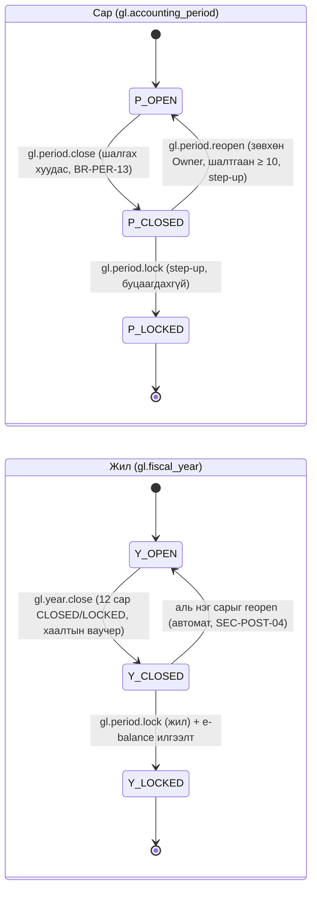

# 10. Үе, сар/жилийн хаалт ба тайлан (Periods, Closing & Reporting) — модулийн тодорхойлолт

> **Төлөв:** Хөгжүүлэлтэд бэлэн ноорог v1.1 (adversarial хяналтын засвартай — төгсгөлийн "Хяналтын тэмдэглэл"). **Огноо:** 2026-10-08.
> **Модуль:** `gl` schema-гийн үе ба хаалтын хэсэг (санхүүгийн жил, сар, үеийн төлөвийн машин, posting огнооны цонх, сарын хаалтын шалгах хуудас, жилийн хаалтын wizard, хуримтлагдсан ашиг руу шилжүүлэх) + `rpt` schema (санхүүгийн тайлангийн хөдөлгүүр (financial report engine), Маягт А-гийн СБТ/ОДТ/ӨӨТ/МГТ, гүйлгээ баланс, ерөнхий дэвтэр, дансны хуулга, AR/AP насжилт, e-balance-ийн шивэх хуудас, Excel/PDF, тайлангийн snapshot, жилийн архивтай уялдах).
> **Нэг эх сурвалж:** [DECISIONS.md](./DECISIONS.md) (§K: нэршлийг [`db/schema/*.sql`](./db/schema/) тодорхойлно). Бусад баримттай зөрвөл DECISIONS → schema → энэ баримт гэсэн дарааллаар давамгайлна.
> **Уншигч:** backend хөгжүүлэгч, QA, нягтлан ба татварын зөвлөх, бүтээгдэхүүний эзэн.
> **Холбоотой баримт:** [01-requirements.md](./01-requirements.md) (FR-GL-002, FR-GL-022…028, FR-RPT-001…018, CMP-007…010, CMP-012, NFR-014/015), [02-architecture.md](./02-architecture.md) §4.2.4, §4.2.13, §6.9, §8.3–8.5, §9.6, §12.8, [03-domain-model.md](./03-domain-model.md) §6.2, INV-06, [05-posting-engine.md](./05-posting-engine.md) §5.13 (жилийн хаалтын posting, BR-PST-54…59), §6.7–6.8, E-H…E-J, [08-tax-vat-mn.md](./08-tax-vat-mn.md) (НӨАТ-ын үе), [09-bank-cash-fx.md](./09-bank-cash-fx.md) (`cash_flow_category_id`, дахин үнэлгээ), [13-security-audit-tenancy.md](./13-security-audit-tenancy.md) §8 (SEC-POST-01…11), §12.6 (архив), §18 (алдааны код), [14-api.md](./14-api.md) §15.5–15.6, [15-ui-ux.md](./15-ui-ux.md) S-GL-09…11, S-RPT-01…17, §16.8, [16-test-strategy.md](./16-test-strategy.md) §12.11–12.12, [db/README.md](./db/README.md), [db/seed/README.md](./db/seed/README.md) §3, §4, §8, §12.
> **Судалгаа (BC эх):** [bc-periods-reporting.md](./research/bc-periods-reporting.md) (R-PERIODS-REPORTING-01…50, §5, §7, §8), [bc-gl-posting.md](./research/bc-gl-posting.md) (R-GL-POSTING-04, -05, -07, -15, -18, -19, -35, -37), [bc-subledgers-application.md](./research/bc-subledgers-application.md) (R-SUBLEDGERS-APPLICATION-33, -34), [mn-accounting.md](./research/mn-accounting.md) (§3 тайлангийн мөр, §3.4 хугацаа, §3.5 e-balance, §7 хаалт, REQ-ACC-10…14, REQ-ACC-20), [legal-parameters.md](./research/legal-parameters.md) (`ebalance.*`, `retention.accounting_years`).

## Агуулга

- [0. Энэ баримтыг хэрхэн унших](#0-энэ-баримтыг-хэрхэн-унших)
- [1. Зорилго ба хамрах хүрээ](#1-зорилго-ба-хамрах-хүрээ)
- [2. Ойлголт ба BC-ээс авсан зүйл](#2-ойлголт-ба-bc-ээс-авсан-зүйл)
- [3. Өгөгдөл](#3-өгөгдөл)
- [4. Бизнесийн дүрмүүд](#4-бизнесийн-дүрмүүд)
- [5. Процесс ба алгоритм](#5-процесс-ба-алгоритм)
- [6. Тооцоолол ба бөөрөнхийлөлт](#6-тооцоолол-ба-бөөрөнхийлөлт)
- [7. Posting-ийн жишээнүүд](#7-posting-ийн-жишээнүүд)
- [8. Validation ба алдааны кодууд](#8-validation-ба-алдааны-кодууд)
- [9. Events ба интеграц](#9-events-ба-интеграц)
- [10. API ба UI холбоос](#10-api-ба-ui-холбоос)
- [11. Тест сценари](#11-тест-сценари)
- [12. Schema change requests](#12-schema-change-requests)
- [13. Нээлттэй асуулт](#13-нээлттэй-асуулт)
- [Хавсралт А. Бусад баримттай зөрүү](#хавсралт-а-бусад-баримттай-зөрүү)
- [Хяналтын тэмдэглэл (Review log)](#хяналтын-тэмдэглэл-review-log)

---

## 0. Энэ баримтыг хэрхэн унших

### 0.1 Тэмдэглэгээ

| Тэмдэглэгээ | Утга |
|---|---|
| `BR-PER-nn` | Санхүүгийн жил, сар, үеийн төлөв, posting огнооны цонх, сарын хаалт ба шалгах хуудасны дүрэм (энэ баримт эзэмшинэ) |
| `BR-YEC-nn` | Жилийн хаалтын (year-end close) wizard, урьдчилсан нөхцөл, хуримтлагдсан ашиг руу шилжүүлэх, дахин хаах дүрэм. Posting-ийн цөм (дүн, ваучер) нь [05](./05-posting-engine.md) BR-PST-54…59 — энд давтахгүй, иш татна |
| `BR-RPT-nn` | Тайлангийн огнооны утга, гүйлгээ баланс, ерөнхий дэвтэр, хуулга, насжилт, тайлангийн хөдөлгүүр, Маягт А, МГТ, экспорт, snapshot-ын дүрэм |
| `BR-EBL-nn` | e-balance-ийн шивэх хуудас (keying sheet) ба мянган төгрөгийн бөөрөнхийлөлтийн дүрэм |
| `AT-PER-nn`, `AT-RPT-nn` | Хүлээн авах тест (Given/When/Then, §11) |
| `GS-CLOSE-nnn`, `GS-RPT-nnn`, `GS-GL-nnn` | Golden scenario ([16-test-strategy.md](./16-test-strategy.md) §12) |
| `E-1…E-12` | §7-ийн posting/тайлангийн жишээ |
| `SCR-RPT-nn` | Энэ баримтын schema/seed өөрчлөлтийн хүсэлт (§12) |
| `OQ-RPT-nn` | Нээлттэй асуулт (§13) |
| `Z-RPT-nn` | BC-ээс санаатай зөрүүтэй шийдвэр (§2.4) |
| `k(d, c)` | Огноо ба хаалтын тэмдгийн дарааллын түлхүүр: `k = 2·d + (c ? 1 : 0)` (§6.1). BC-ийн C-огноо (closing date)-г орлоно |
| `[a..b]`, `[..b]`, `[..C(a−1)]` | Тайлангийн огнооны муж: §6.2-ын утгаар (дээд хил нь `C(b)`-г **оруулахгүй**, `..C(a−1)` нь `a`-гаас өмнөх хаалтын бичилтийг **оруулна**) |
| `r(x)` | `MoneyMath.Round(x, 0.01)`, `MidpointRounding.AwayFromZero` (ADR-0006, D-C2) |
| `rk(x)` | Мянган төгрөг: `Round(x / 1000, 0, AwayFromZero)` (D-C2, 14 API-RPT-05) |
| Түүхий утга (raw) | `gl_entry.amount`-ын тэмдэгтэй нийлбэр: **дебит = +, кредит = −** (D-C3). Томьёо үргэлж түүхий утгаар (R-PERIODS-REPORTING-36) |
| Харуулах утга (displayed) | Тэмдгийн эргүүлэлт (`show_opposite_sign`), `show`, бөөрөнхийлөлтийн дараах утга (§6.7) |
| FYS(d), FYE(d) | `d`-г агуулсан санхүүгийн жилийн эхлэл ба төгсгөл: `make_date(year(d),1,1)`, `make_date(year(d),12,31)` (хуанлийн жил, `gl.fiscal_year` CHECK) |
| Дүн | Жишээ бүр MNT, НӨАТ 10 %, нарийвчлал 0.01; мянгатын тусгаарлагч таслал (`1,100,000.00`). Хүснэгтэд "Дт"/"Кт" |

### 0.2 Нэрийн зөрүүг шийдсэн байдал (D-K1: schema давамгайлна)

| Бусад баримтад | Энэ баримтад (schema) |
|---|---|
| Үеийн төлөв `OPEN / SOFT_LOCKED / CLOSED / HARD_LOCKED` (02 §4.2.4, §6.8–6.9) | `gl.accounting_period.status`, `gl.fiscal_year.status` ∈ `OPEN / CLOSED / LOCKED` (D-D3, 020_gl.sql). `SOFT_LOCKED` байхгүй; `HARD_LOCKED` = `LOCKED` |
| `gl.period.post_soft_locked` эрх (02 §6.8–6.9) | Байхгүй: `CLOSED` үед хэн ч бичихгүй (D-D3, SEC-POST-01…03) |
| `reporting.statement_template`, `statement_template_line`, `account_line_mapping` (02 §4.2.13) | `rpt.statement_line` (глобал, хувилбартай), `rpt.fin_report_row_definition` / `fin_report_row` / `fin_report_column_definition` / `fin_report_column` / `financial_report`, `gl.gl_account.statement_line_id`, `gl.gl_account.cash_flow_category_id` |
| `reporting.filing_submission`, `reporting.report_job`, `reporting.archive_package` (02 §4.2.13, §9.6) | Схемд алга: илгээлт → SCR-RPT-02 (`rpt.filing_submission`); job → `integration.job_run` (`rpt.report.export`, 14 SCR-API-02); архив → `platform.archive_package` (13 CR-12) |
| `gl.v_trial_balance`, `gl.v_account_period_balance`, `gl.account_period_balance` (02 §4.2.4) | `rpt.v_trial_balance_base`, `rpt.fn_trial_balance` (920_views.sql; SCR-RPT-01-ээр утгыг засна), `gl.v_gl_account_period_balance`. Проекц хүснэгт R1-д байхгүй (SCR-RPT-08, сонголттой) |
| `core.fn_lock_company_posting` (02 §6.5) | `platform.fn_lock_company_posting(tenant, company)` (010_platform.sql) |
| Source code `CLOSE_YEAR` (FR-GL-020) | `CLSINCOME` (010_platform.sql, 05 BR-PST-17) |
| `PeriodStatusChanged`, `FiscalYearClosed`, `ArchivePackageCreated` (02 §4.2.4, §4.2.13) | Outbox topic: `gl.fiscal_year.closed` (05 §9.1), `notify.period_reopened` (13 SEC-POST-06), `gl.fiscal_year.locked` (энэ баримт, §9) |
| Улаан сторно `is_correction` (02 §6.8) | Хэрэглэхгүй (D-C3): буцаалт эсрэг баганад |
| `rpt.ar_aging`, `rpt.report.export`, `gl.year.lock` (14, 15) | Seed-ийн нэр: `rpt.customer_aging`, `rpt.vendor_aging`, `rpt.export.excel`, `gl.period.lock` (13 X1) |

### 0.3 Модулийн хил

- **GL (үе ба хаалт):** `gl.fiscal_year`, `gl.accounting_period`, `gl.accounting_period_status_log` бичих эрхтэй цорын ганц модуль. Үеийн төлөвийг өөрчлөх, жилийн хаалт хийх бүх үйлдэл компанийн posting түгжээг (`platform.fn_lock_company_posting`) авна (02 §6.9, SEC-POST-10, BR-PST-60).
- **Reporting (`rpt`):** зөвхөн уншина (02 §4.3 дүрэм 2). Бусад модулийн хүснэгтийг зөвхөн published view/функцээр (`<schema>.v_*`, `rpt.fn_*`, `party.fn_*_aging`) эсвэл энэ баримтад заасан SQL-ээр уншина. Reporting-оос ямар ч модуль хамаарахгүй.
- **Хамаарлыг урвуулах:** сарын хаалтын шалгах хуудсыг GL-ийн `:close` команд хэрэглэдэг боловч мөрийг нь бусад модуль тооцно. GL нь `ICloseChecklistProvider`-ийг (GL.Contracts) тодорхойлж, **Reporting** хэрэгжүүлнэ (Reporting бүх модулиас хамаарч болно; EBarimt нь GL-ээс хамаарч чадахгүй тул шууд contributor болохгүй — 02 §4.3).

---

## 1. Зорилго ба хамрах хүрээ

### 1.1 Зорилго

1. **Үеийн хяналт.** Хуанлийн жил ба 12 сарыг автоматаар үүсгэж, сар бүрийг `OPEN → CLOSED → LOCKED` төлөвөөр удирдана. Хаагдсан үед ямар ч эрхээр бичилт хийхгүй (D-D3). Хаалтын өмнө Монголын бичил бизнесийн сарын хаалтын шалгах хуудсыг (банк, касс, eBarimt, орцын НӨАТ, НӨАТ-ын тайлан, Маягт А-гийн харгалзаа) харуулна.
2. **Жилийн хаалт.** 12-31-ний `is_closing = true` хаалтын ваучераар орлого, зардлын дансыг "Тайлант үеийн ашиг (алдагдал)" (seed 3500) руу хааж, 01-01-нд хуримтлагдсан ашиг (3400) руу шилжүүлэх журналыг санал болгоно (D-D4). Дахин ажиллуулахад зөвхөн зөрүү бичигдэнэ.
3. **Тайлан.** Нэг хөдөлгүүрээр (BC account schedule-ийн логик: мөр × багана, томьёо, огнооны утга) Маягт А-гийн СБТ, ОДТ, ӨӨТ ба шууд аргын МГТ-ийг гаргана. Гүйлгээ баланс, ерөнхий дэвтэр, дансны хуулга, насжилтыг тусгай SQL-ээр гаргана. Бүгд XLSX ба PDF-ээр экспортлогдоно.
4. **e-balance.** Сангийн яамны e-balance системд гараар шивэх дарааллаар, мянган төгрөгөөр "эхлээд бөөрөнхийлөөд дараа нь нийлбэрлэх" шивэх хуудас гаргаж, зөрүүг тусгай мөрөнд харуулна (D-C2). Илгээсэн нотолгоог хадгалж, жилийг `LOCKED` болгоно.

### 1.2 Хамрах хүрээ

| Орно | Орохгүй (хаана) |
|---|---|
| `gl.fiscal_year`, `gl.accounting_period` үүсгэх, дараагийн жилийг урьдчилан нээх | Posting engine-ий огнооны шалгалтын код (05 §5.3, 13 §8.2) — энд зөвхөн дүрэм ба төлөв |
| Үеийн төлөвийн машин, хаах / түгжих, шалгах хуудас; дахин нээх (алгоритм нь 13 §8.4) | Хэрэглэгчийн posting цонхны UI (R2, 13 P5) |
| Компанийн posting огнооны цонх (lock date) хэрэглэх дүрэм | НӨАТ-ын үе, ТТ-03а (08) — энд зөвхөн хаалтын шалгах хуудсын мөр |
| Жилийн хаалтын wizard: урьдчилсан нөхцөл, шалгах хуудас, preview, хаах, 3500 → 3400 санал, дахин хаах | Хаалтын ваучерын дүн ба бичилт (05 §5.13, BR-PST-54…59) — иш татна |
| Тайлангийн хөдөлгүүр: мөр/баганын төрөл, томьёоны дүрэм (EBNF), огнооны утга, бөөрөнхийлөлт | Тайлан засварлагч UI (S-RPT-17, R2, FR-RPT-016) |
| Маягт А: СБТ, ОДТ, ӨӨТ, МГТ (seed `mn_50_reports.sql`) | Маягт Б (завсрын тайлан) ба тодруулга (notes) — R3/OQ-RPT-03 |
| Гүйлгээ баланс, ерөнхий дэвтэр, харилцагч/нийлүүлэгчийн хуулга ба тооцоо нийлсэн акт, AR/AP насжилт, касс ба банкны дэвтэр, борлуулалт/худалдан авалтын журнал | ТТ-03а (08), ҮХ-ийн НББ/татварын зөрүү (11), банкны тулгалтын тайлан (09) |
| e-balance-ийн шивэх хуудас (XLSX + JSON), илгээлтийн бүртгэл, жил түгжих | e-balance-д шууд илгээх API (R3, байгаа эсэх тодорхойгүй — mn-accounting §3.5) |
| Тайлангийн snapshot ба гарын үсгийн холбоос, архивын багцад өгөх өгөгдөл | Архивын багцын үүсгэлт, хадгалалт, шалгалт (13 §12.6) |

### 1.3 Хувилбар (DECISIONS §H)

| Хувилбар | Агуулга |
|---|---|
| **R1 (MVP)** | Хуанлийн жил + 12 сар, дараагийн жилийг урьдчилан үүсгэх; `OPEN/CLOSED/LOCKED` төлөв, хаах/түгжих, Owner дахин нээх (D-D3); компанийн posting цонх; сарын хаалтын шалгах хуудас (§4.4); жилийн хаалтын wizard ба дахин хаалт, 3500 → 3400 санал (D-D4); тайлангийн хөдөлгүүр (мөр: `POSTING_ACCOUNTS`, `FORMULA`, `CASH_FLOW_CATEGORY`, `STATEMENT_LINE`, `ACCOUNT_CATEGORY`; багана: `NET_CHANGE`, `BALANCE_AT_DATE`, `BEGINNING_BALANCE`, `YEAR_TO_DATE`, `FORMULA`; харьцуулах огнооны томьёо; бөөрөнхийлөх нэгж); Маягт А-гийн 4 тайлан (seed, зөвхөн унших); гүйлгээ баланс; ерөнхий дэвтэр; дансны хуулга/акт; насжилт; касс/банкны дэвтэр; борлуулалт/худалдан авалтын журнал; e-balance шивэх хуудас; XLSX/PDF; snapshot; global dimension-ээр шүүх (Should, FR-RPT-018) |
| **R2** | Тайлан засварлагч ба хуулбарласан тодорхойлолт (FR-RPT-016); `WHEN_POSITIVE_BALANCE`/`WHEN_NEGATIVE_BALANCE` (тэмдгээр хуваах, seed §12 #7); `SET_BASE_FOR_PERCENT`, `TOTAL_ACCOUNTS`; `REST_OF_FISCAL_YEAR`, `ENTIRE_FISCAL_YEAR`; төсвийн багана (`BUDGET_ENTRIES`); мөр/баганын dimension totaling; хэрэглэгч бүрийн posting цонх (FR-GL-027); шалгах хуудсанд элэгдэл, ханшийн дахин үнэлгээ, барааны өртгийн мөр; МГТ-ийн эсрэг чиглэлийн ангилал (SCR-RPT-05) |
| **R3** | e-balance-д шууд илгээх adapter (`IFinancialStatementChannel`, API байвал), Маягт Б, тодруулгын загвар |

### 1.4 Шаардлагын хамрах хүснэгт (traceability)

| FR / CMP | Нэр | Хувилбар | Энэ баримтад |
|---|---|---|---|
| FR-GL-002 | Маягт А-гийн харгалзааг шалгах | R1 | BR-PER-33 (`FORM_A_MAPPING`), BR-RPT-63 |
| FR-GL-022 | Санхүүгийн жил ба үе | R1 | BR-PER-01…05, §5.2 |
| FR-GL-023 | Компанийн posting огнооны цонх | R1 | BR-PER-20…26 |
| FR-GL-024 | Үеийн төлөв ба сарын хаалт | R1 | BR-PER-10…19, §5.3, §5.5 |
| FR-GL-025 | Сарын хаалтын шалгах хуудас | R1 (Should) | BR-PER-30…45, §5.4 |
| FR-GL-026 | Жилийн хаалт | R1 | BR-YEC-01…16, §5.6, E-3…E-7 |
| FR-GL-027 | Хэрэглэгч бүрийн posting цонх | R2 | BR-PER-24 |
| FR-GL-028 | Бүрэн бүтэн байдлын шалгалт | R1 (Should) | BR-PER-38 (шалгах хуудасны мөр) |
| FR-RPT-001 | Гүйлгээ баланс | R1 | BR-RPT-10…13, §5.9, E-2, E-4, E-6 |
| FR-RPT-002 | Ерөнхий дэвтэр | R1 | BR-RPT-14…15, §5.10 |
| FR-RPT-003 | Харилцагч/нийлүүлэгчийн хуулга, акт | R1 | BR-RPT-16…17, §5.11 |
| FR-RPT-004 / 005 | AR / AP насжилт | R1 | BR-RPT-20…25, §5.12, E-12 |
| FR-RPT-006 | Касс ба банкны дэвтэр | R1 (Should) | BR-RPT-18 |
| FR-RPT-007 | Борлуулалт ба худалдан авалтын журнал | R1 (Should) | BR-RPT-19 |
| FR-RPT-008…011 | СБТ, ОДТ, ӨӨТ, МГТ | R1 | BR-RPT-60…77, §5.13–5.14, E-8, E-9 |
| FR-RPT-012 | Маягт А-гийн загварын хувилбар | R1 | BR-RPT-64, BR-RPT-90…93 |
| FR-RPT-013 | e-balance-ийн шивэх хуудас | R1 | BR-EBL-01…12, §5.15, §6.8, E-11 |
| FR-RPT-014 | Excel ба PDF экспорт | R1 | BR-RPT-80…89, §5.16 |
| FR-RPT-015 | Тайлангийн бутархай орон | R1 (Should) | BR-RPT-46 |
| FR-RPT-016 | Засварлах боломжтой тайлан | R2 | BR-RPT-30…55 (хөдөлгүүр R1-д бэлэн), §5.13.4 |
| FR-RPT-017 | Жилийн архивын багц | R1 | BR-RPT-93, §9 (13 §12.6) |
| FR-RPT-018 | Dimension-ээр шүүх | R1 (Should) | BR-RPT-06 |
| CMP-007, 008, 009, 010, 012 | Хадгалалт, Маягт А, e-balance, шууд МГТ, Order 100 бүртгэл | R1 | §4.10–4.13 |

---

## 2. Ойлголт ба BC-ээс авсан зүйл

### 2.1 Үндсэн ойлголт

| Ойлголт | Тайлбар |
|---|---|
| Санхүүгийн жил (fiscal year) | Хуанлийн жил (НББ-ийн хууль, mn-accounting §2.3). `gl.fiscal_year (year, starting_date = YYYY-01-01, ending_date = YYYY-12-31, status)` |
| Тайлант үе (accounting period) | Сар. `gl.accounting_period` (12 мөр/жил, `new_fiscal_year` = 1-р сар). Огнооны муж давхцахгүй (`EXCLUDE USING gist`, INV-07) |
| Үеийн төлөв | `OPEN` — бичилт зөвшөөрнө; `CLOSED` — бичилт хориотой, Owner шалтгаантай дахин нээнэ; `LOCKED` — эцсийн, буцаагдахгүй (D-D3). Жил ч мөн ижил 3 төлөвтэй |
| Posting огнооны цонх (lock date) | `platform.company_setup.allow_posting_from/to`. Үеийн төлөвөөс **гадна** нэмэлт хязгаар; бүх эрхэд, хаалтын ваучерт ч (D-D3, SEC-POST-01) |
| Хаалтын бичилт (closing entry) | `gl_transaction.is_closing = gl_entry.is_closing = true`, огноо 12-31, source `CLSINCOME`. BC-ийн C-огноо `C31.12`-ийг орлоно (D-D4, R-PERIODS-REPORTING-12) |
| Дарааллын түлхүүр `k` | Тайланд хаалтын бичилт "12-31-ний дараа, 01-01-ээс өмнө" байрлана: `k(d, c) = 2·d + c` (§6.1, research §5.1) |
| Тайлангийн хөдөлгүүр | Мөрийн тодорхойлолт (`fin_report_row`: юуг нийлбэрлэх) × баганын тодорхойлолт (`fin_report_column`: аль хугацаа, ямар дүн) = нүд. BC-ийн Financial Report / Account Schedule (T84/85/333/334, CU8) |
| Маягт А-гийн мөр | `rpt.statement_line` (глобал, `form_code = 'A'`, `statement_code ∈ BS/IS/EQ/CF`, хувилбартай `effective_from/to`, `verified`). Posting данс бүр СБТ эсвэл ОДТ-ийн нэг навч мөртэй (`gl_account.statement_line_id`) |
| МГТ-ийн ангилал | `rpt.cash_flow_category` (глобал, 38 код). Данс бүр нэг анхдагч ангилалтай (`gl_account.cash_flow_category_id`); банкны бичилт тус бүр override хийж болно (`bank_ledger_entry.cash_flow_category_id`) |
| Шивэх хуудас (keying sheet) | e-balance-ийн дэлгэцийн дарааллаар Маягт А-гийн мөр, мянган төгрөгөөр, бөөрөнхийлөлтийн зөрүүний мөртэй |

### 2.2 BC-ээс шууд авсан (copy)

| BC | Манай | Research |
|---|---|---|
| Хаалтын бичилт C-огноон дээр; энгийн муж `a..b` нь `C(b)`-г оруулахгүй, эхний үлдэгдэл `..C(a−1)` оруулна | `is_closing` + `k` түлхүүр (§6.1–6.2); ОДТ хаалтын дараа ч ашгийг харуулна, шинэ жилийн эхний үлдэгдэлд орлого/зардал 0 | R-PERIODS-REPORTING-12, -25; §5.1 |
| Close Income Statement: зөвхөн `Posting` + `Income Statement` данс, `FYS..C(FYE)`-ийн цэвэр дүнгийн эсрэг, үр дүн хуримтлагдсан ашгийн данс руу; дахин ажиллуулахад зөрүү | 05 BR-PST-55…56 (данс бүр нэг мөр, dimension-гүй) | R-PERIODS-REPORTING-17, -18; R-GL-POSTING-05, -37 |
| Хаалтын ваучер зөвхөн G/L дансанд (дэд дэвтэргүй), `direct_posting` шалгалтгүй, НӨАТ-гүй | BR-YEC-07, 05 BR-PST-59 | R-PERIODS-REPORTING-14, -15; R-GL-POSTING-07, -15 |
| Posting огнооны цонх бүх G/L posting-д engine-ээр мөрдөгдөнө; хоосон хил = хязгааргүй; хэрэглэгчийн цонх нарийсгана | BR-PER-20…24 | R-PERIODS-REPORTING-08, -11; R-GL-POSTING-18 |
| FlowField `Net Change`, `Balance at Date`, `Debit/Credit Amount` = `gl_entry`-ийн SQL нийлбэр; хадгалахгүй | §5.9 (SQL), §6.2 | R-PERIODS-REPORTING-23; R-GL-POSTING-04 |
| Financial report = мөр × багана; `CalcCell` нь нүд бүрийг тооцож, томьёог **түүхий** утгаар, тэмдгийн эргүүлэлт ба `Show`-г зөвхөн гадна талд | BR-RPT-30…46 | R-PERIODS-REPORTING-26, -36, -37 |
| Багана × мөрийн төрлөөр огнооны муж тодорхойлох матриц | §6.2 (2 нүдийг өөрчилсөн, Z-RPT-02) | R-PERIODS-REPORTING-30; §5.2 |
| Харьцуулах огнооны томьёо (`-1Y`), бүтэн сарын мужид сарын төгсгөл рүү таслах | BR-RPT-04 | R-PERIODS-REPORTING-31 |
| Томьёоны оператор `+ - * / ^ %`, хаалт, мөр/баганын кодын шүүлтүүр, өөрийгөө хасах, 0-д хуваахад 0 + тэмдэг | §6.6 EBNF | R-PERIODS-REPORTING-33, -34, -35 |
| Мөр ба баганын `Amount Type` хослол (Net давамгайлагдана, Debit×Credit = 0) | BR-RPT-37 | R-PERIODS-REPORTING-32 |
| `FormatCellResult`-ийн дараалал: баганын Show → баганын эсрэг тэмдэг → мөрийн эсрэг тэмдэг | BR-RPT-43 | R-PERIODS-REPORTING-37 |
| Rounding factor: None / 1 / 1000 / 1 000 000; зөвхөн харуулах | BR-RPT-45 (1000-д Z-RPT-05) | research §5.5 |
| Account Category totaling: мод даяар BFS, давхардлыг visited set-ээр хасна | BR-RPT-35 | R-PERIODS-REPORTING-28 |
| СБТ-ийн хуримтлагдсан ашгийн мөрөнд **бүх** орлого/зардлын данс (хаалтаас үл хамааран Хөрөнгө = Өр + Өмч) | Seed 2.2.7 = `3400..3998\|5000..9998` | R-PERIODS-REPORTING-45 |
| Гүйлгээ баланс: эхний (`..C(from−1)`), Дт/Кт гүйлгээ (бүдүүн), эцсийн; данс бүр тусдаа цэвэрлэгдэнэ | BR-RPT-10…13 | R-PERIODS-REPORTING-48, -49; §5.4 |
| Насжилт: `posting_date ≤ D`, үлдэгдэл = D хүртэлх detailed, төлөх огноогоор | BR-RPT-20…25 | R-SUBLEDGERS-APPLICATION-34 |
| Харилцагчийн үлдэгдэл = Σ detailed entry | BR-RPT-16 | R-SUBLEDGERS-APPLICATION-33 |

### 2.3 Хялбарчилсан (simplify)

| BC | Манай | Шалтгаан |
|---|---|---|
| Үе нь зөвхөн эхлэх огноо; FY нь `New Fiscal Year` мөрөөр | Хуанлийн жил, 12 сар, `ending_date` багана; FYS/FYE = хуанлийн (R-PERIODS-REPORTING-01, -02, -03) | Хууль (mn-accounting §2.3) |
| `Closed` ба `Date Locked` posting-ийг хаадаггүй; зөвхөн цонх хаана | Үеийн төлөв өөрөө хаана (`CLOSED`/`LOCKED`), цонх нэмэлт (R-PERIODS-REPORTING-06) | D-D3; research §7 (2) |
| CU6 Fiscal Year-Close (posting-гүй) → R94 (журналын мөр) → гараар батлах | Нэг wizard: шалгах хуудас → preview → `:close` (нэг transaction, ноорог журналгүй, 05 §5.13) | Давхар ноорог (R-PERIODS-REPORTING-21) эрсдэлгүй |
| R94 entry бүрд мөр, dimension/BU-ээр бүлэглэх | Данс бүр нэг мөр, dimension-гүй (R-PERIODS-REPORTING-20, -22) | Бичил бизнес; 05 §6.7 |
| Хэрэглэгч бүрийн цонх + template цонх + deferral/VAT date цонх | R1: компанийн цонх; R2: хэрэглэгчийн цонх (`platform.user_setup`) (R-PERIODS-REPORTING-10) | DECISIONS §H |
| `Comparison Period Formula` (P/FY/CP), analysis view, business unit, ACY, cost type | Зөвхөн огнооны томьёо; бусад нь SKIP | research §7 (6), (9) |
| `Show When Positive/Negative` нь fast path-аар мөрийн нийлбэрт | R2-т **данс бүрээр** (тэмдгээр хуваах) — Z-RPT-04 | seed §12 #7, IFRS for SMEs 2.52 |
| Indirect МГТ (Additional Report Definition) | Шууд арга: мөнгөний дансны гүйлгээг харьцсан дансны ангиллаар (R-PERIODS-REPORTING-47) | CMP-010 |
| Category-аас тайлан автоматаар үүсгэх (CU571) | Seed-ийн бэлэн Маягт А-гийн тодорхойлолт (R-PERIODS-REPORTING-43, -44) | Маягт А нь хууль журмын хэлбэр |

### 2.4 Хассан ба санаатай зөрүү (drop / Z-RPT)

| ID | BC | Манай | Шалтгаан |
|---|---|---|---|
| Z-RPT-01 | Мөрийн томьёоны мужийг (`a..b`) мөрийн дугаарын **тэмдэгт мөрөөр** харьцуулна (R-PERIODS-REPORTING-46, pitfall 9) | Муж = мөрийн `line_no` дарааллаар `a`-аас `b` хүртэлх `row_no`-тэй мөрүүд | `10..50`-д `100` орох алдаанаас сэргийлэх |
| Z-RPT-02 | Багана `BEGINNING_BALANCE` × мөр `BALANCE_AT_DATE` = 0; багана `BALANCE_AT_DATE` × мөр `BEGINNING_BALANCE` = 0 (research §5.2) | Хоёулаа `[..C(From−1)]` | Seed-ийн СБТ (`BS_2Y.C1 = BEGINNING_BALANCE` × мөр `BALANCE_AT_DATE`) "оны эхний үлдэгдэл"-ийг ингэж л зөв гаргана |
| Z-RPT-03 | Мөчлөгт лавлагаа зөвхөн "өөрийгөө биш"-ээр хамгаалагдана | DFS-ээр мөчлөг илрүүлж `rpt.formula_cycle` | R-PERIODS-REPORTING-33 (pitfall) |
| Z-RPT-04 | `Show When Positive/Negative Balance` нь ердийн мөрөнд мөрийн нийлбэрт (R-PERIODS-REPORTING-38) | R2: данс бүрийн түүхий утгаар шүүнэ (тухайн тэмдэгтэй данс л мөрөнд орно) | 2310 НӨАТ-ын тооцоо, банкны овердрафтыг хөрөнгө/өр төлбөрт хуваах (seed §12 #7) |
| Z-RPT-05 | Rounding factor 1000 → `Round(x/1000, 0.1)` | Бүхэл мянга (`rk(x)`); Маягт А-гийн тайланд "эхлээд бөөрөнхийлөөд дараа нь нийлбэрлэх" (§6.8) | D-C2 (e-balance мянган төгрөг, бүхэл) |
| Z-RPT-06 | Баганын `include_closing_entries` байхгүй; хэрэглэгч `C31.12`-г шүүлтүүрт бичнэ | Багана ба хүсэлтийн boolean (`include_closing_entries`, `includeClosingEntries`) нь **дээд хилд** `C(To)`-г оруулна | Хэрэглэгч C-огноо бичих боломжгүй (research §8 #1) |
| Z-RPT-07 | Хаалтын журнал ноорог хэлбэрээр (R94), давхар ажиллуулах боломжтой | Нэг transaction-д тооцоолж батлана; зөрүү 0 бол no-op | 05 BR-PST-56 |
| Z-RPT-08 | `Prior-Year Entry`, Inventory Period, analysis view, consolidation | SKIP | research §7 (9) |
| Z-RPT-09 | `rpt.fn_trial_balance` (одоогийн 920): орлого/зардлын дансны эхний үлдэгдэл FYS-ээс, **бүх** хаалтын бичилтийг хасна | BC-ийн `k` утга: эхний үлдэгдэлд өмнөх хаалтын бичилт үргэлж орно; зөвхөн тайлангийн `C(To)`-г шүүлтүүрээр хасна (BR-RPT-11) → SCR-RPT-01 | 16 SCR-T01, seed §12 #9: одоогийнх өмнөх жил хаагдаагүй үед эхний үлдэгдэл тэнцэхгүй |

---

## 3. Өгөгдөл

Бүх нэр [`db/schema/*.sql`](./db/schema/)-ээс (D-K1). Тайлбарт зөвхөн энэ модульд хэрэглэх утгыг бичив.

### 3.1 Санхүүгийн жил ба үе (`020_gl.sql`)

| Хүснэгт.багана | Утга / дүрэм |
|---|---|
| `gl.fiscal_year.year`, `starting_date`, `ending_date` | Хуанлийн жил; CHECK `starting_date = make_date(year,1,1)`, `ending_date = make_date(year,12,31)` |
| `gl.fiscal_year.status` | `OPEN` / `CLOSED` / `LOCKED`. `CLOSED` нь зөвхөн жилийн хаалтаар (05 BR-PST-57); `LOCKED` нь e-balance илгээсний дараа (BR-PER-17). `LOCKED → *` хориотой (`trg_fiscal_year_status`, `ERP02`) |
| `gl.fiscal_year.closing_transaction_no` | Сүүлийн хаалтын ваучерын `transaction_no` (FK `gl.gl_transaction`). Орлого/зардлын бичилтгүй жилийг ваучергүй хаахад (BR-YEC-06, 05 BR-PST-57) `NULL` хэвээр үлдэнэ — тиймээс "хаалт хийгдсэн эсэх"-ийн тэмдэг болгож **хэрэглэхгүй** |
| `gl.fiscal_year.closed_at`, `closed_by` | Сүүлийн хаалт хийсэн цаг, хэрэглэгч (ваучертай ба ваучергүй хаалт хоёуланд тавигдана; дахин нээхэд (13 §8.4) арилдаггүй). `status = 'OPEN' AND closed_at IS NOT NULL` = "хаалтын дараа өөрчлөгдсөн жил" (SEC-POST-11, BR-YEC-12) |
| `gl.accounting_period.starting_date`, `ending_date`, `name` | Сар (`'3-р сар 2026'`); `new_fiscal_year = (сар = 1)` CHECK |
| `gl.accounting_period.status`, `status_changed_at`, `status_changed_by` | `OPEN/CLOSED/LOCKED`; `trg_accounting_period_status` нь `LOCKED`-ийг эцсийн болгож, posting-тэй үеийн огноог өөрчлөхийг хориглоно (`ERP02`) |
| `gl.accounting_period_status_log` | Append-only түүх: `from_status`, `to_status`, `reason_code_id`, `reason_text`; CHECK: `from_status <> 'LOCKED'`, `to_status = 'OPEN'` бол `reason_text` заавал |
| `gl.fn_create_fiscal_year(year)` | Жил + 12 сар үүсгэнэ (R93-ийн хялбарчилсан) |
| `gl.fn_mn_ensure_fiscal_year(year)` (seed `mn_40_setup.sql`) | Idempotent: жил + 12 сар + 12 НӨАТ-ын үе |
| `platform.fn_mn_ensure_number_series(year)` (seed) | Тухайн жилийн хуулийн цувралын мөр (`reset_yearly`, D-C7) |

### 3.2 Цонх ба тохиргоо

| Хүснэгт.багана | Утга |
|---|---|
| `platform.company_setup.allow_posting_from`, `allow_posting_to` | Компанийн posting цонх (D-D3). `NULL` = хязгааргүй. CHECK `from ≤ to` |
| `platform.company_setup.report_decimal_places` | Тайлангийн харуулах бутархай орон (0 эсвэл 2; D-C2, FR-RPT-015) |
| `platform.company_setup.go_live_date` | Ашиглалтад орсон огноо; түүнээс өмнөх хоосон үеийг бөөнөөр хаах (BR-PER-15) |
| `platform.company_setup.legal_name`, `tin`, `registration_no` | Тайлан, шивэх хуудасны толгой |
| `platform.user_setup.allow_posting_from/to` | R2: хэрэглэгчийн цонх (нарийсгана) |
| `gl.general_ledger_setup.current_year_result_account_id` | 3500 "Тайлант үеийн ашиг (алдагдал)" — жилийн хаалтын үр дүнгийн данс (D-D4) |
| `gl.general_ledger_setup.retained_earnings_account_id` | 3400 "Хуримтлагдсан ашиг" — 01-01-ний шилжүүлгийн данс |
| `gl.journal_template` / `journal_batch` `CLOSING` / `YEAR_END` (seed) | Хаалтын ваучерын цуврал `CL` (05 BR-PST-56) |
| `gl.journal_batch` `GENERAL` / `DEFAULT` | 3500 → 3400 шилжүүлгийн ноорог (05 BR-PST-58) |

### 3.3 Ledger (зөвхөн унших)

| Хүснэгт.багана | Энэ модульд |
|---|---|
| `gl.gl_entry.gl_account_id`, `posting_date`, `is_closing`, `amount` (тэмдэгтэй), `debit_amount`, `credit_amount` (generated), `transaction_no`, `entry_no`, `document_no`, `description`, `source_code`, `global_dim_1_value_id`, `global_dim_2_value_id`, `dimension_set_id`, `reversed` | Бүх тайлангийн эх. Индекс: `ix_gl_entry__account_date (company_id, gl_account_id, posting_date) INCLUDE (amount, is_closing)` — гүйлгээ баланс ба хөдөлгүүрийн нийлбэр; `ix_gl_entry__transaction (company_id, transaction_no, entry_no) INCLUDE (amount)` — МГТ, харьцсан данс; `ix_gl_entry__dim1/2` — dimension шүүлтүүр |
| `gl.gl_transaction.is_closing`, `posting_date`, `document_no`, `source_code`, `reverses_transaction_no` | Хаалтын ваучер; CHECK `NOT is_closing OR 12-31` |
| `gl.gl_account.no`, `name`, `account_type`, `income_balance`, `account_category`, `account_subcategory_id`, `statement_line_id`, `cash_flow_category_id`, `blocked`, `indentation` | Мөрийн шүүлтүүр (`no`), хаалтын хүрээ (`income_balance = 'INCOME_STATEMENT'`), Маягт А ба МГТ-ийн харгалзаа |
| `gl.gl_account_category` (`parent_id`, `account_category`) | `ACCOUNT_CATEGORY` totaling (BFS) |
| `bank.bank_ledger_entry.cash_flow_category_id`, `amount_lcy`, `transaction_no`, `bank_account_id` | МГТ-ийн override (09 §3.2); касс/банкны дэвтэр |
| `party.cust_ledger_entry`, `party.detailed_cust_ledger_entry` (`entry_type`, `posting_date`, `amount_lcy`, `initial_entry_due_date`), `party.vendor_*` | Хуулга, насжилт (D-F3, D-K2) |
| `tax.vat_entry.deductible_confirmed`, `tax.vat_return_period.status` | Шалгах хуудас (D-E4, НӨАТ-ын үе) |
| `ebarimt.ebarimt_document.status` | Шалгах хуудас (`PENDING/SENT/ERROR/UNKNOWN`) |
| `gl.gl_budget`, `gl.gl_budget_entry` | R2: `BUDGET_ENTRIES` багана |

### 3.4 Тайлангийн тодорхойлолт (`120_rpt.sql`)

| Хүснэгт.багана | Утга |
|---|---|
| `rpt.statement_line` (`form_code`, `statement_code`, `line_code`, `parent_line_code`, `name`, `sort_order`, `normal_side`, `is_total`, `formula`, `effective_from/to`, `verified`) | Маягт А-гийн мөрийн глобал каталог (СБТ 45, ОДТ 27, ӨӨТ 9, МГТ 48). Хувилбарыг `effective_from/to`-оор; өөрчлөхдөө хуучныг хааж шинэ мөр нэмнэ (FR-RPT-012, seed §4.1) |
| `rpt.cash_flow_category` (`code`, `activity`, `direction`, `statement_line_id`) | МГТ-ийн 38 ангилал (seed §4.2); `CASH_TRANSFER` = мөнгөний данс, `NON_CASH` = "ангилаагүй" (`X`) мөр, `FX_EFFECT` = МГТ 4 |
| `rpt.fin_report_row_definition` (`code`, `is_system`) | Мөрийн багц (BC T84). Seed: `SBT`, `ODT`, `OOT`, `MGT`, `TB` |
| `rpt.fin_report_row` (`line_no`, `row_no`, `totaling_type`, `totaling`, `row_type`, `amount_type`, `show`, `show_opposite_sign`, формат, `indentation`, `statement_line_id`, `dimension_1/2_totaling`) | Мөр (BC T85). `totaling_type` ∈ `POSTING_ACCOUNTS`, `TOTAL_ACCOUNTS`, `FORMULA`, `ACCOUNT_CATEGORY`, `CASH_FLOW_CATEGORY`, `STATEMENT_LINE`, `SET_BASE_FOR_PERCENT`; `row_type` ∈ `NET_CHANGE`, `BALANCE_AT_DATE`, `BEGINNING_BALANCE`; `show` ∈ `YES`, `NO`, `IF_ANY_COLUMN_NOT_ZERO`, `WHEN_POSITIVE_BALANCE`, `WHEN_NEGATIVE_BALANCE` |
| `rpt.fin_report_column_definition` (`code`) | Баганын багц (BC T333). Seed: `BS_2Y`, `IS_2Y`, `PERIOD`, `TB_4` |
| `rpt.fin_report_column` (`line_no`, `column_no`, `column_header`, `column_type`, `ledger_entry_type`, `amount_type`, `formula`, `comparison_date_formula`, `show`, `show_opposite_sign`, `sign_neutral`, `rounding_factor`, `include_closing_entries`, `gl_budget_id`, `dimension_1/2_totaling`) | Багана (BC T334). `column_type` ∈ `NET_CHANGE`, `BALANCE_AT_DATE`, `BEGINNING_BALANCE`, `YEAR_TO_DATE`, `REST_OF_FISCAL_YEAR`, `ENTIRE_FISCAL_YEAR`, `FORMULA`; `rounding_factor` ∈ `NONE`, `ONE`, `THOUSAND`, `MILLION` |
| `rpt.financial_report` (`code`, `report_kind`, `row_definition_id`, `column_definition_id`, `statement_form_code`) | Нэрлэсэн тайлан (BC T88). Seed: `SBT`(BALANCE_SHEET, `BS_2Y`, A), `ODT`(INCOME_STATEMENT, `IS_2Y`, A), `OOT`(EQUITY, `PERIOD`, A), `MGT`(CASH_FLOW, `IS_2Y`, A), `TB`(TRIAL_BALANCE, `TB_4`) |
| `rpt.aging_bucket_set` (`basis`, `is_default`), `rpt.aging_bucket` (`sequence_no`, `label`, `from_days`, `to_days`) | Насжилтын бүлэг (D-F7). Seed `DUE`: `≤ −1` хугацаа болоогүй, `0–30`, `31–60`, `61–90`, `91+` |

### 3.5 View ба функц (`920_views.sql`)

| Объект | Хэрэглээ |
|---|---|
| `rpt.v_trial_balance_base` | Өдөр × данс × `is_closing`-ийн нийлбэр (security_invoker). Хөдөлгүүр шууд `gl.gl_entry`-ээс уншина (индекс), энэ view нь тест/шалгалтад |
| `rpt.fn_trial_balance(p_from, p_to, p_include_closing)` | Гүйлгээ баланс. **SCR-RPT-01**-ээр BR-RPT-11-ийн утгад шилжинэ |
| `gl.v_gl_account_period_balance` | Сар × данс (хаалтыг тусад нь) — S-GL-09-ийн үеийн хураангуй |
| `party.fn_customer_aging(p_as_of)`, `party.fn_vendor_aging(p_as_of)` | Насжилтын мөр (данс бүр, entry бүр) |
| `party.v_customer_balance`, `party.v_vendor_balance`, `party.v_receivables_reconciliation`, `party.v_payables_reconciliation`, `bank.v_bank_account_balance` | Шалгах хуудас (дэд дэвтэр = ЕД) |

### 3.6 Тайланд хэрэглэх seed-ийн данс (seed §3.2)

| Данс | Нэр | Энэ модульд |
|---|---|---|
| 1100–1140 | Касс, харилцах данс, хэтэвч, хадгаламж, замд яваа мөнгө (`CASH_TRANSFER`) | МГТ-ийн мөнгөний данс (`C`), СБТ 1.1.1 |
| 2690 | Тодорхойгүй гүйлгээний түр данс (`NON_CASH`) | Шалгах хуудас: үлдэгдэл 0 байх ёстой |
| 3400 | Хуримтлагдсан ашиг (алдагдал) | `retained_earnings_account_id`, СБТ 2.2.7 |
| 3410 | Зарласан ногдол ашиг | ӨӨТ RE.7 |
| 3500 | Тайлант үеийн ашиг (алдагдал) | `current_year_result_account_id`, хаалтын үр дүн (D-D4) |
| 5000–9998 | Орлого, зардал (`income_balance = 'INCOME_STATEMENT'`) | Жилийн хаалтын хүрээ; СБТ 2.2.7-д нэмэгдэнэ |

### 3.7 Схемийн дутуу зүйл (дэлгэрэнгүйг §12)

1. `rpt.fn_trial_balance`-ийн хаалтын бичилтийн утга буруу (SCR-RPT-01).
2. e-balance илгээлтийн бүртгэл ба нотолгоо (SCR-RPT-02).
3. Тайлангийн snapshot (хадгалсан тайлан, загварын хувилбар, hash, `fn_ledger_update`-д зориулсан `snapshot_no bigint` түлхүүр) (SCR-RPT-03).
4. Сарын хаалтын шалгах хуудасны үр дүнг хадгалах багана (SCR-RPT-04).
5. МГТ-ийн эсрэг чиглэлийн ангилал (SCR-RPT-05, R2).
6. e-balance-ийн бөөрөнхийлөлтийн "зангуу" (anchor) мөрийн тэмдэглэгээ (SCR-RPT-06).
7. Дараагийн жилийг нээх ба хугацааны сануулгын job (SCR-RPT-07).
8. Үеийн үлдэгдлийн проекц (SCR-RPT-08, зөвхөн гүйцэтгэл шаардвал).
9. DB-ийн хоёр дахь хамгаалалт: 12-р сарыг жилийн хаалтгүй түгжих, 12-р сар нь `LOCKED` жилийн сарыг дахин нээх (SCR-RPT-09).

---
## 4. Бизнесийн дүрмүүд

Дүрэм бүр тестлэгдэх (AT/GS), эх сурвалжтай. "Эх" баганад DECISIONS, FR, research rule id, бусад spec-ийн дүрмийг заав.

### 4.1 Санхүүгийн жил ба үе (BR-PER-01..05)

| ID | Дүрэм | Эх | Тест |
|---|---|---|---|
| BR-PER-01 | Санхүүгийн жил = хуанлийн жил; жил бүр яг 12 сартай (`gl.fn_create_fiscal_year`, `gl.fn_mn_ensure_fiscal_year`). Өөр бүтэц (13 үе, 4-4-5, жилийн эхлэл ≠ 1-р сар) байхгүй (`company_setup.fiscal_year_start_month = 1` CHECK). | D-D3; FR-GL-022; R-PERIODS-REPORTING-01, -03; mn-accounting §2.3 | AT-PER-01 |
| BR-PER-02 | Provisioning эхний жил (go-live-ийн он) ба дараагийн жилийг үүсгэнэ (seed §2). Дараагийн жилийг (а) жилийн хаалтын үед, (б) 12-р сарын 1-нд ажиллах `gl.fiscal_year.ensure_next` job-оор (SCR-RPT-07), (в) `POST /fiscal-years`-аар idempotent байдлаар нээнэ: жил + 12 сар + 12 НӨАТ-ын үе + хуулийн цувралын мөр (`fn_mn_ensure_fiscal_year`, `fn_mn_ensure_number_series`). | FR-GL-022 AC1; R-PERIODS-REPORTING-03 (дараагийн жил үргэлж тодорхой) | AT-PER-02 |
| BR-PER-03 | Шинэ жил зөвхөн одоо байгаа хамгийн сүүлийн жилийн **дараах** эсвэл хамгийн эхний жилийн **өмнөх** он байна (тасралтгүй); бусад → `422 gl.fiscal_year_not_contiguous`. Posting-ийн үед жил/үе автоматаар үүсэхгүй: үегүй огноо → `gl.period_not_found`. | R-PERIODS-REPORTING-03, -04; INV-07 | AT-PER-03 |
| BR-PER-04 | Бичилттэй үеийн огноо өөрчлөгдөхгүй, үе ба жил хэзээ ч устгагдахгүй (`trg_accounting_period_status` `ERP02`; `REVOKE DELETE`). | R-PERIODS-REPORTING-04; 910_ledger_guards.sql | DBT-PER |
| BR-PER-05 | Тайлангийн хөдөлгүүр FYS/FYE-г хуанлиар тооцно (`gl.fiscal_year` мөр шаардахгүй). Тиймээс "Entire/Rest of FY" багана `9999-12-31` хүртэл "гүйх" BC-ийн алдаа (research §8 #5) гарахгүй. | R-PERIODS-REPORTING-01, -02 | AT-RPT-07 |

### 4.2 Үеийн төлөвийн машин (BR-PER-10..19)



| ID | Дүрэм | Эх | Тест |
|---|---|---|---|
| BR-PER-10 | Сарын шилжилт: `OPEN → CLOSED` (хаах), `CLOSED → OPEN` (дахин нээх), `CLOSED → LOCKED` (түгжих). `OPEN → LOCKED` хориотой (`409 gl.period_not_closed`; DB-ийн хоёр дахь хамгаалалт 13 CR-24). `LOCKED`-ээс гарах шилжилт байхгүй (`ERP02`, UI/API-д үйлдэл байхгүй). | D-D3; FR-GL-024 AC1–AC3; SEC-POST-03, -08 | GS-CLOSE-001, AT-PER-10 |
| BR-PER-11 | Жилийн шилжилт: `OPEN → CLOSED` зөвхөн жилийн хаалтаар (05 BR-PST-57, BR-YEC-05); `CLOSED → OPEN` зөвхөн тухайн жилийн аль нэг сарыг дахин нээхэд автоматаар (SEC-POST-04); `CLOSED → LOCKED` зөвхөн e-balance илгээлтийг бүртгэж жилийг түгжихэд (BR-PER-17). Жилийг шууд нээх үйлдэл байхгүй. | D-D3, D-D4; SEC-POST-04 | AT-SEC-044, AT-PER-11 |
| BR-PER-12 | `OPEN` сар нь `CLOSED` жилд байж болохгүй (invariant): жил `CLOSED` болохын өмнө бүх сар `CLOSED`/`LOCKED` байна; сар нээгдэхэд жил нэг transaction-д `OPEN` болно. Nightly integrity шалгалт (FR-GL-028) зөрчлийг P2 alert-аар мэдэгдэнэ. | SEC-POST-04; 05 BR-PST-54 | AT-PER-12 |
| BR-PER-13 | Сар хаах: (1) эрх `gl.period.close` (`ERP_PERIOD_CLOSE`: Owner, Accountant, External); (2) сар `OPEN` (`CLOSED` → `409 gl.period_already_closed`, `LOCKED` → `409 gl.period_locked`); (3) шалгах хуудсыг **түгжээний дор** дахин тооцоолно (BR-PER-30); `BLOCKING` мөртэй бол `422 gl.period_close_blocked` (мөрийн жагсаалттай); `WARNING` мөртэй бол хүсэлтэд `acknowledgeWarnings = true` ба `reasonText` (≥ 10 тэмдэгт) заавал, эс бөгөөс `422 gl.period_close_warnings_unacknowledged`; (4) `status = 'CLOSED'`, status log (`OPEN → CLOSED`, `reason_text` = хүсэлтийнх эсвэл NULL), шалгах хуудасны snapshot (SCR-RPT-04). | FR-GL-024, FR-GL-025 AC1; mn-accounting §7; 02 §6.9 | GS-CLOSE-005, AT-PER-13 |
| BR-PER-14 | Сарыг дарааллаар хаах нь **заавал биш**: өмнөх сар `OPEN` байвал шалгах хуудсанд `PRIOR_PERIOD_OPEN` (`WARNING`). Нэг сарыг дахин нээх нь бусад сарын төлөвийг өөрчлөхгүй. | R-PERIODS-REPORTING-05 (BC жилийг дарааллаар хаадаг) — сард хялбарчилсан | AT-PER-14 |
| BR-PER-15 | Бичилтгүй сар (жишээ нь `go_live_date`-ээс өмнөх) шалгах хуудсаар бүх мөр `OK`-той (өмнөх сар нээлттэй бол `PRIOR_PERIOD_OPEN`). S-GL-09 олон сарыг сонгож дараалан хаана (тус бүр тусдаа `:close` хүсэлт, эхнийхээс нь эхэлнэ). | FR-GL-022 AC1; D-D7 | AT-PER-15 |
| BR-PER-16 | Сар түгжих: эрх `gl.period.lock` + step-up (≤ 15 мин) + "буцаагдахгүй" баталгаажуулалт (`confirmIrreversible = true`); сар `CLOSED` байна. Тухайн жилийн **12-р сар** бол жил `status = 'CLOSED'` (хаалт хийгдсэн, хуучраагүй; ваучергүй хаалт ч тооцогдоно — `closing_transaction_no`-г шалгахгүй) байх ёстой, эс бөгөөс `409 gl.period_lock_requires_year_close` (`LOCKED` 12-р сард хаалтын ваучер бичигдэхгүй — `gl.fn_assert_posting_date_allowed`). **12-р сар `LOCKED` болсон жилийн аль ч сарыг дахин нээх хориотой** (`409 gl.period_reopen_year_end_locked`): нээвэл жил `OPEN` болж (SEC-POST-04), харин дахин хаалтын ваучер `LOCKED` 12-31-нд бичигдэх боломжгүй тул жил хэзээ ч `CLOSED`/`LOCKED` болж чадахгүй түгжрэлд орно (13 §8.4-т нэмэх, Хавсралт А #13). НӨАТ-ын тухайн сарын үе `SUBMITTED` бол UI түгжихийг санал болгоно (заавал биш). | SEC-POST-08; D-D3; D-D4 | AT-PER-16, AT-PER-16b |
| BR-PER-17 | Жил түгжих (`POST /fiscal-years/{id}:lock`): эрх `gl.period.lock` + step-up; жил `CLOSED`; бүх сар `CLOSED`/`LOCKED`; e-balance илгээлтийн бүртгэл (огноо, лавлах дугаар, нотолгоо — хавсралт эсвэл тайлбар, шивэх хуудасны snapshot) хүсэлтэд заавал (SCR-RPT-02); snapshot-ууд `FINAL` ба сүүлийн жилийн хаалтаас хойш (`created_at ≥ closed_at`, BR-EBL-10); шивэх хуудасны `BLOCKING` шалгалт 0 (BR-EBL-08). Нэг transaction-д: `rpt.filing_submission` INSERT, бүх `CLOSED` сар → `LOCKED` (сар бүрд status log), жил → `LOCKED`, security event `PERIOD_LOCK`, outbox `gl.fiscal_year.locked`. | FR-GL-024 (Locked = илгээсэн нотолгоо); 02 §6.9; SEC-POST-08; REQ-ACC-12 | AT-PER-17 |
| BR-PER-18 | Шилжилт бүр: `gl.accounting_period_status_log` (сар бүрд нэг мөр), `audit.row_change` (автомат trigger), дахин нээх/түгжихэд security event `PERIOD_REOPEN`/`PERIOD_LOCK` (SEC-POST-05), дахин нээхэд `notify.period_reopened` (SEC-POST-06). Жилийн төлөвийн өөрчлөлт `audit.row_change`-д л (тусдаа лог байхгүй, 13 R11). | D-D3; SEC-POST-05/06 | GS-CLOSE-001 |
| BR-PER-19 | Зэрэгцээ ажиллагаа: шилжилт бүр `platform.fn_lock_company_posting` (posting-той давхцахгүй), дараа нь сар/жилийн мөрийг `FOR UPDATE`; API-д `If-Match` (`row_version`) — зөрвөл `412 api.precondition_failed`; `Idempotency-Key` заавал (14 API-IDEM-01) — ижил түлхүүрийн давталт хадгалсан хариуг буцаана. | SEC-POST-10; BR-PST-60, -61; D-C6 | AT-PER-19 |

### 4.3 Posting огнооны цонх ба түгжээний давхарга (BR-PER-20..26)

| ID | Дүрэм | Эх | Тест |
|---|---|---|---|
| BR-PER-20 | Энгийн ваучер (`is_closing = false`) батлагдах нөхцөл: `date ∈ [allow_posting_from ?? −∞, allow_posting_to ?? +∞]` **ба** тухайн сар `OPEN` **ба** жил `OPEN`. Хаалтын ваучер (`is_closing = true`): цонх дотор **ба** сар, жил `LOCKED` биш (сар/жил `CLOSED` байж болно). Алдааны кодыг 13 §8.2-ын дарааллаар бүгдийг цуглуулна: `gl.posting_date_outside_window`, `gl.period_not_found`, `gl.period_locked`, `gl.period_closed`. | D-D3, D-D4; INV-06; `gl.fn_assert_posting_date_allowed`; R-PERIODS-REPORTING-08, -11, -13 | AT-PER-20 |
| BR-PER-21 | Цонх ба үеийн дүрэм **бүх** эрх ба бүх эх сурвалжид (баримт, журнал, буцаалт, хаалт, G/L-гүй тулгалт BR-PST-70) мөрдөгдөнө; Owner-т ч үл хамаарах зүйл байхгүй. | D-D3; FR-GL-023 AC1; SEC-POST-01; R-GL-POSTING-18 | AT-PER-21 |
| BR-PER-22 | Цонхыг өөрчлөх: `PATCH /settings/posting-window` (`TABLE platform.company_setup` M + MFA), `POSTING_WINDOW_CHANGED`; `from ≤ to` (CHECK). Цонхыг хаагдсан сар руу өргөсгөх нь posting-ийг зөвшөөрөхгүй (үеийн төлөв давамгайлна). | SEC-POST-07 | AT-PER-22 |
| BR-PER-23 | Анхдагч ба зөвлөмж: цонх хоосон (үеийн төлөв нь гол түгжээ). Цонх тохируулсан компанид жилийн хаалтын шалгах хуудас `POSTING_WINDOW_EXCLUDES_YEAR_END` (`BLOCKING`)-ийг харуулна: `Y-12-31 ∉ цонх` бол хаалтын ваучер `gl.posting_date_outside_window`-оор унах тул (BC-ийн `C31.12` цонхны алдаа, research §8 #2). | R-PERIODS-REPORTING-13; D-D3 | AT-PER-23 |
| BR-PER-24 | R2: хэрэглэгчийн цонх (`platform.user_setup`) компанийн цонхыг **нарийсгана** (өргөсгөхгүй); хоосон бол компанийнх. Хаалтын үйлчилгээ (`CLSINCOME`) нь хэрэглэгчийн цонхыг мөн шалгана (`gl.posting_date_outside_user_window`). | FR-GL-027; R-PERIODS-REPORTING-08; 13 P5 | AT-PER-24 (R2) |
| BR-PER-25 | НӨАТ-ын үе (`tax.vat_return_period`) нь нягтлан бодох үеэс **тусдаа** (08): сар хаах нь НӨАТ-ын үеийг хаахгүй, эсрэгээр ч мөн. Шалгах хуудас зөвхөн мэдээлнэ (`VAT_RETURN_NOT_CLOSED`). | D-E9; FR-TAX-015 | AT-PER-25 |
| BR-PER-26 | Хаагдсан үеийн алдааг тухайн үеийг нээхгүйгээр одоогийн нээлттэй үеийн залруулах бичилтээр засна (05 BR-PST-51); тайлан залруулгыг **бичигдсэн** үедээ харуулна (огноо солихгүй). | D-D5; FR-GL-014; SEC-POST-09 | GS-GL-012 |

### 4.4 Сарын хаалтын шалгах хуудас (BR-PER-30..45)

Монголын бичил бизнесийн сарын хаалтын дараалал (mn-accounting §7): баримтын бүрэн байдал → банк, касс тулгах → eBarimt ба НӨАТ тулгах → цалин → (R2) элэгдэл, ханш, бараа → гүйлгээ балансыг хянах → түгжих. Шалгах хуудас нь эдгээрийг автоматаар шалгадаг мөрүүдээр илэрхийлнэ.

| ID | Дүрэм | Эх | Тест |
|---|---|---|---|
| BR-PER-30 | Шалгах хуудас = тогтмол кодтой мөрүүд; мөр бүр `status ∈ {OK, WARNING, BLOCKING}`, `count`, `amount?`, `detail`, `link` (UI зам), `manual` (хэрэглэгч баталгаажуулдаг эсэх). `GET …/close-checklist` түгжээгүй тооцно (хуучирч болно); `:close` нь түгжээний дор дахин тооцож шийднэ (BR-PER-13). | FR-GL-025; 15 S-GL-10; 16 GS-CLOSE-005 | AT-PER-30 |
| BR-PER-31 | `BANK_UNRECONCILED` (`WARNING`): `kind ∈ {BANK, WALLET}` мөнгөний дансны `bank_ledger_entry` (`posting_date ≤ сарын төгсгөл`, `statement_status = 'OPEN'`) ба тухайн сарын импортолсон, тулгагдаагүй хуулгын мөрийн тоо. Холбоос S-BNK-09. | FR-GL-025 AC1; mn-accounting §7 (2); 09 | GS-CLOSE-005 |
| BR-PER-32 | `CASH_COUNTED` (`manual`, `WARNING` → хэрэглэгч `confirmedManualItems`-д оруулбал `OK`): тухайн сард хөдөлгөөнтэй `kind = 'CASH'` данс бүрийн "сарын эцсийн тооллого хийсэн" баталгаа. Зөрүүтэй тооллогыг 09 §5.5-аар бичнэ (тэнцүү тооллого бичилт үүсгэдэггүй тул автоматаар шалгах боломжгүй). | mn-accounting §7 (2); FR-BNK-004 | AT-PER-32 |
| BR-PER-33 | `FORM_A_MAPPING` (`BLOCKING`): (а) `posting_date ≤ сарын төгсгөл` бичилттэй posting данс `statement_line_id IS NULL` эсвэл `cash_flow_category_id IS NULL`; (б) `income_balance = 'BALANCE_SHEET'` данс `statement_code ≠ 'BS'` мөрт, эсвэл `INCOME_STATEMENT` данс `statement_code ≠ 'IS'` мөрт харгалзсан; (в) МГТ-ийн мөнгөний дансны олонлог (`CASH_TRANSFER`) ≠ СБТ 1.1.1-д харгалзсан дансны олонлог (BR-RPT-70). Дансны жагсаалттай. | FR-GL-002 AC1; REQ-ACC-10; R-PERIODS-REPORTING-45 (added-in-verification) | AT-PER-33 |
| BR-PER-34 | `EBARIMT_OPEN` (`WARNING`): тухайн сарын баримтын `ebarimt.ebarimt_document.status ∈ {PENDING, SENT, ERROR, UNKNOWN}`; `UNKNOWN`-ийг тусад нь тоолж улаанаар (гараар шийдэх, D-J2). | FR-GL-025 AC1; D-J2 | GS-CLOSE-005 |
| BR-PER-35 | `INPUT_VAT_UNCONFIRMED` (`WARNING`, зөвхөн `vat_registered`): 08 BR-TAX-50-ийн "баталгаажаагүй орцын НӨАТ" (`entry_type = 'PURCHASE'`, `vat_calculation_type = 'NORMAL'`, `amount ≠ 0`, `NOT deductible_confirmed`, `NOT closed`, `NOT reversed`, `vat_return_period_id IS NULL`) **`vat_date ≤ сарын төгсгөл`** — тоо ба НӨАТ-ын дүн, үүнээс тухайн сарын (`vat_date` сард) тоо тусад нь. Өмнөх сарын баталгаажаагүй entry ч дараагийн нээлттэй үеийн тайланд орох боломжтой тул (08 BR-TAX-49) хуримтлалаар тоолно; урвуу тооцоо ба гаалийн (`REVERSE_CHARGE`, `FULL_VAT`) entry posting-оор баталгаажсан тул тоологдохгүй. | D-E4; FR-TAX-009; 08 BR-TAX-49, -50 | AT-PER-35 |
| BR-PER-36 | `VAT_RETURN_NOT_CLOSED` (`WARNING`, зөвхөн `vat_registered`): тухайн сарыг агуулсан `tax.vat_return_period.status = 'OPEN'`. | FR-TAX-015; mn-accounting §7 (3) | AT-PER-25 |
| BR-PER-37 | `DRAFTS_IN_PERIOD` (`WARNING`): огноо нь тухайн сард орох батлагдаагүй ноорог — борлуулалт/худалдан авалтын баримт, журналын мөр, кассын баримт (төрөл бүрийн тоо). | mn-accounting §7 (1) "cut-off" | AT-PER-37 |
| BR-PER-38 | `SUBLEDGER_GL_DIFF` (`WARNING` + P2 alert): сарын төгсгөлийн байдлаар (а) Σ detailed авлага ≠ авлагын хяналтын дансны G/L, (б) өглөг, (в) мөнгөний дансны BLE ≠ G/L; мөн шөнийн бүрэн бүтэн байдлын шалгалт (FR-GL-028) `FAIL`. Хэрэглэгч засах боломжгүй (системийн алдаа) тул хаалтыг зогсоохгүй. | INV-11; FR-GL-028; 15 S-GL-10 | AT-PER-38 |
| BR-PER-39 | `CF_UNCLASSIFIED` (`WARNING`): тухайн сарын МГТ-ийн `X` мөр (`NON_CASH` харьцсан данстай мөнгөний гүйлгээ) ≠ 0 — жишээ нь 2690 түр дансаар орсон мөнгө. | FR-RPT-011; seed §4.2 | AT-PER-39 |
| BR-PER-40 | `PRIOR_PERIOD_OPEN` (`WARNING`): ижил эсвэл өмнөх жилд эрт эхэлсэн `OPEN` сар байна. | BR-PER-14 | AT-PER-14 |
| BR-PER-41 | `PAYROLL_NOT_POSTED` (`WARNING`): `cash_flow_category = OP_EMPLOYEES` ба `income_balance = 'INCOME_STATEMENT'` (7120, 7201, 6130) дансанд өмнөх 3 сарын аль нэгэнд бичилт байсан ч тухайн сард алга. | mn-accounting §7 (4) | AT-PER-41 |
| BR-PER-42 | `YEAR_CLOSE_OUTDATED` (`WARNING`): сарын жил `OPEN` ба `closed_at IS NOT NULL` (хаалтын дараа өөрчлөгдсөн жил; ваучергүй хаалттай жилийг ч илрүүлэхийн тулд `closing_transaction_no` биш, BR-YEC-12). | SEC-POST-11; BR-YEC-12 | AT-PER-42 |
| BR-PER-43 | R2: FA, FX, INV модуль өөрийн мөрийг нэмнэ: `DEPRECIATION_NOT_RUN`, `FX_REVALUATION_NOT_RUN`, `INVENTORY_ADJUSTMENT_NOT_RUN` (`WARNING`). Нэмэх механизм нь `ICloseChecklistProvider`-ийн дотоод contributor (Reporting дотор, published view-ээс уншина). | mn-accounting §7 (5)–(8); FR-GL-025 | R2 |
| BR-PER-44 | Анхааруулгатай хаалт: `acknowledgeWarnings = true`, `reasonText` (≥ 10), `confirmedManualItems[]`. Хадгална: status log-ийн `reason_text`; бүх мөрийн snapshot (код, төлөв, тоо, дүн, баталгаажуулсан manual мөр) SCR-RPT-04 (`checklist_snapshot jsonb`). Snapshot нь хэрэглэгч ба цагтай (status log-ийн `created_by/at`). | FR-GL-025 AC1 | GS-CLOSE-005 |
| BR-PER-45 | Шалгах хуудасны мөр бүр тогтмол кодтой (UI, i18n, тест ижил кодыг хэрэглэнэ); шинэ мөр нэмэх нь API-ийн нэмэлт өргөтгөл (API-VER-02). Мөрийн SQL-ийг §5.4-т. | 14 API-VER-02 | — |

### 4.5 Жилийн хаалт (BR-YEC-01..16)

| ID | Дүрэм | Эх | Тест |
|---|---|---|---|
| BR-YEC-01 | Wizard (S-GL-11)-ийн алхам: ① жилийн шалгах хуудас (BR-YEC-02, -03) → ② `:preview-close` (хаалтын ваучер ба 3500 → 3400 саналыг ROLLBACK-тай харуулах) → ③ `:close` → ④ шилжүүлгийн ноорог журналыг хянаж батлах (GENERAL/DEFAULT) → ⑤ Маягт А тооцоолж snapshot хадгалах, гарын үсэг → ⑥ e-balance шивэх хуудас → ⑦ илгээлтийг бүртгэж жилийг түгжих (BR-PER-17). Алхам бүр дахин орж болно (жилийн төлөвөөс хамаарч идэвхжинэ). | FR-GL-026; D-D4; research §7 (4); mn-accounting §7 (year-end) | GS-GL-008…010, GS-CLOSE-003 |
| BR-YEC-02 | `BLOCKING` урьдчилсан нөхцөл (бүх алдааг цуглуулж нэг 422-оор): жил `LOCKED` биш (`gl.fiscal_year_locked`); 12 сар бүгд `CLOSED` **эсвэл** `LOCKED` (`gl.year_close_periods_open`, нээлттэй сарын жагсаалт); 12-р сар `LOCKED` биш (`gl.period_locked`); **өмнөх жил (Y−1) бичилттэй бол `CLOSED` эсвэл `LOCKED`** — жилийг дарааллаар хаана (`gl.year_close_previous_year_open`; 05 BR-PST-54; R-PERIODS-REPORTING-05 MUST); `current_year_result_account_id` зөв (05 BR-PST-54: `gl.year_close_result_account_missing/invalid`); `Y-12-31` компанийн цонхонд (`gl.posting_date_outside_window`); `Y-01-01..Y-12-31`-д бичилттэй орлого/зардлын бүх posting данс Маягт А-д харгалзсан (BR-PER-33 (а)/(б), `gl.year_close_unmapped_accounts`); цэвэр дүн ≠ 0 орлого/зардлын данс блоклогдоогүй (`gl.account_blocked` — `trg_gl_entry_rules` блоклогдсон дансанд хаалтын мөрийг ч `ERG01`-ээр хориглоно). | D-D4; 05 BR-PST-54; R-PERIODS-REPORTING-05, -13, -16, -19 | GS-CLOSE-003, AT-YEC-02 |
| BR-YEC-03 | `WARNING` (хаалтыг зогсоохгүй, wizard-д харагдана): `CIT_NOT_ACCRUED` (ОДТ 19-р мөрийн дансанд (9100) тухайн жилд бичилтгүй ба татвар төлөхийн өмнөх ашиг > 0); `VAT_RETURN_NOT_CLOSED` (12-р сар); `NEXT_FISCAL_YEAR_MISSING` (`W-04`, 05 BR-PST-58); `manual`: `INVENTORY_COUNTED` (тооллого, CMP-013), `BAD_DEBT_REVIEWED` (найдваргүй авлага, үнэ цэнийн бууралт), `PROVISIONS_REVIEWED` (нөөц/хуримтлал: ээлжийн амралт, баталгаат засвар г.м.), `BALANCE_CONFIRMATIONS` (гол харилцагч/нийлүүлэгчтэй тооцоо нийлсэн акт); R2: `FX_REVALUATION_NOT_RUN` (12-31), `DEPRECIATION_NOT_RUN` (12-р сар). | mn-accounting §7 (year-end 1–5); CMP-013; REQ-ACC-20 | AT-YEC-03 |
| BR-YEC-04 | Дүн ба ваучер = 05 BR-PST-55/56: `IS = {a : POSTING ∧ income_balance = INCOME_STATEMENT}`, `net(a) = Σ amount (Y-01-01 ≤ posting_date ≤ Y-12-31, хаалтын бичилт ОРНО)`, мөр `−net(a)` (0 бол мөргүй), үр дүн `R = Σ net(a)` → 3500; нэг ваучер `CL-Y-#####`, огноо `Y-12-31`, `is_closing = true`, source `CLSINCOME`, `document_type = 'NONE'`, dimension set 0. | D-D4; R-PERIODS-REPORTING-17, -18, -22 (SKIP); 05 §6.7 | GS-GL-008, E-3 |
| BR-YEC-05 | Амжилттай хаалт: жил `CLOSED`, `closing_transaction_no` = энэ ваучер, `closed_at`, `closed_by`; сарууд хэвээр (`CLOSED`/`LOCKED`); outbox `gl.fiscal_year.closed` (05 §9.1). | 05 BR-PST-57 | GS-GL-008 |
| BR-YEC-06 | Зөрүү 0 (бичих мөр алга) үед: ваучер, дугаар, `gl_register`, `posting_log` үүсэхгүй; гэхдээ BR-YEC-02 биелсэн бол жилийг `CLOSED` болгоно (`closed_at`, `closed_by` шинэчлэгдэнэ, `closing_transaction_no` хэвээр — анх удаа бичилтгүй жилд `NULL`), шилжүүлгийн саналыг дахин тооцно, outbox `gl.fiscal_year.closed` (`voucherPosted = false`). Ингэснээр нээгээд юу ч бичилгүй дахин хаасан жил ба огт орлого/зардалгүй жил түгжигдэх боломжтой. Энэ нь 05 BR-PST-56/57, §5.13-ийн `ApplyWithoutVoucherAsync`-тэй ижил (05-д хэрэгжсэн). | 05 BR-PST-56, -57; AT-PST-073 | AT-YEC-06 |
| BR-YEC-07 | Хаалтын бичилт зөвхөн G/L дансанд: НӨАТ, дэд дэвтэр, dimension байхгүй; `direct_posting` ба dimension value posting шалгалтгүй (`SystemGenerated`). | R-PERIODS-REPORTING-14, -15, -20; R-GL-POSTING-07, -15; 05 BR-PST-59 | GS-GL-008 |
| BR-YEC-08 | 3500 → 3400 шилжүүлгийн санал: 05 BR-PST-58 (`B = Σ amount(3500, posting_date ≤ (Y+1)-01-01)`, ноорог 3500 `−B`, 3400 `+B`, огноо `(Y+1)-01-01`, маркер `{"kind":"RE_TRANSFER","year":Y}`, өмнөх батлагдаагүй саналыг солино, `B = 0` бол үүсэхгүй). Нэмэлт: `(Y+1)-01` сар `OPEN` биш бол санал үүсэхгүй, анхааруулга 05-ийн `W-06 gl.re_transfer_draft_skipped` (`reason = PERIOD_NOT_OPEN`, "{Y+1} оны 1-р сар нээлттэй биш тул шилжүүлгийн ноорог үүсээгүй") — 05 §8.7-ийн `W-06`-д энэ шалтгааныг нэмнэ (Хавсралт А #3). Шинэ анхааруулгын код үүсгэхгүй. | D-D4; FR-GL-026 AC3; 05 BR-PST-58 | GS-GL-010, AT-YEC-08 |
| BR-YEC-09 | Шилжүүлэг нь энгийн `GENJNL` ваучер (`is_closing = false`): шинэ жилийн гүйлгээ балансын гүйлгээнд харагдана; ӨӨТ-ийн RE.2 мөрөнд 3400 ба 3500 хоёулаа орох тул цэвэр 0 (BR-RPT-65). | D-D4; seed `OOT` RE.2 | E-5, AT-RPT-65 |
| BR-YEC-10 | Хаалтын дараах тайлан: ОДТ, СБТ (`include_closing_entries = false`) `Y-12-31`-нд хаалтын өмнөх байдлыг харуулна (ОДТ ашиг харагдана); `Y-12-31`-ээс хойших огноогоор `k`-ийн утгаар хаалт орно (орлого/зардал 0, 3500-д ашиг). СБТ-ийн нийт хоёр байдалд ижил (2.2.7 = `3400..3998\|5000..9998`). | R-PERIODS-REPORTING-25, -45; FR-RPT-001 AC2; FR-RPT-009 AC1 | GS-CLOSE-002, E-4 |
| BR-YEC-11 | Хаагдсан жилд дахин бичих (Owner сар нээж): ААНОАТ-ын тооцоо хуучирч болзошгүй → wizard `CIT_RECHECK` анхааруулга; жилийн хаалтыг дахин ажиллуулах шаардлагатай (BR-YEC-12). | research §8 #17; SEC-POST-11 | AT-YEC-11 |
| BR-YEC-12 | "Хаалтын дараа өөрчлөгдсөн жил" = `status = 'OPEN' AND closed_at IS NOT NULL` (ваучергүй хаагдсан жил `closing_transaction_no = NULL` байж болох тул; 13 SEC-POST-11-ийн `closing_transaction_no IS NOT NULL` томьёоллыг үүгээр солино — Хавсралт А #13). Самбарын тууз, шалгах хуудасны `YEAR_CLOSE_OUTDATED`, шивэх хуудсанд `rpt.year_close_outdated` (`WARNING`); ийм жилийг түгжих боломжгүй (BR-PER-17: жил `CLOSED` байх ёстой). | SEC-POST-11; 05 BR-PST-57 | AT-YEC-12 |
| BR-YEC-13 | Хаалтын ваучерыг буцаахгүй (D-D5: зөвхөн журналаас үүссэн гүйлгээ ба register буцаана; хаалт source `CLSINCOME`). `POST /gl-transactions/{id}:reverse` хаалтын ваучерт → `422 gl.closing_transaction_not_reversible`. Засвар нь дахин хаалтын зөрүүгээр (BR-YEC-04). | D-D5; 05 BR-PST-17 | AT-YEC-13 |
| BR-YEC-14 | `:close` ба `:preview-close` нэг DB transaction-д, компанийн advisory lock-ийн дор, `statement_timeout = 120s` (05 BR-PST-60); preview нь Post-той ижил код, ROLLBACK (05 BR-PST-52). | D-C6; ADR-0009 | AT-PST-054 |
| BR-YEC-15 | `:close` нь `Idempotency-Key`-тэй; давталт хадгалсан хариуг буцаана; байгалийн idempotency: зөрүү 0 → `posted = false` (BR-YEC-06). | 05 BR-PST-62 | GS-GL-009 |
| BR-YEC-16 | Эхний жил (жилийн дундаас ашиглалтад орсон): эхний үлдэгдлийн журнал (D-D7) нь go-live огноотой; түүнд орлого/зардлын дансны оны эхнээс хуримтлагдсан дүн байвал тэр нь жилийн хаалтад орно. Өмнөх жилийг системд үүсгэх шаардлагагүй. | D-D7; R-PERIODS-REPORTING-03 (backdated path SKIP) | AT-YEC-16 |

### 4.6 Тайлангийн огнооны утга (BR-RPT-01..06)

| ID | Дүрэм | Эх | Тест |
|---|---|---|---|
| BR-RPT-01 | Тайлангийн хүсэлт бүр хоёр талдаа хязгаартай `dateFrom ≤ dateTo` (inclusive). Аль нэг нь хоосон → `422 rpt.date_range_required`; `From > To` → `400 api.invalid_range`. Хязгааргүй (`..To` эсвэл `9999-12-31`) муж байхгүй. | R-PERIODS-REPORTING-29; 14 API-JSON-13 | AT-RPT-01 |
| BR-RPT-02 | Хаалтын бичилтийн байрлал: `k(d, c) = 2·d + c` (§6.1). Муж `[a..b]` = `2a ≤ k ≤ 2b + inc`; `[..b]` = `k ≤ 2b + inc`; `[..C(a−1)]` = `k < 2a`, энд `inc = include_closing_entries ? 1 : 0` (багана эсвэл хүсэлтийн override). Тиймээс эхний үлдэгдэлд өмнөх хаалтын бичилт **үргэлж** орж, тайлангийн дээд хилийн `C(To)` зөвхөн `inc = 1` үед орно; мужийн **дотор** байгаа хаалтын бичилт (олон жилийн муж) үргэлж орно. | R-PERIODS-REPORTING-12, -25; research §5.1; Z-RPT-06 | AT-RPT-02 |
| BR-RPT-03 | Нүдний огнооны мужийг баганын төрөл × мөрийн төрлийн матрицаар (§6.2) тодорхойлно. | R-PERIODS-REPORTING-30; Z-RPT-02 | AT-RPT-03 |
| BR-RPT-04 | `comparison_date_formula` (`-1Y`, `-1M`, `-3M` г.м.; §6.3): `From' = CalcDate(f, From)`, `To' = CalcDate(f, To)`; `From` ба `From'` сарын 1, `To` сарын төгсгөл бол `To' := сарын төгсгөл(To')` (2-р сарын 28/29). FYS ба FYE-г шилжүүлсэн `To'`-оос тооцно. | R-PERIODS-REPORTING-31; research §5.2 | AT-RPT-04 |
| BR-RPT-05 | Бүх G/L тайлан `posting_date`-ээр (баримтын огноо, `vat_date` биш). НӨАТ-ын тайлан `vat_date`-ээр (08). | R-PERIODS-REPORTING-23 | — |
| BR-RPT-06 | Dimension шүүлтүүр (R1 Should): хүсэлтийн `dimension1ValueId`, `dimension2ValueId` нь `gl_entry.global_dim_1/2_value_id`-д AND-аар. Гүйлгээ баланс, ерөнхий дэвтэр, `POSTING_ACCOUNTS`/`ACCOUNT_CATEGORY`/`STATEMENT_LINE` мөрт хэрэглэнэ. МГТ ба e-balance-д dimension шүүлтүүр → `422 rpt.dimension_filter_not_supported` (хууль ёсны тайлан компанийн түвшинд). Мөр/баганын `dimension_n_totaling` R2. | FR-RPT-018; R-PERIODS-REPORTING-39 | AT-RPT-06 |

### 4.7 Гүйлгээ баланс, ерөнхий дэвтэр, хуулга, бүртгэл (BR-RPT-10..19)

| ID | Дүрэм | Эх | Тест |
|---|---|---|---|
| BR-RPT-10 | Гүйлгээ баланс (эргэлтийн тайлан): данс бүрд `opening`, `periodDebit`, `periodCredit`, `closing`; Дт/Кт багана данс бүрийн **цэвэр** үлдэгдлээр (§6.4). Гүйлгээний Дт/Кт нь entry-гийн бүдүүн дүн (`debit_amount`/`credit_amount`). | FR-RPT-001; R-PERIODS-REPORTING-48, -49; research §5.4 | GS-RPT-001 |
| BR-RPT-11 | Огнооны утга (BR-RPT-02): `opening = Σ amount (posting_date < from)` — өмнөх бүх хаалтын бичилт орно; `period = from ≤ posting_date ≤ to`, `includeClosingEntries = false` бол `(posting_date = to ∧ is_closing)`-ийг хасна; `closing = opening + Σ period amount`. Өмнөх жил хаагдаагүй бол (`fiscal_year(year(from)−1).status ≠ CLOSED/LOCKED` ба тэр жилд орлого/зардлын бичилт бий) хариунд `warnings[] = rpt.prior_year_not_closed` (орлого/зардлын дансны эхний үлдэгдэлд өмнөх жилийн дүн орно — BC-ийн утга, тэнцэл алдагдахгүй). | Z-RPT-09; 16 SCR-T01; seed §12 #9; FR-RPT-001 AC1/AC2 | GS-CLOSE-002, GS-CLOSE-004, AT-RPT-11 |
| BR-RPT-12 | Мөр: `includeZero = false` бол 6 утга бүгд 0 posting дансыг харуулахгүй. `withTotals = true` (Should, 15 A-14) бол `HEADING`/`BEGIN_TOTAL`/`END_TOTAL`/`TOTAL` дансны мөрийг `gl_account.no`-ийн дарааллаар нэмнэ; End-Total/Total нь өөрийн `totaling` шүүлтүүрийн posting дансны **түүхий** утгын нийлбэрээр, дараа нь Дт/Кт-д хуваана. Нийт мөр: Σ эхний Дт = Σ эхний Кт, Σ гүйлгээ Дт = Кт, Σ эцсийн Дт = Кт; `balanced` тэмдэг: dimension шүүлтүүргүй үед D-C5-ийн дагуу үргэлж true (false гарвал P1 integrity alert); **dimension шүүлтүүртэй** үед нэг гүйлгээний мөрүүд өөр dimension-тэй байж болох тул (жишээ нь авлагын мөр салбаргүй, орлогын мөр салбартай; хаалтын мөр dimension 0) тэнцэл баталгаагүй — `balanced`-ийг тооцоод, хариунд `warnings[] = rpt.dimension_filtered_unbalanced` (алдаа биш) гаргана. FR-RPT-001 AC1 нь шүүлтүүргүй горимд хамаарна. | FR-RPT-001 AC1; R-GL-POSTING-03; 15 UX-TB-01…03 | GS-RPT-001, AT-RPT-06 |
| BR-RPT-13 | Задлах (drill-down): эхний үлдэгдлийн нүд → entry `posting_date < from`; гүйлгээний нүд → `from..to` (хаалтын шүүлтүүр ижил); мөр → ерөнхий дэвтэр. | 15 UX-TB-04 | AT-UI-40 |
| BR-RPT-14 | Ерөнхий дэвтэр: данс бүрийн хэсэг = эхний үлдэгдэл (BR-RPT-11-тэй ижил) + entry бүр (`posting_date`, `is_closing`, `entry_no` дарааллаар): огноо, баримтын дугаар, тайлбар, харьцсан данс, Дт, Кт, өссөн үлдэгдэл + эцсийн үлдэгдэл. Харьцсан данс = ижил гүйлгээний эсрэг тэмдэгтэй **өөр** дансны ганц ялгаатай дугаар; олон бол `"MULTIPLE"` (задлахад жагсаана). Эцсийн үлдэгдэл = гүйлгээ балансын мөр. | FR-RPT-002 AC1; 14 API-RPT-04; REQ-ACC-14 | GS-RPT-001, AT-API-058 |
| BR-RPT-15 | Буцаалтын хос (D-C3: эсрэг баганад) ерөнхий дэвтэр ба гүйлгээ балансын гүйлгээнд **хоёулаа** орно; ерөнхий дэвтэр `reversed = true` мөрийг тэмдэглэнэ. Хосыг нуух шүүлтүүр R1-д байхгүй (OQ-RPT-04, 05 OQ-PST-01). | D-C3 ⚠; 05 OQ-PST-01 | AT-RPT-15 |
| BR-RPT-16 | Харилцагч/нийлүүлэгчийн хуулга: `opening = Σ detailed.amount_lcy (posting_date < from)`; мөр = `from..to` дахь detailed мөр, `entry_type ≠ 'APPLICATION'` (тулгалтын мөр нэг харилцагч дотор хоорондоо тэглэгдэнэ; бодит дүн нь INITIAL, бөөрөнхийлөлт, ханшийн зөрүү); өссөн үлдэгдэл; `closing = Σ detailed (posting_date ≤ to)` = `party.v_customer_balance` (тухайн огнооны). Нийлүүлэгчийн хуулгыг эсрэг тэмдгээр (өглөг эерэг) харуулна. | FR-RPT-003 AC1; R-SUBLEDGERS-APPLICATION-33; D-F3 | AT-RPT-16 |
| BR-RPT-17 | Тооцоо нийлсэн акт (PDF, ТМ-2…ТМ-4-ийн нэг): огноо D-ийн байдлаар үлдэгдэл, нээлттэй баримт бүр (дугаар, огноо, төлөх огноо, анхны дүн, D хүртэлх үлдэгдэл — насжилттай ижил тооцоо), хоёр талын гарын үсгийн хэсэг, "Зөрүүтэй бол … хоногт мэдэгдэнэ үү". | FR-RPT-003; mn-accounting §5.2 | AT-RPT-17 |
| BR-RPT-18 | Касс ба банкны дэвтэр (Order 100): мөнгөний данс бүрд `opening = Σ BLE.amount_lcy (posting_date < from)`, мөр (МХ-1/МХ-2/банкны ваучер, харилцагч, тайлбар, орлого, зарлага, үлдэгдэл), `closing`; `closing` = тухайн мөнгөний дансны G/L дансны үлдэгдэл (нэг G/L данс = нэг мөнгөний данс, FR-BNK-001 AC2) — зөрвөл `SUBLEDGER_GL_DIFF`. | FR-RPT-006 AC1; CMP-012 | AT-RPT-18 |
| BR-RPT-19 | Борлуулалт/худалдан авалтын журнал: тухайн хугацааны posted нэхэмжлэх ба кредит нот (кредит нот сөрөг), НӨАТ ба НХАТ нь VAT entry-ээс, ДДТД; Σ цэвэр дүн = борлуулалтын орлогын дансны кредит гүйлгээ − кредит нотын дебит (API-RPT-04). | FR-RPT-007 AC1; CMP-012 | AT-RPT-19 |

### 4.8 Насжилт (BR-RPT-20..25)

| ID | Дүрэм | Эх | Тест |
|---|---|---|---|
| BR-RPT-20 | Огноо D-ийн байдлаар: entry `posting_date ≤ D`; үлдэгдэл = Σ detailed (`posting_date ≤ D`); 0 бол алгасна (`party.fn_customer_aging`, `party.fn_vendor_aging`). D-ээс хойш төлөгдсөн баримт бүтэн үлдэгдлээр. | R-SUBLEDGERS-APPLICATION-34; FR-RPT-004 AC2 | GS-RPT-003 |
| BR-RPT-21 | Хоног = D − суурь огноо (`aging_bucket_set.basis`: анхдагч `DUE_DATE`); бүлэг = `sequence_no`-оор эхний `from_days ≤ хоног ≤ to_days` (NULL хил нээлттэй). Seed `DUE`: `≤ −1` "Хугацаа болоогүй", `0–30`, `31–60`, `61–90`, `91+`. | D-F7; FR-RPT-004 AC1 | GS-RPT-003 |
| BR-RPT-22 | Тулгагдаагүй төлбөр, урьдчилгаа, кредит нот нь өөрийн бүлэгт **сөрөг** дүнгээр (суурь огноо = төлөх огноо = posting date); харилцагчийн нийт = цэвэр. | D-F4; R-SUBLEDGERS-APPLICATION-34 | AT-RPT-22 |
| BR-RPT-23 | Өглөгийн насжилтыг эерэгээр харуулна (`remaining_lcy`-ийн эсрэг тэмдэг). | FR-RPT-005 AC1 | GS-RPT-003 |
| BR-RPT-24 | Тэнцэл: Σ насжилтын үлдэгдэл = Σ detailed (≤ D) = хяналтын дансны (1200/1201/1360; 2100/2101/2210/2365) D-ийн G/L үлдэгдэл (`direct_posting = false` тул). | INV-11 | AT-RPT-24 |
| BR-RPT-25 | R1: зөвхөн MNT. R2 валют: `remaining_lcy` (хэрэгжээгүй ханшийн зөрүүний detailed мөр орно). | D-G3 | R2 |

### 4.9 Санхүүгийн тайлангийн хөдөлгүүр (BR-RPT-30..55)

| ID | Дүрэм | Эх | Тест |
|---|---|---|---|
| BR-RPT-30 | Тайлан ажиллуулах = `rpt.financial_report` (эсвэл мөр + баганын тодорхойлолт) × хүсэлт {`dateFrom`, `dateTo`, `unit?`, `includeClosingEntries?`, dimension шүүлтүүр, `language`}. Хариу: мөр бүрийн нүд бүрд `raw`, `display`, `flags[]`; `warnings[]`; `asOf` (уншсан цаг). | R-PERIODS-REPORTING-26; 14 `:run` | AT-RPT-30 |
| BR-RPT-31 | `totaling_type`-ийн утга: `POSTING_ACCOUNTS` — `gl_account.no`-д BC шүүлтүүр (§6.6.1), зөвхөн `account_type = 'POSTING'`; `ACCOUNT_CATEGORY` — `gl_account_category.code` жагсаалт, мод даяар BFS, `account_subcategory_id` нь зочилсон олонлогт орох posting данс; `STATEMENT_LINE` — `<statement_code>:<line_code>` жагсаалт (жишээ `BS:1.1.1\|BS:1.1.2`), тухайн мөрт харгалзсан posting данс; `CASH_FLOW_CATEGORY` — `cash_flow_category.code` жагсаалт, утгыг МГТ-ийн алгоритмаар (§5.14); `FORMULA` — §6.6; `TOTAL_ACCOUNTS`, `SET_BASE_FOR_PERCENT` — R2. `totaling` хоосон = гарчиг (утгагүй). | R-PERIODS-REPORTING-27, -28; 120_rpt.sql | AT-RPT-31 |
| BR-RPT-32 | Дансны олонлогийг ажиллуулалт бүрд нэг удаа **олонлогоор** (set membership) тооцно; шүүлтүүрийн мөрийг 250 тэмдэгтээр таслахгүй. | R-PERIODS-REPORTING-45 (added), pitfall 14 | AT-RPT-32 |
| BR-RPT-33 | Дансны мөрийн нүд = Σ_{a ∈ олонлог} нийлбэр(a, огнооны муж(багана, мөр), дүнгийн төрөл). G/L-д суурилсан бүх нүдийг **нэг** SQL-ээр (FILTER-тэй, §5.13.3) уншина. | R-PERIODS-REPORTING-27 (fast path) | AT-RPT-33 |
| BR-RPT-34 | R2: `ledger_entry_type = BUDGET_ENTRIES` → `gl.gl_budget_entry` (`budget_date` мужид, хаалтгүй), Дт/Кт нь цэвэр дүнгийн тэмдгээр. | R-PERIODS-REPORTING-24, -32 | R2 |
| BR-RPT-35 | `ACCOUNT_CATEGORY` BFS нь зочилсон олонлогоор давхардлыг хасна. | R-PERIODS-REPORTING-28 | AT-RPT-31 |
| BR-RPT-36 | Багана `FORMULA` бол мөр нь томьёо байсан ч баганын томьёо давамгайлна (мөрийн бусад баганын түүхий утгаар). Эс бөгөөс мөр `FORMULA` бол мөрийн томьёог тухайн баганад (бусад мөрийн түүхий утгаар) тооцно. | R-PERIODS-REPORTING-35 | AT-RPT-36 |
| BR-RPT-37 | Мөр × баганын `amount_type`: аль нэг нь `NET` бол нөгөө нь; `DEBIT × CREDIT` (эсвэл эсрэгээр) = 0. `DEBIT` = Σ `debit_amount`, `CREDIT` = Σ `credit_amount` (эерэг тоо, түүхий утгад `CREDIT`-ийг **эерэг** гэж авна — BC-тэй ижил). | R-PERIODS-REPORTING-32 | AT-RPT-37 |
| BR-RPT-38 | Томьёо зөвхөн **түүхий** утгаар; операнд нь өөрийгөө хасаж нийлбэрлэнэ; үл мэдэгдэх лавлагаа → тодорхойлолт хадгалахад `422 rpt.formula_unknown_reference`, ажиллуулахад нүдний `flags = [UNKNOWN_REF]`, утга 0. | R-PERIODS-REPORTING-33, -36 | AT-RPT-38 |
| BR-RPT-39 | Мөчлөгт лавлагаа (шууд эсвэл шууд бус) → хадгалахад `422 rpt.formula_cycle`; ажиллуулахад `flags = [CYCLE]`, утга 0. | FR-RPT-016 AC1; Z-RPT-03 | AT-RPT-39 |
| BR-RPT-40 | `/` эсвэл `%`-д хуваагч 0 → 0, `flags = [DIV0]`, `warnings[] = rpt.formula_division_by_zero {rowNo, columnNo}`. | R-PERIODS-REPORTING-33 | AT-RPT-40 |
| BR-RPT-41 | Нүдийг ажиллуулалт бүрд (мөр, багана)-аар memo хийнэ; ажиллуулалтын хооронд кэш хадгалахгүй (R1). | R-PERIODS-REPORTING-40 | — |
| BR-RPT-42 | Мөрийн `show`: `YES`; `NO` (тооцогдоно, томьёонд ордог, хэвлэгдэхгүй); `IF_ANY_COLUMN_NOT_ZERO` (бүх баганын **харуулах** утга 0 бол нууна); `WHEN_POSITIVE_BALANCE`/`WHEN_NEGATIVE_BALANCE` — R2, Z-RPT-04: зөвхөн түүхий утга нь тухайн тэмдэгтэй **данс** нийлбэрт орно (жишээ: 2310-ийн дебит үлдэгдэл → хөрөнгийн мөр, кредит → өрийн мөр). R1-д эдгээр утга тодорхойлолтод байвал `422 rpt.row_show_not_supported`. | R-PERIODS-REPORTING-38; seed §12 #7 | AT-RPT-42 |
| BR-RPT-43 | Харуулах дараалал (§6.7): (1) баганын `show` (`WHEN_POSITIVE` → түүхий < 0 бол 0; `WHEN_NEGATIVE` → түүхий > 0 бол 0; `NEVER` → багана нуугдана); (2) баганын `show_opposite_sign`; (3) мөрийн `show_opposite_sign` (баганын `sign_neutral = true` бол хэрэглэхгүй); (4) нэгж / `rounding_factor`; (5) бутархай орон; (6) 0 → хоосон. | R-PERIODS-REPORTING-37; research §5.5 | AT-RPT-43 |
| BR-RPT-44 | `sign_neutral` багана (харьцаа, %) мөрийн тэмдгийн эргүүлэлтийг алгасна (research §6.7 ratio pitfall-ийг засна). | research §7 (6), §8 #8 | AT-RPT-44 |
| BR-RPT-45 | `rounding_factor`: `NONE` → `report_decimal_places`; `ONE` → бүхэл төгрөг; `THOUSAND` → бүхэл мянга (`rk`, Z-RPT-05); `MILLION` → `Round(x/10⁶, 0.1)`. Нүд тус бүрд бөөрөнхийлнэ (нийлбэр нь бөөрөнхийлөөгүйгээс) — **үл хамаарах:** `statement_form_code = 'A'` тайланг `THOUSAND`-аар харуулахад e-balance-ийн "эхлээд бөөрөнхийлөөд нийлбэрлэх" (§6.8). | research §5.5; D-C2 ⚠ | AT-RPT-45, GS-RPT-005 |
| BR-RPT-46 | `report_decimal_places` (0/2) зөвхөн харуулалт; нийлбэрийг бөөрөнхийлөөгүй утгаас; DB-ийн утга өөрчлөгдөхгүй. | FR-RPT-015 AC1; D-C2 | AT-RPT-46 |
| BR-RPT-47 | Хүсэлтийн `unit ∈ {MNT, THOUSAND_MNT}` нь бүх баганын `rounding_factor`-ийг дарна (`MNT` → `NONE`, `THOUSAND_MNT` → `THOUSAND`). | 15 UX-FMT-09 | AT-RPT-45 |
| BR-RPT-48 | Нүдний тэмдэг (`flags`): `PERIOD_ERROR` (матрицаар хүчээр 0 болсон муж, §6.2), `DIV0`, `CYCLE`, `UNKNOWN_REF`. UI нүдэнд "—" + tooltip; экспортод хоосон нүд + "Тэмдэглэл" баганад тайлбар. | R-PERIODS-REPORTING-29, -33 | AT-RPT-48 |
| BR-RPT-49 | Тодорхойлолтын шалгалт (seed-ийн тест, R2-ын засварлагч): томьёоны синтакс (§6.6), лавлагаа байгаа, мөчлөггүй; `POSTING_ACCOUNTS` шүүлтүүрийн синтакс; `CASH_FLOW_CATEGORY`/`ACCOUNT_CATEGORY`/`STATEMENT_LINE` код байгаа; `CASH_FLOW_CATEGORY` мөр `row_type = NET_CHANGE`; `row_no`/`column_no` нь томьёонд хэрэглэгдэх бол `-` тэмдэгтгүй (§6.6.2). | R-PERIODS-REPORTING-35 | AT-RPT-49 |
| BR-RPT-50 | Гүйцэтгэл: G/L-д суурилсан нүдэд нэг SQL, МГТ-д нэг SQL, нийт ≤ 3 round trip; Маягт А p95 ≤ 5 s, гүйлгээ баланс p95 ≤ 2 s (≤ 200 000 entry); синхрон хариу ≤ 5 000 мөр, эс бөгөөс `422 api.result_too_large` → экспорт. | NFR-014, NFR-015; 14 API-JOB-01 | Perf |
| BR-RPT-51 | Нэг ажиллуулалтын бүх query нэг snapshot-аас: `BEGIN READ ONLY ISOLATION LEVEL REPEATABLE READ`; advisory lock авахгүй (posting-ийг хориглохгүй); `asOf = now()`. | D-C6 (уншилт түгжихгүй) | AT-RPT-51 |
| BR-RPT-52 | Эрх: `REPORT rpt.trial_balance`, `rpt.gl_detail`, `rpt.account_statement`, `rpt.customer_statement`, `rpt.vendor_statement` (14 SCR-API-09), `rpt.customer_aging`, `rpt.vendor_aging`, `rpt.balance_sheet`, `rpt.income_statement`, `rpt.equity_statement`, `rpt.cash_flow` (`report_kind`-аар), `rpt.sales_journal`, `rpt.purchase_journal`, `rpt.period_close_checklist`; `ACTION rpt.ebalance.keying_sheet`, `rpt.export.excel`, `platform.archive.download`. RLS контекст заавал (fail-closed). **Анхаар:** `rpt.period_close_checklist`, `rpt.vendor_statement`, `platform.archive.download` одоогийн seed-д (`mn_00_catalogs.sql`) алга — 13 CR-23 ба 14 SCR-API-09-өөр нэмэгдэнэ; тэр хүртэл endpoint-ыг энэ нэрээр бүртгэж, seed-ийн migration-ыг R1-ийн урьдчилсан нөхцөл гэж үзнэ. | 13 §6.3, CR-23; 14 SCR-API-09; D-K6 | AT-SEC |
| BR-RPT-53 | `is_system = true` тодорхойлолтыг R1-д UI/API-аар өөрчлөхгүй (`409 rpt.system_definition_readonly`); R2-т хуулбарлаж засна. | FR-RPT-012; FR-RPT-016 | AT-RPT-53 |
| BR-RPT-54 | Тайлангийн огнооны муж хоосон (бичилтгүй) бол бүх утга 0; Маягт А-д `IF_ANY_COLUMN_NOT_ZERO` мөрүүд нуугдана, бусад нь 0-ээр. | R-PERIODS-REPORTING-29 | AT-RPT-54 |
| BR-RPT-55 | Маягт А-гийн каталог шинэчлэгдвэл (`effective_from` шинэ мөр) seed migration мөр (`fin_report_row.statement_line_id`) ба дансны (`gl_account.statement_line_id`) ишлэлийг шинэ мөр рүү шилжүүлнэ; өмнө хадгалсан тайлан snapshot-оороо хуучин хувилбараар харагдана (BR-RPT-91). | FR-RPT-012 AC1; seed §10 (5) | AT-RPT-91 |

### 4.10 Маягт А (BR-RPT-60..69)

| ID | Дүрэм | Эх | Тест |
|---|---|---|---|
| BR-RPT-60 | Маягт А = seed-ийн 4 `rpt.financial_report` (`SBT`, `ODT`, `OOT`, `MGT`; `statement_form_code = 'A'`, `is_system = true`), `rpt.fn_mn_seed_financial_reports()`-ээр үүснэ. Мөр бүрийн утгыг §5.13.5-ын хүснэгтэд. | CMP-008; REQ-ACC-11; seed §8 | GS-RPT-002 |
| BR-RPT-61 | СБТ: баганын багц `BS_2Y` (C1 = `BEGINNING_BALANCE` = оны эхний үлдэгдэл `[..C(From−1)]`, C2 = `BALANCE_AT_DATE` `[..To]`); анхдагч хүсэлт `dateFrom = FYS(dateTo)`. 2.2.7 = `3400..3998\|5000..9998` (бүх орлого/зардал, R-45). `CHK` = 1.3 + 2.3 (түүхий) = 0; ≠ 0 бол `BLOCKING` `rpt.balance_sheet_not_balanced`. **`BLOCKING` шалгалтын нэгдсэн үр дагавар (BR-RPT-61, -63, -66, BR-EBL-08):** дэлгэц ба XLSX/PDF экспорт **зөвшөөрнө** (алдааг судлахын тулд; толгойд "Шалгалт амжилтгүй" тууз, "Шалгалт" хуудсанд ✗), snapshot-ыг `DRAFT`-аар хадгалж болно; харин snapshot-д гарын үсэг зурж `FINAL` болгох (`422 rpt.statement_checks_failed`) ба илгээлт бүртгэж жил түгжих (`422 rpt.filing_checks_failed`) **хориотой**. | FR-RPT-008 AC1/AC2; R-PERIODS-REPORTING-45; Z-RPT-02 | GS-RPT-002, E-8 |
| BR-RPT-62 | ОДТ: `IS_2Y` (C1 = өмнөх жил `NET_CHANGE` `-1Y`, C2 = тайлант жил `NET_CHANGE`); `include_closing_entries = false` тул хаалтын дараа ч ашиг харагдана. Орлого, үр дүнгийн мөр эсрэг тэмдгээр (эерэг), зардлын мөр түүхий (эерэг). | FR-RPT-009 AC1; R-PERIODS-REPORTING-44 | GS-RPT-002 |
| BR-RPT-63 | Маягт А-г ажиллуулахад `posting_date ≤ To`-д бичилттэй posting данс бүрд (A = тухайн дансны агуулагдах навч мөрүүд, навч = `POSTING_ACCOUNTS` мөр): (а) **СБТ**-ийн навч мөрүүдээс **яг нэгд** орно (орлого/зардлын данс 2.2.7-д R-45-ээр орно); (б) `income_balance = 'INCOME_STATEMENT'` данс **ОДТ**-ийн 1…21-р навч мөрүүдээс яг нэгд орно (ОДТ 23.1/23.2 нь бусад дэлгэрэнгүй орлогын мөр бөгөөд 3300..3359 **балансын** дансыг давхар уншдаг тул энэ тоололд орохгүй); (в) дансны `statement_line_id` нь (а)/(б)-д олдсон мөрийн `statement_line_id`-тай тэнцүү (данс нь BS-д, орлого/зардал нь ОДТ-ийн мөрөөр). Аль нэг зөрчил → `BLOCKING` `rpt.unmapped_accounts` (данс, шалтгаан `NOT_IN_ANY_ROW` / `IN_MULTIPLE_ROWS` / `STATEMENT_LINE_MISMATCH`). Ингэснээр R-45-ийн invariant ба seed_checks-ийн "мөрийн шүүлтүүр = дансны харгалзаа" дүрэм хэрэглэгчийн шинэ дансанд ч мөрдөгдөнө. | R-PERIODS-REPORTING-45 (added-in-verification); FR-GL-002; seed `mn_50_reports.sql` толгойн тайлбар | AT-RPT-63 |
| BR-RPT-64 | Ажиллуулалт ашигласан `rpt.statement_line`-ийн хувилбарыг (лавлагдсан мөрүүдийн `max(effective_from)`) ба `verified = false` мөрийн тоог хариунд өгнө; `verified = false` байвал тууз "Маягт А-гийн мөрийн код албан ёсны хавсралттай тулгагдаагүй (⚠)". | FR-RPT-012; seed §4.1; mn-accounting §3.3 | AT-RPT-64 |
| BR-RPT-65 | ӨӨТ: `PERIOD` багана (`NET_CHANGE`); бүрэлдэхүүн бүрд `.1` (`BEGINNING_BALANCE`), хөдөлгөөн (`NET_CHANGE`), `.9` (`BALANCE_AT_DATE`); `T.*` томьёо; `T.CHK = T.1+T.2+T.4+T.5+T.6+T.7−T.9 = 0`; `T.9` = СБТ 2.2 (C2). RE.2 (`3400..3409\|3500..3998`) нь 3500 → 3400 шилжүүлэгт цэвэр 0, зөвхөн гар залруулгыг харуулна. | FR-RPT-010 AC1; seed `OOT` | GS-RPT-002, AT-RPT-65 |
| BR-RPT-66 | МГТ (шууд арга): `CASH_FLOW_CATEGORY` мөрүүд §5.14-өөр; 6 = мөнгөний дансны эхний үлдэгдэл (`BEGINNING_BALANCE`, `1100..1198`); 7 = 5 + 6; `LEDGER` = эцсийн үлдэгдэл (`BALANCE_AT_DATE`); `CHK = 7 − LEDGER = 0` (BR-RPT-70-ийн дагуу үргэлж); `X` (`NON_CASH`) нь илгээхээс өмнө 0 байх ёстой. | FR-RPT-011 AC1/AC2; CMP-010; seed `MGT` | GS-RPT-004, E-9 |
| BR-RPT-67 | Тайлан хоорондын шалгалт (`checks[]`, шивэх хуудасны "Шалгалт" хуудас): СБТ 1.3 = 2.3; ӨӨТ T.9 = СБТ 2.2; ОДТ 22 = ӨӨТ RE.4; МГТ 7 = СБТ 1.1.1; МГТ X = 0; хаалт хийгдсэн бол ОДТ 22 (C2) **түүхий** = `Σ amount` (3500, `Y-12-31`, `is_closing`) — бүх хаалтын ваучерын 3500 мөрийн нийлбэр (ашигтай жилд хоёулаа сөрөг; харуулах утга нь эсрэг тэмдэгтэй, E-3: −2,430,000 ↔ 2,430,000). Шалгалт бүр түүхий утгаар, зөрүү 0.01-ээр (мянгат горимд `rk`-ийн дараа 0). | FR-RPT-010 AC1; FR-RPT-011 AC2 | AT-RPT-67 |
| BR-RPT-68 | Харьцуулах үе ба эхний жил: өмнөх жилийн бичилт системд байхгүй (go-live энэ жил) бол өмнөх жилийн багана 0. СБТ C1 нь үргэлж `[..C(From−1)]` (ledger-ийн утга) тул эхний үлдэгдлийн журнал (D-D7) go-live огноотой бол C1 = 0, эхний үлдэгдэл тайлант жилийн хөдөлгөөнд харагдана. Энэ үед тайланд "Өмнөх үеийн мэдээлэл системд бүрэн биш (ашиглалтад орсон {go_live_date})" тэмдэглэл гарна; ӨӨТ-ийн эхний үлдэгдэл ч мөн адил (OQ-RPT-11). | D-D7 | AT-RPT-68 |
| BR-RPT-69 | Маягт А-гийн PDF-д Захирал ба Ерөнхий нягтлан бодогчийн гарын үсэг (`platform.document_signature`, `signer_role ∈ {DIRECTOR, CHIEF_ACCOUNTANT}`, snapshot-ын PDF hash-аар, SCR-RPT-03). | mn-accounting §2.4, §7 (6); FR-PLT-012; 13 §15 | AT-RPT-69 |

### 4.11 Мөнгөн гүйлгээний тайлан — шууд арга (BR-RPT-70..77)

| ID | Дүрэм | Эх | Тест |
|---|---|---|---|
| BR-RPT-70 | Мөнгөний дансны олонлог `C` = `cash_flow_category.code = 'CASH_TRANSFER'`-тэй posting данс (seed: 1100, 1101, 1110, 1111, 1115, 1120, 1121, 1130, 1140). `C` нь СБТ 1.1.1-д харгалзсан дансны олонлогтой тэнцүү байх ёстой (BR-PER-33 (в)). | seed §4.2; CMP-010 | AT-RPT-70 |
| BR-RPT-71 | Хамрах гүйлгээ: `posting_date ∈ [From..To]`, `is_closing = false`, `Δ = Σ_{e∈T, acct∈C} amount ≠ 0`. Мөнгөний данс хоорондын шилжүүлэг (`Δ = 0`) МГТ-д орохгүй. | seed `CASH_TRANSFER` | AT-RPT-71 |
| BR-RPT-72 | Ангилал = харьцсан данс: `s_c = −Σ_{e∈T, acct∉C, cat(acct)=c} amount` (`cat` NULL бол `NON_CASH`). Гүйлгээ тэнцсэн тул `Σ_c s_c = Δ` яг (бөөрөнхийлөлтгүй) — энэ нь харьцсан дансны дүнгээр пропорциональ хуваалт. | FR-RPT-011 ("пропорциональ хуваана"); D-C5 | GS-RPT-004, E-9 |
| BR-RPT-73 | Override: тухайн гүйлгээний `bank_ledger_entry.cash_flow_category_id IS NOT NULL` мөр бүрийн `amount_lcy` нь тэр ангилалд бүтнээр; үлдэгдэл `R = Δ − Σ override`-ийг `s_c`-ийн жингээр хуримтлагдсан бөөрөнхийлөлтөөр (§6.9) хуваарилна; бүх мөнгөний мөр override-тэй бол харьцсан данс тооцогдохгүй. | 09 §3.2 (`cash_flow_category_id`); seed §4.2 | AT-RPT-73, E-10 |
| BR-RPT-74 | `FX_EFFECT` → мөр 4 (мөнгөний дансны дахин үнэлгээ, BR-FX-51); `NON_CASH` → мөр `X`; ангиллын мөрийг `cash_flow_category.statement_line_id`-аар биш, seed-ийн `MGT` мөрийн `totaling`-аар олно. | 09 BR-FX-39, -51 | AT-RPT-74 |
| BR-RPT-75 | Тэмдэг: орлого +, зарлага −; ангиллын `direction`-оор эргүүлэхгүй — эсрэг урсгал мөрийг бууруулна (нийлүүлэгчийн буцаан төлөлт 1.2.3-ыг бууруулна). | seed §4.2 дүрэм | AT-RPT-75 |
| BR-RPT-76 | Өмнөх жилийн багана (`-1Y`) ижил алгоритмаар. | BR-RPT-04 | GS-RPT-004 |
| BR-RPT-77 | Хязгаар (R1): авлага/өглөгөөр дамжсан ҮХ, хөрөнгө оруулалтын төлбөр үндсэн үйл ажиллагаанд орно; хоёр чиглэлтэй данс (зээл 2400/2700, олгосон зээл 1370) анхдагч нэг чиглэлтэй — эргэн төлөлтийг BLE override-оор (эсвэл SCR-RPT-05-ийн эсрэг ангиллаар) сонгоно. R2: тулгагдсан баримтын мөрийг дагах. | seed §12 #4, #8 | OQ-RPT-06 |

### 4.12 e-balance шивэх хуудас (BR-EBL-01..12)

| ID | Дүрэм | Эх | Тест |
|---|---|---|---|
| BR-EBL-01 | Эх: жил Y-ийн `SBT`, `ODT`, `OOT`, `MGT`-ийн ажиллуулалт (`dateFrom = Y-01-01`, `dateTo = Y-12-31`, dimension шүүлтүүргүй, `includeClosingEntries` хоосон). СБТ, ОДТ, МГТ нь өмнөх ба тайлант жилийн баганатай; ӨӨТ нь seed-ийн `PERIOD` (нэг багана — тайлант жил) тул шивэх хуудсанд зөвхөн тайлант жилийн багана (өмнөх жилийн ӨӨТ шаардлагатай эсэх OQ-RPT-08). **Эх сурвалжийг 4 тайланд нэг мөр сонгоно:** 4-үүлээ `FINAL` snapshot-тай ба snapshot бүр `created_at ≥ fiscal_year.closed_at` (сүүлийн хаалтаас хойш) бол snapshot-уудаас; эс бөгөөс 4-үүлээ шууд тооцоолно (`source = LIVE`) — холимог эх нь тайлан хоорондын шалгалтыг (BR-EBL-05) эвдэнэ. | FR-RPT-013; CMP-009 | GS-RPT-005 |
| BR-EBL-02 | Нэгж: бүхэл мянган төгрөг; `rk(x) = Round(x/1000, 0, AwayFromZero)` **түүхий** утгад (тэгш хэмтэй: `rk(−x) = −rk(x)`, тиймээс тэмдгийн эргүүлэлт ба бөөрөнхийлөлтийн дараалал үр дүнд нөлөөлөхгүй). | D-C2 ⚠; 14 API-RPT-05; ADR-0006 | AT-API-059 |
| BR-EBL-03 | Навч мөр (томьёо биш, `statement_line_id`-тай) бүрийг бөөрөнхийлж, томьёоны мөрийг **бөөрөнхийлсөн** түүхий утгаар дахин тооцно ("эхлээд бөөрөнхийлөөд дараа нь нийлбэрлэх"). | D-C2; FR-RPT-013 AC1 | GS-RPT-005 |
| BR-EBL-04 | Зангуу (anchor) мөр: СБТ {1.3, 2.3}; ОДТ {22, 24}; ӨӨТ — бүрэлдэхүүн бүрийн `.9` (эхний + хөдөлгөөн = эцсийн); МГТ {5, 7}. Зангуу бүрд `diff = rk(яг түүхий) − тооцоолсон`; `diff ≠ 0` бол зангуугийн **өмнө** `rowType = ROUNDING_DIFFERENCE` мөр (код `RND.<anchor>`, нэр "Бөөрөнхийлөлтийн зөрүү", түүхий утга = `diff`, харуулах тэмдэг нь **зангуугийн** `show_opposite_sign`-ээр — тэгснээр харагдах утгаар "өмнөх мөрүүд + RND = зангуу" биелнэ, §6.8 жишээ) нэмж, зангууг `rk(яг)` болгоно. ӨӨТ-ийн `.9` зангуугийн "тооцоолсон" утга = ижил угтвартай (`CAP.`, `RE.` г.м.) `.1` мөр + тэр угтвартай `NET_CHANGE` мөрүүдийн бөөрөнхийлсөн утгын нийлбэр. Зангуунуудыг `line_no` дарааллаар (өмнөх зангууны засварласан утгыг дараагийнх нь хэрэглэнэ). Зангууны жагсаалт R1-д кодод (`EbalanceAnchors`), SCR-RPT-06-гийн дараа өгөгдлөөр. | D-C2; FR-RPT-013 AC1/AC2; 14 API-RPT-05 | GS-RPT-005, E-11 |
| BR-EBL-05 | Үр дүнд: СБТ 1.3 = 2.3 (харуулах); ӨӨТ T.9 = СБТ 2.2; ОДТ 22 = ӨӨТ RE.4; МГТ 7 = СБТ 1.1.1 — бүгд бүтцээрээ (ижил дансны олонлог, ижил `rk`) биелнэ; "Шалгалт" хуудсанд гарна. | FR-RPT-013 AC2 | AT-RPT-67 |
| BR-EBL-06 | Шивэх дараалал = `rpt.statement_line.sort_order` (тухайн хувилбарын бүх мөр, тайланд утгагүй мөр 0); гарчиг мөр зөвхөн нэр; `show = NO` ба шалгалтын мөр (`CHK`, `LEDGER`, `X`) шивэх хуудсанд орохгүй (`X ≠ 0` бол "Шалгалт"-д). | mn-accounting §3.5 (гараар шивэх) | AT-EBL-06 |
| BR-EBL-07 | Гаралт (§5.15): XLSX (хүснэгт бүр нэг хуудас + "Шалгалт" + "Мэдээлэл"), PDF, JSON (`mn-ebalance/1`, ирээдүйн adapter-т, `IFinancialStatementChannel`). e-balance-ийн албан ёсны импорт формат тодорхойгүй тул XLSX нь Маягт А-гийн бүтэц + шивэх дараалал. | REQ-ACC-12; 02 §9.6; mn-accounting §3.5 ⚠ | AT-EBL-07 |
| BR-EBL-08 | `BLOCKING` (экспорт хийж болно, гарын үсэг/`FINAL` ба `:lock` (илгээлт бүртгэх) хориотой — BR-RPT-61-ийн нэгдсэн дүрэм): `rpt.balance_sheet_not_balanced`, `rpt.unmapped_accounts`, МГТ `CHK ≠ 0`, ӨӨТ `T.CHK ≠ 0` (бөөрөнхийлөхөөс өмнө), МГТ `X ≠ 0` (`rpt.cash_flow_unclassified`). `WARNING`: `verified = false` мөр, жил хаагдаагүй/хуучирсан (`rpt.year_close_outdated`, `rpt.year_not_closed`). | FR-RPT-011; seed §4.2 | AT-EBL-08 |
| BR-EBL-09 | Хугацаа: `param:ebalance.annual_deadline` (`02-10`, дараа оны); 01-01-ээс эхлэн самбарын сануулга (SCR-RPT-07 job); `param:ebalance.url` нь холбоос (баталгаажаагүй ⚠). | CMP-009; legal-parameters | AT-EBL-09 |
| BR-EBL-10 | Илгээлтийг бүртгэх = жил түгжих (BR-PER-17): `submittedAt`, `submissionReference?`, нотолгоо (`evidenceAttachmentId` — 13 CR-22, эсвэл `evidenceNote`), `snapshotIds` (4 тайлан + шивэх хуудас, `FINAL`, тухайн жилийн `Y-01-01..Y-12-31`, dimension шүүлтүүргүй, **`created_at ≥ fiscal_year.closed_at`** — хаалтыг дахин ажиллуулсны дараа хуучин snapshot-оор түгжихээс сэргийлнэ; эс бөгөөс `422 rpt.filing_snapshots_stale`). | FR-GL-024; REQ-ACC-12 | AT-PER-17, AT-PER-17b |
| BR-EBL-11 | Түгжих нь буцаагдахгүй (D-D3) бөгөөд e-balance-д цонхны дотор засаж дахин илгээх боломжтой (mn-accounting §3.4). Тиймээс `today ≤ deadline` үед түгжихэд UI анхааруулна: "Хугацаа дуусахаас өмнө түгжвэл дахин илгээхийн тулд залруулгыг дараагийн жилд хийнэ". | D-D3 ⚠; mn-accounting §3.4 | AT-EBL-11 |
| BR-EBL-12 | Маягт Б (завсрын) ба хагас жилийн илгээлт R1-д байхгүй (`ebalance.halfyear_deadline` нь зөвхөн бүрэн СТОУС-тэй аж ахуйн нэгжид, баталгаажаагүй). | CMP-008 ⚠; mn-accounting §3.2 | OQ-RPT-03 |

### 4.13 Экспорт (BR-RPT-80..89)

| ID | Дүрэм | Эх | Тест |
|---|---|---|---|
| BR-RPT-80 | XLSX (ClosedXML): тайлан бүр нэг хуудас (Маягт А-гийн багц: 4 хуудас + "Шалгалт" + "Мэдээлэл"); толгойн мөр: компанийн хууль ёсны нэр, ТТД, улсын бүртгэлийн дугаар, тайлангийн нэр, хугацаа, нэгж ("төгрөг" / "мянган төгрөг"), шүүлтүүр, загварын хувилбар, "{огноо цаг} {хэрэглэгч}-ийн гаргасан" (Asia/Ulaanbaatar). | FR-RPT-014; ADR-0019; 15 UX-TB-05 | AT-RPT-80 |
| BR-RPT-81 | Дүнгийн нүд **тоон** төрөлтэй (string биш), утга нь дэлгэцийн харуулах утгатай яг ижил (нэгж, бутархай орон); Excel томьёо бичихгүй (статик утга — дэлгэцийн нийлбэртэй тэнцүү). Формат: 2 оронтой `#,##0.00;-#,##0.00;""`, 0 орон/мянга `#,##0;-#,##0;""`. Мөрийн код (`1.1.1`, `2.1.1.10`) ба дансны дугаар **текст** нүд (Excel огноо болгож хөрвүүлэхээс сэргийлнэ). | FR-RPT-014 AC1 | AT-RPT-81 |
| BR-RPT-82 | Хэлбэр: толгой ба эхний 2 багана хөлдөөнө; мөрийн `bold`, `italic`, `underline`, `double_underline`-ийг нүдний хэв маягаар; `indentation`-ийг нүдний indent түвшнээр; `new_page` → PDF-д хуудас таслах. | R-PERIODS-REPORTING (T85 формат) | AT-RPT-82 |
| BR-RPT-83 | Хэл: `language = mn` (анхдагч) → `description`/`name`; `en` → `description_en`/`name_en` (байхгүй бол mn); код өөрчлөгдөхгүй. | FR-PLT-010; REQ-ACC-04 | AT-RPT-83 |
| BR-RPT-84 | PDF (QuestPDF): A4; гүйлгээ баланс хэвтээ (landscape), бусад босоо; кирилл фонт шингээсэн (Noto Sans); толгой (компани, тайлан, хугацаа, нэгж), хөл "Хуудас {n}/{N}", гаргасан огноо/хэрэглэгч, баримтын SHA-256-ийн эхний 12 тэмдэгт; архив ба гарын үсэгтэй хувь PDF/A-2b. | FR-RPT-014; ADR-0019; 13 §12.6 | AT-RPT-84 |
| BR-RPT-85 | Маягт А-гийн PDF-ийн төгсгөлд гарын үсгийн хэсэг: "Захирал ………… /{нэр}/", "Ерөнхий нягтлан бодогч ………… /{нэр}/", тамганы байр (тохиргоотой, 15 SCR-UI-07). | mn-accounting §2.4, §2.7 | AT-RPT-69 |
| BR-RPT-86 | Сөрөг тоо урд талдаа хасах тэмдэгтэй (`-1,500.00`); хаалтаар харуулах сонголт R2 (OQ-RPT-05). Тэг → хоосон. | research §5.5 (zero blank) | AT-RPT-86 |
| BR-RPT-87 | Файлын нэр: `{тайлангийн нэр}_{ТТД эсвэл бүртгэлийн дугаар}_{dateFrom}_{dateTo}.{xlsx\|pdf}` (зай → `_`, хориотой тэмдэгт хасна), жишээ `Гүйлгээ_баланс_1234567_2026-01-01_2026-12-31.xlsx`. | 15 UX-TB-05 | AT-RPT-87 |
| BR-RPT-88 | Экспорт асинхрон: `POST /reports/{reportCode}:export` → 202 + job (`rpt.report.export`, 14 SCR-API-02); файл 7 хоног, татах URL 15 мин; Excel 100 000 мөр ≤ 60 s. | FR-RPT-014; NFR-015; 14 API-JOB-01…05 | AT-API-042 |
| BR-RPT-89 | Синхрон хариу ≤ 5 000 мөр (`422 api.result_too_large`); экспорт нэг хуудсанд ≤ 1 000 000 мөр, хэтэрвэл дансны хэсгээр хуудас хуваана (ерөнхий дэвтэр). | 14 API-RPT-03 | AT-RPT-89 |

### 4.14 Snapshot ба архив (BR-RPT-90..93)

| ID | Дүрэм | Эх | Тест |
|---|---|---|---|
| BR-RPT-90 | "Хадгалах" үйлдэл (`POST /financial-reports/{id}:snapshot`) нь `rpt.statement_snapshot` (SCR-RPT-03) үүсгэнэ: параметр, мөр/баганын тодорхойлолтын hash, `statement_line` хувилбар, үр дүн (raw + display + flags, JSON), `result_sha256`, `status = DRAFT`. Append-only (өөрчлөгдөхгүй). | FR-RPT-012; 13 §15 | AT-RPT-90 |
| BR-RPT-91 | Хадгалсан тайланг нээхэд snapshot-ын өгөгдлийг харуулна (дахин тооцохгүй); "Дахин тооцоолох" нь шинэ snapshot үүсгэж, ялгааг (мөр бүрийн Δ) харуулна. Загварын шинэ хувилбар гарсан ч хуучин snapshot ижил тоотой (FR-RPT-012 AC1). | FR-RPT-012 AC1 | AT-RPT-91 |
| BR-RPT-92 | Гарын үсэг (DIRECTOR + CHIEF_ACCOUNTANT) хоёулаа зурагдвал snapshot `FINAL`; snapshot-ын `result.checks[]`-д `BLOCKING` байвал гарын үсэг зурахыг `422 rpt.statement_checks_failed`-аар хориглоно (BR-RPT-61) (`platform.document_signature.document_table = 'rpt.statement_snapshot'`, PDF-ийн hash). `FINAL` snapshot-ыг устгахгүй. | FR-PLT-012; 13 §15.5 | AT-RPT-69 |
| BR-RPT-93 | Жилийн архивын багц (13 §12.6) нь тухайн жилийн хамгийн сүүлийн `FINAL` Маягт А + шивэх хуудас, гүйлгээ баланс, ерөнхий дэвтэр (PDF)-ийг агуулна; `gl.fiscal_year.closed` дээр урьдчилсан хувилбар, `gl.fiscal_year.locked` дээр эцсийн хувилбар (§9). | FR-RPT-017; CMP-007 | AT-RPT-93 |

---
## 5. Процесс ба алгоритм

### 5.1 Гэрээ (contracts)

```csharp
// ---------- Erp.GeneralLedger.Contracts.Periods ----------
public enum PeriodStatus { Open, Closed, Locked }                 // DB: 'OPEN' | 'CLOSED' | 'LOCKED'
public enum ChecklistStatus { Ok, Warning, Blocking }

public sealed record CloseChecklistItem(
    string Code,                // BANK_UNRECONCILED, FORM_A_MAPPING, ... (BR-PER-31..43, BR-YEC-02/03)
    ChecklistStatus Status,
    int Count,
    decimal? Amount,            // MNT, тухайлбал баталгаажаагүй орцын НӨАТ
    string Detail,              // i18n түлхүүр + параметр (UI орчуулна)
    string? Link,               // UI зам: "/bank/reconciliations?account=BANK01"
    bool Manual);               // хэрэглэгч баталгаажуулдаг (CASH_COUNTED, INVENTORY_COUNTED …)

public sealed record CloseChecklist(Guid PeriodOrYearId, DateOnly From, DateOnly To,
                                    IReadOnlyList<CloseChecklistItem> Items, DateTimeOffset ComputedAt)
{
    public bool HasBlocking => Items.Any(i => i.Status == ChecklistStatus.Blocking);
    public bool HasWarnings => Items.Any(i => i.Status == ChecklistStatus.Warning);
}

// GL тодорхойлно, Reporting хэрэгжүүлнэ (02 §4.3 дүрэм 3; §0.3)
public interface ICloseChecklistProvider
{
    Task<CloseChecklist> GetPeriodChecklistAsync(ITransactionalSession s, Guid periodId,
                                                 IReadOnlySet<string> confirmedManual, CancellationToken ct);
    Task<CloseChecklist> GetYearEndChecklistAsync(ITransactionalSession s, Guid fiscalYearId,
                                                  IReadOnlySet<string> confirmedManual, CancellationToken ct);
}

public sealed record ClosePeriodCommand(Guid PeriodId, int IfMatchRowVersion, bool AcknowledgeWarnings,
                                        string? ReasonText, IReadOnlyList<string> ConfirmedManualItems);
public sealed record LockPeriodCommand(Guid PeriodId, int IfMatchRowVersion, bool ConfirmIrreversible);
public sealed record LockFiscalYearCommand(Guid FiscalYearId, int IfMatchRowVersion, bool ConfirmIrreversible,
                                           DateOnly SubmittedAt, string? SubmissionReference,
                                           Guid? EvidenceAttachmentId, string? EvidenceNote,
                                           IReadOnlyList<Guid> SnapshotIds);
public sealed record PeriodTransitionResult(Guid PeriodId, PeriodStatus From, PeriodStatus To,
                                            PeriodStatus FiscalYearStatus, CloseChecklist? Checklist,
                                            IReadOnlyList<string> Warnings);

public interface IAccountingPeriodService
{
    Task<Guid> EnsureFiscalYearAsync(int year, CancellationToken ct);                          // §5.2
    Task<PeriodTransitionResult> ClosePeriodAsync(ClosePeriodCommand cmd, CancellationToken ct);  // §5.3
    Task<PeriodTransitionResult> ReopenPeriodAsync(ReopenPeriodCommand cmd, CancellationToken ct); // 13 §8.4
    Task<PeriodTransitionResult> LockPeriodAsync(LockPeriodCommand cmd, CancellationToken ct);    // §5.5
    Task<FiscalYearLockResult> LockFiscalYearAsync(LockFiscalYearCommand cmd, CancellationToken ct); // §5.5
}

// ---------- Erp.Reporting.Contracts ----------
public sealed record ReportRequest(Guid FinancialReportId, DateOnly DateFrom, DateOnly DateTo,
                                   ReportUnit? Unit, bool? IncludeClosingEntries,
                                   Guid? Dimension1ValueId, Guid? Dimension2ValueId, string Language);
public enum ReportUnit { Mnt, ThousandMnt }
[Flags] public enum CellFlag { None = 0, PeriodError = 1, Div0 = 2, Cycle = 4, UnknownRef = 8 }
public sealed record ReportCell(int ColumnLineNo, decimal Raw, decimal? Display, CellFlag Flags);
public sealed record ReportRow(int LineNo, string? RowNo, string Description, bool Visible, RowStyle Style,
                               IReadOnlyList<ReportCell> Cells, string? RowType /* LINE | ROUNDING_DIFFERENCE */);
public sealed record ReportResult(Guid FinancialReportId, ReportRequest Request, IReadOnlyList<ReportColumnHeader> Columns,
                                  IReadOnlyList<ReportRow> Rows, IReadOnlyList<ReportCheck> Checks,
                                  IReadOnlyList<ReportWarning> Warnings, StatementVersion? StatementVersion,
                                  DateTimeOffset AsOf);

public interface IFinancialReportEngine { Task<ReportResult> RunAsync(ReportRequest req, CancellationToken ct); }
public interface ITrialBalanceQuery     { Task<TrialBalance> GetAsync(TrialBalanceRequest req, CancellationToken ct); }
public interface IEbalanceKeyingSheetBuilder { Task<KeyingSheet> BuildAsync(int year, CancellationToken ct); }
public interface IFinancialStatementChannel  { Task<FilingResult> SubmitAsync(KeyingSheet sheet, CancellationToken ct); }
// R1: ManualExportChannel (XLSX/JSON/PDF гаргана, илгээхгүй); R3: шууд илгээх adapter (API байвал)
```

### 5.2 Санхүүгийн жил үүсгэх ба дараагийн жилийг нээх (FR-GL-022)

```csharp
public async Task<Guid> EnsureFiscalYearAsync(int year, CancellationToken ct)
{
    await using var s = await _db.BeginAsync(ct);                       // READ COMMITTED
    await s.SetContextAsync(ct);                                         // platform.fn_set_context
    await s.ExecAsync("SELECT platform.fn_lock_company_posting(@t, @c)", ct);        // BR-PER-19
    var (min, max) = await s.QuerySingleAsync<(int?, int?)>(
        "SELECT min(year), max(year) FROM gl.fiscal_year WHERE company_id = @c", ct);
    if (min is not null && year != max + 1 && year != min - 1 && (year < min || year > max))
        throw Problem(422, "gl.fiscal_year_not_contiguous", new { year, min, max });   // BR-PER-03
    // seed-ийн idempotent функцүүд: жил + 12 сар + 12 НӨАТ-ын үе + хуулийн цувралын мөр.
    // Анхаар: gl.fn_mn_ensure_fiscal_year(integer) нь үүсгэсэн мөрийн ТООГ (integer) буцаана, id биш (mn_40_setup.sql).
    await s.ExecAsync("SELECT gl.fn_mn_ensure_fiscal_year(@year)", new { year }, ct);
    await s.ExecAsync("SELECT platform.fn_mn_ensure_number_series(@year)", new { year }, ct);
    var id = await s.QuerySingleAsync<Guid>(
        "SELECT id FROM gl.fiscal_year WHERE company_id = @c AND year = @year", new { year }, ct);
    await s.CommitAsync(ct);
    return id;
}
```

- Job `gl.fiscal_year.ensure_next` (SCR-RPT-07, `PER_COMPANY`, cron 12-р сарын 1, 02:00 УБ): `EnsureFiscalYearAsync(max(year) + 1)` хэрэв `max(year) ≤ year(today)`.
- Жилийн хаалт (`:close`) мөн `Y+1`-ийг ensure хийхгүй (05 BR-PST-58: байхгүй бол `W-04`) — хэрэглэгч wizard-ийн ① алхамд "Дараагийн жил нээх" товчоор (`POST /fiscal-years`) нээнэ.

### 5.3 Сар хаах (`POST /accounting-periods/{id}:close`)

```text
command ClosePeriod(cmd):
    require ACTION gl.period.close                                                -- 403 platform.permission_denied
    BEGIN (READ COMMITTED); set context; SET LOCAL lock_timeout = '5s', statement_timeout = '30s'
    idempotency: INSERT integration.idempotency_key … ON CONFLICT DO NOTHING      -- 14 API-IDEM; replay → хадгалсан хариу
    SELECT platform.fn_lock_company_posting(@t, @c)                               -- BR-PER-19, posting-той давхцахгүй
    p  := SELECT * FROM gl.accounting_period WHERE company_id=@c AND id=@id FOR UPDATE
    if p is null                    : raise 404 gl.period_not_found
    if p.row_version <> cmd.IfMatch : raise 412 api.precondition_failed
    if p.status = 'LOCKED'          : raise 409 gl.period_locked
    if p.status = 'CLOSED'          : raise 409 gl.period_already_closed
    fy := SELECT * FROM gl.fiscal_year WHERE company_id=@c AND id=p.fiscal_year_id FOR UPDATE
    cl := ICloseChecklistProvider.GetPeriodChecklistAsync(s, p.id, cmd.ConfirmedManualItems)   -- түгжээний дор (BR-PER-30)
    if cl.HasBlocking:
        raise 422 gl.period_close_blocked { items: cl.Items where Status = BLOCKING }
    if cl.HasWarnings:
        if not cmd.AcknowledgeWarnings or len(trim(cmd.ReasonText)) < 10:
            raise 422 gl.period_close_warnings_unacknowledged { items: cl.Items where Status = WARNING }
    UPDATE gl.accounting_period SET status = 'CLOSED' WHERE id = p.id            -- trigger: status_changed_at/by, row_version+1
    INSERT INTO gl.accounting_period_status_log
        (tenant_id, company_id, accounting_period_id, from_status, to_status, reason_text, checklist_snapshot)
        VALUES (@t, @c, p.id, 'OPEN', 'CLOSED', nullif(cmd.ReasonText,''), to_jsonb(cl))   -- SCR-RPT-04
    idempotency_key → COMPLETED (200, PeriodTransitionResult)
    COMMIT
    return { from: OPEN, to: CLOSED, fiscalYearStatus: fy.status, checklist: cl }
```

- Сар хаах нь жилийн төлөвийг **өөрчлөхгүй** (жил зөвхөн жилийн хаалтаар `CLOSED`, BR-PER-11). Хаалтын дараа хэвээр `OPEN` жилд 12 сар бүгд `CLOSED` болсон бол хариунд `warnings[] = gl.year_ready_to_close` (wizard руу холбоос).
- `checklist_snapshot` багана одоогийн схемд байхгүй (SCR-RPT-04). Шалгах хуудасны үр дүнг хадгалах өөр зохистой газар байхгүй (`audit.row_change` нь мөрийн diff л хадгална) тул SCR-RPT-04 нь R1-д **заавал** (FR-GL-025 AC1: "хэрэглэгч ба шалтгаан аудитын логт бичигдэнэ").

### 5.4 Шалгах хуудасны мөрийн тооцоо (Reporting: `CloseChecklistProvider`)

Параметр: `@c` компани, `@from`/`@to` сарын эхлэл/төгсгөл. Бүгд RLS-тэй, `security_invoker` view ба индексээр. `WARNING`/`BLOCKING` нь `count > 0` үед (өөрөөр заагаагүй бол).

```sql
-- BANK_UNRECONCILED (BR-PER-31)
SELECT count(*) FROM bank.bank_ledger_entry b JOIN bank.bank_account a ON a.company_id = b.company_id AND a.id = b.bank_account_id
 WHERE b.company_id = @c AND a.kind IN ('BANK','WALLET') AND b.posting_date <= @to AND b.statement_status = 'OPEN';
SELECT count(*) FROM bank.bank_statement_line l                      -- + импортолсон, батлагдаагүй хуулгын мөр (09 §3.3)
 WHERE l.company_id = @c AND l.transaction_date BETWEEN @from AND @to AND l.status IN ('NEW','MATCHED');

-- FORM_A_MAPPING (BR-PER-33): (а) харгалзаагүй, (б) буруу хүснэгтэд харгалзсан
SELECT a.no, a.name,
       (a.statement_line_id IS NULL)                                        AS no_statement_line,
       (a.cash_flow_category_id IS NULL)                                    AS no_cash_flow_category,
       (sl.statement_code IS DISTINCT FROM CASE a.income_balance WHEN 'BALANCE_SHEET' THEN 'BS' ELSE 'IS' END) AS wrong_statement
  FROM gl.gl_account a
  LEFT JOIN rpt.statement_line sl ON sl.id = a.statement_line_id
 WHERE a.company_id = @c AND a.account_type = 'POSTING'
   AND EXISTS (SELECT 1 FROM gl.gl_entry e WHERE e.company_id = @c AND e.gl_account_id = a.id AND e.posting_date <= @to)
   AND (a.statement_line_id IS NULL OR a.cash_flow_category_id IS NULL
        OR sl.statement_code IS DISTINCT FROM CASE a.income_balance WHEN 'BALANCE_SHEET' THEN 'BS' ELSE 'IS' END);
-- (в) мөнгөний дансны олонлог = СБТ 1.1.1-ийн олонлог
SELECT a.no FROM gl.gl_account a
  LEFT JOIN rpt.cash_flow_category k ON k.id = a.cash_flow_category_id
  LEFT JOIN rpt.statement_line sl ON sl.id = a.statement_line_id
 WHERE a.company_id = @c AND a.account_type = 'POSTING'
   AND ((k.code = 'CASH_TRANSFER') <> (sl.statement_code = 'BS' AND sl.line_code = '1.1.1'));

-- EBARIMT_OPEN (BR-PER-34)
SELECT count(*) FILTER (WHERE status = 'UNKNOWN') AS unknown, count(*) AS total
  FROM ebarimt.ebarimt_document
 WHERE company_id = @c AND status IN ('PENDING','SENT','ERROR','UNKNOWN')
   AND coalesce(bill_date, (created_at AT TIME ZONE 'Asia/Ulaanbaatar')::date) BETWEEN @from AND @to;   -- DELETE мөрд bill_date NULL

-- INPUT_VAT_UNCONFIRMED (BR-PER-35; 08 BR-TAX-50-ийн тодорхойлолт, хуримтлалаар)
SELECT count(*)                                         AS cnt,
       coalesce(sum(amount), 0)                         AS vat_amount,
       count(*) FILTER (WHERE vat_date >= @from)        AS cnt_in_period
  FROM tax.vat_entry
 WHERE company_id = @c AND entry_type = 'PURCHASE' AND vat_calculation_type = 'NORMAL'
   AND vat_date <= @to AND amount <> 0
   AND NOT deductible_confirmed AND NOT closed AND NOT reversed AND vat_return_period_id IS NULL;

-- VAT_RETURN_NOT_CLOSED (BR-PER-36)
SELECT status FROM tax.vat_return_period WHERE company_id = @c AND @to BETWEEN starting_date AND ending_date;

-- SUBLEDGER_GL_DIFF (BR-PER-38): огнооны байдлаар (view-үүд бүх цагийнх тул огноотой хувилбар)
WITH sub AS (SELECT g.receivables_account_id AS acc, sum(d.amount_lcy) AS v
               FROM party.detailed_cust_ledger_entry d
               JOIN party.customer_posting_group g ON g.company_id = d.company_id AND g.id = d.customer_posting_group_id
              WHERE d.company_id = @c AND d.posting_date <= @to GROUP BY 1),
     gl  AS (SELECT e.gl_account_id AS acc, sum(e.amount) AS v FROM gl.gl_entry e
              WHERE e.company_id = @c AND e.posting_date <= @to
                AND e.gl_account_id IN (SELECT receivables_account_id FROM party.customer_posting_group WHERE company_id = @c)
              GROUP BY 1)
SELECT coalesce(sub.acc, gl.acc), coalesce(gl.v,0) - coalesce(sub.v,0) AS diff
  FROM sub FULL JOIN gl ON gl.acc = sub.acc WHERE coalesce(gl.v,0) <> coalesce(sub.v,0);
-- өглөг (vendor_posting_group.payables_account_id) ба мөнгөний данс (bank_account_posting_group → G/L) ижил хэлбэрээр

-- CF_UNCLASSIFIED (BR-PER-39): §5.14-ийн алгоритмаар @from..@to мужид 'NON_CASH' ангиллын нийлбэр ≠ 0
-- PRIOR_PERIOD_OPEN (BR-PER-40)
SELECT count(*) FROM gl.accounting_period WHERE company_id = @c AND status = 'OPEN' AND starting_date < @from;
-- PAYROLL_NOT_POSTED (BR-PER-41)
WITH pay AS (SELECT a.id FROM gl.gl_account a JOIN rpt.cash_flow_category k ON k.id = a.cash_flow_category_id
              WHERE a.company_id = @c AND k.code = 'OP_EMPLOYEES' AND a.income_balance = 'INCOME_STATEMENT')
SELECT EXISTS (SELECT 1 FROM gl.gl_entry e WHERE e.company_id = @c AND e.gl_account_id IN (SELECT id FROM pay)
                 AND e.posting_date >= (@from - interval '3 months')::date AND e.posting_date < @from)
   AND NOT EXISTS (SELECT 1 FROM gl.gl_entry e WHERE e.company_id = @c AND e.gl_account_id IN (SELECT id FROM pay)
                 AND e.posting_date BETWEEN @from AND @to);
-- YEAR_CLOSE_OUTDATED (BR-PER-42): ваучергүй хаалтыг ч илрүүлэхийн тулд closed_at
SELECT fy.status = 'OPEN' AND fy.closed_at IS NOT NULL
  FROM gl.fiscal_year fy WHERE fy.company_id = @c AND @from BETWEEN fy.starting_date AND fy.ending_date;
```

- `DRAFTS_IN_PERIOD` (BR-PER-37): эх модулийн published view-ээр (`sales.v_draft_document`, `purchase.v_draft_document`, `gl.journal_line`, `bank` ноорог) тоолно — эх модуль view-ээ нийтэлнэ (06, 07, 09; Хавсралт А #6).
- `vat_registered = false` компанид `INPUT_VAT_UNCONFIRMED`, `VAT_RETURN_NOT_CLOSED` мөр гарахгүй.
- Жилийн шалгах хуудас (`GetYearEndChecklistAsync`) = 12-р сарын шалгах хуудас + BR-YEC-02/03-ийн мөр.

### 5.5 Дахин нээх, түгжих

**Дахин нээх** — алгоритм 13 §8.4 (`ReopenPeriod`): Owner, step-up, шалтгаан ≥ 10, `CLOSED` жилийг `OPEN` болгох (SEC-POST-04), status log, `PERIOD_REOPEN`, `notify.period_reopened`. Энэ баримт нэмэлтээр: (1) `fy` `FOR UPDATE`-ийн дараа, жил `OPEN` болгохоос өмнө — тухайн жилийн 12-р сар `LOCKED` бол `409 gl.period_reopen_year_end_locked` (BR-PER-16; түгжрэлээс сэргийлнэ); (2) хариунд жил `closed_at IS NOT NULL` бол `warnings[] = gl.year_close_outdated` (BR-YEC-12).

**Сар түгжих** (`POST /accounting-periods/{id}:lock`):

```text
command LockPeriod(cmd):
    require ACTION gl.period.lock; require step-up ≤ 15 мин (403 platform.reauth_required)
    if not cmd.ConfirmIrreversible: raise 422 gl.lock_confirmation_required
    BEGIN; context; idempotency; SELECT platform.fn_lock_company_posting(@t, @c)
    p  := … FOR UPDATE;  fy := … FOR UPDATE;   if p.row_version <> cmd.IfMatch: 412
    if p.status = 'LOCKED': raise 409 gl.period_locked
    if p.status = 'OPEN'  : raise 409 gl.period_not_closed                                  -- BR-PER-10, SEC-POST-08
    if month(p.starting_date) = 12 and fy.status <> 'CLOSED':                              -- ваучергүй хаалт ч хүчинтэй
        raise 409 gl.period_lock_requires_year_close                                       -- BR-PER-16
    UPDATE gl.accounting_period SET status = 'LOCKED' WHERE id = p.id
    INSERT gl.accounting_period_status_log (…, 'CLOSED', 'LOCKED', reason_text = 'LOCK')
    audit.fn_log_security_event(@t, @c, 'PERIOD_LOCK', @user, 'SUCCESS', {periodId, period: p.name})
    COMMIT
```

**Жил түгжих = e-balance илгээлтийг бүртгэх** (`POST /fiscal-years/{id}:lock`, BR-PER-17, BR-EBL-10):

```text
command LockFiscalYear(cmd):
    require ACTION gl.period.lock; step-up; cmd.ConfirmIrreversible
    BEGIN; context; idempotency; SELECT platform.fn_lock_company_posting(@t, @c)
    fy := SELECT … FROM gl.fiscal_year WHERE id = @id FOR UPDATE;  412 if row_version mismatch
    if fy.status = 'LOCKED' : raise 409 gl.fiscal_year_locked
    if fy.status <> 'CLOSED': raise 409 gl.fiscal_year_not_closed      -- хаагдаагүй эсвэл хуучирсан (BR-YEC-12)
    ps := SELECT … FROM gl.accounting_period WHERE fiscal_year_id = fy.id FOR UPDATE
    if exists p in ps with p.status = 'OPEN': raise 409 gl.period_not_closed { periods }
    snaps := SELECT … FROM rpt.statement_snapshot WHERE id = ANY(cmd.SnapshotIds)          -- SCR-RPT-03
    require snaps cover {SBT, ODT, OOT, MGT, EBALANCE} for year fy.year, status = 'FINAL' -- 422 rpt.filing_snapshots_incomplete
    require every snap: date_from = Y-01-01, date_to = Y-12-31, parameters-д dimension шүүлтүүргүй,
            snap.created_at >= fy.closed_at                                               -- 422 rpt.filing_snapshots_stale (BR-EBL-10)
    require no BLOCKING check in the EBALANCE snapshot                                     -- BR-EBL-08 → 422 rpt.filing_checks_failed
    require cmd.EvidenceAttachmentId is not null or len(trim(cmd.EvidenceNote)) >= 10      -- 422 rpt.filing_evidence_required
    INSERT INTO rpt.filing_submission (tenant_id, company_id, fiscal_year_id, filing_type, submitted_at, submitted_by,
                                       submission_reference, evidence_attachment_id, evidence_note, snapshot_ids)
         VALUES (@t, @c, fy.id, 'EBALANCE_ANNUAL', cmd.SubmittedAt, @user, …)              -- SCR-RPT-02
    for p in ps where p.status = 'CLOSED':
        UPDATE gl.accounting_period SET status = 'LOCKED' WHERE id = p.id
        INSERT gl.accounting_period_status_log (…, 'CLOSED', 'LOCKED', reason_text = 'EBALANCE_SUBMITTED')
    UPDATE gl.fiscal_year SET status = 'LOCKED' WHERE id = fy.id
    audit.fn_log_security_event(@t, @c, 'PERIOD_LOCK', @user, 'SUCCESS', {fiscalYear: fy.year, scope: 'YEAR'})
    INSERT integration.outbox (topic = 'gl.fiscal_year.locked', payload = {companyId, fiscalYearId, year, filingSubmissionId})
    COMMIT
```

### 5.6 Жилийн хаалтын wizard (S-GL-11)

```text
step ① Checklist:   GET /fiscal-years/{id}/close-checklist            → ICloseChecklistProvider.GetYearEndChecklistAsync
                    (BLOCKING: BR-YEC-02; WARNING: BR-YEC-03; "Дараагийн жил нээх" → POST /fiscal-years {year: Y+1})
step ② Preview:     POST /fiscal-years/{id}:preview-close             → 05 §5.13 YearEndCloseSource (Preview, ROLLBACK)
                    хариу: хаалтын ваучерын мөр (данс, Дт, Кт), R, 3500 → 3400 саналын мөр, warnings (W-04, W-06)
step ③ Close:       POST /fiscal-years/{id}:close  (Idempotency-Key, If-Match)
step ④ RE transfer: ноорог журнал (GENERAL/DEFAULT, J-…) → S-GL-03-д хянах → батлах (05 §5.4, source GENJNL)
step ⑤ Statements:  POST /financial-reports/{SBT|ODT|OOT|MGT}:run → :snapshot → гарын үсэг (DIRECTOR, CHIEF_ACCOUNTANT)
step ⑥ e-balance:   GET /reports/ebalance-keying-sheet?fiscalYear=Y → :snapshot (EBALANCE) → XLSX/PDF/JSON
step ⑦ Submit+lock:  POST /fiscal-years/{id}:lock (BR-PER-17)
```

**③-ын бүтэн алгоритм** (05 §5.13 + энэ баримтын өөрчлөлт; нэг DB transaction):

```text
command CloseFiscalYear(fiscalYearId, ifMatch, createReTransferDraft = true, mode ∈ {Post, Preview}):
    require ACTION gl.year.close
    BEGIN (READ COMMITTED); set context; SET LOCAL lock_timeout = '5s', statement_timeout = '120s'   -- BR-YEC-14
    if mode = Post: idempotency_key INSERT … ON CONFLICT DO NOTHING                               -- BR-YEC-15
    SELECT platform.fn_lock_company_posting(@t, @c)
    fy := SELECT * FROM gl.fiscal_year WHERE id = @id FOR UPDATE;   412 if row_version ≠ ifMatch
    -- BR-YEC-02 (бүх алдааг цуглуулна)
    errs := []
    if fy.status = 'LOCKED'                                   : errs += gl.fiscal_year_locked
    open := periods of fy with status = 'OPEN'               ; if open ≠ ∅ : errs += gl.year_close_periods_open{open}
    dec  := period of fy with month = 12                     ; if dec.status = 'LOCKED': errs += gl.period_locked
    prev := fiscal_year(year = Y−1)
    if prev is not null and prev.status = 'OPEN' and exists gl_entry in [prev.starting_date..prev.ending_date]
                                                             : errs += gl.year_close_previous_year_open   -- 05 BR-PST-54, R-05
    r    := general_ledger_setup.current_year_result_account (3500)
    if r is null                                             : errs += gl.year_close_result_account_missing
    elif r.account_type ≠ POSTING ∨ r.income_balance ≠ BALANCE_SHEET ∨ r.account_category ∉ {NULL, EQUITY} ∨ r.blocked
                                                             : errs += gl.year_close_result_account_invalid
    errs += AssertPostingAllowed(Y-12-31, isClosing = true)   -- цонх, LOCKED (13 §8.2)
    errs += FormAMappingErrors(IS accounts with entries in Y)  -- BR-PER-33 (а)/(б) → gl.year_close_unmapped_accounts{accounts}
    if errs ≠ ∅ : raise (бүх алдааг `errors[]`-д; HTTP статус 05 §8-ийн PostingValidationException-ий дүрмээр —
                  жишээ нь gl.period_locked / gl.fiscal_year_locked → 409, бусад → 422; AT-PST-054)
    -- BR-YEC-04: дүн
    rows := SELECT a.id, a.no, a.blocked, sum(e.amount) AS net
              FROM gl.gl_entry e JOIN gl.gl_account a ON …
             WHERE e.company_id = @c AND e.posting_date BETWEEN Y-01-01 AND Y-12-31     -- хаалтын бичилт ОРНО
               AND a.account_type = 'POSTING' AND a.income_balance = 'INCOME_STATEMENT'
             GROUP BY a.id, a.no, a.blocked HAVING sum(e.amount) <> 0 ORDER BY a.no
    if any rows.blocked : raise 422 gl.account_blocked{accounts}
    if rows = ∅:                                                                         -- BR-YEC-06 (05 ApplyWithoutVoucherAsync)
        UPDATE fiscal_year SET status='CLOSED', closed_at=now(), closed_by=@user          -- closing_transaction_no хэвээр (NULL байж болно)
        outbox gl.fiscal_year.closed {voucherPosted: false, rerun: fy.closed_at IS NOT NULL,
                                      closingTransactionNo: fy.closing_transaction_no}   -- 05 §9.1
        goto RE_DRAFT
    lines := [ (a, −net(a)) for a in rows ] + [ (3500, Σ net) ]                        -- Σ lines = 0
    doc   := PostingDocument(run: CLSINCOME/YEAR_CLOSE, voucher: series CL, date Y-12-31, is_closing = true,
                             document_type NONE, dimension set 0, Origin = SystemGenerated, lines)
    result := IPostingService.PostAsync(doc, mode)                                       -- 05: дугаар, gl_transaction, gl_entry, register
    UPDATE gl.fiscal_year SET status = 'CLOSED', closing_transaction_no = result.transactionNo,
                              closed_at = now(), closed_by = @user WHERE id = fy.id     -- BR-YEC-05
    outbox gl.fiscal_year.closed {voucherPosted: true, rerun: fy.closed_at IS NOT NULL, …}   -- closed_at = UPDATE-ийн өмнөх утга
  RE_DRAFT:
    if createReTransferDraft: CreateReTransferDraftAsync(fy)                            -- §5.7 (W-04, W-06)
    if mode = Preview: SET CONSTRAINTS ALL IMMEDIATE; ROLLBACK; return masked result     -- 05 BR-PST-52
    idempotency_key → COMPLETED; COMMIT
```

05 §5.13-ийн `YearEndCloseSource` (одоогийн хувилбар) нь энэ баримтын шаардлагыг аль хэдийн хэрэгжүүлсэн — **код нь 05-д, энд давтахгүй** (Хавсралт А #2, #3 шийдэгдсэн):

- `Q.OpenPeriods` нь `status = 'OPEN'` (LOCKED сар хаагдсанд тооцогдоно); 12-р сар `LOCKED` бол engine-ийн огнооны шалгалт `gl.period_locked`; өмнөх жил нээлттэй бол `gl.year_close_previous_year_open`.
- Зөрүү 0 үед `FiscalYearCloseWriter.ApplyWithoutVoucherAsync`: жил `CLOSED`, `closed_at/by`, `closing_transaction_no` хэвээр (NULL байж болно), RE санал дахин тооцоолно, outbox `gl.fiscal_year.closed` (`voucherPosted = false`); `gl_transaction`, дугаар, `gl_register`, `audit.posting_log` **үүсэхгүй** (05 BR-PST-56, AT-PST-073). Өмнөх хувилбарын `PostingDocument.StatusOnly` / `posting_type = 'YEAR_CLOSE_STATUS'` санал хүчингүй.
- Энэ баримт 05-д **нэмэх** зүйл: (1) `gl.year_close_unmapped_accounts` урьдчилсан нөхцөл (BR-YEC-02, BR-PER-33); (2) `(Y+1)-01` `OPEN` биш үед RE ноорог алгасаж `W-06` (`reason = PERIOD_NOT_OPEN`) (BR-YEC-08, §5.7).

### 5.7 Хуримтлагдсан ашиг руу шилжүүлэх санал (BR-YEC-08)

```csharp
// 05 BR-PST-58 + W-06 (энэ баримт)
async Task<JournalDraft?> CreateReTransferDraftAsync(IPostingContext ctx, FiscalYear fy, CancellationToken ct)
{
    var next = await Q.FiscalYear(ctx, fy.Year + 1, ct);
    if (next is null) { ctx.Warn("W-04", "gl.next_fiscal_year_missing"); return null; }
    var jan = await Q.Period(ctx, next.Id, month: 1, ct);
    if (jan.Status != "OPEN") { ctx.Warn("W-06", "gl.re_transfer_draft_skipped", new { reason = "PERIOD_NOT_OPEN", period = jan.Name }); return null; }
    // GENERAL/DEFAULT batch эсвэл retained_earnings_account_id байхгүй бол мөн W-06 (05 BR-PST-58, reason = BATCH_MISSING / RE_ACCOUNT_MISSING)
    var d = new DateOnly(fy.Year + 1, 1, 1);
    await Journal.DeleteUnpostedByMarkerAsync(ctx, new { kind = "RE_TRANSFER", year = fy.Year }, ct);
    var B = await ctx.Session.QuerySingleAsync<decimal>(
        "SELECT coalesce(sum(amount),0) FROM gl.gl_entry WHERE company_id=@c AND gl_account_id=@r AND posting_date <= @d",
        new { c = ctx.CompanyId, r = Setup.CurrentYearResultAccountId, d }, ct);
    if (B == 0) return null;
    return await Journal.CreateDraftAsync(ctx, template: "GENERAL", batch: "DEFAULT", postingDate: d,
        description: $"{fy.Year} оны ашгийг хуримтлагдсан ашигт шилжүүлэх",
        marker: new { kind = "RE_TRANSFER", year = fy.Year },
        lines: [ (Setup.CurrentYearResultAccountId, -B), (Setup.RetainedEarningsAccountId, +B) ], ct);
}
```

### 5.8 Тайлангийн огнооны predicate ба индекс

Бүх тайлангийн SQL нь §6.2-ын мужийг дараах predicate-аар илэрхийлнэ (`k`-ийг тооцохгүй, индекс ашиглахын тулд огноогоор):

| Муж | SQL predicate (`e` = `gl.gl_entry`) |
|---|---|
| `[a..b]`, `inc` | `e.posting_date >= @a AND e.posting_date <= @b AND (@inc OR NOT (e.posting_date = @b AND e.is_closing))` |
| `[..b]`, `inc` | `e.posting_date <= @b AND (@inc OR NOT (e.posting_date = @b AND e.is_closing))` |
| `[..C(a−1)]` | `e.posting_date < @a` (өмнөх бүх хаалтын бичилт орно) |
| Хүчээр 0 (`PERIOD_ERROR`) | Query хийхгүй |

Хэрэглэх индекс (020_gl.sql, нэмэлтгүй):

| Query | Индекс | Тайлбар |
|---|---|---|
| Гүйлгээ баланс, хөдөлгүүрийн дансны нийлбэр | `ix_gl_entry__account_date (company_id, gl_account_id, posting_date) INCLUDE (amount, is_closing)` | Index-only scan: Дт/Кт-г `greatest(amount, 0)`, `greatest(-amount, 0)`-оор (generated багана уншихгүй) |
| Ерөнхий дэвтэр (данс + муж) | мөн | Мөр нь heap-ээс (`document_no`, `description`) |
| Харьцсан данс, МГТ (гүйлгээгээр) | `ix_gl_entry__transaction (company_id, transaction_no, entry_no) INCLUDE (amount)` | `gl_account_id` heap-ээс; SCR-RPT-10 (Low) INCLUDE-д нэмэх |
| МГТ-ийн гүйлгээ сонгох (мөнгөний данс + муж) | `ix_gl_entry__account_date` | `gl_account_id = ANY(@cash)` |
| Dimension шүүлтүүр | `ix_gl_entry__dim1`, `ix_gl_entry__dim2` (partial) | BR-RPT-06 |
| МГТ override | `ix_bank_ledger_entry__transaction (company_id, transaction_no)` | 090_bank.sql |
| Хуулга | `ix_detailed_cust_ledger_entry__customer (company_id, customer_id, posting_date) INCLUDE (amount_lcy)` | 060_party.sql (vendor ижил) |

### 5.9 Гүйлгээ баланс (FR-RPT-001; SCR-RPT-01-ийн функц)

`rpt.fn_trial_balance`-ийг дараахаар **солих** (SCR-RPT-01; дуудах хэлбэр нь одоогийнхтой нийцтэй, dimension параметр нэмэгдэнэ). **Анхаар:** аргументын жагсаалт өөрчлөгдөж байгаа тул `CREATE OR REPLACE` нь хуучин 3 аргументтай функцийг **солихгүй**, шинэ overload үүсгэнэ — тэгвэл 3 аргументтай дуудлага (`fn_trial_balance(d1, d2, false)`) хоёр функцэд таарч `function … is not unique` алдаа өгнө. Тиймээс migration нь эхлээд хуучныг устгана:

```sql
DROP FUNCTION IF EXISTS rpt.fn_trial_balance(date, date, boolean);
CREATE FUNCTION rpt.fn_trial_balance(p_from date, p_to date, p_include_closing boolean DEFAULT false,
                                                p_dim1 uuid DEFAULT NULL, p_dim2 uuid DEFAULT NULL)
RETURNS TABLE (gl_account_id uuid, gl_account_no text, gl_account_name text, income_balance text,
               opening_balance numeric, period_debit numeric, period_credit numeric, closing_balance numeric)
LANGUAGE sql STABLE AS $$
    WITH agg AS (
        SELECT e.gl_account_id,
               sum(e.amount) FILTER (WHERE e.posting_date < p_from)                        AS opening,   -- [..C(from−1)]
               sum(greatest(e.amount, 0))  FILTER (WHERE e.posting_date >= p_from
                       AND (p_include_closing OR NOT (e.posting_date = p_to AND e.is_closing))) AS p_debit,
               sum(greatest(-e.amount, 0)) FILTER (WHERE e.posting_date >= p_from
                       AND (p_include_closing OR NOT (e.posting_date = p_to AND e.is_closing))) AS p_credit
          FROM gl.gl_entry e
         WHERE e.company_id = platform.current_company_id()
           AND e.posting_date <= p_to
           AND (p_dim1 IS NULL OR e.global_dim_1_value_id = p_dim1)
           AND (p_dim2 IS NULL OR e.global_dim_2_value_id = p_dim2)
         GROUP BY e.gl_account_id)
    SELECT a.id, a.no::text, a.name, a.income_balance,
           coalesce(g.opening, 0), coalesce(g.p_debit, 0), coalesce(g.p_credit, 0),
           coalesce(g.opening, 0) + coalesce(g.p_debit, 0) - coalesce(g.p_credit, 0)
      FROM gl.gl_account a
      LEFT JOIN agg g ON g.gl_account_id = a.id
     WHERE a.company_id = platform.current_company_id() AND a.account_type = 'POSTING'
     ORDER BY a.no
$$;
COMMENT ON FUNCTION rpt.fn_trial_balance(date, date, boolean, uuid, uuid) IS
  'Trial balance (BC C-date semantics, research §5.1): opening includes all earlier closing entries; '
  'p_include_closing adds the closing entries dated p_to; P&L opening is zero once the prior year is closed.';
GRANT EXECUTE ON FUNCTION rpt.fn_trial_balance(date, date, boolean, uuid, uuid) TO app_user, app_readonly;
```

Application давхарга (`TrialBalanceQuery`):

```csharp
public async Task<TrialBalance> GetAsync(TrialBalanceRequest q, CancellationToken ct)
{
    Validate(q);                                                     // BR-RPT-01
    await using var s = await _db.BeginReadOnlySnapshotAsync(ct);    // BR-RPT-51
    var rows = await s.QueryAsync<TbRow>("SELECT * FROM rpt.fn_trial_balance(@from,@to,@inc,@d1,@d2)", q, ct);
    var lines = rows.Select(r => new TbLine(r.No, r.Name,
            OpeningDebit:  Math.Max(r.Opening, 0),  OpeningCredit: Math.Max(-r.Opening, 0),
            PeriodDebit:   r.PeriodDebit,           PeriodCredit:  r.PeriodCredit,
            ClosingDebit:  Math.Max(r.Closing, 0),  ClosingCredit: Math.Max(-r.Closing, 0)))      // §6.4
        .Where(l => q.IncludeZero || !l.AllZero).ToList();
    if (q.WithTotals) lines = AddHeadingAndTotalRows(lines, await Accounts.NonPostingAsync(s, ct));  // BR-RPT-12
    var totals = Totals(lines.Where(l => l.IsPosting));
    var warnings = new List<ReportWarning>();
    if (await PriorYearNotClosedAsync(s, q.From, ct)) warnings.Add(new("rpt.prior_year_not_closed"));   // BR-RPT-11
    var balanced = totals.OpeningDebit == totals.OpeningCredit && totals.PeriodDebit == totals.PeriodCredit
                && totals.ClosingDebit == totals.ClosingCredit;
    if (!balanced)
    {
        if (q.Dimension1ValueId is null && q.Dimension2ValueId is null) _alerts.P1("gl.trial_balance_unbalanced");  // D-C5 зөрчил
        else warnings.Add(new("rpt.dimension_filtered_unbalanced"));                                     // BR-RPT-12
    }
    return new TrialBalance(lines, totals, Balanced: balanced, warnings);
}
// PriorYearNotClosed: FY(year(from)-1) байгаа, status ∉ {CLOSED, LOCKED}, тэр жилд INCOME_STATEMENT дансны бичилттэй
```

### 5.10 Ерөнхий дэвтэр (FR-RPT-002)

```sql
-- @c, @accounts uuid[], @from, @to, @inc, @d1, @d2 (BR-RPT-06: гүйлгээ балансын шүүлтүүртэй ижил)
WITH opening AS (
    SELECT gl_account_id, sum(amount) AS opening
      FROM gl.gl_entry
     WHERE company_id = @c AND gl_account_id = ANY(@accounts) AND posting_date < @from
       AND (@d1 IS NULL OR global_dim_1_value_id = @d1) AND (@d2 IS NULL OR global_dim_2_value_id = @d2)
     GROUP BY gl_account_id),
r AS (
    SELECT e.gl_account_id, e.entry_no, e.transaction_no, e.posting_date, e.is_closing, e.document_no,
           e.description, e.amount, e.reversed, e.source_code
      FROM gl.gl_entry e
     WHERE e.company_id = @c AND e.gl_account_id = ANY(@accounts)
       AND e.posting_date >= @from AND e.posting_date <= @to
       AND (@inc OR NOT (e.posting_date = @to AND e.is_closing))
       AND (@d1 IS NULL OR e.global_dim_1_value_id = @d1) AND (@d2 IS NULL OR e.global_dim_2_value_id = @d2))
SELECT r.gl_account_id, r.posting_date, r.is_closing, r.entry_no, r.document_no, r.description,
       greatest(r.amount, 0) AS debit, greatest(-r.amount, 0) AS credit, r.reversed, r.source_code,
       coalesce(o.opening, 0)
         + sum(r.amount) OVER (PARTITION BY r.gl_account_id ORDER BY r.posting_date, r.is_closing, r.entry_no) AS running_balance,
       c.contra_account
  FROM r
  LEFT JOIN opening o ON o.gl_account_id = r.gl_account_id
  LEFT JOIN LATERAL (
        SELECT CASE count(DISTINCT x.gl_account_id) WHEN 0 THEN NULL WHEN 1 THEN min(a.no)::text ELSE 'MULTIPLE' END AS contra_account
          FROM gl.gl_entry x
          JOIN gl.gl_account a ON a.company_id = x.company_id AND a.id = x.gl_account_id
         WHERE x.company_id = @c AND x.transaction_no = r.transaction_no
           AND x.gl_account_id <> r.gl_account_id AND sign(x.amount) = -sign(r.amount)) c ON true
 ORDER BY r.gl_account_id, r.posting_date, r.is_closing, r.entry_no;
```

Хэсгийн `openingBalance` = `opening`, `closingBalance` = `opening + Σ amount` = гүйлгээ балансын мөрийн `closing_balance` (BR-RPT-14, API-RPT-04). Бичилтгүй ба эхний үлдэгдэл 0 данс хэсэг үүсгэхгүй.

### 5.11 Хуулга, акт, касс/банкны дэвтэр, журнал

```sql
-- Харилцагчийн хуулга (BR-RPT-16). Нийлүүлэгч: party.detailed_vendor_ledger_entry / vendor_ledger_entry, харуулахдаа −1-ээр үржүүлнэ
SELECT coalesce(sum(d.amount_lcy), 0) AS opening
  FROM party.detailed_cust_ledger_entry d
 WHERE d.company_id = @c AND d.customer_id = @cust AND d.posting_date < @from;

SELECT d.posting_date, d.document_type, d.document_no, e.external_document_no, e.description, e.due_date,
       d.entry_type, greatest(d.amount_lcy, 0) AS debit, greatest(-d.amount_lcy, 0) AS credit,
       sum(d.amount_lcy) OVER (ORDER BY d.posting_date, d.entry_no) AS movement_cum
  FROM party.detailed_cust_ledger_entry d
  JOIN party.cust_ledger_entry e ON e.company_id = d.company_id AND e.entry_no = d.cust_ledger_entry_no
 WHERE d.company_id = @c AND d.customer_id = @cust AND d.posting_date BETWEEN @from AND @to
   AND d.entry_type <> 'APPLICATION'
 ORDER BY d.posting_date, d.entry_no;
-- runningBalance = opening + movement_cum;  closingBalance = opening + Σ (APPLICATION мөрийн нийлбэр харилцагч дотор 0)
```

- **Тооцоо нийлсэн акт** (BR-RPT-17): `party.fn_customer_aging(@D)`-ийн тухайн харилцагчийн мөр (нээлттэй баримт, үлдэгдэл) + `Σ` = хуулгын `closingBalance(@D)`. PDF маягт: гарчиг "Тооцоо нийлсэн акт № …", хоёр талын нэр/ТТД, "{D}-ний байдлаар {компани}-ийн бүртгэлээр … ₮ авлагатай/өглөгтэй", баримтын жагсаалт, хоёр талын гарын үсэг ба тамганы байр.
- **Касс ба банкны дэвтэр** (BR-RPT-18): `bank.bank_ledger_entry` (`bank_account_id`, муж) — `opening = Σ amount_lcy (< from)`, мөр бүр `receipt = greatest(amount_lcy,0)`, `payment = greatest(-amount_lcy,0)`, `runningBalance`; МХ-1/МХ-2-ийн дугаар нь `document_no`. `closing` = мөнгөний дансны G/L дансны `[..to]` үлдэгдэл — зөрвөл хариунд `warnings[] = rpt.cash_book_gl_mismatch`.
- **Борлуулалт/худалдан авалтын журнал** (BR-RPT-19): posted толгой (`sales.sales_invoice_header`, `sales.sales_cr_memo_header`, `purchase.*`) + `tax.vat_entry` (баримтын дугаар, суурь, НӨАТ, хасагдах/хасагдахгүй), `ebarimt` ДДТД; кредит нот сөрөг. Эх модулийн published view-ээр (Хавсралт А #6).

### 5.12 Насжилт (FR-RPT-004/005)

```sql
-- Харилцагч бүрийн бүлгийн нийлбэр (pivot-ыг Application хийнэ)
SELECT a.customer_id, c.no, c.name, a.bucket_seq, a.bucket_label, sum(a.remaining_lcy) AS remaining
  FROM party.fn_customer_aging(@asOf) a
  JOIN party.customer c ON c.company_id = platform.current_company_id() AND c.id = a.customer_id
 GROUP BY a.customer_id, c.no, c.name, a.bucket_seq, a.bucket_label
 ORDER BY c.no, a.bucket_seq;
-- Өглөг: party.fn_vendor_aging(@asOf), remaining-ийг −1-ээр үржүүлж харуулна (BR-RPT-23)
```

- Хариу: харилцагч бүр × бүлэг, мөрийн нийт, бүлэг бүрийн нийт, ерөнхий нийт; `drillDown` → entry бүр (`document_no`, `due_date`, `days_overdue`, `remaining`).
- Тэнцлийн шалгалт (BR-RPT-24): `Σ remaining = Σ detailed (≤ asOf)` = хяналтын дансны G/L `[..asOf]` — `checks[] = AGING_EQUALS_CONTROL_ACCOUNT`.

### 5.13 Санхүүгийн тайлангийн хөдөлгүүр

#### 5.13.1 Урсгал

```csharp
public async Task<ReportResult> RunAsync(ReportRequest req, CancellationToken ct)
{
    ValidateRequest(req);                                                         // BR-RPT-01, -06
    await using var s = await _db.BeginReadOnlySnapshotAsync(ct);                 // REPEATABLE READ, READ ONLY (BR-RPT-51)
    var def = await _defs.LoadAsync(s, req.FinancialReportId, ct);                // rows, columns, parsed formulas
    if (def.Rows.Any(r => r.Show is RowShow.WhenPositiveBalance or RowShow.WhenNegativeBalance) && !Features.R2)
        throw Problem(422, "rpt.row_show_not_supported");                         // BR-RPT-42
    var ctx = new EvalContext(def, req);

    // 1. Нүдний огнооны муж (§6.2) — зөвхөн дансны ба МГТ-ийн мөрөнд, FORMULA биш баганад
    foreach (var c in def.Columns.Where(c => c.Type != ColumnType.Formula))
        foreach (var r in def.Rows.Where(r => r.IsAccountBased || r.IsCashFlow))
            ctx.Range[(r.LineNo, c.LineNo)] = DateRangeResolver.Resolve(c, r, req);     // ForcedZero боломжтой

    // 2. Дансны олонлог (BR-RPT-31, -32, -35)
    foreach (var r in def.Rows.Where(r => r.IsAccountBased))
        ctx.Accounts[r.LineNo] = await _accountSets.ResolveAsync(s, r, ct);

    // 3. Маягт А: харгалзаагүй данс (BR-RPT-63)
    if (def.StatementFormCode == "A")
        ctx.AddChecks(await _mapping.CheckUnmappedAsync(s, ctx.MaxRange(), ct));

    // 4. G/L нийлбэр — нэг SQL (§5.13.3)
    ctx.Agg = await _ledger.AggregateAsync(s, ctx.DistinctRanges(), ctx.AllAccounts(), req, ct);

    // 5. МГТ (§5.14) — зөвхөн CASH_FLOW_CATEGORY мөртэй үед
    if (def.Rows.Any(r => r.IsCashFlow))
        ctx.CashFlow = await _cashFlow.ComputeAsync(s, ctx.CashFlowRanges(), ct);

    // 6. Нүд бүрийг тооцох (memo + мөчлөг)
    var ev = new CellEvaluator(ctx);
    foreach (var r in def.Rows) foreach (var c in def.Columns) ev.Raw(r, c);

    // 7. Харуулах (§6.7), мөрийн харагдац, Маягт А-гийн мянгат (§6.8), шалгалт (BR-RPT-67)
    return Formatter.Build(ctx, ev, req, asOf: await s.NowAsync(ct));
}
```

#### 5.13.2 Огнооны муж (`DateRangeResolver`)

```csharp
public static DateRange Resolve(Column c, Row r, ReportRequest q)
{
    var (from, to) = (q.DateFrom, q.DateTo);
    if (c.ComparisonDateFormula is { } f)                                          // BR-RPT-04
    {
        var (f2, t2) = (DateFormula.Calc(f, from), DateFormula.Calc(f, to));
        if (from.Day == 1 && f2.Day == 1 && to == to.EndOfMonth()) t2 = t2.EndOfMonth();
        (from, to) = (f2, t2);
    }
    var inc = q.IncludeClosingEntries ?? c.IncludeClosingEntries;                  // Z-RPT-06
    var fys = new DateOnly(to.Year, 1, 1); var fye = new DateOnly(to.Year, 12, 31);
    return (c.Type, r.RowType) switch                                             // §6.2
    {
        (ColumnType.NetChange,        RowType.NetChange)        => DateRange.Between(from, to, inc),
        (ColumnType.NetChange,        RowType.BalanceAtDate)    => DateRange.UpTo(to, inc),
        (ColumnType.NetChange,        RowType.BeginningBalance) => DateRange.Before(from),
        (ColumnType.BalanceAtDate,    RowType.BeginningBalance) => DateRange.Before(from),     // Z-RPT-02
        (ColumnType.BalanceAtDate,    _)                        => DateRange.UpTo(to, inc),
        (ColumnType.BeginningBalance, _)                        => DateRange.Before(from),     // Z-RPT-02 (BALANCE_AT_DATE мөр)
        (ColumnType.YearToDate,       RowType.NetChange)        => DateRange.Between(fys, to, inc),
        (ColumnType.YearToDate,       RowType.BalanceAtDate)    => DateRange.UpTo(to, inc),
        (ColumnType.YearToDate,       RowType.BeginningBalance) => DateRange.Before(fys),
        (ColumnType.EntireFiscalYear, RowType.NetChange)        => DateRange.Between(fys, fye, inc),  // R2
        (ColumnType.EntireFiscalYear, RowType.BalanceAtDate)    => DateRange.UpTo(fye, inc),          // R2
        (ColumnType.EntireFiscalYear, RowType.BeginningBalance) => DateRange.Before(fys),             // R2
        (ColumnType.RestOfFiscalYear, RowType.NetChange)        => to == fye ? DateRange.ForcedZero
                                                                    : DateRange.Between(to.AddDays(1), fye, inc), // R2
        (ColumnType.RestOfFiscalYear, RowType.BalanceAtDate)    => DateRange.UpTo(fye, inc),          // R2
        (ColumnType.RestOfFiscalYear, RowType.BeginningBalance) => DateRange.UpTo(to, inc: false),    // R2 (BC: 0D..To)
        _ => DateRange.ForcedZero
    };
}
```

`CASH_FLOW_CATEGORY` мөр нь `row_type = NET_CHANGE` (BR-RPT-49) тул `Between(...)` мужаа МГТ-ийн алгоритмд өгнө (`inc` хамаагүй: хаалтын бичилт мөнгөнд хүрдэггүй).

#### 5.13.3 G/L нийлбэрийн нэг SQL

Мужийн жагсаалт `R_1..R_n` (давхардалгүй) бүрд гурван FILTER багана. SQL-ийг кодоор угсарна, **утгыг зөвхөн параметрээр** (string interpolation-гүй):

```sql
SELECT e.gl_account_id,
       sum(e.amount)               FILTER (WHERE /*R1*/ e.posting_date >= $2 AND e.posting_date <= $3
                                                 AND ($4 OR NOT (e.posting_date = $3 AND e.is_closing))) AS n1,
       sum(greatest(e.amount, 0))  FILTER (WHERE /*R1*/ …)                                             AS d1,
       sum(greatest(-e.amount, 0)) FILTER (WHERE /*R1*/ …)                                             AS c1,
       sum(e.amount)               FILTER (WHERE /*R2*/ e.posting_date < $5)                           AS n2,  -- Before(from)
       …
  FROM gl.gl_entry e
 WHERE e.company_id = $1
   AND e.gl_account_id = ANY($accounts)
   AND e.posting_date <= $maxUpper
   AND ($dim1 IS NULL OR e.global_dim_1_value_id = $dim1)
   AND ($dim2 IS NULL OR e.global_dim_2_value_id = $dim2)
 GROUP BY e.gl_account_id;
```

Үр дүнг `Agg[(rangeId, accountId)] = (net, debit, credit)` болгож санах ойд; нүд = `Σ_{a ∈ Accounts[row]} Agg[(range, a)].Select(amountType)`.

#### 5.13.4 Томьёо тооцоолох (`CellEvaluator`)

```csharp
decimal Raw(Row r, Column c)
{
    var key = (r.LineNo, c.LineNo);
    if (_memo.TryGetValue(key, out var hit)) return hit;                                   // BR-RPT-41
    if (!_visiting.Add(key)) { Flag(key, CellFlag.Cycle); return 0m; }                     // BR-RPT-39
    decimal v;
    if (c.Type == ColumnType.Formula)                                                      // BR-RPT-36
        v = Eval(c.Ast, key, refs => SumColumns(r, refs, exclude: c));
    else if (r.TotalingType == TotalingType.Formula)
        v = Eval(r.Ast, key, refs => SumRows(refs, c, exclude: r));
    else if (string.IsNullOrWhiteSpace(r.Totaling)) v = 0m;                                // гарчиг
    else
    {
        var range = _ctx.Range[key];
        var at = AmountTypeRules.Combine(r.AmountType, c.AmountType);                     // BR-RPT-37
        if (range.ForcedZero) { Flag(key, CellFlag.PeriodError); v = 0m; }
        else if (at is null) v = 0m;
        else if (r.IsCashFlow) v = _ctx.CashFlow.Sum(range, r.Codes);                     // §5.14 (NET)
        else v = _ctx.Accounts[r.LineNo].Sum(a => _ctx.Agg.Get(range, a, at.Value));
    }
    _visiting.Remove(key);
    return _memo[key] = v;
}

decimal Eval(Ast n, (int, int) key, Func<RefList, decimal> sum) => n switch
{
    Num x                => x.Value,
    Ref x                => x.IsResolved ? sum(x.Items) : FlagZero(key, CellFlag.UnknownRef),   // BR-RPT-38
    Neg x                => 0m - Eval(x.Operand, key, sum),                                 // тэргүүлэх "-"
    Bin { Op: '+' } b    => Eval(b.L, key, sum) + Eval(b.R, key, sum),
    Bin { Op: '-' } b    => Eval(b.L, key, sum) - Eval(b.R, key, sum),
    Bin { Op: '*' } b    => Eval(b.L, key, sum) * Eval(b.R, key, sum),
    Bin { Op: '/' } b    => Div(Eval(b.L, key, sum), Eval(b.R, key, sum), key, 1m),
    Bin { Op: '%' } b    => Div(Eval(b.L, key, sum), Eval(b.R, key, sum), key, 100m),     // a % b = 100·a/b
    Bin { Op: '^' } b    => DecimalMath.PowInt(Eval(b.L, key, sum), ToIntExponent(Eval(b.R, key, sum), key)),
    _ => throw new UnreachableException()
};
decimal Div(decimal a, decimal b, (int,int) key, decimal k)
    => b == 0m ? FlagZero(key, CellFlag.Div0) : k * a / b;                                // BR-RPT-40
// SumRows: refs-ийн мөр бүр (өөрийгөө хасаж) Raw(row, c)-ийн нийлбэр; SumColumns: баганаар ижил
// ToIntExponent: бүхэл ба |n| ≤ 10 биш бол Div0-тэй адил тэмдэглэж 0 (BC Power-ийн бодит илтгэгч SKIP)
```

Бүх завсрын тооцоо `decimal` (28 орон), бөөрөнхийлөлтгүй; зөвхөн харуулахад бөөрөнхийлнэ (§6.7).

#### 5.13.5 Маягт А-гийн тодорхойлолт (seed `mn_50_reports.sql`, хураангуй)

Тэмдэг: **P** = `POSTING_ACCOUNTS` (шүүлтүүр), **F** = `FORMULA`, **C** = `CASH_FLOW_CATEGORY`, **H** = гарчиг; мөрийн төрөл **B** = `BALANCE_AT_DATE`, **N** = `NET_CHANGE`, **G** = `BEGINNING_BALANCE`; "±" = `show_opposite_sign = true`.

**СБТ (`SBT`, багана `BS_2Y`: C1 оны эхний үлдэгдэл, C2 эцсийн үлдэгдэл)**

| Мөр | Нэр | Төрөл | Totaling | ± |
|---|---|---|---|---|
| 1.1.1 | Мөнгө, түүнтэй адилтгах хөрөнгө | P/B | `1100..1198` | |
| 1.1.2 | Дансны авлага | P/B | `1200..1298` | |
| 1.1.3 | Татвар, НДШ-ийн авлага | P/B | `1300..1349` | |
| 1.1.4 | Бусад авлага | P/B | `1350..1369` | |
| 1.1.5 | Бусад санхүүгийн хөрөнгө | P/B | `1370..1398` | |
| 1.1.6 | Бараа материал | P/B | `1400..1498` | |
| 1.1.7 / 1.1.8 / 1.1.9 | Урьдчилж төлсөн / бусад эргэлтийн / борлуулах зорилготой | P/B | `1500..1579` / `1580..1589` / `1590..1597` | |
| 1.1 | Эргэлтийн хөрөнгийн дүн | F/B | `1.1.1+…+1.1.9` | |
| 1.2.1…1.2.8 | Үндсэн, биет бус, биологийн, урт хугацаат хөрөнгө оруулалт, хайгуул, хойшлогдсон татвар, хөрөнгө оруулалтын ҮХХ, бусад | P/B | `1600..1698`, `1700..1798`, `1820..1829`, `1800..1809`, `1830..1839`, `1850..1859`, `1810..1819`, `1840..1849\|1860..1997` | |
| 1.2 / 1.3 | Эргэлтийн бус хөрөнгийн дүн / **НИЙТ ХӨРӨНГӨ** | F/B | `1.2.1+…+1.2.8` / `1.1+1.2` | |
| 2.1.1.1…2.1.1.10 | Дансны өглөг, цалин, татвар, НДШ, богино зээл, хүү, ногдол ашиг, урьдчилж орсон орлого, нөөц, бусад | P/B | `2100..2198`, `2200..2298`, `2300..2349\|2360..2398`, `2350..2359`, `2400..2449`, `2450..2459`, `2460..2498`, `2500..2599`, `2600..2649`, `2650..2697` | ± |
| 2.1.1 / 2.1.2.x / 2.1.2 / 2.1 | Богино хугацаат дүн / урт хугацаат (`2700..2749`, `2750..2759`, `2760..2997`) / дүн / өр төлбөрийн дүн | F, P/B | | ± |
| 2.2.1…2.2.6 | Өмч, халаасны хувьцаа, нэмж төлөгдсөн, дахин үнэлгээ, хөрвүүлэлтийн нөөц, бусад | P/B | `3100..3149`, `3150..3199`, `3200..3299`, `3300..3349`, `3350..3359`, `3360..3399` | ± |
| 2.2.7 | Хуримтлагдсан ашиг | P/B | `3400..3998\|5000..9998` (R-45) | ± |
| 2.2 / 2.3 | Эздийн өмчийн дүн / **НИЙТ ӨР ТӨЛБӨР БА ЭЗДИЙН ӨМЧ** | F/B | `2.2.1+…+2.2.7` / `2.1+2.2` | ± |
| CHK | Шалгалт (харагдахгүй, 0 үед) | F/B | `1.3+2.3` (түүхий) | |

**ОДТ (`ODT`, багана `IS_2Y`: C1 өмнөх жил `-1Y`, C2 тайлант жил; бүгд N)**

| Мөр | Нэр | Totaling | ± |
|---|---|---|---|
| 1 / 2 / 3 | Борлуулалтын орлого / өртөг / нийт ашиг | `5000..5999` / `6000..6999` / `1+2` | ± / – / ± |
| 4…8 | Түрээс, хүү, ногдол ашиг, эрхийн шимтгэл, бусад орлого | `8100..8109`, `8110..8119`, `8120..8129`, `8130..8198`, `8200..8298` | ± |
| 9 / 10 / 11 / 12 | Борлуулалт-маркетинг / ерөнхий-удирдлагын / санхүүгийн / бусад зардал | `7000..7198`, `7199..7999`, `8300..8398`, `8400..8498` | – |
| 13…17 | Ханшийн зөрүү, ҮХ, биет бус, хөрөнгө оруулалт хассаны олз (гарз), бусад ашиг (алдагдал) | `8500..8598`, `8600..8609`, `8610..8619`, `8620..8689`, `8690..8998` | ± |
| 18 | Татвар төлөхийн өмнөх ашиг | `3+4+…+17` | ± |
| 19 / 20 / 21 / 22 | Орлогын татварын зардал / татварын дараах ашиг / зогсоосон үйл ажиллагаа / **цэвэр ашиг** | `9100..9199` / `18+19` / `9200..9998` / `20+21` | – / ± / ± / ± |
| 23.1 / 23.2 / 23 / 24 | Дахин үнэлгээ / хөрвүүлэлт / бусад дэлгэрэнгүй орлого / нийт дэлгэрэнгүй орлого | `3300..3349` / `3350..3359` / `23.1+23.2` / `22+23` | ± |

**ӨӨТ (`OOT`, багана `PERIOD`: N)** — бүрэлдэхүүн бүр (`CAP` 3100..3149, `TRS` 3150..3199, `APIC` 3200..3299, `REV` 3300..3349, `FXR` 3350..3359, `OTH` 3360..3399, `RE` 3400..3998|5000..9998): `.1` эхний үлдэгдэл (G), хөдөлгөөн (`CAP/TRS/APIC/OTH.6` N; `REV/FXR.5` N; `RE.2` = `3400..3409|3500..3998` N, `RE.4` = `5000..9998` N, `RE.7` = `3410..3499` N), `.9` эцсийн үлдэгдэл (B); бүгд ±. `T.1…T.9` томьёо, `T.CHK = T.1+T.2+T.4+T.5+T.6+T.7−T.9`.

**МГТ (`MGT`, багана `IS_2Y`)** — `1.1.1…1.1.6` (`OP_CUST_RECEIPTS`, `OP_ROYALTY_RECEIPTS`, `OP_INSURANCE_CLAIMS`, `OP_TAX_REFUNDS`, `OP_GRANTS`, `OP_OTHER_RECEIPTS`), `1.1`; `1.2.1…1.2.9` (`OP_EMPLOYEES`, `OP_SOCIAL_INSURANCE`, `OP_SUPPLIERS`, `OP_OPERATING_EXP`, `OP_FUEL_TRANSPORT`, `OP_INTEREST_PAID`, `OP_TAXES_PAID`, `OP_INSURANCE_PAID`, `OP_OTHER_PAYMENTS`), `1.2`, `1 = 1.1+1.2`; `2.1.1…2.1.7`, `2.1`, `2.2.1…2.2.5`, `2.2`, `2 = 2.1+2.2`; `3.1.1…3.1.4`, `3.1`, `3.2.1…3.2.4`, `3.2`, `3 = 3.1+3.2`; `4` (`FX_EFFECT`); `X` (`NON_CASH`, 0 үед нуугдана); `5 = 1+2+3+4+X`; `6` = `1100..1198` (G); `7 = 5+6`; `LEDGER` = `1100..1198` (B, харагдахгүй); `CHK = 7−LEDGER`. Эсрэг тэмдэггүй (зарлага сөрөг).

#### 5.13.6 Харуулах (`Formatter`)

```csharp
decimal? Display(Row r, Column c, decimal raw, ReportRequest q, bool formA)
{
    if (c.Show == ColumnShow.Never) return null;                                          // багана нуугдана
    var x = raw;
    if (c.Show == ColumnShow.WhenPositive && x < 0) x = 0;                                 // BR-RPT-43 (1)
    if (c.Show == ColumnShow.WhenNegative && x > 0) x = 0;
    if (c.ShowOppositeSign) x = -x;                                                        // (2)
    if (r.ShowOppositeSign && !c.SignNeutral) x = -x;                                      // (3), BR-RPT-44
    var factor = q.Unit switch { ReportUnit.Mnt => RoundingFactor.None,
                                 ReportUnit.ThousandMnt => RoundingFactor.Thousand, _ => c.RoundingFactor }; // BR-RPT-47
    if (formA && factor == RoundingFactor.Thousand) return EbalanceRounder.Displayed(r, c); // §6.8 (BR-RPT-45)
    return factor switch                                                                    // (4)–(5)
    {
        RoundingFactor.None     => Math.Round(x, Company.ReportDecimalPlaces, MidpointRounding.AwayFromZero),
        RoundingFactor.One      => Math.Round(x, 0, MidpointRounding.AwayFromZero),
        RoundingFactor.Thousand => Math.Round(x / 1000m, 0, MidpointRounding.AwayFromZero),
        RoundingFactor.Million  => Math.Round(x / 1_000_000m, 1, MidpointRounding.AwayFromZero),
        _ => x
    };
}
// Мөрийн харагдац: show = NO → нууна; IF_ANY_COLUMN_NOT_ZERO → харагдах бүх баганын Display = 0 бол нууна (BR-RPT-42)
```

### 5.14 Мөнгөн гүйлгээний тайлан — шууд арга (`CashFlowAggregator`)

```sql
-- @c, @from, @to (бүх баганын мужийн min..max; баганад огноогоор хуваарилна)
WITH cash AS (
    SELECT a.id FROM gl.gl_account a JOIN rpt.cash_flow_category k ON k.id = a.cash_flow_category_id
     WHERE a.company_id = @c AND a.account_type = 'POSTING' AND k.code = 'CASH_TRANSFER'),
tx AS (                                                          -- BR-RPT-71
    SELECT e.transaction_no, min(e.posting_date) AS posting_date, sum(e.amount) AS delta
      FROM gl.gl_entry e
     WHERE e.company_id = @c AND e.gl_account_id IN (SELECT id FROM cash)
       AND e.posting_date BETWEEN @from AND @to AND NOT e.is_closing
     GROUP BY e.transaction_no
    HAVING sum(e.amount) <> 0),
contra AS (                                                      -- BR-RPT-72
    SELECT e.transaction_no, coalesce(k.code, 'NON_CASH') AS category, -sum(e.amount) AS amount
      FROM gl.gl_entry e
      JOIN tx ON tx.transaction_no = e.transaction_no
      JOIN gl.gl_account a ON a.company_id = e.company_id AND a.id = e.gl_account_id
      LEFT JOIN rpt.cash_flow_category k ON k.id = a.cash_flow_category_id
     WHERE e.company_id = @c AND e.gl_account_id NOT IN (SELECT id FROM cash)
     GROUP BY e.transaction_no, coalesce(k.code, 'NON_CASH')
    HAVING sum(e.amount) <> 0),
ovr AS (                                                         -- BR-RPT-73
    SELECT b.transaction_no, k.code AS category, sum(b.amount_lcy) AS amount
      FROM bank.bank_ledger_entry b
      JOIN tx ON tx.transaction_no = b.transaction_no
      JOIN rpt.cash_flow_category k ON k.id = b.cash_flow_category_id
     WHERE b.company_id = @c AND b.cash_flow_category_id IS NOT NULL
     GROUP BY b.transaction_no, k.code)
SELECT tx.transaction_no, tx.posting_date, tx.delta, 'C' AS kind, c.category, c.amount FROM tx JOIN contra c USING (transaction_no)
UNION ALL
SELECT tx.transaction_no, tx.posting_date, tx.delta, 'O' AS kind, o.category, o.amount FROM tx JOIN ovr o USING (transaction_no)
ORDER BY 1, 4, 5;
```

```csharp
foreach (var t in rows.GroupBy(x => x.TransactionNo))
{
    var date = t.First().PostingDate; var delta = t.First().Delta;
    var ovr = t.Where(x => x.Kind == 'O').ToList();
    var contra = t.Where(x => x.Kind == 'C')
                  .OrderByDescending(x => Math.Abs(x.Amount)).ThenBy(x => x.Category, StringComparer.Ordinal).ToList();
    Debug.Assert(contra.Sum(x => x.Amount) == delta);                 // D-C5: гүйлгээ тэнцсэн
    foreach (var o in ovr) Add(date, o.Category, o.Amount);
    var rest = delta - ovr.Sum(o => o.Amount);
    if (rest == 0m) continue;
    if (ovr.Count == 0) { foreach (var x in contra) Add(date, x.Category, x.Amount); continue; }   // яг, бөөрөнхийлөлтгүй
    // Override-ийн үлдэгдлийг харьцсан дансны жингээр хуримтлагдсан бөөрөнхийлөлтөөр (§6.9)
    decimal w = contra.Sum(x => x.Amount), cum = 0m, prev = 0m;
    foreach (var x in contra)
    {
        cum += x.Amount;
        var cur = MoneyMath.Round(rest * cum / w, 0.01m);             // r(R · W_k / W)
        Add(date, x.Category, cur - prev);
        prev = cur;
    }
    if (ovr.Count > 0 && contra.Count > 0) Warn("rpt.cash_flow_mixed_override", t.Key);   // хуваахыг зөвлөнө
}
// Add(date, category, amount): тухайн огноог агуулсан баганын мужид нэмнэ; мөр = MGT-ийн totaling-д тухайн код
```

### 5.15 e-balance шивэх хуудас (`EbalanceKeyingSheetBuilder`)

```csharp
public async Task<KeyingSheet> BuildAsync(int year, CancellationToken ct)
{
    var req = (from: new DateOnly(year, 1, 1), to: new DateOnly(year, 12, 31));
    var codes = new[] { "SBT", "ODT", "OOT", "MGT" };
    var fy    = await _fiscalYears.GetAsync(year, ct);
    var snaps = codes.Select(c => _snapshots.LatestFinal(c, year)).ToList();                     // BR-EBL-01
    var fresh = snaps.All(x => x is not null && fy.ClosedAt is not null && x.CreatedAt >= fy.ClosedAt);
    var runs  = fresh ? snaps.Select(x => x!.Result).ToList()                                    // 4-үүлээ snapshot-оос
                      : codes.Select(c => _engine.Run(c, req, unit: ReportUnit.Mnt)).ToList();   // эсвэл 4-үүлээ LIVE (холихгүй)
    var sheet = new KeyingSheet(year, Unit: "THOUSAND_MNT");
    foreach (var run in runs)
    {
        var st = sheet.AddStatement(run.StatementCode);
        foreach (var col in run.Columns)                                      // C1 өмнөх жил, C2 тайлант жил (ӨӨТ: зөвхөн C1 = тайлант жил)
        {
            var t = new Dictionary<int, decimal>();                            // line_no → бөөрөнхийлсөн түүхий
            foreach (var row in run.Rows.OrderBy(r => r.LineNo))
            {
                if (row.IsCheckRow) continue;                                  // CHK, LEDGER, T.CHK (BR-EBL-06)
                if (!row.IsFormula)                                            // навч (BR-EBL-03)
                    t[row.LineNo] = Rk(row.Raw(col));
                else
                    t[row.LineNo] = EvalFormula(row.Ast, t);                   // бөөрөнхийлсөн утгаар
                if (Anchors.Of(run.StatementCode).Contains(row.RowNo))        // BR-EBL-04
                {
                    var target = Rk(row.Raw(col));
                    var computed = row.IsFormula ? t[row.LineNo] : RollForward(run, row, t);   // ӨӨТ .9: эхний + хөдөлгөөн
                    var diff = target - computed;
                    if (diff != 0) st.AddRoundingDifference(before: row, column: col, raw: diff,
                                                            displayFlip: row.ShowOppositeSign);   // зангуугийн тэмдгээр
                    t[row.LineNo] = target;
                }
            }
            st.SetColumn(col, t, displayFlip: row => row.ShowOppositeSign);    // харуулах тэмдэг
        }
    }
    sheet.Checks = CrossChecks(sheet, runs);                                    // BR-EBL-05, -08
    sheet.Order = KeyingOrder.FromStatementLines(sheet.StatementLineVersion);   // BR-EBL-06
    return sheet;
}
static decimal Rk(decimal raw) => Math.Round(raw / 1000m, 0, MidpointRounding.AwayFromZero);   // BR-EBL-02
// RollForward(run, c.9, t) = t[c.1] + Σ t[r] : r.RowNo угтвар = c-ийн угтвар ("RE.") ∧ r.RowType = NET_CHANGE (BR-EBL-04)
// Anchors (R1 кодод, SCR-RPT-06): BS {1.3, 2.3}; IS {22, 24}; EQ {CAP.9, TRS.9, APIC.9, REV.9, FXR.9, OTH.9, RE.9}; CF {5, 7}
```

**XLSX бүтэц (BR-EBL-07):**

| Хуудас | Багана |
|---|---|
| `СБТ`, `ОДТ`, `ӨӨТ`, `МГТ` | `№` (шивэх дараалал) · `Мөрийн код` (текст) · `Үзүүлэлт` · `Өмнөх жил, мян.₮` · `Тайлант жил, мян.₮` · `Өмнөх жил, ₮ (яг)` · `Тайлант жил, ₮ (яг)` · `Тэмдэглэл` (`ROUNDING_DIFFERENCE`, `UNVERIFIED_LINE`, `FLAG`) |
| `Шалгалт` | `Код` · `Тайлбар` · `Үр дүн` (✓/✗) · `Зөрүү` — `BS_BALANCED`, `EQ_EQUALS_BS`, `IS_EQUALS_EQ_RE4`, `CF_EQUALS_BS_CASH`, `CF_UNCLASSIFIED_ZERO`, `UNMAPPED_ACCOUNTS`, `YEAR_CLOSED` |
| `Мэдээлэл` | Компанийн нэр, ТТД, бүртгэлийн дугаар, санхүүгийн жил, нэгж, Маягт А-гийн хувилбар (`effective_from`), `verified = false` мөрийн тоо, гаргасан огноо/хэрэглэгч, `param:ebalance.annual_deadline`, `param:ebalance.url`, өгөгдлийн SHA-256 |

**JSON (`mn-ebalance/1`, ирээдүйн adapter-т; snapshot-д хадгална):**

```json
{
  "format": "mn-ebalance/1",
  "company": { "legalName": "Жишээ ХХК", "tin": "1234567", "registrationNo": "1234567" },
  "fiscalYear": 2026, "unit": "THOUSAND_MNT", "formCode": "A",
  "statementLineVersion": "2018-01-01", "unverifiedLineCount": 129,
  "statements": [
    { "code": "BS", "rows": [
        { "order": 2, "lineCode": "1.1.1", "name": "Мөнгө, түүнтэй адилтгах хөрөнгө", "rowType": "LINE",
          "prior": "0", "current": "9100", "priorExact": "0.00", "currentExact": "9100000.00" },
        { "order": 20, "lineCode": "RND.1.3", "name": "Бөөрөнхийлөлтийн зөрүү", "rowType": "ROUNDING_DIFFERENCE",
          "prior": "0", "current": "0" } ] } ],
  "checks": [ { "code": "BS_BALANCED", "ok": true, "difference": "0" } ],
  "generatedAt": "2027-01-20T10:15:00+08:00", "generatedBy": "0192f0a6-…", "dataSha256": "5d1e…"
}
```

`order` = тухайн хувилбарын `rpt.statement_line.sort_order` дараалал + `RND.*` мөр зангуугийнхаа өмнө (BR-EBL-06). Seed-д нийлбэр мөр хүүхдүүдээсээ **өмнө** эрэмбэлэгдсэн (СБТ 1.1 = 100, 1.1.1 = 110, …, 1.2 = 200, 1.3 = 300) тул 1.1.1 нь №2, 1.2.8 нь №19, `RND.1.3` №20, 1.3 №21. `unverifiedLineCount` = хувилбарын бүх мөрийн `verified = false` тоо (seed: 45 + 27 + 9 + 48 = 129).

### 5.16 Экспорт (XLSX/PDF)

```text
POST /reports/{reportCode}:export { format: XLSX|PDF|JSON, language, parameters }    -- 202 + job (BR-RPT-88)
worker job rpt.report.export (max_attempts 3, timeout 10 мин; 14 SCR-API-02):
    set context (tenant, company, user = enqueue хийсэн хэрэглэгч; эрхийг дахин шалгана — 13 SEC-JOB-02)
    result := ижил Query/Engine (BR-RPT-51 snapshot уншилт)
    file   := Renderer[format].Render(result, language)        -- ClosedXML / QuestPDF / System.Text.Json
    sha    := SHA-256(file)
    put object storage exports/<tenant>/<company>/<jobId>/<fileName> (7 хоног)
    job_run.result = { fileName, bytes, sha256, rowCount, warnings }   -- qrData/lottery байхгүй (CHECK)
```

| Дүрэм | XLSX | PDF |
|---|---|---|
| Толгой | 1–6-р мөр: компанийн нэр, ТТД/бүртгэл, тайлан, хугацаа, нэгж, шүүлтүүр, хувилбар, гаргасан (BR-RPT-80) | Хуудас бүрийн толгой ба хөл (BR-RPT-84) |
| Тоо | Тоон нүд, дэлгэцийн утга, формат BR-RPT-81, томьёогүй | Баруун тийш тэгшилсэн, мянгатын таслал, сөрөг `-` (BR-RPT-86) |
| Код | Текст нүд (`'1.1.1`) | — |
| Хэв маяг | Мөрийн формат, indent, хөлдөөсөн (BR-RPT-82) | `new_page` → хуудас таслах |
| Хэмжээ | Гүйлгээ баланс 8 тоон багана; ерөнхий дэвтэр данс бүр хэсэг (BR-RPT-89) | Гүйлгээ баланс landscape, бусад portrait |
| Гарын үсэг | — | Маягт А (BR-RPT-85), акт (BR-RPT-17) |

### 5.17 Snapshot (`POST /financial-reports/{id}:snapshot`)

```text
command SnapshotReport(reportId, request):
    result := IFinancialReportEngine.RunAsync(request)            -- эсвэл keying sheet (reportCode = 'EBALANCE')
    json   := CanonicalJson(result)                                -- түлхүүр эрэмбэлсэн, мөнгө string
    pdf    := QuestPdf.Render(result, PDF/A-2b)
    BEGIN; context
    INSERT INTO rpt.statement_snapshot (tenant_id, company_id, financial_report_id, report_code, fiscal_year,
               date_from, date_to, parameters, definition_sha256, statement_line_version, result, result_sha256,
               pdf_object_key, pdf_sha256, status)
         VALUES (…, sha256(json), …, 'DRAFT')                      -- SCR-RPT-03, append-only
    COMMIT
-- гарын үсэг: POST /documents/rpt.statement_snapshot/{id}:sign {role: DIRECTOR|CHIEF_ACCOUNTANT} (13 §15)
-- хоёр үүрэг бүрдсэн → status = 'FINAL' (whitelisted update, platform.ledger_guard)
```

### 5.18 Transaction-ий хил, түгжээ, idempotency (хураангуй)

| Үйлдэл | Transaction | Түгжээ | Idempotency | Timeout |
|---|---|---|---|---|
| `POST /fiscal-years` (ensure) | Нэг, READ COMMITTED | Компанийн advisory lock | `Idempotency-Key`; байгалийн (`ON CONFLICT DO NOTHING`) | 30 s |
| `:close` (сар) | Нэг | Advisory lock → сар `FOR UPDATE` → жил `FOR UPDATE` | Key; `CLOSED` бол 409 | 30 s |
| `:reopen` | Нэг (13 §8.4) | Ижил | Key; `OPEN` бол 409 | 30 s |
| `:lock` (сар, жил) | Нэг | Ижил + жилийн бүх сар `FOR UPDATE` | Key; `LOCKED` бол 409 | 30 s |
| `:preview-close` / `:close` (жил) | Нэг (05 §5.13); preview ROLLBACK | Advisory lock → жил `FOR UPDATE` → цуврал → counter (BR-PST-61) | Key (close); зөрүү 0 → no-op | 120 s |
| Тайлан (`GET /reports/*`, `:run`) | Нэг, READ ONLY REPEATABLE READ | Түгжээгүй | Шаардахгүй (safe) | 10 s (синхрон) |
| `:snapshot` | Нэг (INSERT) | Түгжээгүй | Key | 30 s |
| `:export` | Job (`integration.job_run`) | Түгжээгүй | Key (202-ийн давталт ижил job) | 10 мин |

---
## 6. Тооцоолол ба бөөрөнхийлөлт

### 6.1 Хаалтын бичилтийн дарааллын түлхүүр `k`

```
days(d)  = d − DATE '2000-01-01'                     (бүхэл тоо)
k(d, c)  = 2 · days(d) + (c ? 1 : 0)                 (c = gl_entry.is_closing)
```

| Бичилт | `k` | Байрлал |
|---|---|---|
| 2026-12-31, энгийн | `2·days(2026-12-31)` | 12-31-ний ердийн бичилт |
| 2026-12-31, `is_closing` | `2·days(2026-12-31) + 1` | BC-ийн `C31.12.2026` — 12-31-ний дараа |
| 2027-01-01, энгийн | `2·days(2027-01-01)` = өмнөхөөс +1 | 01-01 |

Хаалтын бичилт зөвхөн 12-31-нд (`gl_transaction` CHECK) тул `k` нь огноо + тэмдгээр бүрэн тодорхойлогдоно; SQL-д `k`-г тооцохгүй, §5.8-ын predicate-ийг хэрэглэнэ.

### 6.2 Нүдний огнооны муж: баганын төрөл × мөрийн төрөл

`From`, `To` = хүсэлтийн муж (харьцуулах томьёогоор шилжсэн, §6.3). `FYS`, `FYE` = шилжсэн `To`-гийн жилийн эхлэл/төгсгөл. `inc` = `include_closing_entries`. Тэмдэглэгээ BR-RPT-02.

| Багана \ Мөр | `NET_CHANGE` | `BALANCE_AT_DATE` | `BEGINNING_BALANCE` |
|---|---|---|---|
| `NET_CHANGE` | `[From..To]` | `[..To]` | `[..C(From−1)]` |
| `BALANCE_AT_DATE` | `[..To]` | `[..To]` | `[..C(From−1)]` **(Z-RPT-02; BC = 0)** |
| `BEGINNING_BALANCE` | `[..C(From−1)]` | `[..C(From−1)]` **(Z-RPT-02; BC = 0)** | `[..C(From−1)]` |
| `YEAR_TO_DATE` | `[FYS..To]` | `[..To]` | `[..C(FYS−1)]` |
| `ENTIRE_FISCAL_YEAR` (R2) | `[FYS..FYE]` | `[..FYE]` | `[..C(FYS−1)]` |
| `REST_OF_FISCAL_YEAR` (R2) | `[To+1..FYE]` (`To = FYE` бол 0, `PERIOD_ERROR`) | `[..FYE]` | `[..To]` (`inc = 0`, BC `0D..To`) |
| `FORMULA` | — (томьёо) | — | — |

Жишээ (`From = 2026-01-01`, `To = 2026-12-31`, `inc = 0`): СБТ C1 (`BEGINNING_BALANCE` × `BALANCE_AT_DATE`) = `posting_date < 2026-01-01` (2025-ын хаалт орно); C2 = `posting_date ≤ 2026-12-31`, 12-31-ний хаалтгүй; ОДТ C2 = 2026 оны гүйлгээ, 12-31-ний хаалтгүй → ашиг харагдана.

### 6.3 Харьцуулах огнооны томьёо

Дэмжих хэлбэр (R1): `[+|−]<n><D|W|M|Q|Y>` ба `CM` (сарын төгсгөл), `-CM` (сарын эхлэл), `CY`, `-CY`, тэдгээрийн нийлбэр (`-1Y+CM`). `nM`/`nQ`/`nY` нь өдрийг тухайн сарын сүүлийн өдрөөр хязгаарлана (`2024-01-31 + 1M = 2024-02-29`).

```
From' = Calc(f, From),  To' = Calc(f, To)
хэрэв From.Day = 1 ∧ From'.Day = 1 ∧ To = EndOfMonth(To)  →  To' := EndOfMonth(To')
FYS' = make_date(year(To'), 1, 1),  FYE' = make_date(year(To'), 12, 31)
```

| From..To | `f` | From'..To' |
|---|---|---|
| 2026-01-01..2026-12-31 | `-1Y` | 2025-01-01..2025-12-31 |
| 2025-02-01..2025-02-28 | `-1Y` | 2024-02-01..**2024-02-29** (сарын төгсгөл рүү) |
| 2026-03-01..2026-03-31 | `-1M` | 2026-02-01..2026-02-28 |
| 2026-03-10..2026-03-20 | `-1M` | 2026-02-10..2026-02-20 (таслахгүй) |

### 6.4 Гүйлгээ балансын томьёо

```
Opening_a  = Σ amount            (posting_date < from)                                  -- [..C(from−1)]
TurnDr_a   = Σ max(amount, 0)    (from ≤ posting_date ≤ to, ¬(posting_date = to ∧ is_closing ∧ ¬inc))
TurnCr_a   = Σ max(−amount, 0)   (ижил)
Closing_a  = Opening_a + TurnDr_a − TurnCr_a
OpeningDr_a = max(Opening_a, 0);  OpeningCr_a = max(−Opening_a, 0)
ClosingDr_a = max(Closing_a, 0);  ClosingCr_a = max(−Closing_a, 0)
Тэнцэл: Σ_a OpeningDr = Σ_a OpeningCr;  Σ TurnDr = Σ TurnCr;  Σ ClosingDr = Σ ClosingCr   (D-C5)
```

Бөөрөнхийлөлт хэрэггүй: бүх `amount` аль хэдийн 0.01-ээр бөөрөнхийлөгдсөн (D-C1, D-C2), нийлбэр нь яг. Харуулахдаа `report_decimal_places` (BR-RPT-46). FR-RPT-001 AC3: эхний Кт 300 (`Opening = −300`), гүйлгээ Дт 1 000, Кт 200 → `Closing = −300 + 1 000 − 200 = 500` → эцсийн Дт 500.

### 6.5 Жилийн хаалт ба шилжүүлгийн томьёо (05 §6.7–6.8-ыг давтав)

```
IS        = { a : a.account_type = 'POSTING' ∧ a.income_balance = 'INCOME_STATEMENT' }
net(a)    = Σ amount(e : e.gl_account_id = a, Y-01-01 ≤ e.posting_date ≤ Y-12-31)      -- хаалтын бичилт ОРНО
L(a)      = −net(a)                     (net(a) = 0 бол мөргүй)
R         = Σ_{a∈IS} net(a)             → 3500 (R < 0: ашиг, Кт; R > 0: алдагдал, Дт)
Тэнцэл     Σ L(a) + R = 0
B         = Σ amount(e : 3500, e.posting_date ≤ (Y+1)-01-01)                            -- шилжүүлгийн санал
Ноорог    3500: −B,  3400: +B                                                           (B = 0 бол үүсэхгүй)
```

Бөөрөнхийлөлт хэрэггүй (бөөрөнхий тооны нийлбэр).

### 6.6 Шүүлтүүр ба томьёоны дүрэм (EBNF)

#### 6.6.1 Дансны шүүлтүүр (`POSTING_ACCOUNTS`, `gl_account.totaling`)

```ebnf
filter      = term , { "|" , term } ;
term        = value , [ ".." , [ value ] ]          (* "a", "a..b", "a.." *)
            | ".." , value ;                        (* "..b" *)
value       = code_char , { code_char } ;           (* platform.code20: [A-Z0-9_\-.]{1,20} *)
code_char   = "A".."Z" | "0".."9" | "_" | "-" | "." ;
(* R2: "*" wildcard, "<>" үгүйсгэл — R1-д 422 rpt.filter_syntax *)
```

- Харьцуулалт = `gl_account.no`-ийн **тэмдэгт мөрийн ordinal** харьцуулалт (BC, R-GL-POSTING-03). Seed 4 оронтой тул тоон дараалалтай ижил; өөр урттай дугаар хэрэглэх компанид анхааруулна (pitfall research §8 #9).
- `..` нь `value` дотор орж болох `.`-аас ялгагдана: лексер `..`-г тэргүүн эрэмбээр таньна; `value` нь `.`-аар дуусахгүй.

#### 6.6.2 Томьёо (`FORMULA` мөр, `FORMULA` багана)

```ebnf
formula     = [ "-" ] , term , { ( "+" | "-" ) , term } ;      (* тэргүүлэх "-" = 0 − (эхний term) *)
term        = power , { ( "*" | "/" ) , power } ;
power       = pct , { "^" , pct } ;                              (* зүүн холбоост: 2^3^2 = (2^3)^2 *)
pct         = factor , { "%" , factor } , [ "%" ] ;              (* a % b = 100·a/b; төгсгөлийн "%" = суурь хувь (R2) *)
factor      = "(" , formula , ")" | operand ;
operand     = ref_list | number ;
ref_list    = ref_item , { "|" , ref_item } ;                    (* олон мөр/багана — нийлбэр *)
ref_item    = code , [ ".." , code ] ;                           (* муж — line_no дарааллаар (Z-RPT-01) *)
code        = code_char , { code_char } ;                        (* 1–10 тэмдэгт; row_no / column_no *)
code_char   = letter | digit | "_" | "." ;                       (* "-" нь үргэлж оператор; ".." нь муж *)
number      = digit , { digit } , [ "." , digit , { digit } ] ;
```

Лексерийн дүрэм: хоосон зай үл тооно; `..` нэг токен; код-тоо хоёрдмол утгатай `WORD` (жишээ `22`) нь: (1) ижил тодорхойлолтод тийм `row_no`/`column_no` байвал **лавлагаа**; (2) эс бөгөөс тоо хэлбэртэй бол **тогтмол**; (3) 10-аас урт тоо үргэлж тогтмол; (4) бусад тохиолдолд `rpt.formula_unknown_reference` (R-PERIODS-REPORTING-33). Синтаксийн алдаа (хаалт тэнцээгүй, хоёр оператор дараалсан `a*-b`, оператороор төгсөх) → `rpt.formula_syntax` (R-PERIODS-REPORTING-35).

| Эрэмбэ (сул → хүчтэй) | Оператор | Холбоос | BC-тэй нийцэх нь (R-PERIODS-REPORTING-34) |
|---|---|---|---|
| 1 | тэргүүлэх `-` | — | BC: зүүн операнд байхгүй бол 0 → `-a*b = −(a·b)` |
| 2 | `+`, `-` | зүүн | `a-b+c = (a−b)+c` |
| 3 | `*`, `/` | зүүн | `a/b*c = (a/b)·c` |
| 4 | `^` | зүүн | `2^3^2 = 64` |
| 5 | `%` | зүүн | `a+b%c = a + 100·b/c` |

Операндын утга (BR-RPT-38): `ref_list` = лавлагдсан мөр (мөрийн томьёо) эсвэл багана (баганын томьёо) бүрийн **түүхий** утгын нийлбэр, **өөрийгөө хасна**; муж `a..b` = `line_no(a) ≤ line_no ≤ line_no(b)` ба `row_no` (эсвэл `column_no`)-тэй мөр/багана.

Жишээ (seed): `1.1.1+1.1.2+…+1.1.9`, `1.1+1.2`, `3+4+5+6+7+8+9+10+11+12+13+14+15+16+17`, `T.1+T.2+T.4+T.5+T.6+T.7-T.9`, `1+2+3+4+X`, `7-LEDGER`. Баганын томьёо (R2 засварлагч): `C1-C2`, `C3%C2`.

### 6.7 Харуулах дараалал ба бөөрөнхийлөх нэгж

```
x0 = raw (Дт +)
x1 = column.show:  WHEN_POSITIVE ∧ x0 < 0 → 0;  WHEN_NEGATIVE ∧ x0 > 0 → 0
x2 = column.show_opposite_sign ? −x1 : x1
x3 = (row.show_opposite_sign ∧ ¬column.sign_neutral) ? −x2 : x2
x4 = factor: NONE → Round(x3, report_decimal_places);  ONE → Round(x3, 0);
             THOUSAND → Round(x3/1000, 0)  [Маягт А: §6.8];  MILLION → Round(x3/10⁶, 1)     (AwayFromZero)
display = (x4 = 0) ? "" : Format(x4)
```

**Нүдээр бөөрөнхийлөх (Маягт А-аас бусад тайлан, BC):** хоёр мөр 1,449 ба 1,449, нийт 2,898; `THOUSAND` → мөр 1 ба 1, нийт мөр `Round(2.898) = 3` (харагдах мөрийн нийлбэр 2 ≠ 3 — BC-ийн ердийн байдал, research §5.5).

**Харьцааны багана (`sign_neutral`):** C1 = 2026, C2 = 2025 (`-1Y`), C3 = `C1-C2`, C4 = `C3%C2`. Борлуулалтын мөр (±): C1 raw −8,000,000, C2 raw −6,400,000 → C3 raw −1,600,000 → харагдах 1,600,000; C4 raw = 100·(−1,600,000)/(−6,400,000) = 25 → `sign_neutral = false` бол **−25 %** (буруу), `sign_neutral = true` бол **25 %** (BR-RPT-44).

### 6.8 e-balance: эхлээд бөөрөнхийлөөд дараа нь нийлбэрлэх (D-C2)

```
rk(x)                 = Round(x / 1000, 0, AwayFromZero)                      (rk(−x) = −rk(x))
t(leaf)               = rk(raw(leaf))
t(formula row)        = Formula(t(·))                                         (бөөрөнхийлсөн түүхий утгаар)
anchor A:  target(A)  = rk(raw(A)),   diff(A) = target(A) − t(A)
           diff ≠ 0 → мөр RND.A (ROUNDING_DIFFERENCE) = diff, A-гийн өмнө; t(A) := target(A)
ӨӨТ бүрэлдэхүүн c:    computed(c.9) = t(c.1) + Σ t(c.хөдөлгөөн);  diff = rk(raw(c.9)) − computed
харуулах              = мөрийн ± тэмдгээр (rk тэгш хэмтэй тул дараалал нөлөөгүй)
```

**ОДТ-ийн тооцоолсон жишээ** (яг дүн, ₮; posting биш — тайлангийн тооцоо):

| Мөр | Яг түүхий | `rk` / томьёо | Харагдах (мян.₮) |
|---|---:|---|---:|
| 1 Борлуулалтын орлого | −8,000,499 | `rk(−8,000.499)` = −8,000 | 8,000 |
| 2 Борлуулалтын өртөг | +3,000,501 | `rk(3,000.501)` = 3,001 | 3,001 |
| 3 Нийт ашиг | −4,999,998 | `1+2` = −4,999 | 4,999 |
| 10 Ерөнхий, удирдлагын зардал | +1,999,600 | `rk(1,999.6)` = 2,000 | 2,000 |
| 18 Татвар төлөхийн өмнөх ашиг | −3,000,398 | `3+…+17` = −2,999 | 2,999 |
| 19 Орлогын татварын зардал | +300,040 | `rk(300.04)` = 300 | 300 |
| 20 Татварын дараах ашиг | −2,700,358 | `18+19` = −2,699 | 2,699 |
| 22 (зангуу) — тооцоолсон | −2,700,358 | `20+21` = −2,699; `target = rk(−2,700.358) = −2,700` | |
| RND.22 Бөөрөнхийлөлтийн зөрүү | | `diff = −2,700 − (−2,699) = −1` | 1 |
| 22 Тайлант үеийн цэвэр ашиг | | `t := −2,700` | 2,700 |
| 24 Нийт дэлгэрэнгүй орлого (зангуу) | −2,700,358 | `22+23 = −2,700`; `target = −2,700`, diff 0 | 2,700 |

ӨӨТ RE.4 (`5000..9998`, яг −2,700,358) → `rk` = −2,700 = ОДТ 22 ✓ (BR-EBL-05).

### 6.9 МГТ: харьцсан дансны хуваарилалт ба үлдэгдэл

```
Δ_T     = Σ_{e∈T, acct∈C} amount
s_c     = −Σ_{e∈T, acct∉C, cat=c} amount              Σ_c s_c = Δ_T  (D-C5)
override o (BLE):  cat(o) += amount_lcy(o)
R       = Δ_T − Σ_o amount_lcy(o)
Override-гүй:      cat(c) += s_c                       (яг; бөөрөнхийлөлтгүй)
Override-тай:      дараалал k: |s_c| буурахаар, тэнцвэл category код
                   W = Σ s_c (= Δ_T);  W_k = Σ_{j≤k} s_j
                   C_k = r(R · W_k / W);  alloc_k = C_k − C_{k−1},  C_0 = 0    (хуримтлагдсан бөөрөнхийлөлт)
                   Σ alloc_k = C_n = r(R) = R                                  (үлдэгдэл алдагдахгүй)
```

Тоон жишээ (E-10-ын 2-р хувилбар): `Δ = −1,050,000.00`, override `FIN_LOAN_REPAYMENTS` −600,000.00 → `R = −450,000.00`; `s`: `FIN_BORROWINGS` −900,000, `OP_INTEREST_PAID` −100,000, `OP_OPERATING_EXP` −50,000; `W = −1,050,000`.

| k | Ангилал | `W_k` | `C_k = r(R·W_k/W)` | `alloc_k` |
|---|---|---:|---:|---:|
| 1 | `FIN_BORROWINGS` | −900,000 | r(−385,714.2857…) = −385,714.29 | −385,714.29 |
| 2 | `OP_INTEREST_PAID` | −1,000,000 | r(−428,571.4285…) = −428,571.43 | −42,857.14 |
| 3 | `OP_OPERATING_EXP` | −1,050,000 | −450,000.00 | −21,428.57 |
| | **Σ** | | | **−450,000.00** |

### 6.10 Насжилтын хоног

```
days(entry, D) = D − basis_date      (basis: due_date | posting_date | document_date ?? posting_date)
bucket         = min sequence_no : (from_days IS NULL ∨ days ≥ from_days) ∧ (to_days IS NULL ∨ days ≤ to_days)
```

| D | Төлөх огноо | Хоног | Бүлэг (seed `DUE`) |
|---|---|---:|---|
| 2027-04-30 | 2027-05-01 | −1 | Хугацаа болоогүй |
| 2027-04-30 | 2027-04-30 | 0 | 0–30 |
| 2027-04-30 | 2027-03-31 | 30 | 0–30 |
| 2027-04-30 | 2027-03-30 | 31 | 31–60 |
| 2027-04-30 | 2027-01-29 | 91 | 91+ |

---

## 7. Posting-ийн жишээнүүд

Компани "Жишээ ХХК" (seed-ээр provision, НӨАТ төлөгч, MNT, НӨАТ 10 %), санхүүгийн жил 2026 ба 2027. Бүх ваучер тэнцсэн (Σ Дт = Σ Кт); дугаарууд жишээ. E-1…E-8 нь [16](./16-test-strategy.md) GS-RPT-001/002 ба 05 E-H…E-J-ийн бүтэцтэй, тоо нь GS-RPT-001-ийн өгөгдөл.

### E-1. 2026 оны ваучерууд (GS-RPT-001)

| # | Огноо | Баримт | `transaction_no` / entry | Данс | Дт | Кт |
|---|---|---|---|---|---:|---:|
| V1 | 2026-01-02 | `BR-2026-00001` (BANK01, хувьцаа) | 1 / 1–2 | 1110 Харилцах данс | 10,000,000.00 | |
| | | | | 3100 Өмч | | 10,000,000.00 |
| V2 | 2026-03-15 | `PI-2026-00001` (V-DOM, 10 %) | 2 / 3–5 | 1400 Барааны нөөц | 4,000,000.00 | |
| | | | | 1300 Орцын НӨАТ | 400,000.00 | |
| | | | | 2100 Дансны өглөг | | 4,400,000.00 |
| V3 | 2026-06-20 | `SI-2026-00001` (C-B2B, 10 %) | 3 / 6–8 | 1200 Дансны авлага | 8,800,000.00 | |
| | | | | 5100 Борлуулалтын орлого | | 8,000,000.00 |
| | | | | 2300 Борлуулалтын НӨАТ | | 800,000.00 |
| V4 | 2026-06-20 | `GJ-2026-00001` | 4 / 9–10 | 6100 Борлуулсан барааны өртөг | 3,000,000.00 | |
| | | | | 1400 Барааны нөөц | | 3,000,000.00 |
| V5 | 2026-09-30 | `BP-2026-00001` (түрээс, 10 %) | 5 / 11–13 | 7210 Түрээсийн зардал | 1,000,000.00 | |
| | | | | 1300 Орцын НӨАТ | 100,000.00 | |
| | | | | 1110 Харилцах данс | | 1,100,000.00 |
| V6 | 2026-12-31 | `GJ-2026-00002` (цалин) | 6 / 14–15 | 7201 Цалингийн зардал | 1,500,000.00 | |
| | | | | 2200 Цалингийн өглөг | | 1,500,000.00 |
| V7 | 2026-12-31 | `BR-2026-00002` (хадгаламжийн хүү) | 7 / 16–17 | 1110 Харилцах данс | 200,000.00 | |
| | | | | 8110 Хүүний орлого | | 200,000.00 |
| V8 | 2026-12-31 | `GJ-2026-00003` (ААНОАТ 10 % × 2,700,000) | 8 / 18–19 | 9100 Орлогын албан татварын зардал | 270,000.00 | |
| | | | | 2330 ААНОАТ-ын өглөг | | 270,000.00 |
| **Σ** | | | | | **29,270,000.00** | **29,270,000.00** |

### E-2. Гүйлгээ баланс 2026-01-01..2026-12-31, хаалтын бичилтгүй

| Данс | Эхний Дт | Эхний Кт | Гүйлгээ Дт | Гүйлгээ Кт | Эцсийн Дт | Эцсийн Кт |
|---|---:|---:|---:|---:|---:|---:|
| 1110 | | | 10,200,000.00 | 1,100,000.00 | 9,100,000.00 | |
| 1200 | | | 8,800,000.00 | | 8,800,000.00 | |
| 1300 | | | 500,000.00 | | 500,000.00 | |
| 1400 | | | 4,000,000.00 | 3,000,000.00 | 1,000,000.00 | |
| 2100 | | | | 4,400,000.00 | | 4,400,000.00 |
| 2200 | | | | 1,500,000.00 | | 1,500,000.00 |
| 2300 | | | | 800,000.00 | | 800,000.00 |
| 2330 | | | | 270,000.00 | | 270,000.00 |
| 3100 | | | | 10,000,000.00 | | 10,000,000.00 |
| 5100 | | | | 8,000,000.00 | | 8,000,000.00 |
| 6100 | | | 3,000,000.00 | | 3,000,000.00 | |
| 7201 | | | 1,500,000.00 | | 1,500,000.00 | |
| 7210 | | | 1,000,000.00 | | 1,000,000.00 | |
| 8110 | | | | 200,000.00 | | 200,000.00 |
| 9100 | | | 270,000.00 | | 270,000.00 | |
| **Нийт** | **0.00** | **0.00** | **29,270,000.00** | **29,270,000.00** | **25,170,000.00** | **25,170,000.00** |

Орлого/зардлын цэвэр дүн: −8,000,000 + 3,000,000 + 1,500,000 + 1,000,000 − 200,000 + 270,000 = **−2,430,000.00** (цэвэр ашиг 2,430,000.00).

### E-3. Жилийн хаалт 2026 (`CL-2026-00001`)

Урьдчилсан төлөв: 2026-01…12 бүгд `CLOSED`; жил 2026 `OPEN`; `current_year_result_account_id` = 3500; компанийн цонх хоосон; жил 2027 байгаа, 2027-01 `OPEN`. `POST /fiscal-years/{2026}:close`:

`gl.gl_transaction`: `transaction_no = 9`, `gl_register_no = 9`, `posting_date = 2026-12-31`, `is_closing = true`, `document_type = 'NONE'`, `document_no = 'CL-2026-00001'`, `source_code = 'CLSINCOME'`.

| `entry_no` | Данс | `amount` | Дт | Кт | `is_closing` | `dimension_set_id` |
|---:|---|---:|---:|---:|---|---:|
| 20 | 5100 | +8,000,000.00 | 8,000,000.00 | | true | 0 |
| 21 | 6100 | −3,000,000.00 | | 3,000,000.00 | true | 0 |
| 22 | 7201 | −1,500,000.00 | | 1,500,000.00 | true | 0 |
| 23 | 7210 | −1,000,000.00 | | 1,000,000.00 | true | 0 |
| 24 | 8110 | +200,000.00 | 200,000.00 | | true | 0 |
| 25 | 9100 | −270,000.00 | | 270,000.00 | true | 0 |
| 26 | 3500 Тайлант үеийн ашиг | −2,430,000.00 | | 2,430,000.00 | true | 0 |
| **Σ** | | **0.00** | **8,200,000.00** | **8,200,000.00** | | |

Үр дүн: `gl.fiscal_year (2026)`: `status = 'CLOSED'`, `closing_transaction_no = 9`; outbox `gl.fiscal_year.closed` (`rerun = false`); шилжүүлгийн ноорог (GENERAL/DEFAULT, 2027-01-01): 3500 Дт 2,430,000.00 / 3400 Кт 2,430,000.00 (`B = −2,430,000.00`).

### E-4. Хаалтын дараах тайлан (GS-CLOSE-002-ийн бүтэц)

Гүйлгээ баланс 2026-01-01..2026-12-31, `includeClosingEntries = true`: гүйлгээ Дт = Кт = 29,270,000 + 8,200,000 = **37,470,000.00**; эцсийн үлдэгдэл:

| Данс | Эцсийн Дт | Эцсийн Кт |
|---|---:|---:|
| 1110 / 1200 / 1300 / 1400 | 9,100,000.00 / 8,800,000.00 / 500,000.00 / 1,000,000.00 | |
| 2100 / 2200 / 2300 / 2330 | | 4,400,000.00 / 1,500,000.00 / 800,000.00 / 270,000.00 |
| 3100 | | 10,000,000.00 |
| 3500 | | 2,430,000.00 |
| 5100, 6100, 7201, 7210, 8110, 9100 | 0 | 0 |
| **Нийт** | **19,400,000.00** | **19,400,000.00** |

`includeClosingEntries = false` бол E-2 (3500 = 0, орлого/зардал үлдэгдэлтэй). СБТ (2026-12-31, C2) хоёр горимд ижил: 1.3 = 19,400,000; 2.2.7 = 2,430,000 (хаалтын өмнө: 3400/3500 = 0 + орлого/зардал −2,430,000; хаалтын дараа: 3500 −2,430,000 + орлого/зардал 0).

### E-5. Хуримтлагдсан ашиг руу шилжүүлэх (`GJ-2027-00001`, 2027-01-01)

Ноорог батлагдав (source `GENJNL`), `transaction_no = 10`, entry 27–28:

| Данс | Дт | Кт | `amount` |
|---|---:|---:|---:|
| 3500 Тайлант үеийн ашиг | 2,430,000.00 | | +2,430,000.00 |
| 3400 Хуримтлагдсан ашиг | | 2,430,000.00 | −2,430,000.00 |
| **Σ** | **2,430,000.00** | **2,430,000.00** | **0.00** |

### E-6. Гүйлгээ баланс 2027-01-01..2027-01-31 (GS-CLOSE-004-ийн бүтэц)

| Данс | Эхний Дт | Эхний Кт | Гүйлгээ Дт | Гүйлгээ Кт | Эцсийн Дт | Эцсийн Кт |
|---|---:|---:|---:|---:|---:|---:|
| 1110 | 9,100,000.00 | | | | 9,100,000.00 | |
| 1200 | 8,800,000.00 | | | | 8,800,000.00 | |
| 1300 | 500,000.00 | | | | 500,000.00 | |
| 1400 | 1,000,000.00 | | | | 1,000,000.00 | |
| 2100 | | 4,400,000.00 | | | | 4,400,000.00 |
| 2200 | | 1,500,000.00 | | | | 1,500,000.00 |
| 2300 | | 800,000.00 | | | | 800,000.00 |
| 2330 | | 270,000.00 | | | | 270,000.00 |
| 3100 | | 10,000,000.00 | | | | 10,000,000.00 |
| 3400 | | | | 2,430,000.00 | | 2,430,000.00 |
| 3500 | | 2,430,000.00 | 2,430,000.00 | | | |
| 5100…9100 | | | | | | |
| **Нийт** | **19,400,000.00** | **19,400,000.00** | **2,430,000.00** | **2,430,000.00** | **19,400,000.00** | **19,400,000.00** |

Эхний үлдэгдэлд `C31.12.2026`-ийн хаалтын бичилт орсон тул орлого/зардлын дансны эхний үлдэгдэл 0, 3500 Кт 2,430,000 (BR-RPT-11; одоогийн `rpt.fn_trial_balance` энэ үр дүнг өгөхгүй — SCR-RPT-01).

### E-7. Хаалтын дараах залруулга ба дахин хаалт (GS-GL-009-ийн бүтэц)

2027-02-05: аудитор 2026 оны 12-р сарын цахилгааны зардлыг (200,000, НӨАТ-гүй хуримтлал) олсон. Owner 2026-12-ийг дахин нээнэ (шалтгаан "Аудитын залруулга: 12-р сарын ашиглалтын зардал", step-up) → 2026-12 `OPEN`, жил 2026 `OPEN` (SEC-POST-04), самбарт "Хаалтын дараа өөрчлөгдсөн жил".

(а) `GJ-2026-00004` (2026-12-31, `transaction_no = 11`, entry 29–30):

| Данс | Дт | Кт |
|---|---:|---:|
| 7211 Ашиглалтын зардал | 200,000.00 | |
| 2650 Бусад богино хугацаат өр төлбөр | | 200,000.00 |
| **Σ** | **200,000.00** | **200,000.00** |

(б) 2026-12-ийг дахин хааж (шалгах хуудас `YEAR_CLOSE_OUTDATED` WARNING-ийг баталгаажуулна), `:close` дахин: `net(7211) = +200,000`, бусад 0 → `CL-2026-00002` (`transaction_no = 12`, `is_closing`, 2026-12-31, entry 31–32):

| Данс | Дт | Кт | `amount` |
|---|---:|---:|---:|
| 7211 | | 200,000.00 | −200,000.00 |
| 3500 | 200,000.00 | | +200,000.00 |
| **Σ** | **200,000.00** | **200,000.00** | **0.00** |

Жил 2026 → `CLOSED`, `closing_transaction_no = 12`. Шинэ санал: `B = −2,430,000 (E-3) + 2,430,000 (E-5) + 200,000 (CL-2026-00002) = +200,000` → ноорог 2027-01-01 (2027-01 нээлттэй): 3500 `−B` (Кт 200,000.00) / 3400 `+B` (Дт 200,000.00); батлахад (`GJ-2027-00002`):

| Данс | Дт | Кт |
|---|---:|---:|
| 3400 Хуримтлагдсан ашиг | 200,000.00 | |
| 3500 Тайлант үеийн ашиг | | 200,000.00 |
| **Σ** | **200,000.00** | **200,000.00** |

Эцэст нь 3500 = 0, 3400 Кт 2,230,000 (= 2026 оны засварласан ашиг 2,430,000 − 200,000). ААНОАТ-ын дахин тооцоог (−20,000) wizard `CIT_RECHECK` анхааруулгаар сануулна (BR-YEC-11) — энд хийгээгүй.

### E-8. Маягт А 2026 (хаалтаас өмнө ба дараа ижил; GS-RPT-002)

**СБТ** (`dateFrom = 2026-01-01`, `dateTo = 2026-12-31`; C1 = оны эхний үлдэгдэл, C2 = эцсийн):

| Мөр | Түүхий C2 | Харагдах C1 | Харагдах C2 |
|---|---:|---:|---:|
| 1.1.1 Мөнгө | +9,100,000 | | 9,100,000.00 |
| 1.1.2 Дансны авлага | +8,800,000 | | 8,800,000.00 |
| 1.1.3 Татвар, НДШ-ийн авлага | +500,000 | | 500,000.00 |
| 1.1.6 Бараа материал | +1,000,000 | | 1,000,000.00 |
| 1.1 Эргэлтийн хөрөнгийн дүн | +19,400,000 | | 19,400,000.00 |
| **1.3 НИЙТ ХӨРӨНГӨ** | +19,400,000 | | **19,400,000.00** |
| 2.1.1.1 Дансны өглөг (±) | −4,400,000 | | 4,400,000.00 |
| 2.1.1.2 Цалингийн өглөг (±) | −1,500,000 | | 1,500,000.00 |
| 2.1.1.3 Татварын өр (±) — 2300 + 2330 | −1,070,000 | | 1,070,000.00 |
| 2.1.1 / 2.1 Өр төлбөрийн дүн (±) | −6,970,000 | | 6,970,000.00 |
| 2.2.1 Өмч (±) | −10,000,000 | | 10,000,000.00 |
| 2.2.7 Хуримтлагдсан ашиг (±) | −2,430,000 | | 2,430,000.00 |
| 2.2 Эздийн өмчийн дүн (±) | −12,430,000 | | 12,430,000.00 |
| **2.3 НИЙТ ӨР ТӨЛБӨР БА ЭЗДИЙН ӨМЧ** (±) | −19,400,000 | | **19,400,000.00** |
| CHK = 1.3 + 2.3 | 0 | (нуугдана) | (нуугдана) |

**ОДТ** (C1 = 2025: 0; C2 = 2026): 1 = 8,000,000; 2 = 3,000,000; 3 = 5,000,000; 5 = 200,000; 10 = 2,500,000 (7201 + 7210); 18 = 2,700,000; 19 = 270,000; 20 = 2,430,000; **22 = 2,430,000**; 24 = 2,430,000.

**ӨӨТ** (`PERIOD` 2026): CAP.1 = 0; CAP.6 = 10,000,000; CAP.9 = 10,000,000; RE.1 = 0; RE.2 = 0; RE.4 = 2,430,000; RE.7 = 0; RE.9 = 2,430,000; T.1 = 0; T.4 = 2,430,000; T.6 = 10,000,000; **T.9 = 12,430,000 = СБТ 2.2**; T.CHK (түүхий) = 0 + 0 + (−2,430,000) + 0 + (−10,000,000) + 0 − (−12,430,000) = 0.

2027 оны ӨӨТ (E-5-ын дараа, 2027 онд өөр гүйлгээгүй): RE.1 = 2,430,000 (3500 Кт + 2026-ийн хаалттай орлого/зардал 0); RE.2 = 3400 (−2,430,000) + 3500 (+2,430,000) = 0 (BR-YEC-09); RE.9 = 2,430,000.

### E-9. МГТ 2026, шууд арга (GS-RPT-004: E-1 + V9)

V9 2026-12-31 `KO-2026-00001` (МХ-1, CASH01, C-B2B-ийн хэсэгчилсэн төлбөр). E-1-ийн **өргөтгөл** (GS-RPT-004 `extends: GS-RPT-001`); E-2…E-8-ийн тоонд ороогүй (V9 нь орлого/зардалд нөлөөгүй тул хаалтын дүн өөрчлөгдөхгүй):

| Данс | Дт | Кт |
|---|---:|---:|
| 1100 Касс | 1,100,000.00 | |
| 1200 Дансны авлага | | 1,100,000.00 |
| **Σ** | **1,100,000.00** | **1,100,000.00** |

Гүйлгээ бүрийн ангилал (§5.14):

| Гүйлгээ | Δ (мөнгө) | Харьцсан данс → ангилал → `s_c` |
|---|---:|---|
| V1 | +10,000,000 | 3100 → `FIN_SHARES_ISSUED` +10,000,000 |
| V5 | −1,100,000 | 7210 → `OP_OPERATING_EXP` −1,000,000; 1300 → `OP_TAXES_PAID` −100,000 |
| V7 | +200,000 | 8110 → `INV_INTEREST_RCVD` +200,000 |
| V9 | +1,100,000 | 1200 → `OP_CUST_RECEIPTS` +1,100,000 |
| V2, V3, V4, V6, V8 | 0 (мөнгөгүй) | — |

| МГТ мөр | 2026 |
|---|---:|
| 1.1.1 Бараа борлуулах, үйлчилгээ үзүүлсний орлого | 1,100,000.00 |
| 1.1 Мөнгөн орлогын дүн | 1,100,000.00 |
| 1.2.4 Ашиглалтын зардалд төлсөн | −1,000,000.00 |
| 1.2.7 Татварын байгууллагад төлсөн | −100,000.00 |
| 1.2 Мөнгөн зарлагын дүн | −1,100,000.00 |
| **1 Үндсэн үйл ажиллагааны цэвэр мөнгөн гүйлгээ** | **0.00** |
| 2.1.6 Хүлээн авсан хүүний орлого | 200,000.00 |
| **2 Хөрөнгө оруулалтын үйл ажиллагааны цэвэр мөнгөн гүйлгээ** | **200,000.00** |
| 3.1.2 Хувьцаа гаргаснаас хүлээн авсан | 10,000,000.00 |
| **3 Санхүүгийн үйл ажиллагааны цэвэр мөнгөн гүйлгээ** | **10,000,000.00** |
| 4 Ханшийн зөрүүний нөлөө | 0.00 |
| X Ангилаагүй | (0, нуугдана) |
| **5 Бүх цэвэр мөнгөн гүйлгээ** | **10,200,000.00** |
| 6 Эхний үлдэгдэл | 0.00 |
| **7 Эцсийн үлдэгдэл** | **10,200,000.00** |
| LEDGER (1100 + 1110 = 1,100,000 + 9,100,000), CHK = 7 − LEDGER | 10,200,000.00; 0 |

### E-10. МГТ: override ба хуваарилалт

**Хувилбар 1 — зээлийн эргэн төлөлт (BLE override).** 2027-03-25 `BP-2027-00031` (BANK01): зээлийн үндсэн төлбөр 900,000, хүү 100,000.

| Данс | Дт | Кт |
|---|---:|---:|
| 2400 Богино хугацаат банкны зээл | 900,000.00 | |
| 8310 Зээлийн хүүний зардал | 100,000.00 | |
| 1110 Харилцах данс | | 1,000,000.00 |
| **Σ** | **1,000,000.00** | **1,000,000.00** |

Override-гүй: `FIN_BORROWINGS` (3.1.1 "Зээл авсан") −900,000 (буруу мөр), `OP_INTEREST_PAID` (1.2.6) −100,000. Нягтлан BLE-д `cash_flow_category = FIN_LOAN_REPAYMENTS` сонговол бүх −1,000,000 → 3.2.1 (хүүг оруулаад — BLE бүхэлдээ нэг ангилалд). **Зөвлөмж:** хүүг тусдаа төлбөрөөр (эсвэл SCR-RPT-05-ийн эсрэг ангиллаар override-гүйгээр) — тэгвэл 3.2.1 −900,000, 1.2.6 −100,000.

**Хувилбар 2 — холимог override (§6.9-ийн арифметик).** Нэг ваучер: BANK01 −600,000 (override `FIN_LOAN_REPAYMENTS`), CASH01 −450,000 (override-гүй).

| Данс | Дт | Кт |
|---|---:|---:|
| 2400 Богино хугацаат банкны зээл | 900,000.00 | |
| 8310 Зээлийн хүүний зардал | 100,000.00 | |
| 7211 Ашиглалтын зардал | 50,000.00 | |
| 1110 Харилцах данс | | 600,000.00 |
| 1100 Касс | | 450,000.00 |
| **Σ** | **1,050,000.00** | **1,050,000.00** |

МГТ: 3.2.1 −600,000.00; үлдэгдэл −450,000.00-ийг §6.9-ийн хүснэгтээр: 3.1.1 −385,714.29, 1.2.6 −42,857.14, 1.2.4 −21,428.57; Σ = −1,050,000.00 = Δ; анхааруулга `rpt.cash_flow_mixed_override`.

### E-11. e-balance мянган төгрөг (GS-RPT-005)

Шинэ компани, 2026-12-31 `GJ-2026-00001`:

| Данс | Дт | Кт |
|---|---:|---:|
| 1350 Бусад авлага | 1,449.00 | |
| 1370 Богино хугацаат олгосон зээл | 1,449.00 | |
| 3100 Өмч | | 2,898.00 |
| **Σ** | **2,898.00** | **2,898.00** |

СБТ-ийн шивэх хуудас (C2, мян.₮; `№` = `sort_order` дараалал, нийлбэр мөр хүүхдүүдээсээ өмнө — §5.15-ын тайлбар; утгагүй мөрүүдийг товчлов):

| № | Мөр | Яг (₮) | `rk` / томьёо | Мян.₮ |
|---:|---|---:|---|---:|
| 1 | 1.1 Эргэлтийн хөрөнгийн дүн | 2,898.00 | `Σ` бөөрөнхийлсөн (1.1.1…1.1.9) | 2 |
| 5 | 1.1.4 Бусад авлага | 1,449.00 | `rk(1.449)` | 1 |
| 6 | 1.1.5 Бусад санхүүгийн хөрөнгө | 1,449.00 | `rk(1.449)` | 1 |
| 11 | 1.2 Эргэлтийн бус хөрөнгийн дүн | 0 | | 0 |
| 20 | RND.1.3 Бөөрөнхийлөлтийн зөрүү | | `rk(2.898) − (2 + 0) = 3 − 2` | 1 |
| 21 | **1.3 Нийт хөрөнгө** (зангуу) | 2,898.00 | `target = 3` | **3** |
| … | 2.2.1 Өмч | −2,898.00 | `rk(−2.898) = −3` (±) | 3 |
| … | 2.2 Эздийн өмчийн дүн | | | 3 |
| … | **2.3 Нийт өр төлбөр ба эздийн өмч** (зангуу) | −2,898.00 | `computed = −3 = target`, diff 0 | **3** |

"Шалгалт": `BS_BALANCED` ✓ (3 = 3); ӨӨТ CAP.9 = 3 = СБТ 2.2.1 ✓.

### E-12. Авлагын насжилт (GS-RPT-003-ийн бүтэц)

Нэхэмжлэх бүр НӨАТ-тэй (жишээ: 2027-02-28 `SI-2027-00010`: 1200 Дт 3,300.00 / 5110 Кт 3,000.00 / 2300 Кт 300.00 — тэнцсэн). C-B2B-ийн нээлттэй entry (нийт дүн, төлөх огноо): 3,300 (03-30), 2,200 (03-31), 5,500 (04-15), 1,100 (04-30), 4,400 (05-01); 05-10-нд 5,500 төлөгдсөн (1110 Дт 5,500.00 / 1200 Кт 5,500.00).

| D | Хугацаа болоогүй | 0–30 | 31–60 | 61–90 | 91+ | Нийт |
|---|---:|---:|---:|---:|---:|---:|
| 2027-04-30 | 4,400 | 8,800 (2,200 + 5,500 + 1,100) | 3,300 | | | 16,500 |
| 2027-05-31 | | 4,400 | 1,100 | 5,500 (3,300 + 2,200) | | 11,000 |

2027-04-30-ны нийт 16,500 = 1200-ийн тухайн огнооны G/L үлдэгдэл (BR-RPT-24; бусад харилцагчгүй гэж үзвэл).

---
## 8. Validation ба алдааны кодууд

Хэлбэр нь 02 §6.10, 13 §18, 14 §9-тэй ижил: `{module}.{snake_case}`, RFC 9457 problem (`type`, `title`, `status`, `code`, `detail`, `errors[]`). Мессеж нь монгол хэлээр (en орчуулга i18n-д). "Шинэ" = энэ баримтаар нэмэгдэж 13 §18.1, 14-т бүртгэгдэх код (Хавсралт А #7).

### 8.1 Үе, цонх, жилийн хаалт (`gl.*`)

| Код | HTTP | Нөхцөл | Мессеж (mn) | Эх |
|---|---|---|---|---|
| `gl.fiscal_year_not_contiguous` (шинэ) | 422 | Тасралтгүй биш жил үүсгэх | "Санхүүгийн жил {year} нь одоо байгаа жилүүдтэй залгаагүй байна ({min}–{max})." | BR-PER-03 |
| `gl.period_not_found` | 404 / 422 | Огноонд/ID-д үе байхгүй | "{date}-нд нягтлан бодох үе байхгүй. Санхүүгийн жилийг нээнэ үү." | 13 §18.1 |
| `gl.period_closed` | 422 | `CLOSED` үе/жилд энгийн posting | "{period} хаагдсан тул бичилт хийх боломжгүй." | BR-PER-20; FR-GL-024 AC1 |
| `gl.period_locked` | 409 | `LOCKED` үе/жил | "{period} түгжигдсэн (эцсийн) тул өөрчлөх боломжгүй." | BR-PER-10 |
| `gl.posting_date_outside_window` | 422 | Компанийн цонхноос гадуур | "Огноо {date} нь зөвшөөрөгдсөн хугацаанаас ({from}–{to}) гадуур байна." | BR-PER-20/21 |
| `gl.posting_date_outside_user_window` | 422 | R2: хэрэглэгчийн цонх | "Таны бичилт хийх хугацаа ({from}–{to}) энэ огноог зөвшөөрөхгүй." | BR-PER-24 |
| `gl.period_already_closed` (шинэ) | 409 | `CLOSED` сарыг хаах | "{period} аль хэдийн хаагдсан." | BR-PER-13 |
| `gl.period_already_open` | 409 | `OPEN` сарыг нээх | "{period} нээлттэй байна." | 13 §8.4 |
| `gl.period_close_blocked` (шинэ) | 422 | Шалгах хуудсанд `BLOCKING` | "Сарыг хаахаас өмнө дараах асуудлыг засна уу: {items}." | BR-PER-13, -33 |
| `gl.period_close_warnings_unacknowledged` (шинэ) | 422 | `WARNING`-тэй, баталгаажуулалт/шалтгаангүй | "Анхааруулгатай хаахын тулд баталгаажуулж, шалтгаан (≥ 10 тэмдэгт) бичнэ үү." | BR-PER-13, -44; GS-CLOSE-005 |
| `gl.reopen_reason_required` | 422 | Шалтгаан < 10 тэмдэгт | "Дахин нээх шалтгааныг дор хаяж 10 тэмдэгтээр бичнэ үү." | 13 SEC-POST-02 |
| `gl.period_not_closed` | 409 | `OPEN` сар/жилийн сарыг түгжих | "Зөвхөн хаагдсан үеийг түгжинэ. {periods} нээлттэй байна." | BR-PER-10, -17 |
| `gl.lock_confirmation_required` (шинэ) | 422 | `confirmIrreversible ≠ true` | "Түгжих үйлдэл буцаагдахгүй. Баталгаажуулна уу." | BR-PER-16 |
| `gl.period_lock_requires_year_close` (шинэ) | 409 | 12-р сарыг жилийн хаалтгүй түгжих | "12-р сарыг түгжихээс өмнө {year} оны жилийн хаалтыг хийнэ үү." | BR-PER-16 |
| `gl.fiscal_year_locked` | 409 | `LOCKED` жил | "{year} оны санхүүгийн жил түгжигдсэн." | 13 SEC-POST-04 |
| `gl.fiscal_year_not_closed` (шинэ) | 409 | Хаагдаагүй/хуучирсан жилийг түгжих | "{year} оны жилийн хаалт хийгдээгүй эсвэл хаалтын дараа өөрчлөгдсөн. Жилийн хаалтыг дахин ажиллуулна уу." | BR-PER-17, BR-YEC-12 |
| `gl.year_close_periods_open` | 422 | Нээлттэй сартай жилийг хаах | "Жилийн хаалтаас өмнө {periods}-ийг хаана уу." | 05 BR-PST-54; BR-YEC-02 |
| `gl.year_close_previous_year_open` | 422 | Бичилттэй өмнөх жил (Y−1) `OPEN` | "{previousYear} оны санхүүгийн жил хаагдаагүй байна. Жилүүдийг дарааллаар нь хаана уу." | 05 BR-PST-54; BR-YEC-02; R-PERIODS-REPORTING-05 |
| `gl.year_close_unmapped_accounts` (шинэ) | 422 | Тухайн жилд бичилттэй орлого/зардлын данс Маягт А-д харгалзаагүй/буруу | "Жилийн хаалтаас өмнө Маягт А-гийн мөрт харгалзуулна уу: {accounts}." | BR-YEC-02; BR-PER-33 |
| `gl.period_reopen_year_end_locked` (шинэ) | 409 | 12-р сар нь `LOCKED` жилийн сарыг дахин нээх | "{year} оны 12-р сар түгжигдсэн тул тухайн жилийн сарыг дахин нээх боломжгүй. Залруулгыг одоогийн нээлттэй үед хийнэ үү." | BR-PER-16; D-D5 |
| `gl.year_close_result_account_missing` / `_invalid` | 422 | 3500-ын тохиргоо | "Тайлант үеийн ашгийн данс тохируулаагүй/буруу ({account})." | 05 BR-PST-54 |
| `gl.account_blocked` | 422 | Цэвэр дүнтэй блоклогдсон орлого/зардлын данс | "Блоклогдсон данс: {accounts}. Хаалтаас өмнө блокыг авна уу." | 05 BR-PST-54 |
| `gl.closing_transaction_not_reversible` (шинэ) | 422 | Хаалтын ваучерыг буцаах | "Жилийн хаалтын ваучерыг буцаахгүй. Сарыг нээж засаад жилийн хаалтыг дахин ажиллуулна уу." | BR-YEC-13; D-D5 |
| `api.precondition_failed` | 412 | `If-Match` зөрсөн | "Мэдээлэл өөр хэрэглэгчээр өөрчлөгдсөн. Дахин ачаална уу." | 14 |
| `platform.permission_denied` / `platform.reauth_required` | 403 | Эрх / step-up | (13) | 13 |

**Анхааруулга (`warnings[]`, батлахыг зогсоохгүй):** `W-04 gl.next_fiscal_year_missing` ("Дараагийн санхүүгийн жил нээгдээгүй тул шилжүүлгийн ноорог үүсээгүй"), `W-06 gl.re_transfer_draft_skipped` (05 §8.7; `reason ∈ {BATCH_MISSING, RE_ACCOUNT_MISSING, PERIOD_NOT_OPEN}` — сүүлийнх нь энэ баримтын нэмэлт: "{Y+1} оны 1-р сар нээлттэй биш тул шилжүүлгийн ноорог үүсээгүй"), `gl.year_ready_to_close` ("12 сар бүгд хаагдсан — жилийн хаалт хийх боломжтой"), `gl.year_close_outdated` ("Хаалтын дараа өөрчлөгдсөн жил — жилийн хаалтыг дахин ажиллуулна уу"), `CIT_RECHECK`.

### 8.2 Тайлан (`rpt.*`)

| Код | HTTP / төрөл | Нөхцөл | Мессеж (mn) | Эх |
|---|---|---|---|---|
| `rpt.date_range_required` | 422 | `dateFrom`/`dateTo` дутуу | "Тайлангийн эхлэх ба дуусах огноог хоёуланг нь оруулна уу." | BR-RPT-01 |
| `api.invalid_range` | 400 | `From > To` | "Эхлэх огноо дуусах огнооноос хойш байна." | 14 API-JSON-13 |
| `rpt.dimension_filter_not_supported` | 422 | МГТ/e-balance-д dimension | "Энэ тайланг хэмжигдэхүүнээр шүүх боломжгүй." | BR-RPT-06 |
| `rpt.row_show_not_supported` | 422 | R1-д `WHEN_*_BALANCE` | "Энэ харуулах тохиргоо дараагийн хувилбарт дэмжигдэнэ." | BR-RPT-42 |
| `rpt.filter_syntax` | 422 | Дансны шүүлтүүрийн алдаа | "Дансны шүүлтүүр буруу: '{totaling}' ({position})." | §6.6.1 |
| `rpt.formula_syntax` | 422 | Томьёоны синтакс | "Томьёо буруу: '{formula}' ({position})." | §6.6.2; R-PERIODS-REPORTING-35 |
| `rpt.formula_unknown_reference` | 422 / нүдний `UNKNOWN_REF` | Үл мэдэгдэх мөр/багана | "Томьёонд байхгүй мөрийн код '{code}' байна." | BR-RPT-38 |
| `rpt.formula_cycle` | 422 / нүдний `CYCLE` | Мөчлөгт лавлагаа | "Томьёо өөрийгөө шууд/шууд бусаар иш татаж байна: {path}." | BR-RPT-39; FR-RPT-016 AC1 |
| `rpt.formula_division_by_zero` | warning / `DIV0` | 0-д хуваасан | "{row}/{column} нүдэнд 0-д хуваасан тул 0 гэж харуулав." | BR-RPT-40 |
| `rpt.system_definition_readonly` | 409 | Системийн тодорхойлолт засах | "Системийн тайланг өөрчлөхгүй. Хуулбарлаж засна уу (R2)." | BR-RPT-53 |
| `rpt.unmapped_accounts` | check `BLOCKING` | Маягт А-д харгалзаагүй данс | "Маягт А-гийн мөрт харгалзаагүй данс: {accounts}." | BR-RPT-63 |
| `rpt.balance_sheet_not_balanced` | check `BLOCKING` | СБТ `CHK ≠ 0` | "Санхүүгийн байдлын тайлан тэнцэхгүй байна (зөрүү {diff})." | BR-RPT-61 |
| `rpt.cash_flow_unclassified` | check `BLOCKING` (гарын үсэг, илгээлт) | МГТ `X ≠ 0` | "Ангилаагүй мөнгөн гүйлгээ {amount} ₮ байна. Харьцсан дансны МГТ-ийн ангиллыг засна уу." | BR-RPT-66; BR-EBL-08 |
| `rpt.prior_year_not_closed` | warning | Өмнөх жил хаагдаагүй | "{year} оны жилийн хаалт хийгдээгүй тул орлого, зардлын дансны эхний үлдэгдэлд өмнөх оны дүн орсон." | BR-RPT-11 |
| `rpt.year_not_closed` / `rpt.year_close_outdated` | warning | Шивэх хуудас | "{year} оны жилийн хаалт хийгдээгүй / хаалтын дараа өөрчлөгдсөн." | BR-EBL-08 |
| `rpt.cash_book_gl_mismatch` | warning | Касс/банкны дэвтэр ≠ G/L | "{account}-ийн дэвтрийн үлдэгдэл ерөнхий дэвтэртэй {diff} ₮-өөр зөрж байна." | BR-RPT-18 |
| `rpt.cash_flow_mixed_override` | warning | Холимог override | "Гүйлгээ {document} хэсэгчлэн ангилагдсан; ваучерыг хуваахыг зөвлөж байна." | BR-RPT-73 |
| `rpt.filing_snapshots_incomplete` (шинэ) | 422 | Жил түгжихэд FINAL snapshot дутуу | "Илгээлтийг бүртгэхийн өмнө СБТ, ОДТ, ӨӨТ, МГТ ба шивэх хуудсыг гарын үсэгтэйгээр хадгална уу." | BR-PER-17 |
| `rpt.filing_checks_failed` (шинэ) | 422 | Шивэх хуудсанд `BLOCKING` | "Шивэх хуудасны шалгалт амжилтгүй: {checks}." | BR-EBL-08 |
| `rpt.filing_snapshots_stale` (шинэ) | 422 | Snapshot нь сүүлийн жилийн хаалтаас (`closed_at`) өмнө эсвэл бүтэн жилийн бус/dimension-тэй | "Хадгалсан тайлан {reports} нь сүүлийн жилийн хаалтаас өмнөх байна. Тайланг дахин тооцоолж гарын үсэг зурна уу." | BR-EBL-10, BR-PER-17 |
| `rpt.statement_checks_failed` (шинэ) | 422 | `BLOCKING` шалгалттай snapshot-д гарын үсэг зурах | "Тайлангийн шалгалт амжилтгүй ({checks}) тул эцэслэх (гарын үсэг) боломжгүй." | BR-RPT-61, -92 |
| `rpt.dimension_filtered_unbalanced` | warning | Dimension шүүлтүүртэй гүйлгээ баланс Дт ≠ Кт | "Хэмжигдэхүүнээр шүүсэн тул гүйлгээний нэг хэсэг л орж, дебит ба кредитийн нийлбэр тэнцэхгүй байж болно." | BR-RPT-12 |
| `rpt.filing_evidence_required` (шинэ) | 422 | Нотолгоогүй | "e-balance-д илгээсэн нотолгоо (файл эсвэл ≥ 10 тэмдэгт тайлбар) оруулна уу." | BR-EBL-10 |
| `rpt.snapshot_not_found` | 404 | | "Хадгалсан тайлан олдсонгүй." | BR-RPT-90 |
| `api.result_too_large` | 422 | > 5 000 мөр | "Үр дүн хэт их байна. Excel-ээр экспортлоно уу." | 14 API-JOB-01 |

### 8.3 DB SQLSTATE → апп-ийн код

| SQLSTATE | Эх | Апп-ийн код |
|---|---|---|
| `ERP01` | `gl.fn_assert_posting_date_allowed` | `gl.period_closed` / `gl.period_locked` / `gl.posting_date_outside_window` / `gl.period_not_found` (мессежээр; апп урьдчилж шалгадаг тул гарвал P3) |
| `ERP02` | `trg_accounting_period_status`, `trg_fiscal_year_status` | `gl.period_locked` / `gl.fiscal_year_locked` |
| `ERB01` | Тэнцээгүй хаалтын ваучер | `500 api.internal_error` + P1 (05 §8.8) |
| `55P03` / `57014` | lock / statement timeout | `503` + `Retry-After: 2` |

---

## 9. Events ба интеграц

### 9.1 Нийтэлдэг outbox topic

| Topic | Эзэмшигч | Хэзээ | `payload` | `idempotency_key` | Consumer (R1) |
|---|---|---|---|---|---|
| `gl.fiscal_year.closed` | 05 §9.1 | Жилийн хаалт (эхний, дахин, ваучергүй статус — BR-YEC-06) | 05 §9.1-тэй яг ижил: `{ companyId, fiscalYearId, year, closingTransactionNo (no-op үед хуучин эсвэл null), documentNo?, voucherPosted, rerun, reTransferDraftJournalId? }` | `gl.fiscal_year.closed:{companyId}:{year}:{requestId}` (05 §9.1; ваучергүй хаалтад `transactionNo` байхгүй) | Reporting: архивын урьдчилсан хувилбар (13 §12.6), Маягт А-гийн DRAFT snapshot санал; Notification |
| `gl.fiscal_year.locked` (шинэ) | Энэ баримт (GL) | Жил түгжих (BR-PER-17) | `{ companyId, fiscalYearId, year, filingSubmissionId }` | `gl.fiscal_year.locked:{companyId}:{year}` | Reporting: архивын **эцсийн** хувилбар (FINAL snapshot-уудтай); Notification (Owner, Accountant) |
| `notify.period_reopened` | 13 SEC-POST-06 | Сар дахин нээх | `{ companyId, periodId, period, reasonCodeId, fiscalYearReopened }` | `notify.period_reopened:{companyId}:{statusLogId}` | Notification |

- Payload нимгэн (дүн, PII-гүй), `aggregate_type = 'gl.fiscal_year'` / `'gl.accounting_period'`. Topic нь `^[a-z][a-z0-9_]*(\.[a-z0-9_]+)+$` CHECK-д таарна; handler бүртгэгдээгүй topic бичихгүй (05 BR-PST-68).
- Сар хаах (`OPEN → CLOSED`) event нийтлэхгүй (consumer байхгүй; самбар нь `gl.accounting_period`-оос уншина). R2-т webhook (`accounting_period.closed`) хэрэгтэй бол topic нэмнэ.

### 9.2 Хэрэглэдэг event

| Topic | Хэрэглэгч | Үйлдэл | Idempotency |
|---|---|---|---|
| `gl.fiscal_year.closed` | Reporting | `platform.archive_package` (status `GENERATING`, version n+1)-ийн job; `rerun = true` бол өмнөх DRAFT архивыг орлох шинэ хувилбар | `integration.inbox` (message id) |
| `gl.fiscal_year.locked` | Reporting | Эцсийн архив: FINAL snapshot (Маягт А, шивэх хуудас), гүйлгээ баланс, ерөнхий дэвтэр PDF/A, ledger CSV, manifest (13 §12.6) | inbox |

### 9.3 Job

| Job (`integration.job_definition.code`) | Scope | Хуваарь | Үйлдэл | Эх |
|---|---|---|---|---|
| `rpt.report.export` | PER_COMPANY | Хүсэлтээр | XLSX/PDF/JSON экспорт (§5.16) | 14 SCR-API-02 |
| `gl.fiscal_year.ensure_next` (шинэ) | PER_COMPANY | Жил бүр 12-р сарын 1, 02:00 УБ | `EnsureFiscalYearAsync(max+1)` (§5.2) | SCR-RPT-07 |
| `rpt.filing_deadline_reminder` (шинэ) | PER_COMPANY | 01-01…02-10 өдөр бүр 09:00 УБ | Жил Y−1 `LOCKED` биш бол самбар/имэйл сануулга ("e-balance: {n} хоног үлдлээ") | SCR-RPT-07; BR-EBL-09 |
| Архивын job | PER_COMPANY | Event-ээр | 13 §12.6 | 13 CR-12 |

### 9.4 In-process гэрээ

| Интерфейс | Тодорхойлогч | Хэрэгжүүлэгч | Зорилго |
|---|---|---|---|
| `ICloseChecklistProvider` | GL.Contracts | Reporting | Сарын/жилийн шалгах хуудас (§0.3, §5.4) |
| `IPostingService` + `YearEndCloseSource` | GL (05) | GL | Жилийн хаалтын posting (05 §5.13) |
| `IFinancialReportEngine`, `ITrialBalanceQuery`, `IEbalanceKeyingSheetBuilder` | Reporting.Contracts | Reporting | Тайлан, API |
| `IFinancialStatementChannel` | Reporting.Contracts | R1: `ManualExportChannel`; R3: e-balance adapter | Илгээх суваг (02 §9.6) |
| `IDocumentSignatureService` | Platform | Platform | Snapshot-ын гарын үсэг (13 §15) |

---

## 10. API ба UI холбоос

Дэлгэрэнгүй schema нь [14-api.md](./14-api.md)-д (§15.5–15.6). "Шинэ" = энэ баримтаар 14-т нэмэх (Хавсралт А #5).

### 10.1 API

| Endpoint | Эрх | Тайлбар | BR |
|---|---|---|---|
| `GET /fiscal-years`, `GET /fiscal-years/{id}`, `POST /fiscal-years` | `TABLE gl.fiscal_year R`; `gl.year.create` (санал, 14) | Жил, төлөв, `closingOutdated` (тооцоолсон) | BR-PER-02/03 |
| `GET /fiscal-years/{id}/close-checklist` (шинэ) | `REPORT rpt.period_close_checklist` | Жилийн шалгах хуудас | BR-YEC-02/03 |
| `POST /fiscal-years/{id}:preview-close`, `:close` | `gl.year.close` | 05 §5.13 + BR-YEC-06 | BR-YEC-04…08 |
| `POST /fiscal-years/{id}:lock` | `gl.period.lock` + step-up | Илгээлтийн бүртгэл (шинэ талбар: `submittedAt`, `submissionReference`, `evidenceAttachmentId`, `evidenceNote`, `snapshotIds`, `confirmIrreversible`) | BR-PER-17, BR-EBL-10 |
| `GET /accounting-periods`, `GET …/{id}`, `GET …/{id}/status-log`, `GET …/{id}/close-checklist` | `TABLE gl.accounting_period R`; `REPORT rpt.period_close_checklist` | `CloseChecklist.items[]` (`code`, `status`, `count`, `amount`, `detail`, `link`, `manual`) | BR-PER-30…45 |
| `POST /accounting-periods/{id}:close` | `gl.period.close` | Body: `acknowledgeWarnings`, `reasonText`, `confirmedManualItems[]` | BR-PER-13 |
| `POST /accounting-periods/{id}:reopen` | `gl.period.reopen` (Owner) + step-up | 13 §8.4 | BR-PER-10/18 |
| `POST /accounting-periods/{id}:lock` | `gl.period.lock` + step-up | Body: `confirmIrreversible` | BR-PER-16 |
| `PATCH /settings/posting-window` | `TABLE platform.company_setup M` + MFA | 13 SEC-POST-07 | BR-PER-22 |
| `GET /reports/trial-balance` | `REPORT rpt.trial_balance` | `dateFrom`, `dateTo`, `includeClosingEntries`, `includeZero`, `withTotals`, `dimension1ValueId`, `dimension2ValueId` | BR-RPT-10…13 |
| `GET /reports/general-ledger` | `REPORT rpt.gl_detail` | `TabularReport` (14 §15.6) | BR-RPT-14/15 |
| `GET /reports/customer-statement`, `/reports/vendor-statement` | `REPORT rpt.customer_statement`, `rpt.vendor_statement` | Хуулга; `POST /reports/customer-statement:export {format: PDF, variant: RECONCILIATION_ACT, asOf}` — акт | BR-RPT-16/17 |
| `GET /reports/customer-aging`, `/reports/vendor-aging` | `REPORT rpt.customer_aging`, `rpt.vendor_aging` | `asOf`, `bucketSetId?`, `customerId?` | BR-RPT-20…25 |
| `GET /reports/cash-bank-book` | `REPORT rpt.account_statement` (14 N6) | | BR-RPT-18 |
| `GET /reports/sales-journal`, `/reports/purchase-journal` | `REPORT rpt.sales_journal`, `rpt.purchase_journal` | | BR-RPT-19 |
| `GET /financial-reports`, `POST /financial-reports/{id}:run` | `TABLE rpt.financial_report R` + `REPORT rpt.balance_sheet`/`income_statement`/`equity_statement`/`cash_flow` | `ReportRequest` (§5.1) | BR-RPT-30…69 |
| `POST /financial-reports/{id}:snapshot` (шинэ), `GET /statement-snapshots/{id}` (шинэ) | Тухайн REPORT; хадгалах нь `rpt.export.excel` | Snapshot (§5.17) | BR-RPT-90…92 |
| `GET /reports/ebalance-keying-sheet` | `ACTION rpt.ebalance.keying_sheet` | 14-ийн `financialReportId, dateFrom, dateTo` + шинэ `fiscalYear` (4 тайланг нэг дор) | BR-EBL-01…09 |
| `POST /reports/{reportCode}:export` | `ACTION rpt.export.excel` + тухайн REPORT | 202 + job | BR-RPT-80…89 |
| `GET /archives`, `GET /archives/{id}:download` | `platform.archive.download` | 13 §12.6 | BR-RPT-93 |

### 10.2 UI

| Дэлгэц | Зам | Энэ баримтын агуулга |
|---|---|---|
| S-GL-09 Санхүүгийн жил ба үе | `/close/periods` | Жил × сарын төлөв, "Хаалтын дараа өөрчлөгдсөн жил" тууз, олон сар дараалан хаах (BR-PER-15), түгжих (step-up, "буцаагдахгүй"), дахин нээх (Owner) |
| S-GL-10 Сарын хаалтын шалгах хуудас | `/close/checklist` | §4.4-ийн мөр, OK/WARNING/BLOCKING, `manual` мөрийн чек, баталгаажуулах цонх (шалтгаан ≥ 10) |
| S-GL-11 Жилийн хаалт | `/close/year-end` | Wizard ①–⑦ (BR-YEC-01), preview хүснэгт (E-3 хэлбэр), шилжүүлгийн ноорог руу холбоос, e-balance алхам, түгжих |
| S-RPT-01 Тайлангийн төв | `/reports` | Бүлэг: Ерөнхий, Авлага/өглөг, Мөнгө, Татвар, Санхүүгийн тайлан |
| S-RPT-02 Гүйлгээ баланс | `/reports/trial-balance` | 15 §16.8 + `rpt.prior_year_not_closed` тууз; UX-TB-02-ийн tooltip-ийг BR-RPT-11-ээр |
| S-RPT-03 Ерөнхий дэвтэр | `/reports/gl-detail` | Харьцсан данс, `MULTIPLE` задлах, буцаалтын тэмдэг |
| S-RPT-04 Хуулга, акт | `/reports/account-statement` | Хуулга + актын PDF |
| S-RPT-05/06 Насжилт | `/reports/ar-aging`, `/reports/ap-aging` | Бүлэг × харилцагч, задлах |
| S-RPT-07 Касс/банкны дэвтэр | `/reports/cash-book` | |
| S-RPT-08 Журнал | `/reports/sales-journal`, `/reports/purchase-journal` | |
| S-RPT-09…12 Маягт А | `/reports/statements/{code}` | Огноо, нэгж (₮/мян.₮), харьцуулах багана, "Шалгалт" самбар, `verified = false` тууз, Хадгалах (snapshot), Гарын үсэг |
| S-RPT-13 e-balance шивэх хуудас | `/reports/ebalance` | Жил, 4 хүснэгт, `RND.*` мөр тодруулсан, шалгалт, XLSX/PDF/JSON, хугацаа ба URL |
| S-RPT-16 Архив | `/reports/archive` | 13 §12.6 |
| S-RPT-17 Тайлан засварлагч (R2) | — | Мөр/баганын засвар, томьёоны шалгалт (§6.6), мөчлөг |
| Самбар CUE-15 | — | Үеийн төлөв, "Нээлттэй хуучин үе", "Хаалтын дараа өөрчлөгдсөн жил", e-balance хугацаа |

---

## 11. Тест сценари

### 11.1 Хүлээн авах тест (Given/When/Then)

**Үе ба цонх**

- **AT-PER-01** (BR-PER-01). **Өгөгдсөн нь** `go_live_date = 2027-04-01`-тэй шинэ компани; **Хэрэв** provisioning; **Тэгэхэд** 2027 ба 2028 он тус бүр 12 `OPEN` сартай, `new_fiscal_year` зөвхөн 1-р сард.
- **AT-PER-03** (BR-PER-03). **Өгөгдсөн нь** 2027, 2028 он; **Хэрэв** `POST /fiscal-years {year: 2030}`; **Тэгэхэд** `422 gl.fiscal_year_not_contiguous`. **Мөн** 2029 → 201, давтвал (ижил түлхүүр) ижил хариу.
- **AT-PER-10** (BR-PER-10). **Өгөгдсөн нь** 2027-04 `OPEN`; **Хэрэв** `:lock`; **Тэгэхэд** `409 gl.period_not_closed`, төлөв хэвээр.
- **AT-PER-13** (BR-PER-13). **Өгөгдсөн нь** 2027-03-т харгалзаагүй (`statement_line_id IS NULL`) 7299 дансанд бичилт; **Хэрэв** `:close`; **Тэгэхэд** `422 gl.period_close_blocked`, `items[0].code = FORM_A_MAPPING`, `detail`-д 7299; сар `OPEN`.
- **AT-PER-16** (BR-PER-16). **Өгөгдсөн нь** 2026-12 `CLOSED`, жил 2026 `OPEN` (хаалтгүй); **Хэрэв** Owner step-up-тай 2026-12-ийг `:lock`; **Тэгэхэд** `409 gl.period_lock_requires_year_close`.
- **AT-PER-17** (BR-PER-17). **Өгөгдсөн нь** жил 2026 `CLOSED`, 12 сар `CLOSED`, 5 FINAL snapshot, BLOCKING шалгалтгүй; **Хэрэв** `POST /fiscal-years/{2026}:lock {submittedAt: 2027-02-05, evidenceNote: "e-balance баталгаажсан №123"}`; **Тэгэхэд** жил ба 12 сар `LOCKED`, `rpt.filing_submission` 1 мөр, 12 status log мөр (`CLOSED → LOCKED`), outbox `gl.fiscal_year.locked`; **Мөн** дараа нь 2026-12-31-ний журнал → `gl.period_locked`.
- **AT-PER-20** (BR-PER-20). **Өгөгдсөн нь** цонх `2027-03-01..2027-03-31`, 2027-02 `OPEN`; **Хэрэв** Owner 2027-02-28-ны журнал батлах; **Тэгэхэд** `422 gl.posting_date_outside_window` (FR-GL-023 AC1).
- **AT-PER-23** (BR-PER-23). **Өгөгдсөн нь** цонх `..2026-12-30`; **Хэрэв** жилийн шалгах хуудас; **Тэгэхэд** `POSTING_WINDOW_EXCLUDES_YEAR_END` `BLOCKING`; `:close` → `422 gl.posting_date_outside_window`.
- **AT-PER-25** (BR-PER-25, -36). **Өгөгдсөн нь** НӨАТ-ын 2027-03-ын үе `OPEN`; **Хэрэв** 2027-03-ыг хаах; **Тэгэхэд** `VAT_RETURN_NOT_CLOSED` `WARNING`; баталгаажуулсны дараа сар `CLOSED`, НӨАТ-ын үе `OPEN` хэвээр.
- **AT-PER-32** (BR-PER-32). **Өгөгдсөн нь** CASH01-д 3-р сард хөдөлгөөн; **Хэрэв** шалгах хуудас `confirmedManualItems: []`; **Тэгэхэд** `CASH_COUNTED` `WARNING`, `manual = true`; `["CASH_COUNTED"]`-тэй дахин → `OK`.
- **AT-PER-44** (BR-PER-44, GS-CLOSE-005). **Өгөгдсөн нь** 2 тулгагдаагүй BLE, 1 UNKNOWN eBarimt; **Хэрэв** `:close {acknowledgeWarnings: false}`; **Тэгэхэд** `422 gl.period_close_warnings_unacknowledged`; `{true, "Банкны хуулга 04-02-нд ирнэ"}` → 200, status log `reason_text` ба `checklist_snapshot` (BANK_UNRECONCILED = 2, EBARIMT_OPEN = 1).

**Жилийн хаалт**

- **AT-YEC-02** (BR-YEC-02). **Өгөгдсөн нь** 2026-01…11 `LOCKED` (НӨАТ илгээсэн), 2026-12 `CLOSED`; **Хэрэв** `:close`; **Тэгэхэд** амжилттай (LOCKED сар хаагдсанд тооцогдоно), `CL-2026-00001` (05 BR-PST-54, AT-PST-054-тэй нийцнэ).
- **AT-YEC-06** (BR-YEC-06). **Өгөгдсөн нь** E-3-ын дараа Owner 2026-12-ийг нээж (жил `OPEN`), юу ч бичилгүй дахин хаав; **Хэрэв** `:close`; **Тэгэхэд** ваучер ба `CL` дугаар үүсэхгүй, жил `CLOSED`, `closing_transaction_no = 9` хэвээр, outbox `gl.fiscal_year.closed (rerun = true)`.
- **AT-YEC-08** (BR-YEC-08). **Өгөгдсөн нь** 2027-01 `CLOSED`; **Хэрэв** 2026-ийн хаалт; **Тэгэхэд** хаалт амжилттай, шилжүүлгийн ноорог үүсэхгүй, `warnings[] = W-06 gl.re_transfer_draft_skipped {reason: PERIOD_NOT_OPEN}`.
- **AT-YEC-13** (BR-YEC-13). **Хэрэв** `POST /gl-transactions/{9}:reverse` (хаалтын ваучер); **Тэгэхэд** `422 gl.closing_transaction_not_reversible`.
- **AT-YEC-02b** (BR-YEC-02, R-PERIODS-REPORTING-05). **Өгөгдсөн нь** 2025 онд бичилттэй, жил 2025 `OPEN`; 2026-ийн 12 сар `CLOSED`; **Хэрэв** 2026-ийн `:close`; **Тэгэхэд** `422`, `errors[]`-д `gl.year_close_previous_year_open {previousYear: 2025}`, `CL` дугаар зарцуулаагүй.
- **AT-YEC-06b** (BR-YEC-06, BR-PER-16). **Өгөгдсөн нь** зөвхөн балансын гүйлгээтэй (орлого/зардалгүй) жил 2026, 12 сар `CLOSED`; **Хэрэв** `:close`, дараа нь 2026-12 `:lock`; **Тэгэхэд** ваучергүй хаалт: жил `CLOSED`, `closing_transaction_no = NULL`, `closed_at` тавигдсан; 12-р сар `LOCKED` амжилттай (`gl.period_lock_requires_year_close` гарахгүй). **Мөн** дараа нь 2026-06-г нээвэл `409 gl.period_reopen_year_end_locked`.
- **AT-PER-16b** (BR-PER-16). **Өгөгдсөн нь** E-3-ын дараа 2026-12 `LOCKED`, 2026-06 `CLOSED`; **Хэрэв** Owner 2026-06-г `:reopen`; **Тэгэхэд** `409 gl.period_reopen_year_end_locked`, сар ба жилийн төлөв өөрчлөгдөөгүй.
- **AT-PER-17b** (BR-EBL-10). **Өгөгдсөн нь** 2026-ийн 5 FINAL snapshot (2027-01-20), дараа нь E-7 (дахин нээж засаад 2027-02-05-нд дахин хаасан, `closed_at = 2027-02-05`); **Хэрэв** хуучин snapshot-уудаар `:lock`; **Тэгэхэд** `422 rpt.filing_snapshots_stale`. **Мөн** шивэх хуудас (`GET …ebalance-keying-sheet`) хуучин snapshot-ыг биш LIVE тооцоог ашиглана (BR-EBL-01).

**Тайлан**

- **AT-RPT-02** (BR-RPT-02). **Өгөгдсөн нь** E-3; **Хэрэв** гүйлгээ баланс 2026-01-01..2026-12-31 `includeClosingEntries = false` ба `true`; **Тэгэхэд** E-2 ба E-4-ийн тоо. **Мөн** 2026-01-01..2027-12-31 (олон жил) → дотор байгаа `C31.12.2026` хаалтын бичилт үргэлж орно (5100-ийн эцсийн үлдэгдэл 0).
- **AT-RPT-04** (BR-RPT-04). **Өгөгдсөн нь** 2025-02-01..2025-02-28, багана `-1Y`; **Тэгэхэд** мужийн төгсгөл 2024-02-29.
- **AT-RPT-11** (BR-RPT-11, GS-CLOSE-004). **Өгөгдсөн нь** E-5; **Хэрэв** 2027-01-01..2027-01-31; **Тэгэхэд** E-6 (эхний нийт 19,400,000 = 19,400,000, орлого/зардал 0, 3500 Кт 2,430,000). **Мөн** E-3 хийгдээгүй бол эхний 5100 Кт 8,000,000, `warnings[] = rpt.prior_year_not_closed`, эхний нийт тэнцсэн.
- **AT-RPT-16** (BR-RPT-16). **Өгөгдсөн нь** C-B2B: нэхэмжлэх 8,800,000 (06-20), төлбөр 1,100,000 (12-31) тулгагдсан; **Хэрэв** хуулга 2026-01-01..2026-12-31; **Тэгэхэд** 2 мөр (INITIAL), APPLICATION мөргүй, эцсийн 7,700,000 = `v_customer_balance`.
- **AT-RPT-36** (BR-RPT-36). **Өгөгдсөн нь** мөр `F` = `1+2`, багана C3 = `C1-C2`; **Тэгэхэд** нүд (F, C3) = баганын томьёо (C1 − C2 тухайн мөрөнд), мөрийн томьёо биш.
- **AT-RPT-39** (BR-RPT-39, FR-RPT-016 AC1). **Өгөгдсөн нь** R2 хуулбар тодорхойлолтод мөр A = `B+1`, B = `A`; **Хэрэв** хадгалах; **Тэгэхэд** `422 rpt.formula_cycle` (`path = A→B→A`).
- **AT-RPT-40** (BR-RPT-40). **Өгөгдсөн нь** C4 = `C3%C2`, C2 = 0; **Тэгэхэд** нүд 0, `flags = [DIV0]`, `warnings[] = rpt.formula_division_by_zero`.
- **AT-RPT-44** (BR-RPT-44). §6.7-ийн харьцааны жишээ: `sign_neutral = true` → 25; `false` → −25.
- **AT-RPT-45** (BR-RPT-45, -47). **Өгөгдсөн нь** E-11; **Хэрэв** СБТ `unit = THOUSAND_MNT`; **Тэгэхэд** 1.1.4 = 1, 1.1.5 = 1, 1.1 = 2, RND.1.3 = 1, 1.3 = 3, 2.3 = 3. **Мөн** Маягт А биш хэрэглэгчийн тайланд ижил өгөгдөл нүдээр бөөрөнхийлөгдөнө (нийт 3, RND мөргүй).
- **AT-RPT-63** (BR-RPT-63). **Өгөгдсөн нь** хэрэглэгч posting данс 1699 "Бусад үндсэн хөрөнгө" үүсгэж (`statement_line_id` = СБТ 1.2.1), 500,000 үлдэгдэлтэй болгосон; 1699 нь seed-ийн аль ч СБТ мөрийн шүүлтүүрт (`1600..1698`, `1700..1798` …) ордоггүй; **Тэгэхэд** СБТ-ийн `checks[] = rpt.unmapped_accounts` (BLOCKING, 1699, `NOT_IN_ANY_ROW`), `CHK = −500,000 ≠ 0` (`rpt.balance_sheet_not_balanced`); экспорт зөвшөөрөгдөнө (✗ тууз), гарын үсэг → `422 rpt.statement_checks_failed`, `:lock` → `422 rpt.filing_checks_failed` (BR-RPT-61). **Мөн** 1699-ийн `statement_line_id`-г 1.2.8 болговол (шүүлтүүр нь 1.2.1-ийнх биш) → `STATEMENT_LINE_MISMATCH`.
- **AT-RPT-65** (BR-RPT-65, BR-YEC-09). E-8-ын 2027 оны ӨӨТ: RE.2 = 0, T.CHK = 0.
- **AT-RPT-67** (BR-RPT-67). E-8, E-9: `BS_BALANCED`, `EQ_EQUALS_BS` (12,430,000), `IS_EQUALS_EQ_RE4` (2,430,000), `CF_EQUALS_BS_CASH` (E-9: 10,200,000) бүгд ✓.
- **AT-RPT-73** (BR-RPT-73). E-10 хувилбар 2: 3.2.1 = −600,000.00; 3.1.1 = −385,714.29; 1.2.6 = −42,857.14; 1.2.4 = −21,428.57; `warnings[] = rpt.cash_flow_mixed_override`.
- **AT-RPT-81** (BR-RPT-81). **Хэрэв** СБТ-ийг XLSX; **Тэгэхэд** "1.1.1" нүд текст (огноо биш), дүнгийн нүд тоон, Σ нь дэлгэцийнхтэй тэнцүү (FR-RPT-014 AC1).
- **AT-RPT-91** (BR-RPT-91, FR-RPT-012 AC1). **Өгөгдсөн нь** 2026 оны СБТ-ийн FINAL snapshot; дараа нь `rpt.statement_line`-ийн шинэ хувилбар ба мөрийн ишлэлийн migration; **Хэрэв** snapshot-ыг нээвэл; **Тэгэхэд** хуучин тоо, хуучин мөрийн нэр; "Дахин тооцоолох" шинэ snapshot ба Δ.
- **AT-EBL-08** (BR-EBL-08). **Өгөгдсөн нь** 2026-д 2690-аар 50,000 касс орлого (МГТ X = 50,000); **Хэрэв** шивэх хуудас; **Тэгэхэд** XLSX үүснэ, "Шалгалт"-д `CF_UNCLASSIFIED_ZERO` ✗; `:lock` → `422 rpt.filing_checks_failed`.
- **AT-EBL-11** (BR-EBL-11). **Өгөгдсөн нь** өнөөдөр 2027-02-05 (< 02-10); **Хэрэв** жил түгжих цонх; **Тэгэхэд** "хугацаа дуусахаас өмнө түгжих" анхааруулга харагдана (UI); API-д зогсоохгүй.

**Бусад хүлээн авах тест (товч: Өгөгдсөн нь → Хэрэв → Тэгэхэд)**

| ID | Дүрэм | Өгөгдсөн нь | Хэрэв | Тэгэхэд |
|---|---|---|---|---|
| AT-PER-02 | BR-PER-02 | Жил 2027 сүүлийнх, өнөөдөр 2027-12-01 | `gl.fiscal_year.ensure_next` job | 2028 + 12 сар + 12 НӨАТ-ын үе + цувралын мөр; дахин ажиллуулахад 0 мөр |
| AT-PER-11 | BR-PER-11 | Жил `OPEN`, 12 сар `CLOSED` | Жилийг шууд `CLOSED` болгох API хайх | Ийм endpoint байхгүй; зөвхөн `:close` (жилийн хаалт) |
| AT-PER-12 | BR-PER-12 | Жил `CLOSED` | 2026-06-ийг Owner нээх | Сар ба жил `OPEN` (нэг transaction); integrity шалгалт зөрчилгүй |
| AT-PER-14 | BR-PER-14, -40 | 2027-02 `OPEN` | 2027-03-ын шалгах хуудас | `PRIOR_PERIOD_OPEN` WARNING; баталгаажуулж хааж болно |
| AT-PER-15 | BR-PER-15 | `go_live_date = 2027-04-01`, 1–3-р сар бичилтгүй | 1, 2, 3-р сарыг дараалан `:close` | Бүгд `OK` (2, 3-т өмнөх сар хаагдсан тул WARNING-гүй) |
| AT-PER-19 | BR-PER-19 | Сарын `row_version = 3` | `If-Match: 2`-той `:close` | `412 api.precondition_failed` |
| AT-PER-21 | BR-PER-21 | 2027-03 `CLOSED` | Тулгалт (G/L-гүй run) 2027-03-20-ны огноотой | `gl.period_closed` (BR-PST-70) |
| AT-PER-22 | BR-PER-22 | Accountant (ERP_SETUP-гүй) | `PATCH /settings/posting-window` | 403; Owner + MFA → 200, `POSTING_WINDOW_CHANGED` |
| AT-PER-24 | BR-PER-24 (R2) | Компанийн цонх хоосон, хэрэглэгчийн цонх 05 сар | Тэр хэрэглэгч 04-30-ны баримт | `gl.posting_date_outside_user_window` |
| AT-PER-30 | BR-PER-30 | Шалгах хуудас `GET` хийсний дараа BLE тулгагдсан | `:close` | Түгжээний дор дахин тооцсон шалгах хуудсаар шийднэ (хуучин WARNING тооцогдохгүй) |
| AT-PER-33 | BR-PER-33 (в) | 1130-ийн МГТ ангиллыг `OP_OTHER_RECEIPTS` болгосон | Шалгах хуудас | `FORM_A_MAPPING` BLOCKING (мөнгөний олонлог ≠ СБТ 1.1.1) |
| AT-PER-35 | BR-PER-35 | 2-р сард баталгаажаагүй NORMAL орцын НӨАТ 1 мөр 10,000, 3-р сард 2 мөр 40,000, 3-р сард FULL_VAT (гааль) 1 мөр | 3-р сарын шалгах хуудас | `INPUT_VAT_UNCONFIRMED` count 3, amount 50,000, `cnt_in_period` 2; гаалийн мөр тоологдохгүй; `vat_registered = false` компанид мөр алга |
| AT-PER-37 | BR-PER-37 | 03-28-ны огноотой нэхэмжлэхийн ноорог | 3-р сарын шалгах хуудас | `DRAFTS_IN_PERIOD` count 1 |
| AT-PER-38 | BR-PER-38 | Туршилтаар (тестийн DB) 1200-ийн G/L ≠ Σ detailed | Шалгах хуудас | `SUBLEDGER_GL_DIFF` WARNING + P2 alert |
| AT-PER-39 | BR-PER-39 | 2690-аар касс орлого 50,000 | Шалгах хуудас | `CF_UNCLASSIFIED` amount 50,000 |
| AT-PER-41 | BR-PER-41 | 1–2-р сард 7201-д бичилт, 3-р сард алга | 3-р сарын шалгах хуудас | `PAYROLL_NOT_POSTED` WARNING |
| AT-PER-42 | BR-PER-42 | E-7 (2026-12 дахин нээгдсэн) | 2026-12-ын шалгах хуудас | `YEAR_CLOSE_OUTDATED` WARNING |
| AT-YEC-03 | BR-YEC-03 | 9100-д 2026 онд бичилтгүй, ашигтай | Жилийн шалгах хуудас | `CIT_NOT_ACCRUED` WARNING; `INVENTORY_COUNTED`, `BAD_DEBT_REVIEWED`, `BALANCE_CONFIRMATIONS` manual |
| AT-YEC-11 | BR-YEC-11 | E-7 (а) | Wizard ① | `CIT_RECHECK` анхааруулга |
| AT-YEC-12 | BR-YEC-12 | E-7 (а)-ын дараа, (б)-ээс өмнө | `GET /fiscal-years/{2026}` | `closingOutdated = true`; `:lock` → `409 gl.fiscal_year_not_closed` |
| AT-YEC-16 | BR-YEC-16 | Go-live 2027-04-01, эхний үлдэгдлийн журналд 5100 Кт 3,000,000 (YTD) | 2027 оны хаалт | 5100-ийн хаалтын мөрөнд YTD орно (`net` = YTD + 4–12-р сар) |
| AT-RPT-01 | BR-RPT-01 | — | `GET /reports/trial-balance?dateTo=2026-12-31` | `422 rpt.date_range_required` |
| AT-RPT-03 | BR-RPT-03 | E-8 | СБТ C1 ба C2 | C1 = `posting_date < 2026-01-01` (0), C2 = 12-31 хүртэл, хаалтгүй |
| AT-RPT-06 | BR-RPT-06, -12 | Салбар = ТӨВ орлогын мөртэй, авлагын мөр салбаргүй нэхэмжлэх | МГТ `dimension1ValueId`; гүйлгээ баланс ба ерөнхий дэвтэр `dimension1ValueId = ТӨВ` | МГТ → `422 rpt.dimension_filter_not_supported`; гүйлгээ баланс → зөвхөн ТӨВ мөр, `balanced = false`, `warnings[] = rpt.dimension_filtered_unbalanced` (P1 alert гарахгүй); ерөнхий дэвтрийн эхний/эцсийн үлдэгдэл гүйлгээ балансын шүүсэн мөртэй тэнцүү |
| AT-RPT-07 | BR-PER-05 | 2027 оны `fiscal_year` мөр байхгүй | `YEAR_TO_DATE` багана 2027-03-31 | FYS = 2027-01-01 (хуанли), алдаагүй |
| AT-RPT-15 | BR-RPT-15 | Буцаагдсан журнал (GS-GL-006) | Ерөнхий дэвтэр | Эх ба буцаалт хоёулаа, `reversed = true` |
| AT-RPT-17 | BR-RPT-17 | E-12, D = 2027-04-30 | Актын PDF | 5 нээлттэй баримт, нийт 16,500, хоёр талын гарын үсгийн хэсэг |
| AT-RPT-18 | BR-RPT-18 | E-9 | Касс/банкны дэвтэр CASH01 2026 | Эцсийн 1,100,000 = 1100-ийн G/L; зөрүүгүй |
| AT-RPT-19 | BR-RPT-19 | E-1 | Борлуулалтын журнал 2026 | Σ цэвэр 8,000,000 = 5100 кредит гүйлгээ, НӨАТ 800,000 |
| AT-RPT-22 | BR-RPT-22 | Тулгагдаагүй урьдчилгаа 500,000 (03-01) | Насжилт 04-30 | 31–60 бүлэгт −500,000, харилцагчийн нийт цэвэр |
| AT-RPT-24 | BR-RPT-24 | E-12 | Насжилт 04-30 | `AGING_EQUALS_CONTROL_ACCOUNT` ✓ (16,500) |
| AT-RPT-30 | BR-RPT-30 | SBT | `:run` | Мөр бүрд `raw`, `display`, `flags`; `asOf`; `statementVersion` |
| AT-RPT-31 | BR-RPT-31, -35 | Ангиллын модонд давхар зам | `ACCOUNT_CATEGORY` мөр | Данс бүр нэг удаа |
| AT-RPT-32 | BR-RPT-32 | 300 тэмдэгтээс урт шүүлтүүр (R2 хуулбар) | `:run` | Таслахгүй, бүх данс орно |
| AT-RPT-33 | BR-RPT-33 | SBT (2 багана) | `:run` | G/L-д нэг SQL (query log) |
| AT-RPT-37 | BR-RPT-37 | Мөр `DEBIT`, багана `CREDIT` | `:run` | Нүд 0 |
| AT-RPT-38 | BR-RPT-38 | Томьёо `1.1+9.9` (9.9 байхгүй) | Тодорхойлолт хадгалах | `422 rpt.formula_unknown_reference` |
| AT-RPT-42 | BR-RPT-42 | R1, мөр `WHEN_POSITIVE_BALANCE` | `:run` | `422 rpt.row_show_not_supported` |
| AT-RPT-43 | BR-RPT-43 | Багана `WHEN_POSITIVE`, мөр ± , түүхий −5 | Харуулах | 0 (баганын show эхэлж) |
| AT-RPT-46 | BR-RPT-46 | `report_decimal_places = 0` | Гүйлгээ баланс | Бүхэл төгрөг, нийлбэр нь бөөрөнхийлөөгүйгээс |
| AT-RPT-48 | BR-RPT-48 | `REST_OF_FISCAL_YEAR`, To = 12-31 (R2) | `:run` | Нүд 0, `PERIOD_ERROR` |
| AT-RPT-49 | BR-RPT-49 | Seed тодорхойлолт | Шалгалтын тест | Синтакс, лавлагаа, мөчлөггүй, CASH_FLOW мөр NET_CHANGE |
| AT-RPT-51 | BR-RPT-51 | Тайлан ажиллаж байхад posting | `:run` | Нэг snapshot (тайлангийн нийлбэр тэнцсэн хэвээр) |
| AT-RPT-53 | BR-RPT-53 | `SBT` (`is_system`) | Мөр засах API | `409 rpt.system_definition_readonly` |
| AT-RPT-54 | BR-RPT-54 | Бичилтгүй муж | СБТ | 0-үүд, `IF_ANY_COLUMN_NOT_ZERO` мөр нуугдсан |
| AT-RPT-64 | BR-RPT-64 | Seed (`verified = false`) | Маягт А | Тууз, `unverifiedLineCount > 0` |
| AT-RPT-68 | BR-RPT-68 | Go-live 2027-04-01 | 2027 оны СБТ | C1 = 0, "Өмнөх үеийн мэдээлэл бүрэн биш" тэмдэглэл |
| AT-RPT-69 | BR-RPT-69, -92 | СБТ snapshot | DIRECTOR ба CHIEF_ACCOUNTANT гарын үсэг | `FINAL`; PDF hash таарна |
| AT-RPT-70 | BR-RPT-70 | Seed | МГТ | Мөнгөний олонлог = {1100,1101,1110,1111,1115,1120,1121,1130,1140} |
| AT-RPT-71 | BR-RPT-71 | BANK01 → CASH01 1,000,000 шилжүүлэг | МГТ | Δ = 0, тайланд орохгүй (GS-CASH-001-ийн бүтэц) |
| AT-RPT-74 | BR-RPT-74 | 1115 Дт 250,000 / 8510 Кт (дахин үнэлгээ) | МГТ | Мөр 4 = 250,000 |
| AT-RPT-75 | BR-RPT-75 | Нийлүүлэгчээс буцаан авсан 100,000 (2100 Кт / 1110 Дт) | МГТ | 1.2.3 = +100,000 (зарлагыг бууруулна) |
| AT-RPT-80 | BR-RPT-80 | Гүйлгээ баланс | XLSX | Толгойн 1–6-р мөр (компани, ТТД, хугацаа, нэгж, шүүлтүүр, гаргасан) |
| AT-RPT-82 | BR-RPT-82 | СБТ | XLSX | `bold`, indent, хөлдөөсөн толгой |
| AT-RPT-83 | BR-RPT-83 | СБТ `language = en` | XLSX | `name_en` гарчиг, код өөрчлөгдөөгүй |
| AT-RPT-84 | BR-RPT-84 | Гүйлгээ баланс | PDF | A4 landscape, кирилл фонт, "Хуудас 1/N" |
| AT-RPT-86 | BR-RPT-86 | МГТ 1.2 = −1,100,000 | PDF | "-1,100,000.00" |
| AT-RPT-87 | BR-RPT-87 | Гүйлгээ баланс 2026 | XLSX | Файлын нэр BR-RPT-87-ийн хэлбэр |
| AT-RPT-89 | BR-RPT-89 | Ерөнхий дэвтэр 6 000 мөр | `GET` | `422 api.result_too_large`; экспорт 202 |
| AT-RPT-90 | BR-RPT-90 | СБТ | `:snapshot` | `DRAFT`, `result_sha256`, өөрчлөх оролдлого `ERL01` |
| AT-RPT-93 | BR-RPT-93 | Жил түгжсэн | `gl.fiscal_year.locked` | Эцсийн архивт FINAL Маягт А ба шивэх хуудас |
| AT-EBL-06 | BR-EBL-06 | E-11 | Шивэх хуудас | Дараалал = `sort_order`; `CHK`, `LEDGER`, `X` ороогүй |
| AT-EBL-07 | BR-EBL-07 | E-11 | XLSX + JSON | 6 хуудас; JSON `format = mn-ebalance/1`, `dataSha256` |
| AT-EBL-09 | BR-EBL-09 | 2027-01-20, жил 2026 `LOCKED` биш | Reminder job | Самбарт "e-balance: 21 хоног үлдлээ" |

### 11.2 Golden scenario

| ID | Агуулга | Энэ баримтын жишээ / дүрэм |
|---|---|---|
| GS-CLOSE-001 | Сарын хаалт, дахин нээх, түгжих | BR-PER-10…18 |
| GS-CLOSE-002 | Жилийн хаалтын дараах тайлан | BR-RPT-02, -11; BR-YEC-10; E-4 |
| GS-CLOSE-003 | Урьдчилсан нөхцөл, W-04 | BR-YEC-02/03/08 |
| GS-CLOSE-004 | Шинэ жилийн эхний үлдэгдэл | BR-RPT-11 (SCR-RPT-01-ээр 16 SCR-T01 шийдэгдэнэ); E-6 |
| GS-CLOSE-005 | Шалгах хуудас | BR-PER-30…44; алдааны код `gl.period_close_warnings_unacknowledged` (16 Q13-ийн хариу) |
| GS-GL-008 / 009 / 010 | Жилийн хаалт, дахин хаалт, шилжүүлэг (05 E-H…E-J) | BR-YEC-04…09; E-3, E-5, E-7 |
| GS-RPT-001 | Гүйлгээ баланс | E-1, E-2 |
| GS-RPT-002 | СБТ, ОДТ, ӨӨТ | E-8 |
| GS-RPT-003 | Насжилт | E-12 |
| GS-RPT-004 | МГТ | E-9 |
| GS-RPT-005 | e-balance мянгат | E-11 |
| **GS-CLOSE-006** (санал) | Ваучергүй дахин хаалт жилийг `CLOSED` болгоно | AT-YEC-06 |
| **GS-CLOSE-007** (санал) | e-balance бүртгэж жил түгжих; дараагийн posting `gl.period_locked` | AT-PER-17 |
| **GS-CLOSE-008** (санал) | 12-р сарыг хаалтгүй түгжих → 409; LOCKED 1–11-р сартай жилийн хаалт амжилттай | AT-PER-16, AT-YEC-02 |
| **GS-RPT-006** (санал) | Хөдөлгүүр: харьцуулах багана, `sign_neutral`, 0-д хуваах, мөчлөг | AT-RPT-04/39/40/44 |
| **GS-RPT-007** (санал) | МГТ override ба хуримтлагдсан бөөрөнхийлөлт | E-10, AT-RPT-73 |
| **GS-RPT-008** (санал) | ОДТ мянгат, зангуу 22 (§6.8) | AT-RPT-45 |
| **GS-CLOSE-009** (санал) | Ваучергүй анхны хаалт (`closing_transaction_no = NULL`) → 12-р сар түгжих амжилттай; түгжсэн 12-р сартай жилийн сар нээх → 409; хаалт хуучирсныг `closed_at`-аар илрүүлэх | AT-YEC-06b, AT-PER-16b, BR-YEC-12 |
| **GS-CLOSE-010** (санал) | Хуучирсан snapshot-оор жил түгжих → `rpt.filing_snapshots_stale`; шивэх хуудас LIVE руу шилжих | AT-PER-17b |

### 11.3 Хил ба онцгой тохиолдол

1. `C31.12`-ийн утга: ОДТ-д `dateTo = 12-31` хаалтгүй; `includeClosingEntries = true` бол орлого/зардал 0 (research §6.7 "буруу" горимыг зөвхөн тусгай тохиргоогоор).
2. Хаалтын дараа 12-31-ний энгийн бичилт (сар нээгдсэн): тайланд ердийн мэт, хаалт хуучирсан (BR-YEC-12).
3. Хоёр хэрэглэгч нэг сарыг зэрэг хаах: эхнийх нь 200, хоёр дахь нь advisory lock-ийн дараа `409 gl.period_already_closed`.
4. Сар хаах ба posting зэрэг: posting түгжээ авсан бол хаалт хүлээнэ (≤ 5 s), дараа нь шалгах хуудас тэр posting-ийг харна.
5. Жилийн хаалт ба 12-р сарын posting зэрэг: боломжгүй (12-р сар `CLOSED` байх ёстой).
6. Бичилтгүй жилийн хаалт: `rows = 0`, жил `OPEN` → `CLOSED` ваучергүй (BR-YEC-06).
7. Зөвхөн алдагдалтай жил: 3500 Дт (R > 0), шилжүүлэг 3400 Дт / 3500 Кт.
8. Орлого/зардлын данс блоклогдсон ч цэвэр 0: хаалтыг зогсоохгүй.
9. `rk(±0.5)`: 500 ₮ → 1, −500 ₮ → −1 (AwayFromZero).
10. ОДТ-ийн зангуу 22 ба 24-т хоёуланд зөрүү гарах (23 ≠ 0): мөр тус бүрд `RND`.
11. МГТ: мөнгөний данс хоорондын шилжүүлэг шимтгэлтэй (1110 Кт 100,500; 1100 Дт 100,000; 8300 Дт 500) → `Δ = −500` → 1.2.9 −500.
12. МГТ: ханшийн дахин үнэлгээ (1115 Дт / 8510 Кт) → мөр 4.
13. Мужийн огноо эрт (компани үүсэхээс өмнө) → бүх 0, алдаагүй.
14. 2-р сарын 29-ийн харьцуулалт (`-1Y`) өнжил бус жил рүү → 28.
15. Тайлангийн хүсэлтийн `dateTo` ирээдүйд → зөвшөөрнө (одоог хүртэлх өгөгдөл).
16. Хуулгын мөр APPLICATION-ийг хассан ч `closing = Σ detailed` (APPLICATION Σ = 0); FX (R2) хэрэгжсэн зөрүү мөр харагдана.
17. Насжилтын тохиргоогүй компани (`is_default` мөргүй): бүлэг NULL — API нь `422 rpt.aging_bucket_set_missing` биш, анхдагчийг seed-ээр баталгаажуулна (seed шалгалт).
18. Маягт А-д `verified = false` (бүх мөр): тууз, шивэх хуудсанд WARNING; түгжихийг зогсоохгүй.
19. Snapshot-ын дараа ledger өөрчлөгдсөн (сар нээгдсэн): шивэх хуудас FINAL snapshot-оос (BR-EBL-01) — "Snapshot-оос хойш өөрчлөгдсөн" анхааруулга (`result_sha256` ≠ шинэ тооцоо).

---

## 12. Schema change requests

| ID | Өөрчлөлт | Шалтгаан | Эрэмбэ |
|---|---|---|---|
| SCR-RPT-01 | `920_views.sql`: `DROP FUNCTION rpt.fn_trial_balance(date, date, boolean)` (аргумент нэмэгдэж байгаа тул `CREATE OR REPLACE` overload үүсгэж 3 аргументтай дуудлагыг хоёрдмол болгоно), дараа нь `rpt.fn_trial_balance(p_from, p_to, p_include_closing, p_dim1 uuid DEFAULT NULL, p_dim2 uuid DEFAULT NULL)`-ийг §5.9-ийн SQL-ээр үүсгэх (эхний үлдэгдэлд өмнөх бүх хаалтын бичилт; `p_include_closing` зөвхөн `p_to`-ийн хаалтыг; орлого/зардлыг FYS-ээс "тайрахгүй"); `GRANT EXECUTE … TO app_user, app_readonly`; COMMENT. | BR-RPT-11, Z-RPT-09; одоогийнх өмнөх жил хаагдаагүй үед эхний үлдэгдэл тэнцэхгүй, хаалтын дараа 3500 буруу (16 SCR-T01, seed §12 #9, GS-CLOSE-004) | Өндөр |
| SCR-RPT-02 | Шинэ `rpt.filing_submission (id uuid PK, tenant_id, company_id, fiscal_year_id uuid NOT NULL, filing_type text NOT NULL CHECK (filing_type IN ('EBALANCE_ANNUAL','EBALANCE_HALFYEAR')), submitted_at date NOT NULL, submitted_by uuid NOT NULL, submission_reference text, evidence_attachment_id uuid, evidence_note text, snapshot_ids uuid[] NOT NULL, created_at timestamptz, created_by uuid, FK (company_id, fiscal_year_id) → gl.fiscal_year, UNIQUE (company_id, fiscal_year_id, filing_type), CHECK (evidence_attachment_id IS NOT NULL OR char_length(evidence_note) >= 10))`; append-only (`platform.ledger_guard`, mutable хоосон); RLS; индекс FK бүрд. `evidence_attachment_id` FK нь 13 CR-22 (`platform.attachment`)-ийн дараа. | BR-PER-17, BR-EBL-10; FR-GL-024 (Locked = илгээсэн нотолгоо), REQ-ACC-12; 02 §9.6-ийн `filing_submission` схемд алга | Өндөр |
| SCR-RPT-03 | Шинэ `rpt.statement_snapshot (id uuid PK, tenant_id, company_id, financial_report_id uuid NULL, report_code text NOT NULL CHECK (report_code IN ('SBT','ODT','OOT','MGT','TB','EBALANCE')), fiscal_year smallint, date_from date NOT NULL, date_to date NOT NULL, parameters jsonb NOT NULL, definition_sha256 bytea NOT NULL CHECK (octet_length = 32), statement_line_version date, result jsonb NOT NULL, result_sha256 bytea NOT NULL, pdf_object_key text, pdf_sha256 bytea, status text NOT NULL DEFAULT 'DRAFT' CHECK (status IN ('DRAFT','FINAL')), created_at, created_by, CHECK (NOT integration.fn_has_forbidden_ebarimt_keys(result)))`; **`snapshot_no bigint NOT NULL` (компани дотор `platform` counter-оос, `UNIQUE (company_id, snapshot_no)`)** — `platform.fn_ledger_update(p_table, p_key bigint, …)` нь зөвхөн `bigint` түлхүүрээр шинэчилдэг тул `uuid` PK-аар `status`-ыг шинэчлэх боломжгүй (D-K3-ийн `entry_no` загвар); `platform.ledger_guard` (`key_column = 'snapshot_no'`, `mutable_columns = {status}`); `FINAL → DRAFT`-ийг `fn_guard_immutable` хориглодоггүй (зөвхөн `reversed`/`unapplied`-ийг хамгаална) тул тусдаа `BEFORE UPDATE` trigger (`OLD.status = 'FINAL' AND NEW.status <> 'FINAL'` → `ERL01`); индекс `(company_id, report_code, fiscal_year, created_at DESC)`; `platform.document_signature.document_table = 'rpt.statement_snapshot'`. | BR-RPT-90…93; FR-RPT-012 AC1 (хадгалсан тайлан хуучин хувилбараар), Маягт А-гийн гарын үсэг, архив | Өндөр |
| SCR-RPT-04 | `gl.accounting_period_status_log`-д `checklist_snapshot jsonb` нэмэх (`CHECK (checklist_snapshot IS NULL OR jsonb_typeof(checklist_snapshot) = 'object')`). | BR-PER-44; FR-GL-025 AC1 (анхааруулгатай хаалтын хэрэглэгч, шалтгаан, шалгах хуудас аудитад) | Өндөр |
| SCR-RPT-05 | `rpt.cash_flow_category`-д `reverse_category_id uuid REFERENCES rpt.cash_flow_category(id)`; seed: `FIN_BORROWINGS ↔ FIN_LOAN_REPAYMENTS`, `INV_LOANS_GIVEN ↔ INV_LOANS_REPAID`, `FIN_SHARES_ISSUED ↔ FIN_SHARE_BUYBACK`, `INV_FA_BUY ↔ INV_FA_SALE`, `INV_INTANGIBLE_BUY ↔ INV_INTANGIBLE_SALE`, `INV_INVESTMENT_BUY ↔ INV_INVESTMENT_SALE`. Дүрэм: `s_c`-ийн тэмдэг ангиллын `direction`-д эсрэг бол `reverse_category`-д. | BR-RPT-77; seed §12 #4 | Дунд (R2) |
| SCR-RPT-06 | `rpt.fin_report_row`-д `rounding_anchor boolean NOT NULL DEFAULT false`; seed: SBT 1.3, 2.3; ODT 22, 24; OOT `*.9`; MGT 5, 7 = true. | BR-EBL-04 (R1-д кодод `EbalanceAnchors`; засварлагдах тодорхойлолтод өгөгдлөөр хэрэгтэй) | Бага |
| SCR-RPT-07 | `integration.job_definition`-д: `('gl.fiscal_year.ensure_next','Create next fiscal year, periods, VAT periods, number series','PER_COMPANY','0 0 18 30 11 ?',3)` (УБ 12-01 02:00), `('rpt.filing_deadline_reminder','e-balance annual filing reminder','PER_COMPANY','0 0 1 * 1,2 ?',3)` (өдөр бүр 09:00 УБ, 1–2-р сар; job өөрөө 02-10-аас хойш алгасна). | BR-PER-02, BR-EBL-09; FR-GL-022 AC1; CMP-009 | Дунд |
| SCR-RPT-08 | (Нөхцөлтэй) `gl.account_period_balance (company_id, gl_account_id, accounting_period_id, is_closing, dim1, dim2, net, debit, credit)` проекц, posting engine UPSERT. Зөвхөн NFR-014 (гүйлгээ баланс ≤ 2 s, ≤ 200 000 entry/жил) олон жилийн түүхтэй компанид биелэхгүй бол. | BR-RPT-50; 02 §4.2.4 | Бага |
| SCR-RPT-09 | `910_ledger_guards.sql` `gl.fn_accounting_period_status()`: (а) `NEW.status = 'LOCKED'` ба `extract(month FROM starting_date) = 12` бол жил `status = 'CLOSED'` байхыг шаардах (`closing_transaction_no`-г **шалгахгүй** — ваучергүй хаалт, BR-YEC-06) (`ERP02`); (б) `OLD.status = 'CLOSED' AND NEW.status = 'OPEN'` үед тухайн жилийн 12-р сар `LOCKED` бол `ERP02` (BR-PER-16, `gl.period_reopen_year_end_locked`-ийн хоёр дахь хамгаалалт); 13 CR-24-тэй нэг migration. | BR-PER-16 (DB-ийн хоёр дахь хамгаалалт; жилийн хаалтын түгжрэлээс сэргийлэх) | Дунд |
| SCR-RPT-10 | `ix_gl_entry__transaction`-ийг `(company_id, transaction_no, entry_no) INCLUDE (amount, gl_account_id)` болгох. | §5.8: ерөнхий дэвтрийн харьцсан данс ба МГТ index-only scan | Бага |
| SCR-RPT-11 | Эх модулийн published view: `sales.v_draft_document`, `purchase.v_draft_document`, `bank.v_draft_document` (`company_id`, `document_type`, `posting_date`, `count`) — `security_invoker`, `GRANT SELECT`. | BR-PER-37 (`DRAFTS_IN_PERIOD`); 02 §4.3 дүрэм 2 (Reporting зөвхөн `v_*`) | Бага |
| SCR-RPT-12 | `rpt.fin_report_row`-д `CHECK (totaling_type <> 'CASH_FLOW_CATEGORY' OR row_type = 'NET_CHANGE')`. | BR-RPT-49 | Бага |

---

## 13. Нээлттэй асуулт

| ID | Асуулт | Нөлөө | Анхдагч (энэ баримтад) | Хэн шийдэх |
|---|---|---|---|---|
| OQ-RPT-01 | ⚠ D-C2: e-balance мянган төгрөгийн "эхлээд бөөрөнхийлөөд нийлбэрлэх" ба зөрүүний тусгай мөрийг СЯ-ны систем хүлээн авах уу; зөрүүг e-balance-ийн аль мөрөнд шивэх вэ (системд "бөөрөнхийлөлтийн зөрүү" мөр байхгүй бол)? | BR-EBL-04 | Зангуугийн өмнө `RND.*` мөр; нягтлан хамгийн их дүнтэй мөрөнд гараар нэмж шивнэ | Нягтлан зөвлөх |
| OQ-RPT-02 | ⚠ D-D4: хаалтыг 3500-д хийгээд 01-01-нд 3400 руу шилжүүлэх үү, эсвэл хувьцаа эзэмшигчдийн хурлын огноогоор? 9900 "нэгдсэн данс"-ны алхам аудитор/татварт шаардлагатай юу? | BR-YEC-04, -08 | 3500 → 3400 01-01-нд (санал, батлахгүй байж болно); 9900 байхгүй | Нягтлан зөвлөх |
| OQ-RPT-03 | CMP-008 ⚠: Маягт А/Б нь хугацаагаар уу, аж ахуйн нэгжийн ангиллаар уу; бичил ХХК-д хагас жилийн тайлан шаардлагатай юу; тодруулгын (notes) загвар | BR-EBL-12; §1.2 | Зөвхөн Маягт А, жилийн; тодруулга R3 | Бизнес эзэн, нягтлан зөвлөх |
| OQ-RPT-04 | ⚠ D-C3: storno-гүй буцаалт гүйлгээ балансын Дт/Кт гүйлгээг хоёуланг нь өсгөнө — аудитор/Order 47 хүлээн зөвшөөрөх үү; "буцаалтын хосыг хасах" шүүлтүүр хэрэгтэй юу? | BR-RPT-15; 05 OQ-PST-01 | Хоёулаа харагдана, ерөнхий дэвтэрт тэмдэгтэй | Нягтлан зөвлөх, аудитор |
| OQ-RPT-05 | Маягт А/e-balance-д зардлын мөрийг эерэгээр уу, хасах/хаалтаар уу; сөрөг утгыг `(1,500)` хэлбэрээр уу? | BR-RPT-62, -86; seed (зардал эерэг) | Seed: зардал эерэг, сөрөг `-` | Нягтлан зөвлөх |
| OQ-RPT-06 | МГТ: авлага/өглөгөөр дамжсан ҮХ/хөрөнгө оруулалтын төлбөр, тулгалтын хэрэгжсэн ханшийн зөрүүг (IFRS for SMEs 7.11) хэрхэн ангилах (seed §12 #8) | BR-RPT-77 | R1: харьцсан данс + BLE override; R2: тулгагдсан баримтыг дагах | Нягтлан зөвлөх |
| OQ-RPT-07 | ⚠ D-D3: `LOCKED` буцаагдахгүй, гэтэл e-balance-д хугацаан дотор засаж дахин илгээх боломжтой. Owner + хоёр дахь баталгаажуулалттай "түгжээ тайлах" хэрэгтэй юу? | BR-EBL-11, BR-PER-17 | Буцаагдахгүй; хугацаа дуусахаас өмнө түгжихэд анхааруулна | Бизнес эзэн, аудитор |
| OQ-RPT-08 | Маягт А-гийн мөрийн код (`verified = false`) албан ёсны хавсралттай (legalinfo 208281/208282, 2023 оны нэмэлт) тулгагдах хүртэл шивэх хуудасны дараалал зөв эсэх (нийлбэр мөр хүүхдүүдээсээ өмнө үү, хойно уу); ӨӨТ-д өмнөх жилийн харьцуулах хэсэг шаардлагатай эсэх (seed `OOT` нэг баганатай) | BR-RPT-64, BR-EBL-01, BR-EBL-06; seed §12 #1 | Тууз + WARNING; `sort_order` дараалал; ӨӨТ зөвхөн тайлант жил | Нягтлан зөвлөх |
| OQ-RPT-09 | Монголын нягтлангууд сар бүр орлого/зардлыг нэгдсэн данс руу хаахыг (сарын хаалтын бичилт) хүлээх үү? (research §9 Q3) | §4.4 | Сарын хаалтын бичилт байхгүй — зөвхөн үеийн төлөв | Нягтлан зөвлөх |
| OQ-RPT-10 | e-balance-д Excel/XML импорт эсвэл API байгаа эсэх (mn-accounting §11 #2) | BR-EBL-07; R3 adapter | Гараар шивэх XLSX + JSON | Бизнес эзэн (СЯ-тай холбогдох) |
| OQ-RPT-11 | Жилийн дундаас ашиглалтад орсон компанийн тухайн жилийн Маягт А: go-live хүртэлх ОДТ-ийн дүнг эхний үлдэгдлийн журналаар (орлого/зардлын YTD) оруулах уу, эсвэл өмнөх системээс гаргах уу? | BR-RPT-68, BR-YEC-16; D-D7 | Эхний үлдэгдлийн журналд YTD орлого/зардлыг оруулахыг зөвлөнө | Бизнес эзэн, нягтлан зөвлөх |
| OQ-RPT-12 | Шалгах хуудасны хатуу байдал: eBarimt `UNKNOWN`, `SUBLEDGER_GL_DIFF`-ийг `BLOCKING` болгох уу; цалингийн heuristic (BR-PER-41) хангалттай юу? | BR-PER-34, -38, -41 | `WARNING` | Бизнес эзэн |

---

## Хавсралт А. Бусад баримттай зөрүү

| # | Баримт / хэсэг | Зөрүү | Шийдэл (энэ баримт) | Хэн засах |
|---|---|---|---|---|
| 1 | [02](./02-architecture.md) §4.2.4, §6.8, §6.9 | Үеийн төлөв `OPEN/SOFT_LOCKED/CLOSED/HARD_LOCKED`, `gl.period.post_soft_locked`; §6.8-д "Жилийн хаалт (`is_closing`) — Reverse" | D-D3 ба schema: `OPEN/CLOSED/LOCKED`; soft lock байхгүй; хаалтын ваучер буцаагдахгүй (D-D5, BR-YEC-13) | 02 |
| 2 | [05](./05-posting-engine.md) BR-PST-54, §5.13 | (Шийдэгдсэн — 05 одоо `status = 'OPEN'`, `gl.year_close_previous_year_open`-тай.) Үлдсэн: 05-д `gl.year_close_unmapped_accounts` урьдчилсан нөхцөл алга | BR-YEC-02-ийн Маягт А-гийн харгалзааны нөхцөлийг 05 §5.13-ийн `YearEndCloseSource`-д нэмэх (эсвэл wizard-ийн ① алхамд л BLOCKING болгох эсэхийг 05 шийднэ) | 05 |
| 3 | 05 §8.7 `W-06 gl.re_transfer_draft_skipped`; BR-PST-56/57 | (Ваучергүй хаалт шийдэгдсэн — 05 `ApplyWithoutVoucherAsync`, posting_log-гүй; энэ баримтын өмнөх `StatusOnly`/`YEAR_CLOSE_STATUS` санал хүчингүй.) Үлдсэн: `(Y+1)-01` сар `OPEN` биш үед RE ноорог үүсгэх нь батлагдах боломжгүй ноорог үлдээнэ | 05 `W-06`-ийн `reason`-д `PERIOD_NOT_OPEN` нэмэх (BR-YEC-08, §5.7); энэ баримт шинэ `W-*` код үүсгэхгүй | 05 |
| 4 | [920_views.sql](./db/schema/920_views.sql) `rpt.fn_trial_balance`; [15](./15-ui-ux.md) UX-TB-02 ("эхний үлдэгдэл жилийн эхнээс"); [16](./16-test-strategy.md) SCR-T01, I-02 | Хаалтын бичилтийн утга | SCR-RPT-01 (BC `k`-ийн утга); UX-TB-02-ийн tooltip: "Өмнөх жил хаагдсан бол орлого, зардлын дансны эхний үлдэгдэл 0" | DB, 15, 16 |
| 5 | [14](./14-api.md) §15.5 | `GET /fiscal-years/{id}/close-checklist`, `POST /financial-reports/{id}:snapshot`, `GET /statement-snapshots/{id}`, `:lock`-ийн илгээлтийн талбар, `ebalance-keying-sheet?fiscalYear=`, `customer-statement:export (variant)` алга | §10.1 | 14 |
| 6 | [06](./06-sales-receivables.md), [07](./07-purchases-payables.md), [09](./09-bank-cash-fx.md) | Ноорог баримтын published view алга | SCR-RPT-11 | 06, 07, 09 |
| 7 | [13](./13-security-audit-tenancy.md) §18.1 | Шинэ код: `gl.fiscal_year_not_contiguous`, `gl.period_already_closed`, `gl.period_close_blocked`, `gl.period_close_warnings_unacknowledged`, `gl.lock_confirmation_required`, `gl.period_lock_requires_year_close`, `gl.fiscal_year_not_closed`, `gl.closing_transaction_not_reversible`, `gl.year_close_unmapped_accounts`, `gl.period_reopen_year_end_locked`, `rpt.filing_*` (`_snapshots_incomplete`, `_snapshots_stale`, `_checks_failed`, `_evidence_required`), `rpt.statement_checks_failed`, анхааруулга `rpt.dimension_filtered_unbalanced` | §8 | 13 |
| 8 | [15](./15-ui-ux.md) S-GL-10, S-GL-11, S-RPT-13 | `manual` мөр, wizard ⑤–⑦, шивэх хуудсыг жилээр | §10.2 | 15 |
| 9 | [16](./16-test-strategy.md) GS-CLOSE-005, §22 Q13 | Анхааруулгатай хаалтын алдааны код тодорхойгүй | `422 gl.period_close_warnings_unacknowledged`; шинэ GS санал §11.2 | 16 |
| 10 | [03](./03-domain-model.md) §6.2 | Диаграммд `OPEN → LOCKED` шилжилт | Хориотой (BR-PER-10, SEC-POST-08, 13 CR-24) | 03 |
| 11 | [02](./02-architecture.md) §4.2.13 | `statement_template`, `account_line_mapping`, `report_job`, `filing_submission`, `archive_package` | §0.2 (schema нэр), SCR-RPT-02/03, 13 CR-12 | 02 |
| 12 | [db/seed/README.md](./db/seed/README.md) §12 #9 | `include_closing_entries = false` бүх хаалтыг хасна | BR-RPT-02: зөвхөн дээд хилийн `C(To)`; эхний үлдэгдэлд үргэлж орно | seed README (тэмдэглэл шинэчлэх) |
| 13 | [13](./13-security-audit-tenancy.md) §8.4 `ReopenPeriod`, SEC-POST-11 | (а) 12-р сар `LOCKED` жилийн бусад сарыг нээхийг хориглодоггүй → жил `OPEN` болж, дахин хаалтын ваучер `LOCKED` 12-31-нд бичигдэхгүй тул жил хэзээ ч хаагдахгүй (түгжрэл); (б) "хаалтын дараа өөрчлөгдсөн жил"-ийг `closing_transaction_no IS NOT NULL`-ээр тодорхойлсон нь ваучергүй хаагдсан жилийг (05 BR-PST-57: `closing_transaction_no = NULL`) алгасна | (а) `fy FOR UPDATE`-ийн дараа 12-р сар `LOCKED` бол `409 gl.period_reopen_year_end_locked` (BR-PER-16, SCR-RPT-09 (б)); (б) `status = 'OPEN' AND closed_at IS NOT NULL` (BR-YEC-12) | 13 |

---

## Хяналтын тэмдэглэл (Review log)

**2026-10-08, adversarial хяналт.** Бүх тоон жишээг (E-1…E-12, §6.3, §6.7–6.10) дахин тооцож шалгасан: ваучер бүр тэнцсэн (E-1 Σ 29,270,000; E-3 Σ 8,200,000; E-7 хоёр ваучер 200,000), НӨАТ 10 % (V2, V3, V5, E-12 нэхэмжлэх) зөв, гүйлгээ баланс (E-2 25,170,000; E-4 19,400,000; E-6 19,400,000), СБТ/ОДТ/ӨӨТ/МГТ-ийн мөр (seed `mn_50_reports.sql`-ийн шүүлтүүр ба ±), §6.8-ын `rk`, §6.9-ийн хуримтлагдсан бөөрөнхийлөлт (Σ = −450,000.00), насжилтын хоног (E-12, §6.10) бүгд зөв. Дансны дугаар seed-ийн CoA (`mn_10_coa.sql`) ба МГТ-ийн ангилалтай (`mn_00_catalogs.sql`) таарсан; хүснэгт/баганын нэрийг `db/schema/*.sql`-тэй тулгасан; FR/CMP/NFR id бүр 01-д байгаа. Олдсон ба зассан асуудал:

| # | Төрөл | Асуудал | Засвар |
|---|---|---|---|
| 1 | Хэрэгжүүлэлт (алдаа) | §5.2: `gl.fn_mn_ensure_fiscal_year` нь `integer` (мөрийн тоо) буцаадаг, `Guid` гэж уншсан | Функц дуудаад `id`-г `gl.fiscal_year`-ээс уншина |
| 2 | Хэрэгжүүлэлт (алдаа) | §5.9/SCR-RPT-01: аргумент нэмэгдсэн `CREATE OR REPLACE` нь overload үүсгэж 3 аргументтай дуудлагыг `not unique` болгоно; GRANT алга | `DROP FUNCTION … (date, date, boolean)` + `CREATE` + `GRANT` |
| 3 | Логик (түгжрэл) | Ваучергүй хаагдсан жил (`closing_transaction_no = NULL`, 05 BR-PST-57) 12-р сараа түгжиж чадахгүй; "хуучирсан жил" илрэхгүй | BR-PER-16, §5.5 нь зөвхөн `status = 'CLOSED'`; хуучирсныг `closed_at IS NOT NULL`-ээр (BR-YEC-12, BR-PER-42, §3.1, §5.4); SCR-RPT-09 (а) |
| 4 | Логик (түгжрэл) | 12-р сар `LOCKED` жилийн өөр сарыг нээхэд жил `OPEN` болж, дахин хаалтын ваучер `LOCKED` 12-31-нд бичигдэх боломжгүй → жил хэзээ ч хаагдахгүй | BR-PER-16-д хориг, шинэ `409 gl.period_reopen_year_end_locked`, §5.5, SCR-RPT-09 (б), Хавсралт А #13, AT-PER-16b |
| 5 | Судалгааны MUST | R-PERIODS-REPORTING-05 (жилийг дарааллаар хаах) BR-YEC-02-т алга (05 BR-PST-54-т бий) | BR-YEC-02, §5.6-д `gl.year_close_previous_year_open`; AT-YEC-02b |
| 6 | Нийцэл (05) | §5.6 ба Хавсралт А #2/#3 хуучирсан: 05 аль хэдийн `status = 'OPEN'`, `ApplyWithoutVoucherAsync` (posting_log-гүй) хэрэгжүүлсэн; энэ баримт `StatusOnly`/`YEAR_CLOSE_STATUS` гэж зөрчилтэй | §5.6-г 05-д иш татах болгож, BR-YEC-06-г 05-тай тааруулсан; Хавсралт А #2/#3 шинэчилсэн |
| 7 | Нийцэл (05) | `W-06` кодыг өөр утгаар (`gl.re_transfer_period_not_open`) дахин ашигласан — 05-д `W-06 = gl.re_transfer_draft_skipped` | 05-ийн `W-06`-г `reason = PERIOD_NOT_OPEN`-тэй хэрэглэнэ (BR-YEC-08, §5.7, §8.1, AT-YEC-08) |
| 8 | Нийцэл (05) | `gl.fiscal_year.closed`-ийн payload ба idempotency key 05 §9.1-ээс зөрсөн | 05-тай ижил (`voucherPosted`, `{requestId}`) |
| 9 | Нягтлан бодох / логик | BR-RPT-63 "СБТ эсвэл ОДТ-ийн яг нэг навч мөр" нь R-45 (орлого/зардал СБТ 2.2.7 ба ОДТ хоёуланд) ба ОДТ 23.1/23.2 (3300..3359 балансын данс)-тай зөрчилдөнө | Тайлан тус бүрээр (а)/(б)/(в) дүрэм, `statement_line_id`-тай тулгалт; AT-RPT-63 |
| 10 | Тодорхойгүй байдал | BR-RPT-61 "экспорт хориглоно" ↔ BR-EBL-08/AT-EBL-08 "экспорт зөвшөөрнө" | Нэгдсэн дүрэм: экспорт ба DRAFT зөвшөөрнө; гарын үсэг (`rpt.statement_checks_failed`) ба `:lock` хориотой (BR-RPT-61, -92) |
| 11 | Нийцэл (08) | `INPUT_VAT_UNCONFIRMED` SQL 08 BR-TAX-50-ийн тодорхойлолтоос (NORMAL, `NOT closed/reversed`, `vat_return_period_id IS NULL`) зөрж, зөвхөн тухайн сарыг тоолж байсан (хоцорсон баталгаажуулалт дараагийн үед ордог, BR-TAX-49) | BR-PER-35 ба §5.4-ийн SQL хуримтлалаар, `cnt_in_period`-тэй; AT-PER-35 |
| 12 | Нягтлан бодох | Dimension шүүлтүүртэй гүйлгээ баланс "үргэлж тэнцэнэ" гэсэн нь худал (гүйлгээний мөрүүд өөр dimension-тэй) | BR-RPT-12, §5.9: `balanced` тооцоод `rpt.dimension_filtered_unbalanced` анхааруулга; ерөнхий дэвтрийн SQL-д dimension шүүлтүүр нэмсэн (BR-RPT-06); AT-RPT-06 |
| 13 | Хяналт / хэрэгжүүлэлт | Жил түгжихэд хаалтыг дахин ажиллуулахаас өмнөх (хуучирсан) FINAL snapshot-ыг хүлээн авч болох байсан; шивэх хуудас snapshot ба LIVE-г хольж болох байсан | `created_at ≥ closed_at` шаардлага, `422 rpt.filing_snapshots_stale` (BR-EBL-10, §5.5); BR-EBL-01/§5.15: 4-үүлээ snapshot эсвэл 4-үүлээ LIVE; AT-PER-17b |
| 14 | Schema / хэрэгжүүлэлт | SCR-RPT-03: `platform.fn_ledger_update` зөвхөн `bigint` түлхүүрээр ажилладаг тул `uuid` PK-тай snapshot-ын `status`-ыг шинэчлэх боломжгүй; `FINAL → DRAFT` хоригийг ерөнхий guard хангахгүй | `snapshot_no bigint` түлхүүр ба тусдаа trigger (SCR-RPT-03) |
| 15 | Тоон жишээ | E-11 ба §5.15-ын JSON-ийн шивэх дугаар (`№`/`order`) `sort_order`-оос зөрсөн (seed-д нийлбэр мөр хүүхдээсээ өмнө); `unverifiedLineCount = 121` ≠ seed-ийн 129 | №1/5/6/11/20/21, `order` 2/20, 129; дарааллын тайлбар нэмсэн |
| 16 | Тодорхойгүй байдал | `RND.*` мөрийн харуулах тэмдэг ба ӨӨТ `.9` зангуугийн "тооцоолсон" утга тодорхойгүй | BR-EBL-04, §5.15: зангуугийн `show_opposite_sign`; угтвар + `NET_CHANGE` мөрийн нийлбэр |
| 17 | Seed-тэй нийцэл | BR-EBL-01 "өмнөх ба тайлант жилийн багана" — seed `OOT` нэг баганатай | ӨӨТ зөвхөн тайлант жил; OQ-RPT-08-д асуулт |
| 18 | Дутуу код | BR-YEC-02-ийн Маягт А-гийн нөхцөлд алдааны код байгаагүй | `gl.year_close_unmapped_accounts` (шинэ, §8.1, Хавсралт А #2, #7) |
| 19 | Тодорхойгүй байдал | BR-RPT-67 "ОДТ 22 = −(3500 мөр)" — түүхий/харуулах утга холилдсон | Түүхий утгаар томьёолсон |
| 20 | Судалгааны хамрах хүрээ | Жилийн эцсийн нөөц/хуримтлалын хяналт (mn-accounting §7 year-end 3, REQ-ACC-20) алга | BR-YEC-03-т `PROVISIONS_REVIEWED` (manual) |
| 21 | Эрх | `rpt.period_close_checklist`, `rpt.vendor_statement`, `platform.archive.download` seed-д алга гэдгийг дурдаагүй | BR-RPT-52-д 13 CR-23 / 14 SCR-API-09-ийн хамаарал |

Шинэ/өөрчилсөн schema change request: SCR-RPT-01 (DROP + GRANT), SCR-RPT-03 (`snapshot_no`, `FINAL` guard trigger), SCR-RPT-09 (`status = 'CLOSED'` нөхцөл, 12-р сар `LOCKED` үед reopen хориг; эрэмбэ Дунд). Шинэ тест: AT-YEC-02b, AT-YEC-06b, AT-PER-16b, AT-PER-17b; шинэ GS санал: GS-CLOSE-009, GS-CLOSE-010.
