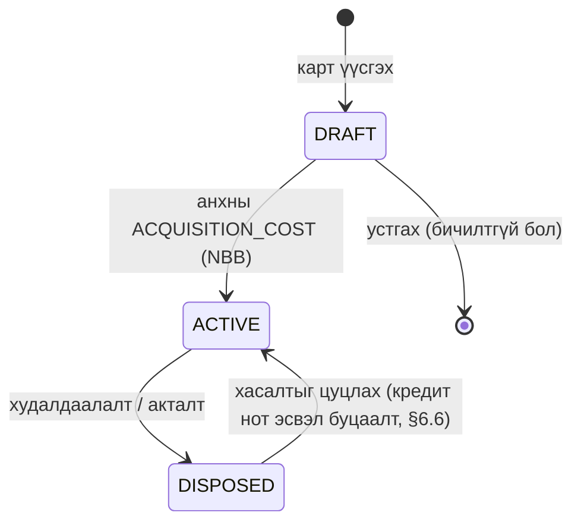
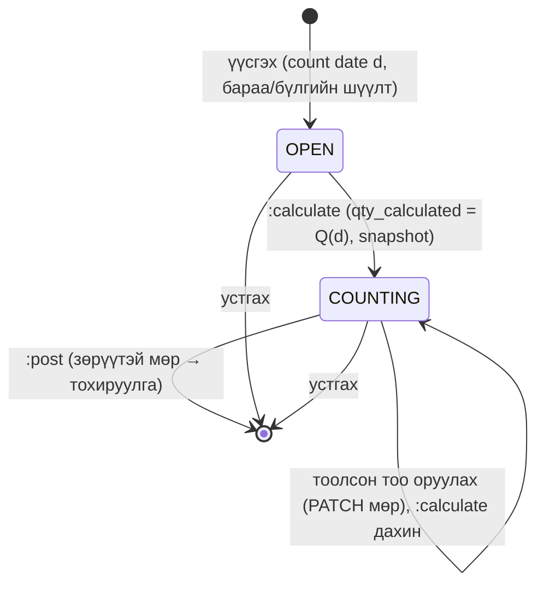

# 11. Үндсэн хөрөнгө ба бараа материал (Fixed Assets & Inventory) — R2

> **Төлөв:** Хөгжүүлэлтэд бэлэн төсөл, v0.10 (adversarial review хийгдсэн, §23). **Огноо:** 2026-10-07. **Хувилбар:** R2 (үнэ цэнийн бууралт R3, FIFO ба олон агуулах R3).
> **Нэг эх сурвалж:** [DECISIONS.md](./DECISIONS.md) (D-G4, D-G5, D-C1…D-C7, D-K1…D-K3). DB-ийн нэрийн эх сурвалж нь [db/schema/100_fa.sql](./db/schema/100_fa.sql), [db/schema/110_inv.sql](./db/schema/110_inv.sql) (D-K1). Энэ баримт SQL файлыг **өөрчлөхгүй**. Схемийн өөрчлөлтийг §20-д хүсэлтээр (SCR) гаргасан.
> **Эх:** [research/bc-fa-inventory.md](./research/bc-fa-inventory.md) (R-FA-INVENTORY-01…49, E1–E9), [research/mn-tax.md](./research/mn-tax.md) §2.4, §3.4, [research/legal-parameters.md](./research/legal-parameters.md) (i), [research/mn-accounting.md](./research/mn-accounting.md) §5.2, §6, §7, REQ-ACC-17/18/19; [01-requirements.md](./01-requirements.md) FR-FA-001…011, FR-INV-001…012; [02-architecture.md](./02-architecture.md) §4.2.8–4.2.9, §6; [03-domain-model.md](./03-domain-model.md); [14-api.md](./14-api.md) (API-ийн дүрэм).
> **Уншигч:** backend хөгжүүлэгч, QA, нягтлан ба татварын зөвлөх.

---

## Агуулга

0. [Хураангуй ба энэ spec-ийн шийдвэрүүд](#0-хураангуй-ба-энэ-spec-ийн-шийдвэрүүд)
1. [Хамрах хүрээ](#1-хамрах-хүрээ)
2. [Тэмдэглэгээ: тэмдэг, бөөрөнхийлөлт, огнооны функц](#2-тэмдэглэгээ-тэмдэг-бөөрөнхийлөлт-огнооны-функц)
3. [ҮХ: өгөгдөл](#3-үх-өгөгдөл)
4. [ҮХ: бизнесийн дүрэм](#4-үх-бизнесийн-дүрэм)
5. [ҮХ: огнооны конвенц ба элэгдлийн алгоритм](#5-үх-огнооны-конвенц-ба-элэгдлийн-алгоритм)
6. [ҮХ: posting урсгалууд](#6-үх-posting-урсгалууд)
7. [ҮХ: тооцоолсон жишээ](#7-үх-тооцоолсон-жишээ)
8. [ҮХ: тайлан ба тулгалт](#8-үх-тайлан-ба-тулгалт)
9. [Бараа: өгөгдөл](#9-бараа-өгөгдөл)
10. [Бараа: бизнесийн дүрэм](#10-бараа-бизнесийн-дүрэм)
11. [Бараа: хөдөлгөөнт жигнэсэн дунджийн алгоритм](#11-бараа-хөдөлгөөнт-жигнэсэн-дунджийн-алгоритм)
12. [Бараа: posting урсгалууд](#12-бараа-posting-урсгалууд)
13. [Хоцорсон огноотой posting ба өртгийн дахин тооцоо (бодлого)](#13-хоцорсон-огноотой-posting-ба-өртгийн-дахин-тооцоо-бодлого)
14. [Бараа: тооцоолсон жишээ](#14-бараа-тооцоолсон-жишээ)
15. [Бараа: тайлан ба тулгалт](#15-бараа-тайлан-ба-тулгалт)
16. [Posting engine-тэй холбогдох нь](#16-posting-engine-тэй-холбогдох-нь)
17. [API (санал) ба эрх](#17-api-санал-ба-эрх)
18. [Алдааны код](#18-алдааны-код)
19. [Хүлээн авах тест](#19-хүлээн-авах-тест)
20. [Схемийн өөрчлөлтийн хүсэлт](#20-схемийн-өөрчлөлтийн-хүсэлт)
21. [Нээлттэй асуулт](#21-нээлттэй-асуулт)
22. [Мөрдөх чадвар](#22-мөрдөх-чадвар)
23. [Хяналтын тэмдэглэл (Review log)](#23-хяналтын-тэмдэглэл-review-log)

---

## 0. Хураангуй ба энэ spec-ийн шийдвэрүүд

**Үндсэн хөрөнгө (ҮХ, fixed asset).** Карт (`fa.fixed_asset`) нь зөвхөн мастер өгөгдөл. Элэгдлийн параметр дэвтэр тус бүрийн мөрөнд (`fa.fa_depreciation_book`) байна. Хоёр дэвтэр бий: **НББ-ийн дэвтэр** `NBB` (`book_type = 'ACCOUNTING'`, G/L-тэй холбогдоно) ба **татварын memo дэвтэр** `TAX` (G/L-д хэзээ ч бичихгүй). Үнэ (өртөг, хуримтлагдсан элэгдэл, дансны үнэ, олз/гарз) нь `fa.fa_ledger_entry`-ийн SQL нийлбэр. Үлдэгдэл хадгалахгүй (BC FlowField). Элэгдэл нь **шулуун шугамын арга**, **сар бүр**, **ашиглалтад орсны дараах сарын 1-нээс**. Дүнг BC-ийн **үлдсэн дансны үнийг үлдсэн хугацаанд хуваах** томьёогоор 30/360 өдрийн тоололтой тооцно. Ингэснээр хугацаа өөрчлөх, нэмэлт өртөг, үнэ цэнийн бууралт гарахад тусгай код хэрэггүй, сүүлийн сар үлдэгдлийг яг тэглэнэ.

**Бараа материал (inventory).** Нэг байршил, **хөдөлгөөнт жигнэсэн дундаж** (moving weighted average), perpetual бүртгэл, сөрөг үлдэгдэл хориотой. Тоо хэмжээ `inv.item_ledger_entry`-д, үнэ `inv.value_entry`-д тусдаа (BC-ийн 3 хүснэгтийн загвар). Өртгийг **posting үед бодитоор** тооцно (BC-ийн түр өртөг + Adjust Cost-ыг хэрэглэхгүй). Гүйлгээний дундаж төлөв `inv.item_cost_state`-д хадгалагдана.

**Энэ spec-ийн гол шийдвэрүүд** (DECISIONS-д байхгүй нарийвчлал; ⚠ = зөвлөх баталгаажуулна):

| ID | Шийдвэр | Үндэслэл |
|---|---|---|
| S11-01 | Элэгдлийн томьёо = BC-ийн "үлдсэн үнэ / үлдсэн хугацаа", 30/360 өдөр, сар = 30 өдөр. Сар бүрийн дүн бөөрөнхийлөгдөнө, бөөрөнхийлөлтийн зөрүү дараагийн саруудад шингэнэ | R-FA-INVENTORY-20/22/26 |
| S11-02 | Эхлэх огноо = ашиглалтад орсон огнооны **дараагийн сарын 1** (1-нд орсон ч дараагийн сар). TAX дэвтэрт өөрчлөхгүй, NBB дэвтэрт бодлогоор өөрчилж болно (≥ ашиглалтад орсон огноо) | D-G4, `param:fa.tax_depreciation_start` ⚠ |
| S11-03 | Данснаас хасах сард элэгдэл тооцохгүй (өмнөх сарын эцэс хүртэл). Хасалтыг сарын сүүлийн өдөр, тухайн сарын run-ийн дараа хийвэл тэр сар орно | Сарын конвенцийн тэгш хэм ⚠ |
| S11-04 | Данснаас хасалт зөвхөн **Net** аргаар, зөвхөн бүтэн хөрөнгөөр. Худалдаалалт = борлуулалтын нэхэмжлэхийн `FIXED_ASSET` мөр (eBarimt гарна). Акталт = `:dispose` үйлдэл (журналын мөргүй, §6.5) | R-FA-INVENTORY-31, D-J1 |
| S11-05 | Элэгдлийн run нь DRAFT (тооцоолсон мөр) → `:preview` → `:post`. Post хийхдээ түгжээний дор дахин тооцож, DRAFT-аас зөрвөл `fa.run_stale` | R-FA-INVENTORY-28 |
| S11-06 | Барааны өртөг = огнооны дарааллаар хөдөлгөөнт дундаж. Зарлагын өртөг = posting огнооны байдлаарх (as-of) `V(d) × q / Q(d)`, сүүлийн нэгж үлдсэн үнийг бүтэн авна | FR-INV-004, bc-fa-inventory §7 (Inventory 3) |
| S11-07 | **Хоцорсон огноо:** барааны сүүлийн зарлагын огнооноос өмнө огноотой posting хориотой (FR-INV-006). Иймээс R2-т өртгийн дахин тооцоо (recost) хэрэггүй. Recost job нь R3-ийн сонголт (§13.5) | bc-fa-inventory §7 (Inventory 5a) |
| S11-08 | Худалдан авалтын буцаалт кредит нотын дүнгээр (бараа хүрэлцэх бол), борлуулалтын буцаалт эх нэхэмжлэхийн өртгөөр | Цуцлалт яг эх төлөвийг сэргээнэ (D-F6) |
| S11-09 | R2-т зөвхөн `INVENTORY` бараанд item/value entry үүснэ. `SERVICE`, `NON_INVENTORY`-ийн түүх нь posted баримтын мөр | Энгийн; BC F7-оос ялгаатай (§21 OQ-INV-01) |
| S11-10 | Өртгийн тооцоог Application давхаргад (A үе) хийж, B үед `item_cost_state.row_version`-оор optimistic шалгана; зөрвөл нэг удаа автоматаар дахин тооцно | 02 §6.3, ADR-0009. ⚠ 02 §4.2.8 («түгжээний дор»)-тэй зөрнө — OQ-ARCH-02 |

---

## 1. Хамрах хүрээ

### 1.1 Багтана

| Хэсэг | Агуулга | Хувилбар | FR |
|---|---|---|---|
| ҮХ-ийн карт, анги, posting group, дэвтэр | §3 | R2 | FR-FA-001, 002 |
| Олж авалт: худалдан авалтын нэхэмжлэх, ҮХ-ийн G/L журнал, эхний үлдэгдэл | §6.1, §6.2, §6.9 | R2 | FR-FA-003 |
| Сарын элэгдлийн run, буцаалт | §5, §6.3 | R2 | FR-FA-004, 005 |
| Акталт, худалдаалалт, олз/гарз | §6.4–6.6 | R2 | FR-FA-006, 007 |
| Татварын memo дэвтэр, НББ–татварын зөрүү | §6.8, §8.2 | R2 | FR-FA-008 |
| ҮХ-ийн бүртгэл, ҮХ-1/ҮХ-2/ҮХ-3 | §8 | R2 | FR-FA-009 |
| Хугацаа/үлдэх өртөг өөрчлөх | §5.6 | R2 | FR-FA-010 |
| Үнэ цэнийн бууралт (write-down) | §6.7 | **R3** (FR-FA-011 нь R2·Could, §21 OQ-FA-01) | FR-FA-011 |
| Барааны төрөл, perpetual бүртгэл | §9, §10 | R2 | FR-INV-001, 003 |
| Хөдөлгөөнт дундаж, COGS | §11, §12.3 | R2 | FR-INV-004 |
| Сөрөг үлдэгдэл хориглох, хоцорсон огноо | §10, §13 | R2 | FR-INV-005, 006 |
| Худалдан авалт, буцаалт, борлуулалт, буцаалт | §12.1–12.4 | R2 | FR-INV-003, 004 |
| Барааны журнал (тохируулга, эхний үлдэгдэл), тооллого | §12.5–12.7 | R2 | FR-INV-007 |
| БМ маягт, барааны үлдэгдлийн тайлан | §15 | R2 | FR-INV-008, 009 |
| Цэвэр боломжит үнэ цэнийн бууралт (хасагдуулгын арга) | §12.8 | R2·Could | FR-INV-010 |

### 1.2 Багтахгүй

- ҮХ: давхар буурах арга, нэгжийн аргаар элэгдэл, дахин үнэлгээ (`APPRECIATION`), даатгал, засварын дэвтэр, бүрэлдэхүүн хөрөнгө, хуваарилалт (allocation), ангилал хооронд шилжүүлэх (reclassification), хэсэгчилсэн хасалт, Gross арга. ҮХ-ийн орцын НӨАТ-ыг 60/120 сараар хуваах (CMP-020, хүрээнээс гадуур).
- Бараа: FIFO, олон агуулах, шилжүүлэг (FR-INV-011/012, R3); item charge (тээвэр, гаалийн зардлыг өртөгт нэмэх); үйлдвэрлэл, угсралт; хүлээгдэж буй өртөг (expected cost) — баримт = нэхэмжлэх тул байхгүй; цуврал/багцын дугаар.

---

## 2. Тэмдэглэгээ: тэмдэг, бөөрөнхийлөлт, огнооны функц

### 2.1 Тэмдэг

| Бичилт | Эерэг (+) | Сөрөг (−) |
|---|---|---|
| `gl.gl_entry.amount` | Дебит | Кредит (D-C3) |
| `fa.fa_ledger_entry.amount` | Олж авалт, гарз, хасалтын үеийн элэгдлийн буцаалт | Элэгдэл, үнэ цэнийн бууралт, борлуулсан үнэ (proceeds), олз, хасалтын үеийн өртгийн буцаалт |
| `inv.item_ledger_entry.quantity` | Орлого (inbound) | Зарлага (outbound) |
| `inv.value_entry.cost_amount_actual` | Орлогын өртөг | Зарлагын өртөг |
| `inv.value_entry.sales_amount_actual` | Борлуулалт | Борлуулалтын буцаалт |
| `inv.value_entry.purchase_amount_actual` | Худалдан авалт | Худалдан авалтын буцаалт |

### 2.2 Бөөрөнхийлөлт

- `RoundAmt(x)` = `MoneyMath.Round(x, dec)` (дундаж цэгийг тэгээс холдуулна, ADR-0006). `dec` = `platform.company_setup.amount_rounding_precision`-ийн оронгийн тоо: 0.01 → 2, 1 → 0 (CHECK `IN (0.01, 1)`; анхдагч MNT 0.01, D-C2). ADR-0006-ийн `MoneyMath.Round(value, decimals)` нь **оронгийн тоо** авдаг тул нарийвчлалыг (0.01) шууд дамжуулахгүй.
- `RoundUnit(x)` = 6 орон (`platform.unit_amount`, D-C1). Зөвхөн мэдээллийн нэгжийн өртөгт (`cost_per_unit`, `average_unit_cost`). **Дүнг нэгжийн өртгөөс бодохгүй**, нийт үнээс хувь хэмжээгээр боддог (R-FA-INVENTORY pitfall 13).
- `RoundQty(x)` = 5 орон (`platform.quantity`).
- Завсрын тооцоонд `decimal`-ийг бөөрөнхийлөхгүй. Зөвхөн хадгалах дүнг бөөрөнхийлнэ.

### 2.3 Огнооны функц (30/360, BC `DepreciationCalculation`)

```
LastDay(y, m)        = сарын сүүлийн өдөр (2-р сард 28/29)
IsMonthEnd(d)        = day(d) = LastDay(year(d), month(d))
MonthEnd(d)          = make_date(year(d), month(d), LastDay(...))
FirstOfNextMonth(d)  = MonthEnd(d) + 1 өдөр

DeprDays(S, E):                       -- хоёр төгсгөлийг оруулна
    if E < S: return 0
    sd = (day(S) = 31) ? 30 : day(S)
    ed = IsMonthEnd(E) ? 30 : day(E)  -- сарын сүүлийн өдөр (2-р сарын 28/29 ч) = 30
    return 1 + ed − sd + 30·(month(E) − month(S)) + 360·(year(E) − year(S))

ToMorrow(d):  n = d + 1; if day(n) = 31: n = n + 1; return n
Yesterday(d): if day(d) = 31: d = d − 1;  return d − 1

AddDays360(S, n):                      -- 30/360 календараар n өдөр нэмэх
    t  = (min(day(S), 30) − 1) + n
    mm = (month(S) − 1) + t div 30
    y  = year(S) + mm div 12;  m = mm mod 12 + 1;  dd = t mod 30 + 1
    return make_date(y, m, min(dd, LastDay(y, m)))
```

| Шалгах тохиолдол | Үр дүн |
|---|---|
| `DeprDays(2027-09-01, 2027-09-30)` | 30 |
| `DeprDays(2027-02-01, 2027-02-28)` | 30 |
| `DeprDays(2028-02-01, 2028-02-29)` (өндөр жил) | 30 |
| `DeprDays(2027-01-01, 2027-01-31)` | 30 |
| `DeprDays(2026-01-15, 2026-01-31)` | 16 |
| `DeprDays(2027-09-01, 2027-12-31)` | 120 |
| `DeprDays(2027-03-31, 2027-04-30)` | 31 (31-ний эхлэл = 30-ны өдөр) |
| `DeprDays(2024-04-01, 2025-12-31)` | 630 |
| `ToMorrow(2027-01-30)`, `ToMorrow(2027-02-28)` | 2027-02-01, 2027-03-01 |
| `Yesterday(2027-02-01)`, `Yesterday(2027-03-31)` | 2027-01-31, 2027-03-29 |
| `Yesterday(AddDays360(2027-09-01, 720))` | 2029-08-31 |
| `Yesterday(AddDays360(2026-01-15, 1800))` | 2031-01-14 |

---

## 3. ҮХ: өгөгдөл

### 3.1 Анги (`fa.fa_class`, BC T5607)

Анги нь татварын хуулийн хугацааг `tax.tax_parameter`-ийн кодоор заана (D-E7). MN seed ([db/seed/mn_30_posting.sql](./db/seed/mn_30_posting.sql) `fa.fn_mn_seed_fixed_assets`):

| `code` | Нэр | `tax_life_param_code` | Хуулийн хугацаа (2020-01-01-нээс) |
|---|---|---|---|
| `BUILDINGS` | Барилга, байгууламж | `fa.tax_life.buildings_years` | 25 жил (300 сар) |
| `MACHINERY` | Машин, тоног төхөөрөмж | `fa.tax_life.machinery_years` | 10 жил (120 сар) |
| `VEHICLES` | Тээврийн хэрэгсэл | `fa.tax_life.machinery_years` | 10 жил |
| `COMPUTERS` | Компьютер, программ хангамж | `fa.tax_life.computers_software_years` | 2 жил (24 сар) |
| `FURNITURE` | Тавилга, эд хогшил | `fa.tax_life.other_years` | 10 жил |
| `INTANGIBLE` | Биет бус хөрөнгө | `fa.tax_life.intangible_definite` | Хүчинтэй хугацаа (`rule`, хэрэглэгч оруулна) |
| `OTHER` | Бусад үндсэн хөрөнгө | `fa.tax_life.other_years` | 10 жил |

Уул уурхайн тусгай зөвшөөрөл эзэмшигчийн барилга (40 жил) ба УБ-ын төвөөс гадуурх шинэ барилга (сонголтоор 15 жил) нь ангийн анхдагч биш. Хэрэглэгч TAX дэвтрийн сарыг гараар өөрчилнө (FA-R-05).

### 3.2 Posting group (`fa.fa_posting_group`, BC T5606)

| Багана | Үүрэг | Seed (`COMPUTERS`) | BC талбар |
|---|---|---|---|
| `acquisition_cost_account_id` | Өртөг. Мөн хасалтын үеийн өртгийн буцаалт | 1630 | Acquisition Cost Account (+ Acq. Cost Acc. on Disposal) |
| `accum_depreciation_account_id` | Хуримтлагдсан элэгдэл. Мөн хасалтын үеийн элэгдлийн буцаалт | 1690 | Accum. Depreciation Account (+ on Disposal) |
| `depreciation_expense_account_id` | Элэгдлийн зардал (run-ийн тэнцүүлэх мөр) | 7260 | Depreciation Expense Acc. |
| `gains_on_disposal_account_id` | Хасалтын олз | 8600 | Gains Acc. on Disposal |
| `losses_on_disposal_account_id` | Хасалтын гарз | 8600 | Losses Acc. on Disposal |
| `write_down_expense_account_id` | Үнэ цэнийн бууралтын зардал (R3) | 8450 | Write-Down Expense Acc. |
| `write_down_account_id` | Хуримтлагдсан бууралт (R3) | 1690 | Write-Down Account |

Seed-ийн бусад group: `BUILDINGS` 1600, `MACHINERY` 1610, `VEHICLES` 1620, `FURNITURE` 1640, `OTHER` 1660 (бүгд 1690/7260/8600); `SOFTWARE` 1700, `INTANGIBLE` 1730 (1790/7261/8610).

**(Ангилал, төрөл) → G/L данс** (R-FA-INVENTORY-14, Net арга, NBB дэвтэр):

| # | `fa_posting_category` | `fa_posting_type` | Тэмдэг | `part_of_book_value` | `part_of_depreciable_basis` | G/L данс | G/L-ийн эсрэг тал |
|---|---|---|---|---|---|---|---|
| T1 | `NONE` | `ACQUISITION_COST` | + (залруулга −) | true | true | `acquisition_cost_account` | Баримтын бусад мөр (AP, журналын тэнцүүлэх данс) |
| T2 | `NONE` | `DEPRECIATION` | − | true | false | `accum_depreciation_account` | Run: `depreciation_expense_account` |
| T3 | `NONE` | `WRITE_DOWN` (R3) | − | true | false | `write_down_account` | `write_down_expense_account` |
| T4 | `NONE` | `PROCEEDS_ON_DISPOSAL` | − (акталтад 0) | false | false | **G/L-гүй** (Net) | — |
| T5 | `DISPOSAL` | `ACQUISITION_COST` | −Σ T1 | false | false | `acquisition_cost_account` | Автомат |
| T6 | `DISPOSAL` | `DEPRECIATION` | −Σ T2 (+) | false | false | `accum_depreciation_account` | Автомат |
| T7 | `DISPOSAL` | `WRITE_DOWN` | −Σ T3 (+) | false | false | `write_down_account` | Автомат |
| T8 | `NONE` | `GAIN_LOSS` | BV − P | false | false | ≤ 0: `gains_on_disposal_account`; > 0: `losses_on_disposal_account` | Автомат |

R2-т ашиглахгүй: `APPRECIATION`, `SALVAGE_VALUE`, `BOOK_VALUE_ON_DISPOSAL`, `BAL_DISPOSAL` (Gross арга ба дахин үнэлгээ). Энэ төрлийн мөр оруулбал `fa.posting_type_not_supported`.

### 3.3 Дэвтэр (`fa.depreciation_book`, BC T5611)

| `code` | `book_type` | `gl_integration_*` | `disposal_calculation_method` | `use_rounding_in_periodic_depr` | Тайлбар |
|---|---|---|---|---|---|
| `NBB` | `ACCOUNTING` | бүгд `true` | `NET` | `false` (0.01) | Компанид яг нэг (DB: `ux_depreciation_book__one_accounting`) |
| `TAX` | `TAX` | бүгд `false` (DB CHECK) | `NET` | `false` | Сонголттой. G/L-д бичихгүй |

- `fiscal_year_365_days` нь R2-т заавал `false` (365 өдрийн горим дэмжихгүй, R-FA-INVENTORY-23). `true` болговол `fa.book_setting_not_supported`.
- `use_rounding_in_periodic_depr = true` бол сар бүрийн элэгдлийг бүхэл төгрөгөөр бөөрөнхийлнэ (§5.5).

### 3.4 Карт (`fa.fixed_asset`, BC T5600)

| Багана | Заавал | Анхдагч | Дүрэм |
|---|---|---|---|
| `no` | ✔ | `FA` цувралаас (`FA00001`), гараар зөвшөөрнө | Компанид давхардахгүй (DB) |
| `description` | ✔ | — | ≤ 100 тэмдэгт (UI) |
| `fa_class_id` | — | — | TAX мөрийн хугацааны анхдагч |
| `fa_posting_group_id` | ✔ | Ангийн ижил кодтой group | FA-R-07 (бичилттэй бол түгжинэ) |
| `serial_no`, `location_text`, `responsible_employee` | — | — | ҮХ-1 актад хэвлэнэ |
| `vendor_id` | — | Анхны худалдан авалтын нийлүүлэгч | Мэдээллийн |
| `status` | ✔ | `DRAFT` | Зөвхөн posting өөрчилнө (§3.9) |
| `blocked`, `inactive` | ✔ | `false` | FA-R-09 |

### 3.5 Дэвтрийн параметр (`fa.fa_depreciation_book`, BC T5612)

Хөрөнгө үүсэхэд систем `NBB` мөрийг, компанид `TAX` дэвтэр байвал `TAX` мөрийг автоматаар үүсгэнэ.

| Багана | NBB | TAX | Дүрэм |
|---|---|---|---|
| `depreciation_method` | `STRAIGHT_LINE` | `STRAIGHT_LINE` | `MANUAL` = run алгасна |
| `in_service_date` | Хэрэглэгч | NBB-ээс хуулна | Хоосон бол элэгдэл тооцохгүй (`NOT_IN_SERVICE`) |
| `depreciation_starting_date` | `FirstOfNextMonth(in_service_date)`, бодлогоор өөрчилж болно, ≥ `in_service_date` | `FirstOfNextMonth(in_service_date)`, өөрчлөхгүй | FA-R-03 |
| `no_of_depreciation_months` | Хэрэглэгч (бодлогын хугацаа) | `tax_parameter(анги) × 12` | FA-R-04, FA-R-05 |
| `depreciation_ending_date` | `Yesterday(AddDays360(start, months × 30))` | ижил | Тооцоолсон, хадгална (мэдээлэл) |
| `residual_value` | Хэрэглэгч, ≥ 0 | 0 | FA-R-06 |
| `fa_posting_group_id` | Картаас | Картаас | FA-R-07 |
| `acquisition_date`, `last_depreciation_date`, `disposal_date` | Posting | Posting | FA-R-21 |

### 3.6 ҮХ-ийн дэвтрийн бичилт (`fa.fa_ledger_entry`, BC T5601)

Append-only (D-C4). Зөвшөөрөгдсөн UPDATE нь зөвхөн `reversed`, `reversed_by_entry_no` (`platform.fn_ledger_update`). Мөр бүрийн бөглөх дүрэм:

| Багана | Утга |
|---|---|
| `entry_no` | `platform.fn_next_entry_no('FA_LEDGER_ENTRY', n)` (05 §3.3 `LedgerCodes.FaLedgerEntry`) |
| `fa_posting_date` | = `posting_date` (FA-R-12; эхний үлдэгдлийн үл хамаарах зүйлтэй) |
| `document_type`, `document_no` | Эх ваучерын (`INVOICE`, `CREDIT_MEMO`, `NONE`) |
| `fa_posting_category`, `fa_posting_type`, `part_of_*` | §3.2-ын хүснэгтээр |
| `no_of_depreciation_days` | `DEPRECIATION`-д `N` (§5.3), бусдад 0 |
| `disposal_entry_no` | T5–T8 мөрөнд T4 (proceeds) мөрийн `entry_no` |
| `result_on_disposal` | T8: `GAIN` (≤ 0) / `LOSS` (> 0); бусад `NONE` |
| `depreciation_method`, `depreciation_starting_date`, `no_of_depreciation_months` | Posting үеийн параметрийн snapshot |
| `depreciation_run_id` | Run-аас үүссэн бол |
| `gl_entry_no` | NBB: тухайн мөрийн ҮХ-ийн дансны G/L entry. TAX: NULL |
| `transaction_no`, `gl_register_no` | NBB: ваучерынх. TAX-ийн давхардсан мөр: ваучерынх; TAX run: NULL |
| `dimension_set_id` | Хөрөнгийн default dimension + эх баримтын мөрийн dimension |
| `source_code` | `PURCHASES`, `SALES`, `FAGLJNL`, `DEPRECIATION`, `OPENING`, `REVERSAL` |

### 3.7 Элэгдлийн run (`fa.depreciation_run`)

| Багана | Дүрэм |
|---|---|
| `run_no` | `platform.fn_next_entry_no('FA_DEPRECIATION_RUN')` (техникийн дугаар) |
| `depreciation_book_id` | Нэг run = нэг дэвтэр. Хоёр дэвтрийг нэг үйлдлээр (`books: ["NBB","TAX"]`) хоёр run болгож үүсгэнэ |
| `period_ending_date` | Сарын сүүлийн өдөр (`fa.run_period_not_month_end`) |
| `posting_date` | = `period_ending_date` (FA-R-19) |
| `status` | `DRAFT` → `POSTED` → `REVERSED` (§5.4) |
| `transaction_no` | NBB: posting ваучер. TAX: NULL (SCR-FA-01) |

Нэг дэвтэр × үед нэг амьд run (DB: `ux_depreciation_run__period`, `REVERSED`-ээс бусад). DRAFT-ын тооцоолсон мөрийг `fa.depreciation_run_line`-д хадгална (SCR-FA-02).

### 3.8 Тооцоолсон утга (BC FlowField-ийн оронд)

```sql
-- Хөрөнгө × дэвтэр, :d огнооны байдлаар
SELECT
  coalesce(sum(amount) FILTER (WHERE fa_posting_category = 'NONE' AND fa_posting_type = 'ACQUISITION_COST'), 0) AS acquisition_cost,
  coalesce(sum(amount) FILTER (WHERE fa_posting_category = 'NONE' AND fa_posting_type = 'DEPRECIATION'), 0)      AS depreciation,
  coalesce(sum(amount) FILTER (WHERE fa_posting_category = 'NONE' AND fa_posting_type = 'WRITE_DOWN'), 0)        AS write_down,
  coalesce(sum(amount) FILTER (WHERE part_of_book_value), 0)                                                    AS book_value_raw,
  coalesce(sum(amount) FILTER (WHERE fa_posting_type = 'PROCEEDS_ON_DISPOSAL'), 0)                              AS proceeds,
  coalesce(sum(amount) FILTER (WHERE fa_posting_type = 'GAIN_LOSS'), 0)                                         AS gain_loss,
  -- G/L-тэй тулгах "дансан дээрх" дүн (хасалтын мөрийг оруулна)
  coalesce(sum(amount) FILTER (WHERE fa_posting_type = 'ACQUISITION_COST'), 0)                                  AS cost_on_books,
  coalesce(sum(amount) FILTER (WHERE fa_posting_type IN ('DEPRECIATION','WRITE_DOWN')), 0)                      AS accum_on_books
FROM fa.fa_ledger_entry
WHERE company_id = :company AND fixed_asset_id = :asset AND depreciation_book_id = :book AND fa_posting_date <= :d;
-- book_value = (disposal_date IS NOT NULL AND disposal_date <= :d) ? 0 : book_value_raw   (R-FA-INVENTORY-17)
```

Буцаагдсан мөр ба түүний буцаалт нийлбэрт хоорондоо тэглэгдэнэ. Иймээс шүүх шаардлагагүй. Харин "сүүлийн элэгдлийн огноо", "элэгдэл эхэлсэн эсэх" зэрэг **огнооны** тооцоонд `reversed = true` мөрийг (эх ба буцаалт хоёуланг) хасна.

### 3.9 Хөрөнгийн төлөв



`status`, `fa_depreciation_book.acquisition_date/last_depreciation_date/disposal_date`-ийг зөвхөн posting transaction өөрчилнө. API-аар `PATCH` хийвэл `api.read_only_field`.

---

## 4. ҮХ: бизнесийн дүрэм

| ID | Дүрэм | Алдаа | Эх |
|---|---|---|---|
| FA-R-01 | Карт хадгалахад `no`, `description`, `fa_posting_group_id` заавал. Group-ийн бүх заавал данс `POSTING` төрөлтэй, блоклогдоогүй байна | `fa.posting_group_account_invalid` | FR-FA-001/002 |
| FA-R-02 | Хөрөнгө бүр яг нэг NBB мөртэй. Компанид TAX дэвтэр байвал TAX мөр автоматаар үүснэ. TAX мөрийг устгахгүй | `fa.book_row_required` | D-G4 |
| FA-R-03 | `depreciation_starting_date`-ийн анхдагч = `FirstOfNextMonth(in_service_date)`. In-service нь сарын 1 байсан ч дараагийн сар. NBB: өөрчилж болно, гэхдээ ≥ `in_service_date`. TAX: яг энэ утга | `fa.start_before_in_service`, `fa.tax_start_rule` | D-G4, R-FA-INVENTORY-24a |
| FA-R-04 | `STRAIGHT_LINE` бөгөөд эхлэх огноотой бол `no_of_depreciation_months > 0` заавал. `depreciation_ending_date` = `Yesterday(AddDays360(start, months × 30))` | `fa.depreciation_params_incomplete` | R-FA-INVENTORY-04 |
| FA-R-05 | TAX мөрийн сар = `tax_parameter(class.tax_life_param_code, in_service_date)` × 12. Параметр `rule` төрлийн (`intangible_definite`) эсвэл ангигүй бол хэрэглэгч заавал оруулна. `unverified` параметр анхааруулга өгнө (posting-д нөлөөлөхгүй memo) | `fa.tax_life_not_defined` | CMP-032, legal-parameters "Lookup rule" |
| FA-R-06 | `residual_value ≥ 0` (DB). `residual_value > дансны үнэ` бол элэгдэл 0 (алдаа биш) | — | R-FA-INVENTORY-26 |
| FA-R-07 | Хөрөнгөнд **ямар нэг** `fa_ledger_entry` байвал `fixed_asset.fa_posting_group_id` ба `fa_depreciation_book.fa_posting_group_id`-ийг өөрчлөхгүй. Карт ба NBB мөрийн group ижил байна | `fa.posting_group_locked` | R-FA-INVENTORY-01 (засварласан) |
| FA-R-08 | Анхны элэгдлийн дараа `in_service_date`, `depreciation_starting_date` өөрчлөхгүй. `no_of_depreciation_months`, `residual_value`, `depreciation_method` өөрчилж болно: зөвхөн цаашдын сард нөлөөлнө (§5.6) | `fa.parameter_change_not_allowed` | R-FA-INVENTORY-03, FR-FA-010 |
| FA-R-09 | `blocked` эсвэл `inactive` хөрөнгөнд posting хийхгүй. Run алгасаад шалтгааныг (`BLOCKED`/`INACTIVE`) харуулна | `fa.asset_blocked` | R-FA-INVENTORY-02 |
| FA-R-10 | Дэвтэр бүрийн анхны бичилт `NONE/ACQUISITION_COST` байна | `fa.first_entry_must_be_acquisition` | R-FA-INVENTORY-07 |
| FA-R-11 | Posting огноо ба **түүнээс хойших бүх огноонд**: Σ T1 ≥ 0; Σ T2 ≤ 0; Σ T3 ≤ 0; Σ T4 ≤ 0; дансны үнэ ≥ 0 | `fa.sign_invariant_violated` | R-FA-INVENTORY-08 |
| FA-R-12 | `fa_posting_date = posting_date`. Үл хамаарах зүйл: `OPENING` загварын журналын `ACQUISITION_COST`, `DEPRECIATION` мөрөнд `fa_posting_date ≤ posting_date` (§6.2) | `fa.fa_posting_date_mismatch` | R-FA-INVENTORY-10 |
| FA-R-13 | `disposal_date`-тэй хөрөнгөнд хасалтыг цуцлахаас бусад posting хийхгүй. Хасалтын огнооноос хойш огноотой (буцаагдаагүй) бичилт байвал хасалт хийхгүй | `fa.asset_disposed`, `fa.disposal_not_last` | R-FA-INVENTORY-09 |
| FA-R-14 | Хасалтын өмнө дэвтэр тус бүрд элэгдэл **хасалтын сарын өмнөх сарын эцэс хүртэл** батлагдсан байна. Тодорхойлолт: `R = MonthEnd(D) − 1 сар` (сарын эцэс); `CalcDepreciation(asset, fdb, book, R)` (ALG-FA-01) нь `skipReason IS NULL` (тэгээс ялгаатай дүн) гаргавал алдаа. Ингэснээр элэгдэл эхлээгүй, бүрэн элэгдсэн, `MANUAL` хөрөнгө саадгүй | `fa.depreciation_not_up_to_date` (`details.book`, `details.requiredThrough = R`) | S11-03, R-FA-INVENTORY-33 |
| FA-R-15 | Зөвхөн бүтэн хөрөнгө хасна. Борлуулалтын `FIXED_ASSET` мөрийн `quantity = 1` | `fa.partial_disposal_not_supported` | §1.2 |
| FA-R-16 | Хасалт зөвхөн хоёр замаар: акталт = `POST /fixed-assets/{id}:dispose` (§6.5), худалдаалалт = борлуулалтын нэхэмжлэх (eBarimt). ҮХ-ийн журналд `fa_posting_type = 'DISPOSAL'` мөр хориотой: `amount ≠ 0` → `fa.disposal_sale_requires_invoice`, `amount = 0` → `fa.disposal_via_action_only`. (Шалтгаан: 0 дүнтэй, тэнцүүлэх дансгүй журналын мөр 05-ийн BR-PST-12/13-ыг зөрчинө) | `fa.disposal_sale_requires_invoice`, `fa.disposal_via_action_only` | S11-04 |
| FA-R-17 | Gen./VAT posting group зөвхөн `ACQUISITION_COST` ба `DISPOSAL` мөрөнд. `DEPRECIATION`, `WRITE_DOWN` мөрөнд хоосон | `fa.vat_not_allowed_for_posting_type` | R-FA-INVENTORY-12 |
| FA-R-18 | TAX дэвтэрт баримт (худалдан авалт, борлуулалт) эсвэл G/L журналаас шууд бичихгүй. TAX бичилт нь зөвхөн давхардуулалт (FA-R-27), TAX run, эхний үлдэгдлийн импорт | `fa.book_not_gl_integrated` | R-FA-INVENTORY-11 |
| FA-R-19 | Run: дэвтэр × сард нэг амьд run; `period_ending_date` нь сарын эцэс; `posting_date = period_ending_date`; үе OPEN (`ERP01`) | `fa.run_exists_for_period`, `fa.run_period_not_month_end`, `gl.period_closed` | INV-24 |
| FA-R-20 | Run-ийг буцаах: тухайн дэвтэрт илүү хожуу POSTED run байхгүй; run-д орсон хөрөнгөнд run-аас хойш (`entry_no` их) буцаагдаагүй бичилт байхгүй; үе нээлттэй | `fa.run_later_exists`, `fa.reversal_not_latest` | FR-FA-005 |
| FA-R-21 | Posting бүр дэвтрийн мөрийг шинэчилнэ: `acquisition_date` = буцаагдаагүй анхны T1-ийн `fa_posting_date`; `last_depreciation_date` = буцаагдаагүй T2-ийн max `fa_posting_date`; `disposal_date` = буцаагдаагүй T4-ийн огноо. Буцаалтын дараа дахин тооцно | — | R-FA-INVENTORY-18 |
| FA-R-22 | R2 идэвхжсэний дараа group-ийн өртөг ба хуримтлагдсан элэгдлийн данс `direct_posting = false` (гар журналаас бичихгүй, дэд дэвтэр = G/L) | `gl.direct_posting_not_allowed` | pitfall 19, SCR-FA-06 |
| FA-R-23 | `DRAFT` бөгөөд бичилтгүй хөрөнгийг л устгана | `api.resource_in_use` | — |
| FA-R-24 | Dimension: хөрөнгийн default dimension (`gl.default_dimension`, `entity_type = 'FIXED_ASSET'`) ба эх мөрийн dimension нийлж `dimension_set_id` болно. ҮХ-ийн дансны мөр, элэгдлийн зардлын мөр ижил set-тэй | `gl.dimension_value_*` | ADR-0010 |
| FA-R-25 | Борлуулалтын `FIXED_ASSET` мөрийн Gen./VAT Prod. group-ийн анхдагч = group-ийн `acquisition_cost_account`-ийн default group (seed: 1630 → `FA`, `VAT10`). eBarimt идэвхтэй компанид `sales_line.classification_code` (БҮНА, яг 7 орон) заавал; анхдагч нь `fa_class.ebarimt_classification_code` (SCR-FA-07) → `ebarimt_setup.default_classification_code` (12 SCR-04). eBarimt-ийн мөр ([12](./12-ebarimt-integration.md) §5.4): `barCode` = `classificationCode`, `barCodeType = 'UNDEFINED'` (MAP-05), `measureUnit = "ш"` (`PCS`), `qty = 1` (FA-R-15), `taxType` нь VAT setup-аас (НӨАТ төлөгчид `VAT_ABLE`) | `ebarimt.classification_code_missing` / `_invalid` (12 VAL-08) | BC SalesLine, CMP-026 |
| FA-R-26 | Худалдан авалтын `FIXED_ASSET` мөрийн `depreciation_book_id` нь NULL (= NBB) эсвэл NBB. NBB мөрт `no_of_depreciation_months` заавал (in-service огноо хоосон байж болно: суурилуулж буй хөрөнгө) | `fa.book_not_gl_integrated`, `fa.depreciation_params_incomplete` | R-FA-INVENTORY-06 |
| FA-R-27 | **TAX давхардуулалт:** NBB-д `ACQUISITION_COST` (T1) эсвэл хасалт (T4–T8) бичигдэхэд хөрөнгө TAX мөртэй бол TAX дэвтэрт ижил ваучер дотор G/L-гүй бичнэ. T1 = ижил дүн; хасалтыг TAX-ийн өөрийн үнээр тооцно. `WRITE_DOWN` давхардахгүй (татварт хасагдахгүй) | — | BC duplication list |
| FA-R-28 | Нэг баримтад нэг хөрөнгө олон мөрөөр орж болно (нэмэлт өртөг). Нэг ваучерт нэг хөрөнгийг нэгэн зэрэг олж авах ба хасахыг хориглоно | `fa.conflicting_lines` | — |
| FA-R-29 | **Буцаалт.** 05 §3.7-д `FAGLJNL`, `DEPRECIATION` нь нийтийн `gl-transactions/{no}:reverse`-д ✕. Иймээс ҮХ-ийн гүйлгээг зөвхөн FA модулийн endpoint (`:cancel-disposal`, `fa-transactions/{no}:reverse`, `depreciation-runs/{id}:reverse`, §17) буцаана; тэд `IReversalService`-ийг `allowedSourceCodes = {FAGLJNL, DEPRECIATION}`-тэй дуудна. FixedAssets writer нь `IReversibleLedger`-ийг хэрэгжүүлнэ: `ValidateReversalAsync` нь гүйлгээний хөрөнгө бүрд түүнээс хойш (`entry_no` их) буцаагдаагүй FA бичилт байхгүй, үе нээлттэй эсэхийг шалгана. `OPENING` гүйлгээ (нийтийн ✔) ҮХ-ийн мөртэй бол мөн энэ шалгалт ажиллана | `fa.reversal_not_latest`, `gl.reversal_not_reversible` | 05 §3.7, §5.8, BR-PST-45 |

---

## 5. ҮХ: огнооны конвенц ба элэгдлийн алгоритм

### 5.1 Конвенц

1. Сар = 30 өдөр, жил = 360 өдөр (`DeprDays`, §2.3). Хугацаа = `no_of_depreciation_months × 30` өдөр.
2. Анхдагч эхлэх огноо сарын 1, run сарын эцэст тул **үе бүр яг 30 өдөр**, сар бүрийн дүн тэнцүү (бөөрөнхийлөлтөөс бусад).
3. Хэрэглэгч NBB-ийн эхлэх огноог сарын дунд болгосон бол эхний ба сүүлийн сар хэсэгчилсэн (§7.4).
4. Run-ийн `P` (until date) = `period_ending_date`. Run хоцорсон бол (жишээ нь 9-р сарын run хийгдээгүй, 10-р сарынхыг хийсэн) нэг бичилт 60 өдрийг хамарна. Энэ нь зөв (catch-up). Систем анхааруулга өгнө (`fa.previous_run_missing`, warning).

### 5.2 ALG-FA-01. Нэг хөрөнгийн элэгдэл (дэвтэр × until date)

```
function CalcDepreciation(asset, fdb, book, P) -> (amount, N, first, remLife, skipReason)
    if fdb.depreciation_method = 'MANUAL'            -> skip MANUAL_METHOD
    if asset.blocked                                  -> skip BLOCKED
    if asset.inactive                                 -> skip INACTIVE
    if fdb.disposal_date is not null                  -> skip DISPOSED
    if fdb.acquisition_date is null                   -> skip NOT_ACQUIRED
    if fdb.acquisition_date > P                       -> skip ACQUIRED_AFTER_PERIOD
    if fdb.depreciation_starting_date is null         -> skip NOT_IN_SERVICE
    S        = fdb.depreciation_starting_date
    lifeDays = fdb.no_of_depreciation_months * 30
    L        = max(fa_posting_date) of T2 entries (not reversed) of (asset, book)      -- NULL if none
    first    = (L is null) ? S : max(S, ToMorrow(L))
    if first > P                                      -> skip (L is null ? NOT_STARTED : ALREADY_DEPRECIATED)
    N        = DeprDays(first, P)
    BV       = Σ amount WHERE part_of_book_value AND fa_posting_date <= P              -- §3.8
    maxDepr  = BV − fdb.residual_value
    if maxDepr <= 0                                   -> skip FULLY_DEPRECIATED
    used     = DeprDays(S, Yesterday(first))          -- first = S бол 0
    remLife  = lifeDays − used
    if remLife < 1 or N >= remLife:  raw = −maxDepr                       -- хугацаа дууссан/сүүлийн үе: үлдэгдлийг бүтэн
    else:                            raw = −maxDepr × N / remLife          -- decimal, завсар бөөрөнхийлөхгүй
    dec      = book.use_rounding_in_periodic_depr ? 0 : Decimals(company.amount_rounding_precision)   -- 0.01 → 2, 1 → 0
    D        = MoneyMath.Round(raw, dec)              -- AwayFromZero (ADR-0006: 2-р аргумент = оронгийн тоо)
    if D + maxDepr < 0:  D = −maxDepr                 -- дансны үнэ үлдэх өртгөөс доош орохгүй
    if D >= 0:           -> skip ZERO_AMOUNT
    return (D, N, first, remLife, null)
```

Тайлбар:
- `L`-ийг тооцохдоо буцаагдсан мөрийг хасна (§3.8). Эхний үлдэгдлийн `DEPRECIATION` мөр (§6.2) `L`-д орно.
- `BV`-д `P` хүртэлх бүх олж авалт орно. Сарын дундуур нэмсэн өртөг (сайжруулалт) тухайн сараас эхлэн үлдсэн хугацаанд хуваарилагдана (§21 OQ-FA-05).
- Сүүлийн үед `N >= remLife` нөхцөл үлдэгдлийг яг тэглэнэ. Сар бүр бөөрөнхийлсний зөрүү дараагийн сарын `BV`-д шингэдэг тул нийт элэгдэл = өртөг − үлдэх өртөг яг болно (§7.3).

### 5.3 Run-ийн мөрийн утга

| Run-ийн мөрийн талбар (SCR-FA-02) | Утга |
|---|---|
| `first_depreciation_date` | `first` |
| `until_date` | `P` |
| `no_of_depreciation_days` | `N` |
| `book_value_before` | `BV` |
| `residual_value` | `fdb.residual_value` |
| `remaining_life_days` | `remLife` |
| `calculated_amount` | `D` (≤ 0) эсвэл 0 |
| `skip_reason` | `MANUAL_METHOD`, `BLOCKED`, `INACTIVE`, `DISPOSED`, `NOT_ACQUIRED`, `ACQUIRED_AFTER_PERIOD`, `NOT_IN_SERVICE`, `NOT_STARTED`, `ALREADY_DEPRECIATED`, `FULLY_DEPRECIATED`, `ZERO_AMOUNT` эсвэл NULL |

### 5.4 ALG-FA-02. Run-ийн амьдралын мөчлөг

```
CreateRun(bookCode, periodEndingDate P):                         -- POST /depreciation-runs
    assert P = MonthEnd(P)                                         else fa.run_period_not_month_end
    assert no live run (book, P)                                   else fa.run_exists_for_period (409, existingRunId)
    run = INSERT depreciation_run(status DRAFT, posting_date = P, run_no = fn_next_entry_no('FA_DEPRECIATION_RUN'))
    Calculate(run)

Calculate(run):                                                  -- create, :recalculate
    DELETE run lines
    NBB run: тооцоолох хөрөнгө бүрийн group-ийн `accum_depreciation_account_id`, `depreciation_expense_account_id`
             нь `POSTING`, блоклогдоогүй байх                     else fa.posting_group_account_invalid (FR-FA-002 AC1, AT-FA-06)
    for asset in fixed_asset (company) ORDER BY no:
        fdb = fa_depreciation_book(asset, run.book)               -- мөргүй бол алгасна
        r = CalcDepreciation(asset, fdb, book, run.P)
        INSERT depreciation_run_line(r, dimension_set_id = asset default dims)
    run.calculated_at = now(); run.calculated_max_fa_entry_no = max(fa_ledger_entry.entry_no)
    warn fa.previous_run_missing if exists asset with first < FirstDayOfMonth(P) and no POSTED run for (book, P − 1 month)

Post(run, mode Post|Preview):                                    -- :post, :preview
    Phase A: lines = run lines with calculated_amount < 0
             assert lines not empty                                else fa.run_nothing_to_post
             build PostingDocument (§6.3)
    Phase B (company advisory lock):
        recompute CalcDepreciation for every line asset          -- түгжээний дор
        if any differs from line (amount or skip) or new asset became eligible -> fa.run_stale (409)
        assert period OPEN at P (ERP01), run.status = DRAFT
        NBB: document_no = fn_next_document_no('DP', P); insert gl_transaction, gl_entry, fa_ledger_entry
        TAX: document_no = 'DPT-' || to_char(P,'YYYYMM') || '-' || run_no; fa_ledger_entry only (transaction_no NULL)
             -- engine зам: IPostingService.RunSubledgerOnlyAsync("DEPRECIATION", …) (05 §5.19). 05 BR-PST-69 одоо
             -- зөвхөн SALESAPPL/PURCHAPPL/UNAPPSALES/UNAPPPURCH-ийг зөвшөөрдөг тул DEPRECIATION-ийг нэмэх шаардлагатай (Review log X-02)
             -- огноо: ISubledgerRunContext.AssertPostingDateAsync(P) (BR-PST-70) + DB backstop SCR-FA-03
        update fdb.last_depreciation_date = P for each posted line
        run.status = POSTED, transaction_no, document_no, posted_at/by, total_amount
        outbox DepreciationPosted{runId, bookCode, periodEndingDate, totalAmount, assetCount}   -- §16.4
    Preview: same, ROLLBACK (02 §6.7)

Reverse(run, reasonCode):                                        -- :reverse
    assert run.status = POSTED, FA-R-20
    NBB: IReversalService.ReverseTransaction(run.transaction_no, allowedSourceCodes = {DEPRECIATION}) (эх огноогоор, D-D5)
         -- G/L + FA мөрийн толин тусгал (FA writer = IReversibleLedger, FA-R-29); нийтийн :reverse-д DEPRECIATION ✕ (05 §3.7)
    TAX: RunSubledgerOnlyAsync("DEPRECIATION") дотор FA мөр бүрийн толин тусгал (amount = −amount, fa_posting_date = эх,
         source_code = 'REVERSAL', reversed_entry_no = эх), эх мөрт fn_ledger_update(reversed, reversed_by_entry_no)
    recompute fdb.last_depreciation_date (FA-R-21)
    run.status = REVERSED (шинэ run тухайн үед үүсгэж болно)
```

- Run нь компанийн posting advisory lock-ийг авна (02 §6.9). 500 хүртэл хөрөнгөтэй run-ийг нэг transaction-д post хийнэ. Зорилт p95 ≤ 2 s.
- Idempotency: `:post`, `:reverse` нь `Idempotency-Key`, `If-Match` (run-ийн ETag) шаардана.

### 5.5 Бөөрөнхийлөлт

| Тохиолдол | Дүрэм |
|---|---|
| Сар бүрийн элэгдэл | `MoneyMath.Round(raw, dec)`. `dec` = 2 (анхдагч, 0.01) эсвэл 0 (`use_rounding_in_periodic_depr` эсвэл компанийн нарийвчлал 1) |
| Үлдэгдлийн зөрүү | Тусдаа "rounding" бичилт **үүсгэхгүй**. Томьёо дараагийн сард шингээнэ; сүүлийн сар яг тэглэнэ |
| Хасалт | T5–T7 нь яг нийлбэрүүдийн эсрэг тэмдэг (бөөрөнхийлөх зүйлгүй). T8 = `BV − P` (хоёулаа 0.01-ээр бөөрөнхийлөгдсөн) |
| Run-ийн зардлын мөр | (зардлын данс, `dimension_set_id`)-аар нийлбэрлэнэ. ҮХ-ийн дансны мөр хөрөнгө бүрд тусдаа (FA бичилт ↔ G/L entry 1:1) |

### 5.6 Параметр өөрчлөх (FR-FA-010)

Хугацаа эсвэл үлдэх өртгийг өөрчлөхөд түүхэн бичилтэд хүрэхгүй. Дараагийн run `remLife = newMonths × 30 − DeprDays(S, Yesterday(first))`-ээр шинэ хуваарийг өөрөө гаргана. Хэрэв `newMonths × 30 ≤ used` (хугацааг аль хэдийн өнгөрсөн хэмжээнд хүртэл богиносгосон) бол дараагийн run үлдэгдлийг бүтэн элэгдүүлнэ (`remLife < 1`). Өөрчлөлт бүр `audit.row_change`-д бичигдэнэ.

---

## 6. ҮХ: posting урсгалууд

### 6.1 Олж авалт: худалдан авалтын нэхэмжлэх (FR-FA-003)

1. Худалдан авалтын мөр `line_type = 'FIXED_ASSET'`, `fixed_asset_id` заавал. FA-R-09, FA-R-13, FA-R-26 шалгана.
2. **ҮХ-ийн дүн** = мөрийн НӨАТ-гүй дүн (мөрийн ба нэхэмжлэхийн хөнгөлөлтийн дараа) + `non_deductible_vat_amount` (D-E5, хасагдахгүй НӨАТ; суудлын автомашин г.м.). Хасагдах НӨАТ худалдан авалтын spec-ийн дүрмээр 1300-д орно (R-FA-INVENTORY-13).
3. G/L: `acquisition_cost_account` Дт (ҮХ-ийн дүн). Нийлүүлэгч, НӨАТ-ын мөр худалдан авалтын баримтаас.
4. FA бичилт: NBB `NONE/ACQUISITION_COST` (+), `gl_entry_no` = 3-р алхмын мөр. FA-R-27: TAX мөр бол TAX-д ижил дүнгээр, G/L-гүй.
5. `fdb.acquisition_date`-ийг бөглөнө (хоосон бол). `status`: `DRAFT → ACTIVE`.
6. **Кредит нот** (`FIXED_ASSET` мөр): `NONE/ACQUISITION_COST` сөрөг (буцаалт эсвэл үнийн хөнгөлөлт). FA-R-11 (Σ өртөг ≥ 0, дансны үнэ ≥ 0) хангагдах ёстой. Үлдэгдэл үлдсэн хугацаанд хуваарилагдана. Бүтэн буцаалтад (Σ T1 = 0): элэгдэл аль хэдийн бичигдсэн бол дансны үнэ сөрөг болох тул эхлээд холбогдох run-уудыг буцаана (FA-R-20), эс бөгөөс `fa.sign_invariant_violated`. Σ T1 = 0 болсон хөрөнгө `ACTIVE` хэвээр (дансны үнэ 0), хэрэглэгч `inactive = true` болгоно.
7. **Валют (R2, D-G3):** ҮХ-ийн дүн нь LCY (`amount_lcy`); FA бичилт үргэлж MNT.

### 6.2 Олж авалт ба эхний үлдэгдэл: ҮХ-ийн G/L журнал

`gl.journal_line`-д `account_type = 'FIXED_ASSET'`, `account_id = fixed_asset.id` (§6.9). Хэрэглээ:
- **Гар олж авалт** (хувь нийлүүлэгчийн оруулсан хөрөнгө, өөрөө бүтээсэн хөрөнгө): `ACQUISITION_COST` +, тэнцүүлэх данс (жишээ нь 3100).
- **Эхний үлдэгдэл** (D-D7): `OPENING` загварын журнал (`source_code = 'OPENING'`). Нэг хөрөнгөнд 2 мөр: `ACQUISITION_COST` (+ түүхэн өртөг) ба `DEPRECIATION` (− хуримтлагдсан элэгдэл). DEPRECIATION мөрийн `fa_posting_date` = **шилжилтийн огнооны өмнөх сарын эцэс** (FA-R-12-ын үл хамаарах зүйл), `no_of_depreciation_days = DeprDays(S, fa_posting_date)`. Ингэснээр анхны run `remLife`-ийг зөв тооцно (§7.9). TAX мөрийн эхний үлдэгдлийг импортоор (`POST /fixed-assets:import-opening`, §17) G/L-гүй оруулна.
- **R1-ээс шилжих компани** (R1-д ҮХ-ийн модульгүй тул 16xx/1690-д гар журналаар үлдэгдэлтэй, seed README §: R1-д `direct_posting = true`): бараатай ижил загвар (§12.6). Мөр бүрийн тэнцүүлэх данс = тухайн мөрийн ҮХ-ийн данс өөрөө (`ACQUISITION_COST` → `acquisition_cost_account`, `DEPRECIATION` → `accum_depreciation_account`). G/L-ийн цэвэр нөлөө 0, зөвхөн FA дэд дэвтэр үүснэ. Тэнцүүлэх мөр нь `SystemDerived` (BR-PST-15-ийн `direct_posting` шалгалтад орохгүй). Post-ын өмнө систем posting group бүрээр Σ мөрийн дүнг G/L үлдэгдэлтэй харьцуулж зөрүүг анхааруулна (`fa.opening_gl_mismatch`, warning). Энэ алхмыг хийхээс өмнө FA-R-22 (`direct_posting = false`)-ийг асаавал INV-FA-01 тэнцэхгүй.

### 6.3 Элэгдлийн run-ийн posting (FR-FA-004)

NBB run-ийн нэг ваучер (`source_code = 'DEPRECIATION'`, `document_type = 'NONE'`, дугаар `DP-YYYY-#####`):

| Мөр | Данс | Дүн | FA холбоос |
|---|---|---|---|
| Хөрөнгө бүрд | `accum_depreciation_account` | `D` (кредит) | `fa_ledger_entry.gl_entry_no` |
| (данс, dimension set) бүрд | `depreciation_expense_account` | `−Σ D` (дебит) | — |

TAX run: зөвхөн `fa_ledger_entry` (T2), `transaction_no = NULL`, `gl_register_no = NULL`. Engine-ийн зам нь G/L-гүй run (`RunSubledgerOnlyAsync`, source `DEPRECIATION`; 05 BR-PST-69-д нэмэх — Review log X-02). Үеийн шалгалтыг апп `AssertPostingDateAsync` (BR-PST-70), DB-д SCR-FA-03-ийн trigger хийнэ.

**TAX мөр ба BR-PST-41.** TAX дэвтрийн `FaLedgerLine` (олж авалт/хасалтын давхардуулалт) нь ваучерт ордог ч G/L мөргүй (`GlLineKeys = []`). 05 BR-PST-41 "`ISubledgerLine` бүр ≥ 1 `GlLineKey`" гэдэгт `FA_LEDGER_ENTRY`-ийн TAX мөрийг үл хамаарах зүйл болгож нэмэх шаардлагатай (Review log X-03).

### 6.4 Худалдаалалт: борлуулалтын нэхэмжлэх, Net (FR-FA-007)

ALG-FA-03 (B үе, түгжээний дор, дэвтэр тус бүр):

```
PostDisposal(asset, book, D /*posting date*/, P /*proceeds, net of VAT, >= 0*/, doc):
    FA-R-09, FA-R-13, FA-R-14, FA-R-15
    Acq = Σ T1;  Dep = Σ T2;  WD = Σ T3            -- category NONE, бүх огноо (≤ D: FA-R-13-аар хойших мөр байхгүй)
    BV  = Acq + Dep + WD
    E4 = (NONE, PROCEEDS_ON_DISPOSAL, −P, pbv=false)                   -- G/L-гүй (Net)
    E5 = (DISPOSAL, ACQUISITION_COST, −Acq)       -> G/L acquisition_cost_account
    E6 = (DISPOSAL, DEPRECIATION,     −Dep)       -> G/L accum_depreciation_account        (Dep ≠ 0 бол)
    E7 = (DISPOSAL, WRITE_DOWN,       −WD)        -> G/L write_down_account                (WD ≠ 0 бол)
    GL = BV − P
    E8 = (NONE, GAIN_LOSS, GL, result = GL <= 0 ? GAIN : LOSS)   -- FA бичилт үргэлж үүснэ (GL = 0 үед ч, amount 0)
                                                  -> G/L GL < 0 ? gains_on_disposal : losses_on_disposal   (зөвхөн GL ≠ 0 үед G/L мөр)
    assert Σ G/L(E5..E8) = −P                     -- борлуулалтын мөрийн НӨАТ-гүй кредит дүн
    E5..E8.disposal_entry_no = E4.entry_no
    fdb.disposal_date = D;  asset.status = DISPOSED (NBB-ийн хасалтаар)
```

- Борлуулалтын баримт `FIXED_ASSET` мөрөнд **орлогын данс ашиглахгүй**: general posting setup-ийн (`*`/`DOMESTIC` …, `FA`) мөрийн `sales_account_id` (8600) энэ мөрөнд хэрэглэгдэхгүй (Gen. Prod. group нь зөвхөн НӨАТ-ын тохиргоо ба тайлангийн ангилалд). Мөрийн НӨАТ-гүй дүн E5–E8-ийн G/L мөрөөр солигдоно (`PostingBuffer` `BufferLineKind.FixedAsset`, `SeparateLineNo` — нэгтгэхгүй). Авлага, НӨАТ ердийнхөөрөө.
- TAX дэвтэр (FA-R-27): ижил `P`-ээр, TAX-ийн `Acq/Dep`-ээр тооцож, G/L-гүй бичнэ. Татварын олз/гарз = TAX-ийн E8.
- eBarimt: мөр нь баримтад `classificationCode`-той (FA-R-25), `VAT_ABLE` (НӨАТ-ын тохиргооноос) орно. НӨАТ-ын босгын борлуулалтад ҮХ-ийн борлуулалт орохгүй (`param:vat.registration_threshold_mandatory`, тайлангийн spec).

### 6.5 Акталт (данснаас хасах, ҮХ-3) (FR-FA-006)

`POST /fixed-assets/{id}:dispose` `{disposalDate, reasonCode, description}` нь `gl.journal_line` **үүсгэхгүй**: FixedAssets модуль `IPostingDocumentSource`-оор (05 §5.1, түгжээний дор угсрах) нэг ваучертай `PostingDocument` угсарна (`source_code = 'FAGLJNL'`, дугаар `fn_next_document_no('GJ', disposalDate)`, `reason_code` заавал). ALG-FA-03, `P = 0`. Тэнцүүлэх данс хэрэггүй: E5–E8-ийн G/L нийлбэр 0. G/L мөрүүд `SystemDerived` (ҮХ-ийн данс `direct_posting = false` байсан ч). Журналаар дамжуулахгүй шалтгаан: 0 дүнтэй, нэг талтай журналын мөр 05 BR-PST-12/13-ыг зөрчинө (FA-R-16). ҮХ-3 актыг ваучерын дугаартай хэвлэнэ.

### 6.6 Хасалтыг цуцлах

| Эх | Цуцлах арга | Нөхцөл |
|---|---|---|
| Борлуулалтын нэхэмжлэх | `:cancel` (бүтэн кредит нот, D-F6). Кредит нотын `FIXED_ASSET` мөр нь эх нэхэмжлэхийн хасалтын бичилтүүдийг (E4–E8, дэвтэр бүр) толин тусгалаар бичиж `reversed`-ээр холбоно. eBarimt-ийн буцаалт кредит нотоор [12](./12-ebarimt-integration.md)-ын дүрмээр (D-J4) явна | Хөрөнгөнд хасалтаас хойш бичилт байхгүй |
| Акталт (`:dispose`) | `POST /fixed-assets/{id}:cancel-disposal` (FA-R-29: `IReversalService`, `allowedSourceCodes = {FAGLJNL}`, эх огноогоор, D-D5). Нийтийн `gl-transactions/{no}:reverse` нь `FAGLJNL`-д `gl.reversal_not_reversible` (05 §3.7) | Үе нээлттэй, хойш бичилт байхгүй |

⚠ **Баримт хоорондын зөрчил:** [06](./06-sales-receivables.md) BR-SAL-77 "R2-т `FIXED_ASSET` мөртэй нэхэмжлэх цуцлагдахгүй" (BC-ийн Correct Posted Sales Invoice-ийн хориг) гэж заасан. Энэ spec цуцлалтыг зөвшөөрнө, учир нь авлага ба eBarimt-ийг буцаах цорын ганц зам нь кредит нот (BC-ийн "Cancel FA Ledger Entries" нь eBarimt-ийг буцаадаггүй). 06-г шинэчлэх (Review log X-01).

Цуцлалтын дараа `fdb.disposal_date = NULL`, `status = ACTIVE`. Цуцлалтгүй "хоёр дахь хасалт" (BC Allow Correction of Disposal) хийхгүй (R-FA-INVENTORY-32 SKIP). Хэсэгчилсэн кредит нот (зөвхөн үнийн залруулга) `FIXED_ASSET` мөрөнд хориотой (`fa.disposal_correction_requires_cancel`).

### 6.7 Үнэ цэнийн бууралт (write-down) — R3

| Дүрэм | Утга |
|---|---|
| WD-01 | Зөвхөн NBB (TAX-д давхардахгүй: татварт хасагдахгүй, FA-R-27) |
| WD-02 | `fa_posting_date` = сарын эцэс бөгөөд тухайн сарын элэгдэл батлагдсан (`last_depreciation_date = fa_posting_date`) эсвэл элэгдэл эхлээгүй. Эс бөгөөс `fa.write_down_date_invalid` |
| WD-03 | `amount < 0`, `|amount| ≤ BV − residual_value`. Эс бөгөөс `fa.write_down_exceeds_book_value` (эхлээд үлдэх өртгийг бууруулна) |
| WD-04 | G/L: `write_down_expense_account` Дт (8450) / `write_down_account` Кт (seed 1690) |
| WD-05 | Цаашдын элэгдэл = (BV − WD − residual) / үлдсэн хугацаа (ALG-FA-01 өөрчлөлтгүй, учир нь T3 нь `part_of_book_value`) |
| WD-06 | Бууралтыг буцаах (СТОУС 27.30) R3-ын дараа; R3-т зөвхөн ваучерыг буцаах (D-D5) |

### 6.8 Татварын memo дэвтэр (FR-FA-008)

- Бичилт: олж авалт ба хасалтын давхардуулалт (FA-R-27), TAX run, эхний үлдэгдлийн импорт. G/L entry, VAT entry хэзээ ч үүсгэхгүй.
- TAX run-ийг NBB run-тэй нэг үйлдлээр (`books: ["NBB","TAX"]`) үүсгэнэ. TAX run хийгдээгүй бол хасалт `fa.depreciation_not_up_to_date` (`details.book = "TAX"`) өгнө.
- НББ ба татварын зөрүүг §8.2-ын тайлан гаргана (REQ-ACC-19).

### 6.9 ҮХ-ийн G/L журнал (`gl.journal_line`)

Загвар: `FA` (`template_type = 'ASSETS'`, `source_code = 'FAGLJNL'`, posting цуврал `GJ`; SCR-FA-05). `OPENING` загварт мөн `FIXED_ASSET` мөр зөвшөөрнө.

| Талбар | Дүрэм | Алдаа |
|---|---|---|
| `account_type = 'FIXED_ASSET'`, `account_id` | `fa.fixed_asset.id` (posting engine шалгана, полиморф FK) | `api.reference_not_found` |
| `fa_posting_type` | Заавал. `ACQUISITION_COST`, `DEPRECIATION`, `WRITE_DOWN` (R3). `APPRECIATION` → алдаа. `DISPOSAL` → FA-R-16 | `fa.posting_type_not_supported`, `fa.disposal_sale_requires_invoice`, `fa.disposal_via_action_only` |
| `depreciation_book_id` | NULL = NBB. TAX → алдаа | `fa.book_not_gl_integrated` |
| `fa_posting_date` | NULL = `posting_date`. FA-R-12 | `fa.fa_posting_date_mismatch` |
| `amount` | `ACQUISITION_COST` ≠ 0; `DEPRECIATION` < 0; `WRITE_DOWN` < 0 | `fa.amount_sign_invalid` |
| `no_of_depreciation_days` | Зөвхөн `DEPRECIATION` (сонголттой, мэдээлэл) | `fa.field_not_allowed` |
| `salvage_value` | NULL байна (R2-т `residual_value` ашиглана) | `fa.field_not_allowed` |
| Gen./VAT group | FA-R-17 | `fa.vat_not_allowed_for_posting_type` |
| `bal_account_*` | UI нь `DEPRECIATION` мөрөнд `depreciation_expense_account`-ийг санал болгоно (BC "Insert Bal. Account"). Ваучер тэнцэх ёстой | `gl.voucher_unbalanced` |

Журналын FA мөрийн posting: ҮХ-ийн дансны G/L мөрийг (§3.2) `IJournalAccountTypeHandler` (`AccountType = "FIXED_ASSET"`, 05 §5.4) нэмнэ (`SystemDerived`). Мөрийн `amount` = тэр G/L мөрийн дүн. Журналын FA гүйлгээг буцаах: `POST /fa-transactions/{transactionNo}:reverse` (FA-R-29).

---

## 7. ҮХ: тооцоолсон жишээ

Компани: "Жишээ Трейд ХХК", НӨАТ төлөгч, MNT. Данс нь MN seed. Бүх ваучер тэнцсэн (Дт = Кт).

### 7.1 EX-FA-01. Компьютер худалдан авах (FR-FA-003, FR-FA-008)

`FA00001` "Зөөврийн компьютер", анги `COMPUTERS`, group `COMPUTERS`. Нэхэмжлэх `PI-2027-00015` (2027-08-17): 12 000 000 + НӨАТ 1 200 000 (ДДТД баталгаажсан). In-service 2027-08-17.

| Дэвтэр | Эхлэх | Сар | Үлдэх өртөг | Дуусах |
|---|---|---|---|---|
| NBB | 2027-09-01 | 24 | 0 | 2029-08-31 |
| TAX | 2027-09-01 | 24 (`fa.tax_life.computers_software_years` = 2) | 0 | 2029-08-31 |

| Данс | Дебит | Кредит |
|---|---:|---:|
| 1630 Компьютер, дагалдах хэрэгсэл | 12 000 000.00 | |
| 1300 Орцын НӨАТ | 1 200 000.00 | |
| 2100 Дансны өглөг | | 13 200 000.00 |
| **Нийт** | **13 200 000.00** | **13 200 000.00** |

FA бичилт: NBB `NONE/ACQUISITION_COST` +12 000 000 (`gl_entry_no` → 1630 мөр); TAX `NONE/ACQUISITION_COST` +12 000 000 (G/L-гүй, ижил `transaction_no`).

### 7.2 EX-FA-02. 2027 оны 9-р сарын run (FR-FA-004)

Хоёр дахь хөрөнгө `FA00002` "Ачааны машин", `VEHICLES` (1620). `PI-2027-00004` (2027-03-10): 60 000 000 + НӨАТ 6 000 000. In-service 2027-03-10, эхлэх 2027-04-01. NBB: 60 сар, үлдэх өртөг 6 000 000. TAX: 120 сар (`fa.tax_life.machinery_years` = 10), үлдэх 0.

| Хөрөнгө | Дэвтэр | first | N | BV өмнө | remLife | Тооцоо | Элэгдэл |
|---|---|---|---:|---:|---:|---|---:|
| FA00001 | NBB | 2027-09-01 | 30 | 12 000 000.00 | 720 | 12 000 000 × 30 / 720 | −500 000.00 |
| FA00002 | NBB | 2027-09-01 | 30 | 55 500 000.00 | 1 650 | (55 500 000 − 6 000 000) × 30 / 1 650 | −900 000.00 |
| FA00001 | TAX | 2027-09-01 | 30 | 12 000 000.00 | 720 | 12 000 000 × 30 / 720 | −500 000.00 |
| FA00002 | TAX | 2027-09-01 | 30 | 57 500 000.00 | 3 450 | 57 500 000 × 30 / 3 450 | −500 000.00 |

NBB ваучер `DP-2027-00006` (2027-09-30):

| Данс | Дебит | Кредит |
|---|---:|---:|
| 7260 Үндсэн хөрөнгийн элэгдлийн зардал | 1 400 000.00 | |
| 1690 Хуримтлагдсан элэгдэл (FA00001) | | 500 000.00 |
| 1690 Хуримтлагдсан элэгдэл (FA00002) | | 900 000.00 |
| **Нийт** | **1 400 000.00** | **1 400 000.00** |

TAX run `DPT-202709-…`: FA бичилт −500 000 (FA00001), −500 000 (FA00002); G/L байхгүй. 9-р сарын run POSTED байхад ижил үеийн шинэ run үүсгэвэл `fa.run_exists_for_period` (FR-FA-004 AC2). Run-ийг буцаасны (`REVERSED`) дараа буцаагдсан мөрийг `L`-д тооцохгүй тул шинэ run ижил дүнг дахин гаргана.

### 7.3 EX-FA-03. Бөөрөнхийлөлт шингэх (S11-01)

Өртөг 1 000 000, 3 сар, эхлэх 2027-01-01.

| Сар | remLife | Тооцоо | Элэгдэл (0.01) | BV дараа | Элэгдэл (бүхэл ₮) | BV дараа |
|---|---:|---|---:|---:|---:|---:|
| 2027-01 | 90 | 1 000 000 × 30/90 = 333 333.333… | −333 333.33 | 666 666.67 | −333 333 | 666 667 |
| 2027-02 | 60 | 666 666.67 × 30/60 = 333 333.335 | −333 333.34 | 333 333.33 | −333 334 (333 333.5) | 333 333 |
| 2027-03 | 30 | `N ≥ remLife` → үлдэгдэл | −333 333.33 | 0.00 | −333 333 | 0 |
| **Нийт** | | | **−1 000 000.00** | | **−1 000 000** | |

### 7.4 EX-FA-04. Сарын дундаас эхэлсэн (NBB бодлогын override)

Өртөг 12 000 000, 60 сар, эхлэх 2026-01-15 (дуусах 2031-01-14). 2026-01: N = 16, remLife = 1 800 → −106 666.67. 2026-02 … 2030-12: сар бүр −200 000.00 (59 сар). 2031-01: first = 2031-01-01, remLife = 1 800 − DeprDays(2026-01-15, 2030-12-31) = 14, N = 30 ≥ 14 → үлдэгдэл −93 333.33. Нийт 61 бичилт = −12 000 000.00 (research E2-тэй ижил).

### 7.5 EX-FA-05. Хугацаа өөрчлөх (FR-FA-010)

`FA00003` "Тоног төхөөрөмж" 12 000 000, 24 сар, эхлэх 2027-01-01. 2027 онд 12 × 500 000. 2028-01-05-нд хугацааг 36 сар болгосон. 2028-01 run: first = 2028-01-01, used = 360, remLife = 1 080 − 360 = 720, BV = 6 000 000 → 6 000 000 × 30 / 720 = **−250 000.00**. 2028-01 … 2029-12 (24 сар) × 250 000 = 6 000 000. Нийт элэгдэл 12 000 000.

### 7.6 EX-FA-06. Худалдаалалт олзтой (FR-FA-007)

FA00001: 2027-09 … 2028-10 (14 сар) × 500 000 = 7 000 000 хуримтлагдсан (хоёр дэвтэрт). 2028-11-15-нд `SI-2028-00321`-ээр 6 000 000 + НӨАТ 600 000-аар зарсан (2028-10-ын run батлагдсан тул FA-R-14 хангагдсан; 11-р сард элэгдэлгүй, S11-03).
BV = 12 000 000 − 7 000 000 = 5 000 000. GL = 5 000 000 − 6 000 000 = −1 000 000 → олз.

| Данс | Дебит | Кредит |
|---|---:|---:|
| 1200 Дансны авлага | 6 600 000.00 | |
| 2300 Борлуулалтын НӨАТ | | 600 000.00 |
| 1630 Компьютер (E5, `DISPOSAL/ACQUISITION_COST`) | | 12 000 000.00 |
| 1690 Хуримтлагдсан элэгдэл (E6, `DISPOSAL/DEPRECIATION`) | 7 000 000.00 | |
| 8600 Хасалтын олз (E8, `GAIN_LOSS`) | | 1 000 000.00 |
| **Нийт** | **13 600 000.00** | **13 600 000.00** |

FA бичилт (NBB): E4 `PROCEEDS_ON_DISPOSAL` −6 000 000 (G/L-гүй); E5 −12 000 000; E6 +7 000 000; E8 −1 000 000 (`GAIN`). Шалгалт: E5 + E6 + E8 = −6 000 000 = мөрийн кредит дүн. TAX: ижил дүнгүүд, G/L-гүй (татварын олз 1 000 000).

### 7.7 EX-FA-07. Акталт гарзтай (FR-FA-006)

Ижил FA00001-ийг 2028-11-15-нд (худалдахын оронд) `:dispose`-оор акталсан, `GJ-2028-00410`, P = 0. GL = 5 000 000 → гарз. FA бичилт (NBB): E4 0 (`PROCEEDS_ON_DISPOSAL`), E5 −12 000 000, E6 +7 000 000, E8 +5 000 000 (`LOSS`); TAX-д ижил (TAX-ийн хуримтлагдсан 7 000 000).

| Данс | Дебит | Кредит |
|---|---:|---:|
| 1690 Хуримтлагдсан элэгдэл (E6) | 7 000 000.00 | |
| 8600 Хасалтын гарз (E8, `LOSS`) | 5 000 000.00 | |
| 1630 Компьютер (E5) | | 12 000 000.00 |
| **Нийт** | **12 000 000.00** | **12 000 000.00** |

Дараа нь FA00001-д posting хийвэл `fa.asset_disposed`.

### 7.8 EX-FA-08. Үнэ цэнийн бууралт (R3, FR-FA-011)

FA00003 (EX-FA-05-ын хугацааг өөрчлөөгүй хувилбар): 2027-12-31-нд 12-р сарын run-ийн дараа BV = 6 000 000, үлдсэн 12 сар. Бууралт 1 000 000 (`GJ-2027-00388`):

| Данс | Дебит | Кредит |
|---|---:|---:|
| 8450 Хөрөнгийн үнэ цэнийн бууралтын гарз | 1 000 000.00 | |
| 1690 Хуримтлагдсан элэгдэл (`write_down_account`) | | 1 000 000.00 |
| **Нийт** | **1 000 000.00** | **1 000 000.00** |

2028-01 run: BV = 5 000 000, remLife = 360 → 5 000 000 × 30/360 = 416 666.666… → **−416 666.67**. 2028-02: 4 583 333.33 × 30/330 = 416 666.666… → −416 666.67. … 2028-12: үлдэгдэл −416 666.66. Нийт элэгдэл 11 000 000 + бууралт 1 000 000 = өртөг 12 000 000. TAX дэвтэрт бууралт байхгүй.

### 7.9 EX-FA-09. Эхний үлдэгдэл (D-D7)

`FA00004` "Савлагааны машин": 2024-03-10-нд 6 000 000-аар авсан, эхлэх 2024-04-01, 60 сар (100 000/сар). Систем 2026-01-01-нээс ашиглагдана. 2024-04 … 2025-12 = 21 сар → хуримтлагдсан 2 100 000.

`OB-2026-00001` (posting_date 2026-01-01, `OPENING` журнал):

| Мөр | `fa_posting_type` | `fa_posting_date` | Данс | Дебит | Кредит |
|---|---|---|---|---:|---:|
| FA00004 | `ACQUISITION_COST` | 2024-03-10 | 1610 Машин, тоног төхөөрөмж | 6 000 000.00 | |
| FA00004 | `DEPRECIATION` (`no_of_depreciation_days` = 630) | 2025-12-31 | 1690 Хуримтлагдсан элэгдэл | | 2 100 000.00 |
| Тэнцүүлэх (бусад эхний үлдэгдлийн мөртэй хамт; жишээнд) | — | — | 3400 Хуримтлагдсан ашиг | | 3 900 000.00 |
| **Нийт** | | | | **6 000 000.00** | **6 000 000.00** |

2026-01 run: L = 2025-12-31 → first = 2026-01-01, used = DeprDays(2024-04-01, 2025-12-31) = 630, remLife = 1 800 − 630 = 1 170, BV = 3 900 000 → 3 900 000 × 30 / 1 170 = **−100 000.00**.

### 7.10 EX-FA-10. НББ–татварын зөрүү (FR-FA-008, REQ-ACC-19)

FA00002 (ачааны машин), 2027 он (4–12-р сар, 9 сар):

| Үзүүлэлт | NBB | TAX | Зөрүү (NBB − TAX) |
|---|---:|---:|---:|
| 2027 оны элэгдэл | 8 100 000.00 | 4 500 000.00 | 3 600 000.00 (татвар ногдох орлогод нэмнэ) |
| 2027-12-31-ний дансны үнэ | 51 900 000.00 | 55 500 000.00 | −3 600 000.00 (түр зөрүү) |

### 7.11 EX-FA-11. Хасагдахгүй НӨАТ өртөгт (mn-tax §2.4, [08](./08-tax-vat-mn.md) `PASSENGER_CAR`; НӨАТ төлөгч бус бол D-E5)

НӨАТ төлөгч компани суудлын автомашин `FA00005` худалдаж авсан: 40 000 000 + НӨАТ 4 000 000. Суудлын автомашины орцын НӨАТ хасагдахгүй (mn-tax §2.4 [NOW]; мөрийн шалтгаан `PASSENGER_CAR`, nd% = 100 → `non_deductible_vat_amount = 4 000 000`). ҮХ-ийн өртөг 44 000 000. ⚠ 2027 оны багцад суудлын автомашины НӨАТ-ыг хасагдах болгосон эсэх нь UNVERIFIED (mn-tax §2.4 [2027], асуулт 3) — дүрмийг кодод биш, 08-ийн тохиргоо/параметрээр удирдана.

| Данс | Дебит | Кредит |
|---|---:|---:|
| 1620 Тээврийн хэрэгсэл | 44 000 000.00 | |
| 2100 Дансны өглөг | | 44 000 000.00 |
| **Нийт** | **44 000 000.00** | **44 000 000.00** |

---

## 8. ҮХ: тайлан ба тулгалт

### 8.1 ҮХ-ийн бүртгэл (FR-FA-009)

Огноо `:d`, дэвтэр (анхдагч NBB): хөрөнгө бүрийн `cost_on_books`, `accum_on_books`, `book_value`, анги, байршил, хариуцагч, ашиглалтад орсон огноо, хугацаа, үлдсэн сар; бүлэглэлт posting group-ээр. Хөдөлгөөний тайлан (`:from`–`:to`): эхний үлдэгдэл, олж авалт, элэгдэл, бууралт, хасалт, эцсийн үлдэгдэл. ҮХ-1 (хүлээн авах, шилжүүлэх акт; анхны `ACQUISITION_COST`-оор), ҮХ-2 (сайжруулалт, их засварыг хүлээн авах акт; анхны олж авалтаас хойшх нэмэлт `ACQUISITION_COST` мөр бүрээр), ҮХ-3 (акталт) PDF (QuestPDF). Маягтын жагсаалт CMP-011 (Order 347, mn-accounting §5: ҮХ-1/2/3) -тай тохирно.

**INV-FA-01 (шөнийн шалгалт).** Posting group-ийн данс бүрд: Σ NBB `cost_on_books` (тухайн group-ийн хөрөнгө) = `acquisition_cost_account`-ийн G/L үлдэгдэл; Σ `accum_on_books` = `accum_depreciation_account`-ийн үлдэгдэл (`write_down_account` = accum бол бууралт орно). Хэд хэдэн group нэг данс хуваалцвал данс бүрээр нийлбэрлэнэ. Зөрвөл P2 alert (`fa.v_fa_gl_reconciliation`, SCR-FA-04). Энэ нь FA-R-22 (direct posting хаалттай) үед л тэнцэнэ.

**INV-FA-02.** `fdb.last_depreciation_date`, `acquisition_date`, `disposal_date` нь FA-R-21-ийн SQL-тэй тэнцүү. `fixed_asset.status` нь NBB-ийн `disposal_date`/`acquisition_date`-тай уялдаатай.

### 8.2 НББ–татварын зөрүүний тайлан

`GET /reports/fa-book-tax-difference?year=YYYY`: хөрөнгө бүрд NBB ба TAX-ийн тухайн жилийн элэгдэл (+ бууралт), хасалтын олз/гарз, жилийн эцсийн дансны үнэ, зөрүү. Нийлбэр нь ААНОАТ-ын тайлангийн тохируулгын мөрийн эх (тайлангийн spec). TAX мөргүй хөрөнгийг "TAX дэвтэргүй" гэж тусад нь жагсаана.

---

## 9. Бараа: өгөгдөл

### 9.1 Барааны төрөл (`inv.item.item_type`)

| Төрөл | Үлдэгдэл | Item/value entry (R2) | COGS | Худалдан авалтын G/L | Хувилбар |
|---|---|---|---|---|---|
| `INVENTORY` | Тийм | Тийм | Тийм (posting үед) | Барааны данс (`inventory_posting_setup`) | R2 |
| `NON_INVENTORY` | Үгүй | Үгүй (S11-09) | Үгүй | General posting setup-ийн `purch_account` | R1 |
| `SERVICE` | Үгүй | Үгүй | Үгүй | `purch_account` | R1 |

`INVENTORY` бараанд `inventory_posting_group_id` заавал (DB CHECK). `costing_method` = `AVERAGE` (R2).

### 9.2 Тохиргоо

| Хүснэгт | R2-ийн утга |
|---|---|
| `inv.inventory_setup` | `inventory_enabled` (Owner асаана, §12.9), `default_costing_method = 'AVERAGE'`, `prevent_negative_inventory = true`, `automatic_cost_posting = true` (DB CHECK) |
| `inv.location` | Нэг анхдагч `MAIN` (`is_default`) |
| `inv.inventory_posting_group` / `inventory_posting_setup` | `GOODS` → 1400, `MATERIALS` → 1410, `FINISHED` → 1430, `SUPPLIES` → 1440 (`location_id` NULL = бүх байршил) |
| `party.general_posting_setup` | `GOODS`: `cogs_account_id` 6100, `inventory_adjmt_account_id` 6120 (`'*'` мөр ба бизнесийн бүлэг бүр). Энэ баримтад товчлон `cogs_account`, `inventory_adjmt_account`, `purch_account` гэж бичсэн нь эдгээр `*_id` баганыг заана |

### 9.3 Дэвтрүүд

| Хүснэгт | Нэг мөр = | Гол талбар |
|---|---|---|
| `inv.item_ledger_entry` (ILE, T32) | Барааны нэг хөдөлгөөн | `quantity` (суурь нэгж, тэмдэгтэй), `remaining_quantity`, `open`, `positive`, `entry_type`, `document_*`, `applies_to_entry`, `location_id`, `transaction_no` |
| `inv.value_entry` (VE, T5802) | ILE-ийн үнийн бичилт | `entry_type = 'DIRECT_COST'` (R2), `valued_quantity`, `item_ledger_entry_quantity`, `invoiced_quantity`, `cost_per_unit`, `cost_amount_actual`, `cost_posted_to_gl`, `sales_amount_actual`, `purchase_amount_actual`, `valued_by_average_cost` |
| `inv.item_application_entry` (T339) | Орлого ↔ зарлагын тоо хэмжээний холбоос | `inbound_item_entry_no`, `outbound_item_entry_no`, `quantity`, `cost_application` |
| `inv.gl_item_ledger_relation` (T5823) | VE ↔ G/L entry | `gl_entry_no`, `value_entry_no` |
| `inv.item_cost_state` | Бараа бүрийн гүйлгээний дундаж | `quantity_on_hand` (Q), `value_on_hand` (V), `average_unit_cost` (A), `last_item_ledger_entry_no`, `last_posting_date`, `row_version` |

Бөглөх дүрэм:

| ILE | Орлого | Зарлага |
|---|---|---|
| `quantity` | `+q` | `−q` |
| `remaining_quantity`, `open` | `+q`, `true` (зарлага тулгахад буурна) | `0`, `false` (posting үед бүрэн тулгагдана) |
| `invoiced_quantity` | `+q` | `−q` |
| `positive` | `true` | `false` |
| `applies_to_entry` | Борлуулалтын буцаалт: эх борлуулалтын ILE | Худалдан авалтын буцаалт: эх орлогын ILE (холбоостой бол) |

| VE | Орлого | Зарлага |
|---|---|---|
| `valued_quantity`, `item_ledger_entry_quantity`, `invoiced_quantity` | `+q` | `−q` |
| `cost_amount_actual` | `+C` | `−cost` |
| `cost_per_unit` | `RoundUnit(C / q)` | `RoundUnit(cost / q)` |
| `cost_posted_to_gl` | `= cost_amount_actual` | `= cost_amount_actual` |
| `valued_by_average_cost` | `false` | `true` (дунджаар үнэлсэн бол) |
| `sales_amount_actual` | Борлуулалтын буцаалт: `−S` | Борлуулалт: `+S` |
| `purchase_amount_actual` | Худалдан авалт: `+C` | Худалдан авалтын буцаалт: `−C` |
| `gen_bus_posting_group`, `gen_prod_posting_group`, `inventory_posting_group` | Код snapshot | Код snapshot |

### 9.4 ILE-ийн төрөл → G/L (R-FA-INVENTORY-48, R2-т хялбарчилсан)

| `entry_type` | Тэмдэг | Баримт | Барааны данс | Эсрэг данс |
|---|---|---|---|---|
| `PURCHASE` | + | Худалдан авалтын нэхэмжлэх | Дт `C` (баримтын мөр өөрөө, clearing дансгүй, R-FA-INVENTORY-49) | AP (баримт) |
| `PURCHASE` | − | Худалдан авалтын кредит нот | Кт `cost` | `C − cost` → `inventory_adjmt_account` (§11.5) |
| `SALE` | − | Борлуулалтын нэхэмжлэх | Кт `cost` | Дт `cogs_account` |
| `SALE` | + | Борлуулалтын кредит нот | Дт `cost` | Кт `cogs_account` |
| `POSITIVE_ADJMT` | + | Барааны журнал, тооллого | Дт | Кт `inventory_adjmt_account` (эсвэл мөрийн override) |
| `POSITIVE_ADJMT` | + | Эхний үлдэгдэл (`OPENING`) | Дт | Кт толгойн `bal_gl_account_id` |
| `NEGATIVE_ADJMT` | − | Барааны журнал, тооллого | Кт | Дт `inventory_adjmt_account` (эсвэл override) |

- Барааны данс = `inventory_posting_setup(location_id = анхдагч эсвэл NULL, item.inventory_posting_group)`.
- `cogs_account_id`, `inventory_adjmt_account_id` = `general_posting_setup(gen_bus, item.gen_prod)`, `'*'` fallback (D-F1). Борлуулалтад `gen_bus` = харилцагчийнх. Барааны журналд `gen_bus` = NULL (`'*'` мөр).
- Seed-ийн `direct_cost_applied_account_id` R2-т ашиглагдахгүй (худалдан авалт барааны дансыг шууд дебитлэнэ, FR-INV-003).

---

## 10. Бараа: бизнесийн дүрэм

| ID | Дүрэм | Алдаа | Эх |
|---|---|---|---|
| INV-R-01 | `inventory_setup.inventory_enabled = false` бол `item_type = 'INVENTORY'` сонгохгүй | `inv.inventory_not_enabled` | FR-INV-001 AC2 |
| INV-R-02 | `INVENTORY` бараа posting хийхэд `inventory_posting_setup` мөр олдох ёстой | `inv.inventory_account_missing` | R-FA-INVENTORY-36 |
| INV-R-03 | `costing_method`, `default_costing_method` = `AVERAGE` (FIFO нь R3) | `inv.costing_method_not_supported` | D-G5 |
| INV-R-04 | Бараанд ILE байвал `item_type`, `costing_method`, `base_unit_of_measure_id`, `inventory_posting_group_id`-ийг өөрчлөхгүй | `inv.item_type_locked` | R-FA-INVENTORY-35 |
| INV-R-05 | Сөрөг үлдэгдэл үргэлж хориотой. `item.prevent_negative_inventory = 'NO'` хадгалахгүй | `inv.negative_inventory_not_allowed` | D-G5 |
| INV-R-06 | Нэг байршил: ILE-ийн `location_id` = анхдагч. Баримтын мөрийн `location_id` NULL бол анхдагч; өөр байршил → алдаа | `inv.location_not_supported` | D-G5 |
| INV-R-07 | Суурь тоо = `RoundQty(qty × qty_per_unit_of_measure)`. Нэгж нь суурь нэгж эсвэл `item_unit_of_measure`-д бүртгэлтэй | `inv.uom_not_defined` | T5404 |
| INV-R-08 | **Хоцорсон огноо:** `posting_date ≥ last_outbound_date(item)`. Барааны бүх posting-д (орлого, зарлага, буцаалт, тооллого) хамаарна. `details.lastOutboundDate` | `inv.backdated_posting` | FR-INV-006, S11-07 |
| INV-R-09 | Зарлагын огнооны байдлаарх үлдэгдэл хүрэлцэнэ: `Q(d) ≥ q`. `details.availableQuantity = Q(d)`. DB backstop: `item_cost_state.quantity_on_hand ≥ 0` (23514) | `inv.insufficient_stock` | FR-INV-005 |
| INV-R-10 | Зарлагын өртөг = ALG-INV-02 (огнооны байдлаарх дундаж, сүүлийн нэгж үлдэгдлийг авна) | — | FR-INV-004 |
| INV-R-11 | Орлогын өртөг (худалдан авалт) = мөрийн НӨАТ-гүй дүн (хөнгөлөлтийн дараа) + `non_deductible_vat_amount`; LCY (R2 валютад `amount_lcy`) | — | D-E5, D-F2 |
| INV-R-12 | Худалдан авалтын кредит нотын `INVENTORY` мөр = бодит буцаалт (`quantity > 0`). Зөвхөн үнийн залруулгыг G/L мөрөөр (жишээ нь 6190) | `inv.price_correction_requires_gl_line` | §1.2 (item charge R3) |
| INV-R-13 | Худалдан авалтын буцаалтын өртөг = ALG-INV-04 | — | S11-08 |
| INV-R-14 | Борлуулалтын буцаалтын өртөг: толгой `corrected_invoice_id` эсвэл `applies_to_doc_type = 'INVOICE'`-тай бол эх нэхэмжлэхийн тухайн барааны өртгөөр (ALG-INV-03), эс бөгөөс огнооны байдлаарх дунджаар; Q(d) = 0 бол сүүлийн дунджаар (`average_unit_cost`); түүх огт байхгүй бол алдаа | `inv.unit_cost_required` | R-FA-INVENTORY pitfall 16 |
| INV-R-15 | Холбоостой буцаалтын тоо ≤ эх баримтын тоо − өмнөх буцаалт | `inv.return_exceeds_sold`, `inv.return_exceeds_received` | — |
| INV-R-16 | COGS данс олдоно | `inv.cogs_account_missing` | R-FA-INVENTORY-48 |
| INV-R-17 | Тохируулгын данс олдоно (мөрийн override эсвэл `inventory_adjmt_account`). Override нь `POSTING`, блоклогдоогүй, барааны данс биш | `inv.adjmt_account_missing`, `inv.adjmt_account_invalid` | — |
| INV-R-18 | VE бүр `cost_posted_to_gl = cost_amount_actual`-тай үүснэ; үүсгэсэн G/L entry бүрт `gl_item_ledger_relation` мөр | — | R-FA-INVENTORY-47 |
| INV-R-19 | `item_cost_state` нэг transaction-д шинэчлэгдэнэ: `Q ≥ 0`, `Q = 0 ⇒ V = 0` (DB CHECK). `A = RoundUnit(V/Q)` (Q > 0), Q = 0 үед өмнөх утга хэвээр (сүүлийн дундаж) | 23514 → `inv.insufficient_stock` | 110_inv.sql |
| INV-R-20 | Тулгалт: зарлагыг `posting_date ≤ d` нээлттэй орлогод FIFO дарааллаар (`posting_date`, `entry_no`) тоо хэмжээгээр тулгана (`cost_application = false`). Худалдан авалтын буцаалт эх орлогын ILE-ийг түрүүлж авна. Орлого бүр өөртөө тулгалттай (`outbound` NULL, `cost_application = true`) | — | R-FA-INVENTORY-39/40 |
| INV-R-21 | `SERVICE`, `NON_INVENTORY`-д ILE/VE үүсгэхгүй (S11-09) | — | — |
| INV-R-22 | `item.blocked` → бүх posting хориотой. `sales_blocked` → борлуулалтын баримт. `purchasing_blocked` → худалдан авалтын баримт | `inv.item_blocked`, `inv.item_sales_blocked`, `inv.item_purchasing_blocked` | T27 |
| INV-R-23 | Барааны журналын мөр: `quantity > 0`; `entry_type` `POSITIVE_ADJMT`/`NEGATIVE_ADJMT`; орлогын `unit_cost ≥ 0` (хоосон = огнооны байдлаарх дундаж, ALG-INV-05); толгойд `reason_code` заавал | `inv.quantity_must_be_positive`, `inv.reason_code_required` | — |
| INV-R-24 | Тооллого: §12.7-ийн дүрэм (тооцоолол, хуучирсан, тоолоогүй мөр) | `inv.count_stale`, `inv.count_line_not_counted` | FR-INV-007 |
| INV-R-25 | Барааны журналын ваучерыг буцаах (D-D5): тухайн ваучерын бараа бүрд түүнээс хойш (`entry_no` их) ILE байхгүй үед л, эх огноогоор. Эс бөгөөс шинэ тохируулга хийнэ. Нэхэмжлэхийг кредит нотоор засна. 05 §3.7-д `ITEMJNL` нийтийн `:reverse`-д ✕ тул зөвхөн `POST /posted-item-journals/{id}:reverse` (`IReversalService`, `allowedSourceCodes = {ITEMJNL, PHYSINVJNL}`). Inventory writer `IReversibleLedger`-ийг хэрэгжүүлж энэ шалгалтыг `ValidateReversalAsync`-д хийнэ — нийтийн ✔ `OPENING` гүйлгээнд барааны мөр байвал ч мөн | `inv.reversal_not_latest`, `gl.reversal_not_reversible` | §13.3, 05 §3.7, §5.8 |
| INV-R-26 | R2 идэвхжсэний дараа `inventory_posting_setup`-ийн данс `direct_posting = false` | `gl.direct_posting_not_allowed` | FR-GL-003, SCR-FA-06 |
| INV-R-27 | Өртөг 0 мөр (0 үнэтэй илүүдэл, V = 0 бараа) ILE/VE үүсгэнэ, G/L мөр үүсгэхгүй. Баримтын бүх мөр 0 бол `transaction_no` NULL, үеийн шалгалт SCR-FA-03 | — | — |
| INV-R-28 | НӨАТ төлөгч бус компанийн худалдан авалтын НӨАТ барааны өртөгт орно (INV-R-11-ийн `non_deductible_vat_amount`) | — | D-E5 |
| INV-R-29 | Posted борлуулалтын мөрийн `unit_cost_lcy = RoundUnit(cost / q)` (ашгийн тайланд) | — | T113 |
| INV-R-30 | Нэг баримтын ижил барааны олон мөрийг `line_no` дарааллаар нэг нэгээр тооцно (өмнөх мөр төлөвийг өөрчилнө) | — | — |

---

## 11. Бараа: хөдөлгөөнт жигнэсэн дунджийн алгоритм

### 11.1 Төлөв ба огнооны байдлаарх утга

```
state(item) = inv.item_cost_state row (location_id = NULL: компанийн хэмжээний дундаж, BC "Average Cost Calc. Type = Item")
             Q = quantity_on_hand, V = value_on_hand, A = average_unit_cost, row_version

AsOf(item, d) -> (Qd, Vd):
    if d >= state.last_posting_date:  return (state.Q, state.V)            -- энгийн тохиолдол, SQL хэрэггүй
    Qd = Σ ile.quantity           WHERE item_id = item AND posting_date <= d   -- ix_item_ledger_entry__item_date
    Vd = Σ ve.cost_amount_actual  WHERE item_id = item AND valuation_date <= d -- ix_value_entry__item_date
    return (Qd, Vd)

LastOutboundDate(item) = max(posting_date) FROM inv.item_ledger_entry WHERE item_id = item AND NOT positive   -- NULL = зарлагагүй
CheckBackdating(item, d): if LastOutboundDate(item) is not null and d < LastOutboundDate(item)
                              -> inv.backdated_posting(details.lastOutboundDate)                          -- INV-R-08
```

`LastOutboundDate`-д зарлагын бүх төрөл (`SALE` −, `NEGATIVE_ADJMT`, худалдан авалтын буцаалт `PURCHASE` −, буцаалтын толин тусгал) орно. Компанийн posting түгжээний дор уншдаг тул зэрэг ажиллагаанд найдвартай. Гүйцэтгэлийн хувьд `item_cost_state.last_outbound_date`-д хадгалах санал SCR-INV-06.

INV-R-08-ийн улмаас `d` нь сүүлийн зарлагын огнооноос хойш. Тиймээс `d`-ээс хойш огноотой бичилт нь зөвхөн **орлого**. Иймд огнооны дарааллаарх дундаж = `Vd / Qd`, ба `Q(t) − q ≥ 0` нөхцөл бүх `t ≥ d`-д `Qd ≥ q`-аар хангагдана.

### 11.2 ALG-INV-01. Орлого

```
PostInbound(item, d, q > 0, C >= 0, entryType, docRef):
    CheckBackdating(item, d)                                     -- INV-R-08
    ile = INSERT item_ledger_entry(quantity = +q, remaining_quantity = +q, open = true, positive = true, ...)
    INSERT item_application_entry(item_ledger_entry_no = ile, inbound = ile, outbound = NULL, quantity = +q,
                                  posting_date = d, cost_application = true)
    ve  = INSERT value_entry(DIRECT_COST, +q, cost_amount_actual = C, cost_posted_to_gl = C, cost_per_unit = RoundUnit(C/q), ...)
    state.Q += q;  state.V += C
    state.A = RoundUnit(state.V / state.Q)
    state.last_item_ledger_entry_no = ile.entry_no;  state.last_posting_date = max(state.last_posting_date, d)
```

### 11.3 ALG-INV-02. Зарлага (борлуулалт, сөрөг тохируулга)

```
PostOutbound(item, d, q > 0, entryType, docRef) -> cost:
    CheckBackdating(item, d)
    (Qd, Vd) = AsOf(item, d)
    if Qd < q:  error inv.insufficient_stock(available = Qd)
    cost = (q = Qd) ? Vd : RoundAmt(Vd × q / Qd)                 -- сүүлийн нэгж үлдэгдлийг бүтэн авна
    ile  = INSERT item_ledger_entry(quantity = −q, remaining_quantity = 0, open = false, positive = false, ...)
    ApplyFifo(ile, q, d, preferInbound = null)                   -- INV-R-20
    ve   = INSERT value_entry(valued_quantity = −q, cost_amount_actual = −cost, cost_posted_to_gl = −cost,
                              cost_per_unit = RoundUnit(cost/q), valued_by_average_cost = true, sales_amount_actual = S, ...)
    state.Q −= q;  state.V −= cost
    assert state.Q >= 0 and (state.Q > 0 or state.V = 0)          -- DB CHECK давхар хамгаална
    if state.Q > 0: state.A = RoundUnit(state.V / state.Q)
    state.last_item_ledger_entry_no = ile.entry_no;  state.last_posting_date = max(state.last_posting_date, d)
    -- ↑ заавал: эс бөгөөс AsOf(d') (d' < зарлагын огноо) state-ийг буруу буцааж, тооллого ба огнооны тайлан зарлагыг давхар хасна
    return cost

ApplyFifo(outIle, q, d, preferInbound):
    candidates = open inbound ILE of item with posting_date <= d ORDER BY (entry_no = preferInbound) DESC, posting_date, entry_no
    need = q
    for e in candidates while need > 0:
        a = min(need, e.remaining_quantity)
        fn_ledger_update('inv.item_ledger_entry', e.entry_no, {remaining_quantity: e.rem − a, open: (e.rem − a) <> 0})
        INSERT item_application_entry(item_ledger_entry_no = outIle, inbound = e.entry_no, outbound = outIle,
                                      quantity = −a, posting_date = d, cost_application = false)
        need −= a
    assert need = 0                                              -- §11.1-ийн дүгнэлтээр үргэлж биелнэ
```

**Яагаад `need = 0` үргэлж биелэх вэ.** Зарлага бүр зөвхөн өөрийн огнооноос өмнөх орлогод тулгагддаг, мөн бүх зарлага `d`-ээс өмнө огноотой (INV-R-08). Тиймээс `d` хүртэлх нээлттэй орлогын үлдэгдэл = `I(d) − O(d) = Q(d) ≥ q`.

### 11.4 ALG-INV-03. Борлуулалтын буцаалт (орлого)

```
SalesReturnCost(item, q, srcInvoice, d):
    if srcInvoice is not null:
        orig = ILE (SALE, document = srcInvoice, item)           -- эх нэхэмжлэхийн бүх мөр
        if srcInvoice.posting_date > d: error inv.return_exceeds_sold (details.soldQuantity = 0)   -- борлуулалтаас өмнөх огноотой буцаалт
        soldQ = Σ |orig.quantity|;  soldCost = Σ |orig cost|
        returnedQ, returnedCost = өмнөх буцаалтын Σ q, Σ C (applies_to_entry ∈ orig)
        if q > soldQ − returnedQ: error inv.return_exceeds_sold
        C = (q = soldQ − returnedQ) ? soldCost − returnedCost    -- сүүлийн буцаалт үлдэгдлийг бүтэн авна (бөөрөнхийлөлтийн зөрүүгүй)
                                    : RoundAmt(soldCost × q / soldQ)
        applies_to_entry = orig[0].entry_no
    else:
        (Qd, Vd) = AsOf(item, d)
        C = Qd > 0 ? RoundAmt(Vd × q / Qd) : (state.A > 0 ? RoundAmt(state.A × q) : error inv.unit_cost_required)
    PostInbound(item, d, q, C, SALE, ...)                          -- sales_amount_actual = −S
    G/L: Дт барааны данс C, Кт cogs_account C
```

Бүтэн цуцлалтад (`:cancel`) буцаалтын нийт өртөг = эх борлуулалтын өртөг. Хэсэгчилсэн буцаалтуудын нийлбэр ч эх өртөгтэй яг тэнцэнэ: сүүлийн буцаалт үлдэгдлийг (`soldCost − returnedCost`) авна.

### 11.5 ALG-INV-04. Худалдан авалтын буцаалт (зарлага)

```
PurchaseReturnCost(item, q, C /*кредит нотын мөрийн дүн, хасагдах НӨАТ-гүй + non_deductible*/, srcInvoice, d):
    (Qd, Vd) = AsOf(item, d)
    if Qd < q: error inv.insufficient_stock
    if srcInvoice: check srcInvoice.posting_date <= d and q <= received − returned else inv.return_exceeds_received
                   prefer = эх орлогын ILE
    if q = Qd:        cost = Vd                         -- бүх үлдэгдэл гарна
    elif C <= Vd:     cost = C                          -- бараа хүрэлцэнэ: худалдан авалтыг яг буцаана
    else:             cost = RoundAmt(Vd × q / Qd)      -- үнэ хүрэлцэхгүй (хамгаалалт)
    diff = C − cost
    PostOutbound-ийн бичилт (cost-ыг өгсөн утгаар, valued_by_average_cost = (cost <> C)), purchase_amount_actual = −C
    G/L: Кт барааны данс cost;  diff ≠ 0 бол Кт (diff > 0) / Дт (diff < 0) inventory_adjmt_account |diff|
         Дт AP ба Кт орцын НӨАТ нь кредит нотын баримтаас
```

Бүтэн цуцлалт (хооронд нь зарлагагүй) эх төлөвийг яг сэргээнэ (§14.1, алхам 8 ба §14.5).

### 11.6 ALG-INV-05. Тохируулга ба эхний үлдэгдэл

```
PositiveAdjustment(item, d, q, unitCost?):
    uc = unitCost ?? DefaultUnitCost(item, d)
    C  = RoundAmt(uc × q)
    PostInbound(item, d, q, C, POSITIVE_ADJMT, ...)

DefaultUnitCost(item, d):
    (Qd, Vd) = AsOf(item, d)
    if Qd > 0:        return Vd / Qd                    -- бөөрөнхийлөхгүй; C-г RoundAmt хийнэ
    if state.A > 0:   return state.A
    last = хамгийн сүүлийн PURCHASE VE-ийн cost_per_unit
    if last exists:   return last
    error inv.unit_cost_required

NegativeAdjustment(item, d, q): return PostOutbound(item, d, q, NEGATIVE_ADJMT, ...)
```

### 11.7 Хэмжих нэгж

Баримт 2 хайрцаг (`BOX`, `qty_per_unit_of_measure = 12`) × 12 000 = 24 000 → ILE `quantity = 24` (PCS), `unit_of_measure_code = 'BOX'`, `qty_per_unit_of_measure = 12`, VE `cost_per_unit = 1 000`. Өртгийн бүх тооцоо суурь нэгжээр.

---

## 12. Бараа: posting урсгалууд

### 12.1 Худалдан авалтын нэхэмжлэх (FR-INV-003)

1. `INVENTORY` мөр бүрд INV-R-02, 06, 07, 08, 22 шалгана.
2. Мөрийн G/L данс = барааны данс (`purch_account` биш). Дүн = `C` (INV-R-11).
3. ALG-INV-01 (`entry_type = PURCHASE`, `document_type = 'PURCHASE_INVOICE'`, `source_type = 'VENDOR'`).
4. `gl_item_ledger_relation`: VE ↔ барааны дансны G/L entry.

### 12.2 Худалдан авалтын кредит нот

`INVENTORY` мөр (`quantity > 0`, INV-R-12): ALG-INV-04, `entry_type = PURCHASE` (сөрөг), `document_type = 'PURCHASE_CREDIT_MEMO'`. Эх нэхэмжлэх = толгойн `corrected_invoice_id`, эсвэл `applies_to_doc_type = 'INVOICE'` + `applies_to_doc_no`.

### 12.3 Борлуулалтын нэхэмжлэх ба COGS (FR-INV-004)

1. INV-R-08, 09, 22. ALG-INV-02 (`entry_type = SALE`, `document_type = 'SALES_INVOICE'`, `source_type = 'CUSTOMER'`, `sales_amount_actual` = мөрийн НӨАТ-гүй дүн).
2. G/L: Дт `cogs_account` (`gen_bus` = харилцагчийн, `gen_prod` = барааны) / Кт барааны данс, дүн = `cost`. Мөрийн dimension set хоёр мөрөнд.
3. Орлого, НӨАТ, авлага, eBarimt нь борлуулалтын spec-ийн дагуу. COGS мөрүүд ижил ваучерт (`transaction_no`) орно.
4. `gl_item_ledger_relation`: VE ↔ COGS мөр, VE ↔ барааны дансны мөр.

### 12.4 Борлуулалтын кредит нот

ALG-INV-03 (`entry_type = SALE`, эерэг, `document_type = 'SALES_CREDIT_MEMO'`). G/L: Дт барааны данс / Кт `cogs_account`. Буцаагдсан бараа нээлттэй орлого болно.

### 12.5 Барааны журнал (тохируулга)

Ноорог `inv.item_journal` (`journal_type = 'ADJUSTMENT'`) + мөр (SCR-INV-01). Post (`:post`, эрх `inv.adjustment.post`):
- Дугаар `IA-YYYY-#####` (gapless, SCR-FA-05), `source_code = 'ITEMJNL'`, ILE `document_type = 'INVENTORY_ADJUSTMENT'`.
- Мөр бүр ALG-INV-05. G/L §9.4. Posted толгой ба мөр `inv.posted_item_journal(_line)`-д (БМ маягт хэвлэх эх).
- Хэрэглээ: эвдэрсэн бараа акталах (`reason_code = 'WRITE_OFF'`), дотоод хэрэглээнд зарлагадах (override данс 7200 г.м.), олдсон бараа.

### 12.6 Эхний үлдэгдэл

`journal_type = 'OPENING'`, толгойд `bal_gl_account_id` заавал, дугаар `OB-YYYY-#####`, `source_code = 'OPENING'`, ILE `document_type = 'OPENING'`. Мөр бүр `POSITIVE_ADJMT`, `unit_cost` заавал. G/L: Дт барааны данс / Кт `bal_gl_account_id`.
- Шинэ компани: `bal_gl_account_id` = эхний үлдэгдлийн бусад мөртэй тэнцүүлэх данс.
- **R1-ээс шилжих компани** (1400-д аль хэдийн гар бичилтээр үлдэгдэлтэй): `bal_gl_account_id` = барааны данс өөрөө. G/L-ийн цэвэр нөлөө 0, зөвхөн дэд дэвтэр үүснэ. Post хийхийн өмнө систем Σ мөрийн дүн ба G/L үлдэгдлийг харьцуулж зөрүүг харуулна (`inv.opening_gl_mismatch`, warning); зөрүүг тооллогын тохируулгаар засна. Энэ данс `direct_posting = false` байсан ч зөвшөөрнө (системийн мөр).

### 12.7 Тооллого (тооллогын хуудас, FR-INV-007)



| ID | Дүрэм |
|---|---|
| PC-01 | `:calculate` нь шүүлтэд таарсан `INVENTORY` бараа бүрд мөр үүсгэнэ: `qty_calculated = Q(d)`, `unit_cost` хоосон. Толгойд `calculated_at`, `calculated_max_ile_entry_no` (тухайн үеийн max ILE `entry_no`) хадгална |
| PC-02 | `blind_count = true` бол UI ба тооллогын хуудас `qty_calculated`-ийг нууна |
| PC-03 | `:post`-ийн өмнө бүх мөрт `qty_counted` заавал (`inv.count_line_not_counted`, мөрийн жагсаалттай). Тоолоогүйг "өөрчлөлтгүй" гэвэл хэрэглэгч `qty_counted = qty_calculated` гэж бөглөнө (UI товч) |
| PC-04 | Тооцооллын дараа `posting_date ≤ d` огноотой шинэ ILE (`entry_no > calculated_max_ile_entry_no`) тухайн бараанд гарсан бол `inv.count_stale` (бараануудын жагсаалт); `:calculate` дахин |
| PC-05 | `posting_date = d` (тооллогын огноо). INV-R-08 хамаарна (d ≥ сүүлийн зарлагын огноо) |
| PC-06 | `diff = qty_counted − qty_calculated`. `diff < 0` → `NEGATIVE_ADJMT` (ALG-INV-02), `diff > 0` → `POSITIVE_ADJMT` (ALG-INV-05, анхдагч өртөг = огнооны байдлаарх дундаж). `diff = 0` → бичилтгүй |
| PC-07 | Дугаар `IC-YYYY-#####`, `source_code = 'PHYSINVJNL'`, ILE `document_type = 'PHYS_INVENTORY'` (SCR-INV-01), `reason_code = 'INV_COUNT'` |
| PC-08 | G/L: дутагдал Дт `inventory_adjmt_account` (6120) / Кт 1400; илүүдэл эсрэгээр. Нярав хариуцуулах бол дараа нь ерөнхий журналаар (Дт 1350 / Кт 6120) — §21 OQ-INV-04 |
| PC-09 | Тооллогын тулгалтын тайлан: бараа, дэвтрийн тоо, тоолсон тоо, зөрүү (тоо, үнэ), нийт дутагдал/илүүдэл; комиссын гарын үсгийн хэсэг (mn-accounting §5.2) |

### 12.8 Цэвэр боломжит үнэ цэнийн бууралт (FR-INV-010, R2·Could)

Хасагдуулгын (allowance) арга: ерөнхий журнал Дт 8450 / Кт 1490 "Бараа материалын үнэ цэнийн бууралт" (барааны дэд дэвтэрт хүрэхгүй, барааны өртөг өөрчлөгдөхгүй). Сэргээхэд эсрэг бичилт. Барааны үлдэгдлийн тайлан 1490-ийг тусад нь харуулна. 1490 нь `inventory_posting_setup`-д ороогүй тул INV-FA тулгалтад орохгүй.

### 12.9 Бараа материалыг идэвхжүүлэх (R1 → R2)

1. Owner `PATCH /inventory-setup {inventoryEnabled: true}` (эрх `SETUP`, MFA). `INVENTORY` ILE үүссэний дараа буцааж `false` болгохгүй (`inv.inventory_setup_locked`).
2. Систем `inventory_posting_setup`-ийн данснуудыг `direct_posting = false` болгоно (INV-R-26).
3. Хэрэглэгч `NON_INVENTORY` бараагаа `INVENTORY` болгоно (ILE байхгүй тул INV-R-04 саадгүй), `inventory_posting_group_id` сонгоно, дараа нь эхний үлдэгдлийн баримт (§12.6) оруулна.

---

## 13. Хоцорсон огноотой posting ба өртгийн дахин тооцоо (бодлого)

### 13.1 R2-ын бодлого: BLOCK + огнооны байдлаарх дундаж

| Нөхцөл (бараа X, огноо d) | Үр дүн |
|---|---|
| `d < last_outbound_date(X)` | Татгалзана `inv.backdated_posting` (FR-INV-006) |
| `last_outbound_date(X) ≤ d < last_posting_date(X)` (хожуу огноотой орлого байгаа) | Зөвшөөрнө. Зарлагын өртөг ба хүрэлцээг `AsOf(X, d)`-ээр (§11.1). Хожуу орлого нөлөөлөхгүй |
| `d ≥ last_posting_date(X)` | Энгийн (state-ээс) |

Ингэснээр **posting-оор аль хэдийн тооцоолсон зарлагын өртөг хэзээ ч өөрчлөгдөхгүй**. Recost job, adjustment value entry R2-т хэрэггүй (BC Adjust Cost-ыг орлоно).

### 13.2 Хаалттай үе

Барааны бүх posting-ийн `posting_date` нь OPEN үе ба компанийн цонхонд (`ERP01`). Хаалттай үеийн алдааг одоогийн үед тохируулгаар засна.

### 13.3 Буцаалт

| Эх | Арга | Нөхцөл |
|---|---|---|
| Нэхэмжлэх (борлуулалт, худалдан авалт) | Кредит нот / `:cancel` (D-D5, D-F6) | ALG-INV-03/04. INV-R-08: кредит нотын огноо ≥ сүүлийн зарлагын огноо |
| Барааны журнал, тооллого | `POST /posted-item-journals/{id}:reverse` (нийтийн `gl-transactions/{no}:reverse` нь `ITEMJNL`/`PHYSINVJNL`-д `gl.reversal_not_reversible`) | INV-R-25: ваучерын бараа бүрд хойш ILE байхгүй. ILE/VE-ийн толин тусгалыг (тэмдэг эсрэг, ижил өртөг, `source_code = 'REVERSAL'`, `applies_to_entry` = эх ILE) эх огноогоор бичиж, `item_cost_state`-ийг яг буцаана. Эх сөрөг ILE-ийн тулгалтыг сэргээнэ (тухайн application-ийн inbound-ийн `remaining_quantity` нэмэгдэнэ); эх эерэг ILE-ийн толин тусгал нь зөвхөн эх ILE-ээс (бүрэн нээлттэй, учир нь хойш ILE байхгүй) авна. ILE/VE-д `reversed` багана байхгүй тул холбоосыг `applies_to_entry` ба `gl_transaction.reverses_transaction_no`-оор тогтооно |

### 13.4 Шөнийн шалгалт ба state-ийг сэргээх

`inv.item_cost_state` нь проекц: `Q = Σ ILE.quantity`, `V = Σ VE.cost_amount_actual`. Зөрвөл (INV-INV-01, §15.2) P2 alert, `needs_recost = true`, `recost_from_date` = анхны зөрүүтэй огноо. Ops-ийн `inv.rebuild-cost-state` job (тухайн бараанд posting түгжээтэй) state-ийг ledger-ээс дахин тооцно. Ledger-ийг өөрчлөхгүй.

### 13.5 R3-ын сонголт: recost job (BACKDATE_RECOST)

R3-т `inventory_setup.backdating_policy = 'RECOST'` (SCR-INV-04) сонгосон компанид хоцорсон огноотой posting-ийг зөвшөөрч, дараах job-оор засна (BC CU5895-ийн мөн чанар):

```
Recost(item, fromDate):                          -- компанийн posting lock-той, нэг transaction
    entries = ILE of item with posting_date >= fromDate ORDER BY posting_date, entry_no
    (Q, V)  = AsOf(item, fromDate − 1)
    for e in entries:
        if e inbound:  Q += e.q; V += cost(e)                       -- орлогын өртөг өөрчлөгдөхгүй
        else:          newCost = (|e.q| = Q) ? V : RoundAmt(V × |e.q| / Q)
                       delta   = newCost − |current cost(e)|
                       if delta ≠ 0:
                           adjDate = period(e.posting_date) OPEN ? e.posting_date : first open date   -- R-FA-INVENTORY-44
                           INSERT value_entry(DIRECT_COST, adjustment = true, item_ledger_entry_quantity = 0,
                                              valued_quantity = e.q, cost_amount_actual = −delta, applies_to_entry = e-ийн VE,
                                              posting_date = valuation_date = adjDate)
                           G/L delta (CostToPost = cost_amount_actual − cost_posted_to_gl): ILE-ийн төрлийн данс хослол (§9.4)
                       Q −= |e.q|; V −= newCost
    state = (Q, V); needs_recost = false
```

R2-т энэ job-ийг **хэрэгжүүлэхгүй**. Схем нь (`cost_posted_to_gl`, `needs_recost`, `recost_from_date`, `adjustment`) бэлэн.

---

## 14. Бараа: тооцоолсон жишээ

### 14.1 EX-INV-01. "Цэвэр ус 0.5л" (`WATER05`), бүтэн мөчлөг

`INVENTORY`, суурь нэгж `PCS`, бүлэг `GOODS` (1400), Gen. Prod. `GOODS` (COGS 6100, тохируулга 6120), `VAT10`. Харилцагч `DOMESTIC`. 2027 он.

| # | Огноо | Баримт | Үйлдэл | q | Өртөг | Q | V | A |
|---|---|---|---|---:|---:|---:|---:|---:|
| 1 | 09-02 | PI-2027-00101 | Худалдан авалт 10 × 1 000 | +10 | 10 000.00 | 10 | 10 000.00 | 1 000.000000 |
| 2 | 09-05 | PI-2027-00102 | Худалдан авалт 5 × 1 300 | +5 | 6 500.00 | 15 | 16 500.00 | 1 100.000000 |
| 3 | 09-10 | SI-2027-00201 | Борлуулалт 3 × 2 000 | −3 | 3 300.00 | 12 | 13 200.00 | 1 100.000000 |
| 4 | 09-30 | IC-2027-00001 | Тооллого: дэвтэрт 12, тоолсон 11 | −1 | 1 100.00 | 11 | 12 100.00 | 1 100.000000 |
| 5 | 10-01 | PI-2027-00103 | Худалдан авалт 4 × 1 234.50 | +4 | 4 938.00 | 15 | 17 038.00 | 1 135.866667 |
| 6 | 10-03 | SI-2027-00202 | Борлуулалт 7 × 2 000 | −7 | 7 951.07 | 8 | 9 086.93 | 1 135.866250 |
| 7 | 10-05 | SC-2027-00011 | 6-аас 2-ыг буцаасан (холбоостой) | +2 | 2 271.73 | 10 | 11 358.66 | 1 135.866000 |
| 8 | 10-06 | PC-2027-00005 | PI-00103-аас 2-ыг нийлүүлэгчид буцаасан, 2 × 1 234.50 | −2 | 2 469.00 | 8 | 8 889.66 | 1 111.207500 |
| 9 | 10-08 | IA-2027-00003 | Эвдэрсэн 1 акталсан (`WRITE_OFF`) | −1 | 1 111.21 | 7 | 7 778.45 | 1 111.207143 |
| 10 | 10-15 | SI-2027-00230 | Борлуулалт 7 × 2 000 (сүүлийн нэгж) | −7 | 7 778.45 | 0 | 0.00 | (1 111.207143) |
| 11 | 10-16 | (ноорог) | Борлуулалт 1 | — | — | — | — | `inv.insufficient_stock` (available 0) |
| 12 | 10-10 | (ноорог) | Худалдан авалт 10-10-ны огноотой | — | — | — | — | `inv.backdated_posting` (lastOutboundDate 2027-10-15) |

Тооцоо: (3) 16 500 × 3/15 = 3 300; (4) 13 200 × 1/12 = 1 100 (FR-INV-007 AC1); (6) 17 038 × 7/15 = 7 951.0666… → 7 951.07; (7) 7 951.07 × 2/7 = 2 271.7342… → 2 271.73; (8) C = 2 469.00 ≤ Vd = 11 358.66 → cost = C; (9) 8 889.66 × 1/8 = 1 111.2075 → 1 111.21; (10) q = Q → cost = V = 7 778.45.

Ваучерууд. Нэг нүдэнд хэд хэдэн данс байвал "/"-ээр тусгаарласан: эхэнд дебитийн данс(ууд), дараа нь кредитийн данс(ууд). Дүн нь ижил дарааллаар.

| # | Данс | Дебит | Кредит |
|---|---|---:|---:|
| 1 | 1400 Барааны нөөц / 1300 Орцын НӨАТ / 2100 Дансны өглөг | 10 000.00 / 1 000.00 | 11 000.00 |
| 2 | 1400 / 1300 / 2100 | 6 500.00 / 650.00 | 7 150.00 |
| 3 | 1200 Дансны авлага | 6 600.00 | |
| | 5100 Борлуулалтын орлого / 2300 Борлуулалтын НӨАТ | | 6 000.00 / 600.00 |
| | 6100 Борлуулсан барааны өртөг / 1400 | 3 300.00 | 3 300.00 |
| 4 | 6120 Хорогдол, тооллогын зөрүү / 1400 | 1 100.00 | 1 100.00 |
| 5 | 1400 / 1300 / 2100 | 4 938.00 / 493.80 | 5 431.80 |
| 6 | 1200 / 5100 / 2300 | 15 400.00 | 14 000.00 / 1 400.00 |
| | 6100 / 1400 | 7 951.07 | 7 951.07 |
| 7 | 5100 / 2300 / 1200 | 4 000.00 / 400.00 | 4 400.00 |
| | 1400 / 6100 | 2 271.73 | 2 271.73 |
| 8 | 2100 / 1300 / 1400 | 2 715.90 | 246.90 / 2 469.00 |
| 9 | 6120 / 1400 | 1 111.21 | 1 111.21 |
| 10 | 1200 / 5100 / 2300 | 15 400.00 | 14 000.00 / 1 400.00 |
| | 6100 / 1400 | 7 778.45 | 7 778.45 |

Ваучер бүр тэнцсэн. Эцсийн үлдэгдэл:

| Данс | Үлдэгдэл |
|---|---:|
| 1400 Барааны нөөц | 0.00 (= V) |
| 1200 Дансны авлага | 33 000.00 Дт |
| 1300 Орцын НӨАТ | 1 896.90 Дт |
| 2100 Дансны өглөг | 20 865.90 Кт |
| 2300 Борлуулалтын НӨАТ | 3 000.00 Кт |
| 5100 Борлуулалтын орлого | 30 000.00 Кт |
| 6100 Борлуулсан барааны өртөг | 16 757.79 Дт |
| 6120 Хорогдол, тооллогын зөрүү | 2 211.21 Дт |
| **Нийт** | **Дт 53 865.90 = Кт 53 865.90** |

Шалгалт: цэвэр худалдан авалт 10 000 + 6 500 + 4 938 − 2 469 = 18 969.00 = COGS 16 757.79 + тохируулга 2 211.21.

Тулгалт (INV-R-20): ILE3 → ILE1 (3); ILE4 → ILE1 (1); ILE6 → ILE1 (6), ILE2 (1); ILE8 → ILE5 (2, эх орлогыг түрүүлж); ILE9 → ILE2 (1); ILE10 → ILE2 (3), ILE5 (2), ILE7 (2). Төгсгөлд бүх ILE `remaining_quantity = 0`.

### 14.2 EX-INV-02. Хожуу огноотой орлого байхад зарлага (as-of)

Бараа `B`: 11-01 худалдан авалт 10 × 500 = 5 000; 11-10 борлуулалт 4 → 2 000 (Q = 6, V = 3 000); 11-20 худалдан авалт 10 × 800 = 8 000 (Q = 16, V = 11 000). Дараа нь 11-15-ны огноотой борлуулалт 5 батлах (11-15 ≥ сүүлийн зарлага 11-10 → зөвшөөрнө):

| | Утга |
|---|---:|
| `Q(11-15)`, `V(11-15)` | 6, 3 000.00 |
| Өртөг = 3 000 × 5 / 6 | **2 500.00** |
| (Буруу: одоогийн дундаж 687.50 × 5) | (3 437.50) |
| Дараах state Q, V | 11, 8 500.00 |

Ваучер: Дт 6100 2 500.00 / Кт 1400 2 500.00 (+ борлуулалтын баримтын мөрүүд). Үүний дараа 11-15-ны огноотой 2 ширхэгийн борлуулалт → `Q(11-15) = 1 < 2` → `inv.insufficient_stock` (`available = 1`), нийт Q = 11 байсан ч.

### 14.3 EX-INV-03. Худалдан авалтын буцаалт, үнэ хүрэлцэхгүй

Бараа `C`: 10 × 1 000 = 10 000, дараа нь 10 × 2 000 = 20 000 (Q = 20, V = 30 000, A = 1 500). 15 зарсан → 22 500 (Q = 5, V = 7 500). 2 000-ын багцаас 5-ыг буцаасан, C = 10 000 + НӨАТ 1 000. `q = Qd` → cost = V = 7 500, diff = 2 500.

| Данс | Дебит | Кредит |
|---|---:|---:|
| 2100 Дансны өглөг | 11 000.00 | |
| 1300 Орцын НӨАТ | | 1 000.00 |
| 1400 Барааны нөөц | | 7 500.00 |
| 6120 Тохируулга (`inventory_adjmt_account`) | | 2 500.00 |
| **Нийт** | **11 000.00** | **11 000.00** |

### 14.4 EX-INV-04. НӨАТ төлөгч бус компанийн худалдан авалт (D-E5)

10 × 1 000 + НӨАТ 1 000 (100% хасагдахгүй). C = 11 000, A = 1 100.

| Данс | Дебит | Кредит |
|---|---:|---:|
| 1400 Барааны нөөц | 11 000.00 | |
| 2100 Дансны өглөг | | 11 000.00 |
| **Нийт** | **11 000.00** | **11 000.00** |

### 14.5 EX-INV-05. Худалдан авалтыг цуцлах нь төлөвийг сэргээнэ

EX-INV-01-ийн 2-р алхмын дараа (Q = 15, V = 16 500) PI-2027-00102-ыг `:cancel` (5 × 1 300, C = 6 500 ≤ 16 500) → cost = 6 500 → Q = 10, V = 10 000 (1-р алхмын төлөв яг). Ваучер: Дт 2100 7 150.00 / Кт 1300 650.00, Кт 1400 6 500.00 (Дт 7 150 = Кт 7 150).

### 14.6 EX-INV-06. Эхний үлдэгдэл

2027-07-01 (`OB-2027-00002`): `WATER05` 100 × 1 050 = 105 000, `bal_gl_account_id` = 3400 (шинэ компани): Дт 1400 105 000.00 / Кт 3400 105 000.00. R1-ээс шилжиж буй компанид `bal_gl_account_id` = 1400: Дт 1400 105 000.00 / Кт 1400 105 000.00 (G/L цэвэр 0, дэд дэвтэр 105 000).

---

## 15. Бараа: тайлан ба тулгалт

### 15.1 Тайлан

| Тайлан | Агуулга | FR |
|---|---|---|
| Барааны үлдэгдэл (огноогоор) | Бараа бүрийн `Q(d)`, `V(d)`, `V/Q`; бүлэг, барааны дансаар нийлбэр; 1490 хасагдуулга тусдаа | FR-INV-009 |
| Барааны карт (хөдөлгөөн) | ILE-ийн жагсаалт: огноо, баримт, орлого, зарлага, үлдэгдэл, өртөг, дундаж | FR-INV-009 |
| Борлуулалтын ашиг | Posted мөрийн `amount − unit_cost_lcy × q` | — |
| БМ маягт | Орлогын баримт (худалдан авалт, илүүдэл), зарлагын баримт (тохируулга, дутагдал); нярав ба хүлээн авагчийн гарын үсэг | FR-INV-008 |
| Тооллогын хуудас, тулгалт | PC-09 | FR-INV-007 |

### 15.2 Шөнийн тууштай байдлын шалгалт (02 §8.8)

| ID | Шалгалт | Зөрвөл |
|---|---|---|
| INV-INV-01 | `item_cost_state` (Q, V) = (Σ ILE.quantity, Σ VE.cost_amount_actual) бараа бүрд | P2, `needs_recost = true` (§13.4) |
| INV-INV-02 | Σ ILE.remaining_quantity (positive) = Q | P2 |
| INV-INV-03 | Барааны данс бүрд: Σ VE.cost_posted_to_gl (тухайн дансны бүлгийн бараа) = G/L үлдэгдэл (FR-INV-009 AC1) | P2 |
| INV-INV-04 | VE бүр `cost_posted_to_gl = cost_amount_actual` (R2) ба 0 биш бол ≥ 1 `gl_item_ledger_relation` | P2 |
| INV-INV-05 | `item_application_entry`: зарлагын ILE бүрийн Σ |quantity| = |ILE.quantity| | P2 |

---

## 16. Posting engine-тэй холбогдох нь

### 16.1 Subledger line (GL.Contracts `ISubledgerLine`, 05 §5.1, §5.8)

05-ийн гэрээ: `ISubledgerLine { string Ledger; IReadOnlyList<string> GlLineKeys; }`. Engine нь key-г `entry_no` болгож writer-т өгнө (BR-PST-41).

```csharp
// Inventory.Contracts
public sealed record ItemLedgerLine(
    IReadOnlyList<string> GlLineKeys,  // [0] = барааны дансны G/L мөр (худалдан авалтад баримтын мөр өөрөө),
                                       // [1] = COGS / тохируулга / тэнцүүлэх мөр (худалдан авалтад байхгүй). Дүн 0 бол [] (INV-R-27)
    Guid ItemId, Guid LocationId, DateOnly PostingDate,
    ItemEntryType EntryType,           // PURCHASE, SALE, POSITIVE_ADJMT, NEGATIVE_ADJMT
    InvDocumentType DocumentType, string DocumentNo, int? DocumentLineNo,
    decimal QuantityBase,              // тэмдэгтэй
    string UomCode, decimal QtyPerUom,
    decimal CostAmount,                // A үед тооцоолсон, тэмдэгтэй (ALG-INV-01..05)
    decimal SalesAmount, decimal PurchaseAmount,
    long? AppliesToEntry, long? PreferInboundEntryNo,
    long ExpectedCostStateRowVersion,  // 0 = state мөр байхгүй
    SourceType SourceType, Guid? SourceId, long DimensionSetId) : ISubledgerLine
{
    public string Ledger => LedgerCodes.ItemLedgerEntry;   // "ITEM_LEDGER_ENTRY"; VE/application-ийг ижил writer бичнэ
}

// FixedAssets.Contracts
public sealed record FaLedgerLine(
    IReadOnlyList<string> GlLineKeys,  // NBB: [ҮХ-ийн дансны G/L мөр]; TAX ба E4 (proceeds, Net): [] — BR-PST-41-ийн үл хамаарах зүйл (X-03)
    Guid FixedAssetId, Guid DepreciationBookId,
    FaPostingCategory Category, FaPostingType Type, decimal Amount,
    DateOnly FaPostingDate, int NoOfDepreciationDays,
    Guid? DepreciationRunId, long? DisposalGroup,   // E4..E8-ийг холбох
    long ExpectedLastFaEntryNo,        // optimistic: хөрөнгийн сүүлийн FA entry_no
    long DimensionSetId) : ISubledgerLine
{
    public string Ledger => LedgerCodes.FaLedgerEntry;     // "FA_LEDGER_ENTRY"
}
```

Writer-ийн `Order` (05 §5.8): FixedAssets 50, Inventory 60.

### 16.2 A ба B үе (S11-10)

1. **A үе (түгжээгүй):** Sales/Purchases/Inventory/FixedAssets-ийн Application нь `ICostCalculator` (Inventory.Contracts) ба `IFaDisposalCalculator` (FixedAssets.Contracts)-ийг дуудаж өртөг, хасалтын мөрийг (E4–E8) тооцоолж, бүрэн тэнцсэн `PostingDocument` угсарна. Тооцоололд ашигласан `item_cost_state.row_version`, хөрөнгийн сүүлийн FA `entry_no`-г мөрөнд хадгална.
2. **B үе (`ILedgerWriter<ItemLedgerLine>.ValidateLockedAsync`):** `SELECT … FROM inv.item_cost_state WHERE item_id = ANY(…) FOR UPDATE`; `row_version` зөрвөл `CostStateChangedException`. FA: сүүлийн `entry_no` зөрвөл `FaStateChangedException`. INV-R-08/09, FA-R-11/13-ыг дахин шалгана.
3. Exception гарвал engine ROLLBACK хийж, Application **нэг удаа** A үеийг дахин гүйцэтгэнэ. Дахин зөрвөл 409 `inv.cost_state_changed` / `fa.asset_state_changed`.
4. **`WriteAsync`:** ILE, VE, application, `gl_item_ledger_relation`, `item_cost_state` UPDATE (FixedAssets: `fa_ledger_entry`, `fa_depreciation_book` огноо, `fixed_asset.status`). Нэг баримтын ижил барааны мөрүүдийг `line_no` дарааллаар бичнэ (INV-R-30).
5. Preview нь ижил замаар явж ROLLBACK хийнэ (02 §6.7). Preview-д COGS ба хасалтын мөр харагдана.

### 16.3 Дугаар ба counter

| Counter (`platform.fn_next_entry_no`) | Хэрэглээ |
|---|---|
| `FA_LEDGER_ENTRY` | `fa_ledger_entry.entry_no` |
| `FA_DEPRECIATION_RUN` | `depreciation_run.run_no` (05 §3.3-ын каталогт **шинээр нэмэх**; ledger биш, техникийн дугаар) |
| `ITEM_LEDGER_ENTRY` | `item_ledger_entry.entry_no` |
| `VALUE_ENTRY` | `value_entry.entry_no` |
| `ITEM_APPLICATION_ENTRY` | `item_application_entry.entry_no` (05 §3.3-ын хүснэгтэд бий, `LedgerCodes`-д тогтмол нэмэх) |

Кодууд нь [05-posting-engine.md](./05-posting-engine.md) §3.3-ын каталогтой яг ижил байна (өөр нэр хэрэглэвэл тусдаа counter үүсч, нэг ledger-т хоёр дугаарлалт гарна).

Хуулийн дугаар (`fn_next_document_no`): `DP` (элэгдлийн ваучер), `IA` (барааны тохируулга), `IC` (тооллого), `OB` (эхний үлдэгдэл), `GJ` (ҮХ-ийн журнал, акталт); SCR-FA-05.

### 16.4 Integration event (outbox)

`DepreciationPosted {runId, bookCode, periodEndingDate, totalAmount, assetCount}`, `AssetDisposed {assetId, disposalDate, bookCode, proceeds, gainLoss}`, `InventoryAdjusted {documentNo, journalType, itemCount, totalCost}` (02 §4.2.8–4.2.9).

---

## 17. API (санал) ба эрх

[14-api.md](./14-api.md)-ийн дүрмээр (`/companies/{companyId}` угтвартай, мөнгө string, `:verb` үйлдэл, `Idempotency-Key`, `If-Match`). Эцсийн гэрээ `api/openapi.yaml`-д нэмэгдэнэ.

| Method, path | Үйлдэл | Эрх (13 §6) | FR |
|---|---|---|---|
| `GET/POST /fa-classes`, `/fa-posting-groups`, `/depreciation-books`; `PATCH …/{id}` | Тохиргоо | `ERP_SETUP` | FR-FA-002 |
| `GET/POST /fixed-assets`; `GET/PATCH/DELETE /fixed-assets/{id}` | Карт (DELETE: FA-R-23) | `ERP_FA_VIEW` / `ERP_FA_EDIT` | FR-FA-001 |
| `GET/PATCH /fixed-assets/{id}/depreciation-books/{bookCode}` | Дэвтрийн параметр | `ERP_FA_EDIT` | FR-FA-001, 010 |
| `GET /fixed-assets/{id}/ledger-entries?book=` | FA бичилт | `ERP_FA_VIEW` | FR-FA-009 |
| `POST /fixed-assets/{id}:dispose` | Акталт (§6.5) `{disposalDate, reasonCode, description}` | `X fa.disposal.post` | FR-FA-006 |
| `POST /fixed-assets/{id}:cancel-disposal` | Акталтыг цуцлах (§6.6, FA-R-29) `{reasonCode}` | `X fa.disposal.post` | FR-FA-006 |
| `POST /fa-transactions/{transactionNo}:reverse` | ҮХ-ийн журналын (`FAGLJNL`) гүйлгээг буцаах (FA-R-29) | `X fa.disposal.post` | D-D5 |
| `POST /fixed-assets:import-opening` | Эхний үлдэгдэл (NBB `OPENING` журнал + TAX), async job | `ERP_FA_EDIT` + `X gl.journal.post` (`ERP_JOURNALS_POST`) | D-D7 |
| `POST /depreciation-runs` `{books[], periodEndingDate}` | DRAFT run(-ууд) | `X fa.depreciation.run` | FR-FA-004 |
| `GET /depreciation-runs/{id}` (+ `lines`) | Run ба мөр | `ERP_FA_VIEW` | FR-FA-004 |
| `POST /depreciation-runs/{id}:recalculate`, `:preview`, `:post`, `:reverse`; `DELETE` (DRAFT) | §5.4 | `X fa.depreciation.run` | FR-FA-004, 005 |
| `GET /reports/fa-register?asOf=&book=`, `/reports/fa-movements?from=&to=`, `/reports/fa-book-tax-difference?year=` | §8 | `ERP_FA_VIEW` | FR-FA-008, 009 |
| `GET/PATCH /inventory-setup`; `/locations`, `/inventory-posting-groups`, `/inventory-posting-setups` | Тохиргоо (§12.9) | `ERP_SETUP` | D-G5 |
| `GET /items/{id}/ledger-entries`, `/items/{id}/value-entries`, `/items/{id}/cost` | Карт, дундаж (`unitCost` = `average_unit_cost`) | `ERP_BASIC` | FR-INV-009 |
| `GET/POST /item-journals`; `GET/PATCH/DELETE /item-journals/{id}`; `…/lines` | Ноорог (`ADJUSTMENT`, `OPENING`) | `ERP_INV_EDIT` | FR-INV-007 |
| `POST /item-journals/{id}:preview`, `:post` | §12.5–12.6 | `X inv.adjustment.post` | FR-INV-007 |
| `GET /posted-item-journals`, `GET /posted-item-journals/{id}`; `POST /posted-item-journals/{id}:reverse` | Батлагдсан тохируулга/тооллого, БМ хэвлэх, буцаалт (INV-R-25) | `ERP_INV_EDIT` (GET), `X inv.adjustment.post` (`:reverse`) | FR-INV-007, 008 |
| `GET/POST /physical-counts`; `POST …/{id}:calculate`, `:preview`, `:post`; `PATCH …/lines/{lineId}` | §12.7 | `X inv.count.post` | FR-INV-007 |
| `GET /reports/inventory-valuation?asOf=`, `/reports/inventory-movements` | §15 | `ERP_BASIC` | FR-INV-009 |

---

## 18. Алдааны код

HTTP: 422 = бизнесийн дүрэм, 409 = төлөвийн зөрчил. Мессеж монголоор, `details`-д бүтэцтэй утга.

### 18.1 `fa.*`

| Код | HTTP | Мессеж (mn) | Дүрэм |
|---|---|---|---|
| `fa.posting_group_account_invalid` | 422 | ҮХ-ийн group-ийн данс posting биш эсвэл блоклогдсон | FA-R-01 |
| `fa.posting_group_locked` | 409 | Бичилттэй хөрөнгийн group-ийг өөрчлөх боломжгүй | FA-R-07 |
| `fa.book_row_required` | 422 | Хөрөнгөнд НББ-ийн дэвтрийн мөр заавал | FA-R-02 |
| `fa.book_setting_not_supported` | 422 | Дэвтрийн энэ тохиргоо дэмжигдэхгүй | §3.3 |
| `fa.start_before_in_service` | 422 | Элэгдэл эхлэх огноо ашиглалтад орсон огнооноос өмнө байна | FA-R-03 |
| `fa.tax_start_rule` | 422 | Татварын дэвтрийн эхлэх огноо = ашиглалтад орсны дараах сарын 1 | FA-R-03 |
| `fa.depreciation_params_incomplete` | 422 | Ашиглалтын хугацаа (сар) заавал | FA-R-04, FA-R-26 |
| `fa.tax_life_not_defined` | 422 | Татварын хугацааг оруулна уу | FA-R-05 |
| `fa.parameter_change_not_allowed` | 409 | Элэгдэл тооцогдсоны дараа энэ талбарыг өөрчлөхгүй | FA-R-08 |
| `fa.asset_blocked` | 422 | Хөрөнгө блоклогдсон эсвэл идэвхгүй | FA-R-09 |
| `fa.first_entry_must_be_acquisition` | 422 | Эхний бичилт нь олж авалт байна | FA-R-10 |
| `fa.sign_invariant_violated` | 422 | Хөрөнгийн үнэ сөрөг болно ({date}) | FA-R-11 |
| `fa.fa_posting_date_mismatch` | 422 | ҮХ-ийн огноо posting огноотой ижил байна | FA-R-12 |
| `fa.asset_disposed` | 409 | Хөрөнгө данснаас хасагдсан | FA-R-13 |
| `fa.disposal_not_last` | 409 | Хасалтын огнооноос хойш бичилт байна | FA-R-13 |
| `fa.depreciation_not_up_to_date` | 422 | {book} дэвтэрт {requiredThrough} хүртэл элэгдэл батлаагүй | FA-R-14 |
| `fa.partial_disposal_not_supported` | 422 | Хөрөнгийг бүтнээр (тоо = 1) хасна | FA-R-15 |
| `fa.disposal_sale_requires_invoice` | 422 | Худалдаалалтыг борлуулалтын нэхэмжлэхээр хийнэ | FA-R-16 |
| `fa.disposal_via_action_only` | 422 | Акталтыг `:dispose` үйлдлээр, худалдаалалтыг нэхэмжлэхээр хийнэ | FA-R-16 |
| `fa.opening_gl_mismatch` | 200 (warning) | ҮХ-ийн эхний үлдэгдэл G/L-ийн үлдэгдэлтэй зөрж байна | §6.2 |
| `fa.disposal_correction_requires_cancel` | 422 | Хасалтыг зөвхөн нэхэмжлэхийг цуцалж засна | §6.6 |
| `fa.vat_not_allowed_for_posting_type` | 422 | Энэ төрлийн мөрөнд НӨАТ/posting group хэрэглэхгүй | FA-R-17 |
| `fa.book_not_gl_integrated` | 422 | Татварын дэвтэрт шууд бичихгүй | FA-R-18, FA-R-26 |
| `fa.posting_type_not_supported` | 422 | Энэ төрлийн ҮХ-ийн бичилт дэмжигдэхгүй | §3.2 |
| `fa.amount_sign_invalid` | 422 | Дүнгийн тэмдэг буруу | §6.9 |
| `fa.field_not_allowed` | 422 | {field} талбарыг энэ мөрөнд ашиглахгүй | §6.9 |
| `fa.conflicting_lines` | 422 | Нэг хөрөнгийг нэг ваучерт олж авч, хасах боломжгүй | FA-R-28 |
| `fa.run_period_not_month_end` | 422 | Үеийн эцсийн огноо сарын сүүлийн өдөр байна | FA-R-19 |
| `fa.run_exists_for_period` | 409 | Энэ дэвтэр, үед run байна (`existingRunId`) | FA-R-19 |
| `fa.run_nothing_to_post` | 422 | Батлах элэгдэл алга | §5.4 |
| `fa.run_stale` | 409 | Тооцооллоос хойш өгөгдөл өөрчлөгдсөн. Дахин тооцно уу | S11-05 |
| `fa.run_not_draft` | 409 | Run DRAFT төлөвт биш | §5.4 |
| `fa.run_later_exists` | 409 | Илүү хожуу run батлагдсан тул буцаахгүй | FA-R-20 |
| `fa.reversal_not_latest` | 409 | Хөрөнгөнд дараагийн бичилт байна | FA-R-20, §6.6 |
| `fa.previous_run_missing` | 200 (warning) | Өмнөх сарын run хийгдээгүй | §5.1 |
| `fa.write_down_date_invalid` | 422 | Бууралтыг элэгдэл батлагдсан сарын эцэст хийнэ (R3) | WD-02 |
| `fa.write_down_exceeds_book_value` | 422 | Бууралт (дансны үнэ − үлдэх өртөг)-өөс их (R3) | WD-03 |
| `fa.asset_state_changed` | 409 | Хөрөнгийн төлөв өөрчлөгдсөн, дахин оролдоно уу | §16.2 |

### 18.2 `inv.*`

| Код | HTTP | Мессеж (mn) | Дүрэм |
|---|---|---|---|
| `inv.inventory_not_enabled` | 422 | Бараа материалын бүртгэл идэвхжээгүй | INV-R-01 |
| `inv.inventory_setup_locked` | 409 | Бараа материалын бүртгэлийг унтраах боломжгүй | §12.9 |
| `inv.inventory_account_missing` | 422 | Барааны дансны тохиргоо ({group}) алга | INV-R-02 |
| `inv.costing_method_not_supported` | 422 | Зөвхөн хөдөлгөөнт дундаж (FIFO R3) | INV-R-03 |
| `inv.item_type_locked` | 409 | Бичилттэй барааны төрөл/нэгж/бүлгийг өөрчлөхгүй | INV-R-04 |
| `inv.negative_inventory_not_allowed` | 422 | Сөрөг үлдэгдэл зөвшөөрөхгүй | INV-R-05 |
| `inv.location_not_supported` | 422 | Нэг байршил дэмжигдэнэ | INV-R-06 |
| `inv.uom_not_defined` | 422 | Барааны хэмжих нэгж бүртгэлгүй | INV-R-07 |
| `inv.backdated_posting` | 422 | {lastOutboundDate}-ны зарлагаас өмнө огноотой бичилт хийхгүй | INV-R-08 |
| `inv.insufficient_stock` | 422 | {date}-нд үлдэгдэл {availableQuantity} хүрэлцэхгүй | INV-R-09 |
| `inv.price_correction_requires_gl_line` | 422 | Үнийн залруулгыг G/L мөрөөр хийнэ | INV-R-12 |
| `inv.unit_cost_required` | 422 | Нэгжийн өртгийг оруулна уу | INV-R-14, ALG-INV-05 |
| `inv.return_exceeds_sold` | 422 | Буцаах тоо борлуулснаас их | INV-R-15 |
| `inv.return_exceeds_received` | 422 | Буцаах тоо хүлээн авснаас их | INV-R-15 |
| `inv.cogs_account_missing` | 422 | COGS данс тохируулаагүй | INV-R-16 |
| `inv.adjmt_account_missing` / `inv.adjmt_account_invalid` | 422 | Тохируулгын данс алга / буруу | INV-R-17 |
| `inv.item_blocked`, `inv.item_sales_blocked`, `inv.item_purchasing_blocked` | 422 | Бараа блоклогдсон | INV-R-22 |
| `inv.quantity_must_be_positive` | 422 | Тоо 0-ээс их | INV-R-23 |
| `inv.reason_code_required` | 422 | Шалтгааны код заавал | INV-R-23 |
| `inv.count_stale` | 409 | Тооллогын дараа хөдөлгөөн гарсан ({items}). Дахин тооцно уу | PC-04 |
| `inv.count_line_not_counted` | 422 | Тоолсон тоо оруулаагүй мөр байна | PC-03 |
| `inv.reversal_not_latest` | 409 | Дараагийн хөдөлгөөн байгаа тул буцаахгүй; тохируулга хийнэ үү | INV-R-25 |
| `inv.cost_state_changed` | 409 | Барааны өртгийн төлөв өөрчлөгдсөн, дахин оролдоно уу | §16.2 |
| `inv.opening_gl_mismatch` | 200 (warning) | Эхний үлдэгдэл G/L-ийн үлдэгдэлтэй зөрж байна | §12.6 |

DB-ийн хөрвүүлэлт (14 §9.6-д нэмэх): `23514` + `item_cost_state` CHECK → `inv.insufficient_stock`; `ux_depreciation_run__period` (23505) → `fa.run_exists_for_period`.

---

## 19. Хүлээн авах тест

Формат: **Өгөгдсөн нь** / **Хэрэв** / **Тэгэхэд** (01 §1.5). Данс, дүн нь §7, §14-ийн жишээ.

### 19.1 Үндсэн хөрөнгө

| ID | Тест | FR / дүрэм |
|---|---|---|
| AT-FA-01 | **Өгөгдсөн нь** in-service 2027-08-17; **Тэгэхэд** NBB, TAX-ийн эхлэх огноо 2027-09-01. **Мөн** in-service 2027-09-01 бол эхлэх 2027-10-01 | FR-FA-001 AC1, FA-R-03 |
| AT-FA-02 | **Өгөгдсөн нь** NBB эхлэх 2027-08-10, in-service 2027-08-17; **Хэрэв** хадгалбал; **Тэгэхэд** `fa.start_before_in_service` | FA-R-03 |
| AT-FA-03 | **Өгөгдсөн нь** TAX эхлэх огноог 2027-08-20 болгох; **Тэгэхэд** `fa.tax_start_rule` | FA-R-03 |
| AT-FA-04 | **Өгөгдсөн нь** `COMPUTERS` ангийн шинэ хөрөнгө; **Тэгэхэд** TAX мөр 24 сартай автоматаар үүснэ. `INTANGIBLE` бол сар хоосон ба posting-д `fa.tax_life_not_defined` | FA-R-05 |
| AT-FA-05 | **Өгөгдсөн нь** EX-FA-01; **Хэрэв** PI батлавал; **Тэгэхэд** 1630 Дт 12 000 000, 1300 Дт 1 200 000, 2100 Кт 13 200 000; NBB ба TAX-д `ACQUISITION_COST` +12 000 000 (TAX `gl_entry_no` NULL); `status = ACTIVE` | FR-FA-003 AC1, FA-R-27 |
| AT-FA-06 | **Өгөгдсөн нь** group-ийн элэгдлийн зардлын данс блоклогдсон (эсвэл heading); **Хэрэв** run тооцвол; **Тэгэхэд** `fa.posting_group_account_invalid` | FR-FA-002 AC1 (DB-д NOT NULL тул "хоосон"-ыг "буруу данс"-аар шалгана) |
| AT-FA-07 | **Өгөгдсөн нь** ACQUISITION бичилттэй хөрөнгө; **Хэрэв** group-ийг өөрчилбөл; **Тэгэхэд** `fa.posting_group_locked` | FA-R-07 |
| AT-FA-08 | **Өгөгдсөн нь** өртөг 12 000 000, үлдэх 0, 24 сар, эхлэх 2027-09-01; **Хэрэв** 9-р сарын NBB run батлавал; **Тэгэхэд** 7260 Дт 500 000, 1690 Кт 500 000; `last_depreciation_date = 2027-09-30` | FR-FA-004 AC1 |
| AT-FA-09 | **Өгөгдсөн нь** 9-р сарын run POSTED; **Хэрэв** 9-р сарын run дахин үүсгэвэл; **Тэгэхэд** 409 `fa.run_exists_for_period`. **Мөн** ALG-FA-01-ийг 2027-09-30-аар дахин тооцвол тэр хөрөнгө `ALREADY_DEPRECIATED` (0) болж алгасагдана | FR-FA-004 AC2, FA-R-19 |
| AT-FA-10 | **Өгөгдсөн нь** EX-FA-02-ын хоёр хөрөнгө; **Хэрэв** 9-р сарын NBB run батлавал; **Тэгэхэд** нэг ваучер: 7260 Дт 1 400 000, 1690 Кт 500 000 ба 900 000 (хөрөнгө тус бүр); TAX run-д −500 000 ба −500 000, G/L байхгүй | FR-FA-004, FR-FA-008 |
| AT-FA-11 | **Өгөгдсөн нь** 1 000 000, 3 сар; **Тэгэхэд** −333 333.33, −333 333.34, −333 333.33; бүхэл ₮ горимд −333 333, −333 334, −333 333; нийт яг 1 000 000 | S11-01, §7.3 |
| AT-FA-12 | **Өгөгдсөн нь** 12 000 000, 60 сар, эхлэх 2026-01-15; **Тэгэхэд** 2026-01: −106 666.67 (N = 16), 2031-01: −93 333.33, нийт 61 бичилт = 12 000 000 | §7.4 |
| AT-FA-13 | **Өгөгдсөн нь** 12 сарын дараа BV 6 000 000; **Хэрэв** хугацааг 24-өөс 36 болговол; **Тэгэхэд** дараагийн сар −250 000 | FR-FA-010 AC1 |
| AT-FA-14 | **Өгөгдсөн нь** элэгдэл тооцогдсон хөрөнгө; **Хэрэв** `depreciation_starting_date`-ийг өөрчилбөл; **Тэгэхэд** `fa.parameter_change_not_allowed` | FA-R-08 |
| AT-FA-15 | **Өгөгдсөн нь** 9-р сарын run POSTED, 10-р сарын run байхгүй, 9-р сар OPEN; **Хэрэв** 9-р сарын run-ийг буцаавал; **Тэгэхэд** G/L ба FA бичилт толин тусгалаар, run `REVERSED`, `last_depreciation_date` = өмнөх утга. **Мөн** 10-р сарын run POSTED бол `fa.run_later_exists` | FR-FA-005 AC1 |
| AT-FA-16 | **Өгөгдсөн нь** DRAFT run тооцоолсны дараа хөрөнгийн хугацааг өөрчилсөн; **Хэрэв** `:post`; **Тэгэхэд** 409 `fa.run_stale`, юу ч бичигдэхгүй | S11-05 |
| AT-FA-17 | **Өгөгдсөн нь** 9-р сар CLOSED; **Хэрэв** 9-р сарын run `:post`; **Тэгэхэд** `gl.period_closed`. **Мөн** 10-р сарын run 60 өдрийн (N = 60) нэг бичилтээр catch-up хийж, `fa.previous_run_missing` анхааруулга өгнө | §5.1, FA-R-19 |
| AT-FA-18 | **Өгөгдсөн нь** өртөг 12 000 000, хуримтлагдсан 7 000 000 (2028-10 хүртэл); **Хэрэв** 2028-11-15-нд акталбал; **Тэгэхэд** 1690 Дт 7 000 000, 8600 Дт 5 000 000, 1630 Кт 12 000 000; `status = DISPOSED`; дараагийн posting `fa.asset_disposed` | FR-FA-006 AC1 |
| AT-FA-19 | **Өгөгдсөн нь** AT-FA-18-ын хөрөнгө (акталаагүй); **Хэрэв** 6 000 000 + НӨАТ 600 000-аар нэхэмжлэх батлавал; **Тэгэхэд** 1200 Дт 6 600 000, 2300 Кт 600 000, 1690 Дт 7 000 000, 1630 Кт 12 000 000, 8600 Кт 1 000 000; `PROCEEDS_ON_DISPOSAL` −6 000 000-д G/L байхгүй; `GAIN_LOSS` −1 000 000 `GAIN` | FR-FA-007 AC1 |
| AT-FA-20 | **Өгөгдсөн нь** 10-р сарын run хийгдээгүй; **Хэрэв** 11-15-нд хасвал; **Тэгэхэд** `fa.depreciation_not_up_to_date` (`requiredThrough = 2028-10-31`, book NBB). TAX run хийгдээгүй үед `book = TAX` | FA-R-14 |
| AT-FA-21 | **Өгөгдсөн нь** 2028-11-20-ны огноотой бичилт; **Хэрэв** 2028-11-15-нд хасвал; **Тэгэхэд** `fa.disposal_not_last` | FA-R-13 |
| AT-FA-22 | **Өгөгдсөн нь** ҮХ-ийн журналын `DISPOSAL` мөр, amount −6 000 000; **Тэгэхэд** `fa.disposal_sale_requires_invoice`. **Мөн** amount 0 бол `fa.disposal_via_action_only` | FA-R-16 |
| AT-FA-23 | **Өгөгдсөн нь** борлуулалтын `FIXED_ASSET` мөр, тоо 2; **Тэгэхэд** `fa.partial_disposal_not_supported` | FA-R-15 |
| AT-FA-24 | **Өгөгдсөн нь** AT-FA-19-ийн нэхэмжлэх; **Хэрэв** `:cancel`; **Тэгэхэд** хасалтын FA ба G/L мөр толин тусгалаар, `disposal_date` NULL, `status = ACTIVE` | §6.6 |
| AT-FA-25 | **Өгөгдсөн нь** EX-FA-09-ийн эхний үлдэгдэл; **Хэрэв** 2026-01-ийн run; **Тэгэхэд** −100 000 (remLife 1 170) | §6.2, §7.9 |
| AT-FA-26 | **Өгөгдсөн нь** ҮХ-ийн журналын мөр TAX дэвтэр сонгосон; **Тэгэхэд** `fa.book_not_gl_integrated` | FA-R-18 |
| AT-FA-27 | **Өгөгдсөн нь** ҮХ-ийн журналын `DEPRECIATION` мөрт VAT Prod. group; **Тэгэхэд** `fa.vat_not_allowed_for_posting_type` | FA-R-17 |
| AT-FA-28 | **Өгөгдсөн нь** өртөг 12 000 000, элэгдэл 11 900 000; **Хэрэв** −500 000-ийн кредит нот (ACQUISITION_COST); **Тэгэхэд** `fa.sign_invariant_violated` (дансны үнэ −400 000) | FA-R-11 |
| AT-FA-29 | **Өгөгдсөн нь** EX-FA-02-ын ачааны машин; **Хэрэв** 2027 оны НББ–татварын зөрүүний тайлан; **Тэгэхэд** NBB 8 100 000, TAX 4 500 000, зөрүү 3 600 000 | FR-FA-008, §7.10 |
| AT-FA-30 | **Өгөгдсөн нь** огноо; **Тэгэхэд** ҮХ-ийн бүртгэлийн нийт өртөг = 1600–1660-ийн үлдэгдэл, нийт элэгдэл = 1690-ийн үлдэгдэл (INV-FA-01) | FR-FA-009 AC1 |
| AT-FA-31 (R3) | **Өгөгдсөн нь** BV 6 000 000, үлдсэн 12 сар; **Хэрэв** 1 000 000-ийн бууралт; **Тэгэхэд** 8450 Дт / 1690 Кт 1 000 000; дараагийн сар −416 666.67; 12 сарын нийт 5 000 000 | FR-FA-011 AC1 |
| AT-FA-32 | **Өгөгдсөн нь** суудлын машин 40 000 000 + хасагдахгүй НӨАТ 4 000 000; **Тэгэхэд** 1620 Дт 44 000 000, FA өртөг 44 000 000 | §7.11 |
| AT-FA-33 | **Өгөгдсөн нь** EX-FA-07-ийн акталт, дараа нь бичилтгүй, 11-р сар OPEN; **Хэрэв** `:cancel-disposal`; **Тэгэхэд** E4–E8-ийн толин тусгал (NBB+TAX), `disposal_date` NULL, `status = ACTIVE`. **Мөн** `gl-transactions/{no}:reverse`-ээр оролдвол `gl.reversal_not_reversible` | FA-R-29, §6.6 |
| AT-FA-34 | **Өгөгдсөн нь** TAX run (G/L-гүй); **Хэрэв** `:post`; **Тэгэхэд** `fa_ledger_entry` `transaction_no` NULL, `GL_ENTRY`/`GL_REGISTER` counter өөрчлөгдөхгүй, run `POSTED` (SCR-FA-01 CHECK давна). **Мөн** P хаалттай үед `gl.period_closed` | §6.3, SCR-FA-01/03 |
| AT-FA-35 | **Өгөгдсөн нь** R1-ээс шилжиж буй компани, 1630 = 12 000 000, 1690 = −3 000 000 (гар журнал); **Хэрэв** тэнцүүлэх данс = ҮХ-ийн данс өөрөө бүхий `OPENING` журнал; **Тэгэхэд** 1630, 1690-ийн G/L үлдэгдэл өөрчлөгдөхгүй, `cost_on_books` 12 000 000, `accum_on_books` −3 000 000, INV-FA-01 тэнцэнэ | §6.2 |
| AT-FA-36 | **Өгөгдсөн нь** `amount_rounding_precision = 1` компани; **Тэгэхэд** EX-FA-03-ийн run бүхэл ₮ (−333 333, −333 334, −333 333) гаргана | §2.2, ALG-FA-01 |

### 19.2 Бараа материал

| ID | Тест | FR / дүрэм |
|---|---|---|
| AT-INV-01 | **Өгөгдсөн нь** `inventory_enabled = false`; **Хэрэв** `INVENTORY` бараа хадгалбал; **Тэгэхэд** `inv.inventory_not_enabled` | FR-INV-001 AC2 |
| AT-INV-02 | **Өгөгдсөн нь** 1 000-ийн үнэтэй 10 ширхэг худалдан авалт; **Тэгэхэд** ILE +10 (open, remaining 10), VE 10 000, 1400 Дт 10 000, `gl_item_ledger_relation` 1 мөр | FR-INV-003 AC1 |
| AT-INV-03 | **Өгөгдсөн нь** 10 = 10 000, дараа нь 5 × 1 300; **Хэрэв** 3 зарвал; **Тэгэхэд** COGS 3 300 (6100 Дт, 1400 Кт), Q = 12, V = 13 200 | FR-INV-004 AC1 |
| AT-INV-04 | **Өгөгдсөн нь** үлдэгдэл 2; **Хэрэв** 3 зарах нэхэмжлэх батлавал; **Тэгэхэд** `inv.insufficient_stock` (`availableQuantity = 2`), юу ч бичигдэхгүй | FR-INV-005 AC1 |
| AT-INV-05 | **Өгөгдсөн нь** сүүлийн зарлага 2027-09-20; **Хэрэв** 2027-09-15-ны худалдан авалт батлавал; **Тэгэхэд** `inv.backdated_posting` (`lastOutboundDate = 2027-09-20`) | FR-INV-006 AC1 |
| AT-INV-06 | **Өгөгдсөн нь** дэвтэрт 12, тоолсон 11, дундаж 1 100; **Хэрэв** тооллого батлавал; **Тэгэхэд** 6120 Дт 1 100, 1400 Кт 1 100, ILE `NEGATIVE_ADJMT` −1 (`PHYS_INVENTORY`) | FR-INV-007 AC1 |
| AT-INV-07 | **Өгөгдсөн нь** EX-INV-01-ийн 5-р алхмын төлөв; **Хэрэв** 7 зарвал; **Тэгэхэд** COGS 7 951.07 | S11-06 |
| AT-INV-08 | **Өгөгдсөн нь** Q = 7, V = 7 778.45; **Хэрэв** 7-г бүгдийг зарвал; **Тэгэхэд** COGS = 7 778.45, Q = 0, V = 0.00 (DB CHECK давна) | ALG-INV-02 |
| AT-INV-09 | **Өгөгдсөн нь** EX-INV-01-ийн 6-р алхам; **Хэрэв** SI-00202-ыг заасан кредит нотоор 2 буцаавал; **Тэгэхэд** өртөг 2 271.73 (1400 Дт, 6100 Кт), `applies_to_entry` = эх ILE | INV-R-14 |
| AT-INV-10 | **Өгөгдсөн нь** SI-00202-оос 7 зарсан, 2 буцаасан; **Хэрэв** 6 буцаавал; **Тэгэхэд** `inv.return_exceeds_sold` | INV-R-15 |
| AT-INV-11 | **Өгөгдсөн нь** EX-INV-05; **Хэрэв** PI-00102-ыг цуцалбал; **Тэгэхэд** Q = 10, V = 10 000 (эх төлөв яг) | ALG-INV-04 |
| AT-INV-12 | **Өгөгдсөн нь** EX-INV-03; **Тэгэхэд** 1400 Кт 7 500, 6120 Кт 2 500, Q = 0, V = 0 | ALG-INV-04 |
| AT-INV-13 | **Өгөгдсөн нь** EX-INV-02; **Хэрэв** 11-15-ны 5 ширхэгийн борлуулалт; **Тэгэхэд** COGS 2 500.00 (3 437.50 биш). **Мөн** дараагийн 11-15-ны 2 ширхэг `inv.insufficient_stock` (`availableQuantity = 1`) | §11.1, §13.1 |
| AT-INV-14 | **Өгөгдсөн нь** 2 хайрцаг (12-тэй) × 12 000; **Тэгэхэд** ILE `quantity = 24`, `qty_per_unit_of_measure = 12`, `cost_per_unit = 1 000` | INV-R-07 |
| AT-INV-15 | **Өгөгдсөн нь** НӨАТ төлөгч бус компани, 10 × 1 000 + НӨАТ 1 000; **Тэгэхэд** VE 11 000, A = 1 100, 1400 Дт 11 000 | INV-R-28 |
| AT-INV-16 | **Өгөгдсөн нь** худалдан авалтын кредит нотын `INVENTORY` мөр, тоо 0, дүн 500; **Тэгэхэд** `inv.price_correction_requires_gl_line` | INV-R-12 |
| AT-INV-17 | **Өгөгдсөн нь** ILE-тэй `INVENTORY` бараа; **Хэрэв** төрлийг `NON_INVENTORY` болговол; **Тэгэхэд** `inv.item_type_locked` | INV-R-04 |
| AT-INV-18 | **Өгөгдсөн нь** `prevent_negative_inventory = 'NO'`; **Тэгэхэд** `inv.negative_inventory_not_allowed` | INV-R-05 |
| AT-INV-19 | **Өгөгдсөн нь** тооллого тооцоолсны дараа тухайн огноогоор борлуулалт батлагдсан; **Хэрэв** тооллого `:post`; **Тэгэхэд** `inv.count_stale` (барааны жагсаалттай) | PC-04 |
| AT-INV-20 | **Өгөгдсөн нь** тоолсон тоо хоосон мөр; **Хэрэв** `:post`; **Тэгэхэд** `inv.count_line_not_counted` | PC-03 |
| AT-INV-21 | **Өгөгдсөн нь** IA ваучер, дараа нь тухайн барааны борлуулалт; **Хэрэв** IA ваучерыг буцаавал; **Тэгэхэд** `inv.reversal_not_latest`. Борлуулалтгүй бол толин тусгал бичилт, `item_cost_state` эх утгандаа | INV-R-25 |
| AT-INV-22 | **Өгөгдсөн нь** Q = 0, хэзээ ч худалдан аваагүй бараа; **Хэрэв** `unit_cost` хоосон илүүдэл; **Тэгэхэд** `inv.unit_cost_required` | ALG-INV-05 |
| AT-INV-23 | **Өгөгдсөн нь** хоёр хэрэглэгч ижил барааг зэрэг зарав; **Тэгэхэд** нэг нь posting хийж, нөгөө нь `row_version` зөрснөөр A үеийг дахин гүйцэтгээд шинэ дунджаар батлагдана (эсвэл үлдэгдэл хүрэлцэхгүй бол `inv.insufficient_stock`) | §16.2 |
| AT-INV-24 | **Өгөгдсөн нь** EX-INV-01 бүтэн; **Тэгэхэд** 1400-ийн G/L үлдэгдэл = Σ VE = V = 0; INV-INV-01…05 шалгалт хоосон | FR-INV-009 AC1 |
| AT-INV-25 | **Өгөгдсөн нь** preview; **Тэгэхэд** COGS мөр харагдана, ROLLBACK-ийн дараа `item_cost_state` өөрчлөгдөөгүй, дугаарт завсар үүсээгүй | 02 §6.7 |
| AT-INV-26 | **Өгөгдсөн нь** R1-ээс шилжиж буй, 1400 = 105 000; **Хэрэв** `bal_gl_account_id = 1400` эхний үлдэгдэл 105 000; **Тэгэхэд** 1400-ийн G/L өөрчлөгдөхгүй, V = 105 000 | §12.6 |
| AT-INV-27 | **Өгөгдсөн нь** `SERVICE` бараа борлуулсан; **Тэгэхэд** ILE/VE үүсэхгүй, COGS мөргүй | INV-R-21 |
| AT-INV-28 | **Өгөгдсөн нь** inventory идэвхжсэн; **Хэрэв** ерөнхий журналаар 1400 рүү гар бичилт; **Тэгэхэд** `gl.direct_posting_not_allowed` | INV-R-26 |
| AT-INV-29 | **Өгөгдсөн нь** 10-01 орлого 10 × 100, 10-10 борлуулалт 4 (state.last_posting_date = 10-10 болно); **Хэрэв** 10-05-ны огноогоор барааны үлдэгдлийн тайлан; **Тэгэхэд** Q = 10 (10-10-ны зарлага орохгүй) | ALG-INV-02 (state шинэчлэл), §11.1 |
| AT-INV-30 | **Өгөгдсөн нь** нэг нэхэмжлэхээр 3 ширхэгийг 1 000.00-аар (COGS) зарсан; **Хэрэв** 1, 1, 1 гэж гурван кредит нотоор буцаавал; **Тэгэхэд** өртөг 333.33, 333.33, 333.34; нийлбэр яг 1 000.00 | ALG-INV-03 |
| AT-INV-31 | **Өгөгдсөн нь** IA ваучер (дараа нь хөдөлгөөнгүй); **Хэрэв** `gl-transactions/{no}:reverse`; **Тэгэхэд** `gl.reversal_not_reversible`; `posted-item-journals/{id}:reverse` амжилттай | INV-R-25 |

---

## 20. Схемийн өөрчлөлтийн хүсэлт

> **Төлөв (2026-10-08):** эдгээр хүсэлтийн шийдвэр, эцсийн нэрийг [db/CHANGE_REQUESTS.md](db/CHANGE_REQUESTS.md)-ээс үзнэ. Хүссэнээс ялгаатай: SCR-FA-08: `ERP_BASIC`-д зөвхөн `inv.item_ledger_entry` R (`value_entry` биш).

Энэ баримт `db/` файлыг өөрчлөөгүй. Доорх хүсэлтийг схемийн эзэмшигч (`db/schema`, `db/seed`) хэрэгжүүлнэ.

| ID | Эрэмбэ | Хувилбар | Өөрчлөлт | Шалтгаан |
|---|---|---|---|---|
| SCR-FA-01 | Өндөр | R2 | `fa.depreciation_run`: (a) `gl_integrated boolean NOT NULL` (үүсгэхдээ дэвтрийн төрлөөс snapshot) нэмж, `CHECK (status = 'DRAFT' OR transaction_no IS NOT NULL OR status = 'REVERSED')`-ийг `CHECK (status <> 'POSTED' OR NOT gl_integrated OR transaction_no IS NOT NULL)`-ээр солих; (b) `document_no platform.document_no` + `CHECK (status = 'DRAFT' OR document_no IS NOT NULL)`; (c) `calculated_at timestamptz`, `calculated_max_fa_entry_no bigint`, `total_amount platform.amount NOT NULL DEFAULT 0`, `posted_at`, `posted_by`, `reversal_transaction_no bigint` (FK `gl.gl_transaction`), `reversed_at`, `reversed_by`; (d) `CHECK (posting_date = period_ending_date)`, `CHECK (period_ending_date = (date_trunc('month', period_ending_date) + interval '1 month - 1 day')::date)` | TAX run нь G/L-гүй тул одоогийн CHECK POSTED төлөвийг хориглож байна (FR-FA-008); run-ийн баримтын дугаар, staleness (S11-05) |
| SCR-FA-02 | Өндөр | R2 | Шинэ хүснэгт `fa.depreciation_run_line` (`id`, `tenant_id`, `company_id`, `depreciation_run_id` FK ON DELETE CASCADE, `line_no`, `fixed_asset_id` FK, `fa_depreciation_book_id` FK, `first_depreciation_date date`, `until_date date NOT NULL`, `no_of_depreciation_days int NOT NULL DEFAULT 0`, `book_value_before platform.amount`, `residual_value platform.amount`, `remaining_life_days int`, `calculated_amount platform.amount NOT NULL DEFAULT 0 CHECK (calculated_amount <= 0)`, `skip_reason text CHECK IN (§5.3-ын жагсаалт)`, `dimension_set_id bigint NOT NULL DEFAULT 0` FK, `fa_ledger_entry_no bigint` FK, аудитын багана; `UNIQUE (company_id, depreciation_run_id, fixed_asset_id)`, FK индекс, RLS). Run `DRAFT` биш бол UPDATE/DELETE-ийг trigger хориглоно | DRAFT → preview → post (R-FA-INVENTORY-28), алгассан хөрөнгийн шалтгааныг харуулах (R-FA-INVENTORY-02) |
| SCR-FA-03 | Өндөр | R2 | `gl.fn_ledger_transaction_check()`: `transaction_no IS NULL` үед `fa.fa_ledger_entry`, `inv.item_ledger_entry`, `inv.value_entry`-д `gl.fn_assert_posting_date_allowed(NEW.company_id, posting_date, false)` дуудах (одоо зөвхөн detailed C/V). `fa.fa_ledger_entry`-д `CHECK (fa_posting_date = posting_date OR (source_code = 'OPENING' AND fa_posting_date <= posting_date AND fa_posting_type IN ('ACQUISITION_COST','DEPRECIATION')) OR (source_code = 'REVERSAL' AND reversed_entry_no IS NOT NULL))` (буцаалтын толин тусгал нь эх мөрийн `fa_posting_date`-ийг хадгална — эс бөгөөс огнооны нийлбэр тэглэгдэхгүй) | TAX run ба 0 үнэтэй барааны бичилт хаалттай үе рүү орохоос сэргийлэх (INV-06-ын цоорхой); FA-R-12 |
| SCR-FA-04 | Дунд | R2 | View/функц (`920_views.sql`): `fa.fn_fa_book_values(p_as_of date, p_book_id uuid)` (§3.8), `fa.v_fa_gl_reconciliation` (INV-FA-01), `fa.fn_fa_book_tax_difference(p_year int)`; `inv.fn_inventory_valuation(p_as_of date)`, `inv.v_item_cost_state_check` (INV-INV-01/02), `inv.v_inventory_gl_reconciliation` (INV-INV-03). `security_invoker = true` | FR-FA-008/009, FR-INV-009, шөнийн шалгалт |
| SCR-FA-05 | Дунд | R2 | Seed (`mn_40_setup.sql`): цуврал `DP` ("Элэгдлийн ваучер", gapless, yearly, `DEPRECIATION_VOUCHER`), `IA` ("Бараа материалын тохируулгын баримт (БМ)", gapless, yearly), `IC` ("Тооллогын баримт", gapless, yearly), `IA_DRAFT`, `IC_DRAFT` (ноорог); журналын загвар `FA` (`template_type = 'ASSETS'`, `source_code = 'FAGLJNL'`, posting цуврал `GJ`, ноорог `JNL_DRAFT`) + batch `DEFAULT` | §16.3, §6.9 (D-C7) |
| SCR-FA-06 | Дунд | R2 | Provisioning функц `platform.fn_mn_enable_r2_controls()` (эсвэл inventory/FA идэвхжүүлэх үйлдлийн хэсэг): `inventory_posting_setup.inventory_account_id`, `fa_posting_group.acquisition_cost_account_id`, `accum_depreciation_account_id`-ийн данснуудад `direct_posting = false`. Seed-ийн тайлбарыг шинэчлэх (R1-д 1400, 16xx, 1690 нь `direct_posting = true`) | FA-R-22, INV-R-26, INV-FA-01/INV-INV-03 тэнцэх нөхцөл |
| SCR-FA-07 | Бага | R2 | `fa.fa_class.ebarimt_classification_code text CHECK (ebarimt_classification_code ~ '^[0-9]{7}$')` — борлуулалтын `FIXED_ASSET` мөрийн БҮНА-ийн анхдагч | FA-R-25 |
| SCR-FA-08 | Бага | R2 | Эрхийн seed (`mn_00_catalogs.sql`): `ERP_FA_EDIT`-д `TABLE fa.depreciation_run`, `fa.depreciation_run_line` RIMD; `ERP_FA_VIEW`-д R (мөн `fa.fa_class`, `fa.fa_posting_group`, `fa.depreciation_book` R — одоо зөвхөн `ERP_SETUP`-д бий, карт харахад хэрэгтэй); `ERP_INV_EDIT`-д `inv.item_journal(_line)` RIMD; ledger (`inv.item_ledger_entry`, `value_entry`, posted journal) R `ERP_BASIC`/`ERP_INV_EDIT`-д; `ACTION fa.write_down.post` (R3) | §17 |
| SCR-INV-01 | Өндөр | R2 | Барааны журнал ба тооллого: (1) `inv.item_journal` (ноорог толгой: `id`, `tenant_id`, `company_id`, `draft_no platform.document_no`, `journal_type text CHECK IN ('ADJUSTMENT','OPENING','PHYS_COUNT')`, `posting_date date`, `document_date date`, `description text`, `reason_code_id` FK, `location_id` FK, `bal_gl_account_id` FK `gl.gl_account` + `CHECK ((journal_type = 'OPENING') = (bal_gl_account_id IS NOT NULL))`, `status text CHECK IN ('OPEN','COUNTING') DEFAULT 'OPEN'` + `CHECK (status = 'OPEN' OR journal_type = 'PHYS_COUNT')`, `calculated_at`, `calculated_max_ile_entry_no bigint`, `blind_count boolean DEFAULT false`, `dimension_set_id`, аудит, `row_version`); (2) `inv.item_journal_line` (`item_journal_id` FK ON DELETE CASCADE, `line_no`, `item_id` FK, `entry_type text CHECK IN ('POSITIVE_ADJMT','NEGATIVE_ADJMT')` (тооллогод NULL байж болно), `quantity platform.quantity CHECK (quantity >= 0)`, `unit_of_measure_code`, `qty_per_unit_of_measure DEFAULT 1 CHECK (> 0)`, `unit_cost platform.unit_amount CHECK (unit_cost >= 0)`, `adjustment_gl_account_id` FK, `qty_calculated platform.quantity`, `qty_counted platform.quantity CHECK (qty_counted >= 0)`, `description`, `dimension_set_id`; `UNIQUE (item_journal_id, line_no)`, тооллогод `UNIQUE (item_journal_id, item_id)` partial); (3) `inv.posted_item_journal` + `inv.posted_item_journal_line` (append-only, `platform.ledger_guard`-д; `no` gapless, `transaction_no`, `item_ledger_entry_no` FK, `cost_amount`); (4) ILE ба VE-ийн `document_type` CHECK-д `'PHYS_INVENTORY'`; (5) `platform.source_code`-д `('PHYSINVJNL','Тооллого','Physical inventory journal')` | FR-INV-007 (02 §4.2.8-д `phys_count` хүснэгт дурдсан ч схемд байхгүй), FR-INV-008 (БМ хэвлэх эх) |
| SCR-INV-02 | Бага | R2/R3 | Мөрийн түвшний буцаалтын холбоос: `sales.sales_line.appl_from_item_entry_no bigint`, `purchase.purchase_line.appl_to_item_entry_no bigint` ба posted мөр (`sales_invoice_line`, `sales_cr_memo_line`, `purch_inv_line`, `purch_cr_memo_line`) | R2 нь толгойн холбоосоор ажиллана (ALG-INV-03/04); нэг нэхэмжлэхэд ижил бараа олон мөртэй үед мөрийн нарийвчлал |
| SCR-INV-03 | Бага | R2 | `inv.inventory_setup.count_shortage_account_id`, `count_surplus_account_id` (nullable FK `gl.gl_account`; NULL = `inventory_adjmt_account`) | §21 OQ-INV-04 (8440/8240 ашиглах эсэх) |
| SCR-INV-04 | Бага | R3 | `inv.inventory_setup.backdating_policy text NOT NULL DEFAULT 'BLOCK' CHECK IN ('BLOCK','RECOST')` | §13.5 |
| SCR-INV-05 | Бага | R2 | `audit.fn_row_change`-ийн үл тоох баганад `fa.fa_depreciation_book` (`acquisition_date`, `last_depreciation_date`, `disposal_date`) ба `fa.fixed_asset.status`-ийг нэмэх (posting-ийн шинэчлэлт аудитын лог дүүргэхгүй; ledger өөрөө аудитын мөр) | D-I3, лог багасгах |
| SCR-INV-06 | Бага | R2 | `inv.item_cost_state.last_outbound_date date` (зарлагын posting-оор шинэчилнэ; INV-INV-01-ийн шалгалтад `= max(posting_date) FILTER (WHERE NOT positive)`) | INV-R-08-ийн `LastOutboundDate`-ийг ledger-ийн max query-гүйгээр, `FOR UPDATE` түгжсэн мөрөөс унших (§11.1) |

---

## 21. Нээлттэй асуулт

| ID | Асуулт | Санал болгосон анхдагч | Хэн |
|---|---|---|---|
| OQ-FA-01 | Үнэ цэнийн бууралт: FR-FA-011 нь R2·Could, энэ ажлын даалгавар R3 гэсэн. | R3 (§6.7 бэлэн). 01-requirements-ийг R3 болгох | Бүтээгдэхүүний эзэн |
| OQ-FA-02 | Хасалтын сарын элэгдэл: тооцох уу (сарын бүтэн) эсвэл үгүй (S11-03)? ААНОАТ-ын хуулийн татварын дэвтэрт хасалтын сарыг хэрхэн тооцдог вэ? | Үгүй (өмнөх сарын эцэс хүртэл) | ⚠ Татварын зөвлөх |
| OQ-FA-03 | `fa.tax_depreciation_start` (`unverified`, low): "ашиглалтад орсны дараах сарын 1" дүрэм зөв үү? 1-нд орсон бол тухайн сараас уу? | Дараагийн сар (S11-02) | ⚠ Татварын зөвлөх |
| OQ-FA-04 | Капиталжуулах босго (бага үнэтэй хөрөнгийг шууд зардалд). Хуулийн босго олдоогүй (mn-accounting §6.1). | Компанийн тохиргоо (анхааруулга). Схемд талбар нэмэх эсэхийг шийдсэний дараа SCR | ⚠ Нягтлан зөвлөх |
| OQ-FA-05 | Сайжруулалтын (нэмэлт өртөг) элэгдэл тухайн сараас уу, дараагийн сараас уу? Татварын дэвтэрт? | Тухайн сараас (BC, §5.2) | ⚠ Татварын зөвлөх |
| OQ-FA-06 | 2027-01-01-нээс өмнөх ҮХ-ийн орцын НӨАТ-ыг 60/120 сараар хуваах дүрэм бүх төлөгчид хамаарах уу (CMP-020)? | Хүрээнээс гадуур; НӨАТ-ын spec | ⚠ Татварын зөвлөх |
| OQ-FA-07 | Биет бус хөрөнгийн NBB хугацаа ≤ 10 жил (СТОУС 18.20)-ийг шалгах уу? | Анхааруулга (`INTANGIBLE`, `SOFTWARE` group-д > 120 сар) | ⚠ Нягтлан зөвлөх |
| OQ-FA-08 | Хойшлогдсон татвар (түр зөрүү × 10%)-ыг автоматаар бичих үү? | Үгүй; §8.2-ын тайлан л | ⚠ Нягтлан зөвлөх |
| OQ-INV-01 | `SERVICE`/`NON_INVENTORY`-д ILE үүсгэх үү (борлуулалтын статистик, BC F7)? | Үгүй (S11-09); posted мөрөөс тайлан | Бүтээгдэхүүний эзэн |
| OQ-INV-02 | Монголын нягтлангууд хөдөлгөөнт эсвэл **сарын жигнэсэн дундаж** (periodic) хүлээдэг үү (bc-fa-inventory §9 Q5)? | Хөдөлгөөнт (D-G5) | ⚠ Нягтлан зөвлөх |
| OQ-INV-03 | Худалдан авалтын буцаалтын үнийн зөрүүг 6120 эсвэл тусдаа "худалдан авалтын үнийн зөрүү" (6190) дансанд бичих үү? | 6120 (`inventory_adjmt_account`) | ⚠ Нягтлан зөвлөх |
| OQ-INV-04 | Тооллогын дутагдал/илүүдлийг 6120 (COGS ангилал) эсвэл 8440/8240 (бусад зардал/орлого) руу бичих үү? Нярав хариуцуулах (1350) урсгал хэрэгтэй юу? | 6120; SCR-INV-03-аар тохируулах | ⚠ Нягтлан зөвлөх |
| OQ-INV-05 | Хоцорсон огноотой нийлүүлэгчийн нэхэмжлэх (бараа өмнө ирсэн) түгээмэл үед BLOCK бодлого хэт хатуу уу? Пилотоор хэмжих | R2: BLOCK; R3: RECOST сонголт | Пилот |
| OQ-INV-06 | Тээвэр, гаалийн зардлыг (landed cost) барааны өртөгт нэмэх (item charge) R2-т хэрэгтэй юу (mn-tax R7)? | R3 (recost-той хамт) | Бүтээгдэхүүний эзэн |
| OQ-ARCH-01 | 02 §4.2.8-д `phys_count`, `phys_count_line` гэж бичсэн; энэ spec SCR-INV-01-ээр `item_journal` (`PHYS_COUNT` төрөл) болгосон. 02-ыг шинэчлэх | SCR-INV-01 | Архитектор |
| OQ-ARCH-02 | 02 §4.2.8 нь `ICostCalculator`-ийг "posting transaction дотор, advisory lock-ийн дор" гэж заасан; энэ spec (S11-10) өртгийг A үед тооцоод B үед `row_version`-оор шалгадаг. Аль нь вэ? | S11-10 (05-ийн `PostingDocument` A үед бүрэн угсрагдах загвартай нийцнэ); 02-ыг шинэчлэх | Архитектор |
| OQ-ARCH-03 | 03 §8 "R2-т схемийн өөрчлөлтгүйгээр идэвхжинэ" (ҮХ, бараа) гэсэн нь SCR-FA-01/02, SCR-INV-01-тэй зөрнө (TAX run POSTED төлөвийг одоогийн CHECK хориглодог; тооллого/барааны журналын хүснэгт байхгүй) | 03-ыг засах | Архитектор |

---

## 22. Мөрдөх чадвар

| FR | Хэсэг | Дүрэм / алгоритм | Тест |
|---|---|---|---|
| FR-FA-001 | §3.4, §3.5 | FA-R-01…05 | AT-FA-01…04 |
| FR-FA-002 | §3.2 | FA-R-01, FA-R-07 | AT-FA-06, 07 |
| FR-FA-003 | §6.1, §7.1, §7.11 | FA-R-10, 26, 27 | AT-FA-05, 32 |
| FR-FA-004 | §5, §6.3, §7.2–7.4 | ALG-FA-01/02, FA-R-19 | AT-FA-08…12, 16, 17, 36 |
| FR-FA-005 | §5.4 | FA-R-20 | AT-FA-15 |
| FR-FA-006 | §6.5, §6.6, §7.7 | ALG-FA-03, FA-R-13/14/29 | AT-FA-18, 20, 21, 33 |
| FR-FA-007 | §6.4, §6.6, §7.6 | ALG-FA-03, FA-R-15/16 | AT-FA-19, 22…24 |
| FR-FA-008 | §6.8, §7.10, §8.2 | FA-R-05, 18, 27 | AT-FA-10, 26, 29, 34 |
| FR-FA-009 | §6.2, §8.1 | INV-FA-01/02 | AT-FA-30, 35 |
| FR-FA-010 | §5.6, §7.5 | FA-R-08 | AT-FA-13, 14 |
| FR-FA-011 (R3) | §6.7, §7.8 | WD-01…06 | AT-FA-31 |
| FR-INV-001 | §9.1 | INV-R-01, 04 | AT-INV-01, 17 |
| FR-INV-003 | §9, §12.1 | ALG-INV-01, INV-R-11 | AT-INV-02, 14, 15 |
| FR-INV-004 | §11, §12.3 | ALG-INV-02, INV-R-10 | AT-INV-03, 07, 08, 13, 29, 30 |
| FR-INV-005 | §10, §11.3 | INV-R-05, 09 | AT-INV-04, 18 |
| FR-INV-006 | §13 | INV-R-08 | AT-INV-05, 13 |
| FR-INV-007 | §12.5–12.7 | ALG-INV-05, PC-01…09, INV-R-25 | AT-INV-06, 19, 20, 22, 31 |
| FR-INV-008 | §15.1 | SCR-INV-01 | — (хэвлэх маягт; UI/PDF тест) |
| FR-INV-009 | §15 | INV-INV-01…05 | AT-INV-24 |
| FR-INV-010 | §12.8 | — | — (ерөнхий журнал) |
| FR-INV-011/012 | §1.2, §13.5 | R3 | — |

---

## 23. Хяналтын тэмдэглэл (Review log)

**Огноо:** 2026-10-07. **Төрөл:** adversarial review (хөгжүүлэлт эхлэхээс өмнө). **Тулгасан эх:** DECISIONS (D-C1…C7, D-D5, D-F6, D-G4/G5, D-J4, D-K1…K3), `db/schema/100_fa.sql`, `110_inv.sql`, `010_platform.sql`, `020_gl.sql`, `030_dimension.sql`, `070_sales.sql`, `080_purchase.sql`, `910_ledger_guards.sql`, `db/seed/mn_00_catalogs.sql`, `mn_10_coa.sql`, `mn_30_posting.sql`; 01 (FR-FA-001…011, FR-INV-001…012, CMP-011/020/032), 02 §4.2.8–4.2.9, §6.3; 03 §8; 05 §3.3, §3.7, §5.1, §5.4, §5.8, §5.19, BR-PST-12/13/41/45/69/70; 06 BR-SAL-77; 08 (`PASSENGER_CAR`); 12 §5.4 (MAP-05, VAL-08); 13 §6; 14; ADR-0006; research `bc-fa-inventory.md`, `legal-parameters.md`, `mn-tax.md` §2.2/§2.4/§3, `mn-accounting.md` §5; `anthropic-skills:ebarimt-integration` (PosAPI 3.0 v3.2.48).

### 23.1 Шалгаж зөв гэж баталсан зүйл

- **Арифметик (скриптээр дахин тооцсон):** §2.3-ын `DeprDays`/`ToMorrow`/`Yesterday`/`AddDays360`-ийн 12 тохиолдол; EX-FA-02 (500 000, 900 000; TAX 500 000 ×2), EX-FA-03 (0.01 ба бүхэл ₮), EX-FA-04 (61 бичилт, −106 666.67 … −93 333.33, нийт 12 000 000), EX-FA-05 (−250 000 × 24), EX-FA-06/07 (ваучер тэнцсэн, E5+E6+E8 = −P), EX-FA-08 (11 × −416 666.67/−416 666.66 хослол, нийт 5 000 000), EX-FA-09 (630 өдөр, remLife 1 170, −100 000), EX-FA-10 (8 100 000 / 4 500 000 / 51 900 000 / 55 500 000); EX-INV-01-ийн 10 алхам, 1 135.866667 … 1 111.207143, бүх ваучер, эцсийн үлдэгдэл (Дт = Кт = 53 865.90), FIFO тулгалт; EX-INV-02…06. Алдаа олдоогүй.
- **Нэрс:** §3–§12-т дурдсан `fa.*`, `inv.*` хүснэгт/багана, `gl.journal_line` (`fa_posting_type`, `depreciation_book_id`, `fa_posting_date`, `no_of_depreciation_days`, `salvage_value`), `purchase_line.non_deductible_vat_amount`/`depreciation_book_id`, `sales_*_line.unit_cost_lcy`/`classification_code`, `corrected_invoice_id`, `gl.default_dimension.entity_type = 'FIXED_ASSET'`, `platform.source_code` (`FAGLJNL`, `DEPRECIATION`, `ITEMJNL`, `OPENING`, `REVERSAL`), `platform.ledger_guard`-ийн mutable баганууд, seed-ийн данс (1300…8610), group, дэвтэр бүгд схемд/seed-д бий.
- **Хууль:** татварын хугацаа (25/10/10/2/10 жил, 40 ба 15 жилийн үл хамаарал), `fa.tax_depreciation_start` (low, unverified → OQ-FA-03), НӨАТ-ын босгод ҮХ-ийн борлуулалт орохгүй (`legal-parameters` 50 сая; 400 саяд тодорхойгүй), 2027-оос ҮХ-ийн орцын НӨАТ шууд хасагдах (EX-FA-01 2027-08 огноотой тул зөв).
- **eBarimt (skill):** ҮХ-ийн худалдаалалт нь ердийн борлуулалтын баримт (`B2B_RECEIPT`/`B2C_RECEIPT`, R2-т `*_INVOICE`); `classificationCode` яг 7 орон; `VAT_ABLE`-аас бусад `taxType`-д `taxProductCode` заавал (12 VAL-09); `qrData`/`lottery` энэ spec-д хадгалагдахгүй; цуцлалт → кредит нот → D-J4-ийн буцаалт.
- **OpenAPI:** `npx @redocly/cli lint api/openapi.yaml` → valid (алдаа 0). §17-ийн ҮХ/барааны замууд `openapi.yaml`-д **хараахан байхгүй** (R2, "санал") — R2 эхлэхээс өмнө нэмж lint дахин ажиллуулна.

### 23.2 Засварласан алдаа (энэ файлд)

| # | Хэсэг | Асуудал | Засвар |
|---|---|---|---|
| F-01 | §3.6, §5.4, §16.3 | Counter код `FA_ENTRY`, `ITEM_ENTRY`, `ITEM_APPLICATION` нь 05 §3.3-ын каталогтой (`FA_LEDGER_ENTRY`, `ITEM_LEDGER_ENTRY`, `ITEM_APPLICATION_ENTRY`) зөрж, тусдаа counter үүсгэх байсан | 05-ийн кодоор солив |
| F-02 | §2.2, ALG-FA-01, §5.5 | `MoneyMath.Round(x, prec)`-д нарийвчлал (0.01/1) дамжуулсан; ADR-0006-ийн 2-р аргумент нь **оронгийн тоо**. `RoundAmt` нь компанийн нарийвчлал 1-ийг үл тоож байв | `dec` (2/0) болгож, AT-FA-36 нэмэв |
| F-03 | FA-R-16, §6.5, §6.9 | Акталтыг 0 дүнтэй, тэнцүүлэх дансгүй журналын мөрөөр хийх нь 05 BR-PST-12/13-ыг зөрчинө | `:dispose` нь `IPostingDocumentSource`-оор шууд ваучер угсарна; журналд `DISPOSAL` хориотой (`fa.disposal_via_action_only`, AT-FA-22) |
| F-04 | §6.6, §13.3, INV-R-25 | Акталт, IA/IC-ийг нийтийн `gl-transactions/{no}:reverse`-ээр буцаана гэсэн нь 05 §3.7-тэй (`FAGLJNL`, `DEPRECIATION`, `ITEMJNL` ✕) зөрчилтэй — хөгжүүлэгч `gl.reversal_not_reversible` авах байсан | FA-R-29; `:cancel-disposal`, `fa-transactions/{no}:reverse`, `posted-item-journals/{id}:reverse` (§17); writer-ууд `IReversibleLedger`; AT-FA-33, AT-INV-31 |
| F-05 | §16.1 | `ItemLedgerLine`/`FaLedgerLine` нь 05-ийн `ISubledgerLine { Ledger, GlLineKeys }` гэрээнд нийцэхгүй (`LineKey GlLineKey`, nullable) | 05-ийн гэрээгээр дахин бичив; TAX ба E4 мөр `GlLineKeys = []` (X-03) |
| F-06 | ALG-INV-02 | Зарлага `state.last_posting_date`-ийг шинэчлэхгүй → `AsOf(d')` (d' < зарлагын огноо) state-ийг буцааж, тооллогын `qty_calculated` ба огнооны тайлан буруу | Шинэчлэлийг нэмж, AT-INV-29 |
| F-07 | §11.1, INV-R-08 | `last_outbound_date` тодорхойлогдоогүй | `LastOutboundDate`, `CheckBackdating` pseudo-code; SCR-INV-06 |
| F-08 | ALG-INV-03 | Хэсэгчилсэн буцаалтуудын нийлбэр эх өртөгтэй тэнцэхгүй (≤ 0.01 зөрүү үлдэнэ) | Сүүлийн буцаалт үлдэгдлийг авна; AT-INV-30 |
| F-09 | ALG-INV-03/04 | Эх баримтаас өмнөх огноотой буцаалт хамгаалалтгүй | `srcInvoice.posting_date ≤ d` шалгалт |
| F-10 | FA-R-25 | Алдааны код `ebarimt.classification_code_required` 12-т байхгүй (`_missing`/`_invalid`); `barCode`, `measureUnit` (PosAPI-д заавал) тодорхойгүй | 12 MAP-05/VAL-08-аар засав |
| F-11 | §8.1, §1.1 | ҮХ-2 (сайжруулалтын акт) орхигдсон (CMP-011: ҮХ-1/2/3) | Нэмэв |
| F-12 | §6.2 | R1-ээс шилжих компанийн ҮХ-ийн эхний үлдэгдэл тодорхойгүй — 3400-аар тэнцүүлбэл G/L давхардана | Тэнцүүлэх данс = ҮХ-ийн данс өөрөө, `fa.opening_gl_mismatch`; AT-FA-35 |
| F-13 | FA-R-14 | "элэгдэл эхэлсэн, дансны үнэ > үлдэх өртөг бол" — тестлэх боломжгүй бүдэг | `CalcDepreciation(…, R)`-ээр тодорхойлов |
| F-14 | ALG-FA-02 | Run group-ийн данс шалгадаггүй тул FR-FA-002 AC1 / AT-FA-06 хэрэгжихгүй | `Calculate`-д шалгалт |
| F-15 | §5.4 ↔ §16.4 | `DepreciationPosted` payload-ийн талбарын нэр зөрсөн | §16.4-өөр нэгтгэв |
| F-16 | §9.2, §9.4 | `cogs_account`, `inventory_adjmt_account` нь багана биш (`*_id`) | Засаж, товчлолыг тайлбарлав |
| F-17 | §17 | `ERP_FA_EDIT + OPENING` эрх байхгүй | `X gl.journal.post` |
| F-18 | SCR-FA-03 | Санал болгосон CHECK нь эхний үлдэгдлийн мөрийн `REVERSAL` толин тусгалыг (эх `fa_posting_date`-тэй) хориглох байсан | `source_code = 'REVERSAL' AND reversed_entry_no IS NOT NULL` нөхцөл нэмэв |
| F-19 | ALG-FA-03 | `GL = 0` үед E8 үүсэх эсэх тодорхойгүй | FA бичилт үргэлж, G/L зөвхөн ≠ 0 |
| F-20 | §6.4 | "8600 нь `GL_ACCOUNT` мөрөнд л хамаарна" — буруу (GL мөр өөрийн дансаа авдаг) | Засав |
| F-21 | §6.1 | Валют (LCY), бүтэн буцаалт + элэгдэлтэй хөрөнгийн тохиолдол дутуу | Нэмэв |
| F-22 | EX-FA-11 | D-E5 (НӨАТ төлөгч бус)-д хамааруулсан; суудлын машин нь НӨАТ төлөгчийн хасагдахгүй НӨАТ (08 `PASSENGER_CAR`); 2027-ийн өөрчлөлт UNVERIFIED | Засаж, анхааруулга нэмэв |
| F-23 | SCR-FA-08 | `ERP_FA_VIEW`-д `fa_class`, `fa_posting_group`, `depreciation_book`-ийн R байхгүй | Нэмэв |
| F-24 | §5.4, §6.3 | TAX run ба TAX буцаалтын engine зам тодорхойгүй | `RunSubledgerOnlyAsync("DEPRECIATION")` + X-02 |
| F-25 | EX-FA-07 | FA бичилт (E4–E8) жишээнд байхгүй | Нэмэв |
| F-26 | §0 S11-04, S11-10 | Хураангуй нь F-03, OQ-ARCH-02-той зөрсөн | Шинэчлэв |

### 23.3 Бусад баримтад засах (энэ файлаас засах боломжгүй)

| # | Баримт | Асуудал / хүсэлт |
|---|---|---|
| X-01 | 06 BR-SAL-77 | "`FIXED_ASSET` мөртэй нэхэмжлэх цуцлагдахгүй" ↔ энэ spec §6.6 (цуцлалт = хасалтыг буцаах цорын ганц зам, eBarimt буцаалттай). 06-г энэ spec-ээр шинэчлэх |
| X-02 | 05 BR-PST-69, §5.19 | `RunSubledgerOnlyAsync`-ийн source code-д `DEPRECIATION` (TAX run ба буцаалт), `ITEMJNL`/`PHYSINVJNL` (INV-R-27: бүх мөр 0 өртөгтэй баримт) нэмэх |
| X-03 | 05 BR-PST-41 | `FA_LEDGER_ENTRY`-ийн TAX дэвтрийн мөр ба Net аргын `PROCEEDS_ON_DISPOSAL` (E4) мөрийг "≥ 1 `GlLineKey`" шаардлагаас чөлөөлөх |
| X-04 | 05 §3.3 | `FA_DEPRECIATION_RUN` counter-ийг каталогт, `ItemApplicationEntry`-г `LedgerCodes`-д нэмэх |
| X-05 | 05 §3.7 | `PHYSINVJNL` (SCR-INV-01)-ийг "✕ нийтийн; Inventory модуль" гэж нэмэх; `OPENING` гүйлгээнд FA/барааны мөр байвал `IReversibleLedger` шалгалт ажиллахыг тэмдэглэх |
| X-06 | 02 §4.2.8 | `ICostCalculator` "түгжээний дор" (OQ-ARCH-02), `phys_count` хүснэгтийн нэр (OQ-ARCH-01), "FIFO жилийн заагаар солино" (D-G5: FIFO = R3) |
| X-07 | 03 §8 | "ҮХ ба бараа R2-т схемийн өөрчлөлтгүйгээр идэвхжинэ" ↔ SCR-FA-01/02, SCR-INV-01 (OQ-ARCH-03) |
| X-08 | 01 FR-FA-003/006/007/009 AC | Жишээнд 1600 (барилга) данс; компьютерийн group-ийн өртгийн данс seed-д 1630. Энэ spec-ийн тест (AT-FA-05, 18, 19) group-ийн дансыг ашиглана; 01-ийн AC-г "group-ийн өртгийн данс (жишээ нь 1630)" болгох |
| X-09 | 01 FR-FA-011 | R2·Could ↔ энэ spec R3 (OQ-FA-01, хэвээр) |
| X-10 | `api/openapi.yaml` | §17-ийн замуудыг R2 эхлэхэд нэмэх (API-VER-05-ын lint/oasdiff) |

### 23.4 Схемийн өөрчлөлтийн хүсэлт (энэ хяналтаар шинэ/өөрчлөгдсөн)

- **SCR-INV-06** (шинэ, бага): `inv.item_cost_state.last_outbound_date`.
- **SCR-FA-03** (өөрчилсөн): CHECK-д `REVERSAL` толин тусгалын нөхцөл.
- **SCR-FA-08** (өөрчилсөн): `ERP_FA_VIEW`-д тохиргооны хүснэгтийн R.
- SQL файлд гар хүрээгүй.
