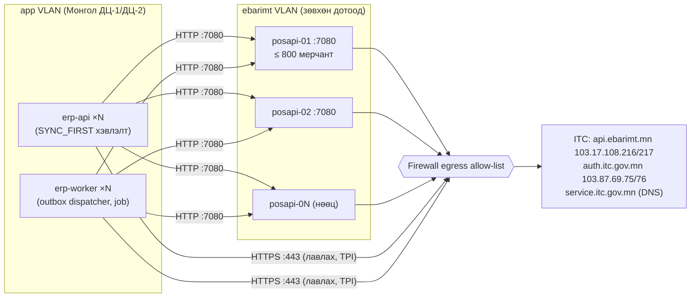
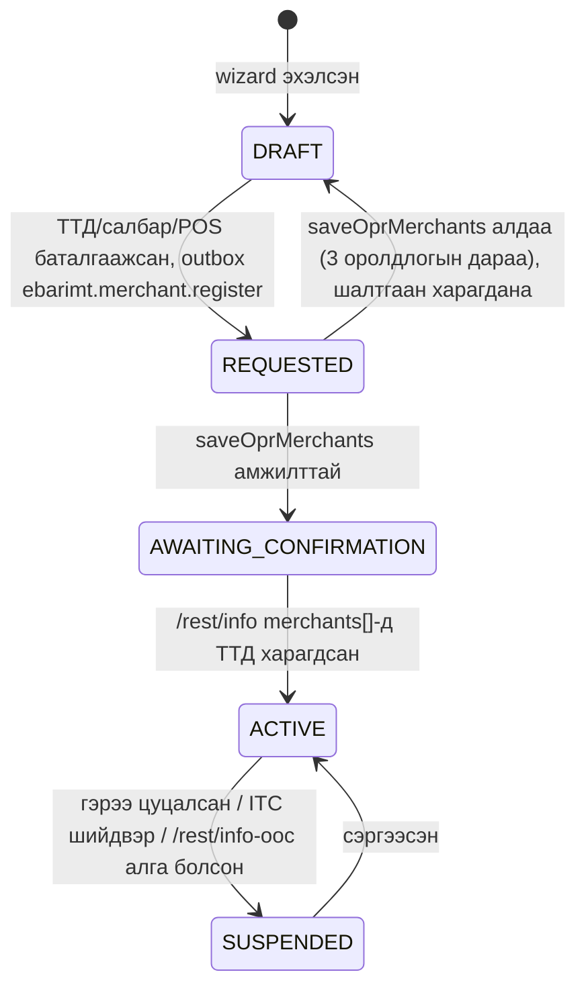
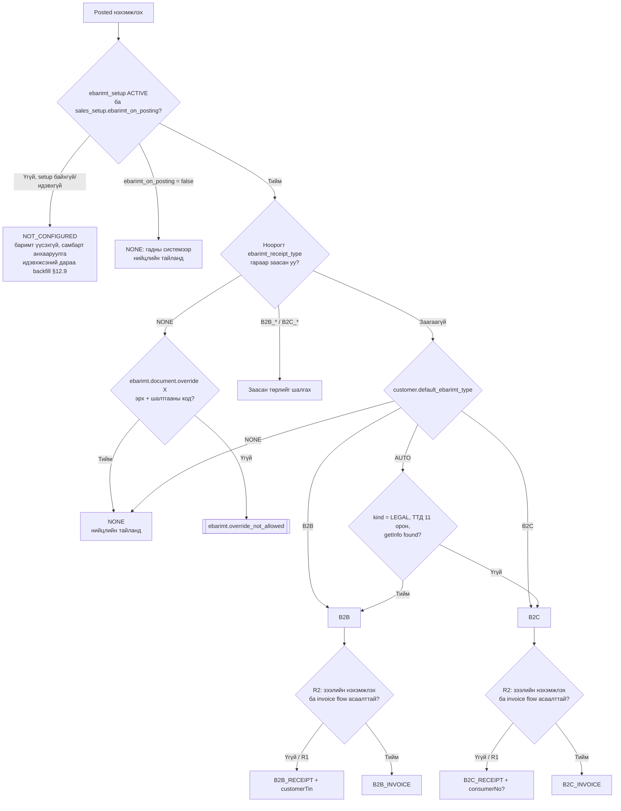
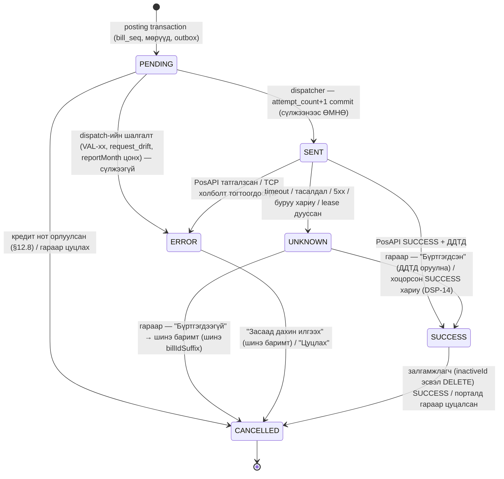
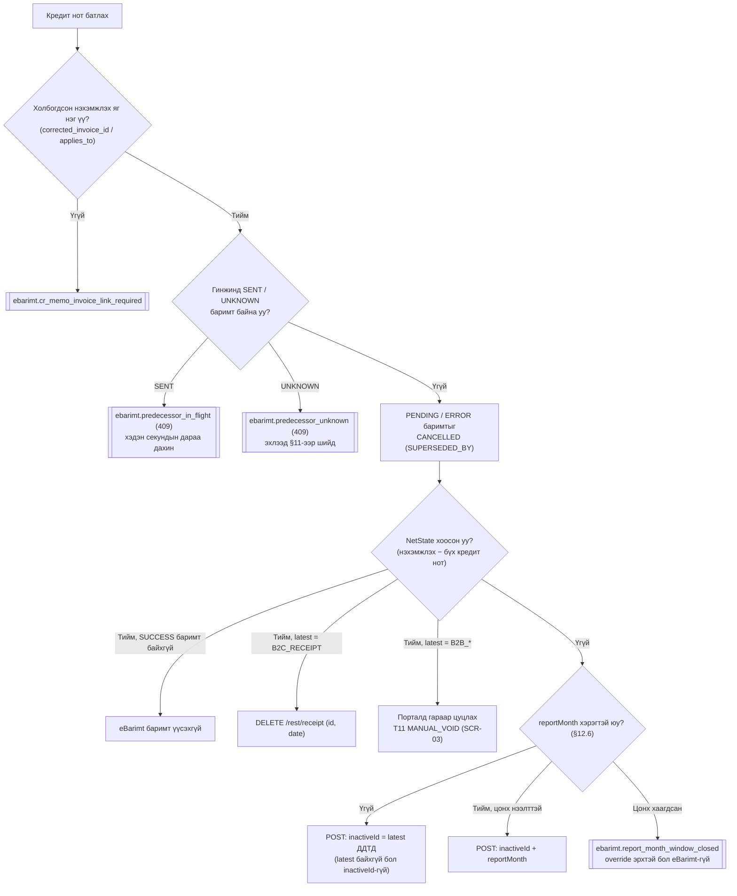
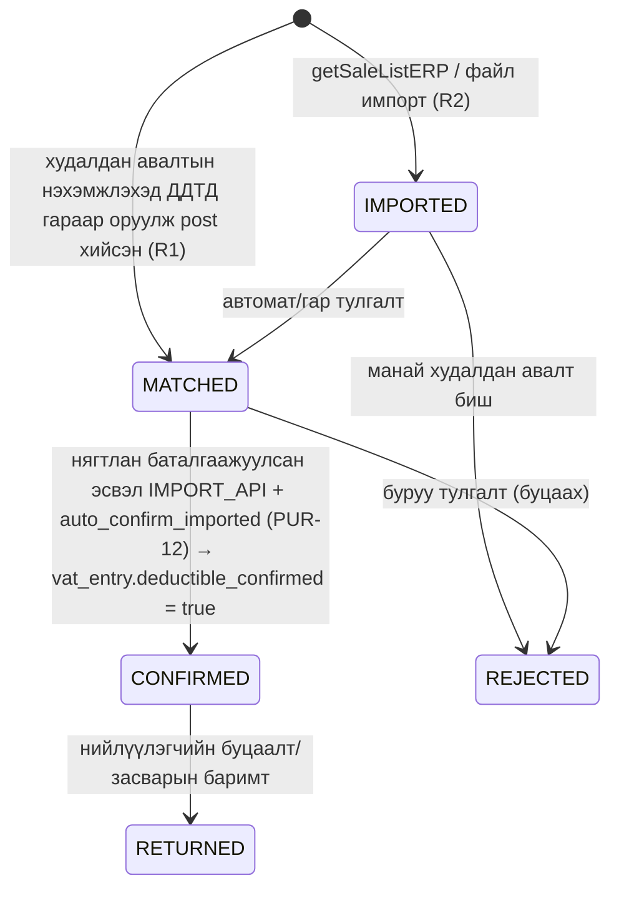

# 12. eBarimt (PosAPI 3.0) интеграц — хөгжүүлэлтэд бэлэн тодорхойлолт

> **Төлөв:** Хөгжүүлэлтэд бэлэн (draft-2, adversarial review 2026-10-07 — төгсгөлийн "Хяналтын тэмдэглэл"-ийг үз). **Огноо:** 2026-10-06. **Хамрах модуль:** `EBarimt` (schema `ebarimt`), Sales/Purchases-ийн eBarimt-тэй харилцах хэсэг, `integration.outbox`.
> **Эх сурвалж (давамгайлах дарааллаар):** [DECISIONS.md](./DECISIONS.md) (D-J1..D-J4, D-K1, D-K4, D-I6, D-E2..D-E6) → [db/schema/130_ebarimt.sql](./db/schema/130_ebarimt.sql) ба бусад `db/schema/*.sql` (**нэрийн цорын ганц эх сурвалж**, D-K1) → [01-requirements.md](./01-requirements.md) FR-EBR-001..021, CMP-022..028 → [02-architecture.md](./02-architecture.md) §4.2.6, §9.1–9.3, §10.4–10.5, §11 → [ADR-0012](./adr/ADR-0012-outbox-idempotency-ebarimt.md), [ADR-0013](./adr/ADR-0013-hosting-in-mongolia-posapi-operator.md), [ADR-0020](./adr/ADR-0020-observability-otel-redaction.md) → [03-domain-model.md](./03-domain-model.md) §3.9, §6.3–6.4 → судалгаа [mn-integrations-market.md](./research/mn-integrations-market.md) §2–3, §11–12, [mn-tax.md](./research/mn-tax.md) R3, R5, R14, R15.
> **PosAPI-ийн хувилбар:** developer.itc.gov.mn, PosAPI **v3.2.48** (2026-09-15). Тодорхойгүй зүйлийг таамаглаагүй: "UNVERIFIED" гэж тэмдэглээд §27-д асуулт, §25-д staging тест болгосон. Албан ёсны тодруулга: **posapi@itc.gov.mn** (9997-4468).

---

## 0. Энэ баримтыг хэрхэн унших

### 0.1 Нэр томьёо

| Монгол | Англи / код | Тайлбар |
|---|---|---|
| eBarimt | Electronic receipt system | Төлбөрийн баримтын нэгдсэн систем (ITC/СМТТ) |
| PosAPI | PosAPI 3.0 local REST service | Манай ДЦ-д ажиллах local үйлчилгээ, `http://<host>:7080`, токенгүй |
| Оператор | Operator | Олон мерчантын PosAPI instance ажиллуулагч. Энд **бид** (D-B5) |
| Мерчант | Merchant | Баримт гаргагч татвар төлөгч = манай нэг **компани** (нэг ТТД) |
| ДДТД | Receipt ID (33 digits) | PosAPI-ийн буцаасан `id` → `ebarimt_document.ddtd` |
| Дэд баримт | Sub-receipt | `receipts[]`-ийн элемент, `taxType` (× `merchantTin`) тус бүрд нэг |
| БҮНА | Product classification code | `classificationCode`, яг 7 орон |
| Татварын барааны код | Tax product code | `taxProductCode`; `VAT_FREE`/`VAT_ZERO`/`NOT_VAT` мөрт заавал |
| Баримтын дагавар | Bill ID suffix | `billIdSuffix`, POS-ийн reset-гүй counter-оос (D-K4) |
| Засварын гинж | Correction chain | `inactiveId` = гинжний **сүүлийн** ДДТД |
| Нөхөн тайлагнах сар | Report month | `reportMonth`, сарын 1–7-нд, өмнөх сард |
| Тодорхойгүй төлөв | Unknown status | `UNKNOWN`: хүсэлт явсан, хариу тодорхойгүй. Гараар шийднэ (D-J2) |
| Зөвхөн хэвлэх | Print-only | `qrData`, `lottery`: санах ойд л, хаана ч хадгалахгүй (D-J3) |

### 0.2 Нэрийн зөрүүг шийдсэн байдал (D-K1: schema давамгайлна)

[02-architecture.md](./02-architecture.md) ба [ADR-0012](./adr/ADR-0012-outbox-idempotency-ebarimt.md)-ийн өмнөх хувилбарт өөр нэр хэрэглэсэн байсан; 2026-10-08-нд тэдгээрийг schema-ийн нэрээр шинэчилсэн (02-architecture "Нийцүүлэлтийн тэмдэглэл"). Доорх хүснэгт нь хуучин нэрийг таних лавлагаа. Энэ баримт **зөвхөн schema-ийн нэрийг** хэрэглэнэ:

| Хуучин нэр (02-architecture / ADR-0012, 2026-10-08-аас өмнө) | Schema (энэ баримт) | Тэмдэглэл |
|---|---|---|
| `ebarimt.receipt` | `ebarimt.ebarimt_document` (+ `ebarimt_sub_receipt`, `ebarimt_document_line`) | — |
| `ebarimt.receipt_event` | `ebarimt.ebarimt_document_event` | trigger-ээр бичигдэнэ |
| `ebarimt.merchant` | `ebarimt.ebarimt_setup` | Бүртгэлийн төлөвийн багана дутуу → SCR-04 |
| `ebarimt.pos_terminal` | `ebarimt.ebarimt_pos` | — |
| `ref_classification`, `ref_tax_product_code` | `ebarimt.classification_code`, `ebarimt.tax_product_code` | глобал кэш |
| `ref_branch`, `taxpayer_cache`, `posapi_health` | — (schema-д байхгүй) | SCR-05, SCR-07; R1-д санах ойн кэш |
| `integration.outbox_message`, `message_type`, `next_attempt_at` | `integration.outbox`, `topic`, `available_at` | — |
| Төлөв `SENDING` | `SENT` | "Сүлжээнд гаргахаар commit хийсэн" (§9) |
| Төлөв `SENT` (амжилттай) | `SUCCESS` | — |
| Төлөв `REJECTED` | `ERROR` | — |
| `RESOLVED_SENT` / `RESOLVED_NOT_SENT` | `SUCCESS` + `resolved_*` / `CANCELLED` + шинэ баримт | §11 |
| `VOID_PENDING/VOIDED/VOID_UNKNOWN` | `operation = 'DELETE'` мөрийн `PENDING/SUCCESS/UNKNOWN` | §12.4 |
| Outbox `ebarimt.receipt.create` / `.void` | Outbox topic `ebarimt.receipt.send` (SAVE ба DELETE хоёулаа) | `integration.job_definition`-ийн код |

### 0.3 Дүрмийн ID

Дүрэм бүр `<бүлэг>-<дугаар>` ID-тай (жишээ нь `MAP-05`, `VAL-12`). Хүлээн авах тест `AT-EB-xx` (§24), staging тест `TS-xx` (§25), schema өөрчлөлтийн хүсэлт `SCR-xx` (§26), нээлттэй асуулт `OQ-xx` (§27).

---

## 1. Хамрах хүрээ ба хувилбар

| Чадвар | R1 | R2 | R3 | FR |
|---|:-:|:-:|:-:|---|
| Operator: instance бүртгэл, мерчант бүртгэх (`saveOprMerchants`), `/rest/info`, `sendData` | ✔ | | | FR-EBR-001, 013 |
| Компани/салбар/POS тохиргоо, `getInfo`, `getBranchInfo` | ✔ | | | FR-EBR-001 |
| Борлуулалтын нэхэмжлэх → `B2C_RECEIPT` / `B2B_RECEIPT` | ✔ | | | FR-EBR-002..006 |
| Кредит нот → `DELETE` (бүтэн B2C), `inactiveId` засвар, `reportMonth` | ✔ | | | FR-EBR-009..011 |
| UNKNOWN/ERROR-ийг гараар шийдэх | ✔ | | | FR-EBR-007 |
| Хэвлэх (QR, сугалаа санах ойд), "ХУУЛБАР" | ✔ | | | FR-EBR-008 |
| НӨАТ төлөгч бус мерчант | ✔ | | | FR-EBR-015 |
| `consumerNo` (8 орон) | ✔ | | | FR-EBR-016 |
| Худалдан авалтын ДДТД гараар бүртгэх, баталгаажуулах | ✔ | | | FR-TAX-009 |
| БҮНА ба `taxProductCode` кэш | ✔ | | | FR-EBR-003 |
| `*_INVOICE` + `invoiceId` (зээлийн борлуулалт → төлбөр) | | ✔ | | FR-EBR-017 |
| `getSaleListERP` импорт ба автомат тулгалт | | ✔ | | FR-EBR-018 |
| НХАТ (`totalCityTax`) | | ✔ | | FR-EBR-019 |
| ОАТ марк (`stockQR`) | | ✔ | | FR-EBR-020 |
| `getSalesTotalData`-аар борлуулалтын тулгалт | | ✔ | | FR-TAX-016 |
| Холимог төлбөр, POS касс, картын терминал, хялбар бүртгэл (`approveQr`) | | ✔ | ✔ | — |
| QPay-ээр баримт гаргах (`ebarimt_issuer = QPAY`) | | | ✔ | FR-EBR-021 |
| Түрээслэгч (`saveOprLessors`, `merchantTin` × `taxType` дэд баримт) | | | ✔ | — |
| Эмийн сан (`lotNo`), байршил (GPS/LICENSE), гадаад жуулчин | | | — | хамрахгүй |

---

## 2. PosAPI operator-ийн топологи

### 2.1 Бүтэц



- **TOP-01.** Production-ийн бүх PosAPI instance манай Монгол дахь ДЦ-ийн `ebarimt` VLAN-д ажиллана (ADR-0013). Instance бүр `ebarimt.posapi_instance`-д нэг мөртэй (`code`, `environment`, `base_url`, `operator_tin`, `max_merchants`, `status`).
- **TOP-02.** Мерчант (= компани, нэг ТТД) яг нэг instance-д оноогдоно (`ebarimt_setup.posapi_instance_id`). Оноолт тогтвортой (sticky): автоматаар шилжүүлэхгүй. Шилжүүлэх журам UNVERIFIED (OQ-12).
- **TOP-03.** Нэг instance-ийн хязгаар: ≤ 1 000 мерчант, ≤ 100 000 баримт/өдөр (PosAPI-ийн дүрэм). Бид мерчантаар **80%** (≤ 800), баримтаар **70%** (≤ 70 000 баримт/өдөр) хүртэл дүүргэнэ (ADR-0013 §3; 70 000 нь 100 000-ийн 70%, 80% биш). `posapi_instance.max_merchants`-ийг хатуу хязгаар (1000) гэж үзнэ; зөөлөн хязгаар (800) нь app тохиргоо `Ebarimt:PosApi:MerchantSoftLimit` (SCR-07-оор багана болгох).
- **TOP-04.** `status`: `ACTIVE` (шинэ мерчант авна), `DRAINING` (шинэ мерчант авахгүй, байгаа нь ажиллана), `DISABLED` (илгээлт хийхгүй; §10.2, VAL-01).
- **TOP-05.** Staging нь тусдаа instance (`environment = 'STAGING'`), ITC-ийн staging-тэй холбогдоно (`st-operator.ebarimt.mn`, auth `https://st.auth.itc.gov.mn/auth/realms/Staging`). Staging-д **ачааллын тест хийхгүй**; ачааллыг stub PosAPI-гаар шалгана.
- **TOP-06.** `ebarimt_setup.environment` нь оноосон instance-ийн `environment`-тэй тэнцүү байна (VAL-02). Production компанийг staging instance-д оноохыг хориглоно.

### 2.2 Instance сонгох алгоритм

```text
function PickInstance(environment, expectedDaily):
    // ebarimt.fn_instance_merchant_counts() (SCR-07): instance бүрийн нийлбэр л буцаана, тенантын мэдээлэлгүй
    candidates = SELECT i.*, c.merchants, c.weighted_load, c.expected_receipts
                   FROM ebarimt.posapi_instance i
                   JOIN ebarimt.fn_instance_merchant_counts() c ON c.posapi_instance_id = i.id
                  WHERE i.environment = environment AND i.status = 'ACTIVE'
    // merchants         = оноогдсон мерчантын тоо
    // weighted_load     = Σ max(1, coalesce(expected_daily_receipts, 0) / 300)   (TOP-08; SCR-04 хүртэл жин = 1)
    // expected_receipts = Σ coalesce(expected_daily_receipts, 0)
    candidates = candidates.where(c => c.merchants < MerchantSoftLimit(c)                        // 800
                                    and c.expected_receipts + expectedDaily <= ReceiptSoftLimit(c)) // 70 000
    if candidates is empty: raise ebarimt.no_instance_capacity          // ops alert P2
    return candidates.orderBy(c => c.weighted_load).ThenBy(c => c.code).first()
```

- **TOP-07.** `ebarimt_setup` тенантын хүснэгт (RLS) тул тоололыг SECURITY DEFINER `ebarimt.fn_instance_merchant_counts()` (SCR-07) хийнэ; энэ нь зөвхөн instance бүрийн нийлбэр тоог буцаадаг тул wizard-ийг ажиллуулдаг `erp-api` (`app_user`) болон worker (`app_worker`) хоёулаа EXECUTE эрхтэй (02-architecture §7.6-ийн `fn_list_active_companies` загвар, гэхдээ тенантын id буцаахгүй). SCR-07 хүртэл: `PickInstance`-ийг `ebarimt.merchant.register` outbox handler (worker) дотор дуудаж `posapi_instance_id`-г тэнд онооно; wizard зөвхөн `environment`-ийг сонгоно. Зэрэг хоёр wizard зөөлөн хязгаарыг 1-ээр хэтрүүлж болно (зөөлөн хязгаар тул зөвшөөрнө).
- **TOP-08.** Өдөрт 300-аас олон баримт хүлээгдэж буй мерчант (wizard-ийн асуулт "өдөрт хэдэн баримт", `expected_daily_receipts`, SCR-04) instance-уудад тэнцүү тархана: тооцоонд мерчант бүрийг `max(1, expected_daily/300)` жингээр тоолно (`weighted_load`).
- **TOP-09 (PosAPI-ийн дэд бүтцийн шаардлага, CMP-027).** Instance бүрийн VM: PosAPI-ийн локал DB-тэй ping **< 100 ms**, чөлөөт диск **≥ 1 GB** (диск 80% дүүрэхэд P2 alert), сүлжээ **≥ 80 Mbps**, зөвхөн дотоод сүлжээ, зөвхөн Монголын IP-ээс гарна (research mn-integrations-market §2.5; skill §9). PosAPI VM бүр дээрх node exporter (ба PosAPI-ийн локал DB-ийн ping-ийг хэмждэг жижиг probe) `erp_posapi_disk_free_bytes`, `erp_posapi_db_ping_seconds` метрик гаргана (§14.3-ийн alert).

### 2.3 Мерчант бүртгэх урсгал (`saveOprMerchants`)



Schema-д бүртгэлийн төлөвийн багана байхгүй (`registered_with_operator_at`, `enabled` л байна). SCR-04 батлагдах хүртэл төлөвийг дараах байдлаар **гаргаж** авна:

| Төлөв | Нөхцөл (SCR-04-өөс өмнө) |
|---|---|
| DRAFT | `ebarimt_setup` мөр байхгүй, эсвэл `posapi_instance_id IS NULL` |
| REQUESTED | `posapi_instance_id` бий, `registered_with_operator_at IS NULL`, `topic = 'ebarimt.merchant.register'` outbox мөр PENDING/PROCESSING |
| AWAITING_CONFIRMATION | `registered_with_operator_at IS NOT NULL AND enabled = false` |
| ACTIVE | `enabled = true` |
| SUSPENDED | SCR-04 шаардлагатай (одоо `enabled = false` + аудитын тэмдэглэл) |

- **REG-01.** `saveOprMerchants`-ийг outbox topic `ebarimt.merchant.register`-ээр дуудна. Retry: 3 удаа (1, 5, 30 мин). **Дахин оролдохоос өмнө** `/rest/info`-оор мерчант аль хэдийн харагдаж байгаа эсэхийг шалгана; харагдвал дуудахгүй (идемпотент).
- **REG-02.** Дуудлага: `POST https://api.ebarimt.mn/api/tpi/receipt/saveOprMerchants`, header `Authorization: Bearer <token>` (OIDC password grant, `client_id = vatps`, operator-ийн данс) ба `X-API-KEY: <operator key>`. Body-гийн яг бүтэц **UNVERIFIED** (OQ-12); баримтжуулалт ирэх хүртэл доорх хэлбэрийг placeholder гэж үзнэ:

```json
{ "posNo": "<instance-ийн operator POS дугаар>", "merchantTins": ["37900846788"] }
```

- **REG-03.** Амжилттай бол `registered_with_operator_at = now()`. Мерчант өөрөө **e-invoice эсвэл Ebarimt-Mobile**-д нэвтэрч хүсэлтийг баталгаажуулна. Wizard нь энэ алхмыг дэлгэцэнд заавар болгон харуулна.
- **REG-04.** `AWAITING_CONFIRMATION` үед `ebarimt.info_poll` job (5 мин тутам, §14.1; 02-architecture §9.3-ийн "15 мин" нь энэ job-ийн давтамжаар солигдоно, §28) `/rest/info`-ийн `merchants[].tin`-д ТТД орсон эсэхийг шалгана. Орсон бол `enabled = true` (ACTIVE), `MerchantActivated` event, Owner-т мэдэгдэл.
- **REG-05.** 14 хоног `AWAITING_CONFIRMATION`-д байвал Owner-т сануулга, манай ops-д мэдэгдэл.
- **REG-06.** ACTIVE мерчантын ТТД `/rest/info`-оос алга болбол P2 alert, мерчантын шинэ илгээлтийг зогсоохгүй (PosAPI өөрөө ERROR буцаана), гэхдээ хяналтын самбарт "Мерчант PosAPI-д харагдахгүй" анхааруулга гарна.

---

## 3. Компани, салбар, POS-ийн тохиргоо

### 3.1 Wizard-ийн алхам

| # | Алхам | Хадгалах газар | Эх үүсвэр / шалгалт |
|---|---|---|---|
| 1 | Мерчантын ТТД | `ebarimt_setup.merchant_tin` | анхдагч `company_setup.tin`; `getInfo?tin=` (SET-01) |
| 2 | Нэр, НӨАТ/НХАТ төлөгч эсэх | `merchant_name`, `vat_payer`, `city_tax_payer` | `getInfo`-ийн `name`, `vatPayer`, `cityPayer` (SET-02) |
| 3 | Дүүрэг/хороо | `district_code` (4 орон) | анхдагч `company_setup.district_code` (бөглөгдсөн бол); `getBranchInfo` жагсаалтаас сонгоно/баталгаажуулна (SET-03) |
| 4 | Салбар | `branch_no` (анхдагч `001`) | 3 орон |
| 5 | POS | `ebarimt.ebarimt_pos` (`pos_no`, `is_default`, `bank_account_id`) | R1: `^[0-9]{3}$` (SET-05) |
| 6 | B2C анхдагч | `default_b2c_when_no_tin` | анхдагч `true` |
| 7 | Орчин ба instance | `environment`, `posapi_instance_id` | §2.2 |
| 8 | Бүртгүүлэх | outbox `ebarimt.merchant.register` | §2.3 |
| 9 | Бэлэн байдлын шалгалт | — | SET-07 (БҮНА, taxType, төлбөрийн код) |

### 3.2 Дүрэм

- **SET-01 (ТТД).** `merchant_tin` нь хуулийн этгээдэд **11 орон**, хувь хүнд (`civil_id`) **12–14 орон** (`platform.tin` нь 7–14 зөвшөөрдөг тул app нэмж шалгана). `getInfo?tin=` дуудаж:
  - олдохгүй бол → `ebarimt.merchant_tin_not_found` (422), wizard зогсоно;
  - `name` нь `company_setup.legal_name`-тэй ялгаатай бол анхааруулга (зогсоохгүй), хэрэглэгч баталгаажуулна;
  - салбарын ТТД (branch-registered taxpayer) баримт гаргах эрхгүй гэж PosAPI-ийн текстэд байдаг. `getInfo` үүнийг харуулах эсэх UNVERIFIED (OQ-19).
- **SET-02 (татвар төлөгчийн төлөв).** `vat_payer` ≠ `company_setup.vat_registered` эсвэл `city_tax_payer` ≠ `company_setup.city_tax_payer` бол **идэвхжүүлэхийг хориглоно** (`ebarimt.vat_status_mismatch`, 409). Хэрэглэгч компанийн профайлыг засна (эсвэл татварын албанд бүртгэлээ шалгана). `getInfo`-ийг 30 хоног тутам дахин шалгаж, зөрвөл Owner-т мэдэгдэнэ (идэвхийг унтраахгүй).
- **SET-03 (`districtCode`).** `GET https://api.ebarimt.mn/api/info/check/getBranchInfo` (токенгүй). `districtCode = branchCode (2) + subBranchCode (2)` = 4 орон. R1-д жагсаалтыг API процессын санах ойд 24 цаг кэшилнэ (хүснэгтгүй; SCR-11-д table санал болгосон). Хариуны хэлбэр (UNVERIFIED, placeholder):

```json
{ "status": 200, "msg": "", "data": [ { "branchCode": "25", "branchName": "Сүхбаатар", "subBranchCode": "01", "subBranchName": "1-р хороо" } ] }
```

- **SET-04 (`branch_no`).** `^[0-9]{3}$`. R1-д компани нэг салбартай (`001`). Олон салбартай бол POS бүр `ebarimt_pos.branch_no`-той; салбар бүрийн `districtCode` өөр байвал SCR-11 хэрэгтэй (R1-д `ebarimt_setup.district_code`-ийг бүх POS ашиглана).
- **SET-05 (`pos_no`).** Schema `^[0-9A-Za-z]{1,10}$` зөвшөөрдөг ч `billIdSuffix`-ийн формат (§7) 3 оронтой `posNo`-д тулгуурладаг тул **R1-д UI ба API `^[0-9]{3}$`-ээр хязгаарлана**. Компанид яг нэг `is_default = true` POS (schema UNIQUE). `blocked = true` POS-оор баримт гаргахгүй (VAL-03).
- **SET-06 (идэвхжүүлэх эрх).** Wizard-ийг `T_SETUP` M ба `ebarimt.merchant.register` X эрхтэй (анхдагчаар Owner, Accountant; §18.2) хэрэглэгч дуусгана. Өөрчлөлт бүр `audit.row_change`-д бичигдэнэ.
- **SET-07 (бэлэн байдлын шалгалт).** ACTIVE болгохоос өмнө дараах тайланг харуулна (блоклохгүй, анхааруулга):
  1. `classification_code`-гүй идэвхтэй бараа (`inv.item`) ба eBarimt-д ордог G/L данстай мөрийн анхдагч код байхгүй эсэх;
  2. `vat_posting_setup` мөр бүрийн `ebarimt_tax_type`, `VAT_ABLE`-аас бусдад `ebarimt_tax_product_code`;
  3. `party.payment_method` бүрийн `ebarimt_payment_code`;
  4. `inv.unit_of_measure.ebarimt_measure_unit` хоосон эсэх;
  5. ТТД-тэй харилцагчдын `getInfo` шалгалтын үр дүн.
- **SET-08 (тохиргоо солих).** ACTIVE мерчантын `merchant_tin`-ийг солихыг хориглоно (`ebarimt.merchant_tin_locked`). `district_code`, `branch_no`, `pos_no`-г сольж болно; өөрчлөлт нь **зөвхөн шинээр үүсэх** баримтад нөлөөлнө. PENDING баримтын хүсэлтийн hash зөрвөл тэр баримт ERROR (`ebarimt.request_drift`) болно (§10.2). Иймээс UI өөрчлөлт хадгалахаас өмнө "N баримт илгээгдэхийг хүлээж байна" гэж анхааруулна.
- **SET-09 (НӨАТ төлөгч бус мерчант, FR-EBR-015).** `vat_payer = false` бол бүх мөр `vat_category = 'NOVAT'` бөгөөд `ebarimt_tax_type` нь тохиргооны утга (анхдагч `NOT_VAT`; `VAT_FREE` сонгож болно; D-E5 ⚠, OQ-04), `totalVAT = 0`.

### 3.3 Харилцагчийн ТТД баталгаажуулах

- **SET-10.** Харилцагчийн карт хадгалахад `tin` бөглөгдсөн бол `getInfo?tin=` дуудна. Үр дүнг (олдсон эсэх, нэр, `vatPayer`, `cityPayer`, огноо) SCR-05-ийн кэшид (R1-д түр: API процессын санах ойд 24 цаг + `party.customer.vat_registered`-ийг шинэчлэх санал) хадгална.
- **SET-11.** Хэрэглэгч хуулийн этгээдийн **7 оронтой улсын бүртгэлийн дугаар** оруулбал `getTinInfo?regNo=` → 11 оронтой ТТД болгоно. **Иргэний регистрээр ТТД хайхыг хориглоно**: skill-ийн дагуу ITC 2026-06-15-аас иргэний регистрээр хаасан (огноог бие даасан эх сурвалжаар баталгаажуулаагүй — mn-integrations-market §2.1 fact-check: UNVERIFIED; TS-28-аар шалгана), мөн хувь хүний мэдээлэл (mn-integrations-market §7). Иргэний регистрийг ТТД-ийн түлхүүр болгож хэрэглэхгүй.
- **SET-12.** `getInfo` түр ажиллахгүй (timeout, 5xx) бол харилцагчийг хадгалахыг зогсоохгүй; тэмдэг "ТТД шалгагдаагүй" үлдэж, posting үед дахин шалгана (VAL-18).

---

## 4. Баримтын төрөл тодорхойлох (type decision tree)

### 4.1 Модны зураг



### 4.2 Pseudo-code

```text
// Зөвхөн БОРЛУУЛАЛТЫН НЭХЭМЖЛЭХэд. Кредит нот төрлөө гинжээс өвлөнө (TYP-06, §12.8) — DecideType-ийг дуудахгүй.
// Буцаах утга: (outcome, type, customerTin, consumerNo); outcome ∈ {ISSUE, NOT_CONFIGURED, NONE}.
// type нь posted header-ийн ebarimt_receipt_type-д snapshot болно (TYP-07).
function DecideType(draftHeader, customer, setup, salesSetup, now):
    if not salesSetup.ebarimt_on_posting:             return (NONE, 'NONE', null, null)       // reason EXTERNAL_ISSUER (DSP-03)
    requested = draftHeader.ebarimt_receipt_type
    if requested == 'NONE':
        require permission ebarimt.document.override (X) and draftHeader.reason_code_id is not null
        return (NONE, 'NONE', null, null)                                                      // reason USER_OVERRIDE
    if requested is null:
        requested = switch customer.default_ebarimt_type:
            'B2B'  -> 'B2B_RECEIPT'
            'B2C'  -> 'B2C_RECEIPT'
            'NONE' -> return (NONE, 'NONE', null, null)                                         // reason CUSTOMER_DEFAULT
            'AUTO' -> IsB2B(customer, draftHeader) ? 'B2B_RECEIPT' : B2cOrRequireTin(customer, setup)   // TYP-08
    if R2 and setup?.invoice_flow_enabled and IsCreditSale(draftHeader):  // R2: due_date > posting_date ба bal_account байхгүй
        requested = requested.replace('_RECEIPT', '_INVOICE')
    if R1 and requested ends with '_INVOICE': raise ebarimt.invoice_flow_not_available   // D-J1
    customerTin = requested starts 'B2B' ? coalesce(draftHeader.ebarimt_customer_tin, customer.tin) : null
    consumerNo  = requested == 'B2C_RECEIPT' ? coalesce(draftHeader.ebarimt_consumer_no, customer.ebarimt_consumer_no) : null
    if setup is null or not setup.enabled:            // төрлийг ШИЙДСЭНИЙ ДАРАА шалгана (TYP-07: snapshot-д төрөл бичигдэнэ)
        return (NOT_CONFIGURED, requested, customerTin, consumerNo)
    return (ISSUE, requested, customerTin, consumerNo)

function B2cOrRequireTin(customer, setup):          // TYP-08
    if setup is not null and setup.default_b2c_when_no_tin == false and customer.kind == 'LEGAL' and customer.country_code == 'MN':
        raise ebarimt.customer_tin_required           // хүчинтэй 11 оронтой ТТД-гүй ААН-д B2C гаргахыг хориглосон тохиргоо
    return 'B2C_RECEIPT'

function IsB2B(customer, draftHeader):
    tin = coalesce(draftHeader.ebarimt_customer_tin, customer.tin)
    return tin matches '^[0-9]{11}$' and customer.kind = 'LEGAL'                 // R1: зөвхөн ААН (D-J1, TYP-04)
           and TaxpayerInfo(tin).found == true                                // кэш ≤ 30 хоног (VAL-18)
```

### 4.3 Дүрэм

- **TYP-01.** R1: зөвхөн `B2B_RECEIPT`, `B2C_RECEIPT` (D-J1). `*_INVOICE` нь R2 (FR-EBR-017).
- **TYP-02.** `customerTin` зөвхөн `B2B_*`-д, `consumerNo` зөвхөн `B2C_RECEIPT`-д (PosAPI дүрэм; schema CHECK `consumer_no IS NULL OR ebarimt_type = 'B2C_RECEIPT'`, `customer_tin` B2B-д заавал).
- **TYP-03.** `customer.default_ebarimt_type = 'NONE'`-ийг зөвхөн `ebarimt.document.override` X эрхтэй хэрэглэгч тохируулна. NONE баримт бүр "eBarimt-гүй борлуулалт" тайланд гарна (CMP-037 эрсдэл).
- **TYP-04.** R1-д B2B нь зөвхөн **11 оронтой ТТД-тэй хуулийн этгээдэд** (D-J1). Хувь хүн бизнес эрхлэгч (12–14 оронтой `civil_id`) `B2C_RECEIPT` авна; түүний `civil_id`-г `customerTin`-д илгээхгүй, `ebarimt_document.customer_tin`-д хадгалахгүй ([13-security-audit-tenancy.md](./13-security-audit-tenancy.md) SEC-PII-03/06: хувь хүний ТТД нь PII-S, шифрлэгдсэн). ITC/татварын зөвлөх хувь хүнд B2B шаардлагатай гэвэл (OQ-23) шифрлэлтийг тайлж илгээх урсгалыг 13-тай хамт тусад нь шийднэ.
- **TYP-05.** Гадаад харилцагч (`kind = 'FOREIGN'`, Монголын ТТД-гүй) үргэлж `B2C_RECEIPT` (`consumerNo`-гүй).
- **TYP-06.** Кредит нотын eBarimt төрөл нь засаж буй гинжний **төрлийг өвлөнө** (`ebarimt_type`, `customer_tin`, `consumer_no` ижил). Төрөл солих (B2C → B2B) бол бүтэн цуцлах кредит нот + шинэ нэхэмжлэх (§12.1).
- **TYP-07.** Posted header-ийн `ebarimt_receipt_type`, `ebarimt_customer_tin`, `ebarimt_consumer_no` нь эцсийн шийдвэрийн snapshot (immutable). NOT_CONFIGURED үед `ebarimt_receipt_type`-д шийдвэрлэсэн төрлийг (жишээ нь `B2C_RECEIPT`) бичнэ (тиймээс `DecideType` нь setup-ийг төрөл шийдсэний **дараа** шалгана); баримт үүсээгүйг `ebarimt_document` байхгүйгээр тодорхойлно. `ebarimt_on_posting = false` (гадны систем), хэрэглэгчийн override, харилцагчийн `NONE` үед `'NONE'` бичнэ. NONE-ийн шалтгааныг (`USER_OVERRIDE` / `CUSTOMER_DEFAULT` / `EXTERNAL_ISSUER` / `WINDOW_CLOSED_OVERRIDE`) хадгалах багана schema-д байхгүй тул SCR-21; түүнийг хүртэл `reason_code_id` бөглөгдсөн бол `USER_OVERRIDE`, үгүй бол тайланд "тодорхойгүй" гэж харуулна.
- **TYP-08 (`default_b2c_when_no_tin`).** `ebarimt_setup.default_b2c_when_no_tin = true` (анхдагч): `AUTO` харилцагч B2B-ийн нөхцөлийг (IsB2B) хангахгүй бол `B2C_RECEIPT`. `false`: Монголын `kind = 'LEGAL'` харилцагч хүчинтэй 11 оронтой, `getInfo`-оор олдсон ТТД-гүй бол posting `ebarimt.customer_tin_required` (422)-оор зогсоно (ААН-д B2C баримт андуурч гаргахаас сэргийлэх); `INDIVIDUAL`, `FOREIGN` харилцагчид нөлөөлөхгүй.

---

## 5. Талбарын харгалзаа (posted баримт → receipt JSON)

### 5.1 Модулийн үүрэг

- **MAP-00.** EBarimt модуль Sales-аас хамаарахгүй (02-architecture §4.2.6). Sales нь `EBarimt.Contracts`-ийн `ReceiptRequest`-ийг бөглөнө (`ISalesEbarimtMapper`): мөр бүрийн дүн, `taxType`, код, `source_line_no`. EBarimt нь (1) төрөл ба ТТД-ийн шалгалт, (2) гинж (`inactiveId`, `reportMonth`), (3) мөрийг item болгох (§6.2), (4) шалгалт (§8), (5) `billIdSuffix`, (6) хадгалалт ба outbox-ийг хариуцна. Хоёулаа **posting transaction дотор** ажиллана: posted header-ийг бичихээс өмнө `IEbarimtReceiptQueue.ResolveTypeAsync(draft, customer, tx)` (төрлийн snapshot, TYP-07), posted баримтыг бичсний дараа `IEbarimtReceiptQueue.EnqueueAsync(request, tx)` (§10.1). `ResolveTypeAsync` нь 02-architecture §4.2.6-ийн нийтийн интерфейсэд нэмэгдэх санал (§28).

### 5.2 Толгой (header)

| PosAPI талбар | Заавал | Эх үүсвэр | Дүрэм |
|---|:-:|---|---|
| `branchNo` | ✔ | `ebarimt_pos.branch_no` (баримтын POS) | 3 орон. Snapshot: SCR-01 |
| `totalAmount` | ✔ | Σ `receipts[].totalAmount` | **Нийлбэрээр** (AMT-04). НӨАТ, НХАТ шингэсэн |
| `totalVAT` | | Σ `receipts[].totalVAT` | 2 оронтой |
| `totalCityTax` | | Σ `receipts[].totalCityTax` | R1-д `0.00` |
| `districtCode` | | `ebarimt_setup.district_code` | 4 орон. Snapshot: SCR-01 |
| `merchantTin` | ✔ | `ebarimt_document.merchant_tin` ← `ebarimt_setup.merchant_tin` | 11 / 12–14 орон |
| `posNo` | ✔ | `ebarimt_pos.pos_no` | R1: 3 орон |
| `customerTin` | B2B ✔ | `ebarimt_document.customer_tin` ← posted `ebarimt_customer_tin` | B2C-д `null` |
| `consumerNo` | | `ebarimt_document.consumer_no` | зөвхөн `B2C_RECEIPT`; байхгүй бол `""` (MAP-24) |
| `type` | ✔ | `ebarimt_document.ebarimt_type` | §4 |
| `inactiveId` | | `ebarimt_document.inactive_ddtd` | засварт гинжний сүүлийн ДДТД, бусад үед `null` |
| `invoiceId` | | `ebarimt_document.parent_ddtd` | R2 (төлбөрийн баримт), R1-д `null` |
| `reportMonth` | | `ebarimt_document.report_month` (`YYYY-MM`) | §12.6. Формат UNVERIFIED (OQ-06) |
| `billIdSuffix` | ✔ | `pos_no` + `lpad(bill_id_suffix, 6, '0')` | §7 |
| `receipts[]` | ✔ | `ebarimt_sub_receipt` | §5.3 |
| `payments[]` | ✔ | §5.5 | Σ = `totalAmount` |

### 5.3 Дэд баримт (`receipts[]`)

| Талбар | Эх үүсвэр | Дүрэм |
|---|---|---|
| `totalAmount` / `totalVAT` / `totalCityTax` | Σ `items[]` | `ebarimt_sub_receipt.total_*` |
| `taxType` | `ebarimt_sub_receipt.tax_type` | Нэг `taxType`-д нэг дэд баримт (R1-д түрээслэгчгүй тул `(taxType, merchantTin)` = `taxType`) |
| `merchantTin` | `ebarimt_sub_receipt.merchant_tin` = мерчантын ТТД | R3: түрээслэгч |
| `customerTin` | `null` | Толгойд л бөглөнө (TS-26-аар шалгана) |
| `bankAccountNo`, `iBan` | `""` | R1-д ашиглахгүй. `iBan`-ийг IBAN гэж шалгахгүй (mn-integrations §5) |
| `invoiceId` | `null` | R2 |
| `items[]` | `ebarimt_document_line` | §5.4 |

- **MAP-01.** Дэд баримтын дараалал тогтмол: `VAT_ABLE`, `VAT_ZERO`, `VAT_FREE`, `NOT_VAT`. Хоосон `taxType`-д дэд баримт үүсгэхгүй.

### 5.4 Бараа (`items[]`)

| Талбар | Эх үүсвэр (эхнийх нь давамгайлна) | Дүрэм |
|---|---|---|
| `name` | posted мөрийн `description` → бараа/дансны нэр | `trim`, хоосон бол VAL-13. 255 тэмдэгтээс урт бол таслаад `…` (урт хязгаар UNVERIFIED, OQ-18) |
| `barCode` | posted мөрийн `barcode` (ноорогт `item_unit_of_measure.barcode` → `item.barcode`-оос) | Байхгүй бол MAP-05 |
| `barCodeType` | Баркод `item.barcode`-оос ирсэн бол `item.barcode_type` (`GS1`/`ISBN`/`UNDEFINED`); `item_unit_of_measure.barcode`-оос ирсэн бол тухайн мөрөнд төрөл хадгалах багана байхгүй (SCR-20) тул GS1 хяналтын орон таарвал `GS1`, эс бөгөөс `UNDEFINED` (MAP-06-ийн шалгалтыг `item_unit_of_measure` хадгалах үед мөн хийнэ) | MAP-05/06. Enqueue үед тогтоож `ebarimt_document_line.bar_code_type`-д snapshot болно |
| `classificationCode` | posted мөрийн `classification_code` → `item.classification_code` → `ebarimt_setup.default_classification_code` (SCR-04) | **Яг 7 орон**, кэшид байх (VAL-08) |
| `taxProductCode` | posted мөрийн `tax_product_code` → `item.tax_product_code` → `vat_posting_setup.ebarimt_tax_product_code` | `VAT_ABLE`-д `null`; бусдад **заавал** (VAL-09) |
| `measureUnit` | `inv.unit_of_measure.ebarimt_measure_unit` (posted `unit_of_measure_code`-оор) → тухайн `code` → `"ш"` | Хоосон байхгүй |
| `qty` | §6.2 | > 0 |
| `unitPrice` | §6.2 | **НӨАТ, НХАТ шингэсэн**, хөнгөлөлтийн дараах |
| `totalAmount` | §6.2 | = `qty × unitPrice` яг |
| `totalVAT` | §6.3 | `VAT_ABLE`-аас бусдад 0 |
| `totalCityTax` | posted мөрийн `city_tax_amount` (R2) | R1-д 0 |
| `data.stockQR[]` | R2 (FR-EBR-020) | тоо = `qty` |
| `data.lotNo` | — | хамрахгүй |

- **MAP-02 (мөрийн төрөл).** `COMMENT` мөр орохгүй. `ITEM`, `GL_ACCOUNT`, `FIXED_ASSET` (R2, худалдаалалт) мөр орно.
- **MAP-03 (бөөрөнхийллийн мөр).** Компанийн `invoice_rounding_enabled = true` үед үүссэн нэхэмжлэхийн бөөрөнхийллийн мөр (G/L данс = харилцагчийн posting group-ийн `invoice_rounding_account_id`; SCR-09-өөр тусгай тэмдэгтэй болгох) eBarimt-д **орохгүй**. Үр дүнд нь `payments[].paidAmount` = Σ items (бэлэн мөнгөөр бөөрөнхийлсөн дүн биш). Зөрүү нь кассын бөөрөнхийлөл (D-C2).
- **MAP-04 (сөрөг ба тэг мөр).** Сөрөг дүнтэй мөрийг (жишээ нь "Хөнгөлөлт" G/L мөр) тухайн `taxType`-ийн эерэг мөрүүдэд пропорциональ шингээнэ (§6.2 алхам 2). Шингээх эерэг мөр байхгүй бол `ebarimt.negative_line_unabsorbable`. Тэг дүнтэй (100% хөнгөлөлт, үнэгүй) мөрийг оруулахгүй, posting preview-д анхааруулна (OQ-16).
- **MAP-05 (баркодгүй мөр).** `barCode` = `ITEM` мөрөнд барааны дотоод дугаар (`sales_invoice_line.no`), `GL_ACCOUNT`/`FIXED_ASSET` мөрөнд `classificationCode`; `barCodeType = 'UNDEFINED'`. Энэ сонголтыг TS-12-оор баталгаажуулна (OQ-10).
- **MAP-06 (баркодын төрөл).** `GS1` гэж тэмдэглэсэн баркод EAN-8/EAN-13/GTIN-14-ийн хяналтын оронтой таарах ёстой. Үүнийг барааны карт хадгалах үед шалгана: таарахгүй бол карт хадгалагдахгүй (`ebarimt.invalid_gs1_barcode`), хэрэглэгч баркодыг засах эсвэл `UNDEFINED` сонгоно. Илгээх үед баркодын төрлийг автоматаар өөрчлөхгүй.

### 5.5 Төлбөр (`payments[]`)

| Талбар | Эх үүсвэр | Дүрэм |
|---|---|---|
| `code` | `party.payment_method.ebarimt_payment_code` (posted `payment_method_code`-оор) | `CASH` / `PAYMENT_CARD` / `BANK_TRANSFER` / `BANK_TRANSFER_QPAY`. Төлбөрийн хэлбэргүй бол `BANK_TRANSFER` |
| `status` | — | `PAID` (MAP-11) |
| `paidAmount` | толгойн `totalAmount` | R1: нэг л төлбөрийн мөр |
| `exchangeCode` | — | R1-д илгээхгүй |
| `data` | — | Картын терминал R3; `easy` R2 |

- **MAP-10.** R1-д нэхэмжлэх нэг төлбөрийн хэлбэртэй тул `payments[]` нэг элементтэй. Холимог төлбөр R2 (POS).
- **MAP-11 (төлөгдөөгүй нэхэмжлэх).** D-J1-ийн дагуу R1-д зээлийн нэхэмжлэх ч `B2B_RECEIPT`/`B2C_RECEIPT` болно. PosAPI `payments[]`-ийн нийлбэр = нийт дүнг шаарддаг. Тиймээс R1 нь `status = 'PAID'`, `code` = төлбөрийн хэлбэрийн код (байхгүй бол `BANK_TRANSFER`)-оор илгээнэ. `PAY` статусын утга (төлөх ёстой?) UNVERIFIED (OQ-05, TS-14). ITC өөр заавар өгвөл энэ дүрэм ба FR-EBR-004-ийг шинэчилнэ.
- **MAP-12.** Payments-ийн snapshot хүснэгт schema-д байхгүй (SCR-01). SCR-01 хүртэл `payments[]`-ийг илгээх үед posted header-ийн `payment_method_code`-оос дахин гаргана; `party.payment_method.ebarimt_payment_code` өөрчлөгдсөн бол hash зөрж ERROR (`ebarimt.request_drift`) болно (аюулгүй алдаа).

### 5.6 `taxType` харгалзаа (`tax.vat_posting_setup`)

| `vat_category` (D-E2) | `ebarimt_tax_type` | `taxProductCode` | `totalVAT` | Жишээ |
|---|---|---|---|---|
| `VAT10` | `VAT_ABLE` | `null` | мөрийн НӨАТ | Ердийн борлуулалт |
| `VAT0` | `VAT_ZERO` | **заавал** | 0 | Экспорт, олон улсын тээвэр |
| `EXEMPT` | `VAT_FREE` | **заавал** | 0 | Санхүүгийн, эмнэлгийн, боловсролын үйлчилгээ |
| `NOVAT` | `NOT_VAT` (анхдагч) эсвэл `VAT_FREE` | **заавал** (PosAPI) | 0 | Хилийн гадна; НӨАТ төлөгч бус мерчант (D-E5 ⚠) |

- **MAP-20.** Posted мөр бүрийн `ebarimt_tax_type` нь posting үеийн `vat_posting_setup.ebarimt_tax_type`-ийн snapshot. eBarimt нь **snapshot-ыг** ашиглана, мастерийг дахин уншихгүй.
- **MAP-21.** `vat_calculation_type` нь `NORMAL` биш (`REVERSE_CHARGE`, `FULL_VAT`) борлуулалтын мөр eBarimt идэвхтэй компанид зөвшөөрөгдөхгүй (`ebarimt.unsupported_vat_calculation`).
- **MAP-22.** `taxProductCode`-ийн эрэмбэ: (1) posted мөрийн `tax_product_code`, (2) `item.tax_product_code`, (3) `vat_posting_setup.ebarimt_tax_product_code`. Эхний хоосон биш утга. Код нь `ebarimt.tax_product_code`-д `tax_type` = мөрийн `taxType`-тай, `valid_from ≤ vat_date ≤ coalesce(valid_to, ∞)` байх (VAL-09).
- **MAP-23.** `NOVAT` мөрөнд `vat_posting_setup` CHECK нь `ebarimt_tax_product_code`-ийг заавал болгодоггүй. Гэхдээ PosAPI заавал шаарддаг тул код бараа эсвэл мөрөөс ирэх ёстой; ирэхгүй бол posting-ийг VAL-09 зогсооно.
- **MAP-24 (хоосон утгын хэлбэр).** Албан ёсны жишээг дагаж: `customerTin`, `inactiveId`, `invoiceId`, `reportMonth`, `taxProductCode` байхгүй бол `null`; `consumerNo`, `bankAccountNo`, `iBan` байхгүй бол `""`. TS-13-аар баталгаажуулна.

### 5.7 `classificationCode` ба `taxProductCode`-ийн шаардлага

- **MAP-30.** eBarimt идэвхтэй компанид `ITEM` мөрийн бараа `classification_code`-гүй бол **posting зогсоно** (`ebarimt.classification_code_missing`, мөрийн дугаартай). Барааны карт дээр "eBarimt-д бэлэн биш" тэмдэг харагдана.
- **MAP-31.** `GL_ACCOUNT` мөрийн код: ноорог мөрөнд хэрэглэгч сонгоно; анхдагч нь `ebarimt_setup.default_classification_code` (SCR-04). Аль аль нь байхгүй бол posting зогсоно.
- **MAP-32.** Код зөвхөн **навч** (leaf, `is_leaf = true`) 7 оронтой байна. Кэш хоосон эсвэл 7 хоногоос хуучин бол оршихуйн шалгалтыг алгасаж (форматыг шалгана) анхааруулга бичнэ (`ebarimt.reference_cache_stale`).
- **MAP-33.** Барааны импорт (Excel загвар, D-I5) нь `classification_code`, `barcode`, `barcode_type`, `tax_product_code`, `measure unit` баганатай. "eBarimt-ийн өгөгдлийн чанар" тайлан кодгүй барааг гаргана (D2 асуулт §23).

---

## 6. Дүнгийн дүрэм ба алгоритм

### 6.1 Хатуу дүрэм

- **AMT-01.** Бүх дүн **НӨАТ ба НХАТ шингэсэн** (`totalAmount`, `unitPrice`). Баримтын үнэ НӨАТ-гүй (posted header-ийн `prices_including_vat = false`; энэ нь компанийн бус, баримт/харилцагчийн түвшний тохиргоо) байсан ч posted мөрийн `amount_including_vat` (+ `city_tax_amount`)-ийг ашиглана. eBarimt-д НӨАТ-ыг дахин тооцохгүй. ⚠ **`unitPrice` татвар шингэсэн эсэх нь албан ёсны жишээнүүдэд зөрүүтэй** (skill §10). Skill-ийн нийлбэрийн дүрэм (`items[].totalAmount = qty × unitPrice`, татвар шингэсэн) ба skill-ийн жишээ (`unitPrice = totalAmount = 5600`) нь татвар шингэсэн хувилбарыг дэмждэг тул үүнийг анхдагч болгоно. TS-35-аар баталгаажуулж, OQ-24-өөр ITC-ээс бичгээр тодруулна; кодонд `// ⚠ ТОДРУУЛАХ: unitPrice VAT-inclusive (OQ-24)` коммент үлдээнэ.
- **AMT-02.** Мөрийн бохир дүн `G = amount_including_vat + city_tax_amount`, НӨАТ `V = amount_including_vat − amount`, НХАТ `C = city_tax_amount`. Хөнгөлөлт (мөрийн ба нэхэмжлэхийн) аль хэдийн `amount`-д шингэсэн (D-F2, E3 асуулт).
- **AMT-03 (гинж).** Яг тэнцүү байна (бөөрөнхийллийн хүлцэлгүй):
  - `items[i].totalAmount = items[i].qty × items[i].unitPrice`;
  - `receipts[j].totalAmount = Σ items.totalAmount`, `totalVAT`, `totalCityTax` мөн адил;
  - `totalAmount = Σ receipts.totalAmount`, `totalVAT`, `totalCityTax` мөн адил;
  - `Σ payments.paidAmount = totalAmount`.
- **AMT-04.** Толгой ба дэд баримтын дүнг **доороос дээш нийлбэрээр** гаргана; тусад нь (жишээ нь `total × 10/110`) дахин тооцохгүй.
- **AMT-05 (ledger-тэй тулгах).** `Σ items.totalAmount = header.amount_including_vat + header.city_tax_amount − Σ(MAP-03 бөөрөнхийллийн мөр)` ба `Σ items.totalVAT = header.vat_amount − Σ(бөөрөнхийллийн мөрийн НӨАТ)`. Зөрвөл posting зогсоно (`ebarimt.ledger_mismatch`) — энэ нь posting engine-ийн алдааг илтгэнэ. AMT-05 нь зөвхөн **нэхэмжлэхийн анхны** SAVE баримтад (source = `SALES_INVOICE`); засварын баримт нь кредит нотын header-тэй биш, `NetState`-тэй тэнцэх тул VAL-29 (RET-11)-өөр шалгагдана; DELETE-д хамаарахгүй.
- **AMT-06 (нарийвчлал).** Дүн 0.01 (MNT, D-C2). `unitPrice` 0.01. `qty` ≤ 5 бутархай орон (D-C1), JSON-д илүү тэгийг хасна. Бөөрөнхийлөлт: `MidpointRounding.AwayFromZero` (18-dev-setup §4 `MoneyMath`).
- **AMT-07 (валют).** R1-д зөвхөн MNT (`currency_code IS NULL` эсвэл `'MNT'`); бусад нь `ebarimt.currency_not_supported`. R2: мөр бүрийн дүнг header-ийн `amount_including_vat_lcy`-д running remainder-ээр хуваарилж MNT болгоно.
- **AMT-08 (НӨАТ-ын хуваарилалт).** D-E3: НӨАТ-ыг баримтын түвшинд VAT identifier тус бүрд тооцож мөрүүдэд running remainder-ээр хуваарилсан (posting engine). Иймээс `Σ мөрийн V = баримтын НӨАТ` posting-оос баталгаатай. eBarimt зөвхөн мөрийг хуваах (§6.2) эсвэл сөрөг мөрийг шингээх үед дахин хуваарилна, бас running remainder-ээр.

### 6.2 Item угсрах алгоритм

```text
// Оролт: posted мөрүүд L[] (MAP-02/03-аар шүүсэн), бүгд MNT
// Гаралт: ebarimt_document_line мөрүүд (line_no 1..n), sub_receipt-ээр бүлэглэсэн

function BuildItems(L[]):
    // 1. Мөр бүрийн G, V, C (AMT-02); taxType = posted ebarimt_tax_type
    // 2. Сөрөг мөрийг шингээх (MAP-04): taxType тус бүрд
    for each taxType t:
        P = L.where(taxType = t and G > 0).orderBy(line_no)
        N = L.where(taxType = t and G < 0)
        if N is empty: continue
        if P is empty or Σ|N.G| > Σ P.G: raise ebarimt.negative_line_unabsorbable
        W = snapshot of P.G                              // жин: шингээхээс ӨМНӨХ G (гурван дуудлагад ижил)
        AllocateProRata(P, W, field G, amount = Σ N.G)   // сөрөг дүнг нэмнэ = бууруулна
        AllocateProRata(P, W, field V, amount = Σ N.V)
        AllocateProRata(P, W, field C, amount = Σ N.C)
        remove N from L
    // 3. Тэг мөрийг хасах (MAP-04)
    L = L.where(G > 0)
    // 4. Мөр бүрийг item болгох
    items = []
    for each l in L.orderBy(line_no):
        items += SplitToItems(l)
    return items

function SplitToItems(l):                         // Q = l.qty > 0, G > 0
    u = G / Q
    if Scale(u) <= 2:                             // яг 0.01-ийн нарийвчлалтай
        return [Item(l, qty=Q, unitPrice=u, total=G, vat=V, city=C)]
    if mode == ROUNDED_UNIT_PRICE:                // зөвхөн ITC хүлцэл баталгаажвал (OQ-03)
        return [Item(l, qty=Q, unitPrice=Round2(u), total=G, vat=V, city=C)]
    if IsInteger(Q) and Q >= 2 and Truncate2(G / Q) >= 0.01:   // STRICT_SPLIT (анхдагч); p = 0 бол доорх fallback
        p  = Truncate2(G / Q)
        gA = p × (Q − 1);  gB = G − gA            // gB = p + үлдэгдэл
        vA = Round2(V × gA / G); vB = V − vA
        cA = Round2(C × gA / G); cB = C − cA
        return [Item(l, qty=Q−1, unitPrice=p,  total=gA, vat=vA, city=cA),
                Item(l, qty=1,   unitPrice=gB, total=gB, vat=vB, city=cB)]
    // бутархай тоо хэмжээ, яг илэрхийлэгдэхгүй (жишээ нь 1.237 кг), эсвэл G/Q < 0.01 (жишээ нь 10 ш × 0.005 ₮)
    return [Item(l, qty=1, unitPrice=G, total=G, vat=V, city=C,
                 name = l.name + " (" + Format(Q) + " " + l.measureUnit + ")")]

function AllocateProRata(P, W, field, amount):    // running remainder (BC DivideAmount)
    // W = P-ийн G-ийн snapshot (дуудагч G, V, C-г хуваарилахаас ӨМНӨ нэг удаа авна).
    // G-г эхэлж өөрчилсний дараа V-г шинэ G-ээр жинлэвэл V ба G-ийн харьцаа алдагдана — тиймээс W заавал.
    base = Σ W
    remaining = amount
    for each p in P (line_no-оор) except last:
        share = Round2(amount × W[p] / base)
        p.field += share
        remaining -= share
    last(P).field += remaining                    // үлдэгдэл сүүлийн мөрөнд
```

- **AMT-10.** `mode` нь app тохиргоо `Ebarimt:UnitPriceMode` (`STRICT_SPLIT` анхдагч | `ROUNDED_UNIT_PRICE`). TS-15 PosAPI-ийн хүлцлийг тогтоосны дараа сонгоно.
- **AMT-11.** Хуваасан item-ууд ижил `source_line_no`, нэр, кодтой; `line_no` дараалан өснө. `line_sha256` нь item бүрийн canonical JSON-ийн SHA-256.
- **AMT-12.** Шингээх/хуваах дараах бүх item: `qty > 0`, `unitPrice > 0`, `totalAmount > 0`, `0 ≤ totalVAT ≤ totalAmount`.

**Жишээ (хуваалт).** "Дэвтэр 48 хуудас": qty 3, НӨАТ-тэй үнэ 3 500, мөрийн хөнгөлөлт 500 → `G = 10 000.00`, баримтын түвшний НӨАТ `V = round(10 000 × 10/110) = 909.09`. `u = 3 333.333…` → хуваана: `p = 3 333.33`, A: qty 2 × 3 333.33 = 6 666.66, `vA = round(909.09 × 6 666.66 / 10 000) = 606.06`; B: qty 1 × 3 333.34 = 3 333.34, `vB = 303.03`. Σ = 10 000.00 / 909.09 ✔ (§22, жишээ C).

### 6.3 Canonical JSON ба `request_sha256`

- **AMT-20.** Хүсэлтийн JSON-ийг **posting transaction дотор** бүрэн угсарна (`billIdSuffix`, `inactiveId`, `reportMonth` бүгд мэдэгдэж байна). `request_sha256 = SHA-256(UTF-8 bytes)`-ийг INSERT-ийн үед бичнэ. Шалтгаан: `trg_ebarimt_document_guard` нь `request_sha256`, `inactive_ddtd`, `report_month` зэргийг INSERT-ийн дараа өөрчлөхийг хориглодог (`ERL01`).
- **AMT-21 (canonical хэлбэр).** `System.Text.Json`, whitespace-гүй. Талбарын дараалал §22-ийн жишээтэй ижил (толгой → `receipts[]` → `items[]` → `payments[]`). Дүн нь JSON **тоо** (string биш) бөгөөд яг 2 бутархай оронтой (`5500.00`). Энэ нь D-C1-ийн "JSON-д string" дүрмийн **үл хамаарах зүйл**: манай REST API string хэрэглэнэ, харин PosAPI-ийн хүсэлт нь PosAPI-ийн форматаар (тоо) явна. `qty` илүү тэггүй (`2`, `1.237`). `null`/`""` нь MAP-24-ийн дагуу. Тэмдэгт мөрийг NFC болгож normalize хийнэ. Кирилл үсгийг `\uXXXX` болгохгүй (`JavaScriptEncoder.Create(UnicodeRanges.All)`). Анхаар: энэ encoder нь JSON-ийн заавал escape (`"`, `\`, хяналтын тэмдэгт)-аас гадна HTML-д эмзэг тэмдэгтийг (`<`, `>`, `&`, `'`, `+`, `` ` ``) `<` г.м. болгож escape хийдэг. JSON-ийн утга ижил тул PosAPI-д нөлөөгүй; `UnsafeRelaxedJsonEscaping`-ийг **хэрэглэхгүй**. Canonical serializer нь Enqueue ба dispatch-д **нэг ижил** `JsonSerializerOptions` instance байна.
- **AMT-21a (decimal-ийн scale, hash-ийн тогтвортой байдал).** .NET-ийн `decimal` scale-аа хадгалдаг (`5500.0000m` → `"5500.0000"`). DB-ээс уншсан утга `platform.amount` = `numeric(19,4)`, `unit_price` = `numeric(19,6)`, `qty` = `numeric(19,5)` scale-тай ирдэг тул Enqueue (санах ойн утга) ба dispatch (DB-ээс дахин угсралт)-ийн JSON зөрж, **бүх баримт `ebarimt.request_drift` болно**. Иймээс canonical serializer-т тусгай `JsonConverter<decimal>` заавал: дүн ба `unitPrice` → `decimal.Round(x, 2, MidpointRounding.AwayFromZero)`-ийн дараа scale-ийг яг 2 болгож (`x.ToString("0.00", CultureInfo.InvariantCulture)`) raw тоо болгон бичнэ; `qty` → илүү тэггүй (`x.ToString("0.#####", CultureInfo.InvariantCulture)`). Unit тест: ижил баримтыг санах ойгоос ба DB-ээс угсарсан hash тэнцүү (AT-EB-44).
- **AMT-22.** Илгээх үед JSON-ийг snapshot-оос **дахин угсарч** hash-ийг харьцуулна; зөрвөл сүлжээнд гаргахгүй (`ebarimt.request_drift`, §10.2). Илгээсэн байт = hash-лагдсан байт.
- **AMT-23.** Хүсэлтийн JSON-ийг өөрийг нь DB-д хадгалахгүй (schema-ийн шийдвэр: `consumerNo`, `customerTin` агуулдаг). Аудит ба дахин угсралт нь `ebarimt_document` (+ SCR-01 snapshot), `ebarimt_sub_receipt`, `ebarimt_document_line`-аас хийгдэнэ.

---

## 7. `billIdSuffix`

- **BIL-01.** Утга = `pos_no` (3 орон) + `lpad(bill_seq mod 1 000 000, 6, '0')` = 9 тэмдэгт. Жишээ: POS `001`, seq 123 → `001000123` (D-K4, ADR-0012).
- **BIL-02.** `bill_seq` нь `ebarimt.fn_next_bill_seq(ebarimt_pos_id)`-ээс **posting transaction дотор** олгогдоно (SECURITY DEFINER, `app_user` counter-т шууд бичихгүй). Rollback болсон posting дугаарыг дахин ашиглана (завсар үүсч болно, хууль зүйн шаардлагагүй).
- **BIL-03.** Тоолуур **хэзээ ч тэглэгдэхгүй**. Иймээс шөнө дунд дамнасан илгээлт (posting 23:59:59, илгээлт 00:00:05) давхцахгүй. DB: `UNIQUE (company_id, ebarimt_pos_id, bill_seq)` ба `UNIQUE (company_id, ebarimt_pos_id, bill_date, bill_id_suffix)`, `CHECK (bill_id_suffix = bill_seq % 1000000)`.
- **BIL-04.** `bill_date` = posting transaction-ий **бизнес огноо** (Asia/Ulaanbaatar), posting date биш.
- **BIL-05.** `operation = 'DELETE'` баримт `billIdSuffix`-гүй (schema CHECK).
- **BIL-06.** Дахин илгээх (§11) бүрт **шинэ** `bill_seq` олгоно (шинэ `ebarimt_document`).
- **BIL-07 (⚠ хамрах хүрээ).** `billIdSuffix` нь мерчант/POS тус бүрд эсвэл **PosAPI instance тус бүрд** өдөрт давтагдашгүй байх ёстой эсэх UNVERIFIED (OQ-02). Instance-д 800 мерчант `001000001`-ээс эхлэх тул instance-ийн хүрээнд бол давхцал гарна. Production-оос өмнө TS-08-аар (хоёр мерчант, ижил дагавар) шалгана. Instance-ийн хүрээ батлагдвал SCR-13.
- **BIL-08.** `pos_no` 3 орноос урт байх, эсвэл `billIdSuffix`-ийн дээд урт/тэмдэгтийн шаардлага UNVERIFIED (OQ-02) тул R1-д SET-05-аар 3 оронтой хязгаарлана.

---

## 8. Илгээхийн өмнөх шалгалт (validation catalog)

Шалгалтыг **хоёр удаа** ажиллуулна: (а) posting preview ба posting-ийн үед (алдаа нь posting-ийг зогсооно; алдааг мөрийн дугаартай буцаана), (б) dispatch-ийн үед (сүлжээнд гаргахаас өмнө; алдаа нь `ERROR`, сүлжээгүй). Нэг баримтын бүх алдааг цуглуулж нэг дор буцаана (FR-GL-008-ийн зарчим).

| ID | Шалгалт | Алдааны код | (а) | (б) |
|---|---|---|:-:|:-:|
| VAL-01 | `ebarimt_setup.enabled`, оноосон instance `status <> 'DISABLED'` | (а) NOT_CONFIGURED салбар; (б) `ebarimt.posapi_unavailable` | — | ✔ |
| VAL-02 | `ebarimt_setup.environment` = instance `environment` | `ebarimt.environment_mismatch` | ✔ | ✔ |
| VAL-03 | POS байгаа, `blocked = false`, `pos_no ~ '^[0-9]{3}$'`, `branch_no` 3 орон, `district_code` 4 орон | `ebarimt.pos_invalid` | ✔ | ✔ |
| VAL-04 | `merchant_tin` 11 эсвэл 12–14 орон | `ebarimt.merchant_tin_invalid` | ✔ | ✔ |
| VAL-05 | Валют MNT (R1) | `ebarimt.currency_not_supported` | ✔ | — |
| VAL-06 | Бүх мөр `vat_calculation_type = 'NORMAL'` | `ebarimt.unsupported_vat_calculation` | ✔ | — |
| VAL-07 | Мөр бүр `ebarimt_tax_type`-тай; `vat_category`-тай нийцсэн (§5.6) | `ebarimt.tax_type_missing` | ✔ | ✔ |
| VAL-08 | `classificationCode` `^[0-9]{7}$`, кэшид навч код (MAP-32) | `ebarimt.classification_code_missing` / `_invalid` | ✔ | ✔ |
| VAL-09 | `VAT_ABLE`-аас бусад мөрөнд `taxProductCode`; кэшид `tax_type` таарсан, огноогоор хүчинтэй | `ebarimt.tax_product_code_missing` / `_invalid` | ✔ | ✔ |
| VAL-10 | `VAT_ABLE`-аас бусад item-ийн `totalVAT = 0` | `ebarimt.vat_on_exempt_item` | ✔ | ✔ |
| VAL-11 | `vat_payer = false` мерчантад `VAT_ABLE` ба `VAT_ZERO` мөр байхгүй (0% нь НӨАТ төлөгчийн ангилал; зөвхөн SET-09-ийн `NOT_VAT`/`VAT_FREE`, D-E5 ⚠ OQ-04) | `ebarimt.vat_on_non_vat_payer` | ✔ | ✔ |
| VAL-12 | `measureUnit` хоосон биш, ≤ 20 тэмдэгт | `ebarimt.measure_unit_missing` | ✔ | ✔ |
| VAL-13 | `name` хоосон биш | `ebarimt.item_name_missing` | ✔ | ✔ |
| VAL-14 | AMT-12 (эерэг qty, үнэ, дүн; `0 ≤ VAT ≤ дүн`) | `ebarimt.item_amount_invalid` | ✔ | ✔ |
| VAL-15 | `totalAmount = qty × unitPrice` яг | `ebarimt.item_price_mismatch` | ✔ | ✔ |
| VAL-16 | Нийлбэрийн гинж (AMT-03): дүн, НӨАТ, НХАТ | `ebarimt.sum_chain_broken` | ✔ | ✔ |
| VAL-17 | `Σ payments = totalAmount`; код зөвшөөрөгдсөн; `data.easy = true` ≤ 1 | `ebarimt.payments_mismatch` | ✔ | ✔ |
| VAL-18 | B2B: `customerTin` `^[0-9]{11}$` (R1, TYP-04), ≠ `merchantTin`, `getInfo found` (кэш ≤ 30 хоног; хуучирсан бол дахин дуудна; дуудлага бүтэлгүйтвэл анхааруулгатайгаар зөвшөөрнө) | `ebarimt.customer_tin_invalid` / `_not_found` | ✔ | — |
| VAL-19 | `consumerNo` зөвхөн `B2C_RECEIPT`, `^[0-9]{8}$` | `ebarimt.consumer_no_invalid` | ✔ | ✔ |
| VAL-20 | `(taxType, merchantTin)` тус бүрд яг нэг дэд баримт | `ebarimt.sub_receipt_split_invalid` | ✔ | ✔ |
| VAL-21 | AMT-05 ledger-тэй тулгалт | `ebarimt.ledger_mismatch` | ✔ | — |
| VAL-22 | `totalAmount > 0` | `ebarimt.zero_receipt` | ✔ | ✔ |
| VAL-23 | R2: `stockQR` тоо = `qty` | `ebarimt.stock_qr_count_mismatch` | ✔ | ✔ |
| VAL-24 | Засвар: `inactive_ddtd` = гинжний сүүлийн SUCCESS ДДТД (§12.2) | `ebarimt.chain_not_latest` | ✔ | ✔ |
| VAL-25 | `reportMonth`: зөвшөөрөгдсөн төрөл, цонх (§12.6) | `ebarimt.report_month_window_closed` | ✔ | ✔ |
| VAL-26 | НХАТ > 0 мөр байвал `city_tax_payer = true` (R2) | `ebarimt.city_tax_not_registered` | ✔ | ✔ |
| VAL-27 | `request_sha256` = дахин угсарсан JSON-ийн hash | `ebarimt.request_drift` | — | ✔ |
| VAL-28 | `billIdSuffix` формат `^[0-9]{9}$` | `ebarimt.bill_id_suffix_invalid` | ✔ | ✔ |
| VAL-29 | Засвар: шинэ баримтын нийлбэр = нэхэмжлэх − бүх posted кредит нот (ERP, §12.3) | `ebarimt.correction_inconsistent` | ✔ | — |

---

## 9. `ebarimt_document`-ийн төлөвийн машин

### 9.1 Төлөвүүд (schema: `PENDING`, `SENT`, `SUCCESS`, `ERROR`, `UNKNOWN`, `CANCELLED`)

| Төлөв | Утга | `attempt_count` | `ddtd` |
|---|---|---|---|
| `PENDING` | Posting-оор үүссэн, сүлжээнд гараагүй | 0 | NULL |
| `SENT` | Сүлжээнд гаргахаар **commit хийсэн** (in-flight; ADR-0012-ийн `SENDING`) | 1 | NULL |
| `SUCCESS` | PosAPI бүртгэсэн (эсвэл гараар батлагдсан) | 0–1 | заавал (SAVE) |
| `ERROR` | Баримт **үүсээгүй нь тодорхой** (татгалзсан, холболт тогтоогдоогүй, илгээхээс өмнөх шалгалт) | 0–1 | NULL |
| `UNKNOWN` | Хүсэлт сүлжээнд гарсан байж магадгүй, үр дүн тодорхойгүй | 1 | NULL |
| `CANCELLED` | Эцсийн: `ddtd` бий = бүртгэгдсэн боловч дараа нь хүчингүй болсон; `ddtd` NULL = хэзээ ч бүртгэгдээгүй | 0–1 | аль аль нь |

### 9.2 Шилжилт



| # | Хаанаас → хаашаа | Үйл явдал | Хэн | Нэмэлт үйлдэл (нэг DB transaction-д) |
|---|---|---|---|---|
| T1 | ∅ → PENDING | Posting | Posting engine | `ebarimt_sub_receipt`, `ebarimt_document_line`, outbox мөр; `outbox_id` |
| T2 | PENDING → SENT | Claim хийсний дараа | Dispatcher | `attempt_count = attempt_count + 1`, `last_attempt_at = sent_at = now()`. **Тусдаа transaction, сүлжээнээс өмнө commit** |
| T3 | PENDING → ERROR | Dispatch-ийн шалгалт унасан | Dispatcher | `error_code`, outbox `DEAD` |
| T4 | PENDING → CANCELLED | §12.8 эсвэл "Цуцлах" | Posting / хэрэглэгч | outbox `CANCELLED`, `resolution_note` = `'SUPERSEDED_BY:<memo no>'` (§12.8) эсвэл `'MANUAL_CANCEL:<note>'` (RET-62) |
| T5 | SENT → SUCCESS | PosAPI SUCCESS | Dispatcher | `ddtd`, `ebarimt_date`, `ebarimt_sub_receipt.sub_receipt_id`; `replaces_document_id` мөр → CANCELLED (T11); outbox `DONE`; event `EbarimtReceiptRegistered` |
| T6 | SENT → ERROR | Татгалзсан / connect failed | Dispatcher | `error_code`, `error_message` (≤ 500 тэмдэгт); outbox `DEAD`; event `EbarimtReceiptRejected` |
| T7 | SENT → UNKNOWN | Timeout г.м. (§10.4) эсвэл reaper | Dispatcher / reaper | `error_code`; outbox `DEAD`; event `EbarimtReceiptUnknown`; P2 alert |
| T8 | UNKNOWN → SUCCESS | "Бүртгэгдсэн", эсвэл reaper-ийн дараа хоцорч ирсэн SUCCESS хариу (DSP-14) | `ebarimt.unknown.resolve` X / Dispatcher | `ddtd`, `ebarimt_date`, `resolved_at/by`, `resolution_note` заавал (автомат бол `'LATE_RESPONSE'`); outbox `DONE`; T11 (STM-07); event `EbarimtReceiptResolved` |
| T9 | UNKNOWN → CANCELLED | "Бүртгэгдээгүй" | `ebarimt.unknown.resolve` X | `resolved_*`; клон баримт PENDING (§11.3); event `EbarimtReceiptResolved` |
| T10 | ERROR → CANCELLED | "Засаад дахин илгээх" / "Цуцлах" | `ebarimt.unknown.resolve` X | клон (дахин илгээх үед); "Цуцлах" бол `resolution_note = 'MANUAL_CANCEL:<note>'` (RET-62) |
| T11 | SUCCESS → CANCELLED | Залгамжлагч SUCCESS эсвэл "Порталд цуцалсан" | Dispatcher / `ebarimt.unknown.resolve` X | `resolution_note = 'INACTIVATED_BY:<id>'` эсвэл `'MANUAL_VOID:<note>'`. Зөвхөн өмнөх нь `SUCCESS` үед (STM-07) |

### 9.3 Инвариант

- **STM-01.** `SUCCESS`/`CANCELLED`-аас зөвхөн `SUCCESS → CANCELLED` зөвшөөрнө; `ddtd` олгогдсоны дараа өөрчлөгдөхгүй; хүсэлтийн өгөгдөл INSERT-ийн дараа өөрчлөгдөхгүй (`trg_ebarimt_document_guard`, `ERL01`).
- **STM-02.** `attempt_count` = сүлжээнд гаргахаар commit хийсэн тоо. `max_attempts = 1` (D-I6). CHECK `attempt_count <= max_attempts OR status IN ('ERROR','UNKNOWN','CANCELLED')` нь T2-д `attempt_count`-ийг **заавал нэмэгдүүлдэг** нөхцөлд хоёр дахь `SENT`-ийг DB түвшинд боломжгүй болгоно. Одоогийн `trg_ebarimt_document_guard` нь `ERROR/UNKNOWN → PENDING` ба `attempt_count`-ийг нэмэгдүүлэлгүй `PENDING → SENT`-ийг **хориглодоггүй** (зөвхөн `SUCCESS/CANCELLED`-ээс гарах шилжилтийг хянадаг). Тиймээс энэ хамгаалалт R1-д app-ийн дүрэм (DSP-11) + integration тест (AT-EB-16..19) дээр тулгуурлана; DB-ийн бүрэн хамгаалалтыг SCR-18 (шилжилтийн whitelist trigger) нэмнэ.
- **STM-03.** `ERROR → PENDING`-ийг **хэрэглэхгүй** (03-domain-model §6.3-т байгаа ч: хүсэлт immutable, `attempt_count = 1` бол дахин `SENT` болох нь CHECK-ийг зөрчинө). Дахин илгээх = хуучныг `CANCELLED` + шинэ баримт (§11.3). 03-domain-model-ийг шинэчлэх санал §28.
- **STM-04.** `(company_id, source_type, source_id, operation)`-д `CANCELLED` бус баримт нэгээс илүүгүй (`ux_ebarimt_document__one_open_per_source`).
- **STM-05.** Гинжинд `operation = 'SAVE'` ба `status = 'SUCCESS'` баримт **нэгээс илүүгүй** байна (идэвхтэй баримт). T5/T8 нь өмнөхийг нь T11-ээр нэг transaction-д CANCELLED болгосноор хангагдана. Гинж олон эх баримтыг (нэхэмжлэх + кредит нотууд) хамардаг тул энэ нь DB constraint биш, app-ийн инвариант; integration тест ба өдөр тутмын `ebarimt.overdue_check`-ийн нэмэлт шалгалт (зөрвөл P1) хянана.
- **STM-07 (T11-ийн хамгаалалт).** T5/T8-ийн дараах T11 нь `replaces_document_id`-ийн баримт **`SUCCESS` төлөвтэй үед л** түүнийг `CANCELLED` болгоно. Аль хэдийн `CANCELLED` (жишээ нь §11.2 алхам 6-ийн давхардлыг DELETE хийх) бол өөрчлөхгүй, зөвхөн event-д тэмдэглэнэ.
- **STM-06.** Шилжилт бүр `ebarimt_document_event`-д trigger-ээр бичигдэнэ (`from_status`, `to_status`, `attempt_count`, `error_code`, `note`, `request_id`), 10 жил хадгална.

### 9.4 Posted баримт дээр харагдах eBarimt төлөв (read model)

Posted баримтын жагсаалт ба карт дээр дараах **гаргасан** төлөвийг харуулна (view `ebarimt.v_source_document_status`, SCR-12). Нэхэмжлэх дээр **гинжийн** төлөв (RET-01; сүүлийн CANCELLED бус баримт, засвар байвал "засвартай" тэмдэгтэй), кредит нот дээр өөрийн баримтын төлөв:

API-д `ebarimt.chainStatus` (14-api API-ACT-20, OpenAPI `EbarimtChainStatus`) нэрээр гарна. Нөхцөлийг дээрээс доош шалгаж, эхний таарсныг авна:

| `chainStatus` | UI төлөв | Нөхцөл |
|---|---|---|
| `NOT_REQUIRED` | Шаардлагагүй | posted `ebarimt_receipt_type = 'NONE'` (гадны систем, override, харилцагчийн NONE — TYP-07) |
| `NOT_CONFIGURED` | Тохируулаагүй | type ≠ NONE, гинжид баримт байхгүй |
| `UNKNOWN` | Тодорхойгүй | гинжид `UNKNOWN` баримт байна |
| `SENT` | Илгээж байна | гинжид `SENT` баримт байна |
| `ERROR` | Татгалзсан | сүүлийн CANCELLED бус баримт `ERROR` |
| `PENDING` | Хүлээгдэж буй | сүүлийн CANCELLED бус баримт `PENDING` |
| `MANUAL_VOID_REQUIRED` (**шинэ утга**, 14-д нэмэх хүсэлт §28) | Порталд гараар цуцлах шаардлагатай | `latest` SUCCESS `B2B_*` + NetState хоосон (RET-51), `MANUAL_VOID` хийгдээгүй |
| `VOIDED` | Цуцлагдсан | гинж `DELETE` SUCCESS-ээр эсвэл `MANUAL_VOID`-оор дууссан, эсвэл бүх баримт CANCELLED ба NetState хоосон |
| `CORRECTED` | Бүртгэгдсэн, засвартай | `latest` SUCCESS ба `latest.source_type = 'SALES_CR_MEMO'` (гинжид `INACTIVATED_BY` бий) |
| `SUCCESS` | Бүртгэгдсэн (ДДТД) | `latest` SUCCESS, засваргүй |

Гинжийн түүхэнд (`GET /documents/{id}`) CANCELLED + `ddtd` + `resolution_note LIKE 'INACTIVATED_BY:%'` мөрийг "Засварлагдсан (өмнөх хувилбар)" гэж харуулна. Кредит нот дээр өөрийн баримтын төлвийг (`ebarimt_document.status`) шууд харуулна. API-ийн клиент шинэ утгыг тэвчинэ (API-VER-03).

---

## 10. Outbox-оор илгээх

### 10.1 Posting transaction дотор (enqueue)

```text
// АЛХАМ 1 — IEbarimtReceiptQueue.ResolveTypeAsync(draft, customer, tx):
//   posted header-ийг INSERT хийхээс ӨМНӨ дуудна (posted header immutable тул snapshot-ыг дараа нь бичих боломжгүй).
//   Нэхэмжлэх: DecideType (§4.2). Кредит нот: гинжийн төрөл (TYP-06, RET-04) эсвэл 'NONE'.
//   Үр дүн (type, customerTin, consumerNo)-г Sales posted header-ийн ebarimt_receipt_type/_customer_tin/_consumer_no-д бичнэ.
// АЛХАМ 2 — IEbarimtReceiptQueue.EnqueueAsync(ReceiptRequest req, ITransactionalSession tx):
//   posted дугаар олгож posted header/line-ийг бичсний ДАРАА, COMMIT-оос ӨМНӨ дуудна. req нь алхам 1-ийн шийдвэрийг агуулна.
function Enqueue(req, tx):
    setup = load ebarimt_setup (company)
    if req.decision.outcome in (NOT_CONFIGURED, NONE): return Result.NoDocument(req.decision.outcome)
    (type, customerTin, consumerNo) = req.decision
    chain = ResolveChain(req)                                          // нэхэмжлэх: SAVE, гинжгүй; кредит нот: §12.8
    if chain.result in (NO_DOCUMENT, MANUAL_VOID_REQUIRED):            // §12.8: баримтгүй / порталд гараар цуцлах
        return Result.NoDocument(chain.result)
    pos   = req.ebarimtPosId ?? default POS                            // кредит нот: chain.latest-ийн POS (SCR-15 хүртэл анхдагч)
    items = chain.items ?? BuildItems(req.lines)                       // засварт NetState (§12.3), бусад үед §6.2; DELETE-д мөргүй
    errors = Validate(phase = POSTING, ...)                            // §8
    if errors: raise ValidationFailed(errors)                          // posting бүхэлдээ rollback
    if chain.operation == SAVE:
        seq = SELECT ebarimt.fn_next_bill_seq(pos.id)
        billDate = today('Asia/Ulaanbaatar')
    json = RenderCanonical(...)                                        // §6.3 (AMT-21a)
    doc = INSERT ebarimt_document(status='PENDING', operation, ebarimt_type=type,
              source_type, source_id, source_document_no, ebarimt_pos_id=pos.id,
              bill_date, bill_seq=seq, bill_id_suffix=seq % 1000000,
              merchant_tin, customer_tin, consumer_no, inactive_ddtd, parent_ddtd, report_month,
              total_amount, total_vat, total_city_tax, request_sha256=sha256(json),
              attempt_count=0, max_attempts=1, replaces_document_id=chain.predecessor?.id)
    INSERT ebarimt_sub_receipt (taxType бүрд), ebarimt_document_line (item бүрд, line_sha256)
    syncFirst = (type == 'B2C_RECEIPT' and chain.operation == SAVE and req.interactive)   // §10.5; DELETE-д QR байхгүй
    ob = INSERT integration.outbox(topic='ebarimt.receipt.send', aggregate_type='ebarimt_document',
              aggregate_id=doc.id, payload={"ebarimtDocumentId": doc.id},
              idempotency_key='ebarimt:' || doc.id || ':1', max_attempts=1,
              available_at = now() + (syncFirst ? interval '30 seconds' : interval '0'))
    UPDATE ebarimt_document SET outbox_id = ob.id WHERE id = doc.id
    return Result.Enqueued(doc.id, syncFirst)
```

- **DSP-01.** Outbox `payload` нь **зөвхөн** `ebarimtDocumentId` агуулна (PII, хүсэлтийн body байхгүй). Хориотой түлхүүрийг (`qrData`, `lottery`) DB CHECK `integration.fn_has_forbidden_ebarimt_keys` ямар ч гүнд хориглоно.
- **DSP-02.** eBarimt-ийн алдаа (илгээлтийн) posting-ийг rollback хийхгүй (ADR-0012 §6). Харин VAL (а) шалгалтын алдаа нь posting-ийг зогсооно — алдаатай баримтыг legal дугаартай болгохгүйн тулд.
- **DSP-03.** `sales_setup.ebarimt_on_posting = false` эсвэл NOT_CONFIGURED үед `ebarimt_document` үүсэхгүй. Posted header-т: NOT_CONFIGURED бол шийдсэн төрөл (backfill §12.9-д ашиглагдана), `ebarimt_on_posting = false` бол `'NONE'` (гадны системээр гаргасан; §4.1-ийн мод, TYP-07).

### 10.2 Dispatcher handler

```text
// erp-worker: fn_claim_outbox(worker, ['ebarimt.receipt.send'], 20, '2 minutes')
// SYNC_FIRST үед erp-api өөрийн тенантын мөрийг id-аар claim хийнэ (§10.5)
function Handle(outboxRow):
    using tenantScope(outboxRow.tenant_id, outboxRow.company_id):
        // --- Tx A: бэлтгэл ---
        doc = SELECT ... FROM ebarimt_document WHERE id = payload.ebarimtDocumentId FOR UPDATE
        if doc.status <> 'PENDING':                                   // давхар хүргэлт
            outbox := DONE if doc.status = 'SUCCESS' else DEAD; commit; return
        if doc.outbox_id <> outboxRow.id:                              // R-2 шинэ outbox үүсгэсэн; хуучин мөр хоцорсон (DSP-15)
            outbox := DEAD(last_error='SUPERSEDED_OUTBOX'); commit; return
        inst = instance of company (ebarimt_setup.posapi_instance_id)
        if inst.status = 'DISABLED' or InstanceHealth(inst) = DOWN:   // §14.2
            outbox := DEAD(last_error='INSTANCE_UNAVAILABLE')          // doc PENDING, attempt_count = 0 хэвээр
            commit; return                                             // §10.6 R-2 дахин outbox үүсгэнэ
        json = RenderCanonical(doc snapshot)
        errs = Validate(phase = DISPATCH, doc, json)                   // VAL-xx (б), VAL-27 hash
        if errs:
            doc := ERROR(error_code = errs[0].code, error_message = Join(errs)); outbox := DEAD; commit; return
        doc := SENT (attempt_count + 1, last_attempt_at = sent_at = now())
        COMMIT                                                         // ← сүлжээнээс өмнө
        // --- Сүлжээ (retry-гүй) ---
        result = PosApiReceiptClient.Send(inst.base_url, doc.operation, json)   // §10.3
        // --- Tx B: үр дүн ---
        doc = SELECT ... FOR UPDATE
        if doc.status <> 'SENT':                                       // reaper (R-1) аль хэдийн UNKNOWN болгосон
            HandleLateResponse(doc, result); COMMIT; return null        // DSP-14; QR хэвлэхгүй
        switch Classify(result):                                       // §10.4
            SUCCESS:
                doc := SUCCESS(ddtd = result.id, ebarimt_date = ParseUb(result.date))
                MapSubReceiptIds(doc, result.receipts)                  // DSP-16
                if doc.replaces_document_id and predecessor.status = 'SUCCESS':   // STM-07
                    predecessor := CANCELLED('INACTIVATED_BY:' || doc.id)
                if result totals ≠ doc totals: alert P2 'ebarimt.response_amount_mismatch' (SUCCESS хэвээр)
                outbox := DONE
                print = PrintPayload.From(doc, result)                  // PrintOnly<T>, зөвхөн санах ойд
            REJECTED, CONNECT_FAILED:
                doc := ERROR(error_code, Sanitize(result.message)); outbox := DEAD
            UNKNOWN:
                doc := UNKNOWN(error_code); outbox := DEAD
        COMMIT
        return print   // SYNC_FIRST дуудагчид л буцна; worker-т хаягдана

function HandleLateResponse(doc, result):                             // DSP-14
    log(ebarimt_document_id, status = doc.status, ddtd = result.id?)    // ДДТД логт зөвшөөрөгдсөн (OBS-01)
    if Classify(result) <> SUCCESS: return                              // UNKNOWN хэвээр, гараар (§11)
    if doc.status = 'UNKNOWN':                                          // R-1 lease_expired-ийн дараа хариу ирсэн
        doc := SUCCESS(ddtd = result.id, ebarimt_date = ParseUb(result.date),
                       resolved_at = now(), resolved_by = NULL (систем), resolution_note = 'LATE_RESPONSE')
        MapSubReceiptIds(doc, result.receipts); T11 (STM-07); outbox := DONE   // T8-ийн автомат хувилбар
    else if doc.status = 'CANCELLED':                                   // хүн аль хэдийн "Бүртгэгдээгүй" гэж шийдэж клон үүсгэсэн
        if doc.ddtd is null: doc.ddtd := result.id                      // guard зөвшөөрнө (OLD.ddtd NULL); аудитын ул мөр
        alert P1 'ebarimt.duplicate_detected' (doc.id, result.id)       // §11.2 алхам 6-ийн журам

function MapSubReceiptIds(doc, respReceipts):                         // DSP-16
    subs = ebarimt_sub_receipt of doc ORDER BY MAP-01 дараалал
    if every r in respReceipts has taxType: тулгах түлхүүр = (taxType, merchantTin ?? doc.merchant_tin)
    else if count(respReceipts) = count(subs): массивын дарааллаар (илгээсэн дараалал = MAP-01)
    else: sub_receipt_id-г хоосон үлдээж P3 лог 'ebarimt.sub_receipt_id_unmapped' (баримт SUCCESS хэвээр)
```

- **DSP-10.** Tx A ба Tx B нь тусдаа transaction. PosAPI-ийн дуудлага ямар ч DB transaction эсвэл түгжээ барихгүйгээр явна.
- **DSP-11.** `SENT` commit болсны дараа **ямар ч нөхцөлд** тухайн `ebarimt_document`-ийг дахин сүлжээнд гаргахгүй (STM-02).
- **DSP-12.** DELETE (`operation = 'DELETE'`): JSON = `{"id": <inactive_ddtd>, "date": <устгах баримтын ebarimt_date, "yyyy-MM-dd HH:mm:ss", Asia/Ulaanbaatar>}`, `DELETE /rest/receipt`. `date`-ийн формат UNVERIFIED (skill нь `{id, date}` гэж л заасан; хариуны `date`-ийн форматыг дагасан) — TS-10, TS-33-аар баталгаажуулна. `date`-ийг Enqueue үед `replaces_document_id` баримтын `ebarimt_date`-аас (§11.2 алхам 6-д хэрэглэгчийн оруулснаас) авч canonical JSON-д оруулна; hash-д орно. SUCCESS үед DELETE баримт `SUCCESS` (`ddtd` NULL — schema CHECK зөвшөөрнө), өмнөх SAVE баримт T11-ээр CANCELLED (зөвхөн SUCCESS бол, STM-07).
- **DSP-14 (хоцорсон хариу).** R-1 reaper `UNKNOWN` болгосны дараа Tx B-д SUCCESS хариу ирвэл ДДТД-г **хаяхгүй**: баримт `UNKNOWN` бол автоматаар `SUCCESS` (`resolution_note = 'LATE_RESPONSE'`, T8-ийн автомат хувилбар; schema guard UNKNOWN → SUCCESS-ийг зөвшөөрнө). Хүн аль хэдийн `CANCELLED` (клон) болгосон бол ДДТД-г тэр мөрөнд бичиж (`OLD.ddtd IS NULL` тул guard зөвшөөрнө), P1 `ebarimt.duplicate_detected` гаргана → §11.2 алхам 6. Хоцорсон хариуны QR/сугалааг хэзээ ч буцаахгүй/хадгалахгүй.
- **DSP-15.** Tx A нь `doc.outbox_id = outboxRow.id` эсэхийг шалгана; зөрвөл (R-2 шинэ outbox үүсгэсэн) хуучин outbox мөр `DEAD` (`SUPERSEDED_OUTBOX`), сүлжээгүй. Ингэснээр нэг баримтад зөвхөн хамгийн сүүлийн outbox мөр илгээнэ.
- **DSP-16 (дэд баримтын ID).** Хариуны `receipts[]`-д `taxType` байвал түүгээр, байхгүй бол (stub `posapi-mock`-ийн хариу зөвхөн `id`-тай) илгээсэн дарааллаар (MAP-01) `ebarimt_sub_receipt.sub_receipt_id`-г тулгана. Тоо зөрвөл хоосон үлдээж P3 лог; баримт SUCCESS хэвээр (TS-02, TS-05-аар хариуны бүтцийг баталгаажуулна).
- **DSP-13.** `error_message`-ийг PosAPI-ийн `message`-ээс авч, 500 тэмдэгтээр тасалж, 8-аас олон оронтой тоон дарааллыг `********`-ээр маскална (PII-ийн хамгаалалт).

### 10.3 HTTP client-ийн бодлого

| Client | Endpoint | Бодлого |
|---|---|---|
| `PosApiReceiptClient` | `POST`, `DELETE /rest/receipt` | Тусдаа named `HttpClient` + өөрийн `SocketsHttpHandler`. `ConnectTimeout = 3 s`, нийт timeout `Ebarimt:PosApi:ReceiptTimeoutSeconds = 20`. `PooledConnectionLifetime = TimeSpan.Zero`, хүсэлт бүрд `ConnectionClose = true` (холболт дахин ашиглахгүй → далд retry байхгүй). **Resilience handler бүртгэхгүй** (architecture test `Ebarimt_receipt_client_has_no_retry`). `RemoveAllLoggers()`. `ConnectCallback`-ийн wrapper TCP холболт тогтоогдсон эсэхийг тэмдэглэнэ (`ConnectEstablished` flag) |
| `PosApiOpsClient` | `GET /rest/info`, `/rest/sendData`, `/rest/bankAccounts` | Retry 3 (10 s, 1 мин, 5 мин, jitter), timeout 30 s |
| `EbarimtReferenceClient` | `api.ebarimt.mn/api/info/check/*`, `getProductTaxCode`, `barcode/*` | HTTPS, retry 3, timeout 10 s, токенгүй |
| `EbarimtTpiClient` | `saveOprMerchants`, `getSaleListERP`, `getSalesTotalData`, `setReturnReceipt` | OIDC password grant + `X-API-KEY`. Retry зөвхөн идемпотент дуудлагад (REG-01). `getSalesTotalData` production-д зөвхөн 01:00–07:00 |

### 10.4 Хариуг ангилах

| Нөхцөл | Ангилал | Баримт | `error_code` |
|---|---|---|---|
| HTTP 200, JSON `status = "SUCCESS"`, `id` 33 орон | SUCCESS | SUCCESS | — |
| HTTP 200, `status = "SUCCESS"`, `id` байхгүй/буруу | UNKNOWN | UNKNOWN | `ebarimt.response_invalid` |
| HTTP 2xx/4xx, JSON `status ≠ "SUCCESS"` (жишээ нь `ERROR`) + `message` | REJECTED | ERROR | `posapi.rejected` |
| HTTP 4xx, JSON биш | REJECTED | ERROR | `posapi.http_4xx` |
| HTTP 5xx | UNKNOWN | UNKNOWN | `posapi.http_5xx` |
| TCP холболт тогтсон, хариу ирээгүй (20 s) | UNKNOWN | UNKNOWN | `ebarimt.timeout` |
| Холболт хүсэлт явсны дараа тасарсан (reset) | UNKNOWN | UNKNOWN | `ebarimt.connection_lost` |
| `ConnectEstablished = false` (refused, DNS, connect timeout) | CONNECT_FAILED | ERROR | `ebarimt.connect_failed` |
| JSON задлах алдаа | UNKNOWN | UNKNOWN | `ebarimt.response_unparseable` |
| DELETE: HTTP 200/204, body хоосон эсвэл `status = "SUCCESS"` | SUCCESS | SUCCESS | — |

- **DSP-20.** `posapi.rejected`-ийн HTTP код ба body-ийн хэлбэр UNVERIFIED (mock 400 + `{"status":"ERROR","message":…}`). TS-03-аар баталгаажуулна. 4xx нь "баримт үүсээгүй" гэсэн таамаг дээр ERROR болдог; ITC өөр гэвэл UNKNOWN болгоно.
- **DSP-21.** FR-EBR-006-ийн дагуу `CONNECT_FAILED` нь **ERROR** (автомат дахин илгээлтгүй). ADR-0012 / 02-architecture §9.2-ын "connect амжилтгүй → PENDING" хувилбарыг **хэрэглэхгүй**: CHECK (STM-02) ба `max_attempts = 1`-тэй зөрчилдөнө (§28). Оронд нь instance-ийн эрүүл мэндийн шалгалт (§14.2) нь унасан instance руу илгээхээс өмнө зогсооно, ops нь сэргэсний дараа `connect_failed` баримтуудыг бөөнөөр дахин илгээнэ (§11.4).

### 10.5 POS / B2C-ийн синхрон урсгал (`SYNC_FIRST`)

```mermaid
sequenceDiagram
    autonumber
    participant UI as SPA
    participant API as erp-api
    participant DB as PostgreSQL
    participant P as PosAPI
    UI->>API: POST /sales-invoices/{id}:post (Idempotency-Key)
    API->>DB: posting tx: ledger + ebarimt_document PENDING + outbox(available_at = now()+30s)
    DB-->>API: COMMIT
    API->>DB: UPDATE outbox SET PROCESSING WHERE id=? AND status='PENDING' (RLS, өөрийн тенант)
    API->>DB: Tx A: doc SENT (attempt_count=1) COMMIT
    API->>P: POST /rest/receipt (≤ 20 s, retry-гүй)
    P-->>API: id, date, qrData, lottery
    API->>DB: Tx B: doc SUCCESS, ddtd; outbox DONE
    API-->>UI: 200 { invoice, ebarimt: {status, ddtd, print:{qrData, lottery}} } (Cache-Control: no-store)
    Note over API,DB: idempotency_key.response_body-д print хэсгийг ХАДГАЛАХГҮЙ
```

- **DSP-30.** `SYNC_FIRST` нь `B2C_RECEIPT` + интерактив хэрэглэгчийн posting (UI, эсвэл API-д `?ebarimtPrint=sync`) үед. Бусад нь `ASYNC`.
- **DSP-31.** Claim нь `integration.outbox`-ийн RLS дор энгийн `UPDATE integration.outbox SET status = 'PROCESSING', lease_owner = 'api:<host>', lease_until = now() + interval '2 minutes', attempts = attempts + 1 WHERE id = $1 AND status = 'PENDING' AND attempts < max_attempts RETURNING id`-ээр хийгдэнэ (`app_user`-д outbox-д UPDATE эрх бий; SECURITY DEFINER функц хэрэггүй). 0 мөр буцвал (worker авсан) хариунд `ebarimt.status = PENDING`, `print = null`.
- **DSP-32.** Outbox мөр `available_at = now() + 30 s`-тэй тул worker 30 s-ээс өмнө авахгүй. API унасан бол worker 30 s-ийн дараа илгээнэ; QR хэвлэх боломж алдагдана (§13.3).
- **DSP-33.** HTTP хариуны `print` хэсгийг `integration.idempotency_key.response_body`-д хадгалахгүй (DB CHECK ч хориглоно). Ижил `Idempotency-Key`-ээр дахин дуудвал хариу `print = null`, `printAvailable = false` байна.
- **DSP-34 (клиент тасрах).** SYNC_FIRST-ийн Tx A, сүлжээний дуудлага ба Tx B нь HTTP хүсэлтийн `HttpContext.RequestAborted`-оор **цуцлагдахгүй** (`CancellationToken.None` + 25 s-ийн дотоод хязгаар): кассын браузер хаагдсан ч T2-ийн дараах дуудлага дуусч Tx B бичигдэнэ (эс бөгөөс баримт шаардлагагүй UNKNOWN болно). Хариуг клиент авч чадаагүй бол QR алдагдана (PRN-12). Interface: 02-architecture §4.2.6-ийн `IEbarimtPrintDispatcher.DispatchNowAsync(receiptId)` нь DSP-31-ийн claim + `Handle`-ийг гүйцэтгэнэ.

### 10.6 Reaper ба хэзээ ч илгээгдээгүй баримтыг дахин dispatch хийх

`ebarimt.lease_reaper` job (1 мин тутам, SCR-06):

- **R-1 (SENT гацсан).** `status = 'SENT' AND last_attempt_at < now() − interval '120 seconds'` → `UNKNOWN` (`ebarimt.lease_expired`), outbox `DEAD`. 120 s = timeout 20 s + процесс унах/GC-ийн нөөц.
- **R-2 (PENDING, outbox үхсэн).** `status = 'PENDING' AND attempt_count = 0` ба `outbox_id`-ийн мөр `DEAD` эсвэл lease нь дууссан `PROCESSING` (гараар `CANCELLED` болгосон outbox-ийг сэргээхгүй) → баримт **сүлжээнд гараагүй нь баттай** (T2 commit болоогүй). Шинэ outbox мөр: `idempotency_key = 'ebarimt:<doc_id>:<k+1>'`, `available_at = now() + backoff(k)` (1, 2, 5, 10, 10… мин), `ebarimt_document.outbox_id` шинэчлэгдэнэ. Энэ нь "илгээсэн POST-ийг давтах" биш (ADR-0012).
- **R-3.** Integration-ий ерөнхий reaper `ebarimt.receipt.send` topic-ийн lease дууссан мөрийг `PENDING` болгохгүй, `DEAD` болгоно (03-domain-model §6.4). Баримтын төлөвийг зөвхөн EBarimt-ийн reaper шийднэ (Integration нь `ebarimt` schema-д хандахгүй, 02-architecture §4.3).

### 10.7 Outbox ↔ баримтын төлөвийн харгалзаа

| `ebarimt_document.status` | `integration.outbox.status` |
|---|---|
| PENDING (хүлээж буй) | PENDING |
| PENDING (claim хийгдсэн, Tx A) | PROCESSING |
| SENT | PROCESSING |
| SUCCESS | DONE |
| ERROR, UNKNOWN | DEAD (`last_error = error_code`) |
| UNKNOWN → SUCCESS (гараар) | DEAD → DONE |
| CANCELLED (PENDING-ээс) | CANCELLED |

---

## 11. UNKNOWN ба ERROR-ийг гараар шийдвэрлэх журам

### 11.1 Дэлгэц ба эрх

- **UNK-01.** "eBarimt хяналт" дэлгэц: `UNKNOWN`, `ERROR`, 24 цагаас дээш `PENDING` баримтууд; шүүлтүүр нь төлөв, огноо, POS, төрөл. Харах эрх `ebarimt.ebarimt_document` R; шийдвэр гаргах эрх `ebarimt.unknown.resolve` X (`ERP_EBARIMT_OPS` permission set; анхдагч: Owner, Accountant, External accountant). Платформын ops нь тенантын олгосон support хандалтаар (02-architecture §10.7) л оролцоно.
- **UNK-02.** `UNKNOWN` > 0 бол ажлын цагаар P2 alert (`erp_ebarimt_unknown_open`), тенантын Owner-т имэйл. SLA: 24 цагт шийдэх; 48 цагт ops-ийн escalation.

### 11.2 UNKNOWN-ийг шийдэх алхам

1. **Хүлээх.** `last_attempt_at`-аас хойш **≥ 10 мин** өнгөрөөгүй бол шийдвэрийн товч идэвхгүй (PosAPI удаан боловсруулж байж болно). Instance `/rest/info` эрүүл эсэхийг дэлгэцэнд харуулна.
2. **Хайх.** Оператор/нягтлан баримтыг хайна:
   - мерчантын eBarimt / e-invoice портал: огноо (`last_attempt_at` ± 10 мин), дүн (`total_amount`), төрөл;
   - B2B бол худалдан авагчийн e-invoice-д (хүсвэл);
   - ITC баталгаажуулбал: `billIdSuffix`-ээр хайх API эсвэл PosAPI-ийн локал DB-ээс оператор түвшинд хайх (OQ-08; одоогоор байхгүй).
3. **"Бүртгэгдсэн" (T8).** ДДТД (33 орон) ба баримтын огноо/цагийг оруулна. Шалгалт:
   - `^[0-9]{33}$`, давхардаагүй (`ux_ebarimt_document__ddtd` нь **глобал** UNIQUE (`operation = 'SAVE'`), компанийн биш; өөр тенантын ДДТД-тэй давхцвал 23505 → `ebarimt.ddtd_duplicate`, өөр тенантын мэдээллийг мессежид гаргахгүй);
   - хэрэглэгч порталд харсан нийт дүнгээ оруулна; `total_amount`-тай тэнцүү байх (`ebarimt.resolution_amount_mismatch`);
   - `resolution_note` заавал (≥ 10 тэмдэгт).
   Үр дүн: SUCCESS, outbox `DONE`, өмнөх баримт T11. QR/сугалаа **сэргэхгүй** (хадгалдаггүй); B2C бол "ХУУЛБАР" хэвлэж болно (§13.3).
4. **"Бүртгэгдээгүй" (T9).** Нэмэлт нөхцөл: `posapi_instance.last_send_data_at > doc.last_attempt_at` (сүүлийн `sendData` илгээлтийн дараа) **ба** `now() − last_attempt_at ≥ 30 мин`. Эс бөгөөс `ebarimt.resolution_too_early` (409). Үр дүн: CANCELLED + клон (§11.3), клон нь ASYNC (B2C бол хэрэглэгч "Илгээж хэвлэх"-ийг сонгож болно).
5. **Аудит.** `ebarimt_document_event` (trigger) + `audit.row_change`: хэн, хэзээ, ямар шийдвэр, тэмдэглэл.
6. **Давхардал илэрвэл.** "Бүртгэгдээгүй" гэж шийдсэний дараа анхны баримт бүртгэгдсэн нь илэрвэл (порталд хоёр баримт; DSP-14-ийн P1 alert, порталын хайлт, эсвэл R2-т `getSalesTotalData`-ийн тулгалт):
   1. Анхны (одоо `CANCELLED`, `ddtd` NULL) баримтад порталаас олсон ДДТД ба огноо/цагийг бичнэ (`ddtd`, `ebarimt_date`; guard нь `OLD.ddtd IS NULL` үед зөвшөөрнө), `resolution_note`-д `DUPLICATE_OF:<клоны id>` нэмнэ.
   2. B2C бол ops "Илүү баримтыг буцаах" үйлдэл: `operation = 'DELETE'`, `source_type/source_id` = анхны баримтынх, `inactive_ddtd` = илүү ДДТД, **`replaces_document_id` = анхны (CANCELLED) баримт** — клоныг биш (клон хүчинтэй баримт тул T11 түүнийг цуцлах ёсгүй; STM-07-оор T11 алгасагдана). DELETE-ийн `date` = 1-р алхамд бичсэн `ebarimt_date`.
   3. B2B бол порталд гараар цуцалж, анхны баримтын `resolution_note`-д `MANUAL_VOID:<note>` нэмнэ.
   4. Хоёр баримт аль аль нь хүчинтэй хугацаанд НӨАТ-ын тайлангийн зөрүү үүсэх тул "Илгээгдээгүй / давхардсан баримт" тайланд гарна.

DELETE баримтын UNKNOWN: адил журам. "Бүртгэгдсэн" = порталд анхны баримт идэвхгүй болсон; "Бүртгэгдээгүй" = клон DELETE баримт.

### 11.3 Клон (дахин илгээх) алгоритм

```text
function CloneForResend(old, overrides, user, note):          // old.status ∈ {UNKNOWN (T9), ERROR (T10)}
    require permission ebarimt.unknown.resolve (X)
    tx:
        lock old FOR UPDATE; assert old.status in (UNKNOWN, ERROR)
        old := CANCELLED(resolved_at = now(), resolved_by = user, resolution_note = note || ' RESENT_AS:' || newId)
        // Дүн, тоо хэмжээ, taxType, төрөл, ТТД ӨӨРЧЛӨГДӨХГҮЙ. Зөвхөн eBarimt-ийн шинж (classificationCode,
        // taxProductCode, barCode, barCodeType, measureUnit, name) ба POS-ийг overrides-оор сольж болно.
        lines = old.lines with overrides applied (source_line_no-оор)
        Validate(phase = POSTING, ...)                          // VAL-xx; алдаатай бол rollback
        if old.operation = 'SAVE':
            seq = fn_next_bill_seq(pos)                         // шинэ billIdSuffix (BIL-06); DELETE клонд bill_* NULL (BIL-05)
        new = INSERT ebarimt_document(... same source, type, amounts, inactive_ddtd, replaces_document_id = old.replaces_document_id,
                                      report_month = RecomputeReportMonth(...) /* §12.6 */, status = PENDING)
        INSERT sub_receipts, lines; INSERT outbox ('ebarimt:<new.id>:1')
    return new
```

- **UNK-10.** Клоны `replaces_document_id` нь хуучин баримтынхтай **ижил** (гинжний өмнөх SUCCESS баримт), хуучин CANCELLED баримтыг заахгүй. Холбоосыг `resolution_note`-ийн `RESENT_AS:` болон event-ээр хадгална (SCR-08-оор багана болгох).
- **UNK-11.** `report_month`-ийг клоны үед дахин тооцно (цонх хаагдсан бол VAL-25 → клон үүсэхгүй, §12.6-ийн гарц).
- **UNK-12.** Клоны давтамжийн хязгааргүй, гэхдээ нэг эх баримтад 3-аас олон клон үүсвэл P2 alert (системийн асуудал илтгэнэ).

### 11.4 ERROR-ийн үйлдэл

| Үйлдэл | Хэзээ | Үр дүн |
|---|---|---|
| "Засаад дахин илгээх" | `posapi.rejected` (жишээ нь буруу БҮНА), `request_drift`, `connect_failed`, `INSTANCE` асуудал | Overrides-тэй клон (§11.3) |
| "Бөөнөөр дахин илгээх" (ops) | Instance сэргэсний дараа `error_code = 'ebarimt.connect_failed'` бүх баримт | Баримт бүрд override-гүй клон; `audit.security_event` (support хандалт) |
| "Цуцлах" | Борлуулалтад баримт шаардлагагүй болсон (жишээ нь нэхэмжлэх бүтэн кредит нотоор цуцлагдсан, §12.8) | CANCELLED, `resolution_note = 'MANUAL_CANCEL:<note>'` (тэмдэглэл заавал, RET-62); "eBarimt-гүй борлуулалт" тайланд гарна |

---

## 12. Буцаалт ба засвар

### 12.1 Шийдвэрийн мод



### 12.2 Гинжийн загвар

- **RET-01.** Гинж `chain(invoice)` = (`source_type = 'SALES_INVOICE' AND source_id = invoice.id`) эсвэл (`source_type = 'SALES_CR_MEMO' AND source_id` ∈ тухайн нэхэмжлэхтэй холбогдсон posted кредит нотууд) бүх `ebarimt_document` (CANCELLED-ийг оруулаад). Гишүүнчлэлийг эх баримтаар тодорхойлно; `replaces_document_id` нь "энэ баримт аль баримтыг орлосон" холбоос (засвар, DELETE, орлуулалт).
- **RET-02 (сүүлийн баримт).** `latest(chain)` = гинжний `status = 'SUCCESS' AND operation = 'SAVE'` цорын ганц баримт (STM-05). `inactiveId` **үргэлж** түүний `ddtd` (анхны ДДТД биш; mn-tax R15 засвар).
- **RET-03.** Нэг кредит нот яг нэг нэхэмжлэхийг засна (`sales_cr_memo_header.corrected_invoice_id`, эсвэл `applies_to_doc_type = 'INVOICE'` + `applies_to_doc_no`). eBarimt идэвхтэй компанид холбоосгүй кредит нот posting хийхгүй (`ebarimt.cr_memo_invoice_link_required`), гинжгүй (NONE) нэхэмжлэхийн кредит нотоос бусад.
- **RET-04.** Кредит нотын eBarimt төрөл = гинжийн төрөл (TYP-06). Posted кредит нотын `ebarimt_receipt_type`-д гинжийн төрөл (эсвэл `NONE`) snapshot болно.

### 12.3 Цэвэр (net) төлөвийг тооцох алгоритм

Засварын шинэ баримт нь кредит нотын дүн биш, **борлуулалтын засварласан бүтэн төлөвийг** илэрхийлнэ (`inactiveId` нь хуучныг бүхэлд нь орлоно).

```text
function NetState(invoice, memos[]):            // memos = нэхэмжлэхтэй холбогдсон БҮХ posted кредит нот (одоогийнхыг оруулаад), posting дарааллаар
    // base-д сөрөг (хөнгөлөлтийн G/L) мөр ОРНО (MAP-04); тэдгээрийг энд шингээхгүй, BuildItems-ийн алхам 2 шингээнэ.
    base = for each included invoice line L (MAP-02/03): {src = L.line_no, Q = L.quantity, G, V, C, taxType, attrs,
                                                         s = sign(G) /* анхны тэмдэг: +1 эсвэл −1 */}
    for each memo m in memos:
        for each included memo line ml:
            t = Match(ml, base)                 // доорх
            if t is QTY_MATCH(b):
                b.Q -= ml.qty; b.G -= ml.G; b.V -= ml.V; b.C -= ml.C
            else if t is AMOUNT_ONLY(taxType):  // үнийн бууралт, G/L мөр
                P = base.where(taxType = taxType and G > 0)
                if P empty or ml.G > Σ P.G: raise ebarimt.correction_exceeds_receipt
                W = snapshot of P.G                                         // AllocateProRata-ийн жин (§6.2)
                AllocateProRata(P, W, G, −ml.G); AllocateProRata(P, W, V, −ml.V); AllocateProRata(P, W, C, −ml.C)
    for each b in base:                          // тэмдэгт мэдрэмтгий шалгалт: эерэг мөр сөрөг болохгүй, сөрөг мөр эерэг болохгүй
        if b.Q < 0 or b.s × b.G < 0 or b.s × b.V < 0 or b.s × b.C < 0: raise ebarimt.correction_exceeds_receipt
        if b.Q == 0 and b.G <> 0:               raise ebarimt.correction_qty_amount_mismatch
    net = base.where(Q > 0 and G <> 0)          // G = 0 мөр орохгүй (MAP-04); сөрөг мөр BuildItems-д шингэнэ
    if net.any(G < 0) and not net.any(G > 0 and taxType = that line's taxType):
        raise ebarimt.negative_line_unabsorbable  // жишээ нь бараа бүгд буцсан ч хөнгөлөлтийн мөр буцаагүй
    return net                                   // "хоосон" = net.count == 0

function Match(ml, base):
    if ml.applies_to_invoice_line_no is not null:                      // SCR-02
        return QTY_MATCH(base[ml.applies_to_invoice_line_no])
    if ml.line_type == 'ITEM':
        c = base.where(item_id = ml.item_id and taxType = ml.taxType)
        if c.count == 1: return QTY_MATCH(c[0])
        c = c.where(EffectiveUnitGross(b) == EffectiveUnitGross(ml))
        if c.count == 1: return QTY_MATCH(c[0])
        raise ebarimt.cr_memo_line_ambiguous(ml.line_no)               // UI-д мөр сонгуулна (SCR-02)
    if ml.line_type == 'GL_ACCOUNT':
        c = base.where(gl_account_id = ml.gl_account_id and taxType = ml.taxType)
        if c.count == 1 and ml.qty == c[0].Q and ml.G == c[0].G: return QTY_MATCH(c[0])   // бүтэн хасалт
        return AMOUNT_ONLY(ml.taxType)
    raise ebarimt.cr_memo_line_unmatched(ml.line_no)
```

- **RET-10.** Шинэ баримтын item-ийн eBarimt шинжийг (`classificationCode`, `taxProductCode`, `barCode`, `barCodeType`, `measureUnit`, `name`) `latest(chain)`-ийн мөрүүдээс `source_line_no`-оор авна (клоны override хадгалагдана). `latest` байхгүй бол орлогдсон (superseded) баримтын мөрүүдээс, тэр ч байхгүй бол posted нэхэмжлэхийн мөрөөс (§5.4). Дүнг `NetState`-ээс. Дараа нь `BuildItems` (§6.2). `source_line_no` = **нэхэмжлэхийн** `line_no` (засварын бүх баримтад хадгалагдана).
- **RET-11 (тулгалт, VAL-29).** `Σ шинэ.total = Σ eBarimt-д орох нэхэмжлэхийн мөр − Σ бүх кредит нотын eBarimt-д орох мөр` (ERP-ийн posted дүн), НӨАТ, НХАТ мөн адил. `latest` нь өмнөх бүх кредит нотыг тусгасан бол энэ нь `latest.total − memo.total`-тэй тэнцүү. Зөрвөл `ebarimt.correction_inconsistent` (алгоритмын алдаа).
- **RET-12.** НӨАТ-ыг дахин тооцохгүй, хасна: шинэ баримтын НӨАТ = ERP-ийн нэхэмжлэх − кредит нотуудын НӨАТ (FR-TAX-016 тулгалттай нийцнэ).
- **RET-13.** SCR-02 (`applies_to_invoice_line_no`) батлагдах хүртэл `Match` нь heuristic-ээр ажиллана; олон утгатай бол posting-ийг зогсоож (`ebarimt.cr_memo_line_ambiguous`) хэрэглэгчээр кредит нотын мөрийг засуулна.
- **RET-14 (сөрөг мөртэй нэхэмжлэх).** Нэхэмжлэхийн сөрөг (хөнгөлөлтийн) мөр `NetState`-д анхны тэмдгээрээ үлдэж, `BuildItems`-ийн алхам 2-оор (MAP-04) үлдсэн эерэг мөрүүдэд шингэнэ. Жишээ: нэхэмжлэх = бараа 2 × 5 500 (НӨАТ 1 000) + "Хөнгөлөлт" G/L −1 100 (НӨАТ −100) = 9 900 (НӨАТ 900); кредит нот 1 × 5 500 (НӨАТ 500) → `NetState` = бараа 1 × 5 500 (500) + хөнгөлөлт −1 100 (−100) → item 1 × 4 400 (НӨАТ 400) = ERP 9 900 − 5 500 = 4 400, 900 − 500 = 400 ✔ (AT-EB-45). Анхны хувилбарт `b.G < 0` шалгалт хөнгөлөлтийн мөртэй **бүх** засварыг `correction_exceeds_receipt`-ээр зогсоож, `G > 0` шүүлтүүр хөнгөлөлтийг хаяж байсан.

### 12.4 Бүтэн B2C буцаалт (`DELETE`)

- **RET-20.** `NetState` хоосон (бүх мөр 0) ба `latest.ebarimt_type = 'B2C_RECEIPT'` → `operation = 'DELETE'` баримт: `ebarimt_type = 'B2C_RECEIPT'`, `inactive_ddtd = latest.ddtd`, `replaces_document_id = latest.id`, `bill_*` NULL, `total_*` = 0, мөргүй (schema CHECK-үүд).
- **RET-21.** Body `{"id": latest.ddtd, "date": format(latest.ebarimt_date, 'yyyy-MM-dd HH:mm:ss', Asia/Ulaanbaatar)}`.
- **RET-22.** Иргэн баримтыг баталгаажуулсан (сугалаа бүртгүүлсэн) бол PosAPI баримтыг "баталгаажаагүй буцаалт" төлөвт оруулж, иргэн зөвшөөрсний дараа идэвхгүй болгоно (mn-integrations §2.4). R1-д PosAPI SUCCESS буцаасан бол DELETE баримт SUCCESS. Хариунд мессеж байвал хэрэглэгчид харуулна. Сугалаатай баримтын `setReturnReceipt` (X-API-KEY) R2 (OQ-09).
- **RET-23.** "Нэхэмжлэх цуцлах" (D-F6) үйлдэл бүтэн кредит нот үүсгэдэг тул энэ урсгалаар явна.
- **RET-24.** Өмнөх сард бүртгэгдсэн `B2C_RECEIPT`-ийг `DELETE` хийх боломж UNVERIFIED; TS-19-ийн хүрээнд шалгана (OQ-06). PosAPI татгалзвал баримт ERROR болж, хэрэглэгч ops-той хамт порталаар шийднэ.

### 12.5 Хэсэгчилсэн буцаалт ба дүн засах (`inactiveId`)

- **RET-30.** `NetState` хоосон биш → `operation = 'SAVE'`, `inactive_ddtd = latest.ddtd`, `replaces_document_id = latest.id`, шинэ `billIdSuffix`, `payments[]` = нэг мөр, дүн = шинэ нийт (MAP-11 код = нэхэмжлэхийн төлбөрийн хэлбэр).
- **RET-31.** Шинэ баримт SUCCESS болоход `latest` T11-ээр CANCELLED (`INACTIVATED_BY`). Гинж A → B → C хадгалагдана (FR-EBR-010 AC1).
- **RET-32.** Хэсэгчилсэн буцаалт B2B ба B2C хоёуланд адил.

### 12.6 `reportMonth` (нөхөн тайлагнах) цонх

```text
// srcMonth: засварт latest.ebarimt_date-ийн сар; хоцорсон анхны баримтад нэхэмжлэхийн vat_date-ийн сар
// now: Asia/Ulaanbaatar. lastDay = tax_parameter 'ebarimt.report_month_window_last_day' (7; SCR-14)
function ReportMonthDecision(type, srcMonth, now):
    cur = month(now)
    if srcMonth == cur:                       return (null, OK)
    if srcMonth == cur − 1 month:
        if type in ('B2B_RECEIPT','B2B_INVOICE','B2C_INVOICE'):
            if day(now) <= lastDay:           return (srcMonth as 'YYYY-MM', OK)
            else:                             return (null, WINDOW_CLOSED)
        else /* B2C_RECEIPT */:               return (null, CROSS_MONTH_B2C)
    return (null, TOO_OLD)
```

| Үр дүн | Засвар (кредит нот) | Хоцорсон анхны баримт (§12.9) |
|---|---|---|
| OK, `reportMonth` = null | Ердийн засвар | Ердийн илгээлт |
| OK, `reportMonth` = өмнөх сар | Кредит нотын `vat_date` **reportMonth-ийн сард** байх (`ebarimt.cr_memo_vat_date_outside_report_month`); тэр НӨАТ-ын үе OPEN байх (D-E9) | `reportMonth`-тэй илгээнэ |
| WINDOW_CLOSED | Posting зогсоно (`ebarimt.report_month_window_closed`, FR-EBR-011 AC2). `ebarimt.document.override` X эрхтэй бол eBarimt-гүй (NONE + шалтгаан) post хийж болно; нийцлийн тайланд гарна | `reportMonth`-гүй (одоогийн сараар) илгээнэ + "Хугацааны зөрүү" тайланд |
| CROSS_MONTH_B2C | `reportMonth`-гүй засвар (TS-19-өөр шалгана, OQ-06) | `reportMonth`-гүй илгээнэ + "Хугацааны зөрүү" |
| TOO_OLD | WINDOW_CLOSED-тэй адил | WINDOW_CLOSED-тэй адил |

- **RET-40.** Бүх "сарын өдөр"-ийг **Asia/Ulaanbaatar**-аар тооцно (татварын серверийн цаг).
- **RET-41.** `report_month` INSERT-ийн үед тогтоно (immutable). Илгээх үед (VAL-25) цонх хаагдсан бол ERROR (`ebarimt.report_month_window_closed`), сүлжээгүй; хэрэглэгч клон хийхэд §11.3 дахин тооцно.
- **RET-42.** `reportMonth`-ийг `inactiveId`-тэй хамт илгээх (FR-EBR-011 AC1) ба `B2C_INVOICE`-д хамаарах эсэх UNVERIFIED (OQ-06; TS-17, TS-18).

### 12.7 B2B-ийн бүтэн цуцлалт

- **RET-50.** `DELETE` нь зөвхөн `B2C_RECEIPT`-д (PosAPI skill; schema CHECK `operation <> 'DELETE' OR ebarimt_type = 'B2C_RECEIPT'`). B2B-ийн бүтэн цуцлалтын API арга UNVERIFIED (OQ-01, TS-16).
- **RET-51 (R1 урсгал).** Кредит нот posting хийгдэнэ (нягтлан бодох бүртгэл зогсохгүй). eBarimt-д шинэ хүсэлт үүсэхгүй. Нэхэмжлэхийн UI төлөв "Порталд гараар цуцлах шаардлагатай" (view §9.4: `latest` SUCCESS + бүтэн кредит нот). Хэрэглэгч e-invoice порталд цуцлаад "Порталд цуцалсан" (`ebarimt.unknown.resolve` X) дарна → `latest` T11 (`MANUAL_VOID:<note>`), `resolution_note` заавал.
- **RET-52.** SCR-03 батлагдвал: `operation = 'MANUAL_VOID'` баримт (сүлжээгүй, PENDING → SUCCESS хэрэглэгчийн баталгаагаар), эсвэл ITC DELETE-ийг B2B-д зөвшөөрвөл CHECK-ийг сулруулж RET-20-оор явна.
- **RET-53.** 5 хоногоос дээш гараар цуцлагдаагүй бол Owner-т сануулга.

### 12.8 Кредит нот батлах үеийн өмнөх баримтын төлөв

```text
// Кредит нотын posting transaction дотор (Enqueue-ийн ResolveChain, §10.1)
function ResolveChainForMemo(invoice, memo, now):
    docs = chain(invoice) FOR UPDATE                                  // RET-01
    if invoice-д eBarimt баримт хэзээ ч үүсээгүй (NONE эсвэл NOT_CONFIGURED):
        return NO_DOCUMENT                                            // кредит нот NONE; NOT_CONFIGURED бол backfill-д тусна (§12.9)
    if docs.all(status = 'CANCELLED' and ddtd is null)
       and docs.orderBy(created_at).last().resolution_note starts with 'MANUAL_CANCEL:':
        return NO_DOCUMENT                                            // RET-62: хэрэглэгч eBarimt-ийг санаатай цуцалсан
    type = chain type (TYP-06)                                        // гинжийн эхний баримтын ebarimt_type
    live = docs.where(status in ('PENDING','SENT','UNKNOWN','ERROR'))
    if live.any(status = 'SENT'):    raise ebarimt.predecessor_in_flight     // 409, retryable
    if live.any(status = 'UNKNOWN'): raise ebarimt.predecessor_unknown       // 409, §11
    superseded = null
    for d in live.where(status in ('PENDING','ERROR')):
        lock d.outbox FOR UPDATE NOWAIT  (амжилтгүй бол ebarimt.predecessor_in_flight)
        if outbox.status = 'PROCESSING': raise ebarimt.predecessor_in_flight
        d := CANCELLED('SUPERSEDED_BY:' || memo.no); outbox := CANCELLED      // T4 / T10
        superseded = d
    latest = docs.singleOrNull(operation = 'SAVE' and status = 'SUCCESS')    // STM-05
    net = NetState(invoice, all posted memos of invoice incl. memo)          // §12.3
    if net is empty:
        if latest is null:                     return NO_DOCUMENT            // хэзээ ч бүртгэгдээгүй, цэвэр 0 (RET-60)
        if latest.ebarimt_type = 'B2C_RECEIPT': return DELETE(latest)        // §12.4
        return MANUAL_VOID_REQUIRED(latest)                                  // §12.7
    (rm, decision) = ReportMonthDecision(type, latest ? month(latest.ebarimt_date) : month(invoice.vat_date), now)
    if decision in (WINDOW_CLOSED, TOO_OLD) and latest is not null: raise ebarimt.report_month_window_closed
    return SAVE(inactive_ddtd = latest?.ddtd, replaces_document_id = latest?.id ?? superseded?.id,
                report_month = rm, items = BuildItems(net with attrs from latest/superseded))
```

| Гинжийн CANCELLED бус баримтын төлөв | Үйлдэл |
|---|---|
| Баримт хэзээ ч үүсээгүй (NONE / NOT_CONFIGURED) | Кредит нотод eBarimt үүсэхгүй (`ebarimt_receipt_type = 'NONE'`). NOT_CONFIGURED бол нэхэмжлэхийн backfill-ийн цэвэр дүнд тусна (§12.9) |
| `PENDING` (outbox PENDING, claim хийгдээгүй) эсвэл `ERROR` | Хуучныг CANCELLED (`SUPERSEDED_BY:<memo>`), outbox CANCELLED. Дараа нь `NetState`: хоосон бол баримтгүй (эсвэл `latest` SUCCESS байвал DELETE / гар цуцлалт); хоосон биш бол шинэ SAVE, `inactive_ddtd = latest?.ddtd` (SUCCESS баримт байхгүй бол `inactiveId`-гүй) |
| `SENT` эсвэл outbox `PROCESSING` | `ebarimt.predecessor_in_flight` (409, retryable) |
| `UNKNOWN` | `ebarimt.predecessor_unknown` (409) — эхлээд §11 |
| Зөвхөн `SUCCESS` (`latest`) | §12.4 / §12.5 / §12.7 |

- **RET-60.** `PENDING`/`ERROR` эх баримт + бүтэн кредит нот → **хоёулаа баримтгүй** (борлуулалт цэвэр 0, хэзээ ч бүртгэгдээгүй). Хууль зүйн хувьд зөв эсэхийг татварын зөвлөх баталгаажуулна (⚠ OQ-20).
- **RET-61.** Кредит нотын eBarimt-ийн шалгалтын (VAL, `NetState`) алдаа нь кредит нотын posting-ийг зогсооно (DSP-02).
- **RET-62 (санаатай цуцалсан гинж).** Нэхэмжлэхийн гинжийн бүх баримт `CANCELLED`, `ddtd` NULL (хэзээ ч бүртгэгдээгүй) бөгөөд хамгийн сүүлийнх нь "Цуцлах" үйлдлээр (T4/T10, `resolution_note` `MANUAL_CANCEL:` угтвартай, §11.4) цуцлагдсан бол кредит нотод баримт үүсэхгүй (`NO_DOCUMENT`, posted кредит нотын `ebarimt_receipt_type = 'NONE'`). Үгүй бол (`SUPERSEDED_BY:` / `RESENT_AS:`) `NetState`-ээр шинэ SAVE үүснэ. Энэ дүрэм байхгүй бол хэрэглэгч "баримт шаардлагагүй" гэж цуцалсан нэхэмжлэхийн хэсэгчилсэн кредит нот үлдэгдэлд шинэ баримт гаргах байсан.

### 12.9 Хоцорсон анхны баримт ба backfill

- **RET-70.** NOT_CONFIGURED үед post хийгдсэн нэхэмжлэхүүдэд eBarimt ACTIVE болсны дараа "Нөхөж илгээх" (backfill) үйлдэл: жагсаалт (`go_live_date`-аас хойш, баримтгүй, type ≠ NONE) → хэрэглэгч сонгоно → баримт бүрд `NetState(invoice, posted memos)`-ээр нэг SAVE баримт, `reportMonth` нь §12.6-ийн "хоцорсон анхны баримт" баганаар.
- **RET-71.** Backfill-ийн баримтууд ASYNC; 72 цагийн хугацаа хэтэрсэн борлуулалтыг (posting_date + 72 цаг < now) тайланд тусад нь тэмдэглэнэ (CMP-037 эрсдэл).

---

## 13. Хэвлэх

### 13.1 Хориг (D-J3, CMP-024)

- **PRN-01.** `qrData` ба `lottery`-г **зөвхөн** синхрон HTTP хариуны `PrintPayload`-д санах ойд дамжуулна. Хадгалахгүй газрууд: DB (бүх хүснэгт, ялангуяа `integration.outbox`, `inbox`, `idempotency_key.response_body`, `job_run`, `audit.*`), лог, trace, metric, кэш (Redis/санах ойн кэш), object storage, имэйл, browser storage (localStorage, sessionStorage, IndexedDB, Cache API / service worker), алдааны тайлан.
- **PRN-02.** Сервер талд хариуны DTO-д `PrintOnly<string>` төрөл: `ToString()` → `"[print-only]"`, JSON-оор serialize хийх оролдлого exception шиднэ; утгыг зөвхөн `PrintPayload` mapper `Reveal()`-ээр уншина. `[EbarimtPrintOnly]` data classification-тай (ADR-0020).
- **PRN-03.** Хэвлэх endpoint-ийн хариу `Cache-Control: no-store`, `Pragma: no-cache`. nginx access log-д body бичихгүй (анхдагч). OTel HttpClient/ASP.NET instrumentation body бичихгүй.
- **PRN-04.** SPA: QR-ийг `qrData`-аас **өөрчлөлтгүй** client талд (bundled `qrcode` сан, error correction M) зурна; `window.print()`; modal хаагдахад React state-ийг цэвэрлэнэ; `console.*`-д бичихийг lint дүрэм хориглоно; `/ebarimt/` замын хариуг service worker кэшлэхгүй.

### 13.2 Анхны хэвлэлтийн агуулга

| Хэсэг | Эх үүсвэр |
|---|---|
| Мерчантын нэр, ТТД, салбар/POS | `ebarimt_setup`, `ebarimt_pos` |
| ДДТД, огноо/цаг (татварын серверийн) | `ddtd`, `ebarimt_date` |
| Баримтын төрөл; B2B бол худалдан авагчийн нэр, ТТД | `ebarimt_type`, `customer_tin`, posted `customer_name` |
| Мөрүүд (нэр, тоо, нэгжийн үнэ, дүн) | `ebarimt_document_line` |
| Нийт, НӨАТ, НХАТ | `total_*` |
| Төлбөрийн хэлбэр | `payments[]` |
| **Сугалааны дугаар** (B2C) | `PrintOnly` |
| **QR код** | `PrintOnly` |

Хэвлэх маягтын албан шаардлага (заавал талбарууд, хэмжээ) UNVERIFIED — ITC-ийн загвартай тулгана (OQ-07).

### 13.3 Дахин хэвлэх ба QR алдагдсан тохиолдол

- **PRN-10.** Дахин хэвлэлт = **"ХУУЛБАР"** тэмдэгтэй, ДДТД-тэй, QR ба сугалаагүй (FR-EBR-008 AC2). `GET /ebarimt/documents/{id}/copy.pdf` (QuestPDF), хадгалж болно (QR-гүй).
- **PRN-11.** QR-тай хэвлэх цорын ганц боломж нь `SYNC_FIRST` хариу. UI нь B2C баримт батлагдсаны дараа "eBarimt хэвлэх" цонх нээж, хаахаас өмнө "QR-ийг дахин хэвлэх боломжгүй" гэж анхааруулна.
- **PRN-12.** ASYNC-аар (worker) илгээгдсэн B2C баримт, гараар шийдсэн UNKNOWN баримт QR/сугалаагүй үлдэнэ. Иргэн баримтаа ДДТД-ээр бүртгүүлэх боломж ба сугалааг сэргээх арга UNVERIFIED (OQ-17).
- **PRN-13.** Нэхэмжлэхийн PDF (борлуулалтын spec) нь ДДТД-ийг харуулна, QR/сугалааг **агуулахгүй** (PDF-ийг хадгалдаг/имэйлээр явуулдаг тул). QR-тай PDF-ийг имэйлээр илгээх нь ITC-ийн тодруулга хүртэл хориотой (OQ-07).

---

## 14. Мониторинг

### 14.1 Job-ууд (`integration.job_definition`; шинийг SCR-06-оор нэмнэ)

| Код | Хүрээ | Давтамж (UTC cron / тайлбар) | Үйлдэл | Retry |
|---|---|---|---|---|
| `ebarimt.send_data` | PER_POSAPI_INSTANCE | Одоогийн seed: `0 0 18 * * ?` (02:00 УБ, өдөрт 1). ADR-0013: 4 цаг тутам → SCR-06 | `GET /rest/sendData` | 3 (10 s, 1 мин, 5 мин) |
| `ebarimt.info_poll` | PER_POSAPI_INSTANCE | 5 мин | `GET /rest/info` → `left_lotteries`, `last_send_data_at`, мерчантын жагсаалт (REG-04, REG-06), эрүүл мэнд | 3 |
| `ebarimt.health_probe` | PER_POSAPI_INSTANCE | 30 s (`0/30 * * * * ?`) | `GET /rest/info` (timeout 5 s) → MON-02 `UP`/`DOWN`, `erp_posapi_up` (диск ба DB ping-ийг PosAPI VM-ийн node exporter-оос, TOP-09) | — (дараагийн probe) |
| `ebarimt.lease_reaper` | SYSTEM | 1 мин | §10.6 | — |
| `ebarimt.overdue_check` | PER_COMPANY | 1 цаг | §14.3 | 3 |
| `ebarimt.reference_sync` | SYSTEM | Өдөр бүр 03:00 УБ (`0 0 19 * * ?`) | §15 | 3 |
| `ebarimt.taxpayer_refresh` | PER_COMPANY | 30 хоног (SET-02) | Мерчант ба ТТД-тэй харилцагчдын `getInfo` | 3 |
| `ebarimt.purchase_import` (R2) | PER_COMPANY | Өдөр бүр 04:00 УБ | §16.3 | 3 |
| `ebarimt.sales_total_reconcile` (R2) | PER_COMPANY | Өдөр бүр 02:30 УБ (01:00–07:00 цонх) | `getSalesTotalData` ↔ ERP | 3 |

### 14.2 `/rest/info` ба `sendData`

- **MON-01.** `/rest/info`-ийн хариунаас (бүтэц UNVERIFIED; mock: `operatorName`, `operatorTIN`, `posId`, `posNo`, `version`, `lastSentDate`, `leftLotteries`, `merchants[]{tin,name}`) зөвхөн `leftLotteries`, `lastSentDate`, `merchants[].tin`, `version`-ийг ашиглана. `posapi_instance.left_lotteries`, `last_send_data_at` (`lastSentDate`-ийг Asia/Ulaanbaatar гэж задлана) шинэчлэгдэнэ (`app_worker`-ийн багана түвшний эрх).
- **MON-02 (instance-ийн эрүүл мэнд).** `info_poll` 5 мин тутам тул "> 2 мин хариу өгөхгүй" alert-ийг (§14.3, 02-architecture §9.3) хангаж чадахгүй. Иймээс тусдаа `ebarimt.health_probe` (§14.1, 30 s тутам, `GET /rest/info`, timeout 5 s, retry-гүй) ажиллана: **4 дараалсан** бүтэлгүйтэл (≈ 2 мин) → `DOWN`, 2 дараалсан амжилт → `UP`. Төлөвийг `posapi_instance.health_status`-д (SCR-07) хадгална; SCR-07 хүртэл зөвхөн worker процессын санах ойд байх тул SYNC_FIRST (erp-api) үүнийг харахгүй, connect алдаа нь ERROR болно (DSP-21). `DOWN` үед worker тухайн instance-ийн баримтыг илгээхгүй (§10.2), R-2 сэргэсний дараа дахин dispatch хийнэ. Сэргэмэгц `sendData`-г шууд дуудна.
- **MON-03.** `sendData` амжилтгүй бол alert; `/rest/info`-ийн `lastSentDate` нь `sendData` амжилттай болсны баталгаа.

### 14.3 Alert ба тайлан

| Нөхцөл | Зэрэг | Хэнд | Үйлдэл |
|---|---|---|---|
| `leftLotteries < 100` (`tax_parameter 'ebarimt.left_lotteries_warning'`, SCR-14) | P1 | on-call | `sendData` шууд; хэвээр бол ITC-тэй холбогдох |
| `now − last_send_data_at > 12 цаг` | P2 | on-call | `sendData`, сүлжээ шалгах |
| `> 48 цаг` | P1 | on-call + тухайн instance-ийн мерчантуудын Owner (FR-EBR-013 AC1) | Инцидент |
| `≥ 72 цаг` (`ebarimt.submission_deadline_hours`) | P1, нийцлийн инцидент | on-call, удирдлага | ITC-д мэдэгдэх, мерчантуудад мэдэгдэх |
| Instance хариу өгөхгүй > 2 мин | P1 | on-call | §14.2 |
| `UNKNOWN` > 0 | P2 (ажлын цаг) | on-call + Owner | §11 |
| Баримт `PENDING/ERROR/UNKNOWN` > 24 цаг | Тенантын самбар + Owner-т имэйл | Тенант | "Илгээгдээгүй баримт" тайлан (FR-EBR-013 AC2) |
| > 48 цаг | P2 | on-call | Support |
| NOT_CONFIGURED нэхэмжлэх > 24 цаг | Тенантын самбар | Owner | Wizard / backfill |
| Host-ийн цагийн зөрүү > 1 s / > 2 s | анхааруулга / P2 | on-call | NTP (FR-EBR-014) |
| `ebarimt.response_amount_mismatch` | P2 | on-call | ITC-тэй тулгах |
| `ebarimt.duplicate_detected` (DSP-14) | P1 | on-call + Owner | §11.2 алхам 6 |
| PosAPI VM-ийн диск ≥ 80% эсвэл DB ping ≥ 100 ms (TOP-09) | P2 | on-call | Дэд бүтэц |
| Нэг баримтад > 3 клон | P2 | on-call | UNK-12 |

"Илгээгдээгүй баримт" тайлан (тенант): posted огноо, дугаар, харилцагч, дүн, eBarimt төлөв, нас (цаг), `error_code`, үйлдлийн холбоос.

---

## 15. Лавлах өгөгдлийн кэш

| Кэш | Хүснэгт | Эх | Шинэчлэх | Ашиглах |
|---|---|---|---|---|
| БҮНА | `ebarimt.classification_code` (глобал) | `api.ebarimt.mn/api/info/check/barcode/v2/{p4}/{p5}/{p1}/{p2}/{p3}/{p6}` (шатлалаар); яг endpoint/параметр UNVERIFIED | Өдөр бүр бүтэн upsert (`ebarimt.reference_sync`) | VAL-08, барааны карт дээр хайлт |
| Татварын барааны код | `ebarimt.tax_product_code` (глобал) | `api.ebarimt.mn/api/receipt/receipt/getProductTaxCode` | Өдөр бүр | VAL-09, `vat_posting_setup`/барааны карт дээр сонголт |
| Баркод → БҮНА | — (R2: SCR-11) | `barcode/all?page=&size=≤200&date=` (delta) | Өдөр бүр delta | Барааны картад БҮНА санал болгох |
| Салбар/дүүрэг | — (санах ой 24 цаг; SCR-11) | `getBranchInfo` | Хэрэгцээгээр | SET-03 |
| Татвар төлөгч | — (SCR-05) | `getInfo?tin=` | 30 хоног / хадгалах үед | SET-01, SET-10, VAL-18 |

- **REF-01.** Кэшийг зөвхөн `app_worker` бичнэ (`GRANT INSERT, UPDATE ... TO app_worker`), `app_user` уншина.
- **REF-02 (upsert).** Код нь эх сурвалжаас алга болвол **устгахгүй**: `tax_product_code.valid_to = today − 1`; `classification_code`-д идэвхгүй болгох багана байхгүй тул (SCR-11) R1-д хэвээр үлдээж, лог анхааруулга бичнэ.
- **REF-03.** `getProductTaxCode`-ийн хариуны бүтэц UNVERIFIED; харгалзаа: код → `code`, нэр → `name`, татварын төрөл → `tax_type` (`VAT_FREE`/`VAT_ZERO`/`NOT_VAT`), эхлэх/дуусах огноо → `valid_from/valid_to`. `VAT_ABLE` төрлийн код ирвэл алгасна (CHECK).
- **REF-04.** Sync бүтэлгүйтвэл хуучин кэшээр ажиллана; 7 хоног амжилтгүй бол P3 alert ба MAP-32-ийн "stale" горим.
- **REF-05.** Хайлтын UI: БҮНА-г код/нэрээр (trigram эсвэл `ILIKE`), зөвхөн навч кодыг сонгуулна.

---

## 16. Худалдан авалтын баримт (орцын НӨАТ, D-E4)

### 16.1 Төлөв (`ebarimt.purchase_receipt.status`)



### 16.2 R1: гараар бүртгэх

- **PUR-01.** Худалдан авалтын нэхэмжлэхийн ноорогт `supplier_ebarimt_id` (33 орон). `purchase_setup.require_supplier_ebarimt = true` ба нийлүүлэгч НӨАТ төлөгч, мөрөнд хасагдах орцын НӨАТ байвал **заавал** (байхгүй бол хасагдахгүй НӨАТ-аар posting хийхийг санал болгоно, mn-tax R5).
- **PUR-02.** Шалгалт: `^[0-9]{33}$`; компанид давхардаагүй (`ebarimt.purchase_receipt UNIQUE (company_id, ddtd)` → `ebarimt.purchase_receipt_duplicate`); нийлүүлэгчийн ТТД = `coalesce(vendor.ebarimt_merchant_tin, vendor.tin)` (`party.vendor.ebarimt_merchant_tin` = "нийлүүлэгчийн eBarimt баримт дээрх борлуулагчийн ТТД"; хувь хүн нийлүүлэгчийн хувьд 13 CR-06 хэрэгжсэний дараа `personal_tin_hmac`-аар харьцуулна — энэ багана **schema-д одоогоор байхгүй**, SEC-PII-07; зөрвөл анхааруулга); огноо ≤ posting date.
- **PUR-03.** Posting үед `ebarimt.purchase_receipt` мөр: `source = 'MANUAL'`, `status = 'MATCHED'`, `ddtd` = `supplier_ebarimt_id`, `supplier_tin` = PUR-02-ийн ТТД, `supplier_name` = `vendor_name`, `purch_inv_header_id`, `vendor_id`, `total_amount = amount_including_vat_lcy + city_tax_amount` (eBarimt-ийн нийт дүн НХАТ шингэсэн), `total_vat = vat_amount`, `total_city_tax = city_tax_amount` (хэрэглэгч засаж болно), `vat_entry_no` (эхний VAT entry), `receipt_date` = хэрэглэгчийн оруулсан нийлүүлэгчийн баримтын огноо — ноорогт ийм багана байхгүй (SCR-19) тул SCR-19 хүртэл `document_date` 00:00 Asia/Ulaanbaatar. `purchase_header.purchase_receipt_id`.
- **PUR-04.** "Баталгаажуулах" (`tax.vat_entry.confirm_deductible` X): хэрэглэгч e-invoice-д баримтыг баталгаажуулсанаа тэмдэглэнэ → `CONFIRMED`, `confirmed_at/by`; холбогдсон posted худалдан авалтын нэхэмжлэхийн (`purch_inv_header.transaction_no`) `entry_type = 'PURCHASE'` VAT entry бүрд `platform.fn_ledger_update`-ээр `supplier_ebarimt_id` (хоосон бол), `deductible_confirmed = true`, `deductible_confirmed_at/by` (whitelisted багана; DB CHECK нь баталгаажсан PURCHASE entry-д ДДТД-ийг заавал болгоно). НӨАТ-ын тайланд зөвхөн баталгаажсан орно (`vat_statement_line.only_deductible_confirmed`).
- **PUR-05.** НӨАТ-ын үе `SUBMITTED` болсны дараа тэр үеийн баримтыг баталгаажуулбал НӨАТ-ын entry-ийн `vat_return_period_id` өөрчлөгдөхгүй; дараагийн нээлттэй үеийн тайланд "хоцорч баталгаажсан" мөрөөр орно (НӨАТ-ын spec-тэй уялдуулна).
- **PUR-06.** Нийлүүлэгчийн QR-ыг уншиж ДДТД гаргах (R2): QR-ийн кодчилол UNVERIFIED; QR-ийн агуулгыг хадгалахгүй, зөвхөн задалсан ДДТД-ийг.

### 16.3 R2: `getSaleListERP` импорт ба тулгалт

- **PUR-10.** `POST https://api.ebarimt.mn/api/tpi/receipt/getSaleListERP`, Bearer токен + `X-API-KEY`. Body (UNVERIFIED, ebarimt-go): `{"Pin": "<компанийн улсын бүртгэлийн дугаар>", "subPin": [], "StartDate": "...", "EndDate": "..."}`. Хариуны мөр → `purchase_receipt`:

| Хариу | Багана | Тэмдэглэл |
|---|---|---|
| `prPosRno` | `ddtd` | 33 орон |
| `regNo` | `supplier_tin` | `regNo` нь 7 оронтой бүртгэлийн дугаар байж болно → `getTinInfo`-оор ТТД болгоно (OQ-13) |
| `name` | `supplier_name` | |
| `date` | `receipt_date` | Asia/Ulaanbaatar |
| `amountTotal`, `amountVat`, `amountCityTax` | `total_amount`, `total_vat`, `total_city_tax` | `amountNet` = шалгалт |
| `fromType` (`INVOICE` / `POS API`) | `ebarimt_type` (`B2B_INVOICE` / `B2B_RECEIPT`) | |
| — | `source = 'IMPORT_API'`, `status = 'IMPORTED'` | `ON CONFLICT (company_id, ddtd) DO NOTHING` (FR-EBR-018 AC1) |

- **PUR-11 (тулгалт).**

```text
for r in purchase_receipt where status = 'IMPORTED':
    vendor = party.vendor where ebarimt_merchant_tin = r.supplier_tin or tin = r.supplier_tin
             or (len(r.supplier_tin) = 7 and registration_no = r.supplier_tin)          // regNo (OQ-13)
             (хувь хүн: 13 CR-06-ийн personal_tin_hmac = HMAC(r.supplier_tin); багана одоогоор байхгүй)
    inv = posted purch_inv_header where supplier_ebarimt_id = r.ddtd
    if inv: link(r, inv) → MATCHED; continue
    c = posted purch_inv_header of vendor                                // FR-PUR-009: (ТТД, огноо ±3 хоног, НӨАТ)
          where document_date between r.receipt_date::date − 3 and + 3
            and vat_amount = r.total_vat
            and not exists purchase_receipt linked
    if c.count > 1: c = c.where(amount_including_vat_lcy + city_tax_amount = r.total_amount)   // tie-break (НХАТ шингэсэн нийт)
    if c.count == 1: link(r, c[0]) → MATCHED (auto); if setup.auto_confirm_imported: Confirm(r)  // PUR-12
    else: leave IMPORTED (candidates c-г UI-д санал болгоно)
```

- **PUR-12.** Импортоор олдсон баримт нь ITC-д манай ТТД-д бүртгэгдсэнийг нотолно. FR-PUR-009 нь тулгагдмагц `deductible_confirmed = true` болохыг шаарддаг тул R2-ийн анхдагч: `source = 'IMPORT_API'` баримт автоматаар тулгагдвал PUR-04-ийн дүрмээр **CONFIRMED** (тохиргоо `auto_confirm_imported`, анхдагч `true`, SCR-10). Худалдан авагч e-invoice-д тусад нь "баталгаажуулах" алхам шаардлагатай нь тогтоогдвол (OQ-14, D-E4 ⚠ татварын зөвлөх) анхдагчийг `false` болгож MATCHED-д үлдээнэ. Гар тулгалт (`:match`) ба `IMPORT_FILE` нь үргэлж MATCHED → хэрэглэгч баталгаажуулна.
- **PUR-13.** Тулгагдаагүй IMPORTED баримтуудын "Бүртгээгүй худалдан авалт" тайлан (ТТ-03а-аас өмнө, mn-integrations I-08).
- **PUR-14.** X-API-KEY байхгүй (ITC олгоогүй) бол файл импорт (`source = 'IMPORT_FILE'`, e-invoice-ийн экспорт) ижил тулгалттай.

---

## 17. R2: нэхэмжлэх → төлбөр (`*_INVOICE` + `invoiceId`)

- **IFL-01.** Зээлийн нэхэмжлэх (§4.2 `IsCreditSale`) → `B2B_INVOICE` / `B2C_INVOICE` баримт (`source_type = 'SALES_INVOICE'`). Сугалаа/QR-ийн хэвлэлт нэхэмжлэхийн үед байх эсэх UNVERIFIED.
- **IFL-02.** Төлбөр тулгагдах үед (Parties-ийн `EntriesApplied` event, 02-architecture §4.2.7; харилцагчийн төлбөр ↔ `*_INVOICE`-тэй нэхэмжлэх тулгалтаар шүүнэ) → `source_type = 'PAYMENT'`, `ebarimt_type = 'B2B_RECEIPT'`/`'B2C_RECEIPT'`, `parent_ddtd` = нэхэмжлэхийн ДДТД (`invoiceId`), дүн = тулгасан дүн. Нэхэмжлэхийн баримт SUCCESS болоогүй бол outbox `depends_on_id`-аар хүлээнэ.
- **IFL-03.** Хэсэгчилсэн төлбөрийн баримтын `items[]` (нэхэмжлэхийн мөрүүдийг пропорциональ хуваах уу, эсвэл items-гүй юу) UNVERIFIED (OQ-21). R2-ийн дизайныг TS-24-ийн дараа хаана.
- **IFL-04.** Нэхэмжлэхийг төлбөрөөс өмнө засах/цуцлах нь §12-ийн дүрмээр (`reportMonth` нь `B2B_INVOICE`/`B2C_INVOICE`-д).

---

## 18. API ба эрх

Эрхийн загвар нь [13-security-audit-tenancy.md](./13-security-audit-tenancy.md) §6 (BC-ийн permission set → object/action, RIMDX; `X` объектын каталог §6.3; системийн permission set §6.4). Доорх "Эрх" баганад тэр каталогийн нэрийг хэрэглэнэ: хүснэгтийн эрх (`T_SETUP` R/M, `ebarimt.ebarimt_document` R) ба `X` объект.

### 18.1 Endpoint (D-I1: REST JSON, `Idempotency-Key` бүх POST-д, `If-Match` засварт)

Үндсэн зам: `/api/v1/companies/{companyId}/ebarimt`.

| Метод ба зам | Зориулалт | Эрх | Тэмдэглэл |
|---|---|---|---|
| `GET /setup` | Тохиргоо, бүртгэлийн төлөв (§2.3) | `T_SETUP` R | |
| `PUT /setup` | Тохиргоо хадгалах | `T_SETUP` M | SET-01..09, `If-Match` |
| `POST /setup:verify-tin` | `getInfo` (+ хуулийн этгээдийн регистрээр `getTinInfo`) | `T_SETUP` R | SET-01, SET-11 |
| `GET /reference/districts` | `getBranchInfo` жагсаалт | `T_SETUP` R | SET-03 |
| `POST /setup:register-merchant` | outbox `ebarimt.merchant.register` | `ebarimt.merchant.register` X | REG-01 |
| `POST /setup:send-data` | `sendData`-г гараар (instance-ийн ops-д) | `ebarimt.send_data.trigger` X | §14. Instance нь олон тенантад хамаатай тул instance бүрд 10 мин-д 1 удаа (rate limit, давтвал 429 `platform.rate_limited`) |
| `GET`, `POST`, `PUT /pos` | POS бүртгэл | `T_SETUP` R / I / M | SET-05 |
| `GET /readiness` | Бэлэн байдлын тайлан | `T_SETUP` R | SET-07 |
| `GET /documents?status=&from=&to=&posId=&type=` | Баримтын жагсаалт (keyset) | `ebarimt.ebarimt_document` R | `consumer_no` маскласан |
| `GET /documents/{id}` | Дэлгэрэнгүй + event-ийн түүх + гинж | `ebarimt.ebarimt_document` R | |
| `POST /documents/{id}:send-and-print` | `SYNC_FIRST`-ийг гараар (PENDING B2C, `operation = 'SAVE'`) | `sales.document.print` X (seed-д байхгүй — §18.2) | `print` санах ойд, `no-store`; DSP-31 claim амжилтгүй (worker авсан) бол 200 `print = null` |
| `POST /documents/{id}:resolve` | `{decision, ddtd?, ebarimtDate?, totalAmountSeen?, note}`; `decision` ∈ `REGISTERED`, `NOT_REGISTERED`; `ebarimtDate` нь ISO 8601 offset-той (порталын цагийг `+08:00`-оор), хадгалахдаа `timestamptz` (14-api API-JSON-11); `totalAmountSeen` нь string дүн (D-C1) | `ebarimt.unknown.resolve` X | §11.2 |
| `POST /documents/{id}:resend` | `{overrides: [{sourceLineNo, classificationCode?, taxProductCode?, barCode?, barCodeType?, measureUnit?, name?}], posId?, note}` | `ebarimt.unknown.resolve` X | §11.3–11.4 |
| `POST /documents/{id}:cancel` | `{note}` | `ebarimt.unknown.resolve` X | T4/T10 |
| `POST /documents/{id}:confirm-manual-void` | `{voidedAt, note}` | `ebarimt.unknown.resolve` X | RET-51 |
| `GET /documents/{id}/copy.pdf` | "ХУУЛБАР" (QR-гүй) | `ebarimt.ebarimt_document` R + `sales.document.print` X | PRN-10 |
| `POST /backfill:preview`, `POST /backfill` | NOT_CONFIGURED нэхэмжлэх нөхөж илгээх | `ebarimt.unknown.resolve` X | RET-70 |
| `GET /reports/unsent` | "Илгээгдээгүй баримт" | `ebarimt.ebarimt_document` R | §14.3 |
| `GET /reports/without-receipt` | "eBarimt-гүй борлуулалт" (NONE, override) | `ebarimt.ebarimt_document` R | TYP-03 |
| `GET /reference/classification?q=` | БҮНА хайлт (навч) | нэвтэрсэн хэрэглэгч | REF-05 |
| `GET /reference/tax-product-codes?taxType=&date=` | Татварын барааны код | нэвтэрсэн хэрэглэгч | |
| `GET`, `POST /purchase-receipts` | Худалдан авалтын баримт харах, гараар оруулах | `ebarimt.purchase_receipt` R (`ERP_PURCH_EDIT`); `ebarimt.purchase_receipt.import` X | §16 |
| `POST /purchase-receipts/{id}:match`, `:reject` | Тулгах, татгалзах | `ebarimt.purchase_receipt.import` X | PUR-11 |
| `POST /purchase-receipts/{id}:confirm` | Орцын НӨАТ-ыг баталгаажуулах | `tax.vat_entry.confirm_deductible` X | PUR-04 |
| `POST /purchase-receipts:import` (R2) | `getSaleListERP` / файл | `ebarimt.purchase_receipt.import` X | PUR-10, PUR-14 |
| Платформ: `GET /api/v1/ops/ebarimt/instances`, `POST /api/v1/ops/ebarimt/documents:bulk-resend` | Instance-ийн төлөв; `connect_failed` баримтыг бөөнөөр клон | Платформын ops (тенантын RBAC биш; бөөнөөр клон нь тенант бүрийн support хандалтаар, 13-security) | §11.4 |

Борлуулалтын posting-ийн хариу (`POST .../sales-invoices/{id}:post`, `.../sales-credit-memos/{id}:post`) нь `ebarimt` блоктой:

```json
{
  "ebarimt": {
    "documentId": "0199a8b2-6f1e-7c3a-9d41-2b7e5c0a1f00",
    "status": "SUCCESS",
    "type": "B2C_RECEIPT",
    "ddtd": "037900846788202610061400012300001",
    "printAvailable": true,
    "print": { "qrData": "<PRINT-ONLY>", "lottery": "<PRINT-ONLY>" }
  }
}
```

`print` нь зөвхөн `SYNC_FIRST`-ийн анхны хариунд; idempotency replay-д `print: null`, `printAvailable: false` (DSP-33).

### 18.2 Эрх (13-security-audit-tenancy §6.3–6.4-тэй уялдуулсан)

| Үйлдэл | Объект (RIMDX) | Permission set (13 §6.4) | Анхдагч role |
|---|---|---|---|
| eBarimt тохиргоо, POS харах / засах | `T_SETUP` (`ebarimt.ebarimt_setup` RIM, `ebarimt.ebarimt_pos` RIMD) | `ERP_READ_ALL` (харах) / `ERP_SETUP` | Owner, Accountant, External accountant (засах); Viewer (харах) |
| Мерчант бүртгэх, `sendData` гараар | `ebarimt.merchant.register` X (seed), `ebarimt.send_data.trigger` X (13 CR-23) | `ERP_EBARIMT_OPS` | Owner, Accountant, External accountant |
| Баримт ба түүх харах | `ebarimt.ebarimt_document` R (`_line`, `_sub_receipt` нь эх баримтын эрхийг дагана), `ebarimt.ebarimt_document_event` R | `ERP_SALES_POST` (`ebarimt_document` `Rim`), `ERP_EBARIMT_OPS`, `ERP_READ_ALL` | Бүх role |
| QR-тай хэвлэх (send-and-print), ХУУЛБАР | `sales.document.print` X — **seed ба 13 §6.3-т байхгүй**; 13 CR-23-д `ERP_SALES_POST`-д нэмэх хүсэлт (§28). Нэмэгдэх хүртэл `sales.invoice.post` / `sales.pos.post` X-ээр шалгана | `ERP_SALES_POST` | Owner, Accountant, Sales clerk |
| UNKNOWN/ERROR шийдэх, дахин илгээх, цуцлах, порталын цуцлалтыг баталгаажуулах, backfill | `ebarimt.unknown.resolve` X (seed; тайлбарыг өргөтгөх санал §28) | `ERP_EBARIMT_OPS` | Owner, Accountant, External accountant |
| eBarimt-гүй гаргах (`NONE`), `reportMonth`-ийн цонх хаагдсаны дараа eBarimt-гүй засвар | `ebarimt.document.override` X — **13-ын каталогид нэмэх санал** (§28) | Шинэ set `ERP_EBARIMT_OVERRIDE` (зөвхөн Owner-ийн `ERP_SUPER`-аар) | Owner |
| Нийлүүлэгчийн ДДТД оруулах, импорт, тулгах | `ebarimt.purchase_receipt.import` X (seed) | `ERP_PURCH_POST` | Owner, Accountant, External accountant |
| Орцын НӨАТ баталгаажуулах | `tax.vat_entry.confirm_deductible` X (seed) | `ERP_VAT` | Owner, Accountant, External accountant |
| `consumerNo`-г задалж харах | `platform.pii.unmask` X (13 §10.4) | `ERP_PII_UNMASK` | Owner |

Эрхийн объект ба permission set-ийн нэр нь [db/seed/mn_00_catalogs.sql](./db/seed/mn_00_catalogs.sql) ба 13 §6.3–6.4-ийнх (D-K1). Код нь нэрийг хатуу бичихгүй, `permissions.catalog.json`-ийн тогтмолоор шалгана (15-ui-ux Z-UI-10).

---

## 19. Аюулгүй байдал

- **SEC-01 (сүлжээ).** PosAPI `:7080` руу зөвхөн app VLAN-аас (erp-api, erp-worker). PosAPI-ийн удирдлагын вэб (`/web/`) зөвхөн ops-ийн bastion (MFA)-аас. `ebarimt` VLAN-ийн гарах урсгал: `api.ebarimt.mn` (103.17.108.216/217), `auth.itc.gov.mn` (103.87.69.75/76), NTP. App VLAN-ийн гарах урсгал (:443): `api.ebarimt.mn`, `auth.itc.gov.mn`, `service.itc.gov.mn` (IP UNVERIFIED, DNS-ээр), staging-д `st-operator.ebarimt.mn`, `st.auth.itc.gov.mn` (ADR-0013, 02-architecture §9.3). Бусад бүгд хориотой.
- **SEC-02 (TLS-гүй PosAPI).** PosAPI HTTP-ээр ажилладаг (хязгаарлалт). Нөхөх хяналт: тусгаарласан VLAN, firewall, хүсэлтэд шаардлагатайгаас илүү PII оруулахгүй (`consumerNo` зөвхөн хэрэглэгч оруулсан үед).
- **SEC-03 (токен).** OIDC password grant (`POST {authUrl}/protocol/openid-connect/token`, `grant_type=password`, `client_id = vatps` — `api.ebarimt.mn`; `e-inventory` — `service.itc.gov.mn`; 401 бол нөгөөг туршина). Operator-ийн нэр/нууц үг `/run/secrets` (SOPS + age, 02-architecture §10.4); env var-д хийхгүй. Токен **зөвхөн процессын санах ойд**, `expires_in`-ээс 30 s өмнө шинэчилнэ, DB/Redis/логт хадгалахгүй. 401 → нэг удаа шинэчлээд дахин, дахиад 401 бол алдаа + alert. Production realm-ийн URL UNVERIFIED (OQ-15).
- **SEC-04 (`X-API-KEY`).** Operator-ийн түлхүүр `/run/secrets`. Мерчант тус бүрийн түлхүүр/TPI нууц (R2, хэрэв ITC олговол) `platform.tenant_secret`-д AES-256-GCM envelope (SCR-10). Header-ийг лог/trace-д бичихгүй; OTel collector-ийн устгах жагсаалтад `x-api-key` нэмнэ (§28).
- **SEC-05 (орчны тусгаарлалт).** Production-ийн `X-API-KEY`, operator-ийн данс локалд хэзээ ч байхгүй; staging-ийн данс зөвхөн `ebarimt-owners`-ийн user-secrets-д (18-dev-setup §5).
- **SEC-06 (хувь хүний мэдээлэл).** Ангилал нь [13-security-audit-tenancy.md](./13-security-audit-tenancy.md) §10-ийн PII каталогийг дагана. `consumerNo` (PII-P): энгийн текст (илгээсэн утга нь хуулийн бүртгэл), UI ба posted баримтад `****5678` маск, задлах нь 13 §10.4-ийн unmask эрх + `audit.security_event`, лог/trace/метрикт орохгүй (SEC-PII-05). Харилцагч хувь хүний `civil_id` eBarimt-д илгээгдэхгүй (TYP-04). **Үл хамаарах тохиолдол:** мерчант өөрөө хувь хүн бизнес эрхлэгч бол түүний ТТД (`civil_id`, 12–14 орон) хүсэлт бүрд заавал тул `ebarimt_setup.merchant_tin`, `ebarimt_document.merchant_tin`, `ebarimt_sub_receipt.merchant_tin`-д ил хадгалагдана (татварын хуулиар шаардлагатай; RLS + эрхээр хязгаарлагдана). 13-ын PII каталогид энэ үл хамаарлыг нэмж, DPA-д тэмдэглэнэ (⚠, §28).
- **SEC-07 (тенантын тусгаарлалт).** `ebarimt` schema-ийн тенантын хүснэгт бүр FORCE RLS (`tenant_isolation` + `company_isolation`). `posapi_instance`, кэшүүд глобал: `app_user` зөвхөн SELECT. Worker тенант хооронд зөвхөн `fn_claim_outbox`-оор.
- **SEC-08 (бүрэн бүтэн байдал).** ДДТД, хүсэлтийн өгөгдөл immutable (STM-01), event append-only. Гар шийдвэр бүр `resolution_note` заавал. Тохиргоо `ebarimt.unknown_resolution_owner_threshold_mnt` (анхдагч 10 000 000) -оос их дүнтэй UNKNOWN-ийг "Бүртгэгдээгүй" гэж шийдэхэд Owner эрх шаардана (Should).
- **SEC-09.** PosAPI-ийн `message`-ийг UI-д HTML escape хийж харуулна (DSP-13).
- **SEC-10 (цаг).** Бүх host (app, worker, PosAPI) NTP-тэй; баримтын огноо татварын серверийн цагаар бүртгэгдэнэ.

---

## 20. Ажиглалт ба redaction (ADR-0020)

- **OBS-01 (лог).** Зөвшөөрөгдсөн талбар: `ebarimt_document_id`, `outbox_id`, `status`, `error_code`, `ddtd`, `bill_id_suffix`, `posapi_instance` (code), хугацаа (ms), HTTP статус. **Хориотой:** хүсэлт/хариуны body, `qrData`, `lottery`, `consumerNo`, ТТД (хувь хүнийх байж болох тул бүгдийг), токен, `X-API-KEY`.
- **OBS-02 (метрик).**

| Метрик | Төрөл | Label |
|---|---|---|
| `erp_ebarimt_receipts_total` | counter | `status`, `type`, `operation` |
| `erp_ebarimt_send_duration_seconds` | histogram | `result` |
| `erp_ebarimt_unknown_open` | gauge | `posapi_instance` |
| `erp_ebarimt_overdue_documents` | gauge | `age_bucket` (`24h`, `48h`, `72h`) |
| `erp_ebarimt_clone_total` | counter | `reason` (`unknown`, `error`, `connect_failed`) |
| `erp_posapi_up` | gauge | `posapi_instance` |
| `erp_posapi_left_lotteries_min` | gauge | `posapi_instance` |
| `erp_posapi_last_send_age_seconds` | gauge | `posapi_instance` |
| `erp_ebarimt_reference_last_sync_timestamp` | gauge | `cache` |
| `erp_posapi_disk_free_bytes`, `erp_posapi_db_ping_seconds` | gauge | `posapi_instance` (TOP-09) |
| `erp_ebarimt_late_response_total` | counter | `outcome` (`auto_resolved`, `duplicate`) (DSP-14) |

Label-д тенант/компанийн id оруулахгүй (02-architecture §11.3).

- **OBS-03 (trace).** Span `ebarimt.dispatch` (`erp.ebarimt.receipt_id` = `ebarimt_document.id`, `erp.ebarimt.status`, `erp.outbox_id`). HttpClient span-д зөвхөн URL, method, статус.
- **OBS-04 (давхар хамгаалалт).** (1) `PrintOnly<T>` + `[EbarimtPrintOnly]`; (2) receipt client `RemoveAllLoggers()`, body capture унтраалттай; (3) OTel collector `attributes/transform` processor: `qrData`, `qr_data`, `lottery`, `consumerNo`, `x-api-key`, `authorization`, `token` түлхүүрийг устгана; (4) DB CHECK `integration.fn_has_forbidden_ebarimt_keys`; (5) canary тест.
- **OBS-05 (canary тест).** Stub PosAPI `qrData = "QR-CANARY-…"`, `lottery = "LOTTERY-CANARY-…"` буцаана (starter `posapi-mock`). Integration тест бүх урсгалыг (SYNC_FIRST, ASYNC, timeout-ийн хоцорсон хариу, idempotency replay, алдаа) ажиллуулсны дараа `pg_dump --data-only`, лог файл, экспортолсон trace-ээс `CANARY`-г хайна. 1 ч олдвол CI унана.
- **OBS-06 (самбар).** Grafana "eBarimt": instance бүрийн сугалааны үлдэгдэл, сүүлийн илгээлтийн нас, илгээлтийн хурд ба хугацаа, ERROR/UNKNOWN, хугацаа хэтэрсэн баримт, кэшийн шинэчлэл.

---

## 21. Алдааны кодын каталог

RFC 9457 `application/problem+json`, `code` талбар тогтвортой (02-architecture §5.3). "Үе" багана: P = posting/API (хэрэглэгчид шууд), D = dispatch (`ebarimt_document.error_code`), R = гар шийдвэр, S = тохиргоо.

| Код | HTTP | Үе | Монгол мессеж (товч) |
|---|---|---|---|
| `ebarimt.no_instance_capacity` | 503 | S | Сул PosAPI instance алга (ops-д мэдэгдсэн) |
| `ebarimt.merchant_tin_not_found` | 422 | S | ТТД eBarimt-д олдсонгүй |
| `ebarimt.merchant_tin_invalid` | 422 | S/P | Мерчантын ТТД 11 эсвэл 12–14 орон байна |
| `ebarimt.merchant_tin_locked` | 409 | S | Идэвхтэй мерчантын ТТД-ийг солихгүй |
| `ebarimt.vat_status_mismatch` | 409 | S | НӨАТ/НХАТ төлөгчийн төлөв компанийн профайлтай зөрж байна |
| `ebarimt.environment_mismatch` | 422 | S/P/D | Орчин (STAGING/PRODUCTION) instance-тай зөрсөн |
| `ebarimt.pos_invalid` | 422 | P/D | POS олдсонгүй, блоклогдсон эсвэл формат буруу |
| `ebarimt.override_not_allowed` | 403 | P | eBarimt-гүй гаргах эрхгүй |
| `ebarimt.invoice_flow_not_available` | 422 | P | Нэхэмжлэхийн eBarimt урсгал R2-т |
| `ebarimt.currency_not_supported` | 422 | P | eBarimt-д зөвхөн MNT (R1) |
| `ebarimt.unsupported_vat_calculation` | 422 | P | Борлуулалтын мөрийн НӨАТ-ын тооцоо NORMAL байх |
| `ebarimt.tax_type_missing` | 422 | P/D | Мөрийн taxType тодорхойгүй |
| `ebarimt.classification_code_missing` / `_invalid` | 422 | P/D | БҮНА код (7 орон) байхгүй/буруу, мөр N |
| `ebarimt.tax_product_code_missing` / `_invalid` | 422 | P/D | Татварын барааны код байхгүй/хүчингүй, мөр N |
| `ebarimt.vat_on_exempt_item` | 422 | P/D | Чөлөөлөгдөх/0%/хамааралгүй мөрөнд НӨАТ байна |
| `ebarimt.vat_on_non_vat_payer` | 422 | P/D | НӨАТ төлөгч бус мерчант НӨАТ-тай мөр гаргахгүй |
| `ebarimt.measure_unit_missing` | 422 | P/D | Хэмжих нэгж байхгүй |
| `ebarimt.item_name_missing` | 422 | P/D | Барааны нэр байхгүй |
| `ebarimt.item_amount_invalid` | 422 | P/D | Тоо хэмжээ/үнэ/дүн эерэг байх |
| `ebarimt.item_price_mismatch` | 422 | P/D | qty × unitPrice ≠ totalAmount |
| `ebarimt.sum_chain_broken` | 422 | P/D | Нийлбэрийн гинж зөрсөн |
| `ebarimt.payments_mismatch` | 422 | P/D | Төлбөрийн нийлбэр ≠ нийт дүн |
| `ebarimt.customer_tin_invalid` / `_not_found` | 422 | P | Худалдан авагчийн ТТД буруу / eBarimt-д олдсонгүй |
| `ebarimt.customer_tin_required` | 422 | P | ААН харилцагчид хүчинтэй ТТД шаардлагатай (`default_b2c_when_no_tin = false`, TYP-08) |
| `ebarimt.consumer_no_invalid` | 422 | P/D | Хэрэглэгчийн дугаар 8 орон, зөвхөн B2C |
| `ebarimt.sub_receipt_split_invalid` | 422 | P/D | Дэд баримтын хуваалт буруу |
| `ebarimt.ledger_mismatch` | 500 | P | eBarimt-ийн дүн ledger-тэй зөрсөн (системийн алдаа) |
| `ebarimt.zero_receipt` | 422 | P/D | Тэг дүнтэй баримт гаргахгүй |
| `ebarimt.negative_line_unabsorbable` | 422 | P | Сөрөг мөрийг шингээх мөр алга |
| `ebarimt.invalid_gs1_barcode` | 422 | Барааны карт | GS1 баркодын хяналтын орон буруу |
| `ebarimt.city_tax_not_registered` | 422 | P/D | НХАТ төлөгч бус (R2) |
| `ebarimt.stock_qr_count_mismatch` | 422 | P/D | ОАТ маркийн тоо ≠ тоо хэмжээ (R2) |
| `ebarimt.bill_id_suffix_invalid` | 500 | P/D | billIdSuffix формат буруу |
| `ebarimt.reference_cache_stale` | — (анхааруулга) | P | Лавлах кэш хуучирсан |
| `ebarimt.cr_memo_invoice_link_required` | 422 | P | Кредит нот нэг нэхэмжлэхтэй холбогдох ёстой |
| `ebarimt.predecessor_in_flight` | 409 | P | Эх баримт илгээгдэж байна, түр хүлээгээд дахин |
| `ebarimt.predecessor_unknown` | 409 | P | Эх баримтын UNKNOWN төлөвийг эхлээд шийднэ үү |
| `ebarimt.chain_not_latest` | 409 | P/D | inactiveId нь гинжний сүүлийн ДДТД биш |
| `ebarimt.correction_exceeds_receipt` | 422 | P | Кредит нот баримтын үлдэгдлээс их |
| `ebarimt.correction_qty_amount_mismatch` | 422 | P | Тоо хэмжээ 0 боловч дүн үлдсэн |
| `ebarimt.cr_memo_line_ambiguous` / `_unmatched` | 422 | P | Кредит нотын мөрийг нэхэмжлэхийн мөртэй тулгах боломжгүй |
| `ebarimt.correction_inconsistent` | 500 | P | Засварын нийлбэр зөрсөн (системийн алдаа) |
| `ebarimt.report_month_window_closed` | 422 | P/D | Өмнөх сарын засварыг зөвхөн сарын 1–7-нд |
| `ebarimt.cr_memo_vat_date_outside_report_month` | 422 | P | Кредит нотын НӨАТ-ын огноо reportMonth-д байх |
| `ebarimt.posapi_unavailable` | — | D | PosAPI instance идэвхгүй/унасан (илгээгээгүй) |
| `ebarimt.request_drift` | — | D | Тохиргоо өөрчлөгдсөн тул хүсэлт зөрсөн (илгээгээгүй) |
| `posapi.rejected` / `posapi.http_4xx` | — | D | PosAPI татгалзсан: `<message>` |
| `posapi.http_5xx` | — | D | PosAPI-ийн серверийн алдаа (тодорхойгүй) |
| `ebarimt.timeout` / `ebarimt.connection_lost` | — | D | Хариу ирсэнгүй (тодорхойгүй) |
| `ebarimt.connect_failed` | — | D | PosAPI-тай холбогдож чадсангүй (илгээгээгүй) |
| `ebarimt.response_invalid` / `_unparseable` | — | D | Хариу буруу хэлбэртэй (тодорхойгүй) |
| `ebarimt.lease_expired` | — | D | Илгээлтийн процесс тасарсан (тодорхойгүй) |
| `ebarimt.response_amount_mismatch` | — (alert P2) | D | PosAPI SUCCESS, гэхдээ хариуны дүн илгээснээс өөр (баримт SUCCESS хэвээр) |
| `ebarimt.duplicate_detected` | — (alert P1) | D/R | Гараар "Бүртгэгдээгүй" гэж шийдсэн баримт хожим бүртгэгдсэн нь тогтоогдсон (DSP-14, §11.2 алхам 6) |
| `ebarimt.sub_receipt_id_unmapped` | — (лог P3) | D | Хариуны дэд баримтын ID-г тулгаж чадсангүй (DSP-16) |
| `ebarimt.resolution_too_early` | 409 | R | "Бүртгэгдээгүй" шийдвэрт эрт байна (sendData + 30 мин) |
| `ebarimt.resolution_amount_mismatch` | 422 | R | Порталын дүн баримттай зөрсөн |
| `ebarimt.ddtd_invalid` / `ebarimt.ddtd_duplicate` | 422 / 409 | R | ДДТД 33 орон / аль хэдийн бүртгэлтэй |
| `ebarimt.invalid_state_transition` | 409 | R | Энэ төлөвөөс энэ үйлдэл хийх боломжгүй |
| `ebarimt.print_not_available` | 409 | P | QR-ийг дахин хэвлэх боломжгүй, ХУУЛБАР хэвлэнэ үү |
| `ebarimt.purchase_receipt_duplicate` | 409 | P | Энэ ДДТД аль хэдийн бүртгэгдсэн |
| `ebarimt.purchase_receipt_ddtd_invalid` | 422 | P | Нийлүүлэгчийн ДДТД 33 орон байх |

DB-ийн SQLSTATE (`ERL01` immutability, `23505` UNIQUE, `23514` CHECK) нь app-д дээрх кодууд руу хөрвөнө.

---

## 22. Жишээ хүсэлт ба хариу

> **Анхааруулга.** `classificationCode = "2349010"` (албан ёсны жишээ) ба тест ТТД (`37900846788` мерчант, `61200064714` staging-ийн тест түрээслэгчийг худалдан авагчаар) бодит; бусад БҮНА код, `taxProductCode`, `districtCode`, ДДТД нь **жишээ** (ДДТД-ийн дотоод бүтэц UNVERIFIED). Хариуны бүтэц PosAPI-ийн хураангуй ба `posapi-mock`-д тулгуурласан, PosAPI.yaml v3.2.48-тай тулгана (TS-02). `qrData`, `lottery`-ийн утгыг энд `<PRINT-ONLY>` гэж орлуулсан; бодит утгыг хаана ч бичихгүй.

### 22.1 Жишээ A — B2C, бэлэн, `VAT_ABLE` (нэхэмжлэх SI-2026-00123)

ERP: 2 мөр, үнэ НӨАТ-тэй. Талх 2 × 2 750 = 5 500 (НӨАТ 500), Сүү 1 × 3 300 (НӨАТ 300). Баримтын НӨАТ `round(8 800 × 10/110) = 800.00`. POS `001`, `bill_seq = 123`.

```http
POST http://posapi-01.ebarimt.internal:7080/rest/receipt
Content-Type: application/json; charset=utf-8
Connection: close
```

```json
{
  "branchNo": "001",
  "totalAmount": 8800.00,
  "totalVAT": 800.00,
  "totalCityTax": 0.00,
  "districtCode": "2501",
  "merchantTin": "37900846788",
  "posNo": "001",
  "customerTin": null,
  "consumerNo": "",
  "type": "B2C_RECEIPT",
  "inactiveId": null,
  "invoiceId": null,
  "reportMonth": null,
  "billIdSuffix": "001000123",
  "receipts": [
    {
      "totalAmount": 8800.00,
      "taxType": "VAT_ABLE",
      "merchantTin": "37900846788",
      "customerTin": null,
      "totalVAT": 800.00,
      "totalCityTax": 0.00,
      "bankAccountNo": "",
      "iBan": "",
      "invoiceId": null,
      "items": [
        {
          "name": "Талх (цагаан)",
          "barCode": "8650001000015",
          "barCodeType": "GS1",
          "classificationCode": "2349010",
          "taxProductCode": null,
          "measureUnit": "ш",
          "qty": 2,
          "unitPrice": 2750.00,
          "totalAmount": 5500.00,
          "totalVAT": 500.00,
          "totalCityTax": 0.00
        },
        {
          "name": "Сүү 1л",
          "barCode": "8650001000022",
          "barCodeType": "GS1",
          "classificationCode": "2211100",
          "taxProductCode": null,
          "measureUnit": "ш",
          "qty": 1,
          "unitPrice": 3300.00,
          "totalAmount": 3300.00,
          "totalVAT": 300.00,
          "totalCityTax": 0.00
        }
      ]
    }
  ],
  "payments": [
    { "code": "CASH", "status": "PAID", "paidAmount": 8800.00 }
  ]
}
```

Хариу (HTTP 200):

```json
{
  "id": "037900846788202610061400012300001",
  "version": "3.2.48",
  "totalAmount": 8800.00,
  "totalVAT": 800.00,
  "totalCityTax": 0.00,
  "branchNo": "001",
  "districtCode": "2501",
  "merchantTin": "37900846788",
  "posNo": "001",
  "type": "B2C_RECEIPT",
  "billIdSuffix": "001000123",
  "receipts": [
    { "id": "037900846788202610061400012300011", "taxType": "VAT_ABLE", "totalAmount": 8800.00, "totalVAT": 800.00 }
  ],
  "posId": 100001,
  "status": "SUCCESS",
  "message": "",
  "qrData": "<PRINT-ONLY>",
  "lottery": "<PRINT-ONLY>",
  "date": "2026-10-06 14:00:12",
  "easy": false
}
```

Хадгалах: `ddtd = id`, `ebarimt_date = 2026-10-06 14:00:12 +08:00`, `ebarimt_sub_receipt.sub_receipt_id = receipts[0].id`, `status = SUCCESS`. **Хадгалахгүй:** `qrData`, `lottery`, `posId`, `version`, хариуны body.

### 22.2 Жишээ B — B2B, банкны шилжүүлэг (SI-2026-00098, 2026-09-28)

ERP: үнэ НӨАТ-гүй. Нягтлан бодох бүртгэлийн үйлчилгээ 300 000 + НӨАТ 30 000 = 330 000. G/L мөр, баркодгүй (MAP-05).

```json
{
  "branchNo": "001",
  "totalAmount": 330000.00,
  "totalVAT": 30000.00,
  "totalCityTax": 0.00,
  "districtCode": "2501",
  "merchantTin": "37900846788",
  "posNo": "001",
  "customerTin": "61200064714",
  "consumerNo": "",
  "type": "B2B_RECEIPT",
  "inactiveId": null,
  "invoiceId": null,
  "reportMonth": null,
  "billIdSuffix": "001000098",
  "receipts": [
    {
      "totalAmount": 330000.00,
      "taxType": "VAT_ABLE",
      "merchantTin": "37900846788",
      "customerTin": null,
      "totalVAT": 30000.00,
      "totalCityTax": 0.00,
      "bankAccountNo": "",
      "iBan": "",
      "invoiceId": null,
      "items": [
        {
          "name": "Нягтлан бодох бүртгэлийн үйлчилгээ (2026-09)",
          "barCode": "6920000",
          "barCodeType": "UNDEFINED",
          "classificationCode": "6920000",
          "taxProductCode": null,
          "measureUnit": "ш",
          "qty": 1,
          "unitPrice": 330000.00,
          "totalAmount": 330000.00,
          "totalVAT": 30000.00,
          "totalCityTax": 0.00
        }
      ]
    }
  ],
  "payments": [
    { "code": "BANK_TRANSFER", "status": "PAID", "paidAmount": 330000.00 }
  ]
}
```

Хариу: `id = "037900846788202609281000009800007"`, `date = "2026-09-28 10:00:09"`, `lottery` хоосон/`null` (B2B-д сугалаагүй).

### 22.3 Жишээ C — `VAT_ABLE` + `VAT_FREE`, мөр хуваах (B2C, SI-2026-00127)

ERP: (1) Дэвтэр 3 × 3 500 − хөнгөлөлт 500 = 10 000 (НӨАТ 909.09); (2) Англи хэлний сургалт 450 000, `EXEMPT`. §6.2-ийн хуваалт.

```json
{
  "branchNo": "001",
  "totalAmount": 460000.00,
  "totalVAT": 909.09,
  "totalCityTax": 0.00,
  "districtCode": "2501",
  "merchantTin": "37900846788",
  "posNo": "001",
  "customerTin": null,
  "consumerNo": "",
  "type": "B2C_RECEIPT",
  "inactiveId": null,
  "invoiceId": null,
  "reportMonth": null,
  "billIdSuffix": "001000127",
  "receipts": [
    {
      "totalAmount": 10000.00,
      "taxType": "VAT_ABLE",
      "merchantTin": "37900846788",
      "customerTin": null,
      "totalVAT": 909.09,
      "totalCityTax": 0.00,
      "bankAccountNo": "",
      "iBan": "",
      "invoiceId": null,
      "items": [
        {
          "name": "Дэвтэр 48 хуудас",
          "barCode": "8650002000113", "barCodeType": "GS1",
          "classificationCode": "3212100", "taxProductCode": null, "measureUnit": "ш",
          "qty": 2, "unitPrice": 3333.33, "totalAmount": 6666.66, "totalVAT": 606.06, "totalCityTax": 0.00
        },
        {
          "name": "Дэвтэр 48 хуудас",
          "barCode": "8650002000113", "barCodeType": "GS1",
          "classificationCode": "3212100", "taxProductCode": null, "measureUnit": "ш",
          "qty": 1, "unitPrice": 3333.34, "totalAmount": 3333.34, "totalVAT": 303.03, "totalCityTax": 0.00
        }
      ]
    },
    {
      "totalAmount": 450000.00,
      "taxType": "VAT_FREE",
      "merchantTin": "37900846788",
      "customerTin": null,
      "totalVAT": 0.00,
      "totalCityTax": 0.00,
      "bankAccountNo": "",
      "iBan": "",
      "invoiceId": null,
      "items": [
        {
          "name": "Англи хэлний сургалт (2026-10)",
          "barCode": "8549200", "barCodeType": "UNDEFINED",
          "classificationCode": "8549200", "taxProductCode": "305", "measureUnit": "ш",
          "qty": 1, "unitPrice": 450000.00, "totalAmount": 450000.00, "totalVAT": 0.00, "totalCityTax": 0.00
        }
      ]
    }
  ],
  "payments": [
    { "code": "BANK_TRANSFER", "status": "PAID", "paidAmount": 460000.00 }
  ]
}
```

Шалгалт: 6 666.66 + 3 333.34 = 10 000.00; 606.06 + 303.03 = 909.09; 10 000.00 + 450 000.00 = 460 000.00 ✔.

### 22.4 Жишээ D — `VAT_ZERO` экспорт (гадаад харилцагч, SI-2026-00130)

```json
{
  "branchNo": "001",
  "totalAmount": 2000000.00,
  "totalVAT": 0.00,
  "totalCityTax": 0.00,
  "districtCode": "2501",
  "merchantTin": "37900846788",
  "posNo": "001",
  "customerTin": null,
  "consumerNo": "",
  "type": "B2C_RECEIPT",
  "inactiveId": null,
  "invoiceId": null,
  "reportMonth": null,
  "billIdSuffix": "001000130",
  "receipts": [
    {
      "totalAmount": 2000000.00,
      "taxType": "VAT_ZERO",
      "merchantTin": "37900846788",
      "customerTin": null,
      "totalVAT": 0.00,
      "totalCityTax": 0.00,
      "bankAccountNo": "",
      "iBan": "",
      "invoiceId": null,
      "items": [
        {
          "name": "Програм хангамж хөгжүүлэх үйлчилгээ (экспорт)",
          "barCode": "6201000", "barCodeType": "UNDEFINED",
          "classificationCode": "6201000", "taxProductCode": "501", "measureUnit": "ш",
          "qty": 1, "unitPrice": 2000000.00, "totalAmount": 2000000.00, "totalVAT": 0.00, "totalCityTax": 0.00
        }
      ]
    }
  ],
  "payments": [
    { "code": "BANK_TRANSFER", "status": "PAID", "paidAmount": 2000000.00 }
  ]
}
```

### 22.5 Жишээ E — бүтэн B2C буцаалт (`DELETE`, кредит нот SC-2026-00011 жишээ A-г бүтэн цуцалсан)

```http
DELETE http://posapi-01.ebarimt.internal:7080/rest/receipt
Content-Type: application/json; charset=utf-8
Connection: close
```

```json
{ "id": "037900846788202610061400012300001", "date": "2026-10-06 14:00:12" }
```

Хариу (UNVERIFIED; mock): HTTP 200 `{"status": "SUCCESS", "message": ""}`. Үр дүн: DELETE баримт SUCCESS (`ddtd` NULL), жишээ A-гийн баримт CANCELLED (`INACTIVATED_BY:<DELETE баримтын id>`).

### 22.6 Жишээ F — хэсэгчилсэн буцаалт (`inactiveId`, кредит нот SC-2026-00012)

Жишээ A-аас 1 талх (2 750, НӨАТ 250) буцаасан. `NetState`: Талх 1 × 2 750 (250), Сүү 1 × 3 300 (300). Шинэ НӨАТ 800 − 250 = 550 = `round(6 050 × 10/110)` ✔.

```json
{
  "branchNo": "001",
  "totalAmount": 6050.00,
  "totalVAT": 550.00,
  "totalCityTax": 0.00,
  "districtCode": "2501",
  "merchantTin": "37900846788",
  "posNo": "001",
  "customerTin": null,
  "consumerNo": "",
  "type": "B2C_RECEIPT",
  "inactiveId": "037900846788202610061400012300001",
  "invoiceId": null,
  "reportMonth": null,
  "billIdSuffix": "001000131",
  "receipts": [
    {
      "totalAmount": 6050.00,
      "taxType": "VAT_ABLE",
      "merchantTin": "37900846788",
      "customerTin": null,
      "totalVAT": 550.00,
      "totalCityTax": 0.00,
      "bankAccountNo": "",
      "iBan": "",
      "invoiceId": null,
      "items": [
        {
          "name": "Талх (цагаан)", "barCode": "8650001000015", "barCodeType": "GS1",
          "classificationCode": "2349010", "taxProductCode": null, "measureUnit": "ш",
          "qty": 1, "unitPrice": 2750.00, "totalAmount": 2750.00, "totalVAT": 250.00, "totalCityTax": 0.00
        },
        {
          "name": "Сүү 1л", "barCode": "8650001000022", "barCodeType": "GS1",
          "classificationCode": "2211100", "taxProductCode": null, "measureUnit": "ш",
          "qty": 1, "unitPrice": 3300.00, "totalAmount": 3300.00, "totalVAT": 300.00, "totalCityTax": 0.00
        }
      ]
    }
  ],
  "payments": [
    { "code": "CASH", "status": "PAID", "paidAmount": 6050.00 }
  ]
}
```

Хариу: шинэ `id = "037900846788202610061430013100004"`. Үр дүн: шинэ баримт SUCCESS, жишээ A-гийн баримт CANCELLED (`INACTIVATED_BY`). Дараагийн засвар `inactiveId = "037900846788202610061430013100004"`-ийг авна (RET-02).

### 22.7 Жишээ G — өмнөх сарын B2B засвар (`inactiveId` + `reportMonth`)

2026-10-05-нд (Asia/Ulaanbaatar, сарын 5 ≤ 7) жишээ B-д 10% үнийн бууралт: кредит нот SC-2026-00010, G/L мөр 30 000 + НӨАТ 3 000 = 33 000, `vat_date = posting_date = 2026-09-30` (9-р сарын НӨАТ-ын үе OPEN; §12.6). `AMOUNT_ONLY` → шинэ дүн 297 000 (НӨАТ 27 000). `bill_seq = 119`: тоолуур reset-гүй, монотон тул 2026-10-05-ны дугаар нь 09-28-ны 98-аас их, 10-06-ны жишээ A-ийн 123-аас бага байна.

```json
{
  "branchNo": "001",
  "totalAmount": 297000.00,
  "totalVAT": 27000.00,
  "totalCityTax": 0.00,
  "districtCode": "2501",
  "merchantTin": "37900846788",
  "posNo": "001",
  "customerTin": "61200064714",
  "consumerNo": "",
  "type": "B2B_RECEIPT",
  "inactiveId": "037900846788202609281000009800007",
  "invoiceId": null,
  "reportMonth": "2026-09",
  "billIdSuffix": "001000119",
  "receipts": [
    {
      "totalAmount": 297000.00,
      "taxType": "VAT_ABLE",
      "merchantTin": "37900846788",
      "customerTin": null,
      "totalVAT": 27000.00,
      "totalCityTax": 0.00,
      "bankAccountNo": "",
      "iBan": "",
      "invoiceId": null,
      "items": [
        {
          "name": "Нягтлан бодох бүртгэлийн үйлчилгээ (2026-09)",
          "barCode": "6920000", "barCodeType": "UNDEFINED",
          "classificationCode": "6920000", "taxProductCode": null, "measureUnit": "ш",
          "qty": 1, "unitPrice": 297000.00, "totalAmount": 297000.00, "totalVAT": 27000.00, "totalCityTax": 0.00
        }
      ]
    }
  ],
  "payments": [
    { "code": "BANK_TRANSFER", "status": "PAID", "paidAmount": 297000.00 }
  ]
}
```

Хэрэв энэ засварыг 2026-10-08-нд хийх гэвэл posting `ebarimt.report_month_window_closed`-оор зогсоно (FR-EBR-011 AC2).

### 22.8 Алдааны хариу (UNVERIFIED хэлбэр; mock)

```json
{ "status": "ERROR", "message": "totalAmount does not equal the sum of receipts[].totalAmount" }
```

HTTP 400 → баримт `ERROR`, `error_code = 'posapi.rejected'`, `error_message` = маскласан `message` (DSP-13).

### 22.9 Лавлах ба мониторингийн хариу (placeholder)

`GET https://api.ebarimt.mn/api/info/check/getInfo?tin=61200064714`:

```json
{ "status": 200, "msg": "", "data": { "name": "…", "vatPayer": true, "cityPayer": false, "freeProject": false, "isGovernment": false } }
```

`GET http://posapi-01.ebarimt.internal:7080/rest/info`:

```json
{ "operatorName": "…", "operatorTIN": "…", "posId": 100001, "posNo": "…", "version": "3.2.48",
  "lastSentDate": "2026-10-06 10:00:03", "leftLotteries": 5000,
  "merchants": [ { "tin": "37900846788", "name": "…" } ] }
```

---

## 23. Харгалзуулалтын асуулга (A–H) — тохиргооны шалгах хуудас

Skill-ийн заавал асуух асуулгыг манай бүтээгдэхүүний **тохиргооны шалгах хуудас** болгосон. Бүтээгдэхүүний түвшний хариу (✔) нь кодонд суусан; ⚠ нь компани бүрийн onboarding-д эсвэл ITC-ээс тодруулна. Wizard (§3.1) ба `GET /readiness` энэ хүснэгтийг дагана.

### Багц A — Байгууллага

| # | Асуулт | Манай систем (талбар / дүрэм) | Анхдагч | Төлөв |
|---|---|---|---|---|
| A1 | Мерчантын ТТД, аль талбараас? | `ebarimt_setup.merchant_tin` ← `company_setup.tin`; SET-01 | — | ✔ (компани бүр бөглөнө) |
| A2 | НӨАТ / НХАТ төлөгч мөн үү? | `getInfo` → `vat_payer`, `city_tax_payer`; SET-02 нь `company_setup`-тай тулгана | — | ✔ |
| A3 | Түрээслэгч ашиглах уу? | R1/R2-т үгүй; дэд баримтын `merchantTin` = мерчант | Үгүй | ✔ (R3) |

### Багц B — Салбар / касс

| # | Асуулт | Манай систем | Анхдагч | Төлөв |
|---|---|---|---|---|
| B1 | `branchNo`, `posNo` хаанаас? | `ebarimt_setup.branch_no`, `ebarimt_pos.branch_no/pos_no` (SET-04/05) | `001` / `001` | ✔ |
| B2 | `districtCode`? | `getBranchInfo` → `ebarimt_setup.district_code` (SET-03) | — | ✔ (компани сонгоно) |
| B3 | `billIdSuffix` юунаас? | `pos_no` + reset-гүй `bill_seq` mod 10⁶ (§7, D-K4) | — | ✔; хамрах хүрээ ⚠ OQ-02 |

### Багц C — Харилцагч ба баримтын төрөл

| # | Асуулт | Манай систем | Анхдагч | Төлөв |
|---|---|---|---|---|
| C1 | B2B эсэхийг юугаар? | `customer.default_ebarimt_type` (`AUTO`: `kind = LEGAL` + 11 оронтой ТТД + `getInfo found`), ноорогт override (§4); хувь хүн бизнес эрхлэгч R1-д B2C (TYP-04) | `AUTO` | ✔ |
| C2 | Нэхэмжлэх (`*_INVOICE`) үүсгэх үү? | R1 үгүй (D-J1); R2 `invoice_flow_enabled` | Үгүй | ✔ R1 / ⚠ R2 (OQ-21) |
| C3 | `consumerNo` хадгалах уу? | `customer.ebarimt_consumer_no`, ноорогт; маск (SEC-06) | Хоосон | ✔ |

### Багц D — Бараа

| # | Асуулт | Манай систем | Анхдагч | Төлөв |
|---|---|---|---|---|
| D1 | `barCode` хаана? Баркодгүй бараа? | `item_unit_of_measure.barcode` → `item.barcode`; баркодгүй бол MAP-05 | — | ✔ / ⚠ TS-12 |
| D2 | БҮНА код барааны картад байгаа юу? Хэн бөглөх? | `item.classification_code` (заавал, MAP-30), G/L мөрөнд MAP-31; импортын загвар + "өгөгдлийн чанар" тайлан; **компанийн нягтлан onboarding-д бөглөнө** | — | ⚠ компани бүр |
| D3 | `taxProductCode`? | MAP-22 эрэмбэ; кэш (`ebarimt.tax_product_code`) | — | ✔ / ⚠ компани бүр |
| D4 | `measureUnit`? | `unit_of_measure.ebarimt_measure_unit` → `code` → `"ш"` | `ш` | ✔ / ⚠ OQ-18 |

### Багц E — Үнэ ба татвар

| # | Асуулт | Манай систем | Анхдагч | Төлөв |
|---|---|---|---|---|
| E1 | Үнэ татвар шингэсэн үү? | ERP хоёуланг дэмжинэ (`prices_including_vat`); eBarimt-д posted `amount_including_vat` (+ НХАТ) — AMT-01 | — | ✔ |
| E2 | НӨАТ хувь, НХАТ? | `tax_parameter` `vat.standard_rate` (10%); НХАТ `city_tax.rate_ub` (2%, R2) | 10% / — | ✔ |
| E3 | Хөнгөлөлтийг мөрөнд шингээх үү? | Тийм: мөрийн ба нэхэмжлэхийн хөнгөлөлт `amount`-д; сөрөг мөр MAP-04 | Шингээнэ | ✔ |
| E4 | VAT posting setup → `taxType`? | `vat_posting_setup.ebarimt_tax_type` (§5.6, DB CHECK) | VAT10→VAT_ABLE, VAT0→VAT_ZERO, EXEMPT→VAT_FREE, NOVAT→NOT_VAT | ✔ / ⚠ NOVAT (OQ-04) |

### Багц F — Төлбөр

| # | Асуулт | Манай систем | Анхдагч | Төлөв |
|---|---|---|---|---|
| F1 | Төлбөрийн хэлбэр → код? | `payment_method.ebarimt_payment_code` | CASH→CASH, CARD→PAYMENT_CARD, TRANSFER→BANK_TRANSFER, QPAY→BANK_TRANSFER_QPAY | ✔ |
| F2 | Холимог төлбөр? | R1 үгүй (MAP-10); R2 POS | Үгүй | ✔ |
| F3 | Картын терминалтай холбох уу? | R1 үгүй; холбовол картын хялбар бүртгэл **заавал** (R3) | Үгүй | ✔ |
| — | Төлөгдөөгүй нэхэмжлэхийн статус | MAP-11 (`PAID`) | `PAID` | ⚠ OQ-05 |

### Багц G — Буцаалт

| # | Асуулт | Манай систем | Анхдагч | Төлөв |
|---|---|---|---|---|
| G1 | Буцаалтын баримт; бүтэн/хэсэгчилсэн? | Кредит нот (нэг нэхэмжлэхтэй холбоотой); бүтэн = `NetState` хоосон (§12) | — | ✔; B2B бүтэн ⚠ OQ-01 |
| G2 | ДДТД хаана? | `ebarimt_document.ddtd`, гинж `replaces_document_id`; posted баримтад view-ээр (§9.4) | — | ✔ |

### Багц H — Тусгай горим

| Горим | Манай систем | Төлөв |
|---|---|---|
| ОАТ бараа (`stockQR`) | R2, FR-EBR-020, VAL-23; `posSetTransaction` баримтын **дараа** | R2 |
| Эмийн сан (`lotNo`) | Хамрахгүй | — |
| Байршил GPS/LICENSE | Хамрахгүй | — |
| Хялбар бүртгэл | R1: зөвхөн `consumerNo`; `approveQr` R2+ (`consumerNo` илгээсэн бол давхар илгээхгүй) | R2 |
| Гадаад жуулчин | Хамрахгүй | — |
| Борлуулалтын задаргаа (`getSalesTotalData`) | R2 тулгалт, 01:00–07:00 | R2 |

### 23.1 Компани идэвхжүүлэхийн өмнөх шалгах хуудас (go-live)

- [ ] A1–A2: `getInfo` амжилттай, `vat_payer`/`city_tax_payer` = компанийн профайл.
- [ ] B1–B2: салбар, POS (3 орон), `districtCode` сонгосон.
- [ ] Мерчант `saveOprMerchants`-ээр бүртгэгдэж, e-invoice/Ebarimt-Mobile-д баталгаажсан, `/rest/info`-д харагдсан (ACTIVE).
- [ ] D2: идэвхтэй бараа бүр БҮНА кодтой; G/L мөрийн анхдагч код (SCR-04 эсвэл мөр бүрд).
- [ ] D3/E4: `vat_posting_setup` бүр `ebarimt_tax_type`-тай; `VAT_ABLE`-аас бусад нь код эсвэл бараа бүр код.
- [ ] D4: хэмжих нэгж бүр `ebarimt_measure_unit`-тэй.
- [ ] F1: төлбөрийн хэлбэр бүр кодтой.
- [ ] Харилцагчдын ТТД `getInfo`-оор шалгагдсан.
- [ ] Туршилтын нэхэмжлэх (staging эсвэл production-д бага дүнтэй, дараа нь `DELETE`) амжилттай.
- [ ] Хэвлэгч (80 мм эсвэл A4) дээр QR уншигдаж байгаа нь шалгагдсан.

---

## 24. Хүлээн авах тест (Given / When / Then)

Stub PosAPI (`posapi-mock`) дээр integration тест; дүнгийн шалгалтыг property тестээр (FsCheck) нэмж баталгаажуулна.

- **AT-EB-01 (FR-EBR-002 AC1).** *Given* `default_ebarimt_type = AUTO`, ТТД `61200064714` (`getInfo found`), *When* нэхэмжлэх батлах, *Then* `ebarimt_type = B2B_RECEIPT`, `customer_tin = 61200064714`, `consumer_no` NULL.
- **AT-EB-02 (FR-EBR-002 AC2).** *Given* `kind = INDIVIDUAL`, ТТД-гүй, *Then* `B2C_RECEIPT`, `customerTin = null`.
- **AT-EB-03.** *Given* `kind = FOREIGN`, *Then* `B2C_RECEIPT`, `consumerNo = ""`.
- **AT-EB-04.** *Given* Accountant ноорогт `ebarimt_receipt_type = NONE`, *When* батлах, *Then* 403 `ebarimt.override_not_allowed`, posting rollback.
- **AT-EB-05 (FR-EBR-001 AC2).** *Given* `ebarimt_setup` байхгүй, *When* нэхэмжлэх батлах, *Then* posting амжилттай, `ebarimt_document` 0 мөр, самбарт "Тохируулаагүй" анхааруулга, view төлөв "Тохируулаагүй".
- **AT-EB-06 (FR-EBR-003 AC1).** *Given* VAT10 2 мөр + EXEMPT 1 мөр, *Then* `receipts[]` = [`VAT_ABLE`, `VAT_FREE`], Σ items = дэд баримт = толгой; `VAT_FREE` item `totalVAT = 0`, `taxProductCode` бий.
- **AT-EB-07.** *Given* EXEMPT мөр, бараа ба setup-д `taxProductCode` байхгүй, *When* батлах, *Then* 422 `ebarimt.tax_product_code_missing` (мөрийн дугаартай), posting rollback, `bill_seq` олгогдоогүй (rollback).
- **AT-EB-08.** *Given* `classification_code`-гүй бараа, *Then* 422 `ebarimt.classification_code_missing`.
- **AT-EB-09.** *Given* §6.2-ийн "Дэвтэр" мөр, *Then* 2 item: (2 × 3 333.33 = 6 666.66, НӨАТ 606.06), (1 × 3 333.34, НӨАТ 303.03).
- **AT-EB-10.** *Given* VAT10 мөрүүд 6 000 ба 4 000 + "Хөнгөлөлт" −1 000 (VAT10), *Then* item 5 400 ба 3 600 (running remainder), НӨАТ нийлбэр = баримтын НӨАТ.
- **AT-EB-11.** *Given* `invoice_rounding_enabled`, нэхэмжлэх 8 799.50 + бөөрөнхийллийн мөр 0.50, *Then* items Σ = 8 799.50, `paidAmount = 8 799.50`.
- **AT-EB-12 (FR-EBR-005 AC1).** *Given* POS 001-ийн өчигдрийн сүүлийн `bill_seq = 120`, *When* өнөөдрийн эхний баримт, *Then* `bill_seq = 121`, `billIdSuffix = 001000121`. *And* posting rollback болсон бол дараагийн амжилттай posting 121-ийг авна.
- **AT-EB-13 (FR-EBR-004 AC1).** *Given* бэлэн борлуулалт (`payment_method.ebarimt_payment_code = CASH`), *Then* `payments = [{CASH, PAID, totalAmount}]`.
- **AT-EB-14 (FR-EBR-006 AC1).** *Given* батлагдсан нэхэмжлэх, *Then* outbox PENDING → DONE, баримт SUCCESS, ДДТД 33 орон хадгалагдсан, `attempt_count = 1`.
- **AT-EB-15 (FR-EBR-006 AC2).** *Given* PosAPI connection refused, *Then* баримт ERROR `ebarimt.connect_failed`, stub-ийн хүлээн авсан хүсэлт 0, автоматаар дахин илгээхгүй, "Дахин илгээх" үйлдэл боломжтой.
- **AT-EB-16 (FR-EBR-007 AC1).** *Given* мерчант `99999999901` (40 s хариу), *Then* 20 s-д UNKNOWN, stub-ийн дуудлага яг 1, 10 мин хүлээсэн ч дахин дуудлага 0.
- **AT-EB-17.** *Given* stub хүсэлтийг аваад холболтыг хариугүй хаана, *Then* UNKNOWN (`ebarimt.connection_lost`), stub-ийн дуудлага = 1 (далд retry байхгүй).
- **AT-EB-18.** *Given* T2 commit-ийн дараа worker процессыг kill, *Then* 120 s-ийн дараа reaper UNKNOWN (`ebarimt.lease_expired`), stub-ийн дуудлага ≤ 1.
- **AT-EB-19.** *Given* claim хийсний дараа, T2-оос өмнө worker kill, *Then* R-2 шинэ outbox (`:2`) үүсгэж илгээнэ, баримт SUCCESS, stub-ийн нийт дуудлага = 1.
- **AT-EB-20 (FR-EBR-007 AC2).** *Given* UNKNOWN баримт, 10 мин өнгөрсөн, *When* "Бүртгэгдсэн" + 33 оронтой ДДТД + дүн + тэмдэглэл, *Then* SUCCESS, `resolved_by/at`, event мөр (`UNKNOWN → SUCCESS`, note).
- **AT-EB-21.** *Given* UNKNOWN, `last_send_data_at < last_attempt_at`, *When* "Бүртгэгдээгүй", *Then* 409 `ebarimt.resolution_too_early`. *Given* `sendData`-ийн дараа ба 30 мин, *Then* хуучин CANCELLED (`RESENT_AS`), шинэ PENDING баримт **шинэ** `bill_seq`-тэй.
- **AT-EB-22 (FR-EBR-008 AC1).** *Given* stub canary `QR-CANARY-…`/`LOTTERY-CANARY-…`, *When* SYNC_FIRST, ASYNC, timeout-ийн хоцорсон хариу, idempotency replay урсгалууд, *Then* HTTP хариунд (SYNC_FIRST) QR/сугалаа ирнэ; `pg_dump`, лог, trace-д `CANARY` 0 удаа.
- **AT-EB-23 (FR-EBR-008 AC2).** *Given* өчигдрийн SUCCESS баримт, *When* `copy.pdf`, *Then* "ХУУЛБАР", ДДТД-тэй, QR ба сугалаагүй.
- **AT-EB-24.** *Given* B2C posting SYNC_FIRST амжилттай, *When* ижил `Idempotency-Key`-ээр дахин дуудах, *Then* ижил posting хариу, `print = null`, `printAvailable = false`, PosAPI-ийн нэмэлт дуудлага 0.
- **AT-EB-25 (FR-EBR-009 AC1).** *Given* SUCCESS `B2C_RECEIPT`, *When* "Нэхэмжлэх цуцлах", *Then* `operation = DELETE` баримт `{id, date}`-тэй илгээгдэж SUCCESS, эх баримт CANCELLED (`INACTIVATED_BY`), UI "Цуцлагдсан".
- **AT-EB-26 (FR-EBR-010 AC1).** *Given* A ДДТД-тэй 1 100-ийн баримт, *When* 220-ийн кредит нот, *Then* 880-ийн шинэ баримт `inactiveId = A` (B); *When* дахин 110-ийн кредит нот, *Then* 770, `inactiveId = B` (C); гинж A(CANCELLED) → B(CANCELLED) → C(SUCCESS).
- **AT-EB-27.** *Given* эх баримт UNKNOWN, *When* кредит нот батлах, *Then* 409 `ebarimt.predecessor_unknown`, posting rollback.
- **AT-EB-28.** *Given* эх баримт PENDING (outbox claim хийгдээгүй), *When* бүтэн кредит нот, *Then* эх баримт CANCELLED (`SUPERSEDED_BY`), outbox CANCELLED, кредит нотод баримт үүсэхгүй, PosAPI дуудлага 0.
- **AT-EB-29 (FR-EBR-011 AC1/AC2).** *Given* 2027-03-ийн B2B баримт, *When* 2027-04-05-нд засах (кредит нотын `vat_date` 2027-03-31), *Then* `reportMonth = "2027-03"`; *When* 2027-04-08-нд, *Then* 422 `ebarimt.report_month_window_closed` тайлбартай.
- **AT-EB-30.** *Given* AT-EB-29-ийн 04-05, кредит нотын `vat_date = 2027-04-05`, *Then* 422 `ebarimt.cr_memo_vat_date_outside_report_month`.
- **AT-EB-31.** *Given* SUCCESS `B2B_RECEIPT`, *When* бүтэн кредит нот, *Then* posting амжилттай, PosAPI дуудлага 0, UI "Порталд гараар цуцлах шаардлагатай"; *When* `:confirm-manual-void`, *Then* эх баримт CANCELLED (`MANUAL_VOID:`).
- **AT-EB-32 (FR-EBR-013 AC1/AC2).** *Given* instance-ийн `last_send_data_at` 49 цагийн өмнө, *Then* P1 alert + мерчантын Owner-т; *Given* 30 цагийн өмнө батлагдсан ДДТД-гүй нэхэмжлэх, *Then* "Илгээгдээгүй баримт" тайланд.
- **AT-EB-33.** *Given* `/rest/info` `leftLotteries = 99`, *Then* `erp_posapi_left_lotteries_min = 99`, P1 alert, `sendData` шууд дуудагдсан.
- **AT-EB-34 (FR-EBR-015 AC1).** *Given* `vat_payer = false`, NOVAT → `NOT_VAT`, бараанд `taxProductCode`, *Then* бүх item `NOT_VAT`, `totalVAT = 0`. *Given* VAT10 мөр, *Then* `ebarimt.vat_on_non_vat_payer`.
- **AT-EB-35 (FR-EBR-016 AC1).** *Given* `B2C_RECEIPT`, `consumerNo = 12345678`, *Then* payload-д орсон, UI/жагсаалтад `****5678`, логт байхгүй; B2B ноорогт `consumerNo` талбар идэвхгүй, API-аар илгээвэл 422.
- **AT-EB-36.** *Given* PENDING баримт, *When* `payment_method.ebarimt_payment_code` CASH → BANK_TRANSFER болгоод dispatch, *Then* ERROR `ebarimt.request_drift`, PosAPI дуудлага 0.
- **AT-EB-37.** *Given* instance `DOWN`, *Then* dispatcher илгээхгүй (баримт PENDING, `attempt_count = 0`); сэргэмэгц R-2-оор илгээгдэнэ.
- **AT-EB-38.** *Given* нийлүүлэгчийн ДДТД X бүртгэлтэй, *When* өөр худалдан авалтын нэхэмжлэхэд X, *Then* 409 `ebarimt.purchase_receipt_duplicate`. *When* MATCHED баримтыг баталгаажуулах, *Then* холбогдох `vat_entry.deductible_confirmed = true`, `supplier_ebarimt_id = X`.
- **AT-EB-39.** *Given* `getInfo.vatPayer = true`, `company_setup.vat_registered = false`, *When* идэвхжүүлэх, *Then* 409 `ebarimt.vat_status_mismatch`.
- **AT-EB-40 (FR-EBR-012 AC1).** *Given* migration `verify`, *Then* `qr_data`/`lottery` нэртэй багана 0; `integration.outbox`-д `{"x":{"qrData":"…"}}` INSERT → 23514.
- **AT-EB-41.** *Given* DI container, *Then* `PosApiReceiptClient`-ийн handler chain-д resilience/retry handler байхгүй; `PooledConnectionLifetime = 0` (architecture test).
- **AT-EB-42.** *Given* PosAPI SUCCESS боловч хариуны `totalAmount` илгээснээс өөр, *Then* баримт SUCCESS, P2 alert `ebarimt.response_amount_mismatch`.
- **AT-EB-43 (DSP-14).** *Given* stub 150 s-ийн дараа SUCCESS хариулна, client timeout-ийг тестэд 200 s болгосон, reaper 120 s-д `UNKNOWN` (`lease_expired`) болгосон, *When* хариу ирэх, *Then* баримт `SUCCESS`, `ddtd` хадгалагдсан, `resolution_note = 'LATE_RESPONSE'`, event `UNKNOWN → SUCCESS`, stub-ийн дуудлага = 1, QR/сугалаа DB-д 0. *Given* мөн нөхцөлд хэрэглэгч хариу ирэхээс өмнө "Бүртгэгдээгүй" гэж шийдсэн, *Then* хуучин баримт CANCELLED хэвээр, `ddtd` бичигдсэн, P1 `ebarimt.duplicate_detected`.
- **AT-EB-44 (AMT-21a).** *Given* §22.1-ийн баримт, *When* Enqueue-ийн санах ойн утгаас ба DB-ээс (`numeric(19,4)`, `numeric(19,6)`, `numeric(19,5)`) дахин угсарсан canonical JSON, *Then* хоёр hash тэнцүү, JSON-д `"totalAmount":8800.00`, `"qty":2` (`8800.0000`, `2.00000` биш); dispatch `request_drift` өгөхгүй.
- **AT-EB-45 (RET-14).** *Given* нэхэмжлэх: бараа 2 × 5 500 (НӨАТ 1 000) + "Хөнгөлөлт" G/L −1 100 (НӨАТ −100), SUCCESS баримт A (9 900 / 900), *When* 1 барааны кредит нот (5 500 / 500), *Then* шинэ SAVE баримт `inactiveId = A`, нэг item 1 × 4 400.00, НӨАТ 400.00, VAL-29 давна (`correction_exceeds_receipt` гарахгүй).
- **AT-EB-46 (DSP-16).** *Given* stub хариуны `receipts[]` нь `taxType`-гүй 2 элементтэй (`VAT_ABLE`, `VAT_FREE` дэд баримттай хүсэлтэд), *Then* `ebarimt_sub_receipt.sub_receipt_id` нь илгээсэн дарааллаар (`VAT_ABLE` → [0], `VAT_FREE` → [1]) бөглөгдөнө.
- **AT-EB-47 (TYP-07, DSP-03).** *Given* `ebarimt_setup` байхгүй, ТТД-тэй ААН харилцагч (`AUTO`), *When* нэхэмжлэх батлах, *Then* posted `ebarimt_receipt_type = 'B2B_RECEIPT'`, `ebarimt_customer_tin` бөглөгдсөн, `ebarimt_document` 0. *Given* `sales_setup.ebarimt_on_posting = false`, *Then* posted `ebarimt_receipt_type = 'NONE'`, `chainStatus = NOT_REQUIRED`.
- **AT-EB-48 (TYP-08).** *Given* `default_b2c_when_no_tin = false`, Монголын `kind = LEGAL`, ТТД-гүй харилцагч, *When* батлах, *Then* 422 `ebarimt.customer_tin_required`, posting rollback. *Given* `true`, *Then* `B2C_RECEIPT`.
- **AT-EB-49 (RET-62).** *Given* нэхэмжлэхийн баримт ERROR → "Цуцлах" (`MANUAL_CANCEL:`), *When* хэсэгчилсэн кредит нот, *Then* кредит нотод `ebarimt_document` 0, posted `ebarimt_receipt_type = 'NONE'`. *Given* оронд нь PENDING баримтыг өмнөх кредит нот `SUPERSEDED_BY`-оор цуцалсан, *Then* шинэ SAVE баримт (`inactiveId`-гүй) үүснэ.
- **AT-EB-50 (§11.2 алхам 6, STM-07).** *Given* клон C SUCCESS, анхны баримт O (CANCELLED) порталд мөн бүртгэгдсэн нь илэрсэн (B2C), *When* ops O-д ДДТД/огноо бичээд "Илүү баримтыг буцаах", *Then* DELETE баримт (`replaces_document_id = O`) SUCCESS, **C SUCCESS хэвээр**, O CANCELLED хэвээр.
- **AT-EB-51 (MON-02).** *Given* stub `/rest/info` 2 мин 10 s хариу өгөхгүй, *Then* `ebarimt.health_probe` 4 дахь бүтэлгүйтлээр instance `DOWN`, P1 alert "Instance хариу өгөхгүй > 2 мин", worker тухайн instance руу илгээхгүй.

---

## 25. Staging-ийн тестийн төлөвлөгөө

**Орчин:** staging PosAPI instance (`environment = STAGING`), оператор `https://st-operator.ebarimt.mn` (`АА10010110` / `Test@123`), e-invoice `https://stg-invoice.ebarimt.mn`, auth `https://st.auth.itc.gov.mn/auth/realms/Staging`, тест мерчант ТТД `37900846788` (рег. `99119911`), тест түрээслэгч ТТД `61200064714` (рег. `1111111`; B2B худалдан авагчаар), хялбар бүртгэлийн хэрэглэгч `easy-register-test` / `Test@123`. Нууц үгсийг `ebarimt-owners`-ийн user-secrets-д хадгална (18-dev-setup). **Ачааллын тест хийхгүй.** Тест бүрийн үр дүнг (хүсэлт/хариуны бүтэц, QR/сугалаагүйгээр) `docs/runbooks/ebarimt-staging-results.md`-д тэмдэглэж, OQ-г хаана.

| TS | Сценари | Хүлээгдэж буй / тогтоох зүйл | OQ |
|---|---|---|---|
| TS-01 | Staging PosAPI-г оператор порталаар идэвхжүүлэх; `/rest/info` | Оператор, тест мерчант `merchants[]`-д; хариуны бүтэц | — |
| TS-02 | Жишээ A (B2C, бэлэн) | SUCCESS; `id` 33 орон; `receipts[].id`; `date` формат; `lottery`, `qrData` ирсэн (хадгалахгүй) | — |
| TS-03 | Санаатай нийлбэр зөрүүлсэн хүсэлт | HTTP код ба body-ийн хэлбэр (DSP-20) | — |
| TS-04 | Жишээ B (B2B → `61200064714`) | SUCCESS, сугалаагүй; e-invoice-д худалдан авагчийн талд харагдах | — |
| TS-05 | Жишээ C (`VAT_ABLE` + `VAT_FREE`, `getProductTaxCode`-ийн бодит код) | SUCCESS, 2 дэд баримтын `id` | — |
| TS-06 | Жишээ D (`VAT_ZERO`) | SUCCESS | — |
| TS-07 | `NOT_VAT` мөр; НӨАТ төлөгч бус мерчантаар (боломжтой бол) `NOT_VAT` ба `VAT_FREE` | Аль нь хүлээн авагдах, `taxProductCode` шаардах эсэх | OQ-04 |
| TS-08 | Хоёр өөр мерчант (тест мерчант + `saveOprMerchants`-ээр нэмсэн хоёр дахь) ижил өдөр ижил `billIdSuffix`; нэг мерчант давхар | Давхцлын хүрээ (мерчант / instance) | OQ-02 |
| TS-09 | `billIdSuffix` урт (9, 10, 12 тэмдэгт), үсэгтэй | Дээд урт, формат | OQ-02 |
| TS-10 | Жишээ E (`DELETE`, иргэн баталгаажуулаагүй) | SUCCESS, порталд идэвхгүй; хариуны body | — |
| TS-11 | `easy-register-test`-ээр баталгаажуулсан B2C-г `DELETE` | Хариуны мессеж, "буцаалт хүлээгдэж буй" семантик; `setReturnReceipt` хэрэгтэй эсэх | OQ-09 |
| TS-12 | Баркодгүй item: `barCode` = дотоод код / БҮНА, `UNDEFINED` | Хүлээн авах эсэх | OQ-10 |
| TS-13 | `consumerNo: null` vs `""`, `customerTin: ""`, `bankAccountNo: null` | Хоосон утгын хэлбэр (MAP-24) | — |
| TS-14 | B2B, `payments.status = PAY` vs `PAID` | `PAY`-ийн утга, төлөгдөөгүй нэхэмжлэхийн зөв хэлбэр | OQ-05 |
| TS-15 | qty 3 × `unitPrice` 3 333.33, `totalAmount` 10 000.00; qty 1.237 кг | Хүлцэл байгаа эсэх (AMT-10) | OQ-03 |
| TS-16 | `DELETE` `B2B_RECEIPT`-д | Зөвшөөрөх эсэх (RET-50) | OQ-01 |
| TS-17 | `inactiveId` + `reportMonth` (өмнөх сарын B2B), **сарын 1–7-нд** гүйцэтгэнэ | SUCCESS; `reportMonth` формат (`2026-09` / `202609`) | OQ-06 |
| TS-18 | `reportMonth` сарын 8-нд; `B2C_INVOICE`-д (R2) | Татгалзах мессеж; B2C_INVOICE хамрах эсэх | OQ-06 |
| TS-19 | Өмнөх сарын `B2C_RECEIPT`-ийг `reportMonth`-гүй засах | Хүлээн авах эсэх, огноо | OQ-06 |
| TS-20 | Гинж A → B → C (жишээ F), дараа нь `inactiveId = A` (сүүлийнх биш) | C хүртэл SUCCESS; A-аар → татгалзах | — |
| TS-21 | `consumerNo` (easy-register-test-ийн 8 орон) B2C; B2B-д `consumerNo` | B2C SUCCESS (`easy`); B2B татгалзах | — |
| TS-22 | 200 мөртэй, 3 `taxType`-тай нэг баримт (функциональ) | SUCCESS, хариуны хугацаа (ачаалал биш) | — |
| TS-23 | UNKNOWN-ийн runbook-ийн давтлага: client timeout-ийг 1 s болгож илгээх | Баримт порталд олдох хугацаа ба хайлтын арга; §11.2 алхмууд | OQ-08 |
| TS-24 | (R2) `B2B_INVOICE` + 2 хэсэгчилсэн төлбөрийн `invoiceId` баримт | `items[]` шаардах эсэх, дүнгийн дүрэм | OQ-21 |
| TS-25 | `sendData`, `/rest/info` | `lastSentDate` шинэчлэгдэх, `leftLotteries` буурах/нөхөгдөх | OQ-11 |
| TS-26 | Дэд баримтын `customerTin`: `null` vs толгойтой ижил | Хүлээн авах хэлбэр | — |
| TS-27 | `saveOprMerchants` → e-invoice-д баталгаажуулах → `/rest/info` | Body бүтэц, хугацаа | OQ-12 |
| TS-28 | `getInfo`, `getBranchInfo`, `getTinInfo` (хуулийн этгээд), `getProductTaxCode`, `barcode/v2`, `barcode/all` | Хариуны бүтэц (REF-03), хуудаслалт | — |
| TS-29 | `getSaleListERP` (staging X-API-KEY) | Талбарууд, `regNo` нь ТТД эсэх | OQ-13 |
| TS-30 | 300 тэмдэгттэй `name`; `measureUnit` = `ш`, `кг`, `литр`, `сар`, `үйлчилгээ` | Уртын хязгаар, зөвшөөрөгдөх утга | OQ-18 |
| TS-31 | `totalVAT`-ийг 10/110-аас 0.01-ээр зөрүүлсэн item (хуваалтын үр дүн) | ITC НӨАТ-ыг дахин тооцох эсэх | — |
| TS-32 | Нэг хүсэлтийг (ижил `billIdSuffix`) хоёр удаа илгээх | Давхардлын алдаа + одоо байгаа ДДТД буцаах эсэх (UNKNOWN-ийг автоматаар шийдэх боломж) | OQ-08 |
| TS-33 | Хариуны `date` ба серверийн цаг | Asia/Ulaanbaatar, `yyyy-MM-dd HH:mm:ss` | — |
| TS-34 | Staging-ийн бодит урсгалын дараа DB/лог/trace-ээс бодит `qrData`/`lottery`-г хайх | 0 олдоц (OBS-05-ийн бодит хувилбар) | — |
| TS-35 | Ижил барааг (а) `unitPrice` = НӨАТ шингэсэн (`5 500 / 2 = 2 750`), (б) `unitPrice` = НӨАТ-гүй (`2 500`) хоёр хувилбараар илгээх | Аль нь хүлээн авагдах, порталд харагдах нэгжийн үнэ (AMT-01) | OQ-24 |
| TS-36 | Хариуны `receipts[]`-д `taxType` ирэх эсэх, дараалал илгээсэнтэй ижил эсэх (2 дэд баримттай хүсэлт) | DSP-16-ийн тулгалтын түлхүүр | — |

**Гарах шалгуур (pilot-оос өмнө):** TS-01..06, 10, 12, 13, 15, 16, 20, 23, 25, 27, 28, 33, 34, 35, 36 давсан; OQ-01..06 хариутай эсвэл анхдагч шийдвэрийг бизнес эзэн баталсан (ADR-0023 G2).

---

## 26. Schema өөрчлөлтийн хүсэлт (SQL-ийг энэ баримт өөрчлөхгүй)

> **Төлөв (2026-10-08):** эдгээр хүсэлтийн шийдвэр, эцсийн нэрийг [db/CHANGE_REQUESTS.md](db/CHANGE_REQUESTS.md)-ээс үзнэ. Хүссэнээс ялгаатай: SCR-03-ийн B2B DELETE хэсэг ба SCR-13 (нөхцөлт) татгалзсан. SCR-07: `fn_instance_merchant_counts()`-ийн EXECUTE `app_user`-т (wizard). SCR-10: `auto_confirm_imported` default true. SCR-12: `chain_status`.

| ID | Ач холбогдол | Өөрчлөлт | Шалтгаан |
|---|---|---|---|
| SCR-01 | Өндөр | `ebarimt.ebarimt_document`-д snapshot багана: `branch_no char(3)`, `pos_no text`, `district_code char(4)`, `posapi_instance_id uuid` (→ `posapi_instance`); immutable tuple-д (`trg_ebarimt_document_guard`) нэмэх. Шинэ хүснэгт `ebarimt.ebarimt_document_payment (id, tenant_id, company_id, ebarimt_document_id, line_no, code CHECK (CASH/PAYMENT_CARD/BANK_TRANSFER/BANK_TRANSFER_QPAY), status CHECK (PAID/PAY/REVERSED/ERROR), paid_amount platform.amount, exchange_code text, data jsonb CHECK (NOT integration.fn_has_forbidden_ebarimt_keys(data)))` — append-only (`ledger_guard`) | `request_sha256`-ийг мастер өгөгдлөөс хамааралгүй дахин угсрах (AMT-22), аудит, UNKNOWN-ийг зөв instance дээр шалгах, мерчантыг instance хооронд шилжүүлсний дараах түүх |
| SCR-02 | Өндөр | `sales.sales_line.applies_to_invoice_line_no integer`, `sales.sales_cr_memo_line.applies_to_invoice_line_no integer` (+ `corrected_invoice_id`-тай уялдсан шалгалт) | Хэсэгчилсэн буцаалтын мөрийг нэхэмжлэхийн мөртэй **яг** тулгах (RET-13; heuristic олон утгатай) |
| SCR-03 | Өндөр | `ebarimt_document.operation`-д `'MANUAL_VOID'` нэмэх (billIdSuffix-гүй, `replaces_document_id` + `inactive_ddtd` заавал, сүлжээгүй); ITC зөвшөөрвөл CHECK `operation <> 'DELETE' OR ebarimt_type = 'B2C_RECEIPT'`-ийг `B2B_RECEIPT`-д сулруулах | B2B-ийн бүтэн цуцлалтыг (RET-51) SUCCESS → CANCELLED-ээс илүү тодорхой бүртгэх |
| SCR-04 | Дунд | `ebarimt.ebarimt_setup`: `registration_status text CHECK (DRAFT/REQUESTED/AWAITING_CONFIRMATION/ACTIVE/SUSPENDED)`, `activated_at timestamptz`, `suspended_reason text`, `default_classification_code char(7)`, `expected_daily_receipts integer`, `invoice_flow_enabled boolean` (R2), `non_vat_payer_tax_type platform.ebarimt_tax_type CHECK (IN ('NOT_VAT','VAT_FREE'))` | §2.3 төлөвийг гаргаж авахын оронд хадгалах; MAP-31; TOP-08; SET-09 |
| SCR-05 | Дунд | Глобал `ebarimt.taxpayer_info (tin platform.tin PK, found boolean, name text, vat_payer boolean, city_payer boolean, free_project boolean, is_government boolean, fetched_at timestamptz)`; `app_worker` + `app_user` (INSERT/UPDATE `getInfo`-ийн үр дүн) | SET-10, VAL-18 (30 хоногийн кэш); 02-architecture `taxpayer_cache` |
| SCR-06 | Дунд | `integration.job_definition` seed: `ebarimt.health_probe` (PER_POSAPI_INSTANCE, `0/30 * * * * ?`, max_attempts 1, timeout 5 s), `ebarimt.info_poll` (5 мин), `ebarimt.lease_reaper` (1 мин), `ebarimt.overdue_check` (1 цаг), `ebarimt.reference_sync` (өдөр), `ebarimt.taxpayer_refresh` (30 хоног), R2: `ebarimt.purchase_import`, `ebarimt.sales_total_reconcile`. `ebarimt.send_data`-ийн cron-ийг `0 0 */4 * * ?` (ADR-0013) болгох | §14.1 |
| SCR-07 | Дунд | `ebarimt.posapi_instance`: `merchant_soft_limit integer DEFAULT 800`, `receipts_per_day_soft_limit integer DEFAULT 70000`, `health_status text CHECK (UP/DOWN/UNKNOWN)`, `last_info_at timestamptz`, `last_info_error text`, `version text`; `app_worker`-т эдгээр баганын UPDATE эрх. SECURITY DEFINER `ebarimt.fn_instance_merchant_counts() RETURNS TABLE (posapi_instance_id uuid, merchants integer, weighted_load numeric, expected_receipts bigint)` (owner `app_rls_bypass`, тенантын id буцаахгүй; EXECUTE `app_user` **ба** `app_worker` — wizard `erp-api`-д ажилладаг) | TOP-03, TOP-07, TOP-08, MON-02 |
| SCR-08 | Бага | `ebarimt_document.resent_from_document_id uuid` (→ өөрийн хүснэгт) | Клон ↔ хуучин баримтын холбоосыг `resolution_note`-ийн текстийн оронд (UNK-10) |
| SCR-09 | Бага | `sales.sales_line`, `sales_invoice_line`, `sales_cr_memo_line`: `system_line_kind text CHECK (NONE/INVOICE_ROUNDING)` | MAP-03-ийн бөөрөнхийллийн мөрийг данснаас бус тэмдгээр тодорхойлох |
| SCR-10 | Дунд (R2) | `platform.tenant_secret` (02-architecture §10.4-т байгаа ч schema-д алга); `ebarimt_setup.tpi_secret_id uuid`, `auto_confirm_imported boolean NOT NULL DEFAULT true` (FR-PUR-009; OQ-14-ийн хариугаар `false` болгож болно) | SEC-04, PUR-12 |
| SCR-11 | Бага | Глобал кэш `ebarimt.district (district_code char(4) PK, branch_code, branch_name, sub_branch_code, sub_branch_name, fetched_at)`, `ebarimt.barcode_reference (barcode PK, classification_code char(7), name, fetched_at)`; `classification_code.active boolean DEFAULT true`; `ebarimt_pos.district_code char(4)` (олон салбар) | SET-03, SET-04, REF-02, §15 |
| SCR-12 | Дунд | View `ebarimt.v_source_document_status (company_id, source_type, source_id, ui_status, latest_document_id, ddtd, age_hours, error_code)` (`security_invoker = true`) | §9.4 ба "Илгээгдээгүй баримт" тайлан (FR-EBR-013 AC2) |
| SCR-13 | Нөхцөлт (Өндөр, OQ-02-оос) | `billIdSuffix`-ийн хүрээ instance-ийнх бол: `ebarimt.posapi_instance_counter (posapi_instance_id, last_seq)` + SECURITY DEFINER функц, `ebarimt_document`-ийн UNIQUE-ийг instance + өдрөөр | BIL-07 |
| SCR-14 | Бага | `tax.tax_parameter` seed: `ebarimt.report_month_window_last_day = 7`, `ebarimt.left_lotteries_warning = 100`, `ebarimt.posapi_merchant_limit = 1000`, `ebarimt.posapi_daily_receipt_limit = 100000`; `status = 'verified'`, `legal_basis = 'PosAPI 3.0 v3.2.48'`, `source_url = 'https://developer.itc.gov.mn/'` (хүснэгтийн дүрэм: `unverified` мөр posting-ийг удирдахгүй — `report_month_window_last_day` нь posting-ийг блоклодог тул заавал `verified`) | D-E7: хууль журмын тоог кодонд бичихгүй |
| SCR-15 | Бага | `sales.sales_header.ebarimt_pos_id uuid` (→ `ebarimt.ebarimt_pos`) | Олон POS-той компанид хэрэглэгч POS сонгох (одоо анхдагч POS) |
| SCR-16 | Бага | `ebarimt_document.posapi_message text` | Амжилттай боловч мэдээллийн мессеж (жишээ нь DELETE "иргэний зөвшөөрөл хүлээгдэж буй") хадгалах; `error_message`-ийг бохирдуулахгүй |
| SCR-17 | Бага (R2) | `ebarimt_document.easy boolean NOT NULL DEFAULT false` | Хялбар бүртгэл (`payments[].data.easy`), 02-architecture §9.2-ийн лог багана |
| SCR-18 | Өндөр | `ebarimt.fn_ebarimt_document_guard`-д төлвийн шилжилтийн whitelist нэмэх: `PENDING → {SENT, ERROR, CANCELLED}`, `SENT → {SUCCESS, ERROR, UNKNOWN}`, `UNKNOWN → {SUCCESS, CANCELLED}`, `ERROR → {CANCELLED}`, `SUCCESS → {CANCELLED}`; `→ SENT` үед `NEW.attempt_count = OLD.attempt_count + 1` заавал; `attempt_count` буурахгүй; `PENDING` зөвхөн INSERT-ээр | STM-02/STM-03-ийн "хоёр дахь илгээлтгүй" баталгааг app-аас DB руу шилжүүлэх (одоогийн guard `ERROR → PENDING`-ийг хориглодоггүй) |
| SCR-19 | Дунд | `purchase.purchase_header.supplier_ebarimt_date timestamptz` ба `purchase.purch_inv_header.supplier_ebarimt_date timestamptz` (snapshot) | PUR-03: `ebarimt.purchase_receipt.receipt_date NOT NULL`-ийн эх үүсвэр; PUR-02-ийн "огноо ≤ posting date" шалгалт |
| SCR-20 | Бага | `inv.item_unit_of_measure.barcode_type text NOT NULL DEFAULT 'UNDEFINED' CHECK (barcode_type IN ('GS1','ISBN','UNDEFINED'))` | §5.4: хэмжих нэгжийн баркодын төрлийг таамаглахгүй |
| SCR-21 | Бага | `sales.sales_invoice_header.ebarimt_none_reason text CHECK (ebarimt_none_reason IN ('USER_OVERRIDE','CUSTOMER_DEFAULT','EXTERNAL_ISSUER','WINDOW_CLOSED_OVERRIDE','CHAIN_CANCELLED'))`, `sales.sales_cr_memo_header`-д ижил; `CHECK ((ebarimt_receipt_type = 'NONE') = (ebarimt_none_reason IS NOT NULL))` | TYP-07, RET-62: "eBarimt-гүй борлуулалт" тайланд (TYP-03, CMP-037) шалтгааныг найдвартай гаргах |

---

## 27. Нээлттэй асуулт

Анхдагч шийдвэр нь хариу ирэх хүртэл кодонд хэрэгжинэ. ITC-ийн асуултыг **posapi@itc.gov.mn**-д бичгээр илгээж, хариуг энд ба DECISIONS-д тусгана.

| ID | Асуулт | Яагаад чухал | Анхдагч (хариу хүртэл) | Хаанаас / яаж |
|---|---|---|---|---|
| OQ-01 | `B2B_RECEIPT`-ийг бүтнээр нь хэрхэн цуцлах вэ? `DELETE` зөвшөөрөх үү, худалдан авагч баталгаажуулсан бол? | RET-50/51 | Порталд гараар + `MANUAL_VOID` | ITC, TS-16 |
| OQ-02 | `billIdSuffix` давтагдашгүй байх хүрээ (мерчант/POS эсвэл PosAPI instance), дээд урт, тэмдэгт | 800 мерчант нэг instance-д → давхцал (BIL-07) | POS-ийн хүрээ, 9 орон | ITC, TS-08, TS-09 |
| OQ-03 | `qty × unitPrice = totalAmount` яг тэнцүү байх уу, хүлцэл бий юу? | AMT-10 | `STRICT_SPLIT` | TS-15 |
| OQ-04 | НӨАТ төлөгч бус мерчант аль `taxType` (`NOT_VAT`/`VAT_FREE`), ямар `taxProductCode` хэрэглэх вэ? | FR-EBR-015, D-E5 ⚠ | `NOT_VAT` + барааны код | ITC, TS-07 |
| OQ-05 | Төлөгдөөгүй (зээлийн) борлуулалтын `payments[]` (`PAY` статус, код) | MAP-11, FR-EBR-004 ⚠ | `PAID` | ITC, TS-14 |
| OQ-06 | `reportMonth`-ийн формат; `inactiveId`-тэй хамт; `B2C_INVOICE` хамрах эсэх; `B2C_RECEIPT`-ийн сар дамнасан засвар; засварын "srcMonth" нь аль баримтын сар | §12.6 | `YYYY-MM`; B2C `reportMonth`-гүй; srcMonth = `latest.ebarimt_date` | ITC, TS-17..19 |
| OQ-07 | QR/сугалаатай баримтыг PDF-ээр имэйлдэх, дахин хэвлэх ("ХУУЛБАР"), хэвлэх маягтын заавал талбар | PRN-10..13 | Имэйлд QR-гүй; ХУУЛБАР QR-гүй | ITC |
| OQ-08 | `billIdSuffix`-ээр баримт хайх API, эсвэл давхар хүсэлтэд одоо байгаа ДДТД-ийг буцаадаг уу? Оператор PosAPI-ийн локал DB-ээс хайж болох уу? | UNKNOWN-ийг автоматаар шийдэх | Гараар (§11) | ITC, TS-23, TS-32 |
| OQ-09 | Иргэн баталгаажуулсан B2C-ийн `DELETE`-ийн хариу ба `setReturnReceipt`-ийг хэзээ, хэн дуудах | RET-22 | `DELETE` SUCCESS-ийг хангалттай гэж үзнэ | ITC, TS-11 |
| OQ-10 | Баркодгүй барааны `barCode`-д юу илгээх (дотоод код / БҮНА) | MAP-05 | Дотоод код / БҮНА + `UNDEFINED` | TS-12 |
| OQ-11 | `sendData` өдөр бүр заавал уу, автомат уу; олон мерчанттай операторт зөвлөх давтамж | §14.1 | 4 цаг тутам (SCR-06) | ITC, TS-25 |
| OQ-12 | Operator болох журам, гэрээ, зардал; `saveOprMerchants`-ийн body; мерчантыг instance хооронд шилжүүлэх | REG-02, TOP-02 | Placeholder body; шилжүүлэхгүй | ITC, TS-27 |
| OQ-13 | `getSaleListERP`-ийн X-API-KEY operator-т уу, мерчант бүрт үү; `regNo` нь ТТД эсэх | PUR-10 | Файл импорт fallback | ITC, TS-29 |
| OQ-14 | Худалдан авагч баримтыг e-invoice-д "баталгаажуулах" алхам, хугацаа, API | PUR-04, PUR-12, D-E4 ⚠ | Нягтлан гараар баталгаажуулна | ITC, татварын зөвлөх |
| OQ-15 | Production auth realm-ийн URL (`auth.itc.gov.mn/auth/realms/?`) | SEC-03 | Тохиргоонд | ITC |
| OQ-16 | Тэг дүнтэй (үнэгүй, 100% хөнгөлөлт) item илгээх ёстой юу | MAP-04 | Илгээхгүй | ITC, татварын зөвлөх |
| OQ-17 | QR алдагдсан B2C баримтыг иргэн ДДТД-ээр бүртгүүлэх, сугалааг сэргээх боломж | PRN-12, §11.2 | Боломжгүй гэж үзнэ | ITC |
| OQ-18 | `name`-ийн дээд урт; `measureUnit`-ийн зөвшөөрөгдөх утга (чөлөөт текст эсвэл лавлах) | MAP-05, VAL-12 | 255 / чөлөөт текст ≤ 20 | TS-30 |
| OQ-19 | Салбарын ТТД-тэй татвар төлөгчийг `getInfo`-оор ялгах уу | SET-01 | Анхааруулга л | ITC |
| OQ-20 | Хэзээ ч бүртгэгдээгүй баримттай нэхэмжлэхийг бүтэн кредит нотоор цуцлахад баримт гаргахгүй байх нь хуульд нийцэх үү | RET-60 | Баримтгүй | Татварын зөвлөх |
| OQ-21 | R2: хэсэгчилсэн төлбөрийн `invoiceId` баримтын `items[]` | IFL-03 | R2-т шийднэ | ITC, TS-24 |
| OQ-22 | Сарын 7-ноос хойш өмнөх сарын B2B баримтыг (хоцорсон анхны баримт) хэрхэн гаргах | §12.6 "хоцорсон" багана | Одоогийн сараар + "Хугацааны зөрүү" | ITC, татварын зөвлөх |
| OQ-23 | ТТД-тэй хувь хүн бизнес эрхлэгчид (12–14 оронтой `civil_id`) B2B баримт гаргах ёстой юу (орцын НӨАТ-ын эрх) | TYP-04, 13-security SEC-PII-06 (Q5) | B2C (`customerTin`-гүй) | ITC, татварын зөвлөх |
| OQ-24 | `items[].unitPrice` НӨАТ/НХАТ шингэсэн үү, шингээгүй юу? Албан ёсны жишээнүүд зөрүүтэй (skill §10) | AMT-01, AMT-03; буруу бол бүх баримт татгалзагдана эсвэл порталд буруу нэгжийн үнэ харагдана | Шингэсэн (`totalAmount = qty × unitPrice`) | ITC (posapi@itc.gov.mn), TS-35 |
| OQ-25 | `reportMonth`-ийн цонх хаагдсаны дараа (сарын 8-аас) өмнөх сарын B2B баримтын **хэсэгчилсэн** засварт нягтлан бодох бүртгэлийн кредит нотыг блоклох уу (одоогийн FR-EBR-011 AC2), эсвэл RET-51 шиг posting-ийг зөвшөөрч eBarimt-ийг "порталд гараар шийдэх" төлөвт оруулах уу? Одоогийн дүрэм нь бүтэн цуцлалт (RET-51: posting зогсохгүй) ба хэсэгчилсэн засвар (§12.6: posting зогсоно) хооронд зөрүүтэй | §12.6 WINDOW_CLOSED, RET-51 | FR-EBR-011 AC2 (блоклох; `ebarimt.document.override`-оор NONE) | Бизнес эзэн, татварын зөвлөх |

---

## 28. Бусад баримттай зөрүү (эзэмшигч нь засна)

1. **ADR-0012, 02-architecture §9.1–9.2:** төлөв `SENDING/SENT/REJECTED/RESOLVED_*/VOID_*`, хүснэгт `ebarimt.receipt`, outbox `message_type`/`next_attempt_at` → schema-ийн нэр (§0.2, D-K1).
2. **ADR-0012 / 02-architecture:** "TCP connect амжилтгүй → PENDING, дахин dispatch" ↔ FR-EBR-006 AC2 + schema CHECK (STM-02) → энэ баримт FR-ийг дагасан (ERROR + instance-ийн эрүүл мэндийн шалгалт + R-2). ADR-ийг шинэчлэх.
3. **03-domain-model §6.3:** `ERROR → PENDING` шилжилт CHECK ба immutability-тэй зөрчилддөг → `ERROR → CANCELLED` + клон (STM-03).
4. **FR-EBR-009 AC1:** "RETURNED" төлөв schema-д байхгүй → DELETE баримт SUCCESS + эх баримт CANCELLED, UI "Цуцлагдсан".
5. **02-architecture §9.2 лог багана** (`sub_ddtd[]`, `easy`, `posapi_instance_id`) ба §9.3 `posapi_instance`-ийн хязгаарын багана schema-д алга → SCR-01, SCR-07, SCR-17.
6. **`integration.job_definition`** `ebarimt.send_data` өдөрт 1 ↔ ADR-0013 4 цаг тутам → SCR-06.
7. **Цагийн зөрүү:** 02-architecture §11.7 (> 1 s) ↔ FR-EBR-014 (> 2 s) → 1 s анхааруулга, 2 s P2 (§14.3).
8. **Илгээлтийн насны alert:** 02-architecture §11.7 (12 цаг) ↔ FR-EBR-013 (48 цаг) → хоёуланг (12 цаг P2, 48 цаг P1).
9. **02-architecture §11.5** collector-ийн устгах жагсаалтад `x-api-key` алга → нэмэх (SEC-04, OBS-04).
10. **18-dev-setup:** `ebarimt.receipt`, `ebarimt.receipt_event`, глобал хүснэгтийн `ref_` угтвар (`ebarimt.ref_classification`) → schema-ийн `ebarimt.ebarimt_document`, `ebarimt.classification_code` (D-K1).
11. **00-overview §баримтын жагсаалт:** `16-ebarimt.md` гэж төлөвлөсөн → энэ баримт `12-ebarimt-integration.md`.
12. **02-architecture §10.4:** `platform.tenant_secret` schema-д байхгүй → SCR-10 (13-security-audit-tenancy CR-18-тай ижил хүсэлт; нэгийг нь хэрэгжүүлнэ).
13. **13-security-audit-tenancy §6.3–6.4 (CR-23-т нэмэх):** `X` объект `ebarimt.document.override` ба Owner-т л олгогдох permission set `ERP_EBARIMT_OVERRIDE` (TYP-03, §12.6); `sales.document.print` X-ийг `ERP_SALES_POST`-д (seed-д байхгүй; 14-api §15.5, OpenAPI `x-permission` ашигласан); `ebarimt.unknown.resolve`-ийн тайлбарт "дахин илгээх, цуцлах, порталын цуцлалт, backfill"-ийг нэмэх (§18.2).
14. **13-security-audit-tenancy §10 PII каталог:** хувь хүн мерчантын ТТД (`ebarimt_setup.merchant_tin`, `ebarimt_document.merchant_tin`, `ebarimt_sub_receipt.merchant_tin`) нь PosAPI-д заавал тул энгийн текстээр хадгалах үл хамаарлыг тэмдэглэх (SEC-06); Q5-ийн хариу нь TYP-04 (R1-д хувь хүнд B2C).
15. **14-api §15.5 ба `api/openapi.yaml`:** `ACTION ebarimt.document.resolve` (`:resolve`, `:resend`, `:cancel`) → seed-ийн `ebarimt.unknown.resolve` (D-K1; 15-ui-ux Z-UI-5, OQ-UI-23). `EbarimtChainStatus` enum-д `MANUAL_VOID_REQUIRED` нэмэх (§9.4). Энэ баримтын эхний хувилбар ч `ebarimt.document.resolve`, `tax.vat.confirm_input`-ийг хэрэглэж байсныг Review log-оор засав.
16. **ADR-0012 §5 "Дараалал":** засварын баримтыг `depends_on_id`-аар эх баримт SENT болохыг хүлээлгэх ↔ энэ баримт: кредит нот батлах үед эх баримт `SENT`/`UNKNOWN` бол 409 (`predecessor_in_flight`/`_unknown`), `PENDING`/`ERROR` бол `SUPERSEDED_BY`-оор цуцална (§12.8) — тиймээс засварын баримтад `depends_on_id` хэрэггүй (`inactiveId` нь үргэлж SUCCESS ДДТД). `depends_on_id` зөвхөн R2-ийн `invoiceId` урсгалд (IFL-02). Мөн ADR-0012/02 §9.2-ийн `integration.fn_claim_outbox_by_id` schema-д байхгүй → DSP-31-ийн RLS дор энгийн `UPDATE`. ADR-ийг шинэчлэх.
17. **02-architecture §4.2.6:** нийтийн интерфейсэд `IEbarimtReceiptQueue.ResolveTypeAsync` нэмэх (posted header immutable тул төрлийн snapshot-ыг posted header бичихээс өмнө авна, §10.1); §9.3 "AWAITING_CONFIRMATION үед 15 мин тутам" → `ebarimt.info_poll` 5 мин (REG-04); §9.3 "instance хариу өгөхгүй > 2 мин"-ийг хангахын тулд `ebarimt.health_probe` 30 s (MON-02).
18. **01-requirements FR-PUR-009:** "FR-EBR-019-өөр татсан баримт" → FR-EBR-018 (`getSaleListERP`); тулгалтын түлхүүр (ТТД, огноо ±3, НӨАТ)-ыг PUR-11 дагасан, нийт дүнг tie-break болгосон.
19. **ADR-0013 §3:** "≤ 800 мерчант (80%) ба ≤ 70 000 баримт/өдөр" — 70 000 нь 70% (TOP-03-т тодотгосон).

---

## Холбоос

- [DECISIONS.md](./DECISIONS.md) — D-B5, D-C2, D-E2..E6, D-F5..F6, D-I1, D-I2, D-I6, D-J1..J4, D-K1, D-K4
- [db/schema/130_ebarimt.sql](./db/schema/130_ebarimt.sql), [040_tax.sql](./db/schema/040_tax.sql), [060_party.sql](./db/schema/060_party.sql), [070_sales.sql](./db/schema/070_sales.sql), [080_purchase.sql](./db/schema/080_purchase.sql), [110_inv.sql](./db/schema/110_inv.sql), [140_integration_audit.sql](./db/schema/140_integration_audit.sql), [910_ledger_guards.sql](./db/schema/910_ledger_guards.sql); [db/README.md](./db/README.md)
- [01-requirements.md](./01-requirements.md) §2.12 (FR-EBR-001..021), CMP-022..028, CMP-037
- [02-architecture.md](./02-architecture.md) §4.2.6, §9.1–9.3, §10.4–10.5, §11
- [03-domain-model.md](./03-domain-model.md) §3.9, §6.3–6.4, INV-13..16, INV-31
- [13-security-audit-tenancy.md](./13-security-audit-tenancy.md) §6 (эрх), §10 (PII), SEC-PII-03..07, CR-06, CR-18
- [ADR-0012](./adr/ADR-0012-outbox-idempotency-ebarimt.md), [ADR-0013](./adr/ADR-0013-hosting-in-mongolia-posapi-operator.md), [ADR-0020](./adr/ADR-0020-observability-otel-redaction.md), [ADR-0023](./adr/ADR-0023-compliance-gates.md)
- [18-dev-setup.md](./18-dev-setup.md) (PosAPI mock, тохиргооны түлхүүр, canary), `starter/deploy/posapi-mock/mappings/*.json`
- [research/mn-integrations-market.md](./research/mn-integrations-market.md) §2–3, §11 (I-01..I-08, I-11), §12; [research/mn-tax.md](./research/mn-tax.md) R3, R5, R9, R14, R15
- [99-glossary.md](./99-glossary.md) — eBarimt, PosAPI, ДДТД, БҮНА, Оператор, billIdSuffix
- eBarimt PosAPI 3.0, developer.itc.gov.mn, v3.2.48 (2026-09-15); асуулт: posapi@itc.gov.mn

---

## Хяналтын тэмдэглэл (Review log)

**Огноо:** 2026-10-07. **Төрөл:** adversarial review (DECISIONS, `db/schema/*.sql` + `db/seed/mn_00_catalogs.sql`, 01/02/03/13/14/15/18, ADR-0012/0013, research `mn-integrations-market` §2–3 ба `mn-tax` R3–R15, skill `ebarimt-integration` (PosAPI v3.2.48), `starter/deploy/posapi-mock`-тэй тулгасан). Тоо: **44 асуудал**, **41 нь энэ баримтад засагдсан**, 3 нь өөр эзэмшигчид шилжсэн (доор "Нээлттэй").

Хүснэгт/баганын нэрийг grep-ээр шалгасан: `ebarimt.*` (бүх 11 хүснэгт), `sales.sales_header/_line/_invoice_header/_invoice_line/_cr_memo_header`, `party.customer/vendor/payment_method/customer_posting_group`, `inv.item/unit_of_measure/item_unit_of_measure`, `tax.vat_posting_setup/vat_entry/tax_parameter`, `purchase.purchase_setup/purchase_header/purch_inv_header`, `platform.company_setup`, `integration.outbox/job_definition/idempotency_key`, `fn_next_bill_seq`, `fn_claim_outbox`, `fn_ledger_update`, `trg_ebarimt_document_guard`. Schema-д **байхгүй** нэрс: `personal_tin_hmac` (13 CR-06), `integration.fn_claim_outbox_by_id` (ADR-0012), `ebarimt.document.resolve`, `sales.document.print`, `tax.vat.confirm_input` (seed), `CustomerPaymentApplied` (02 §4.2.7) — бүгдийг засаж эсвэл "байхгүй/CR" гэж тэмдэглэв. Жишээнүүдийн арифметикийг (НӨАТ 10/110, хуваалт, гинж, 33 оронтой ДДТД) скриптээр дахин бодож шалгасан — дүн бүгд зөв, зөвхөн `bill_seq`-ийн дараалал буруу байв (#24).

### Засагдсан (ач холбогдлоор)

| # | Хэсэг | Асуудал | Засвар |
|---|---|---|---|
| 1 | §12.3 `NetState` | **Алгоритмын алдаа:** сөрөг (хөнгөлөлтийн) мөртэй нэхэмжлэхийн **аливаа** засвар `b.G < 0` шалгалтаар `correction_exceeds_receipt` болж posting зогсох, `G > 0` шүүлтүүр хөнгөлөлтийг хаях байсан | Тэмдэгт мэдрэмтгий шалгалт, сөрөг мөрийг BuildItems-д шингээх; RET-14, AT-EB-45 |
| 2 | §6.3 AMT-21a | **Бүх баримт `request_drift` болох эрсдэл:** .NET `decimal` scale хадгалдаг тул санах ойн (`8800.00`) ба DB-ийн (`numeric(19,4)` → `8800.0000`) JSON зөрж hash таарахгүй | Заавал `JsonConverter<decimal>` (дүн 2 орон, qty илүү тэггүй), нэг `JsonSerializerOptions`; AT-EB-44. PosAPI JSON-д тоо (D-C1-ийн үл хамаарал); `JavaScriptEncoder.Create` HTML тэмдэгт escape хийдгийг тодотгов |
| 3 | §10.1, §4.2, MAP-00 | Posted header immutable (`T_LEDGER`) боловч `Enqueue` төрлийг posted header бичсний **дараа** шийддэг байсан → TYP-07-ийн snapshot хэрэгжих боломжгүй; `DecideType` NOT_CONFIGURED-д төрөл шийдэлгүй буцдаг байсан (TYP-07-той зөрчил); кредит нот DecideType-аар явж байсан (TYP-06-тэй зөрчил) | `ResolveTypeAsync` (posted header-ээс өмнө) + `EnqueueAsync`; DecideType setup-ийг төрөл шийдсэний дараа шалгана; кредит нот гинжээс; `NO_DOCUMENT`/`MANUAL_VOID_REQUIRED`-ийг Enqueue боловсруулна |
| 4 | §11.2 алхам 6, T5/T11 | **Алдаа:** давхардсан баримтыг DELETE хийхэд `replaces_document_id = клон` байсан тул T11 **хүчинтэй клоныг CANCELLED** болгох байсан; DELETE-ийн `date`-ийн эх үүсвэргүй | `replaces_document_id` = анхны (CANCELLED) баримт, STM-07 (T11 зөвхөн SUCCESS-ийг цуцална), ДДТД/огноог анхны мөрөнд бичих; AT-EB-50 |
| 5 | §10.2 Tx B | Reaper UNKNOWN болгосны дараа ирсэн SUCCESS хариуны ДДТД-г "log + return"-оор хаяж байсан (илүү гар ажил, давхардлын эрсдэл) | DSP-14 `HandleLateResponse` (UNKNOWN → SUCCESS `LATE_RESPONSE`; CANCELLED бол P1 `duplicate_detected`); AT-EB-43 |
| 6 | §10.2 T5 | Хариуны `receipts[]`-ийг `taxType`-аар тулгадаг, гэтэл `posapi-mock` (ба UNVERIFIED бүтэц) `taxType`-гүй | DSP-16 дарааллаар fallback; AT-EB-46, TS-36 |
| 7 | §11.3 | DELETE баримтын клон `fn_next_bill_seq` дууддаг → schema CHECK (`operation = 'SAVE'` ⇔ `bill_*`) зөрчинө | Зөвхөн SAVE-д bill_seq |
| 8 | §9.3 STM-02 | "Хоёр дахь илгээлтийг DB түвшинд боломжгүй" гэсэн нь хэт өндөр: guard `ERROR → PENDING`, нэмэгдүүлэлгүй `→ SENT`-ийг хориглодоггүй | Тодотгол + SCR-18 (шилжилтийн whitelist) |
| 9 | §18.2, §11, §16, AT | Эрхийн нэр seed/13-тай зөрсөн: `ebarimt.document.resolve` (14 газар) → `ebarimt.unknown.resolve`; `tax.vat.confirm_input` → `tax.vat_entry.confirm_deductible`; set `EBARIMT_OPS/SETUP_VIEW/SALES_VIEW/PURCH_DOC_POST/VAT` → `ERP_*` | D-K1-ээр seed-ийн нэр; `sales.document.print` seed-д байхгүйг тэмдэглэж fallback ба CR (§28 #13) |
| 10 | §16 PUR-11/12 | FR-PUR-009-тэй зөрчил: тулгалтын түлхүүр (ТТД, ±3, **НӨАТ**) биш нийт дүнгээр (НХАТ-ыг тооцоогүй) тулгадаг; FR-ийн автомат баталгаажуулалтыг үгүйсгэж байсан | Түлхүүр НӨАТ, нийт (`amount_including_vat_lcy + city_tax_amount`) нь tie-break; `auto_confirm_imported` анхдагч `true` (SCR-10), OQ-14 ⚠ |
| 11 | §16 PUR-02/03/11 | `party.vendor.ebarimt_merchant_tin`-ийг огт ашиглаагүй; `personal_tin_hmac` schema-д байхгүй; `purchase_receipt.receipt_date NOT NULL`-ийн эх үүсвэр тодорхойгүй; `regNo` (7 орон) fallback | `coalesce(ebarimt_merchant_tin, tin)`, `registration_no`; CR-06 тэмдэглэл; SCR-19 + түр `document_date` |
| 12 | §14.2 MON-02 | 5 мин тутмын `info_poll`-оор "> 2 мин хариу өгөхгүй" (02 §9.3, §14.3) alert-ийг хангах боломжгүй | `ebarimt.health_probe` 30 s (4 бүтэлгүйтэл ≈ 2 мин); SCR-06; AT-EB-51 |
| 13 | §2.2 PickInstance | TOP-08-ийн жин ба 70 000 баримтын хязгаарыг тооцдоггүй; тоолох функц зөвхөн worker-т гэсэн боловч wizard `erp-api`-д ажилладаг | Жинтэй `weighted_load`, баримтын хязгаар; SCR-07-ийн функц `app_user`-т мөн (зөвхөн нийлбэр буцаана); SCR-07 хүртэлх fallback |
| 14 | §12.8 | "Цуцлах"-аар санаатай цуцалсан нэхэмжлэхийн кредит нот үлдэгдэлд **шинэ баримт** гаргах байсан | RET-62 + `MANUAL_CANCEL:` угтвар (T4/T10, §11.4); AT-EB-49 |
| 15 | §6.2 | `AllocateProRata`-ийн `G_original` тодорхойгүй (G-г өөрчилсний дараа V-г шинэ G-ээр жинлэх эрсдэл); `p = Truncate2(G/Q) = 0` үед 0 дүнтэй item | `W` snapshot параметр; `p ≥ 0.01` нөхцөл, fallback |
| 16 | §9.4 | Read model API-ийн `EbarimtChainStatus` enum-тай уялдаагүй, шалгах дараалалгүй, B2B гар цуцлалт ба гадны системийн төлөв алга | Код багана, дараалал, `MANUAL_VOID_REQUIRED` (шинэ, §28 #15) |
| 17 | AMT-01, OQ, TS | Skill §10: `unitPrice` татвар шингэсэн эсэх албан ёсны жишээнд зөрүүтэй — баримт үүнийг баттай баримт гэж бичсэн | ⚠ тэмдэглэл, OQ-24, TS-35 |
| 18 | TOP-09 | Skill §9 / research §2.5-ын PosAPI дэд бүтцийн шаардлага (DB ping < 100 ms, диск ≥ 1 GB, ≥ 80 Mbps) орхигдсон | TOP-09, метрик, alert |
| 19 | §4.3 TYP-08 | `ebarimt_setup.default_b2c_when_no_tin` баганын утга тодорхойгүй (хөгжүүлэгч таамаглах) | TYP-08 + `ebarimt.customer_tin_required`; AT-EB-48 |
| 20 | DSP-03 ↔ §4.1 | `ebarimt_on_posting = false` үед мод нь `NONE`, DSP-03 нь "шийдсэн төрөл" гэж зөрсөн | `NONE` (EXTERNAL_ISSUER); NONE-ийн шалтгааны SCR-21; AT-EB-47 |
| 21 | TOP-03 | "80%-иар: ≤ 70 000 баримт" — 70 000 нь 100 000-ийн 70% | Мерчант 80%, баримт 70% |
| 22 | REG-04 | `info_poll` 15 мин (REG-04) ↔ 5 мин (§14.1) | 5 мин, §28 #17 |
| 23 | IFL-02 | `CustomerPaymentApplied` event байхгүй (Parties нь `EntriesApplied` нийтэлдэг) | `EntriesApplied` |
| 24 | §22.7 | `billIdSuffix 001000140` (2026-10-05) > жишээ A-ийн 123 (2026-10-06) — reset-гүй монотон тоолуурт боломжгүй | `001000119` + тайлбар |
| 25 | AMT-01 | "Компанийн үнэ НӨАТ-гүй" — `prices_including_vat` нь баримт/харилцагчийн багана | Засав |
| 26 | SET-11 | `getTinInfo` 2026-06-15-аас хаагдсан огноог баттай гэж бичсэн; research fact-check: UNVERIFIED | UNVERIFIED + TS-28 |
| 27 | §11.2 | `ux_ebarimt_document__ddtd`-ийг "компанид" гэсэн; бодитоор глобал | Глобал; тенант хоорондын мэдээлэл задруулахгүй мессеж |
| 28 | DSP-34 | SYNC_FIRST-д клиент тасрахад (`RequestAborted`) T2-ийн дараах дуудлага цуцлагдаж шаардлагагүй UNKNOWN үүсэх эрсдэл | `CancellationToken.None` + дотоод хязгаар; `IEbarimtPrintDispatcher` холбоос |
| 29 | DSP-15 | R-2 шинэ outbox үүсгэсний дараа хуучин (lease дууссан) мөр мөн илгээж болох (давхар илгээлтгүй ч outbox ↔ баримтын харгалзаа эвдэрнэ) | `doc.outbox_id = outboxRow.id` шалгалт |
| 30 | VAL-11 | НӨАТ төлөгч бус мерчантад `VAT_ZERO`-г зөвшөөрч байсан | Хориглов (D-E5 ⚠) |
| 31 | §5.4 | `item_unit_of_measure.barcode`-ийн `barCodeType`-ийн эх үүсвэргүй | Дүрэм + SCR-20 |
| 32 | DSP-12 | DELETE `date`-ийн формат UNVERIFIED гэж тэмдэглээгүй; `date` hash-д орох эсэх | UNVERIFIED (TS-10/33), hash-д орно |
| 33 | §21 | `response_amount_mismatch`, шинэ `duplicate_detected`, `customer_tin_required`, `sub_receipt_id_unmapped` каталогт алга | Нэмэв |
| 34 | AMT-05/VAL-21 | Засварын баримтад (кредит нотын header) хэрэглэгдэх мэт ойлгогдох | Зөвхөн нэхэмжлэхийн анхны SAVE; засварт VAL-29 |
| 35 | SCR-14 | `tax_parameter`-ийн "unverified мөр posting-ийг удирдахгүй" дүрмийг тооцоогүй (`report_month_window_last_day` posting-ийг блоклодог) | `status = 'verified'`, эх сурвалж |
| 36 | §18.1 `:resolve` | `ebarimtDate`, `totalAmountSeen`-ийн формат тодорхойгүй | ISO 8601 offset-той (API-JSON-11), string дүн |
| 37 | §18.1 `:send-data` | Олон тенантын instance-д хязгааргүй гар `sendData` | Instance бүрд 10 мин/1 |
| 38 | T8/T9 | 02 §4.2.6-ийн `EbarimtReceiptResolved` event-ийг нийтлэхгүй байсан | Нэмэв |
| 39 | §3.1 | `company_setup.district_code` байхад wizard ашиглаагүй | Анхдагч утга |
| 40 | §28 | ADR-0012-ийн `depends_on_id` дараалал, `fn_claim_outbox_by_id`, 14-api/OpenAPI-ийн эрхийн нэр, FR-PUR-009-ийн буруу FR лавлагаа, ADR-0013-ийн 70% | §28 #15–19 |
| 41 | OBS-02 | TOP-09 ба DSP-14-ийн метрик алга | Нэмэв |

### Нээлттэй (эзэмшигчид шилжүүлсэн)

| # | Асуудал | Эзэмшигч / арга |
|---|---|---|
| 42 | `sales.document.print` X seed ба 13 §6.3-т байхгүй (14-api, OpenAPI, 15-ui-ux ашигладаг) | 13 CR-23-т нэмэх (§28 #13); хүртэл `sales.invoice.post`/`sales.pos.post`-оор шалгана |
| 43 | `api/openapi.yaml` ба 14-api §15.5 `x-permission: ACTION ebarimt.document.resolve` | 14-api эзэмшигч (§28 #15). Энэ review OpenAPI-г засаагүй тул linter дахин ажиллуулаагүй. **Шийдэгдсэн (2026-10-08 шалгав, REVIEW-consistency):** OpenAPI ба 14 §15.5 нь `ACTION ebarimt.unknown.resolve`-ийг хэрэглэдэг; redocly lint цэвэр |
| 44 | Сарын 8-аас хойш өмнөх сарын B2B **хэсэгчилсэн** засвар posting-ийг блоклодог (§12.6, FR-EBR-011 AC2) ↔ бүтэн цуцлалт блоклохгүй (RET-51) — бизнесийн зөрүү | OQ-25 (бизнес эзэн, татварын зөвлөх) |

### Энэ review-ээр нэмэгдсэн schema өөрчлөлтийн хүсэлт

SCR-18 (төлвийн шилжилтийн whitelist trigger), SCR-19 (`supplier_ebarimt_date`), SCR-20 (`item_unit_of_measure.barcode_type`), SCR-21 (`ebarimt_none_reason`); өөрчлөгдсөн: SCR-06 (+`ebarimt.health_probe`), SCR-07 (функцийн гарын үсэг, `app_user`-т EXECUTE), SCR-10 (`auto_confirm_imported` анхдагч `true`), SCR-14 (`status = 'verified'`).

### Skill-ийн дүрэмтэй тулгалт (PosAPI v3.2.48)

Нийлбэрийн гинж, дэд баримт `taxType`-аар, `taxProductCode` (VAT_FREE/ZERO/NOT_VAT), `classificationCode` 7 орон, `consumerNo` зөвхөн B2C_RECEIPT, `customerTin` зөвхөн B2B, `billIdSuffix` өдөрт давтагдашгүй, `easy` ≤ 1, `stockQR` = qty, `reportMonth` (B2B_RECEIPT/B2C_INVOICE/B2B_INVOICE, 1–7, өмнөх сар; B2C_INVOICE-ийн зөрүү OQ-06), серверийн цаг/NTP, `approveQr` давхардуулахгүй, `qrData`/`lottery` хадгалахгүй, POST retry-гүй + UNKNOWN, токен кэш 30 s, `client_id` vatps/e-inventory, `getSalesTotalData` 01:00–07:00, DELETE зөвхөн B2C_RECEIPT, `posSetTransaction` баримтын дараа, `leftLotteries < 100` ба 72 цаг, staging-д ачааллын тестгүй — **бүгд нийцсэн**. Орхигдсон байсан: §9-ийн дэд бүтцийн хязгаар (#18), §10-ийн `unitPrice`-ийн зөрүү (#17) — нэмэгдсэн.
