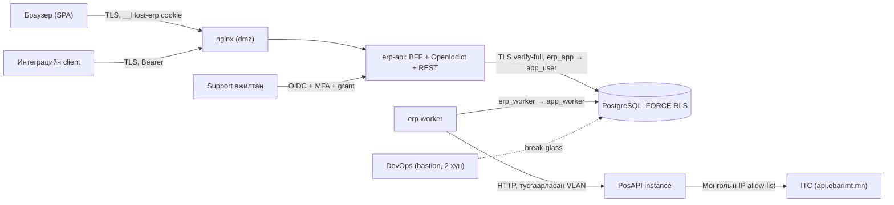
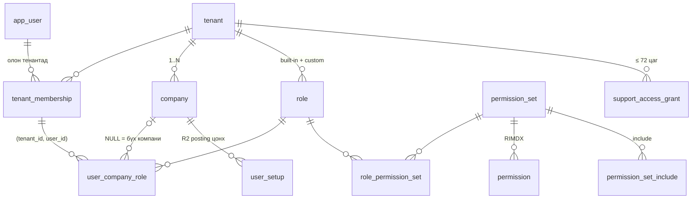
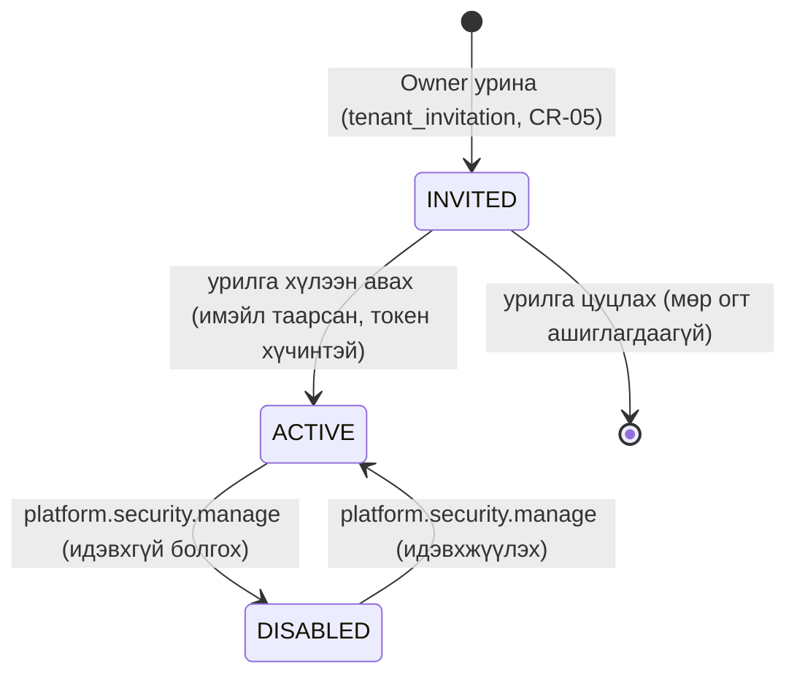
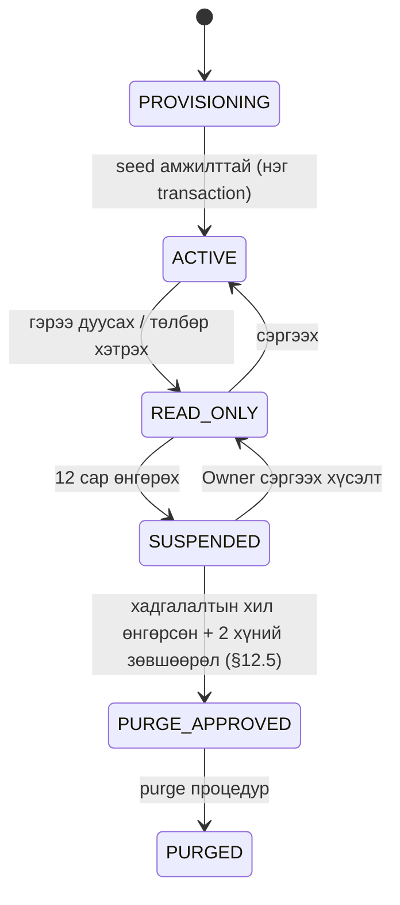

# 13. Аюулгүй байдал, эрх, олон тенант, аудит, хадгалалт ба нийцэл

> **Төлөв:** Хөгжүүлэлтэд бэлэн төсөл (draft for build). **Огноо:** 2026-10-06.
> **Хамрах хувилбар:** R1 (MVP) заавал; R2/R3-ийн зүйлийг тусад нь тэмдэглэсэн.
> **Эзэмшигч модуль:** Platform (`platform`, `audit`; `integration`-ийн job/outbox контекст хэсэг).
> **Эх сурвалжийн давамгайлал:** [DECISIONS.md](./DECISIONS.md) → батлагдсан ADR → [02-architecture.md](./02-architecture.md) → энэ баримт. DB-ийн нэрийн эх сурвалж нь [db/schema/*.sql](./db/schema/) (D-K1). Энэ баримт SQL файлыг засахгүй: схемд хэрэгтэй өөрчлөлтийг §21-д "Схемийн өөрчлөлтийн хүсэлт" (schema change request, CR) болгон бичсэн.
> **Холбогдох шаардлага:** FR-PLT-001…FR-PLT-021, FR-GL-023, FR-GL-024, FR-GL-027, FR-GL-028, FR-PTY-003, FR-PTY-004, FR-PTY-017, FR-INT-001…FR-INT-003, FR-RPT-017, NFR-030…NFR-036, NFR-040…NFR-044, NFR-050…NFR-054, NFR-090…NFR-094, NFR-100…NFR-102, CMP-004…CMP-007, CMP-024, CMP-026, CMP-029…CMP-031 ([01-requirements.md](./01-requirements.md)).

## Агуулга

1. [Хамрах хүрээ, дүрэм бичих хэлбэр](#1-хамрах-хүрээ-дүрэм-бичих-хэлбэр)
2. [Нэр томьёо](#2-нэр-томьёо)
3. [Аюулын загвар](#3-аюулын-загвар-threat-model)
4. [Identity загвар: хэрэглэгч, гишүүнчлэл, компанийн хандалт](#4-identity-загвар-хэрэглэгч-гишүүнчлэл-компанийн-хандалт)
5. [Нэвтрэлт (authentication)](#5-нэвтрэлт-authentication)
6. [Эрх (authorization)](#6-эрх-authorization)
7. [Олон тенант ба RLS контекст](#7-олон-тенант-ба-rls-контекст)
8. [Posting-ийн хязгаарлалт: үе ба түгжээ](#8-posting-ийн-хязгаарлалт-үе-ба-түгжээ)
9. [Аудит](#9-аудит)
10. [Хувь хүний мэдээлэл (PII)](#10-хувь-хүний-мэдээлэл-pii)
11. [Шифрлэлт ба нууцын менежмент](#11-шифрлэлт-ба-нууцын-менежмент)
12. [Хадгалалт (10 жил) ба архив](#12-хадгалалт-10-жил-ба-архив)
13. [Нөөц хуулбар ба сэргээх дасгал](#13-нөөц-хуулбар-ба-сэргээх-дасгал)
14. [СЯ-ны Order 47 (2018): нийцлийн шалгах хүснэгт](#14-ся-ны-order-47-2018-нийцлийн-шалгах-хүснэгт)
15. [Цахим анхан шатны баримтын гарын үсэг](#15-цахим-анхан-шатны-баримтын-гарын-үсэг)
16. [Зөрчлийн хариу арга хэмжээ (incident response)](#16-зөрчлийн-хариу-арга-хэмжээ-incident-response)
17. [Аюулгүй байдлын тест (OWASP ASVS 5.0 L2)](#17-аюулгүй-байдлын-тест-owasp-asvs-50-l2)
18. [Алдааны кодууд](#18-алдааны-кодууд)
19. [API endpoint-ууд](#19-api-endpoint-ууд)
20. [Хүлээн авах тест (acceptance tests)](#20-хүлээн-авах-тест-acceptance-tests)
21. [Схемийн өөрчлөлтийн хүсэлт](#21-схемийн-өөрчлөлтийн-хүсэлт-schema-change-requests)
22. [Нээлттэй асуулт](#22-нээлттэй-асуулт)
23. [Мөрдөх чадвар (traceability)](#23-мөрдөх-чадвар-traceability)

---

## 1. Хамрах хүрээ, дүрэм бичих хэлбэр

### 1.1 Хамрах хүрээ

| Орно (R1) | Орохгүй / хойшлуулсан |
|---|---|
| Глобал хэрэглэгч, тенантын гишүүнчлэл, компанийн хандалт | Approval workflow (D-I4, FR-PLT-020, R3) |
| OIDC (OpenIddict) + BFF cookie, TOTP MFA, step-up | ДАН (төрийн e-ID), гадаад IdP (Google, Microsoft), WebAuthn/passkey (R2-ийн санал) |
| BC-ийн permission set → object/action (RIMDX), 5 built-in role | BC-ийн security filter (мөрийн шүүлтүүр), exclude permission set, entitlement |
| Мөрийн түвшний цөөн дүрэм (§6.8) | Талбарын түвшний (field-level) эрх |
| RLS контекст: request, job, систем | Тенант бүрд тусдаа DB/схем |
| Үе, цонх, түгжээний хязгаарлалт (D-D3) | Хэрэглэгч бүрийн posting цонх (R2, `platform.user_setup`) — дүрмийг энд бичсэн |
| `audit.row_change`, `audit.posting_log`, `audit.security_event`, ledger-ийн аудитын мөр | Талбар бүрийн change log тохиргоо (BC T403/T404) |
| PII-ийн каталог, маск, шифрлэлт, unmask | Маркетингийн зөвшөөрлийн бүртгэл (FR-PTY-017, Could) — зөвхөн дүрэм |
| 10 жилийн хадгалалт, жилийн архив, нөөц ба сэргээх дасгал | HSM, BYOK (тенант өөрийн түлхүүр) |
| Order 47-ийн нийцлийн матриц, цахим гарын үсгийн загвар | PKI провайдерын эцсийн сонголт (тусдаа ADR) |
| Зөрчлийн хариу, OWASP ASVS 5.0 L2-ийн тест | — |

### 1.2 Дүрэм бичих хэлбэр

- **Дүрмийн ID:** `SEC-<хэсэг>-<дугаар>`. Хэсэг: `ID` (identity), `AUTH` (нэвтрэлт), `AZ` (эрх), `REC` (мөрийн түвшин), `RLS` (тенант, контекст, support), `JOB` (ажил), `POST` (posting-ийн хязгаар), `AUD` (аудит), `PII`, `KEY` (шифрлэлт, нууц, түлхүүр), `RET` (хадгалалт), `BAK` (нөөц), `SIG` (гарын үсэг). Бусад ID: `SEC-T-nn` (автомат тестийн багц, §17), `AT-SEC-nnn` (хүлээн авах тест, §20), `PB-nn` (зөрчлийн playbook, §16), `CR-nn` (схемийн өөрчлөлтийн хүсэлт, §21), `Qn` (нээлттэй асуулт, §22). Дүрэм бүр автомат тестээр шалгагдах ёстой (§17, §20).
- **"Заавал"** = MUST. **"Зөвлөмж"** = SHOULD.
- **Алдааны код:** `<module>.<snake_case>` хэлбэртэй, RFC 9457 `application/problem+json`-ийн `code` талбарт буцна ([02-architecture.md](./02-architecture.md) §5.3, [18-dev-setup.md](./18-dev-setup.md)). DB-ийн SQLSTATE (`ERP01`, `ERL01`, `ERT01` …) нь [db/README.md](./db/README.md)-ийнх. Харгалзааг §18-д өгсөн.
- **Хүлээн авах тест:** Gherkin-ийн монгол түлхүүр үг **Өгөгдсөн нь** (Given), **Хэрэв** (When), **Тэгэхэд** (Then), **Мөн** (And) ([01-requirements.md](./01-requirements.md) §1.5).
- **Огноо ба цаг:** timestamp нь `timestamptz` (UTC). Бизнесийн огноо ба "өнөөдөр" нь `Asia/Ulaanbaatar` бүсээр (`IBusinessCalendar`).

### 1.3 Баримтуудын зөрүүг шийдсэн байдал

Энэ баримтыг бичихэд илэрсэн зөрүүг доорх байдлаар шийдсэн. Холбогдох баримтыг эзэмшигч нь засна.

| # | Зөрүү | Энэ баримтын шийдвэр | Үндэслэл |
|---|---|---|---|
| Z1 | 02 §7.5, ADR-0004-д DB role `erp_owner`, `erp_app`, `erp_worker`, `erp_dispatch_definer`; схемд `app_owner`, `app_user`, `app_worker`, `app_readonly`, `app_rls_bypass` | Схемийн group role-ийг ашиглана. Login role (`erp_*`) нь group role-ийн гишүүн (`000_extensions_roles.sql`). `erp_dispatch_definer` = `app_rls_bypass` | D-K1 |
| Z2 | 02 §10.2-т 7 role (ChiefAccountant, Cashier, Auditor г.м.) | 5 built-in role: `OWNER`, `ACCOUNTANT`, `SALES_CLERK`, `VIEWER`, `EXTERNAL_ACCOUNTANT`. Бусдыг тенант custom role болгон үүсгэнэ (§6.5-ын загвар) | D-I2, 01 §6 #3 |
| Z3 | 02 §6.9, ADR-0023 A-д үеийн 4 төлөв | `OPEN` / `CLOSED` / `LOCKED` (схем ба D-D3). Closed-ийг зөвхөн Owner нээнэ | D-D3, 01 §6 #2 |
| Z4 | ADR-0004 #7: компанийн тусгаарлалт RLS-ээр биш | Схемд `company_id NOT NULL` хүснэгт бүр **RESTRICTIVE** `company_isolation` policy-тэй (`900_rls.sql`). Энэ баримт схемийг дагана | D-K1 |
| Z5 | 02 §7.7: гэрээ дууссаны дараа 12 сар READ_ONLY → экспорт баталгаажуулбал purge | Хадгалалтын хугацаа (10 жил) дуусахаас өмнө purge хийхгүй. Эрт purge-ийг хуульчийн дүгнэлт гартал хаалттай (§12.5, Q2) | D-I3, FR-PLT-018 AC2 |
| Z6 | 02 §8.7 ба FR-GL-028-д `gl_register`-ийн hash chain; схемд багана алга | CR-15 (§21). Hash chain хэрэгжих хүртэл шөнийн шалгалт нь Σ=0 ба `entry_no`-ийн завсаргүй байдлыг л шалгана | D-K1 |
| Z7 | 02 §4.2.1-д `identity` схем, `platform.tenant_secret`, `platform.attachment`, `platform.tenant_purge_log`; схемд алга | CR-03, CR-07, CR-18, CR-22, CR-17 | D-K1 |
| Z8 | 02 §7.6 ба ADR-0004: аудитын `changed_by = 'system:<job>'` | `changed_by` нь `uuid`. Системийн ажилд тогтмол **системийн principal** (`00000000-0000-7000-8000-000000000001`) ба `app.request_id = 'job:<job_run_id>'` ашиглана (CR-09) | Схемийн төрөл |
| Z9 | [db/seed/mn_00_catalogs.sql](./db/seed/mn_00_catalogs.sql)-д системийн 30 permission set (`ERP_*`) ба ACTION/REPORT-ийн нэр аль хэдийн бий; 02 §10.2-ын нэр (`ERP SALES DOC, POST` г.м.) өөр | Seed-ийн код ба нэрийг суурь болгоно (§6.3–§6.4). Энэ баримтын шаардсан нэмэлт/өөрчлөлтийг (шинэ set, Sales clerk-ийн кредит нот, аюулгүй байдлын лог зөвхөн Owner, `ERP_SUPER`) CR-23-аар | D-K1 (db/ = нэрийн эх) |

---

## 2. Нэр томьёо

| Нэр томьёо | English | Энэ баримт дахь утга |
|---|---|---|
| Principal | Principal | Хүсэлт гаргагч субьект: хүн хэрэглэгч, интеграцийн client, системийн principal, support ажилтан |
| Тенант | Tenant | SaaS-ийн захиалагч данс, RLS-ийн хил (`platform.tenant`) |
| Гишүүнчлэл | Membership | Хэрэглэгч ↔ тенант (`platform.tenant_membership`) |
| Компанийн хандалт | Company access | (хэрэглэгч, компани, role) мөр (`platform.user_company_role`); `company_id NULL` = тенантын бүх компани |
| Эрхийн багц | Permission set | Object/action-ийн RIMDX эрхийн нэрлэсэн багц (`platform.permission_set`, `platform.permission`) |
| Role | Role | Permission set-үүдийн багц (`platform.role`, `platform.role_permission_set`) |
| Үр дүнгийн эрх | Effective permissions | Тухайн (principal, тенант, компани)-д хэрэгжих эрхийн нэгдсэн жагсаалт (§6.7) |
| Онцгой эрх | Privileged permission | MFA шаарддаг эрх (§5.6) |
| Step-up (дахин баталгаажуулалт) | Step-up / re-authentication | Сүүлийн 15 минутад MFA эсвэл нууц үгээ дахин баталсан байх шаардлага (§5.7) |
| Контекст | Request context | `app.tenant_id`, `app.company_id`, `app.user_id`, `app.request_id` transaction-local тохиргоо (§7.3) |
| Системийн principal | System principal | Хуваарьт ажилд зориулсан тогтмол `app_user` мөр, нэвтрэх боломжгүй (CR-09) |
| PII-S | Sensitive identifier | Иргэний регистрийн дугаар ба хувь хүн харилцагчийн `civil_id` (§10.1) |
| PII-P | Personal data | Бусад хувь хүний мэдээлэл: нэр, утас, имэйл, хаяг, `consumerNo`, IP г.м. (§10.1) |
| Blind index | Blind index | PII-S-ийн HMAC-SHA256 утга; зөвхөн яг тэнцүүгээр хайхад (§10.6) |
| DEK / KEK | Data / key encryption key | Тенантын өгөгдлийн түлхүүр ба түүнийг ороогч үндсэн түлхүүр (§11.3) |
| Хадгалалтын хил | Retention horizon | Өгөгдлийг устгаж болох хамгийн эрт огноо (§12.2) |
| Архивын багц | Archive package | Жилийн хуулийн архив (PDF, CSV, manifest) (§12.6) |
| Каноник хувилбар | Canonical rendition | Гарын үсэг зурсан, object storage-д өөрчлөгдөхгүй хадгалсан PDF (§15.3) |

---

## 3. Аюулын загвар (threat model)

### 3.1 Хамгаалах хөрөнгө

1. **Ledger ба posted баримт** — бүрэн бүтэн байдал (integrity). Order 47: "гүйлгээг нуух, засах боломжгүй".
2. **Тенант хоорондын тусгаарлалт** — нэг тенантын өгөгдөл өөр тенантад харагдах ёсгүй.
3. **Хувь хүний мэдээлэл** — ХХМХТХ (2021), CMP-029.
4. **Нэвтрэх эрх ба түлхүүр** — нууц үг, MFA, OIDC түлхүүр, KEK, DB нууц үг, PosAPI операторын нууц.
5. **eBarimt-ийн хуулийн үүрэг** — баримтыг 72 цагт илгээх (CMP-023); `qrData`/`lottery` хадгалахгүй (D-J3).
6. **Хүртээмж ба нөөц** — RPO/RTO (NFR-090…NFR-094).

### 3.2 Итгэлцлийн хил (trust boundary)



### 3.3 Гол аюул ба хяналт (STRIDE-ийн товч)

| # | Аюул | Жишээ | Хяналт (энэ баримт) |
|---|---|---|---|
| T1 | Хуурамчаар нэвтрэх (spoofing) | Credential stuffing, нууц үг таах | Lockout, rate limit, MFA (§5), алдагдсан нууц үгийн жагсаалт |
| T2 | Тенантын хил зөрчих | Id таамаглах, query-д `tenant_id` мартах | Тенант зөвхөн session-оос; FORCE RLS fail-closed; 404 (§6.7, §7) |
| T3 | Эрх нэмэгдүүлэх (elevation) | Accountant өөртөө Owner role өгөх | Privilege escalation дүрэм, step-up, last-owner guard (§6.9) |
| T4 | Ledger өөрчлөх (tampering) | Шууд SQL `UPDATE gl.gl_entry` | REVOKE + guard trigger + COMMIT-ийн Σ=0 шалгалт (`910_ledger_guards.sql`), шөнийн шалгалт (§9.4) |
| T5 | Үйлдлээ үгүйсгэх (repudiation) | "Би энэ нэхэмжлэхийг батлаагүй" | `created_by`, `gl_register`, `audit.posting_log`, `audit.security_event`, гарын үсэг (§9, §15) |
| T6 | Мэдээлэл задрах | Лог, trace, экспорт, нөөцөөр PII гарах | Redaction, маск, PII-S шифрлэлт, шифрлэсэн нөөц (§10, §11) |
| T7 | Үйлчилгээ зогсоох | Хэт их тайлан, posting lock | Rate limit, `statement_timeout`, async тайлан (02 §10.3) |
| T8 | Дотоод хүний буруу үйлдэл | Support ажилтан өгөгдөл үзэх | Хугацаатай grant, banner, лог; break-glass 2 хүн (§7.9) |
| T9 | DB-ийн нууц үг алдагдах | `erp_app`-ийн нууц үг | `app.tenant_id` GUC-ийг client өөрөө тохируулж чаддаг тул DB нууц үг = бүх тенант (SEC-RLS-08); сүлжээний тусгаарлалт, `/run/secrets`, 180 хоногийн солилт |
| T10 | eBarimt-ийн хориг зөрчих | `qrData` лог руу орох | DB CHECK (`fn_has_forbidden_ebarimt_keys`), redaction, canary тест (NFR-041) |

---

## 4. Identity загвар: хэрэглэгч, гишүүнчлэл, компанийн хандалт

### 4.1 Бүтэц



- **`platform.app_user`** — глобал identity (BC User 2000000120). Нэг хүн = нэг мөр, `email` давтагдашгүй, жижиг үсгээр. Нууц үг, MFA-ийн нууц, session нь **identity store**-д (CR-03), `platform.app_user`-д биш.
- **`platform.tenant_membership`** — хэрэглэгчийг тенантад холбоно. Төлөв `INVITED` / `ACTIVE` / `DISABLED`.
- **`platform.user_company_role`** — BC Access Control (2000000053)-ийн хувилбар: (хэрэглэгч, компани, role). `company_id NULL` нь тенантын **одоогийн ба ирээдүйн** бүх компани.
- **`platform.role`** — тенантын түвшний role (built-in эсвэл custom). **`platform.permission_set`** — `tenant_id NULL` бол системийн (бүтээгдэхүүнтэй хамт ирсэн, тенант засахгүй), эс бөгөөс тенантын custom set.

### 4.2 Principal-ийн төрөл

| Principal | Хаана бүртгэгдэх | `app.user_id` | Нэвтрэх арга | Тайлбар |
|---|---|---|---|---|
| Хүн хэрэглэгч (human user) | `platform.app_user` + identity store | `app_user.id` | OIDC code + PKCE (BFF) | Глобал, олон тенантын гишүүн байж болно |
| Интеграцийн client (service principal) | OpenIddict application + `platform.integration_client` (CR-08) | `integration_client.id` | `client_credentials` | Нэг тенант, сонголтоор нэг компани |
| Системийн principal | `platform.app_user` тогтмол мөр (CR-09) | `00000000-0000-7000-8000-000000000001` | Нэвтрэхгүй | Хуваарьт ба outbox-ийн ажил |
| Support ажилтан | `platform.app_user` + `platform.platform_operator` (CR-09) | `app_user.id` | OIDC + MFA заавал | Тенантын гишүүн биш. Зөвхөн `platform.support_access_grant`-аар |
| Migrator | DB login `erp_migrator` | — (migration: `NULL`) | DB | Апп-д нэвтрэхгүй |

### 4.3 Гишүүнчлэлийн төлөвийн машин



Урилга нь `platform.tenant_invitation` (CR-05)-д хадгалагдана. Урьсан имэйл аль хэдийн бүртгэлтэй хэрэглэгчийнх бол `tenant_membership` мөр `INVITED` төлөвтэй үүсч болно; бүртгэлгүй бол зөвхөн урилгын мөр үүсэх ба хүлээн авахад гишүүнчлэл шууд `ACTIVE` болно (§4.7).

### 4.4 Дүрэм (SEC-ID)

| ID | Дүрэм |
|---|---|
| SEC-ID-01 | `app_user.email` нь глобал давтагдашгүй, жижиг үсгээр (`CHECK (email = lower(email))`). Имэйл солихдоо шинэ хаягийг баталгаажуулж, step-up хийнэ (§5.7). |
| SEC-ID-02 | Хэрэглэгч тенантад зөвхөн `tenant_membership.status = 'ACTIVE'` үед хандана. `INVITED`, `DISABLED` бол тенантын жагсаалтад харагдахгүй, тухайн тенантын API бүр `404 platform.tenant_not_found`. |
| SEC-ID-03 | Компанид хандах эрх зөвхөн `user_company_role` мөрөөр үүснэ. `company_id NULL` = тенантын бүх компани (шинээр үүссэн компани ч). Role-гүй гишүүн тенантад нэвтэрч чадна, гэхдээ компанийн жагсаалт хоосон байна. |
| SEC-ID-04 | Олон role-ийн эрх нийлбэрээр (union) нэгдэнэ. "Хориглох" (deny) эрх байхгүй (BC-ийн exclude дэмжихгүй). |
| SEC-ID-05 | `OWNER` role-ийг зөвхөн `company_id NULL`-тэй ононо. Компанид хязгаарласан Owner → `422 platform.owner_must_be_tenant_wide`. |
| SEC-ID-06 | **Сүүлийн Owner-ийг хамгаалах** (FR-PLT-006, BC R-08). Тенант үргэлж ≥ 1 "идэвхтэй Owner"-той байна: `tenant_membership.status = 'ACTIVE'`, `app_user.status = 'ACTIVE'`, `OWNER` role-той (`company_id NULL`, хугацаа дуусаагүй). Owner role хасах, гишүүнчлэл идэвхгүй болгох, тенантаас гарах үйлдэл үүнийг зөрчвөл `409 platform.last_owner`. Шалгалт `SELECT … FROM platform.tenant WHERE id = @t FOR UPDATE`-ээр түгжинэ (уралдаанаас сэргийлнэ, §4.6). |
| SEC-ID-07 | **External accountant-ийн хугацаа.** `user_company_role.expires_at` (CR-02) байвал тэр цагаас хойш тухайн мөрийн эрх тооцогдохгүй. Мөрийг устгахгүй (аудит). 7 хоногийн өмнө Owner-т мэдэгдэл илгээнэ. Анхдагч: хоосон (хугацаагүй); UI 12 сар санал болгоно. |
| SEC-ID-08 | **Урилга** (CR-05): токен 32 санамсаргүй байт (base64url), DB-д зөвхөн SHA-256 hash. Хүчинтэй хугацаа 7 хоног, нэг удаагийн. Хүлээн авагчийн **баталгаажсан** имэйл урьсан имэйлтэй (жижиг үсгээр) таарах ёстой, эс бөгөөс `403 platform.invitation_email_mismatch`. Хүчингүй/ашигласан токен → `410 platform.invitation_invalid`. |
| SEC-ID-09 | Нэг тенант өдөрт ≤ 20 урилга илгээнэ (`429 platform.rate_limited`). |
| SEC-ID-10 | Гишүүнчлэлийг `DISABLED` болгоход тухайн хэрэглэгчийн тухайн тенантын эрх **≤ 60 секундэд** алга болно: transaction дотор `pg_notify('erp_cache', '<tenant_id>:<user_id>')` (02 §7.3), session-ий `erp_tid` энэ тенант бол session-ийг тенантгүй болгоно. |
| SEC-ID-11 | `app_user.status` (`DISABLED`, `LOCKED`)-ийг зөвхөн платформын оператор өөрчилнө (CR-11). Тенантын Owner глобал профайлыг засахгүй, зөвхөн өөрийн тенантын гишүүнчлэлийг удирдана. |
| SEC-ID-12 | Хэрэглэгчийн өөрийн профайл (`display_name`, `phone`, `preferred_language`)-ийг зөвхөн тэр өөрөө засна (`app_user_self_update` RLS policy). |
| SEC-ID-13 | `app_user` мөрийг физикээр устгахгүй: `created_by`, `changed_by`, гарын үсэгт 10 жил иш татагдана. Хэрэглэгч бүх гишүүнчлэлээ дуусгаснаас хойш хадгалалтын хил өнгөрвөл нэргүйжүүлнэ (§10.8). |
| SEC-ID-14 | Тенант үүсгэх (FR-PLT-001) нь имэйл баталгаажсан хэрэглэгчид л боломжтой. Үүсгэгч `OWNER` болно. MFA тохируулаагүй бол компанид хандахаас өмнө тохируулна (SEC-AUTH-10). |
| SEC-ID-15 | Support ажилтан тенантын гишүүн биш. Тенантад зөвхөн хүчинтэй `support_access_grant`-аар хандана (§7.9). |
| SEC-ID-16 | `INVITED` төлөвтэй, огт идэвхжээгүй гишүүнчлэл ба урилгыг устгаж болно. `ACTIVE`/`DISABLED` гишүүнчлэлийг устгахгүй (`user_company_role` ба аудит иш татна). |

### 4.5 Компанийн хандалтыг тодорхойлох алгоритм

```text
function ResolveCompanyAccess(userId, tenantId, companyId, now):
    m := SELECT status FROM platform.tenant_membership
         WHERE tenant_id = tenantId AND user_id = userId          -- RLS: app.tenant_id = tenantId
    if m is null or m.status <> 'ACTIVE':
        return NOT_FOUND                                          -- 404 platform.tenant_not_found
    c := SELECT status FROM platform.company WHERE tenant_id = tenantId AND id = companyId
    if c is null:
        return NOT_FOUND                                          -- 404 platform.company_not_found
    rows := SELECT role_id FROM platform.user_company_role
            WHERE tenant_id = tenantId AND user_id = userId
              AND (company_id IS NULL OR company_id = companyId)
              AND (expires_at IS NULL OR expires_at > now)        -- CR-02
    if rows is empty:
        return NOT_FOUND                                          -- компани байгааг илчлэхгүй
    return rows.role_ids
```

### 4.6 Сүүлийн Owner-ийн шалгалт

```text
function AssertOwnerRemains(tenantId, change):            -- change: role revoke / member disable / leave
    -- нэг transaction дотор, өөрчлөлтийг хийхээс өмнө
    SELECT 1 FROM platform.tenant WHERE id = tenantId FOR UPDATE      -- semaphore
    owners := SELECT DISTINCT ucr.user_id
              FROM platform.user_company_role ucr
              JOIN platform.role r ON r.tenant_id = ucr.tenant_id AND r.id = ucr.role_id AND r.code = 'OWNER'
              JOIN platform.tenant_membership m ON m.tenant_id = ucr.tenant_id AND m.user_id = ucr.user_id
              JOIN platform.app_user u ON u.id = ucr.user_id
              WHERE ucr.tenant_id = tenantId AND ucr.company_id IS NULL
                AND (ucr.expires_at IS NULL OR ucr.expires_at > now())
                AND m.status = 'ACTIVE' AND u.status = 'ACTIVE'
    remaining := owners − change.affectedOwners
    if remaining is empty: raise 409 platform.last_owner
```

### 4.7 Урилга хүлээн авах

```text
POST /bff/invitations:accept { token }
    require authenticated user with email_confirmed = true
    h := SHA256(base64url_decode(token))
    inv := platform.fn_find_invitation(h)                      -- SECURITY DEFINER, CR-04 (тенантын контекстгүй)
    if inv is null or inv.expires_at <= now() or inv.accepted_at is not null or inv.revoked_at is not null:
        raise 410 platform.invitation_invalid
    if lower(inv.email) <> currentUser.email: raise 403 platform.invitation_email_mismatch
    platform.fn_accept_invitation(h, currentUser.id)           -- membership ACTIVE + user_company_role мөрүүд, нэг transaction
    audit.fn_log_security_event(inv.tenant_id, NULL, 'MEMBERSHIP_ACCEPTED', currentUser.id)
    session.erp_tid := inv.tenant_id                           -- шинэ sid (SEC-AUTH-17)
```

---

## 5. Нэвтрэлт (authentication)

### 5.1 Бүрэлдэхүүн

- **Хэрэглэгчийн сан:** ASP.NET Core Identity ([ADR-0016](./adr/ADR-0016-auth-openiddict-bff.md)). Хүснэгт нь `identity` схемд (CR-03), `platform.app_user.id`-тэй 1:1.
- **OIDC сервер:** OpenIddict, `erp-api` процесс дотор. Нэвтрэх, MFA, нууц үг сэргээх хуудсыг сервер талд (Razor) рендерлэнэ; SPA нууц үг харахгүй.
- **BFF (backend for frontend):** SPA-д токен очихгүй. Браузерт зөвхөн `__Host-erp` cookie байна. Токен ба authentication ticket нь `identity.user_session`-д Data Protection-оор шифрлэгдэж хадгалагдана.

| Client | Төрөл | Flow | Scope | Токены хугацаа |
|---|---|---|---|---|
| `erp-bff` | Confidential | Authorization code + PKCE (`S256`) | `openid profile email offline_access erp.api` | Access 10 мин; refresh 8 цаг, эргэлддэг (rolling) |
| `erp-mobile` (R3) | Public | Authorization code + PKCE | Ижил | Ижил |
| `int-<uuid>` (интеграц) | Confidential | `client_credentials` | `erp.api` | Access 10 мин; refresh байхгүй |

**Хориотой flow:** implicit, resource owner password, device code (R1). OpenIddict-ийн тохиргоонд идэвхжүүлэхгүй.

### 5.2 Параметрүүд

| Параметр | Утга | Эх |
|---|---|---|
| Нууц үгийн урт | 10…128 тэмдэгт (Unicode, NFKC-ээр нормчилно) | ADR-0016 |
| Нууц үгийн бүтцийн шаардлага (том үсэг, тоо г.м.) | **Байхгүй** | ASVS 5.0 V6 |
| Алдагдсан нууц үгийн шалгалт | Локал жагсаалт (≥ 100 000 түгээмэл/алдагдсан нууц үг) + имэйл, тенантын нэр, "erp" агуулсан нууц үг хориотой. Гадаад API руу илгээхгүй | 02 §10.1 (SHOULD → R1-д заавал) |
| Нууц үгийн hash | ASP.NET Core Identity v3 (PBKDF2-HMAC-SHA512), iteration ≥ 100 000 | ADR-0016 |
| Нууц үгийн хугацаа (expiry) | Байхгүй. Алдагдсан гэж сэжиглэвэл л солиулна | ASVS 5.0 V6 |
| Lockout | Дараалсан 5 буруу оролдлого (нууц үг эсвэл MFA код) → 15 мин | FR-PLT-007 |
| Rate limit (нэвтрэх) | Нэг имэйлд мин 5, нэг IP-ээс мин 20 | NFR-036 |
| Session | Идэвхгүй 60 мин; хамгийн урт 12 цаг | FR-PLT-007 |
| Нэг хэрэглэгчийн зэрэг session | ≤ 10; 11 дэх нь хамгийн хуучныг хүчингүй болгоно | Шинэ |
| TOTP | RFC 6238, HMAC-SHA1, 6 орон, 30 s алхам, цонх ±1 алхам; нууц 160 бит | ADR-0016 |
| Сэргээх код (recovery code) | 10 ширхэг, тус бүр 10 тэмдэгт, нэг удаагийн, hash-аар хадгална | ADR-0016 |
| Step-up-ийн цонх | 15 мин | Шинэ |
| Имэйл баталгаажуулах токен | 24 цаг, нэг удаагийн | Шинэ |
| Нууц үг сэргээх токен | 60 мин, нэг удаагийн; цагт ≤ 3 хүсэлт нэг имэйлд | Шинэ |
| Урилгын токен | 7 хоног (SEC-ID-08) | Шинэ |
| OIDC гарын үсгийн түлхүүр | ES256, 90 хоног тутам, хуучнаар ≥ 8 цаг шалгана | ADR-0016 |

### 5.3 Flow A: бүртгүүлэх ба имэйл баталгаажуулах

1. `GET /account/register` → имэйл, нэр, нууц үг. Нууц үгийн дүрмийг (§5.2) сервер шалгана.
2. Имэйл аль хэдийн бүртгэлтэй бол **ижил хариу** ("Баталгаажуулах имэйл илгээлээ") өгч, бүртгэлтэй хаяг руу "Таны имэйлээр бүртгүүлэх оролдлого хийгдлээ" мэдэгдэл илгээнэ (хэрэглэгч тоолох (enumeration) боломжгүй).
3. Баталгаажуулах холбоос (24 цаг) дарахад `email_confirmed = true`. `audit.fn_log_security_event(NULL, NULL, 'EMAIL_VERIFIED', userId)`.
4. Баталгаажаагүй хэрэглэгч тенант үүсгэх, урилга хүлээн авах боломжгүй (`403 platform.email_not_verified`).

### 5.4 Flow B: интерактив нэвтрэлт (BFF + code + PKCE)

```mermaid
sequenceDiagram
    autonumber
    participant SPA as Браузер (SPA)
    participant BFF as erp-api /bff
    participant OP as erp-api OpenIddict /connect
    participant UI as erp-api /account (Razor)
    participant DB as identity + platform
    SPA->>BFF: GET /bff/login?returnUrl=/
    BFF->>OP: 302 /connect/authorize (client_id=erp-bff, code_challenge S256, state, nonce)
    OP->>UI: хэрэглэгч нэвтрээгүй → /account/login
    UI->>DB: имэйлээр хэрэглэгч, lockout, PBKDF2 шалгах
    alt буруу
        UI-->>SPA: "Имэйл эсвэл нууц үг буруу" (ерөнхий мессеж) + LOGIN_FAILED
    else MFA идэвхтэй
        UI->>SPA: /account/mfa (TOTP эсвэл сэргээх код)
        SPA->>UI: код
        UI->>DB: TOTP шалгах, давтан ашиглалтыг хориглох
    end
    UI->>OP: authentication cookie (зөвхөн /connect, /account зам)
    OP-->>BFF: 302 /bff/signin-oidc?code=…&state=…
    BFF->>OP: POST /connect/token (code, code_verifier, client secret)
    OP-->>BFF: id_token, access_token (10 мин), refresh_token
    BFF->>DB: identity.user_session (шифрлэсэн ticket, amr, auth_time)
    BFF-->>SPA: Set-Cookie __Host-erp=<sid>; HttpOnly; Secure; SameSite=Strict; Path=/
    SPA->>BFF: GET /bff/user, GET /bff/tenants
```

- `amr` claim: `pwd`; MFA хийсэн бол мөн `mfa` ба `otp`. `auth_time` нь нэвтэрсэн цаг.
- Нэвтрэлт амжилттай бол `LOGIN_SUCCEEDED` (тенант сонгогдоогүй тул `tenant_id NULL`, `audit.fn_log_security_event`-ээр), `app_user.last_login_at` шинэчлэгдэнэ.

### 5.5 Flow C: тенант сонгох ба солих

1. `GET /bff/tenants` → `platform.fn_list_user_tenants(userId)` (CR-04, SECURITY DEFINER). Зөвхөн `ACTIVE` гишүүнчлэлтэй, тенантын төлөв `ACTIVE`/`READ_ONLY` тенантууд: `(tenant_id, name, status)`.
2. Нэг л тенант бол автоматаар сонгоно. Олон бол SPA жагсаалт харуулна.
3. `POST /bff/switch-tenant { tenantId }` (`X-CSRF: 1`):
   - гишүүнчлэл `ACTIVE` эсэхийг шалгана, эс бөгөөс `404 platform.tenant_not_found`;
   - шинэ session id (`sid`) үүсгэж, хуучныг хүчингүй болгоно (session fixation-оос сэргийлнэ);
   - `erp_tid` = tenantId; `amr`, `auth_time`-ийг хадгална;
   - `TENANT_ENTERED` (`tenant_id` = шинэ тенант) бичнэ. Автоматаар сонгогдсон үед ч ижил.
4. Тенантад MFA шаардлагатай (§5.6) боловч хэрэглэгч MFA-гүй бол бүх тенантын API `403 platform.mfa_enrollment_required` (`enrollUrl`-тэй) буцаана. Зөвхөн `/api/v1/me/*` ба `/account/mfa/*` ажиллана.

### 5.6 MFA (TOTP)

**Хэнд заавал (SEC-AUTH-10):** идэвхтэй тенантад дараах нөхцлийн аль нэг биелсэн хэрэглэгч:
- `OWNER`, `ACCOUNTANT`, `EXTERNAL_ACCOUNTANT` role-той (тенантын аль нэг компанид) — FR-PLT-007;
- custom role-оор MFA-тэмдэгтэй эрхийн аль нэгийг авсан (§6.3-ын "MFA" багана: аюулгүй байдал, тенантын удирдлага, компанийн тохиргоо, үе хаах/нээх/түгжих, PII unmask, бүрэн экспорт, баталгаажуулах гарын үсэг, НӨАТ-ын үе илгээх).

`SALES_CLERK`, `VIEWER`-т сонголттой. Тенантын "бүх хэрэглэгчид MFA" бодлого R2-т (CR-19).

**Бүртгэх (enrollment):**
1. `POST /api/v1/me/mfa/totp:begin` (step-up: нууц үг дахин) → 160 бит нууц, `otpauth://` URI (QR-ийг SPA локалд үүсгэнэ, гадаад QR сервис ашиглахгүй).
2. `POST /api/v1/me/mfa/totp:confirm { code }` → код зөв бол MFA идэвхжинэ, 10 сэргээх код **нэг удаа** харуулна. `MFA_ENROLLED`.
3. TOTP нууцыг Data Protection-оор шифрлэж хадгална; сэргээх кодыг hash-аар (ASP.NET Core Identity-ийн анхдагч store нь эдгээрийг энгийн текстээр хадгалдаг эсэхийг шалгаж, шаардлагатай бол store-ийг override хийнэ).

**Шалгах:** код ±1 алхмын цонхонд; хамгийн сүүлд хүлээн авсан алхмаас бага эсвэл тэнцүү алхмыг татгалзана (replay). Буруу код lockout-ийн тоолуурт орно. Сэргээх код ашиглавал `MFA_RECOVERY_CODE_USED` ба хэрэглэгчид имэйл мэдэгдэл.

**Унтраах/солих:** step-up шаардана; MFA заавал хэрэглэгч унтраах боломжгүй (`409 platform.mfa_required_by_role`), зөвхөн шинэ төхөөрөмж бүртгэж солино. `MFA_DISABLED`/`MFA_ENROLLED`.

**Төхөөрөмж ба сэргээх кодоо хоёуланг нь алдсан:** хэрэглэгч өөрөө сэргээх боломжгүй. Платформын support:
1. имэйлийн эзэмшлийг шалгана (нэг удаагийн холбоос);
2. хэрэглэгч гишүүн тенантын **өөр** идэвхтэй Owner бичгээр (UI-ийн хүсэлтээр) баталгаажуулна; ганц Owner бол хувийн баримт бичгээр биечлэн шалгах журам (Q9);
3. `MFA_RESET_BY_SUPPORT` бичиж, бүх session-ийг хүчингүй болгоно; дараагийн нэвтрэлтэд дахин бүртгүүлнэ.

### 5.7 Step-up (дахин баталгаажуулалт)

Дараах үйлдэлд `session.recent_auth_at ≥ now() − 15 мин` заавал (SEC-AUTH-12). Эс бөгөөс `403 platform.reauth_required`. SPA `POST /api/v1/me:reauth { totp | password }` дуудаж, амжилттай бол `recent_auth_at = now()` (MFA-тай хэрэглэгч TOTP-оор, MFA-гүй нь нууц үгээр).

| Үйлдэл | Permission / endpoint |
|---|---|
| Нууц үг, имэйл солих; MFA унтраах/солих; сэргээх код шинэчлэх | `/api/v1/me/*` |
| `OWNER` role эсвэл MFA-тэмдэгтэй эрхтэй role оноох/хасах | `platform.security.manage` (`/role-assignments`) |
| Owner-ийн гишүүнчлэлийг идэвхгүй болгох | `platform.security.manage` (`/members/{id}:disable`) |
| Support-д `READ_WRITE` эрх олгох | `platform.security.manage` (`/support-grants`) |
| Интеграцийн client үүсгэх, нууц шинэчлэх | `platform.security.manage` (`/integration-clients`) |
| Тенантын бүрэн экспорт | `platform.data.export` |
| PII задлах | `platform.pii.unmask` |
| Үе дахин нээх, үе/жил түгжих, НӨАТ-ын үеийг "илгээсэн" болгох | `gl.period.reopen`, `gl.period.lock`, `tax.vat_return.submit` |
| Баримтад гарын үсэг зурах | `platform.document.sign`, `platform.document.approve_sign` (`mfa_verified_at` хадгална) |
| Тенант хаах, компани архивлах | `platform.tenant.manage`, `platform.company.archive` |

### 5.8 Flow D: нууц үг сэргээх, солих

1. `POST /account/forgot-password { email }` → үргэлж ижил хариу. Бүртгэлтэй бол 60 минутын нэг удаагийн токентой имэйл (`PASSWORD_RESET_REQUESTED`).
2. `POST /account/reset-password { token, newPassword }` → нууц үгийн дүрэм; амжилттай бол **бүх session ба refresh token хүчингүй**, `security_stamp` шинэчлэгдэнэ (`PASSWORD_RESET_COMPLETED`), хэрэглэгчид мэдэгдэл.
3. MFA идэвхтэй хэрэглэгч нууц үг сэргээсний дараа нэвтрэхдээ MFA-гаа заавал оруулна (MFA-г тойрохгүй).
4. Нэвтэрсэн хэрэглэгч солих: одоогийн нууц үг + step-up; бусад session хүчингүй (одоогийнх хэвээр).

### 5.9 Flow E: интеграцийн client (`client_credentials`)

1. Owner `POST /api/v1/tenant/integration-clients { name, companyId?, permissionSetId, expiresAt? }` (step-up). Permission set нь Owner-ийн эрхийн дэд олонлог байх ёстой (SEC-AZ-15). `ERP_SUPER` set оноохгүй.
2. Сервер `client_id = int-<uuid>`, нууц ≥ 256 бит санамсаргүй үүсгэнэ; нууцыг **нэг л удаа** харуулна; OpenIddict client secret-ийг hash-аар хадгална. Хугацаа анхдагч 12 сар, дээд 24 сар.
3. Токен хүсэлт: `POST /connect/token grant_type=client_credentials` → access token (10 мин), claim: `sub = integration_client.id`, `erp_tid`, `erp_cid` (компани хязгаартай бол), `client_id`.
4. API хүсэлт бүрд: client `revoked_at IS NULL`, `expires_at > now()`, тенант `ACTIVE`; компани хязгаартай бол замын `{companyId}` таарах, эс бөгөөс `404 platform.company_not_found`.
5. Цуцлах: `POST /api/v1/tenant/integration-clients/{id}:revoke` → шинэ токен олгохгүй; одоо байгаа access token ≤ 10 минутад дуусна (introspection-гүй загвар). `INTEGRATION_CLIENT_REVOKED`.
6. Client-ийн хийсэн өөрчлөлт аудитад `changed_by = integration_client.id` хэлбэрээр бичигдэнэ.

### 5.10 Flow F: гарах, session хүчингүй болгох

- `POST /bff/logout` → `identity.user_session` мөр устгагдаж, refresh token revoke, cookie арилна (`LOGOUT`).
- `POST /api/v1/me/sessions:revoke-all` → бүх session (одоогийнхоос бусад) хүчингүй (`SESSION_REVOKED`).
- Автомат хүчингүй болох: нууц үг солих/сэргээх, MFA reset, `app_user.status ≠ ACTIVE`, refresh token-ийг дахин ашигласан (reuse detection: эргэлдсэн refresh token-ийг хоёр дахь удаа ашиглавал тухайн session-ий бүх токен хүчингүй, `REFRESH_TOKEN_REUSE` P2 alert).

### 5.11 Cookie, CSRF, CORS

| ID | Дүрэм |
|---|---|
| SEC-AUTH-01 | Cookie `__Host-erp`: `HttpOnly`, `Secure`, `SameSite=Strict`, `Path=/`, `Domain` байхгүй. Утга нь 256 бит санамсаргүй session id; DB-д зөвхөн hash. |
| SEC-AUTH-02 | Төлөв өөрчлөх (POST/PUT/PATCH/DELETE) cookie-тэй хүсэлт бүр `X-CSRF: 1` header-тэй байна, эс бөгөөс `400 platform.csrf_header_missing`. |
| SEC-AUTH-03 | CORS идэвхгүй (SPA ба API нэг origin). `Access-Control-Allow-Origin` header буцаахгүй. |
| SEC-AUTH-04 | `Authorization: Bearer` ба `__Host-erp` cookie хоёулаа ирсэн хүсэлтийг `400 platform.ambiguous_credentials`-аар татгалзана. |
| SEC-AUTH-05 | Session-ийн идэвхгүй хугацаа 60 мин, хамгийн урт 12 цаг (`401 platform.session_expired`). |

### 5.12 Бусад дүрэм (SEC-AUTH)

| ID | Дүрэм |
|---|---|
| SEC-AUTH-06 | Нэвтрэх алдааны мессеж ерөнхий: "Имэйл эсвэл нууц үг буруу". Lockout болсон эсвэл rate limit хэтэрсэн үед "Хэт олон оролдлого. 15 минутын дараа дахин оролдоно уу" (бүртгэлгүй имэйлд ч ижил). |
| SEC-AUTH-07 | Бүртгэлгүй имэйлээр амжилтгүй нэвтрэлт `LOGIN_FAILED` (`tenant_id NULL`, `user_id NULL`, `details.email_hmac` = HMAC-SHA256(платформын түлхүүр, жижиг үсэгтэй имэйл)) хэлбэрээр бичигдэнэ. Имэйл өөрөө бичигдэхгүй. |
| SEC-AUTH-08 | Lockout болоход хэрэглэгчид имэйл мэдэгдэл (`ACCOUNT_LOCKED`). |
| SEC-AUTH-09 | Нууц үг, токен, cookie, TOTP код лог, trace, аудит, `security_event.details`-д орохгүй (ADR-0020). |
| SEC-AUTH-10 | MFA заавал хэрэглэгч (§5.6) MFA-гүй бол тенантын API бүр `403 platform.mfa_enrollment_required`. MFA идэвхтэй хэрэглэгчийн session `amr`-д `mfa` байхгүй бол (жишээ нь хуучин session) `403 platform.mfa_required`. |
| SEC-AUTH-11 | MFA идэвхтэй хэрэглэгч нэвтрэх бүрд MFA оруулна ("энэ төхөөрөмжид санах" сонголт R1-д байхгүй). |
| SEC-AUTH-12 | §5.7-ын үйлдлүүд 15 минутын step-up шаардана. |
| SEC-AUTH-13 | Интеграцийн client-д MFA хамаарахгүй, гэхдээ MFA-тэмдэгтэй эрх (`platform.*` аюулгүй байдлын, `gl.period.reopen`, `platform.pii.unmask`, `platform.data.export`) client-д оноохгүй (`422 platform.integration_client_scope`). |
| SEC-AUTH-14 | OIDC redirect URI яг тэнцүүгээр (exact match) шалгагдана; wildcard байхгүй. `state`, `nonce`, PKCE заавал. |
| SEC-AUTH-15 | Token-ий `aud` = `erp.api`, `iss` тогтмол; ES256-аас өөр алгоритм (`none`, HS256) татгалзана. |
| SEC-AUTH-16 | Нэвтрэх хуудас `frame-ancestors 'none'` (clickjacking). |
| SEC-AUTH-17 | Нэвтрэх, тенант солих, step-up, MFA бүртгэх үед session id-г шинэчилнэ. |
| SEC-AUTH-18 | ДАН болон гадаад IdP R1-д байхгүй; нэмэхэд OIDC external provider хэлбэрээр, MFA-ийн шаардлагыг хадгална (Q12). |

---

## 6. Эрх (authorization)

### 6.1 Загвар: BC-ийн permission set → object/action (RIMDX)

BC-ийн загварыг (R-PLATFORM-SECURITY-API-01…07) өгөгдөл болгон хадгална (D-I2, FR-PLT-005):

- **`platform.permission`** мөр бүр: `object_type`, `object_name` ба таван эрх `read_permission`, `insert_permission`, `modify_permission`, `delete_permission`, `execute_permission`. Утга: `N` (байхгүй), `Y` (шууд, direct), `I` (шууд бус, indirect).
- **Permission set** нь мөрүүдийн багц. Set нь өөр set-ийг агуулж болно (`platform.permission_set_include`). Exclude байхгүй.
- **Role** нь set-үүдийн багц (`platform.role_permission_set`). Хэрэглэгчид role-ийг компаниар ононо (`platform.user_company_role`).

| `object_type` | `object_name` хэлбэр | R | I | M | D | X |
|---|---|---|---|---|---|---|
| `TABLE` | `<schema>.<table>`, жишээ `party.customer` | Жагсаалт, нэг мөр унших endpoint | Үүсгэх | Засах | Устгах (зөвхөн ноорог ба мастер) | — |
| `ACTION` | `<module>.<resource>.<verb>`, жишээ `sales.invoice.post` | — | — | — | — | Командыг гүйцэтгэх |
| `REPORT` | `rpt.<report>`, жишээ `rpt.trial_balance` | — | — | — | — | Тайлан ажиллуулах |
| `API` | `api.<scope>` | R3-т нөөцөлсөн (webhook г.м.), R1-д ашиглахгүй | | | | |
| `PAGE` | `ui.<page>` | UI-ийн цэсийн санамж л; сервер шалгахгүй. R1-д ашиглахгүй | | | | |

- **`I` (indirect)-ийн утга.** BC-д хэрэглэгч ledger-т зөвхөн posting codeunit-ээр бичдэг (R-PLATFORM-SECURITY-API-02). Манайд: `TABLE`-ийн `I` нь "шууд endpoint-оор хандахгүй, зөвхөн тухайн хүснэгтийг зарласан `ACTION`-ий handler дотор" гэсэн утгатай. Шууд CRUD endpoint-д `I` = `N` гэж тооцно.
- **Wildcard.** `object_name = '*'` нь тухайн төрлийн бүх объект. Системийн `ERP_SUPER` ба `ERP_READ_ALL` set-д ашиглана; хамгаалагдсан объектыг хамрахгүй (SEC-AZ-19).
- **Эрхийн эрэмбэ:** `N < I < Y`. Олон эх сурвалжаас ирсэн утгын хамгийн их нь хэрэгжинэ.

### 6.2 `TABLE` объектын бүлэг ба хамгаалагдсан объект

Бүлэг нь доорх хүснэгтүүдийг товчлоход л хэрэглэгдэнэ. Бүх нэр нь [db/schema](./db/schema/)-ийнх.

| Бүлэг | Хүснэгтүүд |
|---|---|
| `T_SETUP` | `ERP_SETUP` set-ийн `TABLE` мөрүүд ([db/seed/mn_00_catalogs.sql](./db/seed/mn_00_catalogs.sql)): `platform.company_setup`, `platform.number_series(_line)`, `platform.reason_code`, `gl.gl_account(_category)`, `gl.general_ledger_setup`, `gl.journal_template`, `gl.dimension(_value)`, `gl.default_dimension`, `tax.*_posting_group`, `tax.vat_posting_setup`, `tax.vat_statement_*`, `tax.city_tax_*`, `party.*_posting_group`, `party.general_posting_setup`, `party.payment_terms`, `party.payment_method`, `party.*_template`, `bank.bank_account_posting_group`, `bank.bank_statement_import_format`, `fx.currency(_exchange_rate)`, `inv.*` тохиргоо, `fa.*` тохиргоо, `sales.sales_setup`, `purchase.purchase_setup`, `rpt.*` тайлангийн тодорхойлолт, `ebarimt.ebarimt_setup`, `ebarimt.ebarimt_pos` |
| `T_PERIOD` | `gl.fiscal_year`, `gl.accounting_period`, `gl.accounting_period_status_log`, `tax.vat_return_period` |
| `T_LEDGER` | `platform.ledger_guard`-д бүртгэлтэй бүх хүснэгт: `gl.gl_entry`, `gl.gl_transaction`, `gl.gl_register`, `tax.vat_entry`, `tax.city_tax_entry`, `tax.gl_entry_vat_entry_link`, `party.cust_ledger_entry`, `party.detailed_cust_ledger_entry`, `party.vendor_ledger_entry`, `party.detailed_vendor_ledger_entry`, `bank.bank_ledger_entry`, `bank.posted_cash_voucher`, `bank.bank_account_statement(_line)`, `sales.sales_invoice_header/line`, `sales.sales_cr_memo_header/line`, `sales.cancelled_document`, `purchase.purch_inv_header/line`, `purchase.purch_cr_memo_header/line`, `purchase.cancelled_document`, `fa.fa_ledger_entry`, `inv.item_ledger_entry`, `inv.value_entry`, `ebarimt.ebarimt_document_line`, `platform.document_signature` г.м. |
| `T_SECURITY` | `platform.tenant_membership`, `platform.role`, `platform.role_permission_set`, `platform.permission_set`, `platform.permission`, `platform.permission_set_include`, `platform.user_company_role`, `platform.user_setup`, `platform.support_access_grant`, (CR) `platform.tenant_invitation`, `platform.integration_client`, `platform.company_signatory`, `platform.tenant_key` |
| `T_AUDIT` | `audit.row_change`, `audit.posting_log`, `audit.security_event`, `audit.security_incident` |

**Хамгаалагдсан объект (protected objects) = `T_SECURITY` ∪ `T_AUDIT` ∪ `identity.*`.** `TABLE '*'` wildcard (жишээ нь `ERP_READ_ALL`) эдгээрийг **хамрахгүй**; зөвхөн тодорхой нэрээр олгосон мөрөөр л хандана (SEC-AZ-19). Ингэснээр Viewer бүх бизнесийн өгөгдлийг уншина, харин эрх, аудит, аюулгүй байдлын логийг уншихгүй.

### 6.3 `ACTION` ба `REPORT` объектын каталог

**Суурь** нь одоо байгаа seed [db/seed/mn_00_catalogs.sql](./db/seed/mn_00_catalogs.sql) (§4 "System permission sets"): тэнд тодорхойлсон код ба нэрийг энэ баримт өөрчлөхгүй. "Эх" баганад `seed` = seed-д бий; `CR-23` = энэ баримтын нэмэх/өөрчлөх хүсэлт (§21). Каталог кодонд `permissions.catalog.json`-оор тодорхойлогдож, `Permissions` C# тогтмол ба seed-ийн шалгалт (SEC-T-20) үүнээс үүснэ. "MFA" = MFA шаарддаг онцгой эрх (§5.6). "Step-up" = §5.7.

| `object_name` | Тайлбар | Set | MFA | Step-up | Эх |
|---|---|---|---|---|---|
| `platform.profile.edit` | Өөрийн профайл | `ERP_BASIC` | — | — | seed |
| `platform.company.setup` | Компанийн тохиргоо, wizard (FR-PLT-003, FR-PLT-019) | `ERP_SETUP` | ✔ | — | seed |
| `platform.security.manage` | Гишүүн идэвхгүй/идэвхтэй болгох, role оноох/хасах, гишүүний session хүчингүй болгох, support эрх олгох, интеграцийн client, гарын үсэг зурагч томилох | `ERP_SECURITY` | ✔ | Нөхцөлт (§5.7) | seed |
| `platform.user.invite` | Гишүүн урих | `ERP_SECURITY` | ✔ | — | seed |
| `platform.pii.unmask` | PII-S задлах (§10.5) | `ERP_PII_UNMASK` | ✔ | ✔ | seed |
| `platform.pii.anonymize` | Хадгалалтын хил өнгөрсөн харилцагчийг нэргүйжүүлэх (§10.8) | `ERP_PII_UNMASK` | ✔ | ✔ | CR-23 |
| `platform.company.create` / `platform.company.archive` | Компани үүсгэх / архивлах | `ERP_TENANT_ADMIN` | ✔ | archive ✔ | CR-23 |
| `platform.tenant.manage` | Тенантын нэр, багц, гэрээ цуцлах хүсэлт | `ERP_TENANT_ADMIN` | ✔ | ✔ | CR-23 |
| `platform.data.export` | Тенантын бүрэн экспорт (FR-PLT-017) | `ERP_TENANT_ADMIN` | ✔ | ✔ | CR-23 |
| `platform.archive.download` | Жилийн архивын багц татах | `ERP_ARCHIVE` | — | — | CR-23 |
| `platform.document.sign` | Гарын үсэг: бэлтгэсэн, хянасан, кассчин, хүлээн авсан | `ERP_DOC_SIGN` | — | ✔ | CR-23 |
| `platform.document.approve_sign` | Гарын үсэг: баталсан, захирал, ерөнхий нягтлан | `ERP_DOC_APPROVE` | ✔ | ✔ | CR-23 |
| `platform.attachment.add` | Posted баримтад хавсралт нэмэх | `ERP_SALES_POST`, `ERP_PURCH_POST`, `ERP_JOURNALS_POST`, `ERP_BANKING`, `ERP_CASH_RECEIPT` | — | — | CR-23 |
| `party.customer.lookup_tin` | ТТД-ээр мэдээлэл татах (FR-PTY-003) | `ERP_CUSTOMER_EDIT` | — | — | seed |
| `party.customer.apply` / `party.customer.unapply` | Авлагын тулгалт, цуцлалт | `ERP_RECEIVABLES` | — | — | seed |
| `party.vendor.apply` / `party.vendor.unapply` | Өглөгийн тулгалт, цуцлалт | `ERP_PAYABLES` | — | — | seed |
| `party.ledger_entry.edit` | Нээлттэй entry-ийн due date, on hold (R-PLATFORM-SECURITY-API-20, `platform.fn_ledger_update`) | `ERP_RECEIVABLES`, `ERP_PAYABLES` | — | — | CR-23 |
| `sales.document.preview` | Борлуулалтын баримтын preview | `ERP_SALES_EDIT` | — | — | seed |
| `sales.document.send` | Баримтыг имэйлээр илгээх | `ERP_SALES_EDIT` | — | — | CR-23 |
| `sales.document.edit_any` | Бусдын үүсгэсэн ноорог засах, батлах (SEC-REC-03) | `ERP_SALES_ANY` | — | — | CR-23 |
| `sales.invoice.post`, `sales.pos.post` | Нэхэмжлэх батлах, бэлэн борлуулалт (D-F5) | `ERP_SALES_POST` | — | — | seed |
| `sales.creditmemo.post`, `sales.invoice.cancel` | Кредит нот батлах, нэхэмжлэх цуцлах | seed: `ERP_SALES_POST` → **CR-23: `ERP_SALES_RETURN` руу шилжүүлэх** | — | — | seed / CR-23 |
| `purchase.invoice.post`, `purchase.creditmemo.post` | Худалдан авалт батлах, кредит нот | `ERP_PURCH_POST` | — | — | seed |
| `purchase.invoice.cancel` | Худалдан авалтын нэхэмжлэх цуцлах | `ERP_PURCH_POST` | — | — | CR-23 |
| `ebarimt.purchase_receipt.import` | Нийлүүлэгчийн ДДТД оруулах/татах | `ERP_PURCH_POST` | — | — | seed |
| `bank.cash_receipt.post` | Кассын орлогын баримт (МХ-1) | `ERP_CASH_RECEIPT` | — | — | seed |
| `bank.cash_payment.post`, `bank.cash_count.post` | Кассын зарлага (МХ-2), кассын тооллого | `ERP_CASH` | — | — | seed |
| `bank.statement.import`, `bank.payment.post`, `bank.reconciliation.post` | Хуулга, банкны төлбөр, тулгалт | `ERP_BANKING` | — | — | seed |
| `gl.journal.post`, `gl.transaction.reverse`, `gl.register.reverse` | Журнал (эхний үлдэгдэл орно) батлах, буцаах | `ERP_JOURNALS_POST` | — | — | seed |
| `gl.period.close`, `gl.year.close` | Сар хаах, жилийн хаалт | `ERP_PERIOD_CLOSE` | ✔ | — | seed |
| `gl.period.lock` | Үе ба санхүүгийн жилийг түгжих (буцаагдахгүй) | `ERP_PERIOD_CLOSE` | ✔ | ✔ | seed |
| `gl.period.reopen` | Хаагдсан үеийг дахин нээх (D-D3) | `ERP_PERIOD_REOPEN` | ✔ | ✔ | seed |
| `tax.vat.settle` | НӨАТ-ын хаалт | `ERP_VAT` | — | — | seed |
| `tax.vat_return.submit` | НӨАТ-ын үеийг "илгээсэн" (`SUBMITTED`, эцсийн) болгох | `ERP_VAT` | ✔ | ✔ | seed |
| `tax.vat_entry.confirm_deductible` | Орцын НӨАТ-ыг ДДТД-ээр баталгаажуулах (D-E4) | `ERP_VAT` | — | — | seed |
| `ebarimt.merchant.register`, `ebarimt.unknown.resolve` | Мерчант бүртгэх; UNKNOWN/ERROR-ийг гараар шийдэх (D-J2) | `ERP_EBARIMT_OPS` | — | — | seed |
| `ebarimt.send_data.trigger` | `sendData`-г гараар дуудах | `ERP_EBARIMT_OPS` | — | — | CR-23 |
| `rpt.export.excel`, `rpt.ebalance.keying_sheet` | Тайлан экспорт, e-balance-ийн шивэх хуудас | `ERP_FIN_REPORTS` | — | — | seed |
| `audit.export` | Аудитын лог экспорт | `ERP_AUDIT_READ` | — | — | CR-23 |
| `inv.adjustment.post`, `inv.count.post`, `fa.depreciation.run`, `fa.disposal.post`, `fx.revaluation.run` | Бараа, ҮХ, ханшийн үйлдэл (R2) | `ERP_INV_EDIT`, `ERP_FA_EDIT`, `ERP_PERIOD_CLOSE` | — | — | seed |

`REPORT` объект (seed): `rpt.trial_balance`, `rpt.gl_detail`, `rpt.account_statement`, `rpt.balance_sheet`, `rpt.income_statement`, `rpt.equity_statement`, `rpt.cash_flow`, `rpt.sales_journal`, `rpt.purchase_journal` (`ERP_FIN_REPORTS`); `rpt.customer_aging`, `rpt.customer_statement` (`ERP_RECEIVABLES`); `rpt.vendor_aging` (`ERP_PAYABLES`); `rpt.vat_return` (`ERP_VAT`); `audit.integrity` (`ERP_AUDIT_READ`). **CR-23:** `rpt.customer_aging`, `rpt.vendor_aging`, `rpt.customer_statement`, `rpt.vat_return`-ийг `ERP_FIN_REPORTS`-д мөн нэмэх (Viewer унших); шинэ `rpt.daily_sales` (`ERP_SALES_EDIT`, `ERP_FIN_REPORTS`), `rpt.navigate` (`ERP_FIN_REPORTS`), `rpt.period_close_checklist` (`ERP_PERIOD_CLOSE`). Тайлангийн эцсийн нэрийг тайлангийн spec баталгаажуулна.

**Тайлбар.** Компанийн posting цонх (`allow_posting_from/to`) нь `platform.company_setup`-ийн багана тул тусдаа ACTION-гүй: `ERP_SETUP`-ийн `TABLE platform.company_setup` M + MFA (SEC-POST-07). Журналын preview нь `TABLE gl.journal_line` R; НӨАТ-ын үеийг `CLOSED` болгох нь `TABLE tax.vat_return_period` M (`ERP_VAT`); харилцагчийн Excel импорт нь `TABLE party.customer` I.

**Хавсралт (FR-PLT-011).** Ноорогт хавсралт нэмэх, устгах нь тухайн ноорогийн `TABLE` M эрхээр. Posted баримтад хавсралт **нэмэх** нь `platform.attachment.add`. Posted баримтын хавсралтыг устгахгүй. Хавсралт унших эрх нь эх баримтын R эрхийг дагана.

### 6.4 Системийн permission set (`tenant_id NULL`, `is_system = true`)

Seed-д 30 set бий (`ERP_BASIC` … `ERP_PII_UNMASK`, `assignable = true`). Include: `ERP_CUSTOMER_EDIT ⊃ ERP_CUSTOMER_VIEW`, `ERP_VENDOR_EDIT ⊃ ERP_VENDOR_VIEW`, `ERP_FA_EDIT ⊃ ERP_FA_VIEW`, `ERP_CASH ⊃ ERP_CASH_RECEIPT`, `ERP_SALES_POST ⊃ ERP_SALES_EDIT`, `ERP_PURCH_POST ⊃ ERP_PURCH_EDIT`, `ERP_JOURNALS_POST ⊃ ERP_JOURNALS_EDIT`. Доорх хүснэгт нь seed-ийн set ба **CR-23-ын өөрчлөлтийг** нэгтгэнэ.

| Код | BC | Агуулга (товч) | `assignable` | Эх |
|---|---|---|---|---|
| `ERP_BASIC` | D365 BASIC | Лавлах хүснэгт R (`platform.company(_setup)`, цуврал, posting group, НӨАТ-ын тохиргоо, `inv.item`, `bank.bank_account`, dimension, валют), `platform.profile.edit` X | Тийм | seed |
| `ERP_READ_ALL` | D365 READ | `TABLE '*'` R — **хамгаалагдсан объектоос бусад** (SEC-AZ-19) | Тийм | seed (+ SEC-AZ-19) |
| `ERP_CUSTOMER_VIEW` / `ERP_CUSTOMER_EDIT` | D365 CUSTOMER, VIEW / EDIT | Харилцагч, загвар, авлагын ledger R / + `party.customer` RIMD, `party.customer.lookup_tin` X | Тийм | seed |
| `ERP_VENDOR_VIEW` / `ERP_VENDOR_EDIT` | D365 VENDOR, VIEW / EDIT | Нийлүүлэгч, банкны данс, өглөгийн ledger R / + RIMD | Тийм | seed |
| `ERP_ITEM_EDIT` | D365 ITEM, EDIT | `inv.item`, `inv.item_unit_of_measure` RIMD | Тийм | seed |
| `ERP_SALES_EDIT` / `ERP_SALES_POST` | D365 SALES DOC, EDIT / POST | Ноорог RIMD, preview / + `sales.invoice.post`, `sales.pos.post`, posted борлуулалт ба авлагын ledger `Ri`, eBarimt баримт `Rim`. **CR-23:** `sales.creditmemo.post`, `sales.invoice.cancel`-ийг хасах; `sales.document.send`, `rpt.daily_sales`, `platform.attachment.add` нэмэх | Тийм | seed / CR-23 |
| `ERP_SALES_RETURN` | (D365 SALES DOC, POST-ийн хэсэг) | `sales.creditmemo.post`, `sales.invoice.cancel` X; include `ERP_SALES_EDIT` | Тийм | **CR-23 (шинэ)** |
| `ERP_SALES_ANY` | — | `sales.document.edit_any` X | Тийм | **CR-23 (шинэ)** |
| `ERP_PURCH_EDIT` / `ERP_PURCH_POST` | D365 PURCH DOC, EDIT / POST | Ноорог RIMD / + батлах, кредит нот, `ebarimt.purchase_receipt.import`, posted `Ri`. **CR-23:** `purchase.invoice.cancel`, `platform.attachment.add` | Тийм | seed / CR-23 |
| `ERP_CASH_RECEIPT` / `ERP_CASH` | D365 BANKING-ийн хэсэг | МХ-1 / + МХ-2, кассын тооллого | Тийм | seed |
| `ERP_BANKING` | D365 BANKING | Банкны данс RIM, хуулга, тулгалт RIMD, банкны төлбөр | Тийм | seed |
| `ERP_JOURNALS_EDIT` / `ERP_JOURNALS_POST` | D365 JOURNALS, EDIT / POST | Журнал RIMD / + батлах, буцаах, GL ledger `Ri` | Тийм | seed |
| `ERP_RECEIVABLES` / `ERP_PAYABLES` | D365 ACC. RECEIVABLE / PAYABLE | Тулгалт, насжилт. **CR-23:** `party.ledger_entry.edit` | Тийм | seed / CR-23 |
| `ERP_INV_EDIT`, `ERP_FA_VIEW`, `ERP_FA_EDIT` | D365 INV / FA | R2 | Тийм | seed |
| `ERP_FIN_REPORTS` | D365 FINANCIAL REP. | Санхүүгийн тайлан X, `rpt.export.excel`, e-balance шивэх хуудас. **CR-23:** насжилт, НӨАТ, `rpt.daily_sales`, `rpt.navigate` | Тийм | seed / CR-23 |
| `ERP_VAT` | D365 ACCOUNTANTS-ийн хэсэг | `tax.vat_return_period` RIM, `tax.vat_entry` `Rm`, НӨАТ-ын тайлан, хаалт, submit, орц баталгаажуулах | Тийм | seed |
| `ERP_PERIOD_CLOSE` / `ERP_PERIOD_REOPEN` | D365 ACCOUNTANTS-ийн хэсэг | Сар/жил хаах, түгжих, ханшийн тэгшитгэл / дахин нээх | Тийм | seed |
| `ERP_SETUP` | D365 SETUP | `T_SETUP` RIMD/RM, `platform.company.setup` X | Тийм | seed |
| `ERP_SECURITY` | SECURITY | `T_SECURITY` RIMD, `platform.security.manage`, `platform.user.invite` X. **CR-23:** `audit.security_event`, `audit.security_incident` R-ийг энд (`ERP_AUDIT_READ`-ээс шилжүүлэх) | Тийм | seed / CR-23 |
| `ERP_EBARIMT_OPS` | — | eBarimt-ийн баримт ба түүх, мерчант, UNKNOWN шийдэх. **CR-23:** `ebarimt.ebarimt_document` `RM` → `Rm` (төлвийг зөвхөн `ebarimt.unknown.resolve`-ээр), `ebarimt.send_data.trigger` | Тийм | seed / CR-23 |
| `ERP_AUDIT_READ` | — | `audit.row_change`, `audit.posting_log` R, `audit.integrity` X. **CR-23:** `audit.security_event`-ийг хасах; `audit.export` нэмэх | Тийм | seed / CR-23 |
| `ERP_PII_UNMASK` | — | `platform.pii.unmask` X. **CR-23:** `platform.pii.anonymize` | Тийм | seed / CR-23 |
| `ERP_ARCHIVE` | — | `platform.archive.download` X | Тийм | **CR-23 (шинэ)** |
| `ERP_DOC_SIGN` / `ERP_DOC_APPROVE` | — | `platform.document.sign` X, `platform.document_signature` R / + `platform.document.approve_sign` X (include `ERP_DOC_SIGN`) | Тийм | **CR-23 (шинэ)** |
| `ERP_TENANT_ADMIN` | — | `platform.company.create`, `platform.company.archive`, `platform.tenant.manage`, `platform.data.export` X | Тийм | **CR-23 (шинэ)** |
| `ERP_SUPER` | SUPER | `TABLE '*'` RIMD, `ACTION '*'` X, `REPORT '*'` X + хамгаалагдсан объект бүрийг **тодорхой нэрээр** (`T_SECURITY` RIMD, `T_AUDIT` R). `T_LEDGER`-ийн I/M/D нь `I` хүртэл хязгаарлагдана (SEC-AZ-03) | **Үгүй** (зөвхөн built-in `OWNER`) | **CR-23 (шинэ)** |
| `ERP_SUPPORT_READ` | — | `ERP_BASIC`, `ERP_READ_ALL`, `ERP_FIN_REPORTS` (`rpt.export.excel`-гүй), `audit.row_change`, `audit.posting_log`, `audit.security_event` R | **Үгүй** (зөвхөн support grant) | **CR-23 (шинэ)** |
| `ERP_SUPPORT_WRITE` | — | `ERP_SUPPORT_READ` + `ERP_SETUP` (`platform.company.setup`-гүй), `ERP_CUSTOMER_EDIT`, `ERP_VENDOR_EDIT`, `ERP_ITEM_EDIT`, `ERP_SALES_EDIT`, `ERP_PURCH_EDIT`, `ERP_JOURNALS_EDIT`. **Батлах, буцаах, хаах, гарын үсэг, экспорт, PII, аюулгүй байдлын эрх байхгүй** | **Үгүй** | **CR-23 (шинэ)** |
| `ERP_SYSTEM_JOB` | — | Системийн ажилд (`SystemScope`) дотооддоо | **Үгүй** | **CR-23 (шинэ)** |

### 6.5 Built-in role (тенант бүрд provisioning-ээр, `is_builtin = true`)

Role нь тенантын түвшний мөр (`platform.role.tenant_id NOT NULL`) тул тенант үүсгэх transaction-д `platform.fn_seed_builtin_roles(tenant_id)` (CR-23) үүсгэнэ.

| Role код | Нэр (mn / en) | Permission set | MFA |
|---|---|---|---|
| `OWNER` | Эзэмшигч / Owner | `ERP_SUPER` | Заавал |
| `ACCOUNTANT` | Нягтлан бодогч / Accountant | `ERP_BASIC`, `ERP_READ_ALL`, `ERP_CUSTOMER_EDIT`, `ERP_VENDOR_EDIT`, `ERP_ITEM_EDIT`, `ERP_SALES_POST`, `ERP_SALES_RETURN`, `ERP_SALES_ANY`, `ERP_PURCH_POST`, `ERP_CASH`, `ERP_BANKING`, `ERP_JOURNALS_POST`, `ERP_RECEIVABLES`, `ERP_PAYABLES`, `ERP_FIN_REPORTS`, `ERP_SETUP`, `ERP_VAT`, `ERP_PERIOD_CLOSE`, `ERP_EBARIMT_OPS`, `ERP_AUDIT_READ`, `ERP_ARCHIVE`, `ERP_DOC_APPROVE` (+ R2: `ERP_INV_EDIT`, `ERP_FA_EDIT`) | Заавал |
| `EXTERNAL_ACCOUNTANT` | Гэрээт нягтлан / External accountant | `ACCOUNTANT`-тай ижил. Ялгаа: `user_company_role.expires_at` тавьж болно (SEC-ID-07), Owner-ийн самбарт "гадны" гэж тэмдэглэгдэнэ | Заавал |
| `SALES_CLERK` | Борлуулагч / Sales clerk | `ERP_BASIC`, `ERP_CUSTOMER_EDIT`, `ERP_SALES_POST`, `ERP_CASH_RECEIPT`, `ERP_DOC_SIGN` | Сонголттой |
| `VIEWER` | Үзэгч / Viewer | `ERP_BASIC`, `ERP_READ_ALL`, `ERP_FIN_REPORTS` (+ R2: `ERP_FA_VIEW`) | Сонголттой |

02 §10.2-ын Cashier ба Auditor-ыг custom role-ийн **загвар** болгон UI-д санал болгоно (seed хийхгүй): Cashier = `ERP_BASIC` + `ERP_CUSTOMER_VIEW` + `ERP_CASH` + `ERP_DOC_SIGN`; Auditor = `VIEWER`-ийн set + `ERP_AUDIT_READ`, `expires_at`-тай.

### 6.6 Role-ийн эрхийн матриц (нормативаар)

Тэмдэглэгээ: `R/I/M/D` = TABLE эрх, `X` = ACTION/REPORT, `—` = эрхгүй, `(I)` = зөвхөн командаар (indirect), `own` = зөвхөн өөрийн үүсгэсэн мөр (SEC-REC-03). Матриц нь §6.4–§6.5 (seed + CR-23)-аас гарсан үр дүн; **автомат тест (SEC-T-01) үүнийг шалгана**: seed өөрчлөгдөж матрицаас зөрвөл CI унана.

| # | Объект / үйлдэл | Owner | Accountant | SalesClerk | Viewer | ExternalAccountant |
|---|---|---|---|---|---|---|
| 1 | Компанийн мэдээлэл ба тохиргоо (`platform.company_setup`), posting цонх | RIMD | RM | R | R | RM |
| 2 | Компани үүсгэх / архивлах (`platform.company.create/archive`) | X | — | — | — | — |
| 3 | Тенант удирдах, бүрэн экспорт (`platform.tenant.manage`, `platform.data.export`) | X | — | — | — | — |
| 4 | Гишүүн урих, идэвхгүй болгох, role оноох, session хүчингүй болгох (`platform.user.invite`, `platform.security.manage`) | X | — | — | — | — |
| 5 | Role ба permission set (`platform.role`, `platform.permission_set`, `platform.permission` …) | RIMD | — | — | — | — |
| 6 | Support эрх, интеграцийн client, гарын үсэг зурагч томилох (`platform.security.manage`) | X | — | — | — | — |
| 7 | Аюулгүй байдлын лог, зөрчлийн бүртгэл (`audit.security_event`, `audit.security_incident`) | R | — | — | — | — |
| 8 | PII-S задлах, нэргүйжүүлэх (`platform.pii.unmask`, `platform.pii.anonymize`) | X | — | — | — | — |
| 9 | Тохиргоо: данс, posting setup, НӨАТ, цуврал, тайлангийн загвар (`T_SETUP`) | RIMD | RIMD | R (зөвхөн `ERP_BASIC`-ийн лавлах) | R | RIMD |
| 10 | eBarimt тохиргоо (`ebarimt.ebarimt_setup`, `ebarimt.ebarimt_pos`) | RIMD | RIM / RIMD | — | R | RIM / RIMD |
| 11 | Харилцагч (`party.customer`) | RIMD | RIMD | RIMD | R | RIMD |
| 12 | Нийлүүлэгч (`party.vendor`, `party.vendor_bank_account`) | RIMD | RIMD | — | R | RIMD |
| 13 | Бараа, үйлчилгээ (`inv.item`) | RIMD | RIMD | R | R | RIMD |
| 14 | Борлуулалтын ноорог (`sales.sales_header/line`) | RIMD | RIMD | RIMD own | R | RIMD |
| 15 | Бусдын ноорог засах (`sales.document.edit_any`) | X | X | — | — | X |
| 16 | Нэхэмжлэх батлах, бэлэн борлуулалт (`sales.invoice.post`, `sales.pos.post`) | X | X | X (own) | — | X |
| 17 | Кредит нот батлах, нэхэмжлэх цуцлах (`sales.creditmemo.post`, `sales.invoice.cancel`) | X | X | — | — | X |
| 18 | Posted борлуулалт (`sales.sales_invoice_*`, `sales.sales_cr_memo_*`) | R (I) | R (I) | R (I) | R | R (I) |
| 19 | Худалдан авалтын ноорог (`purchase.purchase_header/line`) | RIMD | RIMD | — | R | RIMD |
| 20 | Худалдан авалт батлах, кредит нот, цуцлах | X | X | — | — | X |
| 21 | Posted худалдан авалт (`purchase.purch_*`) | R (I) | R (I) | — | R | R (I) |
| 22 | Кассын орлого МХ-1 (`bank.cash_receipt.post`) | X | X | X (зөвхөн `CASH` данс, SEC-REC-04) | — | X |
| 23 | Кассын зарлага МХ-2, тооллого (`bank.cash_payment.post`, `bank.cash_count.post`) | X | X | — | — | X |
| 24 | Банк/касс данс (`bank.bank_account`) | RIMD | RIM | R | R | RIM |
| 25 | Банкны төлбөр, хуулга импорт, тулгалт (`ERP_BANKING`) | X, RIMD | X, RIMD | — | R | X, RIMD |
| 26 | Ерөнхий журнал (`gl.journal_line`, `gl.standard_journal`) | RIMD | RIMD | — | R | RIMD |
| 27 | Журнал батлах (эхний үлдэгдэл орно), буцаалт | X | X | — | — | X |
| 28 | Ledger (`gl.gl_entry`, `tax.vat_entry`, `bank.bank_ledger_entry` …) | R (I) | R (I) | `party.cust_ledger_entry`, `party.detailed_cust_ledger_entry`, `bank.posted_cash_voucher`, `bank.bank_ledger_entry` л R | R | R (I) |
| 29 | Тулгалт, due date/on hold засах (`party.*.apply/unapply`, `party.ledger_entry.edit`) | X | X | — | — | X |
| 30 | НӨАТ-ын хаалт, үе хаах, орц баталгаажуулах (`ERP_VAT`) | X | X | — | — | X |
| 31 | НӨАТ-ын үеийг "илгээсэн" болгох (`tax.vat_return.submit`) | X | X | — | — | X |
| 32 | Сар хаах, жилийн хаалт (`gl.period.close`, `gl.year.close`) | X | X | — | — | X |
| 33 | Үе / жил түгжих (`gl.period.lock`) | X | X | — | — | X |
| 34 | Хаагдсан үеийг дахин нээх (`gl.period.reopen`) | X | — | — | — | — |
| 35 | eBarimt: UNKNOWN шийдэх, мерчант бүртгэх, `sendData` (`ERP_EBARIMT_OPS`) | X | X | — | — | X |
| 36 | eBarimt баримт (`ebarimt.ebarimt_document`) | R | R | R | R | R |
| 37 | Санхүүгийн тайлан (гүйлгээ баланс, ерөнхий дэвтэр, Маягт А, насжилт, НӨАТ …) | X | X | — | X | X |
| 38 | Өдрийн борлуулалтын тайлан (`rpt.daily_sales`) | X | X | X | X | X |
| 39 | Тайлан экспорт (`rpt.export.excel`) | X | X | — | X | X |
| 40 | Аудитын лог, posting лог, бүрэн бүтэн байдлын тайлан, экспорт (`ERP_AUDIT_READ`) | R, X | R, X | — | — | R, X |
| 41 | Архивын багц татах (`platform.archive.download`) | X | X | — | — | X |
| 42 | Гарын үсэг: бэлтгэсэн / хянасан / кассчин / хүлээн авсан | X | X | X | — | X |
| 43 | Гарын үсэг: баталсан / захирал / ерөнхий нягтлан | X (томилогдсон бол, SEC-SIG-04) | X (томилогдсон бол) | — | — | X (томилогдсон бол) |
| 44 | Хавсралт (`platform.attachment`, CR-22): ноорогт — ноорогийн M эрхээр; posted баримтад — `platform.attachment.add` | RI | RI | RI | R | RI |
| 45 | Background job: өөрийн (`GET /api/v1/me/jobs`) / компанийн бүх (`integration.job_run`) | R / R | R / R | R own / — | R own / R | R / R |
| 46 | R2: ханш, ханшийн тэгшитгэл, ҮХ, бараа | X, RIMD | X, RIMD | — | R | X, RIMD |

### 6.7 Үр дүнгийн эрхийг тооцох алгоритм

```text
function EffectivePermissions(principal, tenantId, companyId, session, now):
    -- 1. Эх сурвалж (set-үүд)
    case principal.kind:
      HUMAN:
        roleIds := ResolveCompanyAccess(principal.userId, tenantId, companyId, now)        -- §4.5 (companyId NULL бол зөвхөн company_id NULL мөр)
        setIds  := SELECT permission_set_id FROM platform.role_permission_set WHERE tenant_id = tenantId AND role_id IN roleIds
      INTEGRATION_CLIENT:
        c := platform.integration_client (тенантын контекст)
        if c.revoked_at IS NOT NULL or c.expires_at <= now: return UNAUTHENTICATED       -- 401
        if c.company_id IS NOT NULL and c.company_id <> companyId: return NOT_FOUND       -- 404
        setIds := { c.permission_set_id }
      SUPPORT:
        g := хүчинтэй grant (tenant_id = tenantId, revoked_at IS NULL, starts_at <= now < expires_at,
                             support_user_id IS NULL or = principal.userId)
        if g is null: return NOT_FOUND
        setIds := { g.scope = 'READ_ONLY' ? ERP_SUPPORT_READ : ERP_SUPPORT_WRITE }
      SYSTEM:
        setIds := { ERP_SYSTEM_JOB }
    -- 2. Include-ийн хаалт (closure), гүн ≤ 8, давталт илэрвэл тэр салааг алгасаж ERROR лог + P3 alert
    allSets := Closure(setIds, platform.permission_set_include, maxDepth = 8)
    -- 3. Мөрүүдийг нэгтгэх
    perms := {}
    for p in SELECT * FROM platform.permission WHERE permission_set_id IN allSets:
        for right in (R, I, M, D, X):
            perms[(p.object_type, p.object_name)][right] := max(existing, p.right)          -- N < I < Y
    -- 4. Wildcard: TABLE '*' нь хамгаалагдсан объектыг (§6.2, SEC-AZ-19) хамрахгүй — тэдгээрийг зөвхөн нэрээр олгосон мөр
    -- 5. Ledger-ийн хязгаар (SEC-AZ-03): T_LEDGER-ийн I, M, D нь хамгийн ихдээ 'I'
    -- 6. Дээд хязгаар (ceiling)
    t := platform.tenant.status
    if t in ('SUSPENDED', 'PURGE_APPROVED', 'PURGED'): return DENY_ALL(403 platform.tenant_suspended)
    if t = 'READ_ONLY' or company.status = 'ARCHIVED':
        keep only: TABLE R, REPORT X, ACTION X ∈ { rpt.export.excel, rpt.ebalance.keying_sheet, audit.export,
                   platform.data.export, platform.archive.download, platform.profile.edit }
    -- 7. MFA
    if principal.kind = HUMAN and RequiresMfa(principal, tenantId) and 'mfa' ∉ session.amr:
        return MFA_REQUIRED                                                                 -- SEC-AUTH-10
    return perms

function Check(perms, requirement, session):
    named    := perms[(requirement.type, requirement.name)][requirement.right] ?? 'N'
    wildcard := IsProtected(requirement.name) ? 'N' : (perms[(requirement.type, '*')][requirement.right] ?? 'N')
    g := max(named, wildcard)                                                              -- N < I < Y
    if requirement.type = TABLE and g = 'I': g := 'N'                                      -- шууд endpoint
    if g <> 'Y': raise 403 platform.permission_denied
    if requirement.stepUp and session.recent_auth_at < now - 15 min: raise 403 platform.reauth_required
```

**Кэш (SEC-AZ-08):** `IPermissionService` үр дүнг (principal, tenant, company)-ээр 60 s кэшлэнэ. `platform.tenant_membership`, `platform.user_company_role`, `platform.role_permission_set`, `platform.permission`, `platform.permission_set_include`, `platform.tenant.status`, `platform.company.status`, `platform.support_access_grant`, `platform.integration_client`-ийг өөрчилсөн transaction `pg_notify('erp_cache', '<tenant_id>:<user_id|*>')` илгээнэ. API instance бүр `LISTEN erp_cache` (PgBouncer-ийг тойрсон холболт) хийж кэшээ цэвэрлэнэ.

```csharp
// Erp.BuildingBlocks.Application
public enum ObjectType { Table, Action, Report, Api, Page }
public enum Right { Read, Insert, Modify, Delete, Execute }
public enum Grant : byte { None = 0, Indirect = 1, Direct = 2 }
public sealed record PermissionRequirement(ObjectType Type, string ObjectName, Right Right, bool StepUp = false);

public interface IPermissionService
{
    ValueTask<EffectivePermissions> GetAsync(PrincipalRef principal, Guid tenantId, Guid? companyId, CancellationToken ct);
}

// Erp.Api: endpoint бүр яг нэг үндсэн шаардлага зарлана (architecture test Endpoints_require_permission)
group.MapPost("/sales-invoices/{id}:post", PostSalesInvoice)
     .RequirePermission(Permissions.Action("sales.invoice.post"))
     .RequireIdempotencyKey();
group.MapPost("/accounting-periods/{id}:reopen", ReopenPeriod)
     .RequirePermission(Permissions.Action("gl.period.reopen", stepUp: true));
```

### 6.8 Мөрийн түвшний дүрэм (SEC-REC)

BC-ийн security filter R1-д байхгүй (R-PLATFORM-SECURITY-API-09). Доорх цөөн дүрэм кодоор хэрэгжинэ.

| ID | Дүрэм | Хэрэгжүүлэлт |
|---|---|---|
| SEC-REC-01 | Мөр бүр зөвхөн контекстийн компанийх (`company_id = app.company_id`) | FORCE RLS (`tenant_isolation` + RESTRICTIVE `company_isolation`), composite FK, ledger-ийн `fn_ledger_before_insert` (`ERT01`) |
| SEC-REC-02 | Ledger ба posted баримтыг ямар ч эрхтэй хүн засахгүй, устгахгүй (D-C4). Whitelisted системийн баганыг зөвхөн posting engine `platform.fn_ledger_update`-ээр | `REVOKE UPDATE, DELETE`, `fn_guard_immutable` (`ERL01`) |
| SEC-REC-03 | `sales.document.edit_any`-гүй хэрэглэгч борлуулалтын ноорогийг зөвхөн `created_by = өөрөө` үед засах, устгах, батлах боломжтой. Бусдын ноорог түүнд зөвхөн уншигдана (`403 platform.not_document_owner`) | Handler-ийн шалгалт |
| SEC-REC-04 | `bank.payment.post`-гүй хэрэглэгч МХ-1-ийг зөвхөн `bank.bank_account.kind = 'CASH'` дансанд батална (`403 platform.account_kind_not_allowed`). R2: хэрэглэгч бүрд касс оноох | Handler-ийн шалгалт |
| SEC-REC-05 | PII-ийг §10.4-ийн дүрмээр маскална | Response serializer + PII каталог |
| SEC-REC-06 | `audit.row_change`-ийн `company_id IS NULL` (тенантын түвшний) мөрийг зөвхөн `ERP_SECURITY` set-тэй хэрэглэгч уншина. Компанийн мөрийг тухайн компанид `ERP_AUDIT_READ`-тэй хэрэглэгч уншина. `company_id` nullable учраас RLS-ийн компанийн policy үйлчлэхгүй — апп заавал шүүнэ | Query handler (`WHERE company_id = @company`) |
| SEC-REC-07 | Хэрэглэгч **өөрийнхөө** role оноолтыг өөрчлөхгүй (`403 platform.self_assignment_forbidden`). Үл хамаарах: Owner өөрийн Owner role-ийг өөр идэвхтэй Owner байгаа үед хасах | Handler + SEC-ID-06 |
| SEC-REC-08 | Support `READ_WRITE` session батлах, буцаах, хаах, гарын үсэг зурах, экспорт хийх, PII задлах боломжгүй (`ERP_SUPPORT_WRITE`-д эдгээр эрх байхгүй) | §6.4 |
| SEC-REC-09 | Хэрэглэгч өөрийн үүсгэсэн job-ийг `GET /api/v1/me/jobs`-оор (`created_by = өөрөө`, эрх шаардахгүй) харна; компанийн бүх job-ийг `integration.job_run` R (`ERP_READ_ALL`)-тэй хэрэглэгч | Query handler |
| SEC-REC-10 | Гарын үсгийн үүрэг ба үүргийн тусгаарлалт (SoD) | §15.4 (SEC-SIG-03, SEC-SIG-04) |

### 6.9 Эрхийн удирдлагын дүрэм (SEC-AZ)

| ID | Дүрэм |
|---|---|
| SEC-AZ-01 | Эрхийг зөвхөн сервер шалгана. Endpoint бүр `RequirePermission(...)` эсвэл тодорхой `AllowAnonymous`-тэй (architecture test `Endpoints_require_permission`). UI зөвхөн товчийг нууна (`GET /api/v1/companies/{companyId}/me/permissions`). |
| SEC-AZ-02 | Шууд CRUD endpoint-д `TABLE` эрх `Y` байх ёстой; `I` нь `N`-тэй адил. |
| SEC-AZ-03 | `T_LEDGER` хүснэгтэд `insert/modify/delete_permission = 'Y'` бүхий мөр хадгалахыг хориглоно (`422 platform.permission_invalid_ledger_right`). `ERP_SUPER`-ийн wildcard ч ledger-т `I`-ээс их эрх өгөхгүй. DB түвшинд ч `app_user`-д UPDATE/DELETE байхгүй. |
| SEC-AZ-04 | Command endpoint-д зөвхөн `ACTION X` хангалттай; handler өөрийн зарласан хүснэгтэд indirect хандана. Handler нь бичих хүснэгтээ атрибутаар зарлана (`[WritesIndirect("gl.gl_entry", "tax.vat_entry")]`); seed-ийн `Ri`/`i`/`Rim` мөрүүд (§6.4) ба энэ атрибутыг architecture test тулгана (`Ledger_tables_written_by_engine_only`, 02 §5.4). |
| SEC-AZ-05 | Жагсаалт эрхээр шүүгдэнэ: ноорог нэхэмжлэхийг `sales.sales_header` R-гүй хэрэглэгчид, posted-ийг `sales.sales_invoice_header` R-гүй хэрэглэгчид харуулахгүй (R-PLATFORM-SECURITY-API-37). |
| SEC-AZ-06 | Тенант эсвэл компанид хандах эрхгүй → `404` (байгааг илчлэхгүй). Хандах эрхтэй боловч тухайн үйлдлийн эрхгүй → `403 platform.permission_denied`, `requiredPermission` (`type`, `name`, `right`) талбартай. |
| SEC-AZ-07 | `403 platform.permission_denied` бүр `PERMISSION_DENIED` security event (`details`: `type`, `name`, `right`, `route`) бичнэ. Ижил (хэрэглэгч, эрх, компани)-д 10 минутад нэг удаа (dedupe). Метрик `erp_permission_denied_total{module}`. |
| SEC-AZ-08 | Кэш 60 s + `pg_notify` (§6.7). |
| SEC-AZ-09 | Системийн set (`tenant_id NULL`) ба built-in role-ийг тенант засахгүй, устгахгүй (`409 platform.system_object_read_only`). RLS `tenant_read_system` policy нь уншихыг л зөвшөөрнө. |
| SEC-AZ-10 | Custom role ба set нь системийн set-ийг include хийж, өөрийн мөр нэмж болно. `assignable = false` set (`ERP_SUPER`, `ERP_SUPPORT_READ`, `ERP_SUPPORT_WRITE`, `ERP_SYSTEM_JOB`)-ийг include хийх, role-д оноохыг хориглоно (`422 platform.permission_set_not_assignable`). |
| SEC-AZ-11 | Include-ийн давталт (A → B → A) ба гүн > 8-ыг хадгалах үед татгалзана (`422 platform.permission_set_cycle`). DB зөвхөн өөрийгөө include хийхийг хориглодог. |
| SEC-AZ-12 | Ашиглагдаж буй role-ийг устгахгүй (`409 platform.role_in_use`). |
| SEC-AZ-13 | Role, set, оноолтын өөрчлөлт бүр: `audit.row_change` (CR-01) + `ROLE_ASSIGNED`/`ROLE_REVOKED`/`PERMISSION_SET_CHANGED` security event + кэш цэвэрлэх. |
| SEC-AZ-14 | Custom role-ийн код built-in кодтой давхцахгүй. |
| SEC-AZ-15 | **Эрх нэмэгдүүлэхгүй (no privilege escalation).** Хэрэглэгч role оноох, set-д мөр нэмэх, интеграцийн client-д set оноохдоо **өөрт тухайн хүрээнд (компани эсвэл бүх компани) байгаа эрхийн** дэд олонлогийг л олгоно (`403 platform.privilege_escalation`). `OWNER` role-ийг зөвхөн Owner ононо. |
| SEC-AZ-16 | `platform.permission.object_name` нь каталогид (§6.3) эсвэл DB-ийн хүснэгтийн жагсаалтад байх ёстой; байхгүй нэр → `422 platform.permission_unknown_object`. |
| SEC-AZ-17 | Үүргийн тусгаарлалт (SoD) R1-д заавал биш (D-I4). Санал болгох тохиргоо: нэг хэрэглэгч кредит нот бэлтгэж, өөрөө батлахгүй — R3-ийн approval-тай хамт. |
| SEC-AZ-18 | Төлөвийн багана (`gl.accounting_period.status`, `gl.fiscal_year.status`, `tax.vat_return_period.status`, `ebarimt.ebarimt_document.status`) бүхий хүснэгтэд `TABLE` M эрх (жишээ нь seed-ийн `ERP_PERIOD_CLOSE`-ийн `gl.accounting_period` `RM`) нь **төлвийг өөрчлөхгүй**: ерөнхий PATCH endpoint `status`-ийг хүлээн авахгүй (`400`), төлвийг зөвхөн тусгай ACTION (`gl.period.close`, `gl.period.reopen`, `gl.period.lock`, `tax.vat_return.submit`, `ebarimt.unknown.resolve`)-оор. |
| SEC-AZ-19 | **Хамгаалагдсан объект** (§6.2: `T_SECURITY`, `T_AUDIT`, `identity.*`) `TABLE '*'` wildcard-аар хамрагдахгүй; зөвхөн нэрээр олгосон мөрөөр. Ингэснээр `ERP_READ_ALL` (Viewer) эрх, аудит, аюулгүй байдлын логийг уншихгүй. `ERP_SUPER` тэдгээрийг нэрээр агуулна (CR-23). |

---

## 7. Олон тенант ба RLS контекст

### 7.1 Тусгаарлалтын давхарга (defense in depth)

| # | Давхарга | Юуг барих | Хаана |
|---|---|---|---|
| L1 | Тенант зөвхөн нэвтэрсэн principal-аас (session `erp_tid`, client, grant). URL, body, header-ээс **хэзээ ч** авахгүй | Тенант солих халдлага | `TenantContextMiddleware` |
| L2 | Компанийн хандалтыг хүсэлт бүрд шалгах (§4.5) | Өөр компанийн id | `CompanyContextMiddleware` |
| L3 | Query бүр `WHERE tenant_id = @tenant AND company_id = @company`-ийг өөрөө бичнэ, EF-ийн нэрлэсэн `"Tenant"`, `"Company"` query filter | Хөгжүүлэгчийн алдаа | Код, architecture test |
| L4 | FORCE RLS `tenant_isolation` (tenant_id) — fail-closed | L3-ыг мартсан query | `900_rls.sql` |
| L5 | RESTRICTIVE `company_isolation` (`company_id NOT NULL` хүснэгтэд) | Тенант доторх компани хооронд | `900_rls.sql` |
| L6 | Composite FK `(tenant_id, company_id) → platform.company`, `(company_id, x_id)` | Өөр компанийн мөр рүү заах | DDL |
| L7 | Ledger-ийн `BEFORE INSERT` (`platform.fn_ledger_before_insert`, `ERT01`) | Ledger-ийг өөр компанид бичих | `910_ledger_guards.sql` |
| L8 | COMMIT-ийн шалгалт (`gl.fn_sum_transaction`, `bank.fn_check_non_negative_cash`) RLS-ээс хамааралгүй (`app_rls_bypass`) | Компани сольсон transaction | `910_ledger_guards.sql` |
| L9 | CI тест: каталог, тенант/компани хоорондын сөрөг тест (SEC-T-02…SEC-T-05) | Регресс | CI |

### 7.2 DB role (каноник)

| Group role (схем) | Login role | BYPASSRLS | Эрх | Хэн |
|---|---|---|---|---|
| `app_owner` | `erp_migrator` (локалд `erp_owner`) | **Үгүй** | Бүх объектын эзэмшигч; FORCE RLS түүнд ч үйлчилнэ | `Erp.Migrator`, CI migration |
| `app_user` | `erp_app` | Үгүй | Бизнесийн хүснэгтэд DML; ledger/posted-д зөвхөн SELECT, INSERT; counter-т бичихгүй | `erp-api` |
| `app_worker` | `erp_worker` | Үгүй | `app_user` + глобал лавлах (ханш, eBarimt код), `integration.job_run`; `integration.fn_claim_outbox`, `platform.fn_list_active_companies` EXECUTE | `erp-worker` |
| `app_readonly` | `erp_ops_ro` | Үгүй | SELECT (RLS үйлчилнэ). **Production-д бизнесийн хүснэгтэд эрхгүй байх ёстой** (CR-10) | Ops (зөвхөн `ops.*` view) |
| `app_rls_bypass` | — (NOLOGIN) | **Тийм (цорын ганц)** | Зөвхөн SECURITY DEFINER функцийн эзэмшигч | — |

- `postgres` superuser-ээр апп холбогдохгүй; нууц үг нь хоёр хүний хяналттай сейфэнд (02 §7.5).
- `000_extensions_roles.sql` ба `900_rls.sql`-ийн self-check: аппын role-д `BYPASSRLS` байхгүй, `tenant_id`-тэй бүх хүснэгт `ENABLE` + `FORCE`.

### 7.3 Контекстийн хувьсагч

`platform.fn_set_context(p_tenant_id, p_company_id, p_user_id, p_request_id)` нь `set_config(…, true)` (transaction-local) хийнэ.

| GUC | Утга | Хоосон үед |
|---|---|---|
| `app.tenant_id` | Идэвхтэй тенантын uuid. **Системийн контекст**: nil uuid `00000000-0000-0000-0000-000000000000` (ямар ч тенант таарахгүй) | `platform.current_tenant_id()` алдаа өгнө (fail-closed, D-K6) |
| `app.company_id` | Компанийн uuid; тенантын түвшний хүсэлтэд `''` | Компанийн хүснэгт (`company_id NOT NULL`) алдаа өгнө |
| `app.user_id` | Principal-ийн uuid (хүн, client, support, системийн principal) | `NULL` → `created_by`, `changed_by` хоосон. Хүсэлт ба job-д **заавал** утгатай |
| `app.request_id` | `req:<W3C trace-id 32 hex>` (API), `outbox:<outbox_id>`, `job:<job_run_id>`, `mig:<migration version>`, `restore:<incident id>` | Аудитад хоосон |

### 7.4 Хүсэлт бүрийн контекст (per request)

Endpoint filter-ийн дараалал тогтмол ([18-dev-setup.md](./18-dev-setup.md): Authorization → Validation → Idempotency → `TenantSession` → Handler → Commit):

```text
pipeline HandleRequest(http):
  1. principal := Authenticate(http)                         -- cookie → identity.user_session; Bearer → OpenIddict validation
  2. tenantId  := principal.ActiveTenant                     -- session.erp_tid | client.tenant_id | grant.tenant_id
     if tenantId is null and endpoint.requiresTenant: 409 platform.tenant_not_selected
  3. membership/client/grant шалгах (кэш 60 s)              -- §6.7; байхгүй бол 404 platform.tenant_not_found
  4. tenant.status шалгах                                    -- §7.7
  5. companyId := route.{companyId} (компанийн endpoint) эсвэл null (тенантын endpoint)
     if companyId and ResolveCompanyAccess(...) = NOT_FOUND: 404 platform.company_not_found
  6. perms := EffectivePermissions(...); Check(perms, endpoint.requirement)   -- 403 / MFA / step-up
  7. Validation (AddValidation)
  8. TenantSession.Begin():
        conn := dataSource.OpenConnection()                  -- зөвхөн TenantSession DataSource-д хандана
        BEGIN ISOLATION LEVEL READ COMMITTED                 -- query: REPEATABLE READ READ ONLY
        SELECT platform.fn_set_context(@tenantId, @companyId, @principalId, @requestId);
        SET LOCAL lock_timeout = '5s';
        SET LOCAL statement_timeout = '30s';
        SET LOCAL idle_in_transaction_session_timeout = '60s';
  9. Idempotency (integration.idempotency_key, ижил transaction)
 10. Handler
 11. COMMIT (эсвэл ROLLBACK); холболт pool руу цэвэр буцна (transaction-local тохиргоо арилсан)
```

| ID | Дүрэм |
|---|---|
| SEC-RLS-01 | Тенантыг зөвхөн нэвтэрсэн principal-аас авна (L1). `X-Tenant-Id` мэтийн header байхгүй. |
| SEC-RLS-02 | Контекстийг `BEGIN`-ий дараах **эхний** statement-ээр `platform.fn_set_context`-аар тохируулна. `SET app.*` (session түвшин), `set_config(…, false)`-ийг кодонд хориглоно (architecture test: SQL текстэд хайна). |
| SEC-RLS-03 | Нэг `TenantSession` = нэг transaction = нэг (тенант, компани). Transaction дотор контекст солихгүй. Олон компанийн ажлыг компани бүрд тусдаа `TenantSession`-оор хийнэ. |
| SEC-RLS-04 | RLS-д найдаж шүүлтүүрээ орхихгүй (L3). |
| SEC-RLS-05 | Контекстийн алдаа (`unrecognized configuration parameter "app.tenant_id"`, `invalid input syntax for type uuid`, SQLSTATE `42501` RLS-ийн зөрчил, `ERT01`) нь **кодын алдаа**: `500 platform.context_error`, P1 alert, метрик `erp_rls_denied_total{module}`. Хэрэглэгчид дотоод мэдээлэл харуулахгүй. |
| SEC-RLS-06 | Тенант сонгохоос өмнөх үйлдэл (бүртгүүлэх, нэвтрэх, тенантын жагсаалт, урилга хүлээн авах) нь зөвхөн `identity` хүснэгт ба SECURITY DEFINER функцээр (CR-03, CR-04) явагдана. Тенантын id-г "таамаглаж" контекст тохируулахыг хориглоно. |
| SEC-RLS-07 | Тенантын түвшний endpoint (`/api/v1/tenant/...`) `app.company_id = ''`-тай ажиллана; компанийн хүснэгтэд хандвал fail-closed алдаа гарна (зориуд). Компани хоорондын тайлан R2-т SECURITY DEFINER aggregator-оор ([03-domain-model.md](./03-domain-model.md) §8). |
| SEC-RLS-08 | **DB нууц үг = бүх тенант.** `app.*` GUC-ийг холбогдсон client өөрөө тохируулж чаддаг тул RLS нь аппын алдаанаас л хамгаална, DB-ийн нууц үг эзэмшсэн халдагчаас хамгаалахгүй. Иймд: `erp_app`/`erp_worker`-ийн нууц үг зөвхөн app host-ын `/run/secrets`-д; PostgreSQL-ийн порт зөвхөн app VLAN-аас (`pg_hba` `hostssl` + IP); хүн эдгээр login-оор холбогдохгүй; break-glass нь тусдаа, бичлэгтэй login (§7.9). |
| SEC-RLS-09 | PgBouncer transaction горимтой нийцнэ (бүх тохиргоо transaction-local). `LISTEN` (`erp_cache`, outbox) нь PgBouncer-ийг тойрсон тусдаа холболтоор. |
| SEC-RLS-10 | DB-ийн `SECURITY DEFINER` функц бүр `SET search_path = pg_catalog, pg_temp`-тэй, зөвхөн id/тоо буцаана (payload, нэр, PII буцаахгүй), `EXECUTE`-ийг тодорхой role-д л олгоно (§7.6). |

### 7.5 Ажил (job) ба outbox-ийн контекст

```text
-- erp-worker, role app_worker
loop OutboxDispatcher:
    rows := SELECT * FROM integration.fn_claim_outbox(@worker, @topics, @limit, interval '2 minutes')
            -- SECURITY DEFINER (app_rls_bypass): зөвхөн (tenant_id, company_id, id, topic); контекст шаардлагагүй
    for r in rows:
        -- (1) Унших: системийн principal-аар, богино READ ONLY transaction
        msg := TenantScope.RunAsync(r.tenant_id, r.company_id, SYSTEM_PRINCIPAL, "outbox:" + r.id, readOnly: true, s =>
                   SELECT payload, created_by FROM integration.outbox
                    WHERE tenant_id = r.tenant_id AND id = r.id)               -- RLS-тэй уншина
        actor := msg.created_by ?? SYSTEM_PRINCIPAL
        topicPolicy := TopicPolicy[r.topic]
        if not topicPolicy.allows(tenant.status): defer or CANCEL (§7.7)
        if topicPolicy.requiresActorPermission and actor <> SYSTEM_PRINCIPAL:
            perms := EffectivePermissions(HUMAN(actor), r.tenant_id, r.company_id, session: none)   -- MFA-г enqueue үед шалгасан
            if not perms.has(topicPolicy.permission):
                outbox.status := 'DEAD', job_run.status := 'FAILED', last_error := 'platform.actor_permission_revoked'   -- retry хийхгүй (BC pitfall 13)
                continue
        -- (2) Гүйцэтгэх: actor-ийн контекстоор шинэ transaction (контекстийг transaction дотор солихгүй, SEC-RLS-03)
        TenantScope.RunAsync(r.tenant_id, r.company_id, actor, "outbox:" + r.id, s =>
            handler.Execute(msg.payload, s))

-- Quartz-ийн системийн ажил (тенантгүй: ханш, лавлах, цэвэрлэгээ)
SystemScope.RunAsync(job, async s =>
    s.SetContext(NIL_UUID, null, SYSTEM_PRINCIPAL, "job:" + jobRunId)        -- зөвхөн глобал хүснэгт, tenant_id NULL job_run
    job.Execute(s))

-- Fan-out (компани бүрийн ажил)
after := (NIL, NIL)
repeat:
    batch := SELECT * FROM platform.fn_list_active_companies(after.t, after.c, 500)   -- app_worker л EXECUTE
    for (t, c) in batch:
        TenantScope.RunAsync(t, c, SYSTEM_PRINCIPAL, "job:" + jobRunId, s =>
            INSERT INTO integration.outbox (tenant_id, company_id, topic, payload, idempotency_key, max_attempts)
            VALUES (t, c, 'job.vat_threshold_check', '{}', 'vat.threshold:' || c || ':' || period, 3))
    after := last(batch)
until batch is empty
```

| ID | Дүрэм |
|---|---|
| SEC-JOB-01 | Ажил бүр **нэг тенант, нэг компанийн** контекстод ажиллана (`TenantScope`), эсвэл тенантгүй глобал өгөгдөлд `SystemScope`-оор (nil uuid). Тенант хоорондын ажлыг зөвхөн `integration.fn_claim_outbox`, `platform.fn_list_active_companies` (id л буцаана) хийнэ. |
| SEC-JOB-02 | Хэрэглэгчийн эхлүүлсэн ажлын actor нь `outbox.created_by` (BC R-47: enqueue хийсэн хэрэглэгч). Гүйцэтгэхийн өмнө actor-ийн эрхийг **дахин шалгана**; эрх хасагдсан бол outbox `DEAD`, `job_run` `FAILED`, retry хийхгүй, хэрэглэгчид мэдэгдэл. |
| SEC-JOB-03 | Системийн ажлын actor нь системийн principal (CR-09); `app.request_id = 'job:<job_run_id>'` эсвэл `'outbox:<id>'`. Аудитын `changed_by` нь системийн principal-ийн uuid. |
| SEC-JOB-04 | Нэг ажлын transaction ≤ 30 s; урт ажлыг хэсэглэнэ (ADR-0018). |
| SEC-JOB-05 | Worker-ийн HTTP client (eBarimt, Монголбанк, SMTP) зөвхөн allow-list-ийн хост руу (egress firewall + `HttpClient`-ийн BaseAddress). Хэрэглэгчийн өгсөн URL татахгүй (SSRF, R1-д webhook байхгүй). |
| SEC-JOB-06 | Payload-д нууц, PII-S, `qrData`/`lottery` орохгүй (DB CHECK `fn_has_forbidden_ebarimt_keys` + код). Payload нь id ба бизнесийн түлхүүр агуулна; өгөгдлийг гүйцэтгэх үед тенантын контекстоор уншина. |
| SEC-JOB-07 | Системийн цэвэрлэгээ (idempotency 7 хоног, outbox/job_run) тенант хооронд RLS-ээр устгаж чадахгүй тул SECURITY DEFINER цэвэрлэх функц (CR-16) эсвэл тенант бүрд fan-out ашиглана. |

### 7.6 Тенант хоорондын SECURITY DEFINER функцийн жагсаалт

| Функц | Эзэмшигч | EXECUTE | Буцаах | Төлөв |
|---|---|---|---|---|
| `integration.fn_claim_outbox(text, text[], integer, interval)` | `app_rls_bypass` | `app_worker` | `(tenant_id, company_id, id, topic)` | Схемд бий |
| `platform.fn_list_active_companies(uuid, uuid, integer)` | `app_rls_bypass` | `app_worker` | `(tenant_id, company_id)` | Схемд бий |
| `audit.fn_log_security_event(...)` | `app_rls_bypass` | `app_user` | `bigint` id | Схемд бий |
| `audit.fn_row_change()` (trigger) | `app_rls_bypass` | trigger | — | Схемд бий |
| `gl.fn_sum_transaction`, `gl.fn_check_transaction_*`, `bank.fn_check_non_negative_cash` | `app_rls_bypass` | trigger | — | Схемд бий |
| `platform.fn_list_user_tenants(uuid)` | `app_rls_bypass` | `app_user` | `(tenant_id, name, tenant_status, membership_status)` | CR-04 |
| `platform.fn_find_invitation(bytea)`, `platform.fn_accept_invitation(bytea, uuid)` | `app_rls_bypass` | `app_user` | invitation-ийн id, тенант, имэйл, хугацаа | CR-04 |
| `integration.fn_purge_expired(...)` | `app_rls_bypass` | `app_worker` | устгасан мөрийн тоо | CR-16 |

CI-ийн тест (SEC-T-02) нь `pg_proc`-оос `prosecdef = true` функц бүрийг энэ жагсаалттай тулгана; жагсаалтад байхгүй SECURITY DEFINER функц, эсвэл `search_path` түгжээгүй функц илэрвэл CI унана.

### 7.7 Тенант ба компанийн төлөвийн нөлөө



| Тенантын төлөв | Нэвтрэх | Унших | Бичих / батлах | Экспорт, архив | Хэрэглэгчийн ажил | eBarimt outbox |
|---|---|---|---|---|---|---|
| `PROVISIONING` | Үгүй | Үгүй | Үгүй | Үгүй | Үгүй | Үгүй |
| `ACTIVE` | Тийм | Тийм | Тийм | Тийм | Тийм | Тийм |
| `READ_ONLY` | Тийм | Тийм | **Үгүй** (`403 platform.tenant_read_only`) | Тийм | Зөвхөн экспорт/архив | **Тийм** — батлагдсан баримтыг 72 цагт илгээх хуулийн үүрэг (CMP-023) |
| `SUSPENDED` | Үгүй (`403 platform.tenant_suspended`) | Үгүй | Үгүй | Үгүй (platform ops-оор) | Архив үүсгэх л | Тийм (үлдсэн PENDING) |
| `PURGE_APPROVED` | Үгүй | Үгүй | Үгүй | Үгүй | Үгүй | Хоосон байх ёстой (нөхцөл) |
| `PURGED` | Үгүй | Үгүй | Үгүй | Үгүй | Үгүй | Үгүй |

Компани `ARCHIVED` бол тухайн компанид `READ_ONLY`-тэй ижил (бичих эрхгүй, унших, экспорт болно).

### 7.8 Төлөв өөрчлөх эрх

- Тенантын `status`-ийг зөвхөн платформын оператор SECURITY DEFINER функцээр өөрчилнө (CR-11). Тенантын Owner гэрээ цуцлах хүсэлт гаргана (`platform.tenant.manage`) — `READ_ONLY` шилжилтийг платформ хийнэ.
- Шилжилт бүр `TENANT_STATUS_CHANGED` security event + `audit.row_change`.

### 7.9 Support ба break-glass хандалт

| ID | Дүрэм |
|---|---|
| SEC-RLS-11 | Support ажилтан нь `platform.platform_operator` (CR-09)-д `SUPPORT` үүрэгтэй, MFA заавал. Тенантад зөвхөн хүчинтэй `platform.support_access_grant`-аар (Owner олгосон, `expires_at ≤ starts_at + 72 цаг`, DB CHECK) хандана. `support_user_id NULL` бол жижүүрийн аль ч support ажилтан. |
| SEC-RLS-12 | Support session нээх: `POST /api/v1/support/sessions { tenantId }` → grant шалгах → session-д `erp_tid`, `grant_id` тавих → `SUPPORT_SESSION_START`. Хүсэлт бүрд grant дахин шалгагдана (кэш ≤ 60 s); хугацаа дуусах эсвэл цуцлахад дараагийн хүсэлт `403 platform.support_grant_inactive`. |
| SEC-RLS-13 | Тенантын UI-д support session идэвхтэй үед бүх хэрэглэгчид banner харагдана ("Платформын дэмжлэг хандаж байна: <хугацаа> хүртэл"). |
| SEC-RLS-14 | Support-ийн өөрчлөлт бүр `audit.row_change`-д `changed_by = support user`, мөн бичих хүсэлт бүр `SUPPORT_ACTION` security event (`support_access_grant_id`-тай). Унших хүсэлтийг session бүрд нийлбэрээр (`SUPPORT_SESSION_END.details.read_count`). |
| SEC-RLS-15 | Production DB-д `psql`-ээр хандах (break-glass): хоёр хүний зөвшөөрөл (ticket), bastion-оор, session бичлэг, тусдаа хувийн login (`erp_*` login биш), ажил дууссаны дараа нууц үг солих; `BREAK_GLASS_ACCESS` security event (`tenant_id NULL`, `fn_log_security_event`). Нөлөөлсөн тенант бүрд incident бүртгэл (§16). |

---

## 8. Posting-ийн хязгаарлалт: үе ба түгжээ

### 8.1 Давхаргууд

| # | Хязгаар | Хүснэгт / багана | Хэн өөрчлөх | DB-ийн хамгаалалт | Хувилбар |
|---|---|---|---|---|---|
| P1 | Компанийн posting цонх | `platform.company_setup.allow_posting_from/to` | `TABLE platform.company_setup` M (`ERP_SETUP`) | `gl.fn_assert_posting_date_allowed` (`ERP01`) — **бүх эрхэд**, хаалтын ваучерт ч (D-D3) | R1 |
| P2 | Нягтлан бодох үе | `gl.accounting_period.status` (`OPEN`/`CLOSED`/`LOCKED`) | close: `gl.period.close`; reopen: `gl.period.reopen` (Owner); lock: `gl.period.lock` | `trg_gl_transaction_period` (`ERP01`), `trg_accounting_period_status` (`ERP02`, LOCKED эцсийн) | R1 |
| P3 | Санхүүгийн жил | `gl.fiscal_year.status` | `gl.year.close`, `gl.period.lock` (жил) | `gl.fn_assert_posting_date_allowed`, `trg_fiscal_year_status` | R1 |
| P4 | НӨАТ-ын үе | `tax.vat_return_period.status` (`OPEN`/`CLOSED`/`SUBMITTED`) | `TABLE tax.vat_return_period` M (`CLOSED`), `tax.vat_return.submit` (`SUBMITTED`) | `trg_vat_entry_period` (`ERV01`), `trg_vat_return_period_status` (`ERP02`) | R1 |
| P5 | Хэрэглэгчийн цонх | `platform.user_setup.allow_posting_*`, `allow_vat_date_*` | `ERP_SECURITY` (Owner) | Апп (DB хүчээр мөрдүүлэхгүй, db/README F7) | R2 |

**Тайлбар:** P5 нь P1-ийг **нарийсгана, хэзээ ч өргөсгөхгүй** (R-PLATFORM-SECURITY-API-11). Хоосон хил = хязгааргүй (BC: хоосон To = 9999-12-31).

### 8.2 Posting огноог шалгах алгоритм (апп талын урьдчилсан шалгалт)

Posting engine бүх алдааг цуглуулж нэг удаа буцаана (FR-GL-008). DB-ийн trigger нь хоёр дахь хамгаалалт.

```text
function AssertPostingAllowed(ctx, postingDate, vatDate?, isClosing) -> List<Error>:
    errs := []
    s := SELECT allow_posting_from, allow_posting_to FROM platform.company_setup WHERE company_id = ctx.company
    if (s.from is not null and postingDate < s.from) or (s.to is not null and postingDate > s.to):
        errs += gl.posting_date_outside_window {postingDate, from: s.from, to: s.to}
    u := SELECT * FROM platform.user_setup WHERE company_id = ctx.company AND user_id = ctx.user      -- R2
    if u exists and (u.allow_posting_from or u.allow_posting_to) and postingDate ∉ [u.from ?? -∞, u.to ?? +∞]:
        errs += gl.posting_date_outside_user_window
    p  := period covering postingDate;  if p is null: errs += gl.period_not_found; return errs
    fy := fiscal_year of p
    if isClosing:                                                  -- 12-31-ний хаалтын ваучер (D-D4)
        if p.status = 'LOCKED' or fy.status = 'LOCKED': errs += gl.period_locked
    else if p.status = 'LOCKED' or fy.status = 'LOCKED': errs += gl.period_locked
    else if p.status <> 'OPEN' or fy.status <> 'OPEN':  errs += gl.period_closed
    if vatDate is not null:
        v := vat_return_period covering vatDate
        if v exists and v.status <> 'OPEN' and entryType <> 'SETTLEMENT': errs += tax.vat_period_closed
        if u exists and vatDate ∉ [u.allow_vat_date_from, u.allow_vat_date_to]: errs += tax.vat_date_outside_user_window   -- R2
    return errs
```

DB-ийн алдааг апп-ийн алдааны кодонд хөрвүүлэх дүрэм §18.2-т.

### 8.3 Үеийн төлөв ба эрх

```mermaid
stateDiagram-v2
    [*] --> OPEN
    OPEN --> CLOSED : gl.period.close (Accountant, External, Owner; шалгах хуудас FR-GL-025)
    CLOSED --> OPEN : gl.period.reopen (зөвхөн Owner, шалтгаан, step-up)
    CLOSED --> LOCKED : gl.period.lock (step-up; НӨАТ илгээсэн / e-balance илгээсэн)
    LOCKED --> [*] : буцаагдахгүй
```

| ID | Дүрэм |
|---|---|
| SEC-POST-01 | Компанийн цонхоос гадуурх огноотой posting-ийг **Owner ч** хийж чадахгүй (D-D3, FR-GL-023). |
| SEC-POST-02 | `CLOSED` үеийг дахин нээх нь зөвхөн `gl.period.reopen` (анхдагчаар `OWNER`), step-up, шалтгааны текст ≥ 10 тэмдэгт (`422 gl.reopen_reason_required`), шалтгааны код (`platform.reason_code`) сонголттой. |
| SEC-POST-03 | `LOCKED` үе ба жилийг ямар ч эрхээр нээхгүй; UI ба API-д ийм үйлдэл байхгүй (FR-GL-024 AC3). DB: `ERP02`. |
| SEC-POST-04 | `CLOSED` санхүүгийн жилийн үеийг нээхэд жил ч мөн `OPEN` болно (нэг transaction, тус тусдаа лог). `LOCKED` жил → `409 gl.fiscal_year_locked`. |
| SEC-POST-05 | Үеийн төлөвийн шилжилт бүр `gl.accounting_period_status_log` (append-only, `to_status = 'OPEN'` бол `reason_text` заавал — DB CHECK) + `audit.row_change`. Дахин нээх ба түгжих нь мөн `PERIOD_REOPEN` / `PERIOD_LOCK` security event. |
| SEC-POST-06 | Дахин нээсний дараа тухайн компанийн бүх Owner ба Accountant-д мэдэгдэл (outbox `notify.period_reopened`). Самбарт "Нээлттэй хуучин үе" анхааруулга хаагдах хүртэл. |
| SEC-POST-07 | Компанийн цонхыг өөрчлөх нь `TABLE platform.company_setup` M (`ERP_SETUP`) + MFA (`PATCH …/settings/posting-window`); `audit.row_change` ба `POSTING_WINDOW_CHANGED`-д бичигдэнэ. Цонхыг хаагдсан үе рүү өргөсгөх нь posting-ийг зөвшөөрөхгүй (P2 хэвээр). |
| SEC-POST-08 | Үе түгжих нь `SUBMITTED` НӨАТ-ын үе эсвэл e-balance илгээсэн нотолгоотой үед санал болгогдоно; түгжихээс өмнө "буцаагдахгүй" баталгаажуулалтын цонх, step-up. |
| SEC-POST-09 | Хаагдсан үеийн алдааг тухайн үеийг нээхгүйгээр одоогийн нээлттэй үед залруулах бичилтээр засна (D-D5). Буцаалт нь эх гүйлгээний огноогоор хийгддэг тул тэр үе нээлттэй байх ёстой. |
| SEC-POST-10 | Үе хаах, нээх, түгжих, жилийн хаалт нь компанийн posting advisory lock-ийг (`platform.fn_lock_company_posting`) авна (02 §6.9) — posting-той давхцахгүй. |

### 8.4 Дахин нээх алгоритм

```text
command ReopenPeriod(companyId, periodId, reasonCodeId?, reasonText):
    require ACTION gl.period.reopen, step-up ≤ 15 мин                         -- 403
    if len(trim(reasonText)) < 10: raise 422 gl.reopen_reason_required
    BEGIN; fn_set_context(...); SELECT platform.fn_lock_company_posting(tenant, company)
    p := SELECT * FROM gl.accounting_period WHERE company_id = @c AND id = @periodId FOR UPDATE
    if p is null: raise 404 gl.period_not_found
    if p.status = 'LOCKED': raise 409 gl.period_locked
    if p.status = 'OPEN':   raise 409 gl.period_already_open
    fy := SELECT * FROM gl.fiscal_year WHERE company_id = @c AND id = p.fiscal_year_id FOR UPDATE
    if fy.status = 'LOCKED': raise 409 gl.fiscal_year_locked
    if fy.status = 'CLOSED':
        UPDATE gl.fiscal_year SET status = 'OPEN' WHERE id = fy.id                     -- SEC-POST-04
    UPDATE gl.accounting_period SET status = 'OPEN' WHERE id = p.id                     -- trigger: status_changed_at/by
    INSERT INTO gl.accounting_period_status_log (tenant_id, company_id, accounting_period_id, from_status, to_status,
                                                 reason_code_id, reason_text)
           VALUES (@t, @c, p.id, 'CLOSED', 'OPEN', @reasonCodeId, @reasonText)
    SELECT audit.fn_log_security_event(@t, @c, 'PERIOD_REOPEN', @user, 'SUCCESS',
           jsonb_build_object('periodId', p.id, 'period', p.name, 'reasonCodeId', @reasonCodeId))
    INSERT INTO integration.outbox (..., topic = 'notify.period_reopened', ...)
    COMMIT
```

---

## 9. Аудит

### 9.1 Аудитын эх сурвалжийн зураглал

| Эх сурвалж | Юу бичигдэх | Хэн бичих | Өөрчлөгдөх эсэх | Хадгалах | Унших эрх |
|---|---|---|---|---|---|
| Ledger ба posted баримт (`T_LEDGER`) | Батлагдсан гүйлгээ: `created_by`, `created_at` (transaction-ий цаг), `source_code`, `transaction_no`, `entry_no` | Posting engine | Append-only (D-C4) | Тенант идэвхтэй байх хугацаанд + хадгалалтын хил (§12) | `ERP_READ_ALL` |
| `gl.gl_register` | Posting run бүр: хэрэглэгч, цаг, source code, entry-ийн муж, `request_id`, (CR-15) hash | Posting engine | Append-only (`reversed` л) | Ledger-тэй хамт | `ERP_READ_ALL` |
| `audit.posting_log` | Posting оролдлого бүр: амжилттай/амжилтгүй, алдааны код | Posting engine (амжилтгүйг тусдаа transaction-д) | Append-only | 10 жил | `ERP_AUDIT_READ` |
| `audit.row_change` | Мастер, тохиргоо, ноорог, эрх, үе, eBarimt-ийн баримтын төлөвийн INSERT/UPDATE/DELETE (JSON diff) | `audit.fn_row_change` trigger | Append-only | 10 жил | `ERP_AUDIT_READ` (компани), `ERP_SECURITY` (тенант) |
| `audit.security_event` | Нэвтрэлт, MFA, эрх, PII задлах, экспорт, support, үе нээх/түгжих (§9.6) | Апп (`app_user` INSERT эсвэл `audit.fn_log_security_event`) | Append-only | 10 жил (Q6) | `ERP_SECURITY` (Owner; CR-23) |
| `gl.accounting_period_status_log` | Үеийн төлөвийн шилжилт + шалтгаан | Апп | Append-only | Ledger-тэй хамт | `ERP_READ_ALL` |
| `ebarimt.ebarimt_document_event` | eBarimt-ийн төлөвийн түүх, UNKNOWN-ийн шийдвэр | eBarimt модуль | Append-only | 10 жил | `ERP_EBARIMT_OPS`, `ERP_READ_ALL` |
| `platform.document_signature` | Гарын үсэг (§15) | Апп | Append-only | Ledger-тэй хамт | `ERP_DOC_SIGN`, `ERP_READ_ALL` |
| `integration.job_run` | Ажлын гүйцэтгэл | Worker | Өөрчлөгдөнө | 90 хоног | SEC-REC-09 |
| Техникийн лог, trace, метрик | Үйл ажиллагаа | OTel | — | 30 хоног / 7 хоног / 13 сар | DevOps |

**Техникийн лог аудитын нотолгоо болохгүй** (ADR-0020 #8). Аудитын асуултад зөвхөн DB-ийн эх сурвалжаар хариулна.

### 9.2 `audit.row_change`-ийн хамрах хүрээ

`140_integration_audit.sql`-ийн автомат холболт: `row_version` баганатай бүх хүснэгтэд `trg_<table>_audit` (AFTER INSERT/UPDATE/DELETE) ба `trg_<table>_touch`. Үл хамаарах: `inv.item_cost_state`, `bank.bank_statement_line` (их өөрчлөлттэй проекц).

| Ангилал | Хүснэгт (жишээ) | Хамрагдсан |
|---|---|---|
| Тенант, компани, тохиргоо | `platform.tenant`, `platform.company`, `platform.company_setup`, `gl.general_ledger_setup`, `sales.sales_setup`, `ebarimt.ebarimt_setup`, `ebarimt.ebarimt_pos` | ✔ |
| Эрх ба аюулгүй байдал | `platform.app_user`, `platform.tenant_membership`, `platform.role`, `platform.permission_set`, `platform.support_access_grant`, `audit.security_incident`, `platform.user_setup` | ✔ |
| **Эрхийн холбоос** | `platform.user_company_role`, `platform.permission`, `platform.permission_set_include`, `platform.role_permission_set` | **✘ — `row_version`-гүй тул trigger холбогдоогүй (CR-01, High)** |
| Мастер өгөгдөл | `gl.gl_account`, `party.customer`, `party.vendor`, `party.vendor_bank_account`, `inv.item`, `bank.bank_account`, posting group ба setup | ✔ |
| Ноорог | `gl.journal_line`, `sales.sales_header/line`, `purchase.purchase_header/line`, `bank.bank_statement`, `bank.bank_reconciliation(_line)`, `party.application_draft` | ✔ |
| Үе | `gl.fiscal_year`, `gl.accounting_period`, `tax.vat_return_period` | ✔ |
| eBarimt-ийн төлөв | `ebarimt.ebarimt_document`, `ebarimt.purchase_receipt` | ✔ |
| Дугаарын цуврал | `platform.number_series`, `platform.number_series_line` (`last_no_used`, `last_date_used`, `open`-ийг үл тооно) | ✔ |
| Ledger, posted, counter, dimension set, outbox/inbox, idempotency | — | ✘ (зориуд: append-only эсвэл техникийн) |

| ID | Дүрэм |
|---|---|
| SEC-AUD-01 | Change log **үргэлж асаалттай**. Унтраах, хүснэгт хасах API ба UI байхгүй (FR-PLT-009 AC2). `app_user`-д `audit.row_change`-ийн INSERT/UPDATE/DELETE эрх байхгүй; зөвхөн trigger (SECURITY DEFINER, `app_rls_bypass`) бичнэ (BC R-16). |
| SEC-AUD-02 | Хуучин утга DB-ийн `OLD`-оос, client-ийн илгээснээс биш (BC pitfall 5). |
| SEC-AUD-03 | Мөр бүр: `tenant_id`, `company_id`, `schema_name`, `table_name`, `row_id`, `operation` (`I`/`U`/`D`), `old_data`, `new_data`, `changed_columns`, `changed_by` (`app.user_id`), `changed_at`, `request_id`. Зөвхөн техникийн багана (`row_version`, `updated_at`, `updated_by`) өөрчлөгдсөн UPDATE бичигдэхгүй. |
| SEC-AUD-04 | PII-S багана (CR-06) шифрлэгдсэн хэлбэрээрээ (`*_enc`, `*_hmac`, `*_hint`) бичигдэнэ; энгийн текст аудитад хэзээ ч орохгүй. Аудит харах UI нь PII-P баганыг §10.4-ийн дүрмээр маскална. |
| SEC-AUD-05 | Хадгалах хугацаа 10 жил (`platform.ledger_guard.allow_delete_after = '10 years'`). Устгалт зөвхөн хадгалалтын ажлаар (§12.4). |
| SEC-AUD-06 | Тенантын өгөгдөлд хүрэх migration ба backfill тенант бүрд `fn_set_context(tenant, company?, NULL, 'mig:<version>')` хийнэ, тиймээс trigger бичнэ (BC R-15: upgrade код change log-ийг тойрдог — манайд тойрохгүй). Глобал өгөгдлийн өөрчлөлт migration журналд (`ADR-0014`). |
| SEC-AUD-07 | `platform.app_user.last_login_at` нь аудитын шуугиан үүсгэхгүй байх ёстой (CR-11: trigger-ийн ignore жагсаалтад). |
| SEC-AUD-08 | Аудит унших: компанийн мөр — `ERP_AUDIT_READ` (тухайн компани); тенантын түвшний мөр (`company_id IS NULL`) — `ERP_SECURITY` (SEC-REC-06). |
| SEC-AUD-09 | Аудитын экспорт (`audit.export`, CSV/XLSX) нь async job, `EXPORT` security event (`details`: шүүлтүүр, мөрийн тоо). |
| SEC-AUD-10 | `platform.app_user` (глобал) өөрчлөгдөхөд мөр нь өөрчлөлт хийсэн контекстийн тенантад л бичигдэнэ; тенантгүй контекстод (нэвтрэх үе) бичигдэхгүй (`fn_row_change` NULL буцаана). Профайлын өөрчлөлтийг иймд `/api/v1/me`-ээр идэвхтэй тенантын контекстод хийнэ (Q17). |

### 9.3 Ledger — аудитын мөр

- Ledger өөрчлөгддөггүй тул өөрөө аудитын мөр (D-I3). Залруулга нь шинэ бичилт (буцаалт, кредит нот), хуучин мөрийн `reversed`/`reversed_by_entry_no` л тэмдэглэгдэнэ (`platform.fn_ledger_update`).
- "Хэн, хэзээ, юуг" асуултад: `gl.gl_register` (`created_by`, `created_at`, `source_code`, `request_id`) ↔ `audit.posting_log` (`request_id`, `idempotency_key`, `source_no`) ↔ `audit.document_entry` view (Navigate, FR-PLT-013) ↔ API-ийн trace (`request_id`).
- `created_at` нь posting transaction-ий цаг (`fn_ledger_before_insert` дарж бичнэ) — client-ийн цагийг ашиглахгүй.

### 9.4 Бүрэн бүтэн байдлын шөнийн шалгалт (FR-GL-028)

| Шалгалт | SQL-ийн санаа | Зөрвөл |
|---|---|---|
| Гүйлгээ бүрийн Σ `amount` = 0 | `SELECT company_id, transaction_no FROM gl.gl_entry GROUP BY 1,2 HAVING sum(amount) <> 0` | P1, `INTEGRITY_VIOLATION` |
| `entry_no` завсаргүй (ledger бүр) | `entry_no - lag(entry_no) OVER (PARTITION BY company_id ORDER BY entry_no) <> 1` | P1 (хөндлөнгийн оролцооны шинж) |
| Хуулийн дугаар завсаргүй (gapless цуврал) | posted header-ийн дугаарын дараалал vs `number_series_counter.last_no_used` | P1 |
| `gl_register`-ийн муж entry-тэй тохирох | `from_entry_no..to_entry_no` | P2 |
| Hash chain (CR-15 хэрэгжсэний дараа) | 02 §8.7-ийн алгоритм | P1, `HASH_CHAIN_MISMATCH` |
| Дэд дэвтэр = хяналтын данс | 02 §8.8 | P2 |

Ажил компани бүрд `TenantScope`-оор ажиллана (fan-out), үр дүн "Бүрэн бүтэн байдлын тайлан" (`REPORT audit.integrity`)-д харагдана. P1 зөрүү бол §16-ийн playbook PB-07.

### 9.5 `audit.posting_log`

| ID | Дүрэм |
|---|---|
| SEC-AUD-11 | Амжилттай posting-ийн мөрийг posting transaction **дотор** бичнэ (`status = 'SUCCEEDED'`, `gl_register_no` заавал — DB CHECK). |
| SEC-AUD-12 | Амжилтгүй posting-ийн мөрийг ROLLBACK-ийн **дараа тусдаа** transaction-д ижил контекстоор бичнэ (`status = 'FAILED'`, `error_code`, `error_message`). |
| SEC-AUD-13 | `error_message` ≤ 2000 тэмдэгт; PII, нууц, `qrData` агуулахгүй — алдааны код ба талбарын нэрийг л бичнэ. |
| SEC-AUD-14 | Preview (ROLLBACK-тай ижил код) `posting_log` бичихгүй. |

### 9.6 Аюулгүй байдлын үйл явдлын каталог (`audit.security_event.event_type`)

`event_type` нь `^[A-Z][A-Z0-9_]{2,60}$`. `details` нь доорх түлхүүрүүдээс өөрийг агуулахгүй; нууц үг, токен, код, PII-S, `qrData` хэзээ ч орохгүй (DB CHECK `fn_has_forbidden_ebarimt_keys` + код).

| `event_type` | Хэзээ | `tenant_id` | `outcome` | `details` түлхүүр |
|---|---|---|---|---|
| `LOGIN_SUCCEEDED` | Нэвтрэлт амжилттай | NULL | SUCCESS | `amr`, `client_id` |
| `LOGIN_FAILED` | Нууц үг/MFA буруу, lockout-той | NULL | FAILED | `reason` (`bad_password`, `bad_mfa`, `locked`, `unknown_user`), `email_hmac` (хэрэглэгч олдоогүй бол) |
| `ACCOUNT_LOCKED` / `ACCOUNT_UNLOCKED` | Lockout эхлэх/дуусах (гараар) | NULL | SUCCESS | `until` |
| `EMAIL_VERIFIED`, `EMAIL_CHANGED` | Имэйл | NULL | SUCCESS | — |
| `PASSWORD_CHANGED`, `PASSWORD_RESET_REQUESTED`, `PASSWORD_RESET_COMPLETED` | Нууц үг | NULL | SUCCESS | — |
| `MFA_ENROLLED`, `MFA_DISABLED`, `MFA_RECOVERY_CODE_USED`, `MFA_RECOVERY_CODES_REGENERATED`, `MFA_RESET_BY_SUPPORT` | MFA | NULL | SUCCESS | `method` |
| `LOGOUT`, `SESSION_REVOKED`, `REFRESH_TOKEN_REUSE` | Session | NULL эсвэл идэвхтэй тенант | SUCCESS / FAILED | `sid_hash`, `count` |
| `TENANT_ENTERED` | Тенант сонгох (нэвтрэлтийн дараа) эсвэл солих | сонгосон тенант | SUCCESS | `from_tenant_id` (солих үед), `amr` |
| `MEMBERSHIP_INVITED`, `MEMBERSHIP_ACCEPTED`, `MEMBERSHIP_DISABLED`, `MEMBERSHIP_ENABLED` | Гишүүнчлэл | тенант | SUCCESS | `target_user_id`, `invited_email_hmac` |
| `ROLE_ASSIGNED`, `ROLE_REVOKED` | Role оноох | тенант | SUCCESS / DENIED | `target_user_id`, `role_code`, `company_id`, `expires_at` |
| `PERMISSION_SET_CHANGED` | Set, мөр, include | тенант | SUCCESS | `permission_set_code`, `change` |
| `PERMISSION_DENIED` | 403 (dedupe 10 мин) | тенант | DENIED | `type`, `name`, `right`, `route` |
| `PII_UNMASK` | PII-S задлах, хэвлэх маягтад тайлах | тенант | SUCCESS / DENIED | `table`, `row_id`, `fields`, `purpose`, `reason_code` |
| `PII_ANONYMIZED` | Харилцагч/нийлүүлэгчийг нэргүйжүүлэх (§10.8) | тенант + компани | SUCCESS | `party_type`, `party_id` |
| `EXPORT` | Тайлан/аудит/бүрэн экспорт | тенант | SUCCESS | `kind`, `filters`, `row_count`, `include_sensitive` |
| `ARCHIVE_DOWNLOADED` | Архивын багц татах | тенант | SUCCESS | `fiscal_year`, `manifest_sha256` |
| `SUPPORT_GRANT_CREATED`, `SUPPORT_GRANT_REVOKED` | Support эрх | тенант | SUCCESS | `scope`, `expires_at` |
| `SUPPORT_SESSION_START`, `SUPPORT_ACTION`, `SUPPORT_SESSION_END` | Support session | тенант | SUCCESS / DENIED | `route`, `read_count` (`support_access_grant_id` баганад) |
| `INTEGRATION_CLIENT_CREATED`, `INTEGRATION_CLIENT_SECRET_ROTATED`, `INTEGRATION_CLIENT_REVOKED` | Интеграцийн client | тенант | SUCCESS | `client_id`, `permission_set_code`, `company_id` |
| `PERIOD_REOPEN`, `PERIOD_LOCK`, `YEAR_LOCK`, `VAT_PERIOD_SUBMITTED` | Үе | тенант + компани | SUCCESS | `period_id`, `reason_code_id` |
| `POSTING_WINDOW_CHANGED` | Компанийн цонх | тенант + компани | SUCCESS | `from`, `to` |
| `SIGNATURE_CREATED` | Гарын үсэг | тенант + компани | SUCCESS / DENIED | `document_table`, `document_id`, `signer_role`, `sha256_prefix` |
| `TENANT_STATUS_CHANGED`, `COMPANY_ARCHIVED` | Төлөв | тенант | SUCCESS | `from`, `to` |
| `INTEGRITY_VIOLATION`, `HASH_CHAIN_MISMATCH` | Шөнийн шалгалт | тенант + компани | FAILED | `check`, `first_bad_no` |
| `RLS_CONTEXT_ERROR` | SEC-RLS-05 | NULL эсвэл тенант | FAILED | `route`, `sqlstate` |
| `BREAK_GLASS_ACCESS` | DB break-glass | NULL | SUCCESS | `ticket`, `operator_ids` |
| `RETENTION_PURGE`, `TENANT_PURGED` | Хадгалалтын устгал | тенант / NULL | SUCCESS | `table`, `cutoff`, `rows` |

| ID | Дүрэм |
|---|---|
| SEC-AUD-15 | Тенант сонгохоос өмнөх үйл явдлыг (`tenant_id NULL`) зөвхөн `audit.fn_log_security_event`-ээр бичнэ; RLS-ийн бодлогоор тэдгээр **ямар ч тенантад харагдахгүй** (`900_rls.sql`). Платформын аюулгүй байдлын баг тусдаа ops view-ээр уншина. |
| SEC-AUD-16 | `client_ip` = nginx-ийн итгэмжлэгдсэн `X-Forwarded-For`-ийн эхний итгэмжлэгдээгүй хаяг (ForwardedHeaders-д nginx-ийн IP-г л known proxy). `user_agent` ≤ 512 тэмдэгт. |
| SEC-AUD-17 | Alert: нэг IP-ээс 10 минутад ≥ 50 `LOGIN_FAILED` → P2 (credential stuffing); нэг тенантад 10 минутад ≥ 20 `PERMISSION_DENIED` → P3; `PII_UNMASK` нэг хэрэглэгчээр цагт > 20 → татгалзаж P3; `BREAK_GLASS_ACCESS`, `HASH_CHAIN_MISMATCH`, `INTEGRITY_VIOLATION`, `RLS_CONTEXT_ERROR` → P1. |
| SEC-AUD-18 | Owner самбарт "Аюулгүй байдал" хэсэг: гишүүн бүрийн сүүлийн хандалт (`TENANT_ENTERED`), role-ийн өөрчлөлт, support session, PII задлалт, экспорт (сүүлийн 30 хоног). Тенантгүй үйл явдлыг (амжилтгүй нэвтрэлт г.м.) хэрэглэгч өөрөө `GET /api/v1/me/security-events`-ээр харах нь R2 (SECURITY DEFINER функц хэрэгтэй). |
| SEC-AUD-19 | Сервер ба DB-ийн цаг NTP-ээр (зөрүү > 1 s бол P2, 02 §11.7). Аудитын цаг бүр `timestamptz` (UTC); UI-д `Asia/Ulaanbaatar`-аар харуулна. |
| SEC-AUD-20 | DB-ийн DDL ба superuser/break-glass session-ийг `pgaudit` (эсвэл `log_statement = 'ddl'` + `log_connections`)-ээр бичиж, тусдаа object storage-д 1 жил хадгална (зөвлөмж, R1). |

---

## 10. Хувь хүний мэдээлэл (PII)

Хууль: Хувь хүний мэдээлэл хамгаалах тухай хууль (ХХМХТХ, 2021-12-17, хүчинтэй 2022-05-01), CMP-029; [mn-integrations-market.md](./research/mn-integrations-market.md) §7. **Тенант = мэдээллийн хянагч (controller), бид = боловсруулагч (processor)** (02 §7.7, ADR-0023 D).

### 10.1 Ангилал

| Ангилал | Тодорхойлолт | Жишээ | Хадгалалтын хамгаалалт | Харуулах | Лог/trace |
|---|---|---|---|---|---|
| **PII-S** (эмзэг таних тэмдэг) | Хувь хүнийг шууд таних, буцааж тайлах орон зай багатай дугаар | Иргэний регистрийн дугаар; хувь хүн харилцагч/нийлүүлэгчийн `civil_id` | Апп түвшинд AES-256-GCM + HMAC blind index + маск (§10.6) | Үргэлж маск; `platform.pii.unmask`-ээр л | Хориотой |
| **PII-P** (хувийн мэдээлэл) | Бусад хувь хүний мэдээлэл | Хувь хүний нэр, утас, имэйл, хаяг, `consumerNo`, хувь хүний банкны данс, хэрэглэгчийн имэйл, IP, user agent | Диск (LUKS2) ба нөөцийн шифрлэлт | §10.4-ийн дүрэм | Хориотой (uuid-аас бусад) |
| **BUS** (бизнесийн) | Хуулийн этгээдийн болон өөрийн компанийн таних тэмдэг | ААН-ийн ТТД (11 орон), улсын бүртгэлийн дугаар (7 орон), ДДТД, компанийн нэр; **өөрийн** компани хувь хүн бизнес эрхлэгч байсан ч түүний ТТД/`civil_id` (баримт бүрд хэвлэгддэг) | Ердийн | Ердийн | Зөвшөөрнө |
| **SECRET** | Нэвтрэх ба шифрлэлтийн нууц | Нууц үг, TOTP нууц, сэргээх код, client secret, токен, DEK, PosAPI-ийн нууц | Hash эсвэл шифрлэлт (§11) | Үүсгэх үед нэг удаа | Хориотой |
| **FORBIDDEN** | Хадгалахыг журмаар хориглосон | `qrData`, `lottery` (D-J3) | **Хадгалахгүй** (DB CHECK) | Хэвлэх хариунд л | Хориотой |

### 10.2 PII-ийн жагсаалт (inventory)

| # | Өгөгдөл | Хаана (схем) | Субьект | Ангилал | Зорилго / хуулийн үндэслэл | Хадгалалт | Харуулах дүрэм | Экспорт | Хадгалах хугацаа |
|---|---|---|---|---|---|---|---|---|---|
| 1 | Иргэний регистрийн дугаар | `party.customer`, `party.vendor` (`kind = 'INDIVIDUAL'`): одоо `registration_no` → **CR-06**: `personal_id_enc`, `personal_id_hmac`, `personal_id_hint` | Хувь хүн харилцагч | PII-S | Харилцагчийг таних (сонголттой талбар); eBarimt-д илгээхгүй | AES-256-GCM | Маск `УБ******12` | Маск; бүрэн экспортод `includeSensitive` + unmask эрх | Мастер мөр иш татагдсан хугацаа + хил (§12) |
| 2 | Хувь хүний `civil_id` (12–14 орон) | `party.customer.tin`, `party.vendor.tin`, `party.vendor.ebarimt_merchant_tin` (`INDIVIDUAL`) → **CR-06**: `personal_tin_enc/hmac/hint` | Хувь хүн бизнес эрхлэгч | PII-S (ADR-0023 D) | Татвар (B2B баримт, нийлүүлэгчийн ДДТД тулгах) | AES-256-GCM; тулгалт HMAC-аар | Маск `*********123` | Ижил | Ижил |
| 3 | Регистр/ТТД-ийн snapshot | `sales.sales_invoice_header.customer_registration_no`, `.customer_tin`; `sales.sales_cr_memo_header.*`; `purchase.purch_inv_header.vendor_tin`, `purchase.purch_cr_memo_header.vendor_tin` | Хувь хүн | PII-S → зөвхөн **hint** хадгална | Баримтын хэвлэмэл | Хувь хүнд hint (`УБ******12`), ААН-д бүтэн утга | — | Hint | Posted баримттай хамт |
| 4 | Кассын баримтын хүний бичиг баримт | `bank.posted_cash_voucher.counterparty_id_doc` (МХ-1/МХ-2-т хэвлэгдэнэ) | Мөнгө тушаасан/авсан хүн | PII-S | Order 347-ийн маягт (⚠ талбарын жагсаалт) | `enc:v1:<base64>` envelope (CR-06-ийн CHECK) | Маск; албан маягт хэвлэхэд тайлна (`PII_UNMASK`, `purpose = 'PRINT_FORM'`) | CSV-д hint | Posted баримттай хамт |
| 5 | `consumerNo` (8 орон) | `party.customer.ebarimt_consumer_no`, `sales.sales_header`, `sales.sales_invoice_header`, `sales.sales_cr_memo_header`, `ebarimt.ebarimt_document.consumer_no` | Иргэн (B2C) | PII-P | eBarimt-ийн хууль (B2C баримтыг иргэний данс руу) | Энгийн текст (хуулийн бүртгэл: илгээсэн утга) | Мастер ба ноорогт M эрхтэйд бүтэн; posted-д маск `****5678` | Маск | Баримттай хамт |
| 6 | Хувь хүн харилцагчийн нэр | `party.customer.name`, posted header-ийн `customer_name`, `bank.posted_cash_voucher.counterparty_name`, `bank.bank_statement_line.counterparty_name` | Хувь хүн | PII-P | НББ-ийн бүртгэл | Энгийн | Бүтэн (үйл ажиллагаанд шаардлагатай) | Бүтэн | Баримттай хамт |
| 7 | Утас, имэйл, хаяг | `party.customer`, `party.vendor` (`phone`, `email`, `address`), posted `customer_address` | Хувь хүн | PII-P | Холбоо барих | Энгийн | Тухайн хүснэгтэд M эрхтэйд бүтэн, бусдад маск | Маск (unmask эрхгүй бол) | Мастер: иш татагдсан хугацаа + хил |
| 8 | Хувь хүний банкны данс | `party.vendor_bank_account` (`iban`, дансны дугаар) | Хувь хүн нийлүүлэгч | PII-P | Төлбөр | Энгийн | `ERP_VENDOR_EDIT`/`ERP_BANKING`-тэйд бүтэн, бусдад сүүлийн 4 орон | Маск | Ижил |
| 9 | Хэрэглэгчийн имэйл, нэр, утас | `platform.app_user` | Ажилтан | PII-P | Нэвтрэх, гишүүнчлэл | Энгийн | Нэр, имэйл — тенантын гишүүдэд; утас — өөрөө ба Owner | — | SEC-ID-13 |
| 10 | Нэвтрэлтийн мэдээлэл | `audit.security_event.client_ip`, `.user_agent`; `identity.user_session` | Хэрэглэгч | PII-P | Аюулгүй байдал (хуулийн үүрэг: аюулгүй байдлын арга хэмжээ) | Энгийн | Owner (өөрийн тенант), хэрэглэгч өөрөө (R2) | Аудит экспорт | 10 жил (Q6) |
| 11 | Амжилтгүй нэвтрэлтийн имэйл | `security_event.details.email_hmac` | Тодорхойгүй | Псевдоним | Credential stuffing илрүүлэх | HMAC | Платформын аюулгүй байдлын баг | — | 10 жил |
| 12 | Гарын үсэг зурсан хүн, MFA-ийн нотолгоо | `platform.document_signature` | Ажилтан | PII-P | Хуулийн нотолгоо | Энгийн | `ERP_DOC_SIGN`, `ERP_READ_ALL` | Архив | Баримттай хамт |
| 13 | Хавсралт (скан) | object storage (`platform.attachment`, CR-22) | Олон | PII-P агуулж болно | Анхан шатны баримт | LUKS2, санамсаргүй object key | Эх баримтын R эрх | Бүрэн экспорт | Баримттай хамт |
| 14 | Цалингийн журнал импорт (R2) | `gl.journal_line` (дансаар нэгтгэсэн) | Ажилтан | — (хувь хүнээр хадгалахгүй) | НББ | — | — | — | — |

### 10.3 ТТД, регистр, `civil_id`, `consumerNo`-ийн дүрэм

| ID | Дүрэм |
|---|---|
| SEC-PII-01 | Татвар төлөгчийг зөвхөн **ТТД** (хуулийн этгээд) эсвэл **`civil_id`** (хувь хүн)-ээр таньна (CMP-030). Иргэний регистрийн дугаарыг түлхүүр, ТТД хайх (`getInfo`/`getTinInfo`) эсвэл давхардал шалгахад **хэзээ ч** ашиглахгүй (FR-PTY-003). |
| SEC-PII-02 | Хэлбэрийн шалгалт: ААН-ийн ТТД — 11 орон; хувь хүний `civil_id` — 12–14 орон (FR-PLT-002); улсын бүртгэлийн дугаар (ААН) — 7 орон; иргэний регистр — нормчилсны дараа `^[А-ЯЁӨҮ]{2}[0-9]{8}$`. |
| SEC-PII-03 | `kind = 'INDIVIDUAL'` харилцагч/нийлүүлэгчид `registration_no`, `tin`, `ebarimt_merchant_tin` энгийн текстээр хадгалахгүй; PII-S баганад (CR-06). DB CHECK (CR-06) энгийн текстийг хориглоно. |
| SEC-PII-04 | Баримтын snapshot баганад (`customer_registration_no`, `customer_tin`, `vendor_tin`) хувь хүний утгын оронд **hint** бичнэ. CR-06-ийн CHECK: `customer_registration_no !~ '^[А-ЯЁӨҮ]{2}[0-9]{8}$'`. |
| SEC-PII-05 | `consumerNo` нь иргэний үндэсний дугаар биш, eBarimt-ийн хэрэглэгчийн дугаар (8 орон). Зөвхөн `B2C_RECEIPT`-д (CMP-026, DB CHECK). Лог, trace, метрикт орохгүй (OTel collector `consumerNo`-г устгана). |
| SEC-PII-06 | B2B баримтын `customerTin` нь зөвхөн ТТД-тэй ААН (D-J1) тул `ebarimt.ebarimt_document.customer_tin`-д хувь хүний `civil_id` орохгүй. Хувь хүн B2B хүсвэл eBarimt-ийн spec-ийн шийдвэрийг дагана (Q5). |
| SEC-PII-07 | Нийлүүлэгчийн eBarimt баримтын (`ebarimt.purchase_receipt.supplier_tin`) утга нь нийлүүлэгчийн өөрөө гаргасан, хэвлэгдсэн хуулийн баримтын талбар тул хүлээн авсан хэвээр хадгална (BUS); UI-д `ERP_VENDOR_EDIT`-гүй хэрэглэгчид маск. Тулгалтыг `personal_tin_hmac`-аар. |
| SEC-PII-08 | PII-S-ийн хайлт зөвхөн **яг тэнцүү** (HMAC-аар). Хэсэгчилсэн хайлт, эрэмбэлэх, бүлэглэх боломжгүй (enumeration-оос сэргийлнэ). HMAC түлхүүр тенант бүрд тусдаа тул тенант хооронд холбох боломжгүй. |

### 10.4 Маскын дүрэм ба формат

| Төрөл | Формат | Жишээ |
|---|---|---|
| Иргэний регистр | эхний 2 үсэг + `******` + сүүлийн 2 орон | `УБ******12` (FR-PTY-004) |
| `civil_id` | `*` × (урт − 3) + сүүлийн 3 орон | `*********123` |
| `consumerNo` | `****` + сүүлийн 4 орон | `****5678` |
| Утас (8 орон) | эхний 2 + `****` + сүүлийн 2 | `99****34` |
| Имэйл | эхний тэмдэгт + `***@` + домэйн | `b***@gmail.com` |
| Банкны данс / IBAN | `**** ` + сүүлийн 4 | `**** 1234` |
| Хаяг | хот/дүүрэг (эхний таслал хүртэл) + ` …` | `Улаанбаатар, …` |

```text
function RenderField(user, table, column, value, row):
    c := PiiCatalog[table.column]          -- (class, maskPolicy, maskKind, editorPermissions); SEC-PII-12
    if c is null or c.class = BUS: return value
    if c.class = PII_S: return row.<column>_hint                     -- энгийн текст response-д орохгүй (unmask endpoint-оос бусад)
    switch c.maskPolicy:                                             -- PII_P
      NEVER:                                                         -- жишээ: хувь хүн харилцагчийн нэр (§10.2 #6)
        return value
      EDITOR_ONLY:                                                   -- утас, имэйл, хаяг, consumerNo, банкны данс
        if table ∉ T_LEDGER and any(user.has(p) for p in c.editorPermissions): return value
                                                                     -- жишээ: party.customer.phone → TABLE party.customer M;
                                                                     --        party.vendor_bank_account.iban → TABLE party.vendor_bank_account M эсвэл bank.payment.post
        if user.has(ACTION platform.pii.unmask): return value
        return Mask(c.maskKind, value)                               -- posted (T_LEDGER) баримтад үргэлж маск
```

| ID | Дүрэм |
|---|---|
| SEC-PII-09 | PII-S-ийг оруулах талбар **зөвхөн бичих** (write-only): хадгалсны дараа hint харагдана. Засахдаа бүтэн утгыг дахин оруулна. |
| SEC-PII-10 | Жагсаалт, хайлтын үр дүн, Excel/CSV экспорт, имэйл, мэдэгдэл, PDF тайланд (албан маягтаас бусад) PII-S маскаар. |
| SEC-PII-11 | Албан маягт (МХ-1/МХ-2 г.м.) хуулиар таних тэмдэг шаардвал PDF рендерлэх үед тайлна; тухайн баримтыг хэвлэх эрхтэй хэрэглэгчид зөвшөөрнө; `PII_UNMASK` (`purpose = 'PRINT_FORM'`) бичнэ. Рендерлэсэн PDF object storage-д шифрлэгдсэн диск дээр, хэрэглэгчид `Cache-Control: no-store`. |
| SEC-PII-12 | `PiiCatalog` (код) нь багана → (ангилал, `maskPolicy` = `NEVER`/`EDITOR_ONLY`, маскын төрөл, `editorPermissions`). Architecture test: нэр нь `(phone\|email\|address\|registration\|tin\|civil\|consumer\|personal_\|id_doc\|iban\|bank_account_no)`-тай таарах DB багана бүр каталогт байх ёстой. |

### 10.5 PII-S задлах (unmask)

```text
POST /api/v1/companies/{companyId}/customers/{id}:unmask   (vendors, cash-vouchers ижил)
body: { fields: ["personalId" | "personalTin"], reasonCode: "SUPPORT|TAX_AUDIT|CUSTOMER_REQUEST|OTHER", reasonText? }
    require ACTION platform.pii.unmask (анхдагчаар зөвхөн OWNER, FR-PTY-004) + step-up ≤ 15 мин
    rate limit: нэг хэрэглэгч цагт ≤ 20 задлалт → 429 platform.pii_unmask_rate_limited (+ P3 alert)
    row := SELECT personal_id_enc, ... WHERE company_id = @c AND id = @id         -- RLS
    values := Decrypt(tenant DEK[version], AAD = tenant|table|column|row_id)
    audit.fn_log_security_event(@t, @c, 'PII_UNMASK', @user, 'SUCCESS',
        {table, row_id, fields, reason_code})                                     -- утга хэзээ ч бичигдэхгүй
    response 200 { personalId: "...", expiresInSeconds: 60 }
    headers: Cache-Control: no-store; SPA утгыг 60 s-ийн дараа арилгана, state/localStorage-д хадгалахгүй
```

### 10.6 PII-S-ийн шифрлэлт

```text
Normalize(kind, v):
    v := NFC(trim(v)); remove spaces, '-'
    if kind = REGISTER: v := upper(v); map Latin look-alikes → Cyrillic (A→А, B→В, E→Е, K→К, M→М, H→Н, O→О, P→Р, C→С, T→Т, Y→У, X→Х)
    validate format (SEC-PII-02) else 422 party.invalid_personal_id

Encrypt(tenantId, table, column, rowId, kind, plaintext):
    v     := Normalize(kind, plaintext)
    dek   := KeyRing.Current(tenantId, purpose = 'PII_ENC')          -- platform.tenant_key (CR-07), KEK-ээр unwrap, санах ойд ≤ 10 мин
    nonce := CSPRNG(12)
    aad   := UTF8(tenantId + '|' + table + '|' + column + '|' + rowId)  -- мөр хооронд ciphertext солихоос сэргийлнэ
    ct, tag := AES-256-GCM(dek.key, nonce, UTF8(v), aad)
    enc   := 0x01 ‖ uint32_be(dek.version) ‖ nonce ‖ ct ‖ tag            -- *_enc bytea
    hmac  := HMAC-SHA256(KeyRing.Hmac(tenantId), "pii:v1:" + kind + ":" + v)   -- *_hmac bytea(32)
    hint  := Mask(kind, v)                                               -- *_hint text
    return (enc, hmac, hint)

Text баганад (bank.posted_cash_voucher.counterparty_id_doc): "enc:v1:" + base64(enc)

Decrypt(tenantId, table, column, rowId, enc):
    version := uint32_be(enc[1..4]); dek := KeyRing.Get(tenantId, 'PII_ENC', version)   -- хуучин хувилбарыг хадгална
    return AES-256-GCM-Decrypt(dek.key, nonce, ct, tag, aad)                             -- tag буруу → 500 + P1 (tampering)
```

- Ledger/posted хүснэгтийн шифрлэсэн утгыг **дахин шифрлэхгүй** (append-only). DEK солиход шинэ мөр шинэ хувилбараар; хуучин DEK тайлахад хадгалагдана. KEK солиход зөвхөн DEK-ийг дахин ороох (rewrap) тул өгөгдөлд хүрэхгүй (§11.4).
- HMAC түлхүүрийг солихгүй; алдагдсан гэж сэжиглэвэл шинэ түлхүүрээр бүх `*_hmac`-ийг дахин тооцох ажил (мастер хүснэгтэд л, posted-д hmac байхгүй).
- Тенантыг purge хийхэд DEK ба HMAC түлхүүрийг устгана (**crypto-shredding**). Анхаар: purge-ээс өмнөх нөөц хуулбарт ороосон DEK үлддэг тул нөөцийн retention (repo1 ≤ 42 хоног, repo2 ≤ 12 сар) дуустал PII-S-ийг нөөцөөс сэргээх боломжтой хэвээр; энэ хугацаанд хамгаалалт нь SEC-BAK-08-ийн дахин purge ба нөөцийн хандалтын хяналт (SEC-BAK-02) юм. Энэ хугацааг DPA-д бичнэ (§12.5, §13.5).

### 10.7 Мэдээллийн субьектын эрх

| Эрх | Хэрэгжүүлэлт | Хугацаа |
|---|---|---|
| Хандах, хуулбар авах (portability) | Хянагч (тенант) өөрийн өгөгдлийг `platform.data.export`-оор (FR-PLT-017); тодорхой хүний өгөгдлийг харилцагчийн карт ба "Хувь хүний мэдээллийн тайлан" (харилцагчийн мастер + баримтын жагсаалт, PDF/CSV) | NFR-043: ≤ 30 хоног (хянагч хариуцна) |
| Засах | Мастер өгөгдлийг засна (`audit.row_change`). Posted баримтын snapshot засагдахгүй (хуулийн баримт); залруулгыг кредит нот/шинэ баримтаар | — |
| Устгах | Хадгалах үүрэг (10 жил) давамгайлна (ХХМХТХ-ийн хуулиар шаардсан боловсруулалт — Q7). Хадгалалтын хил өнгөрсний дараа нэргүйжүүлнэ (§10.8) | — |
| Маркетингаас татгалзах, зөвшөөрөл | R1-д маркетингийн функц байхгүй тул зөвшөөрөл бүртгэхгүй. Нэмэхэд `party.consent (purpose, granted_at, channel, withdrawn_at)` (FR-PTY-017, Could) | — |

### 10.8 Нэргүйжүүлэх алгоритм

```text
command AnonymizeParty(companyId, partyType, partyId, requestedBy):
    require ACTION platform.pii.anonymize (анхдагчаар Owner) + step-up
    h := RetentionHorizonForParty(partyId)       -- тухайн харилцагчийг иш татсан хамгийн сүүлийн posting-ийн санхүүгийн жил + years (§12.2)
    if today < h: raise 409 platform.retention_active { horizon: h }
    if exists open (remaining ≠ 0) ledger entry for party: raise 409 party.open_entries
    UPDATE party.<customer|vendor>
       SET name = 'Нэргүйжүүлсэн-' || left(id::text, 8), search_name = NULL, phone = NULL, email = NULL,
           address = NULL, personal_id_enc = NULL, personal_id_hmac = NULL, personal_id_hint = NULL,
           personal_tin_enc = NULL, personal_tin_hmac = NULL, personal_tin_hint = NULL,
           ebarimt_consumer_no = NULL, blocked = 'ALL'
     WHERE company_id = @c AND id = @partyId
    DELETE FROM party.vendor_bank_account WHERE company_id = @c AND vendor_id = @partyId     -- vendor бол
    log security_event 'PII_ANONYMIZED' {party_type, party_id}
    -- Posted баримтын snapshot (customer_name г.м.) өөрчлөгдөхгүй; тенантын purge (§12.5) эсвэл CR-20 (R3) хүртэл үлдэнэ.
```

### 10.9 Боловсруулагчийн үүрэг, байршил

| ID | Дүрэм |
|---|---|
| SEC-PII-13 | Тенант бүртэй өгөгдөл боловсруулах гэрээ (DPA) — бүртгүүлэх үед "Үйлчилгээний нөхцөл + DPA"-г хүлээн зөвшөөрнө (огноо, хувилбар, хэрэглэгч `platform.tenant`-ийн row_change-д). |
| SEC-PII-14 | Production өгөгдөл, нөөц, лог, trace, имэйлийн relay бүгд Монголд (NFR-042, ADR-0013). Гадаадын CDN, фонт, аналитик, алдааны мэдээлэх SaaS хэрэглэхгүй. |
| SEC-PII-15 | Дэд боловсруулагч (sub-processor)-ийн жагсаалт (hosting провайдер, имэйлийн relay) DPA-ийн хавсралтад; ITC (eBarimt) нь хуулиар хүлээн авагч, дэд боловсруулагч биш. |
| SEC-PII-16 | Staging ба хөгжүүлэлтэд production өгөгдөл хуулахгүй. Шаардлагатай бол нэргүйжүүлсэн хуулбар (PII-S ба PII-P-ийг синтетик утгаар сольсон) — нэргүйжүүлэх скрипт кодын санд, хяналттай. |
| SEC-PII-17 | Автомат шийдвэр гаргах функц (зээлийн оноо г.м.) нэмэхээс өмнө нөлөөллийн үнэлгээ (ХХМХТХ art. 23, ADR-0023 D). |
| SEC-PII-18 | Telemetry redaction (ADR-0020): `[PersonalData]`, `[Secret]`, `[EbarimtPrintOnly]` classification; eBarimt HttpClient-д logger байхгүй; collector `qrData`, `qr_data`, `lottery`, `password`, `token`, `authorization`, `cookie`, `regNo`, `civil_id`, `consumerNo`-г устгана; canary тест (SEC-T-08). |

---

## 11. Шифрлэлт ба нууцын менежмент

### 11.1 Дамжуулалтад (in transit)

| Хаана | Арга | Тайлбар |
|---|---|---|
| Интернэт ↔ nginx | TLS 1.3 (1.2 хамгийн бага, зөвхөн ECDHE + AEAD cipher), HSTS `max-age=31536000; includeSubDomains` | 02 §10.5 |
| nginx ↔ erp-api | TLS (дотоод CA) эсвэл ижил host дээрх unix socket | |
| App ↔ PostgreSQL | TLS, `sslmode=verify-full`, дотоод CA; `pg_hba` зөвхөн `hostssl ... scram-sha-256` | `password_encryption = scram-sha-256` |
| App ↔ object storage, OTel collector, SMTP relay | TLS (SMTP: STARTTLS заавал) | |
| App ↔ PosAPI | HTTP (PosAPI-ийн хязгаар). Нөхөх хяналт: тусгаарласан `ebarimt` VLAN, firewall allow-list, зөвхөн app host-оос | 02 §10.5 |
| PosAPI ↔ ITC | TLS, Монголын IP | ADR-0013 |

### 11.2 Хадгалалтад (at rest)

| Хаана | Арга |
|---|---|
| DB, object storage, PosAPI-ийн диск | LUKS2 (AES-256-XTS) |
| pgBackRest repo1/repo2 | `repo*-cipher-type=aes-256-cbc`, нууц үг `/run/secrets` + оффлайн escrow |
| PII-S багана | Апп түвшинд AES-256-GCM (§10.6) |
| Тенантын гуравдагч талын нууц (R2/R3: банкны API, QPay) | `platform.tenant_secret` (CR-18), envelope AES-256-GCM |
| Cookie, session ticket, TOTP нууц | ASP.NET Core Data Protection; key ring нь DB-д X.509-ээр шифрлэгдсэн (CR-03) |
| Нууц үг | PBKDF2-HMAC-SHA512 (Identity v3) |
| Client secret, сэргээх код, урилга/сэргээх токен | Hash (OpenIddict-ийн client secret hash; SHA-256 токенд) |

### 11.3 Түлхүүрийн шатлал

| Түлхүүр | Зорилго | Хадгалах газар | Алгоритм | Солих | Эзэн | Устгах |
|---|---|---|---|---|---|---|
| KEK (`/run/secrets/Secrets__Kek`) | Тенантын DEK ба нууцыг ороох | `/run/secrets`, infra repo-д SOPS + age; оффлайн escrow (2 хүн) | AES-256 (AES-GCM wrap) | Жил бүр + сэжиг гарвал даруй | Platform/DevOps | Бүх DEK шинэ KEK-ээр ороогдож, нөөцийн PITR цонх (35 хоног) өнгөрсний дараа |
| Тенантын `PII_ENC` DEK | PII-S | `platform.tenant_key` (CR-07, ороосон) | AES-256-GCM | Шинэ хувилбар жил бүр; хуучныг тайлахад хадгална | Систем | Тенант purge (crypto-shredding) |
| Тенантын `PII_HMAC` түлхүүр | Blind index | `platform.tenant_key` | HMAC-SHA256, 256 бит | Солихгүй (алдагдвал дахин индекслэх) | Систем | Тенант purge |
| Тенантын `SECRET_ENC` DEK | Гуравдагч талын нууц | `platform.tenant_key` | AES-256-GCM | Жил бүр | Систем | Тенант purge |
| Платформын `EMAIL_HMAC` түлхүүр | `LOGIN_FAILED`-ийн `email_hmac` | `/run/secrets` | HMAC-SHA256 | Солихгүй | Platform | — |
| OIDC signing / encryption | Токен | `/run/secrets` (X.509) | ES256 / RSA-OAEP-256 | 90 хоног, хуучнаар ≥ 8 цаг шалгана | DevOps | Давхцах хугацааны дараа |
| Data Protection key ring | Cookie, ticket, TOTP | DB (X.509-ээр шифрлэсэн) | AES-256-CBC + HMACSHA256 (DP анхдагч) | 90 хоног автомат | Систем | Хуучныг 12 цаг+ хадгална |
| pgBackRest cipher pass | Нөөц | DB host-ын `/run/secrets` + escrow | AES-256-CBC | Repo дахин үүсгэхэд л | DevOps (2 хүн) | Repo устгахад |
| DB нууц үг (`erp_app`, `erp_worker`, `erp_migrator`) | DB нэвтрэх | `/run/secrets` | SCRAM-SHA-256 | 180 хоног | DevOps | — |
| PosAPI операторын нууц, `X-API-KEY` | eBarimt | `/run/secrets` | — | Ажилтан солигдох бүрт | eBarimt-owners | — |
| TLS сертификат | HTTPS | nginx | — | ACME (≤ 90 хоног); дуусахад < 14 хоног бол P2 | DevOps | — |

### 11.4 Түлхүүр солих журам

```text
RotateKek(newKekId):                                   -- ops, 2 хүн
    deploy new KEK to /run/secrets as Secrets__Kek_<newKekId> (хуучин KEK хэвээр)
    for each row in platform.tenant_key where kek_id <> newKekId (batch 500, тенант бүрийн контекстоор):
        key := Unwrap(oldKek, row.wrapped_key); row.wrapped_key := Wrap(newKek, key); row.kek_id := newKekId
    verify: бүх мөр newKekId; санамсаргүй 100 PII-S утгыг тайлж шалгах
    35 хоногийн дараа (PITR цонх) хуучин KEK-ийг /run/secrets-ээс хасна; escrow-д 12 сар (repo2) хадгална

RotateTenantDek(tenantId, purpose):                    -- жил бүр, worker
    INSERT platform.tenant_key (tenant_id, purpose, version = max + 1, wrapped_key = Wrap(KEK, CSPRNG(32)))
    UPDATE previous SET retired_at = now()             -- шинэ шифрлэлт шинэ хувилбараар; хуучныг тайлахад л
```

### 11.5 Нууцын дүрэм (SEC-KEY)

| ID | Дүрэм |
|---|---|
| SEC-KEY-01 | Нууц environment variable, лог, DB-ийн энгийн текст, git, container image-д байхгүй (gitleaks, Trivy secret scan CI-д). Runtime-д `/run/secrets/*` (0400, app UID эзэмшинэ) (02 §10.4, 18-dev-setup §7). |
| SEC-KEY-02 | Тенантын гуравдагч талын нууцыг (R2/R3) `ITenantSecretStore`-оор л; API-ээр хэзээ ч буцаахгүй (зөвхөн "тохируулсан" төлөв ба сүүлийн 4 тэмдэгт). |
| SEC-KEY-03 | Ажилтан ажлаас гарахад 24 цагийн дотор түүний мэдэх нууцыг (DB нууц үг, PosAPI оператор, bastion түлхүүр) солино. |
| SEC-KEY-04 | Нууцын жагсаалтыг улирал бүр хянана (эзэн, солисон огноо). |
| SEC-KEY-05 | Санамсаргүй утга зөвхөн CSPRNG (`RandomNumberGenerator`). `System.Random`, `Guid.NewGuid()`-ийг нууц/токенд ашиглахгүй (analyzer). |
| SEC-KEY-06 | Криптографийн алгоритм: AES-256-GCM, HMAC-SHA256, SHA-256, ES256, PBKDF2-HMAC-SHA512. MD5, SHA-1 (TOTP-оос бусад), DES, ECB, RSA-PKCS1v1.5 шифрлэлтийг хориглоно (analyzer). |

---

## 12. Хадгалалт (10 жил) ба архив

Эх: НББ-ийн тухай хууль (≥ 10 жил, `param:retention.accounting_years = 10`, `tax.tax_parameter`, verified), D-I3, FR-PLT-018, FR-RPT-017, CMP-007, ADR-0022, ADR-0023 B.

### 12.1 Хадгалах хугацааны хуваарь

| Өгөгдөл | Хадгалах хугацаа | Механизм | Устгах арга |
|---|---|---|---|
| Ledger, posted баримт, `ebarimt.ebarimt_document(_line)`, `platform.document_signature`, `gl.accounting_period_status_log`, хавсралт | Тенант **идэвхтэй байх бүх хугацаанд** + тенантын хадгалалтын хил хүртэл | Append-only (`platform.ledger_guard`) | Зөвхөн тенантын purge (§12.5). Нэг мөрөөр хэзээ ч устгахгүй (D-I3) |
| `audit.row_change`, `audit.security_event`, `audit.posting_log`, `ebarimt.ebarimt_document_event` | 10 жил (`allow_delete_after = '10 years'`) | Хадгалалтын ажил (§12.4) | `DELETE` (guard trigger 10 жилээс хуучныг л зөвшөөрнө), CR-21 |
| Мастер өгөгдөл | Тенант идэвхтэй байх хугацаанд | — | Нэргүйжүүлэх (§10.8) эсвэл purge |
| Ноорог | Батлах эсвэл устгах хүртэл | Устгасан ноорог `audit.row_change`-д 10 жил | Хэрэглэгч устгана |
| Жилийн архивын багц | Санхүүгийн жил дууссанаас хойш 10 жил | Object storage, object lock (compliance mode) | Lock дуусахад автоматаар (lifecycle rule) |
| `integration.idempotency_key` | 7 хоног | `integration.cleanup` | DELETE |
| `integration.outbox` (`DONE`, `CANCELLED`) / `integration.inbox` (`PROCESSED`, `IGNORED`) | 30 хоног (`DEAD` — 1 жил) | Цэвэрлэх ажил (CR-16) | DELETE |
| `integration.job_run` | 90 хоног | Цэвэрлэх ажил | DELETE |
| `identity.user_session`, урилга/сэргээх токен | Хугацаа дуусахад + 1 хоног | `CleanupJob` | DELETE |
| Бүрэн экспортын ZIP | 7 хоног (FR-PLT-017) | Object storage lifecycle | Автоматаар |
| Техникийн лог / trace / метрик | 30 хоног / 7 хоног / 13 сар | Loki/Tempo/Prometheus | Автоматаар |
| `pgaudit` / DDL лог | 1 жил | Object storage | Автоматаар |
| Нөөц хуулбар | repo1: PITR ≥ 35 хоног; repo2: сарын full 12 сар | pgBackRest | `expire` |
| Incident-ийн нотолгоо | 2 жил (incident хаагдсанаас) | Object storage, object lock | Автоматаар |

**Нөөц хуулбар ≠ хуулийн архив** (ADR-0022 #6). 10 жилийн хадгалалтыг DB ба жилийн архивын багц хангана.

### 12.2 Хадгалалтын хил (retention horizon)

```text
years := tax_parameter('retention.accounting_years', today)          -- 10; status 'verified'
                                                                       -- tenant.retention_years_override (CR-19) ≥ years бол түүнийг
function CompanyHorizon(companyId):
    lastFy := max(fiscal_year.year) WHERE exists gl_transaction in that year   -- бичилттэй сүүлийн жил
    if lastFy is null: return company.created_at::date                          -- бичилтгүй компани: шууд
    return make_date(lastFy + years + 1, 1, 1)                                   -- жишээ: 2027 → 2038-01-01

function TenantHorizon(tenantId):
    return max(CompanyHorizon(c) for c in tenant companies, legal_hold_until (CR-19))

function AuditPurgeCutoff(today):                                                -- audit.* мөр
    return make_date(year(today) - years, 1, 1) AT TIME ZONE 'Asia/Ulaanbaatar'
    -- жишээ: 2038-03-15 → 2028-01-01; 2027 болон түүнээс өмнөх жилийн мөрийг устгаж болно.
    -- cutoff ≤ now() − 10 years үргэлж үнэн тул guard trigger (changed_at < now() − 10 years) зөвшөөрнө.
```

### 12.3 Дүрэм (SEC-RET)

| ID | Дүрэм |
|---|---|
| SEC-RET-01 | Хэрэглэгчийн UI ба API-д posted өгөгдөл, ledger, аудитын мөр устгах үйлдэл байхгүй (FR-PLT-018, G4). Архитектурын тест: OpenAPI-д `DELETE` нь зөвхөн ноорог, мастер, тохиргооны endpoint-д. |
| SEC-RET-02 | Хадгалалтын хил өнгөрөөгүй бол purge эсвэл нэргүйжүүлэлт `409 platform.retention_active` (FR-PLT-018 AC2). |
| SEC-RET-03 | Хуулийн хяналт (legal hold): `tenant.legal_hold_until` (CR-19) өнгөрөөгүй бол ямар ч хадгалалтын устгал (аудитын ч) зогсоно (`409 platform.legal_hold`). Татварын шалгалт, шүүхийн хүсэлтээр платформын оператор тавина. |
| SEC-RET-04 | Хадгалах жилийн параметр зөвхөн **өсгөж** болно (≥ хуулийн 10): `retention_years_override < years` → `422 platform.retention_below_legal_minimum`. |
| SEC-RET-05 | Хадгалалтын устгал бүр `RETENTION_PURGE` security event (`table`, `cutoff`, `rows`). |

### 12.4 Аудитын хадгалалтын ажил

```text
job audit.retention_purge  (сар бүр, fan-out)
    if tenant.legal_hold_until > today: skip
    cutoff := AuditPurgeCutoff(today)
    -- тенантын түвшний хүснэгт (company_id nullable): TenantScope(t, company = '', SYSTEM_PRINCIPAL)
    for tbl in (audit.row_change, audit.security_event):
        loop: n := SELECT audit.fn_purge_expired(tbl, cutoff, 10000) until n = 0     -- CR-21: SECURITY DEFINER, тенантын контекстод
    -- компанийн хүснэгт (company_id NOT NULL → company_isolation policy): компани бүрд TenantScope(t, c, SYSTEM_PRINCIPAL)
    for tbl in (audit.posting_log, ebarimt.ebarimt_document_event):
        loop: n := SELECT audit.fn_purge_expired(tbl, cutoff, 10000) until n = 0
    log RETENTION_PURGE
```

### 12.5 Тенантын гэрээ дуусах ба purge

| Алхам | Төлөв | Хугацаа | Тенантын боломж |
|---|---|---|---|
| 1. Гэрээ цуцлах / төлбөр хэтрэх | `READ_ONLY` | 12 сар | Нэвтрэх, унших, тайлан, бүрэн экспорт (FR-PLT-017), архив татах; бичихгүй (FR-PLT-018 AC1). eBarimt-ийн үлдсэн илгээлт үргэлжилнэ |
| 2. 12 сар өнгөрөх | `SUSPENDED` | Хадгалалтын хил хүртэл | Нэвтрэхгүй. Owner (эсвэл хууль ёсны залгамжлагч) хүсвэл `READ_ONLY` руу сэргээнэ |
| 3. `TenantHorizon ≤ today` ба legal hold байхгүй | `PURGE_APPROVED` | Платформын 2 операторын зөвшөөрөл; Owner-т 90 хоногийн өмнө мэдэгдэл | — |
| 4. Purge процедур | `PURGED` | — | — |

**02 §7.7-оос ялгаатай:** хадгалалтын хилээс өмнө purge хийхгүй (D-I3, FR-PLT-018 AC2). Хянагч (тенант) архиваа хүлээн авч, хадгалах үүргээ өөрөө хүлээвэл эрт устгах боломжтой эсэхийг хуульч тодруулна (Q2); R1-д идэвхгүй.

```text
procedure PurgeTenant(tenantId)                          -- erp_migrator → SET ROLE app_owner; 2 операторын ticket
    assert tenant.status = 'PURGE_APPROVED' and TenantHorizon(tenantId) <= today and no legal hold
    assert бүх компанийн жил бүрийн архивын багц байгаа, manifest шалгагдсан (§12.6)
    assert integration.outbox-д PENDING/PROCESSING eBarimt мессеж байхгүй
    BEGIN
      SELECT set_config('app.tenant_id', tenantId, true), set_config('erp.purge_tenant', tenantId, true);
      DELETE хүснэгт бүрээс хүүхдээс эцэг рүү дарааллаар WHERE tenant_id = tenantId
            -- append-only guard нь erp.purge_tenant + PURGE_APPROVED үед л зөвшөөрнө (CR-17)
      DELETE FROM platform.tenant_key WHERE tenant_id = tenantId                  -- crypto-shredding
      UPDATE platform.tenant SET status = 'PURGED', name = 'purged:' || left(encode(digest(name,'sha256'),'hex'), 12)
      INSERT INTO platform.tenant_purge_log (tenant_id, purged_at, operator_ids, ticket, row_counts)   -- CR-17
    COMMIT
    infra repo-ийн ops/purged-tenants файлд tenantId нэмэх (SEC-BAK-08)
    object storage: tenant/<tenantId>/ prefix устгах (archive/ lock дуусаагүй объект lifecycle-ээр дуусна)
    audit.fn_log_security_event(NULL, NULL, 'TENANT_PURGED', NULL, 'SUCCESS', {tenant_id, ticket})
```

### 12.6 Жилийн архивын багц (FR-RPT-017)

**Хэзээ:** жилийн хаалт батлагдсаны дараа (`FiscalYearClosed` event) компани бүрд автоматаар; хүссэн үед дахин (шинэ хувилбар, хуучныг устгахгүй).

**Агуулга** (02 §12.8):

| Файл | Формат | Тайлбар |
|---|---|---|
| `statements/form_a.pdf`, `trial_balance.pdf`, `general_ledger.pdf`, `registers/*.pdf` | PDF (PDF/A — Q16) | Маягт А, гүйлгээ баланс, ерөнхий дэвтэр, Order 100-ийн бүртгэл |
| `ledgers/<schema>.<table>.csv` + `schema.json` | CSV (UTF-8, RFC 4180) + JSON schema | Тухайн жилийн ledger мөр бүр; PII-S → hint, `consumerNo` → маск |
| `documents/<type>/<no>.pdf` | PDF | Posted баримтын каноник хувилбар (§15.3) ба хавсралт |
| `ebarimt/receipts.csv` | CSV | ДДТД, төлөв, дүн (`qrData`/`lottery` байхгүй) |
| `audit/row_change.jsonl`, `audit/posting_log.csv` | JSONL/CSV | Тухайн жилийн аудитын мөр |
| `integrity/registers.csv` | CSV | `gl_register`-ийн жагсаалт (CR-15-ийн дараа hash-тай) |
| `manifest.json` | JSON | Доор |

```json
{
  "format": "mn-erp-archive/1",
  "tenantId": "0192f0a4-…", "companyId": "0192f0a5-…", "companyTin": "12345678901", "fiscalYear": 2027,
  "generatedAt": "2028-01-15T03:12:44Z", "generator": "erp 1.4.2", "schemaVersion": "2027.11.01",
  "counts": { "gl.gl_entry": 21873, "tax.vat_entry": 3410, "sales.sales_invoice_header": 1204 },
  "trialBalance": { "debit": "1532000000.00", "credit": "1532000000.00" },
  "lastRegisterNo": 4211,
  "files": [ { "path": "ledgers/gl.gl_entry.csv", "sha256": "9f2c…", "bytes": 5234412, "mediaType": "text/csv" } ]
}
```

| ID | Дүрэм |
|---|---|
| SEC-RET-06 | `manifest_sha256 = SHA-256(manifest.json байт)`-ийг DB-д (`platform.archive_package`, CR-12) хадгалж, MVP-д дотоод гарын үсэг (`platform.document_signature`, `document_table = 'platform.archive_package'`), GA-д PAdES/CMS гарын үсгээр баталгаажуулна. |
| SEC-RET-07 | Object storage `archive/<tenant>/<company>/<fy>/<package_id>/`, object lock **compliance mode**, `retain-until = <fy>-12-31 + 10 жил + 1 өдөр`. Хувилбар (versioning) асаалттай. |
| SEC-RET-08 | Татах: `platform.archive.download` (Owner, Accountant, External), `ARCHIVE_DOWNLOADED` event, хугацаатай (15 мин) pre-signed URL эсвэл API-ээр stream. |
| SEC-RET-09 | Шалгалт: үүсгэсний дараа бүх файлын hash-ийг дахин тооцно; сар бүр санамсаргүй 1% багцыг шалгана; зөрвөл P1 (`INTEGRITY_VIOLATION`). |
| SEC-RET-10 | Багцад PII-S-ийн энгийн текст зөвхөн албан маягтын PDF дотор (SEC-PII-11); CSV-д hint. |

```text
function VerifyArchive(packageId):
    pkg := platform.archive_package
    m := GET manifest.json; if SHA256(m) <> pkg.manifest_sha256: return FAIL("manifest")
    for f in m.files: if SHA256(GET f.path) <> f.sha256 or size <> f.bytes: return FAIL(f.path)
    verify signature(s) on manifest (§15.5)
    return OK
```

---

## 13. Нөөц хуулбар ба сэргээх дасгал

### 13.1 Параметрүүд ([ADR-0022](./adr/ADR-0022-backups-pitr-archive-retention.md), 02 §12.5–§12.6)

| Зүйл | Утга |
|---|---|
| repo1 (ДЦ-2, Монгол) | Full долоо хоног бүр, differential өдөр бүр, WAL тасралтгүй (`archive_timeout = 60s`), `repo1-retention-full-type=time`, `repo1-retention-full=35` → PITR ≥ 35 хоног, `aes-256-cbc` |
| repo2 (object storage, object lock ≤ 12 сар) | Сарын full 12 сар |
| HA | Sync standby (ДЦ-1), RPO = 0 node унахад |
| RPO / RTO | Node: 0 / ≤ 30 мин; логик алдаа: сонгосон цэг / ≤ 4 цаг; ДЦ-1 алдагдах: ≤ 5 мин / ≤ 4 цаг; PosAPI: ≤ 1 цаг / ≤ 2 цаг (NFR-090…NFR-093) |
| Шалгалт | `pgbackrest verify` өдөр бүр; автомат сэргээх дасгал сар бүр; бүрэн DR дасгал жилд 2 (NFR-094) |
| Object storage | Versioning, ДЦ-2 руу replication, устгасан объектыг 30 хоног хамгаална |
| PosAPI VM | Snapshot цаг тутам (24 цаг), өдөр тутам (7 хоног) |

### 13.2 Нөөцийн аюулгүй байдал (SEC-BAK)

| ID | Дүрэм |
|---|---|
| SEC-BAK-01 | Нөөц Монголоос гарахгүй (ADR-0013, SEC-PII-14). |
| SEC-BAK-02 | Нөөцийн repo-д хандах эрх: `erp_backup` role (local socket), pgBackRest-ийн OS хэрэглэгч; repo host-д bastion + 2 хүн. Апп host-оос repo руу бичих эрх байхгүй (ransomware). |
| SEC-BAK-03 | repo2 object lock (WORM) — апп болон ердийн DevOps эрхээр устгах боломжгүй. |
| SEC-BAK-04 | Cipher pass ба KEK-ийн хуулбар оффлайн escrow-д (битүүмжилсэн, 2 хүн); ДЦ-1 бүхэлдээ алдагдахад сэргээх боломжтой байх ёстой. Escrow-ийг жилд нэг удаа DR дасгалаар шалгана. |
| SEC-BAK-05 | Сэргээсэн орчин (scratch) нь тусгаарласан сүлжээнд, апп хандалтгүй, дасгал дууссанаас 24 цагийн дотор устгагдана (LUKS түлхүүрийг хаяна). |

### 13.3 Сарын автомат сэргээх дасгал

```text
job RestoreDrill (сар бүрийн эхний Ням 06:00, ops runner, ДЦ-2)
  target := now() - interval '1 hour'
  1. pgbackrest --stanza=erp --type=time --target=target restore → scratch кластер (тусгаарласан VLAN)
  2. PostgreSQL асааж, recovery дуусахыг хүлээнэ; restore_seconds := хэмжинэ          -- RTO-ийн нотолгоо
  3. Шалгалт (scratch дээр, app_owner + тенант бүрийн контекстоор):
     a) migration-ийн хувилбар = production-ийн тухайн цагийн хувилбар
     b) Σ gl_entry.amount = 0 гүйлгээ бүрд (компани бүр)
     c) entry_no ба хуулийн дугаар завсаргүй (§9.4)
     d) 900_rls.sql-ийн self-check блок (FORCE RLS, BYPASSRLS) дахин ажиллуулна
     e) count(gl.gl_entry WHERE created_at <= target) = production-ийн ижил query (яг тэнцүү)
     f) hash chain (CR-15 хэрэгжсэний дараа)
     g) санамсаргүй 20 архивын багцын manifest (§12.6) — object storage-оос
     h) санамсаргүй 20 PII-S утгыг тайлах (KEK escrow-ийн хуулбараар) — түлхүүрийн бүрэн байдал
  4. Үр дүнг ops тайлан (Grafana) ба `compliance/evidence/restore-drill-YYYY-MM.json`-д (Order 47-ийн нотолгоо)
  5. Аль нэг шалгалт унавал P1; restore_seconds > 4 цаг бол P2
  6. Scratch-ийг устгана (SEC-BAK-05)
```

### 13.4 Хагас жилийн DR дасгал

1. Staging-тэй ижил орчинд ДЦ-1 бүхэлдээ алдагдсаныг дуурайна.
2. ДЦ-2-т pgBackRest-ээр сэргээж, апп-ийг Ansible-ээр, PosAPI-г snapshot-оос босгоод `sendData` дуудна, DNS шилжүүлнэ.
3. Хэмжинэ: RPO ≤ 5 мин (сүүлийн commit-ийн цаг vs сэргээсэн), RTO ≤ 4 цаг.
4. Escrow-оос KEK ба cipher pass-ийг ашиглаж үзнэ (SEC-BAK-04).
5. Post-mortem ≤ 5 ажлын өдөр, алдааг runbook-д засна.

### 13.5 Нэг тенантын сэргээлт ба purge хийсэн тенант

| ID | Дүрэм |
|---|---|
| SEC-BAK-06 | Shared schema-д нэг тенантын өгөгдлийг production дээр **дарж бичихгүй**. Логик алдааны үед: scratch-д PITR → тенантын өгөгдлийг унших горимд гаргаж (CSV/харьцуулах тайлан) тенантад өгнө → залруулгыг ердийн posting-оор (буцаалт, залруулах бичилт) эсвэл мастер/тохиргоог API-ээр (`app.request_id = 'restore:<incident>'`) хийнэ. |
| SEC-BAK-07 | Бүх кластерын PITR (бүх тенант) нь зөвхөн DR шийдвэрээр (incident commander + CTO); тенантуудад мэдэгдэнэ; алдагдах хугацааны eBarimt баримтыг PosAPI/ITC-ээс тулгана. |
| SEC-BAK-08 | Нөөцөөс сэргээх бүрд purge хийгдсэн тенантуудыг апп-ийн урсгал нээгдэхээс өмнө дахин purge хийнэ (02 §7.7). Жагсаалтын эх: `platform.tenant_purge_log` **ба** түүний DB-ээс гадуурх хуулбар (infra repo-ийн `ops/purged-tenants`, purge бүрд шинэчилнэ) — purge-ээс өмнөх нөөцөөс сэргээхэд DB-ийн лог тухайн мөрийг агуулахгүй тул. |

---

## 14. СЯ-ны Order 47 (2018): нийцлийн шалгах хүснэгт

Эх: НББ-ийн тухай хуулийн Art. 17.1.11, MoF Order 47 (2018) ([mn-accounting.md](./research/mn-accounting.md) §2.5), CMP-004, CMP-005, G1, ADR-0023 A. **Order 47-ийн бүрэн текст ба үнэлгээний журам олдоогүй (UNVERIFIED, Q1).** Иймд хүснэгтийг хоёр хэсэгтэй: (A) extract-аар баталгаажсан шаардлага, (B) ийм төрлийн үнэлгээнд ихэвчлэн шаардагддаг гэж бидний **таамагласан** шаардлага (⚠). Энэ хүснэгт нь `compliance/order47-matrix.md`-ийн анхны хувилбар; бүрэн текст олдмогц мөр бүрийг баталгаажуулна.

| # | Шаардлага | Эх / итгэл | Системийн хэрэгжүүлэлт | Шаардлагын ID | Нотолгоо (тест / артефакт) | Хувилбар |
|---|---|---|---|---|---|---|
| **A1** | Хууль, СТОУС (ЖДҮ-ийн СТОУС), ОУНСББОС-д нийцэх | Order 47 extract; дунд | IFRS for SMEs / IFRS тайлагналын суурь (`company_setup.accounting_standard`), Маягт А (Order 361), хуримтлалын суурь. **ОУНСББОС (IPSAS, төрийн байгууллага) хамрах хүрээнээс гадуур** | CMP-001, CMP-008, CMP-038 | Golden scenario, Маягт А-гийн PDF snapshot | R1 |
| **A2** | Нэр томьёо стандарттай нийцэх | Extract; дунд | Монгол UI ба маягтын нэр томьёо ([99-glossary.md](./99-glossary.md)), Маягт А-гийн мөрийн нэр `rpt.statement_line`-ээс | FR-PLT-010, NFR-060 | Нэр томьёоны review, PDF snapshot | R1 |
| **A3** | Журнал, ерөнхий дэвтэр, санхүүгийн тайланг тодруулгын хамт стандартын маягтаар гаргах | Extract; дунд | Ерөнхий журнал, ерөнхий дэвтэр, гүйлгээ баланс, Order 100-ийн бүртгэл, Маягт А + тодруулгын загвар, Excel | FR-RPT-001…FR-RPT-013, CMP-012 | Тайлангийн snapshot тест | R1 |
| **A4** | Гүйлгээг нуух, далдлах, санаатай будлиулах, завших **боломжгүй** | Extract; дунд-өндөр | Append-only ledger (REVOKE + `fn_guard_immutable`), Σ=0 (deferred trigger), завсаргүй дугаар, буцаалт зөвхөн шинэ бичилтээр, `audit.row_change` үргэлж асаалттай, үе түгжих, hash chain (CR-15), шөнийн шалгалт | CMP-005, FR-GL-012, FR-GL-013, FR-GL-028, NFR-050…NFR-053 | `db/tests/smoke.sql` (ERL01/42501), immutability тест, бүрэн бүтэн байдлын тайлан | R1 |
| **A5** | Үнэлгээний журмын дагуу үнэлүүлэх | Extract (журам байгаа); бага | Нийцлийн матриц, техникийн баримт бичиг, тестийн нотолгооны багц, демо тенант | CMP-004, G1 | `compliance/` хавтас, үнэлгээний өргөдөл | R1 GA-аас өмнө |
| **B1** ⚠ | Хэрэглэгчийн эрхийн хяналт, нэвтрэлт | Таамаг | §5–§6: OIDC + MFA, permission set (RIMDX), 5 role | FR-PLT-004…FR-PLT-007, NFR-031, NFR-032 | SEC-T-01 матрицын тест, pentest | R1 |
| **B2** ⚠ | Өөрчлөлтийн аудитын мөр (хэн, хэзээ, юу) | Таамаг (REQ-ACC-06) | `audit.row_change`, `gl_register`, `posting_log`, `security_event` (§9) | FR-PLT-009, NFR-051 | Аудитын лог экспорт, SEC-T-19 | R1 |
| **B3** ⚠ | Дараалсан, давхардаагүй баримтын дугаар | Таамаг | Завсаргүй хуулийн цуврал (D-C7), `entry_no` (D-K3) | FR-PLT-008, NFR-003 | Concurrency тест, шөнийн шалгалт | R1 |
| **B4** ⚠ | Тайлант үе хаах, хаагдсан үед өөрчлөхгүй | Таамаг (REQ-ACC-02) | §8: OPEN/CLOSED/LOCKED, Owner-ийн дахин нээлт шалтгаантай | FR-GL-023, FR-GL-024 | Integration тест AT-SEC-040…044 | R1 |
| **B5** ⚠ | Анхан шатны баримтгүйгээр бичихгүй | Таамаг (REQ-ACC-07) | Posting бүр эх баримттай; гар журналд хавсралт заавал тохиргоо | FR-PLT-011, CMP-006 | Domain тест | R1 |
| **B6** ⚠ | Цахим баримтыг цахим гарын үсгээр | НББ-ийн хууль (mn-accounting §2.7); дунд | MVP: дотоод гарын үсэг + hash; GA: PAdES (§15) | FR-PLT-012, CMP-031, G5 | AT-SEC-080…083, PAdES-ийн шалгалт | R1 (MVP) / GA |
| **B7** ⚠ | Монгол хэл, MNT, хуанлийн жил | НББ-ийн хууль Art. 7.1 | ADR-0017, D-C1, `fiscal_year_start_month = 1` | CMP-002, CMP-003 | UI ба PDF тест | R1 |
| **B8** ⚠ | Валютын гүйлгээг Монголбанкны ханшаар | Хууль (mn-accounting §2.3) | `fx.official_exchange_rate` | CMP-002 | FX golden scenario | R2 |
| **B9** ⚠ | Өгөгдлийн нөөц, сэргээх | Таамаг | §13 | NFR-090…NFR-094 | Сарын сэргээх дасгалын тайлан | R1 |
| **B10** ⚠ | ≥ 10 жил хадгалах, устгахгүй | Хууль (mn-accounting §2.6) | §12 | FR-PLT-018, CMP-007, NFR-052 | Устгах API байхгүйг батлах тест, архивын manifest | R1 |
| **B11** ⚠ | Өгөгдлийг экспортлох, e-balance-д тайлагнах | Таамаг | Бүрэн экспорт, e-balance-ийн шивэх хуудас | FR-PLT-017, FR-RPT-013, CMP-009 | Экспортын тест | R1 |
| **B12** ⚠ | Давхар бичилт, тэнцээгүй бичилтгүй | Хууль (давхар бичилт) | D-C5, deferred trigger | CMP-001, NFR-001 | Property test | R1 |
| **B13** ⚠ | Хувь хүний мэдээллийн хамгаалалт | ХХМХТХ | §10 | CMP-029, NFR-040…NFR-044 | PII scan тест, DPA | R1 |
| **B14** ⚠ | Анхан шатны маягт (Order 347), бүртгэл (Order 100) | Order 347/100 | МХ-1, МХ-2, ТМ-1 загвар | CMP-011, CMP-012 | PDF snapshot | R1 |
| **B15** ⚠ | Хэрэглэгчийн гарын авлага, техникийн баримт бичиг | Таамаг | Docs багц, хэрэглэгчийн гарын авлага (монгол) | — | `docs/` | GA |

---

## 15. Цахим анхан шатны баримтын гарын үсэг

### 15.1 Хуулийн үндэслэл ба шат

- Анхан шатны баримтыг бэлтгэсэн, баталсан, хянасан ажилтан гарын үсэг зурж, тамга дарснаар хүчинтэй. **Цахим анхан шатны баримтыг цахим гарын үсгээр** баталгаажуулна; цахимаар илгээх тайланд цахим гарын үсэг ([mn-accounting.md](./research/mn-accounting.md) §2.7, CMP-006, CMP-031). Цахим гарын үсгийн тухай хуулийн нэр ба хүчин төгөлдөр болсон огноо UNVERIFIED (Q3).
- **Хоёр шат** (ADR-0023 C, G5):

| Шат | Юу | Хууль зүйн байдал | Хэзээ |
|---|---|---|---|
| MVP (R1) | Дотоод гарын үсэг: хэрэглэгч MFA-аар баталгаажиж, каноник PDF-ийн SHA-256-д "гарын үсэг зурав" гэсэн бүртгэл (`platform.document_signature`, `signature_kind = 'INTERNAL'`) | Хуулийн **цахим гарын үсэг биш** — аудитын нотолгоо. Хэвлэмэл баримтад гараар гарын үсэг + тамга шаардлагатай хэвээр | R1 |
| GA | PAdES (PDF Advanced Electronic Signature): Гэрэгэ, Инфосерт эсвэл Тридумын PKI гэрчилгээгээр (`signature_kind = 'PADES'`) | Хуулийн цахим гарын үсэг (провайдер ба хууль баталгаажсаны дараа) | СЯ-ны жагсаалтад өргөдөл өгөхөөс өмнө |

### 15.2 Хамрах баримт ба гарын үсгийн үүрэг

| Баримт | `document_table` | Санал болгох үүрэг (`signer_role`; MVP-д заавал биш, баримтын хэвлэмэлд гарын үсгийн мөр гарна) | Тайлбар |
|---|---|---|---|
| Борлуулалтын нэхэмжлэх (ТМ-1) | `sales.sales_invoice_header` | `PREPARED_BY`; сонголттой `DIRECTOR`, `CHIEF_ACCOUNTANT` | eBarimt баримт тусдаа (ITC) |
| Кредит нот | `sales.sales_cr_memo_header` | `PREPARED_BY`, `APPROVED_BY` | |
| Кассын орлогын баримт (МХ-1) | `bank.posted_cash_voucher` | `CASHIER`, `CHIEF_ACCOUNTANT` | Мөнгө тушаагч гараар (хэвлэмэл) |
| Кассын зарлагын баримт (МХ-2) | `bank.posted_cash_voucher` | `CASHIER`, `CHIEF_ACCOUNTANT`, `DIRECTOR`, `RECEIVED_BY` | `RECEIVED_BY` нь хүлээн авагч ажилтан бол системд; гадны хүн бол хэвлэмэл дээр гараар |
| Журналын ваучер | `gl.gl_register` | `PREPARED_BY`, `REVIEWED_BY` | |
| Санхүүгийн тайлан (Маягт А) | `platform.archive_package` эсвэл тайлангийн snapshot | `DIRECTOR`, `CHIEF_ACCOUNTANT` | НББ-ийн хууль: захирал ба ерөнхий нягтлан |
| Жилийн архивын manifest | `platform.archive_package` | `CHIEF_ACCOUNTANT` (эсвэл системийн, GA-д байгууллагын гэрчилгээ) | SEC-RET-06 |

`signer_role`-ийн утгууд `platform.document_signature`-ийн CHECK-ээс: `PREPARED_BY`, `APPROVED_BY`, `REVIEWED_BY`, `DIRECTOR`, `CHIEF_ACCOUNTANT`, `CASHIER`, `RECEIVED_BY`.

### 15.3 Каноник хувилбар (canonical rendition)

PDF-ийг дахин рендерлэхэд (фонт, загварын хувилбар) байт өөрчлөгдөж hash таарахгүй болдог. Тиймээс **гарын үсэг зурах анхны агшинд рендерлэсэн PDF-ийг хадгалж, түүнийг л** баталгаажуулна.

```text
function GetOrCreateRendition(docRef):                          -- docRef = (company, table, id)
    r := SELECT * FROM platform.document_rendition                -- CR-13
         WHERE company_id = @c AND document_table = @t AND document_id = @id
         ORDER BY created_at DESC LIMIT 1
    if r exists: return r
    require document is posted (T_LEDGER), else raise 409 platform.signature_not_posted
    pdf := Render(docRef, template = current template version,
                  deterministic: CreationDate = document.created_at, ModDate = same, no random IDs, embedded fonts)
    sha := SHA-256(pdf)
    key := "renditions/" + tenant + "/" + company + "/" + table + "/" + id + "/" + hex(sha) + ".pdf"
    PUT object key (object lock compliance, retain-until = fiscal year end + 10 жил + 1 өдөр)
    INSERT platform.document_rendition (tenant_id, company_id, document_table, document_id, document_no,
                                        template_code, template_version, sha256 = sha, object_key = key, byte_size)
    return r
```

- Нэг баримтын бүх гарын үсэг **ижил** `document_sha256`-д зурагдана (`UNIQUE (company_id, document_table, document_id, signer_role, document_sha256)`).
- Загвар шинэчлэгдсэн ч хуучин хувилбар ба түүний гарын үсэг хүчинтэй хэвээр; шинэ хувилбар үүсгэхгүй (зөвхөн хэвлэхэд шинэ загвар).

### 15.4 Дотоод гарын үсэг (MVP)

```text
command SignDocument(docRef, signerRole):
    perm := signerRole in (APPROVED_BY, DIRECTOR, CHIEF_ACCOUNTANT) ? 'platform.document.approve_sign' : 'platform.document.sign'
    require ACTION perm; require step-up ≤ 15 мин (mfa_verified_at := session.recent_auth_at, mfa_method := 'TOTP' | 'PASSWORD')
    if signerRole in (DIRECTOR, CHIEF_ACCOUNTANT):
        require exists platform.company_signatory (CR-14) WHERE company_id = @c AND signer_role = signerRole
                AND user_id = @user AND valid_from <= today AND (valid_to IS NULL OR valid_to >= today)
        else raise 403 platform.signature_role_not_designated
    r := GetOrCreateRendition(docRef)
    if signerRole in (APPROVED_BY, DIRECTOR) and exists signature(docRef, PREPARED_BY, signer = @user)
       and count(active members with platform.document.sign in company) >= 2:
        raise 409 platform.signature_sod_violation
    if exists signature(docRef, signerRole, r.sha256): raise 409 platform.signature_already_exists
    INSERT INTO platform.document_signature (tenant_id, company_id, document_table, document_id, document_no, signer_role,
           signer_user_id, document_sha256, signature_kind, mfa_method, mfa_verified_at)
    VALUES (@t, @c, @table, @id, @no, @signerRole, @user, r.sha256, 'INTERNAL', @mfaMethod, @mfaVerifiedAt)
    audit.fn_log_security_event(@t, @c, 'SIGNATURE_CREATED', @user, 'SUCCESS',
        {document_table, document_id, signer_role, sha256_prefix: hex(r.sha256)[0:16]})
```

Хэвлэмэл PDF-ийн гарын үсгийн блокт: нэр, үүрэг, огноо цаг (`Asia/Ulaanbaatar`), `SHA-256: <эхний 16 hex>`, "Дотоод цахим баталгаажуулалт (хуулийн цахим гарын үсэг биш)" тайлбар, тамганы зураг (тохиргоотой).

| ID | Дүрэм |
|---|---|
| SEC-SIG-01 | Зөвхөн **posted** (өөрчлөгдөхгүй) баримтад гарын үсэг зурна (`409 platform.signature_not_posted`). |
| SEC-SIG-02 | Гарын үсэг бүрд step-up (MFA эсвэл MFA-гүй хэрэглэгчид нууц үг) ≤ 15 мин; `mfa_method`, `mfa_verified_at` хадгална. |
| SEC-SIG-03 | Үүргийн тусгаарлалт: компанид гарын үсэг зурах эрхтэй ≥ 2 идэвхтэй гишүүн байвал нэг хүн нэг баримтад `PREPARED_BY` ба `APPROVED_BY`/`DIRECTOR` хоёуланд зурахгүй (`409 platform.signature_sod_violation`). 1 хүнтэй компанид зөвшөөрнө (бичил бизнес). |
| SEC-SIG-04 | `DIRECTOR`, `CHIEF_ACCOUNTANT` үүрэгт зурах хүнийг Owner `platform.company_signatory`-д (CR-14) хугацаатай томилно (`platform.security.manage`). Owner ч томилогдоогүй бол `DIRECTOR`-оор зурахгүй. |
| SEC-SIG-05 | Гарын үсгийг устгах, цуцлах боломжгүй (append-only, `platform.ledger_guard`). Алдаатай баримтыг кредит нот/буцаалтаар засаж, шинэ баримтад шинээр зурна. |
| SEC-SIG-06 | Тамганы зураг ба захирлын гарын үсгийн зургийг зөвхөн Owner оруулна (`platform.company_setup` M + step-up), `audit.row_change`-д бичигдэнэ; зургийг зөвхөн албан маягтын рендерт ашиглана, API-ээр татахгүй (хуурамчаар үйлдэхээс сэргийлнэ). |

### 15.5 Шалгах (verification)

```text
GET /api/v1/companies/{companyId}/signatures:verify?table=bank.posted_cash_voucher&id=…
    r := latest rendition; bytes := GET r.object_key
    renditionOk := SHA-256(bytes) = r.sha256
    for s in signatures(docRef): s.valid := renditionOk and s.document_sha256 = r.sha256
                                 if s.signature_kind = 'PADES': s.valid &&= ISignatureProvider.VerifyAsync(bytes)
    return { renditionOk, signatures: [{role, user, signedAt, kind, valid}] }

POST /api/v1/companies/{companyId}/signatures:verify-file  (multipart PDF)       -- гадаас ирсэн хуулбар шалгах
    sha := SHA-256(file); r := document_rendition WHERE company_id = @c AND sha256 = sha
    if r is null: return { match: false }                                         -- өөрчлөгдсөн эсвэл манайх биш
    return { match: true, document: r.document_no, signatures: ... }
```

### 15.6 PAdES (GA) загвар

```csharp
public interface ISignatureProvider
{
    string Kind { get; }                                          // "PADES"
    Task<SignatureSession> BeginAsync(SignRequest request, CancellationToken ct);   // провайдер руу hash илгээх, хэрэглэгчийн баталгаажуулалт
    Task<SignedDocument> CompleteAsync(SignatureSession session, CancellationToken ct);
    Task<VerificationResult> VerifyAsync(Stream signedPdf, CancellationToken ct);
}
public sealed record SignRequest(Guid TenantId, Guid CompanyId, string DocumentTable, Guid DocumentId,
                                 string DocumentNo, string SignerRole, Guid SignerUserId, byte[] RenditionSha256);
```

| ID | Дүрэм |
|---|---|
| SEC-SIG-07 | ERP хэрэглэгчийн хувийн түлхүүрийг **хэзээ ч** хадгалахгүй, хүлээн авахгүй. Гарын үсгийг провайдерын remote/cloud signing (хэрэглэгч провайдерт өөрөө баталгаажина) эсвэл хэрэглэгчийн төхөөрөмж дээрх локал агент (USB токен)-аар; сонголтыг провайдерын API тодорхой болмогц тусдаа ADR-аар (Q13). |
| SEC-SIG-08 | Формат: PAdES baseline **B-T** (RFC 3161 цагийн тамгатай). Архивын багцын manifest ба санхүүгийн тайланд урт хугацааны баталгаат байдлын **B-LTA** (DSS + document timestamp); TSA-ийн гэрчилгээ дуусахаас өмнө дахин цагийн тамга (archive timestamp renewal) хийх ажил. |
| SEC-SIG-09 | Гарын үсэгтэй PDF нь шинэ object (`signed/...`), каноник хувилбарыг дарж бичихгүй; `document_signature.signature_kind = 'PADES'` мөрийн `document_sha256` = каноник хувилбарын hash (гарын үсэггүй байт). |
| SEC-SIG-10 | Шалгалт: гэрчилгээний гинж (провайдерын root), хүчингүй болгосон эсэх (OCSP/CRL), гарын үсэг зурсан цаг гэрчилгээний хүчинтэй хугацаанд, баримтын hash. Монпасс 2025-05-22-оос дэмжигдэхгүй (UNVERIFIED). |

---

## 16. Зөрчлийн хариу арга хэмжээ (incident response)

### 16.1 Зэрэглэл

| Зэрэг | Жишээ | Хариу өгөх | Хяналтад авах (contain) |
|---|---|---|---|
| **SEV1** | Тенант хоорондын өгөгдөл задрал (RLS тойрсон); хувь хүний мэдээллийн баталгаажсан зөрчил; ledger-ийн hash/Σ зөрсөн; KEK, OIDC түлхүүр, DB нууц үг алдагдсан; ransomware, DB алдагдал | 15 мин (24/7) | ≤ 4 цаг |
| **SEV2** | Нэг тенантын хэрэглэгчийн данс эзэмдэгдсэн; credential stuffing амжилттай; PosAPI операторын нууц алдагдсан; support хандалтын буруу ашиглалт | 1 цаг (ажлын цаг) / 4 цаг | ≤ 24 цаг |
| **SEV3** | Ашиглагдаагүй эмзэг байдал (High/Critical CVE), амжилтгүй халдлагын оролдлого | 1 ажлын өдөр | High/Critical-ийг 7 хоногт засна (NFR-034) |
| **SEV4** | Бодлогын зөрчил (нууцыг буруу газар хадгалсан г.м.) | 5 ажлын өдөр | — |

### 16.2 Үүрэг

| Үүрэг | Хэн | Хариуцлага |
|---|---|---|
| Incident commander (IC) | Жижүүр инженер (SEV1-д CTO) | Шийдвэр, зохицуулалт, хаах |
| Техникийн шинжээч | Backend / DevOps | Илрүүлэх, хяналтад авах, засах |
| Харилцааны хариуцагч | Бүтээгдэхүүний эзэн | Тенант (хянагч)-д мэдэгдэх, загвар |
| Хууль/нийцэл | Хууль зүйн зөвлөх | ХХМХТХ, гэрээ, зохицуулагч |

### 16.3 Амьдралын мөчлөг

1. **Илрүүлэх:** alert (§9.6 SEC-AUD-17, 02 §11.7), хэрэглэгчийн мэдээлэл, pentest.
2. **Бүртгэх:** нөлөөлсөн тенант бүрд `audit.security_incident` (`detected_at`, `category`, `severity`, `description`, `affected_subjects_count`, `status = 'OPEN'`). Тенант хоорондын incident-д платформын incident register (ops tooling) + тенант бүрд мөр.
3. **Нотолгоо хадгалах** (SEV1/SEV2): Loki/Tempo-оос холбогдох лог ба trace-ийг incident-ийн bucket руу (object lock 2 жил) экспортлох (лог 30 хоногт устдаг); pgBackRest-ийн backup label/restore point (`pg_create_restore_point('incident-<id>')`); `audit.security_event` 10 жил хадгалагддаг.
4. **Хяналтад авах:** session/токен хүчингүй, нууц солих, тенантыг `READ_ONLY`, апп-ийн feature flag-аар функц хаах, IP хаах.
5. **Арилгах ба сэргээх:** засвар deploy, §13.5-ийн сэргээх журам (production-ийг дарж бичихгүй).
6. **Мэдэгдэх:** §16.4.
7. **Хаах:** `status = 'CLOSED'`, `closed_at` (DB CHECK), post-mortem ≤ 5 ажлын өдөр, runbook ба тест шинэчлэх.

### 16.4 Хувь хүний мэдээллийн зөрчил

| Алхам | Хэн | Хугацаа | Систем |
|---|---|---|---|
| Хянагч (тенант)-д мэдэгдэх | Бид (боловсруулагч) | Баталгаажсанаас ≤ 24 цаг (DPA) | Owner-т имэйл + апп-ийн мэдэгдэл; нөлөөлсөн субьектын жагсаалт (CSV, тенантад л) |
| Субьектод **даруй** мэдэгдэх (art. 22.2) | Хянагч; бид загвар ба техникийн тусламж | Даруй | Мэдэгдлийн загвар (mn) |
| `audit.security_incident.subjects_notified_at` | Хянагч баталгаажуулсны дараа | — | API/UI |
| Жилийн бүртгэлийг ХЭҮК-д (art. 22.6) | Хянагч | Жил бүр (хугацаа UNVERIFIED, Q8) | Тенант бүрийн incident-ийн жилийн экспорт; `regulator_reported_at` |
| eBarimt-ийн нууц алдагдсан бол ITC-д мэдэгдэх | Бид | Даруй | — |

### 16.5 Playbook

| # | Нөхцөл | Илрүүлэх | Шууд арга хэмжээ | Дараа нь |
|---|---|---|---|---|
| PB-01 | Credential stuffing | `LOGIN_FAILED` ≥ 50/10 мин нэг IP; олон данс lockout | nginx-д IP хаах, rate limit чангалах | Амжилттай нэвтэрсэн данс бүрд session хүчингүй + нууц үг солиулах |
| PB-02 | Хэрэглэгчийн данс эзэмдэгдсэн | Хэрэглэгчийн мэдээлэл, хачирхалтай `TENANT_ENTERED` | Бүх session хүчингүй, `app_user.status = 'LOCKED'` | `audit.row_change` ба `posting_log`-оор үйлдлийг шалгаж тенантад тайлан |
| PB-03 | Тенант хоорондын задрал (RLS тойрсон) | `RLS_CONTEXT_ERROR`, тенантын мэдээлэл, pentest | Холбогдох endpoint-ийг feature flag-аар хаах; SEV1 | Нөлөөлсөн тенант бүрд incident, §16.4 |
| PB-04 | DB нууц үг (`erp_app`) алдагдсан | Gitleaks, лог | Нууц үг даруй солих, `pg_hba` шалгах, сесс тасалдуулах | DB лог (`log_connections`)-оор хандалтыг шинжлэх; SEC-RLS-08-ийн дагуу бүх тенант нөлөөлсөн гэж үзнэ |
| PB-05 | KEK/OIDC түлхүүр алдагдсан | — | OIDC: шинэ түлхүүр, хуучныг даруй хасах (бүх токен хүчингүй). KEK: §11.4-ийн rewrap даруй | DEK-ийг шинэ хувилбараар; PII-S дахин шифрлэх (мастер хүснэгтэд) |
| PB-06 | Ransomware / DB устгагдсан | Alert, хүртээмж | Сүлжээ тусгаарлах, repo2 (WORM)-оос сэргээх | §13.4-ийн журам |
| PB-07 | Ledger-ийн бүрэн бүтэн байдал зөрсөн | `INTEGRITY_VIOLATION`, `HASH_CHAIN_MISMATCH` | Тухайн компанийн posting-ийг түр зогсоох (тенант `READ_ONLY`) | `pgaudit`, break-glass лог, `posting_log`-оор шалтгаан; scratch PITR-тэй харьцуулах |
| PB-08 | Support-ийн буруу ашиглалт | `SUPPORT_ACTION` шинжилгээ, тенантын гомдол | Grant цуцлах, операторын эрх хаах | HR журам, тенантад тайлан |
| PB-09 | PosAPI операторын нууц/instance эзэмдэгдсэн | PosAPI мониторинг, ITC | Instance тусгаарлах, нууц солих, ITC-д мэдэгдэх | Илгээгдээгүй баримтыг сэргээх (02 §12.6) |
| PB-10 | `qrData`/`lottery` хадгалагдсан (canary/scan) | SEC-T-08 | Тухайн өгөгдлийг устгах (лог rotation, DB мөр) | D-J3-ийн зөрчлийг ITC-д мэдэгдэх эсэхийг хуульч шийднэ |

---

## 17. Аюулгүй байдлын тест (OWASP ASVS 5.0 L2)

Зорилт: OWASP ASVS 5.0 (2025) түвшин 2 (NFR-034). Шаардлагын яг дугаарыг Sprint 0-д албан ёсны ASVS 5.0.0-ийн CSV-ээс `compliance/asvs-l2.csv`-д бүртгэж, мөр бүрийг доорх тест эсвэл "хамаарахгүй" (шалтгаантай)-д холбоно.

### 17.1 ASVS 5.0-ийн бүлэг ба манай хяналт

| ASVS 5.0 бүлэг | Гол L2 шаардлага (товч) | Манай хяналт | Шалгах |
|---|---|---|---|
| V1 Encoding and Sanitization | Injection-ээс сэргийлэх, гаралтын кодчилол | Зөвхөн параметртэй SQL (Dapper/EF), SQL string залгахгүй; React-ийн автомат escaping; CSV/XLSX экспортод formula injection-ийг (`=`, `+`, `-`, `@`, Tab, CR-ээр эхэлсэн нүдэнд `'` угтвар) саармагжуулна | SAST, SEC-T-12 |
| V2 Validation and Business Logic | Оролтын шалгалт, бизнесийн хязгаар, давтагдах үйлдэл | `AddValidation()`, мөнгө string, idempotency, posting-ийн invariant (Σ=0), rate limit | Unit/integration, SEC-T-11 |
| V3 Web Frontend Security | CSP, cookie, clickjacking, browser storage | CSP `default-src 'self'; script-src 'self'; style-src 'self' 'nonce-…'; img-src 'self' data:; connect-src 'self'; frame-ancestors 'none'; base-uri 'none'; form-action 'self'; object-src 'none'`; `__Host-` cookie; токен browser-т байхгүй; localStorage-д нууц/PII хадгалахгүй | SEC-T-10, Playwright |
| V4 API and Web Service | HTTP method, content type, mass assignment | DTO-д зөвхөн зөвшөөрсөн талбар; `Content-Type: application/json` шаардах; body ≤ 1 MB; OpenAPI | Contract тест, ZAP |
| V5 File Handling | Upload хэмжээ, төрөл, хадгалах газар | ≤ 20 MB; magic byte-аар PDF/JPG/PNG/XLSX; файлын нэрийг цэвэрлэж санамсаргүй object key; `Content-Disposition: attachment`; `xlsm` татгалзах; XLSX zip-bomb хамгаалалт (задалсан ≤ 100 MB, entry ≤ 1 000, мөр ≤ 50 000); ClamAV скан (R1 Should) | SEC-T-12 |
| V6 Authentication | Нууц үгийн бодлого, MFA, lockout, сэргээх | §5 | SEC-T-07 |
| V7 Session Management | Session timeout, fixation, revoke | §5.10–§5.12 | SEC-T-07 |
| V8 Authorization | Сервер талын, хамгийн бага эрх, IDOR | §6, §7 (404/403), RLS | SEC-T-01, SEC-T-03, SEC-T-04 |
| V9 Self-contained Tokens | Токены гарын үсэг, алгоритм, хугацаа | ES256, `aud`/`iss`, 10 мин, `alg none` татгалзах | SEC-T-07 |
| V10 OAuth and OIDC | PKCE, redirect URI, state/nonce, refresh rotation | §5.1, SEC-AUTH-14, reuse detection | SEC-T-07 |
| V11 Cryptography | Батлагдсан алгоритм, түлхүүрийн менежмент, CSPRNG | §11, SEC-KEY-05/06 | Analyzer, review |
| V12 Secure Communication | TLS 1.2+, HSTS, дотоод TLS | §11.1 | TLS скан (testssl.sh) |
| V13 Configuration | Нууцын менежмент, debug унтраах, header | `/run/secrets`; production-д `EnableSensitiveDataLogging` → startup алдаа; Swagger UI зөвхөн staging; `Server` header хасах | Config тест, Trivy |
| V14 Data Protection | Мэдрэмтгий өгөгдөл, кэш, хадгалалт | §10, `Cache-Control: no-store` бизнесийн API-д, PII маск | SEC-T-08, SEC-T-09 |
| V15 Secure Coding and Architecture | Хамаарлын эмзэг байдал, архитектурын тест | Dependabot, `dotnet list package --vulnerable`, `npm audit`, лицензийн allow-list, architecture test (02 §5.4) | CI |
| V16 Security Logging and Error Handling | Аюулгүй байдлын лог, алдаанд дотоод мэдээлэл гаргахгүй | §9.6; ProblemDetails-д stack trace байхгүй | SEC-T-19 |
| V17 WebRTC | — | Хамаарахгүй (WebRTC ашиглахгүй) | — |

### 17.2 Автомат тестийн багц (SEC-T)

| ID | Тест | Хаана | Давтамж |
|---|---|---|---|
| SEC-T-01 | **Эрхийн матриц**: §6.6-ийн матриц × endpoint-ийн каталог — role бүрээр хүсэлт илгээж хүлээгдэх статус (200/403/404)-ыг шалгана; seed ба матриц зөрвөл унана | Integration (Testcontainers) | PR бүр |
| SEC-T-02 | **DB каталог**: `tenant_id`-тэй бүх хүснэгт ENABLE + FORCE RLS; аппын role-д BYPASSRLS байхгүй; SECURITY DEFINER функцийн жагсаалт §7.6-тай таарах, `search_path` түгжсэн; ledger-т UPDATE/DELETE эрхгүй | `Erp.Migrator verify`, `db/tests` | PR бүр |
| SEC-T-03 | **Тенант хоорондын сөрөг тест**: 2 тенант; Б-ийн id-аар бүх GET/PATCH/POST endpoint → 404, жагсаалт хоосон | Integration | PR бүр |
| SEC-T-04 | **Компани хоорондын тест**: нэг тенантын 2 компани, зөвхөн X-д role-тэй хэрэглэгч | Integration | PR бүр |
| SEC-T-05 | **Fail-closed**: контекстгүй SELECT/INSERT алдаа өгөх (хоосон үр дүн биш) | `db/tests/smoke.sql` | PR бүр |
| SEC-T-06 | **Immutability**: ledger-ийг `app_user` (42501), эзэмшигч (`ERL01`) өөрчилж чадахгүй | `db/tests/smoke.sql` | PR бүр |
| SEC-T-07 | **Нэвтрэлт ба session**: lockout, MFA, step-up, timeout, CSRF header, cookie шинж, refresh reuse, `alg none`, redirect URI | Integration + Playwright | PR бүр |
| SEC-T-08 | **Redaction canary**: stub PosAPI `QR-CANARY-<guid>`; мөн PII canary (`УБ99887766`-ийн хэлбэр); DB-ийн бүх text/jsonb багана, лог, trace-ээс хайх | Integration | `main` |
| SEC-T-09 | **PII-S скан**: бүх text/jsonb баганаас иргэний регистрийн regex (`[А-ЯЁӨҮ]{2}[0-9]{8}`), архив ба экспортын CSV-ээс — hint-ээс бусад олдохгүй | Integration, шөнийн staging | `main`, шөнө |
| SEC-T-10 | **HTTP header**: CSP, HSTS, `X-Content-Type-Options`, `Referrer-Policy`, `frame-ancestors`, `Cache-Control` | Playwright smoke | `main` |
| SEC-T-11 | **Rate limit**: нэвтрэх, command, preview, экспорт, unmask, урилга | Integration | `main` |
| SEC-T-12 | **Upload ба экспорт**: MIME хуурах, хэмжээ, zip bomb, `xlsm`, CSV formula injection | Integration | `main` |
| SEC-T-13 | **Egress**: worker ба API-аас allow-list-ээс гадуурх хост руу холбогдох оролдлого бүтэлгүйтнэ | Staging | Долоо хоног бүр |
| SEC-T-14 | **SAST/SCA/secret/container**: CodeQL, Dependabot, `npm audit`, gitleaks, Trivy | CI | PR бүр |
| SEC-T-15 | **DAST**: OWASP ZAP baseline (нэвтэрсэн session-тэй) staging-д | CI (шөнө) | Шөнө |
| SEC-T-16 | **Нөөц сэргээх дасгал** (§13.3) | Ops | Сар бүр |
| SEC-T-17 | **Архивын manifest** баталгаажуулалт ба өөрчилсөн файлыг илрүүлэх | Integration | `main` |
| SEC-T-18 | **Гарын үсгийн hash** зөрөх, SoD, томилгоо | Integration | PR бүр |
| SEC-T-19 | **Аудитын хамрах хүрээ**: `row_version`-тэй (ба CR-01-ийн) хүснэгт бүрд UPDATE хийхэд `audit.row_change` мөр үүсэх; §9.6-ийн үйл явдал бүр холбогдох үйлдлээр үүсэх | Integration | PR бүр |
| SEC-T-20 | **Permission каталог**: endpoint бүр каталогийн объекттой, каталогийн ACTION бүр ≥ 1 endpoint-тэй, системийн set-ийн код regex-тэй | Architecture test | PR бүр |
| SEC-T-21 | **Pentest** (гадны), ASVS L2-ийн хамрах хүрээгээр, тенант хоорондын тусгаарлалтад онцгой анхаарч | Гадны | GA-аас өмнө, дараа нь жил бүр |

---

## 18. Алдааны кодууд

### 18.1 Апп-ийн алдааны код (RFC 9457 `code`)

| Код | HTTP | Хэзээ | Лог / event |
|---|---|---|---|
| `platform.unauthenticated` | 401 | Session/токен байхгүй, хүчингүй | — |
| `platform.session_expired` | 401 | Идэвхгүй 60 мин эсвэл 12 цаг (SEC-AUTH-05) | — |
| `platform.invalid_credentials` | 401 | Нэвтрэх хуудас (ерөнхий мессеж, SEC-AUTH-06) | `LOGIN_FAILED` |
| `platform.too_many_attempts` | 429 | Lockout эсвэл нэвтрэх rate limit | `LOGIN_FAILED` (`reason = locked`) |
| `platform.email_not_verified` | 403 | Баталгаажаагүй имэйлтэй тенант үүсгэх/урилга авах | — |
| `platform.mfa_enrollment_required` | 403 | MFA заавал боловч тохируулаагүй (`enrollUrl`) | — |
| `platform.mfa_required` | 403 | Session-д MFA байхгүй | — |
| `platform.mfa_invalid_code` | 400 | TOTP/сэргээх код буруу | `LOGIN_FAILED` (`bad_mfa`) |
| `platform.mfa_required_by_role` | 409 | MFA заавал хэрэглэгч MFA унтраах | — |
| `platform.reauth_required` | 403 | Step-up хэрэгтэй (§5.7) | — |
| `platform.csrf_header_missing` | 400 | `X-CSRF: 1` байхгүй | — |
| `platform.ambiguous_credentials` | 400 | Cookie ба Bearer зэрэг | — |
| `platform.tenant_not_selected` | 409 | Тенант сонгоогүй | — |
| `platform.tenant_not_found` | 404 | Гишүүнчлэлгүй/идэвхгүй тенант | — |
| `platform.tenant_read_only` | 403 | `READ_ONLY` тенантад бичих | — |
| `platform.tenant_suspended` | 403 | `SUSPENDED`+ тенант | — |
| `platform.company_not_found` | 404 | Компани байхгүй эсвэл хандах эрхгүй | — |
| `platform.company_archived` | 403 | `ARCHIVED` компанид бичих | — |
| `platform.permission_denied` | 403 | Эрхгүй (`requiredPermission`) | `PERMISSION_DENIED` (dedupe) |
| `platform.not_document_owner` | 403 | SEC-REC-03 | `PERMISSION_DENIED` |
| `platform.account_kind_not_allowed` | 403 | SEC-REC-04 | `PERMISSION_DENIED` |
| `platform.self_assignment_forbidden` | 403 | SEC-REC-07 | `ROLE_ASSIGNED` (DENIED) |
| `platform.privilege_escalation` | 403 | SEC-AZ-15 | `ROLE_ASSIGNED` (DENIED) |
| `platform.last_owner` | 409 | SEC-ID-06 | — |
| `platform.owner_must_be_tenant_wide` | 422 | SEC-ID-05 | — |
| `platform.system_object_read_only` | 409 | SEC-AZ-09 | — |
| `platform.permission_set_not_assignable` | 422 | SEC-AZ-10 | — |
| `platform.permission_set_cycle` | 422 | SEC-AZ-11 | — |
| `platform.permission_invalid_ledger_right` | 422 | SEC-AZ-03 | — |
| `platform.permission_unknown_object` | 422 | SEC-AZ-16 | — |
| `platform.role_in_use` | 409 | SEC-AZ-12 | — |
| `platform.invitation_invalid` | 410 | Хугацаа дууссан/ашигласан/цуцалсан урилга | — |
| `platform.invitation_email_mismatch` | 403 | SEC-ID-08 | — |
| `platform.support_grant_inactive` | 403 | Grant дууссан/цуцлагдсан | `SUPPORT_ACTION` (DENIED) |
| `platform.support_grant_too_long` | 422 | `expires_at > starts_at + 72h` (DB CHECK-ийн өмнө апп шалгана) | — |
| `platform.integration_client_scope` | 422 | SEC-AUTH-13 | — |
| `platform.pii_unmask_rate_limited` | 429 | Цагт > 20 задлалт | `PII_UNMASK` (DENIED) |
| `platform.rate_limited` | 429 | Бусад rate limit (`Retry-After`) | — |
| `platform.retention_active` | 409 | SEC-RET-02 | — |
| `platform.legal_hold` | 409 | SEC-RET-03 | — |
| `platform.retention_below_legal_minimum` | 422 | SEC-RET-04 | — |
| `platform.signature_not_posted` | 409 | SEC-SIG-01 | — |
| `platform.signature_role_not_designated` | 403 | SEC-SIG-04 | `SIGNATURE_CREATED` (DENIED) |
| `platform.signature_sod_violation` | 409 | SEC-SIG-03 | `SIGNATURE_CREATED` (DENIED) |
| `platform.signature_already_exists` | 409 | Ижил үүрэг, ижил hash | — |
| `platform.immutable_record` | 409 | DB `ERL01` апп-д хүрсэн (кодын алдаа) | P2 alert |
| `platform.context_error` | 500 | SEC-RLS-05 (`ERT01`, `42501`, контекст) | `RLS_CONTEXT_ERROR`, P1 |
| `party.invalid_personal_id` | 422 | SEC-PII-02 | — |
| `party.open_entries` | 409 | Нээлттэй entry-тэй харилцагчийг нэргүйжүүлэх | — |
| `gl.posting_date_outside_window` | 422 | P1 цонх (SEC-POST-01) | — |
| `gl.posting_date_outside_user_window` | 422 | P5 (R2) | — |
| `gl.period_not_found` | 422 / 404 | Огноонд үе байхгүй | — |
| `gl.period_closed` | 422 | `CLOSED` үе/жил | — |
| `gl.period_locked` | 409 | `LOCKED` үе/жил | — |
| `gl.period_already_open` | 409 | Нээлттэй үеийг нээх | — |
| `gl.fiscal_year_locked` | 409 | SEC-POST-04 | — |
| `gl.reopen_reason_required` | 422 | SEC-POST-02 | — |
| `tax.vat_period_closed` | 422 | P4 (`ERV01`) | — |
| `tax.vat_date_outside_user_window` | 422 | P5 (R2) | — |

### 18.2 DB-ийн SQLSTATE → апп-ийн код

| SQLSTATE | Эх (db/README) | Апп-ийн код | Тайлбар |
|---|---|---|---|
| `ERP01` | Үе/цонх (`gl.fn_assert_posting_date_allowed`) | `gl.period_closed` эсвэл `gl.posting_date_outside_window` (мессежээр) | Апп урьдчилж шалгадаг тул ховор; гарвал P3 (урьдчилсан шалгалт дутуу) |
| `ERP02` | Үе / НӨАТ-ын үеийн төлөвийн машин | `gl.period_locked` | |
| `ERV01` | НӨАТ-ын үе | `tax.vat_period_closed` | |
| `ERL01` | Append-only | `platform.immutable_record` | P2 alert |
| `ERT01` | Контекст/тенант | `platform.context_error` | P1 alert |
| `42501` | Эрх (`insufficient_privilege`) эсвэл RLS-ийн `WITH CHECK` | `platform.context_error` | P1 alert |
| `ERB01` | Тэнцээгүй гүйлгээ | `500` (02 §6.10) | P1 alert |
| `55P03` / `57014` | `lock_timeout` / `statement_timeout` | `503` + `Retry-After: 2` (02 §6.10) | Метрик |

---

## 19. API endpoint-ууд

Зам нь D-I1-ийн хэлбэрээр (`POST /resource/{id}:action`). Тенантыг session-оос авна. `RequireIdempotencyKey`-ийн дүрэм 02 §5.4.

| Method ба зам | Эрх | Step-up | Тайлбар |
|---|---|---|---|
| `GET /bff/login`, `POST /bff/logout`, `GET /bff/user` | Anonymous / нэвтэрсэн | — | BFF |
| `GET /bff/tenants`, `POST /bff/switch-tenant` | Нэвтэрсэн | — | §5.5 |
| `POST /bff/invitations:accept` | Нэвтэрсэн, имэйл баталгаажсан | — | §4.7 |
| `/connect/authorize`, `/connect/token`, `/connect/logout`, `/.well-known/openid-configuration` | OIDC | — | OpenIddict |
| `/account/register`, `/account/login`, `/account/mfa`, `/account/forgot-password`, `/account/reset-password`, `/account/verify-email` | Anonymous (rate limit) | — | Razor |
| `GET /api/v1/me`, `PATCH /api/v1/me` | Нэвтэрсэн | — | Өөрийн профайл |
| `POST /api/v1/me:reauth` | Нэвтэрсэн | — | Step-up |
| `POST /api/v1/me/password:change` | Нэвтэрсэн | ✔ | |
| `POST /api/v1/me/mfa/totp:begin`, `…:confirm`, `POST /api/v1/me/mfa:disable`, `POST /api/v1/me/mfa/recovery-codes:regenerate` | Нэвтэрсэн | ✔ | §5.6 |
| `GET /api/v1/me/sessions`, `POST /api/v1/me/sessions:revoke-all` | Нэвтэрсэн | — | §5.10 |
| `GET /api/v1/companies/{companyId}/me/permissions` | Компанийн хандалт | — | UI-д |
| `GET/POST /api/v1/tenant/members`, `POST /api/v1/tenant/members/{userId}:disable`, `…:enable`, `…/sessions:revoke` | `platform.user.invite`, `platform.security.manage` | Owner-ийг идэвхгүй болгоход ✔ | Тенантын түвшин |
| `GET/POST/DELETE /api/v1/tenant/invitations` | `platform.user.invite` | — | CR-05 |
| `GET/POST/DELETE /api/v1/tenant/members/{userId}/role-assignments` | `platform.security.manage` | Нөхцөлт | SEC-AZ-15, SEC-REC-07 |
| `GET/POST/PATCH/DELETE /api/v1/tenant/roles`, `/api/v1/tenant/permission-sets` (+ `/permissions`, `/includes`) | `TABLE platform.role`, `platform.permission_set` … | — | SEC-AZ-09…16 |
| `GET/POST /api/v1/tenant/support-grants`, `POST …/{id}:revoke` | `platform.security.manage` | `READ_WRITE` бол ✔ | §7.9 |
| `POST /api/v1/support/sessions`, `POST /api/v1/support/sessions/{id}:end` | Платформын оператор (`SUPPORT`) + хүчинтэй grant | — | SEC-RLS-12 |
| `GET/POST /api/v1/tenant/integration-clients`, `POST …/{id}:rotate-secret`, `…:revoke` | `platform.security.manage` | ✔ | §5.9 |
| `GET /api/v1/tenant/security-events` | `TABLE audit.security_event` R (`ERP_SECURITY`) | — | Owner |
| `GET /api/v1/tenant/audit/row-changes` | `ERP_SECURITY` (тенантын мөр) | — | SEC-REC-06 |
| `POST /api/v1/tenant/exports` (`includeSensitive`), `GET /api/v1/tenant/exports/{id}` | `platform.data.export` (+ `platform.pii.unmask` бол sensitive) | ✔ | FR-PLT-017 |
| `POST /api/v1/tenant:request-closure` | `platform.tenant.manage` | ✔ | §12.5 |
| `POST /api/v1/tenant/companies`, `POST /api/v1/tenant/companies/{id}:archive` | `platform.company.create`, `platform.company.archive` | archive ✔ | |
| `GET /api/v1/companies/{companyId}/audit/row-changes?table=&rowId=&from=&to=&userId=&after=&limit=` | `TABLE audit.row_change` R (`ERP_AUDIT_READ`) | — | SEC-AUD-08 |
| `GET /api/v1/companies/{companyId}/audit/posting-log` | `TABLE audit.posting_log` R | — | |
| `POST /api/v1/companies/{companyId}/audit:export` | `audit.export` | — | Async |
| `GET /api/v1/companies/{companyId}/integrity-report` | `REPORT audit.integrity` | — | §9.4 |
| `POST /api/v1/companies/{companyId}/accounting-periods/{id}:close` | `gl.period.close` | — | |
| `POST /api/v1/companies/{companyId}/accounting-periods/{id}:reopen` | `gl.period.reopen` | ✔ | §8.4 |
| `POST /api/v1/companies/{companyId}/accounting-periods/{id}:lock`, `/fiscal-years/{id}:lock` | `gl.period.lock` | ✔ | Жил түгжихэд бүх сар `LOCKED` |
| `PATCH /api/v1/companies/{companyId}/settings/posting-window` | `TABLE platform.company_setup` M | — (MFA) | SEC-POST-07 |
| `POST /api/v1/companies/{companyId}/{customers\|vendors\|cash-vouchers}/{id}:unmask` | `platform.pii.unmask` | ✔ | §10.5 |
| `POST /api/v1/companies/{companyId}/{customers\|vendors}/{id}:anonymize` | `platform.pii.anonymize` | ✔ | §10.8 |
| `GET/POST /api/v1/companies/{companyId}/signatories` | `platform.security.manage` | — | CR-14 |
| `POST /api/v1/companies/{companyId}/documents/{table}/{id}/signatures` (`{ signerRole }`) | `platform.document.sign` / `approve_sign` | ✔ | §15.4 |
| `GET /api/v1/companies/{companyId}/signatures:verify?table=&id=`, `POST …/signatures:verify-file` | Эх баримтын R | — | §15.5 |
| `GET /api/v1/companies/{companyId}/archives`, `GET …/archives/{id}:download` | `platform.archive.download` | — | §12.6 |

---

## 20. Хүлээн авах тест (acceptance tests)

Бүх тест автомат (Testcontainers + Playwright). Анхдагч өгөгдөл: тенант **Т1** (компани **К1**, **К2**), тенант **Т2** (компани **К3**). Хэрэглэгч: **Болд** (Т1 Owner, MFA), **Сараа** (Т1 Accountant, К1-д, MFA), **Ганаа** (Т1 External accountant К1, Т2 Accountant К3 — гэрээт нягтлан), **Төмөр** (Т1 Sales clerk К1), **Цэцэг** (Т1 Viewer, бүх компани), **Дорж** (Т1 Sales clerk К1, Төмөрөөс өөр).

### 20.1 Identity ба тенант

- **AT-SEC-001** (FR-PLT-004 AC1). **Өгөгдсөн нь** Ганаа идэвхтэй тенантаа Т2 болгосон; **Хэрэв** К1-ийн нэхэмжлэхийн id-аар `GET /api/v1/companies/{К1}/sales-invoices/{id}` дуудвал; **Тэгэхэд** `404 platform.company_not_found`. **Мөн** Т1-ийн өгөгдөл ямар ч жагсаалтад гарахгүй.
- **AT-SEC-002** (FR-PLT-004 AC2). **Өгөгдсөн нь** Төмөр зөвхөн К1-д `SALES_CLERK`; **Хэрэв** компанийн жагсаалт авбал; **Тэгэхэд** зөвхөн К1. **Мөн** К2-ийн endpoint бүр 404.
- **AT-SEC-003** (FR-PLT-006). **Өгөгдсөн нь** Т1-д ганц идэвхтэй Owner Болд; **Хэрэв** Болд өөрийн `OWNER` role-ийг хасах эсвэл гишүүнчлэлээ идэвхгүй болгохыг оролдвол; **Тэгэхэд** `409 platform.last_owner`, өөрчлөлт хадгалагдахгүй.
- **AT-SEC-004** (SEC-ID-06, уралдаан). **Өгөгдсөн нь** Т1-д 2 Owner (Болд, Бат); **Хэрэв** хоёулаа нэг зэрэг бие биеийн Owner role-ийг хасвал; **Тэгэхэд** нэг нь амжилттай, нөгөө нь `409 platform.last_owner` (тенантын мөрийн түгжээ).
- **AT-SEC-005** (SEC-ID-08). **Өгөгдсөн нь** `sara@x.mn`-д урилга илгээсэн; **Хэрэв** `other@x.mn`-ээр нэвтэрсэн хэрэглэгч токеныг хүлээн авбал; **Тэгэхэд** `403 platform.invitation_email_mismatch`. **Мөн** 8 хоногийн дараа зөв хэрэглэгч хүлээн авахад `410 platform.invitation_invalid`.
- **AT-SEC-006** (SEC-ID-10). **Өгөгдсөн нь** Төмөр К1-д нэхэмжлэхийн жагсаалт нээсэн; **Хэрэв** Болд Төмөрийн гишүүнчлэлийг идэвхгүй болговол; **Тэгэхэд** ≤ 60 секундэд Төмөрийн дараагийн хүсэлт `404 platform.tenant_not_found`. **Мөн** `MEMBERSHIP_DISABLED` бичигдэнэ.
- **AT-SEC-007** (SEC-ID-07, CR-02). **Өгөгдсөн нь** Ганаагийн К1-ийн role `expires_at = 2027-06-30T23:59:59+08`; **Хэрэв** 2027-07-01-нд К1-д хандвал; **Тэгэхэд** 404. **Мөн** `user_company_role` мөр устаагүй.

### 20.2 Нэвтрэлт

- **AT-SEC-010** (FR-PLT-007 AC1). **Өгөгдсөн нь** MFA тохируулаагүй Сараа; **Хэрэв** нэвтэрч К1-ийн API дуудвал; **Тэгэхэд** `403 platform.mfa_enrollment_required` (`enrollUrl`-тэй). **Мөн** `/api/v1/me/mfa/totp:begin` ажиллана.
- **AT-SEC-011** (FR-PLT-007 AC2). **Өгөгдсөн нь** Цэцэг 5 удаа дараалан буруу нууц үг оруулсан; **Хэрэв** 6 дахь удаа зөв нууц үг оруулбал; **Тэгэхэд** "Хэт олон оролдлого" (`429 platform.too_many_attempts`), 15 минутын дараа нэвтэрнэ. **Мөн** `LOGIN_FAILED` × 5 ба `ACCOUNT_LOCKED` бичигдэж, Цэцэгт имэйл очно.
- **AT-SEC-012** (SEC-AUTH-07, SEC-AUD-15). **Өгөгдсөн нь** бүртгэлгүй `nobody@x.mn`; **Хэрэв** нэвтрэх гэвэл; **Тэгэхэд** бүртгэлтэй хэрэглэгчийнхтэй **ижил** мессеж. **Мөн** `LOGIN_FAILED` (`tenant_id NULL`, `details.email_hmac`) бичигдэж, Т1-ийн `GET /api/v1/tenant/security-events`-д харагдахгүй. **Мөн** `details`-д имэйлийн энгийн текст байхгүй.
- **AT-SEC-013** (SEC-AUTH-05). **Өгөгдсөн нь** Цэцэг 61 минут идэвхгүй; **Хэрэв** хүсэлт илгээвэл; **Тэгэхэд** `401 platform.session_expired`.
- **AT-SEC-014** (SEC-AUTH-02). **Өгөгдсөн нь** нэвтэрсэн Сараа; **Хэрэв** `X-CSRF` header-гүй `PATCH /customers/{id}` илгээвэл; **Тэгэхэд** `400 platform.csrf_header_missing`, өгөгдөл өөрчлөгдөхгүй.
- **AT-SEC-015** (SEC-AUTH-12). **Өгөгдсөн нь** Болд 16 минутын өмнө нэвтэрсэн, step-up хийгээгүй; **Хэрэв** Сараад `OWNER` role оноох гэвэл; **Тэгэхэд** `403 platform.reauth_required`. **Мөн** `POST /api/v1/me:reauth` (TOTP)-ийн дараа амжилттай, `ROLE_ASSIGNED`.
- **AT-SEC-016** (§5.8). **Өгөгдсөн нь** Сараа 2 төхөөрөмжөөс нэвтэрсэн; **Хэрэв** нууц үгээ сэргээвэл; **Тэгэхэд** хоёр session хоёулаа `401`. **Мөн** дараагийн нэвтрэлтэд MFA заавал.
- **AT-SEC-017** (FR-INT-003 AC1). **Өгөгдсөн нь** зөвхөн К1-д хязгаарласан, `sales.sales_header` ба `sales.sales_invoice_header` R-тэй custom set-тэй интеграцийн client; **Хэрэв** К2-ийн нэхэмжлэх дуудвал; **Тэгэхэд** 404. **Мөн** К1-д `POST /sales-invoices` → `403 platform.permission_denied`.
- **AT-SEC-018** (§5.10). **Өгөгдсөн нь** BFF refresh token-ийг эргүүлсэн; **Хэрэв** хуучин refresh token-ийг дахин ашиглавал; **Тэгэхэд** тухайн session-ий бүх токен хүчингүй, `REFRESH_TOKEN_REUSE` P2.
- **AT-SEC-019** (SEC-AUTH-13). **Өгөгдсөн нь** Owner; **Хэрэв** интеграцийн client-д `ERP_PII_UNMASK` set оноох гэвэл; **Тэгэхэд** `422 platform.integration_client_scope`.

### 20.3 Эрх

- **AT-SEC-020** (FR-PLT-005 AC1). **Өгөгдсөн нь** Төмөр (Sales clerk); **Хэрэв** `POST /api/v1/companies/{К1}/journals/{id}:post` дуудвал; **Тэгэхэд** `403 platform.permission_denied` (`requiredPermission = ACTION gl.journal.post X`). **Мөн** `PERMISSION_DENIED` бичигдэнэ; 10 минутын дотор давтахад шинэ event бичигдэхгүй.
- **AT-SEC-021** (FR-PLT-005 AC2). **Өгөгдсөн нь** Цэцэг (Viewer); **Хэрэв** гүйлгээ баланс нээвэл; **Тэгэхэд** 200. **Мөн** `PATCH /customers/{id}` → 403.
- **AT-SEC-022** (§6.5). **Өгөгдсөн нь** Төмөр К1-д кредит нотын ноорог үүсгэсэн; **Хэрэв** `:post` дуудвал; **Тэгэхэд** 403 (`sales.creditmemo.post`, CR-23-ын `ERP_SALES_RETURN`). **Мөн** Сараа ижил ноорогийг батлах боломжтой.
- **AT-SEC-023** (SEC-REC-03). **Өгөгдсөн нь** Дорж үүсгэсэн нэхэмжлэхийн ноорог; **Хэрэв** Төмөр засах эсвэл батлах гэвэл; **Тэгэхэд** `403 platform.not_document_owner`. **Мөн** Төмөр уншиж чадна; Сараа засаж чадна.
- **AT-SEC-024** (SEC-REC-04). **Өгөгдсөн нь** Төмөр; **Хэрэв** МХ-1-ийг `kind = 'BANK'` дансанд батлах гэвэл; **Тэгэхэд** `403 platform.account_kind_not_allowed`. **Мөн** `CASH` дансанд амжилттай.
- **AT-SEC-025** (SEC-AZ-15). **Өгөгдсөн нь** custom role "Админ туслах" (`ERP_SECURITY` + `VIEWER`-ийн set-үүд) эзэмшсэн хэрэглэгч; **Хэрэв** өөр хүнд `ACCOUNTANT` role оноох гэвэл; **Тэгэхэд** `403 platform.privilege_escalation`. **Мөн** `OWNER`-ийг зөвхөн Owner ононо.
- **AT-SEC-026** (SEC-AZ-03). **Өгөгдсөн нь** Owner custom set үүсгэж байна; **Хэрэв** `TABLE gl.gl_entry insert_permission = 'Y'` мөр нэмэхийг оролдвол; **Тэгэхэд** `422 platform.permission_invalid_ledger_right`.
- **AT-SEC-027** (SEC-AZ-09). **Хэрэв** Owner системийн `ERP_BASIC` set-ийн мөр засах эсвэл built-in `VIEWER` role-ийн set-ийн жагсаалтыг өөрчлөх гэвэл; **Тэгэхэд** `409 platform.system_object_read_only`.
- **AT-SEC-028** (SEC-AZ-11). **Өгөгдсөн нь** custom set A нь B-г include хийсэн; **Хэрэв** B-д A-г include хийх гэвэл; **Тэгэхэд** `422 platform.permission_set_cycle`.
- **AT-SEC-029** (§7.7, FR-PLT-018 AC1). **Өгөгдсөн нь** Т1 `READ_ONLY`; **Хэрэв** Сараа нэхэмжлэх батлах гэвэл; **Тэгэхэд** `403 platform.tenant_read_only`. **Мөн** тайлан, экспорт, архив татах ажиллана. **Мөн** өмнө батлагдсан нэхэмжлэхийн PENDING eBarimt илгээгдэнэ.
- **AT-SEC-030** (FR-PLT-016 AC1). **Өгөгдсөн нь** Болд 24 цагийн `READ_ONLY` support grant олгосон; **Хэрэв** support ажилтан session нээвэл; **Тэгэхэд** Т1-ийн бүх хэрэглэгчид banner харагдаж, `SUPPORT_SESSION_START` бичигдэнэ. **Мөн** унших 200, бичих 403. **Мөн** 24 цагийн дараа `403 platform.support_grant_inactive`.
- **AT-SEC-031** (SEC-REC-08). **Өгөгдсөн нь** `READ_WRITE` grant; **Хэрэв** support нэхэмжлэх батлах гэвэл; **Тэгэхэд** 403. **Мөн** харилцагчийн карт засахад `audit.row_change.changed_by = support user`, `SUPPORT_ACTION`.
- **AT-SEC-032** (DB CHECK). **Хэрэв** 73 цагийн grant үүсгэх гэвэл; **Тэгэхэд** `422 platform.support_grant_too_long`.

### 20.4 RLS ба job

- **AT-SEC-035** (D-K6). **Өгөгдсөн нь** `erp_app`-аар холбогдсон, `fn_set_context` дуудаагүй; **Хэрэв** `SELECT * FROM party.customer` ажиллуулбал; **Тэгэхэд** алдаа (хоосон үр дүн биш).
- **AT-SEC-036** (L4). **Өгөгдсөн нь** контекст Т1/К1; **Хэрэв** `INSERT INTO party.customer (tenant_id = Т2, …)` ажиллуулбал; **Тэгэхэд** SQLSTATE `42501`; апп-ийн давхаргаар бол `500 platform.context_error` ба P1.
- **AT-SEC-037** (L5). **Өгөгдсөн нь** контекст Т1/К1; **Хэрэв** `SELECT count(*) FROM party.customer WHERE company_id = К2` ажиллуулбал; **Тэгэхэд** 0.
- **AT-SEC-038** (SEC-JOB-01). **Өгөгдсөн нь** Т1 ба Т2-ийн outbox мессеж; **Хэрэв** worker Т1-ийн мессежийг боловсруулж байх үед Т2-ийн `outbox.payload`-ийг уншихыг оролдвол; **Тэгэхэд** 0 мөр. **Мөн** `app_user` (API) `integration.fn_claim_outbox` дуудвал `42501`.
- **AT-SEC-039** (SEC-JOB-02). **Өгөгдсөн нь** Сараа Excel экспорт дараалалд оруулсан; **Хэрэв** ажил эхлэхээс өмнө Сараагийн role хасагдвал; **Тэгэхэд** outbox мессеж `DEAD`, `job_run` `FAILED` (`platform.actor_permission_revoked`), retry хийгдэхгүй, файл үүсэхгүй.

### 20.5 Posting-ийн хязгаар

- **AT-SEC-040** (FR-GL-023 AC1). **Өгөгдсөн нь** К1-ийн цонх 2027-03-01..2027-03-31; **Хэрэв** Болд (Owner) 2027-02-28-ны журнал батлавал; **Тэгэхэд** `422 gl.posting_date_outside_window`. **Мөн** апп-ийн шалгалтыг тойроход DB `ERP01`.
- **AT-SEC-041** (FR-GL-024 AC2). **Өгөгдсөн нь** 2027-03 `CLOSED`; **Хэрэв** Сараа `:reopen` дуудвал; **Тэгэхэд** 403. **Мөн** Болд step-up хийж "Банкны хуулга дутуу тулгагдсан байсан" шалтгаантай нээвэл `OPEN`, `accounting_period_status_log` (`CLOSED → OPEN`, шалтгаан), `PERIOD_REOPEN` event, Сараад мэдэгдэл.
- **AT-SEC-042** (SEC-POST-02). **Хэрэв** Болд "тест" (4 тэмдэгт) шалтгаантай нээх гэвэл; **Тэгэхэд** `422 gl.reopen_reason_required`.
- **AT-SEC-043** (FR-GL-024 AC3). **Өгөгдсөн нь** 2027-03 `LOCKED`; **Хэрэв** Болд `:reopen` дуудвал; **Тэгэхэд** `409 gl.period_locked`. **Мөн** шууд `UPDATE gl.accounting_period SET status = 'OPEN'` → `ERP02`.
- **AT-SEC-044** (SEC-POST-04). **Өгөгдсөн нь** 2027 оны жил `CLOSED` (жилийн хаалт хийсэн), 12-р сар `CLOSED`; **Хэрэв** Болд 12-р сарыг нээвэл; **Тэгэхэд** сар ба жил хоёулаа `OPEN`, хоёр лог мөр. **Мөн** жил `LOCKED` бол `409 gl.fiscal_year_locked`.
- **AT-SEC-045** (P4). **Өгөгдсөн нь** 2027-03-ийн НӨАТ-ын үе `SUBMITTED`; **Хэрэв** Сараа VAT date 2027-03-20-той худалдан авалт батлах гэвэл; **Тэгэхэд** `422 tax.vat_period_closed`.

### 20.6 Аудит

- **AT-SEC-050** (FR-PLT-009 AC1). **Өгөгдсөн нь** Сараа харилцагчийн төлбөрийн нөхцөлийг 30D → 15D болгосон; **Тэгэхэд** `audit.row_change`: `operation = 'U'`, `changed_columns = {payment_terms_id}`, хуучин ба шинэ утга, `changed_by = Сараа`, `request_id = 'req:…'`.
- **AT-SEC-051** (CR-01, SEC-AZ-13). **Хэрэв** Болд Төмөрт К2-ийн `SALES_CLERK` role оновол; **Тэгэхэд** `audit.row_change` (`platform.user_company_role`, `I`) ба `ROLE_ASSIGNED` хоёулаа бичигдэнэ.
- **AT-SEC-052** (FR-PLT-009 AC2). **Тэгэхэд** OpenAPI-д аудитыг унтраах, аудитын мөр устгах endpoint байхгүй (архитектурын тест). **Мөн** `erp_app`-аар `DELETE FROM audit.row_change` → `42501`.
- **AT-SEC-053** (SEC-AUD-12). **Өгөгдсөн нь** хаагдсан үеийн огноотой нэхэмжлэх; **Хэрэв** батлах гэвэл; **Тэгэхэд** posting rollback, гэхдээ `audit.posting_log`-д `status = 'FAILED'`, `error_code = 'gl.period_closed'` мөр үлдэнэ.
- **AT-SEC-054** (SEC-AUD-05). **Өгөгдсөн нь** `changed_at` нь 9 жилийн өмнөх аудитын мөр; **Хэрэв** эзэмшигч (`app_owner`) устгах гэвэл; **Тэгэхэд** `ERL01`. **Мөн** 10 жил 1 сарын өмнөх мөрийг хадгалалтын ажил устгана, `RETENTION_PURGE`.
- **AT-SEC-055** (SEC-REC-06). **Өгөгдсөн нь** Сараа зөвхөн К1-д `ERP_AUDIT_READ`; **Хэрэв** `GET /api/v1/tenant/audit/row-changes` дуудвал; **Тэгэхэд** 403. **Мөн** К1-ийн аудитад К2-ийн мөр гарахгүй.

### 20.7 Хувь хүний мэдээлэл

- **AT-SEC-060** (FR-PTY-004 AC1). **Өгөгдсөн нь** регистр `УБ99112233`-тай хувь хүн харилцагч; **Хэрэв** Төмөр жагсаалт нээвэл; **Тэгэхэд** `УБ******33`. **Мөн** API-ийн JSON-д бүтэн утга байхгүй.
- **AT-SEC-061** (§10.5). **Хэрэв** Болд step-up хийж `:unmask` (`fields = [personalId]`, `reasonCode = TAX_AUDIT`) дуудвал; **Тэгэхэд** `УБ99112233`, `Cache-Control: no-store`. **Мөн** `PII_UNMASK` event-д утга байхгүй. **Мөн** Сараа дуудвал 403.
- **AT-SEC-062** (SEC-T-09). **Тэгэхэд** DB-ийн бүх text/jsonb баганаас (`audit.row_change` орно) `УБ99112233` олдохгүй; `personal_id_enc` нь ciphertext, `personal_id_hint = 'УБ******33'`.
- **AT-SEC-063** (SEC-PII-08). **Хэрэв** Сараа "УБ99112233"-ээр харилцагч хайвал; **Тэгэхэд** HMAC-аар яг тэр харилцагч олдоно. **Мөн** "УБ9911"-ээр хайхад үр дүн байхгүй (хэсэгчилсэн хайлт PII-S-д ажиллахгүй). **Мөн** латин "UB99112233"-ээр ижил үр дүн (нормчлол).
- **AT-SEC-064** (FR-PTY-003 AC1). **Тэгэхэд** "ТТД-ээр татах" UI ба API нь зөвхөн 11 оронтой ТТД хүлээн авна; регистрийн дугаар оруулахад `422 party.invalid_personal_id` ба гадаад дуудлага хийгдэхгүй.
- **AT-SEC-065** (NFR-041, CMP-024). **Өгөгдсөн нь** stub PosAPI `qrData = 'QR-CANARY-<guid>'`, `lottery = 'LOT-CANARY-<guid>'` буцаадаг; **Хэрэв** нэхэмжлэх батлаж, хэвлэвэл; **Тэгэхэд** canary утга DB, Loki, Tempo-оос олдохгүй.
- **AT-SEC-066** (SEC-PII-04). **Хэрэв** хувь хүн харилцагчид нэхэмжлэх батлавал; **Тэгэхэд** `sales.sales_invoice_header.customer_registration_no = 'УБ******33'`. **Мөн** бүтэн утгыг шууд INSERT хийвэл CR-06-ийн CHECK (`23514`).
- **AT-SEC-067** (V1). **Өгөгдсөн нь** нэр нь `=HYPERLINK("http://evil","x")` харилцагч; **Хэрэв** харилцагчийн жагсаалтыг CSV/XLSX-ээр экспортлох; **Тэгэхэд** нүд `'=HYPERLINK(…`-ээр эхэлнэ (томьёо ажиллахгүй).
- **AT-SEC-068** (SEC-PII-11). **Өгөгдсөн нь** МХ-2, хүлээн авагчийн регистр шифрлэгдсэн; **Хэрэв** Сараа албан маягтыг PDF-ээр хэвлэвэл; **Тэгэхэд** PDF-д бүтэн регистр, `PII_UNMASK` (`purpose = 'PRINT_FORM'`). **Мөн** CSV экспортод hint.

### 20.8 Хадгалалт, архив, нөөц

- **AT-SEC-070** (FR-PLT-018 AC2). **Өгөгдсөн нь** Т1-ийн сүүлийн бичилттэй жил 2027, өнөөдөр 2030-05-01; **Хэрэв** платформын оператор purge эхлүүлэхийг оролдвол; **Тэгэхэд** `409 platform.retention_active` (`horizon = 2038-01-01`).
- **AT-SEC-071** (FR-PLT-018 AC1). AT-SEC-029-тэй ижил: `READ_ONLY` тенант архиваа татаж чадна, бичихгүй.
- **AT-SEC-072** (FR-RPT-017 AC1, SEC-T-17). **Өгөгдсөн нь** 2027 оны жилийн хаалт батлагдсан; **Тэгэхэд** архивын багц үүсч, `VerifyArchive` OK, Болд татаж чадна (`ARCHIVE_DOWNLOADED`). **Мөн** багцын нэг CSV-ийн 1 байт өөрчилбөл `VerifyArchive` тухайн файлыг FAIL, P1.
- **AT-SEC-073** (FR-PLT-017 AC1). **Хэрэв** Болд бүрэн экспорт (`includeSensitive = false`) хүсвэл; **Тэгэхэд** async ZIP, 7 хоногийн холбоос, `EXPORT` event; ZIP-д PII-S hint л. **Мөн** `includeSensitive = true` бол step-up ба `PII_UNMASK` эрх шаардана.
- **AT-SEC-074** (§13.3, NFR-094). **Өгөгдсөн нь** сарын сэргээх дасгал; **Тэгэхэд** a)–h) шалгалт бүгд PASS, нотолгооны JSON үүснэ. **Мөн** scratch-д зориуд тэнцээгүй гүйлгээ оруулсан fault-injection ажиллуулалтад шалгалт b) FAIL болж P1 үүснэ.
- **AT-SEC-075** (SEC-BAK-08). **Өгөгдсөн нь** `tenant_purge_log`-д Т9; **Хэрэв** Т9 purge хийгдэхээс өмнөх нөөцөөс сэргээвэл; **Тэгэхэд** урсгал нээгдэхээс өмнө Т9-ийн мөрүүд дахин устгагдана. **Мөн** жагсаалтыг `ops/purged-tenants`-аас авсан тул Т9-ийн purge-ийн лог DB-д байхгүй (purge-ээс өмнөх нөөц) үед ч дахин purge хийгдэж, `platform.tenant_key`-д Т9-ийн мөр үлдэхгүй.

### 20.9 Гарын үсэг

- **AT-SEC-080** (FR-PLT-012 AC1). **Өгөгдсөн нь** posted МХ-2; Сараа К1-ийн `CHIEF_ACCOUNTANT`-аар томилогдсон; **Хэрэв** Сараа step-up хийж гарын үсэг зурвал; **Тэгэхэд** `document_signature` (`signer_role = CHIEF_ACCOUNTANT`, `document_sha256` = каноник PDF-ийн hash, `mfa_method = TOTP`). **Мөн** object storage-ийн PDF-ийг өөрчилбөл `signatures:verify` → `renditionOk = false`.
- **AT-SEC-081** (SEC-SIG-01). **Хэрэв** ноорог нэхэмжлэхэд гарын үсэг зурах гэвэл; **Тэгэхэд** `409 platform.signature_not_posted`.
- **AT-SEC-082** (SEC-SIG-03). **Өгөгдсөн нь** К1-д гарын үсэг зурах эрхтэй 3 гишүүн; Сараа кредит нотод `PREPARED_BY` зурсан; **Хэрэв** Сараа `APPROVED_BY` зурах гэвэл; **Тэгэхэд** `409 platform.signature_sod_violation`.
- **AT-SEC-083** (SEC-SIG-04). **Өгөгдсөн нь** Болд `DIRECTOR`-оор томилогдоогүй; **Хэрэв** `DIRECTOR` гарын үсэг зурах гэвэл; **Тэгэхэд** `403 platform.signature_role_not_designated`.

### 20.10 Header ба бусад

- **AT-SEC-090** (SEC-T-10). **Тэгэхэд** `index.html` ба API-ийн хариунд CSP (§17.1), `Strict-Transport-Security: max-age=31536000; includeSubDomains`, `X-Content-Type-Options: nosniff`, `Referrer-Policy: same-origin`; бизнесийн API-д `Cache-Control: no-store`.
- **AT-SEC-091** (§9.4, FR-GL-028 AC1). **Өгөгдсөн нь** scratch DB-д `gl_entry`-ийн `entry_no`-д завсар (trigger-ийг тойрч) үүсгэсэн; **Хэрэв** шөнийн шалгалт ажиллавал; **Тэгэхэд** `INTEGRITY_VIOLATION`, P1, "Бүрэн бүтэн байдлын тайлан"-д тэмдэглэгдэнэ.
- **AT-SEC-092** (DB CHECK). **Хэрэв** `audit.security_incident`-ийг `closed_at`-гүйгээр `CLOSED` болгох гэвэл; **Тэгэхэд** `23514`.

---

## 21. Схемийн өөрчлөлтийн хүсэлт (schema change requests)

Энэ баримт `db/schema/*.sql`-ийг засаагүй. Доорх өөрчлөлтийг схемийн эзэн (db/) хийнэ. "Эрэмбэ": High = R1-д заавал, эс бөгөөс аюулгүй байдлын шаардлага биелэхгүй.

| CR | Эрэмбэ | Өөрчлөлт | Шалтгаан |
|---|---|---|---|
| CR-01 | High | `platform.user_company_role`, `platform.permission`, `platform.permission_set_include`, `platform.role_permission_set`-д `audit.fn_row_change` trigger холбох (эсвэл `row_version`, `updated_at`, `updated_by` нэмж 140-ийн автомат холболтод оруулах) | Эрхийн оноолт, permission мөр аудитад бичигдэхгүй байна (`row_version`-гүй). BC R-PLATFORM-SECURITY-API-10: аюулгүй байдлын хүснэгт үргэлж бичигдэнэ; FR-PLT-009, NFR-051, SEC-AZ-13 |
| CR-02 | High | `platform.user_company_role.expires_at timestamptz NULL` + `CHECK (expires_at IS NULL OR expires_at > created_at)`; индекс `(tenant_id, user_id)` | FR-PLT-005: External accountant-ийн хугацаа (SEC-ID-07) |
| CR-03 | High | `identity` схем (D-B3/D-K1-ийн жагсаалтад нэмэх): ASP.NET Core Identity (`identity.user_credential` — `user_id` PK → `platform.app_user`, `password_hash`, `security_stamp`, `email_confirmed`, `lockout_end`, `access_failed_count`, `totp_secret_protected`, `totp_last_step`, `recovery_codes_hashed`), `identity.user_session` (sid hash, шифрлэсэн ticket, `amr`, `auth_time`, `recent_auth_at`, `tenant_id`, `created_at`, `expires_at`), OpenIddict (`identity.oidc_application`, `oidc_authorization`, `oidc_scope`, `oidc_token`), `identity.data_protection_key`, `identity.one_time_token` (имэйл баталгаажуулах, нууц үг сэргээх; зөвхөн hash). Тенантгүй, RLS-гүй; зөвхөн `app_user` role-д DML, `app_readonly`-д эрхгүй | ADR-0016, 02 §4.2.1, §10.1; нэвтрэлт тенант сонгохоос өмнө явагддаг (SEC-RLS-06) |
| CR-04 | High | `app_rls_bypass`-ийн эзэмшилтэй, `app_user`-д EXECUTE: `platform.fn_list_user_tenants(p_user_id uuid) RETURNS TABLE (tenant_id uuid, name text, tenant_status text, membership_status text)`; `platform.fn_find_invitation(p_token_hash bytea)`; `platform.fn_accept_invitation(p_token_hash bytea, p_user_id uuid)`. `SET search_path = pg_catalog, pg_temp` | `platform.tenant_membership` RLS-ээр тенант бүрд тусгаарлагдсан тул нэвтэрсэн хэрэглэгчийн тенантуудыг (fail-closed) жагсаах боломжгүй (§5.5, §4.7) |
| CR-05 | High | `platform.tenant_invitation (id, tenant_id, email text CHECK (email = lower(email)), role_id, company_id NULL, token_hash bytea(32) UNIQUE, expires_at, invited_by, accepted_at, accepted_user_id, revoked_at, created_at, row_version)`, RLS tenant, аудит | `tenant_membership.user_id NOT NULL → app_user` тул бүртгэлгүй имэйлийг урих боломжгүй (SEC-ID-08) |
| CR-06 | High | `party.customer`, `party.vendor`: `personal_id_enc bytea`, `personal_id_hmac bytea CHECK (octet_length = 32)`, `personal_id_hint text`, `personal_tin_enc bytea`, `personal_tin_hmac bytea`, `personal_tin_hint text`; `CHECK (kind <> 'INDIVIDUAL' OR (registration_no IS NULL AND tin IS NULL))`, vendor-т мөн `ebarimt_merchant_tin IS NULL`; индекс `(company_id, personal_id_hmac)`, `(company_id, personal_tin_hmac)`. Snapshot багануудад (`sales.sales_invoice_header.customer_registration_no`, `sales.sales_cr_memo_header.customer_registration_no`) `CHECK (x IS NULL OR x !~ '^[А-ЯЁӨҮ]{2}[0-9]{8}$')`, мөн `sales.sales_invoice_header.customer_tin`, `sales.sales_cr_memo_header.customer_tin`, `purchase.purch_inv_header.vendor_tin`, `purchase.purch_cr_memo_header.vendor_tin`-д `CHECK (x IS NULL OR x !~ '^[0-9]{12,14}$')` (хувь хүний `civil_id`-ийн оронд hint); `bank.posted_cash_voucher.counterparty_id_doc`-д `CHECK (counterparty_id_doc IS NULL OR counterparty_id_doc LIKE 'enc:v1:%')` | ADR-0023 D, 02 §10.5, FR-PTY-004, NFR-033: хувь хүний регистр ба `civil_id`-ийг шифрлэх; одоо энгийн текст (SEC-PII-03/04) |
| CR-07 | High | `platform.tenant_key (id, tenant_id, purpose text CHECK (purpose IN ('PII_ENC','PII_HMAC','SECRET_ENC')), version integer, wrapped_key bytea, kek_id text, algorithm text, created_at, retired_at, UNIQUE (tenant_id, purpose, version))`, RLS tenant; `app_user`: SELECT, INSERT; UPDATE зөвхөн `wrapped_key`, `kek_id`, `retired_at` (rewrap); DELETE зөвхөн purge | Envelope шифрлэлтийн DEK (§10.6, §11.3), crypto-shredding (§12.5) |
| CR-08 | Medium | `platform.integration_client (id uuid PK (= service principal), tenant_id, company_id NULL, name, oidc_client_id text UNIQUE, permission_set_id, expires_at, revoked_at, revoked_by, last_used_at, created_at, created_by, row_version)`, RLS tenant, аудит | FR-INT-003, §5.9 |
| CR-09 | Medium | (а) Системийн principal: `platform.app_user` мөр `id = '00000000-0000-7000-8000-000000000001'`, `email = 'system@erp.invalid'`, `display_name = 'Систем'` (migration-д `app.user_id`-г ижил утгаар тохируулж INSERT хийнэ — `app_user_self_write` policy); (б) `platform.platform_operator (user_id PK → app_user, role CHECK IN ('SUPPORT','SECURITY_ADMIN','DBA'), active, created_at, created_by)` — тенантгүй, `app_user`-д SELECT л, бичих нь migrator/ops | `changed_by uuid` (Z8, SEC-JOB-03); support ажилтныг таних (SEC-RLS-11) |
| CR-10 | Medium | Production-д `app_readonly` (`erp_ops_ro`)-оос бизнесийн хүснэгтийн SELECT-ийг хасаж, зөвхөн PII-гүй нэгтгэл view (`ops.*` эсвэл `platform.v_ops_*`)-д SELECT олгох | `app.tenant_id` GUC-ийг client тохируулж чаддаг тул одоогийн `GRANT SELECT ON ALL TABLES ... TO app_readonly` нь бүх тенантын өгөгдлийг уншуулна (SEC-RLS-08, 02 §7.5) |
| CR-11 | Medium | `platform.tenant`: `app_user`-ээс `status`, `plan_code`, `max_companies`-ийн UPDATE-ийг хасаж (column-level), `platform.fn_set_tenant_status(p_tenant uuid, p_status text, p_reason text)` SECURITY DEFINER (платформын оператор). `platform.app_user`: `app_user`-д зөвхөн `display_name`, `phone`, `preferred_language`, `last_login_at`, `updated_at`, `updated_by`-ийн UPDATE; `status`, `mfa_enabled`, `email`, `external_subject`-ийг identity-ийн функцээр. `platform.app_user`-ийн аудит trigger-т `last_login_at`-ийг ignore аргумент болгох | Тенант өөрийн төлвийг `SUSPENDED → ACTIVE` болгох, хэрэглэгч өөрийн `status`-ийг сэргээх боломжтой байна (`tenant_self`, `app_user_self_update` policy) (§7.8, SEC-ID-11, SEC-AUD-07) |
| CR-12 | Medium | `platform.archive_package (id, tenant_id, company_id, fiscal_year, version, status CHECK IN ('GENERATING','READY','FAILED'), manifest_sha256 bytea(32), object_prefix, file_count, total_bytes, retain_until date, generated_at, generated_by, verified_at, verification_status)`, `platform.ledger_guard`-д (mutable: `status`, `verified_at`, `verification_status`) | FR-RPT-017, SEC-RET-06…09 |
| CR-13 | Medium | `platform.document_rendition (id, tenant_id, company_id, document_table, document_id, document_no, template_code, template_version, sha256 bytea(32), object_key, byte_size, created_at, created_by, UNIQUE (company_id, document_table, document_id, template_version))`, append-only (`platform.ledger_guard`) | Гарын үсгийн каноник PDF-ийг олох (§15.3) |
| CR-14 | Medium | `platform.company_signatory (id, tenant_id, company_id, signer_role CHECK IN ('DIRECTOR','CHIEF_ACCOUNTANT','CASHIER'), user_id, valid_from date, valid_to date NULL, row_version …)`, EXCLUDE давхцах хугацаа (company_id, signer_role, user_id); аудит | REQ-ACC-01 (захирал, ерөнхий нягтлан), SEC-SIG-04 |
| CR-15 | Medium | `gl.gl_register`: `hash_version smallint`, `prev_hash bytea(32)`, `hash bytea(32)` (append-only) | FR-GL-028, NFR-053, 02 §8.7, Order 47 A4 (Z6) |
| CR-16 | Medium | `integration.fn_purge_expired(p_kind text, p_before timestamptz, p_limit integer) RETURNS integer` — `app_rls_bypass`, EXECUTE `app_worker`; idempotency key (7 хоног), outbox/inbox (30 хоног), job_run (90 хоног)-ийн allow-list | `integration.cleanup` (SYSTEM) тенант хооронд RLS-ээр устгаж чадахгүй (SEC-JOB-07) |
| CR-17 | Low | `platform.tenant_purge_log (tenant_id, purged_at, operator_ids uuid[], ticket, row_counts jsonb)` (тенантгүй, append-only) ба `platform.fn_guard_immutable`-д purge салаа: `current_user` эзэмшигч, `current_setting('erp.purge_tenant', true) = OLD.tenant_id::text`, тенант `PURGE_APPROVED` | 02 §7.7, §8.1; одоогийн guard purge-ийг огт зөвшөөрөхгүй (§12.5) |
| CR-18 | Low (R2/R3) | `platform.tenant_secret (id, tenant_id, company_id NULL, kind, ciphertext bytea, key_version, last4, created_at, rotated_at, row_version)` | Банкны API, QPay-ийн нууц (02 §10.4, SEC-KEY-02) |
| CR-19 | Low | `platform.tenant`: `require_mfa_all_users boolean DEFAULT false`, `legal_hold_until date NULL`, `retention_years_override smallint NULL CHECK (retention_years_override >= 10)` | Тенантын MFA бодлого (R2), legal hold (SEC-RET-03), хадгалалт (SEC-RET-04) |
| CR-20 | Low (R3) | Хадгалалтын хил өнгөрсөн posted баримтын snapshot PII-г (`customer_name`, `customer_address`, `customer_registration_no`, `ebarimt_consumer_no`) нэргүйжүүлэх SECURITY DEFINER функц (`posting_date < horizon` нөхцөлтэй), `platform.ledger_guard`-д тусгай зөвшөөрөл | ХХМХТХ-ийн "шаардлагагүй болсон мэдээллийг хадгалахгүй" зарчим, тенант идэвхтэй хэвээр 10+ жил (§10.8, Q2) |
| CR-21 | Low | `audit.fn_purge_expired(p_table text, p_cutoff timestamptz, p_limit integer) RETURNS integer` — тенантын контекстод, `audit.row_change`, `audit.security_event`, `audit.posting_log`, `ebarimt.ebarimt_document_event`-ийн allow-list | `app_user`/`app_worker` audit-д DELETE эрхгүй (§12.4) |
| CR-22 | Medium | `platform.attachment (id, tenant_id, company_id, owner_table, owner_id, file_name, media_type, byte_size, sha256, object_key, av_status CHECK IN ('PENDING','CLEAN','INFECTED'), created_at, created_by)`; posted баримтын хавсралт append-only | FR-PLT-011, §6.4-ийн хавсралтын дүрэм, ASVS V5 |
| CR-23 | High | **Seed `db/seed/mn_00_catalogs.sql` §4-ийн өөрчлөлт** (системийн permission set): (1) шинэ set: `ERP_SALES_RETURN` (`sales.creditmemo.post`, `sales.invoice.cancel`; include `ERP_SALES_EDIT`), `ERP_SALES_ANY` (`sales.document.edit_any`), `ERP_ARCHIVE` (`platform.archive.download`), `ERP_DOC_SIGN` (`platform.document.sign`, `platform.document_signature` R), `ERP_DOC_APPROVE` (`platform.document.approve_sign`; include `ERP_DOC_SIGN`), `ERP_TENANT_ADMIN` (`platform.company.create`, `platform.company.archive`, `platform.tenant.manage`, `platform.data.export`) — `assignable = true`; `ERP_SUPER` (`TABLE '*'` RIMD, `ACTION '*'` X, `REPORT '*'` X + `T_SECURITY` RIMD ба `T_AUDIT` R нэрээр), `ERP_SUPPORT_READ`, `ERP_SUPPORT_WRITE`, `ERP_SYSTEM_JOB` — `assignable = false` (§6.4); (2) `ERP_SALES_POST`-оос `sales.creditmemo.post`, `sales.invoice.cancel`-ийг хасах; (3) `audit.security_event` R-ийг `ERP_AUDIT_READ`-ээс `ERP_SECURITY` руу шилжүүлж, `audit.security_incident` R нэмэх; (4) `ERP_EBARIMT_OPS`-ийн `ebarimt.ebarimt_document` `RM` → `Rm`; (5) шинэ ACTION: `platform.pii.anonymize` (`ERP_PII_UNMASK`), `sales.document.send` (`ERP_SALES_EDIT`), `purchase.invoice.cancel` (`ERP_PURCH_POST`), `party.ledger_entry.edit` (`ERP_RECEIVABLES`, `ERP_PAYABLES`), `ebarimt.send_data.trigger` (`ERP_EBARIMT_OPS`), `audit.export` (`ERP_AUDIT_READ`), `platform.attachment.add` (`ERP_SALES_POST`, `ERP_PURCH_POST`, `ERP_JOURNALS_POST`, `ERP_BANKING`, `ERP_CASH_RECEIPT`); (6) REPORT: `rpt.customer_aging`, `rpt.vendor_aging`, `rpt.customer_statement`, `rpt.vat_return`, `rpt.daily_sales`, `rpt.navigate`-ийг `ERP_FIN_REPORTS`-д; `rpt.daily_sales`-ийг `ERP_SALES_EDIT`-д; `rpt.period_close_checklist`-ийг `ERP_PERIOD_CLOSE`-д. **Мөн** built-in role-ийг тенант үүсгэх transaction-д үүсгэх `platform.fn_seed_builtin_roles(p_tenant uuid)` (§6.5-ын role → set) | §6.3–§6.6-ийн эрхийн загвар ба матриц (SEC-T-01); Sales clerk кредит нот батлахгүй (Q10), Accountant аюулгүй байдлын лог уншихгүй, Owner-ийн бүх эрхийг wildcard-аар (шинэ эрх нэмэгдэхэд тенант бүрийн role-ийг migration-оор засах шаардлагагүй), support-ийн хязгаарлагдмал эрх, built-in role-ийн seed байхгүй |

---

## 22. Нээлттэй асуулт

| # | Асуулт | Нөлөө | Түр шийдвэр | Хэнээс |
|---|---|---|---|---|
| Q1 | MoF Order 47 (2018)-ийн бүрэн шалгах хуудас, үнэлгээний журам, зардал, хугацаа | §14-ийн B хэсэг таамаг хэвээр; G1 | Матрицыг хөтөлж, Sprint 0-д текст олж авах | СЯ, ММНБИ |
| Q2 | Хянагч (тенант) архиваа хүлээн авч, хадгалах үүргээ өөрөө хүлээвэл 10 жилээс өмнө purge хийж болох уу? Боловсруулагчийн үүрэг юу вэ? | §12.5 (02 §7.7-той зөрүү Z5) | Хилээс өмнө purge хийхгүй | Хуульч |
| Q3 | Цахим гарын үсгийн тухай хуулийн одоогийн нэр, хүчин төгөлдөр огноо; дотоод (PKI-гүй) баталгаажуулалт цахим анхан шатны баримтад хүлээн зөвшөөрөгдөх эсэх | §15.1 | MVP нь аудитын нотолгоо, хэвлэмэл + гарын үсэг + тамга хэвээр | Хуульч |
| Q4 | Тамга (seal) цахим баримтад заавал уу? | §15.4 | Тохиргоотой хэвлэх элемент | Хуульч, СЯ |
| Q5 | Хувь хүн бизнес эрхлэгч (НӨАТ төлөгч) худалдан авагчид B2B баримт (`customerTin = civil_id`) гаргах уу? | SEC-PII-06, eBarimt spec | D-J1: B2B зөвхөн ААН | ITC |
| Q6 | `audit.security_event`-ийн IP, user agent-ийг 10 жил хадгалах нь хувь хэмжээнд нийцэх үү, эсвэл нэвтрэлтийн үйл явдлыг 2 жил хадгалах уу? | §9.6, §12.1 | 10 жил (схем) | Хуульч |
| Q7 | ХХМХТХ: DPO шаардлага, data localisation, хуулиар шаардсан боловсруулалтын үл хамаарах зүйл (устгах хүсэлт ба 10 жилийн хадгалалт) | §10.7, §10.9 | Бүгд Монголд; хадгалах үүрэг давамгайлна | Хуульч |
| Q8 | ХЭҮК-д жилийн зөрчлийн бүртгэл хүргүүлэх хэлбэр, хугацаа; боловсруулагч шууд мэдэгдэх үүрэгтэй эсэх | §16.4 | Хянагч хүргүүлнэ, бид экспорт өгнө | Хуульч |
| Q9 | Ганц Owner MFA-гийн төхөөрөмж ба сэргээх кодоо хоёуланг алдсан үед хувийн баримт бичгээр таних журам (биечлэн / нотариат) | §5.6 | Платформын support-ийн гараар хийх журам | Бүтээгдэхүүний эзэн, хуульч |
| Q10 | Sales clerk кредит нот (буцаалт) батлах эрхтэй байх уу? | §6.5, AT-SEC-022 | Үгүй (мөнгө буцаах луйврын эрсдэл) | Пилотын хэрэглэгч |
| Q11 | External accountant анхдагчаар аудитын лог ба архив татах эрхтэй байх уу, хугацаа заавал байх уу? | §6.5 | Accountant-тай ижил, хугацаа сонголттой | Бүтээгдэхүүний эзэн |
| Q12 | ДАН (төрийн e-ID)-аар нэвтрэхийг хувийн SaaS ашиглаж болох уу | SEC-AUTH-18 | R1-д байхгүй | ХДХЯ |
| Q13 | PKI провайдер (Гэрэгэ, Инфосерт, Тридум)-ын API, үнэ, түлхүүрийн хадгалалт (remote signing эсвэл USB токен), Монпасс зогссон эсэх | §15.6 | `ISignatureProvider` интерфейс | Провайдерууд |
| Q14 | Order 347-ийн МХ-1/МХ-2-т мөнгө тушаагч/хүлээн авагчийн регистр заавал уу? | SEC-PII-11, `counterparty_id_doc` | Сонголттой талбар, шифрлэнэ | СЯ, нягтлан зөвлөх |
| Q15 | ADR-0023 D-ийн дагуу `civil_id`-ийг шифрлэх нь ТМ-1 нэхэмжлэх, татварын тайланд (ТТ-03а-ийн хавсралт) бүтэн утга хэвлэх шаардлагатай зөрчилдөх эсэх | SEC-PII-03, CR-06 | Шифрлэнэ; маягт шаардвал SEC-PII-11-ээр тайлна | Татварын зөвлөх |
| Q16 | QuestPDF-ийн PDF/A нийцэл (архив, гарын үсэг) | §12.6, §15 | PDF + manifest; туршилт | Техник |
| Q17 | Глобал `platform.app_user`-ийн өөрчлөлтийг хэрэглэгчийн бүх тенантад аудитлах уу? | SEC-AUD-10 | Өөрчлөлт хийсэн тенантад л | Архитектурын баг |
| Q18 | `READ_ONLY` 12 сар → `SUSPENDED` хадгалалтын хил хүртэлх зардлыг хэн төлөх (үнийн бодлого) | §12.5 | Үнэгүй хадгалах, архивыг татах боломжтой | Бүтээгдэхүүний эзэн |

---

## 23. Мөрдөх чадвар (traceability)

| Шаардлага | Энэ баримт | Дүрэм | Хүлээн авах тест |
|---|---|---|---|
| FR-PLT-001 | §4.4, §7.7 | SEC-ID-14 | — |
| FR-PLT-004 | §4 | SEC-ID-02, SEC-ID-03 | AT-SEC-001, AT-SEC-002 |
| FR-PLT-005 | §6 | SEC-AZ-01…17 | AT-SEC-020…028 |
| FR-PLT-006 | §4.6 | SEC-ID-06 | AT-SEC-003, AT-SEC-004 |
| FR-PLT-007 | §5 | SEC-AUTH-01…18 | AT-SEC-010…019 |
| FR-PLT-009 | §9.2 | SEC-AUD-01…10 | AT-SEC-050…052 |
| FR-PLT-011 | §6.4, CR-22 | — | — |
| FR-PLT-012 | §15 | SEC-SIG-01…10 | AT-SEC-080…083 |
| FR-PLT-013 | §9.3 | — | — |
| FR-PLT-014 | §7.5 | SEC-JOB-01…07 | AT-SEC-038, AT-SEC-039 |
| FR-PLT-016 | §7.9 | SEC-RLS-11…15 | AT-SEC-030…032 |
| FR-PLT-017 | §10.7, §19 | — | AT-SEC-073 |
| FR-PLT-018 | §12 | SEC-RET-01…05 | AT-SEC-029, AT-SEC-070, AT-SEC-071 |
| FR-GL-023, FR-GL-024, FR-GL-027 | §8 | SEC-POST-01…10 | AT-SEC-040…045 |
| FR-GL-028 | §9.4, CR-15 | — | AT-SEC-091 |
| FR-PTY-003, FR-PTY-004 | §10 | SEC-PII-01…12 | AT-SEC-060…068 |
| FR-PTY-017 | §10.7 | — | — |
| FR-INT-002 | §7.4 | — | — |
| FR-INT-003 | §5.9 | SEC-AUTH-13 | AT-SEC-017, AT-SEC-019 |
| FR-RPT-017 | §12.6 | SEC-RET-06…10 | AT-SEC-072 |
| NFR-030 | §7 | SEC-RLS-01…10 | AT-SEC-035…037 |
| NFR-031, NFR-036 | §5 | SEC-AUTH-* | AT-SEC-010…016 |
| NFR-032 | §6 | SEC-AZ-* | SEC-T-01 |
| NFR-033, NFR-035 | §11 | SEC-KEY-01…06 | AT-SEC-062 |
| NFR-034 | §17 | — | SEC-T-01…21 |
| NFR-040…NFR-044 | §10, §16 | SEC-PII-*, §16.4 | AT-SEC-060…068, AT-SEC-092 |
| NFR-050…NFR-054 | §9, §12 | SEC-AUD-*, SEC-RET-* | AT-SEC-052…054, AT-SEC-072 |
| NFR-090…NFR-094 | §13 | SEC-BAK-01…08 | AT-SEC-074, AT-SEC-075 |
| NFR-100…NFR-102 | §9.6, §10.9 | SEC-AUD-17, SEC-PII-18 | AT-SEC-065 |
| CMP-004, CMP-005 | §14 | — | §14-ийн нотолгоо |
| CMP-006, CMP-031 | §15 | SEC-SIG-* | AT-SEC-080…083 |
| CMP-007 | §12 | SEC-RET-* | AT-SEC-070 |
| CMP-024 | §10.1 | SEC-PII-18 | AT-SEC-065 |
| CMP-026, CMP-030 | §10.3 | SEC-PII-01…08 | AT-SEC-063, AT-SEC-064 |
| CMP-029 | §10, §16.4 | SEC-PII-13…17 | AT-SEC-092 |
