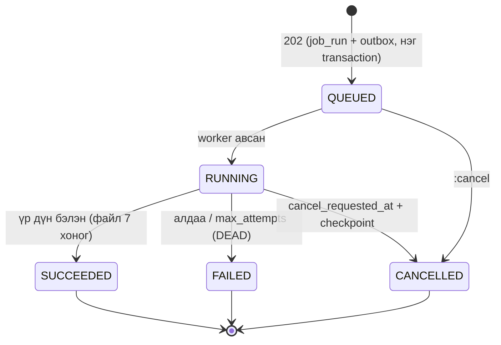

# 14. Нийтийн REST API (Public REST API) — хөгжүүлэлтэд бэлэн тодорхойлолт

> **Төлөв:** v1.0, хөгжүүлэлтэд бэлэн. **Огноо:** 2026-10-06. **Хамрах хүрээ:** R1, R2-ийн хэсгийг тэмдэглэсэн.
> **Гэрээний файл:** [api/openapi.yaml](./api/openapi.yaml). Энэ нь OpenAPI 3.1 файл: 173 зам, 233 үйлдэл, 15 webhook, 265 schema (2026-10-07-ны хяналтын дараа). `npx @redocly/cli lint` алдаа ба анхааруулгагүй давсан.
> **Эх сурвалж (давамгайлах дараалал):** [DECISIONS.md](./DECISIONS.md) → [db/schema/*.sql](./db/schema/) (D-K1: нэрийн эх сурвалж) → энэ баримт → [02-architecture.md](./02-architecture.md) §5.3, §6, §8.5, §10.3, §14.2 → [12-ebarimt-integration.md](./12-ebarimt-integration.md) §18 → [13-security-audit-tenancy.md](./13-security-audit-tenancy.md) §5.9, §6, §8, §18 → [research/bc-platform-security-api.md](./research/bc-platform-security-api.md) (R-PLATFORM-SECURITY-API-30…37, "APIV2").
> Модулийн spec 05–10 бичигдэж байх үед энэ баримтыг бичсэн. Тиймээс тэдгээрийн домэйн алдааны кодыг энд **санал** гэж тэмдэглэсэн (§9.5). Эцсийн каталог нь модулийн spec-д байна.

## Агуулга

0. [Энэ баримтыг хэрхэн унших](#0-энэ-баримтыг-хэрхэн-унших)
1. [Зарчим](#1-зарчим)
2. [URL, resource, id, үйлдэл](#2-url-resource-id-үйлдэл)
3. [JSON-ийн дүрэм: мөнгө, огноо, enum, dimension](#3-json-ийн-дүрэм)
4. [Унших: keyset хуудаслалт, шүүлт, эрэмбэ](#4-унших-keyset-хуудаслалт-шүүлт-эрэмбэ)
5. [Бичих: үүсгэх, PATCH, устгах, aggregate](#5-бичих-үүсгэх-patch-устгах-aggregate)
6. [ETag ба If-Match](#6-etag-ба-if-match)
7. [Idempotency-Key](#7-idempotency-key)
8. [Үйлдэл: post, preview, cancel, баримтын төлөв](#8-үйлдэл-post-preview-cancel-баримтын-төлөв)
9. [Алдаа (RFC 9457)](#9-алдаа-rfc-9457)
10. [Async job](#10-async-job)
11. [Webhook ба event (R2)](#11-webhook-ба-event-r2)
12. [Хувилбар ба нийцэл](#12-хувилбар-ба-нийцэл)
13. [Rate limit](#13-rate-limit)
14. [Нэвтрэлт, scope, эрх](#14-нэвтрэлт-scope-эрх)
15. [Endpoint-ийн каталог](#15-endpoint-ийн-каталог)
16. [Талбарын харгалзаа (API ↔ DB)](#16-талбарын-харгалзаа-api--db)
17. [Жишээ урсгал](#17-жишээ-урсгал)
18. [Ажиглалт ба лог](#18-ажиглалт-ба-лог)
19. [Хүлээн авах тест](#19-хүлээн-авах-тест)
20. [Схемийн өөрчлөлтийн хүсэлт (SCR)](#20-схемийн-өөрчлөлтийн-хүсэлт-scr)
21. [Нээлттэй асуулт](#21-нээлттэй-асуулт)
22. [Бусад баримтад тусгах засвар](#22-бусад-баримтад-тусгах-засвар)
23. [Хяналтын тэмдэглэл (Review log)](#хяналтын-тэмдэглэл-review-log)

---

## 0. Энэ баримтыг хэрхэн унших

### 0.1 Хамрах хүрээ

- **Багтана:** SPA ба гадаад интеграцийн хэрэглэдэг HTTP API-ийн бүх нийтлэг дүрэм (convention). Мөн дараах resource-ийн гэрээ багтана: компани, дансны төлөвлөгөө, журнал ба мөр (+ батлах), ерөнхий дэвтэр (унших, буцаах), харилцагч, нийлүүлэгч, бараа, борлуулалтын нэхэмжлэх ба кредит нот, худалдан авалтын нэхэмжлэх ба кредит нот, төлбөр ба кассын баримт, авлага/өглөгийн дэд дэвтэр (+ тулгах, буцаах), банк, хуулга импорт ба тулгалт, валют ба ханш, санхүүгийн жил ба үе, тайлан, eBarimt баримт, хуулийн параметр, async job, webhook (R2).
- **Багтахгүй:** тохиргооны CRUD-ийн дэлгэрэнгүй (posting setup, дугаарын цуврал, тайлангийн мөрийн тодорхойлолт г.м.). Тэдгээр нь энэ баримтын дүрмээр модулийн spec-д тодорхойлогдоно. Аюулгүй байдал, тенантын endpoint (`/api/v1/me/*`, `/api/v1/tenant/*`, `/api/v1/support/*`) нь [13](./13-security-audit-tenancy.md) §19-д байна. eBarimt-ийн тохиргоо, POS, лавлах, худалдан авалтын баримт нь [12](./12-ebarimt-integration.md) §18.1-д байна. Тэдгээр бүгд энэ баримтын дүрэмд захирагдана.
- **OpenAPI файлын үүрэг:** [api/openapi.yaml](./api/openapi.yaml) бол **дизайны гэрээ** (contract). Кодоос үүсгэсэн `/openapi/v1.json` ([18-dev-setup.md](./18-dev-setup.md) §3.4) нь энэ файлтай CI-д `oasdiff`-ээр тулгагдана (API-VER-05). Operation бүр `x-permission`, `x-release`, `x-requirements` (FR id) өргөтгөлтэй. Schema нь `x-db-table`-ээр хүснэгттэй холбогдоно.

### 0.2 Баримтуудын зөрүүг шийдсэн байдал

Бичихээс өмнө баримтуудыг хооронд нь тулгахад доорх зөрүү илэрсэн. Шийдвэр нь DECISIONS ба `db/schema`-г (D-K1) дагасан. Бусад баримтад тусгах засварыг §22-т жагсаасан.

| # | Зөрүү | Эх | Шийдвэр (энэ баримт) |
|---|---|---|---|
| 1 | Үйлдлийн зам `…/{id}/post`, `…/post-preview` | 02 §6.4, §6.7; 18 §3.4 | **`POST …/{id}:post`, `:preview`** (D-I1, FR-INT-001, 12 §18.1) |
| 2 | Enum `camelCase` (`"posted"`) | 18 §3.4 | **`UPPER_SNAKE`**, DB-ийн CHECK утгатай ижил (`010_platform.sql`-ийн тайлбар: "the API already uses the same UPPER_SNAKE strings"; 12 §18.1-ийн жишээ ч ийм) |
| 3 | ETag = PostgreSQL `xmin` | 02 §8.6; 18 §3.4 | **`row_version`** багана (db/README §4: `platform.fn_touch_row` нэмэгдүүлнэ) |
| 4 | Батлах үйлдлийн хариу `201` | 02 §6.3 C2 | **`200`**: resource-ийн URL өөрчлөгдөхгүй (id тогтвортой, §2.4) |
| 5 | `Idempotency-Key` PATCH/DELETE-д заавал | 02 §8.5; 18 §3.4 | POST-д **заавал**, PATCH/DELETE-д **сонголттой**. Тэдгээрийг `If-Match` хамгаална (D-I1: "POST") |
| 6 | Алдааны код `money.must_be_string`, `idempotency.key_reused`, `integration.idempotency_key_reused`, `sales.draft_version_mismatch` | 18, 02 | Протоколын түвшний код **`api.*`** нэрийн орон зайд (§9.4) |
| 7 | Ерөнхий дэвтрийн resource `posted-sales-invoices`, `general-journal-batches` | 18 §3.4 | Ноорог ба posted нэг resource **`sales-invoices`** (R-30, R-32). Журнал нь **`journals`** |
| 8 | Буцаалтын огноог хэрэглэгч сонгоно (хаалттай үед) | 02 §6.8 | **D-D5:** эх огноогоор, үе нээлттэй үед л. Хаалттай бол 422, одоогийн үед залруулах журнал хийнэ |
| 9 | Үеийн төлөв `SOFT_LOCKED`, `HARD_LOCKED` | 02 §6.9 | **`OPEN`/`CLOSED`/`LOCKED`** (`gl.accounting_period`) |
| 10 | Үеийг OPEN-оос шууд LOCKED болгох | 03 §6.2 (зөвшөөрнө), 13 §8.3 (зөвхөн CLOSED-оос) | **13-ыг дагана:** зөвхөн CLOSED → LOCKED (нээлттэй асуулт Q5) |
| 11 | Webhook | 13 §6.1 (`API` объект R3-т нөөцөлсөн) | Даалгаврын дагуу **R2**. Эрх нь `ACTION platform.webhook.manage` (санал, §20 SCR-API-08) |

### 0.3 Дүрмийн ID ба тэмдэглэгээ

- Дүрэм бүр `API-<ХЭСЭГ>-NN` ID-тай бөгөөд тестлэх боломжтой. Хэсгийн код: `GEN` ерөнхий, `URL` зам/id, `JSON` JSON формат, `PAG` хуудаслалт, `WR` бичих, `ETAG` ETag, `IDEM` idempotency, `ACT` үйлдэл, `ERR` алдаа, `JOB` async ажил, `WH` webhook, `VER` хувилбар, `RL` rate limit, `AUTH` нэвтрэлт/эрх, `OBS` ажиглалт, `RPT` хүснэгтэн тайлан (§15.6).
- **MUST** = заавал, **SHOULD** = зөвлөмж.
- `{c}` = `{companyId}`. Бүх зам `/api/v1`-ээс эхэлнэ.
- Хүлээн авах тестийг (acceptance test) `AT-API-NNN` гэж дугаарласан (§19).

---

## 1. Зарчим

| ID | Зарчим |
|---|---|
| API-GEN-01 | **Нэг API.** SPA (BFF cookie) ба гадаад интеграц (`client_credentials`) ижил endpoint, ижил дүрмийг ашиглана. "Дотоод" тусгай API байхгүй (02 §3). |
| API-GEN-02 | **REST + JSON, OData биш** (D-I1). `$filter`/`$expand` хэрэглэхгүй. Шүүлт нь нэрлэсэн query параметр (§4.2). BC APIV2-ийн гол санааг авна: GUID түлхүүр, ноорог → posted тогтвортой id, мөр sub-collection, bound action, ETag (R-30…R-37). |
| API-GEN-03 | **Сервер л тооцоолно.** НӨАТ, нийлбэр, дугаар, үлдэгдлийг сервер тооцоолно. Клиентийн илгээсэн тооцоолсон талбар read-only бөгөөд илгээвэл 400 болно (API-JSON-09). SPA урьдчилсан тооцоонд `decimal.js` хэрэглэж болох ч эцсийн дүнг серверээс авна (ADR-0006). |
| API-GEN-04 | **Ledger-т засвар, устгал байхгүй.** G/L, VAT, авлага/өглөг, банкны entry болон posted баримтад зөвхөн `GET` хийнэ. Ганц үл хамаарах зүйл нь whitelist талбар (`dueDate`, `onHold`, FR-PTY-014). Залруулга нь үйлдлээр хийгдэнэ: `:reverse`, `:cancel`, кредит нот (D-C4, D-D5). |
| API-GEN-05 | **Бүх командыг давтаж болно.** POST команд `Idempotency-Key`-тэй, бичилт `If-Match`-тэй. Сүлжээний алдааны дараа ижил түлхүүрээр дахин илгээхэд давхар бичилт үүсэхгүй (§7). |
| API-GEN-06 | **Бүх алдааг нэг дор.** Posting-ийн урьдчилсан шалгалт бүх алдааг цуглуулж нэг 422 хариунд буцаана (FR-GL-008, 02 §6.2). |
| API-GEN-07 | **Тенант URL-д байхгүй.** Тенант нь session эсвэл токеноос (`erp_tid`) гарна. Компани нь URL-д байна (`/companies/{c}`). Хандах эрхгүй компани 404 буцаана, эрх илчлэхгүй (13 §4.5). |
| API-GEN-08 | **`qrData`, `lottery`-г хадгалахгүй** (D-J3). Тэдгээр нь зөвхөн `:post?ebarimtPrint=sync` ба `:send-and-print` хариунд гарна (`Cache-Control: no-store`). Idempotency-ийн хадгалсан хариу, лог, trace, job-ийн үр дүн, webhook-д байхгүй. |

---

## 2. URL, resource, id, үйлдэл

### 2.1 Суурь зам, хувилбар, компанийн хүрээ

| ID | Дүрэм |
|---|---|
| API-URL-01 | Суурь зам нь `/api/v1`. Major хувилбар URL-д байна (API-VER-01). |
| API-URL-02 | Компанийн бүх өгөгдөл `/api/v1/companies/{companyId}/<resource>` дор байна. Тенантын түвшний ба глобал endpoint-ийн жагсаалт: `GET /api/v1/companies`, `GET /api/v1/tax-parameters`, `GET /api/v1/official-exchange-rates`, `/api/v1/me/*`, `/api/v1/tenant/*`. Глобал лавлах нь RLS-гүй (`tax.tax_parameter`, `fx.official_exchange_rate`). |
| API-URL-03 | Request бүрд middleware `platform.fn_set_context(tenant, company, user, request_id)`-г transaction-ий эхэнд дуудна (13 §7.4). Компанид хандах эрхийг 13 §4.5-ын `ResolveCompanyAccess` шалгана. Амжилтгүй бол **404 `platform.company_not_found`** буцаана. Integration client-ийн токенд `erp_cid` байгаа бөгөөд замын `{companyId}`-тай таарахгүй бол мөн 404 буцна. |

### 2.2 Resource нэршил

| ID | Дүрэм |
|---|---|
| API-URL-04 | Resource нь **олон тоотой, `kebab-case`** англи нэр: `sales-invoices`, `customer-ledger-entries`. Нэр нь BC APIV2-ийн EntitySetName-ийг kebab болгосон хэлбэр. |
| API-URL-05 | Sub-collection нь эзэмшигч aggregate-ийн дор байна: `/sales-invoices/{id}/lines`, `/journals/{id}/lines`, `/bank-reconciliations/{id}/lines`. Мөрийг эзэмшигчгүйгээр шууд хандах зам байхгүй. |
| API-URL-06 | DB хүснэгт ба resource-ийн харгалзаа (D-K1, `x-db-table`): |

| Resource | DB (schema.table) | BC |
|---|---|---|
| `companies` | `platform.company` + `platform.company_setup` | Company, T79 |
| `gl-accounts` | `gl.gl_account` | T15 |
| `journal-templates`, `journals`, `journals/{id}/lines` | `gl.journal_template`, `gl.journal_batch`, `gl.journal_line` | T80, T232, T81 |
| `gl-transactions`, `gl-registers`, `gl-entries` | `gl.gl_transaction`, `gl.gl_register`, `gl.gl_entry` | T57, T45, T17 |
| `customers`, `vendors`, `items` | `party.customer`, `party.vendor`, `inv.item` | T18, T23, T27 |
| `sales-invoices`, `sales-credit-memos` | `sales.sales_header` (+`sales_line`) ∪ `sales.sales_invoice_header` / `sales.sales_cr_memo_header` (+мөр) | T36/37, T112–115 |
| `purchase-invoices`, `purchase-credit-memos` | `purchase.purchase_header` (+`purchase_line`) ∪ `purchase.purch_inv_header` / `purchase.purch_cr_memo_header` | T38/39, T122–125 |
| `payments` (команд), `cash-vouchers` | `gl.gl_transaction` + ledger-ууд; `bank.posted_cash_voucher` | Payment Registration; МХ-1/МХ-2 |
| `customer-ledger-entries`, `vendor-ledger-entries` (+`detailed-entries`) | `party.cust_ledger_entry`, `party.detailed_cust_ledger_entry`, `party.vendor_ledger_entry`, `party.detailed_vendor_ledger_entry` | T21, T379, T25, T380 |
| `bank-accounts`, `bank-ledger-entries` | `bank.bank_account`, `bank.bank_ledger_entry` | T270, T271 |
| `bank-statements`, `bank-reconciliations`, `bank-account-statements` | `bank.bank_statement(_line)`, `bank.bank_reconciliation(_line)` + `bank_rec_match*` + `payment_application_proposal`, `bank.bank_account_statement(_line)` | T273/274, T1294, T275/276 |
| `currencies`, `currencies/{id}/exchange-rates`, `official-exchange-rates` | `fx.currency`, `fx.currency_exchange_rate`, `fx.official_exchange_rate` | T4, T330 |
| `fiscal-years`, `accounting-periods` | `gl.fiscal_year`, `gl.accounting_period`, `gl.accounting_period_status_log` | T50 |
| `vat-return-periods` | `tax.vat_return_period` | T737 |
| `vat-entries` | `tax.vat_entry` (зөвхөн унших) | T254 |
| `reports/*`, `financial-reports` | `rpt.fn_trial_balance`, `party.fn_customer_aging`/`fn_vendor_aging`, `rpt.financial_report` + мөр/багана, `tax.vat_statement_*` | R6, R120/322, T88/84/85/333/334, T255–257 |
| `ebarimt/documents` | `ebarimt.ebarimt_document` (+`_line`, `_event`, `_sub_receipt`) | — |
| `tax-parameters` | `tax.tax_parameter` (глобал) | — |
| `jobs` | `integration.job_run` | T472/T474 |
| `webhook-subscriptions` (R2) | `integration.webhook_subscription`, `integration.webhook_delivery` (SCR-API-03) | — |

### 2.3 Id ба дугаар

| ID | Дүрэм |
|---|---|
| API-URL-07 | Замд **техникийн `id` (UUIDv7, `format: uuid`)** ашиглана. Бизнесийн дугаарыг (`number`, `documentNo`) замд ашиглахгүй (R-30). Id-г клиент өөрчилж чадахгүй. Ledger-ийн `entryNo` (компани доторх завсаргүй bigint, D-K3) нь шүүлт ба холбоост ашиглагдана (`?entryNoFrom=`, `closedByEntryNo`). JSON-д `integer` (`int64`) хэлбэртэй. |
| API-URL-08 | **Лавлагааг id эсвэл дугаараар өгнө, хоёулаа ирвэл тулгана** (R-31). Хослол: `customerId`/`customerNumber`, `vendorId`/`vendorNumber`, `itemId`/`itemNumber`, `glAccountId`/`glAccountNumber`, `accountId`/`accountNumber`, `partyId`/`partyNumber`, `journalTemplateId`/`templateCode`. Хоёулаа ирээд өөр мөр рүү заавал **422 `api.reference_mismatch`** буцна. Дугаар олдохгүй бол **422 `api.reference_not_found`** буцна (`pointer`-тэй). Хариунд хоёулаа гарна. |
| API-URL-09 | `number` хоосон ирвэл үүсгэхэд мастер өгөгдлийн цувралаас (`CUST`, `VEND`, `ITEM`) олгоно. Цуврал `manual_nos = true` бол клиентийн дугаарыг хүлээн авна. Давхардвал **409 `api.duplicate`** (`existingResourceId`-тэй). Дугаарыг дараа нь өөрчлөх боломжгүй (create-only). Rename нь R2 (Q11). |

### 2.4 Ноорогоос posted хүртэл тогтвортой id (R-32)

Борлуулалт ба худалдан авалтын баримт хоёр хүснэгтэд хадгалагдана: ноорог нь `sales.sales_header`, posted нь `sales.sales_invoice_header`. Posting нэг transaction-д ноорогийг устгаж, posted баримтыг `draft_id = ноорогийн id`-тай үүсгэнэ (`ux_sales_invoice_header__draft`). API нь энэ хоёрыг **нэг resource** болгоно.

| ID | Дүрэм |
|---|---|
| API-URL-10 | Баримтын API `id` = ноорогийн `id`. Posted болсны дараа API `id` = `coalesce(posted.draft_id, posted.id)` болно. `postedId` талбар нь posted header-ийн өөрийн id бөгөөд `ebarimt.ebarimt_document.source_id`-тэй холбогдоно. |
| API-URL-11 | `GET …/sales-invoices/{id}` нь ноорог ба posted-ийг **нэг SQL statement** (нэг snapshot)-оор хайна. Posting-той уралдвал аль нэгийг нь (хуучин ноорог эсвэл шинэ posted) буцаана, хоёулаа алга гэсэн хариу гарахгүй. |
| API-URL-12 | Төрөл зөрвөл, жишээ нь кредит нотын id-аар `/sales-invoices/{id}` дуудвал **404** буцна. |
| API-URL-13 | **Мөрийн id тогтвортой биш.** Posted мөр шинэ id авна (BC-тэй адил). Клиент мөрийг posting-ийн дараа `lineNo`-оор таньдаг. |

```text
function ResolveDocument(companyId, kind, id) -> Document | NotFound:
    -- kind ∈ {SALES_INVOICE, SALES_CR_MEMO, PURCH_INVOICE, PURCH_CR_MEMO}
    (draftTbl, draftType, postedTbl) := map(kind)            -- жишээ: (sales.sales_header, 'INVOICE', sales.sales_invoice_header)
    row := SELECT 'DRAFT' AS src, h.* FROM draftTbl h
             WHERE h.company_id = companyId AND h.id = id AND h.document_type = draftType
           UNION ALL
           SELECT 'POSTED', p.* FROM postedTbl p
             WHERE p.company_id = companyId
               AND (p.draft_id = id OR (p.draft_id IS NULL AND p.id = id))
           LIMIT 1                                            -- нэг statement = нэг snapshot (READ COMMITTED)
    if row is null: return NotFound(api.resource_not_found)
    return row
```

### 2.5 Үйлдэл (custom method)

| ID | Дүрэм |
|---|---|
| API-URL-14 | CRUD-ээр илэрхийлэгдэхгүй бизнесийн үйлдэл нь **`POST <resource-url>:<verb>`** хэлбэртэй (D-I1, BC bound action). `verb` нь `kebab-case`. Collection түвшний үйлдэл нь `POST <collection>:<verb>` хэлбэртэй (жишээ `customer-ledger-entries:apply`, `payments:preview`). |
| API-URL-15 | Үйлдэл аюулгүй (safe) бол, жишээ нь preview ба тайлан ажиллуулах, `Idempotency-Key` шаардахгүй. Бусад бүх үйлдэлд заавал (§7). |
| API-URL-16 | Үйлдлийн каталог: |

| Үйлдэл | Resource | Үр дүн | HTTP |
|---|---|---|---|
| `:post` | sales/purchase invoices, credit memos, `journals`, `bank-reconciliations` | Posting (нэг transaction) | 200 |
| `:preview` | дээрхүүд + `payments` | Posting-ийг ROLLBACK-тэй ажиллуулна | 200 |
| `:release`, `:reopen` | баримтын ноорог | OPEN ↔ RELEASED | 200 |
| `:cancel` | sales/purchase invoices | Бүтэн кредит нот + тулгалт (D-F6) | 201 (`Location` = кредит нот) |
| `:copy` | баримт | Шинэ ноорог (FR-SAL-010) | 201 |
| `:send` | sales docs | Имэйл outbox-д | 202 |
| `:reverse` | `gl-transactions`, `gl-registers` | Буцаалтын ваучер (D-D5) | 201 |
| `:apply` (collection), `:unapply` | customer/vendor ledger entries | Тулгалт (D-F3) | 200 |
| `:close`, `:reopen`, `:lock` | `accounting-periods`; `fiscal-years` (`:close`, `:lock`, `:preview-close`); `vat-return-periods` (`:close`, `:submit`) | Төлөвийн шилжилт | 200 |
| `:import` | `bank-accounts/{id}/statements` | Хуулга импорт | 201 |
| `:discard`, `:undo`, `:auto-match`, `:match`, `:unmatch`, `:count-cash` | банк | | 200 |
| `:resolve`, `:resend`, `:cancel`, `:confirm-manual-void`, `:send-and-print` | `ebarimt/documents` | 12 §11, RET-51 | 200 / 201 (`:resend`) |
| `:run` | `financial-reports` | Тайлан тооцох (safe) | 200 |
| `:export` | `reports/{code}`, `vat-return-periods` | Async job | 202 |
| `:cancel` | `jobs` | | 200 |
| `:rotate-secret`, `:test`, `:redeliver` | webhook (R2) | | 200 / 202 |

### 2.6 HTTP арга ба амжилтын код

| ID | Дүрэм |
|---|---|
| API-URL-17 | Ашиглах арга: `GET`, `POST`, `PATCH`, `DELETE`. `PUT` v1-д байхгүй. `HEAD`/`OPTIONS` дэмжихгүй, учир нь CORS идэвхгүй (13 SEC-AUTH-03). |
| API-URL-18 | Амжилтын код: `200` (унших, PATCH, үйлдэл), `201` (шинэ resource үүссэн, `Location`-той), `202` (async: job, имэйл, webhook илгээлт), `204` (DELETE). |
| API-URL-19 | Нэг resource-ийг wrapper-гүй объектоор буцаана. Жагсаалтыг `{ "items": [], "nextCursor": "…", "hasMore": true }` хэлбэрээр буцаана. Үйлдэл өөрийн үр дүнгийн schema-тай (`SalesInvoicePostResult` г.м.). |

---

## 3. JSON-ийн дүрэм

### 3.1 Нэр ба бүтэц

| ID | Дүрэм |
|---|---|
| API-JSON-01 | Property нь `camelCase`. DB баганыг механикаар хөрвүүлнэ: `snake_case` → `camelCase`, `no` → `number`, `*_id` → `*Id`. Snapshot код (`customer_posting_group` text) → `customerPostingGroupCode`. Жишээ: `document_no` → `documentNo`, `external_document_no` → `externalDocumentNo`, `entry_no` → `entryNo`. Харгалзааг §16-д өгсөн. |
| API-JSON-02 | **Enum нь `UPPER_SNAKE` бөгөөд DB-ийн CHECK утгатай яг ижил** (`"POSTED"`, `"B2C_RECEIPT"`, `"GL_ACCOUNT"`). Хэлний код (`mn`/`en`) ба `tax_parameter.status`-ийн жижиг үсэг (`verified`) нь DB-ийнхээрээ үлдэнэ. |
| API-JSON-03 | Хариуны объект `additionalProperties`-ээр хязгаарлагдахгүй. **Клиент танихгүй талбар ба enum утгыг тэвчих ёстой** (API-VER-03). Хүсэлтийн schema нь `additionalProperties: false`-тэй: мэдэгдэхгүй талбар ирвэл **400 `api.unknown_field`** (`pointer`-тэй). |
| API-JSON-04 | Хариунд утгагүй сонголттой талбар **`null`**-ээр гарна (орхигдохгүй). Ингэснээр клиент "байхгүй" ба "хоосон"-ыг ялгах шаардлагагүй. Үл хамаарах зүйл нь `include`-ээр нэмэгддэг талбар (`lines`, `balance`, `proposals`). Тэдгээр нь хүсээгүй бол огт гарахгүй. |

### 3.2 Мөнгө, тоо хэмжээ, ханш, хувь (D-C1, ADR-0006)

| ID | Дүрэм |
|---|---|
| API-JSON-05 | Дүн, нэгжийн үнэ, тоо хэмжээ, ханш, хувь нь **JSON string** хэлбэртэй (OpenAPI `type: string, format: decimal`). JSON number ирвэл **400 `api.money_must_be_string`** (FR-INT-001 AC2). Хүлээн авах хэлбэр: `^-?(0\|[1-9][0-9]*)(\.[0-9]+)?$`. Exponent, мянгатын тусгаарлагч, `+` тэмдэг, хоосон зай, таслалтай бутархай хүлээн авахгүй. |
| API-JSON-06 | Нарийвчлал ба гаралтын хэлбэр: |

| Төрөл (domain) | Schema | Оролтын дээд нарийвчлал | Гаралт |
|---|---|---|---|
| Дүн `platform.amount` (19,4) | `Amount` | Баримтын валютын нарийвчлал: LCY (MNT) бол `platform.company_setup.amount_rounding_precision` (анхдагч 0.01 → 2 орон; 1 бол бүхэл), гадаад валют бол `fx.currency.amount_rounding_precision`. Илүү бол **422 `api.amount_precision_exceeded`** (дүнг чимээгүй бөөрөнхийлөхгүй). Invoice rounding (`invoice_rounding_precision`, D-C2) нь оролтын шалгалтад хамаарахгүй, зөвхөн нийт дүнгийн бөөрөнхийлөлтийн мөр үүсгэнэ | **Яг валютын орноор**: `"1100.00"`, `"-220.00"` |
| Нэгжийн үнэ `platform.unit_amount` (19,6) | `UnitAmount` | 6 орон (domain). Клиентийн илгээсэн үнийг бөөрөнхийлөхгүй хадгална; `unit_amount_rounding_precision` (анхдагч 0.00001) нь зөвхөн сервер **тооцоолсон** нэгжийн үнэд (НӨАТ-тэй ↔ НӨАТ-гүй хөрвүүлэлт, API-JSON-20) хэрэглэгдэнэ | Төгсгөлийн тэгийг хасна: `"2750"`, `"333.335"` |
| Тоо хэмжээ `platform.quantity` (19,5) | `Quantity` | 5 орон | Төгсгөлийн тэгийг хасна: `"2"`, `"0.5"` |
| Ханш `platform.exch_rate` (38,18) | `ExchRate` | 18 орон | Төгсгөлийн тэгийг хасна: `"3450.5"` |
| Хувь `platform.percent` (9,5) | `Percent` | 5 орон, 0..100 | Төгсгөлийн тэгийг хасна: `"10"` |

| ID | Дүрэм |
|---|---|
| API-JSON-06a | **400 ба 422-ын хил.** Domain-ийн бутархай оронгоос (Amount 4, UnitAmount 6, Quantity 5, ExchRate 18, Percent 5) илүү эсвэл бүхэл хэсэг хэт урт бол schema-ийн **400 `api.request_invalid`** (`pattern`). Domain-д багтсан ч валютын нарийвчлалаас илүү бол **422 `api.amount_precision_exceeded`**. Жишээ (MNT, 0.01): `"100.00001"` → 400; `"100.005"` → 422; `"100.00"` → OK. |
| API-JSON-07 | **Тэмдэг (sign).** Ledger resource (`gl-entries`, `vat-entries`, `*-ledger-entries`, `bank-ledger-entries`) нь DB-ийн тэмдэгтэй утгыг өөрчлөлгүй өгнө: дебит > 0, кредит < 0 (D-C3). Мөн `debitAmount`/`creditAmount` (≥ 0) талбар гарна (`vat-entries`-д үгүй: борлуулалтын `base`/`amount` < 0, худалдан авалтынх > 0, BC T254). Баримтын resource-ийн дүн нь **баримтын өөрийн өнцгөөс эерэг** байна: кредит нотын `amountIncludingVat` > 0, `remainingAmount` ≥ 0. Төлбөрийн командын `amount` > 0 бөгөөд чиглэлийг `direction` заана. |
| API-JSON-08 | **Клиент тооцоо хийхгүй.** `lineAmount`, `amount`, `vatAmount`, `amountIncludingVat`, нийлбэр бүгд read-only. Сервер `ITaxCalculator.ComputeDocument`-оор баримтын түвшинд НӨАТ-ыг бодно (D-E3). |

### 3.3 Огноо ба цаг

| ID | Дүрэм |
|---|---|
| API-JSON-10 | Бизнесийн огноо (`postingDate`, `documentDate`, `dueDate`, `vatDate`, `asOf`, `dateFrom`/`dateTo`) нь `YYYY-MM-DD` (`format: date`) хэлбэртэй, цагийн бүсгүй. Утга нь Asia/Ulaanbaatar-ын хуанлийн өдөр. |
| API-JSON-11 | Техникийн цаг (`createdAt`, `postedAt`, `ebarimtDate`) нь ISO 8601 UTC бөгөөд `Z`-ээр төгсөнө (`2026-10-06T03:15:00Z`). Оролтод offset-той цаг ирвэл хүлээн аваад UTC болгоно. |
| API-JSON-12 | "Өнөөдөр" гэсэн анхдагч утгыг **серверийн Asia/Ulaanbaatar огноо**-оор тооцно (UTC биш, research §8 #3). Жишээ: 2026-10-06T17:30Z = УБ 2026-10-07 01:30 → анхдагч `postingDate` = `2026-10-07`. |
| API-JSON-13 | Огнооны хүрээ (`…From`, `…To`) **хоёр талдаа оролцоно** (inclusive). `From > To` бол 400 `api.invalid_range`. |

### 3.4 Read-only, write-only, create-only, null

| ID | Дүрэм |
|---|---|
| API-JSON-09 | OpenAPI-д `readOnly` гэж тэмдэглэсэн талбарыг хүсэлтэд илгээвэл **400 `api.read_only_field`**. Create/Update schema-д ийм талбар байхгүй тул энэ нь `api.unknown_field`-тэй ижил шалгалт. |
| API-JSON-14 | `writeOnly` талбар (жишээ `templateCode`) хариунд гарахгүй. Create-only талбар (`number`, `kind`, `currencyCode` (bank), `correctedInvoiceId`, `lines` (deep insert)) нь `…Update` schema-д байхгүй. |
| API-JSON-15 | PATCH-д `null` илгээвэл сонголттой талбарыг цэвэрлэнэ (RFC 7396). Заавал талбарт (`name`) `null` илгээвэл 400 `api.request_invalid`. |

### 3.5 Dimension (D-D2, ADR-0010)

| ID | Дүрэм |
|---|---|
| API-JSON-16 | API нь `dimension_set_id`-г (компани доторх bigint) шууд өгөхгүй. Оролт нь `dimensions: [{ "dimensionCode": "САЛБАР", "valueCode": "UB01" }]`. Код нь `platform.code20` тул латин үсэг байна. Жишээн дэх `САЛБАР`-ыг бодит системд `BRANCH` гэж бичнэ. Гаралт нь `DimensionValueRef[]` (`dimensionId`, `valueId`, нэр нэмэгдэнэ), `dimensionCode`-оор эрэмбэлэгдсэн. |
| API-JSON-17 | Сервер dimension ба утга байгаа, блоклогдоогүй, `value_type = STANDARD` эсэхийг шалгаад `gl.fn_get_dimension_set_id`-ээр set id олно. Утга олдохгүй бол 422 `gl.dimension_value_not_found`, блоклогдсон бол 422 `gl.dimension_value_blocked`. Ижил `dimensionCode` давхардвал 400 `api.request_invalid` буцна. Хоосон массив = хоосон set (0). PATCH-д `dimensions` нь **бүх set-ийг солино** (merge хийхгүй). |
| API-JSON-18 | Global dimension 1/2-ын шүүлт: `?dimension1ValueId=`, `?dimension2ValueId=` (FR-RPT-018). Ledger-ийн `global_dim_*_value_id`-г trigger гаргадаг (910) тул оролтоор авахгүй. |

### 3.6 Талбарыг хэрэглэх тогтмол дараалал (R-34-ийн сайжруулалт)

BC-д JSON дахь талбарын дараалал нь OnValidate-ийн дарааллыг тодорхойлдог (R-34). Манайд **JSON дараалал ач холбогдолгүй** бөгөөд дараалал тогтмол:

| ID | Дүрэм |
|---|---|
| API-JSON-19 | Баримтын create/PATCH-ийн талбарыг дараах дарааллаар хэрэглэнэ: (1) харилцагч/нийлүүлэгч → анхдагч утга бөглөгдөнө (нэр, хаяг, posting group, төлбөрийн нөхцөл/хэлбэр, `pricesIncludingVat`, валют, eBarimt-ийн анхдагч); (2) `documentDate`; (3) `postingDate`; (4) `vatDate` (ирээгүй бол = `postingDate`); (5) `dueDate` (ирээгүй бол нөхцөл + `documentDate`); (6) `currencyCode`; (7) `pricesIncludingVat`; (8) `paymentTermsId`; (9) `paymentMethodId` (balancing данс); (10) бусад scalar; (11) `dimensions`; (12) `lines` (мөр бүрт: төрөл/дугаар → анхдагч, тоо, үнэ, хөнгөлөлт); (13) нийлбэр ба НӨАТ-ыг дахин тооцох. |
| API-JSON-20 | **Нэг хүсэлтэд илгээсэн утга нь гаргасан анхдагч утгыг үргэлж дарна.** Жишээ: `customerId` ба `dueDate` хамт ирвэл харилцагчийн нөхцөлөөр `dueDate`-ийг дахин тооцохгүй. Мөртэй ноорогт харилцагч солиход мөрийн VAT/Gen. Bus. бүлэг ба НӨАТ дахин тооцоологдоно. `pricesIncludingVat` өөрчлөгдөхөд нэгжийн үнийг 10-sales spec-ийн дүрмээр хөрвүүлнэ. |

### 3.7 Хувь хүний мэдээлэл (PII)

| ID | Дүрэм |
|---|---|
| API-JSON-21 | 13 §10.2–10.4-ийн маскын дүрмийг хариунд мөрдөнө (формат 13 эзэмшинэ): `INDIVIDUAL` харилцагч/нийлүүлэгчийн `registrationNo` (`УБ******12`), `tin`/`ebarimtMerchantTin` (`civil_id`, `*********123`, schema `TinMaskedOrNull`); `ebarimtConsumerNo` (мастер ба ноорогт тухайн хүснэгтийн M эрхтэйд бүтэн, posted баримт ба бусдад `****5678`); утас/имэйл/хаяг (M эрхгүйд `99****34`, `b***@gmail.com`, `Улаанбаатар, …`); кассын баримтын `counterpartyIdDocument`. Posted баримтын `customerTin`/`vendorTin` нь хувь хүнд hint (13 SEC-PII-04). Оролтод бүтэн утгыг авна. Задлах нь `POST …/{id}:unmask` (13 §10.5, step-up). Маскласан утгыг PATCH-д буцааж илгээвэл 422 `api.masked_value_not_allowed`. |

---

## 4. Унших: keyset хуудаслалт, шүүлт, эрэмбэ

### 4.1 Keyset хуудаслалт (keyset pagination)

| ID | Дүрэм |
|---|---|
| API-PAG-01 | Бүх жагсаалт keyset хуудаслалттай. Offset/`page=` байхгүй. Параметр: `limit` (анхдагч 50) ба `after` (өмнөх хуудасны `nextCursor`). |
| API-PAG-02 | `limit > 200` бол **200 болгож бууруулна** (алдаа өгөхгүй, FR-INT-001 AC3). `limit < 1` эсвэл тоо биш бол 400 `api.request_invalid`. |
| API-PAG-03 | Хариу: `items`, `hasMore`, `nextCursor` (`hasMore = false` бол `null`). **Нийт тоо (total count) өгөхгүй** (үнэтэй, Q1). |
| API-PAG-04 | Cursor нь opaque бөгөөд гарын үсэгтэй (signed). Клиент задлах, засах ёсгүй. Хэлбэр: `base64url(JSON{v, r, f, k, i}) + "." + base64url(HMAC-SHA256(cursorKey, payload))[0..22]`. Энд `r` = resource, `f` = шүүлт ба эрэмбийн hash, `k` = сүүлийн мөрийн эрэмбийн утгууд, `i` = tie-breaker. Гарын үсэг буруу эсвэл задлагдахгүй бол **400 `api.invalid_cursor`**. Шүүлт/эрэмбэ өөрчлөгдсөн бол **400 `api.cursor_mismatch`**. |
| API-PAG-05 | Cursor хугацаагүй. `cursorKey` солигдоход (90 хоног тутам, 13 §11.4) хуучин cursor 400 болох бөгөөд клиент эхнээс нь эхэлнэ. |
| API-PAG-06 | Хуудас хоорондын тогтвортой байдал: шинэ мөр нэмэгдэх, мөр устах үед мөр давхардахгүй, алгасагдахгүй (keyset-ийн шинж). Ноорог posted болбол эрэмбийн түлхүүр өөрчлөгдөж болно (`number`, `postingDate`). Иймд бүрэн синк хийхэд ledger-ийн `entryNo`-г ашиглана (API-PAG-12). |

```text
function ListPage(resource, query) -> Page:
    limit := query.limit is null ? 50 : query.limit
    if limit < 1: raise 400 api.request_invalid {parameter: "limit"}
    limit := min(limit, 200)
    sort := parseSort(query.sort ?? resource.defaultSort)                 -- [(field, dir)], ≤ 4
    for (f, _) in sort: if f ∉ resource.sortable: raise 400 api.invalid_sort_field {parameter: "sort"}
    sort := sort + [(resource.tieBreaker, dir(last(sort)))]               -- id эсвэл entryNo; давтагдашгүй
    filters := validateFilters(resource, query)                           -- §4.2; мэдэгдэхгүй → 400
    fh := sha256(canonical(filters) || canonical(sort))[0..16]
    if query.after:
        c := verifyAndDecode(query.after)                                 -- HMAC; буруу → 400 api.invalid_cursor
        if c.r ≠ resource.name or c.f ≠ fh: raise 400 api.cursor_mismatch
        seek := keysetPredicate(sort, c.k ++ [c.i])                       -- доор
    rows := SELECT … WHERE company_id = ctx.company AND filters AND seek
            ORDER BY sort (NULLS LAST) LIMIT limit + 1
    hasMore := len(rows) > limit
    items := rows[0 : limit]
    next := hasMore ? sign(encode({v:1, r, f: fh, k: sortValues(last(items)), i: tieValue(last(items))})) : null
    return {items, nextCursor: next, hasMore}

function keysetPredicate(sort, last):                                     -- холимог чиглэлтэй эрэмбийн OR гинж
    -- (k1 ≻ v1) OR (k1 = v1 AND k2 ≻ v2) OR … ; ≻ нь asc-д '>', desc-д '<'
    -- nullable түлхүүрийг (k IS NULL, k) хос болгон харьцуулна (NULLS LAST-тэй нийцүүлэх)
```

| ID | Дүрэм |
|---|---|
| API-PAG-07 | **Нэгтгэсэн баримтын жагсаалт** (`sales-invoices` г.м.) нь `UNION ALL`-ийн (ноорог + posted) дээр ижил алгоритмаар ажиллана. Нийтлэг эрэмбийн түлхүүр: `documentDate`, `postingDate` (ноорогт null байж болно → NULLS LAST), `number`, `amountIncludingVat`, `createdAt`. Tie-breaker нь API `id`. |
| API-PAG-08 | Нэгтгэсэн жагсаалтад хэрэглэгч ноорогийн хүснэгтийг унших эрхгүй бол ноорог **чимээгүй хасагдана**. Posted хүснэгтийг унших эрхгүй бол posted хасагдана. Хоёуланг унших эрхгүй бол 403 (R-37). |

### 4.2 Шүүлт (filtering)

| ID | Дүрэм |
|---|---|
| API-PAG-09 | Шүүлт нь **нэрлэсэн query параметр** (`camelCase`). Resource бүрийн жагсаалтыг OpenAPI тодорхойлно. Мэдэгдэхгүй query параметр ирвэл **400 `api.unknown_query_parameter`** (үсгийн алдааг илрүүлэх). |
| API-PAG-10 | Хэлбэр: тэнцүү (`customerId=…`, `documentNo=…`), хүрээ (`postingDateFrom`/`postingDateTo`, хоёр талдаа оролцоно), олон утга таслалаар (`status=DRAFT,POSTED`, `explode: false`), boolean (`true`/`false`), хайлт `q` (≥ 2 тэмдэгт; `number`-ийн эхлэл, `search_name`/`name` дотор, ТТД-ийн эхлэл; том/жижиг үсэг ялгахгүй). Нэг параметрийг давтаж илгээвэл 400. |
| API-PAG-11 | Утгын төрөл буруу бол 400 `api.request_invalid` (`parameter`-тэй). Огноо, uuid, enum-ийг schema-аар шалгана. |

### 4.3 Эрэмбэ (sorting)

| ID | Дүрэм |
|---|---|
| API-PAG-12 | `sort=-postingDate,number`: таслалаар тусгаарлана, `-` нь буурах эрэмбэ. Дээд тал нь 4 талбар. Зөвшөөрөгдсөн талбарын жагсаалт resource бүрд байна. Анхдагч эрэмбэ: мастер өгөгдөлд `number`, баримтад `-documentDate`, ledger-т `entryNo` (өсөх), `gl-transactions`-д `-transactionNo`, eBarimt-д `-createdAt`, үед `startingDate`. Ledger-ийн `entryNo` нь өөрчлөгдөхгүй, завсаргүй учир гадаад систем `?entryNoFrom=&sort=entryNo` ашиглан өөрчлөлтийг найдвартай татна (change feed). |

### 4.4 Нэмэлт өгөгдөл (`include`)

| ID | Дүрэм |
|---|---|
| API-PAG-13 | Ерөнхий `$expand` байхгүй. Тодорхой нэмэлтүүд: `include=lines` (баримтын жагсаалт; нэг баримтын GET-д мөр үргэлж орно), `include=balance&balanceAt=` (`gl-accounts`), `include=proposals` (тулгалтын мөр). |

---

## 5. Бичих: үүсгэх, PATCH, устгах, aggregate

### 5.1 Үүсгэх, PATCH, устгах

| ID | Дүрэм |
|---|---|
| API-WR-01 | **Үүсгэх:** `POST /<collection>` (+ `Idempotency-Key`). Хариу нь `201` бөгөөд `Location: /api/v1/companies/{c}/<collection>/{id}`, `ETag` header ба бүтэн төлөөлөлтэй. |
| API-WR-02 | **Deep insert.** Баримт үүсгэхдээ `lines`-ийг inline илгээж болно (BC APIV2). Нэг хүсэлтэд ≤ 200 мөр (их бол 422 `api.too_many_lines`). Баримт ≤ 1 000 мөр. |
| API-WR-03 | **PATCH** нь JSON Merge Patch (RFC 7396). `Content-Type: application/merge-patch+json` эсвэл `application/json` байна. `If-Match` заавал (§6). Хариу нь `200`, шинэ `ETag` ба бүтэн төлөөлөлтэй. Хоосон patch (`{}`) ирвэл 400. |
| API-WR-04 | **DELETE** нь `If-Match`-тэй бөгөөд `204` буцаана. Устгах боломжтой зүйл: ноорог, ашиглагдаагүй мастер өгөгдөл, OPEN тулгалт, webhook. Ашиглагдсан мастер өгөгдлийг устгахгүй: **409 `api.resource_in_use`** буцаагаад `blocked`-ийг санал болгоно (R-24: entry-г "шилжүүлэхгүй"). Posted/ledger-д DELETE байхгүй (405 `api.method_not_allowed`). |
| API-WR-05 | **Ноорог устгах** нь хуулийн дугаарын цувралд завсар үүсгэхгүй (D-C7, FR-SAL-015). Ноорог өөрийн sequence дугаартай, хуулийн дугаарыг posting-д л олгоно. Устгал `audit.row_change`-д бичигдэнэ. |
| API-WR-06 | **Posted баримт өөрчлөгдөхгүй.** PATCH/DELETE ирвэл **409 `api.document_not_editable`** буцна. RELEASED ноорогт PATCH ирвэл **409 `api.document_released`** буцна (эхлээд `:reopen`). |
| API-WR-07 | Хүсэлтийн body ≤ 1 MB (413 `api.payload_too_large`). Файл upload ≤ 20 MB (02 §10.3). `Content-Type` дэмжигдэхгүй бол 415 `api.unsupported_media_type`. JSON задрахгүй бол 400 `api.malformed_json`. |

### 5.2 Aggregate: баримт ба мөр нэг хувилбартай

02 §8.6 "мөр засах бүрт header-ийн хувилбар шинэчлэгдэнэ" гэсэн дүрмийг API-д тусгав:

| ID | Дүрэм |
|---|---|
| API-WR-08 | Баримт (`sales-invoices` г.м.), журнал ба банкны тулгалт нь **aggregate root**. Мөрийг нэмэх, засах, устгах хүсэлт бүр **`If-Match` = эзэмшигчийн ETag** шаардана. Амжилттай бол эзэмшигчийн `row_version` нэмэгдэж, хариуны `ETag` нь **эзэмшигчийн шинэ ETag** болно. |
| API-WR-09 | Хэрэгжүүлэлт: мөрийн өөрчлөлттэй **нэг transaction**-д `UPDATE <header> SET updated_at = now() WHERE company_id = @c AND id = @id AND row_version = @ifMatch` ажиллуулна (`fn_touch_row` `row_version`-ийг нэмнэ). 0 мөр шинэчлэгдвэл: header байхгүй бол 404, байгаа бол 412. |
| API-WR-10 | Мөрийн `lineType`, `itemId`, `glAccountId`-ийг PATCH-аар өөрчлөхгүй (**422 `api.field_immutable`**): устгаад шинээр нэмнэ. Учир нь өөрчлөлт бүх анхдагчийг (данс, НӨАТ-ын бүлэг, БҮНА) дахин тогтооход хүргэдэг. |

---

## 6. ETag ба If-Match

Optimistic concurrency (найдвартай зэрэг засварлалт) нь BC-ийн `@odata.etag` + `If-Match`-тэй адил (R-36).

| ID | Дүрэм |
|---|---|
| API-ETAG-01 | **Мутабл (засагдах) resource** нь `ETag` header ба `etag` талбартай. Тэдгээр нь мастер өгөгдөл, тохиргоо, ноорог баримт, журнал, тулгалт, үе, webhook. Утга: `"<row_version>"`, жишээ `"3"`. Энэ нь strong ETag бөгөөд ижил resource дотор утгын давтагдашгүй байдлыг `row_version` хангана. |
| API-ETAG-02 | `PATCH`, `DELETE`, мөрийн өөрчлөлт (API-WR-08), ноорогийн үйлдэл (`:release`, `:reopen`, `:post`), тулгалтын үйлдэл (`:match`, `:auto-match`, `:post`), eBarimt-ийн гар шийдвэр (`:resolve`, `:resend`, `:cancel`, `:confirm-manual-void`)-д **`If-Match` заавал**. Байхгүй бол **428 `api.precondition_required`**. |
| API-ETAG-03 | Утга зөрвөл **412 `api.etag_mismatch`** буцна. Body-д `currentEtag` байх ба хариуны `ETag` header-т одоогийн утга гарна. Клиент дахин уншаад шийднэ. Сервер автоматаар merge хийхгүй. |
| API-ETAG-04 | `If-Match: *` хориотой (R-36: санхүүгийн ноорогт `*` байхгүй): **400 `api.if_match_wildcard_not_allowed`**. Олон ETag-тай жагсаалт (`"1", "2"`) ч хориотой (400). |
| API-ETAG-05 | **Posted баримт ба ledger** өөрчлөгдөхгүй тул `ETag` буцаахгүй. Posted баримт дээрх үйлдэл (`:cancel`, `:copy`) `If-Match` шаардахгүй, `Idempotency-Key`-ээр хамгаалагдана. |
| API-ETAG-06 | Үеийн үйлдэл (`:close`, `:reopen`, `:lock`) ба НӨАТ-ын үеийн үйлдэлд `If-Match` **сонголттой**. Тэдгээр нь advisory lock-оор цувардаг бөгөөд төлөвийн машин давхар шилжилтийг 409-өөр хориглоно. |
| API-ETAG-07 | **Ledger entry-ийн засах талбар** (`dueDate`, `onHold`): `row_version` байхгүй тул ETag = `"h-" + hex(sha256(due_date ∥ '\|' ∥ coalesce(on_hold,'')))[0..16]`. PATCH-д `If-Match` заавал. |
| API-ETAG-08 | `If-None-Match` / `304` (кэш) v1-д дэмжихгүй. Бүх хариу `Cache-Control: no-store` (API-OBS-04). |

```text
function CheckIfMatch(request, resource) -> void:
    h := request.headers["If-Match"]
    if h is null:
        if resource.ifMatchRequired: raise 428 api.precondition_required
        return
    if h == "*" or h contains ",": raise 400 api.if_match_wildcard_not_allowed
    current := etagOf(resource)                              -- "\"" + row_version + "\"" | "h-…"
    if h ≠ current: raise 412 api.etag_mismatch {currentEtag: current}

-- Хадгалахдаа уралдааныг DB шийднэ (шалгалт ба UPDATE хооронд өөр хүн засаж болно):
UPDATE <table> SET … WHERE company_id = @c AND id = @id AND row_version = @expected
-- 0 мөр → дахин уншина: мөр байхгүй бол 404, байвал 412 (currentEtag-тэй)
```

---

## 7. Idempotency-Key

Схем: `integration.idempotency_key (tenant_id, key) UNIQUE`, `request_hash`, `status`, `response_code`, `response_body`, `resource_id`, `expires_at` (7 хоног), CHECK нь `qrData`/`lottery`-г хориглоно (`140_integration_audit.sql`). Шийдвэр: D-I1, ADR-0012, 02 §8.5.

| ID | Дүрэм |
|---|---|
| API-IDEM-01 | Аюулгүй биш **POST бүрд `Idempotency-Key` заавал**. Үүнд үүсгэх, үйлдэл, upload, async export орно. Үл хамаарах нь `:preview`, `:preview-close`, `financial-reports/{id}:run`, `payments:preview`. Байхгүй бол **400 `api.idempotency_key_missing`**. PATCH/DELETE-д сонголттой: илгээвэл ижил дүрмээр хэрэгжинэ. |
| API-IDEM-02 | Хэлбэр: 8–200 тэмдэгт, `[A-Za-z0-9_\-:.]`. Буруу бол 400 `api.idempotency_key_invalid`. Зөвлөмж: үйлдэл бүрд шинэ UUID. SPA товч дарах бүрд UUID үүсгэж, дахин оролдлогод ижлийг ашиглана. |
| API-IDEM-03 | Хүрээ нь **тенант**. `request_hash` = SHA-256(`METHOD` ∥ `\n` ∥ path (+ эрэмбэлсэн query) ∥ `\n` ∥ principal id ∥ `\n` ∥ body-ийн RFC 8785 (JCS) хэлбэр). Multipart-д body = талбаруудын JCS + файлын SHA-256. Path нь `companyId`-г агуулна. |
| API-IDEM-04 | **Ижил түлхүүр + ижил hash** бол хадгалсан хариуг (`response_code`, `response_body`, whitelist header: `Location`, `ETag`, `Content-Location`; SCR-API-01) **`Idempotent-Replayed: true`**-тэй буцаана. Бизнесийн логик дахин ажиллахгүй. |
| API-IDEM-05 | **Ижил түлхүүр + өөр hash** (өөр body, зам, хэрэглэгч) бол **422 `api.idempotency_key_reused`** буцна. |
| API-IDEM-06 | Түлхүүрийн мөрийг **бизнесийн өөрчлөлттэй нэг transaction-д** бичнэ (`INSERT … ON CONFLICT DO NOTHING` → … → `UPDATE … SET status = 'COMPLETED', response_code, response_body`). Зөвхөн **2xx** хариу хадгалагдана. 4xx/5xx бол transaction rollback болж түлхүүр үлдэхгүй. Иймд клиент алдааг засаад **ижил түлхүүрээр** дахин илгээж болно (02 §8.5). |
| API-IDEM-07 | **Зэрэг ирсэн давхар хүсэлт:** хоёр дахь хүсэлт эхнийх commit/rollback хийхийг unique индекс дээр хүлээнэ. Эхнийх commit хийвэл хадгалсан хариуг авна. Rollback хийвэл шинэ хүсэлт болж гүйцэтгэгдэнэ. `lock_timeout` (5 s) хэтэрвэл **409 `api.idempotency_in_progress`** + `Retry-After: 1` буцна. 10 зэрэг хүсэлтэд 1 posting үүснэ (ADR-0012). |
| API-IDEM-08 | **eBarimt-ийн үл хамаарах зүйл (D-J3, 12 DSP-33).** `response_body`-д `print` хэсгийг (`qrData`, `lottery`) хэзээ ч хадгалахгүй. Хадгалах хариунд `print: null, printAvailable: false` гэж бичнэ. Replay хийхэд `ebarimt` блокийг **одоогийн** `ebarimt_document`-оос (`status`, `ddtd`) дахин уншина. Бусад хэсэг нь хадгалсан хэвээр. PosAPI-г дахин дуудахгүй. |
| API-IDEM-09 | Хадгалах хугацаа 7 хоног (`expires_at`). Хугацаа дууссан түлхүүр шинэ гэж тооцогдоно. Тиймээс **клиент 24 цагаас хойш ижил түлхүүрээр давтан илгээх ёсгүй**. Хуучин хүсэлтийн үр дүнг resource-оос (`GET`) шалгана. |
| API-IDEM-10 | Async үйлдэлд (202) түлхүүрийн мөр нь job үүсгэж буй transaction-д `202 + Job` хариутай хадгалагдана. Давтан дуудвал ижил job буцна. |
| API-IDEM-11 | Preview (`:preview`) idempotency-д оролцохгүй. `Idempotency-Key` ирвэл үл тооно (алдаа өгөхгүй). |
| API-IDEM-12 | **Replay-ийн урьдчилсан хайлт (Шат 0).** Түлхүүртэй хүсэлтэд middleware нь **A үеэс (ноорог унших, урьдчилсан шалгалт) өмнө** `integration.idempotency_key`-ийг `(tenant_id, key)`-ээр түгжээгүй уншина. `COMPLETED` мөр олдвол: hash ижил → хадгалсан хариуг шууд replay хийнэ (API-IDEM-04, handler ажиллахгүй); hash өөр → 422 `api.idempotency_key_reused`. Мөр байхгүй эсвэл `IN_PROGRESS` бол ердийн урсгал (A үе → B үеийн `INSERT … ON CONFLICT`) үргэлжилнэ. Шалтгаан: амжилттай `:post`-ийн дараа ноорог устсан тул A үе түрүүлж ажиллавал давталт replay биш 409 `api.document_already_posted` (эсвэл 404) авч, API-ACT-05, AT-API-020/028-ыг зөрчинө. B үеийн `INSERT … ON CONFLICT` шалгалт нь зэрэг ирсэн хүсэлтийн хамгаалалт хэвээр. |

```text
function ExecuteIdempotent(req, handler) -> Response:            -- Шат 0 нь A үеэс өмнө, INSERT нь B үеийн эхэнд (02 §6.3)
    key := req.headers["Idempotency-Key"]
    if key is null:
        if req.requiresIdempotency: raise 400 api.idempotency_key_missing
        return handler(req)
    validateFormat(key)                                           -- 400 api.idempotency_key_invalid
    h := sha256(req.method, req.pathAndSortedQuery, ctx.principalId, jcs(req.body))
    -- Шат 0 (API-IDEM-12): A үеэс өмнө, түгжээгүй, тусдаа богино уншилт
    pre := SELECT request_hash, status, response_code, response_body, response_headers
             FROM integration.idempotency_key WHERE tenant_id = ctx.tenant AND key = key
    if pre is not null and pre.status = 'COMPLETED':
        if pre.request_hash ≠ h: raise 422 api.idempotency_key_reused
        return replay(pre)                                        -- доорх replay-тэй ижил (ebarimt refresh, Idempotent-Replayed)
    -- A үе (handler-ийн transaction-гүй хэсэг) энд ажиллана; дараа нь B үе:
    BEGIN; fn_set_context(...); SET LOCAL lock_timeout = '5s'
    inserted := INSERT INTO integration.idempotency_key
                  (tenant_id, key, user_id, http_method, request_path, request_hash, status, expires_at)
                VALUES (ctx.tenant, key, ctx.principalId, req.method, req.path, h, 'IN_PROGRESS', now() + '7 days')
                ON CONFLICT (tenant_id, key) DO NOTHING RETURNING id
                -- ON CONFLICT нь өөр transaction-ий commit-ийг хүлээнэ; 5 s → 409 api.idempotency_in_progress
    if not inserted:
        row := SELECT * FROM integration.idempotency_key WHERE tenant_id = ctx.tenant AND key = key
        ROLLBACK
        if row.request_hash ≠ h: raise 422 api.idempotency_key_reused
        if row.status ≠ 'COMPLETED': raise 409 api.idempotency_in_progress (Retry-After: 1)
        return replay(row)

function replay(row) -> Response:
    resp := Response(row.response_code, row.response_body, row.response_headers)   -- response_headers: SCR-API-01
    if resp.body has "ebarimt": resp.body.ebarimt := refreshEbarimt(resp.body.ebarimt.documentId)   -- API-IDEM-08
    resp.headers["Idempotent-Replayed"] := "true"
    return resp
    resp := handler(req)                                          -- ижил transaction; алдаа → ROLLBACK, түлхүүр үлдэхгүй
    stored := stripPrint(resp)                                    -- print = null, printAvailable = false
    UPDATE integration.idempotency_key SET status = 'COMPLETED', response_code = resp.status,
           response_body = stored.body, response_headers = whitelist(resp.headers), resource_id = resp.resourceId
     WHERE tenant_id = ctx.tenant AND key = key
    COMMIT                                                        -- deferred тэнцлийн шалгалт энд (D-C5)
    return resp                                                   -- live хариу: sync eBarimt-ийн print-тэй байж болно (C үе)
```

---

## 8. Үйлдэл: post, preview, cancel, баримтын төлөв

### 8.1 Батлах (`:post`)

| ID | Дүрэм |
|---|---|
| API-ACT-01 | `POST …/{id}:post` нь `If-Match` (ноорогийн ETag) ба `Idempotency-Key`-тэй. Body байхгүй. Борлуулалтад `?ebarimtPrint=sync\|async` байна (API-ACT-08). Posting нь 02 §6.3-ын A–C үеийг гүйцэтгэнэ: нэг DB transaction, компанийн `pg_advisory_xact_lock`, завсаргүй дугаар, ledger writer, outbox. |
| API-ACT-02 | **Урьдчилсан шалгалт** (түгжээгүй) бүх алдааг цуглуулна. Нэгээс олон алдаа бол **422 `api.validation_failed`**, `errors[]`-д бүгд, нэг бол тэр алдааны код (API-ERR-05). Мөрийн алдааны `pointer` нь `/lines/{index}/…`, `lineId`-тэй. |
| API-ACT-03 | Амжилттай бол **200** `…PostResult` буцна: `{ invoice \| creditMemo, posting, ebarimt }` (борлуулалт). `invoice` нь **ижил `id`-тай** posted баримт. `Content-Location` нь тухайн баримтын URL. `posting`-д олгосон хуулийн дугаар, `transactionNo`, register, нэмэлт ваучер (бэлэн борлуулалтын автомат төлбөр D-F5 ба МХ-1 дугаар) орно. |
| API-ACT-04 | Аль хэдийн posted баримтыг өөр түлхүүрээр дахин батлах гэвэл **409 `api.document_already_posted`**. Ижил түлхүүр бол хадгалсан хариу буцна (API-IDEM-04). |
| API-ACT-05 | `lock_timeout` (5 s) хэтэрвэл **503 `api.lock_timeout`** + `Retry-After: 2`. Клиент **ижил** `Idempotency-Key`-ээр дахин илгээнэ (02 §6.10). Commit-ийн үеэр холболт тасарвал мөн ижил түлхүүрээр давтана: commit болсон бол хадгалсан хариу, болоогүй бол шинээр гүйцэтгэнэ. |
| API-ACT-06 | DB trigger-ийн алдааг (`ERP01`, `ERV01`, `ERC01` …) апп-ийн код руу хөрвүүлнэ (§9.6). Хэрэглэгчид түүхий SQLSTATE харагдахгүй. `ERB01` (тэнцээгүй) нь кодын алдаа тул 500 буцаана, P1 alert өгнө. |
| API-ACT-07 | Журналын `:post` нь мөрүүдийг `(documentNo, postingDate)`-ээр ваучер болгон бүлэглэнэ. Ваучер бүр LCY-ээр тэнцсэн байх ёстой (D-C5), эс бөгөөс 422 `gl.voucher_unbalanced` (ваучер бүрээр). Хуулийн дугаар нь template/batch-ийн `posting_no_series`-ээс (D-C7). Батлагдсан мөр устна. Хариунд ноорог ↔ хуулийн дугаарын харгалзаа (`vouchers[]`) гарна. `expectedLineCount` ирээд зөрвөл 409 `gl.journal_changed`. |
| API-ACT-08 | **eBarimt (12 §10.5).** `ebarimtPrint=sync` бөгөөд `B2C_RECEIPT` бол commit-ийн дараа API шууд PosAPI руу илгээнэ (≤ 20 s, давтахгүй). `ebarimt.print`-д `qrData`/`lottery` орно, `Cache-Control: no-store`. Анхдагч утга: cookie (SPA) бол `sync`, Bearer бол `async`. PosAPI-ийн алдаа posting-ийг буцаахгүй: `ebarimt.status` нь `PENDING`/`UNKNOWN`/`ERROR` болж, posting commit хэвээр үлдэнэ (02 §6.10). |

### 8.2 Урьдчилан харах (`:preview`)

| ID | Дүрэм |
|---|---|
| API-ACT-09 | `:preview` нь `:post`-тэй **ижил код замыг** ажиллуулна (A ба B үе). Үүнд дугаар олгох, ledger writer, outbox, register орно. Дараа нь `SET CONSTRAINTS ALL IMMEDIATE` хийж deferred шалгалтыг ажиллуулаад **ROLLBACK** хийнэ (02 §6.7, D-C6). C үе (PosAPI) ажиллахгүй. |
| API-ACT-10 | Хариу `PostingPreview`-д `documentNo = "***"`, entry-д харьцангуй дугаар (`relativeEntryNo` 1..n) гарна. Мөн G/L, VAT, авлага/өглөг, банкны entry, eBarimt-ийн урьдчилсан дүн ба VAL алдаа, `warnings[]` (жишээ: дебит/кредит шинжийн анхааруулга D-D1) орно. |
| API-ACT-11 | Preview-д алдаа гарвал `:post`-той ижил 422 буцна. Ингэснээр preview нь "батлах боломжтой эсэх" шалгалт болдог. Golden тест: preview-ийн entry = post-ийн entry (дугаараас бусад). |
| API-ACT-12 | Preview нь advisory lock авдаг тул хэрэглэгч бүрд **минутад 30** (§13). `If-Match` сонголттой: илгээвэл шалгана. |

### 8.3 Цуцлах (`:cancel`) ба залруулах

| ID | Дүрэм |
|---|---|
| API-ACT-13 | `POST /sales-invoices/{id}:cancel` (posted нэхэмжлэх) нь `{ reasonCodeId, postingDate?, description?, createCorrectiveDraft? }` body-той. Эх мөр ба дүнгээр бүтэн кредит нот үүсгэж батална, эх нэхэмжлэхтэй тулгана, `sales.cancelled_document`-д холбоно (D-F6, FR-SAL-008). Хариу нь **201** `CancelResult`, `Location` = кредит нотын URL. Нэхэмжлэхийн `status` = `CANCELLED` болно. |
| API-ACT-14 | Урьдчилсан нөхцөл: (1) posted байх (ноорог → 409 `api.document_not_posted`); (2) өмнө цуцлагдаагүй (409 `sales.invoice_already_cancelled`); (3) төлбөрт тулгагдаагүй (409 `sales.invoice_has_applications`; эхлээд `:unapply`); (4) кредит нотын огнооны үе нээлттэй (422 `gl.period_closed`); (5) eBarimt-ийн гинжинд `UNKNOWN` баримт байхгүй (409 `ebarimt.predecessor_unknown`) ба `SENT` баримт байхгүй (409 `ebarimt.predecessor_in_flight`, хэдэн секундын дараа давтаж болно; 12 §12.8, 06 BR-SAL-76). eBarimt-ийн үйлдлийг 12 §12 сонгоно: SUCCESS `B2C_RECEIPT` → `DELETE /rest/receipt`; B2B → `inactiveId`-тай засвар эсвэл өмнөх сарын баримтад `reportMonth` (сарын 1–7-нд, D-J4); цонх хаагдсан B2B бүтэн цуцлалтад posting зогсохгүй, гинж `MANUAL_VOID_REQUIRED` болно (12 RET-51, `:confirm-manual-void`). |
| API-ACT-15 | `createCorrectiveDraft = true` бол эх мөрийг хуулсан шинэ ноорог нээгдэнэ (FR-SAL-009 "Засварлах"). Хариунд `correctiveDraftId` гарна. |
| API-ACT-16 | Худалдан авалтын нэхэмжлэхийн `:cancel` ижил дүрэмтэй (FR-PUR-006, `purchase.cancelled_document`), алдааны код нь `purchase.*` нэрийн орон зайд: `purchase.invoice_already_cancelled`, `purchase.invoice_has_applications`. eBarimt илгээлт хамаарахгүй; орцын НӨАТ-ын (`deductible_confirmed`) залруулгыг 08 spec тодорхойлно. |
| API-ACT-17 | Ерөнхий дэвтрийн буцаалт `POST /gl-transactions/{id}:reverse`: **зөвхөн журналаас үүссэн ваучер**, эх огноогоор, үе нээлттэй үед (D-D5). Баримтаас үүссэн бол **409 `gl.reversal_use_credit_memo`**. Тулгагдсан бол 409 `gl.reversal_entries_applied`. Хуулгаар тулгагдсан бол 409 `bank.entry_reconciled`. Өмнө нь буцаагдсан бол 409 `gl.transaction_already_reversed`. Үе хаалттай бол 422 `gl.period_closed`. Хариу нь 201 `ReversalResult`. |

### 8.4 Баримтын API төлөв (status derivation)

`POSTED` доторх дэд төлөв ба `CANCELLED` нь DB-д багана биш, тооцоолж гаргана (03 §6.1).

| ID | Дүрэм |
|---|---|
| API-ACT-18 | `status`: `DRAFT` (ноорог `OPEN`), `RELEASED` (ноорог `RELEASED`), `POSTED`, `CANCELLED` (зөвхөн нэхэмжлэх, `cancelled_document` мөртэй). `posted` (boolean) талбар тусдаа байна, учир нь BC-ийн "Open" нь posted гэсэн үг биш (R-32). |
| API-ACT-19 | `paymentStatus` нь posted баримтад л байна. Утгыг харилцагч/нийлүүлэгчийн entry-ийн `remaining_amount`-аас гаргана: 0 → `PAID`, `= amount` → `UNPAID`, бусад → `PARTIALLY_PAID`. Кредит нотоор хаагдсан ч `PAID` гэж харагдана (BC "Paid" = Closed). `remainingAmount` = abs(remaining) (API-JSON-07). |
| API-ACT-20 | Борлуулалтын баримтын `ebarimt.chainStatus` нь 12 §9.4-ийн read model: `NOT_REQUIRED`, `NOT_CONFIGURED`, `PENDING`, `SENT`, `SUCCESS`, `ERROR`, `UNKNOWN`, `CORRECTED`, `VOIDED`, `MANUAL_VOID_REQUIRED` (B2B SUCCESS баримтыг порталд гараар цуцлах, 12 RET-51). Үнэлэх дараалал нь 12 §9.4-ийн хүснэгтийн дараалал (дээрээс доош, эхний таарсан). |

```text
function DeriveDocumentStatus(doc) -> (status, posted, paymentStatus, remainingAmount):
    if doc.src = 'DRAFT':
        return (doc.status = 'OPEN' ? DRAFT : RELEASED, false, null, null)
    if kind is INVOICE and EXISTS(cancelled_document WHERE cancelled_invoice_id = doc.posted_id):
        status := CANCELLED
    else:
        status := POSTED
    e := ledger entry (company, entry_no = doc.cust_ledger_entry_no | doc.vendor_ledger_entry_no)
    ps := e.remaining_amount = 0 ? PAID : (e.remaining_amount = e.amount ? UNPAID : PARTIALLY_PAID)
    return (status, true, ps, abs(e.remaining_amount))
```

---

## 9. Алдаа (RFC 9457)

### 9.1 Problem-ийн бүтэц

Алдааны бүх хариу `Content-Type: application/problem+json` (RFC 9457) хэлбэртэй:

```json
{
  "type": "https://app.erp.mn/problems/gl.period_closed",
  "title": "Үе хаалттай",
  "status": 422,
  "detail": "2026-09 сар хаагдсан тул энэ огноогоор батлах боломжгүй.",
  "instance": "/api/v1/companies/0199a7f0-1111-7aaa-8bbb-0123456789ab/sales-invoices/0199a8b2-6f1e-7c3a-9d41-2b7e5c0a1f00:post",
  "code": "gl.period_closed",
  "traceId": "4bf92f3577b34da6a3ce929d0e0e4736",
  "errors": [
    { "code": "gl.period_closed", "message": "2026-09 сар хаагдсан байна.", "pointer": "/postingDate",
      "params": { "period": "2026-09" } }
  ]
}
```

| ID | Дүрэм |
|---|---|
| API-ERR-01 | `code` нь **клиентийн тулгуурлах цорын ганц тогтвортой түлхүүр** бөгөөд `^[a-z][a-z0-9_]*(\.[a-z0-9_]+)+$` хэлбэртэй, нэрийн орон зай нь модуль (`gl.`, `sales.`, `ebarimt.`, `platform.`, `api.`). Код v1 дотор өөрчлөгдөхгүй, хасагдахгүй (API-VER-02). |
| API-ERR-02 | `type` = `{PublicBaseUrl}/problems/{code}` (тохиргооны `PublicBaseUrl`). Тэр хаягт тайлбарын хуудас SPA-д байна. `title` нь кодын товч гарчиг, `detail` нь тухайн тохиолдлын тайлбар бөгөөд хоёулаа `Accept-Language`-ээр орчуулагдана (анхдагч `mn`, ADR-0017). `instance` нь хүсэлтийн зам. |
| API-ERR-03 | Өргөтгөл: `traceId` (W3C, заавал), `errors[]` (400/422-д заавал ≥ 1), `requiredPermission` (403), `currentEtag` (412), `existingResourceId` (давхардлын 409), `retryAfterSeconds` (429/503, `Retry-After` header-тэй хамт). |
| API-ERR-04 | `errors[i]` = `{ code, message, pointer?, parameter?, lineId?, params? }`. `pointer` нь хүсэлтийн body дахь RFC 6901 JSON Pointer (`/lines/1/unitPrice`), `parameter` нь query/header-ийн нэр. Нэг алдаа нэг удаа гарна (дедуп). |
| API-ERR-05 | Нэгээс олон алдаа бол дээд түвшний `code` = `api.validation_failed` (422) эсвэл `api.request_invalid` (400). Нэг алдаа бол дээд `code` = тэр алдааны код. Клиент ямагт `errors[]`-ийг давтаж уншина. |
| API-ERR-06 | Хариунд stack trace, SQL, хүснэгт/constraint-ийн нэр, бусад тенантын өгөгдөл гарахгүй. 5xx-ийн `detail` нь ерөнхий бөгөөд дэмжлэгт `traceId`-г өгнө. |

### 9.2 HTTP код

| HTTP | Хэзээ | Гол код |
|---|---|---|
| 400 | Формат: JSON, төрөл, pattern, enum, мэдэгдэхгүй талбар/параметр, cursor, number мөнгө, header | `api.request_invalid`, `api.malformed_json`, `api.money_must_be_string`, `api.unknown_field`, `api.read_only_field`, `api.unknown_query_parameter`, `api.invalid_cursor`, `api.cursor_mismatch`, `api.invalid_sort_field`, `api.invalid_range`, `api.idempotency_key_missing`, `api.idempotency_key_invalid`, `api.if_match_wildcard_not_allowed`, `platform.csrf_header_missing`, `platform.ambiguous_credentials` |
| 401 | Нэвтрээгүй | `platform.unauthenticated`, `platform.session_expired` |
| 403 | Эрх, MFA, step-up, тенантын төлөв | `platform.permission_denied`, `platform.mfa_required`, `platform.reauth_required`, `platform.tenant_read_only`, `platform.company_archived`, `platform.not_document_owner` |
| 404 | Resource эсвэл компани алга, эсвэл компанид хандах эрхгүй | `api.resource_not_found`, `platform.company_not_found`, `fx.exchange_rate_not_found`, `tax.parameter_not_effective` |
| 405 | Арга дэмжигдэхгүй (ledger-т DELETE) | `api.method_not_allowed` |
| 406 | `Accept` нь JSON/PDF биш | `api.not_acceptable` |
| 409 | Төлөвийн зөрчил, давхардал, зэрэг ажиллагаа | `api.document_not_editable`, `api.document_released`, `api.document_already_posted`, `api.document_not_posted`, `api.resource_in_use`, `api.duplicate`, `api.idempotency_in_progress`, `api.job_not_cancellable`, `gl.period_locked`, домэйн 409 |
| 412 | ETag зөрсөн | `api.etag_mismatch` |
| 413 | Body/файл том | `api.payload_too_large` |
| 415 | Content-Type | `api.unsupported_media_type` |
| 422 | Бизнесийн дүрэм | `api.validation_failed`, `api.reference_mismatch`, `api.reference_not_found`, `api.amount_precision_exceeded`, `api.field_immutable`, `api.too_many_lines`, `api.result_too_large`, `api.idempotency_key_reused`, домэйн код |
| 428 | `If-Match` байхгүй | `api.precondition_required` |
| 429 | Rate limit | `platform.rate_limited` |
| 500 | Кодын алдаа | `api.internal_error`, `platform.context_error`, `platform.immutable_record` |
| 503 | Түгжээ, failover, засвар | `api.lock_timeout`, `api.service_unavailable` |

### 9.3 Validation-ийн хоёр түвшин

| ID | Дүрэм |
|---|---|
| API-ERR-07 | **400 (schema)** гэдэг нь хүсэлт OpenAPI schema-д таарахгүй тохиолдол: төрөл, заавал талбар, pattern, enum, урт, мэдэгдэхгүй талбар. Энэ шалгалтыг бизнесийн логикоос өмнө, DB-д хандахгүйгээр хийнэ. **422 (бизнес)** гэдэг нь schema-д таарсан ч дүрэм зөрчсөн тохиолдол: хаалттай үе, блоклогдсон харилцагч, тэнцээгүй ваучер. |
| API-ERR-08 | Заавал талбарын шалгалт хоёр түвшинд байна. Create-ийн `required` (schema) зөрвөл 400. Posting-д заавал талбар (`postingDate`, `vendorInvoiceNo`, мөр) дутвал `:post` дээр 422 (`sales.posting_date_required` г.м.), учир нь ноорог дутуу байж болно. |

### 9.4 `api.*` кодын каталог (энэ баримт эзэмшинэ)

| Код | HTTP | Мессеж (mn) | Хэзээ |
|---|---|---|---|
| `api.request_invalid` | 400 | Хүсэлтийн формат буруу | Schema-ийн ерөнхий зөрчил, олон алдаа |
| `api.malformed_json` | 400 | JSON задрахгүй байна | |
| `api.money_must_be_string` | 400 | Мөнгөн дүн, тоо хэмжээг тэмдэгт мөрөөр илгээнэ үү | API-JSON-05 |
| `api.unknown_field` | 400 | Мэдэгдэхгүй талбар: {field} | API-JSON-03 |
| `api.read_only_field` | 400 | {field} талбарыг өөрчлөх боломжгүй | API-JSON-09 |
| `api.unknown_query_parameter` | 400 | Мэдэгдэхгүй параметр: {parameter} | API-PAG-09 |
| `api.invalid_cursor` | 400 | Хуудасны cursor хүчингүй | API-PAG-04 |
| `api.cursor_mismatch` | 400 | Шүүлт өөрчлөгдсөн тул эхнээс нь уншина уу | API-PAG-04 |
| `api.invalid_sort_field` | 400 | Энэ талбараар эрэмбэлэх боломжгүй | API-PAG-12 |
| `api.invalid_range` | 400 | Эхлэх огноо төгсөх огнооноос хойш байна | API-JSON-13 |
| `api.idempotency_key_missing` | 400 | Idempotency-Key header шаардлагатай | API-IDEM-01 |
| `api.idempotency_key_invalid` | 400 | Idempotency-Key-ийн формат буруу | API-IDEM-02 |
| `api.if_match_wildcard_not_allowed` | 400 | If-Match-д тодорхой ETag өгнө үү | API-ETAG-04 |
| `api.resource_not_found` | 404 | Олдсонгүй | |
| `api.method_not_allowed` | 405 | Энэ үйлдэл зөвшөөрөгдөхгүй | |
| `api.not_acceptable` | 406 | Хариуны төрөл дэмжигдэхгүй | |
| `api.document_not_editable` | 409 | Батлагдсан баримтыг засах боломжгүй | API-WR-06 |
| `api.document_released` | 409 | Баримт түгжигдсэн (Released) — эхлээд нээнэ үү | API-WR-06 |
| `api.document_already_posted` | 409 | Баримт аль хэдийн батлагдсан | API-ACT-04 |
| `api.document_not_posted` | 409 | Баримт батлагдаагүй байна | API-ACT-14 |
| `api.resource_in_use` | 409 | Ашиглагдсан тул устгах боломжгүй, блоклоно уу | API-WR-04 |
| `api.duplicate` | 409 | Ийм дугаартай бичлэг байна | API-URL-09 |
| `api.idempotency_in_progress` | 409 | Ижил хүсэлт боловсруулагдаж байна | API-IDEM-07 |
| `api.job_not_cancellable` | 409 | Дууссан ажлыг цуцлах боломжгүй | API-JOB-06 |
| `api.etag_mismatch` | 412 | Өөр хэрэглэгч өөрчилсөн байна. Дахин ачаална уу | API-ETAG-03 |
| `api.payload_too_large` | 413 | Хэмжээ хэтэрсэн | API-WR-07 |
| `api.unsupported_media_type` | 415 | Content-Type дэмжигдэхгүй | API-WR-07 |
| `api.validation_failed` | 422 | Батлах/хадгалах боломжгүй: {n} алдаа | API-ERR-05 |
| `api.reference_mismatch` | 422 | {idField} ба {numberField} өөр бичлэгийг заасан | API-URL-08 |
| `api.reference_not_found` | 422 | {field} = {value} олдсонгүй | API-URL-08 |
| `api.amount_precision_exceeded` | 422 | Дүн валютын нарийвчлалаас их оронтой | API-JSON-06 |
| `api.field_immutable` | 422 | {field}-ийг өөрчлөх боломжгүй | API-WR-10 |
| `api.too_many_lines` | 422 | Мөрийн тоо хэтэрсэн | API-WR-02 |
| `api.masked_value_not_allowed` | 422 | Маскласан утгыг хадгалах боломжгүй | API-JSON-21 |
| `api.result_too_large` | 422 | Үр дүн хэт их, экспорт ашиглана уу | API-JOB-01 |
| `api.idempotency_key_reused` | 422 | Энэ түлхүүрийг өөр хүсэлтэд ашигласан | API-IDEM-05 |
| `api.precondition_required` | 428 | If-Match header шаардлагатай | API-ETAG-02 |
| `api.internal_error` | 500 | Системийн алдаа (traceId) | |
| `api.lock_timeout` | 503 | Систем завгүй байна, дахин оролдоно уу | API-ACT-05 |
| `api.service_unavailable` | 503 | Түр боломжгүй | Failover, засвар |

`platform.*`-ийн кодыг 13 §18.1, `ebarimt.*`-ийнхыг 12 §21 эзэмшинэ.

### 9.5 Домэйн кодын санал (модулийн spec эзэмшинэ)

Endpoint-ийн тайлбарт иш татсан домэйн кодууд доор байна. Модулийн spec (05–11) эцэслэхдээ нэрийг нь хэвээр үлдээх нь зүйтэй. Өөрчилбөл §22-ийн жагсаалтаар `openapi.yaml`-ийн тайлбарыг шинэчилнэ.

| Код | HTTP | Эзэмшигч spec | Хэзээ |
|---|---|---|---|
| `gl.period_closed`, `gl.period_locked`, `gl.posting_date_outside_window`, `gl.period_not_found` | 422/409 | 13 §18 (байгаа) | Posting огноо |
| `gl.voucher_unbalanced` | 422 | 05 | Журналын ваучер тэнцээгүй |
| `gl.account_not_posting`, `gl.account_blocked`, `gl.direct_posting_not_allowed` | 422 | 05 | Данс (FR-GL-003) |
| `gl.account_in_use`, `gl.account_has_entries`, `gl.income_balance_mismatch` | 409/422 | 05 | Дансны CRUD |
| `gl.journal_changed` | 409 | 05 | `expectedLineCount` зөрсөн |
| `gl.reversal_use_credit_memo`, `gl.reversal_entries_applied`, `gl.transaction_already_reversed` | 409 | 05 | Буцаалт (D-D5) |
| `gl.dimension_value_not_found`, `gl.dimension_value_blocked` | 422 | 05 | Dimension |
| `gl.fiscal_year_exists`, `gl.fiscal_year_gap`, `gl.fiscal_year_already_closed`, `gl.period_already_open`, `gl.period_not_closed`, `gl.period_close_blocked`, `gl.reopen_reason_required`, `gl.fiscal_year_locked` | 409/422 | 07 / 13 §18 | Үе |
| `sales.no_lines`, `sales.negative_total`, `sales.customer_blocked`, `sales.posting_date_required` | 422 | 10 | Батлахын шалгалт (FR-SAL-005) |
| `sales.invoice_already_cancelled`, `sales.invoice_has_applications` | 409 | 10 | Цуцлалт (FR-SAL-008) |
| `purchase.vendor_invoice_no_required`, `purchase.vendor_invoice_no_duplicate`, `purchase.vendor_blocked` | 422 | 11 | FR-PUR-002 |
| `purchase.invoice_already_cancelled`, `purchase.invoice_has_applications` | 409 | Худалдан авалтын spec | Цуцлалт (FR-PUR-006, API-ACT-16) |
| `ebarimt.predecessor_in_flight` | 409 | 12 §12.8 | Гинжинд SENT баримт (API-ACT-14) |
| `party.application_exceeds_remaining`, `party.application_sign_mismatch`, `party.application_currency_mismatch`, `party.unapply_not_latest`, `party.entry_closed`, `party.customer_blocked` | 422/409 | 09 | Тулгалт (FR-PTY-009..014) |
| `bank.cash_negative_balance` (`ERC01`), `bank.cash_voucher_required`, `bank.not_cash_account`, `bank.statement_already_imported`, `bank.statement_parse_failed`, `bank.statement_in_use`, `bank.statement_not_latest`, `bank.reconciliation_already_open`, `bank.reconciliation_balance_mismatch`, `bank.reconciliation_unmatched_lines`, `bank.match_spec_invalid`, `bank.match_amount_mismatch`, `bank.entry_reconciled` | 409/422 | Банк/кассын spec | Банк ба касс |
| `fx.exchange_rate_not_found`, `fx.exchange_rate_exists`, `fx.exchange_rate_in_use` | 404/409 | Валютын spec (R2) | Ханш |
| `tax.vat_period_closed`, `tax.parameter_not_effective` | 422/404 | 08 | НӨАТ |
| `inv.inventory_not_enabled` | 422 | ҮХ ба барааны spec (R2) | INVENTORY төрөл R1-д |
| `webhook.url_not_allowed`, `webhook.limit_exceeded` | 422 | энэ баримт (R2) | §11.4 |

### 9.6 DB-ийн алдааг газрын код руу хөрвүүлэх

13 §18.2-ийг дараах мөрөөр өргөтгөнө. Constraint нэрээр тодорхой код руу хөрвүүлэх хүснэгтийг (`ConstraintErrorMap`) модуль бүр бүртгэнэ.

| SQLSTATE | Апп-ийн код | HTTP |
|---|---|---|
| `ERP01` | `gl.period_closed` / `gl.posting_date_outside_window` | 422 |
| `ERP02` | `gl.period_locked` | 409 |
| `ERV01` | `tax.vat_period_closed` | 422 |
| `ERC01` | `bank.cash_negative_balance` | 422 |
| `ERG01` | `gl.account_not_posting` | 422 |
| `ERD01` | `gl.dimension_value_not_found` | 422 |
| `ERN01`, `ERN02`, `ERN03` | `platform.number_series_missing_line`, `platform.number_series_date_order`, `platform.number_series_exhausted` | 422 |
| `ERB01`, `ERB02` | `api.internal_error` (P1 alert) | 500 |
| `ERL01` | `platform.immutable_record` (P2 alert) | 500 |
| `ERT01`, `42501` | `platform.context_error` (P1 alert) | 500 |
| `23505` (unique) | Constraint-ийн map (жишээ `ux_vendor_ledger_entry__vendor_doc_no` → `purchase.vendor_invoice_no_duplicate`), эс бөгөөс `api.duplicate` | 409 |
| `23503` (FK) | Устгахад `api.resource_in_use` (409), оруулахад `api.reference_not_found` (422) | 409/422 |
| `23514` (check) | Constraint-ийн map, эс бөгөөс `api.validation_failed` | 422 |
| `40001`, `40P01` | Сервер **нэг удаа** өөрөө дахин оролдоно, дахин бүтэлгүйтвэл `api.lock_timeout` | 503 |
| `55P03`, `57014` | `api.lock_timeout` + `Retry-After: 2`. **Үл хамаарах:** `integration.idempotency_key`-ийн `INSERT … ON CONFLICT` дээрх `55P03` (ижил түлхүүртэй өөр хүсэлт дуусаагүй) → **409 `api.idempotency_in_progress`** + `Retry-After: 1` (API-IDEM-07) | 503 / 409 |

---

## 10. Async job

| ID | Дүрэм |
|---|---|
| API-JOB-01 | **Async болох үйлдэл:** экспорт (`POST /reports/{code}:export`, `POST /vat-return-periods/{id}:export`), тенантын экспорт (13), R2-ийн том импорт. Синхрон тайлан 5 000-аас олон мөр буцаахаар байвал **422 `api.result_too_large`** буцаагаад экспортыг санал болгоно. 10 s-ээс удаан ажиллах үйлдэл синхрон байхгүй (02 §13). |
| API-JOB-02 | Хариу нь **202 Accepted** бөгөөд body = `Job`. Header: `Location: /api/v1/companies/{c}/jobs/{jobId}`, `Retry-After: 2`. Job нь `integration.job_run` мөр (`job_definition_code`, `parameters`) бөгөөд outbox-оор worker-т очно (ADR-0018). |
| API-JOB-03 | Төлөв: `QUEUED → RUNNING → SUCCEEDED \| FAILED \| CANCELLED`. DB-ийн `DEAD` нь API-д `FAILED` болж харагдана, `error` нь RFC 9457 Problem. `progressPercent` нь 0–100 эсвэл null (SCR-API-02). |
| API-JOB-04 | Клиент `GET /jobs/{jobId}`-ийг дуудаж шалгана. QUEUED/RUNNING үед `Retry-After: 2`-оос богино давтамжаар дуудахгүй. R2-т `job.finished` webhook бий. |
| API-JOB-05 | Үр дүн нь `result.file` = `{ name, contentType, sizeBytes, downloadUrl, expiresAt }`. `downloadUrl` нь object storage-ийн presigned GET URL бөгөөд **15 минут** хүчинтэй, `GET /jobs/{id}` бүрд шинээр үүснэ. Файл **7 хоног** хадгалагдана, дараа нь `result.file = null`. Файлд `qrData`/`lottery` байхгүй (CHECK, D-J3). |
| API-JOB-06 | `POST /jobs/{jobId}:cancel`: QUEUED бол шууд `CANCELLED` болно. RUNNING бол `cancel_requested_at` тавьж worker дараагийн checkpoint-д зогсооно. Дууссан бол **409 `api.job_not_cancellable`**. |
| API-JOB-07 | Job-ийг үүсгэгч л харна (`integration.job_run R (өөрийн)`, 13 §6.4 BASIC). Бусдынх 404. Job нь үүсгэгчийн эрхээр ажиллана. Хэрэглэгч эрхээ алдвал job `FAILED` (`platform.permission_denied`) болно, эрх дээшлүүлэхгүй (research §8 #13). |
| API-JOB-08 | Job-ийн мөр 90 хоног хадгалагдана (`integration.job_run`). |



Job-ийн шинэ төрлүүд (SCR-API-02): `rpt.report.export` (max_attempts 3, timeout 10 мин), `tax.vat_return.export` (3, 2 мин), `webhook.deliver` (R2, 8).

---

## 11. Webhook ба event (R2)

R1-д гадаад систем өөрчлөлтийг polling-оор татна: ledger-д `?entryNoFrom=`, баримтад `?sort=-createdAt`, eBarimt-д `?status=`. R2-т webhook нэмэгдэнэ. Хэрэгжүүлэлт нь outbox-оор явна (ADR-0012), тусдаа queue хэрэглэхгүй.

### 11.1 Захиалга (subscription)

| ID | Дүрэм |
|---|---|
| API-WH-01 | Resource нь `/companies/{c}/webhook-subscriptions` (CRUD + `:rotate-secret`, `:test`, `/deliveries`, `…/deliveries/{id}:redeliver`). Эрх нь `ACTION platform.webhook.manage X` (санал, MFA + step-up). Учир нь webhook нь өгөгдлийг гадагш гаргах суваг. Integration client энэ эрхийг авч болохгүй (13 SEC-AUTH-13-тай ижил зарчим). |
| API-WH-02 | Компанид ≤ 10 захиалга байна (422 `webhook.limit_exceeded`). Захиалга бүр `url`, `eventTypes[]`, `status` (`ACTIVE`/`PAUSED`/`DISABLED`)-тай. |
| API-WH-03 | `secret` (`whsec_` + 32 санамсаргүй байт, base64) нь **зөвхөн** үүсгэх ба `:rotate-secret` хариунд **нэг удаа** гарна. DB-д envelope шифрлэлттэй хадгалагдана (13 §11). Солиход хуучин нууц 24 цаг хүчинтэй хэвээр үлдэж, хоёр гарын үсэг зэрэг илгээгдэнэ. |

### 11.2 Event-ийн каталог

Event нь CloudEvents 1.0 structured mode хэлбэртэй (`Content-Type: application/cloudevents+json`). `type` = `mn.erp.<event>.v1`, `source` = `/companies/{companyId}`, `subject` = resource-ийн харьцангуй зам. **"Нимгэн" (thin) event**: `data`-д id ба гол талбар л байна. Бүрэн төлөөллийг клиент `GET`-ээр авна. Ингэснээр PII ба эрхийн асуудал гарахгүй.

| Event | Хэзээ (outbox, нэг transaction) | `data` schema |
|---|---|---|
| `sales_invoice.posted` | Нэхэмжлэх батлагдсан | `EventDataDocument` |
| `sales_invoice.cancelled` | `:cancel` | `EventDataDocument` |
| `sales_invoice.paid` | Entry-ийн `remaining_amount` 0 болсон (тулгалтын transaction) | `EventDataDocument` |
| `sales_credit_memo.posted` | Кредит нот батлагдсан | `EventDataDocument` |
| `purchase_invoice.posted`, `purchase_credit_memo.posted` | | `EventDataDocument` |
| `payment.posted` | `POST /payments`, журнал/тулгалтаас үүссэн төлбөр | `EventDataPayment` |
| `ebarimt_document.status_changed` | `ebarimt_document_event` бичигдэх бүрд | `EventDataEbarimtStatus` (ДДТД, qrData/lottery **байхгүй**) |
| `accounting_period.status_changed` | close/reopen/lock | `EventDataPeriodStatus` |
| `bank_statement.imported`, `bank_reconciliation.posted` | | `EventDataGeneric` |
| `job.finished` | Job SUCCEEDED/FAILED/CANCELLED | `EventDataJob` |
| `customer.changed`, `vendor.changed`, `item.changed` | Үүсгэх, засах, устгах (`changeType`) | `EventDataMasterData` |

### 11.3 Илгээлт

| ID | Дүрэм |
|---|---|
| API-WH-04 | Header нь Standard Webhooks-ийн дагуу: `webhook-id` (= event `id`, `evt_<uuidv7>`), `webhook-timestamp` (Unix секунд), `webhook-signature: v1,<base64(HMAC-SHA256(secret, id + "." + timestamp + "." + body))>`. Consumer ±5 минутын цонхоор шалгана. |
| API-WH-05 | **At-least-once** хүргэлт. Consumer `webhook-id`-ээр давхардлыг арилгана. Дараалал баталгаагүй. Consumer `time` ба одоогийн төлөвийг `GET`-ээр шалгана. |
| API-WH-06 | 2xx = амжилт. Бусад код, timeout (10 s), TLS алдаа гарвал давтан илгээнэ: 5 s, 5 мин, 30 мин, 2 ц, 5 ц, 10 ц, 10 ц. Нийт 8 оролдлого, ойролцоогоор 27 цаг. Дараа нь `DEAD`. `410 Gone` ирвэл захиалга шууд `DISABLED` болно. |
| API-WH-07 | Захиалгын бүх илгээлт **72 цаг** тасралтгүй амжилтгүй бол `DISABLED` (`disabledReason`) болж, Owner-т имэйл илгээнэ. `PATCH status=ACTIVE`-аар сэргээнэ. |
| API-WH-08 | Илгээлтийг `webhook_delivery` мөр болгон хадгална (SCR-API-03, 30 хоног). `GET …/deliveries`-ээр харж, `:redeliver`-ээр гараар дахин илгээнэ. |

```text
-- Posting transaction дотор (outbox):
INSERT integration.outbox(topic = 'webhook.fanout', payload = {eventType, companyId, subject, data}, idempotency_key = 'evt:<uuidv7>')
-- worker: fanout
for s in subscriptions(company, eventType, status = ACTIVE):
    INSERT webhook_delivery(subscription_id = s.id, event_id, payload, status = PENDING, next_attempt_at = now())
       ON CONFLICT (subscription_id, event_id) DO NOTHING
-- worker: deliver (job 'webhook.deliver', max_attempts 8)
body := canonicalJson(cloudEvent); ts := unixNow()
sig := "v1," + base64(hmac_sha256(s.secret, eventId + "." + ts + "." + body))   (+ хуучин нууцаар, rotation үед)
POST s.url (timeout 10 s, redirect дагахгүй, §11.4)
2xx → SUCCEEDED; 410 → subscription DISABLED; бусад → attempts+1, next_attempt_at = schedule[attempts]
```

### 11.4 Аюулгүй байдал (SSRF)

| ID | Дүрэм |
|---|---|
| API-WH-09 | `url` нь зөвхөн `https://` байна. Host нь DNS шийдлийн дараа хувийн, loopback, link-local, metadata (`10/8`, `172.16/12`, `192.168/16`, `127/8`, `169.254/16`, `::1`, `fc00::/7`), мөн манай дотоод домэйн биш байна. Шалгалтыг үүсгэх **ба илгээх бүрд** хийнэ (DNS rebinding). Зөрвөл 422 `webhook.url_not_allowed`. Redirect дагахгүй. |
| API-WH-10 | Event-д PII-S, токен, `qrData`/`lottery` хэзээ ч орохгүй (D-J3; `integration.fn_has_forbidden_ebarimt_keys` CHECK). |

---

## 12. Хувилбар ба нийцэл

| ID | Дүрэм |
|---|---|
| API-VER-01 | Major хувилбар URL-д байна (`/api/v1`). Breaking өөрчлөлт хийвэл `/api/v2` гарна. v1 ба v2 ≥ 6 сар зэрэг ажиллана (02 §14.2). |
| API-VER-02 | **v1 дотор зөвхөн нэмэлт** өөрчлөлт хийнэ: шинэ endpoint, шинэ **сонголттой** талбар/параметр, шинэ enum утга, шинэ алдааны код. Хориотой өөрчлөлт: талбар хасах, нэр солих, төрөл өөрчлөх, сонголттой талбарыг заавал болгох, алдааны кодыг өөрчлөх, тэмдгийн дүрэм өөрчлөх, анхдагч утга өөрчлөх. |
| API-VER-03 | **Клиентийн үүрэг:** танихгүй талбар ба enum утгыг тэвчинэ. Танихгүй enum-ийг "бусад" гэж харуулна. Олон тоо (`items`) дахь шинэ төрлийг алгасна. |
| API-VER-04 | Ашиглалтаас гарах endpoint-д `Deprecation` (RFC 9745) ба `Sunset` (RFC 8594) header, `Link: <…>; rel="deprecation"` нэмнэ. Зарласнаас хойш ≥ 6 сар ажиллана. Интеграцийн client-ийн Owner-т имэйл илгээнэ. |
| API-VER-05 | CI: (1) кодоос үүссэн `openapi.json` ба энэ `api/openapi.yaml`-ийг `oasdiff breaking` ажиллуулж тулгана: v1-д breaking гарвал build унана; (2) `redocly lint` цэвэр; (3) TS client (`schema.d.ts`) drift (18 §3.4). |
| API-VER-06 | Бүтээгдэхүүний хувилбар `X-Erp-Version` header-ээр гарна (02 §14.1). Event payload-ийн хувилбар нь `type`-ийн `.v1` төгсгөл. Handler N ба N-1-ийг хоёуланг нь хүлээн авна (02 §14.3). |

---

## 13. Rate limit

02 §10.3-ын хязгаарыг API-ийн ангиллаар нарийвчилсан. Хэрэгжүүлэлт нь ASP.NET Core rate limiter (sliding window) + nginx (IP).

| Ангилал | Хязгаар | Түлхүүр |
|---|---|---|
| Унших (`GET`) | минутад 1 200 | principal (хэрэглэгч эсвэл client) |
| Команд (POST/PATCH/DELETE) | минутад 300 | principal |
| Preview (`:preview`, `:preview-close`, `payments:preview`) | минутад 30 | principal |
| Синхрон тайлан (`/reports/*`, `:run`) | минутад 60 | principal |
| Экспорт/async (`:export`) | минутад 10 | компани |
| Хуулга импорт | цагт 20 | компани |
| Webhook `:test` | минутад 5 | компани |
| Тенантын нийт | минутад 3 000 | тенант |
| `/connect/token` | минутад 20 | client_id |

| ID | Дүрэм |
|---|---|
| API-RL-01 | Хэтэрвэл **429 `platform.rate_limited`** буцаана. Header: `Retry-After` (секунд), `RateLimit-Limit`, `RateLimit-Remaining`, `RateLimit-Reset`. Body-д `retryAfterSeconds` орно. |
| API-RL-02 | Амжилттай хариу бүрд `RateLimit-*` header гарна (SHOULD). Клиент `RateLimit-Remaining < 10%` үед хурдаа сааруулна. |
| API-RL-03 | Posting нь компани бүрд advisory lock-оор цувардаг (D-C6, ≈ 10 posting/s). Иймд rate limit нь posting-ийн давхардлаас хамгаалах механизм биш. Зэрэг posting-ийг 503 + `Retry-After`-оор зохицуулна (API-ACT-05). |

---

## 14. Нэвтрэлт, scope, эрх

### 14.1 Нэвтрэлтийн хоёр арга

| Арга | Хэн | Дүрэм |
|---|---|---|
| **BFF session cookie** (`__Host-erp`) | SPA | ADR-0016, 13 §5.4. Төлөв өөрчлөх хүсэлт бүрд `X-CSRF: 1` (13 SEC-AUTH-02). Токен браузерт очихгүй. MFA, step-up нь 13 §5.6–5.7. |
| **OAuth 2.0 Bearer** (`client_credentials`) | Интеграцийн client | 13 §5.9: `POST /connect/token` → ES256 JWT, 10 мин, `aud = erp.api`, claim нь `erp_tid`, `erp_cid` (сонголттой), `client_id`, `sub`. |

| ID | Дүрэм |
|---|---|
| API-AUTH-01 | Cookie ба `Authorization: Bearer` зэрэг ирвэл **400 `platform.ambiguous_credentials`** (13 SEC-AUTH-04). |
| API-AUTH-02 | **OAuth scope нь бүдүүн** (coarse): `erp.api` нь API-д хандах эрх л. Нарийн эрхийг client-д оноосон **permission set** (13 §6) тодорхойлно. Scope ба permission хоёулаа шаардлагатай (defense in depth). R2-т `erp.read` (зөвхөн аюулгүй арга) scope нэмж болно (Q14). |
| API-AUTH-03 | `erp_cid`-тэй токеноор өөр компанийн замыг дуудвал **404 `platform.company_not_found`** (FR-INT-003 AC1-ийн "403"-ыг 13 §5.9-ийн дагуу 404 гэж нарийвчилсан, Q15). |
| API-AUTH-04 | MFA-тэмдэгтэй эрх (`platform.*` аюулгүй байдал, `gl.period.reopen`, `platform.pii.unmask`, `platform.data.export`, `platform.webhook.manage`) integration client-д оноогдохгүй (13 SEC-AUTH-13). |

### 14.2 Эрхийн загвар ба `x-permission`

Operation бүр `x-permission` өргөтгөлтэй. Тэмдэглэгээ нь 13 §6.1-ийн RIMDX:

- `TABLE <schema.table> R|I|M|D`: тухайн хүснэгтийг унших, оруулах, засах, устгах. `I` (indirect) эрх нь шууд CRUD endpoint-д хүрэлцэхгүй (13 §6.1).
- `ACTION <module.resource.verb> X`: командыг гүйцэтгэх эрх. Каталог нь 13 §6.3.
- `REPORT rpt.<name> X`: тайлан ажиллуулах эрх.
- `AUTHENTICATED`: нэвтэрсэн ямар ч principal (глобал лавлах, `GET /companies`).
- `A | B`: нөхцөлөөс хамаарч аль нэг нь шаардлагатай. Жишээ: `POST /payments` нь CASH+RECEIPT бол `bank.cash_receipt.post`, BANK бол `bank.payment.post` шаардана.

| ID | Дүрэм |
|---|---|
| API-AUTH-05 | Endpoint бүрд `RequirePermission(...)` эсвэл тодорхой `AllowAnonymous` байна (13 SEC-AZ-01; architecture test). Шалгалт зөвхөн серверт хийгдэнэ. |
| API-AUTH-06 | **403 ба 404:** компанид хандах эрхгүй (эсвэл компани алга) бол 404. Компанид хандах эрхтэй боловч тухайн үйлдлийн эрхгүй бол **403 `platform.permission_denied`** + `requiredPermission` (жишээ `"ACTION sales.invoice.post X"`). Resource байгаа эсэхийг шалгахаас **өмнө** эрхийг шалгана, ингэснээр id таах замаар мэдээлэл алдагдахгүй. Үл хамаарах зүйл нь нэгтгэсэн жагсаалтын хэсэгчилсэн эрх (API-PAG-08). |
| API-AUTH-07 | Мөрийн түвшний дүрэм (13 §6.8, жишээ SEC-REC-03 "бусдын ноорог засах") нь handler-т шалгагдана. Зөрвөл `403 platform.not_document_owner`. |
| API-AUTH-08 | 13 §6.3-т байхгүй, энэ баримтын **санал болгосон** эрхийн объект: `ACTION gl.year.create` (санхүүгийн жил үүсгэх, `PERIOD_CLOSE` set), `ACTION platform.webhook.manage` (R2, `SECURITY` set). Мөн `JOURNALS_EDIT`-д `TABLE gl.journal_batch` RIMD, `T_SETUP`-д `fx.currency_exchange_rate` нэмэх санал байна (§22). |

---

## 15. Endpoint-ийн каталог

Бүх зам `/api/v1/companies/{c}`-ээс эхэлнэ. Глобал замыг 🌐 тэмдэгээр тэмдэглэв. Багана: **Idem** = `Idempotency-Key` заавал; **IfM** = `If-Match` (З = заавал, С = сонголттой). Дэлгэрэнгүй нь [openapi.yaml](./api/openapi.yaml)-д.

### 15.1 Платформ

| Арга ба зам | Эрх | Idem | IfM | Хувилбар | FR |
|---|---|---|---|---|---|
| 🌐 `GET /companies` | AUTHENTICATED | | | R1 | FR-PLT-004 |
| `GET`, `PATCH /companies/{c}` (зам нь `{c}` өөрөө) | `TABLE platform.company_setup R/M` | | З (PATCH) | R1 | FR-PLT-002 |
| `PATCH /settings/posting-window` | `TABLE platform.company_setup M` (MFA, 13 SEC-POST-07) | | З | R1 | FR-GL-023 |
| `GET /payment-terms`, `/payment-methods`, `/customer-posting-groups`, `/vendor-posting-groups`, `/gen-bus-posting-groups`, `/gen-prod-posting-groups`, `/vat-bus-posting-groups`, `/vat-prod-posting-groups`, `/reason-codes`, `/units-of-measure`, `/dimensions` | `TABLE … R` (BASIC) | | | R1 | |
| `GET /jobs`, `GET /jobs/{jobId}`, `POST /jobs/{jobId}:cancel` | job_run R (өөрийн) | ✔ (cancel) | | R1 | FR-PLT-014 |
| 🌐 `GET /tax-parameters`, `GET /tax-parameters/{paramCode}` | AUTHENTICATED | | | R1 | FR-TAX-017 |
| `…/webhook-subscriptions` (CRUD, `:rotate-secret`, `:test`, `/deliveries`, `:redeliver`) | `ACTION platform.webhook.manage` (санал) | ✔ | З (PATCH/DELETE) | **R2** | — |

### 15.2 Ерөнхий дэвтэр

| Арга ба зам | Эрх | Idem | IfM | Хувилбар | FR |
|---|---|---|---|---|---|
| `GET`, `POST /gl-accounts`; `GET`, `PATCH`, `DELETE /gl-accounts/{id}` | `TABLE gl.gl_account R/I/M/D` | ✔ (POST) | З | R1 | FR-GL-001, 004 |
| `GET /journal-templates` | `TABLE gl.journal_template R` | | | R1 | |
| `GET`, `POST /journals`; `GET`, `PATCH`, `DELETE /journals/{id}` | `TABLE gl.journal_batch R/I/M/D` | ✔ | З | R1 | FR-GL-006 |
| `GET`, `POST /journals/{id}/lines`; `GET`, `PATCH`, `DELETE …/lines/{lineId}` | `TABLE gl.journal_line R/I/M/D` | ✔ | З (журналын ETag) | R1 | FR-GL-006 |
| `POST /journals/{id}:preview` | `ACTION gl.journal.preview` | | С | R1 | FR-GL-011 |
| `POST /journals/{id}:post` | `ACTION gl.journal.post` | ✔ | З | R1 | FR-GL-006..009 |
| `GET /gl-transactions`, `GET /gl-transactions/{id}` | `TABLE gl.gl_transaction R` | | | R1 | |
| `POST /gl-transactions/{id}:reverse` | `ACTION gl.transaction.reverse` | ✔ | | R1 | FR-GL-013 |
| `GET /gl-registers`, `POST /gl-registers/{id}:reverse` | `TABLE gl.gl_register R`, `ACTION gl.register.reverse` | ✔ | | R1 | FR-GL-015 |
| `GET /gl-entries`, `GET /gl-entries/{id}` | `TABLE gl.gl_entry R` | | | R1 | FR-GL-012 |
| `GET`, `POST /fiscal-years`; `GET /fiscal-years/{id}` | `TABLE gl.fiscal_year R`; `ACTION gl.year.create` (санал) | ✔ | | R1 | FR-GL-022 |
| `POST /fiscal-years/{id}:preview-close`, `:close`, `:lock` | `gl.year.close`, `gl.period.lock` (жилийг түгжих, 13 §6.3) | ✔ (close, lock) | С | R1 | FR-GL-026 |
| `GET /accounting-periods`, `GET …/{id}`, `GET …/{id}/status-log`, `GET …/{id}/close-checklist` | `TABLE gl.accounting_period R`, `REPORT rpt.period_close_checklist` | | | R1 | FR-GL-024, 025 |
| `POST /accounting-periods/{id}:close`, `:reopen`, `:lock` | `gl.period.close`, `gl.period.reopen` (Owner, step-up), `gl.period.lock` | ✔ | С | R1 | FR-GL-024 |
| `GET`, `POST /currencies`; `GET`, `PATCH`, `DELETE /currencies/{id}`; `…/exchange-rates` (CRUD), `:effective`, `:import-official`; 🌐 `GET /official-exchange-rates` | `TABLE fx.currency`, `fx.currency_exchange_rate` | ✔ | З | R2 (унших R1) | FR-FX-001..003 |

### 15.3 Харилцагч, нийлүүлэгч, бараа, баримт

| Арга ба зам | Эрх | Idem | IfM | Хувилбар | FR |
|---|---|---|---|---|---|
| `GET`, `POST /customers`; `GET`, `PATCH`, `DELETE /customers/{id}` | `TABLE party.customer R/I/M/D` | ✔ | З | R1 | FR-PTY-001 |
| `GET`, `POST /vendors`; `GET`, `PATCH`, `DELETE /vendors/{id}` | `TABLE party.vendor` | ✔ | З | R1 | FR-PTY-002 |
| `GET`, `POST /items`; `GET`, `PATCH`, `DELETE /items/{id}` | `TABLE inv.item` | ✔ | З | R1 | FR-INV-001 |
| `GET`, `POST /sales-invoices`; `GET`, `PATCH`, `DELETE /sales-invoices/{id}`; `…/lines` (CRUD) | `TABLE sales.sales_header` (+ posted R) | ✔ | З | R1 | FR-SAL-001..003, 014, 015 |
| `POST /sales-invoices/{id}:release`, `:reopen` | `TABLE sales.sales_header M` | ✔ | З | R1 | |
| `POST /sales-invoices/{id}:preview` | `ACTION sales.document.preview` | | С | R1 | FR-GL-011 |
| `POST /sales-invoices/{id}:post?ebarimtPrint=` | `ACTION sales.invoice.post` \| `sales.pos.post` (бэлэн борлуулалт D-F5) | ✔ | З | R1 | FR-SAL-005, 006, FR-EBR-006 |
| `POST /sales-invoices/{id}:cancel` | `ACTION sales.invoice.cancel` | ✔ | | R1 | FR-SAL-008, 009 |
| `POST /sales-invoices/{id}:copy`, `:send`; `GET …/pdf` | `TABLE … I`, `sales.document.send`, `sales.document.print` | ✔ | | R1 | FR-SAL-010..012 |
| `/sales-credit-memos` (ижил бүтэц, `:cancel`-гүй; create-д `correctedInvoiceId` + `copyLinesFromInvoice` = "Нэхэмжлэхээс буцаалт", 06 BR-SAL-67) | `sales.creditmemo.post` | ✔ | З | R1 | FR-SAL-007 |
| `/purchase-invoices` (ижил бүтэц + `:cancel`, `pdf`/`:send`-гүй) | `purchase.invoice.post`, `purchase.invoice.cancel`, `purchase.document.preview` | ✔ | З | R1 | FR-PUR-001..007 |
| `/purchase-credit-memos` | `purchase.creditmemo.post` | ✔ | З | R1 | FR-PUR-005 |

### 15.4 Мөнгө, дэд дэвтэр

| Арга ба зам | Эрх | Idem | IfM | Хувилбар | FR |
|---|---|---|---|---|---|
| `POST /payments`, `POST /payments:preview` | `bank.payment.post` \| `bank.cash_receipt.post` \| `bank.cash_payment.post` | ✔ (post) | | R1 | FR-BNK-002..007, FR-PTY-009, 010, 012 |
| `GET /cash-vouchers`, `GET …/{id}`, `GET …/{id}/pdf` | `TABLE bank.posted_cash_voucher R` | | | R1 | FR-BNK-002, 003 |
| `GET /customer-ledger-entries`, `GET …/{id}`, `GET …/{id}/detailed-entries` | `TABLE party.cust_ledger_entry R` | | | R1 | FR-PTY-007 |
| `PATCH /customer-ledger-entries/{id}` | `ACTION party.ledger_entry.edit` | | З (hash) | R1 | FR-PTY-014 |
| `POST /customer-ledger-entries:apply` (`postingDate?`, 06 BR-AR-27), `POST …/{id}:unapply` (`applicationNo?`, `postingDate?`) | `party.customer.apply`, `party.customer.unapply` | ✔ | | R1 | FR-PTY-009..013 |
| `/vendor-ledger-entries` (ижил) | `party.vendor.*` | ✔ | З | R1 | FR-PTY-008 |
| `GET`, `POST /bank-accounts`; `GET`, `PATCH`, `DELETE /bank-accounts/{id}`; `POST …/{id}:count-cash` | `TABLE bank.bank_account`; `bank.cash_count.post` | ✔ | З | R1 | FR-BNK-001, 004 |
| `GET /bank-ledger-entries`, `GET …/{id}` | `TABLE bank.bank_ledger_entry R` | | | R1 | |
| `POST /bank-accounts/{id}/statements:import` (multipart) | `ACTION bank.statement.import` | ✔ | | R1 | FR-BNK-008..010 |
| `GET /bank-statements`, `GET …/{id}`, `GET …/{id}/lines`, `POST …/{id}:discard` | `TABLE bank.bank_statement` | ✔ | | R1 | |
| `GET`, `POST /bank-reconciliations`; `GET`, `PATCH`, `DELETE …/{id}`; `GET …/{id}/lines`; `PATCH …/lines/{lineId}` | `TABLE bank.bank_reconciliation(_line)` | ✔ | З | R1 | FR-BNK-012, 013 |
| `POST …/{id}/lines/{lineId}:match`, `:unmatch`; `POST …/{id}:auto-match` | `TABLE bank.bank_reconciliation_line M` | ✔ | З | R1 | FR-BNK-011, 013 |
| `POST /bank-reconciliations/{id}:preview`, `:post` | `ACTION bank.reconciliation.post` | ✔ (post) | З (post) | R1 | FR-BNK-013 |
| `GET /bank-account-statements`, `GET …/{id}`, `POST …/{id}:undo` | `TABLE bank.bank_account_statement R`; `bank.reconciliation.post` | ✔ | | R1 | FR-BNK-014, 016 |

### 15.5 Татвар, тайлан, eBarimt

| Арга ба зам | Эрх | Idem | IfM | Хувилбар | FR |
|---|---|---|---|---|---|
| `GET /vat-return-periods`, `GET …/{id}` | `TABLE tax.vat_return_period R` | | | R1 | |
| `GET /vat-entries`, `GET /vat-entries/{id}` (`vatDateFrom/To`, `entryType`, `vatReturnPeriodId`, `closed`, `deductibleConfirmed`, `entryNoFrom`) | `TABLE tax.vat_entry R` | | | R1 | FR-TAX-007, 013 |
| `POST /vat-return-periods/{id}:close`, `:submit` (MFA, step-up), `:export` (202) | `tax.vat.settle` (хаалт = settlement, 08 §3.11), `tax.vat_return.submit`, `rpt.export.excel` + `REPORT rpt.vat_return` | ✔ | С | R1 | FR-TAX-013..015 |
| `GET /reports/trial-balance` | `REPORT rpt.trial_balance` | | | R1 | FR-RPT-001 |
| `GET /reports/customer-aging`, `/reports/vendor-aging` | `REPORT rpt.customer_aging`, `rpt.vendor_aging` | | | R1 | FR-RPT-004, 005 |
| `GET /reports/vat-return` | `REPORT rpt.vat_return` | | | R1 | FR-TAX-013 |
| `GET /reports/general-ledger` | `REPORT rpt.gl_detail` | | | R1 | FR-RPT-002 |
| `GET /reports/customer-statement`, `/reports/vendor-statement` | `REPORT rpt.customer_statement`, `rpt.vendor_statement` (санал, SCR-API-09) | | | R1 | FR-RPT-003 |
| `GET /reports/cash-bank-book` | `REPORT rpt.account_statement` | | | R1 | FR-RPT-006 |
| `GET /reports/sales-journal`, `/reports/purchase-journal` | `REPORT rpt.sales_journal`, `rpt.purchase_journal` | | | R1 | FR-RPT-007 |
| `GET /reports/ebalance-keying-sheet` | `ACTION rpt.ebalance.keying_sheet` | | | R1 | FR-RPT-013 |
| `GET /financial-reports`, `POST /financial-reports/{id}:run` | `TABLE rpt.financial_report R`, `REPORT rpt.balance_sheet`/`rpt.income_statement`/`rpt.equity_statement`/`rpt.cash_flow` (тайлангийн төрлөөр) | | | R1 | FR-RPT-008..011 |
| `POST /reports/{reportCode}:export` (202) | `ACTION rpt.export.excel` + тухайн REPORT | ✔ | | R1 | FR-RPT-014 |
| `GET /ebarimt/documents`, `GET …/{id}` | `TABLE ebarimt.ebarimt_document R` | | | R1 | FR-EBR-012, 013 |
| `POST /ebarimt/documents/{id}:resolve` (зөвхөн UNKNOWN; `NOT_REGISTERED` нь клоныг өөрөө үүсгэнэ), `:resend` (201, зөвхөн ERROR), `:cancel` (ERROR), `:confirm-manual-void` (B2B, 12 RET-51) | `ACTION ebarimt.unknown.resolve` | ✔ | З | R1 | FR-EBR-007 |
| `POST /ebarimt/documents/{id}:send-and-print` | `ACTION sales.document.print` (seed-д нэмэгдэх хүртэл `sales.invoice.post` \| `sales.pos.post`-оор шалгана, 13 CR-23 (8), 12 §18.2) | ✔ | | R1 | FR-EBR-008 |

eBarimt-ийн тохиргоо, POS, лавлах, худалдан авалтын баримт, backfill, ops endpoint-ийг 12 §18.1 тодорхойлно. Тэдгээр нь `/companies/{c}/ebarimt/...` дор байх бөгөөд энэ баримтын дүрэмд захирагдана.

### 15.6 Хүснэгтэн тайлан (`TabularReport`)

FR-RPT-002, 003, 006, 007, 013-ын R1 тайланг тусгай schema-гүйгээр нэг гэрээгээр (`TabularReport`: `columns[]`, `sections[]` (`openingBalance`, `rows[].values`, `closingBalance`, `totals`), бүх утга string) өгнө. Тайлангийн spec гарвал зөвхөн нэмэлтээр өргөтгөнө (API-VER-02).

| ID | Дүрэм |
|---|---|
| API-RPT-01 | Огнооны хүрээ хоёр талдаа оролцоно (API-JSON-13). `openingBalance` = `dateFrom`-оос өмнөх бүх бичилтийн нийлбэр (ОДТ-ийн дансанд жилийн эхнээс, trial balance-тай ижил дүрэм). `closingBalance = openingBalance + Σ Дт − Σ Кт` (мөнгөний данс ба авлагад; өглөгт тэмдгийг эсрэгээр харуулна). |
| API-RPT-02 | Мөр бүрийн `values` дахь мөнгө нь API-JSON-06-гийн хэлбэртэй string, огноо `YYYY-MM-DD`. `drillDown` нь эх resource (`gl-transactions`, `sales-invoices`, `cash-vouchers` …)-ийн API id. |
| API-RPT-03 | Синхрон хязгаар 5 000 мөр (API-JOB-01); хэтэрвэл 422 `api.result_too_large`, `:export` ашиглана. Нэг хэсгийн мөрийг хуваахгүй. |
| API-RPT-04 | Хяналтын тэнцэл (тест): general-ledger-ийн хэсэг бүрийн `closingBalance` = ижил хугацааны trial-balance-ийн мөр (FR-RPT-002 AC1); cash-bank-book-ийн `closingBalance` = мөнгөний дансны G/L үлдэгдэл (FR-RPT-006 AC1); customer-statement-ийн `closingBalance` = `dateTo` хүртэлх Σ detailed entry (FR-RPT-003 AC1); sales-journal-ийн Σ цэвэр дүн = борлуулалтын орлогын дансны кредит гүйлгээ − кредит нот (FR-RPT-007 AC1). |
| API-RPT-05 | e-balance шивэх хуудас: мөр бүр `round(amount / 1000)` (Nearest; яг 0.5 бол тэгээс холдуулна, ADR-0006) → дараа нь нийлбэр; бөөрөнхийлсөн нийлбэр ба бодит нийлбэрийг бөөрөнхийлсөн утгын зөрүүг `rowType = ROUNDING_DIFFERENCE` мөрөнд гаргана. Жишээ: 1 449 ₮ + 1 449 ₮ → мөр 1 + 1 = 2 мянга, бодит 2 898 ₮ → 3 мянга, зөрүүний мөр 1 мянга (FR-RPT-013 AC1). |

| `reportCode` | Заавал параметр | Хэсэг (`sections`) | Багана (`columns[].key`) |
|---|---|---|---|
| `general-ledger` | `dateFrom`, `dateTo` (+ `glAccountId?`, `includeClosingEntries?`, dimension) | Данс бүр | `postingDate`, `documentNo`, `description`, `contraAccount` (олон бол `"MULTIPLE"`), `debit`, `credit`, `runningBalance` |
| `customer-statement` / `vendor-statement` | `customerId` / `vendorId`, `dateFrom`, `dateTo` | Нэг | `postingDate`, `documentType`, `documentNo`, `externalDocumentNo`, `description`, `debit`, `credit`, `runningBalance`, `dueDate` |
| `cash-bank-book` | `bankAccountId`, `dateFrom`, `dateTo` | Нэг | `postingDate`, `documentNo` (МХ-1/МХ-2/банк), `counterparty`, `description`, `receipt`, `payment`, `runningBalance` |
| `sales-journal` | `dateFrom`, `dateTo` | Нэг | `postingDate`, `documentType`, `documentNo`, `customerName`, `customerTin`, `amount`, `vatAmount`, `cityTaxAmount`, `amountIncludingVat`, `ddtd` |
| `purchase-journal` | `dateFrom`, `dateTo` | Нэг | `postingDate`, `documentType`, `documentNo`, `vendorInvoiceNo`, `vendorName`, `vendorTin`, `amount`, `vatDeductible`, `vatNonDeductible`, `amountIncludingVat`, `supplierDdtd` |
| `ebalance-keying-sheet` | `financialReportId`, `dateFrom`, `dateTo` | Маягт А-гийн хүснэгт бүр | `lineCode`, `description`, `amountThousands`, `amountExact` |

---

## 16. Талбарын харгалзаа (API ↔ DB)

Механик дүрэм нь API-JSON-01. Доор зөвхөн механик бус, эсвэл тооцоолсон талбарыг жагсаав.

### 16.1 `SalesInvoice` / `SalesCreditMemo`

| API талбар | Ноорог (`sales.sales_header`) | Posted (`sales.sales_invoice_header` / `_cr_memo_header`) |
|---|---|---|
| `id` | `id` | `coalesce(draft_id, id)` |
| `number` | `no` (DSI-…) | `no` (SI-2026-00001) |
| `draftNumber` | `no` | `pre_assigned_no` |
| `postedId` | null | `id` |
| `status`, `posted`, `paymentStatus`, `remainingAmount` | §8.4 | §8.4 (`party.cust_ledger_entry`, `sales.cancelled_document`) |
| `customerId`, `customerNumber` | `customer_id`, join `party.customer.no` | `customer_id`, `customer_no` |
| `customerTin` | null | `customer_tin` |
| `paymentTermsId` / `paymentTermsCode` | `payment_terms_id` / join | null / `payment_terms_code` |
| `customerPostingGroupCode` (мөн `genBus…`, `vatBus…`) | join `…_posting_group_id` | `customer_posting_group` (snapshot) |
| `dimensions` | `dimension_set_id` → `gl.dimension_set_entry` | ижил |
| `amount`, `vatAmount`, `cityTaxAmount`, `amountIncludingVat` | cached нийлбэр | ижил |
| `amountLcy`, `amountIncludingVatLcy` | null | `amount_lcy`, `amount_including_vat_lcy` |
| `transactionNo`, `customerLedgerEntryNo` | null | `transaction_no`, `cust_ledger_entry_no` |
| `postedAt`, `postedBy` | null | `created_at`, `created_by` |
| `ebarimt` | `{type: ebarimt_receipt_type, chainStatus: NOT_REQUIRED/…}` | `ebarimt.ebarimt_document` (`source_id = postedId`) + 12 §9.4 |
| `etag` | `"row_version"` | null |
| `isCancellation` (CM) | false | `EXISTS sales.cancelled_document (cancelled_by_cr_memo_id = <posted CM-ийн id = postedId>)` |
| `cancellationCreditMemoId` (invoice) | null | `cancelled_document` (`cancelled_invoice_id = postedId`).`cancelled_by_cr_memo_id` → тэр CM-ийн API id (`coalesce(draft_id, id)`; цуцлалтын CM ноороггүй тул = posted id) |

### 16.2 Мөр (`SalesLine`)

| API | DB | Тайлбар |
|---|---|---|
| `lineNo` | `line_no` | |
| `lineType` | `line_type` | `COMMENT`/`GL_ACCOUNT`/`ITEM`/`FIXED_ASSET` (R2) |
| `number` | posted: `no`; ноорог: join item/account `no` | |
| `vatAmount` | `amount_including_vat − amount` | Тооцоолсон |
| `genProdPostingGroupId`/`Code` | ноорог: `gen_prod_posting_group_id`; posted: `gen_prod_posting_group` | |
| `ebarimtTaxType` | posted: `ebarimt_tax_type`; ноорог: `vat_posting_setup.ebarimt_tax_type` | |

### 16.3 Ledger

| API | DB | Тайлбар |
|---|---|---|
| `GlEntry.amount`, `debitAmount`, `creditAmount` | `amount`, `debit_amount`, `credit_amount` (generated) | D-C3 |
| `GlEntry.glAccountNumber`, `glAccountName` | join `gl.gl_account` | |
| `GlEntry.genBusPostingGroupCode` | `gen_bus_posting_group` (snapshot) | |
| `GlEntry.dimensions` | `dimension_set_id` → entry-үүд | `dimensionSetId` гаргахгүй |
| `CustomerLedgerEntry.daysOverdue` | `asOfToday − due_date` (`open` бол) | `party.v_cust_open_entry` |
| `CustomerLedgerEntry.sourceDocumentId` | posted header-ийн `coalesce(draft_id, id)` (`document_no` + `cust_ledger_entry_no`) | |
| `DetailedCustomerLedgerEntry.ledgerEntryNo` | `cust_ledger_entry_no` | Vendor: `vendor_ledger_entry_no` |
| `GlTransaction.reversible` | D-D5-ийн нөхцөл (source code GENJNL/PAYMENTJNL/CASHRECJNL…, `reversed_by_transaction_no IS NULL`, үе OPEN) | |

### 16.4 Бусад

| API | DB |
|---|---|
| `Company.*` (profile) | `platform.company_setup.*`; `name`, `status`, `isDemo` нь `platform.company` |
| `BankAccount.glAccountId` | `bank_account_posting_group.gl_account_id` |
| `BankAccount.balance`, `balanceLcy` | `bank.v_bank_account_balance` |
| `Customer.balanceLcy` | `party.v_customer_balance.balance_lcy` |
| `Customer.balanceDueLcy` | Σ `remaining_amount_lcy` (`open AND due_date < өнөөдөр`) |
| `ExchangeRate.relationalExchRateAmount` | `relational_exch_rate_amount` |
| `TaxParameter.valueNumeric` | `value_numeric::text` (string) |
| `EbarimtDocument.posNo` | join `ebarimt.ebarimt_pos.pos_no` |
| `EbarimtDocument.consumerNo` | `consumer_no` (маскласан) |
| `Job.status` | `integration.job_run.status` (`DEAD` → `FAILED`) |
| `Job.type` | `integration.job_run.job_definition_code` |
| `Item.type` | `inv.item.item_type` (механик дүрмээс хазайсан; R1-д `INVENTORY` бол 422 `inv.inventory_not_enabled`) |
| `CashVoucher.counterpartyIdDocument` | `bank.posted_cash_voucher.counterparty_id_doc` (маскласан, API-JSON-21) |
| `Company.amountRoundingPrecision` | `platform.company_setup.amount_rounding_precision` (`"0.01"` эсвэл `"1"`, CHECK) |

---

## 17. Жишээ урсгал

Жишээнд хэрэглэсэн утгууд: компани `{c}` = `0199a7f0-0000-7000-8000-00000000c001`. Данс нь MN багцын дансны төлөвлөгөөнийх ([db/seed/README.md](./db/seed/README.md) §3): 1100 касс, 1110 харилцах, 1200 авлага, 2300 борлуулалтын НӨАТ, 5100 борлуулалтын орлого (бараа), 8300 санхүүгийн зардал (банкны шимтгэл). Дугаар нь `PREFIX-YYYY-#####` (D-C7).

### 17.1 B2C бэлэн борлуулалт: ноорог → preview → post → replay

**1. Ноорог үүсгэх** (12-ebarimt §22.1-ийн жишээ: талх 2 × 2 750, сүү 1 × 3 300, үнэ НӨАТ-тэй).

```http
POST /api/v1/companies/{c}/sales-invoices
Idempotency-Key: 5b0e7c1a-4f7e-4b8e-9a51-2f0d6c1e9a01
X-CSRF: 1
Content-Type: application/json

{ "customerNumber": "C00001", "documentDate": "2026-10-06", "postingDate": "2026-10-06",
  "pricesIncludingVat": true, "ebarimtReceiptType": "B2C_RECEIPT",
  "lines": [ { "lineType": "ITEM", "itemNumber": "I00001", "quantity": "2", "unitPrice": "2750" },
             { "lineType": "ITEM", "itemNumber": "I00002", "quantity": "1", "unitPrice": "3300" } ] }
```

```http
HTTP/1.1 201 Created
Location: /api/v1/companies/{c}/sales-invoices/0199a8b2-6f1e-7c3a-9d41-2b7e5c0a1f00
ETag: "1"
Cache-Control: no-store

{ "id": "0199a8b2-6f1e-7c3a-9d41-2b7e5c0a1f00", "number": "DSI-000457", "status": "DRAFT", "posted": false,
  "amount": "8000.00", "vatAmount": "800.00", "amountIncludingVat": "8800.00", "etag": "\"1\"",
  "lines": [ { "lineNo": 10000, "lineAmount": "5500.00", "amount": "5000.00", "vatAmount": "500.00", "…": "…" },
             { "lineNo": 20000, "lineAmount": "3300.00", "amount": "3000.00", "vatAmount": "300.00", "…": "…" } ],
  "…": "…" }
```

Тооцоо (D-E3): баримтын НӨАТ = round(8 800 × 10/110) = 800.00. Мөрт running remainder-ээр хуваарилна: 1-р мөр round(5 500 × 10/110) = 500.00, 2-р мөр 800 − 500 = 300.00.

**2. Preview** (`POST …/{id}:preview`, Idempotency-Key-гүй). Хариу: `documentNo = "***"`.

| relTx | relEntry | Данс | Дебит | Кредит |
|---|---|---|---:|---:|
| 1 | 1 | 1200 Дансны авлага | 8 800.00 | |
| 1 | 2 | 5100 Борлуулалтын орлого | | 8 000.00 |
| 1 | 3 | 2300 Борлуулалтын НӨАТ | | 800.00 |
| 2 | 4 | 1100 Касс (бэлэн, D-F5) | 8 800.00 | |
| 2 | 5 | 1200 Дансны авлага | | 8 800.00 |

`totals.balanced = true`. `ebarimt` = `{ type: B2C_RECEIPT, totalAmount: "8800.00", totalVat: "800.00", validationErrors: [] }`.

**3. Батлах.**

```http
POST /api/v1/companies/{c}/sales-invoices/0199a8b2-6f1e-7c3a-9d41-2b7e5c0a1f00:post?ebarimtPrint=sync
Idempotency-Key: 9d3f2c4e-1b7a-4e0b-8c55-77aa1e2b3c4d
If-Match: "1"
X-CSRF: 1
```

Хариу нь **200** (бүтэн жишээг [openapi.yaml](./api/openapi.yaml)-ийн `postSalesInvoice` → `examples.posted`-оос үзнэ):
`invoice.id` нь өөрчлөгдөөгүй, `invoice.number = "SI-2026-00123"`, `status = POSTED`, `paymentStatus = PAID`. `posting.documentNo = "SI-2026-00123"`. Нэмэлт ваучер (төлбөр) нь `documentNo = "SI-2026-00123"`, `cashVoucherNo = "KO-2026-00015"`. `ebarimt.print = { qrData, lottery }` (`Cache-Control: no-store`).

**4. Ижил түлхүүрээр давтах** (жишээ: сүлжээ тасарсан). Хариу нь **200**, `Idempotent-Replayed: true` бөгөөд body ижил. Ялгаа нь `ebarimt.print = null`, `printAvailable = false`, `ebarimt.status` нь одоогийн төлөв (API-IDEM-08). PosAPI дахин дуудагдахгүй.

### 17.2 Банкаар төлбөр хүлээн авч тулгах, буцаах (FR-PTY-009, FR-PTY-011)

`SI-2027-00042` = 1 100 (НӨАТ 100), харилцагчийн entry `0199b001-…-0042`.

```http
POST /api/v1/companies/{c}/payments
Idempotency-Key: 1f6a0d0e-0c55-4a3e-b0a4-1d2c3b4a5e60

{ "bankAccountId": "0199a7f0-0000-7000-8000-0000000b0001", "direction": "RECEIPT", "postingDate": "2027-01-20",
  "amount": "500.00", "partyType": "CUSTOMER", "partyNumber": "C00017",
  "applyTo": [ { "ledgerEntryId": "0199b001-0000-7000-8000-000000000042", "amountToApply": "500.00" } ] }
```

```json
{ "transactionNo": 2210, "documentNo": "BR-2027-00007", "postingDate": "2027-01-20", "amount": "500.00",
  "applications": [ { "entryNo": 311, "documentType": "INVOICE", "documentNo": "SI-2027-00042",
                      "appliedAmount": "500.00", "remainingAmount": "600.00", "open": true, "…": "…" } ],
  "unappliedAmount": "0.00", "…": "…" }
```

Үр дүн: G/L-д 1110 Дт 500.00, 1200 Кт 500.00. Detailed entry: төлбөрт INITIAL −500, тулгалтад нэхэмжлэх −500 ба төлбөр +500. Нэхэмжлэхийн `paymentStatus` = `PARTIALLY_PAID`.
Буцаах: `POST /customer-ledger-entries/{paymentEntryId}:unapply` (`applicationNo` өгөхгүй бол сүүлийнх нь) → нэхэмжлэх 1 100 үлдэгдэлтэй дахин нээгдэнэ. MNT тул G/L бичилт гарахгүй (`transactionNo = null`).

### 17.3 Олон алдаатай батлалт (422)

Хаалттай сард батлах гэсэн, мөрт БҮНА код алга. Хариу нь `api.validation_failed`, `errors[]`-д хоёр алдаа (`gl.period_closed` → `/postingDate`, `ebarimt.classification_code_missing` → `/lines/1/classificationCode`). Бүтэн жишээг `openapi.yaml`-ийн `components.responses.UnprocessableEntity`-аас үзнэ. Transaction эхлээгүй тул дугаар зарцуулагдахгүй, idempotency түлхүүр хадгалагдахгүй. Засаад **ижил** түлхүүрээр дахин илгээж болно.

### 17.4 Хуулга импорт ба тулгалт

1. `POST /bank-accounts/{id}/statements:import` (multipart: `file=khan_2027-03.xlsx`, `importFormatId`=KHAN_XLSX) → **201**: `lineCount 42`, `importedLineCount 42`, `skippedDuplicateCount 0`, `balanceCheck { ok: true, difference: "0.00" }`. Ижил файлыг дахин илгээвэл **409 `bank.statement_already_imported`** (`existingResourceId`).
2. `POST /bank-reconciliations` `{ bankAccountId, bankStatementId, statementDate: "2027-03-31", statementEndingBalance: "10500000.00" }` → 201, `ETag: "1"`.
3. `POST /bank-reconciliations/{id}:auto-match` (`If-Match: "1"`) → `{ matchedLines: 38, high: 35, medium: 3, low: 0, unmatched: 4 }`, `ETag: "2"`.
4. "ШИМТГЭЛ −500" мөр: `PATCH …/lines/{lineId}` `{ accountType: "GL_ACCOUNT", accountId: <8300> }` (`If-Match: "2"`) → `ETag: "3"`. Бусад мөрийг `:match`-ээр тулгана.
5. `POST /bank-reconciliations/{id}:post` (`If-Match: "6"`) → `ReconciliationPostResult` (шимтгэлийн ваучер 8300 Дт 500 / 1110 Кт 500, тулгалт). Σ мөр ≠ эцсийн − эхний бол **422 `bank.reconciliation_balance_mismatch`**.

### 17.5 Async экспорт

```http
POST /api/v1/companies/{c}/reports/trial-balance:export
Idempotency-Key: 3e2d1c0b-aaaa-4bbb-8ccc-0d0e0f101112

{ "format": "XLSX", "language": "mn", "parameters": { "dateFrom": "2026-01-01", "dateTo": "2026-12-31" } }
```

Хариу нь `202`, `Location: /api/v1/companies/{c}/jobs/0199c0de-…`, `Retry-After: 2`, `{ "status": "QUEUED", … }`. `GET /jobs/{jobId}` дуудахад `RUNNING` (`progressPercent: 40`), дараа нь `SUCCEEDED` болж `result.file.downloadUrl` (15 мин) гарна.

### 17.6 Хаагдсан үеийг дахин нээх (step-up)

`POST /accounting-periods/{id}:reopen` `{ "reasonText": "Банкны хуулгын алдааг засах" }` → **403 `platform.reauth_required`**. `POST /api/v1/me:reauth` (TOTP) хийсний дараа **ижил** Idempotency-Key-ээр давтахад → 200 `PeriodTransitionResult`. 403 хариу хадгалагдаагүй тул ижил түлхүүрээр давтаж болно.

---

## 18. Ажиглалт ба лог

| ID | Дүрэм |
|---|---|
| API-OBS-01 | `X-Request-Id` (≤ 64, `[A-Za-z0-9._-]`) ирвэл ашиглана, эс бөгөөс UUIDv7 үүсгэнэ. Хариунд буцааж, `app.request_id` болгон тохируулна. Энэ нь `gl.gl_register.request_id`, `audit.*`, `ebarimt_document_event.request_id`-д бичигдэнэ. |
| API-OBS-02 | W3C `traceparent`-ийг хүлээн авна (ADR-0020). `traceId` нь Problem-д гарна. Гаднаас ирсэн trace-ийн `tracestate`-д итгэхгүй. |
| API-OBS-03 | Лог: арга, **route template** (`/companies/{companyId}/sales-invoices/{id}:post`), статус, хугацаа, principal-ийн төрөл, компани, `code`. **Хэзээ ч логлохгүй зүйл:** `Authorization`, cookie, `Idempotency-Key`-ийн утга (зөвхөн hash), request/response body-ийн мөнгө ба PII, `qrData`/`lottery` (D-J3, ADR-0020 redaction). |
| API-OBS-04 | Бүх хариу `Cache-Control: no-store`, `X-Content-Type-Options: nosniff`, `Content-Language` (Problem), `X-Erp-Version` header-тэй. |
| API-OBS-05 | Метрик (OTel → Prometheus): `erp_http_requests_total{route,method,status}`, `erp_http_request_duration_seconds` (02 §13 SLO), `erp_idempotency_replays_total`, `erp_idempotency_key_reused_total`, `erp_posting_lock_timeouts_total`, `erp_rate_limited_total{class}`, `erp_api_problem_total{code}`, R2-т `erp_webhook_deliveries_total{status}`. |
| API-OBS-06 | Аудит: бичих хүсэлт бүрийн өөрчлөлт `audit.row_change`-д (trigger, D-I3). Posting `audit.posting_log`-д бичигдэнэ. 403 `PERMISSION_DENIED` нь `audit.security_event`-д (13 §9.6) бичигдэнэ. |

---

## 19. Хүлээн авах тест

Хэлбэр: **Өгөгдсөн нь** (Given) / **Хэрэв** (When) / **Тэгэхэд** (Then) / **Мөн**. Бүгд integration тест (Testcontainers PostgreSQL + API host + stub PosAPI) бөгөөд `tests/Api.AcceptanceTests`-д байрлана.

### 19.1 URL, id, JSON

- **AT-API-001** (API-URL-03, API-GEN-07). **Өгөгдсөн нь** Ганаа К1-д role-той, К2-т role-гүй; **Хэрэв** `GET /companies/{К2}/customers` дуудвал; **Тэгэхэд** 404 `platform.company_not_found`. **Мөн** К2 байгаа эсэх илчлэгдэхгүй (байхгүй компанийн хариутай ижил body).
- **AT-API-002** (API-URL-10, R-32). **Өгөгдсөн нь** id `X`-тэй ноорог нэхэмжлэх; **Хэрэв** `:post` хийгээд `GET /sales-invoices/X` дуудвал; **Тэгэхэд** 200, `status = POSTED`, `number = SI-2026-…`, `id = X`. **Мөн** `postedId ≠ X`, `ebarimt_document.source_id = postedId`.
- **AT-API-003** (API-URL-12). **Өгөгдсөн нь** кредит нотын id `Y`; **Хэрэв** `GET /sales-invoices/Y` дуудвал; **Тэгэхэд** 404 `api.resource_not_found`.
- **AT-API-004** (API-URL-08). **Өгөгдсөн нь** `customerId` = C00001-ийн id, `customerNumber = "C00002"`; **Хэрэв** нэхэмжлэх үүсгэвэл; **Тэгэхэд** 422 `api.reference_mismatch`, `pointer = /customerNumber`. **Мөн** `customerNumber = "C99999"` (байхгүй) бол 422 `api.reference_not_found`.
- **AT-API-005** (API-JSON-05, FR-INT-001 AC2). **Өгөгдсөн нь** мөрт `"unitPrice": 1100.5` (number); **Хэрэв** илгээвэл; **Тэгэхэд** 400 `api.money_must_be_string`, `pointer = /lines/0/unitPrice`. **Мөн** `"1100.5"` (string) бол 201.
- **AT-API-006** (API-JSON-06). **Өгөгдсөн нь** MNT журналын мөр `"amount": "100.005"`; **Тэгэхэд** 422 `api.amount_precision_exceeded`. **Мөн** `"100.00"` хүлээн авагдаж, хариунд `"100.00"` гэж гарна. **Мөн** `"unitPrice": "2750.000000"` нь `"2750"` гэж буцна.
- **AT-API-007** (API-JSON-03, API-JSON-09). **Өгөгдсөн нь** `PATCH /customers/{id}` body `{ "nmae": "А" }`; **Тэгэхэд** 400 `api.unknown_field`. **Мөн** `{ "balanceLcy": "0.00" }` бол 400 (`api.unknown_field` эсвэл `api.read_only_field`).
- **AT-API-008** (API-JSON-12). **Өгөгдсөн нь** серверийн цаг 2026-10-06T17:30:00Z (УБ 10-07 01:30); **Хэрэв** `postingDate`-гүй ноорог үүсгэвэл; **Тэгэхэд** `postingDate = "2026-10-07"`.
- **AT-API-009** (API-JSON-16..17). **Өгөгдсөн нь** `dimensions: [{BRANCH, UB01}, {BRANCH, UB02}]`; **Тэгэхэд** 400 `api.request_invalid`. **Мөн** блоклогдсон утга бол 422 `gl.dimension_value_blocked`. **Мөн** `[]` илгээвэл `dimension_set_id = 0`.
- **AT-API-010** (API-JSON-21). **Өгөгдсөн нь** INDIVIDUAL харилцагч `registrationNo = "УБ99112233"`; **Хэрэв** GET хийвэл; **Тэгэхэд** `"УБ******33"` гарна. **Мөн** posted нэхэмжлэхийн `ebarimtConsumerNo = "12345678"` бол `"****5678"`. **Мөн** маскласан утгыг PATCH-д буцааж илгээвэл 422 `api.masked_value_not_allowed`.

### 19.2 Хуудаслалт, шүүлт

- **AT-API-011** (API-PAG-02, FR-INT-001 AC3). **Өгөгдсөн нь** 250 харилцагч; **Хэрэв** `?limit=500` дуудвал; **Тэгэхэд** 200 мөр, `hasMore = true`, `nextCursor ≠ null`. **Мөн** `?limit=0` бол 400.
- **AT-API-012** (API-PAG-04). **Өгөгдсөн нь** `nextCursor`-ийн нэг тэмдэгтийг өөрчилсөн; **Тэгэхэд** 400 `api.invalid_cursor`. **Мөн** зөв cursor-ийг өөр `sort`-той илгээвэл 400 `api.cursor_mismatch`.
- **AT-API-013** (API-PAG-06). **Өгөгдсөн нь** `GET /gl-entries?limit=50` эхний хуудсыг уншсан; **Хэрэв** шинэ posting 3 entry нэмээд хоёр дахь хуудсыг уншвал; **Тэгэхэд** давхардсан эсвэл алгассан entry байхгүй. **Мөн** шинэ entry сүүлийн хуудсанд гарна (`sort = entryNo`).
- **AT-API-014** (API-PAG-09). **Өгөгдсөн нь** `GET /sales-invoices?custmerId=…`; **Тэгэхэд** 400 `api.unknown_query_parameter`, `parameter = custmerId`.
- **AT-API-015** (API-PAG-08, R-37). **Өгөгдсөн нь** хэрэглэгч `sales.sales_invoice_header` R эрхтэй, `sales.sales_header` R эрхгүй; **Хэрэв** `GET /sales-invoices` дуудвал; **Тэгэхэд** зөвхөн posted баримт гарна, 403 гарахгүй. **Мөн** аль алинд нь эрхгүй бол 403.

### 19.3 ETag

- **AT-API-016** (API-ETAG-02, FR-INT-001 AC1). **Өгөгдсөн нь** `If-Match`-гүй PATCH; **Тэгэхэд** 428 `api.precondition_required`. **Мөн** хуучин ETag-тай бол 412 `api.etag_mismatch`, `currentEtag` ба `ETag` header одоогийн утгатай.
- **AT-API-017** (API-WR-08). **Өгөгдсөн нь** нэхэмжлэх `ETag "4"`; **Хэрэв** `If-Match: "4"`-тэй мөр нэмбэл; **Тэгэхэд** 201, `ETag: "5"`. **Мөн** дараа нь `If-Match: "4"`-тэй `:post` хийвэл 412 (мөр нэмэгдсэнийг мэдээгүй клиент батлахгүй).
- **AT-API-018** (API-ETAG-04). **Өгөгдсөн нь** `If-Match: *`; **Тэгэхэд** 400 `api.if_match_wildcard_not_allowed`.
- **AT-API-019** (API-ETAG-07, FR-PTY-014, SCR-API-04). **Өгөгдсөн нь** нээлттэй авлагын entry; **Хэрэв** `PATCH { dueDate }`-ийг GET-ээс авсан `"h-…"` ETag-тай илгээвэл; **Тэгэхэд** 200, шинэ ETag. **Мөн** `audit.row_change`-д хуучин ба шинэ `due_date` бичигдэнэ. **Мөн** хаалттай entry бол 409 `party.entry_closed`.

### 19.4 Idempotency

- **AT-API-020** (API-IDEM-04, FR-INT-002 AC1, FR-SAL-005 AC2). **Өгөгдсөн нь** амжилттай `:post` (түлхүүр K); **Хэрэв** ижил K, ижил body-оор давтвал; **Тэгэхэд** ижил статус ба body, `Idempotent-Replayed: true`. **Мөн** `gl_register`-ийн тоо өөрчлөгдөхгүй.
- **AT-API-021** (API-IDEM-05, FR-INT-002 AC2). **Өгөгдсөн нь** K-аар харилцагч үүсгэсэн; **Хэрэв** K-аар өөр нэртэй харилцагч үүсгэвэл; **Тэгэхэд** 422 `api.idempotency_key_reused`.
- **AT-API-022** (API-IDEM-07, ADR-0012). **Өгөгдсөн нь** нэг ноорог; **Хэрэв** ижил K-тай 10 `:post` хүсэлтийг зэрэг илгээвэл; **Тэгэхэд** яг 1 posting (1 хуулийн дугаар) үүснэ. **Мөн** бүх хариу 200 (эсвэл зарим нь 409 `api.idempotency_in_progress` + `Retry-After`), давтахад 200 replay.
- **AT-API-023** (API-IDEM-06). **Өгөгдсөн нь** K-тай `:post` хаалттай үеийн улмаас 422 авсан; **Хэрэв** үеийг засаад ижил K-аар давтвал; **Тэгэхэд** 200 (шинэ гүйцэтгэл). **Мөн** хуулийн дугаарын цувралд завсар үүсээгүй.
- **AT-API-024** (API-IDEM-08, AT-EB-24). **Өгөгдсөн нь** `ebarimtPrint=sync` B2C posting, stub PosAPI `qrData = "QR-CANARY-…"`; **Хэрэв** ижил K-аар давтвал; **Тэгэхэд** `ebarimt.print = null`, `printAvailable = false`, `ebarimt.status = SUCCESS`. **Мөн** `integration.idempotency_key.response_body`-д `CANARY` байхгүй. **Мөн** PosAPI-д 2 дахь дуудлага гараагүй.
- **AT-API-025** (API-IDEM-01). **Өгөгдсөн нь** `POST /customers` түлхүүргүй; **Тэгэхэд** 400 `api.idempotency_key_missing`. **Мөн** `POST …:preview` түлхүүргүй бол 200.

### 19.5 Үйлдэл

- **AT-API-026** (API-ACT-09..11, FR-GL-011). **Өгөгдсөн нь** ноорог нэхэмжлэх; **Хэрэв** `:preview` хийгээд дараа нь `:post` хийвэл; **Тэгэхэд** preview-ийн (данс, дүн, dimension) олонлог нь posting-ийнхтой тэнцүү. **Мөн** preview-ийн дараа `platform.number_series_counter` ба `ledger_counter` өөрчлөгдөөгүй.
- **AT-API-027** (API-ACT-04). **Өгөгдсөн нь** posted нэхэмжлэх; **Хэрэв** шинэ түлхүүрээр `:post` дуудвал; **Тэгэхэд** 409 `api.document_already_posted`.
- **AT-API-028** (API-ACT-05). **Өгөгдсөн нь** компанийн posting түгжээг өөр transaction 6 s барьж байна; **Хэрэв** `:post` дуудвал; **Тэгэхэд** 503 `api.lock_timeout`, `Retry-After: 2`. **Мөн** ижил түлхүүрээр давтахад 200.
- **AT-API-029** (API-ACT-02, API-ERR-05). **Өгөгдсөн нь** хаалттай үеийн огноотой, 2-р мөрөнд БҮНА-гүй ноорог; **Хэрэв** `:post` хийвэл; **Тэгэхэд** 422 `api.validation_failed`, `errors` = {`gl.period_closed` /postingDate, `ebarimt.classification_code_missing` /lines/1/classificationCode}.
- **AT-API-030** (API-ACT-13..14, FR-SAL-008). **Өгөгдсөн нь** төлөгдөөгүй `SI-2027-00042`; **Хэрэв** `:cancel` (`reasonCodeId` = CANCEL, `postingDate` 2027-03-20) хийвэл; **Тэгэхэд** 201, `Location` = шинэ кредит нот, нэхэмжлэхийн `status = CANCELLED`, `paymentStatus = PAID`. **Мөн** хэсэгчлэн төлөгдсөн бол 409 `sales.invoice_has_applications`. **Мөн** дахин цуцлах гэвэл 409 `sales.invoice_already_cancelled`.
- **AT-API-031** (API-ACT-17, D-D5). **Өгөгдсөн нь** нэхэмжлэхээс үүссэн ваучер; **Хэрэв** `:reverse` хийвэл; **Тэгэхэд** 409 `gl.reversal_use_credit_memo`. **Мөн** журналын ваучерын үе CLOSED бол 422 `gl.period_closed`. **Мөн** OPEN бол 201, буцаалт эх огноотой, эсрэг тэмдэгтэй.
- **AT-API-032** (API-ACT-07). **Өгөгдсөн нь** 2 ваучертай журнал, нэг нь 100.00-аар тэнцээгүй; **Хэрэв** `:post` хийвэл; **Тэгэхэд** 422, `errors`-д `gl.voucher_unbalanced` (ваучерын `documentNo`-той), юу ч батлагдаагүй.
- **AT-API-033** (API-ACT-19). **Өгөгдсөн нь** 1 100-ийн нэхэмжлэхэд 500 тулгасан; **Тэгэхэд** `paymentStatus = PARTIALLY_PAID`, `remainingAmount = "600.00"`. **Мөн** unapply хийсний дараа `UNPAID`.
- **AT-API-034** (FR-PTY-011). **Өгөгдсөн нь** төлбөр 2 удаагийн тулгалттай; **Хэрэв** эхний тулгалтын `applicationNo`-оор `:unapply` хийвэл; **Тэгэхэд** 409 `party.unapply_not_latest`.
- **AT-API-035** (FR-BNK-003, D-G1). **Өгөгдсөн нь** кассын үлдэгдэл 300 000; **Хэрэв** `POST /payments` (CASH, PAYMENT, 400 000) хийвэл; **Тэгэхэд** 422 `bank.cash_negative_balance`. **Мөн** `cashVoucher.counterpartyIdDocument` байхгүй МХ-2 бол 422.

### 19.6 Алдаа, эрх, rate limit

- **AT-API-036** (API-ERR-01..03). **Өгөгдсөн нь** дурын 4xx; **Тэгэхэд** `Content-Type: application/problem+json`, `type`, `title`, `status`, `code`, `traceId` байна. **Мөн** `traceId` нь хариуны `traceparent`-тэй таарна. **Мөн** `Accept-Language: en` бол `title` англиар.
- **AT-API-037** (API-AUTH-06). **Өгөгдсөн нь** Sales clerk; **Хэрэв** `POST /journals/{id}:post` дуудвал; **Тэгэхэд** 403 `platform.permission_denied`, `requiredPermission = "ACTION gl.journal.post X"`. **Мөн** байхгүй журналын id-аар дуудахад ч 403 (404 биш).
- **AT-API-038** (API-AUTH-01). **Өгөгдсөн нь** cookie ба Bearer хоёулаа; **Тэгэхэд** 400 `platform.ambiguous_credentials`.
- **AT-API-039** (API-AUTH-03, FR-INT-003). **Өгөгдсөн нь** `erp_cid = К1`-тэй client токен; **Хэрэв** `/companies/{К2}/sales-invoices` дуудвал; **Тэгэхэд** 404 `platform.company_not_found`.
- **AT-API-040** (API-RL-01). **Өгөгдсөн нь** нэг хэрэглэгч 1 минутад 31 дэх `:preview`; **Тэгэхэд** 429 `platform.rate_limited`, `Retry-After` > 0, `RateLimit-Remaining: 0`.
- **AT-API-041** (§9.6). **Өгөгдсөн нь** DB `ERC01` (касс сөрөг) гаргах нөхцөл, апп-ийн урьдчилсан шалгалтыг тест горимд унтраасан; **Тэгэхэд** хариу 422 `bank.cash_negative_balance` (500 биш), body-д SQLSTATE эсвэл хүснэгтийн нэр байхгүй.

### 19.7 Async, банк, eBarimt, параметр

- **AT-API-042** (API-JOB-02..05). **Өгөгдсөн нь** `POST /reports/trial-balance:export`; **Тэгэхэд** 202, `Location` = job. **Мөн** job SUCCEEDED болоход `result.file.downloadUrl` нь 15 минутын дараа 403, `GET /jobs/{id}` дахин дуудахад шинэ URL гарна. **Мөн** өөр хэрэглэгч `GET /jobs/{id}` дуудвал 404.
- **AT-API-043** (API-JOB-06). **Өгөгдсөн нь** SUCCEEDED job; **Хэрэв** `:cancel` хийвэл; **Тэгэхэд** 409 `api.job_not_cancellable`.
- **AT-API-044** (FR-BNK-010). **Өгөгдсөн нь** импортлогдсон хуулгын файл; **Хэрэв** ижил файлыг дахин импортолбол; **Тэгэхэд** 409 `bank.statement_already_imported`, `existingResourceId` = анхны хуулга. **Мөн** өөр файлд 5 давхардсан мөр байвал 201, `skippedDuplicateCount = 5`.
- **AT-API-045** (FR-BNK-013 AC2). **Өгөгдсөн нь** Σ мөр ≠ эцсийн − эхний; **Хэрэв** `:post` хийвэл; **Тэгэхэд** 422 `bank.reconciliation_balance_mismatch`.
- **AT-API-046** (12 §11.2). **Өгөгдсөн нь** UNKNOWN баримт, `last_attempt_at` 5 минутын өмнө; **Хэрэв** `:resolve { decision: NOT_REGISTERED }` хийвэл; **Тэгэхэд** 409 `ebarimt.resolution_too_early`.
- **AT-API-047** (FR-TAX-017, D-K5). **Өгөгдсөн нь** `vat.registration_threshold_mandatory` 2027-07-01-нээс шинэ утгатай; **Хэрэв** `GET /tax-parameters/vat.registration_threshold_mandatory?date=2027-06-30` ба `?date=2027-07-01` дуудвал; **Тэгэхэд** хоёр өөр мөр гарна. **Мөн** `valueNumeric` нь string.
- **AT-API-048** (API-WR-02). **Өгөгдсөн нь** 201 inline мөртэй create; **Тэгэхэд** 422 `api.too_many_lines`.
- **AT-API-049** (API-VER-05). **Өгөгдсөн нь** PR нь `SalesInvoice.number`-ийг хассан; **Тэгэхэд** CI-ийн `oasdiff breaking` унана.

### 19.7a Хяналтын дараа нэмэгдсэн тест (2026-10-07)

- **AT-API-053** (API-IDEM-12). **Өгөгдсөн нь** K түлхүүрээр амжилттай батлагдсан нэхэмжлэх (ноорог устсан); **Хэрэв** ижил K, ижил body-оор `:post` давтвал; **Тэгэхэд** A үе ажиллахгүйгээр 200 replay (`Idempotent-Replayed: true`), 409 `api.document_already_posted` биш. **Мөн** ижил K, өөр body бол 422 `api.idempotency_key_reused`.
- **AT-API-054** (§9.6, API-IDEM-07). **Өгөгдсөн нь** K-тай хүсэлт A transaction-д 6 s түгжээтэй; **Хэрэв** ижил K-тай 2 дахь хүсэлт ирвэл; **Тэгэхэд** 409 `api.idempotency_in_progress` + `Retry-After: 1` (503 `api.lock_timeout` биш).
- **AT-API-055** (12 VAL-19, PosAPI). **Өгөгдсөн нь** `ebarimtReceiptType = B2B_RECEIPT`, `ebarimtConsumerNo = "12345678"`; **Хэрэв** `:post` хийвэл; **Тэгэхэд** 422 `ebarimt.consumer_no_invalid`. **Мөн** `B2C_RECEIPT` + `ebarimtCustomerTin` бол 422 `ebarimt.customer_tin_invalid`.
- **AT-API-056** (12 §11.3). **Өгөгдсөн нь** `UNKNOWN` eBarimt баримт; **Хэрэв** `:resend` дуудвал; **Тэгэхэд** 409 `ebarimt.invalid_state_transition` (UNKNOWN-ийг `:resolve NOT_REGISTERED`-ээр шийднэ). **Мөн** `ERROR` баримтад `:resend` → 201, хуучин нь CANCELLED, шинэ `billIdSuffix`.
- **AT-API-057** (API-ACT-16). **Өгөгдсөн нь** төлбөрт тулгагдсан худалдан авалтын нэхэмжлэх; **Хэрэв** `:cancel` хийвэл; **Тэгэхэд** 409 `purchase.invoice_has_applications` (`sales.*` код биш).
- **AT-API-058** (API-RPT-04, FR-RPT-002 AC1). **Өгөгдсөн нь** 1110 дансны 2027-03 сар; **Хэрэв** `GET /reports/general-ledger?glAccountId=<1110>&dateFrom=2027-03-01&dateTo=2027-03-31` ба `GET /reports/trial-balance` ижил хугацаагаар дуудвал; **Тэгэхэд** хэсгийн `closingBalance` = trial balance-ийн 1110 мөрийн `closingBalance`, `openingBalance + Σdebit − Σcredit = closingBalance`.
- **AT-API-059** (API-RPT-05, FR-RPT-013 AC1). **Өгөгдсөн нь** нэг бүлгийн хоёр мөр 1 449 ₮ ба 1 449 ₮; **Тэгэхэд** `ebalance-keying-sheet`-д мөр бүр `"1"`, бүлгийн нийлбэр `"2"`, `ROUNDING_DIFFERENCE` мөр `"1"`.
- **AT-API-060** (API-JSON-06). **Өгөгдсөн нь** `company_setup.amount_rounding_precision = 1`; **Хэрэв** журналын мөрт `"amount": "100.50"` илгээвэл; **Тэгэхэд** 422 `api.amount_precision_exceeded`. **Мөн** `"unitPrice": "12.123456"` (6 орон) хүлээн авагдаж бөөрөнхийлөгдөхгүй хадгалагдана; `"12.1234567"` бол 400 (pattern/нарийвчлал).

### 19.8 Webhook (R2)

- **AT-API-050** (API-WH-04). **Өгөгдсөн нь** `sales_invoice.posted` захиалга; **Хэрэв** нэхэмжлэх батлагдвал; **Тэгэхэд** consumer `webhook-signature`-ийг нууцаар шалгаж баталгаажуулна. **Мөн** `data`-д `qrData`, `lottery`, PII байхгүй.
- **AT-API-051** (API-WH-06..07). **Өгөгдсөн нь** consumer 500 буцаадаг; **Тэгэхэд** 8 оролдлого schedule-ийн дагуу хийгдэж `DEAD` болно. **Мөн** 72 цаг тасралтгүй амжилтгүй бол захиалга `DISABLED`, Owner-т имэйл илгээгдэнэ. **Мөн** `410` ирвэл шууд `DISABLED`.
- **AT-API-052** (API-WH-09). **Өгөгдсөн нь** `url = https://169.254.169.254/…` эсвэл private IP руу шийдэгдэх домэйн; **Тэгэхэд** 422 `webhook.url_not_allowed`.

---

## 20. Схемийн өөрчлөлтийн хүсэлт (SCR)

> **Төлөв (2026-10-08):** эдгээр хүсэлтийн шийдвэр, эцсийн нэрийг [db/CHANGE_REQUESTS.md](db/CHANGE_REQUESTS.md)-ээс үзнэ. Хүссэнээс ялгаатай: SCR-API-05: `undone boolean`-ийн оронд `undone_at`/`undone_by`/`undo_reason_code_id` + `bank.fn_mark_account_statement_undone` (09 SCR-BNK-02). Ledger entry-ийн засвар: `party.fn_edit_ledger_entry`.

Энэ баримт SQL-ийг засаагүй. Доорх хүсэлтийг `db/schema`-г эзэмшигч (D-K1) migration-оор хэрэгжүүлнэ.

| ID | Тэргүүлэх | Хувилбар | Өөрчлөлт | Шалтгаан |
|---|---|---|---|---|
| **SCR-API-01** | Өндөр | R1 | `integration.idempotency_key`-д `response_headers jsonb` нэмэх. Зөвхөн `Location`, `ETag`, `Content-Location` түлхүүрийг хадгална (`CHECK (response_headers IS NULL OR (response_headers - ARRAY['Location','ETag','Content-Location']) = '{}'::jsonb)`). Мөн `company_id uuid NULL` нэмэх (FK `(tenant_id, company_id) → platform.company`, индекс `(tenant_id, company_id, created_at)`). | Replay нь 201-ийн `Location`/`ETag`-ийг яг буцаах ёстой (API-IDEM-04). Компани архивлах, экспорт, аудитын үед компаниар шүүх хэрэгтэй. |
| **SCR-API-02** | Өндөр | R1 | `integration.job_definition`-д мөр нэмэх: `('rpt.report.export','Report export (XLSX/PDF/CSV)','PER_COMPANY',NULL,3)`, `('tax.vat_return.export','VAT return helper file','PER_COMPANY',NULL,3)`. `integration.job_run`-д `progress_percent smallint CHECK (progress_percent BETWEEN 0 AND 100)`, `cancel_requested_at timestamptz`, `result_file_key text` (object storage key, API-д гаргахгүй), `result_expires_at timestamptz` нэмэх. | Async job (§10): явц, цуцлалт, файлын 7 хоногийн хугацаа. 12-ийн SCR-06-тай нэг migration-д хийж болно. |
| **SCR-API-03** | Дунд | R2 | Шинэ хүснэгт `integration.webhook_subscription` (`id`, `tenant_id`, `company_id`, `url text CHECK (url ~ '^https://')`, `description`, `event_types text[] NOT NULL`, `status CHECK IN ('ACTIVE','PAUSED','DISABLED')`, `secret_ciphertext bytea`, `previous_secret_ciphertext bytea`, `previous_secret_expires_at`, `secret_key_id text`, `failing_since timestamptz`, `disabled_reason text`, аудитын багана, `row_version`) ба `integration.webhook_delivery` (`id`, `tenant_id`, `company_id`, `subscription_id`, `event_id text`, `event_type`, `payload jsonb CHECK (NOT integration.fn_has_forbidden_ebarimt_keys(payload))`, `status CHECK IN ('PENDING','SUCCEEDED','FAILED','DEAD')`, `attempts`, `max_attempts DEFAULT 8`, `next_attempt_at`, `last_status_code`, `last_error`, `created_at`, `delivered_at`, `UNIQUE (subscription_id, event_id)`). RLS, FK индекс, 30 хоногийн цэвэрлэгээ. `job_definition`-д `('webhook.deliver','Deliver webhook events','SYSTEM',NULL,8)` нэмэх. | §11 (R2). |
| **SCR-API-04** | Дунд | R1 | Авлага/өглөгийн entry-ийн хэрэглэгчийн засварт (`due_date`, `on_hold`) аудит бичих: `party.fn_edit_ledger_entry(p_table text, p_entry_no bigint, p_due_date date, p_on_hold text)` SECURITY DEFINER функц. Функц нь `platform.fn_ledger_update`-ийг дуудаад `audit.row_change`-д хуучин ба шинэ утгыг бичнэ. Эсвэл `fn_ledger_update` өөрөө `ledger_guard`-ийн "audited" баганад аудит бичдэг болно. | Ledger хүснэгт `row_version`-гүй тул аудитын trigger холбогддоггүй. FR-PTY-014 AC1 ("`audit.row_change`-д бичигдэнэ") одоогийн схемээр биелэхгүй. |
| **SCR-API-05** | Дунд | R1 | `bank.bank_account_statement`-д `undone boolean NOT NULL DEFAULT false`, `undone_at timestamptz`, `undone_by uuid` нэмэх. `platform.ledger_guard`-ийн `mutable_columns`-д `undone`, `undone_at`, `undone_by` нэмэх (`undone` нь зөвхөн false → true). | `POST /bank-account-statements/{id}:undo` (FR-BNK-014). Хүснэгт append-only (`ledger_guard`) тул одоо undo-г тэмдэглэх боломжгүй. |
| **SCR-API-06** | Бага | R1 | `bank.bank_statement`-д `line_count integer NOT NULL DEFAULT 0`, `skipped_duplicate_count integer NOT NULL DEFAULT 0` нэмэх. | Алгассан давхар мөр хадгалагддаггүй тул `skippedDuplicateCount`-ийг (FR-BNK-010 AC1) дараа нь GET-ээр харуулах боломжгүй. |
| **SCR-API-07** | Бага | R1 | Keyset-ийн анхдагч эрэмбийн индекс: `sales.sales_header (company_id, document_type, document_date, id)`, `sales.sales_invoice_header (company_id, document_date, id)`, `sales.sales_cr_memo_header (company_id, document_date, id)`, `purchase.purchase_header (company_id, document_type, document_date, id)`, `purchase.purch_inv_header (company_id, document_date, id)`, `purchase.purch_cr_memo_header (company_id, document_date, id)`, `bank.bank_ledger_entry (company_id, bank_account_id, entry_no)`, `ebarimt.ebarimt_document (company_id, created_at, id)`. | API-PAG-12-ийн анхдагч эрэмбэ. Одоогийн индекс `posting_date` дээр байгаа бол жагсаалт `document_date`-ээр эрэмбэлэгдэнэ. Бичил компанид ачаалал бага тул тэргүүлэх зэрэг бага. |
| **SCR-API-08** | Дунд | R1 (R2 webhook) | Эрхийн каталог ба seed (`db/seed/mn_00_catalogs.sql`, 13 §6.3–6.4): `ACTION gl.year.create` (`PERIOD_CLOSE` set-д), `ACTION platform.webhook.manage` (R2, `SECURITY` set-д, MFA). `JOURNALS_EDIT` set-д `TABLE gl.journal_batch` RIMD, `T_SETUP` бүлэгт `fx.currency_exchange_rate` нэмэх. | §14.2 API-AUTH-08. Одоо санхүүгийн жил үүсгэх ба журнал (batch) үүсгэх эрх `SETUP`-аас өөр set-д байхгүй. Ханшийн хүснэгт ямар ч бүлэгт ороогүй. |
| **SCR-API-09** | Дунд | R1 | Seed `db/seed/mn_00_catalogs.sql` (13 CR-23-тай нэг дор): `REPORT rpt.vendor_statement` (`ERP_PAYABLES`, `ERP_FIN_REPORTS`) нэмэх. | §15.6 `GET /reports/vendor-statement` (FR-RPT-003). Seed-д `rpt.customer_statement` бий, нийлүүлэгчийнх алга. |

---

## 21. Нээлттэй асуулт

| # | Асуулт | Анхдагч шийдвэр (энэ баримтад) | Хэн шийдэх |
|---|---|---|---|
| Q1 | Жагсаалтад нийт тоо (`totalCount`) хэрэгтэй юу? AG Grid-ийн infinite scroll-д хэрэггүй ч "N баримт" харуулахад хэрэгтэй. | Өгөхгүй. R2-т `?includeTotal=true` (≤ 10 000 мөрийн хязгаартай `count`) нэмж болно (нэмэлт өөрчлөлт). | PO, UI |
| Q2 | Enum-ийн бичлэг: 18-dev-setup нь `camelCase`, schema нь `UPPER_SNAKE`. | `UPPER_SNAKE` (D-K1). 18 §3.4-ийг засна. | Архитектор |
| Q3 | `:post`-ийн хариу 200 үү, 201 үү? | 200 (resource шинээр үүсээгүй, id тогтвортой). 02 §6.3-ыг засна. | Архитектор |
| Q4 | PATCH/DELETE-д `Idempotency-Key` заавал уу? | Сонголттой (`If-Match` хангалттай). 18 §3.4-ийг засна. | Архитектор |
| Q5 | Үеийг OPEN-оос шууд LOCKED болгох (03 §6.2) уу, зөвхөн CLOSED-оос (13 §8.3) уу? | Зөвхөн CLOSED-оос. 03-ыг засна. | Нягтлан зөвлөх |
| Q6 | Webhook-ийн хувилбар: R2 (энэ даалгавар) уу, R3 (13 §6.1 `API` объект) уу? | R2, `ACTION platform.webhook.manage`. 13-ыг шинэчилнэ. | PO |
| Q7 | Problem-ийн `type` URI-ийн домэйн. | `{PublicBaseUrl}/problems/{code}` тохиргоогоор. Production домэйн тодорхой болохоор тохируулна. | DevOps |
| Q8 | Integration client `ebarimtPrint=sync` ашиглаж QR авч болох уу? Гуравдагч POS-ийн лог руу QR алдагдах эрсдэлтэй. | Зөвшөөрнө, гэхдээ client-д `sales.document.print` X эрх байх ёстой. Ашиглалтыг `audit.security_event`-д (`EBARIMT_PRINT_API`) бичнэ. | Аюулгүй байдал, СМТТ |
| Q9 | Баримтын posting group-ийг (Gen. Bus., VAT Bus.) API-аар дарах (override) боломж хэрэгтэй юу? | v1-д read-only, харилцагчаас л ирнэ. Хэрэгцээ гарвал нэмэлт талбараар нэмнэ. | Нягтлан зөвлөх |
| Q10 | Нэг баримтын мөрийн дээд хязгаар 1 000 хангалттай юу? | 1 000 (02 §13: 500 мөр p95 ≤ 2 s). | Архитектор |
| Q11 | Мастер өгөгдлийн дугаарыг өөрчлөх (rename) хэрэгтэй юу? Snapshot (`customer_no`) хуучин дугаартай үлдэнэ. | v1-д create-only. R2-т `:rename` үйлдэл (аудиттай). | PO |
| Q12 | ~~`ebarimtConsumerNo`-ийн маскын формат 13 §10.4-тэй таарах уу?~~ **Шийдэгдсэн (2026-10-07):** 13 §10.4-ийн `****5678` ба §10.2 #5-ын хамрах хүрээг дагав; OpenAPI pattern шинэчлэгдсэн. | — | — |
| Q13 | Integration client-ийн rate limit (минутад 1 200 / 300) их хэмжээний синк (эхний үлдэгдэл, түүх) хийхэд хангалттай юу? | Хангалттай (200 мөр × 1 200 = 240 000 мөр/мин). Онцгой тохиолдолд support нэмэгдүүлнэ. | Ops |
| Q14 | `erp.read` scope (зөвхөн GET) R2-т хэрэгтэй юу? | Санал. Бүдүүн scope-ийг permission set давхарлана. | Аюулгүй байдал |
| Q15 | FR-INT-003 AC1 нь өөр компанид "403" гэж бичсэн. 13 §5.9 ба API-AUTH-03 нь 404. | 404 (компани байгааг илчлэхгүй). FR-INT-003 AC1-ийг засна. | PO |
| Q16 | Валютын баримтын ханшийг (`currencyFactor`) хэрэглэгч засах (FR-FX-005, R2). | v1-д read-only. R2-т `PATCH`-ийн бичигдэх талбар болно (нэмэлт өөрчлөлт). | R2 |
| Q17 | Худалдан авалтын НӨАТ-ын зөрүүг (VAT difference, `allow_vat_difference`) засах API: мөр бүрээр уу, VAT identifier-ээр уу? | 08/11 spec шийднэ. Санал: `PUT /purchase-invoices/{id}/vat-amount-lines`. | 08, 11 spec |
| Q18 | Тулгалтын ажлын хуудас (`party.application_draft`, FR-PTY-010)-ийг нийтийн API-д гаргах уу? | Үгүй. Нийтийн API-д нэг удаагийн `:apply` байна. Draft нь SPA-ийн дотоод урсгалд, ижил дүрмээр 09 spec-д. | 09 spec |
| Q19 | НӨАТ-ын үеийн `:reopen` (08 §3.6: `CLOSED → OPEN` зөвхөн `:reopen`-оор) — эрх, шалтгаан, settlement-ийг буцаах эсэх. | OpenAPI-д одоогоор байхгүй; 08 spec BR-TAX-79 эцэслэсний дараа `POST /vat-return-periods/{id}:reopen` (MFA, step-up, шалтгаантай) нэмнэ (нэмэлт өөрчлөлт). | 08 spec |
| Q20 | FR-INT-004 (R1 Must) Excel импорт (харилцагч, нийлүүлэгч, бараа, данс, эхний үлдэгдэл): upload → preview → apply-ийн REST гэрээ энэ баримтад алга. | Санал: `POST /imports` (multipart, `templateCode`) → 201 `Import` (`status = PREVIEWED`, `errors[]` мөр/баганатай); `POST /imports/{id}:apply` → 202 Job (§10); эхний үлдэгдэл бүгд эсвэл юу ч үгүй. Импортын spec (эсвэл энэ баримтын дараагийн хувилбар) эцэслэнэ. | PO, импортын spec |
| Q21 | FR-PLT-013 Navigate (`rpt.navigate`, UI S-PLT-17) ба UI-ийн хүсэлт (15 §18.1 A-02 home, A-03 search, A-07 cancel-effects, A-08 provision, A-09 totals, A-11 VAT drill-down, A-14 TB headings, A-15 statistics). | Энэ хяналтаар нэмээгүй. Санал: A-07-г `POST /sales-invoices/{id}:cancel?dryRun=true` биш, тусдаа safe `GET …/{id}/cancel-effects` (Idempotency-гүй); A-08 нь 13 §19 (`/tenant/*`)-д. Бусдыг R1 sprint төлөвлөлтөөр. | PO, UI, 13 |
| Q22 | `:resolve`-д `last_attempt_at`-аас хойш 10 мин өнгөрөөгүй үед API ямар код буцаах вэ (12 §11.2 зөвхөн "товч идэвхгүй" гэсэн)? | 409 `ebarimt.resolution_too_early` (OpenAPI-д тусгасан). 12 §21-д тодотгох. | 12 spec |

---

## 22. Бусад баримтад тусгах засвар

Энэ баримт өөр баримт засаагүй. Эзэмшигч нь доорхыг тусгана.

| Баримт | Хэсэг | Засвар |
|---|---|---|
| [18-dev-setup.md](./18-dev-setup.md) | §3.4 | (1) Үйлдэл `…/{id}/post`, `/post-preview`, `/reverse` → `…/{id}:post`, `:preview`, `:cancel`/`:reverse`. (2) Resource `posted-sales-invoices`, `general-journal-batches` → `sales-invoices` (нэгтгэсэн), `journals`. (3) Enum `camelCase` → `UPPER_SNAKE`. (4) ETag `xmin` → `row_version`. (5) Idempotency нь POST-д заавал, PATCH/DELETE-д сонголттой. (6) Код `money.must_be_string` → `api.money_must_be_string`, `idempotency.key_reused` → `api.idempotency_key_reused`. §5.2-ын trace жишээ `…/post` → `…:post`. |
| [02-architecture.md](./02-architecture.md) | §6.4, §6.7 | `POST …/sales-invoices/{id}/post` → `:post`; `…/{doc}/{id}/post-preview` → `:preview`. |
| 02 | §6.3 C2 | "201 буцаана" → "200 буцаана (`Content-Location`)". |
| 02 | §6.10 | `sales.draft_version_mismatch` → `api.etag_mismatch`; lock timeout → `api.lock_timeout`. |
| 02 | §8.5 | `integration.idempotency_key_reused` → `api.idempotency_key_reused`. `print` хадгалахгүй (API-IDEM-08) дүрмийг нэмэх. |
| 02 | §8.6 | `xmin` → `row_version` (`platform.fn_touch_row`). |
| 02 | §6.8 | Хаалттай үеийн буцаалтын огноо сонгох → D-D5 (зөвхөн эх огноо, хаалттай бол залруулах журнал). |
| 02 | §6.9 | `SOFT_LOCKED`/`HARD_LOCKED` → `OPEN`/`CLOSED`/`LOCKED`. |
| [13-security-audit-tenancy.md](./13-security-audit-tenancy.md) | §6.3, §6.4 | `ACTION gl.year.create`, `ACTION platform.webhook.manage` (R2) нэмэх. `JOURNALS_EDIT`-д `gl.journal_batch` RIMD, `T_SETUP`-д `fx.currency_exchange_rate` нэмэх (SCR-API-08). §6.1-ийн "`API` объект R3" → webhook R2-т `ACTION`-аар. |
| 13 | §18.1 | `api.*` кодыг 14 §9.4-өөс иш татах. `platform.rate_limited`-ийн header-ийг (`RateLimit-*`) нэмэх. |
| [12-ebarimt-integration.md](./12-ebarimt-integration.md) | §18.1 | Posting-ийн хариу `{ invoice \| creditMemo, posting, ebarimt }` бүтэцтэй (`SalesInvoicePostResult`). Replay-ийн `ebarimt` блок одоогийн төлөвөөр дахин уншигдана (API-IDEM-08). |
| [03-domain-model.md](./03-domain-model.md) | §6.2 | `OPEN --> LOCKED` шилжилтийг хасах (Q5), эсвэл 13-ыг засах. |
| [01-requirements.md](./01-requirements.md) | FR-INT-001, FR-INT-003 | FR-INT-001-д 412/428-ыг §6-аас иш татах. FR-INT-003 AC1-ийн "403" → "404 `platform.company_not_found`" (Q15). |
| [00-overview.md](./00-overview.md) | Баримтын жагсаалт | `17-api-ui.md` → API хэсэг нь `14-api.md`. 12/13/14 дугаарын зөрүүг (`12-bank-cash`, `13-currency-fx`, `14-fa-inventory`) шинэчлэх. |
| [05-posting-engine.md](./05-posting-engine.md) | §5.14, §4.12 диаграм | (1) Replay-ийн урьдчилсан хайлтыг (API-IDEM-12, Шат 0) A үеэс **өмнө** хийх; одоогийн диаграмд COMPLETED шалгалт B үед л байгаа тул амжилттай `:post`-ийн давталт 409 `api.document_already_posted` авна. (2) `request_hash`-ийн томьёог 14 API-IDEM-03-тай нэгтгэх (05: `method + routeTemplate + companyId + body + ifMatch`; 14: `METHOD + path(+эрэмбэлсэн query) + principal + JCS(body)`). 14 эзэмшинэ. (3) Idempotency мөрийн `55P03` → 409 `api.idempotency_in_progress` (05 §5.15-д 503). |
| [12-ebarimt-integration.md](./12-ebarimt-integration.md) | §18.1 | `PUT /setup`, `PUT /pos` → `PATCH` (API-URL-17: v1-д `PUT` байхгүй; `If-Match` заавал). `:resolve`-ийн 10 минутын хүлээлтийн кодыг §21-д нэмэх (Q22). §28 #15-ын хүсэлтийг энэ хяналтаар хэрэгжүүлсэн (эрхийн нэр, `MANUAL_VOID_REQUIRED`, `:confirm-manual-void`). |
| [13-security-audit-tenancy.md](./13-security-audit-tenancy.md) | §6.3 тайлбар | НӨАТ-ын үеийн `:close` нь settlement posting хийдэг тул `ACTION tax.vat.settle` (08 §3.11); "CLOSED болгох нь `TABLE tax.vat_return_period M`" гэсэн тайлбарыг засах. X1-ийн жагсаалтыг энэ хяналтаар хэрэгжүүлсэн; `rpt.vendor_statement` (SCR-API-09), `gl.year.create`, `platform.webhook.manage`-ийг CR-23-т нэмэх. |
| [06-sales-receivables.md](./06-sales-receivables.md) | Хавсралт А #6–#9, §10.1 | #6 (`ApplyRequest.postingDate`), #7 (`/reports/customer-statement`), #8 (`copyLinesFromInvoice`; `fromInvoiceId`-ийн оронд `correctedInvoiceId` + `copyLinesFromInvoice`), #9 (эрхийн нэр) хэрэгжсэн. §10.1-ийн export эрхийг `rpt.export.excel` болгох. |
| [15-ui-ux.md](./15-ui-ux.md) | §18.1, OQ-UI-23 | A-13 = `copyLinesFromInvoice` (хэрэгжсэн); OQ-UI-23-ын 14-ийн хэсэг шийдэгдсэн (seed-ийн нэр). S-TAX-04 нь `GET /vat-entries`. Бусад A-xx нь Q21. |
| Модулийн spec 05–11 | Алдааны код | §9.5-ын санал болгосон кодыг ашиглах эсвэл энэ баримтыг шинэчлэх. Endpoint-ийн бизнесийн дүрмийг тухайн spec-д тодорхойлохдоо энэ баримтын API-* дүрмийг иш татах. |

---

## Хавсралт А. OpenAPI файлын бүтэц ба засварлах заавар

- **Бүтэц:** `paths` (компанийн зам `/companies/{companyId}/…`, глобал зам 4: `/companies`, `/official-exchange-rates`, `/tax-parameters`, `/tax-parameters/{paramCode}`), `webhooks` (R2, 15), `components.schemas` (domain primitive `Amount`, `UnitAmount`, `Quantity`, `ExchRate`, `Percent`, `Code20`, `CurrencyCode`, `DocumentNo`, `Tin`, `Ddtd` ба тэдгээрийн `…OrNull`; enum; resource бүрд `X`, `XCreate`, `XUpdate`, `XList`), `components.parameters`, `components.responses` (RFC 9457), `components.headers`.
- **Өргөтгөл:** `x-permission` (RIMDX), `x-release` (R1/R2), `x-requirements` (FR id), `x-db-table`, `x-tagGroups`.
- **Шалгах:** `npx --yes @redocly/cli@latest lint docs/features/mn-micro-erp/api/openapi.yaml`. 2026-10-06 ба 2026-10-07-нд (хяналтын засварын дараа): алдаа 0, анхааруулга 0.
- **Засварлахдаа:** v1-д зөвхөн нэмэлт өөрчлөлт хийнэ (API-VER-02). Request schema-д `additionalProperties: false`-ийг үргэлж тавина. Шинэ мөнгөн талбарт primitive `$ref`-ийг ашиглана (number хэзээ ч бүү ашигла). Жишээ (examples) нь schema-д таарах ёстой (`no-invalid-media-type-examples`).

---

## Хяналтын тэмдэглэл (Review log)

**Огноо:** 2026-10-07. **Хамрах хүрээ:** энэ баримт ба [api/openapi.yaml](./api/openapi.yaml). **Аргачлал:** DECISIONS (D-K1), `db/schema/*.sql` (хүснэгт, багана, CHECK-ийн утгыг скриптээр тулгасан; `x-db-table`, `TABLE …` эрхийн бүх хүснэгт бий, зөвхөн SCR-API-03-ын webhook хүснэгт байхгүй нь зөв), seed каталог (`mn_00_catalogs.sql`), 02-architecture, 05, 06, 08, 12, 13, 15 spec, `anthropic-skills:ebarimt-integration` (PosAPI 3.0 v3.2.48)-ийн дүрэмтэй тулгав. `npx @redocly/cli lint` засварын өмнө ба дараа: алдаа 0, анхааруулга 0. Жишээний арифметик (§17: 2×2 750 + 3 300 = 8 800, НӨАТ 800 = 500 + 300; 1 100 − 500 = 600; тулгалт 35 + 3 + 0 = 38, 38 + 4 = 42; ETag "3" → 3 `:match` → "6"; webhook-ийн давталт ≈ 27.6 цаг; 200 × 1 200 = 240 000; 2026-10-06T17:30Z = УБ 10-07 01:30) зөв.

### Засварласан (in place)

| # | Олдсон асуудал | Засвар |
|---|---|---|
| R1 | `x-permission` ба §15-ын эрхийн нэр seed/13 §6.3-тай зөрсөн (D-K1): `sales.credit_memo.post`, `purchase.credit_memo.post`, `tax.vat_period.close/submit`, `tax.vat_return.export`, `ebarimt.document.resolve`, `rpt.ar_aging/ap_aging`, `rpt.financial_statements`, `rpt.report.export`, `gl.year.lock`, `gl.posting_window.manage`, `bank.cash_*` (13 X1, 12 §28 #15, 15 OQ-UI-23) | Seed-ийн нэр: `sales.creditmemo.post`, `purchase.creditmemo.post`, `tax.vat.settle` (08 §3.11), `tax.vat_return.submit`, `rpt.export.excel` + REPORT, `ebarimt.unknown.resolve`, `rpt.customer_aging/vendor_aging`, Маягт А-гийн 4 REPORT, `gl.period.lock`, `TABLE platform.company_setup M`, `bank.cash_count.post`. Бэлэн борлуулалтын `:post`-д `sales.pos.post` нэмэв |
| R2 | `EbarimtChainStatus`-д 12 §9.4-ийн `MANUAL_VOID_REQUIRED` алга; порталд гараар цуцалснаа бүртгэх `:confirm-manual-void` (12 §18.1, RET-51) OpenAPI-д алга | Enum утга, зам, `EbarimtManualVoidRequest` нэмэв; API-ACT-20 |
| R3 | `:resend` нь "UNKNOWN (NOT_REGISTERED-ийн дараа)" гэж буруу: 12 §11.2–11.3-аар `NOT_REGISTERED` нь клоныг өөрөө үүсгэдэг, `:resend` зөвхөн ERROR. `:resolve`-ийн нөхцөл ("sendData + 30 мин") бүрэн бус | 12-ын нөхцөлөөр (`last_send_data_at > last_attempt_at` **ба** ≥ 30 мин; 10 мин хүлээлт; REGISTERED-ийн заавал талбар) тайлбарыг засав; AT-API-056 |
| R4 | `:send-and-print`-д төлөвийн урьдчилсан нөхцөл, "нэг удаа, давтахгүй" (D-J2, PosAPI дүрэм), worker claim-ийн үеийн `print = null` тодорхойгүй | Тайлбарт нэмэв |
| R5 | PosAPI-ийн дүрэм "`consumerNo` зөвхөн `B2C_RECEIPT`, `customerTin` зөвхөн `B2B_*`" (skill §4 #4, 12 VAL-18/19) API-д тусгагдаагүй | Талбарын тайлбар ба AT-API-055 |
| R6 | Маскын формат 13 §10.4-тэй зөрсөн (`12****78` ↔ `****5678`); `Customer` хариуны `ebarimtConsumerNo` pattern маскласан утгыг хориглодог; `INDIVIDUAL`-ийн `civil_id` маск (`*********123`) `TinOrNull` pattern-д таарахгүй | API-JSON-21-ийг 13 §10.2–10.4-өөр дахин бичив; pattern засав; `TinMaskedOrNull` нэмэв (Customer/Vendor хариу); Q12 хаагдсан |
| R7 | Амжилттай `:post`-ийн дараа ижил түлхүүрээр давтахад A үе (ноорог устсан) түрүүлж ажиллаж 409 буцаах тул replay биш (API-ACT-05, AT-API-020/028 биелэхгүй) | API-IDEM-12 (Шат 0: A үеэс өмнө түгжээгүй хайлт), pseudo-code, AT-API-053; 05-д §22 |
| R8 | `55P03`-ийн хөрвүүлэлт зөрчилдсөн: API-IDEM-07 → 409, §9.6 → 503 | §9.6-д үл хамаарлыг тодорхой бичив; AT-API-054 |
| R9 | `cancelPurchaseInvoice`-ийн тайлбар `sales.*` кодтой (copy-paste) | `purchase.invoice_*` код, §9.5-д нэмэв; API-ACT-16; AT-API-057 |
| R10 | Цуцлалтын урьдчилсан нөхцөлд гинжийн `SENT` (`ebarimt.predecessor_in_flight`, 06 BR-SAL-76) ба eBarimt-ийн үйлдлийн сонголт (DELETE / `inactiveId` / `reportMonth` 1–7 / `MANUAL_VOID_REQUIRED`, D-J4) алга | API-ACT-14 (5), OpenAPI тайлбар |
| R11 | DECISIONS §H-ийн R1 тайлан (ерөнхий дэвтэр, дансны хуулга, касс/банкны дэвтэр, журнал, e-balance шивэх хуудас — FR-RPT-002/003/006/007/013) API-д байхгүй | §15.6 (API-RPT-01..05), 7 зам, `TabularReport`, `ReportCode` enum; AT-API-058/059 |
| R12 | `tax.vat_entry`-г унших endpoint байхгүй (API-GEN-04 ба UI S-TAX-04 шаарддаг) | `GET /vat-entries`, `/{id}`, `VatEntry` schema |
| R13 | `ApplyRequest`-д тулгалтын огноо алга (06 BR-AR-27, FR-PTY-013); кредит нотод эх нэхэмжлэхийн мөр хуулах арга алга (06 BR-SAL-67, 15 A-13) | `postingDate`, `copyLinesFromInvoice` |
| R14 | Дүнгийн нарийвчлалын эх (компани ↔ валют), нэгжийн үнийн бөөрөнхийлөлт, 400 ↔ 422-ын хил тодорхойгүй | API-JSON-06 мөрүүд, API-JSON-06a; AT-API-060 |
| R15 | §16 харгалзаа: `isCancellation` ямар id-аар; `Item.type` ↔ `item_type`, `CashVoucher.counterpartyIdDocument` ↔ `counterparty_id_doc`, `Job.type` механик бус | §16.1, §16.4 |
| R16 | Толгойн тоо ба Хавсралт А-гийн "глобал зам 3" (бодит 4); §17-ийн 5100/8300 дансны нэр seed-ээс зөрсөн | Засав |

### Засаагүй, бусад баримт эсвэл шийдвэр шаардсан

| # | Асуудал | Хаана бүртгэв |
|---|---|---|
| N1 | 05 §5.14-ийн `request_hash` томьёо ба Шат 0 байхгүй; 05 §5.15 `55P03` → 503 | §22 (05) |
| N2 | 12 §18.1 `PUT /setup`, `PUT /pos` ↔ API-URL-17 | §22 (12) |
| N3 | 13 §6.3-ын "НӨАТ-ын үеийг CLOSED болгох = `TABLE … M`" ↔ 08 `tax.vat.settle`; `rpt.vendor_statement`, `gl.year.create`, `platform.webhook.manage` seed-д алга | §22 (13), SCR-API-09 |
| N4 | НӨАТ-ын үеийн `:reopen`; FR-INT-004 Excel импорт (R1 Must); FR-PLT-013 Navigate; 15 §18.1 A-02/03/07/08/09/11/14/15 | Q19–Q21 |
| N5 | `:resolve`-ийн 10 минутын хүлээлтийн алдааны код 12-т тодорхойгүй (энд `ebarimt.resolution_too_early` гэж таамагласан) | Q22 |
| N6 | `cash-bank-book`-ийн эрхийг `REPORT rpt.account_statement` гэж оноосон (seed-д тусдаа REPORT алга) — тайлангийн spec баталгаажуулна | §15.5 |

### Схемийн өөрчлөлтийн хүсэлт (энэ хяналтаас)

- **SCR-API-09** (шинэ, §20): seed-д `REPORT rpt.vendor_statement`.
- SCR-API-01…08 хүчинтэй хэвээр (`idempotency_key.response_headers` нь API-IDEM-12-ын replay-д мөн шаардлагатай).

