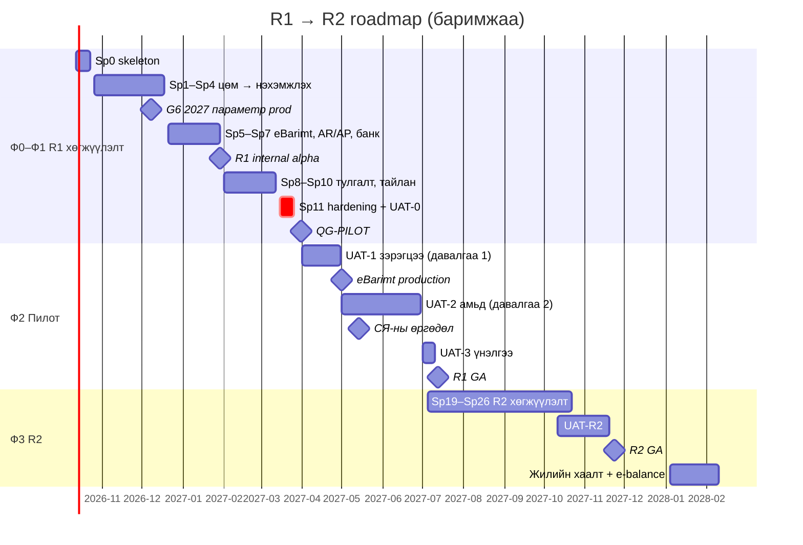
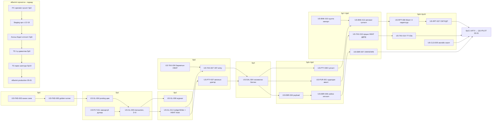

# 17. Хүргэлтийн төлөвлөгөө: backlog ба roadmap (Delivery plan)

> **Төлөв:** Хөгжүүлэлтэд бэлэн төлөвлөгөө, v1.0. **Огноо:** 2026-10-08.
> **Нэг эх сурвалж:** [DECISIONS.md](./DECISIONS.md). Энэ баримт DECISIONS.md, батлагдсан ADR эсвэл модулийн spec-тэй зөрвөл тэдгээр нь давамгайлж, энэ баримтыг засна ([00 §11.3](./00-overview.md)). DB-ийн нэрийн эх сурвалж нь `db/schema/*.sql` (D-K1).
> **Оролт:** [00-overview.md](./00-overview.md) (хуваарь, хэмжүүр, нийцлийн хаалга), [01-requirements.md](./01-requirements.md) (FR/NFR/CMP), модулийн spec [05](./05-posting-engine.md)…[15](./15-ui-ux.md), [16-test-strategy.md](./16-test-strategy.md) (golden scenario, чанарын хаалга, UAT), [18-dev-setup.md](./18-dev-setup.md) (DoR/DoD, Sprint 0, release).
> **Уншигч:** бүтээгдэхүүний эзэн (PO), tech lead, хөгжүүлэгч, QA, DevOps, нягтлан ба татварын зөвлөх, нийцлийн хариуцагч, пилотын support.

---

## Агуулга

0. [Энэ баримтыг хэрхэн унших](#0-энэ-баримтыг-хэрхэн-унших)
1. [Баг, хэмнэл, таамаг](#1-баг-хэмнэл-таамаг)
2. [Milestone ба хуулийн календарь](#2-milestone-ба-хуулийн-календарь)
3. [Epic-ийн тойм](#3-epic-ийн-тойм)
4. [R1-ийн user story (epic бүрээр)](#4-r1-ийн-user-story-epic-бүрээр)
5. [R2 ба R3 (epic түвшин)](#5-r2-ба-r3-epic-түвшин)
6. [Мөрдөх чадвар: FR → story](#6-мөрдөх-чадвар-fr--story)
7. [R1-ийн sprint бүрийн төлөвлөгөө](#7-r1-ийн-sprint-бүрийн-төлөвлөгөө)
8. [Critical path ба гадаад хамаарал](#8-critical-path-ба-гадаад-хамаарал)
9. [Эрсдэл ба нөөц (buffer)](#9-эрсдэл-ба-нөөц-buffer)
10. [Definition of Ready / Done](#10-definition-of-ready--done)
11. [Release-ийн шалгах хуудас](#11-release-ийн-шалгах-хуудас)
12. [Пилот компанийг ашиглалтад оруулах runbook](#12-пилот-компанийг-ашиглалтад-оруулах-runbook)
13. [Тоо ба хамралтын дүн](#13-тоо-ба-хамралтын-дүн)
14. [Нээлттэй асуулт ба баримтуудын зөрүү](#14-нээлттэй-асуулт-ба-баримтуудын-зөрүү)

---

## 0. Энэ баримтыг хэрхэн унших

### 0.1 Зорилго ба хамрах хүрээ

Энэ баримт нь spec-ийн багцыг **ажил** болгон хувиргана: баг ба хэмнэл, milestone, epic ба user story, sprint бүрийн төлөвлөгөө, critical path, эрсдэл, release-ийн шалгах хуудас, пилот компанийг ашиглалтад оруулах runbook. [00 §11.1](./00-overview.md)-д төлөвлөсөн `19-testing-rollout.md`-ийн "backlog, нэвтрүүлэлт" хэсгийг энэ баримт орлоно; тестийн стратегийг [16-test-strategy.md](./16-test-strategy.md) хариуцна.

Энэ баримт шаардлага, бизнесийн дүрэм, тооцооллыг **давтаж бичихгүй**. Story бүр FR-ийн ID, spec-ийн хэсэг, хүлээн авах тестийн ID-аар эх сурвалж руугаа заана.

### 0.2 Тэмдэглэгээ

| Тэмдэглэгээ | Утга |
|---|---|
| `EP-GL`, `EP-R2-FX` | Epic. R1-ийн epic нь модуль эсвэл чиглэл бүрт нэг. R2/R3-ийн epic-ийг epic түвшинд л задалсан (§5) |
| `US-GL-004` | User story: `US-<epic>-<NNN>`. ID-г нэг удаа олгоно, хасвал дахин ашиглахгүй ([01 §1.1](./01-requirements.md)-тэй ижил дүрэм) |
| Шаардлага | [01-requirements.md](./01-requirements.md)-ийн FR, NFR, CMP ID. FR-ийн хамралтыг §6 шалгана |
| Spec | Модулийн spec-ийн хэсэг. Жишээ: "[05](./05-posting-engine.md) §5.4" = 05-posting-engine.md-ийн §5.4 |
| Хүлээн авах шалгуур → тест | `FR-…-AC1` = 01-ийн Gherkin шалгуур. `GS-…` = golden scenario ([16 §12.2](./16-test-strategy.md)). `AT-…` = модулийн spec-ийн хүлээн авах тест (05 `AT-PST`, 06 `AT-SAL`/`AT-AR`, 07 `AT-PUR`/`AT-AP`, 08 `AT-TAX`, 09 `AT-BNK`/`AT-FX`, 10 `AT-PER`/`AT-RPT`/`AT-YEC`/`AT-EBL`, 11 `AT-FA`/`AT-INV`, 12 `AT-EB`, 13 `AT-SEC`, 14 `AT-API`, 15 `AT-UI`). `TS-…` = eBarimt staging тест ([12 §25](./12-ebarimt-integration.md)). `E2E-…`, `UAT-…`, `PERF-…`, `DBT-…`, `INT-OUT-…`, `CT-…` = [16](./16-test-strategy.md)-ийн тест |
| SP | Story point, Фибоначчи (1, 2, 3, 5, 8). 13 SP-ийн story-г sprint-д оруулахгүй, хуваана (§1.3) |
| Эрэмбэ | Story-ийн FR-үүдийн хамгийн өндөр MoSCoW эрэмбэ ([01 §1.3](./01-requirements.md)). FR-гүй техникийн story = **Enabler** (Must-тэй адил заавал) |
| Хамаарал | Тухайн story эхлэхээс өмнө (эсвэл ижил sprint-д түрүүлж) дуусах ёстой story |
| Sprint | `Sp0`…`Sp11` = R1-ийн хөгжүүлэлт; `Sp12`…`Sp18` = пилотын үе; `Sp19`…`Sp29` = R2 (§7) |
| Хув. | `R1` = пилотын build-д (QG-PILOT-оос өмнө); `R1·GA` = пилотын үед, R1 GA-аас өмнө; `R2`, `R3` = DECISIONS §H |
| S1…S4 | Алдааны зэрэглэл ([16 §17.1](./16-test-strategy.md)). Sprint-ийн код **биш** |

### 0.3 Баримтын дотоод шалгалт

Story-ийн жагсаалтаас дараахыг скриптээр шалгасан (2026-10-08):

- R1-ийн FR бүр ≥ 1 story-д, R2/R3-ийн FR бүр epic-д харгалзана (§6).
- R2/R3-ийн FR R1-ийн story-д ороогүй.
- Story-ийн хамаарал нь ижил эсвэл өмнөх sprint-д байна.
- Sprint бүрийн төлөвлөсөн SP нь багтаамжаас хэтрээгүй (§1.3, §7).
- Must эрэмбийн story пилотын sprint-д (`R1·GA`) ороогүй: QG-PILOT нь "R1-ийн Must FR 100%"-ийг шаардана ([16 §16.3](./16-test-strategy.md)).
- Хүлээн авах шалгуурт дурдсан `GS-…` бүр [16 §12.2](./16-test-strategy.md)-ийн индекст байна; R1-ийн golden scenario бүр story-д холбогдсон.

Story нэмэх, хасах, sprint солихдоо эдгээр шалгалтыг дахин хийнэ.

---

## 1. Баг, хэмнэл, таамаг

### 1.1 Баг ба үүрэг

[02 §1.1](./02-architecture.md)-ийн "4–6 инженер"-ийн дээд хязгаараар төлөвлөнө. Хөгжүүлэлтийн багтаамжийг (SP) зөвхөн инженерүүдээр тооцно.

| Үүрэг | FTE | Гол хариуцлага | CODEOWNERS ([18 §8.3](./18-dev-setup.md)) |
|---|---:|---|---|
| Бүтээгдэхүүний эзэн (PO) | 1 | Backlog-ийн эрэмбэ, DoR, нийцлийн хаалгын эзэн (ADR-0023 E), go/no-go, ITC/СЯ/ММНБИ-тэй харилцаа | — |
| Tech lead / архитектор | 1 (кодод 50%) | Архитектур, ADR, critical path, posting engine-ийн review | `@ledger-owners` |
| Backend инженер — ledger | 1 | Posting engine, GL, үе ба хаалт, AR/AP-ийн цөм | `@ledger-owners` |
| Backend инженер — tax ба eBarimt | 1 | НӨАТ, хуулийн параметр, eBarimt adapter, staging гэрчилгээ | `@tax-owners`, `@ebarimt-owners` |
| Backend инженер — platform ба bank | 1 | Тенант, auth, эрх, аудит, банк/касс, импорт, тайлан | — |
| Frontend инженер | 2 | SPA, AG Grid, баримтын дэлгэц, тайлан, хүртээмж, i18n | — |
| DevOps / SRE | 1 | CI/CD, Монголын ДТ, PosAPI instance, нөөц, ажиглалт, on-call | `@devops` |
| QA lead | 1 | Тестийн төлөвлөлт, E2E, UAT, алдааны triage, traceability | — |
| UX дизайнер | 0.5 | Wireframe, монгол текст, usability | — |
| Нягтлан зөвлөх | 0.5 | Golden scenario-д гарын үсэг, DoR-ийн бичилтийн хүснэгт, UAT | `@accounting-reviewers` |
| Татварын зөвлөх | 0.2 | НӨАТ, eBarimt, QG-LAW, ⚠ шийдвэрүүд | `@tax-owners` (review) |
| Нийцэл ба хуульч | 0.2 | G1, G3, G5, DPA, Order 47-ийн матриц | — |
| Support / onboarding | 1 (2027-03-аас) | Пилотын onboarding, эхний үлдэгдлийн импорт, hypercare (§12) | — |

### 1.2 Хэмнэл ба ёслол

Sprint нь **2 долоо хоног** (Даваа → дараагийн долоо хоногийн Баасан). Production release нь [18 §8.4](./18-dev-setup.md)-ийн дагуу 2 долоо хоног тутам **Мягмар 10:00** (Улаанбаатар), freeze календарийг ([02 §14.6](./02-architecture.md)) `cd.yml` шалгана.

| Ёслол | Хэзээ | Хугацаа | Оролцогч | Гаралт |
|---|---|---|---|---|
| Sprint planning | Sprint-ийн 1-р Даваа 10:00 | 2 ц | Баг, PO, нягтлан зөвлөх (posting-тэй story-д) | Sprint-ийн зорилго, commitment ≤ багтаамж (§1.3) |
| Daily stand-up | Өдөр бүр 09:30 | 15 мин | Баг | Саад, critical path-ийн төлөв |
| Backlog refinement | Долоо хоног бүрийн Лхагва | 1 ц | PO, tech lead, QA, зөвлөх | Дараагийн 2 sprint-ийн story DoR-д нийцсэн (§10.1) |
| Golden scenario review | Долоо хоног бүрийн Пүрэв | 1 ц | Нягтлан зөвлөх, `@ledger-owners`, QA | `GS-…` YAML-д гарын үсэг ([16 §11.10](./16-test-strategy.md)); SLA ≤ 5 ажлын өдөр |
| Sprint review / demo | Sprint-ийн 2-р Баасан | 1 ц | Баг, PO, зөвлөх; пилотын үед пилот нягтлан | Staging-ийн демо тенант дээр ажиллаж буй функц |
| Retrospective | Review-ийн дараа | 45 мин | Баг | 1–2 сайжруулалт |
| Production release | Sprint-ийн 1-р Мягмар 10:00 (өмнөх sprint-ийн үр дүн) | — | Tech lead + ledger owner/devops | QG-PROD ([16 §17.2](./16-test-strategy.md)) |
| Нийцлийн хаалгын хяналт | Сар бүрийн эхний Даваа | 30 мин | PO, нийцлийн хариуцагч | G1–G6-ийн төлөв ([00 §9](./00-overview.md)) |
| Пилотын sync | Пилотын үед долоо хоног бүр | 1 ц | PO, support, пилот нягтлан | Санал, алдааны triage ([16 §16.6](./16-test-strategy.md)) |

### 1.3 Story point ба багтаамж

- **Калибровк:** 1 SP ≈ нэг инженерийн 0.5 цэвэр ажлын өдөр (тест, review, баримтыг оруулаад). [18 §9.1](./18-dev-setup.md)-ийн "үнэлгээ ≤ 3 өдөр" дүрмээр 5 SP хүртэлх story шууд орно; 8 SP-ийн story-г planning дээр ≤ 3 өдрийн task-ууд болгон задалж, хоёр инженер хамт хийнэ; 13 SP-ийг хуваана.
- **Нийт хүчин чадал:** 6 инженер (backend 3, frontend 2, DevOps 1) × 14 SP + tech lead 0.5 × 14 ≈ **91 SP** sprint-д (10 ажлын өдөр, focus factor 0.7).
- **Нөөц:** 20%-ийг алдаа, review, тусламж, гэнэтийн ажилд үлдээнэ. Төлөвлөх багтаамж нь **72 SP**.
- **Тохируулга:** Sp0 = 50 (тохиргоо, onboarding), Sp1 = 60 (ramp-up), Sp5 = 43 (шинэ жил, 60%), Sp8 = 54 (Цагаан сар, 75%), Sp10 = 65 (3-р сарын 8, 90%), Sp11 = 36 (hardening, 50%).
- **Пилотын sprint (Sp12…Sp18):** багтаамжийн ≥ 50% нь пилотын алдаа (S1 ≤ 24 ц, S2 ≤ 3 ажлын өдөр) ба hypercare-д; story-д ≤ 36 SP.
- **Velocity-г хянах:** Sp1…Sp3-ийн бодит velocity-гоор Sp4-өөс хойших төлөвлөгөөг шинэчилнэ. 2 sprint дараалан < 85% бол §9.1-ийн scope buffer-ийг хэрэглэнэ.

Sp0…Sp11-ийн нийт төлөвлөх багтаамж **740 SP**, төлөвлөсөн story **719 SP** (нөөц 21 SP, sprint бүрийн 20%-ийн нөөцөөс гадна).

### 1.4 Таамаг

| # | Таамаг | Эвдэрвэл |
|---|---|---|
| A-01 | Баг 2026-10-12-нд бүрэн бүрэлдсэн (§1.1). Нягтлан зөвлөхтэй гэрээ Sp0-д | Sp1–Sp3-ийн velocity буурна → §9.1 |
| A-02 | Spec-ийн багц (DECISIONS, 01…16, 18, db/schema) батлагдсан. ⚠ шийдвэрүүд (D-C2, D-C3, D-C7, D-D3, D-D4, D-E3…E5) Sp2-оос өмнө баталгаажина | Posting-ийн golden scenario дахин бичигдэнэ |
| A-03 | Канон `db/schema` ба `db/seed` нь Sp0-д өөрчлөлтгүй орно; дараагийн өөрчлөлт `V<NNNN>` migration-аар ([02 §14.4](./02-architecture.md)) | Migration-ийн ажил нэмэгдэнэ |
| A-04 | ITC-ээс operator статус ба staging эрх 2026-12-18-аас өмнө ([00 §9](./00-overview.md) G2) | eBarimt-ийн гэрчилгээ хойшилно → R-01 |
| A-05 | Монголын ДТ-ийн гэрээ 2026-11-13-аас өмнө (2 ДТ, S3, SLA) | G6-ийн огноо эрсдэлд → R-07 |
| A-06 | Пилотын 3–5 компани (≥ 1 гэрээт нягтлан, ≥ 1 НӨАТ төлөгч бус, ≥ 1 бэлэн/QPay борлуулалттай) 2027-03-19-өөс өмнө гэрээ, DPA-тай | Пилот хойшилно → R-10 |
| A-07 | Пилотын компани R1-ийн хүрээнд багтана: MNT-ээр л, perpetual бараагүй (зөвхөн Service/Non-Inventory), НХАТ төлөгч биш, үндсэн хөрөнгийн бүртгэлийг R2 хүртэл Excel-д | Сонгон шалгаруулалтын шалгуур (§12.1) |
| A-08 | 2027 оны хуулийн параметр ([legal-parameters.md](./research/legal-parameters.md)) 2026-12-01 хүртэл өөрчлөгдөхгүй; өөрчлөгдвөл QG-LAW-аар | US-FND-011 давтагдана |
| A-09 | Order 47-ийн бүрэн текст ба ММНБИ-ийн урьдчилсан зөвлөгөө Sp2-оос өмнө | Архитектурын өөрчлөлт хожуу → R-06 |
| A-10 | Пилотын хугацаанд эхний сар (UAT-1) хуучин батлагдсан программ хууль ёсны бүртгэл хэвээр ([16 §16.2](./16-test-strategy.md)) | R-02 |
| A-11 | Цагаан сар 2027 нь 2-р сарын эхний долоо хоногт (≈ 3 амралтын өдөр). Огноог Улсын баярын тогтоолоор тодруулна | Sp8-ийн багтаамж |
| A-12 | .NET 10 LTS, PostgreSQL 17/18, NuGet/npm-ийн хувилбарууд [starter/Directory.Packages.props](./starter/Directory.Packages.props)-оор түгжигдсэн | — |

---

## 2. Milestone ба хуулийн календарь

### 2.1 Milestone

[00 §10](./00-overview.md)-ийн үе шат (Ф0…Ф4)-ийг sprint-ийн огноонд буулгав. Нийцлийн хаалга (G1…G6) ба чанарын хаалга (QG-…) огнооноос давамгайлна.

| # | Milestone | Огноо | 00 §10 | Гарах нөхцөл | Хаалга |
|---|---|---|---|---|---|
| M-00 | **Sprint 0 дууссан (skeleton)** | 2026-10-23 (Sp0) | Ф0 | [18 §16](./18-dev-setup.md)-ийн PR 1–10 merge; staging-д анхны deploy; GS-GL-001 ногоон; dev орчин ≤ 1 цагт босно | QG-MAIN |
| M-01 | Production орчин + 2027 оны параметр | 2026-12-08 (Мя, Sp4) | 2027 оны параметр | `v0.1.0` production-д (тенантгүй); `tax_parameter`-ийн 2027-01-01 ба 2027-07-01 мөр; QG-LAW | **G6** (≤ 2026-12-15) |
| M-02 | **R1 internal alpha** | 2027-01-29 (Sp7) | Ф1 | Демо тенант дээр: wizard → нэхэмжлэх/бэлэн борлуулалт → eBarimt (staging) → кредит нот → банкны төлбөр ба тулгалт → худалдан авалт ба орцын НӨАТ → сар хаах → гүйлгээ баланс. Нягтлан зөвлөх + 2 найрсаг нягтлангийн demo | §11.1 |
| M-03 | Feature complete (R1 Must 100%) | 2027-03-12 (Sp10) | Ф1 | R1 Must FR бүр story-тэй, автомат тесттэй; R1 golden scenario 100%; eBarimt staging-ийн гарах шалгуур | QG-RC (урьдчилсан) |
| M-04 | RC + UAT-0 | 2027-03-26 (Sp11) | Ф1 → Ф2 | `v1.0.0-rc.1`; UAT-01…18 дотоод гүйцэтгэл ≥ 95%, S1/S2 = 0 ([16 §16.2](./16-test-strategy.md)) | QG-RC |
| M-05 | **QG-PILOT** | 2027-03-31 | Ф2 | §11.2 | **G2, G3, G4, G6** |
| M-06 | Пилот, давалгаа 1 (UAT-1, зэрэгцээ ажиллагаа) | 2027-04-01 – 04-30 (Sp12–Sp14) | Ф2 | 3–5 компани; эхний үлдэгдэл 2027-04-01; манай системд eBarimt унтраастай | — |
| M-07 | eBarimt production + UAT-2 (амьд пилот) | 2027-05-01 | Ф2 | 4-р сарын тулгалтын зөрүү 0 эсвэл тайлбартай; [12 §23.1](./12-ebarimt-integration.md) компани бүрд | G2 (production) |
| M-08 | СЯ-ны программын жагсаалтад өргөдөл | ≤ 2027-05-14 (Sp14–Sp15) | СЯ-ны өргөдөл | Order 47-ийн матриц + нотолгоо, PAdES (G5), демо тенант, гарын авлага | **G1, G5** (өргөдөл) |
| M-09 | Пилот, давалгаа 2 (нийт 5–10 компани) | 2027-05-10 – 06-30 | Ф2 | Давалгаа 1-ийн 4-р сарын хаалт амжилттай; S1 = 0 | — |
| M-10 | Манай системээс анхны ТТ-03а | 2027-06-10 (5-р сарын тайлан) | Ф2 | e-tax-ийн дүн = манай тайлан (UAT-09) | — |
| M-11 | **R1 GA** | 2027-07-13 (Мя, Sp19) | R1 GA | UAT-3 (07-01…07-10), §11.3 | **QG-GA-R1; G1–G4, G6** |
| M-12 | R2 feature complete | 2027-10-22 (Sp26) | Ф3 | R2 Must FR 100%; GS-FX, GS-FA, GS-INV, НХАТ-ын golden | — |
| M-13 | UAT-R2 | 2027-10-11 – 11-19 | Ф3 | [16 §16.2](./16-test-strategy.md) | — |
| M-14 | **R2 GA** | 2027-11-23 (Мя, Sp29) | Ф3 | §11.6 | **QG-R2** |
| M-15 | 2027 оны жилийн хаалт ба e-balance | 2028-01-04 – 2028-02-10 | Ф3 | Пилот/GA компани бүр жилээ хааж, Маягт А + шивэх хуудсаа гаргасан; архивын багц | — |
| M-16 | R3 эхлэх | 2028 H1 | Ф4 | Пилот ба GA-ийн санал, API-ийн боломжоор эрэмбэлнэ (§5.2) | — |

### 2.2 Хуулийн огноо ба төлөвлөгөөнд үзүүлэх нөлөө

| Огноо / давтамж | Хуулийн үйл явдал | Төлөвлөгөөнд | Story / хаалга |
|---|---|---|---|
| **2026-12-15** хүртэл | 2027-01-01-ний багцыг production-д ≥ 14 хоногийн өмнө (QG-LAW) | Production орчинг Sp2–Sp3-т бэлдэж, 2026-12-08-нд `v0.1.0` гаргана (12-09…10 freeze-ээс өмнө) | US-FND-010, US-FND-011, US-TAX-001; G6 |
| **2027-01-01** | 2027 оны татварын багц хүчин төгөлдөр (ААНОАТ-ын 3 шатлал г.м., D-E7, D-K5) | Кодын release шаардахгүй, зөвхөн `tax_parameter`. R1 golden scenario бүр `y2027` variant-тай ([16 §12.2](./16-test-strategy.md)). Пилот 2027-04-01-нээс эхэлдэг тул пилотын санхүүгийн жил бүхэлдээ 2027 оны дүрмээр | GS-VAT-018, GS-SAL-012; QG-LAW |
| **Сар бүрийн 10** | НӨАТ-ын тайлан (ТТ-03а) | 9–10-нд production freeze. Пилотын үед сарын 1–10-нд support-ийн "НӨАТ-ын долоо хоног". 4-р сарын тайланг хуучин процессоор, 5-р сарын тайланг (06-10) манай системээр | US-TAX-014…017; M-10 |
| **Сар бүрийн 1–7** | Өмнөх сарын B2B баримтын засвар `reportMonth`-оор ([12 §12](./12-ebarimt-integration.md), D-J4) | Staging-ийн TS-17-ийг сарын 1–7-нд л гүйцэтгэж болно: 2027-02-01…02-05 (Sp8, US-EBR-011); давтлага 2027-03-01…03-05 (Sp10) | US-EBR-011, US-EBR-019 |
| **72 цаг** | eBarimt-ийн баримтыг төв системд илгээх ([00 §2.1](./00-overview.md)) | `sendData` job ба alert нь пилотоос өмнө | US-EBR-013, US-OPS-001 |
| **1, 4, 7, 10-р сарын 18–20** | ААНОАТ-ын улирлын тайлан | Production freeze; release-ийн огноонд тусгасан | §7 |
| **2027-02-10** | 2026 оны жилийн санхүүгийн тайлан | Пилот 2027-04-01-нээс эхэлдэг тул 2026 оны тайлан манай системд биш. Эхний үлдэгдэл нь 2026 оны хаалтын балансаас. 02-05…02-10 freeze (Sp8) | US-GL-016, US-INT-005 |
| **2027-07-01** | НӨАТ-ын бүртгэлийн босго 400 сая ₮ (D-K5) | НӨАТ төлөгч бус горим (Sp6), `NOT_VAT` баримт (Sp8), босгын хяналт (Sp13) нь 07-01-ээс өмнө production-д. 06-р сард бүртгэлээс гарах компанийн runbook (§12.4) | US-TAX-012, US-EBR-015, US-TAX-013 |
| **2028-02-10** | 2027 оны жилийн санхүүгийн тайлан (e-balance) | R1-ийн жилийн хаалт (Sp10), Маягт А, шивэх хуудас; R2-ийн жилийн хаалтын давтлага 2027-12-ээс өмнө; 2028-02-05…10 freeze | US-CLS-005, US-RPT-007…010, EP-R2-YE |
| **Жил бүр** | 10 жилийн хадгалалт, архивын багц | 2027 оны анхны архивын багц 2028-02-ийн дараа | US-RPT-012, US-PLT-021 |
| **2022-05-01-нээс хүчинтэй** | ХХМХТХ: DPA, зөрчлийг даруй мэдэгдэх (22.2), ХЭҮК-д жилийн бүртгэл (22.6) | Пилотын production өгөгдлөөс өмнө G3 хаагдана | US-PTY-004, US-CMP-002; §11.2 |

### 2.3 Хуваарийн зураг

---

## 3. Epic-ийн тойм

### 3.1 R1-ийн epic

| Epic | Нэр | Эзэн баг | FR (R1) | Story | SP | Үүнээс Must/Enabler SP | Should/Could SP | Sprint |
|---|---|---|---:|---:|---:|---:|---:|---|
| EP-FND | Суурь ба Sprint 0 (walking skeleton) | tech lead, devops | 2 | 13 | 65 | 63 | 2 | Sp0…Sp4 |
| EP-PLT | Платформ: тенант, нэвтрэлт, эрх, дугаарлалт, аудит | platform | 19 | 21 | 108 | 80 | 28 | Sp1…Sp13 |
| EP-GL | Ерөнхий дэвтэр ба posting engine | ledger-owners | 20 | 17 | 79 | 68 | 11 | Sp1…Sp12 |
| EP-CLS | Үе ба хаалт | ledger-owners | 5 | 6 | 27 | 22 | 5 | Sp2…Sp11 |
| EP-TAX | НӨАТ ба хуулийн параметр | tax-owners | 18 | 18 | 82 | 67 | 15 | Sp1…Sp14 |
| EP-PTY | Харилцагч, нийлүүлэгч, авлага/өглөг | ledger-owners | 16 | 15 | 58 | 51 | 7 | Sp3…Sp13 |
| EP-ITM | Бараа/үйлчилгээний карт ба валютын суурь | platform | 3 | 3 | 6 | 4 | 2 | Sp3…Sp11 |
| EP-SAL | Борлуулалт | sales | 15 | 12 | 54 | 45 | 9 | Sp3…Sp13 |
| EP-PUR | Худалдан авалт | sales | 7 | 6 | 26 | 20 | 6 | Sp5…Sp8 |
| EP-BNK | Банк ба касс | bank | 18 | 17 | 68 | 54 | 14 | Sp3…Sp11 |
| EP-EBR | eBarimt (PosAPI 3.0) | ebarimt-owners | 16 | 19 | 76 | 73 | 3 | Sp4…Sp12 |
| EP-RPT | Тайлан | reporting | 17 | 13 | 62 | 55 | 7 | Sp7…Sp13 |
| EP-INT | Интеграц: REST API, Excel импорт/экспорт | platform | 7 | 7 | 29 | 21 | 8 | Sp1…Sp15 |
| EP-OPS | Үйл ажиллагаа, аюулгүй байдал, гүйцэтгэл (NFR) | devops, QA | 0 | 7 | 32 | 32 | 0 | Sp9…Sp14 |
| EP-CMP | Нийцэл (G1–G6) | PO, compliance | 1 | 5 | 26 | 18 | 8 | Sp11…Sp14 |
| **R1 нийт** | | | **160** | **179** | **798** | **673** | **125** | Sp0…Sp15 |

"Must/Enabler SP" нь заавал хийх ажил: Must FR-тэй story бүгд QG-PILOT-оос өмнө (Sp0…Sp11), харин GA-д шаардлагатай Enabler (DR дасгал, pentest, СЯ-ны өргөдлийн багц) пилотын үед. "Should/Could SP"-ийн нэг хэсэг нь пилотын sprint-д (`R1·GA`) төлөвлөгдсөн бөгөөд энэ нь scope buffer болно (§9.1).

### 3.2 Story-ийн мөрийг хэрхэн унших

Мөр бүр DoR-ийн ([18 §9.1](./18-dev-setup.md)) хамгийн бага агуулгыг өгнө: persona-тай story, шаардлагын ID, spec-ийн хэсэг, хүлээн авах шалгуур ба тестийн ID, үнэлгээ, хамаарал, sprint. Story-г sprint-д авахын өмнө refinement дээр дараахыг нэмнэ: API ба UI-ийн ноорог, posting-д нөлөөлөх бол нягтлангийн бичилтийн хүснэгт (golden-ийн ноорог), PII талбар, task-ийн задаргаа.

Story-ийн текст нь "**&lt;Persona&gt;** болохын хувьд … хүсч байна, ингэснээр …" хэлбэртэй. Persona нь [00 §3.2](./00-overview.md)-ийнх (Owner, Нягтлан, Гэрээт нягтлан, Борлуулагч/Кассчин, Үзэгч) эсвэл техникийн оролцогч (Систем, Хөгжүүлэгч, DevOps, Платформын оператор, Нийцлийн хариуцагч).

---

## 4. R1-ийн user story (epic бүрээр)

### EP-FND — Суурь ба Sprint 0 (walking skeleton)

**Хамрах хүрээ:** Starter-ээс репо, migrator, канон схем, building block, CI/CD, staging, production орчин, spike. **Эзэн:** `tech lead, devops`. **Story:** 13, **SP:** 65.

| ID | Story | Шаардлага | Spec | Хүлээн авах шалгуур → тест | SP | Эрэмбэ | Хамаарал | Sprint · Хув. |
|---|---|---|---|---|---:|---|---|---|
| US-FND-001 | **Хөгжүүлэгч** болохын хувьд `starter/`-ээс шинэ репо, ruleset, CODEOWNERS багуудыг тохируулахыг хүсч байна, ингэснээр эхний өдрөөс PR-ээр л ажиллана. | NFR-113 | [18](./18-dev-setup.md) §16 (PR 1), [18](./18-dev-setup.md) §8 | `main` ruleset (`ci-ok`, `two-approvals`) идэвхтэй; мэдрэмтгий замд 2 approval шаардагдана (18 §8.3) | 3 | Enabler | — | Sp0 · R1 |
| US-FND-002 | **Хөгжүүлэгч** болохын хувьд solution, 3 host, 6 BuildingBlocks, 13 модуль × 5 давхарга ба architecture тестийг хүсч байна, ингэснээр модулийн хил анхнаасаа хамгаалагдана. | NFR-113 | [18](./18-dev-setup.md) §16 (PR 2), [18](./18-dev-setup.md) §2.4, [02](./02-architecture.md) §5.4 | 18 §2.4-ийн 14 architecture дүрэм ногоон; `packages.lock.json` commit хийгдсэн | 5 | Enabler | US-FND-001 | Sp0 · R1 |
| US-FND-003 | **Хөгжүүлэгч** болохын хувьд `Erp.Migrator` ба канон `db/schema` (000…920), `db/seed`-ийг өөрчлөлтгүй embed хийхийг хүсч байна, ингэснээр DB нь D-K1-ийн цорын ганц эх сурвалжаас үүснэ. | NFR-002, NFR-030, NFR-050 | [18](./18-dev-setup.md) §16 (PR 3–4), [02](./02-architecture.md) §14.4, [ADR-0014](./adr/ADR-0014-sql-first-migrations.md) | CI: `migrate` → `verify` → `db/tests/catalog_checks.sql`, `smoke.sql`, `seed_checks.sql` ногоон; DBT-RLS, DBT-IMM (16 §8.2–8.3) | 8 | Enabler | US-FND-002 | Sp0 · R1 |
| US-FND-004 | **Хөгжүүлэгч** болохын хувьд `MoneyMath`, `Money`, `BusinessDate`, `TenantSession`, ProblemDetails, Idempotency filter зэрэг building block-ийг хүсч байна, ингэснээр мөнгөний 12 дүрэм (18 §4.2) кодоор хамгаалагдана. | NFR-002, NFR-004 | [18](./18-dev-setup.md) §16 (PR 5), [18](./18-dev-setup.md) §4, [ADR-0006](./adr/ADR-0006-money-and-rounding.md) | Unit + property тест (16 §6, PBT мөнгө); ERP0001 analyzer `double`-ыг хориглоно | 5 | Enabler | US-FND-002 | Sp0 · R1 |
| US-FND-005 | **Ledger owner** болохын хувьд `PostgresFixture`, golden runner ба GS-GL-001-ийн нимгэн end-to-end зүсэлтийг хүсч байна, ингэснээр нягтлан баталсан хүлээгдэх үр дүн CI-д эхний долоо хоногоос шалгагдана. | NFR-006 | [18](./18-dev-setup.md) §16 (PR 6, 10), [16](./16-test-strategy.md) §11 | GS-GL-021…024, GS-VAT-023 (starter-ийн `tests/Golden/Drafts`, зөвхөн `GL_ACCOUNT` тал) ногоон; GS-GL-001 (05 E-A) нь `BANK_ACCOUNT` тал, dimension set, `audit.posting_log`-оос хамаарах тул US-BNK-002 ба US-GL-009-ийн DoD-д шилжинэ (REVIEW-readiness.md); RLS тест (tenant A ≠ B, контекстгүй query алдаа) | 8 | Enabler | US-FND-003, US-FND-004 | Sp0 · R1 |
| US-FND-006 | **Frontend хөгжүүлэгч** болохын хувьд Vite + React + TS SPA, i18n (`mn`/`en`), BFF login stub, AG Grid ба `api:gen`-ийг хүсч байна, ингэснээр дэлгэц бүр нэг загвараар эхэлнэ. | NFR-060, NFR-071 | [18](./18-dev-setup.md) §16 (PR 7), [15](./15-ui-ux.md) §13–§14, [ADR-0015](./adr/ADR-0015-frontend-react-ag-grid.md) | SPA build ногоон; ESLint хориг (float, hardcoded текст); pseudo-locale screenshot (E2E-15) | 5 | Enabler | US-FND-002 | Sp0 · R1 |
| US-FND-007 | **eBarimt owner** болохын хувьд PosAPI client-ийн араг, WireMock mock ба outbox state machine-ийг хүсч байна, ингэснээр `POST /rest/receipt` retry хийхгүй гэдэг дүрэм анхнаасаа тестээр баталгаажна. | NFR-007, NFR-023 | [18](./18-dev-setup.md) §16 (PR 8), [12](./12-ebarimt-integration.md) §9–§10, [ADR-0012](./adr/ADR-0012-outbox-idempotency-ebarimt.md) | Mock дээр timeout (`99999999901`) → `UNKNOWN`, retry 0; INT-OUT-02 (16 §9.2) араг | 5 | Enabler | US-FND-002 | Sp0 · R1 |
| US-FND-008 | **DevOps** болохын хувьд бүх CI job ногоон, `cd.yml`-ээр staging-д автомат deploy, freeze календарийн шалгалттай pipeline-ийг хүсч байна, ингэснээр `main` үргэлж release хийж болохуйц байна. | NFR-111, NFR-021 | [18](./18-dev-setup.md) §10–§11, [02](./02-architecture.md) §12.7, [02](./02-architecture.md) §14.6 | QG-MAIN (16 §17.2) skeleton дээр ногоон; PR-ийн CI ≤ 15 мин | 8 | Enabler | US-FND-001, US-FND-003 | Sp0 · R1 |
| US-FND-009 | **DevOps** болохын хувьд OpenTelemetry trace/metric/log ба redaction-ийн жагсаалтыг хүсч байна, ингэснээр PII ба `qrData` логт орохгүй. | NFR-100, NFR-102, NFR-041 | [02](./02-architecture.md) §11, [ADR-0020](./adr/ADR-0020-observability-otel-redaction.md) | Redaction-ийн CI шалгалт; Jaeger-т API→DB span харагдана | 3 | Enabler | US-FND-008 | Sp1 · R1 |
| US-FND-010 | **DevOps** болохын хувьд Монголын 2 ДТ-д production топологи (2 app VM, PG primary + sync standby, pgBackRest, PosAPI VM, ops VLAN)-г хүсч байна, ингэснээр 2027 оны параметрийг 2026-12-15-аас өмнө production-д гаргана. | NFR-042, NFR-090, NFR-091, NFR-092 | [02](./02-architecture.md) §12.2–§12.6, [ADR-0013](./adr/ADR-0013-hosting-in-mongolia-posapi-operator.md), [ADR-0022](./adr/ADR-0022-backups-pitr-archive-retention.md), [18](./18-dev-setup.md) §12 | QG-PROD pre-check (`pgbackrest check`, backup < 26 цаг) ногоон; анхны restore drill амжилттай | 8 | Enabler | US-FND-008 | Sp2 · R1 |
| US-FND-011 | **Татварын зөвлөх** болохын хувьд production-д `tax_parameter`-ийн 2027-01-01 ба 2027-07-01-ний мөрүүдийг QG-LAW-аар гаргахыг хүсч байна, ингэснээр G6 хаалга 2026-12-15-аас өмнө хаагдана. | NFR-110, CMP-016 | [00](./00-overview.md) §9 (G6), [16](./16-test-strategy.md) §17.2 (QG-LAW), [legal_parameters.sql](./db/seed/legal_parameters.sql) | GS-VAT-018 (2027-06-30/07-01 хил), y2027 variant-ууд ногоон; release `v0.1.0` 2026-12-08 (Мя) | 3 | Enabler | US-FND-010, US-TAX-001 | Sp4 · R1 |
| US-FND-012 | **PO** болохын хувьд Excel импортын REST гэрээг (`POST /imports` → preview → `:apply`) spike-аар эцэслэхийг хүсч байна, ингэснээр FR-INT-004 ба эхний үлдэгдлийн импорт тодорхой гэрээтэй болно. | FR-INT-004 | [14](./14-api.md) §21 (Q20), [14](./14-api.md) §10 | ADR эсвэл 14-api-д нэмэлт; OpenAPI-д `/imports` бүртгэгдсэн | 2 | Must | — | Sp1 · R1 |
| US-FND-013 | **Bank owner** болохын хувьд Хаан ба Голомт банкны хуулгын жишээ файлыг (нэргүйжүүлсэн) пилотын харилцагчаас цуглуулж parser-ийн профайлыг spike хийхийг хүсч байна, ингэснээр preset хойшлохгүй. | FR-BNK-009 | [09](./09-bank-cash-fx.md) §5.8, [00](./00-overview.md) §12 (эрсдэл 5) | Банк бүрээс ≥ 2 файл, нэргүйжүүлсэн (TST-DATA-03); CT-BNK-01/02-ийн fixture | 2 | Should | — | Sp3 · R1 |

### EP-PLT — Платформ: тенант, нэвтрэлт, эрх, дугаарлалт, аудит

**Хамрах хүрээ:** FR-PLT-001…019. Тенант ба компани, OIDC/BFF, MFA, permission set, No. Series, аудит, хэл, job, support хандалт, хадгалалт. **Эзэн:** `platform`. **Story:** 21, **SP:** 108.

| ID | Story | Шаардлага | Spec | Хүлээн авах шалгуур → тест | SP | Эрэмбэ | Хамаарал | Sprint · Хув. |
|---|---|---|---|---|---:|---|---|---|
| US-PLT-001 | **Шинэ хэрэглэгч** болохын хувьд имэйлээ баталгаажуулж тенант үүсгэхийг хүсч байна, ингэснээр багцын хязгаар (Micro 1, Plus 3, `is_demo` тооцохгүй) дотор компани нээнэ. | FR-PLT-001 | [13](./13-security-audit-tenancy.md) §5.3, [13](./13-security-audit-tenancy.md) §4.1, [ADR-0005](./adr/ADR-0005-tenant-vs-company.md) | FR-PLT-001 AC1–AC2; AT-UI-46 | 5 | Must | US-FND-003, US-FND-006 | Sp1 · R1 |
| US-PLT-002 | **Хэрэглэгч** болохын хувьд OIDC (OpenIddict) BFF + PKCE-ээр нэвтэрч, гарахыг хүсч байна, ингэснээр токен браузерт очихгүй. | FR-PLT-007, NFR-031 | [13](./13-security-audit-tenancy.md) §5.4, [13](./13-security-audit-tenancy.md) §5.10–5.11, [ADR-0016](./adr/ADR-0016-auth-openiddict-bff.md) | AT-SEC-010; E2E-01 (cookie `__Host-`, `HttpOnly`, `SameSite=Strict`) | 8 | Must | US-FND-006 | Sp1 · R1 |
| US-PLT-003 | **Owner/Нягтлан** болохын хувьд TOTP MFA, 5 буруу оролдлогын түгжээ, нууц үг сэргээх, step-up-ийг хүсч байна, ингэснээр санхүүгийн өгөгдөлд хамгаалалттай хандана. | FR-PLT-007, NFR-036 | [13](./13-security-audit-tenancy.md) §5.6–5.8, [13](./13-security-audit-tenancy.md) §5.12 | FR-PLT-007 AC; AT-SEC-011, AT-UI-16 | 5 | Must | US-PLT-002 | Sp2 · R1 |
| US-PLT-004 | **Гэрээт нягтлан** болохын хувьд тенант ба компани хооронд шилжихийг хүсч байна, ингэснээр 10–30 компанийг нэг нэвтрэлтээр хөтөлнө. | FR-PLT-004, NFR-030 | [13](./13-security-audit-tenancy.md) §5.5, [13](./13-security-audit-tenancy.md) §7.4, [02](./02-architecture.md) §7.3 | AT-SEC-001; E2E-12; DBT-RLS (16 §8.2) | 5 | Must | US-PLT-002, US-FND-005 | Sp1 · R1 |
| US-PLT-005 | **Owner** болохын хувьд хэрэглэгчийг имэйлээр урьж, компани бүрт role оноохыг хүсч байна, ингэснээр нягтлан ба борлуулагч өөрийн эрхээр ажиллана. | FR-PLT-004 | [13](./13-security-audit-tenancy.md) §4.3, [13](./13-security-audit-tenancy.md) §4.7, [13](./13-security-audit-tenancy.md) §19 | FR-PLT-004 AC; AT-SEC-002, AT-UI-02 | 5 | Must | US-PLT-004 | Sp2 · R1 |
| US-PLT-006 | **Owner** болохын хувьд BC-ийн permission set (RIMDX) ба 5 анхдагч role-ийг хүсч байна, ингэснээр Sales clerk кредит нот батлах, Viewer өөрчлөх боломжгүй. | FR-PLT-005, NFR-032 | [13](./13-security-audit-tenancy.md) §6.1–6.7, [mn_60_security.sql](./db/seed/mn_60_security.sql) | AT-SEC-020, AT-SEC-021, AT-UI-01; E2E-13; SEC-T-01 матриц | 8 | Must | US-PLT-005 | Sp2 · R1 |
| US-PLT-007 | **Owner** болохын хувьд тенант үргэлж ≥ 1 идэвхтэй Owner-той байхыг хүсч байна, ингэснээр тенант эзэнгүй болохгүй. | FR-PLT-006 | [13](./13-security-audit-tenancy.md) §4.6 | AT-SEC-003 | 2 | Must | US-PLT-005 | Sp3 · R1 |
| US-PLT-008 | **Owner** болохын хувьд компанийн профайлыг (ТТД 11/7 оронтой шалгалт, `vat_registered` огноотой, лого, тамга, захирал/ерөнхий нягтлан) хөтлөхийг хүсч байна, ингэснээр маягт ба eBarimt зөв мэдээлэлтэй гарна. | FR-PLT-002 | [03](./03-domain-model.md) (platform.company, tax.company_tax_profile), [08](./08-tax-vat-mn.md) §3, [15](./15-ui-ux.md) §10 | FR-PLT-002 AC1–AC2 (2027-07-01-нээс `vat_registered = false`) | 5 | Must | US-PLT-001 | Sp2 · R1 |
| US-PLT-009 | **Owner** болохын хувьд компани тохируулах wizard-аар MN анхдагч тохиргоог (`platform.fn_provision_company_mn`) нэг transaction-д үүсгэхийг хүсч байна, ингэснээр 15 минутад анхны нэхэмжлэхээ батална. | FR-PLT-003, NFR-120 | [15](./15-ui-ux.md) §10, [README.md](./db/seed/README.md), [13](./13-security-audit-tenancy.md) §4 | FR-PLT-003 AC1–AC2; AT-API-055, AT-UI-46; E2E-02; `seed_checks.sql` | 8 | Must | US-PLT-008, US-GL-001, US-TAX-002, US-PLT-011, US-BNK-001, US-PTY-005 | Sp4 · R1 |
| US-PLT-010 | **Нягтлан** болохын хувьд компанийн ерөнхий тохиргоог (`platform.company_setup`: бүхэлчлэл, анхдагч журнал, хэвлэх тохиргоо) засахыг хүсч байна, ингэснээр компанийн бодлого нэг газар байна. | FR-PLT-019 | [03](./03-domain-model.md) (platform.company_setup), [06](./06-sales-receivables.md) §3.2, [07](./07-purchases-payables.md) §3.2 | FR-PLT-019 AC; өөрчлөлт `audit.row_change`-д | 3 | Must | US-PLT-008 | Sp4 · R1 |
| US-PLT-011 | **Нягтлан** болохын хувьд хуулийн баримтын дугаар (`PREFIX-YYYY-#####`) завсаргүй, жил бүр шинээр эхлэхийг хүсч байна, ингэснээр Order 47 ба D-C7 хангагдана. | FR-PLT-008, NFR-003 | [05](./05-posting-engine.md) §4.4, [05](./05-posting-engine.md) §5.5, [ADR-0008](./adr/ADR-0008-gapless-numbering.md) | GS-GL-015, GS-GL-020; AT-PST-026; DBT-NUM-02 (16 §8.5.1, 10 зэрэг posting) | 8 | Must | US-FND-005 | Sp1 · R1 |
| US-PLT-012 | **Owner/аудитор** болохын хувьд мастер өгөгдөл, тохиргоо, эрхийн өөрчлөлтийн аудитын логийг (`audit.row_change`) харж, экспортлохыг хүсч байна, ингэснээр "хэн, хэзээ, юу" гэдэг нь нотлогдоно. | FR-PLT-009, NFR-051 | [13](./13-security-audit-tenancy.md) §9.1–9.2, [13](./13-security-audit-tenancy.md) §9.6 | AT-SEC-050, AT-SEC-052; SEC-T-19 | 5 | Must | US-PLT-006 | Sp4 · R1 |
| US-PLT-013 | **Хэрэглэгч** болохын хувьд UI, мессеж, маягтыг монгол (анхдагч) ба англиар, `mn-MN` формат ба `Asia/Ulaanbaatar` цагаар харахыг хүсч байна. | FR-PLT-010, NFR-060, NFR-061, NFR-062, CMP-002 | [15](./15-ui-ux.md) §7, [15](./15-ui-ux.md) §14, [ADR-0017](./adr/ADR-0017-i18n-mongolian-first.md) | AT-UI-55, AT-RPT-83; E2E-15 | 5 | Must | US-FND-006 | Sp3 · R1 |
| US-PLT-014 | **Нягтлан** болохын хувьд ноорог, posted баримт ба ваучерт файл (PDF/JPG/PNG/XLSX ≤ 20 MB) хавсаргахыг хүсч байна, ингэснээр анхан шатны баримт системд хадгалагдана. | FR-PLT-011, CMP-006 | [13](./13-security-audit-tenancy.md) §12.1 (platform.attachment), [02](./02-architecture.md) §10.5 | FR-PLT-011 AC; хавсралт устгах боломжгүй (posted) | 3 | Should | US-GL-006 | Sp11 · R1 |
| US-PLT-015 | **Ерөнхий нягтлан** болохын хувьд баримтад бэлтгэсэн/баталсан/хянасан гарын үсгийн бүртгэлийг (canonical PDF-ийн SHA-256, MFA нотолгоо) хүсч байна, ингэснээр цахим анхан шатны баримт MVP-д баталгаажна. | FR-PLT-012, CMP-031 | [13](./13-security-audit-tenancy.md) §15.2–15.5, [ADR-0023](./adr/ADR-0023-compliance-gates.md) C | AT-SEC-080, AT-RPT-69 | 5 | Should | US-SAL-009, US-PLT-003 | Sp11 · R1 |
| US-PLT-016 | **Нягтлан** болохын хувьд баримтын дугаар ба огноогоор бүх ledger-ээс бичилт хайхыг (Navigate) хүсч байна, ингэснээр нэг баримтын бүх нөлөөг нэг дор харна. | FR-PLT-013 | [05](./05-posting-engine.md) §10.2, [15](./15-ui-ux.md) §15 | FR-PLT-013 AC | 5 | Should | US-SAL-004, US-BNK-002 | Sp12 · R1·GA |
| US-PLT-017 | **Систем** болохын хувьд worker процесс (Quartz, `integration.job_run`, `max_attempts`, dead) хүсч байна, ингэснээр outbox, тайлан, шөнийн шалгалт найдвартай ажиллана. | FR-PLT-014 | [02](./02-architecture.md) §7.6, [13](./13-security-audit-tenancy.md) §7.5, [ADR-0018](./adr/ADR-0018-background-jobs-quartz.md) | AT-SEC-038; INT-OUT-02; job-ын төлөв queued→running→succeeded/failed/dead | 5 | Must | US-FND-007 | Sp2 · R1 |
| US-PLT-018 | **Owner** болохын хувьд хяналтын самбарт касс/банкны үлдэгдэл, авлага/өглөг, хугацаа хэтэрсэн, eBarimt-ийн анхааруулгыг харахыг хүсч байна. | FR-PLT-015 | [15](./15-ui-ux.md) §3 | AT-UI-05, AT-UI-06 | 5 | Should | US-RPT-004, US-EBR-013 | Sp13 · R1·GA |
| US-PLT-019 | **Support** болохын хувьд Owner-ийн олгосон хугацаатай хандалт ба break-glass-ийг хүсч байна, ингэснээр пилотын onboarding-д хуулийн дагуу тусална. | FR-PLT-016 | [13](./13-security-audit-tenancy.md) §7.9, [02](./02-architecture.md) §10.7 | AT-SEC-030, AT-UI-60; бүх үйлдэл аудитын логтой | 5 | Should | US-PLT-012 | Sp9 · R1 |
| US-PLT-020 | **Owner** болохын хувьд тенантын өгөгдлийг бүрэн экспортлохыг (portability) хүсч байна, ингэснээр ХХМХТХ ба гэрээний эрх хангагдана. | FR-PLT-017, NFR-043 | [13](./13-security-audit-tenancy.md) §10.7, [13](./13-security-audit-tenancy.md) §12.5 | AT-SEC-073 | 5 | Should | US-RPT-011 | Sp13 · R1·GA |
| US-PLT-021 | **Нийцлийн хариуцагч** болохын хувьд 10 жилийн хадгалалт, устгалын хориг ба legal hold-ийг хүсч байна, ингэснээр posted өгөгдөл хэзээ ч физикээр устахгүй. | FR-PLT-018, NFR-052, CMP-007 | [13](./13-security-audit-tenancy.md) §12.1–12.5, [ADR-0022](./adr/ADR-0022-backups-pitr-archive-retention.md) | AT-SEC-029, AT-SEC-070, AT-SEC-071 | 3 | Must | US-PLT-012 | Sp9 · R1 |

### EP-GL — Ерөнхий дэвтэр ба posting engine

**Хамрах хүрээ:** FR-GL-001…021, 028 (үе/хаалтаас бусад). Posting engine, журнал, preview, буцаалт, dimension, эхний үлдэгдэл, бүрэн бүтэн байдал. **Эзэн:** `ledger-owners`. **Story:** 17, **SP:** 79.

| ID | Story | Шаардлага | Spec | Хүлээн авах шалгуур → тест | SP | Эрэмбэ | Хамаарал | Sprint · Хув. |
|---|---|---|---|---|---:|---|---|---|
| US-GL-001 | **Нягтлан** болохын хувьд MN стандарт дансны төлөвлөгөөг (5 төрөл, мод бүтэц, Income/Balance, Direct Posting, Blocked) хөтлөхийг хүсч байна. | FR-GL-001 | [05](./05-posting-engine.md) §3.2, [mn_10_coa.sql](./db/seed/mn_10_coa.sql), [10](./10-periods-closing-reporting.md) §3 | FR-GL-001 AC; AT-UI-43; `seed_checks.sql` (182 данс) | 5 | Must | US-FND-003 | Sp1 · R1 |
| US-GL-002 | **Нягтлан** болохын хувьд данс бүр Маягт А-гийн мөрт харгалзаж байгааг шалгахыг хүсч байна, ингэснээр СБТ, ОДТ дутуугүй гарна. | FR-GL-002 | [10](./10-periods-closing-reporting.md) §5.13, [10](./10-periods-closing-reporting.md) §5.4 | AT-PER-33, AT-RPT-63 | 3 | Must | US-RPT-006 | Sp10 · R1 |
| US-GL-003 | **Нягтлан** болохын хувьд хяналтын данс руу шууд бичих хориг, данс блоклох/устгах дүрэм ба Дт/Кт шинжийн анхааруулгыг хүсч байна, ингэснээр дэд дэвтэр ба G/L зөрөхгүй. | FR-GL-003, FR-GL-004, FR-GL-005 | [05](./05-posting-engine.md) §4.2, [05](./05-posting-engine.md) §5.3 | FR-GL-003…005 AC; AT-PST-015 | 3 | Must | US-GL-004 | Sp2 · R1 |
| US-GL-004 | **Систем** болохын хувьд posting engine-ийн цөмийг (PostingRequest, нэг DB transaction, `pg_advisory_xact_lock(company)`, бүх алдааг нэг дор) хүсч байна, ингэснээр бүх баримт нэг кодоор батлагдана. | FR-GL-008, NFR-007 | [05](./05-posting-engine.md) §5.1–5.3, [05](./05-posting-engine.md) §5.15, [05](./05-posting-engine.md) §5.18, [ADR-0009](./adr/ADR-0009-synchronous-posting-advisory-lock.md) | GS-GL-017; AT-PST-004; lock timeout тест | 8 | Must | US-FND-005 | Sp1 · R1 |
| US-GL-005 | **Систем** болохын хувьд transaction, register, `entry_no`-г завсаргүй олгож, тэмдэгтэй дүн ба Σ = 0-ийг (deferred trigger) хангахыг хүсч байна. | FR-GL-007, FR-GL-009, FR-GL-010, NFR-001, CMP-001 | [05](./05-posting-engine.md) §4.3, [05](./05-posting-engine.md) §5.9, [05](./05-posting-engine.md) §6.2–6.3, [ADR-0007](./adr/ADR-0007-append-only-ledger-reversal.md) | GS-GL-001, GS-GL-016; AT-PST-043; PBT (Σ = 0) | 5 | Must | US-GL-004, US-PLT-011 | Sp1 · R1 |
| US-GL-006 | **Нягтлан** болохын хувьд ерөнхий журнал ба ваучерыг grid-ээр (гараар бүрэн) оруулж батлахыг хүсч байна. | FR-GL-006, NFR-071 | [05](./05-posting-engine.md) §5.4, [15](./15-ui-ux.md) §16, [14](./14-api.md) §15 | GS-GL-001; AT-PST-012, AT-PST-013, AT-UI-20; E2E-08 | 8 | Must | US-GL-005, US-INT-001 | Sp2 · R1 |
| US-GL-007 | **Нягтлан** болохын хувьд батлахаас өмнө яг ижил кодоор (ROLLBACK) бичилтийг урьдчилан харахыг хүсч байна. | FR-GL-011 | [05](./05-posting-engine.md) §5.12 | GS-GL-013; AT-API-026, AT-PST-052 | 3 | Must | US-GL-006 | Sp2 · R1 |
| US-GL-008 | **Аудитор** болохын хувьд ledger-ийг засах, устгах боломжгүй (REVOKE + guard trigger, SQLSTATE `ERL01` → апп алдаа) байхыг хүсч байна. | FR-GL-012, NFR-050 | [05](./05-posting-engine.md) §3.6, [ADR-0007](./adr/ADR-0007-append-only-ledger-reversal.md), [02](./02-architecture.md) §8.1 | DBT-IMM; `db/tests/smoke.sql` (ERL01/42501) | 2 | Must | US-GL-005 | Sp1 · R1 |
| US-GL-009 | **Нягтлан** болохын хувьд толгой ба мөрийн dimension, 2 global dimension-ийг (Dimension Set ID) хүсч байна, ингэснээр салбар/төслөөр тайлан гарна. | FR-GL-018 | [05](./05-posting-engine.md) §4.5, [05](./05-posting-engine.md) §5.6, [ADR-0010](./adr/ADR-0010-dimension-sets.md) | GS-GL-014; AT-PST-031 | 5 | Must | US-GL-006 | Sp3 · R1 |
| US-GL-010 | **Нягтлан** болохын хувьд source code ба шалтгааны кодыг бичилт бүрт хүсч байна, ингэснээр бичилтийн гарал тодорхой байна. | FR-GL-020 | [05](./05-posting-engine.md) §3.7 | AT-PST-008, AT-PST-020; GS-GL-006 | 2 | Must | US-GL-005 | Sp2 · R1 |
| US-GL-011 | **Модулийн хөгжүүлэгч** болохын хувьд `ILedgerWriter` гэрээ, НӨАТ-ын hook ба posting buffer-ийг хүсч байна, ингэснээр авлага, өглөг, банк, НӨАТ нэг transaction-д бичигдэнэ. | FR-GL-008 | [05](./05-posting-engine.md) §4.6–4.7, [05](./05-posting-engine.md) §5.7–5.8, [02](./02-architecture.md) §4.5 | GS-GL-002, GS-GL-003; architecture тест (Contracts-оор л) | 8 | Must | US-GL-005 | Sp2 · R1 |
| US-GL-012 | **Нягтлан** болохын хувьд журналаас үүссэн гүйлгээг storno-гүй (эсрэг тэмдэг, эсрэг багана) буцаахыг хүсч байна; баримтаас үүссэнийг хориглоно. | FR-GL-013 | [05](./05-posting-engine.md) §5.10, [05](./05-posting-engine.md) §6.9, D-D5 | GS-GL-006, GS-GL-018; AT-PST-045, AT-PST-046 | 5 | Must | US-GL-006, US-GL-010 | Sp3 · R1 |
| US-GL-013 | **Нягтлан** болохын хувьд register-ийг бүхэлд нь буцаахыг хүсч байна. | FR-GL-015 | [05](./05-posting-engine.md) §5.10 | GS-GL-007 | 3 | Should | US-GL-012 | Sp12 · R1·GA |
| US-GL-014 | **Нягтлан** болохын хувьд хаалттай үеийн гүйлгээг одоогийн үед засварлах саналыг хүсч байна. | FR-GL-014 | [05](./05-posting-engine.md) §5.11, D-D5 | GS-GL-012; AT-PST-075 | 3 | Must | US-GL-012, US-CLS-003 | Sp8 · R1 |
| US-GL-015 | **Нягтлан** болохын хувьд стандарт журналын загвараас ваучер хуулахыг хүсч байна, ингэснээр давтагддаг бичилтийг хурдан оруулна. | FR-GL-016 | [05](./05-posting-engine.md) §5.4 (gl.standard_journal) | FR-GL-016 AC | 3 | Should | US-GL-006 | Sp11 · R1 |
| US-GL-016 | **Нягтлан/Support** болохын хувьд эхний үлдэгдлийг `OPENING` журналаар (G/L, нээлттэй авлага/өглөг баримтаар, касс/банк) батлахыг хүсч байна, ингэснээр насжилт эхний өдрөөс зөв гарна. | FR-GL-021 | [05](./05-posting-engine.md) §7 (E-K), [02](./02-architecture.md) §14.8, D-D7 | FR-GL-021 AC1–AC2; GS-GL-011; UAT-02 | 8 | Must | US-PTY-007, US-PTY-008, US-BNK-002, US-INT-004 | Sp8 · R1 |
| US-GL-017 | **Аудитор** болохын хувьд `gl_register`-ийн hash chain, дэд дэвтэр = хяналтын данс, дугаарын завсрын шөнийн шалгалтыг хүсч байна, ингэснээр хөндлөнгийн оролцоо илэрнэ. | FR-GL-028, NFR-005, NFR-053, CMP-005 | [05](./05-posting-engine.md) §5.9, [13](./13-security-audit-tenancy.md) §9.4, [02](./02-architecture.md) §8.7–8.8 | AT-PER-12, AT-PER-38, AT-PST-044, AT-SEC-091; M8–M10 | 5 | Should | US-PTY-008, US-BNK-002, US-PLT-017 | Sp9 · R1 |

### EP-CLS — Үе ба хаалт

**Хамрах хүрээ:** FR-GL-022…026. Санхүүгийн жил, posting цонх, сарын хаалт, шалгах хуудас, жилийн хаалт. **Эзэн:** `ledger-owners`. **Story:** 6, **SP:** 27.

| ID | Story | Шаардлага | Spec | Хүлээн авах шалгуур → тест | SP | Эрэмбэ | Хамаарал | Sprint · Хув. |
|---|---|---|---|---|---:|---|---|---|
| US-CLS-001 | **Систем** болохын хувьд санхүүгийн жил ба 12 сарыг автоматаар үүсгэж, дараагийн жилийг нээхийг хүсч байна. | FR-GL-022, CMP-003 | [10](./10-periods-closing-reporting.md) §5.2 | AT-PER-01, AT-PER-02, AT-PER-15 | 3 | Must | US-GL-004 | Sp2 · R1 |
| US-CLS-002 | **Owner** болохын хувьд компанийн posting огнооны цонхыг (`allow_posting_from/to`) бүх эрхэд мөрдүүлэхийг хүсч байна. | FR-GL-023 | [10](./10-periods-closing-reporting.md) §5.3, [13](./13-security-audit-tenancy.md) §8.1–8.2 | GS-GL-019; AT-PER-20, AT-PER-21, AT-SEC-040 | 3 | Must | US-CLS-001 | Sp2 · R1 |
| US-CLS-003 | **Нягтлан/Owner** болохын хувьд сарыг хаах, Owner шалтгаантай (step-up) дахин нээх, түгжихийг хүсч байна. | FR-GL-024 | [10](./10-periods-closing-reporting.md) §5.3, [10](./10-periods-closing-reporting.md) §5.5, [13](./13-security-audit-tenancy.md) §8.3–8.4 | GS-CLOSE-001; AT-PER-10, AT-PER-17, AT-SEC-041; E2E-10 | 5 | Must | US-CLS-002, US-PLT-003 | Sp7 · R1 |
| US-CLS-004 | **Нягтлан** болохын хувьд сарын хаалтын шалгах хуудсыг (банк тулгагдсан, eBarimt UNKNOWN 0, баталгаажаагүй орцын НӨАТ г.м.) хүсч байна. | FR-GL-025 | [10](./10-periods-closing-reporting.md) §5.4 | GS-CLOSE-005; AT-PER-13, AT-PER-30 | 5 | Should | US-CLS-003, US-BNK-014, US-EBR-007 | Sp10 · R1 |
| US-CLS-005 | **Нягтлан** болохын хувьд жилийн хаалтыг (12-31-ний `is_closing` бичилт → 3500) wizard-аар хийж, дахин ажиллуулахыг хүсч байна. | FR-GL-026 | [05](./05-posting-engine.md) §5.13, [10](./10-periods-closing-reporting.md) §5.6, D-D4 | GS-GL-008, GS-GL-009, GS-CLOSE-003; AT-YEC-08 | 8 | Must | US-CLS-003 | Sp10 · R1 |
| US-CLS-006 | **Нягтлан** болохын хувьд шинэ жилийн 01-01-нд хуримтлагдсан ашиг руу шилжүүлэх саналыг ба шинэ жилийн гүйлгээ балансыг хүсч байна. | FR-GL-026 | [10](./10-periods-closing-reporting.md) §5.7, [05](./05-posting-engine.md) §6.8 | GS-GL-010, GS-CLOSE-002, GS-CLOSE-004 | 3 | Must | US-CLS-005, US-RPT-001 | Sp11 · R1 |

### EP-TAX — НӨАТ ба хуулийн параметр

**Хамрах хүрээ:** FR-TAX-001…018. VAT posting setup, баримтын түвшний НӨАТ, орцын НӨАТ ДДТД-ээр, НӨАТ төлөгч бус горим, ТТ-03а. **Эзэн:** `tax-owners`. **Story:** 18, **SP:** 82.

| ID | Story | Шаардлага | Spec | Хүлээн авах шалгуур → тест | SP | Эрэмбэ | Хамаарал | Sprint · Хув. |
|---|---|---|---|---|---:|---|---|---|
| US-TAX-001 | **Татварын зөвлөх** болохын хувьд хуулийн параметрийг (`tax.tax_parameter`, `effective_from/to`) огноогоор авахыг хүсч байна, ингэснээр хуулийн өөрчлөлт кодгүйгээр орно. | FR-TAX-017, NFR-110 | [08](./08-tax-vat-mn.md) §5.2, D-E7 | AT-TAX-016, AT-API-047; GS-VAT-018 | 3 | Must | US-FND-003 | Sp1 · R1 |
| US-TAX-002 | **Нягтлан** болохын хувьд VAT Bus. × VAT Prod. матриц ба ангиллыг (VAT10/VAT0/EXEMPT/NOVAT → eBarimt `taxType`) хүсч байна. | FR-TAX-001, FR-TAX-002, CMP-015 | [08](./08-tax-vat-mn.md) §5.3, [08](./08-tax-vat-mn.md) §3, [mn_20_tax.sql](./db/seed/mn_20_tax.sql) | AT-TAX-001, AT-TAX-003, AT-TAX-006; GS-SAL-009 | 5 | Must | US-TAX-001 | Sp2 · R1 |
| US-TAX-003 | **Систем** болохын хувьд НӨАТ-ын хувийг баримтын огноогоор авч, мөр ба VAT entry-д snapshot хийхийг хүсч байна. | FR-TAX-003 | [08](./08-tax-vat-mn.md) §5.2, [08](./08-tax-vat-mn.md) §5.4 | AT-TAX-014; GS-SAL-012 | 2 | Must | US-TAX-002 | Sp3 · R1 |
| US-TAX-004 | **Систем** болохын хувьд НӨАТ-ыг баримтын түвшинд VAT identifier бүрээр Nearest 0.01-ээр тооцож мөрүүдэд running remainder-ээр хуваарилахыг хүсч байна. | FR-TAX-004 | [08](./08-tax-vat-mn.md) §5.4, [06](./06-sales-receivables.md) §6.3, [05](./05-posting-engine.md) §6.6, D-E3 | GS-VAT-001, GS-GL-004; AT-TAX-020; PBT (Σ мөр = баримт) | 8 | Must | US-TAX-003 | Sp3 · R1 |
| US-TAX-005 | **Борлуулагч** болохын хувьд үнэ НӨАТ-тэй (Prices Including VAT) горимоор борлуулахыг хүсч байна. | FR-TAX-005 | [08](./08-tax-vat-mn.md) §5.4, [06](./06-sales-receivables.md) §6.4 | GS-VAT-002; AT-TAX-019 | 3 | Must | US-TAX-004 | Sp3 · R1 |
| US-TAX-006 | **Нягтлан** болохын хувьд кредит нот ба сөрөг мөрийн НӨАТ-ыг тэмдгээр хуваасан бүлэг ба carry-гаар зөв тооцохыг хүсч байна. | FR-TAX-006 | [06](./06-sales-receivables.md) §6.5, [08](./08-tax-vat-mn.md) §5.4 | GS-VAT-013, GS-SAL-008; AT-TAX-018, AT-TAX-029 | 5 | Must | US-TAX-004 | Sp4 · R1 |
| US-TAX-007 | **Систем** болохын хувьд VAT entry-г (`VatLedgerWriter`) G/L-тэй холбож бичихийг хүсч байна. | FR-TAX-007 | [08](./08-tax-vat-mn.md) §5.5–5.6 | GS-GL-002, GS-GL-003, GS-VAT-003; AT-TAX-028 | 5 | Must | US-GL-011, US-TAX-004 | Sp3 · R1 |
| US-TAX-008 | **Нягтлан** болохын хувьд журналын мөрөнд НӨАТ-ын бүлэг сонгож (gross арга) НӨАТ-тай зардал оруулахыг хүсч байна. | FR-TAX-007 | [08](./08-tax-vat-mn.md) §5.7, [05](./05-posting-engine.md) §6.4 | GS-GL-002 | 3 | Must | US-TAX-007, US-GL-006 | Sp4 · R1 |
| US-TAX-009 | **Нягтлан** болохын хувьд хоцорч ирсэн худалдан авалтын VAT date-ийг нээлттэй НӨАТ-ын үе дотор өөрчлөхийг хүсч байна. | FR-TAX-008 | [08](./08-tax-vat-mn.md) §4, [08](./08-tax-vat-mn.md) §5.4, D-E9 | GS-VAT-008; AT-TAX-039, AT-TAX-040 | 2 | Must | US-PUR-001 | Sp7 · R1 |
| US-TAX-010 | **Нягтлан** болохын хувьд орцын НӨАТ зөвхөн нийлүүлэгчийн ДДТД баталгаажсан үед хасагдахыг (`deductible_confirmed`) хүсч байна, ингэснээр татварын эрсдэлгүй. | FR-TAX-009, CMP-018 | [08](./08-tax-vat-mn.md) §5.8, [07](./07-purchases-payables.md) §4.7, [07](./07-purchases-payables.md) §5.10–5.11, [12](./12-ebarimt-integration.md) §16 | GS-VAT-004, GS-VAT-015, GS-PUR-006; AT-TAX-045, AT-TAX-047 | 8 | Must | US-PUR-001, US-PUR-003 | Sp7 · R1 |
| US-TAX-011 | **Нягтлан** болохын хувьд хасагдахгүй орцын НӨАТ-ыг өртөгт шингээх ба баталгаажаагүй НӨАТ-ыг зардалд шилжүүлэхийг хүсч байна. | FR-TAX-010, CMP-019 | [08](./08-tax-vat-mn.md) §5.8, [07](./07-purchases-payables.md) §4.6, [07](./07-purchases-payables.md) §5.12 | GS-VAT-005, GS-VAT-016, GS-PUR-004, GS-PUR-007, GS-PUR-008; AT-TAX-051…053 | 5 | Must | US-TAX-010 | Sp7 · R1 |
| US-TAX-012 | **НӨАТ төлөгч бус компанийн нягтлан** болохын хувьд `vat_registered = false` (огноотой) үед борлуулалтад НӨАТ тооцохгүй, худалдан авалтын НӨАТ-ыг өртөгт шингээхийг хүсч байна. | FR-TAX-011, CMP-016 | [08](./08-tax-vat-mn.md) §5.3, [07](./07-purchases-payables.md) §4.6, D-E5 | GS-VAT-006, GS-SAL-010, GS-PUR-005; AT-TAX-055, AT-PUR-27 | 5 | Must | US-TAX-004, US-PLT-008 | Sp6 · R1 |
| US-TAX-013 | **Owner** болохын хувьд НӨАТ-ын бүртгэлийн босгын (2027-07-01-нээс 400 сая ₮) хяналт ба сануулгыг хүсч байна. | FR-TAX-012, CMP-016 | [08](./08-tax-vat-mn.md) §5.14, D-K5 | GS-VAT-009; AT-TAX-083, AT-TAX-084, AT-TAX-087 | 3 | Should | US-TAX-001, US-SAL-004 | Sp13 · R1·GA |
| US-TAX-014 | **Нягтлан** болохын хувьд VAT Statement загвараар ТТ-03а-гийн туслах тайланг (Excel) гаргахыг хүсч байна, ингэснээр сарын 10-аас өмнө e-tax-д оруулна. | FR-TAX-013, CMP-017 | [08](./08-tax-vat-mn.md) §5.9 | GS-VAT-007; AT-TAX-050, AT-TAX-065, AT-UI-42; UAT-09 | 8 | Must | US-TAX-007, US-TAX-010, US-RPT-011 | Sp9 · R1 |
| US-TAX-015 | **Нягтлан** болохын хувьд ТТ-03а-5 ба ТТ-03а-6 бүртгэлийг экспортлохыг хүсч байна. | FR-TAX-014, CMP-035 | [08](./08-tax-vat-mn.md) §5.12 | AT-TAX-070 | 5 | Must | US-TAX-014 | Sp9 · R1 |
| US-TAX-016 | **Нягтлан** болохын хувьд НӨАТ-ын хаалт (settlement), үеийн түгжээ, "илгээсэн" тэмдэглэх, дахин нээх, НӨАТ төлөхийг хүсч байна. | FR-TAX-015 | [08](./08-tax-vat-mn.md) §5.10–5.11 | GS-VAT-007, GS-VAT-014, GS-VAT-017; AT-TAX-072, AT-TAX-073, AT-TAX-078 | 5 | Should | US-TAX-014 | Sp10 · R1 |
| US-TAX-017 | **Нягтлан** болохын хувьд борлуулалтын НӨАТ-ыг eBarimt-ийн баримттай тулгахыг хүсч байна. | FR-TAX-016 | [08](./08-tax-vat-mn.md) §5.13 | AT-TAX-071 | 5 | Should | US-TAX-014, US-EBR-012 | Sp14 · R1·GA |
| US-TAX-018 | **Нягтлан** болохын хувьд татварын календарь ба сануулгыг (НӨАТ сарын 10, ААНОАТ улирал, жилийн 2-р сарын 10) хүсч байна. | FR-TAX-018 | [08](./08-tax-vat-mn.md) §5.18 | AT-TAX-109, AT-TAX-110 | 2 | Could | US-PLT-018 | Sp13 · R1·GA |

### EP-PTY — Харилцагч, нийлүүлэгч, авлага/өглөг

**Хамрах хүрээ:** FR-PTY-001…014, 016, 017. Карт, PII, posting group, дэд дэвтэр, тулгалт, unapply, урьдчилгаа. **Эзэн:** `ledger-owners`. **Story:** 15, **SP:** 58.

| ID | Story | Шаардлага | Spec | Хүлээн авах шалгуур → тест | SP | Эрэмбэ | Хамаарал | Sprint · Хув. |
|---|---|---|---|---|---:|---|---|---|
| US-PTY-001 | **Нягтлан/Борлуулагч** болохын хувьд харилцагчийн картыг (байгууллага/иргэн, ТТД, template, posting group) хөтлөхийг хүсч байна. | FR-PTY-001 | [06](./06-sales-receivables.md) §3.6, [03](./03-domain-model.md) (party.customer) | FR-PTY-001 AC; AT-UI-44 | 5 | Must | US-INT-001 | Sp3 · R1 |
| US-PTY-002 | **Нягтлан** болохын хувьд нийлүүлэгчийн карт ба түүний банкны дансыг хөтлөхийг хүсч байна. | FR-PTY-002, FR-PTY-016, CMP-036 | [07](./07-purchases-payables.md) §3.6, [03](./03-domain-model.md) (party.vendor, party.vendor_bank_account) | FR-PTY-002, FR-PTY-016 AC | 3 | Must | US-PTY-001 | Sp3 · R1 |
| US-PTY-003 | **Нягтлан** болохын хувьд ТТД-ээр (`getInfo`, `getTinInfo`) байгууллагын нэр, НӨАТ төлөгч эсэхийг татахыг хүсч байна. | FR-PTY-003, CMP-030 | [12](./12-ebarimt-integration.md) §15, [13](./13-security-audit-tenancy.md) §10.3 | AT-SEC-060, AT-SEC-064; TS-28 | 3 | Should | US-EBR-017 | Sp12 · R1·GA |
| US-PTY-004 | **Нийцлийн хариуцагч** болохын хувьд иргэний регистр, `civil_id` зэргийг шифрлэж (`enc:v1`), жагсаалт/экспортод маскалж, тайлах эрхийг хязгаарлахыг хүсч байна. | FR-PTY-004, NFR-040, NFR-033 | [13](./13-security-audit-tenancy.md) §10.2–10.6, [13](./13-security-audit-tenancy.md) §11 | AT-SEC-060; PII scan (QG-NIGHTLY) | 5 | Must | US-PTY-001, US-PLT-006 | Sp4 · R1 |
| US-PTY-005 | **Нягтлан** болохын хувьд posting group ба General Posting Setup-ийг (`'*'` fallback) хүсч байна, ингэснээр баримт бүр зөв дансанд бичигдэнэ. | FR-PTY-005 | [06](./06-sales-receivables.md) §4.5, [07](./07-purchases-payables.md) §4.9, [bc-account-determination.md](./research/bc-account-determination.md), [mn_30_posting.sql](./db/seed/mn_30_posting.sql) | FR-PTY-005 AC; GS-GL-003; AT-SAL-08 | 5 | Must | US-GL-001, US-TAX-002 | Sp3 · R1 |
| US-PTY-006 | **Нягтлан** болохын хувьд төлбөрийн нөхцөл (DateFormula) ба төлбөрийн хэлбэрийг хүсч байна, ингэснээр төлөх огноо автоматаар бодогдоно. | FR-PTY-006 | [06](./06-sales-receivables.md) §5.3, [07](./07-purchases-payables.md) §5.3 | FR-PTY-006 AC | 2 | Must | US-PTY-001 | Sp4 · R1 |
| US-PTY-007 | **Систем** болохын хувьд авлагын дэд дэвтрийг (`party.cust_ledger_entry` + `detailed_cust_ledger_entry`) `ILedgerWriter`-ээр бичихийг хүсч байна. | FR-PTY-007 | [06](./06-sales-receivables.md) §5.8, [06](./06-sales-receivables.md) §3.7, D-K2 | AT-AR-01; GS-SAL-002 | 5 | Must | US-GL-011, US-PTY-005 | Sp3 · R1 |
| US-PTY-008 | **Систем** болохын хувьд өглөгийн дэд дэвтрийг (`party.vendor_ledger_entry` + `detailed_vendor_ledger_entry`) бичихийг хүсч байна. | FR-PTY-008 | [07](./07-purchases-payables.md) §5.9, [07](./07-purchases-payables.md) §3.7, D-K2 | GS-PUR-001, GS-AP-001 | 3 | Must | US-PTY-007 | Sp4 · R1 |
| US-PTY-009 | **Нягтлан** болохын хувьд төлбөрийг тодорхой баримтад (Applies-to Doc. No.) G/L-гүй run-аар тулгахыг хүсч байна. | FR-PTY-009 | [06](./06-sales-receivables.md) §5.13, [05](./05-posting-engine.md) §5.19, [05](./05-posting-engine.md) §4.15 | GS-AR-001; AT-AR-02, AT-AR-03 | 8 | Must | US-PTY-007, US-BNK-002 | Sp5 · R1 |
| US-PTY-010 | **Нягтлан** болохын хувьд нэг төлбөрийг олон баримтад хуваарилах (Applies-to ID, `party.application_draft`, Apply to Oldest)-ыг хүсч байна. | FR-PTY-010 | [06](./06-sales-receivables.md) §5.13, [06](./06-sales-receivables.md) §5.15, [07](./07-purchases-payables.md) §5.16, [07](./07-purchases-payables.md) §5.18 | GS-AR-004, GS-AR-007, GS-AP-002, GS-AP-006; AT-AR-04, AT-AP-04 | 5 | Must | US-PTY-009 | Sp6 · R1 |
| US-PTY-011 | **Нягтлан** болохын хувьд тулгалтыг LIFO-гоор буцаахыг (unapply) хүсч байна. | FR-PTY-011 | [06](./06-sales-receivables.md) §5.14, [07](./07-purchases-payables.md) §5.17 | GS-AR-002, GS-AP-002; AT-AR-05, AT-AP-03, AT-API-034 | 5 | Must | US-PTY-009 | Sp6 · R1 |
| US-PTY-012 | **Нягтлан** болохын хувьд урьдчилгаа төлбөрийг нээлттэй entry болгож дараа нь тулгах, нийлүүлэгчээс буцаан авахыг хүсч байна. | FR-PTY-012 | [06](./06-sales-receivables.md) §5.15, [07](./07-purchases-payables.md) §5.18, D-F4 | GS-AR-003, GS-AP-003; AT-AR-07, AT-AP-06 | 3 | Must | US-PTY-009 | Sp6 · R1 |
| US-PTY-013 | **Нягтлан** болохын хувьд тулгалтын огноо нээлттэй үед байх ба хэтрүүлж тулгахыг хориглохыг хүсч байна. | FR-PTY-013 | [06](./06-sales-receivables.md) §4.12, [07](./07-purchases-payables.md) §4.15 | GS-AR-008, GS-AR-009; AT-AR-08, AT-PST-070 | 2 | Must | US-PTY-009, US-CLS-002 | Sp6 · R1 |
| US-PTY-014 | **Нягтлан** болохын хувьд нээлттэй entry-ийн төлөх огноог зөвшөөрөгдсөн хүрээнд засахыг хүсч байна. | FR-PTY-014 | [06](./06-sales-receivables.md) §5.16 | AT-AR-14, AT-API-019 | 2 | Should | US-PTY-007 | Sp12 · R1·GA |
| US-PTY-015 | **Нийцлийн хариуцагч** болохын хувьд иргэн харилцагчийн мэдээлэл боловсруулах зөвшөөрлийн бүртгэлийг хүсч байна. | FR-PTY-017 | [13](./13-security-audit-tenancy.md) §10.7 | FR-PTY-017 AC | 2 | Could | US-PTY-004 | Sp13 · R1·GA |

### EP-ITM — Бараа/үйлчилгээний карт ба валютын суурь

**Хамрах хүрээ:** FR-INV-001, FR-INV-002, FR-FX-001 (R1-ийн хэсэг). **Эзэн:** `platform`. **Story:** 3, **SP:** 6.

| ID | Story | Шаардлага | Spec | Хүлээн авах шалгуур → тест | SP | Эрэмбэ | Хамаарал | Sprint · Хув. |
|---|---|---|---|---|---:|---|---|---|
| US-ITM-001 | **Нягтлан** болохын хувьд бараа/үйлчилгээний картыг (SERVICE / NON_INVENTORY, хэмжих нэгж, eBarimt нэгж, НӨАТ-ын ангилал) хөтлөхийг хүсч байна. | FR-INV-001 | [11](./11-fixed-assets-inventory.md) §9 (R1 хэсэг), [12](./12-ebarimt-integration.md) §23 (D2–D4) | AT-INV-01 | 3 | Must | US-TAX-002 | Sp3 · R1 |
| US-ITM-002 | **Нягтлан** болохын хувьд БҮНА ангиллын кодыг лавлахаас хайж бараанд оноохыг хүсч байна, ингэснээр eBarimt-ийн `classificationCode` дутуугүй. | FR-INV-002 | [12](./12-ebarimt-integration.md) §15, [12](./12-ebarimt-integration.md) §23 (D2) | FR-INV-002 AC; TS-28 | 2 | Should | US-ITM-001, US-EBR-017 | Sp11 · R1 |
| US-ITM-003 | **Систем** болохын хувьд валютын талбарыг R1-д MNT-ээр түгжиж (функц идэвхгүй) хадгалахыг хүсч байна, ингэснээр R2-т migration-гүй идэвхжинэ. | FR-FX-001 | [09](./09-bank-cash-fx.md) §5.13, D-G3 | AT-FX-01 | 1 | Must | US-SAL-001 | Sp4 · R1 |

### EP-SAL — Борлуулалт

**Хамрах хүрээ:** FR-SAL-001…015. Нэхэмжлэх, бэлэн борлуулалт, кредит нот, цуцлах, ТМ-1, имэйл. **Эзэн:** `sales`. **Story:** 12, **SP:** 54.

| ID | Story | Шаардлага | Spec | Хүлээн авах шалгуур → тест | SP | Эрэмбэ | Хамаарал | Sprint · Хув. |
|---|---|---|---|---|---:|---|---|---|
| US-SAL-001 | **Борлуулагч** болохын хувьд борлуулалтын нэхэмжлэхийн ноорог (толгой, харилцагч, огноо, ETag) үүсгэж засахыг хүсч байна. | FR-SAL-001 | [06](./06-sales-receivables.md) §5.1–5.2, [06](./06-sales-receivables.md) §3.3, [14](./14-api.md) §6 | FR-SAL-001 AC; AT-UI-10, AT-UI-11 | 5 | Must | US-PTY-001, US-INT-001 | Sp3 · R1 |
| US-SAL-002 | **Борлуулагч** болохын хувьд мөрийн төрөл (G/L, Item) ба дүн = round(тоо × үнэ) − хөнгөлөлтийг (`ISalesDocumentCalculator`) хүсч байна. | FR-SAL-002, FR-SAL-003 | [06](./06-sales-receivables.md) §5.4, [06](./06-sales-receivables.md) §6.2, D-F2 | GS-SAL-003; AT-SAL-03, AT-SAL-07 | 5 | Must | US-SAL-001, US-TAX-004, US-ITM-001 | Sp4 · R1 |
| US-SAL-003 | **Систем** болохын хувьд борлуулалтын дансыг General Posting Setup-аас тодорхойлж posting buffer-т нэгтгэхийг хүсч байна. | FR-SAL-004 | [06](./06-sales-receivables.md) §4.5, [06](./06-sales-receivables.md) §5.7 | GS-GL-003; AT-SAL-08, AT-SAL-09 | 3 | Must | US-PTY-005, US-SAL-002 | Sp4 · R1 |
| US-SAL-004 | **Нягтлан** болохын хувьд нэхэмжлэхийг батлахад завсаргүй дугаар, posted баримт, G/L, VAT, авлага, eBarimt-ийн outbox мессеж нэг transaction-д үүсэхийг хүсч байна (Idempotency-Key-тэй). | FR-SAL-005 | [06](./06-sales-receivables.md) §5.6, [06](./06-sales-receivables.md) §5.20, [14](./14-api.md) §8 | GS-SAL-002, GS-SAL-013; AT-SAL-10…12, AT-API-020, AT-UI-13; E2E-03 | 8 | Must | US-SAL-003, US-PTY-007, US-TAX-007, US-INT-002 | Sp4 · R1 |
| US-SAL-005 | **Борлуулагч** болохын хувьд бэлэн борлуулалтыг (Payment Method-ийн balancing account, нэг register, хоёр гүйлгээ) нэг товчоор хийхийг хүсч байна. | FR-SAL-006 | [06](./06-sales-receivables.md) §5.9, D-F5 | GS-SAL-001, GS-GL-005, GS-VAT-002; AT-SAL-16; E2E-04 | 5 | Must | US-SAL-004, US-BNK-002 | Sp5 · R1 |
| US-SAL-006 | **Нягтлан** болохын хувьд кредит нотоор (буцаалт, шалтгааны код заавал) эх нэхэмжлэхтэй автоматаар тулгахыг хүсч байна. | FR-SAL-007 | [06](./06-sales-receivables.md) §5.11, D-F6 | GS-SAL-005, GS-SAL-007; AT-SAL-18, AT-SAL-19, AT-UI-21; E2E-05 | 8 | Must | US-SAL-004, US-PTY-009, US-TAX-006 | Sp6 · R1 |
| US-SAL-007 | **Нягтлан** болохын хувьд нэхэмжлэхийг цуцлахад бүтэн кредит нот (хэрэглэгчийн огноо) үүсэхийг хүсч байна. | FR-SAL-008 | [06](./06-sales-receivables.md) §5.12, D-F6 | GS-SAL-006; AT-SAL-21, AT-SAL-22, AT-API-030 | 3 | Must | US-SAL-006 | Sp6 · R1 |
| US-SAL-008 | **Нягтлан** болохын хувьд "засварлах" (цуцлах + шинэ ноорог) ба баримт хуулахыг хүсч байна. | FR-SAL-009, FR-SAL-010 | [06](./06-sales-receivables.md) §5.12 | GS-SAL-011; AT-SAL-25; FR-SAL-010 AC | 3 | Should | US-SAL-007 | Sp7 · R1 |
| US-SAL-009 | **Борлуулагч** болохын хувьд ТМ-1 нэхэмжлэхийг монгол маягтаар (QuestPDF, тамга, мөнгөн дүнг үсгээр) хэвлэхийг хүсч байна. | FR-SAL-011, CMP-011 | [06](./06-sales-receivables.md) §10.2, [ADR-0019](./adr/ADR-0019-reporting-questpdf-closedxml.md), [15](./15-ui-ux.md) §7 | FR-SAL-011 AC; PDF snapshot тест (16 §7) | 5 | Must | US-SAL-004 | Sp6 · R1 |
| US-SAL-010 | **Борлуулагч** болохын хувьд нэхэмжлэхийг имэйлээр (outbox, `integration.document_delivery`) илгээхийг хүсч байна. | FR-SAL-012 | [02](./02-architecture.md) §9.7, [06](./06-sales-receivables.md) §9 | FR-SAL-012 AC | 3 | Should | US-SAL-009, US-PLT-017 | Sp12 · R1·GA |
| US-SAL-011 | **Касстай компанийн Owner** болохын хувьд бэлэн мөнгөний бүхэл төгрөгийн бөөрөнхийлөлтийг асаахыг хүсч байна. | FR-SAL-013 | [06](./06-sales-receivables.md) §5.10, [06](./06-sales-receivables.md) §6.10, D-C2 | GS-SAL-004; AT-SAL-17 | 3 | Could | US-SAL-005 | Sp13 · R1·GA |
| US-SAL-012 | **Борлуулагч** болохын хувьд баримтын жагсаалт, төлөв (ноорог/батлагдсан/eBarimt) ба ноорог устгахыг хүсч байна. | FR-SAL-014, FR-SAL-015 | [06](./06-sales-receivables.md) §4.9, [15](./15-ui-ux.md) §16 | FR-SAL-014 AC; AT-SAL-27 | 3 | Must | US-SAL-001 | Sp4 · R1 |

### EP-PUR — Худалдан авалт

**Хамрах хүрээ:** FR-PUR-001…007. Нэхэмжлэх, нийлүүлэгчийн ДДТД, кредит нот, цуцлах, бэлэн худалдан авалт. **Эзэн:** `sales`. **Story:** 6, **SP:** 26.

| ID | Story | Шаардлага | Spec | Хүлээн авах шалгуур → тест | SP | Эрэмбэ | Хамаарал | Sprint · Хув. |
|---|---|---|---|---|---:|---|---|---|
| US-PUR-001 | **Нягтлан** болохын хувьд худалдан авалтын нэхэмжлэхийг (мөрийн төрөл, НӨАТ, өглөг) оруулж батлахыг хүсч байна. | FR-PUR-001, FR-PUR-004 | [07](./07-purchases-payables.md) §5.1–5.8 | GS-PUR-001; AT-PUR-13 | 8 | Must | US-PTY-008, US-PTY-002, US-TAX-007 | Sp5 · R1 |
| US-PUR-002 | **Нягтлан** болохын хувьд нийлүүлэгчийн баримтын дугаар заавал ба давхардлын хоригийг хүсч байна. | FR-PUR-002 | [07](./07-purchases-payables.md) §4.2 | GS-PUR-013; AT-PUR-03, AT-PUR-04 | 2 | Must | US-PUR-001 | Sp6 · R1 |
| US-PUR-003 | **Нягтлан** болохын хувьд нийлүүлэгчийн eBarimt ДДТД-г бүртгэж, нийлүүлэгчийн баримтын НӨАТ-ыг (зөрүүний хязгаартай) хуулахыг хүсч байна. | FR-PUR-003 | [07](./07-purchases-payables.md) §4.5, [07](./07-purchases-payables.md) §4.7, [07](./07-purchases-payables.md) §5.5 | GS-PUR-002, GS-PUR-014; AT-PUR-10 | 5 | Must | US-PUR-001 | Sp6 · R1 |
| US-PUR-004 | **Нягтлан** болохын хувьд худалдан авалтын кредит нотыг (автомат тулгалт, баталгаажуулалт өвлөх) батлахыг хүсч байна. | FR-PUR-005 | [07](./07-purchases-payables.md) §5.14 | GS-PUR-009, GS-PUR-011; AT-PUR-30 | 5 | Must | US-PUR-003, US-PTY-009 | Sp7 · R1 |
| US-PUR-005 | **Нягтлан** болохын хувьд худалдан авалтын нэхэмжлэхийг цуцлах ба засварлахыг хүсч байна. | FR-PUR-006 | [07](./07-purchases-payables.md) §5.15 | GS-PUR-010; AT-PUR-32 | 3 | Should | US-PUR-004 | Sp7 · R1 |
| US-PUR-006 | **Нягтлан** болохын хувьд бэлэн худалдан авалтыг (кассын сөрөг үлдэгдлийн хориг, МХ-2) хүсч байна. | FR-PUR-007 | [07](./07-purchases-payables.md) §5.13 | GS-PUR-003, GS-PUR-015; AT-PUR-28 | 3 | Should | US-PUR-001, US-BNK-004 | Sp8 · R1 |

### EP-BNK — Банк ба касс

**Хамрах хүрээ:** FR-BNK-001…018. Мөнгөний данс, МХ-1/МХ-2, төлбөр, шилжүүлэг, хуулга импорт, автомат тулгалт, хэтэвч. **Эзэн:** `bank`. **Story:** 17, **SP:** 68.

| ID | Story | Шаардлага | Spec | Хүлээн авах шалгуур → тест | SP | Эрэмбэ | Хамаарал | Sprint · Хув. |
|---|---|---|---|---|---:|---|---|---|
| US-BNK-001 | **Нягтлан** болохын хувьд мөнгөний данс (BANK / CASH / WALLET), bank posting group-ийг хүсч байна. | FR-BNK-001 | [09](./09-bank-cash-fx.md) §3, [09](./09-bank-cash-fx.md) §4, D-G1 | AT-BNK-01, AT-BNK-02; GS-GL-001 | 3 | Must | US-GL-001 | Sp3 · R1 |
| US-BNK-002 | **Систем** болохын хувьд bank ledger entry-г (`ILedgerWriter`) бичиж, кассын сөрөг үлдэгдлийг DB-д (`ERC01`) хориглохыг хүсч байна. | FR-BNK-001, FR-BNK-003 | [09](./09-bank-cash-fx.md) §5.1, [09](./09-bank-cash-fx.md) §5.2 | GS-CASH-002; DBT-CASH (16 §8.4) | 3 | Must | US-BNK-001, US-GL-011 | Sp4 · R1 |
| US-BNK-003 | **Кассчин** болохын хувьд кассын орлогын баримт (МХ-1)-ыг бүртгэж, хэвлэж, нэхэмжлэхтэй тулгахыг хүсч байна. | FR-BNK-002, CMP-011 | [09](./09-bank-cash-fx.md) §5.2–5.3 | GS-CASH-001; AT-BNK-05, AT-UI-35 | 5 | Must | US-BNK-002, US-PTY-009 | Sp5 · R1 |
| US-BNK-004 | **Кассчин** болохын хувьд кассын зарлагын баримт (МХ-2)-ыг огнооны дараалалтай бүртгэж хэвлэхийг хүсч байна. | FR-BNK-003, CMP-011 | [09](./09-bank-cash-fx.md) §5.2–5.3 | GS-CASH-002, GS-CASH-005; AT-BNK-06, AT-BNK-07, AT-API-035; E2E-06 | 3 | Must | US-BNK-003 | Sp6 · R1 |
| US-BNK-005 | **Нягтлан** болохын хувьд банкны төлбөр ба орлогыг төлбөрийн журналаар (харилцагч/нийлүүлэгчийн талын задаргаа) батлахыг хүсч байна. | FR-BNK-005 | [09](./09-bank-cash-fx.md) §5.2, [07](./07-purchases-payables.md) §4.18, [07](./07-purchases-payables.md) §5.19 | GS-AP-001, GS-AP-007 | 5 | Must | US-BNK-002, US-PTY-008 | Sp6 · R1 |
| US-BNK-006 | **Нягтлан** болохын хувьд нэхэмжлэхийн дэлгэцээс шууд төлбөр бүртгэхийг (`POST /payments`) хүсч байна. | FR-BNK-006 | [09](./09-bank-cash-fx.md) §5.2, [07](./07-purchases-payables.md) §5.21 | GS-AR-001; AT-AP-02 | 3 | Must | US-BNK-005, US-PTY-009 | Sp6 · R1 |
| US-BNK-007 | **Нягтлан** болохын хувьд мөнгөний данс хоорондын шилжүүлгийг хүсч байна. | FR-BNK-007 | [09](./09-bank-cash-fx.md) §5.4 | GS-CASH-003; AT-BNK-11 | 2 | Must | US-BNK-002 | Sp4 · R1 |
| US-BNK-008 | **Нягтлан** болохын хувьд кассын тооллого хийж илүүдэл/дутагдлыг тохиргооны дансанд бичихийг хүсч байна. | FR-BNK-004, CMP-013 | [09](./09-bank-cash-fx.md) §5.5, D-G1 | GS-CASH-004; AT-BNK-12, AT-PER-32 | 3 | Should | US-BNK-004 | Sp9 · R1 |
| US-BNK-009 | **Нягтлан** болохын хувьд мөнгөний бичилтийг (тулгагдаагүй) буцаахыг хүсч байна. | FR-BNK-015 | [09](./09-bank-cash-fx.md) §5.2, [05](./05-posting-engine.md) §5.10 | GS-CASH-007; AT-BNK-30 | 3 | Must | US-BNK-005, US-GL-012 | Sp7 · R1 |
| US-BNK-010 | **Нягтлан** болохын хувьд банкны хуулгыг CSV/XLSX mapping wizard-аар импортлож, давхардлаас (файл ба мөр) хамгаалахыг хүсч байна. | FR-BNK-008, FR-BNK-010 | [09](./09-bank-cash-fx.md) §5.7–5.8, [02](./02-architecture.md) §9.4 | GS-REC-002; AT-BNK-14, AT-BNK-17, AT-API-044 | 8 | Must | US-BNK-002, US-PLT-017 | Sp7 · R1 |
| US-BNK-011 | **Нягтлан** болохын хувьд Хаан ба Голомт банкны preset-ийг хүсч байна, ингэснээр mapping хийхгүйгээр импортолно. | FR-BNK-009 | [09](./09-bank-cash-fx.md) §5.8 | CT-BNK-01/02 (16 §10.5); UAT-07 | 3 | Should | US-BNK-010, US-FND-013 | Sp8 · R1 |
| US-BNK-012 | **Нягтлан** болохын хувьд хуулгын мөрийг BC Match Bank Payments-ийн оноогоор (1000 × (confidence + 1) − priority) автоматаар тулгуулж, шалтгааныг харахыг хүсч байна. | FR-BNK-011 | [09](./09-bank-cash-fx.md) §5.9, D-G2 | GS-REC-001, GS-REC-003; AT-BNK-19, AT-BNK-20; M11 | 8 | Must | US-BNK-010, US-PTY-009 | Sp8 · R1 |
| US-BNK-013 | **Нягтлан** болохын хувьд "текст → данс" дүрмийг (жишээ: "ШИМТГЭЛ" → 8300) хүсч байна. | FR-BNK-012 | [09](./09-bank-cash-fx.md) §5.9 | GS-REC-001; AT-BNK-22 | 2 | Should | US-BNK-012 | Sp8 · R1 |
| US-BNK-014 | **Нягтлан** болохын хувьд тулгалтыг хянах, гараар тулгах/хуваах, "Батлах ба тулгах"-ыг хүсч байна. | FR-BNK-013 | [09](./09-bank-cash-fx.md) §5.10–5.11 | GS-REC-001, GS-REC-003; AT-BNK-25, AT-BNK-26, AT-API-045, AT-UI-38; E2E-07 | 8 | Must | US-BNK-012 | Sp9 · R1 |
| US-BNK-015 | **Нягтлан** болохын хувьд хуулгын тулгалтыг буцаах ба банкны тулгалтын тайланг хүсч байна. | FR-BNK-014, FR-BNK-016 | [09](./09-bank-cash-fx.md) §5.12 | GS-REC-004; AT-BNK-29, AT-BNK-31 | 3 | Must | US-BNK-014 | Sp9 · R1 |
| US-BNK-016 | **Нягтлан** болохын хувьд QPay/картын нэгтгэсэн орлогыг WALLET дансаар хүлээн авч, шимтгэлтэй тооцоо хийхийг хүсч байна. | FR-BNK-017 | [09](./09-bank-cash-fx.md) §5.6 | GS-CASH-006; AT-BNK-13 | 3 | Should | US-BNK-007 | Sp9 · R1 |
| US-BNK-017 | **Нягтлан** болохын хувьд төлөх нэхэмжлэхийн саналыг (Suggest Vendor Payments) төлбөрийн журналд үүсгэхийг хүсч байна. | FR-BNK-018 | [07](./07-purchases-payables.md) §4.19, [07](./07-purchases-payables.md) §5.20 | GS-AP-004; AT-AP-11 | 3 | Should | US-BNK-005 | Sp11 · R1 |

### EP-EBR — eBarimt (PosAPI 3.0)

**Хамрах хүрээ:** FR-EBR-001…016. Operator, баримтын төрөл, payload, outbox, UNKNOWN, хэвлэх, буцаалт/засвар, мониторинг, staging гэрчилгээ. **Эзэн:** `ebarimt-owners`. **Story:** 19, **SP:** 76.

| ID | Story | Шаардлага | Spec | Хүлээн авах шалгуур → тест | SP | Эрэмбэ | Хамаарал | Sprint · Хув. |
|---|---|---|---|---|---:|---|---|---|
| US-EBR-001 | **Owner** болохын хувьд eBarimt-ийн мерчант, салбар, POS тохиргоо ба readiness (`GET /readiness`, 12 §23.1) шалгалтыг хүсч байна. | FR-EBR-001, CMP-028 | [12](./12-ebarimt-integration.md) §3, [12](./12-ebarimt-integration.md) §23 | GS-EBR-009; AT-EB-05 | 5 | Must | US-PLT-008, US-FND-007 | Sp4 · R1 |
| US-EBR-002 | **Платформын оператор** болохын хувьд PosAPI instance pool, `saveOprMerchants`, мерчантын хуваарилалт (≤ 1 000/instance)-ыг хүсч байна. | FR-EBR-001, CMP-027, CMP-028 | [12](./12-ebarimt-integration.md) §2, [ADR-0013](./adr/ADR-0013-hosting-in-mongolia-posapi-operator.md), [02](./02-architecture.md) §9.3 | TS-01, TS-27; `/rest/info`-д мерчант ACTIVE | 5 | Must | US-EBR-001, US-FND-010 | Sp5 · R1 |
| US-EBR-003 | **Систем** болохын хувьд баримтын төрлийг (`B2C_RECEIPT` / `B2B_RECEIPT`) шийдвэрийн модоор тодорхойлохыг хүсч байна. | FR-EBR-002 | [12](./12-ebarimt-integration.md) §4, D-J1 | AT-EB-01, AT-EB-02; GS-SAL-001 | 3 | Must | US-EBR-001 | Sp4 · R1 |
| US-EBR-004 | **Систем** болохын хувьд posted баримтаас receipt JSON-ийг (талбарын харгалзаа, дэд баримт, сөрөг мөр шингээх, мөр хуваах, нийлбэрийн шалгалт) угсрахыг хүсч байна. | FR-EBR-003, CMP-026 | [12](./12-ebarimt-integration.md) §5–§6, [12](./12-ebarimt-integration.md) §8 | GS-EBR-001…004; AT-EB-06; TS-02, TS-05, TS-06, TS-15 | 8 | Must | US-EBR-003, US-SAL-004 | Sp5 · R1 |
| US-EBR-005 | **Систем** болохын хувьд төлбөрийн кодын харгалзаа ба `billIdSuffix` (`ebarimt.pos_counter`, posting transaction-д)-ийг хүсч байна. | FR-EBR-004, FR-EBR-005 | [12](./12-ebarimt-integration.md) §5, [12](./12-ebarimt-integration.md) §7, D-K4 | AT-EB-12, AT-EB-13; TS-14 | 3 | Must | US-EBR-004 | Sp5 · R1 |
| US-EBR-006 | **Систем** болохын хувьд commit-ийн дараа outbox-оор (`max_attempts = 1`) асинхрон илгээж, төлөвийн машинаар хөтлөхийг хүсч байна. | FR-EBR-006, NFR-007, NFR-023 | [12](./12-ebarimt-integration.md) §9–§10, [ADR-0012](./adr/ADR-0012-outbox-idempotency-ebarimt.md) | AT-EB-14, AT-EB-15; INT-OUT-02; CT-POS-03/04 | 5 | Must | US-EBR-005, US-PLT-017 | Sp6 · R1 |
| US-EBR-007 | **Нягтлан (`ebarimt.ops`)** болохын хувьд timeout болсон `UNKNOWN` баримтыг гараар шийдэх (ДДТД оруулах / дахин илгээхийг батлах) дэлгэцийг хүсч байна. | FR-EBR-007 | [12](./12-ebarimt-integration.md) §11, D-J2 | GS-EBR-006; AT-EB-16, AT-EB-20, AT-UI-19; E2E-11; TS-23 | 5 | Must | US-EBR-006 | Sp7 · R1 |
| US-EBR-008 | **Борлуулагч** болохын хувьд `qrData`, `lottery`-г хадгалахгүйгээр баримт хэвлэх (80 мм/A4), дахин хэвлэхэд "ХУУЛБАР" гарахыг хүсч байна. | FR-EBR-008, NFR-041, CMP-024 | [12](./12-ebarimt-integration.md) §13, D-J3 | AT-EB-22, AT-EB-23, AT-UI-17; E2E-04; TS-34 | 5 | Must | US-EBR-006 | Sp6 · R1 |
| US-EBR-009 | **Нягтлан** болохын хувьд B2C баримтыг бүтэн буцаахад (`DELETE /rest/receipt`) систем дүрмийг өөрөө сонгохыг хүсч байна. | FR-EBR-009, CMP-025 | [12](./12-ebarimt-integration.md) §12, D-J4 | GS-SAL-006; AT-EB-25; TS-10, TS-16 | 3 | Must | US-EBR-006, US-SAL-007 | Sp7 · R1 |
| US-EBR-010 | **Нягтлан** болохын хувьд хэсэгчилсэн буцаалт ба засварыг `inactiveId` гинжээр хүсч байна. | FR-EBR-010, CMP-025 | [12](./12-ebarimt-integration.md) §12 | GS-EBR-005, GS-SAL-005; AT-EB-26; TS-20 | 5 | Must | US-EBR-009, US-SAL-006 | Sp7 · R1 |
| US-EBR-011 | **Нягтлан** болохын хувьд өмнөх сарын B2B засварыг `reportMonth`-оор (сарын 1–7-нд) хүсч байна. | FR-EBR-011, CMP-025 | [12](./12-ebarimt-integration.md) §12, D-J4 | GS-EBR-007; AT-EB-29; TS-17 | 3 | Must | US-EBR-010 | Sp8 · R1 |
| US-EBR-012 | **Аудитор** болохын хувьд eBarimt баримт бүрийн үйл явдлын логийг (`ebarimt.ebarimt_document_event`) хүсч байна. | FR-EBR-012 | [12](./12-ebarimt-integration.md) §9 | AT-EB-40 (`qr_data`/`lottery` багана 0, outbox-д 23514) | 2 | Must | US-EBR-006 | Sp6 · R1 |
| US-EBR-013 | **Платформын оператор** болохын хувьд `sendData` job, `/rest/info`, `leftLotteries`, 72 цагийн хяналт, alert ба самбарыг хүсч байна. | FR-EBR-013, NFR-017, CMP-023 | [12](./12-ebarimt-integration.md) §14, [02](./02-architecture.md) §11.7 | AT-EB-32; TS-25; M5–M7 | 5 | Must | US-EBR-006, US-FND-009 | Sp8 · R1 |
| US-EBR-014 | **Платформын оператор** болохын хувьд PosAPI агентын цагийг (NTP) шалгаж тохируулахыг хүсч байна. | FR-EBR-014 | [12](./12-ebarimt-integration.md) §14 | FR-EBR-014 AC; TS-33 | 1 | Should | US-EBR-013 | Sp8 · R1 |
| US-EBR-015 | **НӨАТ төлөгч бус компани** болохын хувьд `NOT_VAT` (`taxProductCode`-той) баримт гаргахыг хүсч байна. | FR-EBR-015 | [12](./12-ebarimt-integration.md) §4, [12](./12-ebarimt-integration.md) §5 (MAP-22), D-E5 | GS-EBR-008; AT-EB-34; TS-07 | 3 | Must | US-EBR-004, US-TAX-012 | Sp8 · R1 |
| US-EBR-016 | **Борлуулагч** болохын хувьд иргэний хялбар бүртгэлийн дугаарыг (`consumerNo`) B2C баримтад оруулахыг хүсч байна. | FR-EBR-016 | [12](./12-ebarimt-integration.md) §5 | AT-EB-35; TS-21 | 2 | Should | US-EBR-004 | Sp12 · R1·GA |
| US-EBR-017 | **Систем** болохын хувьд лавлах өгөгдлийг (`getProductTaxCode`, дүүрэг, баркод, ТТД) кэшлэхийг хүсч байна. | FR-EBR-003 | [12](./12-ebarimt-integration.md) §15 | TS-28 | 3 | Must | US-EBR-002 | Sp6 · R1 |
| US-EBR-018 | **eBarimt owner** болохын хувьд staging-ийн тест (TS-01…17) 1-р давалгааг гүйцэтгэж OQ-01…06-г хаахыг хүсч байна. | FR-EBR-001, FR-EBR-002, FR-EBR-003, FR-EBR-009, FR-EBR-015 | [12](./12-ebarimt-integration.md) §25, [18](./18-dev-setup.md) §14 | `docs/runbooks/ebarimt-staging-results.md`; TS-01…06, 10, 12, 13, 15, 16 | 5 | Must | US-EBR-008, US-EBR-002 | Sp9 · R1 |
| US-EBR-019 | **eBarimt owner** болохын хувьд staging-ийн 2-р давалгаа (TS-20…36) ба гарах шалгуурыг хангахыг хүсч байна, ингэснээр G2 пилотоос өмнө хаагдана. | FR-EBR-010, FR-EBR-011, FR-EBR-013 | [12](./12-ebarimt-integration.md) §25 (гарах шалгуур), [ADR-0023](./adr/ADR-0023-compliance-gates.md) | TS-20, 23, 25, 27, 28, 33, 34, 35, 36 давсан; QG-PILOT | 5 | Must | US-EBR-018, US-EBR-011, US-EBR-013 | Sp10 · R1 |

### EP-RPT — Тайлан

**Хамрах хүрээ:** FR-RPT-001…015, 017, 018. Гүйлгээ баланс, ерөнхий дэвтэр, хуулга, насжилт, Маягт А, МГТ, e-balance, экспорт, архив. **Эзэн:** `reporting`. **Story:** 13, **SP:** 62.

| ID | Story | Шаардлага | Spec | Хүлээн авах шалгуур → тест | SP | Эрэмбэ | Хамаарал | Sprint · Хув. |
|---|---|---|---|---|---:|---|---|---|
| US-RPT-001 | **Нягтлан** болохын хувьд гүйлгээ балансыг (эхний/гүйлгээ/эцсийн, entry хүртэл задлах, async Excel) хүсч байна. | FR-RPT-001, NFR-014 | [10](./10-periods-closing-reporting.md) §5.8–5.9 | GS-RPT-001; AT-RPT-06, AT-RPT-11, AT-UI-40; E2E-09 | 8 | Must | US-GL-006, US-PLT-017 | Sp7 · R1 |
| US-RPT-002 | **Нягтлан** болохын хувьд ерөнхий дэвтрийг (данс бүрээр, эхний үлдэгдэлтэй) хүсч байна. | FR-RPT-002 | [10](./10-periods-closing-reporting.md) §5.10 | GS-RPT-001; AT-API-058 | 3 | Must | US-RPT-001 | Sp8 · R1 |
| US-RPT-003 | **Нягтлан** болохын хувьд харилцагч/нийлүүлэгчийн дансны хуулга ба тооцоо нийлсэн актыг (PDF) хүсч байна. | FR-RPT-003 | [10](./10-periods-closing-reporting.md) §5.11, [06](./06-sales-receivables.md) §5.18, [07](./07-purchases-payables.md) §5.22 | GS-AR-006, GS-AP-005; AT-RPT-16, AT-RPT-17; UAT-17 | 5 | Must | US-PTY-010, US-RPT-011 | Sp9 · R1 |
| US-RPT-004 | **Owner/Нягтлан** болохын хувьд авлага ба өглөгийн насжилтыг (0–30/31–60/61–90/90+, `rpt.aging_bucket_set`) хүсч байна. | FR-RPT-004, FR-RPT-005 | [10](./10-periods-closing-reporting.md) §5.12, [06](./06-sales-receivables.md) §5.17, D-F7 | GS-AR-005, GS-AP-005, GS-RPT-003; AT-AR-15, AT-AR-16, AT-AP-15 | 5 | Must | US-PTY-010 | Sp9 · R1 |
| US-RPT-005 | **Нягтлан** болохын хувьд касс ба банкны дэвтэр, борлуулалт ба худалдан авалтын журналыг хүсч байна. | FR-RPT-006, FR-RPT-007, CMP-012 | [10](./10-periods-closing-reporting.md) §5.11 | AT-RPT-18, AT-RPT-19 | 5 | Should | US-BNK-005, US-PUR-004 | Sp12 · R1·GA |
| US-RPT-006 | **Нягтлан зөвлөх** болохын хувьд санхүүгийн тайлангийн хөдөлгүүр ба Маягт А-гийн загварыг (хувилбартай, `rpt.fin_report_*`, snapshot) хүсч байна. | FR-RPT-012, CMP-038 | [10](./10-periods-closing-reporting.md) §5.13, [10](./10-periods-closing-reporting.md) §5.17, [ADR-0019](./adr/ADR-0019-reporting-questpdf-closedxml.md) | AT-RPT-53, AT-RPT-64, AT-RPT-90, AT-RPT-91 | 8 | Must | US-RPT-001 | Sp9 · R1 |
| US-RPT-007 | **Нягтлан** болохын хувьд СБТ ба ОДТ-г (Маягт А) хүсч байна. | FR-RPT-008, FR-RPT-009, CMP-008 | [10](./10-periods-closing-reporting.md) §5.13 | GS-RPT-002, GS-CLOSE-002; M13 | 5 | Must | US-RPT-006, US-GL-002 | Sp10 · R1 |
| US-RPT-008 | **Нягтлан** болохын хувьд өмчийн өөрчлөлтийн тайланг (ӨӨТ) хүсч байна. | FR-RPT-010 | [10](./10-periods-closing-reporting.md) §5.13 | GS-RPT-002; AT-RPT-65, AT-RPT-67 | 3 | Must | US-RPT-007 | Sp10 · R1 |
| US-RPT-009 | **Нягтлан** болохын хувьд мөнгөн гүйлгээний тайланг шууд аргаар (`CashFlowAggregator`, `rpt.cash_flow_category`) хүсч байна. | FR-RPT-011, CMP-010 | [10](./10-periods-closing-reporting.md) §5.14 | GS-RPT-004; AT-EBL-08, AT-PER-39 | 5 | Must | US-RPT-006, US-BNK-005 | Sp10 · R1 |
| US-RPT-010 | **Нягтлан** болохын хувьд e-balance-ийн шивэх хуудсыг (мянган ₮, "эхлээд бөөрөнхийлөөд" зөрүүний мөртэй) хүсч байна. | FR-RPT-013, CMP-009 | [10](./10-periods-closing-reporting.md) §5.15, D-C2 | GS-RPT-005; AT-API-059; UAT-12 | 3 | Must | US-RPT-007 | Sp10 · R1 |
| US-RPT-011 | **Нягтлан** болохын хувьд тайланг Excel/PDF-ээр (async job, бутархай орон 0/2) экспортлохыг хүсч байна. | FR-RPT-014, FR-RPT-015, NFR-015 | [10](./10-periods-closing-reporting.md) §5.16, [ADR-0019](./adr/ADR-0019-reporting-questpdf-closedxml.md) | AT-RPT-80, AT-RPT-81, AT-RPT-84, AT-RPT-46, AT-API-042 | 5 | Must | US-RPT-001 | Sp8 · R1 |
| US-RPT-012 | **Нийцлийн хариуцагч** болохын хувьд жилийн архивын багцыг (PDF + SHA-256 manifest) хүсч байна. | FR-RPT-017, NFR-054 | [13](./13-security-audit-tenancy.md) §12.6, [02](./02-architecture.md) §12.8 | AT-RPT-93, AT-SEC-072 | 5 | Must | US-RPT-007, US-RPT-011 | Sp10 · R1 |
| US-RPT-013 | **Нягтлан** болохын хувьд тайланг dimension-ээр шүүхийг хүсч байна. | FR-RPT-018 | [10](./10-periods-closing-reporting.md) §5.9 | AT-RPT-06 | 2 | Should | US-RPT-001, US-GL-009 | Sp13 · R1·GA |

### EP-INT — Интеграц: REST API, Excel импорт/экспорт

**Хамрах хүрээ:** FR-INT-001…006. **Эзэн:** `platform`. **Story:** 7, **SP:** 29.

| ID | Story | Шаардлага | Spec | Хүлээн авах шалгуур → тест | SP | Эрэмбэ | Хамаарал | Sprint · Хув. |
|---|---|---|---|---|---:|---|---|---|
| US-INT-001 | **Интегратор/SPA** болохын хувьд `/api/v1` REST суурийг (keyset pagination, ETag/If-Match, RFC 9457 алдаа, OpenAPI + TS client) хүсч байна. | FR-INT-001, NFR-112 | [14](./14-api.md) §2–§6, [14](./14-api.md) §9, [openapi.yaml](./api/openapi.yaml) | AT-API-005, AT-API-011, AT-API-016; `oasdiff` CI | 5 | Must | US-FND-004 | Sp1 · R1 |
| US-INT-002 | **Интегратор** болохын хувьд `Idempotency-Key`-ээр давхар POST-оос хамгаалахыг хүсч байна. | FR-INT-002, NFR-004 | [14](./14-api.md) §7, [02](./02-architecture.md) §8.5 | AT-API-020, AT-API-021; GS-SAL-013 | 3 | Must | US-INT-001 | Sp3 · R1 |
| US-INT-003 | **Интегратор** болохын хувьд `client_credentials` интеграцийн client ба scope-ийг хүсч байна. | FR-INT-003 | [13](./13-security-audit-tenancy.md) §5.9, [14](./14-api.md) §14 | AT-API-039, AT-SEC-017 | 3 | Should | US-PLT-006 | Sp13 · R1·GA |
| US-INT-004 | **Гэрээт нягтлан/Support** болохын хувьд Excel загвараар (харилцагч, нийлүүлэгч, бараа, данс) upload → нүдний алдаатай preview → apply хийхийг хүсч байна. | FR-INT-004 | [14](./14-api.md) §21 (Q20) → US-FND-012, [02](./02-architecture.md) §14.8 | FR-INT-004 AC1–AC2 (97/100, давхардалгүй) | 8 | Must | US-FND-012, US-PTY-002, US-ITM-001, US-PLT-017 | Sp7 · R1 |
| US-INT-005 | **Support** болохын хувьд эхний үлдэгдлийн Excel загварыг (бүгд эсвэл юу ч үгүй, Σ Дт = Σ Кт) хүсч байна. | FR-INT-004, FR-GL-021 | [02](./02-architecture.md) §14.8, D-D7 | FR-GL-021 AC2; GS-GL-011; UAT-02 | 5 | Must | US-INT-004, US-GL-016 | Sp8 · R1 |
| US-INT-006 | **Нягтлан** болохын хувьд мастер өгөгдлийг импортын загвартай ижил XLSX-ээр экспортлохыг хүсч байна. | FR-INT-005 | D-I5 | FR-INT-005 AC | 3 | Could | US-INT-004 | Sp14 · R1·GA |
| US-INT-007 | **Нягтлан** болохын хувьд e-balance-д илгээсэн огноо ба нотолгоог хадгалж жилийг Locked болгохыг хүсч байна. | FR-INT-006 | [10](./10-periods-closing-reporting.md) §5.5, [02](./02-architecture.md) §9.6 | FR-INT-006 AC | 2 | Should | US-CLS-005, US-PLT-014 | Sp15 · R1·GA |

### EP-OPS — Үйл ажиллагаа, аюулгүй байдал, гүйцэтгэл (NFR)

**Хамрах хүрээ:** SLO, нөөц/сэргээлт, DR, гүйцэтгэлийн тест, ASVS, хүртээмж, runbook. **Эзэн:** `devops, QA`. **Story:** 7, **SP:** 32.

| ID | Story | Шаардлага | Spec | Хүлээн авах шалгуур → тест | SP | Эрэмбэ | Хамаарал | Sprint · Хув. |
|---|---|---|---|---|---:|---|---|---|
| US-OPS-001 | **On-call** болохын хувьд бизнесийн SLO самбар ба alert (posting latency, lock timeout, outbox lag, UNKNOWN)-ыг хүсч байна. | NFR-101, NFR-020, NFR-022 | [02](./02-architecture.md) §11.7, [02](./02-architecture.md) §13 | Alert-ийн runbook холбоос; QG-PROD-ийн 30 мин хяналт | 3 | Enabler | US-FND-009, US-EBR-013 | Sp10 · R1 |
| US-OPS-002 | **DBA** болохын хувьд pgBackRest, PITR ≥ 35 хоног ба сарын автомат сэргээх дасгалыг хүсч байна. | NFR-092, NFR-094 | [13](./13-security-audit-tenancy.md) §13, [ADR-0022](./adr/ADR-0022-backups-pitr-archive-retention.md), [02](./02-architecture.md) §12.5 | Restore drill (гүйлгээ баланс ижил), `compliance/evidence/restore-drill-YYYY-MM.json` | 5 | Enabler | US-FND-010 | Sp9 · R1 |
| US-OPS-003 | **Tech lead** болохын хувьд k6 гүйцэтгэлийн тест (PERF-01…12) ба tuning-ийг хүсч байна, ингэснээр NFR-010…016 RC-д нотлогдоно. | NFR-010, NFR-011, NFR-012, NFR-013, NFR-014, NFR-016 | [16](./16-test-strategy.md) §14 | PERF-01…12; QG-RC (TST-PERF-04) | 8 | Enabler | US-SAL-004, US-RPT-001 | Sp10 · R1 |
| US-OPS-004 | **Security** болохын хувьд ASVS 5.0 L2-ийн хяналт, ZAP baseline, PII scan, rate limit-ийг хүсч байна. | NFR-034, NFR-036, NFR-041 | [13](./13-security-audit-tenancy.md) §17, [16](./16-test-strategy.md) §15 | SEC-T-* (16 §15); High/Critical 0 | 5 | Enabler | US-PLT-006 | Sp10 · R1 |
| US-OPS-005 | **On-call** болохын хувьд incident, eBarimt UNKNOWN, restore, break-glass-ийн runbook ба on-call хуваарийг хүсч байна, ингэснээр пилот хамгаалалттай эхэлнэ. | NFR-044 | [13](./13-security-audit-tenancy.md) §16, [12](./12-ebarimt-integration.md) §11, [16](./16-test-strategy.md) §16.3 | Runbook-ийн давтлага (UAT-14); QG-PILOT | 3 | Enabler | US-EBR-007, US-OPS-002 | Sp11 · R1 |
| US-OPS-006 | **Frontend lead** болохын хувьд үндсэн 8 урсгалд WCAG 2.2 AA (axe) ба гараар бүрэн ажиллагааг хүсч байна. | NFR-070, NFR-071, NFR-072 | [15](./15-ui-ux.md) §11–§12 | E2E-14, E2E-17; AT-UI-50 | 5 | Enabler | US-BNK-014, US-SAL-005 | Sp11 · R1 |
| US-OPS-007 | **DevOps** болохын хувьд ДТ-2 рүү шилжих DR дасгалыг хүсч байна (RTO/RPO-г нотлох). | NFR-090, NFR-091, NFR-093 | [13](./13-security-audit-tenancy.md) §13.4, [02](./02-architecture.md) §12.6 | DR дасгалын тайлан; QG-GA-R1 | 3 | Enabler | US-OPS-002 | Sp14 · R1·GA |

### EP-CMP — Нийцэл (G1–G6)

**Хамрах хүрээ:** Order 47-ийн матриц, PII каталог/DPA, PAdES, pentest, СЯ-ны өргөдлийн багц. **Эзэн:** `PO, compliance`. **Story:** 5, **SP:** 26.

| ID | Story | Шаардлага | Spec | Хүлээн авах шалгуур → тест | SP | Эрэмбэ | Хамаарал | Sprint · Хув. |
|---|---|---|---|---|---:|---|---|---|
| US-CMP-001 | **Нийцлийн хариуцагч** болохын хувьд Order 47-ийн матрицыг (`compliance/order47-matrix.md`) CI-ийн `traceability.md`-тэй холбохыг хүсч байна. | CMP-004, CMP-005 | [13](./13-security-audit-tenancy.md) §14, [ADR-0023](./adr/ADR-0023-compliance-gates.md) A, [16](./16-test-strategy.md) §17.5 | TST-TRC-01…03; R1 Must дутуу = 0 | 5 | Enabler | US-GL-017 | Sp11 · R1 |
| US-CMP-002 | **Нийцлийн хариуцагч** болохын хувьд PII каталог (`compliance/pii-catalog.md`), DPA загвар, ХЭҮК-ийн бүртгэлийн ноорогийг хүсч байна, ингэснээр G3 пилотоос өмнө хаагдана. | CMP-029, NFR-040, NFR-042 | [13](./13-security-audit-tenancy.md) §10, [00](./00-overview.md) §9 (G3) | Пилот бүртэй DPA; PII scan ногоон | 3 | Enabler | US-PTY-004 | Sp11 · R1 |
| US-CMP-003 | **Ерөнхий нягтлан** болохын хувьд PAdES гарын үсгийг (`ISignatureProvider`: Гэрэгэ/Инфосерт/Тридум) хүсч байна, ингэснээр G5 СЯ-ны өргөдлөөс өмнө хаагдана. | FR-PLT-012, CMP-031 | [13](./13-security-audit-tenancy.md) §15.6, [ADR-0023](./adr/ADR-0023-compliance-gates.md) C | AT-SEC-080…083; PAdES шалгалт | 8 | Should | US-PLT-015 | Sp13 · R1·GA |
| US-CMP-004 | **Security** болохын хувьд гадны pentest ба засварыг хүсч байна. | NFR-034 | [13](./13-security-audit-tenancy.md) §17, [16](./16-test-strategy.md) §17.2 (QG-GA-R1) | SEC-T-21: High/Critical 0 | 5 | Enabler | US-OPS-004 | Sp14 · R1·GA |
| US-CMP-005 | **PO** болохын хувьд СЯ-ны өргөдлийн багцыг (демо тенант, техникийн баримт, монгол гарын авлага, нотолгоо) хүсч байна. | CMP-004 | [ADR-0023](./adr/ADR-0023-compliance-gates.md) A, [13](./13-security-audit-tenancy.md) §14 (A5, B15), [00](./00-overview.md) §9 (G1) | Өргөдөл илгээсэн; ММНБИ-ийн санал хаагдсан | 5 | Enabler | US-CMP-001, US-CMP-003 | Sp14 · R1·GA |

---

## 5. R2 ба R3 (epic түвшин)

R2/R3-ийг epic түвшинд л задалсан. Story-г тухайн epic эхлэхээс ≥ 2 sprint-ийн өмнө refinement дээр бичнэ. Дараалал нь Sp19-өөс (2027-07-05) эхэлнэ.

### 5.1 R2 (2027-07 – 2027-11)

| Epic | Нэр | FR | Spec | Хүлээн авах (golden / AT) | SP (баримжаа) | Sprint | Дараалал ба тэмдэглэл |
|---|---|---|---|---|---:|---|---|
| EP-R2-FX | Валют ба Монголбанкны ханш | FR-FX-002, FR-FX-003, FR-FX-004, FR-FX-005, FR-FX-006, FR-FX-007, FR-FX-008, FR-FX-009, FR-FX-010 | [09](./09-bank-cash-fx.md) §5.13–5.18, [06](./06-sales-receivables.md) §6.12, [05](./05-posting-engine.md) §6.10 | GS-FX-001…006; AT-FX-* | 55 | Sp19…Sp22 | Валютын баримт ба хөрвүүлэлт → ханшийн job (албан бус endpoint, гар оруулга нөөц) → хэрэгжсэн ханшийн зөрүү (тулгалтын цөмд) → сарын эцсийн дахин үнэлгээ ба буцаалт |
| EP-R2-FA | Үндсэн хөрөнгө | FR-FA-001, FR-FA-002, FR-FA-003, FR-FA-004, FR-FA-005, FR-FA-006, FR-FA-007, FR-FA-008, FR-FA-009, FR-FA-010, FR-FA-011 | [11](./11-fixed-assets-inventory.md) §3–§8, [11](./11-fixed-assets-inventory.md) §16 | AT-FA-01…36; GS-FA-* (бичигдэнэ, QG-R2) | 60 | Sp20…Sp24 | Карт ба posting group → худалдан авалтаар ҮХ → сарын элэгдлийн run (дараа сарын 1-нээс) ба буцаалт → акт/худалдаалалт → татварын memo дэвтэр → ҮХ-1 |
| EP-R2-INV | Бараа материал (хөдөлгөөнт жигнэсэн дундаж) | FR-INV-003, FR-INV-004, FR-INV-005, FR-INV-006, FR-INV-007, FR-INV-008, FR-INV-009, FR-INV-010 | [11](./11-fixed-assets-inventory.md) §9–§15, [11](./11-fixed-assets-inventory.md) §16 | AT-INV-01…; GS-INV-* (бичигдэнэ, QG-R2) | 85 | Sp21…Sp26 | Item ledger + value entry → дундаж өртөг ба COGS → сөрөг ба хоцорсон огнооны хориг → тооллого → БМ маягт → үлдэгдлийн тайлан → NRV бууралт (Could) |
| EP-R2-TAX | НХАТ, reverse charge, гаалийн НӨАТ, хялбаршуулсан НӨАТ | FR-TAX-019, FR-TAX-020, FR-TAX-021, FR-TAX-022, FR-EBR-019 | [08](./08-tax-vat-mn.md) §5.15–5.17 | GS-VAT-010, 011, 012, 019, 020, 021, 022; GS-PUR-012 | 45 | Sp20…Sp24 | НХАТ (`tax.city_tax_*`) ба eBarimt-ийн НХАТ мөр → reverse charge → FULL_VAT (`tax.customs_declaration`) → хялбаршуулсан НӨАТ (Could, дүрэм UNVERIFIED) → ААНОАТ-ын туслах тайлан (GS-VAT-022) |
| EP-R2-EBR | eBarimt: нэхэмжлэх → төлбөр, худалдан авалтын баримт татах, stockQR | FR-EBR-017, FR-EBR-018, FR-EBR-020, FR-PUR-009, FR-PUR-010 | [12](./12-ebarimt-integration.md) §16–§17 | TS-24, TS-29; AT-EB-* | 45 | Sp21…Sp25 | `*_INVOICE` + `invoiceId` (OQ-21) → `getSaleListERP` (X-API-KEY олгох эсэх, 00 §12 №3) → худалдан авалттай тулгах, ноорог үүсгэх → `stockQR` (Could) |
| EP-R2-GL | Давтагдах журнал, dimension UI, хэрэглэгчийн posting цонх | FR-GL-017, FR-GL-019, FR-GL-027 | [05](./05-posting-engine.md) §5.4, [05](./05-posting-engine.md) §5.6, [13](./13-security-audit-tenancy.md) §8 | FR AC; AT-PST-* | 25 | Sp19…Sp21 | D-D6, D-D2, D-D3-ийн R2 хэсэг |
| EP-R2-RPT | Засварлах боломжтой тайлан | FR-RPT-016 | [10](./10-periods-closing-reporting.md) §5.13 | AT-RPT-* | 20 | Sp23…Sp25 | Мөр × багана, томьёоны UI (BC Financial Report) |
| EP-R2-PTY | Харилцан суутгал (netting) | FR-PTY-015 | [06](./06-sales-receivables.md) §4.12, [07](./07-purchases-payables.md) §4.15 | FR-PTY-015 AC | 8 | Sp22 | D-F8 |
| EP-R2-INT | Цалингийн журнал импорт | FR-INT-007 | [02](./02-architecture.md) §14.8 | FR-INT-007 AC | 8 | Sp22 | US-INT-004-ийн framework-ийг ашиглана |
| EP-R2-SAL | Нэхэмжлэхийн хөнгөлөлт | FR-SAL-016 | [06](./06-sales-receivables.md) §6.6 (SCR-SAL-01) | FR-SAL-016 AC | 8 | Sp23 | Мөрийн хөнгөлөлт ба eBarimt-ийн сөрөг мөрийн дүрэмтэй уялдана |
| EP-R2-YE | 2027 оны жилийн хаалт ба e-balance-ийн бэлэн байдал | — (NFR, ажиллагаа) | [10](./10-periods-closing-reporting.md) §5.6, [16](./16-test-strategy.md) §16.2 (UAT-R2) | UAT-R2; жилийн хаалтын давтлага (synthetic) | 15 | Sp27…Sp29 | 2027-12-ээс өмнө давтлага; 2028-01 support; 2028-02-10-ны e-balance |
| **R2 нийт** | | **45 FR** | | | **374** | Sp19…Sp29 | |

**R2-ийн дараалал ба нөхцөл:**

1. **EP-R2-GL** ба **EP-R2-FX**-ийн суурь (Sp19…Sp22) эхэнд: валют бусад модульд (борлуулалт, худалдан авалт, банк, тулгалт) нөлөөлнө. `fx` schema R1-ээс бэлэн (FR-FX-001).
2. **EP-R2-FA**, **EP-R2-TAX** (Sp20…Sp24) зэрэгцэн; **EP-R2-INV** нь хамгийн том, `ILedgerWriter`-ийн бараа/value entry, COGS-ийн posting-ийг шаардана (Sp21…Sp26).
3. **EP-R2-EBR** нь ITC-ийн хариунаас хамаарна: `getSaleListERP`-ийн X-API-KEY (00 §12 №3), `*_INVOICE`-ийн OQ-21. Хариу ирээгүй бол файл импортын нөөц хувилбар.
4. GS-FA-*, GS-INV-* golden scenario-г нягтлан зөвлөх Sp19…Sp20-д бичиж гарын үсэг зурна (QG-R2-ийн нөхцөл).
5. **EP-R2-YE**: 2027-12-ээс өмнө synthetic өгөгдлөөр жилийн хаалтын давтлага; 2028-01-04-өөс support; 2028-02-05…10 freeze.

### 5.2 R3 (2028 H1)

| Epic | Нэр | FR | Үндэслэл | SP (баримжаа) |
|---|---|---|---|---:|
| EP-R3-ORD | Захиалга ба үнийн санал | FR-SAL-017, FR-PUR-008 | D-A4 | 60 |
| EP-R3-BAPI | Банкны API (хуулга татах) | FR-BNK-019 | D-G2 | 40 |
| EP-R3-QPAY | QPay ба QPay-ийн eBarimt-тэй уялдуулах | FR-INT-010, FR-EBR-021 | [00](./00-overview.md) §6 | 35 |
| EP-R3-APR | Approval workflow | FR-PLT-020 | D-I4 | 25 |
| EP-R3-GOV | e-tax ба e-balance-д шууд илгээх | FR-INT-008, FR-INT-009 | D-E8, [02](./02-architecture.md) §9.6 | 30 |
| EP-R3-MOB | Мобайл апп | FR-PLT-021 | [00](./00-overview.md) §6 | 80 |
| EP-R3-WMS | FIFO ба олон агуулах | FR-INV-011, FR-INV-012 | D-G5 | 60 |
| **R3 нийт** | | **11 FR** | | **330** |

R3-ийн эрэмбийг пилот ба GA-ийн санал (M14 retention, M15 гэрээт нягтлангийн хамрах хүрээ), мөн гадаад API-ийн боломжоор (банкны API, ETAX/e-balance, QPay) 2027-12-д тогтооно.

---

## 6. Мөрдөх чадвар: FR → story

### 6.1 Хамралтын дүн

- R1-ийн FR: **160**, story-д хамрагдсан: **160**. Story-гүй FR: **байхгүй**.
- R2-ийн 45 ба R3-ийн 11 FR бүгд epic-д харгалзсан (§5).
- 122 golden scenario-оос (R1 108, R2 14) R1-ийн 108/108 нь story-д, R2-ийн 14/14 нь R2 epic-д холбогдсон. Холбогдоогүй: байхгүй.

### 6.2 FR → story / epic

| FR | Нэр | Хув. · Эрэмбэ | Story / Epic | Төлөв |
|---|---|---|---|---|
| FR-PLT-001 | Тенант үүсгэх ба багцын хязгаар | R1 · Must | US-PLT-001 | ✔ |
| FR-PLT-002 | Компанийн профайл | R1 · Must | US-PLT-008 | ✔ |
| FR-PLT-003 | Компани тохируулах wizard ба MN анхдагч тохиргоо | R1 · Must | US-PLT-009 | ✔ |
| FR-PLT-004 | Хэрэглэгч, урилга, гишүүнчлэл | R1 · Must | US-PLT-004, US-PLT-005 | ✔ |
| FR-PLT-005 | Permission set ба анхдагч role | R1 · Must | US-PLT-006 | ✔ |
| FR-PLT-006 | Сүүлийн эзэмшигчийг хамгаалах | R1 · Must | US-PLT-007 | ✔ |
| FR-PLT-007 | Нэвтрэлт ба MFA | R1 · Must | US-PLT-002, US-PLT-003 | ✔ |
| FR-PLT-008 | Дугаарын цуврал (No. Series) | R1 · Must | US-PLT-011 | ✔ |
| FR-PLT-009 | Аудитын лог (Change Log) | R1 · Must | US-PLT-012 | ✔ |
| FR-PLT-010 | Монгол ба англи хэл | R1 · Must | US-PLT-013 | ✔ |
| FR-PLT-011 | Хавсралт ба анхан шатны баримт | R1 · Should | US-PLT-014 | ✔ |
| FR-PLT-012 | Баримтын гарын үсгийн бүртгэл (MVP) | R1 · Should | US-PLT-015, US-CMP-003 | ✔ |
| FR-PLT-013 | Бичилт хайх (Navigate / Find entries) | R1 · Should | US-PLT-016 | ✔ |
| FR-PLT-014 | Background job | R1 · Must | US-PLT-017 | ✔ |
| FR-PLT-015 | Хяналтын самбар ба мэдэгдэл | R1 · Should | US-PLT-018 | ✔ |
| FR-PLT-016 | Support-ийн хугацаатай хандалт | R1 · Should | US-PLT-019 | ✔ |
| FR-PLT-017 | Тенантын өгөгдөл экспорт (portability) | R1 · Should | US-PLT-020 | ✔ |
| FR-PLT-018 | Хадгалах хугацаа ба устгалтын хориг | R1 · Must | US-PLT-021 | ✔ |
| FR-PLT-019 | Компанийн ерөнхий тохиргоо | R1 · Must | US-PLT-010 | ✔ |
| FR-PLT-020 | Approval workflow | R3 · Could | EP-R3-APR | epic |
| FR-PLT-021 | Мобайл апп | R3 · Could | EP-R3-MOB | epic |
| FR-GL-001 | Дансны төлөвлөгөө | R1 · Must | US-GL-001 | ✔ |
| FR-GL-002 | Маягт А-гийн харгалзааг шалгах | R1 · Must | US-GL-002 | ✔ |
| FR-GL-003 | Хяналтын данс руу шууд бичих хориг | R1 · Must | US-GL-003 | ✔ |
| FR-GL-004 | Данс устгах ба блоклох | R1 · Must | US-GL-003 | ✔ |
| FR-GL-005 | Дебит/кредит шинжийн анхааруулга | R1 · Could | US-GL-003 | ✔ |
| FR-GL-006 | Ерөнхий журнал ба ваучер | R1 · Must | US-GL-006 | ✔ |
| FR-GL-007 | Ваучерийн тэнцвэр | R1 · Must | US-GL-005 | ✔ |
| FR-GL-008 | Posting engine: нэг гүйлгээ, бүх алдааг цуглуулах | R1 · Must | US-GL-004, US-GL-011 | ✔ |
| FR-GL-009 | Гүйлгээ, register, entry-ийн дугаар | R1 · Must | US-GL-005 | ✔ |
| FR-GL-010 | Тэмдэгтэй дүн ба дебит/кредит багана | R1 · Must | US-GL-005 | ✔ |
| FR-GL-011 | Батлахын өмнө харах (preview) | R1 · Must | US-GL-007 | ✔ |
| FR-GL-012 | Бичилтийг засах, устгах боломжгүй | R1 · Must | US-GL-008 | ✔ |
| FR-GL-013 | Гүйлгээ буцаах | R1 · Must | US-GL-012 | ✔ |
| FR-GL-014 | Хаалттай үеийн засвар | R1 · Must | US-GL-014 | ✔ |
| FR-GL-015 | Register бүхэлд нь буцаах | R1 · Should | US-GL-013 | ✔ |
| FR-GL-016 | Стандарт журнал (загвар) | R1 · Should | US-GL-015 | ✔ |
| FR-GL-017 | Давтагдах журнал | R2 · Should | EP-R2-GL | epic |
| FR-GL-018 | Хэмжигдэхүүн (dimension) ба 2 global dimension | R1 · Must | US-GL-009 | ✔ |
| FR-GL-019 | Default dimension ба value posting-ийн дүрэм (UI) | R2 · Should | EP-R2-GL | epic |
| FR-GL-020 | Source code ба шалтгааны код | R1 · Must | US-GL-010 | ✔ |
| FR-GL-021 | Эхний үлдэгдэл | R1 · Must | US-GL-016, US-INT-005 | ✔ |
| FR-GL-022 | Санхүүгийн жил ба үе | R1 · Must | US-CLS-001 | ✔ |
| FR-GL-023 | Компанийн posting огнооны цонх | R1 · Must | US-CLS-002 | ✔ |
| FR-GL-024 | Үеийн төлөв ба сарын хаалт | R1 · Must | US-CLS-003 | ✔ |
| FR-GL-025 | Сарын хаалтын шалгах хуудас | R1 · Should | US-CLS-004 | ✔ |
| FR-GL-026 | Жилийн хаалт | R1 · Must | US-CLS-005, US-CLS-006 | ✔ |
| FR-GL-027 | Хэрэглэгч бүрийн posting цонх | R2 · Should | EP-R2-GL | epic |
| FR-GL-028 | Бүрэн бүтэн байдлын шалгалт ба hash chain | R1 · Should | US-GL-017 | ✔ |
| FR-TAX-001 | НӨАТ-ын posting setup-ийн матриц | R1 · Must | US-TAX-002 | ✔ |
| FR-TAX-002 | НӨАТ-ын ангилал ба eBarimt `taxType` | R1 · Must | US-TAX-002 | ✔ |
| FR-TAX-003 | НӨАТ-ын хувийг огноогоор авах | R1 · Must | US-TAX-003 | ✔ |
| FR-TAX-004 | Баримтын түвшинд НӨАТ тооцох ба мөрүүдэд хуваарилах | R1 · Must | US-TAX-004 | ✔ |
| FR-TAX-005 | Үнэ НӨАТ-тэй (Prices Including VAT) | R1 · Must | US-TAX-005 | ✔ |
| FR-TAX-006 | Кредит нот ба сөрөг мөрийн НӨАТ | R1 · Must | US-TAX-006 | ✔ |
| FR-TAX-007 | VAT entry | R1 · Must | US-TAX-007, US-TAX-008 | ✔ |
| FR-TAX-008 | НӨАТ-ын огноо | R1 · Must | US-TAX-009 | ✔ |
| FR-TAX-009 | Орцын НӨАТ зөвхөн баталгаажсан ДДТД-тэй үед хасагдана | R1 · Must | US-TAX-010 | ✔ |
| FR-TAX-010 | Хасагдахгүй орцын НӨАТ | R1 · Must | US-TAX-011 | ✔ |
| FR-TAX-011 | НӨАТ төлөгч бус горим | R1 · Must | US-TAX-012 | ✔ |
| FR-TAX-012 | НӨАТ-ын бүртгэлийн босгын хяналт | R1 · Should | US-TAX-013 | ✔ |
| FR-TAX-013 | НӨАТ-ын тайлангийн загвар → ТТ-03а-гийн туслах тайлан | R1 · Must | US-TAX-014 | ✔ |
| FR-TAX-014 | ТТ-03а-5 ба ТТ-03а-6 бүртгэл, экспорт | R1 · Must | US-TAX-015 | ✔ |
| FR-TAX-015 | НӨАТ-ын хаалт (settlement) ба НӨАТ-ын үеийн түгжээ | R1 · Should | US-TAX-016 | ✔ |
| FR-TAX-016 | eBarimt-тэй НӨАТ-ын тулгалт | R1 · Should | US-TAX-017 | ✔ |
| FR-TAX-017 | Хуулийн параметрийн хүснэгт | R1 · Must | US-TAX-001 | ✔ |
| FR-TAX-018 | Татварын календарь ба сануулга | R1 · Could | US-TAX-018 | ✔ |
| FR-TAX-019 | Нийслэл хотын албан татвар (НХАТ) | R2 · Must | EP-R2-TAX | epic |
| FR-TAX-020 | Reverse charge (гадаадын үйлчилгээ) | R2 · Should | EP-R2-TAX | epic |
| FR-TAX-021 | Гаалийн НӨАТ (FULL_VAT) | R2 · Should | EP-R2-TAX | epic |
| FR-TAX-022 | Хялбаршуулсан НӨАТ-ын горим (2027) | R2 · Could | EP-R2-TAX | epic |
| FR-PTY-001 | Харилцагчийн карт | R1 · Must | US-PTY-001 | ✔ |
| FR-PTY-002 | Нийлүүлэгчийн карт | R1 · Must | US-PTY-002 | ✔ |
| FR-PTY-003 | ТТД-ээр мэдээлэл татах | R1 · Should | US-PTY-003 | ✔ |
| FR-PTY-004 | Хувь хүний мэдээллийг маск ба шифрлэлтээр хамгаалах | R1 · Must | US-PTY-004 | ✔ |
| FR-PTY-005 | Posting group ба харилцагчийн данс | R1 · Must | US-PTY-005 | ✔ |
| FR-PTY-006 | Төлбөрийн нөхцөл ба төлөх огноо | R1 · Must | US-PTY-006 | ✔ |
| FR-PTY-007 | Авлагын дэд дэвтэр: header ба detailed entry | R1 · Must | US-PTY-007 | ✔ |
| FR-PTY-008 | Өглөгийн дэд дэвтэр | R1 · Must | US-PTY-008 | ✔ |
| FR-PTY-009 | Тулгалт: тодорхой баримтад (Applies-to Doc. No.) | R1 · Must | US-PTY-009 | ✔ |
| FR-PTY-010 | Тулгалт: олон баримтад хуваарилах (Applies-to ID) | R1 · Must | US-PTY-010 | ✔ |
| FR-PTY-011 | Тулгалтыг буцаах (unapply) | R1 · Must | US-PTY-011 | ✔ |
| FR-PTY-012 | Урьдчилгаа төлбөр | R1 · Must | US-PTY-012 | ✔ |
| FR-PTY-013 | Тулгалтын огноо ба үеийн хориг | R1 · Must | US-PTY-013 | ✔ |
| FR-PTY-014 | Нээлттэй entry-ийн зөвшөөрөгдсөн засвар | R1 · Should | US-PTY-014 | ✔ |
| FR-PTY-015 | Харилцан суутгал (netting) | R2 · Should | EP-R2-PTY | epic |
| FR-PTY-016 | Харилцагчийн банкны данс ба IBAN | R1 · Should | US-PTY-002 | ✔ |
| FR-PTY-017 | Хувь хүний зөвшөөрлийн бүртгэл | R1 · Could | US-PTY-015 | ✔ |
| FR-SAL-001 | Борлуулалтын нэхэмжлэхийн ноорог | R1 · Must | US-SAL-001 | ✔ |
| FR-SAL-002 | Мөрийн төрөл | R1 · Must | US-SAL-002 | ✔ |
| FR-SAL-003 | Мөрийн дүн ба хөнгөлөлт | R1 · Must | US-SAL-002 | ✔ |
| FR-SAL-004 | Борлуулалтын дансны тодорхойлолт | R1 · Must | US-SAL-003 | ✔ |
| FR-SAL-005 | Нэхэмжлэх батлах | R1 · Must | US-SAL-004 | ✔ |
| FR-SAL-006 | Бэлэн борлуулалт (шууд төлбөр) | R1 · Must | US-SAL-005 | ✔ |
| FR-SAL-007 | Кредит нот (буцаалт) | R1 · Must | US-SAL-006 | ✔ |
| FR-SAL-008 | Нэхэмжлэх цуцлах | R1 · Must | US-SAL-007 | ✔ |
| FR-SAL-009 | Засварлах (цуцлах + шинэ ноорог) | R1 · Should | US-SAL-008 | ✔ |
| FR-SAL-010 | Баримт хуулах | R1 · Should | US-SAL-008 | ✔ |
| FR-SAL-011 | ТМ-1 нэхэмжлэх хэвлэх | R1 · Must | US-SAL-009 | ✔ |
| FR-SAL-012 | Нэхэмжлэх имэйлээр илгээх | R1 · Should | US-SAL-010 | ✔ |
| FR-SAL-013 | Бэлэн мөнгөний бүхэл төгрөгийн бөөрөнхийлөлт | R1 · Could | US-SAL-011 | ✔ |
| FR-SAL-014 | Борлуулалтын баримтын жагсаалт ба төлөв | R1 · Must | US-SAL-012 | ✔ |
| FR-SAL-015 | Ноорог устгах | R1 · Must | US-SAL-012 | ✔ |
| FR-SAL-016 | Нэхэмжлэхийн хөнгөлөлт | R2 · Should | EP-R2-SAL | epic |
| FR-SAL-017 | Захиалга ба үнийн санал | R3 · Should | EP-R3-ORD | epic |
| FR-PUR-001 | Худалдан авалтын нэхэмжлэх | R1 · Must | US-PUR-001 | ✔ |
| FR-PUR-002 | Нийлүүлэгчийн баримтын дугаар ба давхардал | R1 · Must | US-PUR-002 | ✔ |
| FR-PUR-003 | Нийлүүлэгчийн eBarimt-ийн мэдээлэл | R1 · Must | US-PUR-003 | ✔ |
| FR-PUR-004 | Худалдан авалтын мөрийн төрөл | R1 · Must | US-PUR-001 | ✔ |
| FR-PUR-005 | Худалдан авалтын кредит нот | R1 · Must | US-PUR-004 | ✔ |
| FR-PUR-006 | Худалдан авалтын нэхэмжлэх цуцлах | R1 · Should | US-PUR-005 | ✔ |
| FR-PUR-007 | Бэлэн худалдан авалт | R1 · Should | US-PUR-006 | ✔ |
| FR-PUR-008 | Худалдан авалтын захиалга | R3 · Should | EP-R3-ORD | epic |
| FR-PUR-009 | eBarimt-ийн худалдан авалтын баримттай тулгах | R2 · Must | EP-R2-EBR | epic |
| FR-PUR-010 | eBarimt-ийн баримтаас ноорог үүсгэх | R2 · Should | EP-R2-EBR | epic |
| FR-BNK-001 | Мөнгөний данс: банк, касс, хэтэвч | R1 · Must | US-BNK-001, US-BNK-002 | ✔ |
| FR-BNK-002 | Кассын орлогын баримт (МХ-1) | R1 · Must | US-BNK-003 | ✔ |
| FR-BNK-003 | Кассын зарлагын баримт (МХ-2) | R1 · Must | US-BNK-002, US-BNK-004 | ✔ |
| FR-BNK-004 | Кассын тооллого ба илүүдэл/дутагдал | R1 · Should | US-BNK-008 | ✔ |
| FR-BNK-005 | Банкны төлбөр ба орлого | R1 · Must | US-BNK-005 | ✔ |
| FR-BNK-006 | Нэхэмжлэхээс төлбөр бүртгэх | R1 · Must | US-BNK-006 | ✔ |
| FR-BNK-007 | Мөнгөний данс хоорондын шилжүүлэг | R1 · Must | US-BNK-007 | ✔ |
| FR-BNK-008 | Банкны хуулга импорт (CSV/XLSX wizard) | R1 · Must | US-BNK-010 | ✔ |
| FR-BNK-009 | Хаан ба Голомт банкны preset | R1 · Should | US-FND-013, US-BNK-011 | ✔ |
| FR-BNK-010 | Давхар импортоос сэргийлэх | R1 · Must | US-BNK-010 | ✔ |
| FR-BNK-011 | Автомат тулгалт | R1 · Must | US-BNK-012 | ✔ |
| FR-BNK-012 | Текстээс данс руу дүрэм | R1 · Should | US-BNK-013 | ✔ |
| FR-BNK-013 | Хянах ба "Батлах ба тулгах" | R1 · Must | US-BNK-014 | ✔ |
| FR-BNK-014 | Хуулгын тулгалтыг буцаах | R1 · Should | US-BNK-015 | ✔ |
| FR-BNK-015 | Мөнгөний бичилтийг буцаах | R1 · Must | US-BNK-009 | ✔ |
| FR-BNK-016 | Банкны тулгалтын тайлан | R1 · Must | US-BNK-015 | ✔ |
| FR-BNK-017 | Хэтэвч (WALLET): QPay ба картын нэгтгэсэн орлого | R1 · Should | US-BNK-016 | ✔ |
| FR-BNK-018 | Төлөх нэхэмжлэхийн санал | R1 · Should | US-BNK-017 | ✔ |
| FR-BNK-019 | Банкны API (хуулга татах) | R3 · Should | EP-R3-BAPI | epic |
| FR-FX-001 | Валютын талбар R1-ээс (функц идэвхгүй) | R1 · Must | US-ITM-003 | ✔ |
| FR-FX-002 | Валют ба ханшийн хүснэгт | R2 · Must | EP-R2-FX | epic |
| FR-FX-003 | Монголбанкны ханш автоматаар татах | R2 · Must | EP-R2-FX | epic |
| FR-FX-004 | Валютын баримт ба MNT-д хөрвүүлэх | R2 · Must | EP-R2-FX | epic |
| FR-FX-005 | Баримтын ханшийг өөрчлөх | R2 · Should | EP-R2-FX | epic |
| FR-FX-006 | Зөвхөн ижил валютаар тулгах | R2 · Must | EP-R2-FX | epic |
| FR-FX-007 | Хэрэгжсэн ханшийн зөрүү | R2 · Must | EP-R2-FX | epic |
| FR-FX-008 | Хэрэгжээгүй ханшийн зөрүү (сар/жилийн эцэс) | R2 · Must | EP-R2-FX | epic |
| FR-FX-009 | Валютын мөнгөний дансыг дахин үнэлэх | R2 · Must | EP-R2-FX | epic |
| FR-FX-010 | Дахин үнэлгээний хамгаалалт ба буцаалт | R2 · Should | EP-R2-FX | epic |
| FR-FA-001 | Үндсэн хөрөнгийн карт | R2 · Must | EP-R2-FA | epic |
| FR-FA-002 | Үндсэн хөрөнгийн posting group | R2 · Must | EP-R2-FA | epic |
| FR-FA-003 | Үндсэн хөрөнгө худалдан авах | R2 · Must | EP-R2-FA | epic |
| FR-FA-004 | Сарын элэгдлийн run | R2 · Must | EP-R2-FA | epic |
| FR-FA-005 | Элэгдлийн run-ийг буцаах | R2 · Should | EP-R2-FA | epic |
| FR-FA-006 | Үндсэн хөрөнгийг акталж данснаас хасах | R2 · Must | EP-R2-FA | epic |
| FR-FA-007 | Үндсэн хөрөнгө худалдах | R2 · Must | EP-R2-FA | epic |
| FR-FA-008 | Татварын memo дэвтэр | R2 · Should | EP-R2-FA | epic |
| FR-FA-009 | Үндсэн хөрөнгийн бүртгэл ба ҮХ-1 акт | R2 · Must | EP-R2-FA | epic |
| FR-FA-010 | Ашиглалтын хугацааг өөрчлөх | R2 · Should | EP-R2-FA | epic |
| FR-FA-011 | Үнэ цэнийн бууралт (write-down) | R2 · Could | EP-R2-FA | epic |
| FR-INV-001 | Бараа ба үйлчилгээний карт | R1 · Must | US-ITM-001 | ✔ |
| FR-INV-002 | БҮНА ангиллын лавлах | R1 · Should | US-ITM-002 | ✔ |
| FR-INV-003 | Бараа материалын perpetual бүртгэл | R2 · Must | EP-R2-INV | epic |
| FR-INV-004 | Хөдөлгөөнт жигнэсэн дундаж өртөг ба COGS | R2 · Must | EP-R2-INV | epic |
| FR-INV-005 | Сөрөг үлдэгдэл хориглох | R2 · Must | EP-R2-INV | epic |
| FR-INV-006 | Хоцорсон огноотой барааны posting хориглох | R2 · Must | EP-R2-INV | epic |
| FR-INV-007 | Тооллого ба тохируулга | R2 · Must | EP-R2-INV | epic |
| FR-INV-008 | БМ маягт хэвлэх | R2 · Should | EP-R2-INV | epic |
| FR-INV-009 | Барааны үлдэгдлийн тайлан ба карт | R2 · Must | EP-R2-INV | epic |
| FR-INV-010 | Цэвэр боломжит үнэ цэнийн бууралт | R2 · Could | EP-R2-INV | epic |
| FR-INV-011 | FIFO арга | R3 · Should | EP-R3-WMS | epic |
| FR-INV-012 | Олон агуулах ба шилжүүлэг | R3 · Should | EP-R3-WMS | epic |
| FR-RPT-001 | Гүйлгээ баланс (эргэлтийн тайлан) | R1 · Must | US-RPT-001 | ✔ |
| FR-RPT-002 | Ерөнхий дэвтэр | R1 · Must | US-RPT-002 | ✔ |
| FR-RPT-003 | Харилцагч ба нийлүүлэгчийн дансны хуулга, тооцоо нийлсэн акт | R1 · Must | US-RPT-003 | ✔ |
| FR-RPT-004 | Авлагын насжилт | R1 · Must | US-RPT-004 | ✔ |
| FR-RPT-005 | Өглөгийн насжилт | R1 · Must | US-RPT-004 | ✔ |
| FR-RPT-006 | Касс ба банкны дэвтэр | R1 · Should | US-RPT-005 | ✔ |
| FR-RPT-007 | Борлуулалт ба худалдан авалтын журнал | R1 · Should | US-RPT-005 | ✔ |
| FR-RPT-008 | Санхүүгийн байдлын тайлан (СБТ, Маягт А) | R1 · Must | US-RPT-007 | ✔ |
| FR-RPT-009 | Орлогын дэлгэрэнгүй тайлан (ОДТ) | R1 · Must | US-RPT-007 | ✔ |
| FR-RPT-010 | Өмчийн өөрчлөлтийн тайлан (ӨӨТ) | R1 · Must | US-RPT-008 | ✔ |
| FR-RPT-011 | Мөнгөн гүйлгээний тайлан (МГТ, шууд арга) | R1 · Must | US-RPT-009 | ✔ |
| FR-RPT-012 | Маягт А-гийн загварын хувилбар | R1 · Must | US-RPT-006 | ✔ |
| FR-RPT-013 | e-balance-ийн шивэх хуудас (мянган төгрөгөөр) | R1 · Must | US-RPT-010 | ✔ |
| FR-RPT-014 | Excel ба PDF экспорт | R1 · Must | US-RPT-011 | ✔ |
| FR-RPT-015 | Тайлангийн бутархай орон | R1 · Should | US-RPT-011 | ✔ |
| FR-RPT-016 | Засварлах боломжтой тайлан | R2 · Should | EP-R2-RPT | epic |
| FR-RPT-017 | Жилийн архивын багц | R1 · Must | US-RPT-012 | ✔ |
| FR-RPT-018 | Dimension-ээр шүүх | R1 · Should | US-RPT-013 | ✔ |
| FR-EBR-001 | Мерчант, салбар, POS-ийн тохиргоо | R1 · Must | US-EBR-001, US-EBR-002, US-EBR-018 | ✔ |
| FR-EBR-002 | Баримтын төрөл тодорхойлох | R1 · Must | US-EBR-003, US-EBR-018 | ✔ |
| FR-EBR-003 | Payload угсрах ба нийлбэрийн шалгалт | R1 · Must | US-EBR-004, US-EBR-017, US-EBR-018 | ✔ |
| FR-EBR-004 | Төлбөрийн кодын харгалзаа | R1 · Must | US-EBR-005 | ✔ |
| FR-EBR-005 | `billIdSuffix` | R1 · Must | US-EBR-005 | ✔ |
| FR-EBR-006 | Outbox-оор асинхрон илгээх | R1 · Must | US-EBR-006 | ✔ |
| FR-EBR-007 | Timeout → UNKNOWN ба гараар шийдвэрлэх | R1 · Must | US-EBR-007 | ✔ |
| FR-EBR-008 | `qrData`, `lottery`-г хадгалахгүй хэвлэх | R1 · Must | US-EBR-008 | ✔ |
| FR-EBR-009 | B2C баримтын бүтэн буцаалт | R1 · Must | US-EBR-009, US-EBR-018 | ✔ |
| FR-EBR-010 | Хэсэгчилсэн буцаалт ба засвар (`inactiveId`) | R1 · Must | US-EBR-010, US-EBR-019 | ✔ |
| FR-EBR-011 | Өмнөх сарын B2B засвар (`reportMonth`) | R1 · Must | US-EBR-011, US-EBR-019 | ✔ |
| FR-EBR-012 | Баримтын лог | R1 · Must | US-EBR-012 | ✔ |
| FR-EBR-013 | eBarimt-ийн мониторинг | R1 · Must | US-EBR-013, US-EBR-019 | ✔ |
| FR-EBR-014 | Агентын цагийн тохируулга | R1 · Should | US-EBR-014 | ✔ |
| FR-EBR-015 | НӨАТ төлөгч бус мерчантын баримт | R1 · Must | US-EBR-015, US-EBR-018 | ✔ |
| FR-EBR-016 | Хэрэглэгчийн дугаар (consumerNo) | R1 · Should | US-EBR-016 | ✔ |
| FR-EBR-017 | Нэхэмжлэх → төлбөрийн урсгал (`*_INVOICE` + `invoiceId`) | R2 · Must | EP-R2-EBR | epic |
| FR-EBR-018 | Худалдан авалтын баримт татах (`getSaleListERP`) | R2 · Must | EP-R2-EBR | epic |
| FR-EBR-019 | НХАТ-тай баримт | R2 · Must | EP-R2-TAX | epic |
| FR-EBR-020 | Онцгой албан татварын марк (`stockQR`) | R2 · Could | EP-R2-EBR | epic |
| FR-EBR-021 | QPay-ийн eBarimt ба давхар баримтаас сэргийлэх | R3 · Should | EP-R3-QPAY | epic |
| FR-INT-001 | REST API | R1 · Must | US-INT-001 | ✔ |
| FR-INT-002 | Idempotency-Key | R1 · Must | US-INT-002 | ✔ |
| FR-INT-003 | Интеграцийн client (client_credentials) | R1 · Should | US-INT-003 | ✔ |
| FR-INT-004 | Excel импорт загвар | R1 · Must | US-FND-012, US-INT-004, US-INT-005 | ✔ |
| FR-INT-005 | Мастер өгөгдлийг загвараар экспорт | R1 · Could | US-INT-006 | ✔ |
| FR-INT-006 | e-balance-д илгээсэн нотолгоо | R1 · Should | US-INT-007 | ✔ |
| FR-INT-007 | Цалингийн журнал импорт | R2 · Must | EP-R2-INT | epic |
| FR-INT-008 | e-tax-д шууд илгээх | R3 · Could | EP-R3-GOV | epic |
| FR-INT-009 | e-balance-д шууд илгээх | R3 · Could | EP-R3-GOV | epic |
| FR-INT-010 | QPay | R3 · Should | EP-R3-QPAY | epic |

### 6.3 NFR ба CMP

NFR 57-оос 54 нь, CMP 38-оос 30 нь story-д шууд холбогдсон. Бусад нь (3 NFR, 8 CMP) story бүрийн DoD ([18 §9.2](./18-dev-setup.md)) ба чанарын хаалгаар ([16 §17.2](./16-test-strategy.md)) хангагдаж, CI-ийн `traceability.md`-д (TST-TRC-02/03) нотлогдоно; release checklist (§11) тэдгээрийг шалгана.

Story-д шууд холбогдсон NFR/CMP

| ID | Story |
|---|---|
| NFR-001 | US-GL-005 |
| NFR-002 | US-FND-003, US-FND-004 |
| NFR-003 | US-PLT-011 |
| NFR-004 | US-FND-004, US-INT-002 |
| NFR-005 | US-GL-017 |
| NFR-006 | US-FND-005 |
| NFR-007 | US-FND-007, US-GL-004, US-EBR-006 |
| NFR-010 | US-OPS-003 |
| NFR-011 | US-OPS-003 |
| NFR-012 | US-OPS-003 |
| NFR-013 | US-OPS-003 |
| NFR-014 | US-RPT-001, US-OPS-003 |
| NFR-015 | US-RPT-011 |
| NFR-016 | US-OPS-003 |
| NFR-017 | US-EBR-013 |
| NFR-020 | US-OPS-001 |
| NFR-021 | US-FND-008 |
| NFR-022 | US-OPS-001 |
| NFR-023 | US-FND-007, US-EBR-006 |
| NFR-030 | US-FND-003, US-PLT-004 |
| NFR-031 | US-PLT-002 |
| NFR-032 | US-PLT-006 |
| NFR-033 | US-PTY-004 |
| NFR-034 | US-OPS-004, US-CMP-004 |
| NFR-036 | US-PLT-003, US-OPS-004 |
| NFR-040 | US-PTY-004, US-CMP-002 |
| NFR-041 | US-FND-009, US-EBR-008, US-OPS-004 |
| NFR-042 | US-FND-010, US-CMP-002 |
| NFR-043 | US-PLT-020 |
| NFR-044 | US-OPS-005 |
| NFR-050 | US-FND-003, US-GL-008 |
| NFR-051 | US-PLT-012 |
| NFR-052 | US-PLT-021 |
| NFR-053 | US-GL-017 |
| NFR-054 | US-RPT-012 |
| NFR-060 | US-FND-006, US-PLT-013 |
| NFR-061 | US-PLT-013 |
| NFR-062 | US-PLT-013 |
| NFR-070 | US-OPS-006 |
| NFR-071 | US-FND-006, US-GL-006, US-OPS-006 |
| NFR-072 | US-OPS-006 |
| NFR-090 | US-FND-010, US-OPS-007 |
| NFR-091 | US-FND-010, US-OPS-007 |
| NFR-092 | US-FND-010, US-OPS-002 |
| NFR-093 | US-OPS-007 |
| NFR-094 | US-OPS-002 |
| NFR-100 | US-FND-009 |
| NFR-101 | US-OPS-001 |
| NFR-102 | US-FND-009 |
| NFR-110 | US-FND-011, US-TAX-001 |
| NFR-111 | US-FND-008 |
| NFR-112 | US-INT-001 |
| NFR-113 | US-FND-001, US-FND-002 |
| NFR-120 | US-PLT-009 |
| CMP-001 | US-GL-005 |
| CMP-002 | US-PLT-013 |
| CMP-003 | US-CLS-001 |
| CMP-004 | US-CMP-001, US-CMP-005 |
| CMP-005 | US-GL-017, US-CMP-001 |
| CMP-006 | US-PLT-014 |
| CMP-007 | US-PLT-021 |
| CMP-008 | US-RPT-007 |
| CMP-009 | US-RPT-010 |
| CMP-010 | US-RPT-009 |
| CMP-011 | US-SAL-009, US-BNK-003, US-BNK-004 |
| CMP-012 | US-RPT-005 |
| CMP-013 | US-BNK-008 |
| CMP-038 | US-RPT-006 |
| CMP-015 | US-TAX-002 |
| CMP-016 | US-FND-011, US-TAX-012, US-TAX-013 |
| CMP-017 | US-TAX-014 |
| CMP-018 | US-TAX-010 |
| CMP-019 | US-TAX-011 |
| CMP-035 | US-TAX-015 |
| CMP-023 | US-EBR-013 |
| CMP-024 | US-EBR-008 |
| CMP-025 | US-EBR-009, US-EBR-010, US-EBR-011 |
| CMP-026 | US-EBR-004 |
| CMP-027 | US-EBR-002 |
| CMP-028 | US-EBR-001, US-EBR-002 |
| CMP-030 | US-PTY-003 |
| CMP-029 | US-CMP-002 |
| CMP-031 | US-PLT-015, US-CMP-003 |
| CMP-036 | US-PTY-002 |

---

## 7. R1-ийн sprint бүрийн төлөвлөгөө

### 7.1 Хөгжүүлэлт (Sp0…Sp11)

| Sprint | Огноо | Багтаамж SP | Төлөвлөсөн SP | Зорилго | Story | Тэмдэглэл |
|---|---|---:|---:|---|---|---|
| **Sp0** | 2026-10-12 – 2026-10-23 | 50 | 47 | Walking skeleton: репо, migrator + канон схем, building block, SPA, eBarimt mock, CI/CD, GS-GL-001 | US-FND-001, US-FND-002, US-FND-003, US-FND-004, US-FND-005, US-FND-006, US-FND-007, US-FND-008 | 18 §16-ийн PR 1–10. Бизнесийн ажил: ITC-д operator хүсэлт, Order 47-ийн текст, ДТ-ийн үнийн санал, нягтлан зөвлөхийн гэрээ |
| **Sp1** | 2026-10-26 – 2026-11-06 | 60 | 59 | Posting engine цөм, завсаргүй дугаар, ledger immutability, тенант ба нэвтрэлт, REST суурь, хуулийн параметр | US-FND-009, US-FND-012, US-PLT-001, US-PLT-002, US-PLT-004, US-PLT-011, US-GL-001, US-GL-004, US-GL-005, US-GL-008, US-TAX-001, US-INT-001 | Ramp-up |
| **Sp2** | 2026-11-09 – 2026-11-20 | 72 | 71 | Ерөнхий журнал + preview, `ILedgerWriter`/НӨАТ hook, эрх ба MFA, worker, VAT setup, үе ба posting цонх, production топологи | US-FND-010, US-PLT-003, US-PLT-005, US-PLT-006, US-PLT-008, US-PLT-017, US-GL-003, US-GL-006, US-GL-007, US-GL-010, US-GL-011, US-CLS-001, US-CLS-002, US-TAX-002 | ДТ-ийн гэрээ ≤ 11-13 (US-FND-010) |
| **Sp3** | 2026-11-23 – 2026-12-04 | 72 | 69 | Баримтын НӨАТ, VAT entry, авлагын дэд дэвтэр, posting group, харилцагч/нийлүүлэгч, бараа, мөнгөний данс, борлуулалтын ноорог, буцаалт, dimension | US-FND-013, US-PLT-007, US-PLT-013, US-GL-009, US-GL-012, US-TAX-003, US-TAX-004, US-TAX-005, US-TAX-007, US-PTY-001, US-PTY-002, US-PTY-005, US-PTY-007, US-ITM-001, US-SAL-001, US-BNK-001, US-INT-002 | Банкны жишээ файл (US-FND-013) |
| **Sp4** | 2026-12-07 – 2026-12-18 | 72 | 70 | **Нэхэмжлэх батлах end-to-end** (G/L + VAT + авлага + outbox), wizard, eBarimt тохиргоо, өглөгийн writer, PII; **2026-12-08 (Мя) production-д `v0.1.0` + 2027 параметр (G6)** | US-FND-011, US-PLT-009, US-PLT-010, US-PLT-012, US-TAX-006, US-TAX-008, US-PTY-004, US-PTY-006, US-PTY-008, US-ITM-003, US-SAL-002, US-SAL-003, US-SAL-004, US-SAL-012, US-BNK-002, US-BNK-007, US-EBR-001, US-EBR-003 | Freeze 12-09…12-10; G6 ≤ 2026-12-15; ITC staging эрх ≤ 12-18 |
| **Sp5** | 2026-12-21 – 2027-01-01 | 43 | 42 | Бэлэн борлуулалт, тулгалтын цөм, худалдан авалтын нэхэмжлэх, МХ-1, PosAPI operator pool, eBarimt payload | US-PTY-009, US-SAL-005, US-PUR-001, US-BNK-003, US-EBR-002, US-EBR-004, US-EBR-005 | Шинэ жилийн амралт (60%); prod freeze 12-29…01-03 |
| **Sp6** | 2027-01-04 – 2027-01-15 | 72 | 69 | Кредит нот/цуцлалт, outbox илгээлт ба хэвлэх, олон баримтын тулгалт/unapply/урьдчилгаа, банкны төлбөр, НӨАТ төлөгч бус горим, ТМ-1 | US-TAX-012, US-PTY-010, US-PTY-011, US-PTY-012, US-PTY-013, US-SAL-006, US-SAL-007, US-SAL-009, US-PUR-002, US-PUR-003, US-BNK-004, US-BNK-005, US-BNK-006, US-EBR-006, US-EBR-008, US-EBR-012, US-EBR-017 | Staging PosAPI-д анхны бодит илгээлт |
| **Sp7** | 2027-01-18 – 2027-01-29 | 72 | 71 | Орцын НӨАТ ДДТД-ээр, UNKNOWN ба буцаалт/засвар, хуулга импорт, сар хаах, гүйлгээ баланс, Excel импорт → **R1 internal alpha (2027-01-29)** | US-CLS-003, US-TAX-009, US-TAX-010, US-TAX-011, US-SAL-008, US-PUR-004, US-PUR-005, US-BNK-009, US-BNK-010, US-EBR-007, US-EBR-009, US-EBR-010, US-RPT-001, US-INT-004 | Alpha demo: нягтлан зөвлөх + 2 найрсаг нягтлан |
| **Sp8** | 2027-02-01 – 2027-02-12 | 54 | 52 | Эхний үлдэгдэл, автомат тулгалт ба preset, тайлангийн экспорт, ерөнхий дэвтэр, eBarimt мониторинг, `reportMonth`, NOT_VAT | US-GL-014, US-GL-016, US-PUR-006, US-BNK-011, US-BNK-012, US-BNK-013, US-EBR-011, US-EBR-013, US-EBR-014, US-EBR-015, US-RPT-002, US-RPT-011, US-INT-005 | Цагаан сар (75%, огноог тодруулна); freeze 02-05…02-10 |
| **Sp9** | 2027-02-15 – 2027-02-26 | 72 | 71 | "Батлах ба тулгах", ТТ-03а, Маягт А-гийн хөдөлгүүр, хуулга/акт, насжилт, hash chain, staging 1-р давалгаа, restore drill, support хандалт | US-PLT-019, US-PLT-021, US-GL-017, US-TAX-014, US-TAX-015, US-BNK-008, US-BNK-014, US-BNK-015, US-BNK-016, US-EBR-018, US-RPT-003, US-RPT-004, US-RPT-006, US-OPS-002 | Пилотын 3–5 компанийг сонгож гэрээ/DPA ≤ 03-19 |
| **Sp10** | 2027-03-01 – 2027-03-12 | 65 | 63 | СБТ/ОДТ/ӨӨТ/МГТ, e-balance, архив, жилийн хаалт, шалгах хуудас, НӨАТ-ын хаалт, staging гарах шалгуур, гүйцэтгэл, ASVS → **feature complete (2027-03-12)** | US-GL-002, US-CLS-004, US-CLS-005, US-TAX-016, US-EBR-019, US-RPT-007, US-RPT-008, US-RPT-009, US-RPT-010, US-RPT-012, US-OPS-001, US-OPS-003, US-OPS-004 | 03-08 амралт (90%); freeze 03-09…03-10 |
| **Sp11** | 2027-03-15 – 2027-03-26 | 36 | 35 | Hardening + UAT-0 (16 §16.2), `v1.0.0-rc.1`, runbook, Order 47 матриц, PII каталог; **QG-PILOT 2027-03-31** | US-PLT-014, US-PLT-015, US-GL-015, US-CLS-006, US-ITM-002, US-BNK-017, US-OPS-005, US-OPS-006, US-CMP-001, US-CMP-002 | Багтаамжийн 50% UAT-0-ийн алдаа засварт |
| **Нийт Sp0…Sp11** | | **740** | **719** | | | Нөөц 21 SP + sprint бүрийн 20% |

### 7.2 Пилотын үе (Sp12…Sp18)

Пилотын sprint-ийн багтаамжийн ≥ 50%-ийг пилотын алдаа ба hypercare-д үлдээнэ. Доорх story бүр `R1·GA` (Should, Could, Enabler) бөгөөд QG-PILOT-ыг хаахгүй.

| Sprint | Огноо | Агуулга | Төлөвлөсөн story | Тэмдэглэл |
|---|---|---|---|---|
| **Sp12** | 2027-03-29 – 2027-04-09 | Пилотын давалгаа 1 (3–5 компани) onboarding, эхний үлдэгдэл 2027-04-01, hypercare; Should-ийн үлдэгдэл | US-PLT-016, US-GL-013, US-PTY-003, US-PTY-014, US-SAL-010, US-EBR-016, US-RPT-005 (23 SP) | UAT-1 эхэлнэ 04-01; freeze 04-09…04-10 |
| **Sp13** | 2027-04-12 – 2027-04-23 | Алдаа засвар (S1 ≤ 24 ц, S2 ≤ 3 ажлын өдөр), PAdES, босгын хяналт, Should/Could-ийн үлдэгдэл | US-PLT-018, US-PLT-020, US-TAX-013, US-TAX-018, US-PTY-015, US-SAL-011, US-RPT-013, US-INT-003, US-CMP-003 (33 SP) | Freeze 04-18…04-20 |
| **Sp14** | 2027-04-26 – 2027-05-07 | UAT-1-ийн тулгалт (04-30), **eBarimt production асаах 05-01**, pentest, DR, СЯ-ны өргөдлийн багц | US-TAX-017, US-INT-006, US-OPS-007, US-CMP-004, US-CMP-005 (21 SP) | UAT-2 05-01-нээс; `reportMonth` цонх 05-01…05-07 |
| **Sp15** | 2027-05-10 – 2027-05-21 | Давалгаа 2 (нийт 5–10 компани), 4-р сарын хаалт, R2 refinement (FX, ҮХ, бараа) | US-INT-007 (2 SP) | Freeze 05-09…05-10 |
| **Sp16** | 2027-05-24 – 2027-06-04 | 5-р сарын хаалт, R2-ийн spike ба DoR (EP-R2-GL, EP-R2-FX) | — | — |
| **Sp17** | 2027-06-07 – 2027-06-18 | Манай системээс анхны ТТ-03а (5-р сар, хугацаа 06-10), 2027-07-01-ний НӨАТ-ын босгын runbook | — | Freeze 06-09…06-10 |
| **Sp18** | 2027-06-21 – 2027-07-02 | GA RC `v1.0.0`, UAT-3-ийн бэлтгэл, QG-GA-R1-ийн нотолгоо | — | 07-01: НӨАТ-ын босго 400 сая ₮ |

### 7.3 R2-ийн sprint (Sp19…Sp29)

| Sprint | Огноо | Гол агуулга |
|---|---|---|
| Sp19 | 2027-07-05 – 07-16 | **R1 GA 07-13**; EP-R2-GL, EP-R2-FX эхлэх (багтаамж 50%) |
| Sp20–Sp22 | 2027-07-19 – 08-27 | FX (хөрвүүлэлт, ханш, хэрэгжсэн зөрүү), ҮХ (карт, элэгдэл), НХАТ, netting, цалингийн журнал |
| Sp23–Sp24 | 2027-08-30 – 09-24 | Дахин үнэлгээ, ҮХ акт/худалдаалалт, reverse charge, FULL_VAT, бараа (ledger, дундаж өртөг), нэхэмжлэхийн хөнгөлөлт, засварлах тайлан |
| Sp25–Sp26 | 2027-09-27 – 10-22 | Бараа (тооллого, БМ маягт, тайлан), eBarimt `*_INVOICE` ба худалдан авалтын баримт → **R2 feature complete 10-22** |
| Sp27–Sp28 | 2027-10-25 – 11-19 | UAT-R2, hardening (freeze 10-18…20-ийн дараа) |
| Sp29 | 2027-11-22 – 12-03 | **R2 GA 11-23**; жилийн хаалтын давтлага (EP-R2-YE) |

---

## 8. Critical path ба гадаад хамаарал

### 8.1 Critical path

Critical path нь DECISIONS-ийн дарааллыг дагана: **posting engine → борлуулалт/худалдан авалт → eBarimt → тайлан**. Хоёр зэрэгцээ зам бий: (a) дотоод код, (b) eBarimt-ийн гадаад гэрчилгээ.

| # | Алхам | Story | Sprint | Сул хугацаа (slack) |
|---|---|---|---|---|
| 1 | Канон схем, golden runner | US-FND-003, US-FND-005 | Sp0 | 0 |
| 2 | Posting engine цөм, дугаарлалт | US-GL-004, US-GL-005, US-PLT-011 | Sp1 | 0 |
| 3 | Журнал, `ILedgerWriter`, НӨАТ hook | US-GL-006, US-GL-011 | Sp2 | 0 |
| 4 | Баримтын НӨАТ, VAT entry, авлагын дэвтэр | US-TAX-004, US-TAX-007, US-PTY-007 | Sp3 | 0 |
| 5 | Нэхэмжлэх батлах | US-SAL-002 → US-SAL-003 → US-SAL-004 | Sp4 | 0 (нэг sprint-д 3 дараалсан story: Sp4-ийн 1-р өдөр SAL-002-оос эхэлнэ) |
| 6 | eBarimt payload ба илгээлт; тулгалт; худалдан авалт | US-EBR-004, US-EBR-006, US-PTY-009, US-PUR-001 | Sp5–Sp6 | 0 |
| 7 | UNKNOWN, буцаалт; хуулга импорт; орцын НӨАТ | US-EBR-007, US-EBR-010, US-BNK-010, US-TAX-010 | Sp7 | 0 → **alpha** |
| 8 | Автомат тулгалт, эхний үлдэгдэл | US-BNK-012, US-GL-016 | Sp8 | 1 sprint (Sp11 хүртэл) |
| 9 | ТТ-03а, Маягт А, батлах ба тулгах | US-TAX-014, US-RPT-006, US-BNK-014 | Sp9 | 1 sprint |
| 10 | Санхүүгийн тайлан, жилийн хаалт | US-RPT-007…010, US-CLS-005 | Sp10 | Sp11 (hardening) |
| 11 | UAT-0, RC | — | Sp11 | 3 ажлын өдөр (03-29…03-31) |
| eB | eBarimt-ийн гадаад гэрчилгээ | US-EBR-002, US-EBR-018, US-EBR-019 | Sp0 → Sp10 → 05-01 | ≈ 5 долоо хоног: UAT-1-д eBarimt унтраастай тул production 05-01 хүртэл хэрэггүй |

### 8.2 Гадаад хамаарал

| # | Хамаарал | Хэнээс | Хэзээ хэрэгтэй | Эзэн | Нөөц хувилбар |
|---|---|---|---|---|---|
| X-01 | PosAPI operator статус, гэрээ, staging эрх (G2) | ITC (posapi@itc.gov.mn) | Хүсэлт Sp0; эрх ≤ 2026-12-18 | PO, `@ebarimt-owners` | Mock + тест мерчант (`37900846788`); UAT-1-ийг eBarimt-гүй эхлүүлнэ; R-01 |
| X-02 | Монголын 2 ДТ, S3, SLA | Hosting провайдер | Гэрээ ≤ 2026-11-13 | DevOps | Түр нэг ДТ + Монгол доторх offsite нөөц (NFR-091-ийг пилотод түр хүлээн зөвшөөрөх, PO-ийн шийдвэр) |
| X-03 | Order 47-ийн бүрэн текст, ММНБИ-ийн урьдчилсан зөвлөгөө (G1) | СЯ, ММНБИ | ≤ 2026-11-20 (Sp2) | Нийцэл | [13 §14](./13-security-audit-tenancy.md)-ийн таамагласан матриц |
| X-04 | Нягтлан ба татварын зөвлөхийн гэрээ, golden-ийн SLA ≤ 5 ажлын өдөр | Зөвлөх | Sp0 | PO | Хоёр дахь зөвлөх |
| X-05 | Хаан, Голомт банкны хуулгын жишээ файл | Пилотын харилцагч | ≤ 2026-12-04 (Sp3) | `bank` | Ерөнхий CSV/XLSX wizard (FR-BNK-008, Must) |
| X-06 | PKI провайдер (Гэрэгэ / Инфосерт / Тридум)-ын API, гэрээ (G5) | Провайдер | Сонголт ≤ 2027-02; гэрээ ≤ 2027-04-01 | Нийцэл | MVP дотоод гарын үсэг (US-PLT-015); СЯ-ны өргөдөл хойшилно |
| X-07 | Пилотын 3–5 компани, гэрээ ба DPA | Пилотын харилцагч | ≤ 2027-03-19 | PO, support | Давалгаа 1-ийг 2 компаниар эхлүүлэх |
| X-08 | Хуульчийн дүгнэлт: data localisation, DPO, ХЭҮК-ийн бүртгэл (G3) | Хуульч | ≤ 2027-03-19 | Нийцэл | Бүх өгөгдлийг Монголд (анхдагч) |
| X-09 | Гадны pentest | Аюулгүй байдлын компани | Захиалга ≤ 2027-03; тест Sp14 | Tech lead | GA хойшилно |
| X-10 | Монголбанкны ханшийн endpoint (R2) | Монголбанк | ≤ 2027-07 | `bank` | Гараар оруулах ба импорт |
| X-11 | `getSaleListERP`-ийн X-API-KEY (R2) | ITC | ≤ 2027-08 | `@ebarimt-owners` | Файл импорт |

---

## 9. Эрсдэл ба нөөц (buffer)

### 9.1 Нөөц

| Нөөц | Хэмжээ | Хэрхэн хэрэглэх |
|---|---|---|
| Sprint бүрийн багтаамжийн нөөц | 20% (≈ 18 SP/sprint) | Алдаа, review, гэнэтийн ажил. Planning дээр 72 SP-ээс илүү commit хийхгүй |
| Хуанлийн тохируулга | Sp5 60%, Sp8 75%, Sp10 90% | Амралтын өдрүүд урьдчилан хасагдсан |
| Төлөвлөгөөний сул багтаамж | 21 SP (Sp0…Sp11) | Velocity бага гарвал эхэлж энэ нь шингээнэ |
| Hardening sprint (Sp11) | 36 SP-ийн багтаамжид 35 SP: Must 3 (US-CLS-006), Enabler 16, Should 16 | Хэрэгтэй бол Sp11-ийн Should story-г (US-PLT-014, US-PLT-015, US-GL-015, US-BNK-017, US-ITM-002, US-OPS-006) Sp12–Sp13 руу шилжүүлж critical path-ийн алдаа засна. US-ITM-002 ба US-PLT-015 нь eBarimt production (05-01) ба PAdES-ээс өмнө заавал |
| Scope buffer (`R1·GA`) | 79 SP Should/Could/Enabler пилотын sprint-д | QG-PILOT-ыг хаахгүй. Пилотын алдаа их гарвал Sp13…Sp15-ийн Could story-г R2 руу шилжүүлж болно (PO батална) |
| eBarimt-ийн байгалийн нөөц | ≈ 5 долоо хоног | UAT-1-д eBarimt унтраастай; production 05-01 |
| Пилотын давалгаа | Давалгаа 1: 3–5 компани; давалгаа 2: 5–10 хүртэл | Давалгаа 2-ыг зөвхөн давалгаа 1-ийн 4-р сарын хаалт амжилттай бол |
| GA-ийн огноо | 07-13 (UAT-3-ийн дараа 1 ажлын долоо хоног; 07-18…20 freeze-ээс өмнө) | QG-GA-R1 хангагдахгүй бол дараагийн release цонх 07-27 |

### 9.2 Эрсдэлийн бүртгэл

Магадлал (М) ба нөлөө (Н): Б = бага, Д = дунд, Ө = өндөр.

| # | Эрсдэл | М | Н | Бууруулах арга | Дохио (trigger) | Эзэн |
|---|---|---|---|---|---|---|
| R-01 | ITC-ийн operator статус, staging эрх хойшлох (X-01) | Д | Ө | Sp0-д хүсэлт; mock-ийн гэрээт тест (CT-POS); UAT-1-ийг eBarimt-гүй эхлүүлэх; 7 хоног тутам ITC-тэй follow-up | 2026-12-18 гэхэд staging эрхгүй | PO |
| R-02 | СЯ-ны жагсаалтад орох хугацаа тодорхойгүй; пилотын компани манай системийг хууль ёсны бүртгэл болгох эрх | Д | Ө | ММНБИ-тэй Sp0–Sp2-т урьдчилсан уулзалт; өргөдлийг 05-14-өөс өмнө; QG-PILOT дээр шийдвэр: зөвшөөрөлгүй бол UAT-2-т хуучин батлагдсан программыг зэрэгцээ хадгална | Sp2-ийн эцэс гэхэд ММНБИ-ийн хариугүй | Нийцэл |
| R-03 | Posting engine (critical path) хүлээгдсэнээс төвөгтэй | Д | Ө | Pair programming, 2 approval (`@ledger-owners`), golden эрт (Sp0 GS-GL-001), engine-ийн story-д 8 SP-ээс их олгохгүй | Sp2-ийн velocity < 80% эсвэл GS-GL-001…017 улаан | Tech lead |
| R-04 | Нягтлан зөвлөхийн цаг хүрэлцэхгүй → golden-ийн гарын үсэг гацах | Д | Д | Долоо хоног бүрийн review (§1.2); SLA ≤ 5 өдөр; хоёр дахь зөвлөх | Гарын үсэг хүлээж буй golden > 5 | PO |
| R-05 | Банкны хуулгын формат олдохгүй, өөрчлөгдөх (X-05) | Д | Д | Ерөнхий wizard (Must) эхэлж; preset-ийг profile JSON-оор | Sp3 гэхэд жишээ файлгүй | `bank` |
| R-06 | Order 47-ийн бүрэн шаардлага хожуу олдож архитектур өөрчлөгдөх (X-03) | Д | Ө | [13 §14](./13-security-audit-tenancy.md)-ийн таамагласан матриц нь хатуу хувилбар (append-only, hash chain, гарын үсэг) | Шинэ шаардлага > 20 SP | Нийцэл |
| R-07 | Монголын ДТ-ийн гэрээ хойшилж G6 (2026-12-15) эрсдэлд орох (X-02) | Д | Ө | Sp0-д 2+ провайдерын үнийн санал; IaC (`deploy/`) провайдераас хамааралгүй | 2026-11-13 гэхэд гэрээгүй | DevOps |
| R-08 | Хуулийн тодорхойгүй байдал: хялбаршуулсан НӨАТ, НӨАТ төлөгч бусын `NOT_VAT`/`VAT_FREE` (D-E5 ⚠) | Д | Д | Параметр ба тохиргоогоор (D-E7); TS-07; QG-LAW | ITC/МТА-ийн шинэ заавар | Татварын зөвлөх |
| R-09 | Багийн хүч дутах (өвчин, ажлаас гарах), амралт | Д | Д | CODEOWNERS-д ≥ 2 хүн; баримтжуулсан spec; 20% нөөц | Нэг инженер > 1 sprint байхгүй | Tech lead |
| R-10 | Пилотын компани олдохгүй, эхний үлдэгдлийн өгөгдөл чанаргүй | Д | Д | Гэрээт нягтлангийн компаниар дамжуулан элсүүлэх; импортын preview-ийн алдааны жагсаалт; support | 2027-03-01 гэхэд < 3 компани | PO |
| R-11 | Production-д eBarimt давхар/дутуу баримт (UNKNOWN) | Б | Ө | Retry хийхгүй (D-J2), UNKNOWN runbook, TS-23 давтлага, M7 alert | UNKNOWN > 24 ц | `@ebarimt-owners` |
| R-12 | Гүйцэтгэл SLO-д хүрэхгүй (NFR-010…016) | Б | Д | PERF-01-ийг QG-MAIN-д Sp4-өөс; PERF-02…12 Sp10-д | p95 > 300 ms (50 мөртэй нэхэмжлэх) | Tech lead |
| R-13 | Пилотын санал хүсэлтээс scope тэлэх | Ө | Д | Шинэ хүсэлт DECISIONS-ээр дамжиж R2/R3 backlog-д; R1-д зөвхөн S1/S2 | Sprint-д төлөвлөөгүй ажил > 20% | PO |
| R-14 | Пилотын үед PII-ийн зөрчил | Б | Ө | G3, маск/шифрлэлт, support grant, incident runbook (NFR-044) | Аюулгүй байдлын event | Нийцэл |
| R-15 | PKI провайдерын API тодорхойгүй → G5 → СЯ-ны өргөдөл хойшлох (X-06) | Д | Д | `ISignatureProvider` adapter; MVP гарын үсэг R1-д | 2027-02 гэхэд провайдер сонгогдоогүй | Нийцэл |

---

## 10. Definition of Ready / Done

### 10.1 Definition of Ready

[18 §9.1](./18-dev-setup.md)-ийн DoR заавал. Энэ backlog-д нэмэлтээр:

- [ ] Story энэ баримтад ID-тай, FR (эсвэл Enabler-ийн NFR/CMP) ба spec-ийн хэсэгтэй.
- [ ] Хүлээн авах шалгуур нь 01-ийн AC болон тестийн ID-аар (GS/AT/E2E/TS) заагдсан. Posting-д нөлөөлөх story бол `GS-…` YAML-ийн ноорог нягтлан зөвлөхөөр хянагдсан (гарын үсэг нь DoD-д).
- [ ] Үнэлгээ ≤ 8 SP; 8 SP-ийн story ≤ 3 өдрийн task-уудад задарсан.
- [ ] Хамаарал (§4-ийн "Хамаарал" багана) дууссан эсвэл ижил sprint-ийн эхэнд төлөвлөгдсөн.
- [ ] Гадаад хамаарал (§8.2) шийдэгдсэн эсвэл нөөц хувилбар сонгогдсон.
- [ ] ⚠ тэмдэгтэй DECISIONS-д хамаарах бол бизнес эзэн/зөвлөхийн баталгаа бүртгэгдсэн.

### 10.2 Definition of Done

[18 §9.2](./18-dev-setup.md)-ийн DoD заавал. Нэмэлтээр:

- [ ] Тест бүр `[Trait("Req", "FR-…")]` / golden `refs`-ээр шаардлагатай холбогдсон ([16 §17.5](./16-test-strategy.md) TST-TRC-01).
- [ ] Story-ийн хүлээн авах шалгуурт заасан GS/AT/E2E бүгд ногоон; golden-д нягтлан зөвлөхийн гарын үсэг.
- [ ] Хуулийн параметрт хамаарвал QG-LAW ([16 §17.2](./16-test-strategy.md)).
- [ ] eBarimt-д хамаарвал staging-д гараар шалгасан, үр дүн `docs/runbooks/ebarimt-staging-results.md`-д.
- [ ] Хэрэглэгчийн тусламжийн текст (mn, en) ба release note-ийн мөр.

### 10.3 Epic-ийн DoD

Epic хаагдана: (1) epic-ийн бүх Must story Done; (2) epic-ийн FR бүр CI-ийн `traceability.md`-д "дутуу"-гүй; (3) epic-ийн golden scenario 100% ногоон, `y2027` variant-тай; (4) staging-ийн демо тенант дээр PO хүлээн авсан; (5) холбогдох runbook ба тусламж бэлэн.

---

## 11. Release-ийн шалгах хуудас

### 11.1 R1 internal alpha (M-02, 2027-01-29)

- [ ] Sp0…Sp7-ийн Must story Done; QG-MAIN ногоон; staging-д `sha-…` build.
- [ ] Демо тенант: wizard (US-PLT-009) → нэхэмжлэх ба бэлэн борлуулалт → eBarimt staging (UNKNOWN-ийн симуляцтай) → кредит нот → банкны төлбөр, тулгалт → худалдан авалт, ДДТД баталгаажуулалт → сар хаах → гүйлгээ баланс.
- [ ] GS-GL, GS-VAT (R1), GS-SAL, GS-PUR, GS-AR, GS-AP, GS-CASH-ийн Sp7 хүртэлх scenario ногоон.
- [ ] Нягтлан зөвлөх ба 2 найрсаг нягтлангийн санал бүртгэгдэж backlog-д орсон.
- [ ] Production-д G6 хэвээр (2027 параметр), restore drill-ийн анхны нотолгоо.

### 11.2 Пилот эхлэх (QG-PILOT, M-05, 2027-03-31)

[16 §16.3](./16-test-strategy.md)-ийн "Орох" шалгуур ба:

**Чанар ба тест**
- [ ] R1 Must FR 100% автомат тесттэй (`traceability.md`: R1 Must дутуу = 0); R1 golden 100% гарын үсэгтэй, ногоон; QG-RC.
- [ ] UAT-0: UAT-01…18 ≥ 95% давсан, S1/S2 = 0.
- [ ] PERF-02…09, 11, 12 SLO хангасан (US-OPS-003).

**eBarimt operator ба staging гэрчилгээ (G2)**
- [ ] ITC-тэй operator гэрээ/зөвшөөрөл; production PosAPI instance (Монголын IP) суусан, `/rest/info` ногоон.
- [ ] Staging-ийн гарах шалгуур: TS-01…06, 10, 12, 13, 15, 16, 20, 23, 25, 27, 28, 33, 34, 35, 36 давсан ([12 §25](./12-ebarimt-integration.md)); OQ-01…06 хариутай эсвэл анхдагчийг бизнес эзэн баталсан.
- [ ] Mock-д "PLACEHOLDER" mapping үлдээгүй (TST-CT-03); `qrData`/`lottery` DB/лог/trace-д 0 (TS-34, AT-EB-40).
- [ ] UNKNOWN runbook-ийн давтлага (UAT-14), `sendData`/72 цагийн alert ажиллаж байна.

**Хувь хүний мэдээлэл (G3)**
- [ ] PII каталог (`compliance/pii-catalog.md`), шифрлэлт (`enc:v1`), маск, unmask-ийн эрх (US-PTY-004, US-CMP-002).
- [ ] Пилот компани бүртэй DPA; ХЭҮК-ийн бүртгэлийн шаардлагыг хуульч тодорхойлсон; зөрчлийн runbook (NFR-044).
- [ ] Бүх өгөгдөл, нөөц, лог Монголд (NFR-042); production өгөгдлийг staging руу хуулахгүй.

**Хадгалалт ба нөөц (G4)**
- [ ] Устгах API байхгүйг батлах тест; legal hold (US-PLT-021).
- [ ] pgBackRest, PITR ≥ 35 хоног, сүүлийн 35 хоногт restore drill амжилттай (US-OPS-002).

**2027 оны параметр (G6)**
- [ ] Production-д 2026-12-08-аас хойш; `y2027` variant ногоон.

**СЯ (G1) — урьдчилсан**
- [ ] ММНБИ-ийн урьдчилсан зөвлөгөөний дүгнэлт; пилотын UAT-2-т хууль ёсны бүртгэлийн шийдвэр (R-02).
- [ ] Order 47-ийн матрицын анхны хувилбар (US-CMP-001).

**Ажиллагаа**
- [ ] SLO самбар ба alert (US-OPS-001); on-call хуваарь; runbook (UNKNOWN, restore, break-glass, incident).
- [ ] Support grant (US-PLT-019) ажиллаж байна; пилот бүрт 2 цагийн сургалт; onboarding runbook (§12) давтагдсан.

### 11.3 R1 GA (QG-GA-R1, M-11, 2027-07-13)

[16 §16.3](./16-test-strategy.md)-ийн "Гарах" ба [16 §17.2](./16-test-strategy.md)-ийн QG-GA-R1:

**Пилотын үр дүн**
- [ ] [00 §8](./00-overview.md)-ийн пилотын зорилт: M1 ≤ 1 ц; M2 ≤ 2 өдөр; M3 ≤ 7 хоног; M4 ≤ 4 ц; M5 ≥ 98%; M6 = 0; M7 ≤ 24 ц; M8 = M9 = M10 = 0; M11 ≥ 50%; M12 сарын 8.
- [ ] S1/S2 нээлттэй 0; S3 ≤ 10; пилот нягтлан бүрийн гарын үсгийн хуудас; UAT-1-ийн зөрүү 0 эсвэл тайлбартай.
- [ ] Пилотоос олдсон нягтлан бодох бүртгэлийн алдаа бүр golden scenario болсон (TST-P-06).

**СЯ-ны батлагдсан программ (G1) ба гарын үсэг (G5)**
- [ ] Order 47-ийн матриц ([13 §14](./13-security-audit-tenancy.md)) мөр бүр нотолгоотой: immutability ба golden тестийн тайлан, Маягт А-гийн PDF, аудитын лог экспорт, restore drill.
- [ ] PAdES (US-CMP-003) production-д; ТМ-1, МХ-1/2, журнал, тайлан гарын үсэгтэй.
- [ ] Өргөдөл илгээгдсэн (US-CMP-005), ММНБИ-ийн санал хаагдсан; **жагсаалтад орсон** эсвэл PO + хуульч "хязгаарлагдмал худалдаа" (зөвхөн пилотын нөхцөлөөр)-ны шийдвэр гаргасан.

**Аюулгүй байдал ба найдвартай байдал**
- [ ] Гадны pentest (SEC-T-21) High/Critical 0 (US-CMP-004); ASVS L2.
- [ ] DR дасгал (US-OPS-007); PERF-03, PERF-05 давсан.

**Хууль ба хуанли**
- [ ] 2027-07-01-ний НӨАТ-ын босго: US-TAX-012, US-TAX-013, US-EBR-015 production-д; бүртгэлээс гарах компанийн runbook (§12.4) туршигдсан.
- [ ] Release огноо freeze-д таараагүй (07-13); `v1.0.0` tag; release notes mn/en.

**Бизнес**
- [ ] Үнийн багц ба гэрээ, DPA-ийн загвар, хэрэглэгчийн гарын авлага (монгол), support-ийн SLA.

### 11.4 Production release бүр (QG-PROD)

[16 §17.2](./16-test-strategy.md) QG-PROD, [18 §11](./18-dev-setup.md): QG-RC; freeze календарь; 2 reviewer; `pgbackrest check`, backup < 26 ц, PosAPI `/rest/info`; deploy-ийн дараа smoke + 30 мин хяналт (posting latency, 5xx, outbox lag, UNKNOWN).

### 11.5 Хуулийн параметр өөрчлөх (QG-LAW)

- [ ] Шинэ `tax_parameter` мөр `effective_from`-тэй, хуучныг дарж бичээгүй (D-E7).
- [ ] Холбогдох golden (`rules` variant) нэмэгдэж татварын зөвлөх гарын үсэг зурсан.
- [ ] Production-д хүчин төгөлдөр болохоос ≥ 14 хоногийн өмнө; freeze-д таараагүй.
- [ ] Пилот/GA компаниудад мэдэгдэл (апп доторх мэдэгдэл, имэйл).

### 11.6 R2 (QG-R2, M-14, 2027-11-23)

- [ ] R2 Must FR 100% тесттэй; GS-FX-*, GS-VAT-010…012, GS-VAT-019…022, GS-PUR-012, GS-FA-*, GS-INV-* гарын үсэгтэй, ногоон.
- [ ] UAT-R2; жилийн хаалтын давтлага 2027-12-ээс өмнө; Монголбанкны ханшийн job ба нөөц (гар оруулга).
- [ ] Валют/бараа/ҮХ-ийг асаах компанийн шилжилтийн заавар (эхний үлдэгдэл, ҮХ-ийн карт импорт).

---

## 12. Пилот компанийг ашиглалтад оруулах runbook

### 12.1 Пилот компанийг сонгох шалгуур

- R1-ийн хүрээнд багтах (A-07): MNT-ээр л гүйлгээ; perpetual бараагүй (Service/Non-Inventory); НХАТ төлөгч биш; ҮХ-ийн бүртгэлийг R2 хүртэл Excel-д хөтлөхийг зөвшөөрсөн.
- Давалгаа 1-ийн бүрэлдэхүүн ([16 §16.1](./16-test-strategy.md)): ≥ 1 гэрээт нягтлангийн компани (олон компанитай), ≥ 1 НӨАТ төлөгч бус, ≥ 1 бэлэн/QPay борлуулалттай жижиглэн худалдаа, ≥ 1 B2B үйлчилгээ.
- Хаан эсвэл Голомт банкны харилцах данстай; 2026 оны жилийн тайлан илгээгдсэн (эхний үлдэгдэл найдвартай).

### 12.2 Үүрэг

| Үүрэг | Хэн |
|---|---|
| Onboarding-ийн эзэн | Support lead |
| Компанийн өгөгдөл, гарын үсэг | Пилот компанийн Owner ба нягтлан |
| Дансны харгалзаа, эхний үлдэгдлийн баталгаа | Нягтлан зөвлөх |
| НӨАТ-ын тохиргоо | Татварын зөвлөх |
| eBarimt бүртгэл | `@ebarimt-owners` + Owner |
| Go/no-go | PO |

### 12.3 Алхмууд (T = ашиглалтад орох огноо, давалгаа 1-д 2027-04-01)

| Хэзээ | Алхам | Систем дэх үйлдэл / объект | Дууссаны шалгуур | Эзэн |
|---|---|---|---|---|
| T-21 | Гэрээ, DPA, support grant-ийн зөвшөөрөл; өгөгдлийн жагсаалт: хуучин дансны төлөвлөгөө, 2027-03-31-ний гүйлгээ баланс, нээлттэй авлага/өглөг баримтаар, банкны хуулга, кассын тооллого, НӨАТ-ын статус, eBarimt-ийн мерчант (ТТД, салбар, POS), бараа/үйлчилгээ (БҮНА), хэрэглэгчид | — | DPA гарын үсэгтэй; өгөгдөл хүлээн авсан | Support, PO |
| T-14 | Owner бүртгүүлж тенант үүсгэнэ, MFA; хэрэглэгч урих, role (Owner, Accountant, Sales clerk, External accountant) | FR-PLT-001, 004, 005, 007 | Бүх хэрэглэгч MFA-тай нэвтэрсэн | Owner |
| T-14 | Компани тохируулах wizard: профайл, татварын профайл, **ашиглалтад орох огноо = T**, "MN стандарт" CoA, дугаарын цуврал, касс ба банкны данс | US-PLT-009 (`platform.fn_provision_company_mn`) | Туршилтын нэхэмжлэх preview-д зөв данс | Owner + support |
| T-12 | Support grant (хугацаатай) олгох | US-PLT-019 (`platform.support_access_grant`) | Аудитад бүртгэгдсэн | Owner |
| T-10 | Дансны харгалзаа (хуучин данс → seed данс), Маягт А-гийн харгалзааг шалгах; dimension хэрэгтэй эсэх | FR-GL-001, FR-GL-002, FR-GL-018 | Харгалзаагүй данс 0; AT-PER-33-ийн шалгалт | Нягтлан зөвлөх |
| T-10 | **НӨАТ-ын тохиргоо:** `vat_registered` ба огноо; VAT Bus./Prod. бүлэг (харилцагч/нийлүүлэгч, бараа); хасагдахгүй ангилал (`PASSENGER_CAR` г.м.); НӨАТ-ын үе; 2027-07-01-ний босгын төлөв | FR-TAX-001, 002, 010, 011, 012; `tax.company_tax_profile`, `tax.vat_posting_setup` | Туршилтын B2B, B2C, худалдан авалтын preview-д НӨАТ зөв (татварын зөвлөх) | Татварын зөвлөх |
| T-7 | Мастер өгөгдлийн импорт: харилцагч, нийлүүлэгч, бараа/үйлчилгээ (Excel загвар); ТТД-ийг шалгах | US-INT-004, US-PTY-003 | Preview-ийн алдаа 0; давхардалгүй | Support |
| T-7 | **eBarimt-ийн бүртгэл:** `getInfo` (НӨАТ/НХАТ төлөгч) = профайл; салбар, POS (3 орон), дүүрэг; `saveOprMerchants` → мерчант e-invoice/Ebarimt-Mobile-д баталгаажуулна → `/rest/info`-д ACTIVE; бараа бүр БҮНА, хэмжих нэгж, `taxProductCode` (VAT_ABLE-аас бусад); төлбөрийн хэлбэрийн код | US-EBR-001, US-EBR-002, US-ITM-002; [12 §23.1](./12-ebarimt-integration.md) | `GET /readiness` ногоон; **`ebarimt_setup.enabled = false`** (UAT-1-д давхар баримтаас сэргийлнэ) | `@ebarimt-owners`, Owner |
| T-3 | **Эхний үлдэгдэл:** G/L үлдэгдэл; авлага ба өглөгийг баримт тус бүрээр (дугаар, огноо, төлөх огноо, дүн); касс, банк. Огноо = T (D-D7, FR-GL-021) | US-INT-005, US-GL-016 (`OPENING` source code) | Σ Дт = Σ Кт; гүйлгээ баланс = хуучин системийн 03-31; 1200, 2100 = дэд дэвтэр; насжилт = хуучин; банк = хуулга; касс = тооллого | Support + нягтлан зөвлөх |
| T-2 | Posting цонх: `allow_posting_from = T`; хаалтын бэлтгэл | US-CLS-002 | Т-ээс өмнөх огноогоор posting хориотой | Нягтлан |
| T-1 | Сургалт (2 ц): нэхэмжлэх, касс, хуулга импорт, UNKNOWN, сарын хаалт; go/no-go | — | Go/no-go хуудас PO-ийн гарын үсэгтэй | PO, support |
| T | **Зэрэгцээ ажиллагаа эхлэх (UAT-1)**: бодит гүйлгээг манай системд оруулна; хууль ёсны бүртгэл, eBarimt нь хуучин процессоор | — | Өдөр бүрийн hypercare (15 мин) | Support |
| T+7 | Анхны хуулга импорт ба автомат тулгалт | US-BNK-010…014 | M11-ийн хэмжилт | Нягтлан |
| T+29 (04-30) | **Зэрэгцээ тулгалт** ([16 §16.5](./16-test-strategy.md)): гүйлгээ баланс, НӨАТ, авлага/өглөг, мөнгө. Зөрүү бүр бүртгэлд; "системийн алдаа" → S1/S2 + golden | US-RPT-001, US-TAX-014, US-RPT-004 | Зөрүү 0 эсвэл тайлбартай | Нягтлан зөвлөх |
| T+30 (05-01) | **Шилжилт (UAT-2):** манай систем хууль ёсны бүртгэл (R-02-ийн шийдвэрээр); **eBarimt production асаах** (`enabled = true`), анхны бодит баримт, QR хэвлэгч шалгах | US-EBR-006…008 | Анхны ДДТД; `/rest/info`-ийн `lastSentDate` | `@ebarimt-owners` |
| T+37 (05-07) | 4-р сарын хаалт (шалгах хуудас); өмнөх сарын засвар `reportMonth`-оор 05-07 хүртэл | US-CLS-003, US-CLS-004, US-EBR-011 | Үе Closed; M3, M4 | Нягтлан |
| T+39 (05-10) | 4-р сарын ТТ-03а-г хуучин процессоор; манай тайлантай тулгах | US-TAX-014 | Зөрүү 0 | Татварын зөвлөх |
| T+70 (06-10) | **Манай системээс анхны ТТ-03а** (5-р сар) | US-TAX-014…016 | e-tax-ийн дүн = манай тайлан (UAT-09) | Нягтлан |
| T+90 | Hypercare дуусах; support grant цуцлах; хэмжүүрийн тайлан (M1–M15) | US-PLT-019 | Grant хүчингүй; ярилцлага | Support, PO |

### 12.4 Тусгай тохиолдол

- **НӨАТ-ын бүртгэлээс гарах (2027-07-01-нээс):** татварын албаны шийдвэрийн огноогоор `vat_registered = false` (`effective_from`); 06-30 хүртэлх баримт НӨАТ-тай хэвээр (FR-PLT-002 AC2); eBarimt `getInfo`-оор шалгах; `vat_posting_setup`-ийн eBarimt `taxType` (`NOT_VAT`, ⚠ D-E5); 6-р сарын НӨАТ-ын тайлан ба хаалт (US-TAX-016); харилцагчдад мэдэгдэл.
- **Зэрэгцээ тулгалтад зөрүү арилахгүй:** зэрэгцээ ажиллагааг дахин 1 сар сунгаж, eBarimt-ийг хуучин процессоор үргэлжлүүлнэ (PO-ийн шийдвэр).
- **eBarimt production-д асуудал:** `enabled = false` болгож хуучин POS/порталаар баримт гаргана; илгээгээгүй баримтын жагсаалтыг 72 цагийн дотор шийднэ (UNKNOWN runbook).
- **Пилотоос гарах:** тенантын бүрэн экспорт (US-PLT-020), 10 жилийн хадгалалтын бодлого хэвээр (гэрээгээр).

---

## 13. Тоо ба хамралтын дүн

| Хувилбар | Epic | Story | SP | FR | FR хамрагдсан | Тэмдэглэл |
|---|---:|---:|---:|---:|---:|---|
| R1 (Sp0…Sp11, пилотын build) | 15 | 157 | 719 | | | Must FR-тэй story бүгд энд |
| R1 · GA (Sp12…Sp18) | — | 22 | 79 | | | Should/Could ба GA-ийн Enabler; пилотын алдааны засварын нөөцөөс гадна |
| **R1 нийт** | **15** | **179** | **798** | **160** (Must 119) | **160** | Must/Enabler 673 · Should 115 · Could 10 SP. Story-гүй FR: 0 |
| R2 | 11 | epic түвшин | ≈ 374 | 45 | 45 | Дутуу: 0 |
| R3 | 7 | epic түвшин | ≈ 330 | 11 | 11 | Дутуу: 0 |
| **Бүгд** | **33** | **179** | **≈ 1502** | **216** | **216** | |

- **Epic:** R1 15, R2 11, R3 7 — нийт **33**.
- **Story (R1):** **179**, нийт **798 SP**: пилотын build (Sp0…Sp11) **719 SP**, пилотын үе (`R1·GA`) **79 SP**. Эрэмбээр: Must/Enabler 673, Should 115, Could 10 SP.
- **R2:** ≈ 374 SP (epic түвшний баримжаа). **R3:** ≈ 330 SP.
- **Багтаамж:** Sp0…Sp11-д 740 SP төлөвлөх багтаамж (20%-ийн нөөцийн дараа) ба 719 SP төлөвлөсөн.
- **Хамралт:** R1-ийн 160 FR-ийн 160 нь story-тэй; R2/R3-ийн FR бүгд epic-тэй. **Story-гүй FR: байхгүй.**

---

## 14. Нээлттэй асуулт ба баримтуудын зөрүү

| # | Асуулт / зөрүү | Энэ баримтын шийдвэр | Хаана засах / хэн |
|---|---|---|---|
| Q-01 | Пилотын хэмжээ: даалгаварт 3–5 компани; [00 §10](./00-overview.md) ба [16 §16.1](./16-test-strategy.md)-д 5–10 | Хоёр давалгаа: давалгаа 1 (04-01) 3–5 компани, давалгаа 2 (05-10-аас) нийт 5–10 хүртэл (§9.1, §12) | 00 §10, 16 §16.1-д давалгааг тэмдэглэх — PO |
| Q-02 | Эхний үлдэгдлийн огноо: D-D7 ба FR-GL-021 AC1 "ашиглалтад орох огноогоор (2027-04-01)"; [02 §14.8](./02-architecture.md) "эхлэх огнооны өмнөх өдөр" | DECISIONS давамгайлна: огноо = ашиглалтад орох огноо (§12.3) | 02 §14.8-ийг засах — архитектурын баг |
| Q-03 | Excel импортын REST гэрээ ([14 §21](./14-api.md) Q20) | US-FND-012 (Sp1) spike-аар эцэслэнэ | 14-api, api/openapi.yaml — PO, platform |
| Q-04 | СЯ-ны жагсаалтад орохоос өмнө пилотын компани манай системийг хууль ёсны бүртгэл болгож болох эсэх | QG-PILOT-ийн шийдвэр; хариугүй бол UAT-2-т хуучин батлагдсан программыг зэрэгцээ (R-02) | ММНБИ, хуульч — нийцэл |
| Q-05 | Цагаан сар 2027-ийн огноо | Sp8-ийг 75% багтаамжтай төлөвлөсөн | PO |
| Q-06 | Багийн хэмжээ: [02 §1.1](./02-architecture.md) 4–6 инженер | 6 инженер + tech lead (§1.1); 4 инженертэй бол R1-ийн хөгжүүлэлт ≈ 5 sprint уртасна → пилот 2027-06, GA 2027-09 (2027-07-01-ний босгоос хойш) | PO |
| Q-07 | [00 §11.1](./00-overview.md)-ийн файлын жагсаалтад `17-backlog-roadmap.md` алга (`19-testing-rollout.md` төлөвлөгдсөн) | Энэ баримт backlog ба нэвтрүүлэлтийг; 16 нь тестийг хариуцна | 00 §11.1-ийг шинэчлэх — PO |
| Q-08 | НХАТ төлөгч, валют, perpetual бараатай компани R1 пилотод орох боломжгүй | Сонгох шалгуур (§12.1) | — |
| Q-09 | GS-FA-*, GS-INV-* golden scenario [16 §12](./16-test-strategy.md)-ийн каталогт хараахан алга | R2-ийн DoR: Sp19…Sp20-д бичнэ (§5.1) | 16 §12 — нягтлан зөвлөх, QA |

---

## Хяналтын тэмдэглэл (Review log)

| Огноо | Өөрчлөлт |
|---|---|
| 2026-10-08 | Анхны хувилбар: баг ба хэмнэл, milestone ба хуулийн календарь, 33 epic, R1-ийн 179 story (798 SP), FR → story хамралт (160/160), sprint бүрийн төлөвлөгөө, critical path, эрсдэл, release-ийн шалгах хуудас, пилотын onboarding runbook. |
